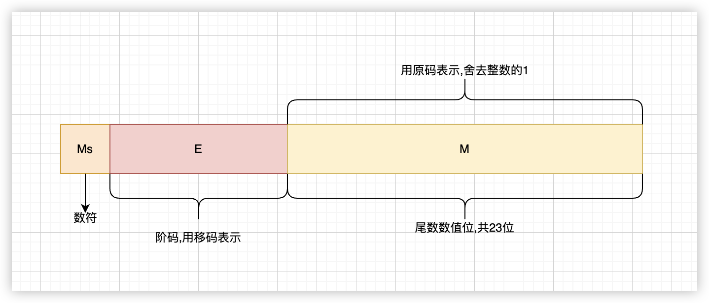
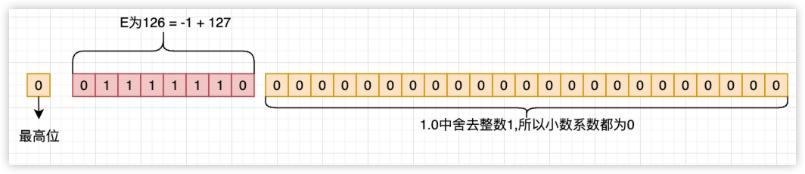
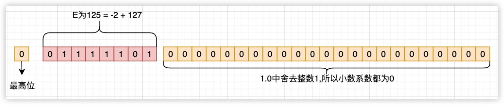
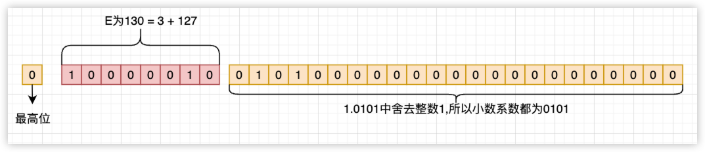

<font size = 4>

# 常量
### let
swift中使用let声明的对象:
1. 声明和初始化可以分开
2. 不能赋值[^ann-init-assign]
```swift
let number = 2          // 直接在声明时初始化

let name : String       // 只声明, 并未初始化
name = "tierry"         // 第1次使用=号时,严格来说是初始化
name = "jerry"          // error, 常量不能修改, 说明上一句是初始化操作


let age: Int
print(age)              // error, age未初始化
age = 20
print(age)              // ok
```

### 类型推导
默认情况下声明并初始化时,可以省略对象的类型, 编译器会帮助推导出来. 但若只声明则必须告诉编译器类型
```swift
let name = "tierry"     // 类型被编译器推导为String 
let age = 20            // Int
let score: Int          // 因为没有初始化, 所以必须告诉编译器类型是什么
```

### c++中的常量
c++中使用const关键字修饰对象被称为常量, 但必须同时声明和定义.
```cpp
void test(){
    const int n1;         // error, 未初始化
    const int n2 = 20     // ok, 后续不能对n2做修改
    const auto n3 = 40    // ok, 类型被推导为int, 也不能修改
}
```

### 常量非常量
标题有点绕. 上述let以及c++中的const所声明的常量可以接收一个非常量的对象, 也就是说:常量对象的值也是不确定的. 以c++来说更为严谨一些:
```cpp
void test(int num){
    const auto n = num;     
}
test(2);
test(3);
```
这种情况下局部对象n其实在栈桢中分配了内存. 所以从这一点来说n的本质就是一个变量. 只是在编译期间用户不能修改n的值. c++对于这种情况下的常量不做特殊优化处理!! 举例来说:

```cpp
void test(int num){
    const auto n = num;     
    int arr[n] = {0};           // error
}
```
这是一个c++中典型的错误. 我们知道c语言中声明数组时必须直接或间接指定数组的大小. 这个大小必须是一个在编译期就能确定的数值. 原因是编译器在编译时必须确定函数的栈空间大小, 而函数栈空间大小有一部分的空间是数组, 所以数组也必须在编译期确定大小, 这就要求数组声明时的下标必须是字面量数值. 对于demo中的n, 它本质上是函数局部变量, 它所存储的值不能在编译期获取到, 因为对于n这块内存必须等到运行时函数栈桢具体在操作系统中内存中真实的位置决定, 所以这就矛盾了, 编译器编译`int arr[n]`时希望n是一个字面量数值以确定大小,进而确定函数栈桢大小, 而n的值却必须在运行时才能真正获取到, 所以报错. 

### c++中的const优化
c++中的const不仅仅是上述表述这样简单, 若初始化时值可以在编译期确定, 则编译器可以做特殊优化
```cpp
void test(int num){
    const int SIZE = 10;
    int arr[SIZE] = {0};        // right
}
```
编译器不会报错!! 对于这种情形下SIZE直接被一个字面量数值初始化, 编译器会做这样的优化:
1. 不再为SIZE分配局部栈空间
2. 函数中出现`SIZE`的地方全部做等价替换, 即`arr[SIZE] == > arr[10]`
这样的常量其实被称为编译期常量, 一般情况下不会为其分配内存, 直接做等价的数值替换, 可以提高效率


### 编译期常量
c++11以前const会不会被优化取决于初始化的方式, c++11后编译器提供了`constexpr`关键字来声明并定义编译期常量. 若不符合规定直接报错
```cpp
int main(int args, char** argv){
    const int a = args;     // 没有问题
    constexpr int b = a;    // 错误, 向编译器声明一个编译期常量, 但a事实上并不能在编译期确定值
    const int c = 2;
    constexpr int d = c;    // 没有问题, c明确是一个字面量数值, 编译器会做优化, 全部替换
    constexpr int e = 20;   // 没有问题
    return 0;
}
```

### swift的优化
对于上述在c++中的流程, 事实上swift也会做同样的事情
```swift
func f2(_ a: Int){
    print(a)
}

func f1(){
    let a = 20
    f2(a)
}

f1()
```
主要看一下f1函数的实现

```bash
swiftc main.swift -o main.out       # 编译
lldb main.out
b f1                                # 
```
在f1函数打断点, 接下来的是x86_64的汇编

```asm
main.out`main.f1() -> ():
->  0x100000e20 <+0>: pushq  %rbp
    0x100000e21 <+1>: movq   %rsp, %rbp                  
    0x100000e24 <+4>: movl   $0x14, %edi                ; 直接有个字段量, 在调用函数前将0x14放到了参数寄存器, 并没有为a开辟一个局部变量 
    0x100000e29 <+9>: callq  0x100000e30               ; main.f2(Swift.Int) -> ()
```

接下来是arm64的汇编
```asm
swift`f1():
    0x100003de4 <+0>:  stp    x29, x30, [sp, #-0x10]!
    0x100003de8 <+4>:  mov    x29, sp
    0x100003dec <+8>:  mov    w8, #0x14                 ; 一样的, 直接是字面量的值
    0x100003df0 <+12>: mov    x0, x8
->  0x100003df4 <+16>: bl     0x100003e00               ; swift.f2(Swift.Int) -> () at main.swift:4
    0x100003df8 <+20>: ldp    x29, x30, [sp], #0x10
    0x100003dfc <+24>: ret   
```

说明swift内部也会对常量初始化方式做优化

# 标识符
### 规则
可以是任何字符, 包括unicode, 但不能以数字开头,不能包含空白字符或其他特殊字符(如箭头)
```swift
func 🦬🍺() { 
    print("6666666")
}
🦬🍺()
```
demo中的函数使用了Unicode字符`🦬🍺`定义了一个函数, 并正确调用打印输出


# 数据类型
### 总分2种
1. 值类型: value type
2. 引用类型:reference type
2者的区别是对象在内存中的区域不同, 值类型位于栈桢(stack frame)中, 相当于局部变量, 整个生命周期由编译器(compr)管理. 引用类型在堆中,它的内存也由swift来管理. swift管理对象内存方式并不是垃圾回收, 而是引用计数, 后续学习到. 

# 整型
### 种类
swift 中表示整数类型有:
- Int8
- Int16
- Int32
- Int64
- UInt8
- UInt16
- UInt32
- UInt64

开发中常用的Int实际会根据当前机器的字长来定义:64位环境下就是Int64, 32位环境下则是Int32. 这一点和OC中NSInteger一样
```objc
#if __LP64__ || NS_BUILD_32_LIKE_64
typedef long NSInteger;
typedef unsigned long NSUInteger;
#else
typedef int NSInteger;
typedef unsigned int NSUInteger;
#endif
```

### 书写格式
和c++中一样:
```swift
let decimal = 15            // 十进制
let binary  = 0b1111        // 二进制
let octal   = 0o21          // 八进制, c++中可以0开头
let hex     = 0xf           // 十六进制
```
在c++中八进制可以以0开头

```cpp
int a = 017;
lb::cout << a << lb::endl;      // 15
```
c++中可以直接在数值后面附加后缀以区分具体的整数类型
```cpp
auto a = 20;                 // int             32或以下
auto b = 20L;                // long            至少大于int
auto c = 20LL;               // long long       64
auto c = 20u;                // unsigned int
auto c = 20ul;               // unsigned long
auto c = 20ull;              // unsigned long long
```

### 范围
在swift中整型并不像c++中作为一个基本类型, 它是标准库基于语言基础下的定义. 现在先不作深入理解.
而是被定义成了struct, 这样做的好处是可以通过数值调用相关的方法. 
```swift
@frozen public struct Int : FixedWidthInteger, SignedInteger {}
```
作为struct当然可以调用相关的方法, 如整数的范围可以直接调用min和max方法
```swift
print(Int64.min)
print(Int64.max)
print(UInt.min)
print(UInt.max)
print(UInt64.min)
print(UInt64.max)
```
上述程序直接使用类型定义的方法来获取相关的范围. 这就是将整数定义成类型的好处之一. 

```bash
-9223372036854775808
9223372036854775807
0
18446744073709551615
0
18446744073709551615
```
同样的操作在c++中就没有这样优雅, 特别是在C中, 一般来说实现相同的效果会定义宏, 如kernel中的代码类似如下:

```cpp
#define UINT64_MAX    (-1ULL)
#define UINT64_MIN    (0)
#define INT64_MAX     (-1ULL >> 1)          
#define INT64_MIN     (-1LL)
```
上述定义64bit的范围是笔者举例说明的, 内核或编译器的标准库中并非真的这样定义. 这里的定义要借助计算机的补码
```txt
以64位来说:

数值        十进制              二进制(补码)
1           1                   0b  0000 0000 0000 0000 0000 0000 0000 0000 0000 0000 0000 0000 0000 0000 0000 0001
-1          -1                  0b  1111 1111 1111 1111 1111 1111 1111 1111 1111 1111 1111 1111 1111 1111 1111 1111
-1>>1       -1>>1               0b  0111 1111 1111 1111 1111 1111 1111 1111 1111 1111 1111 1111 1111 1111 1111 1111

uint64_t.max ===> -1ULL
uint64_t.min ===> 0
int64_t.max  ===> -1ULL 右移 1位 ===> -1ULL >> 1, 因为是无符号,所以汇编层面是不带符号的右移
int64_t.min  ===> -1LL 被编译器解释为带符号的整数
```

### Int
swift中的Int虽然被定义成了struct, 实际结构体的大小却是一个整数空间的大小如64bit. 在做assgin时并没有太多的动态代码. 即使用时效率会有保证. swift会从这几个方面来做优化:
1. 编译期就会检查是否溢出
```swift
let n1 = Int.max + 1                        // error 在编译期就直接报错溢出
let n2 = 0xffffffffffffffffffffffff         // 同上
```

2. 某些操作会做runtime的动态检查
```swift
var a: Int = 0xffff
a += 0xeeee
```
这个需要在调试模式下, 因为在当前的上下文中没有别的代码, 调试模式可以避免代码被优化掉,对应的部分汇编
```asm
swift`main:                                             ; swift环境下自动创建了main函数, 所以用户层面不需要写main函数代码
0x100003f04 <+0>:   sub    sp, sp, #0x40                ; sp = sp - 0x40, 栈桢指针开辟栈空间, 由高向低地址, 所以是减法(40字节), sp指向栈顶
0x100003f08 <+4>:   stp    x29, x30, [sp, #0x30]        ; sp + 0x30的位置存入x29, sp+38存入x30, 即栈桢中最开始的16字节是x30,x29
0x100003f0c <+8>:   add    x29, sp, #0x30               ; x29 = sp + 0x30, 注意x29指向了top + 30的位置, 也就是栈桢中16字节偏移的位置
                                                        ; 这里的x29是栈底寄存器fp, 和sp共同工作构建栈桢
                                                        ; sp指向top(低地址)后, 保存了fp(x29)在栈桢开始的第8字节偏移处(sp+30)
                                                        ;       它此刻存储的是上个函数的栈底地址
                                                        ;       它要在当前的main函数中作为新的栈底(x29 = sp + 0x30)
                                                        ; 所以main函数结束前还原fp可以找到调用main函数的上个函数的栈底

0x100003f10 <+12>:  adrp   x9, 5                        ; 局部对象a中存储数值部分的内存起始地址, 即x9-->&a.data
0x100003f14 <+16>:  str    x9, [sp, #0x8]               ; store register, sp + 0x8存入&a.data
0x100003f18 <+20>:  adrp   x0, 5                        ; x0 -> &a.data
0x100003f1c <+24>:  add    x0, x0, #0x0                 ; x0 未变, x0 -> a 
0x100003f20 <+28>:  mov    w8, #0xffff                  ; w8 = 0xffff
->  0x100003f24 <+32>:  str    x8, [x9]                 ; x9指向的内存存储x8 ==> a.data = 0xffff, 这一步编译器在编译时检查了并未溢出, 所以直接是寻址填充赋值


0x100003f28 <+36>:  add    x1, sp, #0x18                ; x1 = sp + 0x18, x1指向栈桢中的某个地址, 相当于指向了某个局部变量
                                                        ; 仔细分析发现, sp+0x18与sp+0x8(&a.data)相差16字节, 由于sp是栈桢指针, 所以 sp+0x18的地址高于sp+0x8, 所以这2者没有关系
                                                        ; 经过这一步, x1实际指向了a对象的起始地址

0x100003f2c <+40>:  mov    w8, #0x21                    ; w8 = 0x21
0x100003f30 <+44>:  mov    x2, x8                       ; x2 = 0x21
0x100003f34 <+48>:  mov    x3, #0x0                     ; x3 = 0
                                                        ; x1,x2,x3是参数传递寄存器, 
                                                        ; x2是一个固定值(0x21), 这应该可以通过计算得到Int类型的Metadata的地址, 对于struct来说这不同于class, swift中的struct没有继承
                                                        ; 所以在编译期可以直接将Metadata的地址确定在可执行文件中. 从汇编层面来看就是一固定的字面量, 后面到了class时, class的对象中
                                                        ; 有固定的区域来存储metadata的区域, 因为class涉及到继承, 有动态类型的运行时绑定, 所以必须在运行期间记录下它真正的metadata.
                                                        : x3为0, 下面即将调用的 swift_beginAccess

0x100003f38 <+52>:  bl     0x100003f84                  ; symbol stub for: swift_beginAccess
                                                        ; 该函数是swift中访问对象时都会调用的函数, 它需要3个参数:
                                                        ;   x1(指向的对象), 
                                                        ;   x2(目前Int的访问是一个固定的0x21)
                                                        ;   x3目前是0
                                                        ; w8作为一个间接结果地址寄存器, swift_beginAccess可能会将结果的地址填充到w8中(32位是w8, 64是x8)

0x100003f3c <+56>:  ldr    x8, [sp, #0x8]               ; x8 = &a.data
0x100003f40 <+60>:  ldr    x8, [x8]                     ; x8 = a.data, 即0xffff
0x100003f44 <+64>:  mov    w9, #0xeeee                  ; x9 = 0xeeee
0x100003f48 <+68>:  adds   x8, x8, x9                   ; x8 = x8 + x9, 即加法
0x100003f4c <+72>:  str    x8, [sp, #0x10]              ; sp + 0x10 存入计算的结果, 注意 这一步并不是直接将结果赋值回a(sp + 0x8)

0x100003f50 <+76>:  cset   w8, vs
0x100003f54 <+80>:  tbnz   w8, #0x0, 0x100003f80     ; <+124> [inlined] Swift runtime failure: arithmetic overflow at <compiler-generated>
0x100003f58 <+84>:  b      0x100003f5c               ; <+88> at main.swift

                                                        ; 上面是在检查加法后的溢出,如果溢出(tbnz)中直接会结束程序

0x100003f5c <+88>:  ldr    x8, [sp, #0x10]              ; 到这里表示计算没有溢出, x8 = sp + 0x10, 即x8 = 加法的结果
0x100003f60 <+92>:  adrp   x9, 5                        ; x9 = &a.data
0x100003f64 <+96>:  str    x8, [x9]                     ; a.data = x8 ==> a.data存储计算结果的值
0x100003f68 <+100>: add    x0, sp, #0x18                ; 后面要标记访问 swift_endAccess, 它需要一个参数, x1 = sp+0x18, 在前面swift_beginAccess时, 也传递过x1, 现在不深究这2个函数
0x100003f6c <+104>: bl     0x100003f90               ; symbol stub for: swift_endAccess
                                                        
                                                        ;后面是结束当前栈桢回到上一个函数
0x100003f70 <+108>: mov    w0, #0x0
0x100003f74 <+112>: ldp    x29, x30, [sp, #0x30]
0x100003f78 <+116>: add    sp, sp, #0x40
0x100003f7c <+120>: ret    
0x100003f80 <+124>: brk    #0x1
```
从汇编可以看出, 虽然Int是一个struct类型, 但是对其对象作操作时:
1. 若是字面量, 会直接在编译期就检查是否溢出
2. 若`+=`操作时, 会先调用`swift_beginAccess`后, 再做加法运算, 并且会做运行时的溢出检查
所以综合来看swift使用Int时, 单纯的assgin操作会有不同的流程. 能在编译期检查溢出的会直接报错, 不能在编译期的会推迟到运行时, 如demo中的`+=`, 并且会访问相关的函数. 这一切的操作是为了安全考虑,所以牺牲了效率.

相对于c++来说, 既不会在编译期做溢出检查(会有警告), 也不会在运行时做动态检查. 相同的操作只会有add相关的加法指令, 不会有其他不相关函数的调用, 所以效率要高很多. 但不安全, 这就要求程序员自己来平衡安全和性能. 相同的cpp代码汇编如下:
```cpp
int main(void){
    int a = 0xffff;
    a += 0xeeee;
}
```

```asm
cpp`main:
    0x100003f7c <+0>:  sub    sp, sp, #0x10
    0x100003f80 <+4>:  mov    w0, #0x0
    0x100003f84 <+8>:  str    wzr, [sp, #0xc]
    0x100003f88 <+12>: mov    w8, #0xffff           ; w8 = 0xffff
    0x100003f8c <+16>: str    w8, [sp, #0x8]        ; a = 0xffff
->  0x100003f90 <+20>: ldr    w8, [sp, #0x8]        ; w8 = 0xffff
    0x100003f94 <+24>: mov    w9, #0xeeee           ; w9 = 0xeeee
    0x100003f98 <+28>: add    w8, w8, w9            ; w8 = w8 + w9
    0x100003f9c <+32>: str    w8, [sp, #0x8]        ; a = w8
    0x100003fa0 <+36>: add    sp, sp, #0x10
    0x100003fa4 <+40>: ret    
```
c++执行这一系列的操作很简洁. 所以效率上要高很多. 但安全性要靠程序来自己来保证, 可能要在写代码时, 自己加上溢出的判断, 那这就复杂了, 或者选用大空间的类型


# 字面量
### 介绍
其实字面量就是编译期常量. swift中的字面量如下:

|字面量|类型|举例|
|:-|:-|:-|
|true|Bool|`let a: Bool = true`|
|false|Bool|同上|
|15|十进制|`let a = 15`|
|0xf|十六进制|`let a = 0xf`|
|0o17|八进制|`let a = 0o17`|
|0b1111|二进制|`let a = 0b1111`|
|`125.0`|Double|`let a = 125.0`|
|`1.25e2`|Double|`let a = 1.25e2`等价于`125.0`|
|`0xfp2`|Double|`let a = 0xfp2`等价于`0xf * 2^2 ==> 60.0`|
|`"hello"`|String|`let a = "hello"`|
|`"hello"`|Character[^ann-char]|`let a: Character= "hello"`|

### 数值的额外表示
1. 可以添加下划线表示的更直观
2. 可以在前缀添加0
```swift
let n1 = 100_0000       // 1000000, 一百万, 我们习惯表示的方法
let n2 = 1_000_000      // 1000000, 一百万, 西方习惯表示的方法

print(n1 == n2)         // true


let d1 = 00123.456      // 前缀加0没有问题
let d2 = 123.456        
print(d1)               // 打印时不会输出前缀的0
print(d1 == d2)         // true
```
> Double也可以在中间合适的位置添加下划线


# 进制
### 概念
生活中我们使用的数值默认都是十进制,严格来说是不对的, 因为没有指明数值的进制. 如`100`, 单纯的看这个字面值直观的认为它就是十进制, 因为我们最熟悉. 但它也可能是二进制(4). 

以十进制100为例准确来说完整的表达:
> $1 \times 10^2 + 0 \times 10^1 + 0 \times 10^0$

而数学上规定了:
- $10^0$等于1
- $10^1$等于10
- $10^2$等于100

所以求和的结果就是100, 也就是说`100`这个字面量实际上是一个数学表达式求和的结果展示. 日常是直接忽略了求和的过程(十进制). 当以二进制来解释它的时候, 表达式变成了:

> $1 \times 2^2 + 0 \times 2^1 + 0 \times 2^0$

同样数学规定了:

- $2^0$等于1
- $2^1$等于2
- $2^2$等于4

所以求和的结果是4. 这里面忽略了2个问题: 10的次幂以及2的次幂中的10和2是规定的10进制, 说白了就是2的次幂中的2表示的是十进制中的2, 因为只有这样二进制和十进制之间才能进行转换; 第2个就是系数必须小于基数

> 总结: 数值`100`本身没有意义, 以生活中常见的十进制解释它, 它就是熟悉的100. 当使用二进制解释它时, 它的求和结果是4, 当然基数2被规定为十进制的2, 不然没有意义. 


计算机实现的机制就是二进制, 所以需要将十进制转换成二进制表示, 还是以`100`这个数值为例: 二进制求和的结果是4, 将这个求和的过程逆向过来就是4变成二进制的过程. 怎么将求和的过程逆向是值得思考的一个问题!! 后续的小节笔者将从简单到深入实现这个算法, 这能解释为什么十进制到二进制的转换是整除求余的过程


### 系数和基数
先来介绍几个数学概念:

$Coefficient \times Base^{Power} = Result$ 

1. Coefficient: 是表示系数
2. Base:基数
3. Power:指数
4. Result:结果, 也称幂

> $0 \leq Coefficient < Base$, 逆向表示(当不为0时对数才有意义)

$\log_{Base}(Result \div Coefficient) = Power$ 

等效于:

$\log_{Base}(Result) + log_{Base}(\frac{1}{Coefficient}) = Power$ 

等效于:

$\log_{Base}(Result) + log_{Base}(Coefficient^{-1}) = Power$ 

等效于:

$\log_{Base}(Result) - log_{Base}(Coefficient) = Power$ 

这里的公式表示第N位的转换(从第0位开始记), 举例来说800:

> $8 \times 10^{2} = 800$

表示第2位的计算, 现在明确条件和求值

```txt
条件:
    Power:  2
    Base:   10
    Result: 800
    Coefficient ==> (0,10)

求
    Coefficient???
```
根据公式, 转换为对数:

$\log_{10}(800) - log_{10}(Coefficient) = 2$ 

等效于

$\log_{10}(8 \times 100) - log_{10}(Coefficient) = 2$ 

等效于

$\log_{10}(100) + log_{10}(8) - log_{10}(Coefficient) = 2$ 

等效于

$log_{10}(8) = log_{10}(Coefficient)$ 

即: Coefficient等于8, 事实上没有这么复杂, 从逻辑上就可以得出结论: 因为 800 这个值就是以第2位(Power)为准10为基数(Base)乘以一个小于10的系数(Cefficient)计算出来的, 所以$2 \leq log_{10}(800) < 3$ 一定成立, 设$x \in (0,10)$, 所以$0 < log_{10}(x) < log_{10}(10)$, 一定有$2 + log_{10}(x) = log_{10}(800)$ 等效于 $log_{10}(100) + log_{10}(x) = log_{10}(800)$ 等效于$log_{10}(100 * x) = log_{10}(800)$, 所以x等于8, 代入等式$2 + log_{10}(8) - log_{10}(Coefficient) = 2$, 所以Coefficient为8. 将这里的第2位扩展为第N位:

> <font color = red>$Coefficient \times 10^N = Result$</font> 等效:
> 
> <font color = red>$log_{10}(\frac{Result}{Coefficient}) = N$</font> 等效:
>
> <font color = red>$log_{10}(Result) - log_{10}(Coefficient) = N$</font>
>
> 因为<font color = red>$log_{10}(Result) \in [N, N + 1)$</font>, 则有:
>
> <font color = red>设$x \in (0, 10)$</font>, 所以: <font color = red>$0 < log_{10}(x) < log_{10}(10)$</font>, 则有:
>
> <font color = red>$log_{10}(10^N) + log_{10}(x) = log_{10}(Result)$</font>, 代入等式:
>
> <font color = red>$log_{10}(10^N) + log_{10}(x) - log_{10}(Coefficient) = N$</font>,等效
>
> <font color = red>$x = Coefficient$</font>

上述过程并不是在证明一个结论,相反是知道一个结论<font color = red>$Coefficient \in (0, 10)$</font>的前提下做无聊的对数转换罢了, 事实上满足<font color = red>$Coefficient \div Base = 0 \cdots Coefficient$</font>将这个Base扩展为2时也是成立的, 只不过条件变成了<font color = red>$Coefficient \in (0, 2)$</font> 


### 系数序列
那知道上面这些有什么用呢? 对于一个数值, 若是知道它的每个位的系数, 然后按顺序排列起来后, 就是这个数. 这不是费话吗? 以800来说, 我们的眼睛看上去就知道它的系数是`8`,`0`,`0`, 但有没有想过, 其实人脑也是经过了计算才得到的了这个结果, 我们要做的就是将人脑计算的过程使用算法表达出来. 即给计算机一个数值, 让它展示出所有的系数出来. 具体的应用就像标准C库中的`print("%d", 100)`一样, 将数字转换成字符串


以十进制下的12345为例:
```txt
分析:
    如果明确知道当前数字是多少位, 则非常简单
        1. 第4位1: 12345 / 10^4 = 1 ... 2345
        2. 第3位2: 2345  / 10^3 = 2 ... 345
        3. 第2位3: 345   / 10^2 = 3 ... 45
        4. 第1位4: 45    / 10^1 = 4 ... 5
        5. 第0位2: 5     / 10^0 = 5 ... 0
    
    但事实是不知道数值是多少位的, 所以可以根据上面的结论:系数只与基数相关.
    直接将这5个位的数值单独看待, 那现在就是怎么从12345中拿出每一位, 这就很简单了
        1. 12345 / 10 = 1234 ... 5      取出了第0位5, 做 5 / 10 = 0 ... 5, 所以5就是结果
        2. 1234  / 10 = 123  ... 4      同上, 结果是4
        3. 123   / 10 = 12   ... 3      同上
        4. 12    / 10 = 1    ... 2      同上
        5. 1     / 10 = 0    ... 1      同上
    
    可以发现只用取出第N位就可以了
```

相关的算法 <a id="demo-get-coefficient"/>
```swift
let DIGITOAL: [Character] = [
    "0",
    "1",
    "2",
    "3",
    "4",
    "5",
    "6",
    "7",
    "8",
    "9",
]
let BASE: UInt64 = 10       // __code_base

func coefficient(number: UInt64) -> [Character]{
    var n = number
    var result = Array<Character>()
    repeat{
#if false
        // 使用方法转换
        result.append(String(n % BASE).first!)
#else
        result.append(DIGITOAL[Int(n % BASE)])
#endif
        n /= BASE

    }while n != 0

    return result.reversed()
} 
```

### 十进制转二进制
对于任何一个十进制的整数都能表示成

> $N = c_02^0 + c_12^1 + \cdots + c_{i-1}2^{i-1} + c_i2^i + \cdots + c_n2^n$, 其中$c_i \in [0, 2)$ 即:
> 
> $\sum_{i=0}^{n}{c_i2^i}$
>
>$c_i$表示Coefficient系数

根据前面的对数转换$c_i2^i$中的$c_i$单独看时只和基数有关, 则现在的场景是

```txt
条件:
    1. 十进制数 1234

求:
    二进制表示的序列
```

根据前面的流程, 结果只需求出每一位上的$c_i$组织起来. 
1. 一定有$1234 < c_i2^i$的情况, 即$1234 < 2^i$, 
2. 第$i - 1$位一定是它的最高位, 并且是1

所以$i = log_2(1234) + 1$, 算法表示就是不断整除2到0为止. 下一步就是要舍去最高位, 将余下的数字做相同的操作

```txt
1234                对1234不断整除2, 假如i = 10,         则最高位是i-1, 即第9位是1      
n2 = 1234 - 2^9     对n2  不断整除2, 假如i = 7,          则最高位是i-1, 即第6位是1, 则其他位[7,8]是0
n3 = n2 - 2^6       对n3  不断整除2, 假如i = 4,          则最高位是i-1, 即第3位是1, 则其他位[4,6]是0
.
.
.
nk = 0              结束
```
> 相关的算法如下
```swift
let BASE: UInt64 = 2        

func coefficient2(number: UInt64) -> [Character]{
    if number == 0 {
        return ["0"]
    }

    // 事先准备64个字符占位, 初始化为0
    var result = Array<Character>.init(repeating: "0", count: 64)

    var n = number
    repeat {
        var cur = n             // 当前最大数
        
        var i = 0               
        repeat {
            cur >>= 1           // 当前最大数不断整除2
            i += 1              // 计数
        }while cur != 0

        result[i - 1] = "1";    // 当前最大数最高位已找到, 满足 c^(i) > cur, 所以第i-1位为1

        n -= (1 << (i - 1))     // 舍去最高位, 下一轮从次最高位做上面循环中同样的操作
    }while n != 0
    

#if true
    var sort_arr: [Character] = Array()

    // 填充好的result数组中, 从后面往前数, 1开始的位置一定是最高位
    // 所以从后往前遍历到第0个, 就是number的二进制系数的序列
    for i in stride(from: result.lastIndex(of: "1")!, to: -1, by: -1) {
        sort_arr.append(result[i])
    }
    return sort_arr
#else
    // 使用自带的数组处理, 结果和上面的效果一样
    return Array(result.prefix(result.lastIndex(of: "1")! + 1)).reversed()
#end
}
```
上面的算法是从最高位往低位, 整个过程要不停的重复整除2, 算法的复杂度较高, 影响效率. 其实还可以从低位到高位, 因为实际并不知道数值的位数. 

首先要明白: 一定存在一个`ifnubmer = 0b1001001`(<font color = red>瞎写的,但一定存在</font>)的二进制的系数序列等效于1234这个十进制的数值. 所以逻辑上1234就是ifnumber, 同前面[demo](#demo-get-coefficient)中取系数的基本流程不变, 但基数变为2
```txt
1234   === ifnubmer(一个存在的二进制系数序列) 
    1. n1 = ifnumber / 2        商@1        余@1
    2. n2 = (n1-商@1)/ 2        商@2        余@2
    3. n3 = (n2-商@2)/ 2        商@3        余@3

    .
    .
    .

    i ni = (n(i-1)-商@(i-1))/ 2 商@i        余@i
```

直接将[demo](#demo-get-coefficient)中的`__code_base`改为`2`就没问题了, 这就是网上流传的十进制到二进制转换的算法逻辑, 经过笔者的介绍应该很清楚原理了


### 十六进制
当基数改为为16时, 上述转换运算也是成立的. 为了和十进制区分开, 十六进制系数如下:

|系数|对应十进制|
|:-|:-|
|0|0|
|1|1|
|2|2|
|3|3|
|4|4|
|5|5|
|6|6|
|7|7|
|8|8|
|9|9|
|A|10|
|B|11|
|C|12|
|D|13|
|E|14|
|F|15|

> 可以使用小写. 

十六进制主要是方便二进制的阅读. 因为十六进制的每个系数都可以使用最多不超过4个bit的二进制来表示. 所以一个字节可以存储两位十六进制的系数序列. 通过二进制直观上更容易转换成十六进制

```swift
let binary: Int = 0b1100_0101       // 等效于
let hex   : Int = 0xc5              // 将二进制的每4位看作十六进制, 计算出和的结果就是十六进制数值
```

### 八进制
和上面一样的流程


# 整数存储
### 引导补码
前面提到过, 计算机中的数据都是二进制. 这里不提及文件, 因为文件中的数据都是字符串, 要考虑的是语言环境下的整数.

在编写代码的过程中, 所有键入的十进制整数会被编译器直接转换成二进制的系数[^ann-compr-covert-int]序列存储在内存中. 实际上编译器也是做了[demo](#demo-get-coefficient)同样的事情. 所以理论上可以直接读取整数对象所在的内存, 以查看该整数实际的存储格式. 下面以c++来做说明

<a id="link-addr-info"/>

```cpp
#if 0
    short number = 0xabcd
    地址:     0x00    0x01
    小端:     cd      ab
    大端:     ab      cd
    是否是小端存储: true(是)
#endif
static inline constexpr bool IS_LITTLE_ENDIEN(void){        //这段代码会被编译器直接优化为 return true或return false, 并且是inline的
    return ({
        union{
            short data = 0x1;
            bool  _;
        } _ ;
        _;
    })._;
}

// 所有的整数类型, 封装好直接用
template <typename T = unsigned long long>
class Union{
public:
    using value_type    = T;
    using chunk_t       = uint8_t;
    static constexpr size_t bytes = sizeof(T) / sizeof(chunk_t);
    Union(const T& t):data(t){}

    // 友元函数
    template<typename Int, template<typename> class _U>
    friend lb::ostream& operator << (lb::ostream& cout, const _U<Int>& a);


private:
    // ptr的内存和data是公用的, 所以可以直接以ptr开始一个字节一个字节的读
    union{
        T           data;
        chunk_t     ptr[Union::bytes];
    };
};

// 打印内存
template<typename Int, template<typename> class _U>
lb::ostream& operator << (lb::ostream& cout, const _U<Int>& u){
    using Union_t = _U<Int>;
        cout    << "<"
                << (void*)(lb::cbegin(u.ptr))
                << ","
                << (void*)(lb::cend(u.ptr - 1))     // 不包含尾部
                << ">:";

    // 打印时地址 从低到高
    // 小端直按地址顺序打
    if(IS_LITTLE_ENDIEN()){
        lb::for_each(lb::cbegin(u.ptr), lb::cend(u.ptr), [](const auto& chunk){
            lb::cout << lb::bitset<sizeof(typename Union_t::chunk_t) * 8>((chunk)) << "\t";
        });
        return cout;
    }

    // 大端要对当前地址做逆序打印
    lb::for_each(lb::crbegin(u.ptr), lb::crend(u.ptr), [](const auto& chunk){
        lb::cout << lb::bitset<sizeof(typename Union_t::chunk_t) * 8>((chunk)) << "\t";
    });
    return cout;
}


int main(void){
    lb::cout << Union(0xabcd) << lb::endl;
    lb::cout << Union(0xabcdull) << lb::endl;
    lb::cout << Union(0xabcdll) << lb::endl;
    short b = 20;
    lb::cout << Union(b) << lb::endl;
    return 0;
}
```

通过这个小程序可以测试出对象在内存的数据. 上述这个架构比较繁琐, 实际架构中需要将`data`和`ptr`分开. 利用c++11的可变参数.

```cpp

template<typename T = int>
struct mem{
    mem(const T& data):data(data){}

    // 类型转换函数, 强制转成string时可以触发
    operator lb::string() const{
        using PTR_T = uint64_t;
        lb::ostringstream out;

        out << "<0x"

            << lb::hex

            << reinterpret_cast<PTR_T>(this)        // 将自己转换成地址, 使用reinterpret表示原封不动的将地址转换过来

            << ", 0x"

            << lb::hex

            << reinterpret_cast<uint64_t>(this) + sizeof(mem) - 1

            << ">:";

            this->ip.get(out);

        return out.str();
    }

private:
    //内部类, 相当于上一个的 chunk_t ptr[xx]
    template<size_t _idx>struct idx;
    template<>struct idx<0>{
        lb::ostringstream& get(lb::ostringstream& out) const{return out;}
    };

    template<size_t _idx>
    struct idx : idx<_idx - 1>{
        uint8_t addr;

        lb::ostringstream& get(lb::ostringstream& out) const{
            IS_LITTLE_ENDIEN()  
                ?   (idx<_idx - 1>::get(out), out << lb::hex << (unsigned)this->addr << "    ")
                :   (out << lb::hex << (unsigned)this->addr << "    ", idx<_idx - 1>::get(out));
            return out;
        }
    };

public:
    union{
        T data;
        idx<sizeof(T)> ip;
    };
};

//lb::cout << static_cast<lb::string>(mem(0x12345678)) << lb::endl;
```

上面这个是实现起来更清晰, 以16二进制的格式打印, 其实在C语言中实现更简单, 但丧失了灵活性

```cpp
#define Int_1() int _1:8
#define Int_2() Int_1(); int _2:8
#define Int_3() Int_2(); int _3:8
#define Int_4() Int_3(); int _4:8
#define Int_5() Int_4(); int _5:8
#define Int_6() Int_5(); int _6:8
#define Int_7() Int_6(); int _7:8
#define Int_8() Int_7(); int _8:8

#define Int(N) struct { Int_##N(); }

template<typename Integer>
struct mem{
    mem(Integer i):data(i){}
    union{
        Integer data;
        Int(8);
    };
};


int main(void){
    auto m = mem(0x12345678);
    lb::cout << &m << lb::endl;
    lb::cout << lb::hex << m._1 << "   ";
    lb::cout << lb::hex << m._2 << "   ";
    lb::cout << lb::hex << m._3 << "   ";
    lb::cout << lb::hex << m._4 << "   ";
    return 0;
} 
```

这种实现利用了编译器的位域, 但不能在编译期间固定好实际大小的内存, 这里固定的是一个64位机器指针大小的空间. 注意还是要区分大小端, 这里省略了


### 负整数
计算机是做计算的, 所以一定遵循$a + (-a) = 0$, 以数值1为例, 它在内存中存储

> 0b 0000 0000 0000 0000 0000 0000 0000 0000 0000 0000 0000 0000 0000 0000 0000 0001

要满足$1 + (-1) = 0$, 则`-1`的格式必须为:

> 0b 1111 1111 1111 1111 1111 1111 1111 1111 1111 1111 1111 1111 1111 1111 1111 1111

也就是说-1在内存中存储的全是1. 实际上由1去计算-1是这样一个过程:

- 对1所有位取反

> 0b 1111 1111 1111 1111 1111 1111 1111 1111 1111 1111 1111 1111 1111 1111 1111 1110

- 为了保证相加为0, 而当前取反后相加后结果全是1不为0, 逻辑上是不对的. 若想得到0必须再加1, 所以才得到-1的存储全是1. 这可以扩展到所有的负数. 如5对应的二进制是

> 0b 0000 0000 0000 0000 0000 0000 0000 0000 0000 0000 0000 0000 0000 0000 0000 0101

按取反加1后, -5应该是

> 0b 1111 1111 1111 1111 1111 1111 1111 1111 1111 1111 1111 1111 1111 1111 1111 1011

在计算机中, 整数存储就是原码, 即二进制的系数序列. 而对应的负数为了满足正负相加为0,则是取反加1后存储. 这种存储叫补码. 

### 补码
因为正负相加为0, 所以补码诞生了. 为什么计算机中不使用取反操作存储负数?? 试想一下, 一个正数在数学中取相反数的过程和计算机中取反不是一回事. 如果直接取反, 则$+0$和$-0$在计算机中会有2个值:

> 正0:  0
>
> -0:   0b 1111 1111 1111 1111 1111 1111 1111 1111 1111 1111 1111 1111 1111 1111 1111 1111

而正0和负0本质上就是0, 这种直接取反逻辑上就错了, 并且直接取反后和对应的负数相加视觉上不为0, 计算机硬件当然可以内部再做1次转换再加1使结果为0, 但这样硬件复杂性将大大提高, 所以直接以取反+1变补码是最合适的, 并且这样的情况下0对应的补码还是0, 这都是符合逻辑的


# 浮点
### 二进制小数
前面所学习的都是整数,理解起来比较简单. 现在来看小数怎么转换的. 结论仍然适用:

> $N = c_{-n}2^{-n} + \cdots + c_{-i}2^{-i} + \cdots + c_02^0 +  \cdots + c_i2^i + \cdots + c_n2^n$, 其中$c_i \in [0, 2)$ 即:
> 
> $\sum_{i \in (0, n)}^{n}{c_i2^i}$
>
>$c_i$表示Coefficient系数

还是以十进制的0.12345来说: 它的系数值还是12345, 要做的工作和以前一样, 还是取出每1位的数值对10取余, 大致过程:

```txt
0.12345         取最高位有效位, 0(int)(0.12345)             0 % 10      0

舍去最高位0, 怎么舍去是一个问题?? 
    想要的效果是小数部分的1变成最高位, 根据前面的结论, 系数只和基数有关, 所以可以直接将小数点向右移1位

乘以10舍去最高位 0.12345 * 10 - 0*10
1.2345          取最高位有效位, 1(int)(1.2345)              1 % 10      1

乘以10舍去最高位 1.2345 * 10 - 1 * 10
2.345           取最高位有效位, 2(int)(2.345)               2 % 10      2

乘以10舍去最高位 2.345 * 10 - 2 * 10
3.45            取最高位有效位, 3(int)(3.45)                3 % 10      3

乘以10舍去最高位 3.45 * 10 - 3 * 10
4.5             取最高位有效位, 4(int)(4.5)                 4 % 10      4

乘以10舍去最高位 4.5 * 10 - 4 * 10
5.0             取最高位有效位, 5(int)(5.0)                 5 % 10      5

乘以10舍去最高位 5.0 * 10 - 5 * 10
0.0             取最高位有效位, 0(int)(0.0)                 0 % 10      0


后续是无限循环0
```
所以系数序列是: <font color = red>000000...0543210</font>, 表示成小数记数就是`0.123450...000000`

> $0 \times 10^{-n} + \cdots + 5 \times 10^{-5} + 4 \times 10^{-4} + 3 \times 10^{-3} + 2 \times 10^{-2} + 1 \times 10^{-1}$

这个过程可以扩展到二进制, 还是以前一样的思路:以十进制$0.12345$来说一定存在`ifnumber = 0.001001101`(<font color = red>瞎写的, 但一定存在</font>)二进制格式的系数序列与其对应, 所以逻辑上十进制求小数系数序列的过程和二进制一模一样. 算法的描述就是:
1. ifnumber(或者$0.12345$)乘以2, 取整数部分
2. 余下的小数部分做第1步同样的操作


<a id="link-binary-coefficient"/>

```swift
let DIGITOAL: [Character] = [
    "0",
    "1",
    "2",
    "3",
    "4",
    "5",
    "6",
    "7",
    "8",
    "9",
]
let BASE: UInt64 = 2

func coefficient(number: UInt64) -> [Character]{
    var n = number
    var result = Array<Character>()
    repeat{
        result.append(String(n % BASE).first!)
        n /= BASE

    }while n != 0
    return result.reversed()
}


func coefficient3(number: Double) -> String{
    var int         = Int(number)
    let int_depart  = coefficient(number: UInt64(int))  //整数系数

    var double      = number - Double(int)
    var double_depart = Array<Character>()

    // 笔者这里规定小数部分最多算64位, 因为根据算法小数部分可能有无限的0循环, 也可能十进制到二进制转换中小数部分无限循环
    var count = 0
    repeat {
        double  *= Double(BASE)                 // 乘2取整
        int     = Int(double)

        double_depart.append(DIGITOAL[int])     // 直接记录系数到数组
        
        double  -= Double(int)                  // 舍去最高位
        count   += 1                            // 计数
    }while count != 64

    var result = ""

    // 附加整数系数序列
    if !int_depart.isEmpty {
        result = (int_depart.map { String($0) }).joined()
    }


    // 去掉小数尾部的0
    // else说明小数部分全是0, 没有意义
    if let idx = double_depart.lastIndex(of: "1") {
        double_depart = Array(double_depart.prefix(idx + 1))
    }
    result += "."
    result += (double_depart.map{String($0)}).joined()

    return result
}
print(coefficient3(number: (0b1010101011 + 0.4)))
// 1010101011.0110011001100110011001100110011001100110011
```

> 以上是使用swift的实现过程, 其他语言是一样的

笔者解释一下为什么$12345$处理十进制, ifnumber处理二进制逻辑是一样的!! 因为$12345$本身是一个没有意义的数值, 当以十进制解释它时,它满足十进制数的所有计算理论. 因为进制之间的基准以人们规定的十进制, 即常常说的二进制其实是在十进制已经存在的基础之上, 所谓的二进制本质是以十进制的计算理论计算出来的系数表达式, 所以当ifnumber是由$12345$计算出来的二进制系数表达式时, 2者就是一样的, 我既可以拿$12345$整除10取得十进制系数表达式, 也可以整除2取得二进制系数表达式. 同理也可以拿ifnumber整除10取得十进制系数表达式, 也可以整除2取得二进制系数表达式

### 无法精确
这个从数学理论来看, 所有小数都是不精确的, 严格来说是所有实数.

$c_{-i}a^{-i} + ... + c_0a^0 + ... + c_ia^i = N$

以12345十进制来解释, 完整的写法是:`12345.00...0000`, 只不过数学理论上后续所有小数的系数0没有参与计算的意义. 所以可以看作是精确的. `0.4`以十进制来解释可以看作是精确的, 但以二进制解释(ifnumber)是一个无限循环的小数<font color = red>`0.0110011001100110011001100110011001100110011`</font>以`0011`循环, 这是因为`0.4`这个字面数值由二进制来解释时, 即实际上存在对应的ifnumber这个二进制系数序列无法取完所有的系数. 当然证明对应0.4在二进制下的系数序列是无限循环的这个事情要由数学家去做了. 只需要明白所有的小数以二进制表示时, 都不可能是精确的. 像上面的算法, 最多算到64位

# 浮点
### 科学计数
所有的小数都可以转换成标准的科学计数, 如$9.01234 \times 10^2 = 901.234$, 抽象成表达式:

> $M \times 10^{e} = N$

- M是有效数部分,对应`9.01234`, 也称尾数 
- e表示阶数(指数), 是一个整数值

M必须小于10: 如$90.1234 \times 10^1 = 901.234$并不是标准的科学计数, 这种情况下需要将小数点左移一位(相当于除以10), 为了使整个数值不变, 需要再在e的基础上做加1(乘以10), 将这个表达式扩展成任意进制则:

> $M \times B^{e} = N$
- B表示Base基数

也必须满足:$1 \leq M < Base$, 现在来谈论Base为2的情况, 也就是二进制小数. 所以$M \in [1,2)$, M可以写成`1.xxxxxx`

为了讨论方便, 这里做以下格式规定:
```txt
小数 = 阶码符号 + 阶码数值 + ⊕ + 尾数符号 + 尾数数值

e: 阶码正, 不可省略
E: 阶码负, 不可省略

s: 尾数正, 不可省略
S: 尾数负, 不可省略

PS:
    > 所有的存储是二进制表示
    > 阶码区域由符号和数值构成补码存储, 是整数
    > 尾数区域由符号和数值构成补码存储, 是小数

笔者会给出一个省略补码的书写格式:

如阶码:
    > 阶码为-2时, 笔者会写成E10 
    > E为负, 10是原码为2, 这样容易看
    > 实际存储的是补码: 11111110


如尾数:
    > 尾数为-1.011(原码表示), 笔者会写成 S1011, 
    > S为负, 1011的系数序列直接写, 这样容易看
    > 实际存储的是补码: 00001011 ==> 11110100 ==> 11110101
    > S1011根据科学计数, 所以是 -1.011
```

如$e2\oplus{s1.001}$ 表示$+1.001 \times 2^2$, 现在来自定义存储在1个字节中:

```txt
bit     7   6   5   4   3   2   1   0
        0   1   0   0   1   0   0   1
        e           s
```

- 第7位表示阶码的符号
- 第4位表示尾数的符号

如$e2\oplus{s1.0011}$ 表示$1.0011 \times 2^2$, 对应的存储就应该:

```txt
bit     7   6   5   4   3   2   1   0
        0   1   0   0   1   0   0   1   1
        e           s
```
不够了, 这个时候应该充分考虑科学计数法的规律: 因为科学计数法中二进制的整数部分一定为1, 可以考虑直接舍去. 所以:
```txt
bit     7   6   5   4       3   2   1   0
        0   1   0   0   1   0   0   1   1
        e           s  整数
                       舍去
``` 

笔者这里不讨论上述自定义模式下M为负数的情况, 直接来看`IEEE754`的存储标准


### IEEE 754a


以上是float的浮点存储格式

- Ms为有效数的符号位
- M的存储中表示的是原码, 因为符号位单独拿开了
- M不存储整数部分1
- M的位数为23位, 意味着M的范围是$[0.00.. , 0.11...]$
- 规定的E是一个无符号, 所以$E \in [0,255]$, 但实际中指数可能是负的, 所以写代码时我们的范围是$e \in [-127, 128]$, 但存储到计算机内部时, 因为规定E要为无符号存储, 所以要做偏移, 为了使$[-127, 128]偏移到达$[0,255]$所以得加上127, 就白了就是写代码指定`-2`, 实际存储的是`-2 + 127`

特殊规定:
1. E=0且M=0, 则整个浮点是确定的0
2. E=0且M!=0, 则强制规定整数部分为0, 为非规格化. 这里不讨论这种情况
3. $E \in [1, 254]$, 是最常用的, 浮点的结果为$-1^{s} \times 1.M \times 2^{E-127}$
4. E=255且M!=0, 则规定为`NaN`, 不是一上数字(not a number)
5. E=255且M=0, 正无穷或负无穷, 具体看符号位


### 浮点的范围
根据上述规定,可以计算出浮点的范围, 以float为例:

|最值|备件|表达式|化简结果|
|:-|:-|:-|:-|
|最小|E=1 && M=0|$1.0 \times 2^{1-127}$|$2^{-126}$|
|最大|E=254 && M=$0.111...$(23个1)|$1.M \times 2^{254-127}$|$2^{127} \times (2 - 2^{-23})$ |

> 这里对应的是正常的操作, 即$E \in [1, 254]$的正常情况, 现在来转换这个范围:


$2^{-126} = 8^{-42}$, 设$10^x = 8$, 则$x = log_{10}8 \approx 0.903$, 即$8^{-0.903 \times 42} \approx 10^{-37.926} \approx 10^{-38}$

$2^{-23} \approx 0$, 所以$\approx 2^{128} = 2^{126} \times 4 \approx 4 \times 10^{38}$

很多教材给出的是$[-3.4 \times 10^{-38}, 3.4 \times 10_{38}]$, 其实直接取的指数范围为$[2^{-127}, 2^{127}]$, 笔者这里取的是$[-126, 127]$并且算的更精确


### double
double的存储格式和float一样, 不同的是:
- E为11位, 范围是$E \in [0, 2046]$, 移码的偏移为1023
- M的位数是52位

|最值|备件|表达式|化简结果|
|:-|:-|:-|:-|
|最小|E=1 && M=0|$1.0 \times 2^{1-1023}$|$2^{-1022}$|
|最大|E=2046 && M=$0.111...$(52个1)|$1.M \times 2^{2046-1023}$|$2^{1023} \times (2 - 2^{-52})$ |

> 临界值的判断以double中的E范围的边界, 关于double的范围就不说了


### 展示浮点的内存
通过浮点的存储规定, 现在在编译器中验证, 如0.5
1. 0.5的二[进制位](#link-binary-coefficient): $0.1$
2. 科学计数: $1 \times 2^{-1}$
3. 计算指数: $E = -1 + 127 = 126$

所以存储如下



[打印一下](#link-addr-info)`0.5f`(float)的内存

```cpp
lb::cout << Union(0.5f) << lb::endl;
//<0x16fdff0e4,0x16fdff0e7>:00000000	00000000	00000000	00111111
```

现在来拆分对比:
1. 当前笔者的系统是小端
2. 打印出来的存储数值对应的地址是低低高高, 现在整理成高到低:

```bash
 0  01111110    0000000    00000000    00000000
```

同样的测试一下`0.25`:
1. 二进制是`0.01`
2. 标准的科学表达式$1 \times 2^{-2}$

所以还是和上面一样, 变化的只是指数E, 对应的排列应该是 



测试一下真实的内存(小端):

```bash
<0x16fdff0e4,0x16fdff0e7>:00000000	00000000	10000000	00111110
```
转换一下高到低

```bash
0 01111101 0000000 00000000	00000000
 ```

再测试一下`10.5`
1. 二进制是`1010.1`
2. 标准的科学表达式$1.0101 \times 2^{3}$

所以$E = 3 + 127 = 130$, 对应的排列应该是:




测试一下真实的内存(小端):
```bash
<0x16fdff0e4,0x16fdff0e7>:00000000	00000000	00101000	01000001
```

转换一下
```bash
0 10000010 0101000 00000000 00000000
```

双精度浮点的过程是一样的, 只是位数和精度不同


[^ann-init-assign]: 在swift环境下初始化和赋值是不同的概念, 初始化是对象创建时还未返回到用户. 赋值是已经将对象返回到了用户, 用户拿到后再做修改
[^ann-char]: swift中没有单引号的字符, 和字符串一样使用双引号, 但要指明类型是Character
[^ann-compr-covert-int]: 编译器所做的工作实际上更复杂, 因为键入的是文本, 编译器还要识别出字符串的数值类型, 还要从文本转换成数值, 最终存储补码的过程是CPU完成的, 也就是说编译器给CPU的也是原码, CPU自己会处理成补码, 这属于硬件的实现
</font>
