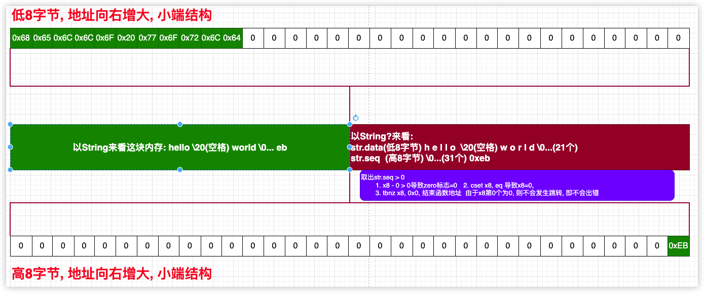

<font size = 4>

# 可选
### 概念
swift中表示一个数据有没有值不是单纯的用该数据类型搞一个固定的标识, 而是专门使用额外的域来表示数据有没有值. 一个很常见的功能字符串转数值(C语言)

```cpp
auto n1 = atoi("123")    // n1 = 123(int)
auto n2 = atoi("abc")    // n2 = 0(int)
```
很明显n2的转换应该是失败的, 但在C语言中n2被初始化为了0. 从逻辑上来说字符串转换数值时是包含0在内的, 所以0和错误没有区分开. 其实任何单一的类型对象的值是否有效不应该固定专门的值, 就拿指针来说有时候NULL在某些业务下也是有效的值, 所以无法分出情况来表示指针的无效. 只不过指针在使用时大家都约定了NULL为无效. 再如libc中标准IO函数, 流失败时有一种情况时读到文件的eof, 所以无法判断流失效时到底是eof还是其他失败原因. 所以标准IO特别定义了2个函数用来检查失效和eof的情况(`feof ferror`). 

总结就是: 不能以某个类型的固定值来决定当前类型的对象是否是有效的. swift中解决此问题的方案是包装类型, 也叫可选类型


### 可选项
可选类型是模板, 它要包装其他类型, 定义格式如下:

```swift
var empty_int : Optional<Int> = Optional.init(nilLiteral: ())        // 创建对象, 在标记区标记当前包装的值无效      __code_init_1
print(empty_int)                                                     // nil
empty_int = 20                                                       // 数据区赋值20
print(empty_int)                                                     // Optional(20)

var wrap_int = Optional.init(100)                                    // 创建对象, 直接在数据域填充上整数100         __code_init_2
print(wrap_int)                                                      // Optional(100)
wrap_int = nil                                                       // 标记数据无效
print(wrap_int)                                                      // nil


// 若不赋值, 则默认是nil(不算作初始化), 后续simple可以初始化一次
let simple: Int? = 200                                               // 简写方式创建对象                            __code_init_3
print(simple)
```

上述demo中对象的类型是`Optional<Int>`表示包装的类型是Int.  有3种创建对象的方式:
1. `__code_init_1`: 调用对应的构造方法, 直接传递了空元组, 内部会标记为无效状态
2. `__code_init_2`: 通过所传递的数据可以确定可选所要包装的类型
3. `__code_init_3`: 编译器的语法糖, 会将`Int?`转换成标准库下的`Optional<Int>`. 这个并不是遵循了什么协议, 就是固定的语法, 编译器固定转换成标准库下的`Optional<Int>`

### 可选项本质
其实可选项就是一个关联枚举

```swift
@frozen public enum Optional<Wrapped> : ExpressibleByNilLiteral {
    case none
    case some(Wrapped) 
}
```

以上是部分标准库的源码, 和<font color = red>泛型枚举</font>功能一样, 所以也可以这样定义对象

```swift
let null: Int? = Optional.none          // 就是枚举的定义语法 
let one: Int? = Optional.some(50)       

let Nil: Int? = .none
let two: Int? = .some(100)

let literal: Int? = nil
```

一般开发时直接赋值

```swift
let n: Int? = 50                        
```
直接使用字面量的形式初始化一个可选项对象并不是编译器特性, 只要遵循了相关的协议都可以这样初始化或赋值

```swift
// 遵循一个数值字面量的协议, 然后实现相关的方法
// 这样可以使用一个字面量数值初始化int对象
struct int : ExpressibleByIntegerLiteral{
    typealias IntegerLiteralType = Int
    init(integerLiteral value: Int) {
        self.data = value
    }
    var data: Int
    init(data: Int) {
        self.data = data
    }
}
var s: int? = 20        // Optional(20)
s = 50                  // Optional(50)
let n = s               // Optional(50)
```

### 可选项获取值
关联枚举中取出关联的值有2种方案:
1. 使用case值绑定
2. 使用内存api直接读取(<font color = red>前面有案例, 该小节不介绍</font>)

所以对于可选项来说, 取值的逻辑是一样的

```swift
var b: Int
switch (0...1000).randomElement() {
case .none :
    break
case .some(let number) :
    b = number
}
b += 20     // error b未初始化
```

demo中可以取到值, 但存在这样一个致命问题: 取出的值无法离开case作用域. 在后面使用b的时候编译器直接报错, 原因是若switch经历的是`none`则b就未初始化, 将上述代码改成:

```swift
var b:Int

switch (0...1000).randomElement() {
case .none :
    b = 0
case .some(let number) :
    b = number
}

b += 20     // 没有问题
```

这种情况下编译器可以判断出b被初始化, 但事实上逻辑是不对的, 因为有一种情况`switch Int?(0)`时b也为0, 此刻的0是有效的, 这就又回到单纯的类型不能固定某个值来标识有效性, 继续修改:

```swift
var b:Int
var get:Bool = false

switch (0...1000).randomElement() {
case .none :
    b = 0
case .some(let number) :
    b = number
    get = true
}

if get {
    print(b)
}
```

这种情况就可以完全区分了, 定义了一个标识对象当取值有效时标记一下. 这样通过该标识可以判断b是否有效, 但这样增加了代码的复杂性. 可以封装一下让使用更加简单

```swift
func safe_unwrap<E>(op: E?, action: (E)->Void) {
    if let tmp = op  {  // if 解包
        action(tmp)
    }
}
safe_unwrap(op: 20){print($0)}
```
这种方案稍微在使用上更加方便, 但是只能在代码块中使用, 在可选项中还有一个成员方法也是来获取包装值的, 但这个种方案是不安全的
```swift
let n: Int? = nil
let wrap = n.unsafelyUnwrapped      // runtime error, nil解包错误
```
总结就是: 可选项无法在某个点安全并简洁的取出包装类型. 针对这种情况swift对标准库下的Optional增加了便捷操作(解包):
1. 其他解包
    - if解包
    - guard解包
    - case解包
    - switch解包
3. 对象使用`!`强制解包
4. 对象使用`?`安全解包

### 其他解包
这个是固定的语法:

```swift
let n: Int? = 20
if let result = n {             // if-unwrap
    print(result)               // 20, 整型
}

// case-unwrap
if case .some(let result) = n { 
    print(result)               // 20, 整型
}

if case let result? = n {
    print(result)               // 20, 整型
}


switch n {
    case .some(let result) : 
        print(result)               // 20, 整型
    case .none : 
        print("nil")
}
 
// 上述3种其实一样, 但result的作用域只限于括号中

guard let result = n else {
    fatalError("nil")
}

print(result)
```
guard语法是固定的, 必须存在eles并且在else中要有离开当前作用域的语句:
1. 若在函数中可以使用return
2. 若在循环可以使用break, continue
3. 若在switch中可以使用break
4. 还可以抛出异常, 也可直接调用`fataError`结束

result直接被安全的解包, result的作用域和guard所胡的作用域一致


### 非String强制解包
使用`!`可以将包装的类型取出来, 但这个过程是不安全的. 首先看一下编译器对可选项的整数字面量赋值是怎么汇编的
```swift
let n1: Int? = 20
let n2: Int? = nil
```

根据关联枚举经验全局对象n的大小是16字节, 分2个域:
1. 数据域
2. 编号域

对象n1的内存布局(<font color = red>关联枚举</font>):
1. 前8数据区内容是20
2. 第9字节的编号为0

对象n2的内存:
1. 前8数据区内容是0
2. 第9字节的编号为1

swift强制解包的过程:
1. 取出枚举对象的编号
2. 如果该编号为1则直接结束程序

```swift
let n: Int? = 20
n! 
```
<br/>

```lua
 0x100003e5c <+0>:   sub    sp, sp, #0x40
    0x100003e60 <+4>:   stp    x29, x30, [sp, #0x30]
    0x100003e64 <+8>:   add    x29, sp, #0x30
    0x100003e68 <+12>:  adrp   x10, 5   
    0x100003e6c <+16>:  adrp   x8, 5
    0x100003e70 <+20>:  add    x8, x8, #0x0              ; swift.n : Swift.Optional<Swift.Int>
                                                         ; x10 = &n
                                                         ; x8  = &n

    0x100003e74 <+24>:  adrp   x9, 0
    0x100003e78 <+28>:  add    x9, x9, #0xf8a            ; "Fatal error"
    0x100003e7c <+32>:  str    x9, [sp, #0x18]
    0x100003e80 <+36>:  adrp   x9, 0
    0x100003e84 <+40>:  add    x9, x9, #0xf50            ; "Unexpectedly found nil while unwrapping an Optional value"
    0x100003e88 <+44>:  stur   x9, [x29, #-0x10]
    0x100003e8c <+48>:  adrp   x9, 0
    0x100003e90 <+52>:  add    x9, x9, #0xf30            ; "swift/main.swift"
    0x100003e94 <+56>:  stur   x9, [x29, #-0x8]

    0x100003e98 <+60>:  mov    w9, #0x14                ; x9 = 20
    0x100003e9c <+64>:  str    x9, [x10]                ; *x10 = 20, n.data = 20
    0x100003ea0 <+68>:  mov    w9, #0x0                 ; x9 = 0, (高32位清零)
    0x100003ea4 <+72>:  mov    w10, #0x1                ; x10 = 1
    0x100003ea8 <+76>:  and    w9, w9, #0x1             ; x9 = 0
    0x100003eac <+80>:  and    w9, w9, w10              ; x9 = 0

    0x100003eb0 <+84>:  strb   w9, [x8, #0x8]           ; *(x8 + 8) = 0, n.seq = 0
->  0x100003eb4 <+88>:  ldrb   w8, [x8, #0x8]           ; x8 = 0, 这里是取出编号
                                                        ; 这里的操作是1字节, 从这一点也可以看出编号是8位的空间

    0x100003eb8 <+92>:  tbnz   w8, #0x0, 0x100003ec4     ; <+104> at main.swift
                                                        ; 判断x8的第0位是否是1, 若是1则后续直接runtime error __asm_error
                                                        ; 在枚举选项中, case .none的编号是1, 所以这个判断是对的
                                                        ; 但此刻x8取出的是0, 即编号是0表示 case .some是有效的值, 所以会正常往下走

    0x100003ebc <+96>:  b      0x100003ec0               ; <+100> at main.swift:7:2
    0x100003ec0 <+100>: b      0x100003f14               ; <+184> at <compiler-generated> 
                                                        ; 直接正常跳转 __asm_right

    0x100003ec4 <+104>: ldur   x6, [x29, #-0x8]         ; __asm_error
    0x100003ec8 <+108>: ldur   x3, [x29, #-0x10]
    0x100003ecc <+112>: ldr    x0, [sp, #0x18]
    0x100003ed0 <+116>: mov    x9, sp
    0x100003ed4 <+120>: mov    w8, #0x2
    0x100003ed8 <+124>: strb   w8, [x9]
    0x100003edc <+128>: mov    w8, #0x7
    0x100003ee0 <+132>: str    x8, [x9, #0x8]
    0x100003ee4 <+136>: mov    w8, #0x1
    0x100003ee8 <+140>: str    w8, [x9, #0x10]
    0x100003eec <+144>: mov    w8, #0xb
    0x100003ef0 <+148>: mov    x1, x8
    0x100003ef4 <+152>: mov    w5, #0x2
    0x100003ef8 <+156>: mov    x2, x5
    0x100003efc <+160>: mov    w8, #0x39
    0x100003f00 <+164>: mov    x4, x8
    0x100003f04 <+168>: mov    w8, #0x10
    0x100003f08 <+172>: mov    x7, x8
    0x100003f0c <+176>: bl     0x100003f24               ; symbol stub for: Swift._assertionFailure(_: Swift.StaticString, _: Swift.StaticString, file: Swift.StaticString, line: Swift.UInt, flags: Swift.UInt32) -> Swift.Never


    0x100003f10 <+180>: brk    #0x1
    0x100003f14 <+184>: mov    w0, #0x0                  ; __asm_right
    0x100003f18 <+188>: ldp    x29, x30, [sp, #0x30]
    0x100003f1c <+192>: add    sp, sp, #0x40
    0x100003f20 <+196>: ret    
```

从汇编可以看出, swift在解包时会展开很多代码, 但在demo中可以明显用肉眼看出当前解包是成功的, 因为n初始化时就是通过数值字面量, 一定解包成功, 但swift还是未做任何特殊的优化, 还是一如既往取出序号然后判断编号是不是1. 值得一提的是: <font color = red>nil解包导致程序结束并不是用户拿到了无效的数据, 而是swift在判断编号为`case .none`时直接结束程序</font> 

笔者还要做一个测试, 就是函数返回可选项时, arm64中怎么存储的返回结果

```swift
let n: Int? = {Int("abc")}()        // 闭包返回nil 
```

<br/>

```lua
swift`main:
    0x100003e44 <+0>:  sub    sp, sp, #0x20
    0x100003e48 <+4>:  stp    x29, x30, [sp, #0x10]
    0x100003e4c <+8>:  add    x29, sp, #0x10
    0x100003e50 <+12>: adrp   x8, 5
    0x100003e54 <+16>: str    x8, [sp]
    0x100003e58 <+20>: adrp   x8, 5
    0x100003e5c <+24>: add    x8, x8, #0x8              ; swift.n : Swift.Optional<Swift.Int>
    0x100003e60 <+28>: str    x8, [sp, #0x8]
                                                        ; x8 = &n
                                                        ; *(sp + 8) = &n
    0x100003e64 <+32>: bl     0x100003e90               ; closure #1 () -> Swift.Optional<Swift.Int> in swift at main.swift:6   
->  0x100003e68 <+36>: ldr    x8, [sp]                  
    0x100003e6c <+40>: ldr    x9, [sp, #0x8]            ; x9 = &n
    0x100003e70 <+44>: str    x0, [x8, #0x8]            ; *n = x0, x0是返回值, 是可选项中的值域, 因为闭包中返回的是nil, 所以值域没有意义
    0x100003e74 <+48>: and    w8, w1, #0x1              ; w8 = w1 & 1, w1由闭包填充, 是可选项中编号区域, 因为返回的是nil, 所以x1 为1
    0x100003e78 <+52>: and    w8, w8, #0x1              ; w8 = 1 & 1
    0x100003e7c <+56>: strb   w8, [x9, #0x8]            ; *(&n + 0x8) = 1, 即 n.seq = 1, 后续解包会直接结束程序的
    0x100003e80 <+60>: mov    w0, #0x0
    0x100003e84 <+64>: ldp    x29, x30, [sp, #0x10]
    0x100003e88 <+68>: add    sp, sp, #0x20
    0x100003e8c <+72>: ret    
```

当返回值是可选项时`x0`, 以整数来说编号放在了`x1`中(<font color = red>其他包装类型的没有测试, 总之会编号一定会存储在某个地方</font>)

### 非String安全解包
强制解包时swift一定会做判断, 可能直接退出程序. 对应的安全解包则swift的要做的事更多, 因为为了安全可能要生成很多判断代码

```swift
let n: Int? = 20

let hash = n?.hashValue 
```

上述代码是安全的, 但比较耗性能, 可以推断出编译器可能将代码变成:

```swift
let n: Int? = 20

let hash:Int?

if n != nil {
    hash = n!.hashvalue
}
```

可以试想以n为起点链式调用方法都将会不停的做判断, 性能就低了. 不管怎样, 先看一下编译器生成的汇编

```lua
swift`main:
->  0x100003edc <+0>:   sub    sp, sp, #0x30
    0x100003ee0 <+4>:   stp    x29, x30, [sp, #0x20]
    0x100003ee4 <+8>:   add    x29, sp, #0x20
    0x100003ee8 <+12>:  adrp   x9, 5
    0x100003eec <+16>:  adrp   x8, 5
    0x100003ef0 <+20>:  add    x8, x8, #0x0              ; swift.n : Swift.Optional<Swift.Int>
                                                        ; x9 = &n
                                                        ; x8 = &n
                                            
    0x100003ef4 <+24>:  adrp   x10, 5
    0x100003ef8 <+28>:  add    x10, x10, #0x10           ; swift.hash : Swift.Optional<Swift.Int>
    0x100003efc <+32>:  str    x10, [sp, #0x10]
                                                        ; x10 = &hash
                                                        ; *(sp + 16) = &hash

    0x100003f00 <+36>:  mov    w10, #0x14               ; w10 = 20
    0x100003f04 <+40>:  str    x10, [x9]                ; *x9 = 20, n.data = 20
    0x100003f08 <+44>:  mov    w10, #0x0                ; w10 = 0
    0x100003f0c <+48>:  and    w10, w10, #0x1           ; w10 = 0
    0x100003f10 <+52>:  and    w10, w10, #0x1           ; w10 = 0
    0x100003f14 <+56>:  strb   w10, [x8, #0x8]          ; *(x8 + 8) = 0, n.seq = 0
                                                        ; 这里有重复的汇编, 因为目前debug模式下没做任何的优化, 不用管

    0x100003f18 <+60>:  ldr    x9, [x9]                 ; x9 = *x9, x9 = 20
    0x100003f1c <+64>:  stur   x9, [x29, #-0x8]         ; *(x29 - 8) = 20, 保存到某个局部变量
    0x100003f20 <+68>:  ldrb   w8, [x8, #0x8]           ; w8 = *(x8 + 8), w8 = 0, 取出n.seq(1个字节)
    0x100003f24 <+72>:  tbnz   w8, #0x0, 0x100003f38    ; <+92> at main.swift
                                                        ; 判断w8的的第0位, 若是1则(case .none)
                                                        ; 即 n.seq = 1表示当前n的值无效, 因为现在是安全解包, 所以后续一定不会调用 hashValue方法
                                                        ; 跳转到 __asm_wrap_nil_n


    0x100003f28 <+76>:  b      0x100003f2c              ; <+80> at main.swift
                                                        ; n不为nil, 继续执行   

    0x100003f2c <+80>:  ldur   x8, [x29, #-0x8]         ; x8 = *(x29 - 8), x8 = 20
    0x100003f30 <+84>:  str    x8, [sp, #0x8]           ; *(sp + 8) = 20, 某个局部对象的值是20
    0x100003f34 <+88>:  b      0x100003f58              ; <+124> at main.swift
                                                        ; n不nil, 则后面要调用 hashValue方法
                                                        ; __asm_exec_hash_vlaue


    0x100003f38 <+92>:  ldr    x9, [sp, #0x10]          ;   __asm_wrap_nil_n
                                                        ; x9 = *(sp + 16), x9 = &hash

    0x100003f3c <+96>:  adrp   x8, 5                    ; 这里其实取到了全局对象n的地址        
                                                        ; x8 = &n
    0x100003f40 <+100>: str    xzr, [x8, #0x10]         ; hash.data = 0 
                                                        ; hash对象与n相距16字节
    0x100003f44 <+104>: mov    w8, #0x1                 ; w8 = 1
    0x100003f48 <+108>: and    w8, w8, #0x1             ; w8 = 1
    0x100003f4c <+112>: and    w8, w8, #0x1             ; w8 = 1
    0x100003f50 <+116>: strb   w8, [x9, #0x8]           ; *(x9 + 8) = 1, hash.seq = 1
                                                        ;   hash也无效的
                                                        
                                                        ; 即当n为nil时, 跳转到 __asm_wrap_nil_n后, hash也被置为了无效, 后面将直接返回
    0x100003f54 <+120>: b      0x100003f80              ; <+164> at main.swift
                                                        ; 跳转到 __asm_safe

    0x100003f58 <+124>: ldr    x0, [sp, #0x8]           ; __asm_exec_hash_vlaue
                                                        ; 当n不为nil跳转过来, x0 = *(sp + 8), x0 = 20

    0x100003f5c <+128>: bl     0x100003f90              ; symbol stub for: Swift.Int.hashValue.getter : Swift.Int
                                                        ; 调用hashValue方法, 隐式传递了x0参数(Int(20))

    0x100003f60 <+132>: ldr    x9, [sp, #0x10]          ; x9 = *(sp + 16), x9 = &hash
    0x100003f64 <+136>: adrp   x8, 5                    ; 其实计算出来x8 = &n
    0x100003f68 <+140>: str    x0, [x8, #0x10]          ; *(x8 + 16) = x0, x0表示hashValue的返回值, x8是对象a的地址, 对象hash的地址距离a有16字节
                                                        ; 所以 hash.data = x0
    0x100003f6c <+144>: mov    w8, #0x0                 ; w8 = 0
    0x100003f70 <+148>: and    w8, w8, #0x1             ; w8 = 0
    0x100003f74 <+152>: and    w8, w8, #0x1             ; w8 = 0
    0x100003f78 <+156>: strb   w8, [x9, #0x8]           ; *(x9 * 8) = w8, 即 hash.seq = w8 = 0, 表示有值

    0x100003f7c <+160>: b      0x100003f80              ; <+164> at main.swift
                                                        ; 经此, n和hash都正确赋值


    0x100003f80 <+164>: mov    w0, #0x0                 ; __asm_safe
    0x100003f84 <+168>: ldp    x29, x30, [sp, #0x20]
    0x100003f88 <+172>: add    sp, sp, #0x30
    0x100003f8c <+176>: ret    

```

将上面的汇编以下面的伪代码形式展示出来:

```txt
// n为nil时, 2者都无效

let n: Int? = 20
n.data = 20
n.seq = 0


let hash = n?.hashValue

func main() {
    do {
        if n.seq == 1 {
            hash.seq = 1
            break
        }

        hash.data = n.data.hashValue
        hash.seq = 0
    }while(0)

    
    ...
}
```

> 这个是伪代码, 并不存在`n.seq`这一类的东西, 笔者旨在说明swift底层干了什么事情. 

整数的汇编很好理解, 但字符串就完全不一样了, 这个将在下小节探究

### 字符串的解包规则
首先可选项包装的不管是什么类型, swift的解包流程不会改变(取序号对比是0(有效)还是1(无效)). 对于字符串来说, 该小节不用再探究强制解包和安全解包的流程, 只用知道字符串解包判断的流程就够了. 笔者先给出结论, 然后再由浅入深:
1. 字符串大小为16字节, 是一个值类型
2. `String?`大小也为16字节
3. `String`长度小于15时, 第16字节是一个固定大于0的数值, 当是`String?`时, 第16字节的数据同时和`str.seq`共用空间
    - 第16个字节的数据会作相应算法, 然后`str.seq`被置0, 表示是有效的字符串
4. `String`长度大于15时, 前8字节是真实字符串的引用, 第16字节还是固定的数值. 当是`String?`时流程和长度15的字符串一致, 会标记`str.seq = 0`, 即有效


测试步骤:
1. 查看String大小
2. 查看`String?`大小
3. 查看`str = nil`时`String?`的内存布局
4. 查看`str != nil`时`String?`的内存布局
5. 查看编译器解包`String?`的行为


```swift
print(MemoryLayout<String>.size)                // 16
print(MemoryLayout<String>.stride)              // 16
print(MemoryLayout<String>.alignment)           // 8

print(MemoryLayout<String?>.size)               // 16
print(MemoryLayout<String?>.stride)             // 16
print(MemoryLayout<String?>.alignment)          // 8
```

从打印来看, 在不知道原理前会觉得不可思议, String大小和`String?`大小一样, 那关联枚举的内存布局和以前探究的不符合!!! 因为可选项(关联枚举)中data和seq是是分开存储的,这是基本原则. 下面直接进行第3步测试

```swift
let str: String?
str = nil
```

```lua
swift`main:
    0x100003f80 <+0>:  adrp   x9, 5
    0x100003f84 <+4>:  adrp   x8, 5
    0x100003f88 <+8>:  add    x8, x8, #0x0              ; swift.str : Swift.Optional<Swift.String>

->  0x100003f8c <+12>: str    xzr, [x9]                 ; str.data = 0
    0x100003f90 <+16>: str    xzr, [x8, #0x8]           ; str.seq = 0
                                                        ; 即 序号为0, 根据之前的学习, 这种标记是有效
    0x100003f94 <+20>: mov    w0, #0x0
    0x100003f98 <+24>: ret     
```

该汇编反常理了, `str.seq = 0`被标记了, 当直接取出这个标记时, 本能的认为0就表示有效, 但str的值实际为nil. 这个到后面就清楚了, 直接进行第4步测试, 这里测试字符串长度小于15的情况


```swift
let str: String? = "hello world"    // 长度11  
```

```lua
swift`main:
    0x100003f28 <+0>:  sub    sp, sp, #0x20
    0x100003f2c <+4>:  stp    x29, x30, [sp, #0x10]
    0x100003f30 <+8>:  add    x29, sp, #0x10
    0x100003f34 <+12>: adrp   x8, 5
    0x100003f38 <+16>: str    x8, [sp]
    0x100003f3c <+20>: adrp   x8, 5
    0x100003f40 <+24>: add    x8, x8, #0x0              ; swift.str : Swift.String
    0x100003f44 <+28>: str    x8, [sp, #0x8]
                                                        ; x8 = &str
                                                        ; *(sp + 0x8) = &str
                                                        ; *sp = &str

    0x100003f48 <+32>: adrp   x0, 0
    0x100003f4c <+36>: add    x0, x0, #0xf90            ; "hello world"
    0x100003f50 <+40>: mov    w8, #0xb
    0x100003f54 <+44>: mov    x1, x8
    0x100003f58 <+48>: mov    w8, #0x1
->  0x100003f5c <+52>: and    w2, w8, #0x1
    0x100003f60 <+56>: bl     0x100003f84               ; symbol stub for: Swift.String.init(_builtinStringLiteral: Builtin.RawPointer, utf8CodeUnitCount: Builtin.Word, isASCII: Builtin.Int1) -> Swift.String
                                                        ; 调用函数传递了 
                                                        ;   x0: "hello world"这个字符串常量地址
                                                        ;   x1: 11, 字符串长度
                                                        ;   w2: 1
                                                        ; String.init需要这3个参数

    0x100003f64 <+60>: ldr    x9, [sp]                  ; x9 = &str
    0x100003f68 <+64>: ldr    x8, [sp, #0x8]            ; x8 = *(sp + 0x8), x8 = &str

    0x100003f6c <+68>: str    x0, [x9]                  ; *x9 = x0, str.data = x0, 即枚举对象的数值区为x0
                                                        ; x0,x1是init的返回值, 这里先说结论:
                                                        ;   x0是字符串的前8字节, 
                                                        ;       x0 = 0x6f77206f6c6c6568
                                                        ;       正好对应"ow olleh", 
                                                        ;       对应到内存(小端) str.data = "hello wo"
                                                        ;
                                                        ;   x1是字符串的后8字节
                                                        ;       x1 = 0xeb00000000646c72
                                                        ;       正好是"eb ... d l r"
                                                        ;       对应到内存(小端) str.seq = r l d \0 \0 \0 \0 0xeb
                                                        ;       第8字节: 0xEB, 同时是整个字符串的第16字节
    0x100003f70 <+72>: str    x1, [x8, #0x8]            ; *(&str + 8) = x1
                                                        ; 以字符串的内存布局来看:
                                                        ;       h e l l o " " w o r l d \0 \0 \0 \0 0xeb
                                                        ; 同时以可选项的内存来看:
                                                        ;   str.data = h    e   l   l   o   " "     w   o 
                                                        ;   str.seq  = r    l   d   \0  \0  \0      \0  0xeb
                                                        ;
                                                        ; 这里最开始笔者怎么都想不通, 因为x0,x1组成的16字节表示了一整个字符串, 但以关联枚举的可选内存来看
                                                        ; 没有所谓的编号区域
                                                        ; 这个直接说结论: 这16字节的空间中, 前15字节是字符串的内容"hello world", 第16字节是一个固定的数值EB
                                                        ; 当发生解包行为时, 流程是:
                                                        ;   x8 = x1(后8字节)
                                                        ;   x8 = x8 - 0x0       结果不为0, CPU的zero标志位为0
                                                        ;   cset w8, eq         
                                                        ;       zero = 0, 导致x8 = 0, 
                                                        ;       zero = 1, 导致x8 = 1
                                                        ;       这里是32位, 但上一步整体是64位的计算, 所以上一步是取了8个字节作计算, 这里只根据zero位设置32位, 同时清零高32位
                                                        ;   bl x8,0x0, 0xxxxxxxxx
                                                        ;       查看x8的第0位是否是1, 若是1, 则后续的汇编将直接 runtime error
    0x100003f74 <+76>: mov    w0, #0x0
    0x100003f78 <+80>: ldp    x29, x30, [sp, #0x10]
    0x100003f7c <+84>: add    sp, sp, #0x20
    0x100003f80 <+88>: ret
```

上述汇编中笔者总结出了结论:
1. 字符串整体16字节
2. `String?`整体也是16字节
3. str对象被`x0, x1`赋值后, 以可选来解释内存, 会取出高8位做校验, 正是因为后8位的最高位一定是固定的大于0的数, 所以校验的结果直接为0, 这个0以枚举内存来解释就是编号, 当是0时表示数据是有效的

下面来看一下实际的解包汇编, 为了让汇编代码变得简单, 上述代码这样改一下

```swift
let str: String? = "hello world"
func test() {
    str!
}
test()
```

```lua
swift`test():
    0x100003e2c <+0>:   sub    sp, sp, #0x50
    0x100003e30 <+4>:   stp    x29, x30, [sp, #0x40]
    0x100003e34 <+8>:   add    x29, sp, #0x40
    0x100003e38 <+12>:  adrp   x8, 5
    0x100003e3c <+16>:  add    x8, x8, #0x0              ; swift.str : Swift.Optional<Swift.String>
                                                         ; x8 = &str
    0x100003e40 <+20>:  adrp   x9, 0
    0x100003e44 <+24>:  add    x9, x9, #0xf8a            ; "Fatal error"
    0x100003e48 <+28>:  str    x9, [sp, #0x20]
    0x100003e4c <+32>:  adrp   x9, 0
    0x100003e50 <+36>:  add    x9, x9, #0xf50            ; "Unexpectedly found nil while unwrapping an Optional value"
    0x100003e54 <+40>:  stur   x9, [x29, #-0x18]
    0x100003e58 <+44>:  adrp   x9, 0
    0x100003e5c <+48>:  add    x9, x9, #0xf30            ; "swift/main.swift"
    0x100003e60 <+52>:  stur   x9, [x29, #-0x10]

->  0x100003e64 <+56>:  ldr    x0, [x8, #0x8]            ; x0 = *(x8 + 8) ==> x0 = str.seq
    0x100003e68 <+60>:  stur   x0, [x29, #-0x8]          ; *(x29 - 8) ==> str.seq

    0x100003e6c <+64>:  bl     0x100003f14               ; symbol stub for: swift_bridgeObjectRetain

    0x100003e70 <+68>:  ldur   x8, [x29, #-0x8]          ; x8 = *(x29 - 8) ==> x8 = str.seq, 即取出序号值
                                                         ; 根据前面的测试 str整体16字节的内容:
                                                         ;   str.data = h    e   l   l   o   " "     w   o 
                                                         ;   str.seq  = r    l   d   \0  \0  \0      \0  0xeb
                                                         ; 所以 x8 取出的值大于0

    0x100003e74 <+72>:  subs   x8, x8, #0x0              ; x8 = x8 - 0, 结果不为0, zero位被置0
    0x100003e78 <+76>:  cset   w8, eq                    ; zero = 0则w8 = 0(高32位也会被清零)
    0x100003e7c <+80>:  tbnz   w8, #0x0, 0x100003e90     ; <+100> at main.swift
                                                         ; 检查x8的第0位, 若是1则 __asm_begin_runtime_error
                                                         ; 此刻x8为0, 则后续会走到 __asm_wrap_ok

    0x100003e80 <+84>:  b      0x100003e84               ; <+88> at main.swift
    0x100003e84 <+88>:  ldur   x8, [x29, #-0x8]
    0x100003e88 <+92>:  str    x8, [sp, #0x18]      
    0x100003e8c <+96>:  b      0x100003edc               ; <+176> at <compiler-generated>

    0x100003e90 <+100>: ldur   x6, [x29, #-0x10]         ; __asm_begin_runtime_error
    0x100003e94 <+104>: ldur   x3, [x29, #-0x18]
    0x100003e98 <+108>: ldr    x0, [sp, #0x20]
    0x100003e9c <+112>: mov    x9, sp
    0x100003ea0 <+116>: mov    w8, #0x2
    0x100003ea4 <+120>: strb   w8, [x9]
    0x100003ea8 <+124>: mov    w8, #0xb
    0x100003eac <+128>: mov    x1, x8
    0x100003eb0 <+132>: str    x1, [x9, #0x8]
    0x100003eb4 <+136>: mov    w8, #0x1
    0x100003eb8 <+140>: str    w8, [x9, #0x10]
    0x100003ebc <+144>: mov    w5, #0x2
    0x100003ec0 <+148>: mov    x2, x5
    0x100003ec4 <+152>: mov    w8, #0x39
    0x100003ec8 <+156>: mov    x4, x8
    0x100003ecc <+160>: mov    w8, #0x10
    0x100003ed0 <+164>: mov    x7, x8
    0x100003ed4 <+168>: bl     0x100003ef0               ; symbol stub for: Swift._assertionFailure(_: Swift.StaticString, _: Swift.StaticString, file: Swift.StaticString, line: Swift.UInt, flags: Swift.UInt32) -> Swift.Never
    0x100003ed8 <+172>: brk    #0x1

    0x100003edc <+176>: ldr    x0, [sp, #0x18]           ; __asm_wrap_ok
    0x100003ee0 <+180>: bl     0x100003efc               ; symbol stub for: swift_bridgeObjectRelease
    0x100003ee4 <+184>: ldp    x29, x30, [sp, #0x40]
    0x100003ee8 <+188>: add    sp, sp, #0x50
    0x100003eec <+192>: ret    
```

经过汇编的判断, 发现swift在对待`Int?`和`String?`时, Int类型的可选项很好理解, 数据域和编号域是分开的. 判断的过程也很明了. 但String类型的可选时, 直接是共用了String的后8字节的内存, 但String保证了后8字节的最高位一定是大于0的数值, 再加上String可选时的算法, 最终的结果是有效的, 笔者将String和`String?`的结构画成图如下:




### 多条件
只要能解包出来都可以同时添加条件, 但条件和解包不能使用`&&`连接, 要使用逗号隔开. 

> 就算解包出来后的类型是Bool也必须使用逗号隔开, 这个是固定的语法

```swift
let a: Int? = 20

if let tmp = a, tmp > 20 {}                             // bind value, 必须使用逗号隔开

while let tmp = a , tmp > 20 {}                         // 同上

while a != nil, a! > 20 && a! < 100 {}                  // 条件之间继续使用逻辑符号 

switch a {
case .some(let num) where num > 20 && num < 100 :       // bind value, 在switch中必须使用where连接条件
    break
default:
    break
}

var b: Bool? = false
// tmp?中的问号不能少, 这样tmp的类型才是包装类型
if case let tmp? = b , b == false{                      // 就算解包出来的是Bool,也必须使用逗号隔开
} 
if case .some(let tmp) = b, b {                         // 同上, 解包出来后, b为true时进入条件
}
```


### 可选项字符串化
虽然可选项是关联枚举, 但它实现了`CustomDebugStringConvertible`协议, 该实现可以在swift的源码实现中查到返回`Optional(枚举成员关联值)`

```swift
internal func _print_unlocked<T, TargetStream: TextOutputStream>(
  _ value: T, _ target: inout TargetStream
) {
#if false
    源码中是有注释的: 可选类型没有合适显示的形式,所以应该打印为调试字符串
    而可选确实实现了CustomDebugStringConvertible协议
#endif
  if _openExistential(type(of: value as Any), do: _isOptional) {
    let debugPrintable = value as! CustomDebugStringConvertible
    debugPrintable.debugDescription.write(to: &target)
    return
  }


  // ...
}


// 协议实现
extension Optional: CustomDebugStringConvertible {
  /// A textual representation of this instance, suitable for debugging.
  //// 文本明示形式,适合调试
  public var debugDescription: String {
    switch self {
    case .some(let value):
#if !SWIFT_STDLIB_STATIC_PRINT
      var result = "Optional("
      #if !$Embedded
      debugPrint(value, terminator: "", to: &result)
      #else
      _ = value
      "(cannot print value in embedded Swift)".write(to: &result)
      #endif
      result += ")"
      return result
#else
    return "(optional printing not available)"
#endif
    case .none:
      return "nil"
    }
  }
}


print(String?("hello world"))        // optional("hello world")
```

### 可选项成员方法
可选主要用来作为判断的, 所以它的成员方法中有很多是基于比较的, 并且为了方便大都是运算符方法:
1. `~=` case的模式匹配:`(nil, wrap?)`
2. `==`
    - `(wrap?, nil)`
    - `(wrap?, nil)`
    - `(nil, wrap?)`
    - `(wrap?, wrap?)`
    - `(wrap?, wrap)`
    - `(wrap, wrap?)`
3. `!=`
    - `(wrap?, nil)`
    - `(nil, wrap)`

```swift
let n: Int? = 20
switch n {
case nil :                  // 模式匹配, 可以直接是nil
    print("null")
default:
    print(n!)
}

let n1:Int? = 20
let n2:Int? = 20
print(n1 == n2)             // true
print(20 == n2)             // true
print(n1 == 20)             // true
```

其他方法:
```swift
@inlinable public func map<U>(_ transform: (Wrapped) throws -> U) rethrows -> U?
@inlinable public func flatMap<U>(_ transform: (Wrapped) throws -> U?) rethrows -> U? 

// 这它们的区别就是map需要返回解包类型, flatMap需要返回可选类型
// flatMap的回调中调用的是返回是可选的方法, 而map内部若有可选项时, 无法返回


typealias time_stmap = (year: Int, month:Int)

let t1: time_stmap? = (2024, 10)

#warning("这里有警告,所以使用String对返回值可选构造一下去除警告")
print(String(describing: t1.map{"\($0)-\($1)"}))            
    // 这里使用map时, 若在内部调用String(Int) 方法, 则必须解包, 否则不能返回, 但解包可能出现问题

print(String(describing: t1.flatMap{String($0) + "-" + String($1)}))
```

### 思考安全解包?
目前为止可选的使用是比较麻烦的, 当然编译器妥协了标准库, 它对Optional特殊做了语法糖:
1 `Type?`, 其他类型是不能享有这种简洁的写法的
2. `obj!`, 其他类型的对象不能有这种语法
3. `obj?`, 同上

在取值方面虽然使用简洁, 但编译器底层要展开很多安全性的代码, 频繁解包时性能消耗太高, 笔者的建议是使用一次性解包:

```swift
@dynamicCallable 
struct Wrap<T> : ExpressibleByNilLiteral{
    // __code_callable
    func dynamicallyCall(withArguments cbk: [(T) -> Void]) {        
        if let lambda = cbk.first , self.data.isEmpty == false {
            return lambda(self.data[0])
        }
    }

    init(nilLiteral: ()) {
        self.init(nil)
    }
    init(_ data: T?){
        self.data = Array.init()
        self << data
    }

    var null: T?
    var data: Array<T>


    // __code_self
    static func << (self: inout Wrap,  _ data: T?){ 
        self.data.removeAll()
        if let tmp = data {
            self.data.append(tmp)
        }
        self.null = data
    }
}

var wn: Wrap<Int> = nil
wn {print($0)}              // 不会回调
wn << 30                    // 存储30
wn {print($0)}              // 直接取出30, 后续继续取的话没有解包的过程
wn {print($0)}              // 不会产生解包
wn << nil                   // 清零
wn {print($0)}              // 没有回调
```

该demo有一些新特性:
1. 注解`dynamicCallable`, 它并不是swift中标准库的一部分, 它是编译器特性. 当实现这个注解的规范, 即实现`__code_callable`后, 可以直接通过`对象()`的方式调用方法实现, 这正如c++中对`operator ()`作重载一样

2. Wrap内部通过数组是否为空来判断当前值是否有效, 若直接以下面的方式判断:

```swift
func dynamicallyCall(withArguments cbk: [(T) -> Void]) {        
    if let lambda = cbk.first , let data = self.null {
        return lambda(data)
    }
}
```
> 这样编每次调用`wn()`时都会解包, 解包的过程底层是很繁琐的(<font color = red>要解包, 要判断</font>). 所以必须用其他标识来自己判断, 笔者采用了数组, 因为使用数组不用涉及到T成员的初始化. 使用`isEmpty`判断的效率很高.

3. `<<` 操作符的重载, 系统定义了`<<`为二无操作符, 这里拿来直接用, 它左边的参数接收`Wrap`, 要传递地址. 右边的参数需要对应类型的对象. 函数没有返回值, 意味着不可以连续调用, 因为Wrap值类型, 可以返回类型只能是值类型, 这样达不到连续赋值的效果. 所以没有必要作返回

4. `__code_self`: self是swift中的关键字, 一般对象的标识名若和关键字重名了, 要使用反引号引用\`in\`, 但若参数名则不需要使用反引号引用, 这里其实相当于覆盖了当前上下文中的self

可以发现不管怎么架构, 对于可选项来说要想使用的简洁,高效,安全要实现很多步骤. 后面的可选链虽然使用的简单, 每一步的链式调用swift都会在底层做安全性的判断, 包装生成的可选对象, 所以是有必要想方法去改变的. 后面标准库中的类型有其他的方案会详细探究


### 可选的嵌套 
因为可选类型本身是一种类型, 同时他包装的类型是泛型, 所以当包装类型是可选类型时就构成了嵌套. 这种情况下有细节在里面
```swift
let n1: Int? = 20
let n2 = Optional.some(n1) 
```

n2包装的类型是`Optional<Int>`, 即`Int?`. 它完整的类型如下面完整的解释:

```swift
let n1: Int? = 20

typealias wrap_int = Optional<Int>              // Int?
typealias wrap_option = Optional<wrap_int>      // Int??

let n2:wrap_option = n1                         // n2的类型是Int??, 它包装的类型是Int?
                                                // 从语法规定的类型匹配上, 它必须接收Int?
                                                // 但编译器对嵌套可选的赋值有优化

print(n2)   // Optional(Optional(20))
```

其实不管怎么嵌套, 它的内存布局还是没变. 现在来推测一下n2的内存布局(<font color = red>注要算出所有字段大小总和后再计算对齐, 和c++中结构体是一样的</font>):
1. 数值区大小为9, 因为`Optional<Int>`实际大小就是9(未对齐)
    - 前0~7字节是Int
    - 第8字节是内层可选类型的编号域, 大小是1
2. 第9字节, 外层可选类型的编号域, 其大小是1

所以`Int??`实际上用到的空间10, 编译器分配的空间16(以8对齐)

> 这里计算方式和c++中结构体是一样的:
>   1. 结构体的起始地址一定是系统对齐, 这里是全局对象n2, 它的起始地址一定是8的倍数
>   2. 前8字节是`Int`, 确实起始地址是`Int`大小的倍数
>   3. 第9字节是`UInt8`, 确实起始地址是`UInt8`大小的倍数
>   4. 第10字节是`UInt8`, 确实起始地址是`UInt8`大小的倍数
>   5. 整个结构体大小16确实是最大字段区`Int`的倍数, 所以就是这个内存结构
> 
> 至于第5步的中倍数和系统倍数大小的关系是怎么一致的, 本人已经在c++的结构体内存中详细探究了, 这里不再赘述


下面是几种赋值及内存测试

```swift
var n: Int?? = nil      // Int??

// ptr = &n
let ptr = withUnsafeMutablePointer(to: &n){UnsafeRawPointer($0)}

print(ptr.load(fromByteOffset: 0, as: UInt32.self))     // 前8字节的内存, 打印为0
print(ptr.load(fromByteOffset: 8, as: UInt8.self))      // 第9字节的内存, 打印为0
print(ptr.load(fromByteOffset: 9, as: UInt8.self))      // 第10字节的内存,打印为1, 以Int??来看, 它前面的数值区(9字节)是无效的, 所以其实不用管第8字节是1(无效)还是0(有效)

n = 20
print(ptr.load(fromByteOffset: 0, as: UInt32.self))     // 前8字节的内存, 打印为20, 即编译器直接将20复制到了内层的Int?数值域
print(ptr.load(fromByteOffset: 8, as: UInt8.self))      // 第9字节的内存, 打印为0,  表示内层的Int?是有效的
print(ptr.load(fromByteOffset: 9, as: UInt8.self))      // 第10字节的内存,打印为0,  表示外层的Int??的数值域是有效的

n = Optional<Int>.none                                  // n 存储了 Int?(nil)
print(ptr.load(fromByteOffset: 0, as: UInt32.self))     // 同上,          打印为0
print(ptr.load(fromByteOffset: 8, as: UInt8.self))      // 同上,          打印为1,  内层数据无效
print(ptr.load(fromByteOffset: 9, as: UInt8.self))      // 同上,          打印为0,  外层数据有效   
```

笔者觉得这里不用看汇编, 来试想一下如果自己来实现多层嵌套的算法, 应该怎么做, 实现出来后, 再回去看相应的汇编实现是不是符合我们的算法逻辑. 在实现这个算法前, 笔者要先插入一段字面量的细节, 这关系到编译器针对`Type?????? = 20`的语法糖

字面量在swift中是无类型的, 官方文档解释的是字面量属于无限类型,  当绑定到某个标识时(<font color = red>let,var,函数参数等</font>)字面量的类型会被确定下来, 这里面有优先级顺序:
1. 标识符没有类型限定, swift会将:
    - 数值字面量转换成标准库下的Int
    - 字符串字面量转换成标准库下的String
    - 浮点字面量转换成标准库下的Double
    - `true`或`false`转换成标准库下的Bool
2. 对于`nil`字面量, 编译器针对的是标准库下的`Optional`, 只有这种类型才允许被赋值为nil

除可选类型外, 若标识符声明时有类型指定, swift会根据类型判断该字面量可不可以转换, 这个是发生在编译期. 对于可选类型来说, 编译器为Optional提供了很多语法糖:
1. `Int?`
2. `let n:Int? = 2`
3. `n!`
4. `n?`
5. `let n:Int??? = 2`, 可以直接成立, 并且n的类型就是`Int???`, 即不管嵌套多少`?`, 一个字面量的值能直接被复制到前8字节
6. `let n:Int??? = nil`, 可以直接成立, 这个是正常的语法`Int??? = Int???.none`, 从这一点来看是符号逻辑的, 并且最后的结果`Int???`确实是nil
7. `let n:Int????? = Int??(20)或Int??(nil)`, 可以直接成立, 编译器允许, 编译器内部会做转换适配

> 所以编译器对待数值字面量和nil字面量赋值给嵌套可选时, 效果不一样. 这是是有原因的, 看下面 


现在来分析算法的实现. 首先明确功能:

```txt
功能:   
    给定任意嵌套的可选类型赋值时, 编号域标记

功能举例描述:
    1. 以5层嵌套来说, 即 let n = Int?????
    2. 赋值:
        > n = 20 
        > n = nil
        > n = Int?(20)
        > n = Int?(nil)
        > n = Int??(20)
        > n = Int??(nil)

后面:
    第1层: 称Int?           称数据域 1.data(0~7字节)         编号域 1.seq(第8字节)
    第2层: 称Int??          称数据域 2.data(0~8字节)         编号域 2.seq(第9字节)
    第3层: 称Int???         称数据域 3.data(0~9字节)         编号域 3.seq(第10字节)
    第4层: 称Int????        称数据域 4.data(0~10字节)        编号域 4.seq(第11字节)
    第5层: 称Int?????       称数据域 5.data(0~11字节)        编号域 5.seq(第12字节)


分析:
    n   (1.data)    8(1.seq)   9(2.seq)    10(3.seq)   11(4.seq)   12(5.seq)   

当n为20时, 以我们来实现这个算法, 正常的逻辑是:
    1. Int????? 是一层一层赋值的
    2. tmp1 = 20,           包装成Int?(20)
    3. tmp2 = Int?(tmp1),   包装成Int??(20)
    4. tmp3 = Int??(tmp2),  包装成Int???(20)
    5. tmp4 = Int???(tmp2), 包装成Int????(20)
    6. tmp5 = Int????(tmp2),包装成Int?????(20)

    即一层一层的由内向外包装. 所以n的内存变化, 分别对应这6步
                1.data      1.seq   2.seq   3.seq   4.seq   5.seq 
        第1步    20

        第2步    20         0(表示1.data有效)

        第3步    20         0       0(表示2.data有效)

        第4步    20         0       0       0(表示3.data有效)

        第5步    20         0       0       0       0(表示4.data有效)

        第6步    20         0       0       0       0       0(表示5.data有效)


    很明显逻辑上就应该这样来设置, 从内层包装到外层, 但可不可以优化呢? 
    n = 20是一个从 20-->Int?(20)-->Int??(20)-->Int???(20)-->Int????(20)-->Int?????(20)
    的过程, 结果是20到了前8字节的区域, 所以从结果这个角度来看:
        前8字节是20:
            则1.seq = 0, 表示1.data是有效的
            则2.seq = 0, 表示2.data是有效的
            则3.seq = 0, 表示3.data是有效的
            则4.seq = 0, 表示4.data是有效的
            则5.seq = 0, 表示5.data是有效的

        所以很明显字面数值初始化嵌套可选对象时, 
        因为逻辑上的数据存储流程的结果是20直接复制到了前8字节,
        则后面所有的 N.seq 必须都同时为0

    PS: 可能正因为这样 swift针对 int????? = 20 的语法是直接成立的, 
        它直接复制20到前8字节, 其余的全清零, 这样效率最高


n = nil时, 这个过程如n = 20时一样, 一层一层向外传递无效
            1.data      1.seq   2.seq   3.seq   4.seq   5.seq 

    第1步    xx         1(表示1.data无效)

    第2步    xx         1       1(表示2.data无效)

    第3步    xx         1       1       1(表示3.data无效)

    第4步    xx         1       1       1       1(表示4.data无效)

    第5步    xx         1       1       1       1       1(表示5.data无效)

    其中xx表示前8字节的数据为垃圾数据, 不用管. 从结果来看 N.seq = 1,
    从使用的解包顺序来看, 其实只需要设置 5.seq = 1就足够了, 不用管
    4.seq, 3.seq等内层是否有效

    !!!: 但其实这个算法是不对的, 如果是从内层往外层包装, 同则当n = Int?(nil)时的过程:
        nil -> Int?(nil) -> Int??(nil) -> Int???(nil) -> Int????(nil) -> Int?????(nil)
    会导致5.seq = 1是无效的, 但事实应该是 2.data = Int?(nil), 是有效的


    所以统合来看: 当使用nil字面量赋值时, 直接设置5.seq = 1.
    因为判断的解包时, 一定从Int?????开始解包, 5.seq = 1, 则5.data是无效的没必要再往下解包

    PS: 可能也因为这样, 编译器最可能实现的nil字面量设置嵌套可选时, 直接设置5.seq = 1, 这样最符号逻辑, 并且效率最高


n = Int?(20)
    第1步, 先构造Int?(20), data = 20, seq = 0
    第2步, 因为Int?(20)是有效的, 它占据9字节大小, 则对应到n的内存中标记它时第9字节的2.seq = 0 (一定成立)
    第3步, 复制Int?(20)到 1.data, 所以 1.data = 20, 1.seq = 0
    第4步, 因为2.seq == 0, 则3.seq一定为0
    第5步, 因为3.seq == 0, 则4.seq一定为0
    第6步, 因为4.seq == 0, 则5.seq一定为0

    这里最后呈现的结果和 n = 20时是一样的, 只是n = Int?(20), 笔者的算法中
        > 先直接设置2.seq = 0, 表示2.data是有效的
        > 再将Int?(20) 复制到 1.data和1.seq

    个人觉得这个步骤是必须的, 因为这同时适合于 Int?(some_vaule), 因为不管some_value是20还是nil,
    2.data是一个有效的值, 所以2.seq必须为0
    再依次填充剩余的N.seq = 0, 最后呈现的结果和 n = 20是一样的, 但算法不一样

    PS: 我想编译器可能会和n=20一样的流程, 直接将20复制到0.data, 设置0.seq = 0, 后面的全部清零, 因为此刻是数值字面量,
        不管是多少层的都一样(Int????? = Int?(20) 或 Int??(20) 或 Int???(20) 或 Int????(20) 或 Int?????(20)


n = Int?(nil)
    同Int?(20)的过程
    第1步, 先构造Int?(nil), data = xx, seq = 1
    第2步, 因为Int?(nil)对于Int??是有效的, 同时它占据9字节大小, 则对应到n的内存中标记它时第9字节的2.seq = 0 (一定成立)
    第3步, 复制Int?(nil)到 1.data, 所以 1.data = xx, 1.seq = 1
    第4步, 因为2.seq == 0, 则3.seq一定为0
    第5步, 因为3.seq == 0, 则4.seq一定为0
    第5步, 因为4.seq == 0, 则5.seq一定为0
    

n = Int??(20)
    和Int?(20), Int?(nil) 一样分析的过程
    第1步, 先构造Int??(20), 需要构造的Int??(20)是 data = 20, 9-bit.sq = 0, 10-bit.seq = 0是对的就行了
    第2步, 因为Int??(20)对于Int???是有效的, 它占据10字节大小, 则对应到n的内存中标记它时第10字节的3.seq = 0 (一定成立)
    第3步, 复制Int??(20)到2.data, 所以 1.data = 20, 1.seq = 0, 2.seq = 0
    第4步, 因为3.seq == 0, 则4.seq一定为0
    第5步, 因为4.seq == 0, 则5.seq一定为0


    

n = Int??(nil)
    和Int?(20), Int?(nil), Int??(20) 一样分析的过程
    第1步, 先构造Int??(nil),需要构造的Int??(nil)是data = xx, 9-bit.sq = 1, 10-bit.seq = 0是对的就行了
        即:`Int?`无效, `Int??`有效
    第2步, 因为Int??(nil)对于Int???是有效的, 它占据10字节大小, 则对应到n的内存中标记它时第10字节的3.seq = 0 (一定成立)
    第3步, 复制Int??(nil)到2.data, 所以 1.data = xx, 1.seq = 1(最内层Int?无效), 2.seq = 0(Int??有效)
    第4步, 因为3.seq == 0, 则4.seq一定为0
    第5步, 因为4.seq == 0, 则5.seq一定为0
```

综上分析, 结合`Int?????`(16字节大小)来给出笔者的算法的流程:
1. 先清零16字节
2. 若是数值字面量`n = 20`直接`1.data = 20`, 其他bit是0,所以N.seq = 0, 条件是成立的
3. 若是字面量`n = nil 或 n = Int?????(nil)`,直接16字节内存全置1, 这样一定设置了`5.seq = 1`, 因为16字节的整体赋值为1比单纯找到`5.seq = 1`的速度快, 因为`5.seq`为12位, 在64CPU上的操作一般以8字节, 它地址一定不处于8的倍数, 所以CPU要花多2条指令去找到并赋值它, 但Arm64有32位操作, `5.seq`一定处于4倍数的地址上, 这样其实效果也没差多少
4. 若是`Int?(nil), Int?(20), Int??(20), Int??(nil)`等
    - 直接设置`Idx+1.seq = 0`(一个问号的idx为1, 2个问号的idx为2)
    - 复制`Int?(xx), Int??(xx)`到`Idx+1.data`
    - 若`Idx+1.seq = 0`, 直接结束, 因为最开始16字节的内容被初始化为0, 则`5.seq = 0`是一定成立的
5. 由第4步直接推导出`Int Idx-? (xx)`的赋值行为
    - 直接设置`Idx+1.seq = 0`(一个问号的idx为1, 2个问号的idx为2, ...)
    - 复制`Int idx-? (xx)`到`Idx+1.data`
    - 若`Idx+1.seq = 0`, 直接结束, 因为最开始所有字节的内容被初始化为0, 则`N.seq = 0`是一定的


下面使用代码来模拟这个过程, 先来测试swift中的结果

```swift
var n: Int????? = Int?(nil)     
print(n)                    // Optional(Optional(Optional(Optional(nil))))
n = Int?????(nil)
print(n)                    // nil
n = 20                      
print(n)                    // Optional(Optional(Optional(Optional(Optional(20)))))
n = nil
print(n)                    // nil
var n2: Int?? = 20
n = n2                      
print(n)                    // Optional(Optional(Optional(Optional(Optional(20)))))
n2 = nil                    
n = n2
print(n)                    // Optional(Optional(Optional(nil)))

Program ended with exit code: 0
```

以c++实现(<font color = red>内存比较直观和方便</font>)

```cpp
struct NilLiteral {};
#define nil (NilLiteral())

#define WRAP_TEMPLATE(_Q, _T)           \
    template<size_t  _Q, typename _T>

#define WRAP_DECLTYPE(_Q, _T)           \
    WRAP_TEMPLATE(_Q, _T) struct Wrap

#define WRAP_CTOR(_Q, _T)               \
    WRAP_TEMPLATE(_Q, _T) Wrap<_Q, _T>

#define WRAP_MEM_FUNC(_Q, _T)           \
    WRAP_TEMPLATE(_Q, _T)


#define WRAP_0(_T)                      \
    template<typename _T> struct Wrap<0,T>

// 类声明
WRAP_DECLTYPE(Q, T);

// 特化, 数据域
WRAP_0(T){
    T data;

    template<typename  ...Arg>
    static Wrap<sizeof...(Arg), T> wrap(const T& data, const Arg&...){
        auto result = Wrap<sizeof...(Arg), T>();
        result.data = data;
        result.seq = 0;
        return result;
    }

    template<typename  ...Arg>
    static Wrap<sizeof...(Arg), T> wrap(const NilLiteral& data, const Arg&...){
        auto result = Wrap<sizeof...(Arg), T>();
        return result;
    }
};


// 特化, 编号域
WRAP_DECLTYPE(Q, T) : Wrap<Q - 1, T>{
    uint8_t seq;

    // Wrap w1;
    // Wrap w2 = nil;
    Wrap(NilLiteral = nil);

    // Wrap w1(20);
    // Wrap w2 = 20;
    Wrap(const T& data);

    // Wrap w2(w1);
    // Wrap w3 = w1;
    Wrap(const Wrap& other) = default;

    // 功能:Int???? = Int??(nil); 或 Int??? = Int??(20);
    // Wrap w1(inner_wrap<int64_t>(nil, $(6)));
    // Wrap w2 = inner_wrap<int64_t>(nil, $(6));
    template<size_t inner_count>
    Wrap(const Wrap<inner_count,T>& data_area);


    // 1. Wrap w;
    // 2. w = nil;
    Wrap& operator = (NilLiteral);

    // 1. Wrap w1;
    // 2. w1 = 20;
    Wrap& operator = (const T& data);

    // 1. Wrap w1;
    // 2. Wrap w2(30);
    // 3. w1 = w2;
    Wrap& operator = (const Wrap& other) = default;

    // 功能: Int???? n;  n = Int??(nil)或 n = Int??(20)
    // Wrap wrap;
    // wrap =  inner_wrap<int64_t>(nil, $(6))
    template<size_t inner_count>
    Wrap<inner_count,T>& operator =(const Wrap<inner_count,T>& data_area);

    void invalid(void){
        __builtin_memset(this, 0, sizeof(Wrap));
        this->seq = 1;
    }

    void show_memory(){
        uint8_t* ptr = reinterpret_cast<uint8_t*>(this) + sizeof(T);
        uint8_t* end = ptr + Q;
        lb:: cout
        << "Wrap<" << Q << ">:"
        << "<"
        << this
        << ","
        << lb::hex << reinterpret_cast<void*>(ptr)
        << "~"
        << lb::hex << reinterpret_cast<void*>(end - 1) << ">:\t"
        << lb::dec
        << this->data
        << "\t\t";

        for(;ptr < end;)
            lb::cout << static_cast<int>(ptr++[0]) << "\t";

        lb::cout << lb::endl;
    }
};

template<typename T, typename ...Arg>
static Wrap<sizeof...(Arg) - 1, T> inner_wrap(const Arg&... arg){
    return Wrap<sizeof...(Arg) - 1, T>::wrap(arg...);
}
#define $_Q_1() '?'
#define $_Q_2() '?', $_Q_1()
#define $_Q_3() '?', $_Q_2()
#define $_Q_4() '?', $_Q_3()
#define $_Q_5() '?', $_Q_4()
#define $_Q_6() '?', $_Q_5()
#define $_Q_7() '?', $_Q_6()
#define $_Q_8() '?', $_Q_7()
#define $_Q_9() '?', $_Q_8()
#define $_Q_10() '?', $_Q_9()
#define $_Q_11() '?', $_Q_10()
#define $(N) $_Q_##N()

int main(int args, char** argv){
    auto w7(inner_wrap<int64_t>(nil, $(6)));
    w7.show_memory();
    lb::cout << "-------------------\n";
    Wrap<7, int64_t> w8 = w7;
    w8.show_memory();
    lb::cout << "-------------------\n";
    w8 = nil;
    w8.show_memory();
    lb::cout << "-------------------\n";
    w8 = 30;
    w8.show_memory();
    lb::cout << "-------------------\n";
    decltype(w8) n;
    n.show_memory();
    w8 = n;//decltype(w8)();
    w8.show_memory();
    lb::cout << "-------------------\n";
    w8 = decltype(w8)(50);
    w8.show_memory();
    lb::cout << "-------------------\n";
    w8 = w7;
    w8.show_memory();
    lb::cout << "-------------------\n";
    w7 = 100;
    w7.show_memory();
    lb::cout << "-------------------\n";
    w8 = w7;
    w8.show_memory();
    lb::cout << "-------------------\n";
    auto w9 = decltype(w8)();           
    w9.show_memory();
    lb::cout << "-------------------\n";

    return 0;
}


WRAP_CTOR(Q, T)::Wrap(NilLiteral){invalid();}

WRAP_CTOR(Q, T)::Wrap(const T& data):Wrap(){
    (this->data = data,this->seq = 0);
}

WRAP_MEM_FUNC(Q, T) Wrap<Q,T>& Wrap<Q,T>::operator = (NilLiteral){
    return (invalid(), *this);
}

WRAP_MEM_FUNC(Q, T) Wrap<Q,T>& Wrap<Q,T>::operator = (const T& data){
    return (invalid(), this->data = data, this->seq = 0, *this);
}

WRAP_TEMPLATE(Q, T)
template<size_t inner_count>
Wrap<Q,T>::Wrap(const Wrap<inner_count,T>& data_area):Wrap(){
    static_assert(Q > inner_count, "内层seq数量必须小于外层seq");
    memcpy(this, &data_area, sizeof(data_area));
    this->seq = 0;
}

WRAP_TEMPLATE(Q, T)
template<size_t inner_count>
Wrap<inner_count,T>& Wrap<Q,T>:: operator =(const Wrap<inner_count,T>& data_area){
    static_assert(Q > inner_count, "内层seq数量必须小于外层seq");
    invalid();
    memcpy(this, &data_area, sizeof(data_area));
    this->seq = 0;
    return *this;
}

/*
 Wrap(NilLiteral):
    Wrap w1;
    Wrap w2 = nil;

    因为有继承, 所以会依次调用父类: Wrap<idx>()
    IDX     data    seq
    0       xxx
    1       0       1.seq = 1
    2       0       1.seq = 0,  2.seq = 1
    3       0       1.seq = 0,  2.seq = 0,  3.seq = 1
    4       0       1.seq = 0,  2.seq = 0,  3.seq = 0,  4.seq = 1
    ...
    idx     0       1.seq = 0,  2.seq = 0,  3.seq = 0,  4.seq = 0, ... , idx.seq = 1


 Wrap(const T& data);
     Wrap w1(20);
     Wrap w2 = 20;

     1. 构造时在初始化列表调用自己的Wrap()走Wrap()的过程完成初始化
     2. data赋值
     3. this->seq = 0, 有效


 Wrap(const Wrap& other) = default;
    Wrap w2(w1);
    Wrap w3 = w1;

    直接用系统的bit复制


 template<size_t inner_count>
 Wrap(const Wrap<inner_count,T>& data_area);
    功能:
        Int???? = Int??(nil); 或 Int??? = Int??(20);
    使用:
        Wrap w1(inner_wrap<int64_t>(nil, $(6)));
        Wrap w2 = inner_wrap<int64_t>(nil, $(6));
        Wrap w3 = inner_wrap<int64_t>(20, $(6));

    2. 构造w1, N.seq = 0, this->seq = 1(无效)
    3. bit-copy
    4. this->seq = 0(有效)
    PS: 由inner_wrap所构造的内层wrap保证是有效的


 Wrap& operator = (NilLiteral);
    使用:
        1. Wrap w;
        2. w = nil;

    1. 清零, N.seq = 0, this->seq = 1(无效)


 Wrap& operator = (const T& data);
    使用:
        1. Wrap w1;
        2. w1 = 20;

    1. 清零, N.seq = 0, this->seq = 1(无效)
    2. this->data = data
    3. this->seq = 0(有效)


 Wrap& operator = (const Wrap& other) = default;
    使用:
        1. Wrap w1;
        2. Wrap w2(30);
        3. w1 = w2;

    直接使用系统的bit-copy


 template<size_t inner_count>
 Wrap<inner_count,T>& operator =(const Wrap<inner_count,T>& data_area);
    功能: 
        Int???? n;  n = Int??(nil)或 n = Int??(20)
    使用:
        1. Wrap w1,w2;
        2. w1 =  inner_wrap<int64_t>(nil, $(6))
        2. w2 =  inner_wrap<int64_t>(20, $(6))

    1. 清零, N.seq = 0, this->seq = 1(无效)
    2. bit-copy
    3. this->seq = 0(有效)
    PS: 由inner_wrap所构造的内层wrap保证是有效的
*/
```

上述使用c++继承实现了相似的功能, 笔者认为是比较复杂的, 主要是构造函数调用时,会继承调用很多函数, 并不高效. 应该改成POD类型的数据, 然后单独对POD的对象进行`bit-clear, bit-copy`的操作. 其中测试打印并不是swift中的测试数据, 但打印出来的效果在逻辑上和swift一样. 测试结果如下:

```bash
Wrap<2>:<0x16fdff0e0,0x16fdff0e8~0x16fdff0e9>:	0		0	1	
-------------------
Wrap<5>:<0x16fdff0c8,0x16fdff0d0~0x16fdff0d4>:	0		0	1	0	0	0	
-------------------
Wrap<5>:<0x16fdff0c8,0x16fdff0d0~0x16fdff0d4>:	0		0	0	0	0	1	
-------------------
Wrap<5>:<0x16fdff0c8,0x16fdff0d0~0x16fdff0d4>:	30		0	0	0	0	0	
-------------------
Wrap<5>:<0x16fdff0a8,0x16fdff0b0~0x16fdff0b4>:	0		0	0	0	0	1	
Wrap<5>:<0x16fdff0c8,0x16fdff0d0~0x16fdff0d4>:	0		0	0	0	0	1	
-------------------
Wrap<5>:<0x16fdff0c8,0x16fdff0d0~0x16fdff0d4>:	50		0	0	0	0	0	
-------------------
Wrap<5>:<0x16fdff0c8,0x16fdff0d0~0x16fdff0d4>:	0		0	1	0	0	0	
-------------------
Wrap<2>:<0x16fdff0e0,0x16fdff0e8~0x16fdff0e9>:	100		0	0	
-------------------
Wrap<5>:<0x16fdff0c8,0x16fdff0d0~0x16fdff0d4>:	100		0	0	0	0	0	
-------------------
Wrap<5>:<0x16fdff070,0x16fdff078~0x16fdff07c>:	0		0	0	0	0	1	
-------------------
```

整个流程的结果是没有问题的. 


### 嵌套解包规则(Int)
根据上面算法的实现, 可以明显推断出swift在对嵌套解包时, 一定是从外层逐次向内层解, 只要发现当前层的seq=1, 就解包失败, 可以想像嵌套的层数越多, swift生成的解包汇编就越多
```swift
let n: Int?? = Int?(nil)
let res = n!!
```
对应的汇编

```lua
swift`main:
    0x100003d6c <+0>:   sub    sp, sp, #0xa0
    0x100003d70 <+4>:   stp    x29, x30, [sp, #0x90]
    0x100003d74 <+8>:   add    x29, sp, #0x90

    0x100003d78 <+12>:  adrp   x8, 5
    0x100003d7c <+16>:  stur   x8, [x29, #-0x40]
                                                         ; x8 = &n, *(x29 - 0x40) = &n
    0x100003d80 <+20>:  adrp   x0, 5
    0x100003d84 <+24>:  add    x0, x0, #0x0              ; swift.n : Swift.Optional<Swift.Optional<Swift.Int>>
                                                         ; x0 = &n

    0x100003d88 <+28>:  stur   x0, [x29, #-0x38]         ; *(x29 - 38) = &n
    0x100003d8c <+32>:  adrp   x9, 0
    0x100003d90 <+36>:  add    x9, x9, #0xf8a            ; "Fatal error"
    0x100003d94 <+40>:  str    x9, [sp, #0x38]
    0x100003d98 <+44>:  adrp   x9, 0
    0x100003d9c <+48>:  add    x9, x9, #0xf50            ; "Unexpectedly found nil while unwrapping an Optional value"
    0x100003da0 <+52>:  str    x9, [sp, #0x40]
    0x100003da4 <+56>:  adrp   x9, 0
    0x100003da8 <+60>:  add    x9, x9, #0xf30            ; "swift/main.swift"
    0x100003dac <+64>:  str    x9, [sp, #0x48]

->  0x100003db0 <+68>:  str    xzr, [x8]                 ; *x8 = 0, n = 0, bit<0~7>-data = 0, bit-8 = 0, bit-9 = 0
    0x100003db4 <+72>:  mov    w8, #0x1                  ; w8 = 1, x8 = 1(高32位清零)
    0x100003db8 <+76>:  strb   w8, [x0, #0x8]            ; *(x0 + 8) = 1, bit-8 = 1(内层无效), 但bit-9 = 0(外层有效), 即n是有效的

    0x100003dbc <+80>:  mov    w8, #0x0                  ; w8 = 0
    0x100003dc0 <+84>:  mov    w9, #0x1                  ; w9 = 1
    0x100003dc4 <+88>:  and    w8, w8, #0x1              ; w8 = 0
    0x100003dc8 <+92>:  and    w8, w8, w9                ; w8 = 0
    0x100003dcc <+96>:  strb   w8, [x0, #0x9]            ; *(x0 + 9) = 0, 即bit-9=0(外层有效), 实际没改变, 即n有效

    0x100003dd0 <+100>: sub    x1, x29, #0x18            
    0x100003dd4 <+104>: stur   x1, [x29, #-0x30]
    0x100003dd8 <+108>: mov    w8, #0x20
    0x100003ddc <+112>: mov    x2, x8
    0x100003de0 <+116>: mov    x3, #0x0
    0x100003de4 <+120>: bl     0x100003f18               ; symbol stub for: swift_beginAccess
                                                         ; 调用swift_beginAccess


    0x100003de8 <+124>: ldur   x9, [x29, #-0x40]         ; x9 = &n
    0x100003dec <+128>: ldur   x8, [x29, #-0x38]         ; x8 = &n
    0x100003df0 <+132>: ldur   x0, [x29, #-0x30]
    0x100003df4 <+136>: ldr    x9, [x9]                  ; x9 = *n, 8字节操作, 即将16字节的n内存数据复制到x9
    0x100003df8 <+140>: stur   x9, [x29, #-0x28]         ; *(x29 - 0x28) = n, 即局部变量拷贝了n的内存
    0x100003dfc <+144>: ldrb   w9, [x8, #0x8]            ; x9 = *(x8 + 8) = bit-8, 即内层编号的内存值, 为1(无效)
    0x100003e00 <+148>: stur   w9, [x29, #-0x20]         ; *(x29 - 0x20) = bit-8
    0x100003e04 <+152>: ldrb   w8, [x8, #0x9]            ; w8 = *(&n + 9), w8 = bit-9, bit-9目前是0(有效)
    0x100003e08 <+156>: stur   w8, [x29, #-0x1c]         ; *(x29 - 0x1c) = bit-9
    0x100003e0c <+160>: bl     0x100003f24               ; symbol stub for: swift_endAccess

    0x100003e10 <+164>: ldur   w8, [x29, #-0x1c]         ; w8 = bit-9, 即w8 = 0, n是有效的
    0x100003e14 <+168>: tbnz   w8, #0x0, 0x100003e30     ; <+196> at main.swift(进入wrap nil runtime error)
                                                         ; 第1次解包, 检查w8的第0位, 此刻为0, 则不跳转

    0x100003e18 <+172>: b      0x100003e1c               ; <+176> at main.swift
                                                         ; 正常第1次解包, 有效

    0x100003e1c <+176>: ldur   x9, [x29, #-0x28]         ; x9 = *(x29 - 0x28) = n
    0x100003e20 <+180>: ldur   w8, [x29, #-0x20]         ; w8 = *(x29 - 0x20) = bit-8, 即w8为内层编号域的值此刻为1(表示无效)
    0x100003e24 <+184>: str    x9, [sp, #0x28]           ; *(sp + 0x28) = n
    0x100003e28 <+188>: str    w8, [sp, #0x34]           ; *(sp + 0x34) = bit-8
    0x100003e2c <+192>: b      0x100003e80               ; <+276> at <compiler-generated>
                                                         ; 准备第2次解包 __asm_wrap_2


    0x100003e30 <+196>: ldr    x6, [sp, #0x48]
    0x100003e34 <+200>: ldr    x3, [sp, #0x40]
    0x100003e38 <+204>: ldr    x0, [sp, #0x38]
    0x100003e3c <+208>: mov    x9, sp
    0x100003e40 <+212>: mov    w8, #0x2
    0x100003e44 <+216>: strb   w8, [x9]
    0x100003e48 <+220>: mov    w8, #0xa
    0x100003e4c <+224>: str    x8, [x9, #0x8]
    0x100003e50 <+228>: mov    w8, #0x1
    0x100003e54 <+232>: str    w8, [x9, #0x10]
    0x100003e58 <+236>: mov    w8, #0xb
    0x100003e5c <+240>: mov    x1, x8
    0x100003e60 <+244>: mov    w5, #0x2
    0x100003e64 <+248>: mov    x2, x5
    0x100003e68 <+252>: mov    w8, #0x39
    0x100003e6c <+256>: mov    x4, x8
    0x100003e70 <+260>: mov    w8, #0x10
    0x100003e74 <+264>: mov    x7, x8
    0x100003e78 <+268>: bl     0x100003f0c               ; symbol stub for: Swift._assertionFailure(_: Swift.StaticString, _: Swift.StaticString, file: Swift.StaticString, line: Swift.UInt, flags: Swift.UInt32) -> Swift.Never
    0x100003e7c <+272>: brk    #0x1

; __asm_wrap_2
    0x100003e80 <+276>: ldr    x9, [sp, #0x28]           ; x9 = *(sp + 0x28) = n
    0x100003e84 <+280>: ldr    w8, [sp, #0x34]           ; w8 = bit-8
    0x100003e88 <+284>: str    x9, [sp, #0x20]           ; *(sp + 0x20) = n, 局部变量复制n

    0x100003e8c <+288>: tbnz   w8, #0x0, 0x100003ea0     ; <+308> at main.swift
                                                         ; 检查w8第0位, 由于w8的第0位是1, 所以会跳转, 进入到 __asm_runtime_error

    0x100003e90 <+292>: b      0x100003e94               ; <+296> at main.swift
                                                         ; 第2次解包正常, 后续会正常返回main函数
    0x100003e94 <+296>: ldr    x8, [sp, #0x20]           ; x8 = *(sp + 0x20) = n
    0x100003e98 <+300>: str    x8, [sp, #0x18]           ; *(sp + 0x18) = n
    0x100003e9c <+304>: b      0x100003ef0               ; <+388> at <compiler-generated>

; __asm_runtime_error
    0x100003ea0 <+308>: ldr    x6, [sp, #0x48]
    0x100003ea4 <+312>: ldr    x3, [sp, #0x40]
    0x100003ea8 <+316>: ldr    x0, [sp, #0x38]
    0x100003eac <+320>: mov    x9, sp
    0x100003eb0 <+324>: mov    w8, #0x2
    0x100003eb4 <+328>: strb   w8, [x9]
    0x100003eb8 <+332>: mov    w8, #0xa
    0x100003ebc <+336>: str    x8, [x9, #0x8]
    0x100003ec0 <+340>: mov    w8, #0x1
    0x100003ec4 <+344>: str    w8, [x9, #0x10]
    0x100003ec8 <+348>: mov    w8, #0xb
    0x100003ecc <+352>: mov    x1, x8
    0x100003ed0 <+356>: mov    w5, #0x2
    0x100003ed4 <+360>: mov    x2, x5
    0x100003ed8 <+364>: mov    w8, #0x39
    0x100003edc <+368>: mov    x4, x8
    0x100003ee0 <+372>: mov    w8, #0x10
    0x100003ee4 <+376>: mov    x7, x8
    0x100003ee8 <+380>: bl     0x100003f0c               ; symbol stub for: Swift._assertionFailure(_: Swift.StaticString, _: Swift.StaticString, file: Swift.StaticString, line: Swift.UInt, flags: Swift.UInt32) -> Swift.Never


    0x100003eec <+384>: brk    #0x1
    0x100003ef0 <+388>: ldr    x8, [sp, #0x18]          ; x8 = *(sp + 0x18) = n
    0x100003ef4 <+392>: adrp   x9, 5                    ; x9 = &n
    0x100003ef8 <+396>: str    x8, [x9, #0x10]          ; res = w8 = n, 因为全局对象n和res相差16字节的n大小
    0x100003efc <+400>: mov    w0, #0x0                 ; w0 = 0
    0x100003f00 <+404>: ldp    x29, x30, [sp, #0x90]    
    0x100003f04 <+408>: add    sp, sp, #0xa0
    0x100003f08 <+412>: ret    
 
```
将上面的汇编整理成下边的伪代码:

```swift
let n: Int?? = Int?(nil)
// let res = n!!

var res: Int;

// 外层有效
do {
    if bit-9 == 0 {     // 第1次解包有效

        // 内层有效 
        if bit-8 == 0 { // 第2次解包有效
            res = n;
            break;
        }
        
        runtime error
    }
}while false
```

如果是安全解包, swift要做更多的事, 这里就不看汇编了, 大致伪代码如下:

```swift
let n: Int?? = Int?(nil)
// let res = n!!

var res: Int;

// 外层有效
do {
    if bit-9 == 0 {     // 第1次解包有效

        // 内层有效 
        if bit-8 == 0 { // 第2次解包有效
            res = n;
            break;
        }
        // 少了 runtime error       
    }
}while false
```

开发中应该尽量想办法先确定解包, 再直接使用直接的类型, 为了提高效率


### 嵌套解包规则(字符串)
`String?`的布局和`Int?`有所不同, 所以这里面还有细节. 在`String?`的内存结构中, `String`大小为16字节和`String?`共享了第`16`字节, 所以可以推断第15字节的就是为可选准备的, 这里不看汇编了, 笔者总结如下:

```txt
首先都是先清零

String?
    String? = nil
        bit<0~7>.data   = 0
        bit<8~15>       = 0      
        bit<8~15> - 0   = 0 - 0,            这部分是汇编算法, 会导致 seq = 1  无效

    String? = ""
        bit<0~15>.data  = 0(空字符串)
        bit<15>         = e0
        bit<8~15> - 0   = 大于0的数 - 0,    这部分是汇编算法, 会导致 seq = 0  有效

    String? = "hello world"
        bit<0~15>.data  = "hello world
        bit<15>         = eb, 其中b表示11个字符      
        bit<8~15> - 0   = 大于0的数 - 0,    这部分是汇编算法, 会导致 seq = 0  有效

String??
    String?? = nil
        bit<0~7>.data   = 0
        bit<8~15>       = 1
        bit<8~15> - 1   = 1 - 1             这部分是汇编算法, 会导致 seq = 1  无效

    String?? = ""
        bit<0~15>.data  = 0(空字符串)
        bit<15>         = e0      
        bit<8~15> - 1   = 大于1的数 - 1     这部分是汇编算法, 会导致 seq = 0  有效

    String?? = "hello world"
        bit<0~15>.data  = "hello world"
        bit<15>         = eb, 其中b表示11个字符
        bit<8~15> - 1   = 大于1的数 - 1     这部分是汇编算法, 会导致 seq = 0  有效


String???
    String??? = nil
        bit<0~7>.data   = 0
        bit<8~15>       = 2
        bit<8~15> - 2   = 2 - 2             这部分是汇编算法, 会导致 seq = 1  无效

    String??? = ""
        bit<0~15>.data  = 0(空字符串)
        bit<15>         = e0      
        bit<8~15> - 2   = 大于2的数 - 2     这部分是汇编算法, 会导致 seq = 0  有效

    String??? = "hello world"
        bit<0~15>.data  = "hello world"
        bit<15>         = eb, 其中b表示11个字符
        bit<8~15> - 2   = 大于2的数 - 2     这部分是汇编算法, 会导致 seq = 0  有效

    
总结就是
String<N?>
    String<N?> = nil
        bit<0~7>.data   = 0
        bit<8~15>       = N-1
        bit<8~15> - (N-1)=0,                这部分是汇编算法, 会导致 seq = 1  无效

    String<N?> = ""
        bit<0~15>.data  = 0
        bit<15>         = E0, 其中0表示空字符串
        bit<8~15> - (N-1)= 大于(N-1) - (N-1),这部分是汇编算法, 会导致 seq = 0  有效

    String<N?> = ""
        bit<0~15>.data  = 0
        bit<15>         = 固定的数, 如果长度<=15, 则高4位是E, 低4位表示字符串长度
                                    如果长度>15,  则高4位是别的数
        bit<8~15> - (N-1)= 大于(N-1) - (N-1),这部分是汇编算法, 会导致 seq = 0  有效
    

当String???? = String??(nil)时, 其实算法和前面C++写的一样:
    保证构造出来的String??(nil)的内存格式是对的
        bit<0~7>.data   = 0
        bit<8~15>       = 1
        bit<8~15> - 1   = 1 - 1             这部分是汇编算法, 会导致 seq = 1  无效
    
    当发生String???!!时, 分2次解包:
        1. bit<8~15> - 2 = 1 - 2,           这部分在判断String???的内层, 汇编导致seq = 0, 是有效的
        2. bit<8~15> - 1 = 1 - 1            这部分在判断String?这一层,   汇编导致seq = 1, 无效
```

总结swift的嵌套可选字符串(所有赋值前先清零字符串):
1. `String???? = nil`或`String???? = String????(nil)`时, 编译器直接将16个字节清零
2. `String???? = ""`或`String????("")`时:
    - 则`bit<16> = E0`, 其中0表示字符串长度为0
3. `String???? = "字符串字面量"`时:
    - 若字符串长度小于16, 则`bit<16> = EN`, 其中N表示字符串长度
    - 若字符串长度大于16, 则`bit<16> = 8xx`, 是另一种固定的数值
4. `String???? = String??(nil)`时:
    - 构造`String??(nil)`是正确的内存格式, `bit<0~7>.data = 0, bit<8~15> = 1`
    - 因为`String????`的字符串是清零的, 所以直接拷贝`String??(nil)`到`String????`的内存
5. `String???? = String??("")`时:
    - 构造`String??("")`是正确的内存格式, `bit<0~15>.data = 0, bit<8~15> = E0`
    - 因为`String????`的字符串是清零的, 所以直接拷贝`String??("")`到`String????`的内存
6. `String???? = String??("hello world")`时:
    - 构造`String??("hello world")`是正确的内存格式, `bit<0~15>.data = "hello world", bit<8~15> = Eb`
    - 因为`String????`的字符串是清零的, 所以直接拷贝`String??("hello world")`到`String????`的内存
7. `String???? = str`时:
    - 因为str对象就是16字节, 所以直接拷贝str到`String????`的内存, `bit<15>`一定有值

当发生解包时:
1. `String?????!`第1次解包, 取出`bit<8~15> - 4`, 等于0则无效, 否则进入第2步解包
2. `String?????!!`第2次解包, 还是取出`bit<8~15> - 3`, 等于0则无效, 否则进入第3步解包
3. `String?????!!!`第3次解包, 还是取出`bit<8~15> - 2`, 等于0则无效, 否则进入第4步解包
4. `String?????!!!!`第4次解包, 还是取出`bit<8~15> - 1`, 等于0则无效, 否则进入第5步解包
5. `String?????!!!!!`第5次解包, 还是取出`bit<8~15> - 0`, 等于0则无效

所以swift中对`String`和`Optional`的组合是花费了心思在内存结构上作了深入的架构. 


    


### ??
swift针对可选类型的快捷操作还提供了另外的运算符, 它们是操作符重载, 是标准库的一部分
```swift
public func ?? <T>(optional: T?, defaultValue: @autoclosure () throws -> T) rethrows -> T
public func ?? <T>(optional: T?, defaultValue: @autoclosure () throws -> T?) rethrows -> T? 
```

观察这2个函数, 它们构成了重载, 当`optional`和`defaultValue`是同类型并且是可选类型时, 会进入到第2个函数, 其他所有的情况进入第1个函数.

```txt
optional        defaultValue        调用

Int?(nil)       Int?(nil)           第2个       2参数的类型相同的并且是可选的

Int?(nil)       nil                 第2个       第2参数是可选, 因为nil是字面量(无类型), 但至少是可选, 编译器根据 ?? 函数的匹配, 推断第2参数为 Int?(nil)

nil             Int?(nil)           第2个       同上, 编译器根据??函数, 将第1参数nil推断为Int?(nil)           

3               nil                 第2个       3对应的第1参数被包装为Int?(3), nil为字面量无类型, 但它是可选, 所以编译器根据??函数, 推断第2参数为Int?(nil)

3               Int?(4)             第2个       同上

Int??           Int??               第2个       类型相同并且同时是可选


3               4                   第1个       2个参数的类型相同, 但却不是可选

nil             4                   第1个       2个参数的类型不同

Int??           Int??????           第1个       2个参数的类型不同

Int?????        Int???              第1个       2个参数的类型不同
```

函数的功能: 
1. optional(<font color = red> 一定被转换为了可选</font>), 非空返回`optional!`
2. 为空则原样返回defaultValue. 

optional为空的场景:
1. `nil`
2. `Type?(nil)`
3. `Type??(nil)`
4. `Type???(nil)`
5. `Type??...??(nil)`

特殊情况:
- `Type??(nil) ?? Type??...(nil)` 时, 即optional的嵌套小于defaultValue的嵌套时, `Type??....(nil)`会被接收为nil
- `Type??...(nil) ?? Type??(nil)` 时, 即optional的嵌套大于defaultValue的嵌套时, defaultVaule不是空

```swift
@discardableResult
func test<T>(n1: T?, n2: T) -> T{
    print("?? (T?, T)")
    print(n1, n2)

    if let n = n1 {
        return n
    }else{
        return n2
    }
}

@discardableResult
func test<T>(n1: T?, n2:  T?) -> T?{
    print("?? (T?, T?)")
    print(n1, n2)
    if let n = n1 {
        return n
    }else{
        return n2
    }
}


print(test(n1: Int?(nil), n2: Int?(nil)))
print(Int?(nil) ?? Int?(nil))
print("--------------------------")
print(test(n1: Int?(nil), n2: nil))
print(Int?(nil) ?? nil)
print("--------------------------")
print(test(n1: nil, n2: Int?(nil)))
print(nil ?? Int?(nil))
print("--------------------------")
print(test(n1: 3, n2: nil))
print(3 ?? nil)
print("--------------------------")
print(test(n1: 3, n2: Int?(4)))
print(3 ?? Int?(4))
print("--------------------------")
print(test(n1: Int??(3), n2: Int??(4)))
print(Int??(3) ?? Int??(4))
print("--------------------------")
print(test(n1: 3, n2: 4))
print(3 ?? 4)
print("--------------------------")
print(test(n1: Int??(nil), n2: Int????(nil)))       // optional参数的嵌套小于defaultValue嵌套时, defaultValue为nil
print(Int??(nil) ?? Int?????(nil))          
print("--------------------------")
print(test(n1: Int?????(nil), n2: Int??(nil)))      // optional参数的嵌套大于defaultValue嵌套时, defaultValue为Int??(nil), 非空
print(Int?????(nil) ?? Int??(nil))
print("--------------------------")
print(test(n1: Int?????(3), n2: Int??(nil)))
print(Int?????(3) ?? Int??(nil)) 
```

> PS: 标准库中的defaultValue是一个自动闭包, 笔者为了方便将defaultValue描述成了T类型第2参数, 实际上意义是一样的. 只要明白通过defaultValue和用户传递的第2参数是挂勾的. 


### 隐式解包
可选除了手动解包外,还可以指定编译器自动解包. 即在定义对象时指定类型为`Type!`, 这样在使用时编译器会自动根据上下文判断当前它表示的是可选还是类型

```swift
var n: Int!     // n是可选, Int?(nil)

n += 2          // n被当作整型. 
                //  1. 编译器先解包 let tmp = n!
                //  2. 计算 tmp = tmp + 2
                //  3. 赋值回n  n = tmp, n是可选

if n == .none {}    // n被当作Bool
```

对于`Type!`的对象它本质还是可选, 所以可以手动进行解包

```swift
let n1: Int! = 2        // n1是可选
let n2 = n1!            // n2在定义时, 手动指定n1解包, 所以n2是Int
print(n1,n2)            // Optional(2), 2
```

> 隐式解包是不安全的, 只是使用上的方便

</font>
