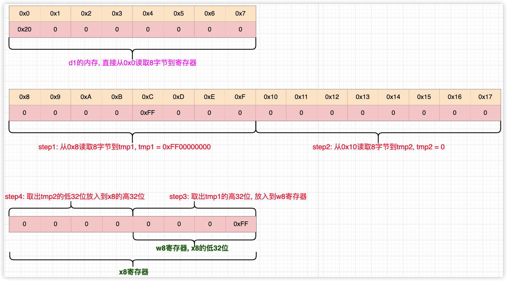

<font size = 4>

# struct
### 内存地址
内存对于CPU来说是编号的, 默认情况内存地址从0开始, CPU访问内存的地址其实是固定的(<font color = red>由硬件决定</font>), 在64位环境下, CPU发出访存时从地址`0, 8, 16, 32, ...`开始, 即CPU总是从内存地址为8倍数的编号开始. 理论上任何地址的数据都可以加载, 但加载8倍数中的内存数据要比加载非8倍数的内存数据速度要快. 举例来说:

```txt
对象        大小        地址        值
d1          8           0           0x20
d2          8           0xC         0xFF

```
> 假设当前小端并且其他的内存地址中内容都是0

---




> 图中x8寄存器左边表示高位, 右边表示低位

---

当CPU访问d1时, 可以1条指令将数据从`0x0`开始的8字节送入到寄存器, 因为d1的起始地址满足8的倍数. 但对于d2来说要想取出`0xC`下的8字节数据, CPU访存的流程:
1. 从`0x8`读取8字节到tmp1, 此刻tmp1为`0xFF00000000`
2. 从`0x10`读取8字节到tmp2, 此刻tmp2为0

由于要读取`0xC`开始的8字节, 所以需要将tmp1,tmp2进行合成:
1. 取出tmp1的高32位数据放入到w8中, 所以w8为`0xFF`
2. 取出tmp2的低32位数据放入到r8的高32位中, 所以高32位为0

同样的道理, 将内容写入到`0xC`开始的8字节也是这个过程. 由于加载8倍数的内存速度要快, 所以编译器完全可以将d2的地址放在`0x10`的位置, 这样只需要1条指令就完毕了, 这就是内存对齐的基本原理. 这里要说明一点, 上述是取数据的逻辑过程, 即CPU内部就是这么干的. 实际上汇编代码可能是这样:

```lua 
mov x9, #0xC
ldr x8, [x9]
```
即在指令上没有体现出4步操作, 但这2条汇编指令发出后, CPU内部确实要分别从2个地址取数据, 然后合成.  所以这里优化的方案就是直接将d2放在适合的内存地址:

```lua
mov x9, 0x10
ldr x8, [x9]
```
> 这样CPU内部就是直接读取0x10的8字节数据. 

内存对齐严格来说是编译器层面的工作, 即编译器事先就将对象的地址放在合适的内存位置. 除了对象内存是边界对齐(<font color = red>就是以某个对齐系数为准</font>), 还有函数地址, 堆栈对齐等. 默认情况下编译器会将对象的内存对齐系数设置为自己大小, 即`int8_t`的对齐系数为1, `int16_t`对齐系数为2, `int32_t`则为4, `int64_t`为8. 那这里就会出现这种情况`int8_t`对象可能处于非8倍数的内存, 举例来说:

```cpp
int8_t a = 20;          // &a = 0x7    
auto b = a;
```
编译器会以1为倍数来对齐对象a, 所以a的地址可能是`0x7`, 它不处于8倍数的内存地址.  逻辑上生成的汇编:

```lua
mov x9, #0x7
ldrb x8, [x9]            // 相当于b = a的操作, 后面的指令省略了(将x8的值送入到b)
```
像这种汇编确实会在CPU内部做几次寻址再合成. 但CPU内部还有基于偏移的指令, 所以编译器生成的汇编可能是这样:

```lua
mov x9, #0x0               
ldrb w8, [x9, #0x7]        ; 偏移寻址, 1字节的操作(省略了后续b=x8的指令)
```
编译器可能会找到离对象a最近的8倍数的内存地址(<font color = red>假设是0x0</font>), 然后基于它做偏移7字节. 这种汇编在CPU内部是优化的并不会像前面一样要做几次寻址再合成, 说白了就是1条指令可以搞定. 同时可以总结出单字节类型对象的内存: 它可以处于任何地址, 编译器访问内存是偏移寻址. 

对于`int16_t`这样对象:
```cpp
int16_t a = 20;         // &a = 0x6
auto b = a          
```
在arm64环境环境下, 对象的内存地址一定处于2的边界上(<font color = red>起始地址位于2的倍数上的内存</font>), 编译器生成的汇编可能是:

```lua
mov x9, #0x0
ldrh w8, [x9, #0x6]     // 2字节的操作
```
这种也是偏移指令, 并且操作是2字节, 也是1条指令可以完成的, 类似的当对象是`int32_t`时, 编译器会将对象的内存放在4倍数的地址处, 然后生成如下的汇编:

```lua
mov x9, #0x0
ldr w8, [x9, #0x4]      // 4字节的操作
```

综上:
1. 默认情况下编译器会将对象的地址存储在对齐系数为对象尺寸的边界上
2. 小于8字节的对象会找最近的8倍数的内存做偏移寻址

在c++中对象的对齐系数可以由程序员来指定

```cpp
extern "C" {
void test(){
    int8_t a,b,c;

    // 指定对齐系数为1, 所以它可能处于非2倍数的边界上
    __attribute__((aligned(1))) short d;        

    int8_t e;
    printf("%p\n", &a);    // 0x16fdff0cf                        
    printf("%p\n", &b);    // 0x16fdff0ce
    printf("%p\n", &c);    // 0x16fdff0cd
    printf("%p\n", &d);    // 0x16fdff0cb
    printf("%p\n", &e);    // 0x16fdff0ca

    auto n = d;
}
}
```

上述d对象的大小是2字节, 但程序员指定编译器对齐为1, 最后运行起来后d对象的地址处于非2倍数的边界上, 一般CPU内部会分别寻址并合成(但事实上编译器作了优化). 汇编代码如下:

```lua
cpp`::test():
    0x100003ed8 <+0>:   sub    sp, sp, #0x30
    0x100003edc <+4>:   stp    x29, x30, [sp, #0x20]
    0x100003ee0 <+8>:   add    x29, sp, #0x20
    0x100003ee4 <+12>:  mov    x9, sp                   ; x9 = sp
    0x100003ee8 <+16>:  sub    x8, x29, #0x1            ; x8 = x29 - 1, 即局部对象a的地址
    0x100003eec <+20>:  str    x8, [x9]                 ; *top = x29 - 1 = &a, 即准备调用printf, 将参数压栈

    0x100003ef0 <+24>:  adrp   x0, 0
    0x100003ef4 <+28>:  add    x0, x0, #0xfa4            ; "%p\n"
    0x100003ef8 <+32>:  str    x0, [sp, #0x10]
    0x100003efc <+36>:  bl     0x100003f98               ; symbol stub for: printf
                                                         ; 参数x0是字符串`%p\n`
                                                         ; 因为printf是可变参数, 所以参数是通过压栈
                                                         ; 目前栈顶是a对象的地址(只有1个参数)


    0x100003f00 <+40>:  ldr    x0, [sp, #0x10]          ; x0 = "%p\n"
    0x100003f04 <+44>:  mov    x9, sp                   ; x9 = sp
    0x100003f08 <+48>:  sub    x8, x29, #0x2            ; x8 = x29 - 2, 局部对象b的地址
    0x100003f0c <+52>:  str    x8, [x9]                 ; *top = &b
    0x100003f10 <+56>:  bl     0x100003f98               ; symbol stub for: printf


    0x100003f14 <+60>:  ldr    x0, [sp, #0x10]          ; x0 = "%p\n"
    0x100003f18 <+64>:  mov    x9, sp                   ; x9 = sp
    0x100003f1c <+68>:  sub    x8, x29, #0x3            ; x8 = x29 - 3, 局部对象c的地址
    0x100003f20 <+72>:  str    x8, [x9]                 ; *top = &c
    0x100003f24 <+76>:  bl     0x100003f98               ; symbol stub for: printf

    0x100003f28 <+80>:  ldr    x0, [sp, #0x10]          ; x0 = "%p\n"
    0x100003f2c <+84>:  mov    x9, sp                   ; x9 = sp
    0x100003f30 <+88>:  sub    x8, x29, #0x5            ; x8 = x29 - 5, 局部对象d的地址
    0x100003f34 <+92>:  str    x8, [x9]                 ; *top = &d
    0x100003f38 <+96>:  bl     0x100003f98               ; symbol stub for: printf

    0x100003f3c <+100>: ldr    x0, [sp, #0x10]
    0x100003f40 <+104>: mov    x9, sp
    0x100003f44 <+108>: sub    x8, x29, #0x6
    0x100003f48 <+112>: str    x8, [x9]
    0x100003f4c <+116>: bl     0x100003f98               ; symbol stub for: printf

                                                        ; __asm_short_load
->  0x100003f50 <+120>: ldurh  w8, [x29, #-0x5]         ; w8 = *d, w8中是局部对象d的值, ldurh是2字节的操作
                                                        ; 这里还是偏移地址, 以x29作偏移, 所以是编译器做了优化
    0x100003f54 <+124>: sturh  w8, [x29, #-0x8]         ; n = d
    0x100003f58 <+128>: ldp    x29, x30, [sp, #0x20]
    0x100003f5c <+132>: add    sp, sp, #0x30
    0x100003f60 <+136>: ret     
```


总结:
1. 开发中尽量使用当前系统对齐系数的类型, 如64位就使用8字节大小的类型
2. 尽量不要指定对象的对齐系数


### 结构体对齐
实际开发中会定义复杂的数据类型(struct), 这些数据类型由前面的基本类型组合而成, 寻找出一种访问任何成员的快捷方案是就是struct的内存结构. 根据前面的理论, 对象的地址处于8倍的地址上时, 效率最高, 处于自己尺寸倍数的地址时, 效率也可以接受. 所以一个结构体最理想的方案是:

```cpp
struct NO_ALIGN_T{
    char a,b,c;
};
struct ALIGN_T{
    __attribute__((packed, aligned(8))) char a,b,c;
};

printf("%ld\n", sizeof(NO_ALIGN_T));        // 3
printf("%ld\n", sizeof(ALIGN_T));           // 24
```

定义结构时即使是基本类型的char也指定对齐系数为8(`ALIGN_T`), 这样只要保证`ALIGN_T`的对象在8倍数地址上, 则它内部的成员内存地址就一定处于8倍数内存, 则访问效率就特别高. 但编译器默认情况下并不是以系统系数为对齐的, 因为会浪费内存. 编译器的方案是将成员按其类型尺寸为对齐系数. 所以正常使用的是`NO_ALIGN_T`这种类型.  现在来尝试推导struct对象的内存:

```txt
struct T{
    char a;
    short b;
    int c;
    char d;
};

struct T t;


条件:
    1. 齐系数为B(1, 2, 4, 8)
        默认是结构体成员中尺寸最大的

    2. &t = B*N      位于B倍数的内存 


对于 &t.a:
    a.size = 1
        所以它可以位于任何地址

    设正整数ka,
        &t.a = &t + ka

    当ka = 0时, 不需要额外的空间, 所以:
        ka = 0
        &t.a = &t


对于 &t.b:
    b.size = 2
        所以它必须位于2倍数地址
    
    设正整数kb, k:
        0. &t.b = &t + kb
        1. &t.b = &t.a + a.size + k
        2. &t.b = &t + ka + a.size + k
        3. &t.b = &t + 0 + 1 + k
        4. &t为偶数, &t.b为偶数, 所以k = 1 最合适
        5. kb = 2

对于 &t.c:
    c.size = 4
        所以它必须位于4倍数地址
    
    设正整数kc, k:
        1. &t.c = &t + kc

        2. &t.c = &t + kb + b.size + k = B*N + 4 + k

        3. 当B = 4, t位于4倍数内存的边界上
            &t.c = 4*N + 4 + k
            因为&t.c为4的倍数, 所以k为0时是合适的, 所以 kc = 4
            &t.c = &t + 4

        4. 当N = 8
            &t.c = (2*N + 1) * 4 + k
            因为&t.c为4的倍数, 所以k为0时是合适的, 所以 kc = 4
            &t.c = &t + 4

        5. &t.c = &t + 4


对于 &t.d:
    d.size = 1
        所以它可以位于任何地址

    所以:
        &t.d = &t + kc + c.size = &t + 4 + 4 = B*N + 8

所以结构体大小是:
    &t.d + d.size - B*N = B*N + 8 + 1 - B*N = 9

至此9是符合内存布局的, 因为当t对象的内存位于B倍数地址时, 它所有的成员基于上述的过程都在对应的内存边界上. 

但情况不是这么简单, 上述只是单个结构体对象. 假设是这样声明对象的

struct T t, t2;

理论上这2个对象的内存应该是相邻的. 现在来计算一下:
    &t2 = &t + t.size = B*N + 9
结果并不在4, 8倍数的边界, 也就是说&t2的内存边界不对.

所以编译器会做调整, 设k > 0
    &t2 = B*N + 9 + k
    1. B = 4, &t2 = 4*N + 9 + k
        &t2是4的倍数, 设 &t2 = (N + M)*4, 所以 4*M = 9 + k(M > 0, k > 0), 所以最小的时候为 M = 3, k = 3

        &t2 = &t + 12

    2. B = 8, &t2 = 8*N + 9 + k
        &t2是8的倍数, 设 &t2 = (N + M)*8, 所以 8*M = 9 + k(M > 0, k > 0), 所以最小的时候为 M = 2, k = 7

        &t2 = &t + 16

结论是: t和t2不相邻, 编译器会重新找t2的合适位置

但在代码中可以如此声明: T arr[N]. 
由于数组中元素类型相同, 并且元素是相邻的, 所以根据上述结构体大小是9字节, 则数组中元素对不上,  所以编译器计算
结构体T的大小是12或16, 也就是最后填充了额外的字节. 具体的大小和结构体本身的对齐有关. 默认情况下编译器取的B是
结构体中最大成员尺寸, 也可以自己指定
```

默认情况下编译器对结构体整体对齐取的是最大成员的尺寸,  那为什么结构大小是最大成员的尺寸的整数倍? 

```txt
struct T t,t2;

设:
    S = T.size
    C = c.size

&t.c = C*N        t.c的地址处于C倍数的地址边界上        
&t2.c = C*M       t2.c的地址也一定处于C倍数的边界上

&t2.c - &t.c = C*M - C*N

又因为2者相邻, 所以
&t2.c - &t.c = S

所以 S = C(M-N), 所以结构体大小为C的整数倍
```

结构体地址算法:
1. 以基地址为0
2. 每个成员对齐系数取自己对应类型尺寸
3. 结构体整体对齐系数取所有成员中最大的那个类型尺寸

其实结构体大小的算法是间接来的, 是先有了内存对齐的过程后才得出的结构体大小是最大成员尺寸整数倍的这个结论. 如上述举例中的T类型, 如果是8对齐, 结构体前9字节的内存偏移是不变的, 变的只是成员d后面的填充字节

```cpp
#if 0
#define ALIGN 8
#else
#define ALIGN 16
#endif

struct T{
    char a;
    short b;
    int c;
    char d;
}__attribute__((packed, aligned(ALIGN)));

#if 0
    当是8对齐时, &T.c = &T + 4
    当是16对齐,  &T.c = &T + 4

所以再扩大对齐系数后(大于最大类型的4), 也只是扩大了最后的填充空间
#endif
```


### swfit中的struct
swfit中的struct被归并为值类型, 正如字面意思值类型的对象在发生赋值时, 是内存拷贝, 也就是说结构体越大, 传递的效率就越低. 出现拷贝的场景主要有:
1. 对象接收另一对象的赋值或初始化
2. 函数参数
3. 函数返回值

```swift
struct T {
    var a: UInt32                   // 4
    var b: UInt8                    // 1
}

print(MemoryLayout<T>.size)         // 5            总共用到了5字节
print(MemoryLayout<T>.stride)       // 8            编译器开辟8字节, 为最大成员Int32的倍数
print(MemoryLayout<T>.alignment)    // 4            以Int32的尺寸对齐
    
print("----------------")


func get_addr(_ t: inout T) -> UnsafeRawPointer {
    withUnsafeMutablePointer(to: &t) {UnsafeRawPointer($0)}
}

var t1 = T(a: 20, b: 67)            
let addr_t1 = get_addr(&t1)         // t1地址

print(addr_t1.load(fromByteOffset: 0, as: UInt32.self))                             // 20, &t1.a
print(addr_t1.load(fromByteOffset: MemoryLayout<UInt32>.size, as: UInt8.self))      // 67, &t1.b

print("----------------")

t1.a = 100                                                  
t1.b = 96

print(addr_t1.load(fromByteOffset: 0, as: UInt32.self))                             // 100 &t1.a
print(addr_t1.load(fromByteOffset: MemoryLayout<UInt32>.size, as: UInt8.self))      // 96  &t1.b 

print("----------------")

var t2:T = .init(a: 1000, b: 96)                                                    
let addr_t2 = get_addr(&t2)                                                         // &t2
print(addr_t2.load(fromByteOffset: 0, as: UInt32.self))                             // 1000, &t2.a
print(addr_t2.load(fromByteOffset: MemoryLayout<UInt32>.size, as: UInt8.self))      // 96    &t2.b

print("----------------")
t1 = t2                                                                             // bit-copy, t1的内存未变, 但内容是复制的t2
print(addr_t1.load(fromByteOffset: 0, as: UInt32.self))                             / 1000, &t1.a
print(addr_t1.load(fromByteOffset: MemoryLayout<UInt32>.size, as: UInt8.self))      // 96   &t1.b
print("----------------")
t1.a = 9999                                                                         
t1.b = 2
print(addr_t1.load(fromByteOffset: 0, as: UInt32.self))                             // 9999, &t1.a
print(addr_t1.load(fromByteOffset: MemoryLayout<UInt32>.size, as: UInt8.self))      // 2     &t1.b
print(addr_t2.load(fromByteOffset: 0, as: UInt32.self))                             // 1000  &t2.a
print(addr_t2.load(fromByteOffset: MemoryLayout<UInt32>.size, as: UInt8.self))      // 96    &t2.b
```


### 构造器
在swift中所有的对象在使用前必须先初始化, 初始化struct的机制是init构造器. 如果用户不提供任何init, 则编译器会为struct生成能初始化所有成员对象的init. 如果用户提供了init, 则编译器不会生成其他的init, 但用户要保证该init必须能初始化所有的成员

```swift
struct Person {
    let age: Int
}
```
上述Person中未提供任何init构造器,但编译器会生成

```swift
init(age: Int){
    self.age = age  // init中可以修改let对象, 但也只能修改一次
} 
```
这个构造器由编译器生成, 使用它可以保证Person的所有成员被初始化, 如果let成员有默认值:

```swift
struct Person {
    let age: Int = 16
}
```
编译器只会生成类似如:

```txt
init () {
    self.age = 16
}
```

这个是编译器生成大致的init方法, 实际上因为值类型的关系, 真正的init不应该这样来理解:


```swift
let p: Person = .init()     // 8字节
```

下面直接看汇编

```lua
swift`main:
    0x100003ec4 <+0>:  stp    x29, x30, [sp, #-0x10]!
    0x100003ec8 <+4>:  mov    x29, sp
->  0x100003ecc <+8>:  bl     0x100003ee4               ; swift.Person.init() -> swift.Person at main.swift:7
    0x100003ed0 <+12>: adrp   x8, 5                     ; p对象地址
    0x100003ed4 <+16>: str    x0, [x8]                  ; 将返回值x0复制到p对象的内存, 通过init过程, x0 = 16
    0x100003ed8 <+20>: mov    w0, #0x0                  ; w0 = 0
    0x100003edc <+24>: ldp    x29, x30, [sp], #0x10     
    0x100003ee0 <+28>: ret   


swift`Person.init():
->  0x100003ee4 <+0>:  sub    sp, sp, #0x10
    0x100003ee8 <+4>:  str    xzr, [sp, #0x8]           ; *(sp + 8) = 0, 局部对象tmp = 0
    0x100003eec <+8>:  mov    w8, #0x10                 ; w8 = 16
    0x100003ef0 <+12>: mov    x0, x8                    ; x0 = 16
    0x100003ef4 <+16>: str    x0, [sp, #0x8]            ; *(sp + 0x8) = 16
                                                        ; 很明显这个局部变量其实就是对象self的地址
                                                        ; self出了函数后就会销毁
                                                        ; self的信息(16)已经被保存到了x0寄存器中
    0x100003ef8 <+20>: add    sp, sp, #0x10
    0x100003efc <+24>: ret    
```

从这里可以看出init方法中的self本质就是个局部对象, 成员age的地址本质也在栈空间中. 函数返回后, 会将数据拷贝出去, 外界再拷贝到其他位置. 上述是编译器自动生成的init, 当外界实现init时, 编译器的init方法又是怎样的呢?

```swift
struct Person {
    let age: Int = 16
    init(){
//        self.age = 16         // error 不允再次初始化
    }

    init(age: Int){
//        self.age = age;       // error 不允许再次初始化
    }
}

let p: Person = .init()
let p2: Person = .init(age: 20)
```

即使外界实现init方法, 也不能在方法实现中对age进行赋值, 因为在声明是age有默认值, 编译器规定了age的初始化必须由它自己来进行, 外界禁止初始化.

```lua
swift`main:
    0x100003e8c <+0>:  stp    x29, x30, [sp, #-0x10]!
    0x100003e90 <+4>:  mov    x29, sp
    0x100003e94 <+8>:  bl     0x100003ec0               ; swift.Person.init() -> swift.Person at main.swift:9
                                                        ; init的实现和前面一模一样
    0x100003e98 <+12>: adrp   x8, 5                     
    0x100003e9c <+16>: str    x0, [x8]

    0x100003ea0 <+20>: mov    w8, #0x14                 ; w8 = 20
    0x100003ea4 <+24>: mov    x0, x8                    ; x0 = 20(参数)
    0x100003ea8 <+28>: bl     0x100003edc               ; swift.Person.init(age: Swift.Int) -> swift.Person at main.swift:13
                                                        ; 返回后x0复制的是self的内存, 值为16

->  0x100003eac <+32>: adrp   x8, 5                     ; x8 = &p
    0x100003eb0 <+36>: str    x0, [x8, #0x8]            ; x0 = *(x8 + 8), x8 + 8表示p2对象的地址, p2和p相差8字节
    0x100003eb4 <+40>: mov    w0, #0x0                  
    0x100003eb8 <+44>: ldp    x29, x30, [sp], #0x10      
    0x100003ebc <+48>: ret    


swift`Person.init(age:):
->  0x100003edc <+0>:  sub    sp, sp, #0x10
    0x100003ee0 <+4>:  str    xzr, [sp, #0x8]           ; *(sp + 8) = 0,局部对象tmp1的内存是0 
    0x100003ee4 <+8>:  str    xzr, [sp]                 ; *sp = 0,      局部对象tmp2的内存是0
    0x100003ee8 <+12>: str    x0, [sp]                  ; *sp = x0,     所以tmp2是参数age的地址, 所以age = 20
    0x100003eec <+16>: mov    w8, #0x10                 ; w8 = 16
    0x100003ef0 <+20>: mov    x0, x8                    ; x0 = 16
    0x100003ef4 <+24>: str    x0, [sp, #0x8]            ; *(sp + 8) = 16, 即tmp1 = 16
                                                        ;   所以tmp1 是self, 即self.age = 16
    0x100003ef8 <+28>: add    sp, sp, #0x10
    0x100003efc <+32>: ret
```

综上swift中struct中的let成员若有默认值, 则禁止在构造方法中对其初始化, 否则只可以初始化一次

```swift
struct Person {
    let age: Int
    init(){
        self.age = 0
    }

    init(age: Int){
        self.age = age
    }
} 
```
像这种没有默认值的let成员必须自己在init中初始化.  构造器是可以互相调用的, 但swift还是会检查let成员的初始化次数

```swift
struct Person {
    let age: Int
    init(){
        self.init(age: 16)      
        // 调用了其他init, 则第1句必须是self.init(xxx)
    }

    init(age: Int){
        self.age = age
        // 没有调用其他的init, 则必须自己初始化所有的成员
    }
} 
```

上述这个是合理的初始化, 在一个init中如果不调用其他的init, 则必须在该init内初始化所有的成员. 如果有调用其他init, 则第1句必须是调用代码(`self.init(xxx)`). 编译器会根据情况生成多个init方法

```swift
struct Person {
    let age: Int
    var n = 20
}

let p: Person = .init(age: 16)
let p2: Person = .init(age: 16, n: 30) 
```
对于成员n, 它的默认值也是由编译器赋值, 后续只要出现手动赋值都已经不是初始化.  该demo中编译器生成了2个默认的init, 这2个init都可以保证Person对象是完全初始化的, 对应的若外界提供init则必须保证所有成员初始化

```swift
struct Person {
    static let N: Int = 20
    let age: Int
    var n = N

    init(){
        self.init(age: 16)      //调用其他init, 第1句必须为init
    }

    init(age: Int){
        self.init(age: age, n: Self.N)  //调用其他init
    }

    init(age:Int, n: Int){
        self.age = age          // 初始化age
        self.n = n              // 这里不是初始化, 是赋值
    }
}
```


### 结构体传值
struct作为值类型的数据, 理论上在产生参数传递时会复制所有的内存. 但其实根据swift中的参数传递规则:
1. 默认情况下参数的类型是let, 不能修改
2. 可以指定inout传递参数的地址

假如:

```swift
struct T {
    let a,b,c,d
}

func test(t: T){}

let t = T.init(a: 20, b: 21, c: 22, d: 23)
test(t: t)
```

因为参数t是let不能修改的, 试想一下编译器可不可以做这样的优化: 直接传递t的地址到函数中!! 因为声明的t参数根本不能改变, 所以传递一个地址是否更简单, 这样可以减少空间并提高效率, 但事实上汇编层面还是按所谓的值传递, 复制所有的内存到参数寄存器, 然后调用函数

```lua
swift`main:
    0x100003a2c <+0>:   sub    sp, sp, #0x20
    0x100003a30 <+4>:   stp    x29, x30, [sp, #0x10]
    0x100003a34 <+8>:   add    x29, sp, #0x10
    0x100003a38 <+12>:  adrp   x8, 5
    0x100003a3c <+16>:  str    x8, [sp]
    0x100003a40 <+20>:  adrp   x8, 5
    0x100003a44 <+24>:  add    x8, x8, #0x0              ; swift.t : swift.T
    0x100003a48 <+28>:  str    x8, [sp, #0x8]
    0x100003a4c <+32>:  mov    w8, #0x14
    0x100003a50 <+36>:  mov    x0, x8
    0x100003a54 <+40>:  mov    w8, #0x15
    0x100003a58 <+44>:  mov    x1, x8
    0x100003a5c <+48>:  mov    w8, #0x16
    0x100003a60 <+52>:  mov    x2, x8
    0x100003a64 <+56>:  mov    w8, #0x17
    0x100003a68 <+60>:  mov    x3, x8
                                                        ; 初始化x0, x1, x2, x3 4个要传递的参数
    0x100003a6c <+64>:  bl     0x100003aac               ; swift.T.init(a: Swift.Int, b: Swift.Int, c: Swift.Int, d: Swift.Int) -> swift.T at main.swift

->  0x100003a70 <+68>:  ldr    x9, [sp]
    0x100003a74 <+72>:  ldr    x8, [sp, #0x8]
    0x100003a78 <+76>:  str    x0, [x9]
    0x100003a7c <+80>:  str    x1, [x8, #0x8]
    0x100003a80 <+84>:  str    x2, [x8, #0x10]
    0x100003a84 <+88>:  str    x3, [x8, #0x18]
                                                        ; 调用完函数后, 将数据复制到局部对象中, 这里是调用函数在保存x0到x3寄存器

    0x100003a88 <+92>:  ldr    x0, [x9]
    0x100003a8c <+96>:  ldr    x1, [x8, #0x8]
    0x100003a90 <+100>: ldr    x2, [x8, #0x10]
    0x100003a94 <+104>: ldr    x3, [x8, #0x18]
                                                        ; 读取参数值到寄存器,准备调用test函数
    0x100003a98 <+108>: bl     0x100003ab0               ; swift.test(t: swift.T) -> () at main.swift:13
                                                        ; 可以发现没有任何的优化(笔者未开启别的优化)
    0x100003a9c <+112>: mov    w0, #0x0
    0x100003aa0 <+116>: ldp    x29, x30, [sp, #0x10]
    0x100003aa4 <+120>: add    sp, sp, #0x20
    0x100003aa8 <+124>: ret    
```

上述汇编在传递struct时没有任何优化, 笔者认为其实在参数为let时可以:
1. 在main函数开始时就预备32字节的空间
2. 调用test时, 直接将起始空间的地址传递到函数内, 函数内的实现以起始地址去查找数据

> 笔者未开启任何优化选项.

上述这种情况的传值是具体的类型, 前面介提到过swift中的函数模板其实是固定生成好的独立的函数, 笔者想要探究的是同样的函数以泛型实现时, 参数是怎么传递的?

```swift
struct T {
    var a, b, c, d: Int
}


func test<ARG_T>(t: ARG_T){

}

let t = T.init(a: 20, b: 21, c: 22, d: 23)      // __code_call_test
test(t: t)
```

可以想像以泛型实现时, 编译器在单独编译test函数时, 根本不知道`ARG_T`的类型是什么, 也不可能知道它的大小, 所以`__code_call_test`时就不可能指定要传递多少个寄存器. 因为泛型是抽象的实现, test函数所需要的信息:
1. 类型(`metadata`)
2. 类型对应的对象

```lua
swift`main:
    0x100003a14 <+0>:   sub    sp, sp, #0x40
    0x100003a18 <+4>:   stp    x29, x30, [sp, #0x30]
    0x100003a1c <+8>:   add    x29, sp, #0x30
    0x100003a20 <+12>:  adrp   x8, 5
    0x100003a24 <+16>:  str    x8, [sp]
    0x100003a28 <+20>:  adrp   x8, 5
    0x100003a2c <+24>:  add    x8, x8, #0x0              ; swift.t : swift.T
    0x100003a30 <+28>:  str    x8, [sp, #0x8]           ; *(sp + 8) = x8 = &t
    0x100003a34 <+32>:  mov    w8, #0x14
    0x100003a38 <+36>:  mov    x0, x8
    0x100003a3c <+40>:  mov    w8, #0x15
    0x100003a40 <+44>:  mov    x1, x8
    0x100003a44 <+48>:  mov    w8, #0x16
    0x100003a48 <+52>:  mov    x2, x8
    0x100003a4c <+56>:  mov    w8, #0x17
    0x100003a50 <+60>:  mov    x3, x8
->  0x100003a54 <+64>:  bl     0x100003ab4               ; swift.T.init(a: Swift.Int, b: Swift.Int, c: Swift.Int, d: Swift.Int) -> swift.T at main.swift
                                                        ; 上面调用init, 初始化x0, x1, x2, x3
                                                        ; 由于函数什么也没做, 所以4个寄存器没变

    0x100003a58 <+68>:  ldr    x9, [sp]                 ; x9 = *sp = &t
    0x100003a5c <+72>:  ldr    x8, [sp, #0x8]           ; x8 = *(sp + 8) = &t
    0x100003a60 <+76>:  str    x0, [x9]                 ; *x9 = x0,         即t.a = 20
    0x100003a64 <+80>:  str    x1, [x8, #0x8]           ; *(x8 + 8)  = x1,  即t.b = 21
    0x100003a68 <+84>:  str    x2, [x8, #0x10]          ; *(x8 + 16) = x2,  即t.c = 22
    0x100003a6c <+88>:  str    x3, [x8, #0x18]          ; *(x8 + 18) = x3,  即t.d = 23
                                                        ; 函数调用完毕, 存储到全局对象t中

    0x100003a70 <+92>:  ldr    x11, [x9]                ; x11 = *x9,        即x11 = t.a
    0x100003a74 <+96>:  ldr    x10, [x8, #0x8]          ; x10 = *(x8 + 8)   即x10 = t.b
    0x100003a78 <+100>: ldr    x9, [x8, #0x10]          ; x9  = *(x8 + 16)  即x9  = t.c
    0x100003a7c <+104>: ldr    x8, [x8, #0x18]          ; x8  = *(x8 + 24)  即x8  = t.d
                                                        ; 从全局对象t再出来到x11,x10,x9,x8中

    0x100003a80 <+108>: add    x0, sp, #0x10            ; x0 = sp + 16,     x0 = &tmp
    0x100003a84 <+112>: str    x11, [sp, #0x10]         ; *(sp + 16) = x11 = t.a = 20
    0x100003a88 <+116>: str    x10, [sp, #0x18]         ; *(sp + 24) = x10 = t.b = 21 
    0x100003a8c <+120>: str    x9, [sp, #0x20]          ; *(sp + 32) = x9  = t.c = 22
    0x100003a90 <+124>: str    x8, [sp, #0x28]          ; *(sp + 40) = x8  = t.d = 23
                                                        ; 所以 tmp指向
                                                        ; 因为要调用函数test, 它是泛型函数, 需要参数t
                                                        ; 但这里传递的是x0, x0存储的是tmp的地址

    0x100003a94 <+128>: adrp   x8, 1
    0x100003a98 <+132>: add    x8, x8, #0x60             ; full type metadata for swift.T
    0x100003a9c <+136>: add    x1, x8, #0x10            ; x1是T类型的metadata地址
    0x100003aa0 <+140>: bl     0x100003ab8               ; swift.test<T>(t: T) -> () at main.swift:12
                                                        
    0x100003aa4 <+144>: mov    w0, #0x0
    0x100003aa8 <+148>: ldp    x29, x30, [sp, #0x30]
    0x100003aac <+152>: add    sp, sp, #0x40
    0x100003ab0 <+156>: ret    
```

上述汇编的过程和笔者预料的一样, 就是因为泛型函数是独立公共的, 所以每次调用时传递的参数类型不确定导致参数的大小是不确定的, 所以理应传递参数的地址和metadata. 总结就是:
1. 泛型参数传递的是局部对象的地址(`x0`)
2. 会多传递参数的类型信息metadata(`x1`)


### 函数模板缺点
在函数章节总结了swift中函数会被单独编译成函数实现, 函数模板的编译依赖于协议, 而协议中只能定义方法, 所以在函数模板实现中是不可能直接访问对象成员的内存地址. 就是说函数模板中无法访问对象的成员(`存储属性`), 但可以利用协议来达到间接访问

```swift
protocol getter {
    associatedtype member_type
    func member(_ idx: Int) -> member_type?
}

struct T : getter{
    // 函数的返回值可以确定T类型的member_type为Int
    func member(_ idx: Int) -> Int?{
        switch idx  {
        case 0:
            return self.a
        case 1:
            return self.b
        case 2:
            return self.c
        case 3:
            return self.d
        default:
            return nil
        }
    }
    var a, b, c, d: Int
}

func test<ARG_T>(t: inout ARG_T) where ARG_T : getter{
    print(String(describing: t.member(1)))
    print(String(describing: t.member(2)))
    print(String(describing: t.member(3)))
    print(String(describing: t.member(0)))
    print(String(describing: t.member(7)))

    // 在模板中间接访问到了t对象的成员值
}

var t: T = .init(a: 20, b: 21, c: 22, d: 23)
test(t: &t) 
```

该demo通过协议的方法可以间接获取到t对象的成员值, 但这个代价比较大, 并且无法在函数模板中得到`t.member`的真实类型(<font color = red>因为函数只看得到协议</font>). 总结起来就是swift中的函数模板有很大限制:
1. 无法访问成员(`存储属性`)
2. 只能访问成员方法
3. 执行效率相较于c++不高

swift中标准库的架构是:
1. 将struct中所有的接口通过协议定义
2. struct只负责实现协议的接口

这样的好处是方便函数模板的实现.


### 成员方法(成员函数)
swift中所有值类型都可以在内部直接定义函数, 这些函数被称为成员方法. 成员方法本质上就是函数, 它们的定义格式和函数没有区别. 只能通过当前类型的对象调用它们 
```swift
struct int : ExpressibleByIntegerLiteral{
    var this: Int

    init(integerLiteral value: IntegerLiteralType) {
        this = value
    }

    init(_ number: Int) {
        this = number
    }

    func sum(with number: Int) -> Int {
        this + number
    }

    func sub(with number: Int) -> Int {
        this - number
    }
}

let n1 = int.init(20)           
print(n1.sub(with: 30))
let n2: int = 50
print(n2.sub(with: 70))
```

int类型定义了2个构造器, 在创建对象时可以有3种方式:
1. `init(_ : Int)`
2. `init(integerLiteral  : IntegerLiteralType)`
3. `let n2: int = 50`

> 当想计算某个对象与另一个数值的sum或sub时, 必须通过该对象调用相关的成员方法, 成员方法内部做相应的操作将结果返回到外界. 

int作为一个Int的包装它应该有自增的成员方法, 举例:

```swift
func inc(with number: Int = 1) -> int {
    int(sum(with: number))
}
```
该成员方法内部返回了一个新的对象, 这里面的过程如下:
1. 当前调用对象本身做sum操作
2. 构造要返回的int对象
    - 进入到init函数内部产生局部对象
    - init返回出来前将局部对象复制到了寄存器(<font color = red>假如是x0</font>)
3. inc函数返回
    - 直接返回寄存器

```swift
let n3 = int.init(integerLiteral: 30)
let n4 = n3.inc(with: 5)
```
n4接收返回值, 会将寄存器里的值再复制到n4对象中, 这里面最核心的一点是要确定: 成员方法sum,inc的当前调用对象是不是本身(<font color = red>后面探究</font>)??

正常情况下一个自增的成员函数应该是对自己进行增加:
```cpp
int i = 0;
++i;
```
如c++中, 当`++i`时, 调用层面实际未产生其他对象, 整个操作是在i的内存中将值做加1后返回i本身. 所以正确的inc函数应该是这样的

```swift
mutating func inc(with number: Int = 1) -> int {
    this += number      // 对自身的成员做修改
    return self         // 返回自己
}
```

默认情况下值类型的成员方法中不允许对自身做修改, 要想做修改必须指定`mutating`. 成员方法返回了`self`, self表示当前调用对象. 

```swift
var n4 = int.init(integerLiteral: 30)
print(n4.inc(with: 5))
```

> 不能使用常量对象调用`inc`, 因为方法会修改调用者, 而let对象是常量不允许修改它的内存, 所以编译器不允许let对象调用mutating成员方法. 

这里面要追究一些细节, 因为int是值类型, 所以调用其对象的成员方法时, 传递第1个隐藏参数时很可能在做拷贝!! 现在来思考: 成员函数内部的当前调用者self是临时局部对象还是对外界调用者的地址引用? inc函数返回self后到底是不是返回的自身(引用)?

### self
self在逻辑上表示当前调用对象, 从逻辑上来看谁在调用, 则self就表示谁, 即self应该是地址引用. 
```swift
struct int : ExpressibleByIntegerLiteral{
    var this: Int

    init(integerLiteral value: IntegerLiteralType) {
        this = value
    }

    mutating func inc(with number: Int = 1) -> int {
        this += number
        return self
    }
}

var n4: int = 20
var n5 = n4.inc(with: 0xff)
```

下面看下main函数和inc成员方法的汇编, 主要探究self到底是在拷贝还是地址引用

```lua
swift`main:
    0x100003cfc <+0>:   sub    sp, sp, #0x50
    0x100003d00 <+4>:   stp    x20, x19, [sp, #0x30]
    0x100003d04 <+8>:   stp    x29, x30, [sp, #0x40]
    0x100003d08 <+12>:  add    x29, sp, #0x40

    0x100003d0c <+16>:  mov    w8, #0x14                ; x8 = 20
    0x100003d10 <+20>:  mov    x0, x8                   ; x0 = 20
->  0x100003d14 <+24>:  bl     0x100003d80               ; swift.int.init(integerLiteral: Swift.Int) -> swift.int at main.swift:9
                                                        ; 当前对象的大小是8字节, 可以使用x0寄存器来表示它
                                                        ; 调用init, 内部有个局部变量 tmp0, 然后再将tmp0拷贝到x0寄存器

    0x100003d18 <+28>:  adrp   x8, 5                    ; x8 = &n4
    0x100003d1c <+32>:  adrp   x20, 5                   ; x20 = &n4
    0x100003d20 <+36>:  add    x20, x20, #0x0            ; swift.n4 : swift.int

    0x100003d24 <+40>:  str    x0, [x8]                 ; x0是返回值, x0 = 20, *x8 = 20, 即n4 = 20
    0x100003d28 <+44>:  mov    x0, x20                  ; x0 = x20, x0 = &n4
    0x100003d2c <+48>:  add    x1, sp, #0x18            ; x1 = sp + 0x18,  x1指向局部变量, x1 = &tmp1
    0x100003d30 <+52>:  str    x1, [sp, #0x8]           ; *(sp + 0x8) = &tmp1
    0x100003d34 <+56>:  mov    w8, #0x21                ; w8 = 33(x8的高32位清零了)
    0x100003d38 <+60>:  mov    x2, x8                   ; x2 = 33
    0x100003d3c <+64>:  mov    x3, #0x0                 ; x3 = 0
    0x100003d40 <+68>:  bl     0x100003e64               ; symbol stub for: swift_beginAccess
                                                        ; 调用函数, 它可能需要4个参数(x0, x1, x2, x3)

    0x100003d44 <+72>:  mov    w8, #0xff                ; w8 = 0xff
    0x100003d48 <+76>:  mov    x0, x8                   ; x0 = 0xff
    0x100003d4c <+80>:  bl     0x100003d9c               ; swift.int.inc(with: Swift.Int) -> swift.int at main.swift:25
                                                        ; 调用函数, 这里因为是调用成员方法, 理论上应该有参数:
                                                        ;   1. self
                                                        ;   2. with
                                                        ; 根据arm传参的顺序 x0~x7, 所以一般情况应该是:
                                                        ;   x0 = self, self = &n4
                                                        ;   x1 = with, with = 0xff
                                                        ; 但事实上:
                                                        ;   x0 = 0xff
                                                        ;   x1 = &tmp
                                                        ; 所以从参数传递上感觉就不对, 这里直接总结:
                                                        ;   swift确实传递了 地址(&n4) 和 参数with(0xff), 只不过是:
                                                        ;       x20 = self = &n4
                                                        ;       x0  = 0xff = with

    0x100003d50 <+84>:  mov    x8, x0                   ; x8 = x0, x0是返回值, 即n4.inc成员方法内部对n4对象内存的拷贝
    0x100003d54 <+88>:  ldr    x0, [sp, #0x8]           ; x0 = *tmp1, 给 swift_endAccess用的参数
    0x100003d58 <+92>:  str    x8, [sp, #0x10]          ; *(sp + 16) = x8, 局部对象存储 n4.inc的返回值(也就是在拷贝)

    0x100003d5c <+96>:  bl     0x100003e70               ; symbol stub for: swift_endAccess

    0x100003d60 <+100>: ldr    x0, [sp, #0x10]          ; x0 = *(sp + 16), 取出 n4.inc的返回值(这其实也是拷贝, 拷贝的是int局部对象)
    0x100003d64 <+104>: adrp   x8, 5                    ; x8 = &n4
    0x100003d68 <+108>: str    x0, [x8, #0x8]           ; *(x8 + 8) = x0, 即 *&n5 = x0, 将int局部对象的值再拷贝到全局对象n5的内存中
    0x100003d6c <+112>: mov    w0, #0x0
    0x100003d70 <+116>: ldp    x29, x30, [sp, #0x40]
    0x100003d74 <+120>: ldp    x20, x19, [sp, #0x30]
    0x100003d78 <+124>: add    sp, sp, #0x50
    0x100003d7c <+128>: ret     


swift`int.inc(with:):
->  0x100003d9c <+0>:  sub    sp, sp, #0x20 
    0x100003da0 <+4>:  str    x20, [sp]                 ; x20 = &4, 所以 *sp = &n4, 局部对象指向n4
    0x100003da4 <+8>:  str    xzr, [sp, #0x18]          ; *(sp + 24) = 0, 局部对象tmp0 = 0
    0x100003da8 <+12>: str    xzr, [sp, #0x10]          ; *(sp + 16) = 0, 局部对象tmp1 = 0
    0x100003dac <+16>: str    x0, [sp, #0x18]           ; *(sp + 24) = x0 = 0xff,   x0是第1参数0xff
    0x100003db0 <+20>: mov    x8, x20                   ; x8 = &n4
    0x100003db4 <+24>: str    x8, [sp, #0x10]           ; *(sp + 16) = &n4
    0x100003db8 <+28>: ldr    x8, [x20]                 ; x8 = *n4 = 20
    0x100003dbc <+32>: adds   x8, x8, x0                ; x8 = x8 + x0 = 20 + 0xff
    0x100003dc0 <+36>: str    x8, [sp, #0x8]            ; *(sp + 8) = x8, 局部对象tmp2 = x8(结果)
    0x100003dc4 <+40>: cset   w8, vs                    ; 检查前面的加法是否溢出(加法时自动置位), 根据溢出标记位是否为0设置w8
    0x100003dc8 <+44>: tbnz   w8, #0x0, 0x100003de8     ; <+76> [inlined] Swift runtime failure: arithmetic overflow at <compiler-generated>
                                                        ; 溢出后(w8被置位1) runtime error

    0x100003dcc <+48>: b      0x100003dd0               ; <+52> at main.swift
    0x100003dd0 <+52>: ldr    x8, [sp]                  ; 未溢出, x8 = *sp = &n4
    0x100003dd4 <+56>: ldr    x9, [sp, #0x8]            ; x9 = *(sp + 8), 取出前面20 + 0xff的结果
    0x100003dd8 <+60>: str    x9, [x8]                  ; *x8 = x9, 即n4的值为计算结果( this+ = number)     __asm_mod_self
    0x100003ddc <+64>: ldr    x0, [x8]                  ; x0 = *x8 = n4, x0存储计算结果, 实际上x0同时可以看作int对象的内存
    0x100003de0 <+68>: add    sp, sp, #0x20
    0x100003de4 <+72>: ret    
    0x100003de8 <+76>: brk    #0x1
```

从整个汇编过程来看:
1. 成员方法调用时self传递的是调用者的地址(`x20`)
2. 如果成员方法内部修改当前调用者时, 实际上最终的效果是修改调用者本身(`__asm_mod_self`)
3. 成员方法返回与self相同类型的对象时, 实际上返回的是拷贝

### 拷贝并不会触发init
上小节通过汇编可以查看到值类型成员方法在返回自身类型时, 会做内存拷贝(<font color = red>虽然demo中int类型大小只是8字节</font>), 这中间的汇编指令在逻辑上就是在制造局部对象, 如:
1. `n4.inc`调用时, 内部做加法完毕后将结果存储在了x0, 最后由x0返回, x0和int内存布局是一致的, 所以可以将x0就看作int的局部对象, 所以外界拿到x0后再从x0复制到n5对象, 逻辑上就是在完全拷贝int对象. 但这个过程并不会发生init方法的调用.

```swift
struct int : ExpressibleByIntegerLiteral{
    var this: Int

    init(integerLiteral value: IntegerLiteralType) {
        print("init")
        this = value
    }

    mutating func inc(with number: Int = 1) -> int {
        this += number
        return self
    }
}
var n4: int = 20
var n5 = n4.inc(with: 0xff) 
```

这中间只打印了1次`init`, 说明整个过程中所谓的拷贝并没有产生init的函数调用. 

### 临时对象都是let
所谓的临时对象就是没有接收者, 默认这些对象是常量, 不能修改内存

```swift
struct T {
    func f1(){}
    mutating func f2(){}
}

func get_t() -> T {
    T()
}

get_t().f1()            // 没有问题, get_()返回let对象, 可以调用f1()
get_t().f2()            // 常量对象不能调用mutating方法
```

### 值类型与链式编程
因为值类型的成员方法返回的是拷贝, 所以如果值类型所占空间比较大时, 不适合使用链式编程
```swift
struct int : ExpressibleByIntegerLiteral{
    var this: Int

    init(integerLiteral value: IntegerLiteralType) {
        this = value
    }

    init(_ number: Int) {
        this = number
    }

    func sum(with number: Int) ->  int {
        int.init(this + number)
    }

    func sub(with number: Int) -> int {
        type(of: self).init(this - number)
    }

    func mul(with number: Int) -> int {
        Self.init(this * number)
    }

    func div(wthi number: Int) -> int {
        Self(this / number)
    }

    func get() -> Int {
        this
    }

    func inc(with number: Int = 1) -> int {
        type(of: self).init(this + number)
    }
}
let result = int(2).inc(with: 20).mul(with: 3).div(wthi: 4).sub(with: 2).get()
print(result)
```
代码中创建对象有4种方案:
1. `int(xxx)`: int用在编译期是最通常的构造器的调用
2. `type(of: self)`: 在运行过程中动态根据当前调用者self获取到它的类型, 然后调用构造器
3. `Self`: 一种简单写法(<font color = red>大写</font>), 用在成员方法中, 用来引用当前类型
4. `Self.init`: 同第3种

> 整个链式调用的过程中每一次成员方法内部在返回时都会产生拷贝, 目前int类型的空间并不大, 还不足以有性能上的损失. 

### 成员方法类型
成员方法本质是函数, 所以也有对应的函数类型, 只不过成员方法必须由对象调用, 所以函数类型中必须要有类型信息

```swift
struct T{
    let number: Int
    func f1() {}
    func f2(_ number: Int){}

    init(){
        self.init(0)
    }
    init(_ number: Int) {
        self.number = number
    }

    static func f1(){}
    static func f2(_ number: Int){}
}

let f1: (T)->()->() = T.f1          // 成员方法f1 (T) -> () -> ()
let f2: (T)->(Int)->() = T.f2       // 成员方法f2 (T) -> (Int) -> ()
let i: ()->T = T.init               // init的类型其实是返回T类型的函数   () -> T
let t = i()                         // 相当于调用init方法, 生成t对象
print(t.number)                     // 0

let F1: ()->() = T.f1               // 类型方法(静态方法)f1, 其实就是函数
let F2: (Int)->() = T.f2            // 类型方法f2
```

### 类型属性(静态成员)
swift中也有像OC或c++中的静态成员, 实际上3种语言中的静态成员本质都是全局对象, swfit中的静态成员被称为类型属性, 使用static修饰的对象就是类型属性

```swift
struct int: Equatable{
    static let MAX: Int = Int.max
    static let MIN: Int = Int.min
    static var count: Int = 0

    var data: Int

    init(data: Int = 0){
        self.data = data
        int.count += 1
    }

    static func ==(_ left: int, _ right: int) -> Bool {
        return left.data == right.data
    }
}
```

demo中定义了3个类型属性:
1. `MAX`: 用来表示整数的最大值
2. `MIN`: 用来表示整数的最小值
3. `count`: 用来记录产生了多少个int对象

因为类型本身没有特定的初始化函数, 所以在定义类型属性时必须直接初始化. 类型属性的调用只能通过类型本身, 不允许使用对象调用

```swift
print(int.count)                // 通过类型访问类型属性

let i: int = .init(data: 20)
print(i.conut)                  // 不允许使用对象访问类型属性

print(type(of: i).count)        // 获取i的类型, 并访问类型属性
```

同样的不允许在类型方法(`如func == `)访问对象属性, 因为类型属性属于类型, 它和对象没有关系, 所以逻辑上不应该访问到对象成员(方法和属性)

```swift
static func test(){
    print("data:\(data)")       // 不允许访问对象的成员
} 
// 省略了int的其他部分
```

### 类型属性内存布局(全局对象)
实际上类型属性本质就是全局对象, 所以它惯穿整个进程的生命周期. 在讨论类型属性之前先来看一下全局对象的初始化过程. 首先swift中的全局对象有提前声明的性质
```swift
print(a)        // 代码中a对象的声明位于该语句之后, 但这里可以打印a的值, 结果是0

let a = 20      // 定义全局对象a
```

其实这很好理解, 而且是必然的: 因为swift编译代码时将对象a编译成了全局对象, 所以对象a在可执行文件中占据空间(<font color = red>全局段</font>). 当程序启动前内核布署进程环境从可执行文件中加载出全局段的内容到内存中的全局区(填充为0), 此刻还未进入到main函数, 但逻辑上对象a已经加载进了内存, 它处于全局区, 并且a对象的内存其实早在编译时就确定了. 当进入到main函数后, 所有的代码其实处于main函数的栈空间内, 此刻访问对象a逻辑上是没错的, 只不过a还未被swift初始化.  但严格来说`print(a)`应该是不允许的. 当然不必过分纠结这些, 现在关心的是全局对象的初始化过程!!!


对象a在声明时直接提供了默认值, 这个赋值的过程是在进入到main函数后由编译器找到对象a的地址将20复制到a的内存中. 这种初始化方式是安全的, 因为调用main函数的环境一定处于单线程,  那现在的问题是: <font color = red>全局对象a声明和初始化可以分开</font>, 当声明和初始化分开, 启动多线程是不是一个不安全的操作

```swift
import os

var a: Int = 8      // __code_0
var b: String       // __code_1

for _ in 1...3 {    // __code_loop
    os.pthread_create( //__code_thread
        withUnsafePointer(to: os.pthread_t.init(nil), {UnsafeMutablePointer.init(mutating: $0)}),
        nil,
        {_ in
            print("thread:\(os.pthread_self())")        // __print_pid
            b = String(describing: os.pthread_self())   // __code_init_b
            print("b:\(b)")                             // __print_b
            return nil
        },
        nil)
}

os.sleep(1)         // __code_sleep

// __code_a_addr
let a_ptr = withUnsafeMutablePointer(to: &a, {UnsafeMutableRawPointer($0)})             

// __print_b_from_ptr
print(a_ptr.load(fromByteOffset: MemoryLayout.stride(ofValue: a), as: String.self))

// __code_pasue
os.pause()
```

上述代码功能: 多线程下初始化全局对象b, 最后b被初始化的值是不确定的. 其实严格来说只有1次初始化, 后续的都是再次赋值. 讲一下流程:
1. 定义全局变量a,b. 定义a的目的是为了通过a的地址找到b的地址, 避免代码中直接在主线程中访问b被编译器报错(<font color = red>b未被初始化</font>)
2. 开辟3个线程:
    1. 内部打印线程标识(`__print_pid`)
    2. 初始化b(`code_init_b`)
    3. 打印当前b的值(`__print_b`)
3. 主线程睡眠等所有的子线程结束(`__code_sleep`)
4. 获取对象a的地址(`__code_a_addr`)
5. 通过对象a的地址获取到对象b的地址, 并打印, 这是为了防止直接访问到对象b编译器报错(`未初始化b`)

最后打印结果如下:

```bash
thread:0x000000016fe87000           // __print_pid
thread:0x000000016ff13000
thread:0x000000016ff9f000
b:0x000000016fe87000                // __print_b
b:0x000000016ff13000
b:0x000000016ff9f000                
0x000000016ff9f000                  // __print_b_from_ptr
```

多次调试时b对象中的值并不一定是最后一个线程打印的`__print_b`. 也就是说b的初始化值是不确定的并且是不安全的. 在该demo中使用了pthread级别的线程, 这样编译器不会报错(<font color = red>笔者是随机测试出来的</font>), 正常情况下在任何函数中访问b都会被编译器报错

```swift
var b: String


func test(){
    b = "hello"             // error, b未初始化
}

func test(_ f : ()->()){}

test()

test {
    b = "hello"             // error, 同上
}

DispatchQueue.global().async {  // 另一种多线程
    b = "hello"             // 同上
}
```

总结全局变量的初始化在某些情况下是不安全的. 但对于结构体中的类型属性系统是怎么初始化的呢? 看一下下面这个测试 

```swift
import os
import Dispatch

var g0:Int = 0xee                           // __code_global_g0

struct int: Equatable{
    static var MAX: Int = Int.max               
    static var MIN: Int = Int.min
    static var count: Int = init_static()   // __code_static_global

    var data: Int

    init(data: Int) {
        Self.count += 1                     // __code_add_count
        self.data = data
    }

    static func ==(_ left: int, _ right: int) -> Bool {
        return left.data == right.data
    }
}


func init_static() -> Int{                  // __code_init_static
    print("init_static")
    return 20
}


os.signal(os.SIGUSR1) { _ in}               // __code_register_sig

DispatchQueue.global().async {
    os.sleep(5)                             // __code_sub_thread_sleep
    os.kill(os.getpid(), os.SIGUSR1)        // __code_send_sig
}

os.sleep(UInt32.max)                        // __code_main_thread_sleep

print("wake up")                            

typealias PTR = UnsafeMutableRawPointer
typealias TUPLE = (g0: PTR, MAX: PTR, MIN: PTR, count: PTR)


let tuple: TUPLE = (
    withUnsafeMutablePointer(to: &g0, {UnsafeMutableRawPointer($0)}),
    withUnsafeMutablePointer(to: &int.MAX, {UnsafeMutableRawPointer($0)}),
    withUnsafeMutablePointer(to: &int.MIN, {UnsafeMutableRawPointer($0)}),
    withUnsafeMutablePointer(to: &int.count, {UnsafeMutableRawPointer($0)}) // __code_fir_access_count
)

print(tuple)                                // __code_print_ptr

print(int.MIN, int.MAX, int.count)          // __code_print_value

var dif = tuple.g0 - tuple.MIN
tuple.g0.storeBytes(of: 1234, toByteOffset: -dif, as: Int.self)
dif     = tuple.g0 - tuple.MAX
tuple.g0.storeBytes(of: 5678, toByteOffset: -dif, as: Int.self)
dif     = tuple.g0 - tuple.count
tuple.g0.storeBytes(of: 0x9abc, toByteOffset: -dif, as: Int.self)
print(int.MIN, int.MAX, int.count)
```

该demo功能:
1. 测试类型属性的地址区间(<font color = red>全局区</font>)
2. 类型属性的初始化是访问时才加载(<font color = red>懒加载</font>)

流程:
1. 定义第1个全局对象g0(`__code_global_g0`)
2. 定义int类型, 其中声明了3个类型属性(`__code_static_global`)
    - 前2个都有默认值
    - count的默认值是通过函数`init_static`来初始化
3. 定义int类型的构造器, 其中会访问count类型属性, 记录int对象数量(`__code_add_count`)
4. 定义函数`init_static`(`__code_init_static`)
    - 用来初始化类型属性count
    - 通过打印测试出系统自动初始化了count
5. main线程注册信号SIGUSR1(`__code_register_sig`)
6. 启动子线程
    - 睡眠5秒
    - 发送`SIGUSR1`, 会打断main线程的sleep函数(`__code_send_sig`)
7. main线程永久睡眠(`__code_main_thread_sleep`)
    - 6和7的调用顺序是不确定的
8. main线程被唤醒
9. 获取所有全局对象的地址(<font color = red>包括类型属性</font>)
    - 这一步会第1次访问到类型属性
    - 由于是第1次访问到count, 所以编译器调用了`init_static`函数, 其他2个类型属性也是一样的道理, 只是这里测试打印的是count
10. 打印出地址信息(`__code_print_ptr`)
11. 打印出3个类型属性的值(`__code_print_value`)
    - 这个时刻下它们的值是正确的
12. 通过全局对象g0的地址做偏移, 对其他3个类型属性的内存做修改, 并打印出最后的内容


测试结果如下:

```bash
wake up                 # main线程被信号打断醒来, 可以发现在访问int.count前, count的初始化函数没有被调用
init_static             # __code_fir_access_count, 即第1次访问int.count时被系统调用了init_static函数来初始化类型属性 
(g0: 0x0000000100008038, MAX: 0x0000000100008000, MIN: 0x0000000100008008, count: 0x0000000100008068)           # 地址打印
-9223372036854775808 9223372036854775807 20 # 未修改前3个类型属性内容, 是正确的
1234 5678 39612         # 通过g0地址做偏移后, 修改后的内容
```
从测试结果可以看出来:
1. 3个类型属性的地址位于全局区, 但系统定义全局对象地址并不是代码中声明对象的顺序, 如g0对象的地址并不是第1个, 事实上g0, MAX, MIN, count这4个全局对象在代码中是顺序声明的. 其实另外还有2个全局对象`dif`和`tuple`, 但这里不关心
2. swift对待类型属性的初始化并不是进入main函数就开始了, 是在外界第1次访问到时才做的初始化(<font color = red>通过`__code_init_static`的打印</font>). 


### 类型属性初始化是安全的
全局对象的初始化是不安全的, 那是不是意味着类型属性的初始化也是不安全的呢? 这里既可以从代码层面做验证, 也可以通过汇编查看初始化过程的调用栈. 先来看代码层面的测试. 思路是在初始化过程的函数中阻塞, 看某一条线程阻塞期间, 其他线程能不能进入到初始化函数, 若不能进入则表示初始化函数是互斥调用的

```swift
import os

struct int: Equatable{
    static var count: Int = init_static()
}

print("main:\(os.pthread_self())")

for _ in 3...10 {
    os.pthread_create(withUnsafePointer(to: os.pthread_t.init(nil)){UnsafeMutablePointer.init(mutating:$0)},nil, {
        _ in
        print("sub:\(os.pthread_self()) \(int.count)")  // __code_access_count
        return nil
    }, nil)
}

func init_static() -> Int{
    print("init_static start:\(os.pthread_self())")
    os.sleep(5)
    print("init_static ended:\(os.pthread_self())")
    return 20
}

while true {
    os.pause()
}
```

该测试的流程比较简单, 在子线程对count进行访问(`__code_access_count`), 测试结果:

```bash
main:0x00000001f6f04f40
init_static start:0x000000016fe87000
init_static ended:0x000000016fe87000
sub:0x00000001700b7000 20
sub:0x000000016ff13000 20
sub:0x000000017025b000 20
sub:0x000000016ff9f000 20
sub:0x000000016fe87000 20
sub:0x00000001701cf000 20
sub:0x000000017002b000 20
sub:0x0000000170143000 20 
```

从测试中可以看出只有1条线程进入到了`init_static`函数, 其他函数在`0x000000016fe87000`被阻塞期间是休眠的, 最后`0x000000016fe87000`返回后, 其他线程直接读取了count的值而没有再进入到初始化函数中. 测试结果中`sub:xxxx`一定是等`init_static xxx`打印完毕后才会打印, 因为`__code_access_count`中的print会先调用`init_static`函数, 正因为`init_static`是互斥调用, 所以后打印`sub:xx`. 并且从测试中也可以推测出`init_static`函数属于一次性调用`pthread_once`. 对应在Mac平台应该是`dispatch_once`, 其中回调函数中封装着`init_static`的调用, 这个回调函数由编译器生成. 

下面会通过汇编来验证是不是`dispatch_once`, 为了测试的方便, 将测试代码做一下简化

```lua
swift`main:
    0x100003cbc <+0>:  sub    sp, sp, #0x40
    0x100003cc0 <+4>:  stp    x29, x30, [sp, #0x30]
    0x100003cc4 <+8>:  add    x29, sp, #0x30
    0x100003cc8 <+12>: bl     0x100003d10               ; swift.int.count.unsafeMutableAddressor : Swift.Int at main.swift:8
    ... 省略其他无关的汇编
                                                        ; 访问int.count, 可以发现编译器对类型属性(static)的访问是封装成了函数调用
                                                        


; 访问int.count类型属性的函数封装
swift`int.count.unsafeMutableAddressor:     
    0x100003d10 <+0>:  sub    sp, sp, #0x20
    0x100003d14 <+4>:  stp    x29, x30, [sp, #0x10]
    0x100003d18 <+8>:  add    x29, sp, #0x10
    0x100003d1c <+12>: adrp   x8, 5                     ; x8 = 全局区的起始地址

    0x100003d20 <+16>: ldr    x8, [x8, #0x10]           ; x8 = *(&int.count + 16), 全局区偏移16字节的内存, 其实也是全局对象, 设为flag-count, 它用来标记int.count是不是被访问过了
    0x100003d24 <+20>: adds   x8, x8, #0x1              ; 
    0x100003d28 <+24>: cset   w8, ne                    ; 
    0x100003d2c <+28>: tbnz   w8, #0x0, 0x100003d48     ; <+56> at main.swift
                                                        ; 检查x8的第0位是不是1, 若是1, 则进入到初始化流程(只执行一次代码) __asm_once
                                                        ; 其实就是查看 flag-count:
                                                        :   若等于0
                                                        ;       x8 = 0
                                                        ;       x8 + 1 = 1
                                                        ;       zero标志位为0
                                                        ;       cset w8, ne 表示上一步x8 + 1的结果不为0时, w8被置1
                                                        ;       w8 = 1
                                                        ;       进入 __asm_once
                                                        ;   若非0
                                                        ;       x8 = -1L(long类型8字节)
                                                        ;       x8 + 1 = 0
                                                        ;       zero标志位为1
                                                        ;       cset w8, ne 表示上一步x8 + 1的结果不为0时, w8被置1, 但结果是0, 所以置0
                                                        ;       w8 = 0
                                                        ;       进入直接从int.count的地址取值
                                                        ; 可以想像 flag-count很可能是swift调用完init_static初始化函数后, 通过CAS(原子交换)安全的将flag-count的值设置为-1L
                                                        


; __asm_return_addr

    0x100003d30 <+32>: b      0x100003d34               ; <+36> at main.swift
                                                        ; flag-count为-1L, 表示已经初始化过了, 直接取出int.count的值
    0x100003d34 <+36>: adrp   x0, 5                     ; 
    0x100003d38 <+40>: add    x0, x0, #0x8              ; static swift.int.count : Swift.Int
                                                        ; x0 = &int.count, 也就是swift中返回的是全局对象int.count的地址
    0x100003d3c <+44>: ldp    x29, x30, [sp, #0x10]     
    0x100003d40 <+48>: add    sp, sp, #0x20
    0x100003d44 <+52>: ret    


; __asm_once

    0x100003d48 <+56>: ldr    x2, [sp, #0x8]            ; x2 = *(sp + 8), x2指向一个局部对象的地址
                                                        ; 其实是 dispatch_once_f的第1个参数(从0开始算), void* context
                                                        ;   这里记作 local-context
    0x100003d4c <+60>: adrp   x0, 5
    0x100003d50 <+64>: add    x0, x0, #0x10             ; one-time initialization token for count
                                                        ; x0 = &flag-count
    0x100003d54 <+68>: adrp   x1, 0
    0x100003d58 <+72>: add    x1, x1, #0xd64            ; one-time initialization function for count at main.swift
; __asm_make_block
    0x100003d5c <+76>: bl     0x100003f00               ; symbol stub for: swift_once
                                                        ; 调用swift_once, 传递了2个参数:
                                                        ;   1. x0, flag-count的地址, 后续会CAS这个内存将其设置为-1L, 后续直接通过该标记返回int.count的地址
                                                        ;   2. x1, swift封装的闭包
                                                        ;   PS: swift_once底层会调用到当前Mac系统下的dispatch_once函数, 该函数需要的参数有2个:
                                                        ;       1. dispatch_once_t类型的对象
                                                        ;       2. 闭包(OC是block函数)
                                                        ;   所以x1就是block, 在这个block中的代码就是调用init_static的代码
                                                        ;接下来的调试步骤就是:
                                                        ;   1. 在lldb中读取 x1, x1 = addr_block
                                                        ;   2. 断点在 addr_block这块内存
                                                        ;   3. 观察该block的汇编, 里面一定有init_static的函数调用

->  0x100003d60 <+80>: b      0x100003d34               ; <+36> at main.swift 
                                                        ; 调用完swift_once后, 再回到 __asm_return_addr


; step1: lldb读取x1的地址, x1 = addr_block, 当指令运行到__asm_make_block时
(lldb) register read x1
      x1 = 0x0000000100003d64  swift`one-time initialization function for count at main.swift


; step2: 断点 x1的内存, 并键入c(continue),此刻会进入到block函数内部
b 0x0000000100003d64

Breakpoint 4: where = swift`one-time initialization function for count at main.swift, address = 0x0000000100003d64  

c   ;键入c


; step3: 进入到block函数内部
swift`one-time initialization function for count:
->  0x100003d64 <+0>:  stp    x29, x30, [sp, #-0x10]!
    0x100003d68 <+4>:  mov    x29, sp
    0x100003d6c <+8>:  bl     0x100003d80               ; swift.init_static() -> Swift.Int at main.swift:15
                                                        ; 发现调用了外界的 init_static
    0x100003d70 <+12>: adrp   x8, 5
    0x100003d74 <+16>: str    x0, [x8, #0x8]
    0x100003d78 <+20>: ldp    x29, x30, [sp], #0x10
    0x100003d7c <+24>: ret  


; 为了进一步查看是否调用了dispatch_once, 这里看了一下swift_once的汇编
; 内部的确调用了 dispath_once_f函数, 该函数内部可以保证只回调block一次
libswiftCore.dylib`swift_once:
    0x19f17b760 <+0>:  ldr    x9, [x0]
->  0x19f17b764 <+4>:  cmn    x9, #0x1                  ; 若 *flag-count = -1LL, 直接返回, 即最后返回int.count的地址骊main函数
    0x19f17b768 <+8>:  b.ne   0x19f17b770               ; <+16>
    0x19f17b76c <+12>: ret    
    0x19f17b770 <+16>: mov    x8, x1
    0x19f17b774 <+20>: mov    x1, x2
    0x19f17b778 <+24>: mov    x2, x8
    0x19f17b77c <+28>: b      0x19f1f36a0               ; symbol stub for: dispatch_once_f
                                                        ; 3个参数
                                                        ;   1. long*    dispatch_once_t *predicate, 64位是long是8字节
                                                        ;   2. void*    context
                                                        ;   3. dispatch_function_t  void(*)(void*)
                                                        ; 当前寄存器中的值:
                                                        ;   x0: &flag-count
                                                        ;   x1: block的地址, 
                                                        ;   x2: 是上一函数unsafeMutableAddressor中局部对象local-context的地址
                                                        ; 传递给dispath_once_f后:
                                                        ;   x0: &flag-count
                                                        ;   x1: &local-context
                                                        ;   x2: block
```
将上述的汇编整理成下面的伪代码:

```txt
let n = int.count

n_ptr = unsafeMutableAddressor()
n = *n_ptr

void* unsafeMutableAddressor(){
    if flag-count == -1
        return &int.count

    // OC代码
    //static dispatch_once_t onceToken;
    dispatch_once(&flag-count, ^{
        init_static()

        flag-count = -1 // 笔者没有追究到dispatch_once函数的实现, 但逻辑上应该是这样, 会设置标记
    });
    return &int.count
}
```

### 类型方法(静态方法)
用static修饰的对象是类型属性,  同样的使用static修饰的函数被称为类型方法(如OC中的类方法或c++中的静态方法), 它也属于类型所有, 只能通过类型调用

```swift
struct ChineseMan {
    static let country = "中国"

    var name: String
    var age: Int

    static func sleep(){
        print("\(country)人都可以睡觉")             // 类型方法中可以获取类型属性
//        print("\(self.country)人都可以睡觉")      // 另一种访问方式
//        print("\(Self.country)人都可以睡觉")       
//        print("\(ChineseMan.country)人都可以睡觉")

//        print("name:\(name) age:\(age)")        // error 类型方法中不可以访问对象的成员
    }
} 
```

> 当在类型方法中可以使用self引用当前的类型, 类比于OC中类方法中的self


### nonmutating下修改成员对象
这里笔者埋个点, 会在属性的章节(15)来实现


</font>
