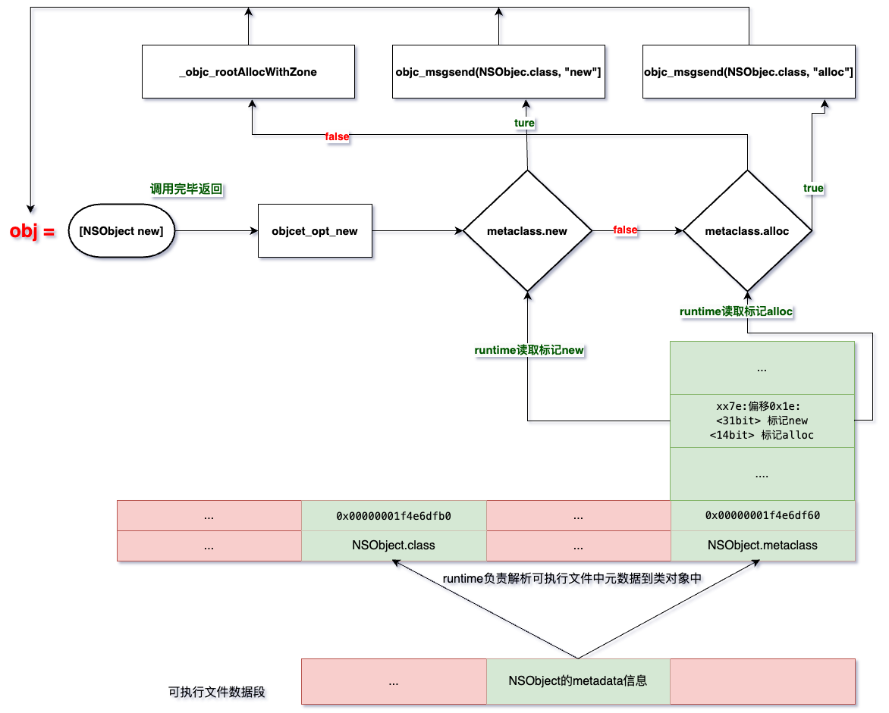

<font size = 4>

### 概念(引用类型)
swift中的引用类型是一种固定的类型, 语法上class所定义的类型就是引用类型. 引用类型所定义的对象会在内存中的堆区(<font color = red>heap</font>), 一般情况下位于堆中的对象其内存需要程序员手动管理, 但引用类型的对象不需要, 它们由swift自动管理, 使用的是自动引用计数(<font color = red>ARC</font>). 事实上引用的本质就是指针, 当使用引用类型的时候, 可以直接当作值类型的对象使用. 在swift中除了可以使用引用类型接触到heap, 也可以使用指针相关的API

> 关于引用类型将在后续的class章节作详细探究, 这里先来看指针

### 指针
swift的标准库定义了4种指针类型(<font color = red>当然这4种类型是swift结构</font>)
1. `UnsafePointer<T>`
2. `UnsafeMutablePointer<T>`
3. `UnsafeRawPointer`
4. `UnsafeMutableRawPointer`
5. `UnsafeBufferPointer`
6. `UnsafeMutableBufferPointer`
7. `UnsafeMutableRawBufferPointer`
8. `UnsafeRawBufferPointer`
  
    


因为这里涉及到了比较复杂的指针, 所以笔者将会类比到c++, OC. 这4种指针类型对应着C语言中的:
1. `const T*`
2. `T*`
3. `const void*`
4. `void*`

其实在前面很多案例中, 笔者已经反复使用过这些类型. 下面开始详细学习

### UnsafePointer
首先UnsafePointer本身是类模板, 它同时也是值类型(<font color = red>struct</font>). 建立指针指向内存的方式:
1. 直接指向某个已经存在的对象的地址
2. malloc一块内存

先来看c++中:

```cpp
int main(int args, char** argv){
    int* p = &args;                     // 直接指向某个对象的地址
    int* p2 = malloc(sizeof(int));      // 通过malloc分配内存, 然后指向这个地址
} 
```

在swift中也是一样的流程, 先来看malloc:

```swift
// 调用malloc返回一个原始的指针(后面学习)
let has_mem = os.malloc(MemoryLayout<Int>.stride)


// 解包, 若是空则没有更多的内存
guard let mem = has_mem else{
    fatalError("no memory")
}

// 打印
//  heap内存地址
//  malloc实际分配的大小
print(mem, os.malloc_size(mem))                     // 0x0000600003bec060 16


// 将地址转换成一个Int, 然后16进制打印一下
let int = Int(bitPattern: mem)
print(String(int, radix: 16, uppercase: true))      // 600003BEC060


// 初始化UnsafePointer<Int>对象, 参数是一个有效的地址值 
guard let ptr = UnsafePointer<Int>.init(bitPattern: int) else{
    fatalError("bad memory")
}


print(ptr)                                      // 0x0000600003bec060


// 释放内存, 注意原则上是malloc对应free
// 也可使用 ptr.deallocate(), 但最好不要这样做
// 即使deallocate内部是直接调用了free
os.free(mem)        
```

demo中将malloc返回的指针(原始指针, 它就是一个地址值)封装成了具体的`UnsafePointer<Int>`的对象ptr, 后面通过ptr可以间接操作内存. 可以发现malloc返回的大小是16, 并不是Int大小, 这个到后面的小节再探究. 除了接收malloc返回的内存, 也可以直接通过已经存在的`UnsafePointer<Int>`对象来初始化一个新的`UnsafePointer<Int>`对象

```swift
guard let ptr = UnsafePointer<Int>.init(bitPattern: Int(bitPattern: os.malloc(8))) else {
    fatalError("bad memory")
}

let new_ptr = ptr                           // 直接赋值, 相当于 int* new_ptr =  ptr
let new_ptr2  = UnsafePointer(new_ptr)      // 通过构造器
print(ptr, new_ptr, new_ptr2)               // 0x0000600003100060 0x0000600003100060 0x0000600003100060
                                            // 三者的地址一样

ptr.deallocate()                            // 通过ptr.deallocate()释放内存
                                            // 笔者这里是偷懒的作法, 应该使用 free

//os.free(UnsafeMutableRawPointer(mutating: ptr))
```


### 读取内存1
就算是现在拥有了指针也不能直接读取内存的中的数据, swift中读取数据的操作必须要有类型, 就像一个Int对象, swift知道从这个对象所在的起始内存读取多大偏移并取出内容, 同样的道理当对象是指针时, 它仅仅指向一块内存, 这块内存被解释成什么类型必须由外界告诉swift. 如8字节的空间可以看成是Int对象的内存布局, 也可看成是Double对象的内存布局. 指定不同的类型swift读取出数据的过程并做赋值的行为就不一样. 

UnsafePointer在定义对象时必须绑定泛型参数, 这个泛型就是告诉编译器该对象指向的内存被解释成的类型, 通过pointee成员(<font color = red>计算属性</font>)可以读取到该内存的内容, 并转换成绑定的类型返回到外界. 所以UnsafePointer从逻辑上来看也是一种明确的类型

```swift
let invalid: Int = ptr.pointee             
```

上述定义指针ptr后, ptr指向的内存是未初始化的, swift中禁止访问未初始化的对象, 但是通过访问指针关联的内存时, 没有这种限制. 即通过pointee(<font color = red>Int</font>)获取内存中的内容. 因为读取的内存是malloc来的, 所以其中的数据可能是垃圾数据. 还可以通过下标读取(<font color = red>后面学习</font>)

```swift
let invalid = ptr[0] 
```

> 其实下标读取可以类比成c++中的`ptr[0]`, 读取第1个位置的元素


UnsafePointer类型的对象相当于`const T*`, 所以它所关联的内存是只读的, 不能直接通过它:
1. 初始化这块内存
2. 向内存写入数据

但可以有其他方式来初始化这块内存

```swift
import os

let len = MemoryLayout<Int>.stride

let alloc = os.malloc(len)!

// malloc返回的是16个字节, 但逻辑上我们需要的是8字节
// 所以这里应该填充逻辑上的8字节, 其他的8字节在逻辑上应当是作废的
//os.memset(alloc, 0xff, os.malloc_size(alloc))
os.memset(alloc, 0xff, len)

let ptr = UnsafePointer<Int>.init(bitPattern: Int(bitPattern: alloc))!

print(ptr.pointee)          // -1  0xff ff ff ff ff ff ff ff

os.free(alloc) 
```

> demo中通过库函数初始化alloc内存, 然后使用ptr访问这块内存. 注意Mac平台上malloc函数内部对齐系数为16


<a id="link-bind-to-type"><a>

### 绑定到其他类型
可以通过当前的指针来构造其他绑定类型的指针对象, 即一块内存被解释为不同的内存布局. 说白了就是类型转换. 举例来说(`c++`)

```cpp
float a = 0.5
int   b = a
```
上述会发生隐式的类型转换, 最后b的值为0:
1. a的[内存](#link-float-memory)`0b 0 01111110 0000000 00000000 00000000`, 指数部分`<1~8>`为126, 有效位数为0
2. 编译器通过a的内存布局计算出b的整数部分, 所以b为0

如果单纯的告诉编译器这块内存的类型就是int, 则编译器就不会转换:

```cpp
float a = 0.5
int b = *reinterpret_cast<int*>(&a);
```
这种情况下b的值是直接解释a内存, 所以b的值为`0b 00111111 00000000 00000000 00000000`, 即`0x3f000000`,  所以swift中的UnsafePointer绑定到其它类型时, 就是这个过程

```swift
let len = MemoryLayout<Int32>.stride

let alloc = os.malloc(len)!

os.memset(alloc, 0, len)
os.memset(alloc + 3, 0x3f, 1)

let ptr = UnsafePointer<Int>.init(bitPattern: Int(bitPattern: alloc))!
print(String(ptr.pointee, radix: 16))   // 3f000000                       
let f = ptr.withMemoryRebound(to: Float.self, capacity: 1){$0}
print(f.pointee)                        // 0.5

os.free(alloc) 
```


### 数组(非标准库)
```cpp
int arr[10] = {0};
int* ptr = arr;
```
arr是数组, 其实它也是指针, 是一种常量指针(<font color = red>constant of pointer</font>)[^ann-ptr-const], 即`int* const`. 可以让一个指针指向数组的起始地址, 如对象ptr指向arr. 可以使用UnsafePointer定义数组

```swift
let len = MemoryLayout<Int32>.stride

let alloc = os.malloc(len)!
os.memset(alloc,        12, 1)
os.memset(alloc + 1,    34, 1)
os.memset(alloc + 2,    56, 1)
os.memset(alloc + 3,    78, 1)

let ptr = UnsafePointer<UInt8>.init(bitPattern: Int(bitPattern: alloc))!
print(ptr.pointee, ptr[0])          // 访问第0个元素
print(ptr[1])                       // 访问第1个元素
print(ptr[2])                       // 访问第2个元素
print(ptr[3])                       // 访问第3个元素 


//os.free(ptr)
```

demo中开辟了4字节的空间, 但指针是以UInt8一个字节的方式依次读取内存. 通过下标可以以ptr为基准访问到指定索引的内存. 也可以调用相关的成员方法进行偏移

```swift
let ptr_next = ptr.successor()      // 指针+1移动向下一个元素, ptr_next = &ptr[1]
print(ptr_next.pointee, ptr_next[0])// 访问原始数组中的第1个元素
print(ptr_next[1])                  // 访问原始数组中的第2个元素


let ptr_fir = ptr_next.predecessor()   // 以pre_next往前一个索引的地址, 即指向了第0个元素的地址
print(ptr_fir.pointee)            // 访问原始数组中的第0个元素

print(ptr_fir == ptr)             // true, 2个指针相等


let idx_ptr = ptr.advaced(by: 2)    // 第2个元素
let dif = idx_ptr - ptr          // 2 与数组地址相距2个索引


let last_ptr = ptr + 3              // 第3个元素(最后一个)
print(last_ptr.pointee)             // 78
```

UnsafePointer中定义了很多比较操作符, 用来对2个指针进行运算:

```swift
print(ptr > ptr_fir)                
print(ptr <= ptr_fir)                
print(ptr >= ptr_fir)                
print(ptr != ptr_fir)           
print(ptr == ptr_fir)           
print(ptr < ptr_fir)           
print(ptr <= ptr_fir)           
```
上述右边的类型可以4种指针中的任何一种, 表达式的结果是Bool


### 指针范围
2种同类型的指针做减法是有意义的, 减法的结果表示2个指针之间有多少个元素, 标准库定义了指针加减的运算符操作

```swift
let dif1 = ptr.distance(to: ptr.advanced(by: 2))                    
    // 2
    // 参数的地址 - ptr
    // 参数的地址 = ptr + 2
                                                                    
let dif2 = ptr.successor().successor().successor() - ptr            
    // 3
    // ptr向后一直偏移了3
    // ptr + 3 - ptr 

let dif3 = ptr.advanced(by: 3) - ptr.advanced(by: 2).predecessor()  
    // 2
    // ptr + 3 - (ptr + 2 - 1) 

let dif4 = ptr + 2 - ptr
    // 2
    // 可以直接对指针加上一个Int对象做地址偏移
```

### 迭代指针
UnsafePointer并未提供指针迭代器, 但可以自行构造出区间

```swift
let r1 = Range<UnsafePointer<UInt8>>.init(uncheckedBounds: (lower: ptr, upper: ptr + 4))
for i in r1 {
    print(i.pointee)
}

let r2 = ptr ... ptr + 3
for i in r2 {
    print(i.pointee)
}


let r3 = ptr ..< ptr + 4
for i in r3 {
    print(i.pointee)
}
```

### Array的桥接
标准库中的Array(<font color = red>后面学习</font>)是一个值类型, 它的大小是8字节. Array在幕后管理着当前对象所有的元素, 这些元素所在的内存实际上是连续的, 所以理论上只要拿到了这块内存的起始地址, 就可以做增删改查(<font color = red>crud</font>). 

但使用指针来间接操作Array的元素难度相当大:
1. 必须足够清楚标准库Array的实现细节
2. 必须足够清楚swift中引用类型的内存管理机制(ARC)
3. 必须足够清楚引用类型的继承机制, 属性监听等触发机制

> 当使用Aarry时不用关心这些东西

在解释Array的桥接前, 先来大致测试一下Aarry对象的初始化过程. 这里以<font color = red>字面量初始化数组方式来测试</font>. 

思考: `Array<Int>`是值类型, 并且大小是固定的, 怎么做到用8字节的空间来管理它包含的元素呢? 

swift中已经明确规定了`Aarry`是值类型, 它不可能单单使用栈空间管理元素, 可以大胆猜测Array应该是将数据放到了其他内存中, 并且由于Array可以随时添加数据, 所以基本可以断定Aarry将数据的内存放到了heap中. 也就是说真正的Array其实是一个heap对象, 那么:
1. 由malloc分配内存(<font color = red>亦或swift内部有全局的分配器</font>), 但不管怎么样, 它一定是从malloc拿内存, 所以理论上可以直接通过`malloc_size`来测试大小 
2. 一定存在内存管理(<font color = red>用户层面没有涉及手动内存管理</font>), 能肯定的是Mac环境下swift管理堆内存极可能使用ARC机制, 若是heap内存, 则一定有8字节来存储引用计数

根据这2点的推测, 给出下面的测试代码以及汇编:

```swift
func test(){
    let arr = [1,2,3,4,5,6,7,8,9]
}
test()
```

> 对应的汇编如下:

```lua
swift`test():
    0x100003e84 <+0>:   sub    sp, sp, #0x30
    0x100003e88 <+4>:   stp    x29, x30, [sp, #0x20]
    0x100003e8c <+8>:   add    x29, sp, #0x20
    0x100003e90 <+12>:  stur   xzr, [x29, #-0x8]
    0x100003e94 <+16>:  mov    w8, #0x9
    0x100003e98 <+20>:  mov    x0, x8
    0x100003e9c <+24>:  str    x0, [sp, #0x8]           ; *(sp + 8) = 9, 局部变量为9
    0x100003ea0 <+28>:  adrp   x1, 1                    ; x1 = 全局区的某个地址, 0x100004000
    0x100003ea4 <+32>:  ldr    x1, [x1, #0x8]           ; x1 = *(x1 + 8), x1 = &Int.metadata
    0x100003ea8 <+36>:  str    x1, [sp, #0x10]          ; *(sp + 16) = &Int.metadata
    0x100003eac <+40>:  bl     0x100003f80               ; symbol stub for: Swift._allocateUninitializedArray<τ_0_0>(Builtin.Word) -> (Swift.Array<τ_0_0>, Builtin.RawPointer)
                                                        ; 调用函数, 传递了:
                                                        ;   1. x0(9), 数据初始化元素的个数
                                                        ;   2. x1(&Int.metadata)
                                                        ; 函数将返回
                                                        ;   1. &heap-arr
                                                        ;   2. &heap-arr-data
                                                        ; PS: 其实 &heap-arr 和 &heap-arr-data相差32字节, 以&heap-arr为准:
                                                        ;   1. &heap-arr<0~7>  是metadata类型, 具体是swift数组模块中的一个类_ContiguousArrayStorage<Swift.Int>
                                                        ;   2. &heap-arr<8~15> 引用计数(ARC), 初始化为3
                                                        ;   3. &heap<16-23>    当前数组元素个数
                                                        ;   4. &heap<24~31>    再接着8字节标记的 (容量 << 1) | (is_bridge?01)
                                                        ;       即当前传递的9个元素, 则在调用过程中 容量=数量, 但为了借助1位, 9 << 1 = 18, 第0个bit位用来记录是不是桥接的标记
                                                        ;   5. &heap<32...>    数据的起始地址
                                                        ;   
                                                        ;  最后的是lldb的测试, 打印这2个地址

; __asm_break_0
->  0x100003eb0 <+44>:  ldr    x8, [sp, #0x8]           ; x8 = 9(元素个数), 同时也是第8个元素的值(9)
    0x100003eb4 <+48>:  mov    x9, x1                   ; x9 = &heap-arr-data
    0x100003eb8 <+52>:  ldr    x1, [sp, #0x10]          ; x1 = &Int.metadata
    0x100003ebc <+56>:  mov    w10, #0x1                ; w10 = 1
    0x100003ec0 <+60>:  str    x10, [x9]                ; *x9 = 1,          *(&heap-arr-data) = 1,      即数据域的第0个元素是1
    0x100003ec4 <+64>:  mov    w10, #0x2                ; w10 = 2
    0x100003ec8 <+68>:  str    x10, [x9, #0x8]          ; *(x9 + 8) = 2,    *(&heap-arr-data + 8)=2,    即数据域的第1个元素是2
    0x100003ecc <+72>:  mov    w10, #0x3
    0x100003ed0 <+76>:  str    x10, [x9, #0x10]
    0x100003ed4 <+80>:  mov    w10, #0x4
    0x100003ed8 <+84>:  str    x10, [x9, #0x18]
    0x100003edc <+88>:  mov    w10, #0x5
    0x100003ee0 <+92>:  str    x10, [x9, #0x20]
    0x100003ee4 <+96>:  mov    w10, #0x6
    0x100003ee8 <+100>: str    x10, [x9, #0x28]
    0x100003eec <+104>: mov    w10, #0x7
    0x100003ef0 <+108>: str    x10, [x9, #0x30]
    0x100003ef4 <+112>: mov    w10, #0x8
    0x100003ef8 <+116>: str    x10, [x9, #0x38]         ; 
    0x100003efc <+120>: str    x8, [x9, #0x40]          ; 依次为&heap-arr-data 赋值元素

    0x100003f00 <+124>: bl     0x100003f1c               ; Swift._finalizeUninitializedArray<Element>(__owned Swift.Array<Element>) -> Swift.Array<Element> at <compiler-generated>
                                                        ;   构造swift的数组对象, 参数:
                                                        ;       1. x0: &heap-arr
                                                        ;       2. x1: Int.metadata
                                                        ; 其实内部的结果就是将&hea-arr放到了x0中作了返回
    0x100003f04 <+128>: mov    x8, x0
    0x100003f08 <+132>: stur   x8, [x29, #-0x8]         ; 将返回值(存储了&heap-arr)保存到当前函数的局部对象arr中
    0x100003f0c <+136>: bl     0x100003f68               ; symbol stub for: swift_bridgeObjectRelease
                                                         ; 当前alloc了对象, 所以要release, 但retain和release的过程并不是这样简单

    0x100003f10 <+140>: ldp    x29, x30, [sp, #0x20]
    0x100003f14 <+144>: add    sp, sp, #0x30
    0x100003f18 <+148>: ret    


; 断点在 __asm_break_0,  即调用完_allocateUninitializedArray分配内存后
(lldb) register read x0 
      x0 = 0x0000600003410000
(lldb) register read x1 
      x1 = 0x0000600003410020
(lldb) p/x 0x0000600003410020 - 0x0000600003410000
(Int) 0x0000000000000020

; 可以发现x0即为 &heap-arr, x1和x0相差0x20个字节, 即4个8字节
; 通过前面的判断
;   &heap-arr<0~7>表示类型信息 _ContiguousArrayStorage<Swift.Int>
;   &head-arr<8~15>表示引用计数, 实际swift_alloc初始化为了3
;   &head-arr<16~23>表示元素个数, 所以是9
;   &head-arr<24~31>表示标记, 根据算法:  (9 << 1) | 0(isnot_objc) = 18(0x12)
; 后面的是数据
; 下面是打印

(lldb) x/13gx 0x0000600003410000
0x600003410000: 0x00000001f7576100 0x0000000000000003
0x600003410010: 0x0000000000000009 0x0000000000000012
0x600003410020: 0x0000000000000001 0x0000000000000002
0x600003410030: 0x0000000000000003 0x0000000000000004
0x600003410040: 0x0000000000000005 0x0000000000000006
0x600003410050: 0x0000000000000007 0x0000000000000008
0x600003410060: 0x0000000000000009
; 打印出对应的内存值, 和前面所说的一样
```

通过汇编的测试可以明显看出, swift中的数组本质就是heap, 在代码层面对数组的所有操作其实背后被编译器转换成了对heap的操作. 程序员不用手动管理该内存, 伪代码如下:

```swift
heap_obj = Swift._allocateUninitializedArray(9, &Int.metadata)
heap_obj<0~7>  = &Swift. _ContiguousArrayStorage<Int>.metadata
heap_obj<8~15> = 3(引用计数)
heap_obj<16~23>= 9(元素个数)
heap_obj<24~31>= (9 << 1) | (is_objc ? 1 : 0) = 18
heap_obj_data[0] = 1
heap_obj_data[1] = 2
heap_obj_data[2] = 3
...
heap_obj_data[8] = 9

// 即将heap_obj作了返回
let arr = Swift._finalizeUninitializedArray(heap_obj)
```

<a id="link-slow-alloc"></a>

上述汇编只是从结果看出来了这个过程. 具体Array的初始化过程, metadata的赋值, 引用计数的填充, 元素个数的填充, 标记的填充也可以从汇编看出来. 具体要进入到`_allocateUninitializedArray`方法内部:

```lua
libswiftCore.dylib`Swift._allocateUninitializedArray<τ_0_0>(Builtin.Word) -> (Swift.Array<τ_0_0>, Builtin.RawPointer):
->  0x19edb2bc8 <+0>:   pacibsp 
    0x19edb2bcc <+4>:   stp    x22, x21, [sp, #-0x30]!
    0x19edb2bd0 <+8>:   stp    x20, x19, [sp, #0x10]
    0x19edb2bd4 <+12>:  stp    x29, x30, [sp, #0x20]
    0x19edb2bd8 <+16>:  add    x29, sp, #0x20
    0x19edb2bdc <+20>:  mov    x20, x1                  ; x20 = x1, x1在调用前指向 Int.metadata
    0x19edb2be0 <+24>:  mov    x19, x0                  ; x19 = x0, x0在调用前的值是9, 表示元素个数

    0x19edb2be4 <+28>:  cmp    x0, #0x1                 ; 如果元素个数 < 1, 即为0, 则返回数组 __asm_emtpy_arr
    0x19edb2be8 <+32>:  b.lt   0x19edb2c8c               ; <+196> 上一步的操作比较, 即 x0 < 1


    0x19edb2bec <+36>:  mov    x0, x20                  ; x0 = &Int.metadata
    0x19edb2bf0 <+40>:  mov    x1, x20                  ; x1 = &Int.metadata
    0x19edb2bf4 <+44>:  bl     0x19edb2cb8               ; Swift.getContiguousArrayStorageType<τ_0_0>(for: τ_0_0.Type) -> Swift._ContiguousArrayStorage<τ_0_0>.Type
                                                        ; 该函数根据 Int.metadata查找 Swift. _ContiguousArrayStorage<Int>.metadata, 并返回, 后面称ArrStore<Int>


    0x19edb2bf8 <+48>:  ldr    w10, [x0, #0x30]         
    0x19edb2bfc <+52>:  ldrh   w11, [x0, #0x34]
    0x19edb2c00 <+56>:  ldr    x8, [x20, #-0x8]!
    0x19edb2c04 <+60>:  mov    x16, x8
    0x19edb2c08 <+64>:  mov    x17, x20
    0x19edb2c0c <+68>:  movk   x17, #0x2e3f, lsl #48
    0x19edb2c10 <+72>:  autda  x16, x17
    0x19edb2c14 <+76>:  mov    x17, x16
    0x19edb2c18 <+80>:  xpacd  x17
    0x19edb2c1c <+84>:  cmp    x16, x17
    0x19edb2c20 <+88>:  b.eq   0x19edb2c28               ; <+96>
    0x19edb2c24 <+92>:  brk    #0xc472
    0x19edb2c28 <+96>:  mov    x9, x16
    0x19edb2c2c <+100>: mov    x16, x8
    0x19edb2c30 <+104>: mov    x17, x20
    0x19edb2c34 <+108>: movk   x17, #0x2e3f, lsl #48
    0x19edb2c38 <+112>: autda  x16, x17
    0x19edb2c3c <+116>: ldr    x8, [x16, #0x48]
    0x19edb2c40 <+120>: ldrb   w9, [x9, #0x50]
    0x19edb2c44 <+124>: add    x10, x9, x10
    0x19edb2c48 <+128>: bic    x10, x10, x9
    0x19edb2c4c <+132>: madd   x1, x8, x19, x10
    0x19edb2c50 <+136>: orr    x2, x9, x11
    0x19edb2c54 <+140>: bl     0x19f131778               ; swift_allocObject(后面的汇编)
                                                         ; 中间的步骤在做安全验证, 也在计算到底分配多大的内存, 最终结果x1为0x68(104), x2是7(swift_allocObject第3个参数需要它)
                                                         ; 调用 swift_allocObject, 参数:
                                                         :  x0: &ArrayStore<Int>.metadat
                                                         ;  x1: 68, 9个元素 + 前4个 = 13个Int, 即104个字节
                                                         ;  x2: 7
                                                         ; 根据malloc的16对齐, 所以一定会多分配18字节, 即112字节
                                                         ; 方法内部:
                                                         ;  1. 最终调用到malloc
                                                         ;  2. 填充前8字节为 &ArraryStore<Int>.metadata
                                                         ;  3. 填充引用计数(3)


    0x19edb2c58 <+144>: mov    x20, x0                  ; x0 = &heap_arr
    0x19edb2c5c <+148>: mov    x1, x19                  ; x1 = x19 = 9(元素个数)
    0x19edb2c60 <+152>: bl     0x19f0cb55c               ; function signature specialization <Arg[0] = Owned To Guaranteed> of static Swift.Array._adoptStorage(_: __owned Swift._ContiguousArrayStorage<τ_0_0>, count: Swift.Int) -> (Swift.Array<τ_0_0>, Swift.UnsafeMutablePointer<τ_0_0>)
                                                        ; 汇编在后面
                                                        ; 方法参数:
                                                        ;   x0: &heap-arr
                                                        ;   x1: 元素个数
                                                        ; 方法内部流程在后面的汇编

    0x19edb2c64 <+156>: mov    x19, x0
    0x19edb2c68 <+160>: mov    x21, x1
    0x19edb2c6c <+164>: mov    x0, x20
    0x19edb2c70 <+168>: bl     0x19f1322a0               ; swift_release
    0x19edb2c74 <+172>: mov    x0, x19
    0x19edb2c78 <+176>: mov    x1, x21
    0x19edb2c7c <+180>: ldp    x29, x30, [sp, #0x20]
    0x19edb2c80 <+184>: ldp    x20, x19, [sp, #0x10]
    0x19edb2c84 <+188>: ldp    x22, x21, [sp], #0x30
    0x19edb2c88 <+192>: retab  


; __asm_empty_arr                                            
    0x19edb2c8c <+196>: mov    x0, x19                      ; 元素个数为0, 后续的过程是返回空数组
    0x19edb2c90 <+200>: mov    x1, x20
    0x19edb2c94 <+204>: ldp    x29, x30, [sp, #0x20]
    0x19edb2c98 <+208>: ldp    x20, x19, [sp, #0x10]
    0x19edb2c9c <+212>: ldp    x22, x21, [sp], #0x30
    0x19edb2ca0 <+216>: autibsp 
    0x19edb2ca4 <+220>: eor    x16, x30, x30, lsl #1
    0x19edb2ca8 <+224>: tbz    x16, #0x3e, 0x19edb2cb0   ; <+232>
    0x19edb2cac <+228>: brk    #0xc471
    0x19edb2cb0 <+232>: b      0x19eda3220               ; static Swift.Array._allocateUninitialized(Swift.Int) -> (Swift.Array<τ_0_0>, Swift.UnsafeMutablePointer<τ_0_0>)
 


libswiftCore.dylib`swift_allocObject:
->  0x19f131778 <+0>:   pacibsp 
    0x19f13177c <+4>:   stp    x20, x19, [sp, #-0x20]!
    0x19f131780 <+8>:   stp    x29, x30, [sp, #0x10]
    0x19f131784 <+12>:  add    x29, sp, #0x10
    0x19f131788 <+16>:  mov    x19, x0                  ; x19 = ArrStore<Int>.Metadata
    0x19f13178c <+20>:  adrp   x8, 361542              
    0x19f131790 <+24>:  ldr    x3, [x8, #0x3f8]
    0x19f131794 <+28>:  mov    x8, x3
    0x19f131798 <+32>:  xpaci  x8
    0x19f13179c <+36>:  adrp   x9, 0
    0x19f1317a0 <+40>:  add    x9, x9, #0x504            ; _swift_allocObject_
    0x19f1317a4 <+44>:  cmp    x8, x9
    0x19f1317a8 <+48>:  b.ne   0x19f1317e8               ; <+112>
    0x19f1317ac <+52>:  mov    x0, x1
    0x19f1317b0 <+56>:  mov    x1, x2
    0x19f1317b4 <+60>:  bl     0x19f1314a8               ; swift_slowAlloc
                                                         ; 指令会到这里来分配内存(内部调用malloc)
                                                         ; 返回后的x0就是&heap-arr


    0x19f1317b8 <+64>:  cbz    x19, 0x19f1317d0          ; <+88>
                                                         ; 进入初始化

    0x19f1317bc <+68>:  mov    x16, x0
    0x19f1317c0 <+72>:  movk   x16, #0x6ae1, lsl #48
    0x19f1317c4 <+76>:  mov    x17, x19
    0x19f1317c8 <+80>:  pacda  x17, x16                 ; 做完验证后, x17 = &ArrayStore<Int>.metadata
    0x19f1317cc <+84>:  b      0x19f1317d4               ; <+92>, 直接跳转到初始化
    0x19f1317d0 <+88>:  mov    x17, #0x0                ; x17 = 0(未执行)

; 初始化
    0x19f1317d4 <+92>:  mov    w8, #0x3                 ; w8 = 3, 这个3就是引用计数
    0x19f1317d8 <+96>:  stp    x17, x8, [x0]            ; 16字节的操作
                                                        ; x0是 siwft_slowAlloc的返回值, &heap_arr
                                                        ;   1. heap_arr<0~7> = x17 = &ArrayStore<Int>.metadata
                                                        ;   2. heap_arr<8~16> = 3(引用计数)
                                                        ; 后面就是返回了

    0x19f1317dc <+100>: ldp    x29, x30, [sp, #0x10]
    0x19f1317e0 <+104>: ldp    x20, x19, [sp], #0x20
    0x19f1317e4 <+108>: retab  
    0x19f1317e8 <+112>: adrp   x4, 361542
    0x19f1317ec <+116>: add    x4, x4, #0x3f8            ; _swift_allocObject
    0x19f1317f0 <+120>: mov    x0, x19
    0x19f1317f4 <+124>: ldp    x29, x30, [sp, #0x10]
    0x19f1317f8 <+128>: ldp    x20, x19, [sp], #0x20
    0x19f1317fc <+132>: autibsp 
    0x19f131800 <+136>: eor    x16, x30, x30, lsl #1
    0x19f131804 <+140>: tbz    x16, #0x3e, 0x19f13180c   ; <+148>
    0x19f131808 <+144>: brk    #0xc471
    0x19f13180c <+148>: mov    x16, x4
    0x19f131810 <+152>: movk   x16, #0x625b, lsl #48
    0x19f131814 <+156>: braa   x3, x16


libswiftCore.dylib`function signature specialization <Arg[0] = Owned To Guaranteed> of static Swift.Array._adoptStorage(_: __owned Swift._ContiguousArrayStorage<τ_0_0>, count: Swift.Int) -> (Swift.Array<τ_0_0>, Swift.UnsafeMutablePointer<τ_0_0>):
->  0x19f0cb55c <+0>:   pacibsp 
    0x19f0cb560 <+4>:   stp    x22, x21, [sp, #-0x30]!
    0x19f0cb564 <+8>:   stp    x20, x19, [sp, #0x10]
    0x19f0cb568 <+12>:  stp    x29, x30, [sp, #0x20]
    0x19f0cb56c <+16>:  add    x29, sp, #0x20
    0x19f0cb570 <+20>:  mov    x19, x1                  ; x19 = x1 = 元素的个数
    0x19f0cb574 <+24>:  mov    x20, x0                  ; x20 = x0 = &heap-arr
    0x19f0cb578 <+28>:  ldr    x16, [x0]                ; x16 = heap-arr的前8字节的值, 即 x16 = &ArrayStore<Int>.metadata
    0x19f0cb57c <+32>:  mov    x17, x0                  ; x17 = &heap-arr
    0x19f0cb580 <+36>:  movk   x17, #0x6ae1, lsl #48    ; x17 = x17 + (0x6ael << 48)
    0x19f0cb584 <+40>:  autda  x16, x17                 ; 验证
    0x19f0cb588 <+44>:  ldr    x21, [x16, #0x90]        ; x16未变, x21 = *(&ArrayStore<Int>.metadata + 0x90), 

    0x19f0cb58c <+48>:  bl     0x19f13269c               ; swift_retain
                                                        ;  引用计数增大

    0x19f0cb590 <+52>:  mov    x0, x21                  ; x0 = x21 = *(&ArrayStore<Int>.metadata + 0x90)
    0x19f0cb594 <+56>:  mov    x1, x21                  ; x1 = x0

    0x19f0cb598 <+60>:  bl     0x19f125ca4               ; _swift_isClassOrObjCExistentialType
                                                        ; 判断是不是OC类型(false), 返回x0为false
    0x19f0cb59c <+64>:  bfi    x0, x19, #1, #63         ; 这个就是在计算 (9 << 1) | (is_objc? 1 : 0), 所以x0 = 0x12 = 18
    0x19f0cb5a0 <+68>:  stp    x19, x0, [x20, #0x10]    ; x20 = &heap-arr, 所以
                                                        ;   heap-arr<16~23> = x19 = 9
                                                        ;   heap-arr<24~31> = x0 = 12
                                                        ; 至此heap-arr前16字节初始化完毕, 即将返回, 后面的都是在验证, 不关心
    0x19f0cb5a4 <+72>:  ldr    x16, [x21, #-0x8]!
    0x19f0cb5a8 <+76>:  mov    x17, x21
    0x19f0cb5ac <+80>:  movk   x17, #0x2e3f, lsl #48
    0x19f0cb5b0 <+84>:  autda  x16, x17
    0x19f0cb5b4 <+88>:  mov    x17, x16
    0x19f0cb5b8 <+92>:  xpacd  x17
    0x19f0cb5bc <+96>:  cmp    x16, x17
    0x19f0cb5c0 <+100>: b.eq   0x19f0cb5c8               ; <+108>
    0x19f0cb5c4 <+104>: brk    #0xc472
    0x19f0cb5c8 <+108>: ldrb   w8, [x16, #0x50]
    0x19f0cb5cc <+112>: add    x9, x8, #0x20
    0x19f0cb5d0 <+116>: bic    x8, x9, x8
    0x19f0cb5d4 <+120>: add    x1, x20, x8
    0x19f0cb5d8 <+124>: mov    x0, x20
    0x19f0cb5dc <+128>: ldp    x29, x30, [sp, #0x20]
    0x19f0cb5e0 <+132>: ldp    x20, x19, [sp, #0x10]
    0x19f0cb5e4 <+136>: ldp    x22, x21, [sp], #0x30
    0x19f0cb5e8 <+140>: retab  
```

从汇编可以得出这样的结论:
1. 数组至少会分配16字节的空间
    1. `<0~7>`这8字节指向的是metadata, 笔者测试中初始化时使用了字面量, 对应的metadata是` _ContiguousArrayStorage<Int>.metadata`
    2. `<8~15>`这8字节是引用计数, 初始化为3, 并且会做一次`retain`的操作(`加2`), 这个将在后面的小节给出过程
    3. `<16~23>`这8字节是数组的元素个数
    4. `<24~32>`这8字节是容量和Objc类型的标记


接下来要判断数组的heap空间是不是112个字节:
1. 9个元素(72字节)
2. 4个头部(32字节)
3. 16对齐, 所以是112字节

```swift
let arr = [1,2,3,4,5,6,7,8,9]

// 不带&时, 存储的是 *arr 
//   带&时, 存储的是 &arr
let ptr = withUnsafePointer(to: arr, {UnsafeRawPointer($0)})

// arr的值就是 &heap_arr, 这里直接取出来
let heap = UnsafeRawPointer(bitPattern: ptr.load(as: UInt.self))

print(os.malloc_size(heap))     // 112, 和预料的一样
```

明白了Array的大致初始化过程, 还需清楚Array的内存管理, 这个将在[ARC](#link-swift-arc)学习. 现在还有一个所谓的桥接, 桥接说白了其实就是数据类型的转换, 如这里的Array, 它是swift对象, 但它的数据内存在逻辑上满足指针的一些特性, 所以理论上可以看成是指针指向数组第0个元素. 正常情况下标准库Array没有提供这样的转换接口, 并且用户在使用时确实只需要用Array就够了, 但有一些特殊情况必须传递指针, 最常见是系统调用.   要想将Array转换为数组这应该是语言支持的, swift不支持手动将Array直接转换为数组, 但swift支持在某些情况下的自动转换, 整个桥接过程由编译器自动完成, 主要发生在:
1. 将Array传递给函数参数, 该参数是指针
2. 直接用Array对象初始化一个指针对象

> swift不支持反向操作

```swift
let arr = [1,2,3,4,5,6,7,8,9]

func print_heap<E>(_ arr: UnsafePointer<E>) -> (Int,Int){
    let heap = arr - 4                                  // __code_heap_addr
    let heap_size = os.malloc_size(heap)                // __code_malloc_size
    let arr_count = (heap + 2).pointee as! Int          // __code_arr_count
    print("arr<\(heap)>, arr-size:\(heap_size), arr-count:\(arr_count)")
    return (heap_size, arr_count)
}

func ptr(_ arr: UnsafePointer<Int>) {                   // __code_bridge
    let range = arr ..<  (arr + print_heap(arr).1)
    for num in range {
        print("addr<\(num)>:\(num.pointee)")            // __code_access_item
    }
}

ptr(arr) 
```

demo中直接将数组传递给了指针(`__code_bridge`), 这并不是一个简单的类型转换, 编译器底层会根据标准库Aarry的内存布局将数据的首地址传递给指针(<font color = red>并且涉及到内存管理</font>). 所以在函数内部相当于得到了`&heap-arr-data`. 函数ptr内部先调用`print_heap`函数打印一些信息:
1. Array在堆中的内存
2. Array被malloc时的大小
3. Array目前的元素个数

调用完`print_heap`可以获取到元素的个数, 然后构造区间根据指针依次访问这些地址以及地址中的元素, 所以理论上可以使用指针来替换数组中的元素, 即使原来的数组是let. 

```swift
let arr = [1,2,3,4,5,6,7,8,9]

func modify(_ arr: UnsafePointer<Int>, cbk: (UnsafeMutablePointer<Int>) -> Void) {
    for ptr in arr ..< arr + ((arr - 2).pointee) {
        cbk(UnsafeMutablePointer(mutating: ptr))
    }
}

modify(arr) {$0.pointee *= $0.pointee}

print(arr)  // [1, 4, 9, 16, 25, 36, 49, 64, 81]
```

在该demo中原来的数组定义的是let, 表示在编译期间不能修改它的内容, 但是函数`modify`内部将数组中元素的地址传递出来(`不同于UnsafePointer, 传递出来的是可修改的指针`), 然后将该位置的元素做平方操作再存储到该位置, 最后打印出原始的arr, 发现数据确实已经更新

除了可以使用指针参数接收数组, 也可以在定义对象时使用指针: 

```swift
let arr = [1,2,3,4,5,6,7,8,9]
let ptr:UnsafePointer<Int> = .init(arr)     // 直接在定义对象时就指定指针类型, 编译器内部会做桥接
print(ptr[0])                               // 1
print(ptr[1])                               // 2
```

这里编译器会有警告: 表示ptr是一个悬垂指针, 即编译器在桥接时直接销毁了创建的指针对象(`ARC`), 但ptr还指向这个内存(在[ARC](#link-swift-arc)给出答案). 看下面这个案例

```swift
func test() {
    var arr = [1,2,3,4,5,6,7,8,9]

    let arr_addr = withUnsafePointer(to: &arr, {UnsafeRawPointer($0)})
    let heap = arr_addr.load(as: UnsafeRawPointer.self)
    print(String(heap.load(fromByteOffset: 8, as: Int.self), radix: 16))
        // 3

    let tmp1 = arr
    print(String(heap.load(fromByteOffset: 8, as: Int.self), radix: 16))
        // 200000003(16进制)

    let tmp2 = arr
    print(String(heap.load(fromByteOffset: 8, as: Int.self), radix: 16))
        // 400000003(16进制)

    var ptr:UnsafePointer<Int> = .init(arr)
    print(String(heap.load(fromByteOffset: 8, as: Int.self), radix: 16))
        // 400000003(16进制), swift在桥接后并未做retain操作

    assert(false)
} 
```
从测试中可以明显看到, 用数组定义指针对象, 最后引用计数并未正确retain, 所以在使用时要注意:确信当前`ptr`的生命周期在数组对象的生命周期内.  <font color = red>传递函数参数时是正确retain的</font>


<a id="link-swift-arc"></a>

### 内存管理
在MacOS环境下swift使用了ARC[^ann-auto-ref-count], 在探究ARC前先来理解一下引用计数的基本原则:

> 谁引用谁retain, 谁取消引用谁release. 

代码中管理内存的点位于:
1. alloc: 要引用的对象要做retain, 一般这个操作在alloc内部就完成了
2. setter(<font color = red>OC中属性</font>): 旧引用的对象做release, 新引用的对象做retain
3. assgin: 旧引用的对象作release, 新引用的对象做retain
4. dealloc: 所引用的对象做release

> 需要说明一点: 这些是OC对象的内存管理, 并不涉及到C语言中对象的内存管理(<font color = red>如malloc要free</font>). 当引用数量减为0时对于OC来说会自动调用析构方法. 如果不使用了最好将指针置空

这4步中的操作, 要保证retain(`+ alloc`)和release的数量是配对的. 其实内存管理核心就是这4步, 如果是自己实现则就是MRC, 若是由编译器在这些位置插入内存管理的代码则就是ARC, 但事实上ARC还有更细致的优化和操作. 先来看MRC

### MRC
严格遵循引用计数的使用原则. 最简单的场景是所使用的类没有任何OC成员对象.

```objc
#define print_ref_count(_obj) NSLog(@"%ld", [(_obj) retainCount])

@implementation Person : NSObject
- (void)dealloc{
    NSLog(@"dealloc");
}
@end

int main(int argc, const char * argv[]) {
    Person* p1 = [Person new];      // heap.ref = 1
    print_ref_count(p1);            

    Person* p2 = p1;                // p2持有heap, 则应该做retain操作
    [p2 retain];                    // heap.ref = 2
    print_ref_count(p1);        


    [p2 release];                   // p2将指向新的对象, 所以旧对象要做release, heap.ref = 1
    p2 = [Person new];              // new-heap.ref = 1
    print_ref_count(p2);            


    [p1 release];                   // p1将要置空, 所以要做release, heap.ref = 0, 编译器将释放heap, 同时调用dealloc
    p1 = nil;
                                    
                                    // 这里有内存泄露, 因为new-heap没有释放

    return 0;
}
```

demo中Person中没有任何的OC对象, 所以外界单纯的使用Person时, 只需要在alloc, assign的地方管理好内存就够了. 但是当Person作为其他OC对象内部的成员时, 内存管理稍微复杂一点, 但原则不变

```objc
#define PRINT_REF(_obj) NSLog(@"<%p, %ld>", (_obj), [(_obj) retainCount])
#define SEP()   NSLog(@"---------------------------------")

typedef struct make_name make_name;
struct make_name {
    char _[0x20];
};
#define NAME(_name) ((make_name){#_name})

@implementation Person : NSObject{
@public
    make_name name;
    int  age;
}

- (void)show{
    NSLog(@"%@", [self info]);
}

- (NSString*)info{
    SEP();
    return [NSString stringWithFormat:@"<%p, %ld, %s, %d>",self, [self retainCount], self->name._, self->age];
}

- (void)dealloc{
    NSLog(@"dealloc:%@",[self info]);
    [super dealloc];
}
@end

@implementation Company : NSObject{
@public
    Person* _teacher;
}
- (void)dealloc{
    if(self->_teacher){
        [self->_teacher release];
        self->_teacher = nil;
    }
    [super dealloc];
}
@end

int main(int argc, const char * argv[]) {
    Person* p1 = [Person new];      // p1.ref = 1
    p1->name = NAME(tierry);        
    p1->age  = 38;
    [p1 show];

    Company* c1 = [Company new];    // c1.ref = 1
    c1->_teacher = p1;              
    [c1->_teacher retain];          // p1.ref = 2
    [c1->_teacher show];            


    Person* p2 = [Person new];      // p2.ref = 1
    p2->name = NAME(jerry);         
    p2->age = 25;
    [p2 show];


    [c1->_teacher release];         // p1.ref = 1
    c1->_teacher = p2;              // p2.ref = 1
    [c1->_teacher retain];          // p2.ref = 2
    

    [p2 release];                   // p2.ref = 1
    [p1 release];                   // p1.ref = 0 --> p1.dealloc tierry
    [c1 release];                   // c1.ref = 0 --> c1.dealloc --> p2.ref = 0 --> p2.dealloc jerry 
    return 0;
}

#if  0
---------------------------------
<0x600001fd8540, 1, tierry, 38>
---------------------------------
<0x600001fd8540, 2, tierry, 38>
---------------------------------
<0x600001fd0030, 1, jerry, 25>
---------------------------------
dealloc:<0x600001fd8540, 0, tierry, 38>
---------------------------------
dealloc:<0x600001fd0030, 0, jerry, 25>
#endif
```

上述过程比较繁杂, 可以将Company成员`_teacher`使用方法封装:

```objc
@implementation Company : NSObject{
@public
    Person* _teacher;
}

- (void)setTeacher:(Person*)teacher{
    if(_teacher == teacher) {
        return;
    }

    [_teacher release];
    _teacher = teacher;
    [_teacher retain];
}

- (void)dealloc{
    if(self->_teacher){
        [self->_teacher release];
        self->_teacher = nil;
    }
    [super dealloc];
}
@end 

int main(int argc, const char * argv[]) {
    Person* p1 = [Person new];
    p1->name = NAME(tierry);
    p1->age  = 38;
    [p1 show];

    Company* c1 = [Company new];
    [c1 setTeacher:p1];
    [c1->_teacher show];


    Person* p2 = [Person new];
    p2->name = NAME(jerry);
    p2->age = 25;
    [p2 show];


    [c1 setTeacher:p2];


    [p2 release];
    [p1 release];
    [c1 release];
    return 0;
}
```

### 循环引用
当2个OC对象互相引用时, 有循环引用的问题存在, 先来看这个现象:

```objc
typedef struct make_name make_name;
struct  __attribute__((objc_boxable)) make_name{
    char _[0x20];
};
#define NAME(_name) ((make_name){#_name})

#define PRINT_REF(_obj) NSLog(@"<%p, %ld>", (_obj), [(_obj) retainCount])
#define SEP()   NSLog(@"---------------------------------")
@implementation NSObject(Test)
- (NSString*)info{
    SEP();
    make_name name;
    [(NSValue*)[self valueForKey:@"_name"] getValue:&name];
    return [NSString stringWithFormat:@"<%@, %p, %ld, %s>", self.class, self, [self retainCount], name._];
}

- (void)show{   NSLog(@"%@", [self info]);}
@end

@class Company;
@interface Person : NSObject{
@public
    make_name _name;
    Company* _company;
}
@end

@interface Company : NSObject{
@public
    make_name _name;
    Person* _teacher;
}
@end


#define MAKE_SETTER(_property, _type)               \
    - (void)set_##_property:(_type)_property{       \
        if(_##_property == _property) {             \
            return;                                 \
        }                                           \
        [_##_property release];                     \
        _##_property = _property;                   \
        [_##_property retain];                      \
    }

#define IMPL_DEALLOC(_property)                     \
    if(self->_##_property){                         \
        [self->_##_property release];               \
        self->_##_property = nil;                   \
    }                                               \
    NSLog(@"dealloc:%@",[self info]);               \
    [super dealloc];


@implementation Person : NSObject
- (instancetype)initName:(make_name)name
                 company:(Company* _Nullable)company{
    if(self = [super init]){
        self->_name = name;
        [self set_company:company];
    }
    return self;
}

MAKE_SETTER(company, Company*)

- (void)dealloc{
    IMPL_DEALLOC(company)
}
@end


@implementation Company : NSObject
- (instancetype)initName:(make_name)name
                 teacher:(Person* _Nullable)teacher{
    if(self = [super init]){
        self->_name = name;
        [self set_teacher:teacher];
    }
    return self;
}
MAKE_SETTER(teacher, Person*)

- (void)dealloc{
    IMPL_DEALLOC(teacher)
}
@end


void auto_release(id* obj) {
    if(obj && *obj)
        [*obj release];
}

#define $(_type, _name)         \
    __attribute__((cleanup(auto_release), unused))   \
    _type _name                 \


int main(int argc, const char * argv[]) {
    $(Company*, c1) = [Company new];        // c1.ref = 1
    c1->_name = NAME("huawei");         
    [c1 show];

    $(Person*, p1) = [[Person alloc] initName:NAME(tierry) company:nil];
                                            // p1.ref = 1
    [p1 show];

    [p1 set_company:c1];                    // c1.ref = 2

    [c1 set_teacher:p1];                    // p1.ref = 2
                                        
                                            // 作用域结束前, 调用auto_release函数
                                            // [p1 release], p1.ref = 1
                                            // [c1 release], c1.ref = 1
                                            // 最后2个没有释放
    return 0;                   
} 
```
demo说明一下:
1. 2个类中的`_name`成员对象使用了自动包装的`make_name`结构体, 之所以使用结构体是方便赋值, 并且结构体之间的赋值是值拷贝, 笔者这样是方便
2. 打印信息只是辅助, 所以将其抽到了分类中
3. 笔者利用宏封装了setter的过程:
    1. 成员对象的名带下划线
    2. setter的方法名`set`加`对象名`
    3. 声明setter时第1个参数不带下划线
    4. setter内部的实现对2个类来说是固定的
4. dealloc方法对于2个类来说也是固定的, 所以使用宏封装了一下
5. 利用clang的特性, 在声明OC对象时, 附加上了一个作用域结束的回调, 在回调函数里操作一次release, 以免在声明对象后最后忘了调用release

最后的结果是2个对象无法释放. 原因就是p1对象和c1对象互相持有, 不用思考为什么会是这样, 解决方案就是将p1或c1其中的任何一方在setter时不要retain:
1. 修改setter, 添加2个标识
2. 声明setter时将其中的1方设置为weak

```objc
#define to_retain  true
#define to_weak    false

#define MAKE_SETTER(_property, _type, _weak...)     \
    - (void)set_##_property:(_type)_property{       \
        if(_##_property == _property) {             \
            return;                                 \
        }                                           \
        _weak?0:[_##_property release];             \
        _##_property = _property;                   \
        _weak?0:[_##_property retain];              \
    } 

// 修改 Person中的 set_company为 to_retain
// 修改 Company中的set_tearch为  to_weak


//MAKE_SETTER(company, Company*, to_retain)
//MAKE_SETTER(teacher, Person*, to_weak)
```

其实上面这些由编译器来做的话就是ARC, 当然ARC下还有很多强大的功能, 但核心就是这些.  下面给出ARC下的OC代码

```objc
typedef struct make_name make_name;
struct  __attribute__((objc_boxable)) make_name{
    char _[0x20];
};
#define NAME(_name) ((make_name){#_name})

#define RETAIN_COUNT(_obj)          (((NSInteger(*)(id, SEL))objc_msgSend)((_obj), sel_getUid("retainCount")))


#define PRINT_REF(_obj) NSLog(@"<%p, %ld>", (_obj), [(_obj) retainCount])
#define SEP()   NSLog(@"---------------------------------")
@implementation NSObject(Test)
- (NSString*)info{
    SEP();
    make_name name;
    [(NSValue*)[self valueForKey:@"_name"] getValue:&name];
    return [NSString stringWithFormat:@"<%@, %p, %ld, %s>", self.class, self, RETAIN_COUNT(self), name._];
}

- (void)show{   NSLog(@"%@", [self info]);}
@end


@class Company;
@interface Person : NSObject{
@public
    make_name _name;
}

@property (nonatomic,strong) Company* company;      // strong要做retain
@end

@interface Company : NSObject{
@public
    make_name _name;
}

@property (nonatomic,weak) Person* teacher;         // weak生成的setter不做retain
@end

@implementation Person : NSObject
- (instancetype)initName:(make_name)name
                 company:(Company* _Nullable)company{
    if(self = [super init]){
        self->_name = name;
        self.company = company;
    }
    return self;
}

- (void)dealloc{
    NSLog(@"dealloc:%@",[self info]);
}
@end

@implementation Company : NSObject
- (instancetype)initName:(make_name)name
                 teacher:(Person* _Nullable)teacher{
    if(self = [super init]){
        self->_name = name;
        self.teacher = teacher;
    }
    return self;
}

- (void)dealloc{
    NSLog(@"dealloc:%@",[self info]);
}
@end

int main(int argc, const char * argv[]) {
    Person* p1 = [[Person alloc] initName:NAME(tierry) company:nil];
    [p1 show];

    Company* c1 = [[Company alloc] initName:NAME(Apple) teacher:p1];
    [p1 show];

    p1.company = c1;
    [c1 show];

    return 0;
}
```

需要说明的地方:
1. ARC下的setter使用`@property`声明, 使用strong时表示编译器生成的setter需要做retain操作, 使用weak时表示编译器不要做retain, 并且最后引用对象被释放后自动将当前引用的指针置空
2. dealloc下不能再调用`[super dealloc]`
3. 禁止编译期间调用一切ARC相关的函数:
    1. `retain`
    2. `retainCount`
    3. `release`
    4. `dealloc`
4. 编译器生成的属性内部会生成下划线的成员变量, 对外是private的

> 其实ARC远不止这么简单, 在代码中的`init`方法中使用了`self.company = company`, 这样会调用对应的setter, 但若是`self->_company = company`也是没有问题的,编译器会正确的将旧对象release和新对象retain, 还会在做这些前判断是不是同一个对象, 所以不用关心. 还有一种情况也会有循环引用, 这个到swift中的闭包后学习

### ARC自定义名词说明
为了说明ARC的简单过程, 笔者定义了几种格式:
- `heap`: 表示OC对象或swift对象
- `&heap`: 表示heap的地址
- `heap<0~7>`: 表示heap空间中的前8字节
- `heap<0~2bit>`: 表示heap空间的第0到第2bit的空间
- `NSObject.class`: 表示NSObject的类对象空间
- `&NSObject.class`: 表示NSObject类对象的地址
- `&&NSObject.class`: 表示NSObject类对象地址的地址, 基于OC对象内存结构, 其实表示的是 &heap
- `&NSObject.class.ok`: 表示转换后合法的类对象地址
- `NSObject.metaclass`:, 元类对象的空间, 其实也是类对象, 只是叫法以及分工不同
- `&NSObject.metaclass`: 元类对象地址
- `heap.ref-count`: OC或swift对象中的引用计数
- `&heap.ref-count`: swift对象中的引用计数地址
- `ex-mem`: OC和swift中的引用计数是阶段性的, OC中引用计数第1阶段到第2阶段将发生最高位进位. swift中引用计数第1阶段到第2阶段也会有类似进位的逻辑, 但swift中的进位和OC中的进位不一样, swift是次高位向最高位进位. 为了统一概念, 笔者统一称它们都为进位
- `new-heap`: swift中`ex-mem`所开辟的heap内存

> 在OC的ARC汇编中, 实际指令是进位(`b.hs`), 但OC中的ARC函数名称有overflow(<font color = red>溢出</font>), 笔者还是以指令为准, 即进位来描述, 因为ARC中的引用计数本质是一个无符号数, 最高位进位后CPU的Carry位被标记, 本质是进位.

> OC中引用计数在第1次发生进位后, 将在额外的内存做retain和release. 即`heap<55bit> == 1`时会在`ex-mem`里存储一个基数, 对应的引用计数计算为`heap<56~63bit> + ex_mem`. swift中`heap.ref-count<63bit> == 1`时, 表示次高位向最高位进位, 此时将进入swift中的`ex-mem`实现流程


### ARC过程1
笔者认为有必要搞清楚OC下ARC引用计数的过程, 这个对swift中ARC过程有帮助

```objc
#import <Foundation/Foundation.h>
#import <objc/message.h>

#if __has_feature(objc_arc)     // ARC环境下
    #define VOID_POINTER_NO_RETAIN(_obj, _type)   (_type(__bridge void*)((_obj)))
    #define VOID_POINTER(_obj, _type)   (_type(void*)CFBridgingRetain((_obj)))
    #define RETAIN_COUNT(_obj)          (((NSInteger(*)(id, SEL))objc_msgSend)((_obj), sel_getUid("retainCount")))

#else                           // MRC环境下(手动管理)
    #define VOID_POINTER_NO_RETAIN(_obj, _type)   (_type(void*)((_obj)))
    #define VOID_POINTER(_obj, _type)   VOID_POINTER_NO_RETAIN((_obj), _type)
    #define RETAIN_COUNT(_obj)          [(_obj) retainCount]
#endif

@implementation NSObject(Test)
- (NSString*)info{
    union mem {
        uint64_t mem;           // 获取的是 obj指向的堆内存中的前8字节
        struct{
            uint64_t    _0:8, _1:8,
                        _2:8, _3:8,
                        _4:8, _5:8, 
                        _6:8, _7:8;
        };
    };
    union mem s_addr = {
        .mem = VOID_POINTER_NO_RETAIN(self, *(uint64_t*))
    };

    __auto_type str = [NSMutableString string];
    [str appendString:@"--------------------------------------\n"];

    // self的真实类型, 其实就是metadata
    [str appendFormat:@"class-name:\t%@\n", self.class];

    // metadata的地址
    // 准备来说是可以通过该地址找到metadata
    [str appendFormat:@"meta-addr:\t%p\n", self.class];

    // self指向的地址(heap)
    [str appendFormat:@"heap-addr:\t%p\n", self];

    // heap地址的前8字节存储的内容
    [str appendFormat:@"heap-mem:\t%llx\n", s_addr.mem];

    // heap的引用计数
    [str appendFormat:@"counting:\t%ld\n", RETAIN_COUNT(self)];

    // 将heap的前8字节按地址顺序以字节大小打印出来
    [str appendString:@"heap<0~7>:\t"];
    [str appendFormat:@"%02x", s_addr._7];
    [str appendFormat:@"%02x", s_addr._6];
    [str appendFormat:@"%02x", s_addr._5];
    [str appendFormat:@"%02x", s_addr._4];
    [str appendFormat:@"%02x", s_addr._3];
    [str appendFormat:@"%02x", s_addr._2];
    [str appendFormat:@"%02x", s_addr._1];
    [str appendFormat:@"%02x", s_addr._0];
    [str appendString:@"\n"];

    return str;
}

- (void)show{   NSLog(@"%@", [self info]);}
@end


int main(int argc, const char * argv[]) {
    NSObject* obj = [NSObject new];         // __code_alloc_obj
    [obj show];

    NSArray* arr = @[obj];
    [obj show];

    return 0;
}

#if 0       // ARC环境下
--------------------------------------
class-name:	NSObject
meta-addr:	0x1f4e6dfb0
heap-addr:	0x6000035ec050
heap-mem:	1000001f4e6dfb1
counting:	1                               // __code_alloc_obj, 创建对象后计数为1
heap<0~7>:	01000001f4e6dfb1
--------------------------------------
class-name:	NSObject
meta-addr:	0x1f4e6dfb0
heap-addr:	0x6000035ec050
heap-mem:	2000001f4e6dfb1
counting:	2                               // 被数组引用后, 计数retain操作后, 返回2
heap<0~7>:	02000001f4e6dfb1
#endif
```
> iOS下开启ARC模式, xcode环境下自动开启的`target-->Build Setting-->Objective-C Automatic Reference Counting`设置为YES. demo中还涉及到了`objc_msgsend`, 高版本情况下xcode是禁用该功能的,xcode环境下:`target-->Build Setting-->Enable Strict Checking of objc_msgSend Calls`设置为NO, 并且调用msg_send时必须指定它的类型, 如demo中调用`retainCount`,该方法的函数指针为`NSInteger(*)(id, SEL)`

demo中简单测试了ARC下引用计数的变化,  ARC环境下编译器会在alloc, 以及参数传递时自动调用`retain`. 仔细观察后发现:
1. `meta-addr`的地址在全局区, 事实上OC代码会先编译成c++代码, 其中的类型信息(metadata)会直接存储可执行文件中
2. `heap-addr`由malloc分配, 前8字节包含了2部分内容:
    1. `metadata-addr`
    2. `counting`

这里就有疑问了: 为什么可以用8字节的内存空间来共用? 这其实和内核实现有关, 基本所有的内核都实现的是48位的物理地址. 所以可以借助最高位的2个字节来做其他的事. 为了搞清楚引用计数的过程, 需要测试:
1. alloc内部怎么填充的heap内存的前8字节
2. retain的过程
3. retainCount的查询过程
4. release的过程

前面demo的代码逻辑不变, 修改如下来测试alloc内部初始化过程(<font color = red>填充heap的前8字节</font>)

```objc
int main(int argc, const char * argv[]) {
    NSObject* obj = [NSObject new];
}
```

先整理出汇编的过程, 然后按顺序来看对应的汇编:
1. main
2. main调用`objc_opt_new`
3. main调用`objc_storeStrong`


第1步的汇编如下:
```lua
objc`main:
    0x100003d64 <+0>:  sub    sp, sp, #0x30
    0x100003d68 <+4>:  stp    x29, x30, [sp, #0x20]
    0x100003d6c <+8>:  add    x29, sp, #0x20
    0x100003d70 <+12>: stur   wzr, [x29, #-0x4]
    0x100003d74 <+16>: stur   w0, [x29, #-0x8]
    0x100003d78 <+20>: str    x1, [sp, #0x10]
    0x100003d7c <+24>: adrp   x8, 1                     
    0x100003d80 <+28>: ldr    x0, [x8, #0x1b0]          ; x0 = &NSObject.class(类对象)
    0x100003d84 <+32>: bl     0x100003e04               ; symbol stub for: objc_opt_new
                                                        ; 从最后的结果来看, heap.ref-count = 1
                                                        ; 具体看后续的汇编

->  0x100003d88 <+36>: mov    x8, x0                    ; x8 = &heap
    0x100003d8c <+40>: add    x0, sp, #0x8              ; x0 = sp + 8
    0x100003d90 <+44>: str    x8, [sp, #0x8]            ; *(sp + 8) = &heap, 局部对象obj = &heap
    0x100003d94 <+48>: stur   wzr, [x29, #-0x4]         ; *(x29 - 4)
    0x100003d98 <+52>: mov    x1, #0x0                  ; x1 = 0
    0x100003d9c <+56>: bl     0x100003e10               ; symbol stub for: objc_storeStrong
                                                        ; 其实传递了obj的内存, 即&heap
                                                        ; 最终的结果是释放了 heap
                                                        ; 具体看后续的汇编
    0x100003da0 <+60>: ldur   w0, [x29, #-0x4]
    0x100003da4 <+64>: ldp    x29, x30, [sp, #0x20]
    0x100003da8 <+68>: add    sp, sp, #0x30
    0x100003dac <+72>: ret    
```

> main函数没有过多的逻辑, 笔者从最后的结果在当前的汇编中做注释

第2步

```lua
libobjc.A.dylib`objc_opt_new:
->  0x18cc7e4ac <+0>:   pacibsp 
    0x18cc7e4b0 <+4>:   stp    x29, x30, [sp, #-0x10]!
    0x18cc7e4b4 <+8>:   mov    x29, sp
    0x18cc7e4b8 <+12>:  cbz    x0, 0x18cc7e4f8          ; <+76>
                                                        ; 由main过来:
                                                        ;   x0 = &NSObject.class(类对象) 
                                                        ; if x0 == NULL, return __asm_find_SEL_new
                                                        ;   应该在Foundation内部其他模块直接传递NULL调用该函数, 这里不关心


    0x18cc7e4bc <+16>:  ldr    x8, [x0]                 ; x8 = *x0 = NSObject.class 
                                                        ;   x8 = NSObject.class<0~7>, 即前8字节的数据
                                                        ;   x8 = &NSObject.metaclass
                                                        ; 这里涉及OC中的类对象和元类对象
                                                        ;   这2种对象的类型是一样的, 只是功能不一样, 由OC的runtime
                                                        ;   管理这些对象, 它们都和metadata有关

    0x18cc7e4c0 <+20>:  and    x8, x8, #0x7ffffffffff8  ; 将NSObject.metaclass地址转换为有效的地址(清零<3~54>的其他bit位)
                                                        ;   可以发现&NSObject.metaclass的有效地址是55个bit位, 低3位固定为0. 
                                                        ;   x8 = &NSObject.metaclass.ok

    0x18cc7e4c4 <+24>:  ldrsh  w8, [x8, #0x1e]          ; tmp_flag_0 =  *(&NSObject.metaclass.ok + 0x1e) 取低16位后做符号扩展到32位
                                                        ; w8 = tmp_flag_0

    0x18cc7e4c8 <+28>:  tbz    w8, #0x1f, 0x18cc7e4f8   ; <+76>
                                                        ; if tmp_flag_0<31bit> == 0, 则后续 __asm_find_SEL_new
                                                        ; 这个bit的标记很明显, 就是在标记当前类有没有实现new方法
                                                        ;   结合测试代码
                                                        ;       若 NSObject自定义了new, 后续 objc_msgsend(NSObject.class, "new")
                                                        ;   实际上外界若[Person new]时, 将直接 objc_msgsend(Person.class, "new")
                                                        ;
                                                        ;   PS:
                                                        ;       正常情况下在编译期未实现自定义的NSObject.new时, NSObject.metadata的信息中
                                                        ;       没有该标记, runtime启动后从可执行文件中读取NSObject.metadat到内存中的
                                                        ;       NSObject.metaclass对象中. 
                                                        ;       运行的过程可以调用runtime接口为NSObject指定new的实现, 
                                                        ;       当指定成功后, NSObject.metaclass将在内存中更新标记, 后续[NSObject new]
                                                        ;       时进入到该函数时, 就会走 __asm_find_SEL_new.
                                                        ;      这个会在后面稍微测试一下


    0x18cc7e4cc <+32>:  and    w8, w8, #0xffff          ; w8的高32位清零, w8 = 0xe034
    0x18cc7e4d0 <+36>:  tbz    w8, #0xe, 0x18cc7e504    ; <+88>
                                                        ; 同理查看第14位有没有标记, 有的话则 __asm_send_alloc
                                                        ;   即NSObject有自定义的alloc时, 后续将 objc_msgsend(NSObject.class, "alloc")
                                                        ;   [Person new]时的过程还是不变 objc_msgsend(Person.class, "new")


                                                        ; 代码走到这里表示NSObject没有任何自定义的new和alloc, 则可以优化为直接调用malloc
    0x18cc7e4d4 <+40>:  bl     0x18cc4d29c              ; _objc_rootAllocWithZone, 过程在后面的 __asm_malloc
                                                        ; x0为返回值是OC对象(&heap)
    0x18cc7e4d8 <+44>:  adrp   x8, 395646               ; 上述调用完毕后, 接下来要初始化, 所以这2步一定是在取 "init"
    0x18cc7e4dc <+48>:  add    x1, x8, #0x5fb           ; x1 = "init", 后续将 objc_msgsend(x0(OC对象), "init")


    0x18cc7e4e0 <+52>:  ldp    x29, x30, [sp], #0x10
    0x18cc7e4e4 <+56>:  autibsp 
    0x18cc7e4e8 <+60>:  eor    x16, x30, x30, lsl #1
    0x18cc7e4ec <+64>:  tbz    x16, #0x3e, 0x18cc7e4f4  ; <+72>
    0x18cc7e4f0 <+68>:  brk    #0xc471              
                                                        ; 上面几步不用管, 在做栈检查
    0x18cc7e4f4 <+72>:  b      0x18cc49000              ; objc_msgSend, 进入init


; __asm_find_SEL_new
    0x18cc7e4f8 <+76>:  adrp   x8, 395646               ; 当x0为NULL时, 准备调用new
    0x18cc7e4fc <+80>:  add    x1, x8, #0x4bb           ; x1 = "new", 笔者调试出来的结果
    0x18cc7e500 <+84>:  b      0x18cc7e4e0              ; <+52>

; __asm_send_alloc
    0x18cc7e504 <+88>:  adrp   x8, 395646               ; 当NSObject自定义了alloc后, 走这里
    0x18cc7e508 <+92>:  add    x1, x8, #0x4df           ; x1 = "alloc"
    0x18cc7e50c <+96>:  bl     0x18cc49000              ; objc_msgSend
    0x18cc7e510 <+100>: b      0x18cc7e4d8              ; <+44>
```
将上述代码整理成伪代码:

```objc
obj = [NSObject new]

id objc_opt_new(Class class_obj) {
    if (class_obj == null) {
        return objc_msgsend(class_obj, "new")
    }

    Class meta_class_obj = *class_obj
    if(meta_class_obj.new == true){
        return objc_msgsend(class_obj, "new")
    }

    if(meta_class_obj.alloc == true) {
        return objc_msgsend(class_obj, "alloc")
    }

    void* result = _objc_rootAllocWithZone(class_obj)
    objc_msgsend(result, "init")
    return result
}
```

现在需要清楚的知道当是NSObject时`_objc_rootAllocWithZone`的过程, 汇编如下:

```swift
libobjc.A.dylib`:
->  0x18cc4d29c <+0>:   pacibsp 
    0x18cc4d2a0 <+4>:   sub    sp, sp, #0x30
    0x18cc4d2a4 <+8>:   stp    x20, x19, [sp, #0x10]
    0x18cc4d2a8 <+12>:  stp    x29, x30, [sp, #0x20]
    0x18cc4d2ac <+16>:  add    x29, sp, #0x20
    0x18cc4d2b0 <+20>:  mov    x19, x0                  ; x19 = &NSObject.class
    0x18cc4d2b4 <+24>:  ldrh   w20, [x0, #0x1e]         ; x20 = *(&NSObject.class + 0x1e)
    0x18cc4d2b8 <+28>:  and    x1, x20, #0xff0          ; 取出第<4~11bit>的数据, 表示NSObject对象的大小(16)
    0x18cc4d2bc <+32>:  cbz    w1, 0x18cc4d330          ; <+148>
                                                        ; 如果大小为0, 通过别的机制确定大小


    0x18cc4d2c0 <+36>:  mov    w0, #0x1                 ; w0 = 1, x1 = 16, calloc的2个参数
    0x18cc4d2c4 <+40>:  bl     0x18cc80720              ; symbol stub for: calloc
    0x18cc4d2c8 <+44>:  cbz    x0, 0x18cc4d380          ; <+228>
                                                        ; calloc失败, 进入 __asm_calloc_fatal


    0x18cc4d2cc <+48>:  and    x8, x19, #0x7ffffffffffff8   ; 转换 &NSObject.class 的地址, x8 = &NSObject.class.ok
    0x18cc4d2d0 <+52>:  cmp    x8, x19                  ; 
    0x18cc4d2d4 <+56>:  tbnz   w20, #0xd, 0x18cc4d300   ; <+100>, 检查NSObject.class中的某个标记, 设为 tmp_flag_0
    0x18cc4d2d8 <+60>:  b.ne   0x18cc4d3a4              ; <+264>   
                                                        ; tmp_flag_0 == 0 && x8 != x19, 则__asm_bad_pointer(指针错误)


                                                        ; tmp_flag_0 = 0 && w8 == w19
    0x18cc4d2dc <+64>:  mov    x17, x19                 ; x17 = &NSObject.class
    0x18cc4d2e0 <+68>:  mov    x16, x0                  ; x16 = &heap
    0x18cc4d2e4 <+72>:  movk   x16, #0x6ae1, lsl #48    ; x16 = x16 + (0x6ael << 48)
    0x18cc4d2e8 <+76>:  pacda  x17, x16                 ; 指针验证
    0x18cc4d2ec <+80>:  and    x8, x17, #0x7ffffffffffff8 ; x8 = &NSObject.class.ok
    0x18cc4d2f0 <+84>:  mov    x9, #0x1                 ; x9 = 1
    0x18cc4d2f4 <+88>:  movk   x9, #0x100, lsl #48      ; x9 = x9 + (0x100 << 48)
    0x18cc4d2f8 <+92>:  orr    x8, x8, x9               ; x8 = x8 | x9
                                                        ; 这几步就是在做引用计数的初始化, 
                                                        ; 因为metaclass的有效地址只用到了 <0~54bit> 并且 <0~2bit> = 0
                                                        ; 所以理论上可以借助<55~63bit>, Foundation的做法:
                                                        :   1. <0~2bit> = 1
                                                        ;   2. <55~63bit> = 为引用计数
                                                        ; 0x100 << 48位的意义即: 1 << 8 << 48 ==> 1 << 56, 所以1的下标位于56(从0记)
                                                        ; 所以x8的内容为:
   ;    0b 0000 0001 0      000 0000 0000 0000 0000 0000 0000 0000 0000 0000 0000 0000 0000 0       001
        引用计数            &NSObject.class                                                         标记
                                            
    0x18cc4d2fc <+96>:  b      0x18cc4d318              ; <+124>, __asm_will_return
                                                        
    0x18cc4d300 <+100>: b.ne   0x18cc4d3a4              ; <+264> tmp_flag_0 == 1 && x8 != x19 __asm_bad_pointer


                                                        ; tmp_flag_0 == 1 && x8 == x19
    0x18cc4d304 <+104>: mov    x16, x0                  ; x16 = &heap
    0x18cc4d308 <+108>: movk   x16, #0x6ae1, lsl #48    ; x16 = x16 + (0x6ael << 48)
    0x18cc4d30c <+112>: mov    x17, x19                 ; w17 = &NSObject.class
    0x18cc4d310 <+116>: pacda  x17, x16                 ; 验证
    0x18cc4d314 <+120>: and    x8, x17, #0x7ffffffffffff8 ; x8 = &NSObject.class.ok
                                                        ; 即当meta中标记了tmp_flag_0后, 当前类的对象是不做引用计数的
                                                        ; 它的<0~2bit> = 0, <55~63bit>为0


; __asm_will_return
    0x18cc4d318 <+124>: str    x8, [x0]                 ; *x0 = x8 ==> heap<0~7> = x8, 即前8字节是引用计数和类对象地址的组合数据
    0x18cc4d31c <+128>: tbnz   w20, #0x1, 0x18cc4d3b4   ; <+280>
    0x18cc4d320 <+132>: ldp    x29, x30, [sp, #0x20]
    0x18cc4d324 <+136>: ldp    x20, x19, [sp, #0x10]
    0x18cc4d328 <+140>: add    sp, sp, #0x30
    0x18cc4d32c <+144>: retab  


                                                        ; 从metadata中读取类型的大小为0时
    0x18cc4d330 <+148>: mov    x8, x19                
    0x18cc4d334 <+152>: ldr    x16, [x8, #0x20]!        
    0x18cc4d338 <+156>: mov    x17, x8                   
    0x18cc4d33c <+160>: movk   x17, #0xc93a, lsl #48
    0x18cc4d340 <+164>: autdb  x16, x17
    0x18cc4d344 <+168>: mov    x17, x16
    0x18cc4d348 <+172>: xpacd  x17
    0x18cc4d34c <+176>: cmp    x16, x17
    0x18cc4d350 <+180>: b.eq   0x18cc4d358              ; <+188>
    0x18cc4d354 <+184>: brk    #0xc473                   
    0x18cc4d358 <+188>: and    x8, x16, #0xffffffffffffff8  
    0x18cc4d35c <+192>: and    x0, x8, #0xff007fffffffffff  
    0x18cc4d360 <+196>: bl     0x18cc62da8               ; class_rw_t::ro() const
    0x18cc4d364 <+200>: ldr    w8, [x0, #0x8]
    0x18cc4d368 <+204>: add    w8, w8, #0x7
    0x18cc4d36c <+208>: and    w8, w8, #0xfffffff8
    0x18cc4d370 <+212>: mov    w9, #0x10
    0x18cc4d374 <+216>: cmp    w8, #0x10
    0x18cc4d378 <+220>: csel   w1, w8, w9, hi           ; 当进入该函数时从类对象中读取的大小为0时,这几步在查找合适的大小
    0x18cc4d37c <+224>: b      0x18cc4d2c0              ; <+36>, 重新calloc


; __asm_calloc_fatal    call返回NULL, 分配内存失败
    0x18cc4d380 <+228>: mov    x0, x19
    0x18cc4d384 <+232>: ldp    x29, x30, [sp, #0x20]
    0x18cc4d388 <+236>: ldp    x20, x19, [sp, #0x10]
    0x18cc4d38c <+240>: add    sp, sp, #0x30
    0x18cc4d390 <+244>: autibsp 
    0x18cc4d394 <+248>: eor    x16, x30, x30, lsl #1
    0x18cc4d398 <+252>: tbz    x16, #0x3e, 0x18cc4d3a0   ; <+260>
    0x18cc4d39c <+256>: brk    #0xc471
    0x18cc4d3a0 <+260>: b      0x18cc7fcc4               ; _objc_callBadAllocHandler(objc_class*)
;__asm_bad_pointer
    0x18cc4d3a4 <+264>: str    x19, [sp]
    0x18cc4d3a8 <+268>: adrp   x0, 64
    0x18cc4d3ac <+272>: add    x0, x0, #0x2c0            ; "Invalid class pointer %p has bits set outside of ISA_MASK"
    0x18cc4d3b0 <+276>: bl     0x18cc7f03c               ; _objc_fatal(char const*, ...)
    0x18cc4d3b4 <+280>: mov    x1, x19
    0x18cc4d3b8 <+284>: mov    w2, #0x3
    0x18cc4d3bc <+288>: ldp    x29, x30, [sp, #0x20]
    0x18cc4d3c0 <+292>: ldp    x20, x19, [sp, #0x10]
    0x18cc4d3c4 <+296>: add    sp, sp, #0x30
    0x18cc4d3c8 <+300>: autibsp 
    0x18cc4d3cc <+304>: eor    x16, x30, x30, lsl #1
    0x18cc4d3d0 <+308>: tbz    x16, #0x3e, 0x18cc4d3d8   ; <+316>
    0x18cc4d3d4 <+312>: brk    #0xc471
    0x18cc4d3d8 <+316>: b      0x18cc53340               ; object_cxxConstructFromClass
    0x18cc4d3dc <+320>: udf    #0x0
```
结论:
1. OC中的metadata在编译时就存储在可执行文件中, 程序启动后由runtime负责创建类对象的实例并将metadata的文件信息解析到类对象中, 用户可以在运行时修改(后面验证).
2. OC对象在heap中, 前8字节指类对象, 该类型中的信息来自metadata. 它本身也指向另一个元类对象(<font color = red>也是类对象</font>), 元类对象的信息也来自metadata, 它们由runtime管理. 也就是常说的isa指针, 但事实上并不是真正意义的有效地址(<font color = red>需要转换</font>)
    - obj `=` `&heap`=`&class`
    - `heap<0~7> = ref-count + &class + flag`
3. 第2步中heap的前8字节中是metadata和`ref-count`共用内存
    - `heap_8<55~63bit>`: 即前8字节中高9位是引用计数的信息
    - `heap_8<0~53bit>`: 即前8字节中低54位表示metadata的真正地址

前面提到过内核实现的地址是48bit, 所以理论上有16bit可以用于引用计数, 但Foundation框架在实现内存管理时, 用的只有高9bit. 这不是笔者关心的问题, 问题是9bit的用来表示引用计数最大只能是512, 所以真正的内存管理绝不是看这去这简单!!!


```txt
   x0 = &heap
   heap<55~63>:  引用计数相关
   heap<0~54>: &NSObject.metadata
       metadata以8对齐, 所以低3个bit位可以固定为0
       这3个bit位有别的的用途
   heap<0~2>: 最低3个bit位在当前demo中的alloc中被填充为1
 也就就是说 heap:
   0b 0000 0001 0      000 0000 0000 0000 0000 0000 0000 0000 0000 0000 0000 0000 0000 0       001
       引用计数            metadata                                                            标记
```

现在来测试一下runtime, 在运行过程中对NSObject添加new和alloc的实现, 再次`[NSObject new]`后, 在`_objc_rootAllocWithZone`内部是不是发送`objc_msgsend(NSObject.class, "new")`

```objc
NSObject* make_obj(Class cls, SEL sel){
    uint64_t* result = calloc(1, 16);
    union mem m = {
        .mem = (uint64_t)cls
    };
    m.mem |= 1;
    m._7 = 0x1;
    *result = m.mem;

    return (__bridge NSObject*)(void*)result;
}


int main(int argc, const char * argv[]) {
    // 这里获取的是对象方法, 笔者是故意的, 根据OC对象的内存结构, 这里最终会找到 classMethod方法
    __auto_type o_new = class_getInstanceMethod(objc_getMetaClass("NSObject"), sel_getUid("new"));
//    __auto_type o_new = class_getInstanceMethod(objc_getMetaClass("NSObject"), sel_getUid("alloc"));
    __auto_type t = method_getTypeEncoding(o_new);
    class_addMethod(objc_getMetaClass("NSObject"), sel_registerName("my_new") , (IMP)make_obj, t);

    __auto_type my_new = class_getInstanceMethod(objc_getMetaClass("NSObject"), sel_getUid("my_new"));

    method_exchangeImplementations(o_new, my_new);

    NSObject* obj = [NSObject new];
    [obj show];
    return 0;
}

#if 0
--------------------------------------
class-name:	NSObject
meta-addr:	0x1f4e6dfb0
heap-addr:	0x600003710070
heap-mem:	2000001f4e6dfb1
counting:	2
heap<0~7>:	02000001f4e6dfb1
#endif
```
该程序使用runtime为NSObect添加了一个创建对象的方法, 在`make_obj`的方法内部使用calloc分配内存, 并将前8字节的内容赋值为汇编中调试的结果, 最后测试的过程没有任何问题. 笔者建议开发中不要这样做

下面简单看下汇编的过程:

```lua
libobjc.A.dylib`objc_opt_new:
    0x18cc7e4ac <+0>:   pacibsp 
    0x18cc7e4b0 <+4>:   stp    x29, x30, [sp, #-0x10]!
    0x18cc7e4b4 <+8>:   mov    x29, sp
    0x18cc7e4b8 <+12>:  cbz    x0, 0x18cc7e4f8           ; <+76>
    0x18cc7e4bc <+16>:  ldr    x8, [x0]
    0x18cc7e4c0 <+20>:  and    x8, x8, #0x7ffffffffff8
    0x18cc7e4c4 <+24>:  ldrsh  w8, [x8, #0x1e]
    0x18cc7e4c8 <+28>:  tbz    w8, #0x1f, 0x18cc7e4f8    ; <+76>
                                                         ; 这里发现 NSObject.metaclass中new被标记了, 所以导致w8 = 0
                                                         ; 直接进入到 __asm_call_new
    0x18cc7e4cc <+32>:  and    w8, w8, #0xffff
    0x18cc7e4d0 <+36>:  tbz    w8, #0xe, 0x18cc7e504     ; <+88>
                                                         ; 代码中测试添加的是new, 若添加alloc, 则直接跳转到 __asm_call_alloc
    0x18cc7e4d4 <+40>:  bl     0x18cc4d29c               ; _objc_rootAllocWithZone
    0x18cc7e4d8 <+44>:  adrp   x8, 395646
    0x18cc7e4dc <+48>:  add    x1, x8, #0x5fb
    0x18cc7e4e0 <+52>:  ldp    x29, x30, [sp], #0x10
    0x18cc7e4e4 <+56>:  autibsp 
    0x18cc7e4e8 <+60>:  eor    x16, x30, x30, lsl #1
    0x18cc7e4ec <+64>:  tbz    x16, #0x3e, 0x18cc7e4f4   ; <+72>
    0x18cc7e4f0 <+68>:  brk    #0xc471
    0x18cc7e4f4 <+72>:  b      0x18cc49000               ; objc_msgSend


; __asm_call_new
    0x18cc7e4f8 <+76>:  adrp   x8, 395646
->  0x18cc7e4fc <+80>:  add    x1, x8, #0x4bb           ; 当调试断点的位于, 直接来到这里找到 SEL("new")
    0x18cc7e500 <+84>:  b      0x18cc7e4e0               ; <+52>

; __asm_call_alloc
    0x18cc7e504 <+88>:  adrp   x8, 395646
    0x18cc7e508 <+92>:  add    x1, x8, #0x4df
    0x18cc7e50c <+96>:  bl     0x18cc49000               ; objc_msgSend
    0x18cc7e510 <+100>: b      0x18cc7e4d8               ; <+44>
```

第3步

```lua
libobjc.A.dylib`objc_storeStrong:
->  0x18cc4d900 <+0>:   pacibsp 
    0x18cc4d904 <+4>:   stp    x22, x21, [sp, #-0x30]!
    0x18cc4d908 <+8>:   stp    x20, x19, [sp, #0x10]
    0x18cc4d90c <+12>:  stp    x29, x30, [sp, #0x20]
    0x18cc4d910 <+16>:  add    x29, sp, #0x20
    0x18cc4d914 <+20>:  ldr    x20, [x0]                ; x20 = *&heap = heap
    0x18cc4d918 <+24>:  cmp    x20, x1                  ; x20 == 0
    0x18cc4d91c <+28>:  b.eq   0x18cc4d958              ; <+88>
                                                        ; 如果对一个空指针release, 则直接结束 __asm_over
    0x18cc4d920 <+32>:  mov    x19, x1                  ; x19 = 0
    0x18cc4d924 <+36>:  mov    x21, x0                  ; x21 = heap
    0x18cc4d928 <+40>:  mov    x0, x1                   ; x0 = 0
    0x18cc4d92c <+44>:  bl     0x18cc471b0              ; objc_retain
                                                        ; 传递了空指针给 objc_retain将会直接返回

    0x18cc4d930 <+48>:  str    x19, [x21]               ; x19 = *21 = &NSObject.class
    0x18cc4d934 <+52>:  mov    x0, x20                  ; x0 = heap
    0x18cc4d938 <+56>:  ldp    x29, x30, [sp, #0x20]    
    0x18cc4d93c <+60>:  ldp    x20, x19, [sp, #0x10]
    0x18cc4d940 <+64>:  ldp    x22, x21, [sp], #0x30
    0x18cc4d944 <+68>:  autibsp 
    0x18cc4d948 <+72>:  eor    x16, x30, x30, lsl #1
    0x18cc4d94c <+76>:  tbz    x16, #0x3e, 0x18cc4d954  ; <+84>
    0x18cc4d950 <+80>:  brk    #0xc471
    0x18cc4d954 <+84>:  b      0x18cc80970              ; symbol stub for: objc_release_x1
                                                        ; 做release操作, 所以笔者才说该函数就是在做release
                                                        ; release内部的操作在后续的汇编中探究

; __asm_over
    0x18cc4d958 <+88>:  ldp    x29, x30, [sp, #0x20]
    0x18cc4d95c <+92>:  ldp    x20, x19, [sp, #0x10]
    0x18cc4d960 <+96>:  ldp    x22, x21, [sp], #0x30
    0x18cc4d964 <+100>: retab   
```

下面这张图`[NSObject new]`的过程




---

> 虽然是NSObject的初始化过程, 但其实`[Person new]`也一样,只不过会先进入到`objc_msgsend`, 后续的流程也会走到` _objc_rootAllocWithZone`. 


### ARC过程2
现在已经知道在调用`[NSObject new]`后:
1. `<0~2bit>` 为1
2. `<55~63bit>`  为`0b000000010`

可以发现初始化时第55bit没有用, 换言之ARC只用了最高字节的空间`<56~63bit>`, 最高字节的范围只能是256, 所以在数值增大到256之前对应的内存应该是:
1. `0b0000 0001 0`
2. `0b0000 0010 0`
3. `0b0000 0011 0`
4. `0b0000 0100 0`
5. 一直到`0b1111 1111 0`

如果再引用1次则会直接进位, 实际counting的计数类型是`uint64_t`, 远不止256. 所以必定有其他的额外操作. 现在先猜测一下: 当retain发生进位时, 唯一的做法:
1. 标记进位了
2. 将引用计数的值拷贝到另外的内存mem
3. 之后的引用计数在mem中操作
4. 对应的retainCount也要遵循这一机制, 读取进位标记, 若进位被标记, 则直接到mem内存取值
5. 对应的release也一样, 在mem内存中做操作

实际上ARC的做法并不是这样简单, 但原理一样. 下面的测试代码`show`方法未变

```objc
NSObject* obj = [NSObject new];     // 初始化后直接是 0b 0000 0001 0
[obj show];
__auto_type ref1 = obj;             // retain
```

直接看retain汇编过程

```lua
libobjc.A.dylib`___lldb_unnamed_symbol1462:
    0x18cc4717c <+0>:  tbz    w17, #0x1, 0x18cc47198    ; <+28>
    0x18cc47180 <+4>:  and    x17, x16, #0x7ffffffffff8
    0x18cc47184 <+8>:  ldr    w17, [x17, #0x28]
    0x18cc47188 <+12>: tbz    w17, #0x1, 0x18cc47198    ; <+28>
    0x18cc4718c <+16>: adrp   x17, 426535
    0x18cc47190 <+20>: ldr    x17, [x17, #0x928]
    0x18cc47194 <+24>: braaz  x17                       ; _initializeSwiftRefcountingThenCallRetain(objc_object*)
                                                        ; x0 = &heap
    0x18cc47198 <+28>: adrp   x1, 395701
    0x18cc4719c <+32>: add    x1, x1, #0x7a3            ; x1 = "retain"
    0x18cc471a0 <+36>: b      0x18cc49000               ; objc_msgSend
    0x18cc471a4 <+40>: b      0x18cc7e1c4               ; objc_retain_full
    0x18cc471a8 <+44>: b      0x18cc4aa90               ; _objc_rootRetain
    0x18cc471ac <+48>: ret                              ; __asm_retain_over


libobjc.A.dylib`objc_retain:
->  0x18cc471b0 <+0>:  ands   x0, x0, x0                ; x0 = obj = &heap
    0x18cc471b4 <+4>:  b.le   0x18cc471ac               ; ___lldb_unnamed_symbol1462 + 48
                                                        ; x0 == 0 直接 __asm_retain_over

    0x18cc471b8 <+8>:  ldr    x16, [x0]                 ; x16 = *heap = &NSObject.class
    0x18cc471bc <+12>: and    x17, x16, #0x7ffffffffff8 ; x17 = &NSObject.class.ok, 转换为有效的meta地址
    0x18cc471c0 <+16>: ldr    x17, [x17, #0x20]         ; x17 = *(&NSObject.class + 32) 
    0x18cc471c4 <+20>: tbz    w17, #0x2, 0x18cc4717c    ; ___lldb_unnamed_symbol1462
                                                        ;  查看当前类中的标记:
                                                        ;   可能自定义的retain方法, 则后续会发送objc_msgsed(&heap, "retain")

    0x18cc471c8 <+24>: tbz    w16, #0x0, 0x18cc471a4    ; ___lldb_unnamed_symbol1462 + 40
                                                        ; &NSObject.class.ok<0bit> == 0, 表示引用计数满了
                                                        ;   跳转到objc_retain_full
                                                        ; heap<0~7>的第0bit位用来记录是否引用数量达到最大:
                                                        ;   为1, 表示未达到
                                                        ;   为0, 表示已经最大了


    0x18cc471cc <+28>: lsr    x17, x16, #55             ; x17 = x16 >> 55
                                                        ; 即将meta的地址位全部清零, 取出<55~63>9bit数据
    0x18cc471d0 <+32>: cbz    x17, 0x18cc471ac          ; ___lldb_unnamed_symbol1462 + 48
                                                        ; 若引用计数为0, 则直接结束 __asm_retain_over
                                                        ; 思考这里为什么会出现这种情况? __question_0

    0x18cc471d4 <+36>: mov    x17, #0x100000000000000   ; x17 = 0x100 << 48, 即准备在<56~63bit>上加1
    0x18cc471d8 <+40>: adds   x17, x16, x17             ; x17 = x16 + x17
                                                        ; 很明显相加的范围是 <56~63bit>, x17相当于1, 即 x16<56~63bit> += 1(retain)

    0x18cc471dc <+44>: b.hs   0x18cc471a8               ; ___lldb_unnamed_symbol1462 + 44
                                                        ; 如果进位了, 则  _objc_rootRetain
                                                        ;   第1段进位的场景是 <56~63bit> = 0xff时

                                                        ; 未进位
    0x18cc471e0 <+48>: mov    x1, x16                   ; x1 = x16, x1表示retain前的值
    0x18cc471e4 <+52>: cas    x16, x17, [x0]            ; comapre-atomic-swap, 原子比较交换:
                                                        ;   1. bool cmp = x16 == *x0 == *heap
                                                        ;   2. if cmp == true *heap = x17, 即heap的前8字节更新为新的计数
                                                        ;   3. if cmp == false x16 = *heap
                                                        ; 这3步是CPU级别的锁定, 不能被中断, 一定是一气呵成

    0x18cc471e8 <+56>: cmp    x1, x16                   ; 如果x16 == x1, 则表示*x0更新成功, x16未改, 则retain成功
                                                        ; 如果x18 != x1, 则表示*x0更新失败, x16被替换为新的*heap, 所以要重新回去再retain操作
    0x18cc471ec <+60>: b.ne   0x18cc471bc               ; <+12> 回去重新 retain
                                                        
    0x18cc471f0 <+64>: ret    
```

在demo中笔者提出的`__question_0`是什么原因呢? 因为同一OC对象的retain和release操作可能是多线程环境. 当retain的过程中发现为0后, 应该停止retain操作, 因为release为0必然调用了dealloc析构对象, 并将内存释放. 即使release为0, dealloc, free这3步不是mutex的操作, 在逻辑上也相当于释放了内存, 则当前retain操作已经成了野指针, 所以retain函数内部不再对heap操作直接返回, 后续再对heap发送消息时将`bad access` 

> 理论上release中counting = 0, dealloc, free是这3步操作和retain操作是互斥的

 

通过demo中的汇编可以看出, 当出现进位时会进行到` _objc_rootRetain`阶段, 该函数就是之前笔者所说, 进位后在新的内存中做引用计数, 为了测试出这种场景测试代码如下:

```objc
NSObject* obj = [NSObject new];     // 初始化后直接是 0b 0000 0001 0
    test_arr = @[].mutableCopy;
    for(NSInteger i = -1; ++i < 0xfe;) {
        [test_arr addObject:obj];
    }
    [obj show];
    __auto_type tmp = obj; 
```

```lua
; main->objc_retain
; objc_retain发现进位 --> ___lldb_unnamed_symbol1462 + 44
; ___lldb_unnamed_symbol1462 + 44 --> _objc_rootRetain
libobjc.A.dylib`:
    0x18cc4aa90 <+0>:  tbnz   x0, #0x3f, 0x18cc4aae4    ; <+84> if &heap<63bit> == 1 不是堆内存, 直接返回
                                                        ; 这里不关心其他特殊的OC对象, 只关心heap
    0x18cc4aa94 <+4>:  ldr    x9, [x0]                  ; x9 = *heap = heap<0~7> = &NSObject.class
    0x18cc4aa98 <+8>:  tbz    w9, #0x0, 0x18cc4aad8     ; <+72>  __asm_judge_special_oc
                                                        ;   在objc_retain方法中, 当heap<0bit> == 0时表示ref-count满了
                                                        ;   但当前函数可能由Foundation的其他模块调用, 有一些须特殊
                                                        ;   OC对象, 它们的第0bit位固定是0, 所以不应该报错, 这里是直接返回.
                                                        ;       如常量OC字符串, 它们的引用计数为-1, 但也可以调用retain方法

    0x18cc4aa9c <+12>: mov    x8, #0x100000000000000    ; 其他常规OC对象, x8 = 1 << 56, 1对应第56bit位
    0x18cc4aaa0 <+16>: lsr    x10, x9, #55              ; x10 = x9 >> 55, 即 取出heap<55~63>的引用计数
    0x18cc4aaa4 <+20>: cbz    x10, 0x18cc4aae4          ; <+84> if heap.ref-count == 0, 直接return
    0x18cc4aaa8 <+24>: adds   x11, x9, x8               ; x11 = x9 + x8,
                                                        ;   前面提到过 heap的引用计数范围为<55~63bit>, 但实际retain时是<56~63bit>,
                                                        ;   所以这里第55bit位没有变
->  0x18cc4aaac <+28>: b.hs   0x18cc4aad0               ; <+64> 计算结果发生了进位, 进入 __asm_cal_carry

                                                    ; 未进位
    0x18cc4aab0 <+32>: mov    x10, x9                   ; 
    0x18cc4aab4 <+36>: cas    x10, x11, [x0]            ; 
    0x18cc4aab8 <+40>: cmp    x10, x9                   ; 
    0x18cc4aabc <+44>: b.eq   0x18cc4aae4               ; <+84>, retain成功, 后续返回
    0x18cc4aac0 <+48>: mov    x9, x10
    0x18cc4aac4 <+52>: tbnz   w10, #0x0, 0x18cc4aaa0    ; <+16>
                                                        ; retain失败:
                                                        ;   1. heap.ref-count != max, 则重新retain
                                                        ;   2. heap.ref-count == max, 则理论上应该要报错的
    0x18cc4aac8 <+56>: mov    w1, #0x0                  
    0x18cc4aacc <+60>: b      0x18cc7deac               ; objc_object::sidetable_retain(bool)
                                                        ; 当heap.ref-count == max, 则调用sidetable_retain进入系统处理流程

; __asm_cal_carry
    0x18cc4aad0 <+64>: mov    w1, #0x0
    0x18cc4aad4 <+68>: b      0x18cc53f00               ; objc_object::rootRetain_overflow(bool)

; __asm_judge_special_oc
                                                    ; heap.ref-count == max
    0x18cc4aad8 <+72>: and    x8, x9, #0x7ffffffffff8   ; x8 = &NSObject.class.ok
    0x18cc4aadc <+76>: ldrh   w8, [x8, #0x1e]           ; 取出标记
    0x18cc4aae0 <+80>: tbz    w8, #0x2, 0x18cc4aac8     ; <+56> 如果不是特殊的OC对象, 进入系统处理流程
    0x18cc4aae4 <+84>: ret                              ; 


libobjc.A.dylib`objc_object::rootRetain_overflow:
->  0x18cc53f00 <+0>:   pacibsp 
    0x18cc53f04 <+4>:   stp    x24, x23, [sp, #-0x40]!
    0x18cc53f08 <+8>:   stp    x22, x21, [sp, #0x10]
    0x18cc53f0c <+12>:  stp    x20, x19, [sp, #0x20]
    0x18cc53f10 <+16>:  stp    x29, x30, [sp, #0x30]
    0x18cc53f14 <+20>:  add    x29, sp, #0x30
    0x18cc53f18 <+24>:  mov    x19, x0                  ; x0 = &heap, x19 = &heap
    0x18cc53f1c <+28>:  tbnz   x0, #0x3f, 0x18cc54018   ; <+280> __asm_return
                                                        ;   heap地址的最高位 == 1则不是堆内存, 直接 return

    0x18cc53f20 <+32>:  mov    x20, x1                  ; x20 = 0, x1从前面函数传递过来为0
    0x18cc53f24 <+36>:  ldr    x21, [x19]               ; x21 = heap = heap<0~7> = &NSObject.class
    0x18cc53f28 <+40>:  tbz    w21, #0x0, 0x18cc53fac   ; <+172>   heap<0~7><0bit> == 0 
                                                        ;  if heap.ref-count == max, goto __asm_ref_count_max


                                                    ; heap.ref-count != max
    0x18cc53f2c <+44>:  mov    w8, #0x0                  
    0x18cc53f30 <+48>:  mov    x22, #0x100000000000000   
    0x18cc53f34 <+52>:  lsr    x9, x21, #55              
    0x18cc53f38 <+56>:  cbz    x9, 0x18cc53f94          ; <+148>, heap.ref-count == 0, 即有其他线程release将引用计数减为了0
    0x18cc53f3c <+60>:  adds   x23, x21, x22            ; x23表示相加的结果
    0x18cc53f40 <+64>:  b.hs   0x18cc53f60              ; <+96> 发生了进位__asm_carry
                                                        ; retain操作(heap<56~63bit>), 前面的汇编已经解释这个过程

                                                    ; 未进位
    0x18cc53f44 <+68>:  mov    x9, x21                  ; x9 = heap
    0x18cc53f48 <+72>:  cas    x9, x23, [x19]           ; retain操作(CAS)
    0x18cc53f4c <+76>:  cmp    x9, x21                  
    0x18cc53f50 <+80>:  mov    x21, x9
    0x18cc53f54 <+84>:  b.eq   0x18cc54010              ; <+272> __asm_no_flow_cas_success
    0x18cc53f58 <+88>:  tbnz   w21, #0x0, 0x18cc53f34   ; <+52>, 交换失败, 但heap.ref-count != max
    0x18cc53f5c <+92>:  b      0x18cc53fbc              ; <+188>
                                                        ;   retain失败, 原因是 heap.ref-count == max, 因为其他线程也在retain,
                                                        ;   进入 __asm_ref_count_max_try_retain


; __asm_carry
    0x18cc53f60 <+96>:  orr    w8, w20, w8              ; w8 = w20 | w8
    0x18cc53f64 <+100>: tbnz   w8, #0x0, 0x18cc53f70    ; <+112> 
    0x18cc53f68 <+104>: mov    x0, x19                  ; x0 = &heap
    0x18cc53f6c <+108>: bl     0x18cc7d014              ; objc_object::sidetable_lock() const
                                                        ; 当参数2为1时, 有2个功能:
                                                        ;   1. 不需要加锁
                                                        ;   2. 当heap.ref-count == max时, 需要tryRetain
                                                        ; 对于第1个功能, 在当前测试流程中x20 = x1 = 0, 所以一定加锁
                                                        ; 但该函数可能被Foundation其他模块调用, 则传递的x1可能为1, 导致
                                                        ; 进位时不加锁, 那只能说明在调用该函数前调用者已经自行加了锁
                                                        ; 加锁形成的临界区:
                                                        ;   1. heap<0~7>的CAS
                                                        ;   2. __asm_retain_flow_ex部分, 该操作就是进位后ARC将引用计数存储在其他的内存

    0x18cc53f70 <+112>: mov    x8, #-0x7f80000000000000 ; x8 = 0x8080000000000000, 这里发现ARC将第55bit位置1了,在进位该bit位为0
    0x18cc53f74 <+116>: bfxil  x8, x23, #0, #55         ; x8<0~55bit> = x23(retain的结果)<0~55bit>, x8他bit不变
                                                        ; 因为此刻heap<0~8> = 0xff000001f4e6dfb1, 做retain后
                                                        ;   result = 0x00000001f4e6dfb1
                                                        ;   x8 = 0x80800001f4e6dfb1
    0x18cc53f78 <+120>: mov    x9, x21                  ; x9 = heap<0~7> = &NSObject.class
    0x18cc53f7c <+124>: cas    x9, x8, [x19]            ; CAS
    0x18cc53f80 <+128>: cmp    x9, x21  
    0x18cc53f84 <+132>: b.eq   0x18cc54000              ; <+256> __asm_retain_flow_ex 
                                                        ;   retain成功, heap<0~7> = 0x80800001f4e6dfb1
                                                        ;   这里问题就出来了, 当前明明已经进位了, 前8bit位不能表示256,
                                                        ;   ARC应该使用额外的内存去做retain, 所以这里其实就是跳转, 然后在别的内存中做处理
                                                        ; 处理的逻辑是:
                                                        ;   1. ex_mem = 0x80(第1次进位)
                                                        ;   2. heap<55bit> = 1
                                                        ;   3. heap<56~63bit> = 0b 1000 0000
                                                        ;   4. 所以此刻读取出来的引用计数应该是 heap<56~63bit> + ex_mem = 0x100 = 256
                                                        ;   后续就一直在这个基数(0x80)做retain操作, 如果再次出现进位, 则 ex_mem会再做修改,
                                                        ;   heap<56~63bit> 还是为0x80
    0x18cc53f88 <+136>: mov    w8, #0x1                  
    0x18cc53f8c <+140>: mov    x21, x9
    0x18cc53f90 <+144>: b      0x18cc53f58              ; <+88> 
                                                        ; retain失败, 重新retain
                                                        ;   这里有加锁的问题重新回去retain后, 其w8 = 1不会再加锁

                                                    ; heap.ref-count == 0
    0x18cc53f94 <+148>: tbz    w8, #0x0, 0x18cc53fa0    ; <+160>
    0x18cc53f98 <+152>: mov    x0, x19
    0x18cc53f9c <+156>: bl     0x18cc7d9e4              ; objc_object::sidetable_unlock() const
    0x18cc53fa0 <+160>: cmp    w20, #0x0                ;
    0x18cc53fa4 <+164>: csel   x19, xzr, x19, ne        ; 
    0x18cc53fa8 <+168>: b      0x18cc54018              ; <+280>


; __asm_ref_count_max
    0x18cc53fac <+172>: and    x8, x21, #0x7ffffffffff8 ; x8 = &NSObject.class.ok
    0x18cc53fb0 <+176>: ldrh   w8, [x8, #0x1e]          ; w8 = *(&NSObject.class.ok + 0x1e)
    0x18cc53fb4 <+180>: tbnz   w8, #0x2, 0x18cc54018    ; <+280>, __asm_return
                                                        ; 如前面汇编所说, 当 heap.ref-count == max && is_special_oc时直接return
                                                        ;   但有些特殊的OC对象其实不需要引用计数, 如字符串字面量:NSString, NSNumber等

    0x18cc53fb8 <+184>: mov    w8, #0x0                 ; w8 = 0
                                                        ;   heap.ref-count == max && is_not_special_oc, 理论上后续应该报错
                                                        ;   但在该函数中却不急着报错, 而是根据参数来决定要不要先tryRetain一次

; __asm_ref_count_max_try_retain
    0x18cc53fbc <+188>: cbz    w20, 0x18cc53fd4         ; <+212> 判断当前函数第2参数:
                                                        ;   == 0 表示不希望tryRetain
                                                        ;   == 1 表示希望  tryRetain
    0x18cc53fc0 <+192>: mov    x0, x19                  ; 做tryRetain, x0 = &heap
    0x18cc53fc4 <+196>: bl     0x18cc59468              ; objc_object::sidetable_tryRetain()
    0x18cc53fc8 <+200>: cmp    w0, #0x0                 
    0x18cc53fcc <+204>: csel   x19, x19, xzr, ne        ; x19 = tryRetain != 0(成功) ? x19 : 0
    0x18cc53fd0 <+208>: b      0x18cc54018              ; <+280> 做完tryRetain后返回, 若失败则返回值是非0, 最后返回值x0 = NULL


                                                    ; heap.ref-count == max && x1 == 0, 不要tryRetain
    0x18cc53fd4 <+212>: and    w1, w8, #0x1             ; w1 = 0 & 1 = 0
    0x18cc53fd8 <+216>: mov    x0, x19                  ; x0 = &heap
    0x18cc53fdc <+220>: ldp    x29, x30, [sp, #0x30]
    0x18cc53fe0 <+224>: ldp    x20, x19, [sp, #0x20]
    0x18cc53fe4 <+228>: ldp    x22, x21, [sp, #0x10]
    0x18cc53fe8 <+232>: ldp    x24, x23, [sp], #0x40
    0x18cc53fec <+236>: autibsp 
    0x18cc53ff0 <+240>: eor    x16, x30, x30, lsl #1
    0x18cc53ff4 <+244>: tbz    x16, #0x3e, 0x18cc53ffc  ; <+252>
    0x18cc53ff8 <+248>: brk    #0xc471                  ;  上面在检查栈
    0x18cc53ffc <+252>: b      0x18cc7deac              ; objc_object::sidetable_retain(bool)
                                                        ; 同前面的汇编一样, 进入系统处理流程


;__asm_retain_flow_ex 
    0x18cc54000 <+256>: mov    x0, x19                  ; x0 = &heap
    0x18cc54004 <+260>: mov    w1, #0x80                ; w1 = 0x80, 这是一个基数
    0x18cc54008 <+264>: bl     0x18cc54040              ; objc_object::sidetable_addExtraRC_nolock(unsigned long)
                                                        ; 在额外的内存里记录进位前的计数 0xff

    0x18cc5400c <+268>: mov    w8, #0x1                 ; 

;__asm_no_flow_cas_success
    0x18cc54010 <+272>: cbnz   w20, 0x18cc54018         ; <+280>
    0x18cc54014 <+276>: tbnz   w8, #0x0, 0x18cc54030    ; <+304>

; __asm_return
    0x18cc54018 <+280>: mov    x0, x19
    0x18cc5401c <+284>: ldp    x29, x30, [sp, #0x30]
    0x18cc54020 <+288>: ldp    x20, x19, [sp, #0x20]
    0x18cc54024 <+292>: ldp    x22, x21, [sp, #0x10]
    0x18cc54028 <+296>: ldp    x24, x23, [sp], #0x40
    0x18cc5402c <+300>: retab  


    0x18cc54030 <+304>: mov    x0, x19
    0x18cc54034 <+308>: bl     0x18cc7d9e4              ; objc_object::sidetable_unlock() const
    0x18cc54038 <+312>: b      0x18cc54018              ; <+280>
    0x18cc5403c <+316>: udf    #0x0

```

上述在发生进位时整个流程比较复杂, 笔者整理成伪代码如下:
```cpp
// _objc_rootRetain
id _objc_rootRetain(){
    if(&heap<63bit> == 1) {  // 不是堆内存
        return &heap
    }

    if(heap<0~7><0bit> == 0){   // 表示heap.ref-count == max
       if (heap == is_special_oc) { // 特殊的OC对象
            // *(&heap.class + 0x1e)<2bit> == 1
            return
       }
        
        // 系统处理
        objc_object::sidetable_retain(&heap,bool(0))
    }

    if (tmp_now_ref_count == 0) {
        // 其他线程的release操作使heap的引用计数减为0, 则逻辑上已经释放了对象
        // 直接返回
        // 但返回后, 再对heap发送消息将会野指针
        return &heap
    }

_retain:
    tmp_retain_ref_count = 做一下类似retain的行为
    if(进位){
        objc_object::rootRetain_overflow(&heap, bool(false))
        return &heap
    }

    // 未进位
    heap<0~7> = retain(CAS) 
    if(成功)
        return &heap
    
    // retain失败, 但没有达到引用数量的最大值
    if(heap.ref-count != max) {
        // 引用数量没有达到最大
        goto _retain;
    }

    // retain失败, 引用数量 == max
    return objc_object::sidetable_retain(&heap,bool(0))
}


id rootRetain_overflow(&heap, arg2(false)){
    if(&heap<63bit> == 1){
        // 不是堆内存
        return &heap
    }

    if(heap.ref-count == max){  // 引用计数 == max
        if(is_special_oc(heap){
            // 如果是特殊的OC对象, 返回
            return &heap;
        }

        // 尝试retain一次
        if(arg2 == true){
            res = objc_object::sidetable_tryRetain(&heap)
            if(res == 0){
                return &heap
            }
            return NULL
        }

        // arg2 = false
        // 系统处理
        return objc_object::sidetable_retain(&heap,bool(0))
    }

    bool tmp_flag = false
_retain:    
    if(heap.ref-count == 0){    // 其他线程release使其heap.ref-count = 0
        if(tmp_flag = false)
            objc_object::sidetable_unlock()

        if(arg2 ==  false)
            return &heap

        return NULL
    }

    tmp_ref_count = 做类似retain的行为

    if(未进位){
        heap.ref-count = retain(CAS)
        if(retain成功){
            if(arg2 == true){
                return &heap
            }
            if(tmp_flag == true)
                objc_object::sidetable_unlock()
            return &heap
        }

    }else{
        if((tmp_flag | arg2) == false) {
            objc_object::sidetable_lock()
        }

        // 即将前面计算retain的结果加上一个固定的值
        // 实际由于进位 heap<56~63bit> = 0
        // heap<0~54bit> 未变
        // 这里可以看出后续将要发生进位(0xff8 + 0x01)时
        // 还是会变成 0x808xxxxxxxxx
        heap.ref-count = CAS(tmp_ref_count + 0x8080000000000000)

        if(CAS成功){
// 该函数处理进位时的情况, 会记录进位前引用计数的基础值
// 第未进位前,          heap.ref-count = heap<56~63bit> < 0xff
// 达到255,             heap.ref-count = heap<56~63bit> = 0xff
// 第1次进位,           heap.ref-count = heap<56~63bit>(0x80#1) + ex_mem(0x80) = 0x100 = 256
// 第1次进位retain一次, heap.ref-count = heap<56~63bit>(0x81#1) + ex_mem(0x80) = 0x101 = 257
// 第1次进位retain两次, heap.ref-count = heap<56~63bit>(0x82#1) + ex_mem(0x80) = 0x102 = 258
// 第2次达到255,        heap.ref-count = heap<56~63bit>(0xff#1) + ex_mem(0x80) = 0x17f = 383
// 第2次进位            heap.ref-count = heap<56~63bit>(0x80#1) + ex_mem(0x80 + 0x80) = 0x180 = 384
// 第2次进位retain一次  heap.ref-count = heap<56~63bit>(0x81#1) + ex_mem(0x80 + 0x80) = 0x181 = 385
// 第3次达到255         heap.ref-count = heap<56~63bit>(0xff#1) + ex_mem(0x80 + 0x80) = 0x1ff = 511
// 第3次进位            heap.ref-count = heap<56~63bit>(0x80#1) + ex_mem(0x80 + 0x80*2) = 0x200 = 512
            objc_object::sidetable_addExtraRC_nolock(unsigned long(0x80))
            tmp_flag = true
            if(arg2 == true){
                return &heap
            }

            if(tmp_flag == true)
                objc_object::sidetable_unlock() const
            return &heap
        }
    }
    
    // 失败
    if(heap.ref-count < max){
        // 失败的原因是 其他线程在release或retain等
        goto _retain
    }

    // 失败
    if(heap.ref-count == max){

        // 尝试tryRetain
        if(arg2 == true){
            res = objc_object::sidetable_tryRetain()
            if(res == 0){
                return &heap
            }
            return NULL
        }

        // 系统处理
        return objc_object::sidetable_retain(bool)
    }
}
```

从汇编中可以清楚的知道ARC下的retain过程, ARC并不是单纯的使用一个额外的简单的8字节的空间单独处理引用计数. 这样做的目有一部分安全方面的原因.


### ARC过程3
清楚的retain的操作, 其实retainCount就很简单了, 应该是这样的流程:
1. `heap<55bit>`不为0时, 取`heap<56~63bit>`作为引用计数返回
2. 若第1步为0, 则取`ex-mem`的值再加上`heap<56~63bit>`

```objc
NSObject* obj = [NSObject new];     // 初始化后直接是 0b 0000 0001 0
[obj show]; 
```

直接在`retainCount`方法下断点, 对应的汇编如下:

```lua
libobjc.A.dylib`_objc_rootRetainCount:
->  0x18fc64508 <+0>:   pacibsp 
    0x18fc6450c <+4>:   stp    x20, x19, [sp, #-0x20]!
    0x18fc64510 <+8>:   stp    x29, x30, [sp, #0x10]
    0x18fc64514 <+12>:  add    x29, sp, #0x10
    0x18fc64518 <+16>:  mov    x19, x0                  ; x19 = &heap
    0x18fc6451c <+20>:  tbz    x0, #0x3f, 0x18fc64528   ; <+32>
                                                        ; if heap<63bit> == 1, return
                                                        ;   这里和 retain中判断是一样的, 不是一个heap指针
    0x18fc64520 <+24>:  mov    x20, x19
    0x18fc64524 <+28>:  b      0x18fc645d4              ; <+204> return 


    0x18fc64528 <+32>:  mov    x0, x19                  ; x0 = &heap
    0x18fc6452c <+36>:  bl     0x18fc89ea4              ; objc_object::sidetable_lock() const
                                                        ;   在retain中也有:
                                                        ;       1. heap.ref-count的CAS
                                                        ;       2. 进位后并且ex-mem的操作
                                                        ;   retain中加锁目的是保护这2步是线程安全的
                                                        ;
                                                        ; 在retainCount中直接先加锁, 因为 heap.ref-count 所对应的内存 heap<0~7>
                                                        ;   的8字节空间是线程安全的(atomic), 但实际heap.ref-count的值还与
                                                        ;   ex-mem有关, ex-mem的过程必须也要保证线程安全, 所以这里要加锁

    0x18fc64530 <+40>:  ldr    x8, [x19]                ; x8 = heap<0~8> = &NSObject.class
    0x18fc64534 <+44>:  tbnz   w8, #0x0, 0x18fc6458c    ; <+132>
                                                        ; heap<0bit> == 1, 表示heap.ref-count != max, 后续要真正计算了 __asm_ref_count_valid


                                                    ; heap.ref-count == max
    0x18fc64538 <+48>:  ubfx   x8, x19, #4, #28         ; x8 = &heap<4~32bit>, 高位补0
    0x18fc6453c <+52>:  eor    w8, w8, w19, lsr #9      ; w8 = w8 ^ (w19 >> 9), 高32位不变
    0x18fc64540 <+56>:  and    x8, x8, #0x3f            ; x8 = x8 & (0b 0011 1111), 即取w8的低6位
                                                        ; ubfx中x8<63bit> = 0, eor操作的是低32位, 所以x8<63bit> = 0
    0x18fc64544 <+60>:  adrp   x9, 412413
    0x18fc64548 <+64>:  add    x9, x9, #0xfc0           ; (anonymous namespace)::SideTablesMap
    0x18fc6454c <+68>:  add    x0, x9, x8, lsl #6       ; x0 = x9 + (x8 << 6)
    0x18fc64550 <+72>:  mrs    x8, TPIDRRO_EL0          ; 将当前CPU调度的线程指针保存到x8中
    0x18fc64554 <+76>:  ldr    w8, [x8, #0x18]          ; 
    0x18fc64558 <+80>:  mov    x9, x8                   
    0x18fc6455c <+84>:  casl   w9, wzr, [x0]            ; 
    0x18fc64560 <+88>:  cmp    w9, w8
    0x18fc64564 <+92>:  b.eq   0x18fc6456c              ; <+100>
    0x18fc64568 <+96>:  bl     0x18fc8d744              ; symbol stub for: os_unfair_lock_unlock
    0x18fc6456c <+100>: mov    x0, x19
    0x18fc64570 <+104>: ldp    x29, x30, [sp, #0x10]
    0x18fc64574 <+108>: ldp    x20, x19, [sp], #0x20
    0x18fc64578 <+112>: autibsp 
    0x18fc6457c <+116>: eor    x16, x30, x30, lsl #1
    0x18fc64580 <+120>: tbz    x16, #0x3e, 0x18fc64588  ; <+128>
    0x18fc64584 <+124>: brk    #0xc471

    0x18fc64588 <+128>: b      0x18fc89f6c              ; objc_object::sidetable_retainCount() const
                                                        ; 当 heap.ref-count == max时, 其实有2种情况:
                                                        ;   1. 引用计数确实刚好只有 max个指针在引用, 这种情况应该返回max到外界
                                                        ;   2. 已经到了max了, 后续还有线程在retain操作, 如前面的过程会进入到系统处理 
                                                        ;       sidetable_retain(bool)
                                                        ; 所以sidetable_retainCount函数就是在判断当前retainCount读取到的 heap<0bit> == 0时
                                                        ;   此刻的状态是这2种情况中的哪一种
                                                        ;   如果是第2种, 则内部就进入了sidetable_retain
                                                        ;   如果是第1种, 则会继续往后执行
                                                        ; 至于前面所涉及到内核的线程的操作, 应该是一种机制, 用来确保sidetable_retainCount的操作
                                                        ;   这里不关心


; __asm_ref_count_valid (heap.ref-count是合法值)
    0x18fc6458c <+132>: lsr    x20, x8, #56             ; x8一定是 heap<0~7>, 所以x20取的是 heap<56~63bit>
    0x18fc64590 <+136>: tbz    x8, #0x37, 0x18fc645a0   ; <+152> if heap<55bit> == 0, 则表示heap.ref-count < 257
                                                        ;   直接返回x20, __asm_ref_count_less
; __asm_ref_count_ex
    0x18fc64594 <+140>: mov    x0, x19                  ; x0 = &heap, 准备获取ex-mem
    0x18fc64598 <+144>: bl     0x18fc89ee0              ; objc_object::sidetable_getExtraRC_nolock() const
    0x18fc6459c <+148>: add    x20, x0, x20             ; x20 = ex-mem + heap<56~63bit>

; __asm_ref_count_less_257
    0x18fc645a0 <+152>: ubfx   x8, x19, #4, #28         ; 
    0x18fc645a4 <+156>: eor    w8, w8, w19, lsr #9
    0x18fc645a8 <+160>: and    x8, x8, #0x3f
    0x18fc645ac <+164>: adrp   x9, 412413
    0x18fc645b0 <+168>: add    x9, x9, #0xfc0           ; (anonymous namespace)::SideTablesMap
    0x18fc645b4 <+172>: add    x0, x9, x8, lsl #6
    0x18fc645b8 <+176>: mrs    x8, TPIDRRO_EL0
    0x18fc645bc <+180>: ldr    w8, [x8, #0x18]
    0x18fc645c0 <+184>: mov    x9, x8
    0x18fc645c4 <+188>: casl   w9, wzr, [x0]
    0x18fc645c8 <+192>: cmp    w9, w8
    0x18fc645cc <+196>: b.eq   0x18fc645d4              ; <+204>
    0x18fc645d0 <+200>: bl     0x18fc8d744              ; symbol stub for: os_unfair_lock_unlock
                                                        ; 这几步不用管

; __asm_return
    0x18fc645d4 <+204>: mov    x0, x20
    0x18fc645d8 <+208>: ldp    x29, x30, [sp, #0x10]
    0x18fc645dc <+212>: ldp    x20, x19, [sp], #0x20
    0x18fc645e0 <+216>: retab  
    0x18fc645e4 <+220>: udf    #0x0
    0x18fc645e8 <+224>: udf    #0x0

```

在retainCount的过程中有一些涉及到内核操作, 这些不用关心, 整个流程大致就是:

```objc
NSUInteger retainCount(&heap){
    ex-mem = 0
    lock()
    do {
        if(heap.ref-count != max){
            if(heap<55bit> == 0){
                result = heap<56~63bit>
                break;
            }
            goto _get;
        }
        
        开启内核机制()
        ex-mem = sidetable_retainCount()

_get:
        // 如果 ex-mem返回, 则此刻状态下真实的引用计数 == max
        result = ex-mem + heap<56~63bit>
        break;

    }while(0);

    关闭内核机制()

    unlock()
    return result
}
```


### ARC过程4
release

```lua
 libobjc.A.dylib`objc_storeStrong:
->  0x18fc5a470 <+0>:   pacibsp 
    0x18fc5a474 <+4>:   stp    x22, x21, [sp, #-0x30]!
    0x18fc5a478 <+8>:   stp    x20, x19, [sp, #0x10]
    0x18fc5a47c <+12>:  stp    x29, x30, [sp, #0x20]
    0x18fc5a480 <+16>:  add    x29, sp, #0x20
    0x18fc5a484 <+20>:  ldr    x20, [x0]                ; x20 = heap<0~7>
    0x18fc5a488 <+24>:  cmp    x20, x1                  ; x1由main函数传递过来为0
    0x18fc5a48c <+28>:  b.eq   0x18fc5a4c8              ; <+88> heap前8字节是空, 一定不是OC对象, 直接返回
                                                        
    0x18fc5a490 <+32>:  mov    x19, x1                  ; x19 = 0
    0x18fc5a494 <+36>:  mov    x21, x0                  ; x21 = &heap
    0x18fc5a498 <+40>:  mov    x0, x1                   ; x0 = 0
    0x18fc5a49c <+44>:  bl     0x18fc53b68              ; objc_retain, 传递了NULL,内部将直接返回
    0x18fc5a4a0 <+48>:  str    x19, [x21]               ; *x21 = x19, 即 heap<0~7> = NULL
    0x18fc5a4a4 <+52>:  mov    x0, x20                  ; x0 = heap<0~7>
    0x18fc5a4a8 <+56>:  ldp    x29, x30, [sp, #0x20]    
    0x18fc5a4ac <+60>:  ldp    x20, x19, [sp, #0x10]
    0x18fc5a4b0 <+64>:  ldp    x22, x21, [sp], #0x30
    0x18fc5a4b4 <+68>:  autibsp 
    0x18fc5a4b8 <+72>:  eor    x16, x30, x30, lsl #1
    0x18fc5a4bc <+76>:  tbz    x16, #0x3e, 0x18fc5a4c4  ; <+84>
    0x18fc5a4c0 <+80>:  brk    #0xc471                  ; 栈检查, 不用管

    0x18fc5a4c4 <+84>:  b      0x18fc54260              ; objc_release, 开始release
    0x18fc5a4c8 <+88>:  ldp    x29, x30, [sp, #0x20]
    0x18fc5a4cc <+92>:  ldp    x20, x19, [sp, #0x10]
    0x18fc5a4d0 <+96>:  ldp    x22, x21, [sp], #0x30
    0x18fc5a4d4 <+100>: retab  
    0x18fc5a4d8 <+104>: udf    #0x0


libobjc.A.dylib`objc_retain_x28:
    0x18fc5420c <+0>:  ands   x0, x28, x28
    0x18fc54210 <+4>:  b.le   0x18fc53b64               ; ___lldb_unnamed_symbol1475 + 56
    0x18fc54214 <+8>:  ldr    x16, [x28]            
    0x18fc54218 <+12>: and    x17, x16, #0x7ffffffffff8
    0x18fc5421c <+16>: ldr    x17, [x17, #0x20]
    0x18fc54220 <+20>: tbz    w17, #0x2, 0x18fc53b2c    ; ___lldb_unnamed_symbol1475
    0x18fc54224 <+24>: tbz    w16, #0x0, 0x18fc53b5c    ; ___lldb_unnamed_symbol1475 + 48
    0x18fc54228 <+28>: lsr    x17, x16, #55
    0x18fc5422c <+32>: cbz    x17, 0x18fc53b64          ; ___lldb_unnamed_symbol1475 + 56
    0x18fc54230 <+36>: mov    x17, #0x100000000000000   ; =72057594037927936 
    0x18fc54234 <+40>: adds   x17, x16, x17
    0x18fc54238 <+44>: b.hs   0x18fc53b60               ; ___lldb_unnamed_symbol1475 + 52
    0x18fc5423c <+48>: mov    x1, x16
    0x18fc54240 <+52>: cas    x16, x17, [x28]
    0x18fc54244 <+56>: cmp    x1, x16
    0x18fc54248 <+60>: b.ne   0x18fc54218               ; <+12>
    0x18fc5424c <+64>: ret    

; __asm_retain_28_return
->  0x18fc54250 <+68>: ret                              

    0x18fc54254 <+72>: adrp   x1, 454164
    0x18fc54258 <+76>: add    x1, x1, #0x83f            ; x1 = "release"
    0x18fc5425c <+80>: b      0x18fc55800               ; objc_msgSend

; 该函数是inline, 在objc_release中调用它时, 将内嵌在objc_release中, 所以该函数中的ret
; 相当于objc_release返回


libobjc.A.dylib`objc_release:
->  0x18fc54260 <+0>:   ands   x0, x0, x0               ; x0 = &heap, if x0 = NULL return
    0x18fc54264 <+4>:   b.le   0x18fc54250              ; objc_retain_x28 + 68, 则 __asm_retain_28_return, 直接返回


    0x18fc54268 <+8>:   ldr    x16, [x0]                ; x16 = heap<0~7> = &NSObject.class
    0x18fc5426c <+12>:  and    x2, x16, #0x7ffffffffff8 ; x2 = &NSObject.class.ok
    0x18fc54270 <+16>:  ldr    x17, [x2, #0x20]         ; 
    0x18fc54274 <+20>:  tbz    w17, #0x2, 0x18fc542d8   ; <+120>, 可能自定义了release, 则__asm_msg_send_release

    0x18fc54278 <+24>:  tbz    w16, #0x0, 0x18fc542fc   ; <+156>, if heap.ref-count == max, 调用 __asm_call_release_full


    0x18fc5427c <+28>:  lsr    x17, x16, #55            ; 注意这里是右移55bit, 取出的是heap<55~63bit>
                                                        ; 前面提到过 heap<55bit>表示retain时第1次进位后标记进位

    0x18fc54280 <+32>:  cbz    x17, 0x18fc54250         ; objc_retain_x28 + 68
                                                        ; 如果 heap<55~63bit> == 0, 则 __asm_retain_28_return, 直接返回
                                                        ; 这里仔细思考一下是有问题的, 因为heap.ref-count为0时, 逻辑上的意义
                                                        ;   是heap对象已经被释放, 不能做release操作了, 否则是野指针操作
                                                        ;   就像MRC:
                                                        ;   1. obj = alloc
                                                        ;   2. [obj release]
                                                        ;   3. [obj release]
                                                        ; 会直接野指针
                                                        ; 但这里ARC处理时, 在release前发现为0了就直接返回了, 并未有野指针的情况.
                                                        ; 出现这种情况的场景是多线程环境, 但逻辑必定是错的. 
                                                        ; PS: MRC下[obj release]时, 也会来到该函数.
                                                        ; 说白了多线程环境:
                                                        ;   obj = alloc
                                                        ;   thread-A [obj release]
                                                        ;   thread-B [obj release]
                                                        ; 可能造成 thread-A, thread-B直接在 [obj release]返回, 笔者认为逻辑上是错的,
                                                        ;   应该是release发现为0时, 直接结束进程, 当然ARC整个机制
                                                        ;   笔者并不是特别清楚, 这里不妄加讨论, 只是笔者就目前所了解的程度来看, 确实
                                                        ;   应该直接报错

    0x18fc54284 <+36>:  cmp    x17, #0x1                ; heap<55~63bit> == 1?
    0x18fc54288 <+40>:  b.eq   0x18fc542d4              ; 这里要注意, 事实上是看 heap<55bit> == 1: __asm_handle_carry_flag_and_ex_mem
;   heap.ref-count = 1,     heap<55~63bit> = 0b 0000 0001 0
;   heap.ref-count = 2,     heap<55~63bit> = 0b 0000 0010 0
;   heap.ref-count = 255,   heap<55~63bit> = 0b ffff ffff 0
;   heap.ref-count = 256,   heap<55~63bit> = 0b 1000 0000 1, ex-mem = 0x80
;   heap.ref-count = 257,   heap<55~63bit> = 0b 1000 0001 1, ex-mem = 0x80
                                                        ; 所以这里在查看是不是已经进位了, 大于256
                                                        ; 这种情况的release操作在别的函数处理处理  __asm_handle_carry_flag_and_ex_mem

                                                        ; heap.ref-count < 256, 直接release操作
    0x18fc5428c <+44>:  mov    x17, #0x100000000000000  ; =72057594037927936 
    0x18fc54290 <+48>:  sub    x17, x16, x17
    0x18fc54294 <+52>:  mov    x1, x16
    0x18fc54298 <+56>:  casl   x16, x17, [x0]           ; release操作, 引用减1(CAS)
    0x18fc5429c <+60>:  cmp    x1, x16                  
    0x18fc542a0 <+64>:  b.ne   0x18fc5426c              ; <+12> release失败, 回去继续release

                                                    ; release 成功
    0x18fc542a4 <+68>:  lsr    x17, x17, #55            ;  
    0x18fc542a8 <+72>:  cbz    x17, 0x18fc542b0         ; <+80> release导致heap.ref-count为0, 则要调用dealloc __asm_dealloc
    0x18fc542ac <+76>:  ret    

; __asm_dealloc                                         ; 
    0x18fc542b0 <+80>:  dmb    ishld
    0x18fc542b4 <+84>:  ldr    x17, [x2, #0x18]
    0x18fc542b8 <+88>:  adrp   x1, 388895
    0x18fc542bc <+92>:  ldr    x1, [x1, #0x580]         ; x1 = "deallac"
    0x18fc542c0 <+96>:  adrp   x2, 388895
    0x18fc542c4 <+100>: ldr    x2, [x2, #0x588]
    0x18fc542c8 <+104>: tst    x17, #0x1000000000000000
    0x18fc542cc <+108>: csel   x1, x1, x2, eq
    0x18fc542d0 <+112>: b      0x18fc55800              ; objc_msgSend


; __asm_handle_carry_flag_and_ex_mem
    0x18fc542d4 <+116>: b      0x18fc5b688              ; _objc_rootRelease


; __asm_msg_send_release(自定义的release)
    0x18fc542d8 <+120>: tbz    w17, #0x1, 0x18fc54254   ; objc_retain_x28 + 72
    0x18fc542dc <+124>: and    x17, x16, #0x7ffffffffff8 ; x17 = &NSObject.class.ok
    0x18fc542e0 <+128>: ldr    w17, [x17, #0x28]
    0x18fc542e4 <+132>: tbz    w17, #0x1, 0x18fc54254   ; objc_retain_x28 + 72
    0x18fc542e8 <+136>: adrp   x17, 412428
    0x18fc542ec <+140>: add    x17, x17, #0xcb0         ; swiftRelease
    0x18fc542f0 <+144>: ldr    x16, [x17]
    0x18fc542f4 <+148>: movk   x17, #0x23eb, lsl #48
    0x18fc542f8 <+152>: braa   x16, x17
; 这一段综合起来看:
;   if( (*(&NSObject.class + 0x20))<2bit> == 0 ) { 则特殊处理
;       if ((*(&NSObject.class + 0x20))<1bit> == 0 )
;           则进入自定义的release
;       if ((*(&NSObject.class + 0x28))<1bit> == 0 )
;           则进入自定义的release
;       swiftRelease
;   }


; __asm_call_release_full
    0x18fc542fc <+156>: b      0x18fc8b194              ; objc_release_full
```

笔者并未跟踪`__asm_handle_carry_flag_and_ex_mem`, 它内部的做法就是加锁然后release`head<55~63bit>`和`ex-mem`. 整理一下代码

```objc
id objc_release(&heap){
    if &heap == NULL
        return &heap

    // 特殊处理, 自定义了release
    if (*(&NSObject.class.ok + 0x20))<2bit> == 0 {
        if ((*(&NSObject.class + 0x20))<1bit> == 0 )
           return 则进入自定义的release

        if ((*(&NSObject.class + 0x28))<1bit> == 0 )
           return 则进入自定义的release

        return swiftRelease
    }

    if heap<0bit> == 0 { 
        //heap.ref-count == max 
        return  objc_release_full
    }

    // 发现引用计数已为0, 则直接返回
    if heap<55~63bit> == 0 {
        return &heap
    }

    // ex-mem有值, 去别的函数做操作
    if heap<55bit> == 1 {
        // heap.ref-count > 255
        return  _objc_rootRelease
    }


    // heap.ref-count <= 255
    heap.ref-count = release(CAS)
    if(heap.ref-count == 0){
        dealloc
    }
    return &heap
}
```

### ARC中的几个问题
1. 引用计数的类型是`NSUInteger`, 所以它的最大值是`-1ULL`, 当到达max时, retain, release, retainCount都做了很多额外的操作, 它们的意义是什么?
2. release中发现引用计数为0时, 为什么不直接报错?
3. weak指针怎么做到安全的(<font color = red>笔者未探究weak</font>)? 这个问题先放这里.


### swift中的ARC
大致了解了OC中的ARC, 现在来看swift中的ARC处理. 这里以Array来看. Array至少会分配16字节的空间:
1. `<0~7>`这8字节指向的是metadata, 笔者测试中初始化时使用了字面量, 对应的metadata是`_ContiguousArrayStorage<Int>.metadata`
2. `<8~15>`这8字节是引用计数, alloc后初始化低8字节为3,
    - `0~31bit`为3
    - `32~63bit`为后面引用计数使用
3. `<16~23>`这8字节是数组的元素个数
4. `<24~32>`这8字节是容量和objc类型的标记

因为swift中没有手动管理内存, 所以只需要看一下retain, release的过程.

```swift
func test() {
    var arr = [Int].init(arrayLiteral: 2)
    var ref = arr
} 

test()
```

只看retain的汇编过程

```lua
libswiftCore.dylib`swift_bridgeObjectRetain:
->  0x1a10693a0 <+0>:  tbz    x0, #0x3f, 0x1a10693a8    ; <+8>      
    0x1a10693a4 <+4>:  ret                              ;   if &heap<63bit> == 1, 不合法的heap地址, 直接返回

    0x1a10693a8 <+8>:  tbnz   x0, #0x3f, 0x1a10693b4    ; <+20> 
                                                        ;   if &heap<63bit> == 1
                                                        ;       goto __asm_is_swift_object_and_retain
                                                        ;   前一步刚判断的 &heap<63bit> == 1, return. 
                                                        ;   这一步又是同样的判断, 可能存在这样的情况: 
                                                        ;       > 其他调用者可能直接跳转到 <+8>, 然后开始执行
                                                        ;       > 它执行时传递的&heap<63bit>为1

    0x1a10693ac <+12>: tbz    x0, #0x3e, 0x1a10693b4    ; <+20> 
                                                        ;   if &heap<62bit> == 0
                                                        ;       goto __asm_is_swift_object_and_retain
                                                        ;   等于1则为OC对象
                                                        

; __asm_is_oc_object_and_retain
    0x1a10693b0 <+16>: b      0x1a10693c0               ; objcRetainAndReturn(void*)
                                                        ; 可以推测出:
                                                        ;   &heap<63bit> == 0
                                                        ;   &heap<62bit> == 1
                                                        ; 是OC对象, 会进入到OC的OC.retain操作, 

; __asm_is_swift_object_and_retain
    0x1a10693b4 <+20>: and    x8, x0, #0xfffffffffffffff8   ; &heap<0~2bit> = 0
    0x1a10693b8 <+24>: and    x0, x8, #0x8fffffffffffffff   ; &heap<60~62bit> = 0
    0x1a10693bc <+28>: b      0x1a10050b4               ; swift_retain
                                                        ; Mac上malloc出来的地址:
                                                        ;   heap<0~3bit> = 0
                                                        ;   heap<48~63bit> = 0
                                                        ; PS: 内核在64位上实现的虚拟地址为48bit, 
                                                        ;   所以其他位可以用来作一些标记, 当heap<63bit> = 1时
                                                        ;   表示swift对这个heap做了一些功能上的标记, 所以
                                                        ;   这2次and操作应该是在还原有效的指针信息
                                                        


; swift_retain会直接返回到main函数
libswiftCore.dylib`swift_retain:
->  0x1a10050b4 <+0>:   adrp   x8, 334349
    0x1a10050b8 <+4>:   ldrb   w8, [x8, #0x2b9]
    0x1a10050bc <+8>:   tbnz   w8, #0x0, 0x1a1005104    ; <+80> __asm_do_swift_retain
                                                        ; 从全局区读取一个标识tmp_flag_0
                                                        ; 若 tmp_flag_0 == 1, 调用 _swift_retain
                                                        ; 在当前的测试中, tmp_flag_0 == 0


                                                    ; tmp_flag == 0
    0x1a10050c0 <+12>:  cmp    x0, #0x1                 ; &heap - 1
    0x1a10050c4 <+16>:  b.lt   0x1a1005100              ; <+76> if &heap = NULL
                                                        ;   goto __asm_return
                                                        

    0x1a10050c8 <+20>:  add    x8, x0, #0x8             ; x8 = &heap + 8 ==> &heap.ref-count
    0x1a10050cc <+24>:  ldr    x10, [x0, #0x8]          ; x10 = heap.ref-count, 在当前demo的上下文环境中是0x0000000000000003
    0x1a10050d0 <+28>:  mov    x9, #0x200000000         
    0x1a10050d4 <+32>:  adds   x11, x10, x9             ; x11 = 0x00000002_00000003

; 这里笔者根据OC中ARC的实现机制, 来总结swift中ARC机制:
;   OC.heap<55bit>      ===> swift.heap.ref-count<63bit>, 它是进位标记
;   OC.heap<56~63bit>   ===> swift.heap.ref-count<32~62bit>, retain部分
;   OC.ex-mem           ===> new-heap
;
; PS: swift中的ARC并不是进位, 它是add的过程中发生了次高位向最高位的进位, 
;   为了和OC中进行统一, 笔者也将其称为进位, 此刻
;   heap.ref-count<63bit>被置1, 正式进入到ex-mem的流程
; 由于swift中retain加的是2, 所以第1次进位时临界值是0x7f_ff_ff_fe_00_00_00_03
;   关于ex-mem方面, 在下小节的汇编


    0x1a10050d8 <+36>:  b.mi   0x1a100511c              ; <+104>if 进位
                                                        ;   goto __asm_carry
                                                        ; 经过计算会发生进位, 结果:
                                                        ;   0x80_00_00_00_00_00_00_00) < 0
                                                        ; 应该进入到ex-mem的流程


                                                    ; 计算发现将不会进位
                                                    ;   将计算的结果CAS到&heap.ref-count
    0x1a10050dc <+40>:  mov    x1, x10                  ; x1 = heap.ref-count
; __asm_retain_again
    0x1a10050e0 <+44>:  cas    x1, x11, [x8]            ; heap.ref-count = retain(CAS)
    0x1a10050e4 <+48>:  cmp    x1, x10
    0x1a10050e8 <+52>:  b.eq   0x1a1005100              ; <+76> 
                                                        ;   retain成功
                                                        ;       goto __asm_return


                                                    ; retain失败(因为有多线程操作)
    0x1a10050ec <+56>:  mov    x10, x1                  ; x10 = latest.heap.ref-count(最新的值)
    0x1a10050f0 <+60>:  adds   x11, x1, x9              ;   x11 = latest.heap.ref-count + 0x200000000     
    0x1a10050f4 <+64>:  b.pl   0x1a10050e0              ; <+44>   x11 > 0, 不会进位, 重新retain
                                                        ;       goto  __asm_retain_again
; retain失败, x11 < 0
; PS: 前面<+36>已经对x11进行了判断(x11 < 0)
;   这里为什么又会出现x11 < 1的情况? 
;   因为并发下可能出现这样的情况:
;       1. threadA.x10 = *&heap.ref-conut
;           0x7f_ff_ff_fc_00_00_00_03
;       2. threadB.x10 = *&heap.ref-conut 
;           0x7f_ff_ff_fc_00_00_00_03
;
;       3. threadA执行<+32>的结果后
;           threadA.x11 = 0x7f_ff_ff_fe_00_00_00_03
;       4. threadB执行<+32>的结果后 
;           threadB.x11 = 0x7f_ff_ff_fe_00_00_00_03
;
;   2个线程计算结果都不会进位, 所以都要CAS.
;       5. threadA.x1 = threadA.x10 = 0x7f_ff_ff_fc_00_00_00_03
;       6. threadB.x1 = threadB.x10 = 0x7f_ff_ff_fc_00_00_00_03
;
;   假设线程A中CAS成功, 则:
;       heap.ref-count = 0x7f_ff_ff_fe_00_00_00_03
;       threadA.x1     = 0x7f_ff_ff_fc_00_00_00_03
;       threadA.x1     = threadA.x10
;
;   对应的线程B的CAS一定失败, 则线程B:
;       heap.ref-count = 0x7f_ff_ff_fe_00_00_00_03
;       threadB.x1     = 0x7f_ff_ff_fe_00_00_00_03
;       threabB.x1    != threadB.x10
;       threadB.x11    = threadB.x1 + threadB.x9
;           0x7f_ff_ff_fe_00_00_00_03 + 
;           0x00_00_00_02_00_00_00_00 =
;           0x80_00_00_00_00_00_00_03
; 所以产生了进位
                                
    0x1a10050f8 <+68>:  cmn    w1, #0x1                 ; w1 - (-1), 低32bit - (-1)
    0x1a10050fc <+72>:  b.ne   0x1a1005128              ; <+116> 
                                                        ; retain失败, 计算后发现将要进位 
                                                        ; 并且heap<0~31bit> != -1
                                                        ;   goto   __asm_carry_and_begin_ex_mem
; __asm_return
    0x1a1005100 <+76>:  ret    

; __asm_do_swift_retain
    0x1a1005104 <+80>:  adrp   x1, 343271
    0x1a1005108 <+84>:  add    x1, x1, #0x5d8           ; _swift_retain
    0x1a100510c <+88>:  ldr    x2, [x1]
    0x1a1005110 <+92>:  mov    x16, x1
    0x1a1005114 <+96>:  movk   x16, #0x625b, lsl #48
    0x1a1005118 <+100>: braa   x2, x16


; __asm_carry
    0x1a100511c <+104>: mov    x1, x10                  ; x1 = heap-ref.count
    0x1a1005120 <+108>: cmn    w1, #0x1                 ; w1 - (-1) 
    0x1a1005124 <+112>: b.eq   0x1a1005100              ; <+76>

; __asm_carry_and_begin_ex_mem
    0x1a1005128 <+116>: mov    x0, x8                   ; x0 = &heap.ref-count
    0x1a100512c <+120>: mov    w2, #0x1                 ; w2 = 1 
    0x1a1005130 <+124>: b      0x1a105dae0              ; swift::RefCounts<swift::RefCountBitsT<(swift::RefCountInlinedness)1>>::incrementSlow(swift::RefCountBitsT<(swift::RefCountInlinedness)1>, unsigned int)
```

整理一下, 伪代码如下:

```cpp
arg_x0 = &heap-ptr

id swift_bridgeObjectRetain(heap-ptr){
    &heap = heap-ptr

    loop = asm_0
    do{ switch loop {

    case asm_0:{
        // 非法的&heap return
        if(&heap<63bit> == 1){

        // 合法的&heap
        }else{
            loop = asm_8
            break
        }
    }
    // return
    case asm_4:{
        return &heap
    }break

    case asm_8:{
        // 在asm_0相同的判断已经返回了, 但这里却可以
        // 继续执行, 说明有其他函数在调用该函数时可以
        // 直接定位到 asm_8, 此刻传递的 arg_x0<63bit> == 1
        if(&heap<63bit> == 1){
            loop = asm_20
            break

        }else{
            if(&heap<62bit> == 0){
                loop = asm_20
                break
            }
        }
    }

    // OC对象, 即 &heap<63bit> == 0 && &heap<62bit> == 1
    case asm_16:{
        return  objcRetainAndReturn(arg_x0)
    }break


    // swift对象
    case asm_20:{
        // 这里只考虑demo中的&heap
        //  &heap<0~3bit> == 0
        //  &heap<48~63bit> == 0, 由内核决定(48位地址)
        // 所以这2句实际并未改变&heap
        // 但若是调用者直接跳转到 asm_8, 则&heap可能是一个变体指针,
        //  此时需要将指针还原, 这种调用是swift内部的其他模块需要处理的
        tmp_x8 = &heap & 0xff_ff_ff_ff_ff_ff_ff_f8
        arg_x0 = &heap & 0x8f_ff_ff_ff_ff_ff_ff_ff
        return swift_retain(arg_x0)
    }break

    }}while(true)
}


arg_x0 = &heap

uint64_t _2 = 0x2_00_00_00_00

id swift_reatin(heap-ptr){
    &heap = heap-ptr

    loop = asm_0

    do{switch loop {
    case asm_0:{
        // 从全局区取出标记
        tmp_w8 = global_flag_0

        // 如果全局标记成立, 则直接进入到 _swift_retain处理流程
        if(tmp_w8<0bit> == 1){
            loop = asm_80
            break

        }else{
            // 即&heap < 1, 表示NULL
            if(arg_x0 < 1){
                loop = asm_76  //return
                break

            }else{
                // &heap.ref-count
                tmp_x8 = arg_x0 + 8

                // 即引用计数空间的内容, 笔者先在这里总结一下:
                //  引用计数空间的内容可能是:
                //      指针(变体), 第63bit位为1, 整体是一个负数
                //      正确的引用计数, 整体是一个正数
                //  这个到后面就明白了, 所以tmp_x10有2种意义.
                tmp_x10= *(arg_x0 + 8)

                tmp_x9 = _2

                // 尝试add一下, 根据tmp_x10的2种情况, 所以
                //  tmp_x10 >= 0时, 逻辑上add的操作就表示引用计数增大
                //  tmp_x10 < 0 时, 表示引用计数的内容是负数, 它是变体指针, 对应ex-mem
                //      应该到ex-mem做retain操作
                // 对应的tmp_x11也有2种情况:
                //  tmp_x11 > 0, 则一定是正确的引用计数add操作, 并且未造成负数的结果, 逻辑上retain是成功的
                //  tmp_x11 < 0, 则可能是正确的引用计数add后造成负数, 则原来的引用计数为(0x7f_ff_ff_fe_00_00_00_03)
                //               也可能引用计数空间的内容本身就是变体指针了, add _2后还是一个负数, 则应该到ex-mem中处理
                tmp_x11= tmp_x10 + tmp_x9

                // b.mi <+104>
                // 表示上述的add操作的结果是一个负数, 即tmp_x11<63bit> == 1
                //  笔者为了和OC中的概念进行统一, 也称其为进位(次高位向最高位进位)被标记,
                //  实际并不是进位.
                if(进位被标记){ // tmp_x11<63bit> == 1 或 tmp_x11 < 0

                    // 对应的有2种情况: 本身就是变体指针导致负数 和 正确的引用计数导致负数
                    //  所以 asm_104中一定会区分这2种情况
                    loop = asm_104
                    break

                // 即 tmp_x11 还是一个正数, 所以可以推断add的操作是正确的引用计数在增大, 应该将结果CAS到 &heap.ref-count中
                }else{
                    // 引用计数空间的内容(heap.ref-count<0~7>)
                    tmp_x1 = tmp_x10
                    // continue to asm_44
                }
            }
        }
    }
    case asm_44:{
        // 将结果CAS到&heap.ref-count指向的内存中
        CAS tmp_x1, tmp_x11, [tmp_x8]

        // 应该直接返回
        if(CAS成功){
            loop = asm_76   // return

        // CAS失败, tmp_x1被更新为最新的引用计数空间的内容
        }else{
            tmp_x10 = tmp_x1

            // CAS失败后,看一下最新的引用计数的内容加 _2 后的结果
            tmp_x11 = tmp_x1 + tmp_x9

            // 表示 latest.heap.ref-count还是引用计数, 应该回去重新CAS
            if(tmp_x11 > 0){
                loop = asm_44
                break

            // 引用计数的内容已经变成了变体指针, 应该进入ex-mem流程
            }else{
                // continue to asm_68
            }
        }
    }
    case asm_68:{
        // 这里表示 tmp_x11 <= 0, 至于为什么会出现这样的情况, 在汇编中已经解释的很清楚了

        // tmp_x1是最新的引用计数的内容, tmp_w1则是低32位
        // 如果低32位 == -1, 直接返回
        if(tmp_w1 == -1){
            loop = asm_76   // return
        }else{
            loop = asm_116
        }
    }break

    // return
    case asm_76:{
        return arg_x0
    }break

    case asm_80:{
        return _swift_retain(arg_x0)
    }break

    // 经过add的计算, 发现将会进位, 所以这里存在2种情况导致的进位:
    //  1. 变体指针 + _2, 此刻应该进入到ex-mem的处理流程
    //  2. 正确的引用计数 + _2变成负数, 此刻也应该进入到ex-mem的流程,
    case asm_104:{
        // heap.ref-conut
        tmp_x1 = tmp_x10

        // 低32位为-1, 返回
        if(tmp_w1 == -1){
            loop = asm_76     // 返回

        // 将进入ex-mem的流程,
        //  在流程内部会判断当前的引用计数的内容是变体指针还是正确的引用计数
        }else{
            // continue to asm_116
        }
    }

    // 正式进入到ex-mem的处理
    case asm_116:{
        // &heap.ref-count
        arg_x0 = tmp_x8
        tmp_w2 = 1
        return swift::RefCounts<swift::RefCountBitsT<(swift::RefCountInlinedness)1>>::incrementSlow(swift::RefCountBitsT<(swift::RefCountInlinedness)1>, unsigned int)
    }break

    }}while(true)
}
```

上述汇编是正常未进位时的retain操作, 具体将要发生进位时会在`incrementSlow`函数, 汇编如下:

```lua
; inline, 直接返回到main
; 参数  
;   x0 = &heap.ref-count
;   x1 = heap.ref-count    0x7f_ff_ff_fe_00_00_00_03
;   w1 = 3
;   w2 = 1, x2 = 1
; PS:
;   前面的swift_retain中经过计算发现将会进位, 并且heap<0~31bit> != -1时
;   就会调用当前函数, 这个过程没有加锁, 也就是说:
;       线程A, 取到 heap.ref-count = 0x7f_ff_ff_fe_00_00_00_03, 
;           加0x02_00_00_00_00_00_00_00后进位.
;       线程B, 取到 heap.ref-count = 0x7f_ff_ff_fe_00_00_00_03, 
;           做release操作后实际heap.ref-count变为了 0x7f_ff_ff_fc_00_00_00_03.
;   由于线程调度, 可能线程B在release的过程中, 线程A等在swift_retain的<+116>指令处,
;   线程B结束后,线程A还是会继续调用当前函数, 创建ex-mem 

libswiftCore.dylib`swift::RefCounts<swift::RefCountBitsT<(swift::RefCountInlinedness)1>>::incrementSlow:
->  0x1a105dae0 <+0>:   pacibsp 
    0x1a105dae4 <+4>:   stp    x22, x21, [sp, #-0x30]!
    0x1a105dae8 <+8>:   stp    x20, x19, [sp, #0x10]
    0x1a105daec <+12>:  stp    x29, x30, [sp, #0x20]
    0x1a105daf0 <+16>:  add    x29, sp, #0x20
    0x1a105daf4 <+20>:  mov    x19, x0                  ; x19 = &heap.ref-count
    0x1a105daf8 <+24>:  cmn    w1, #0x1                 
    0x1a105dafc <+28>:  b.ne   0x1a105db14              ; <+52>
                                                        ;   w1 != -1, 进入ex-mem流程
                                                        ;       goto __asm_ex_mem

                                                        ; w1 == -1 
                                                        ;   低32位已经满了, 不能进行ex-mem
                                                        ;   将往下执行返回
; __asm_return
    0x1a105db00 <+32>:  sub    x0, x19, #0x8            ; x0 = &heap
    0x1a105db04 <+36>:  ldp    x29, x30, [sp, #0x20]    
    0x1a105db08 <+40>:  ldp    x20, x19, [sp, #0x10]
    0x1a105db0c <+44>:  ldp    x22, x21, [sp], #0x30
    0x1a105db10 <+48>:  retab  


; __asm_ex_mem
    0x1a105db14 <+52>:  mov    x20, x2                  ; x20 = 1
    0x1a105db18 <+56>:  tbnz   x1, #0x3f, 0x1a105db3c   ; <+92> 
                                                        ;     x1(arg) != -1 && x1<63bit> == 1:
                                                        ;        goto __asm_carryed_and_handle_ex_mem
                                                        ;     PS: 已经发生了进位, 直接在ex-mem中对引用计数做add

                                                        
    0x1a105db1c <+60>:  ldr    x21, [x19]               ; x21 = heap.ref-count
    0x1a105db20 <+64>:  tbz    x21, #0x3f, 0x1a105dbac  ; <+204> 没有进位, goto __asm_alloc_ex_mem
;   没有进位, 则当前函数应该为heap创建ex-mem, 因为这是该函数的职责, 具体流程:
;       1. new-heap = swift_slowAlloc()
;       2. new-heap<0~7> = &heap
;       3. 转换new-heap的地址, ex-mem = 变体new-heap
;           其中有一步<63bit>被置了1, 即表示进位了
;       4. new-heap<16~23> = 原来的引用计数 
;       5. new-heap<24~31> = 1, 初始化为1
;       6. heap.ref-count<0~7> = ex-mem
;       7. 然后在ex-mem中做add操作


                                                    ; 进位了
                                                    ; 即前面取出的 heap.ref-count是一个变体指针
    0x1a105db24 <+68>:  and    x8, x21, #0xffffffff     ; x8 = x21<0~31bit> 
    0x1a105db28 <+72>:  mov    w9, #-0x1                ; w9 = -1, x9 = 0x00_00_00_00_ff_ff_ff_ff
    0x1a105db2c <+76>:  cmp    x8, x9                   
    0x1a105db30 <+80>:  b.eq   0x1a105dbac              ; <+204>
                                                        ;   x21<63bit> == 1 && x21<0~31bit> == -1
                                                        ;       goto __asm_alloc_ex_mem
                                                        ;
                                                        ;   笔者不明白这里观察较新的内存里发现低32位已经最大了, 
                                                        ;   为什么还可以去 __asm_alloc_ex_mem?
                                                        ;   即会多分配一次内存
                                                       
    0x1a105db34 <+84>:  lsl    x0, x21, #3              ; x0 = heap.ref-count << 3
    0x1a105db38 <+88>:  b      0x1a105dc08              ; <+296> 
                                                        ;   w1(arg) != -1 && x21<63bit> == 1 && x21<0~31bit> != -1
                                                        ;   这里从较新的内存发现进位状态被标记了, 并且低32位!=-1,
                                                        ;   理论上应该 __asm_carryed_and_handle_ex_mem,  
                                                        ;   事实跳转到 __asm_fill_ex_mem_suc 的地址确实在做add操作
                                                           


; __asm_carryed_and_handle_ex_mem
;   进位状态已经被标记了,  参数x1是一个变体指针
    0x1a105db3c <+92>:  lsl    x8, x1, #3               ; x8 = new-heap-0, 将变体指针还原
    0x1a105db40 <+96>:  ldp    x2, x5, [x8, #0x10]      ; x2 = new-heap-0<16~23>, 引用计数
                                                        ; x5 = new-heap-0<24~31>
    0x1a105db44 <+100>: cmp    w20, #0x1                ; x20最开始被赋值为参数x2的值
    0x1a105db48 <+104>: b.eq   0x1a105db60              ; <+128> 
                                                        ;   if 参数(x2) == 1, goto <+128>

    0x1a105db4c <+108>: tbz    x2, #0x3f, 0x1a105db60   ; <+128>
                                                        ;   如果引用计数的63bit为== 0, 则未进位, 是一个正常的计数
                                                        ;       应该到ex-mem中做add操作

    0x1a105db50 <+112>: and    x9, x2, #0xffffffff      ; x9 = 引用计数<0~31bit> 
    0x1a105db54 <+116>: mov    w10, #-0x1                
    0x1a105db58 <+120>: cmp    x9, x10                   
    0x1a105db5c <+124>: b.eq   0x1a105db00              ; <+32>  
                                                        ;   if x9 == -1
                                                        ;       goto __asm_return

    0x1a105db60 <+128>: add    x0, x8, #0x10            ; x0 = x8 + 16 = (&new-heap-0 + 16), 也就是引用计数的地址
    0x1a105db64 <+132>: lsr    x10, x5, #32             ; x10 = x5 >> 32 = new-heap-0<24~31><32~63bit>
    0x1a105db68 <+136>: lsl    x8, x20, #33             ; x8 = x20 << 33 = 1 << 33 = 0x2_00_00_00_00
    0x1a105db6c <+140>: adds   x6, x8, x2               ; x6 = x8 + x2, 即将引用计数+2
    0x1a105db70 <+144>: b.mi   0x1a105dca0              ; <+448>
                                                        ;   if 进位
                                                        ;       goto  __asm_arg_is_ex_mem_and_add_carry

                                                    ; 未进位,将计算的值填充到 new-heap-0<16~31>中
    0x1a105db74 <+148>: mov    w7, w5                   ; w7 = w5 = new_heap_0<24~31>的低32位, x7的高32位被清零
    0x1a105db78 <+152>: orr    x3, x7, x10, lsl #32     ; x3 = x7 | (x10 << 32)
                                                        ;   x7为低32位
                                                        ;   x10为高32位, 左移32位后 + x7, 其实就是
                                                        ;   x5的值
    0x1a105db7c <+156>: mov    x4, x2                   ; x4 = x2 = 引用计数(旧)
    0x1a105db80 <+160>: mov    x5, x3                   ; x5 = x3 = new_heap_0<24~31>空间的值(旧)
    0x1a105db84 <+164>: casp   x4, x5, x6, x7, [x0]     ; 将新值(x6,x7)CAS到new-heap-0<16~31>中
                                                        ; 从这里可以看出new_heap_0<24~31>的高32位是无效的
    0x1a105db88 <+168>: cmp    x4, x2                    
    0x1a105db8c <+172>: ccmp   x5, x3, #0x0, eq
    0x1a105db90 <+176>: b.eq   0x1a105db00              ; <+32> CAS成功, goto __asm_return

    0x1a105db94 <+180>: lsr    x9, x5, #32              ; CAS失败, x9 = x5 >> 32 = new_heap_0<24~31><32~63bit>
    0x1a105db98 <+184>: mov    x2, x4                   ; x2 = 最新的引用计数
    0x1a105db9c <+188>: mov    x10, x9                  ; x10 = x9
    0x1a105dba0 <+192>: adds   x6, x8, x4               ; x6 = add操作
    0x1a105dba4 <+196>: b.pl   0x1a105db74              ; <+148> x6 > 0, CAS失败后add不会发生进位, 则继续CAS
    0x1a105dba8 <+200>: b      0x1a105dc60              ; <+384> CAS失败后add发生进位, 则 __asm_ex_mem_add_carry_2


; __asm_alloc_ex_mem
    0x1a105dbac <+204>: sub    x22, x19, #0x8           ; x22 = &heap.ref-count - 8 = &heap 
    0x1a105dbb0 <+208>: mov    w0, #0x20                ; w0 = 32, 高32位清零 
    0x1a105dbb4 <+212>: mov    w1, #0xf                 ; w1 = 15, 高32位清零
    0x1a105dbb8 <+216>: bl     0x1a1003a5c              ; swift_slowAlloc, x0 = 0x00006000013b4020
    0x1a105dbbc <+220>: str    x22, [x0]                ; x0 = &new-heap, new-heap<0~7> = &heap
    0x1a105dbc0 <+224>: mov    x8, #-0x4000000000000000 ; x8 = 0xc000000000000000
    0x1a105dbc4 <+228>: bfxil  x8, x0, #3, #61          ; x8<0~58bit> = x0(&new-heap)<3~61bit>

;   x8 = 0xc0000c0000276804
; 这里将 new-heap的指针做的变换, malloc为16对齐, 所以:
;   new-heap<0~3> = 0
;   new-heap的最大地址<0~48bit>, 所以高16位不算地址范围
; x8和new-heap结合起来:
;   x8<60~63bit> = 0xc
;   x8<0~58bit>  = &new-heap<3~61bit>
; ex-mem = x8
; 通过x8的转换可以得到new-heap指针:
;   tmp = ex-mem
;   get-new-heap = tmp << 3

    0x1a105dbc8 <+232>: mov    w9, #0x1                 ; w9 = 1, 高32位清零
    0x1a105dbcc <+236>: mov    w10, #-0x1               ; w10 = -1, 高32位清零


; __asm_fill_ex_mem_save_to_heap
    0x1a105dbd0 <+240>: mov    x11, x21                 ; x11 = x21 = heap.ref-count
    0x1a105dbd4 <+244>: stp    x21, x9, [x0, #0x10]     ; new-heap<16~23>  = x21 = heap.ref-count = 0x7f_ff_ff_ff_00_00_00_03
                                                        ; new-heap<24~32> = x9  = 1
    0x1a105dbd8 <+248>: casl   x21, x8, [x19]           ; CAS操作, 目的: heap.ref-count<0~7> = &new-heap
    0x1a105dbdc <+252>: cmp    x21, x11                  
    0x1a105dbe0 <+256>: b.eq   0x1a105dc08              ; <+296>, CAS成功
                                                        ;   接下来应该要做引用增加的操作
                                                        ;   goto __asm_fill_ex_mem_suc


                                                    ; CAS失败后, x21被更新为heap.ref-count<0~7>
    0x1a105dbe4 <+260>: tbz    x21, #0x3f, 0x1a105dbd0  ; <+240> 
                                                        ;   if x21<63bit> == 0, 进位状态未标记, 重新CAS
                                                        ;       goto __asm_fill_ex_mem_save_to_heap
; 笔者认为这里有个问题:
;   因为整个操作的过程只是同步了 &heap.ref-count这块内存, 
;   所以可能出现:
;       1. threadA执行到了<+260>
;       2. threadA被长时间挂起
;       3. threadA的retain操作没有真正完成
;       4. &heap被threadA一直持有
;       5. 其他线程开始release, 一直减为0, 释放了heap
;       6. 线程A被唤醒做完retain后, 返回到用户就变成了野指针
; 说白了就是CAS失败后,没有检查当前引用计数是不是0, 
; 但仔细想想, 当前线程之所以做alloc, 原因就是要进位了, 
; 而进位的值相对来说比较大, 所以即使线程A被挂起了,
; 其他线程release将引用计数减少到0, 则也需要很长的时间,
; 正常情况下线程A一定在短时间内唤醒.


                                                   ; CAS失败, x21<63bit> == 1, 说明进位状态已经被其他线程先标记了
                                                   ; x21(heap.ref-count<0~7>)表示变体指针, 并且不再为x0(new-heap)
                                                   ; 它被更新为其他线程所创建的other-ex-mem
    0x1a105dbe8 <+264>: and    x11, x21, #0xffffffff    ; x11 = x21<0~31bit>
    0x1a105dbec <+268>: cmp    x11, x10                 ; tmp_w10 = -1, tmp_x10 = 0x00_00_00_00_ff_ff_ff_ff
    0x1a105dbf0 <+272>: b.eq   0x1a105dbd0              ; <+240> 
                                                        ;   if x11 == x10, 表示低32位为-1, swift又返回去做CAS???
                                                        ; 这里在发现 x21<0~31bit> == -1时, 笔者搞不明白为什么回去继续CAS?


                                                   ; CAS失败, x21<63bit> == 1, x21<0~31bit> != -1
    0x1a105dbf4 <+276>: lsl    x21, x21, #3             ; x21 = x21 << 3, other-ex-mem << 3将指针还原
                                                        ;   x21 = other-new-heap
    0x1a105dbf8 <+280>: mov    w1, #0x20                ; w1 = 32, 高32位清零
    0x1a105dbfc <+284>: mov    w2, #0xf                 ; w2 = 15, 高32位清零 
    0x1a105dc00 <+288>: bl     0x1a1003b30              ; swift_slowDealloc
                                                        ;   释放掉当前线程alloc出的new-heap
    0x1a105dc04 <+292>: mov    x0, x21                  ; x0 = x21


; __asm_fill_ex_mem_suc 到这里能断定heap.ref-count一定new-heap或other-new-heap
; 统一成new-heap
    0x1a105dc08 <+296>: ldp    x2, x5, [x0, #0x10]      ; x2 = *(x0 + 16) = *(&new-heap + 16) = heap.ref-count 
                                                        ;   0x7f_ff_ff_fe_00_00_00_03
                                                        ; x5 = *(x0 + 24) = 1

    0x1a105dc0c <+300>: cmp    w20, #0x1                ; w20在指令<+52>的地址被赋值参数(x2)1 
    0x1a105dc10 <+304>: b.ne   0x1a105dc7c              ; <+412> 
                                                        ;   所以这里其实是 if x2(arg) != 1
                                                        ; goto  __asm_new_heap_ref_count_is_another_ex_mem

; __asm_ex_mem_add
    0x1a105dc14 <+308>: add    x0, x0, #0x10            ; x0 = &new-heap + 16, ex-mem中引用计数地址
    0x1a105dc18 <+312>: lsr    x9, x5, #32              ; x9 = 1 >> 32 = 0
    0x1a105dc1c <+316>: lsl    x8, x20, #33             ; x8 = 1 << 33 = 0x2_00_00_00_00
    0x1a105dc20 <+320>: adds   x6, x8, x2               ; x6 = x8 + x2 = 0x80_00_00_00_00_00_00_03
    0x1a105dc24 <+324>: b.mi   0x1a105dc94              ; <+436>
                                                        ; 在ex-mem中做加操作, 加法后发现进位了
                                                        ;   goto  __asm_ex_mem_add_carry


    0x1a105dc28 <+328>: mov    w7, w5                   ; 没有进位, w7 = 1
    0x1a105dc2c <+332>: orr    x3, x7, x9, lsl #32      ; x3 = x7 | (x9 << 32) = 1
    0x1a105dc30 <+336>: mov    x4, x2                   ; x2为加2之前的计数,  old.heap.ref-count
    0x1a105dc34 <+340>: mov    x5, x3                   ; x5 = 1
    0x1a105dc38 <+344>: casp   x4, x5, x6, x7, [x0]     ; 16字节操作, 比较x4,x5与内存*x0(new-heap<16~31bit>)中的值, 若相等则将x6,x7存储到*x0下
    0x1a105dc3c <+348>: cmp    x4, x2
    0x1a105dc40 <+352>: ccmp   x5, x3, #0x0, eq         ; tmp_flag = x4 == x2 ? (x5 == x3) : 0
    0x1a105dc44 <+356>: b.eq   0x1a105db00              ; <+32> 这里比较的是 x5 == x3, 其实这3条指令本质是
                                                        ;   if(x4 == x2 && x5 == x3) goto __asm_return


                                                    ;CASP失败, x4 = 最新的heap.ref-count, x5 = 最新的*(&heap.ref-count + 8)
    0x1a105dc48 <+360>: lsr    x10, x5, #32             ; CASP失败, x10 = x5 >> 32 = 0
    0x1a105dc4c <+364>: mov    x2, x4                   ; x2 = heap.ref-count
    0x1a105dc50 <+368>: mov    x9, x10                  ; x9 = 0
    0x1a105dc54 <+372>: adds   x6, x8, x4               ; 重新做加法
    0x1a105dc58 <+376>: b.pl   0x1a105dc28              ; <+328> 如果 > 0, 则表示未进位, 则继续回去CASP


                                                    ;CASP失败, x4 = 最新的heap.ref-count, x5 = 最新的*(&heap.ref-count + 8)
                                                    ; 进位了
;__asm_ex_mem_add_carry_1
    0x1a105dc5c <+380>: mov    x9, x10                  ; x9 = 0
;__asm_ex_mem_add_carry_2
    0x1a105dc60 <+384>: cmn    w4, #0x1                 ; x4是new-heap<16~23>的引用计数, 
                                                        ;   如果低32位为1, 则直接返回
    0x1a105dc64 <+388>: b.eq   0x1a105db00              ; <+32> if w4 == -1, return

;__asm_ex_mem_add_carry_3
    0x1a105dc68 <+392>: mov    w8, w5                   ; w8 = 1        
    0x1a105dc6c <+396>: orr    x2, x8, x9, lsl #32      ; x2 = x8 | (x9 << 32) = 1
    0x1a105dc70 <+400>: mov    x1, x4                   ; x1 = 引用计数
    0x1a105dc74 <+404>: bl     0x1a105dcb4              ; swift::RefCounts<swift::SideTableRefCountBits>::incrementSlow(swift::SideTableRefCountBits, unsigned int)
                                                        ; 这个函数才是处理真正的进位操作, 前面所有的所谓
                                                        ; 的进位本质都是判断: 将要发生进位, 然后分配ex-mem
                                                        ; 将引用计数的值复制到 new-heap<16~23>中, 然后再做
                                                        ; 加2的操作, 发现将会进位, 来到这里真正的处理进位过程
                                                        
    0x1a105dc78 <+408>: b      0x1a105db00              ; <+32>
                                                        ; 处理完毕后返回


; __asm_new_heap_ref_count_is_another_ex_mem
    0x1a105dc7c <+412>: tbz    x2, #0x3f, 0x1a105dc14   ; <+308> 
                                                        ; 不是一个变体的指针, goto __asm_ex_mem_add
; x2 = new-heap<16~23>, 前面提到过:
; heap.ref-count在未进位前是正常的引用计数,
; 发生进位后, 逻辑表示的是一个负数, 应该进入特殊物理.

    0x1a105dc80 <+416>: and    x8, x2, #0xffffffff      ; x8 = 3
    0x1a105dc84 <+420>: mov    w9, #-0x1                
    0x1a105dc88 <+424>: cmp    x8, x9
    0x1a105dc8c <+428>: b.eq   0x1a105db00              ; <+32> 低32位 == -1, goto __asm_return

;  __asm_new_heap_ref_count_is_another_ex_mem
    0x1a105dc90 <+432>: b      0x1a105dc14              ; <+308>
                                                        ;   低32位 != -1, 


; __asm_ex_mem_add_carry
    0x1a105dc94 <+436>: mov    x10, x9                  ; x10 = 0
    0x1a105dc98 <+440>: mov    x4, x2                   ; x4  = 0x7f_ff_ff_fe_00_00_00_03
    0x1a105dc9c <+444>: b      0x1a105dc5c              ; <+380>  goto __asm_ex_mem_add_carry_1

; __asm_arg_is_ex_mem_and_add_carry
    0x1a105dca0 <+448>: mov    x9, x10
    0x1a105dca4 <+452>: mov    x4, x2                   ; 函数参数heap.ref-count的值是一个负数ex-mem-0
                                                        ; x2取的是ex-mem-0的引用计数
    0x1a105dca8 <+456>: cmn    w4, #0x1                 ; 如果低32位 == -1, 则return
    0x1a105dcac <+460>: b.eq   0x1a105db00              ; <+32> return

    0x1a105dcb0 <+464>: b      0x1a105dc68              ; <+392>
                                                        ;   got __asm_ex_mem_add_carry_3

```

上述整个过程比较繁杂, 笔者整理如下:

```cpp
arg_x0 = &heap.ref-count

// 由前面的函数决定
//  arg_x1可能是变体指针, 也可能是正确的引用计数
arg_x1 = heap.ref-count

// 当前能来到这里表示, 前面的函数经过add计算后 arg_x1将 < 0
//  对应的临界状态就是: arg_x1 = 0x7f_ff_ff_fe_00_00_00_03
//  所以arg_w1 = 3
arg_w1 = arg_x1<0~31bit>

arg_w2 = 1
arg_x2 = 1(高32位为0)


id RefCounts<swift::RefCountBitsT<(swift::RefCountInlinedness)1>>::incrementSlow(arg_w1, arg_w2){
    &heap.ref-conut = heap.ref-conut-ptr

    uint64_t _2 = 0x2_00_00_00_00

    // &heap.ref-count
    tmp_x19 = arg_x0

    loop = asm_24

    do{switch loop{
    case asm_24:{
        if(w1 != -1){
            loop = asm_52
            break
        }

        // 引用计数的低32位 == -1, 返回
        // continue to asm_32
    }
    // continue to asm_48
    case asm_32:{
        // &heap
        arg_x0 = tmp_x19 - 8
    }
    // return
    case asm_48:{
        return arg_x0
    }break

    case asm_52:{
        // 1, 当前上下文是1
        tmp_x20 = arg_x2

        // 调用者告诉当前函数引用计数的值是负数
        //  调用者明确告诉当前函数要去已经存在的ex-mem中做retain.
        //  笔者先提一下: 这里和OC的处理不一样, 来
        //  到该函数时, 条件成立时一定会创建new-heap.
        //
        // 而在OC中, 能确保:
        //  1. 引用计数进位标记
        //  2. 创建new-heap
        // 这2步是同步完成的, 也就是说new-heap一定是发生了进位
        //  后才创建的
        // 而在当前函数所能看到的状态是:调用者告诉我add后将会进位,
        //  至于多线程环境下其他release的操作会不会将引用计数调整到更小的值,
        //  导致这个更小的值add后也不会发生进位, 当前函数是不管的, 它只管决定
        //  当传递的*arg_x0<63bit> == 0时, 必须创建new-heap, 然后在new-heap中retain
        //  当传递的*arg_x0<63bit> == 1时, 必须在已经存在的new-heap中retain
        //  所以可能出现heap的引用者只有1个时, counting的值也存储在new-heap的引用计数的空间中
        //  PS: 从这里也可以推断, release的操作里没有在减去0x2_00_00_00_00后, 根据结果清零进位标记的操作
        //      可能直接在 heap.ref-count做release, 也可能直接在 new-heap.ref-countk中做release
        if(arg_x1<63bit> == 1){
            // 已经存在ex-mem, 直接在ex-mem中做retain
            loop = asm_92
            break

        // 调用者告诉本函数现在还没有ex-mem内存, 当前函数查看一下内存里的值
        }else{
            // heap.ref-count
            tmp_x21 = *tmp_x19

            // 引用计数内存里的内容确实还是引用计数
            if(tmp_x21<63bit> == 0){
                //alloc ex-mem
                loop = asm_204

            // 内存里也发现引用计数的内容已经变成了负数,
            // 这里要结合release, 并不确定这个负数是不是一个变体指针,
            // 因为release可能对 new-heap<16~23>的空间做标记
            }else{
                // 注意此刻引用计数空间的内容是负数, 所表示的并不是正确的引用计数
                // 取出低32位的数据
                tmp_x8 = tmp_x21 & 0xff_ff_ff_ff

                // tmp_x9 = 0x00_00_00_00_ff_ff_ff_ff
                tmp_w9 = -1

                // 低32位 == -1, 按以前的逻辑, 应该直接返回的
                if(tmp_x8 == tmp_x9){
                    // alloc ex-mem
                    // 这里相当于多创建了ex-mem, 但后面会释放掉
                    loop = asm_204

                }else{
                    // 还原为 &new-heap
                    arg_x0 = tmp_x21 << 3
                    loop = asm_296
                }
            }
        }
    }break

    // ex-mem流程1
    //  ex-mem已经存在了, 后续要retain
    case asm_92:{
        // 将变体指针ex-mem还原为&new-heap
        tmp_x8 = arg_x1 << 3

        // 引用计数
        arg_x2 = new-heap<16~23>

        // 初始化时是1
        tmp_x5 = new-heap<24~31>

        // 前面记录了 arg_x2参数的值
        //  当进入ex-mem的流程时, 参数arg_x2将变为引用计数的内容
        if(tmp_w20 == 1){
            loop = asm_128
        }else{
            // 引用计数空间的低32位
            tmp_x9 = arg_x2 & 0xff_ff_ff_ff

            // tmp_x10 = 0x00_00_00_00_ff_ff_ff_ff
            tmp_w10 = -1

            // 低32位 == -1
            if(tmp_x9 == tmp_x10){
                loop = asm_32   // return
                break
            }else{
                // continue to asm_128
            }
        }
    }
    // ex-mem流程2
    // retain操作
    case asm_128:{
        // &new-heap.ref-count
        arg_x0 = tmp_x8 + 16

        // new-heap<24~31><32~63bit>
        tmp_x10 = tmp_x5 >> 32

        // tmp_x20在前面记录了最初参数 arg_x2的值
        // 在当前上下文中, arg_x2 = 1
        // 所以tmp_x8 = _2
        tmp_x8 = tmp_x20 << 33

        // 即new-heap.ref-count + _2
        tmp_x6 = tmp_x8 + arg_x2

        // new-heap.ref-count + _2后也变成了负数
        // 按OC中的逻辑, 应该在别的地方记录第几次进位
        if(tmp_x6 < 0){
            loop = asm_448
            break

            // 结果是正数, 应该将结果CAS到new-heap<16~31>的16字节的空间中
        }

        // continue to asm_148
    }
    case asm_148:{
        // tmp_x5 = new-heap<24~31>
        // tmp_w7 = new-heap<24~31><0~31bit>, 低32位
        tmp_w7 = tmp_w5

        // tmp_x7  = new-heap<24~31><0~31bit>
        // tmp_w10 = new-heap<24~31><32~63bit>
        // 所以tmp_x3 = new-heap<24~31>
        tmp_x3 = tmp_x7 | (tmp_x10 << 32)

        // new-heap<16~23>
        tmp_x4 = arg_x2

        // new-heap<24~31>
        tmp_x5 = tmp_x3

        // 主要将结果tmp_x6,tmp_x7存储到 new-heap<16~31>的16字节空间中
        CAS tmp_x4, tmp_x5, tmp_x6, tmp_x7, [arg_x0]

        if(CAS成功){
            // 返回
            loop = asm_32

            // CAS失败, tmp_x4更新为 latest.new-heap.ref-conut
            //         tmp_x5也是new-heap<24~31>内存中最新的值
        }else{
            // new-heap<24~31><32~63bit>
            tmp_x9 = tmp_x5 >> 32

            // latest.new-heap.ref-count
            arg_x2 = tmp_x4

            tmp_x10 = tmp_x9

            // latest.new-heap.ref-count + _2
            tmp_x6 = tmp_x8 + tmp_x4

            // CAS失败了, 导致失败的原因是其他线程的release或retain对ex-mem的操作,
            //  并且引用计数的内容是正确的引用计数, 应该重新CAS
            if(tmp_x6 > 0){
                loop = asm_148

            // CAS失败了, 即ex-mem中操作引用计数又将会发生进位
            // 应该是特殊处理(和OC不一样)
            }else{ // 条件是 tmp_x6 < 0, 没有等于0, 因为汇编层面判断的是符号位
                loop = asm_348
            }
        }
    }break


    // alloc ex-mem
    case asm_204:{
        // &heap
        tmp_x22 = tmp_x19 - 8

        // arg_x0的高32位为0
        arg_w0 = 16

        // arg_x1的高32位为0
        arg_w1 = 15

        &new-heap = arg_x0 = swift_slowAlloc(arg_w0, arg_w1)

        // new-heap<0~7> = &heap
        *arg_x0 = tmp_x22 = &heap

        tmp_x8 = 0xc0_00_00_00___00_00_00_00

        // 0x1a105dbc4 <+228>: bfxil  x8, x0, #3, #61
        // 即变体指针 ex-mem = &new-heap(变体)
        // ex-mem << 3可以直接得到 &new-heap
        tmp_x8<0~58bit> = arg_x0<3~61bit>

        tmp_w9 = 1

        tmp_w10 = -1
    }
    // 填充new-heap<16~31>的16字节的空间
    case asm_240:{
        // heap.ref-count, 原来的引用计数数量
        tmp_x11 = tmp_x21

        // new-heap<16~23> = 原来的引用计数
        // 注意此刻还未做retain操作
        *(arg_x0 + 16) = tmp_x21

        // new-heap<24~31> 初始化为1
        *(arg_x0 + 24) = tmp_x9

        // 目的是 heap.ref-count<0~7> = ex-mem
        CAS tmp_x21, tmp_x8, [tmp_x19]

        // 即heap现在的引用计数的内容正式变成了变体指针,
        // 下面就是要在ex-mem中做retain操作
        if(CAS成功){
            loop = asm_296

        // CAS失败, tmp_x21更新为最新的 heap.ref-count的内容
        }else{
            // 进位状态未标记, 应该重新CAS, 即当前的动作一定要
            // 将ex-mem设置进去
            if(tmp_x21<63bit> == 0){
                loop = asm_240
                break

            // 进位状态已被标记, 是其他线程先设置了other-ex-mem,
            // 只能推断 tmp_x21的值是一个负数, 至于是不是变体指针不确定.
            // 逻辑上当前线程要释放自己创建的ex-mem, 然后重新在
            // other-ex-mem中做retain
            }else{
                // tmp_x11 = heap.ref-count<0~31bit>
                tmp_x11 = tmp_x21 & 0xff_ff_ff_ff

                // tmp_w10 是 -1
                // tmp_x10 = 0x00_00_00_00_ff_ff_ff_ff
                // 所以 如果低32位 == -1, 应该先释放内存, 再返回
                if(tmp_x11 == tmp_x10){
                    loop = asm_240  // 不明白这里为什么又回去做CAS
                    break


                // 低32位不是-1, 则应该释放内存, 直接返回
                }else{
                    // 将other-ex-mem还原为有效的&other-new-heap
                    tmp_x21 = tmp_x21 << 3

                    arg_w1 = 16
                    arg_w2 = 15

                    // arg_x0是&new-heap,固定的参数
                    swift_slowDealloc(arg_w1, arg_w2)

                    // other-ex-mem
                    // 将参数arg_x0更新为最新的 ex-mem
                    // 后面要在最新的ex-mem中做retain
                    arg_x0 = tmp_x21

                    // continue to asm_296
                }
            }
        }
    }
    // 得到了最新的ex-mem
    // 当前函数要将其他线程创建的ex-mem的信息复制到当前函数的环境中
    //  逻辑上要进入retain的操作
    case asm_296:{
        // new-heap.ref-count
        arg_x2 = *(arg_x0 + 16)

        // new-heap<24~31>
        tmp_x5 = *(arg_x0 + 24)

        // 最开始时被赋值为参数arg_x2的值,
        // 在当前的环境下为1
        if(tmp_w20 != 1){
            loop = asm_412
            break
        }

        // continue to asm_308
    }
    // retain
    case asm_308:{
            // &new-heap.ref-count
            arg_x0 = arg_x0 + 16

            // new-heap<24~31><32~63bit>
            tmp_x9 = tmp_x5 >> 32

            //  tmp_x8 = _2
            tmp_x8 = tmp_x20 << 33

            // sub操作
            tmp_x6 = tmp_x8 + arg_x2

            // 没有进位, 则应该CAS
            if(tmp_x6 > 0){
                // continue to asm_328

            // 进位了
            }else{ // tmp_x6 < 0, 没有等于0(汇编判断的是符号位)
                loop = asm_436
                break
            }
        }
    }


    case asm_328:{
        // new-heap<24~31><0~31bit>
        // tmp_x7的高32位为0
        tmp_w7  = tmp_w5

        // tmp_w7 = new-heap<24~31><0~31bit>
        // tmp_w9 = new-heap<24~31><32~63bit>
        // tmp_x9<32~63bit> = new-heap<24~31><32~63bit>
        // tmp_x9<0~31bit> = 0
        // 所以 tmp_x3 = new-heap<24~31>
        tmp_x3 = tmp_x7 | (tmp_x9 << 32)

        // new-heap<16~23>
        tmp_x4 = arg_x2

        tmp_x5 = tmp_x3

        // 将add的结果CAS到指定的内存(new-heap<16~31>的16字节的空间)
        CAS tmp_x4, tmp_x5, tmp_x6, tmp_x7 [arg_x0]

        // continue to asm_348
    }
    // ex-mem流程3
    //  可能由 asm_328直接执行过来, 也可能asm_148中的CAS失败
    //  若是asm_148过来, 则表示new-heap.ref-count + _2 后将进位, 应该特殊处理
    case asm_348:{
        // latest.new-heap.ref-count
        tmp_x4 = arg_x2

        tmp_flag_0 = tmp_x4 == arg_x2 ? tmp_x5 == tmp_x3 : 0

        // 如果从asm_148过来, 下面这些相当于重复了一遍

        if(tmp_flag_0 == 1/*CAS成功*/){
            loop = asm_32 //return
            break
        }else{
            // new-heap<24~31><32~63bit>
            tmp_x10 = tmp_x5 >> 32

            // latest.new-heap.ref-count
            arg_x2 = tmp_x4

            tmp_x9 = tmp_x10

            // add一下
            tmp_x6 = tmp_x8 + tmp_x4

            // 如果从 asm_148过来, 又会重复一遍add的操作
            // 如果结果为正数, 则表示正确的引用计数, 应该回去重新CAS
            if(tmp_x6 > 0){
                loop = asm_328
                break
            }

            // CAS失败 tmp_x4 = latest.new-heap.ref-count
            //        tmp_x5 = latest.new-heap<24~31>
            // continue to asm_380
        }
    }
    // 当 new-heap.ref-count将变为负数时, 进入特殊处理
    case asm_380:{
        // new-heap<24~31><32~63bit>
        tmp_x9 = tmp_x10

        // 引用计数空间的低32位 == -1
        if(tmp_w4 == -1){
            loop = asm_32   // return


            // 引用计数的空间为负数, 真正的特殊处理在incrementSlow处理
            // contiue to asm_392
        }
    }
    case asm_392:{
        // latest.new-heap<24~31><0~31>
        // tmp_x8的高32位为0
        tmp_w8 = tmp_w5

        // tmp_x9<0~31bit> = new-heap<24~31><32~63bit>
        // 所以 tmp_x9 << 32 ==>
        // tmp_x9<32~63bit> =new-heap<24~31><32~63bit>
        // tmp_x9<0~31bit> = 0
        // 所以arg_x2 = new-heap<24~31>
        arg_x2 = tmp_x8 | (tmp_x9 << 32)

        // latest.new-heap.ref-count
        arg_x1 = tmp_x4

        // 该函数内部直接出错
        return RefCounts<swift::SideTableRefCountBits>::incrementSlow(swift::SideTableRefCountBits, unsigned int)
    }break


    case asm_408:{
        loop = asm_32   // return
    }break

    // 当前更新了最新的ex-mem, 根据原始的参数 arg_x2的值, 分了2路
    // 当 原始的参数arg_x2不为1时来到这里, 但此刻arg_x2已经变成了
    // new-heap<16~23>旧, 但可能不是内存里此刻的值
    case asm_412:{
        // 如果引用计数的内容是正数, 则是正确的引用计数格式, 应该去做retain
        if(arg_x2<63bit> == 0){
            loop = asm_308

        // 从旧值看上去是一个负数, 应该特殊处理
        }else{
            // new-heap<16~23><0~31bit>
            tmp_x8 = tmp_x2 & 0xff_ff_ff_ff

            // tmp_x9 = 0x00_00_00_00___ff_ff_ff_ff
            tmp_w9 = -1

            // 低32位为-1, 返回
            if(tmp_x8 == tmp_x9){
                loop = asm_32   // return
            }else{
                // 并未直接进入特殊处理, 而是先回到 asm_308
                // 后续一定会进入到特殊处理
                loop = asm_308
            }
        }
    }break

    // new-heap.ref-count做加 _2后将成为负数, 则需要进入特殊处理
    case asm_436:{
        // new-heap<24~31><32~63bit>
        tmp_x10 = tmp_x9

        // new-heap<16~23>
        tmp_x4 = arg_x2

        loop = asm_380
    }break

    // ex-mem流程2
    //  new-heap.ref-count + _2后将发生进位
    case asm_448:{
        // new-heap<24~31><32~63bit>
        tmp_x9 = tmp_x10

        // new-heap<16~23>, 引用计数空间的内容
        tmp_x4 = arg_x2

        // 引用计数空间的低32位 == -1
        if(tmp_w4 == -1){
            loop = asm_32   // return

        // 直接进入特殊处理
        }else{
            loop = asm_392
        }
    }break

    }}while(true)
}
```

在整个过程中, 虽然频繁提到过进位, 但其实真正进位后的处理并没有在本函数中完成, 它是在:

> `swift::RefCounts<swift::SideTableRefCountBits>::incrementSlow(swift::SideTableRefCountBits, unsigned int)`

该函数直接退出了, 里面出现的`ref.count的低32位为-1时, 直接退出了`, 笔者并未发现这个操作是在哪里设置的, 可能是`dealloc`时设置的

总结起当前函数就是:`x1(heap.ref-count)`没有标记进位, 则:
1. `swift_alloc`出`new-heap`
2. `new-heap<0~7>` 被赋值为`&heap`
3. `new-heap<16~23>`为引用计数
4. `new-heap<24~31>`初始化为1
5. `&new-heap`变体为`ex-mem`
6. `heap.count<8~15>`为`ex-mem`

然后在`new-heap`做retain的整个过程.

当然整个过程为了保证线程的安全和高效,在逻辑上是很复杂的. 还有一点当前函数接收的`x2(heap.ref-count)`可能本身就是一个变体的指针. 

### swift中的release
```lua
libswiftCore.dylib`swift_bridgeObjectRelease:
->  0x1a1069ad8 <+0>:  tbz    x0, #0x3f, 0x1a1069ae0    ; <+8>

                                                        ; if &heap<63bit> == 1, 非法heap, return
    0x1a1069adc <+4>:  ret

    0x1a1069ae0 <+8>:  and    x8, x0, #0xfffffffffffffff8
    0x1a1069ae4 <+12>: and    x8, x8, #0x8fffffffffffffff
                                                        ; 在swift环境下是兼容OC的, 可以使用Array接收NSArray
                                                        ;   swift会将&OC.heap的地址做转换变成&swift.heap
                                                        ; 这里尝试转换当前&swift.heap地址为&OC.heap

    0x1a1069ae8 <+16>: tbnz   x0, #0x3f, 0x1a1069af8    ; <+32>
    0x1a1069aec <+20>: tbz    x0, #0x3e, 0x1a1069af8    ; <+32>
                                                        ; &swift.heap的标记, heap<63bit> == 1 || heap<62bit> == 0
                                                        ;   在<+0>时已经对&heap<61bit> == 1时做了判断, 之所以在这里
                                                        ;   再判断是因为可能别的函数直接跳转到<+8>这里来
                                                    
    0x1a1069af0 <+24>: mov    x0, x8                    ; &OC.heap
    0x1a1069af4 <+28>: b      0x1a10db840               ; symbol stub for: objc_release

; __asm_is_swift_object
    0x1a1069af8 <+32>: mov    x0, x8
    0x1a1069afc <+36>: b      0x1a1004cd0               ; swift_release 


libswiftCore.dylib`swift_release:
    0x1a1004cd0 <+0>:   mov    x8, x0                    ; x8 = &heap
->  0x1a1004cd4 <+4>:   adrp   x9, 334350
    0x1a1004cd8 <+8>:   ldrb   w9, [x9, #0x2b9]
    0x1a1004cdc <+12>:  tbnz   w9, #0x0, 0x1a1004d24     ; <+84>
                                                         ; 读取全局标记, 为true则调用 _swift_release

    0x1a1004ce0 <+16>:  cmp    x8, #0x1         
    0x1a1004ce4 <+20>:  b.lt   0x1a1004d20               ; <+80> &heap < 1
                                                         ; if &heap == NULL goto __asm_return
                                                         
; 在retain中heap.ref-count:
;   可能是引用计数的数值
;   也可能是一个变体指针
; 这里没有判断, 直接做了-2操作!!
; 原因是如果 heap.ref-count是一个变体指针, 则
; 做-2的操作必定<0, 则<+40>的b.mi一定判断成功, 然后
; 在 __asm_carry的流程中再判断变体指针

    0x1a1004ce8 <+24>:  add    x0, x8, #0x8              ; x0 = &heap + 8 = &heap.ref-count
    0x1a1004cec <+28>:  ldr    x9, [x8, #0x8]            ; x9 = heap.ref-count<0~7>
    0x1a1004cf0 <+32>:  mov    x8, #-0x200000000         ; x8 = 0xfffffffe0000000 
    0x1a1004cf4 <+36>:  adds   x10, x9, x8               ; 做sub操作(本质就是加法)
    0x1a1004cf8 <+40>:  b.mi   0x1a1004d40               ; <+112>
                                                         ; if 进位(x10 < 0) goto __asm_carry
                                                         ;  这里结果进位表示的是结果 < 0
                                                         ; 这里有1种情况:
                                                         ;  heap.ref-count<32~63bit> == 0, 并不会调用析构.
                                                         ;  只有在下一次调用 release时才会调用析构, 释放内存


    0x1a1004cfc <+44>:  mov    x1, x9                    ; 未进位(x8 >= 0), x1 = x9, heap.ref-count
; __asm_cas_again
    0x1a1004d00 <+48>:  casl   x1, x10, [x0]             ; CAS结果到&heap.ref-count
    0x1a1004d04 <+52>:  cmp    x1, x9                    
    0x1a1004d08 <+56>:  b.eq   0x1a1004d20               ; <+80>
                                                         ; CAS成功, 返回

                                                    ; x1更新为最新的heap.ref-count
    0x1a1004d0c <+60>:  mov    x9, x1                    ; x9 = &heap.ref-count
    0x1a1004d10 <+64>:  adds   x10, x1, x8               ; x10 = x1 + x8
    0x1a1004d14 <+68>:  b.pl   0x1a1004d00               ; <+48> 未进位(> 0), goto __asm_cas_again
                                                        
                                                    ; x10 <= 0
    0x1a1004d18 <+72>:  cmn    w1, #0x1                  
    0x1a1004d1c <+76>:  b.ne   0x1a1004d4c               ; <+124> x1<0~31bit> != -1, goto __asm_decrement_slow

; __asm_return
    0x1a1004d20 <+80>:  ret    


    0x1a1004d24 <+84>:  adrp   x1, 343272
    0x1a1004d28 <+88>:  add    x1, x1, #0x5e8            ; _swift_release
    0x1a1004d2c <+92>:  ldr    x2, [x1]
    0x1a1004d30 <+96>:  mov    x0, x8
    0x1a1004d34 <+100>: mov    x16, x1
    0x1a1004d38 <+104>: movk   x16, #0x625b, lsl #48
    0x1a1004d3c <+108>: braa   x2, x16


; __asm_carry
    0x1a1004d40 <+112>: mov    x1, x9
    0x1a1004d44 <+116>: cmn    w1, #0x1
    0x1a1004d48 <+120>: b.eq   0x1a1004d20               ; <+80>

; __asm_decrement_slow 等于0的
    0x1a1004d4c <+124>: mov    w2, #0x1                  ; =1 
    0x1a1004d50 <+128>: b      0x1a10089c4               ; bool swift::RefCounts<swift::RefCountBitsT<(swift::RefCountInlinedness)1>>::doDecrementSlow<(swift::PerformDeinit)1>(swift::RefCountBitsT<(swift::RefCountInlinedness)1>, unsigned int)
```
上面的汇编伪代码如下

```cpp
bool swift_bridgeObjectRelease(ptr_heap){
    // swift不识别的非法heap
    if(ptr_heap<63bit> == 1){
        return &heap
    }

    &heap = ptr_heap.ok 

_begin: // 其他函数可能直接跳转到这里来
    tmp_x8 = ptr_heap & 0xff_ff_ff_ff_ff_ff_ff_f8
    tmp_x8 = tmp_x8   & 0x8f_ff_ff_ff_ff_ff_ff_ff

    if(&heap<63bit> == 1 || &heap<62bit> == 0){
        return swift_release
    }

    // 本质是&OC.heap
    &heap = tmp_x8

    return objc_release(&heap)
}

id swift_release(ptr_heap){
    &heap = ptr_heap
    tmp_x8 = &heap
    bool carry_less_zero = false
    bool ex_mem_begin = false

    tmp_x9 = 全局标记
    if(tmp_x9 == 1){
        return _swift_release
    }
    if(&heap < 1) {
        return &heap
    }

#if 0
    这里直接-2, 没有考虑heap.ref-count具体
    是什么(引用计数或变体指针), 但如果是变体
    指针时, 则63bit位为1, 是一个负数, 负数减2
    结果还是小于0, 所以会进入到 carry_less_zero

    也没有判断结果为0的情况, 因为结果为0要调用
    析构并且释放内存
    也就是说只有等到下次release将造成负数, 然后
    由doDecrementSlow函数调用析构和free
#endif
    tmp_x0 = tmp_x8 + 8 = &heap.ref-count
    tmp_x9 = heap.ref-count<0~7>
    tmp_x8 = -0x2_00_00_00_00
    tmp_x10= tmp_x9 + tmp_x8    // sub操作
                                
    if(tmp_x10 < 0){
        carry_less_zero = true
    }else{
        tmp_x1 = tmp_x9 = heap.ref-count<0~7>
_cas_again:
        // sub操作没有问题, 直接CAS
        CAS tmp_x1, tmp_10, tmp_x0

        if(CAS成功){
            return &heap

        // CAS失败后, tmp_x1被更新为最新的引用计数
        }else{
            tmp_x9 = tmp_x1
            tmp_x10 = tmp_x9 + tmp_x8  // sub操作
                                       
            // 结果小于0, 表示heap.ref-count表示引用计数
            // 所以继续回去cas
            if(tmp_10 > 0){
                goto _cas_again
            }

            // heap.ref-count表示变体指针, 进入ex-mem操作

            // 低32位 == -1
            if(tmp_x1<0~31bit> == -1){
                return &heap
            }

            // 结果 <= 0
            carry_less_zero = true
            ex_mem_begin = true
            decrement_slow = true
        }
    }

    // 进位了(release的sub操作时结果 < 0)
    if(carry_less_zero){
        if(!decrement_slow){
            tmp_x1 = tmp_x9 = heap.ref-count<0~7>

            // 低32位为-1, 则返回
            if(tmp_x1<0~31bit> == -1){
                return &heap
            }
        }
        // 进位后, 低32位 != -1, 应该进入ex-mem流程
        // 如果heap曾经未进位过, 即没有进入到ex-mem
        // 则ex-mem流程中应该调用析构并释放内存
        ex_mem_begin = true
    }

    // 进入ex_mem流程, 可能调用析构释放内存
    if(ex_mem_begin){
        tmp_x2 = 1
        return bool swift::RefCounts<swift::RefCountBitsT<(swift::RefCountInlinedness)1>>::doDecrementSlow<(swift::PerformDeinit)1>(swift::RefCountBitsT<(swift::RefCountInlinedness)1>, unsigned int)
    }
}
```

从汇编中可以看出当release的sub操作导致引用计数为0时, 是不会释放内存的. 事实上整个引用计数的过程`heap.ref-count<0~7>`不会出现为0的情况. 只有当release的sub导致为负数时, 会根据情况来调用析构和free, 现在来看一下最主要的`doDecrementSlow`函数

```lua
; 接着上述的测试
; x0 = 0x0000600000e48638 &heap.ref-conut,
; x1 = 0x0000000000000003 参数1: heap.ref-count
; x2 = 0x0000000000000001 参数2: 函数的第2个参数, 是一个建议参数
;   x2 = 1时, 1 << 33 ==> 0x2_00_00_00_00, 刚好对应retain中add操作时的2
libswiftCore.dylib`swift::RefCounts<swift::RefCountBitsT<(swift::RefCountInlinedness)1>>::doDecrementSlow<(swift::PerformDeinit)1>:
->  0x1a10089c4 <+0>:   cmp    w2, #0x1
    0x1a10089c8 <+4>:   b.eq   0x1a10089e4               ; <+32>
    0x1a10089cc <+8>:   and    x8, x1, #0x80000000ffffffff
    0x1a10089d0 <+12>:  mov    x9, #-0x7fffffff00000001  ; =-9223372032559808513 
    0x1a10089d4 <+16>:  cmp    x8, x9
    0x1a10089d8 <+20>:  b.ne   0x1a10089e4               ; <+32>
    0x1a10089dc <+24>:  mov    w0, #0x0                  ; =0 
    0x1a10089e0 <+28>:  ret    
    0x1a10089e4 <+32>:  pacibsp 
    0x1a10089e8 <+36>:  stp    x29, x30, [sp, #-0x10]!
    0x1a10089ec <+40>:  mov    x29, sp
    0x1a10089f0 <+44>:  cmp    w2, #0x1
    0x1a10089f4 <+48>:  cset   w10, hi
    0x1a10089f8 <+52>:  cmp    w2, #0x2
    0x1a10089fc <+56>:  cset   w9, lo
    0x1a1008a00 <+60>:  lsl    x8, x2, #33
    0x1a1008a04 <+64>:  b      0x1a1008a1c               ; <+88>
    0x1a1008a08 <+68>:  mov    x11, x1
    0x1a1008a0c <+72>:  casl   x11, x12, [x0]
    0x1a1008a10 <+76>:  cmp    x11, x1
    0x1a1008a14 <+80>:  b.eq   0x1a1008a94               ; <+208>
    0x1a1008a18 <+84>:  mov    x1, x11
    0x1a1008a1c <+88>:  cmp    x1, #0x0
    0x1a1008a20 <+92>:  csinc  w11, w9, wzr, lt
    0x1a1008a24 <+96>:  cmp    w11, #0x1
    0x1a1008a28 <+100>: b.ne   0x1a1008a34               ; <+112>
    0x1a1008a2c <+104>: sub    x12, x1, x8
    0x1a1008a30 <+108>: tbz    x12, #0x3f, 0x1a1008a08   ; <+68>
    0x1a1008a34 <+112>: cmn    w1, #0x1
    0x1a1008a38 <+116>: b.eq   0x1a1008a94               ; <+208>
    0x1a1008a3c <+120>: tbnz   x1, #0x3f, 0x1a1008a6c    ; <+168>
    0x1a1008a40 <+124>: and    x11, x1, #0x80000000ffffffff
    0x1a1008a44 <+128>: orr    x12, x11, #0x100000000
    0x1a1008a48 <+132>: mov    x11, x1
    0x1a1008a4c <+136>: casl   x11, x12, [x0]
    0x1a1008a50 <+140>: cmp    x11, x1
    0x1a1008a54 <+144>: b.ne   0x1a1008a18               ; <+84>
    0x1a1008a58 <+148>: dmb    ishld
    0x1a1008a5c <+152>: sub    x0, x0, #0x8
    0x1a1008a60 <+156>: bl     0x1a10079d8               ; _swift_release_dealloc
    0x1a1008a64 <+160>: mov    w0, #0x1                  ; =1 
    0x1a1008a68 <+164>: b      0x1a1008a98               ; <+212>
    0x1a1008a6c <+168>: lsl    x9, x1, #3
    0x1a1008a70 <+172>: ldp    x4, x1, [x9, #0x10]
    0x1a1008a74 <+176>: lsr    x11, x1, #32
    0x1a1008a78 <+180>: cmp    w2, #0x1
    0x1a1008a7c <+184>: b.eq   0x1a1008aa4               ; <+224>
    0x1a1008a80 <+188>: and    x12, x4, #0xffffffff
    0x1a1008a84 <+192>: tbz    x4, #0x3f, 0x1a1008af4    ; <+304>
    0x1a1008a88 <+196>: mov    w13, #-0x1                ; =-1 
    0x1a1008a8c <+200>: cmp    x12, x13
    0x1a1008a90 <+204>: b.ne   0x1a1008af4               ; <+304>
    0x1a1008a94 <+208>: mov    w0, #0x0                  ; =0 
    0x1a1008a98 <+212>: ldp    x29, x30, [sp], #0x10
    0x1a1008a9c <+216>: autibsp 
    0x1a1008aa0 <+220>: ret    
    0x1a1008aa4 <+224>: mov    w10, #0x0                 ; =0 
    0x1a1008aa8 <+228>: subs   x6, x4, x8
    0x1a1008aac <+232>: b.mi   0x1a1008b08               ; <+324>
    0x1a1008ab0 <+236>: mov    w7, w1
    0x1a1008ab4 <+240>: orr    x5, x7, x11, lsl #32
    0x1a1008ab8 <+244>: add    x11, x9, #0x10
    0x1a1008abc <+248>: mov    x0, x4
    0x1a1008ac0 <+252>: mov    x1, x5
    0x1a1008ac4 <+256>: caspl  x0, x1, x6, x7, [x11]
    0x1a1008ac8 <+260>: cmp    x0, x4
    0x1a1008acc <+264>: ccmp   x1, x5, #0x0, eq
    0x1a1008ad0 <+268>: b.eq   0x1a1008a94               ; <+208>
    0x1a1008ad4 <+272>: lsr    x13, x1, #32
    0x1a1008ad8 <+276>: cmp    x0, #0x0
    0x1a1008adc <+280>: csel   w12, wzr, w10, ge
    0x1a1008ae0 <+284>: mov    x4, x0
    0x1a1008ae4 <+288>: mov    x11, x13
    0x1a1008ae8 <+292>: mov    x14, x0
    0x1a1008aec <+296>: tbz    w12, #0x0, 0x1a1008aa8    ; <+228>
    0x1a1008af0 <+300>: b      0x1a1008b10               ; <+332>
    0x1a1008af4 <+304>: cmp    w2, #0x2
    0x1a1008af8 <+308>: b.lo   0x1a1008aa8               ; <+228>
    0x1a1008afc <+312>: tbz    x4, #0x3f, 0x1a1008aa8    ; <+228>
    0x1a1008b00 <+316>: mov    x10, x11
    0x1a1008b04 <+320>: b      0x1a1008b1c               ; <+344>
    0x1a1008b08 <+324>: mov    x13, x11
    0x1a1008b0c <+328>: mov    x14, x4
    0x1a1008b10 <+332>: and    x12, x14, #0xffffffff
    0x1a1008b14 <+336>: mov    x10, x13
    0x1a1008b18 <+340>: mov    x4, x14
    0x1a1008b1c <+344>: mov    w11, #-0x1                ; =-1 
    0x1a1008b20 <+348>: cmp    x12, x11
    0x1a1008b24 <+352>: b.eq   0x1a1008a94               ; <+208>
    0x1a1008b28 <+356>: cmp    w2, #0x1
    0x1a1008b2c <+360>: b.eq   0x1a1008b70               ; <+428>
    0x1a1008b30 <+364>: and    x11, x4, #0x80000000ffffffff
    0x1a1008b34 <+368>: mov    x12, #-0x7fffffff00000001 ; =-9223372032559808513 
    0x1a1008b38 <+372>: cmp    x11, x12
    0x1a1008b3c <+376>: b.eq   0x1a1008a94               ; <+208>
    0x1a1008b40 <+380>: b      0x1a1008b70               ; <+428>
    0x1a1008b44 <+384>: mov    w7, w1
    0x1a1008b48 <+388>: orr    x5, x7, x10, lsl #32
    0x1a1008b4c <+392>: add    x10, x9, #0x10
    0x1a1008b50 <+396>: mov    x0, x4
    0x1a1008b54 <+400>: mov    x1, x5
    0x1a1008b58 <+404>: caspl  x0, x1, x6, x7, [x10]
    0x1a1008b5c <+408>: cmp    x0, x4
    0x1a1008b60 <+412>: ccmp   x1, x5, #0x0, eq
    0x1a1008b64 <+416>: b.eq   0x1a1008b9c               ; <+472>
    0x1a1008b68 <+420>: lsr    x10, x1, #32
    0x1a1008b6c <+424>: mov    x4, x0
    0x1a1008b70 <+428>: sub    x6, x4, x8
    0x1a1008b74 <+432>: cmp    w2, #0x2
    0x1a1008b78 <+436>: ccmp   x4, #0x0, #0x0, hs
    0x1a1008b7c <+440>: ccmp   x6, #0x0, #0x8, ge
    0x1a1008b80 <+444>: cset   w11, ge
    0x1a1008b84 <+448>: b.ge   0x1a1008b44               ; <+384>
    0x1a1008b88 <+452>: cmn    w4, #0x1
    0x1a1008b8c <+456>: b.eq   0x1a1008a94               ; <+208>
    0x1a1008b90 <+460>: and    x12, x4, #0x80000000ffffffff
    0x1a1008b94 <+464>: orr    x6, x12, #0x100000000
    0x1a1008b98 <+468>: b      0x1a1008b44               ; <+384>
    0x1a1008b9c <+472>: tbnz   w11, #0x0, 0x1a1008a94    ; <+208>
    0x1a1008ba0 <+476>: dmb    ishld
    0x1a1008ba4 <+480>: ldr    x0, [x9]
    0x1a1008ba8 <+484>: b      0x1a1008a60               ; <+156>
```

上述汇编过程笔者整理如下:

```cpp
#if 0
当前函数被调用是因为release的sub将会导致结果 <= 0,
若结果 < 0, 这里面就有2种情况:
    1. heap.ref-count就是引用计数, 经过release的sub计算后将会小于0,
        则后续的逻辑流程要析构和释放内存
    2. heap.ref-count是变体指针, 经过release的sub计算将一定小于0,
        应该在ex-mem做引用计数的release操作
对应到参数 arg_x1, 就是:
    1. 为引用计数
        调用函数认为需要析构和free.
        PS: 虽然调用函数认为需要析构和free, 但heap是否必须被析构和释放受多线程环境的影响,
            所以当前函数并不是简单的直接析构和free

    2. 也可能是变体指针
        前面的函数认为release的操作应该在ex-mem中进行.
        但当前函数要不要真正在ex-mem中操作, 还是需要判断决定

若结果 = 0, 一般情况下不会出现这种情况
#endif

arg_x0 = &heap.ref-count

arg_x1 = heap.ref-count(3)
arg_w1 = arg_x1<0~31>(3)

arg_x2 = 1
arg_w2 = 1

bool doDecrementSlow(整数, uint32_t){
    uint64_t _80 = 0x80_00_00_00_ff_ff_ff_ff
    uint64_t _7f__1 = 0x7f_ff_ff_ff_00_00_00_01
    uint64_t _1  = 0x1_00_00_00_00
    uint64_t _2  = 0x2_00_00_00_00 // arg_w2传递的是值是1时
    uint64_t _32_f = 0xff_ff_ff_ff

    if(arg_w2 != 1 && heap.ref-count == _80){
        return 0
    }

    int loop = asm_32

    do {switch loop {

    case asm_32:{
        // 这里只关心当前上下文,所以tmp_w10 = 0, tmp_w9 = 1
        tmp_w10 = arg_w2 > 1 ? 1 : 0
        tmp_x9 = arg_w2  < 2 ? 1 : 0

        // 引用计数要减去的值
        // 以当前demo来说, tmp_x8 = _2
        //  但arg_x2还可能是其他的值
        tmp_x8 = arg_x2 << 33

        loop = asm_88
    }break


    case asm_84:{
        // CAS失败, tmp_x11 = latest.new-heap.ref-count
        // 对应的arg_x1也要更新
        arg_x1 = tmp_x11
    }
    case asm_88:{
        // arg_x1和tmp_x9的值要分2个阶段:
        //  1. heap.ref-count为正确的引用计数阶段:
        //      tmp_w9 = 1, arg_x1将不断更新为 heap.ref-count
        //  2. heap.ref-count为变体指针, 在ex-mem阶段:
        //      tmp_x9 = &new-heap, arg_x1 = new-heap<24~31>
        tmp_w11 = arg_x1 < 0 ? (tmp_w9 + 1) : tmp_w9

        // tmp_w11 != 1 ==> arg_x1 < 0, 进位被标记
        // 则此刻认为引用计数的值是一个变体指针
        if(tmp_w11 != 1){
            loop = asm_112


        // 引用计数的值为正确的引用计数, 流程上应该release
        }else{
            // heap.ref-count - _2
            tmp_x12 = arg_x1 - tmp_x8

            // 减 _2 后若结果为正数, 逻辑上release是成功的
            //  应该将值CAS到&heap.ref-count中
            if(tmp_x12<63bit> == 0){
                // heap.ref-count(旧)
                tmp_x11 = arg_x1

                CAS tmp_x11, tmp_x12, [arg_x0]
                if(CAS成功){
                    loop = asm_208

                // CAS失败, tmp_x11为最新的引用计数的内容
                }else{
                    // arg_x1 = latest.heap.ref-count
                    arg_x1 = tmp_x11
                    // 重新CAS
                    loop = asm_88
                }

            // 经过计算后将发生进位, 则可能:
            // 1. heap.ref-count<32~63bit> - 2 < 0, 应该析构和free
            // 2. 其他线程retain的操作导致进位, 应该进入ex-mem的流程中处理
            }else{
                loop = asm_112
            }
        }
    }break

    // arg_x1(引用计数内容)可能:
    //  1. 小于0, 表示arg_x1的值是一个变体指针
    //  2. 正数,  但前面计算时高32位减去2后将变成负数, 应该析构和free
    case asm_112:{
        // arg_x1(引用计数内容)的低32位 == -1
        // 也就是说只要heap.ref-count<0~31bit> == -1, 就不应该进行下一步
        if(arg_w1 == -1){
            loop = asm_208  // 返回

        }else{
            // arg_x1 < 0, 则表示arg_x1的值是一个变体指针, 应该进入ex-mem流程
            if(arg_x1<63bit> == 1){
                loop = asm_168

            // arg_x1本身 > 0,应该析构heap, 释放heap
            }else{
                // 在释放heap前: 设置
                //  heap.ref-count<33~62bit> = 0
                //  heap.ref-count<32bit> = 1
                // 可能出现 tmp_x12 = 0x00_00_00_01_00_00_00_03
                // 这样的目的是其他线程在获取到heap.ref-count后, 检查一下特殊值
                // 若成立了则表示对象存在被释放, 不应该继续ARC操作
                tmp_x11 = arg_x1 & _80
                tmp_x12 = tmp_x11 | _1

                tmp_x11 = arg_x1
                CAS tmp_x11, tmp_x12, [arg_x0]


                if(CAS成功){
                    // arg_x0 = &heap
                    arg_x0 = arg_x0 - 8
                    // 析构并且free heap
                    _swift_release_dealloc(&heap)

                    // free后arg_x0是一个野指针, 这里赋值为1然后返回
                    arg_w0 = 1
                    loop = asm_212 // 返回

                // CAS失败, 表示其他线程的retain操作或release操作, 当前线程要回去重新做release
                // 此刻 tmp_x11 = latest.heap.rerf-count
                }else{
                    loop = asm_84
                }
            }
        }
    }break

    // ex-mem流程0: arg_x1 < 0, arg_x1的值(heap.ref-count)是一个变体指针(ex-mem)
    case asm_168:{
        // 将ex-mem还原为正常的指针, 即&new-heap
        // &new-heap表示引用计数的内存地址
        // 注意new-heap<0~7> = &heap
        tmp_x9 = arg_x1 << 3 = &new-heap

        // tmp_x4 = new-heap<16~23> ==> 引用计数的内容
        tmp_x4 = *(tmp_x9 + 16)

        // arg_x1 = new-heap<24~31>
        //  共8个字节的数据, 这部分的空间在retain中初始化时的值为1
        arg_x1 = *(tmp_x9 + 24)

        // tmp_x11 = new-heap<24~31><32~63bit>
        // 逻辑右移(左边补0, 即符号位为0)
        tmp_x11 = arg_x1 >> 32

        // 当前case想要做的是将new-heap<16~23>的引用计数的空间做release操作,
        // 这里分了2条路:
        //  1. arg_w2 == 1时:
        //      > tmp_w10 = 0(asm_224)
        //      > release(asm_228)
        //
        //  2. arg_w2 != 1时(即下面的分支, 并且tmp_w10 = 0(前面的初始化)):
        //      arg_w2 ==0时, release(asm_228)
        //      arg_w2 >=2 && new-heap<16~23><63bit> > 0(正确的引用计数), 直接release(asm_228),
        // 也就是说不管arg_w2的值是多少, ARC的流程不会变,
        //  ex-mem流程中还是会对 new-heap.ref-count做release操作
        if(arg_w2 == 1){
            loop = asm_224 // ex-mem流程1, 在new-heap<16~23>中做release(asm_228)
        }else{
            // new-heap<16~23>内存中的低32位的值
            tmp_x12 = tmp_x4 & 0xff_ff_ff_ff

            // new-heap<16~23>的内容可能是:
            //  正数, 正确的引用计数
            //  负数, 其他含义(笔者并未称是变体指针)
            if(tmp_x4<63bit> == 0){ // 正确的引用计数, 直接对该值进行release
                loop = asm_304      // 内部 goto asm_228

            // 其他含义
            }else{
                tmp_x13 = -1

                // 低32位为-1, 直接返回
                if(tmp_x12 == tmp_x13){
                    loop = asm_208

                // 引用计数的内容是负数, 需要特殊处理
                }else{
                    loop = asm_304
                }
            }
        }
    }break


    case asm_208:{
        arg_w0 = 0
        return arg_x0
    }break

    case asm_212:{
        return 1
    }break

    // arg_w2_e1_if_step_1
    // 在ex-mem流程1, 将在&new-heap<16~23>中做release
    case asm_224:{
        tmp_w10 = 0
    }
    case asm_228:{
        // 对new-heap<16~23>的空间做sub操作
        tmp_x6  = tmp_x4 - tmp_x8(_2)


        // 从这里可以看出, new-heap中的引用计数也可能是:
        //  负数(其他含义)
        //  正数(正确的引用计数)
        // 所以这里tmp_x6 < 0 的原因可能是:
        //  原来就是负数, 然后减去 _2 后还是负数
        //  正确引用计数减去 _2 后变成负数
        // 后续的 asm_324中应该判断出是哪种情况下导致的负数
#if 0
        解释一下tmp_x6 < 0 的原因为 引用计数减去 _2 后变成负数:
        在retain的过程中, 笔者提到过, 当线程经过add计算后, 发现将会导致进位,
        则会进入ex-mem的流程, 这个过程并不是加锁的. 也就是说可能出现:
        只有1个指针引用heap时, 它的计数也存储在 ex-mem的引用计数空间中
#endif
        if(tmp_x6 < 0){
            loop = asm_324

        // 结果还是引用计数, 要CAS结果到 &new-heap<16~32>中的16字节的空间中
        }else{
            // tmp_w7 = new-heap<24~31><0~31bit>
            // 即tmp_x7的高32位为0
            tmp_w7 = arg_w1

            // tmp_x11 = new-heap<24~31><32~63bit>
            // 所以tmp_x5 = arg_x1 = new-heap<24~31>
            tmp_x5 = tmp_x7 | (tmp_x11 << 32)

            // tmp_x11 = &new-heap.ref-count
            tmp_x11 = tmp_x9 + 16

            // 参数arg_x0被赋值为tmp_x4, 实际是new-heap<16~23>
            // 实际是 引用计数的空间内容
            arg_x0 = tmp_x4

            // arg_x1不再是引用计数
            // 实际是 new-heap<24~32>空间的内容
            arg_x1 = tmp_x5

            // 将sub后的值x6, 以及x7的值填充到 new-heap<16~31>的16字节的空间中
            CAS arg_x0,arg_x1, arg_x6,arg_x7, [arg_x11]

            // 失败后 arm_x0, arg_x1的值为最新的值
            if(CAS失败){
                // tmp_x13 是new-heap<24~31><32~63bit>
                tmp_x13 = arg_x1 >> 32

                // CAS失败后, 引用计数的内容:
                //  1. 大于0, 则还是引用计数
                //      继续回去重新release
                //  2. 等于0, 则是其他线程在操作.
                //      此刻不能析构, 重新回去release, 然后发现<0后,再析构释放(heap以及new-heap)
                //  3. 负数, 后续进入特殊处理
                // PS: tmp_w10在当前阶段一定为0或1, 后续在其他的case中将是别的值, 但不影响这里
                tmp_w12 = arg_x0 >= 0 ? 0 : tmp_w10(只会是0或1, 由初始化时arg_w2决定)

                tmp_x4 = arg_x0

                tmp_x11 = tmp_x13

                tmp_x14 = arg_x0

                // arg_x0 = latest.new-heap.ref-count
                // tmp_w12 == 0, 有2种可能:
                //  arg_x0 >= 0, 即new-heap<16~23>是正确的引用计数, 应该回去继续release.
                //  arg_x0 < 0 && tmp_w10 == 0
                //      这种情况下可能是其他线程的ex-mem的操作将new-heap<16~23>变成了负数.
                //      严格来讲应该和前面一样进入到 asm_324的流程. 但ARC的处理是回去重新CAS,
                //      一旦重新CAS还是会做sub操作, 然后tmp_x6接收的新结果可能 < 0(笔者说可能,
                //      是因为这个过程中还可能有其他线程在操作ex-mem中的引用计数, 所以也可能
                //      tmp_x6 的新结果>=0), 则会进入到asm_324的流程.
                if(tmp_w12 == 0){
                    loop = asm_228 // 重新release

                // arg_x0 < 0
                // 进入特殊处理
                }else{
                    loop = asm_332
                }

            // CAS成功, 返回
            }else{
                loop = asm_208 //返回
            }
        }
    }break

    // arg_w2_n1_if_step_1
    // ex-mem流程0 中发现参数arg_w2不为1时, swift对其他对象的ARC操作逻辑
    // 目的要release
    case asm_304:{
        // 直接回去release
        //  也就是说当 arg_w2 == 0 或 1时, 其实ex-mem
        //  的流程开始后
        if(arg_w2 < 2){
            loop = asm_228

        // arg_w2 >= 2
        }else{
            // 引用计数的内容(new-heap.ref-count)是正数, 应该要release
            if(x4<63bit> == 0){
                loop = asm_228

            // 引用计数的内容是负数
            }else{
                // new-heap<24~31>的高32位
                // 当引用计数的内容是负数时, tmp_x10改变了意义:
                //  原来初始化时: tmp_w10 = arg_w2 > 1 ? 1 : 0
                //  现在将变成为: tmp_x10 = new-heap<24~31><32~63bit>
                // 也就是说如果 new-heap<16~23>是正确的引用计数, 则 tmp_w10 == 0 或 1
                tmp_x10 = x11
                loop = asm_344
            }
        }
    }break


    // arg_w2_e1_if_step_2
    // ex-mem流程2
    // asm_168中对new-heap.ref-count做sub操作后, tmp_x6 < 0
    // 发现将进位, 此刻tmp_x4的值是正确的引用计数, 逻辑上
    // 应该释放 heap 以及 new-heap
    case asm_324:{
        // new-heap<24~31><32~63bit>, 旧
        tmp_x13 = tmp_x11

        // new-heap<16~23>引用计数, 旧
        tmp_x14 = tmp_x4
    }
    // 1. 若由asm_168中CAS失败直接跳转过来, 则tmp_x4是负数
    //  表示其他线程已经对ex-mem中的引用计数操作导致变成了负数
    //  需要特殊处理
    // 2. 若由asm_324执行下来, tmp_x4是正数, 但应该析构和释放 heap和new-heap
    //  但后续还是要做release操作, 真正<0了后才释放
    //
    // PS: 后续的流程还是要经过准确的判断后再决定这2步的正确操作,
    //  如可能并不会析构和释放heap, 因为其他线程又retain了.
    //  注意此刻当前线程执行到这里时, 还未完成 new-heap<16~23>的release操作

    case asm_332:{
        // new-heap<16~23><0~31bit>
        tmp_x12 = tmp_x14 & 0xff_ff_ff_ff

        // new-heap<24~31><32~63bit>, 旧
        tmp_x10 = tmp_x13

        // new-heap<16~23>
        // 此刻是这里可以分辨出 tmp_x4是一个正数还是一个负数
        //  若是正数则逻辑上要 析构和free(heap, new-heap)
        //  若是负数进入特殊处理
        // tmp_x14在asm_324中是正数
        // tmp_x14由asm_228中的CAS失败跳转过来时, 是负数
        tmp_x4 = tmp_x14
    }
    // arg_w2_common_if_step_1(arg_w2不为1时2个分支的汇合)
    //  > 发现tmp_x4可能要变成负数, 后续析构和释放,
    //  > 也可能本身已经是负数, 特殊处理.
    //  此刻tmp_w10已经变成 new-heap<24~31>的高32位
    case asm_344:{
        tmp_w11 = -1

        // tmp_x12有前面的流程中表示new-heap<16~23>中低32位
        // 所以这里判断的是 引用计数空间的低32位为-1时, 直接返回
        if(tmp_x12 == tmp_x11){
            loop = asm_208

        // 前面arg_w2 != 1时, 分了2路去做ex-mem的判断(其实本质是一样的流程)
        }else if(arg_w2 == 1){
            loop = asm_428

        // 参数arg_w2不为1, 其实和arg_w2一样的流程
        }else{
            // tmp_x11 = new-heap.ref-count
            // tmp_x11<32~62bit> = 0
            tmp_x11 = tmp_x4 & _80
            tmp_x12 = -_7f__1
            // 互为相反数(-_7f__1 和 _80)

#if 0
    0x1a1008b38 <+372>: cmp    x11, x12
    0x1a1008b3c <+376>: b.eq   0x1a1008a94               ; <+208>
    0x1a1008b40 <+380>: b      0x1a1008b70               ; <+428>
#enidf
            // X - (-_7f__1) == 0
            // X的逻辑上的值为 = -_7f__1
            // 则X的CPU存储为 = 0x80_00_00_00_ff_ff_ff_ff(补码)
            // 则 tmp_x4 必须为 0x80_00_00_00_ff_ff_ff_ff
            // 引用计数的空间的低32位为-1, 则应该直接返回
            if(tmp_x12 - tmp_x11 == 0){
                loop = asm_208

            // 进入asm_428, 或析构释放, 或特殊处理
            }else{
                loop = asm_428
            }
        }
    }break


    // arg_w2_common_if_step_3
    case asm_384:{
        // tmp_w7 = new-heap<24~31><0~31bit>
        tmp_w7 = arg_w1

        // tmp_x10 = new-heap<24~31><32~63bit>
        // tmp_x5 = new-heap<24~31><0~31bit> | (tmp_x10 << 32)
        // 即tmp_x5 = new-heap<24~31> 旧
        tmp_x5 = tmp_x7 | (tmp_x10 << 32)

        // tmp_x10 = &new-heap<16~23>, 即引用计数的空间
        tmp_x10 = tmp_x9 + 16

        // arg_x0 = new-heap<16~23>, 引用计数的值
        arg_x0 = tmp_x4
        arg_x1 = tmp_x5

        // 将 tmp_x6的结果CAS到指定的内存
        CAS arg_x0, arg_x1, tmp_x6, tmp_x7, [tmp_x10]

        // CAS成功
        // 这里CAS没有判断 CAS前tmp_x4为正数的情况, 这种情况要释放heap以及new-heap,
        // 所以 asm_472中一定有判断
        if(CAS成功){
            loop = asm_472
            break

        }else{
            // new-heap<24~31>的高32位
            tmp_x10 = arg_x1 >> 32
            tmp_x4 = arg_x0
            // 继续往下, 后续会再次CAS
        }
    }
    // arg_w2_common_if_step_2
    // 当前case可能:
    //  1. 析构释放 heap, new-heap
    //  2. 特殊处理(tmp_x4 < 0)
    case asm_428:{
#if 0
        0x1a1008b70 <+428>: sub    x6, x4, x8               ; x6 = x4 - _2
        0x1a1008b74 <+432>: cmp    w2, #0x2                 ; w2 - 2
        0x1a1008b78 <+436>: ccmp   x4, #0x0, #0x0, hs       ; nzcv = w2 - 2 发生了进位? (x4 - 0) : 0
        0x1a1008b7c <+440>: ccmp   x6, #0x0, #0x8, ge       ; nzcv = x4 - 0 >= 0 ? (x6 - 0) : 8
        0x1a1008b80 <+444>: cset   w11, ge                  ;
        0x1a1008b84 <+448>: b.ge   0x1a1008b44              ; <+384>
        0x1a1008b88 <+452>: cmn    w4, #0x1
        0x1a1008b8c <+456>: b.eq   0x1a1008a94              ; <+208>
        0x1a1008b90 <+460>: and    x12, x4, #0x80000000ffffffff
        0x1a1008b94 <+464>: orr    x6, x12, #0x100000000
        0x1a1008b98 <+468>: b      0x1a1008b44              ; <+384>
#endif

        // 引用计数的内容(new-heap<16~23>)做sub操作, 减去 _2
        tmp_x6 = tmp_x4 - tmp_x8(_2)

        tmp_0 = arg_w2 - 2

        tmp_1 = tmp_x4 - 0

        tmp_2 = tmp_x6 - 0

        tmp_3 = tmp_0 < 0 ? tmp_1 : 0

        tmp_4 = tmp_1 >=0 ? tmp_2 : 8

        // 这里对应<+444>, 笔者并不清楚tmp_w11这句代码是不是对的
        //  这几个连续的ccmp的汇编代码, 笔者现在未搞明白最终的条件状态,
        //  但根据逻辑来推测tmp_w11的意义:
        //      在asm_472中(CAS成功)时tmp_w11 == 1时return, == 0时则dealloc,
        //      所以至少: tmp_x4 >= 0时 && tmp_x4 - _2 < 0时, tmp_w11 = 0,
        //      即引用计数>0, 但引用计数- _2后 < 0,则一定释放
        tmp_w11 = (tmp_x4 >= 0 && tmp_x6 < 0) ? 0 : 1


        // 除非 tmp_x4的低32位为-1, 否则所有的情况都必须CAS
        // 但笔者认为有效的CAS必须为: tmp_x4 >= 0, 所以
        // 从if开始的CAS成功后, 可能会析构释放heap,new-heap
        // 而其他情况下已经发现tmp_x4 是一个负数了, 于是设置特定的位, 即相当于没在处理
        if(tmp_x4 >= 0){
            loop = asm_384


        // 其他的情况笔者认为逻辑上是不对的, 即tmp_x4已经是负数了, 但这里的处理是将
        // 引用计数的空间部分bit做设置, 和前面一样, 此刻已经表示 new-heap已经没有意义了
        }else{
            // 引用计数空间的低32位为-1, 直接返回
            if(tmp_w4 == -1){
                loop = asm_208

            // 注意这里 tmp_x6的意义发生了变化
            // 原来表示的是 tmp_x4 - _2的结果.
            // 现在:
            //      tmp_x4<33~62bit> = 0
            //      tmp_x4<32bit>    = 1
            }else{
                tmp_x12 = tmp_x4 & _80
                tmp_x6  = tmp_x12 | _1
                loop = asm_384
            }
        }
    }break

    // arg_w2_common_if_step_4
    // CAS成功
    case asm_472:{

        if(tmp_w11<0bit> == 1){
            loop = asm_208 //return


        // tmp_w11 == 0,释放内存
        }else{
            arg_x0 = *tmp_x9(&new-heap)
            // 156的代码复制过来了
            // 释放&new-heap的操作, 因为new-heap<0~7> = &heap, 所以同时会释放&heap
            _swift_release_dealloc(&new-heap)

            // free后当&heap的值就是一个野指针,
            // 这里将参数arg_x0置1
            arg_w0 = 1 // arg_x0 = 1
            loop = asm_212 // 返回
        }
    }break

    }}while(true)
}
```
整个过程比较繁琐, 笔者想要表达的是swift中的指针是没有这些ARC的过程的, 必须要自己手动管理指针对应的heap的生命周期


### Array的桥接2(悬垂指针)
前面提到过在定义对象时使用指针`UnsafePointer<Int>`接收一个`Array<Int>`时会发生桥接, 但编译器不会做ARC的retain操作, 也就是悬垂指针

```swift
func test() {
    var ptr: UnsafeRawPointer
    do{
        let arr = [1,2,3]   // 3

        ptr = UnsafeRawPointer.init(arr)

    } // 0, free
   
   // arr已经释放了, 后续对arr的写入操作一定是坏内存错误
   // 但事实是当前的demo异常简单, 在代码执行到这里后
   // 原来的内存还在malloc的内存池中, 没有归还给内核, 所以后续的访问是没有
   // 问题的, 但要清楚的是此刻的指针已经是无效的了

    // bad pointer
    guard let n = UnsafeMutablePointer<Int>.init(bitPattern: Int.init(bitPattern: ptr)) else {
        fatalError()
    }

    // read
    print(n.pointee)

    // write 这里是向已经释放的内存中写入数据, 是野指针访问
    n.pointee = 20

    print(n.pointee)
}

test()
```

上述这个demo不足以说明问题, 下面这个是典型的悬垂指针, 其实就是野指针

```swift
class T{
    init(_ a: Int, _ b: Int, _ c: Int) {
        self.a = a;
        self.b = b;
        self.c = c;
        print("init")
    }
    
    deinit {
        let n3 = self.a
    }
    var a, b, c :Int
}
var ptr:UnsafePointer<T>
do {
    var t = T.init(20, 30, 40)
    ptr = .init(&t)         // ptr.pointe = &heap
    print(ptr.pointee.a)    // 20
    t.a = 200
    print(ptr.pointee.a)    // 200
} // 在这里t对象会被释放, 它释放的过程中会经历 heap<0~15>前16字节的重新填充,
  // 所以出了作用域以后, heap<0~7>字节已经不再是T.metadata.
  // 所以 ptr.pointee = bad &T.metadata
  // 
  // ptr.pointee.a并不是直接读取内存, 而是调用getter方法, 所以
  // 从一个非法的metadata中获取方法时, 一定报错.
  // 前面的Array没有问题是因为Array虽然关联的空间被释放
  // 但它的空间还在malloc的内存池中, 还属于前进程,
  // 然后以是直接在这个内存中进行读写是没有问题的, 只是
  // 后续可能malloc再分配内存时, 会将这块内存给别的对象,
  // 这种情况下就有2种不同的指针指向这同一块内存, 才可能出错

print(ptr.pointee)          // 不报错, 因为后续没有以这块内存为准, 去寻址其他内存
print(ptr.pointee.a)        // error, t对象已释放, t<0~7>已经不再是metadata的指针
                            //  所以这里调用getter时由一个非法的metadata去寻址方法
                            //  时一定报错
```


### 指向现有的swift对象
UnsafePointer可以直接通过现有的swift对象来初始化, 有2种构造方式:
1. 接收对象的值
2. 接收对象的地址

```swift
public func withUnsafePointer<T, E, Result>(to value: borrowing T, _ body: (UnsafePointer<T>) throws(E) -> Result) throws(E) -> Result where E : Error, T : ~Copyable, Result : ~Copyable

public func withUnsafePointer<T, E, Result>(to value: inout T, _ body: (UnsafePointer<T>) throws(E) -> Result) throws(E) -> Result where E : Error, T : ~Copyable, Result : ~Copyable
```
这2个是全局函数, 它们的声明看起来比较复杂, 第1个函数:
1. 它是函数模板, 最核心要指定指针所要包装的类型, 以及返回值类型
2. 参数1: 包装类型的对象
3. 参数2: 闭包, 内部会根据提供对象创建好包装指针回调给用户, 用户在闭包中返回自己指定的类型
4. 函数返回值: 取决于参数2闭包的返回类型
5. 闭包参数是回调的指针, 指针对象所指向的空间里的值:
    1. 若调用是第1个函数, 传递对象, 则空间里的值就是对象空间的拷贝
    2. 若调用是第2个函数, 传递对象的地址, 则空间里的值还是对象空间的拷贝, 指针对象本身就是对象的地址


```swift
// 完整使用
struct MyError : Error {
    let des: String
}

let n = 30

// 调用时指定泛型参数:
//  包装类型Int
//  异常类型MyError
//  返回类型UnsafePointer<Int>
let n2 =  try? withUnsafePointer<Int, MyError, UnsafePointer<Int>>(to: n, {
    // 闭包的参数类型, 异常类型, 返回值类型和前面的泛型参数对应上
    (ptr: UnsafePointer<Int>) throws(MyError) -> UnsafePointer<Int> in
    if(ptr.pointee < 20){
        throw MyError(des: "不符合")
    }
    return ptr
})
print(n2?.pointee)
```

demo中因为有异常[^ann-excepiton]抛出, 所以外界在调用时必须处理这个可能发生的异常, 处理异常的方式有很多, 在这里笔者使用简单的`try?`, 它会将函数的返回值类型包装成可选类型.  对于闭包声明中的异常可以在实现中忽略, 这是语法所允许的, 所以上面的使用可以去掉异常后是这样使用的

```swift
// MyError是前面定义的类型
let n = 30
let n2 =  withUnsafePointer<Int, MyError, UnsafePointer<Int>>(to: n, {
    (ptr: UnsafePointer<Int>)  -> UnsafePointer<Int> in
    return ptr
})
print(n2.pointee)
```
这里虽然在调用函数时指定了泛型参数(`MyError`), 但在具体的闭包实现中并未抛出任何异常, 所以最终返回值就是`UnsafePoiner<Int>`的指针类型, 不再是可选. 事实上根据编译器的类型推导, 可以将使用做更深入的简化

```swift
let n = 30
let n2 =  try?withUnsafePointer(to: n, {
    (ptr: UnsafePointer<Int>) throws(MyError)  -> UnsafePointer<Int> in
    throw MyError(des: "不符合的值")
    return ptr
})
print(n2?.pointee)
```

这一次的使用时, 直接省略了泛型参数, 编译器可以根据后面的调用推导出泛型的具体类型. 在闭包中有异常抛出, 所以在调用时笔者还是使用了`try?`来处理.  还可以继续简化:
1. 去掉异常
2. 省略闭包中的参数声明类型
3. 省略闭包中的返回类型

```swift
let n = 30
let n2 =  withUnsafePointer(to: n, {
    // 编译器可以直接推导出 ptr的类型是 UnsafePointer<Int>
    // 因为参数n可以推导出Int
    // 而又通过闭包的声明格式, 可以推导出闭包参数的类型就是 UnsafePointer<Int>
    (ptr) in

    // 由闭包的返回ptr, 可以推导出闭包的返回类型, 进而确定函数的返回值类型
    return ptr
})
print(n2.pointee)
```

还可以继续简化:
1. 根据闭包特性, 省略掉闭包头部的声明, 直接使用默认参数`$0`
2. 闭包的执行体只有一句代码, 可以再省略return
3. 再加上是尾随闭包, 可以将闭包写在函数括号外面

```swift
let n = 30
let n2 =  withUnsafePointer(to: n){$0}
print(n2.pointee)
```

因为是值传递, 可以直接传递一个数值字面量, 闭包的参数将创建指针对象, 然后指向的空间中存储了这个字面量的数值. 对于第2个函数, 它在使用上和第1个没有区别, 唯一的区别就是不会创建指针, 直接将第1个参数对象(地址)转换成指针

```swift
var n = 30
let n2 =  withUnsafePointer(to: &n){$0}
let n3 =  withUnsafePointer(to: n){$0}

print(n2)           //n2 = &n
print(n2.pointee)   //n2.pointee = *&n = 30

print(n3)           //n3 = &tmp_local_var(30)
print(n3.pointee)   //n3.pointee = *&tmp_local_var = 30

#if false
0x0000000100008008  ; n2 = &n, 全局对象n的地址
30                  ; n的值
0x000000016fdff078  ; main函数栈空间局部对象的地址
30                  ; 该局部对象中的内容是n的内容的拷贝
#endif
```

> 在函数声明中第1参数和返回值都必须遵循`~Copyable`, 这是`swift 5.9`的新特性. 这里先不关心. 


### 指针和inout本质是一样的
如果第2个函数是标准库实现的, 则应该考虑它是怎么在函数内部获取到的对象的地址? 因为标准库也是基于语法, 如果它是标准库实现, 则理论上用户自己的函数中也可以拿到对象的地址. 如果不是标准库实现, 则可能是内置函数, 不属于语法的部分, 这样用户也获取不到. 对应的汇编如下

```lua
      x0 = 0x0000000100008008  swift`swift.n : Swift.Int
      x1 = 0x0000000100003dcc  swift`closure #1 (Swift.UnsafePointer<Swift.Int>) -> Swift.UnsafePointer<Swift.Int> in swift at main.swift:11
      x2 = 0x0000000000000000
      x3 = 0x00000001fe4585d8  libswiftCore.dylib`type metadata for Swift.Int
      x4 = 0x00000001fe455200  libswiftCore.dylib`type metadata for Swift.Never
      x5 = 0x00000001fc416368  libswiftCore.dylib`InitialAllocationPool + 4920
      x6 = 0x00000001fe44fb48  libswiftCore.dylib`protocol witness table for Swift.Never : Swift.Error in Swift
      x7 = 0x0000000100000000  swift`_mh_execute_header
      x8 = 0x0000000100008010  swift`swift.n2 : Swift.UnsafePointer<Swift.Int>

swift`withUnsafePointer<τ_0_0, τ_0_1, τ_0_2>(to:_:):
->  0x100003de8 <+0>:   str    x20, [sp, #-0x20]!
    0x100003dec <+4>:   stp    x29, x30, [sp, #0x10]
    0x100003df0 <+8>:   add    x29, sp, #0x10
    0x100003df4 <+12>:  sub    sp, sp, #0x50
    0x100003df8 <+16>:  stur   x1, [x29, #-0x40]        ; *(x29 - 0x40) = x1, 闭包对象的地址
    0x100003dfc <+20>:  mov    x20, x2                   
    0x100003e00 <+24>:  stur   x4, [x29, #-0x60]         
    0x100003e04 <+28>:  stur   x7, [x29, #-0x58]            
    0x100003e08 <+32>:  stur   x3, [x29, #-0x18]          
    0x100003e0c <+36>:  mov    x9, x4                    
    0x100003e10 <+40>:  stur   x9, [x29, #-0x20]         
    0x100003e14 <+44>:  stur   x5, [x29, #-0x28]         
    0x100003e18 <+48>:  ldur   x9, [x4, #-0x8]          
    0x100003e1c <+52>:  stur   x9, [x29, #-0x50]        
    0x100003e20 <+56>:  ldr    x9, [x9, #0x40]           
    0x100003e24 <+60>:  lsr    x9, x9, #0                
    0x100003e28 <+64>:  add    x9, x9, #0xf              
    0x100003e2c <+68>:  and    x9, x9, #0xfffffffffffffff0
    0x100003e30 <+72>:  stur   x9, [x29, #-0x48]         
    0x100003e34 <+76>:  adrp   x16, 1                    
    0x100003e38 <+80>:  ldr    x16, [x16, #0x18]        ; 查找libsystem_pthread.dylib`___chkstk_darwin函数地址
    0x100003e3c <+84>:  blr    x16                      ; 这里在系统调用, 检查堆栈是否会溢出, 因为是值传递, 所以
                                                        ;   所以有可能传递一个很大的结构休, 导致函数栈桢溢出

                                                        ; 堆栈未溢出
    0x100003e40 <+88>:  ldur   x11, [x29, #-0x48]        
    0x100003e44 <+92>:  ldur   x9, [x29, #-0x40]        ; x9 = *(x29 - 40), 闭包的地址
    0x100003e48 <+96>:  mov    x10, sp                  
    0x100003e4c <+100>: subs   x1, x10, x11              
    0x100003e50 <+104>: stur   x1, [x29, #-0x38]        
    0x100003e54 <+108>: mov    sp, x1                   
    0x100003e58 <+112>: blr    x9                       ; 调用闭包, 传递了x0(&n)
                                                        ; 该闭包由编译器优化了实现
                                                        ; 内部直接将 x0(&n)的地址赋值给了*x8(*&n2)

    0x100003e5c <+116>: stur   x21, [x29, #-0x30]       ; 
    0x100003e60 <+120>: subs   x8, x21, #0x0
    0x100003e64 <+124>: cset   w8, eq
    0x100003e68 <+128>: tbnz   w8, #0x0, 0x100003ea0     ; <+184> at <compiler-generated>
    0x100003e6c <+132>: b      0x100003e70               ; <+136> at <compiler-generated>
    0x100003e70 <+136>: ldur   x2, [x29, #-0x60]
    0x100003e74 <+140>: ldur   x1, [x29, #-0x38]
    0x100003e78 <+144>: ldur   x0, [x29, #-0x58]
    0x100003e7c <+148>: ldur   x8, [x29, #-0x50]
    0x100003e80 <+152>: ldr    x8, [x8, #0x20]
    0x100003e84 <+156>: blr    x8
    0x100003e88 <+160>: mov    w8, #0x1                  ; =1 
    0x100003e8c <+164>: mov    x21, x8
    0x100003e90 <+168>: sub    sp, x29, #0x10
    0x100003e94 <+172>: ldp    x29, x30, [sp, #0x10]
    0x100003e98 <+176>: ldr    x20, [sp], #0x20
    0x100003e9c <+180>: ret    
    0x100003ea0 <+184>: ldur   x21, [x29, #-0x30]
    0x100003ea4 <+188>: sub    sp, x29, #0x10
    0x100003ea8 <+192>: ldp    x29, x30, [sp, #0x10]
    0x100003eac <+196>: ldr    x20, [sp], #0x20
    0x100003eb0 <+200>: ret    
 
```
通过汇编可以知道, `UnsafePointer<Int>`对于编译器来说就是一个标识,编译器实现的闭包中参数在编译阶段是所谓的`UnsafePointer<Int>`类型, 实际运行过程中被编译器直接转换成了地址, 并且编译器知道这个地址所指向的类型. 说白了本质和inout的参数是一样的, 因为类型不同所以在使用上就不同. 这里可以测试一下可不可以使用指针去接收一个地址(<font color = red>也就是所谓的桥接</font>)
```swift
func test(_ ptr: UnsafePointer<Int>){
    print(ptr)  // 打印了全局对象n的地址
}


var n = 30
test(&n)        // 没有问题, 将地址传递给函数的参数
                // 实际就是传递了地址, 地址就是指针


// 在init方法中, 需要接收的参数也是 UnsafePointer<Int>
// 所以也相当于将 &n 桥接成了 指针
let ptr: UnsafePointer<Int> = .init(&n) 
```

但是反过来是不允许的: 

```swift
func test(_ ptr: inout Int){
    print(ptr)
}
var n = 30

// 编译器直接报错
let ptr: UnsafePointer<Int> = .init(&n)
test(ptr) 
```


### 指向引用对象的内存管理
当使用指针对象接收引用类型的对象时, swift并不会改变引用类型对象的引用计数, 有3种场景:
1. 函数参数使用指针接收对象的地址
2. 直接使用对象的地址初始化指针对象
3. 函数参数为inout类型

第1种是桥接, 第2种是指针对象的构造器, 第3种就像前面提到过的, inout本质和指针是同一个东西, 只是在代码层面使用方式不同. 所以当这些情况发生时注意指针对象的有效作用域. 

```swift
class T{}

var t0: T = .init()
var t1: T = .init() //  3

let addr_t0 = withUnsafePointer(to: &t0){UnsafeRawPointer($0)}
let addr_t1 = addr_t0 + 8

let lambda = {
    let heap_t1 = addr_t1.load(as: UnsafeRawPointer.self)
    let counting = heap_t1.load(fromByteOffset: 8, as: UInt64.self)
    print(String(counting, radix: 16))
}

lambda()            // 3

#if true
func test(_ : T){
    lambda()        // 0x00_00_00_02_00_00_00_03
}
test(t1)

#elseif false

func test(_ in_out: inout T){
    lambda()        // 3
}
test(&t1)

#elseif false
func test(_ pointer: UnsafePointer<T>){
    lambda()        // 3
}
test(&t1)

#elseif false

func test(_ raw_pointer: UnsafeRawPointer){
    print("pointer")
    lambda()        // 3
}
test(&t1)

#elseif false
let obj = t1        // 0x00_00_00_02_00_00_00_03
lambda()

#elseif false
let raw_ptr: UnsafeRawPointer = .init(&t1)  // 3
lambda()

#elseif false
let ptr: UnsafePointer<T> = .init(&t1)      // 3
lambda()
#endif
```

该测试在取t1对象的引用计数时, 为了测试的准确性, 定义了t0对象, 然后以t0对象的地址去间接查询t1对象的引用计数. 发现只要涉及到了地址或指针接收时, t1对象的引用计数未发生任何变化. 所以在使用指针或inout时, 应该注意指针或inout的有效作用域

### 引用类型为值类型成员
由于值类型在swift中是单纯的bit拷贝, 所以必须考虑这种情况下引用类型的内存管理. 来推测一下: swift号称安全的语言, 所以可以肯定的是值类型中有引用类型的成员, 也应该是安全的, 即编译器在发生值类型对象的构造, 赋值时, 都会管理其内部引用类型成员的内存. 看下面这个测试


<a id="link-value-type-has-ref-mem"></a>

```swift
class T{}
struct M{   var t: T}

var t0: T = .init()
var m1: M = .init(t: T())

let addr_t0 = withUnsafePointer(to: &t0){UnsafeRawPointer($0)}
let addr_m1 = addr_t0 + 8

let lambda = {
    // 读取addr_m1对象的内存, 实际上就是8个字节大小的成员t所指向的heap地址
    let heap_t = addr_m1.load(as: UnsafeRawPointer.self)
    let counting = heap_t.load(fromByteOffset: 8, as: UInt64.self)
    print(String(counting, radix: 16))
}
lambda()    // 3

var m2 = m1
lambda()    // 0x2_00_00_00_03
```

当构造一个新的同类型的m2对象时, `m2.t` 和 `m1.t` 实际指向的是同一块heap, 同时发现引用计数增大了. 那这个过程是怎么实现的呢? 目前可以能确定是由编译器处理的, 但这个处理机制是什么, 需要使用汇编调试, 测试代码如下:


```swift
class T{}
struct M{   var t: T}
var m1: M = .init(t: T())
var m2 = m1 
```

```lua
swift`main:
    0x100003c38 <+0>:   sub    sp, sp, #0x50
    0x100003c3c <+4>:   stp    x20, x19, [sp, #0x30]
    0x100003c40 <+8>:   stp    x29, x30, [sp, #0x40]
    0x100003c44 <+12>:  add    x29, sp, #0x40
->  0x100003c48 <+16>:  mov    x0, #0x0                 ; =0 
    0x100003c4c <+20>:  bl     0x100003cb8              ; type metadata accessor for swift.T at <compiler-generated>
    0x100003c50 <+24>:  mov    x20, x0
    0x100003c54 <+28>:  bl     0x100003cdc              ; swift.T.__allocating_init() -> swift.T at main.swift:7
                                                        ;   先创建m1中所需要的成员t, 所以这里引用计数为3
    0x100003c58 <+32>:  bl     0x100003d14              ; swift.M.init(t: swift.T) -> swift.M at main.swift
    0x100003c5c <+36>:  mov    x8, x0                   ; x8 = copy tmp_m(8字节的临时内存)
    0x100003c60 <+40>:  adrp   x9, 5                     
    0x100003c64 <+44>:  adrp   x0, 5
    0x100003c68 <+48>:  add    x0, x0, #0x128           ; swift.m1 : swift.M ==> x9 + 128 = x0 + 128 = &m1
    0x100003c6c <+52>:  str    x0, [sp, #0x8]           ; *(sp + 8) = &m1
    0x100003c70 <+56>:  str    x8, [x9, #0x128]         ; *(x9 +128) = x8 ==> *&m1 = x8 ==> m1 = copy tmp_m
    0x100003c74 <+60>:  add    x1, sp, #0x18             
    0x100003c78 <+64>:  str    x1, [sp, #0x10]           
    0x100003c7c <+68>:  mov    w8, #0x20                ; =32 
    0x100003c80 <+72>:  mov    x2, x8
    0x100003c84 <+76>:  mov    x3, #0x0                 ; =0 
    0x100003c88 <+80>:  bl     0x100003e6c              ; symbol stub for: swift_beginAccess
    0x100003c8c <+84>:  ldr    x0, [sp, #0x8]           ; x0 = *(sp + 8) = &m1
    0x100003c90 <+88>:  adrp   x1, 5                     
    0x100003c94 <+92>:  add    x1, x1, #0x130           ; swift.m2 : swift.M ==> x1 = &m2
    0x100003c98 <+96>:  bl     0x100003d18              ; outlined init with copy of swift.M at <compiler-generated>
                                                        ; 调用copy方法, 该方法是编译器为strct M生成的类似于c++中的拷贝构造
                                                        ;   在该方法中将对成员t进行ARC的操作
                                                        ;   传递的参数:
                                                        ;       1. x0 ==> &m1
                                                        ;       2. x1 ==> &m2

    0x100003c9c <+100>: ldr    x0, [sp, #0x10]          
    0x100003ca0 <+104>: bl     0x100003e84              ; symbol stub for: swift_endAccess
    0x100003ca4 <+108>: mov    w0, #0x0                 ; =0 
    0x100003ca8 <+112>: ldp    x29, x30, [sp, #0x40]
    0x100003cac <+116>: ldp    x20, x19, [sp, #0x30]
    0x100003cb0 <+120>: add    sp, sp, #0x50
    0x100003cb4 <+124>: ret  


swift`outlined init with copy of M:
->  0x100003d18 <+0>:  sub    sp, sp, #0x20
    0x100003d1c <+4>:  stp    x29, x30, [sp, #0x10] 
    0x100003d20 <+8>:  add    x29, sp, #0x10
    0x100003d24 <+12>: str    x1, [sp]                  ; sp = &m2
    0x100003d28 <+16>: ldr    x0, [x0]                  ; x0 = *&m1, 实际就是 &m1.t
    0x100003d2c <+20>: str    x0, [sp, #0x8]            ; *(sp + 8) = m1, 拷贝值到局部对象中
                                                        
    0x100003d30 <+24>: bl     0x100003e9c               ; symbol stub for: swift_retain
                                                        ;   m1.t对象的retain操作
    0x100003d34 <+28>: ldr    x0, [sp]                  ; x0 = *sp = &m2
    0x100003d38 <+32>: ldr    x8, [sp, #0x8]            ; x8 = *(sp + 8) = m1, 取出m1的值
    0x100003d3c <+36>: str    x8, [x0]                  ; *x0 = x8 ==> m2 = m1, 拷贝到m2的空间中
    0x100003d40 <+40>: ldp    x29, x30, [sp, #0x10] 
    0x100003d44 <+44>: add    sp, sp, #0x20
    0x100003d48 <+48>: ret    
```
可以明显的看到, 编译器为`struct T`生成了类似于c++中的拷贝构造方法(<font color = red>swift中是拷贝初始化</font>), 并且该方法具体实现并非简单的`bit-copy`, 而是正确的引用计数(ARC管理). 但这里不可以用c++拷贝构造的概念来理解, 因为swift中并不存在这种概念. 并且可以预想到不同的值类型出现引用类型的成员时, 所生成的拷贝方法也不同. 除了在构造一个新对象m2时会牵扯到内存管理, 还有一种情况是赋值时:
```swift
class T{}
struct M{var t: T}
var m1: M = .init(t: T())
var m2: M = .init(t: T())
m2 = m1
```
对应的汇编如下:

```lua
swift`main:
    0x100003c08 <+0>:   sub    sp, sp, #0xa0
    0x100003c0c <+4>:   stp    x20, x19, [sp, #0x80]
    0x100003c10 <+8>:   stp    x29, x30, [sp, #0x90]
    0x100003c14 <+12>:  add    x29, sp, #0x90
    0x100003c18 <+16>:  mov    x0, #0x0                 ; =0 
    0x100003c1c <+20>:  bl     0x100003cf4              ; type metadata accessor for swift.T at <compiler-generated>
    0x100003c20 <+24>:  mov    x20, x0
    0x100003c24 <+28>:  str    x20, [sp, #0x8]
    0x100003c28 <+32>:  bl     0x100003d18              ; swift.T.__allocating_init() -> swift.T at main.swift:7
                                                        ; x0 = &heap-t-1, 3
    0x100003c2c <+36>:  ldr    x20, [sp, #0x8]
    0x100003c30 <+40>:  bl     0x100003d50              ; swift.M.init(t: swift.T) -> swift.M at main.swift
                                                        ; 参数为x0(&heap-t-1), 不用传递metadata, 因为该init不是泛型方法
    0x100003c34 <+44>:  adrp   x8, 5                    
    0x100003c38 <+48>:  str    x8, [sp, #0x18]          ; *(sp + 0x18) = 全局区的起始地址
    0x100003c3c <+52>:  adrp   x9, 5
    0x100003c40 <+56>:  add    x9, x9, #0x128           ; swift.m1 : swift.M
    0x100003c44 <+60>:  str    x9, [sp, #0x10]          ; *(sp + 16) = &m1
    0x100003c48 <+64>:  str    x0, [x8, #0x128]         ; *&m1 = x0 ==> m1 = &heap-t-1, 即m1的8字节空间里存储了 &heap-t-1

    0x100003c4c <+68>:  bl     0x100003d18              ; swift.T.__allocating_init() -> swift.T at main.swift:7
                                                        ; x0 = &heap-t-2, 3
    0x100003c50 <+72>:  bl     0x100003d50              ; swift.M.init(t: swift.T) -> swift.M at main.swift
    0x100003c54 <+76>:  mov    x8, x0                   ; x8 = &heap-t-2, 3
    0x100003c58 <+80>:  ldr    x0, [sp, #0x10]          ; x0 = &m1
    0x100003c5c <+84>:  adrp   x9, 5
    0x100003c60 <+88>:  str    x9, [sp, #0x38]          ; *(sp + 0x38) = 全局区的起始地址
    0x100003c64 <+92>:  adrp   x10, 5
    0x100003c68 <+96>:  add    x10, x10, #0x130         ; swift.m2 : swift.M, x10 = &m2
    0x100003c6c <+100>: str    x10, [sp, #0x28]         ; *(sp + 0x28) = &m2
    0x100003c70 <+104>: str    x8, [x9, #0x130]         ; *&m2 = x8 ==> m2 = &heap-t-2
    0x100003c74 <+108>: sub    x1, x29, #0x28           
    0x100003c78 <+112>: str    x1, [sp, #0x20]
->  0x100003c7c <+116>: mov    w8, #0x20                ; =32 
    0x100003c80 <+120>: mov    x2, x8
    0x100003c84 <+124>: mov    x3, #0x0                 ; =0 
    0x100003c88 <+128>: str    x3, [sp, #0x30]
    0x100003c8c <+132>: bl     0x100003e74              ; symbol stub for: swift_beginAccess

    0x100003c90 <+136>: ldr    x8, [sp, #0x18]          ; x8 = *(sp + 0x18) = 全局区的起始地址
    0x100003c94 <+140>: ldr    x0, [x8, #0x128]         ; x0 = *(x8 + 0x128) ==> x0 = m1, 即取出m1的内存内容, 即为 &heap-t-1
    0x100003c98 <+144>: str    x0, [sp, #0x40]          ; *(sp + 0x40) = &heap-t-1
    0x100003c9c <+148>: bl     0x100003ea4              ; symbol stub for: swift_retain
                                                        ;   &heap-t-1,  //0x2_00_00_00_03

    0x100003ca0 <+152>: ldr    x0, [sp, #0x20]          
    0x100003ca4 <+156>: bl     0x100003e8c              ; symbol stub for: swift_endAccess

    0x100003ca8 <+160>: ldr    x0, [sp, #0x28]          ; x0 = *(sp + 0x28) = &m2
    0x100003cac <+164>: ldr    x3, [sp, #0x30]          
    0x100003cb0 <+168>: sub    x1, x29, #0x40       
    0x100003cb4 <+172>: str    x1, [sp, #0x48]
    0x100003cb8 <+176>: mov    w8, #0x21                ; =33 
    0x100003cbc <+180>: mov    x2, x8
    0x100003cc0 <+184>: bl     0x100003e74              ; symbol stub for: swift_beginAccess

    0x100003cc4 <+188>: ldr    x9, [sp, #0x38]          ; x9 = *(sp + 0x38) = 全局的起始地址
    0x100003cc8 <+192>: ldr    x8, [sp, #0x40]          ; x8 = *(sp + 0x40) = &heap-t-1
    0x100003ccc <+196>: ldr    x0, [x9, #0x130]         ; x0 = *&m2 ==> x0 = m2 = &heap-t-2
    0x100003cd0 <+200>: str    x8, [x9, #0x130]         ; *&m2 = x8 ==> m2 = &heap-t-1, 即 m2 = m1

    0x100003cd4 <+204>: bl     0x100003e98              ; symbol stub for: swift_release
                                                        ;   release x0(&heap-t-2), 将变为0并且释放 heap-t-2
    0x100003cd8 <+208>: ldr    x0, [sp, #0x48]
    0x100003cdc <+212>: bl     0x100003e8c              ; symbol stub for: swift_endAccess
    0x100003ce0 <+216>: mov    w0, #0x0                 ; =0 
    0x100003ce4 <+220>: ldp    x29, x30, [sp, #0x90]
    0x100003ce8 <+224>: ldp    x20, x19, [sp, #0x80]
    0x100003cec <+228>: add    sp, sp, #0xa0
    0x100003cf0 <+232>: ret    
```

当在测试代码中以拷贝赋值的方式对m2对象赋值时, swift中并未生成一个特定的类似于c++中的`assign copy`的方法, 而是直接在相关的地方插入了ARC的代码, 其实也不用刻意在意编译器的实现机制, 只需要明白: 在值类型中若有引用类型的成员变量时, 编译器会保证ARC的正确调用. 

在该测试中`heap-t-1`实际并未明显release, 这是因为`heap-t-1`被全局对象引用着, 全局对象的生命周期高于main函数, 所以不会析构`heap-t-1`, 这一点和c++有着本质的不同. c++中的全局对象在main函数结束后, 由运行时库调用析构, 这个过程牵扯到编译器, 编译器选项, 链接器, 共享库, 可执行文件格式, C运行库等底层依赖, 某些编译选项下可能导致全局对象在析构时出现2次free的情况, 在swift中全局对象不会析构, 这里面有一部分的原因是安全问题, 现在不关心这些. 

当前应该考虑这样一个问题, 就是当要赋值的值为自己的时候, 有一些细节要处理. 为了说明这个问题, 首先来看c++中存在指针类型的结构在发生拷贝赋值时正确的实现方式:

```cpp
#ifdef __has_builtin
    #define LEN(_v)  (__builtin_strlen((_v)))
    #define MEM_CPY(_s, _d) __builtin_memcpy((_d), (_s), LEN(_s))
#else
    #define LEN(_v)  (std::strlen((_v)))
    #define MEM_CPY(_s, _d) memcpy((_d), (_s), LEN(_s))
#endif

struct T {
    char* ptr = nullptr;

    // 构造时就提供初值, 如果没有初值, 则开辟1字节空间, 初始化为`\0`
    T(const char* const val){
        this->ptr = new char[val? LEN(val) : 1];
        val ? void(MEM_CPY(val, this->ptr)) : void(*ptr = 0);
    }

    // copy ctor
    T(const T& other){
        this->ptr = new char[LEN(other.ptr)];
        MEM_CPY(other.ptr, this->ptr);
    }

    // copy assign
    T& operator =(const T& other) {
        do{
            // 这里必须检查, 因为若是同一个字符串,
            // 则后续 delete[] ptr后, 再取 LEN(other.ptr)后就是野指针
            if(this->ptr == other.ptr)
                break;

            delete [] ptr;
            ptr = new char[LEN(other.ptr)];
            MEM_CPY(other.ptr, this->ptr);
        }while(0);
        return *this;
    }

    ~T(){
        if(this->ptr){
            delete this->ptr;
            this->ptr = nullptr;
        }
    }
};
```
在该demo中, c++必须检查在发生`copy assign`时和`other.ptr == this->ptr`. 不然会发生野指针. 所以对应的OC或swift下的ARC时, 当发生相同对象的赋值时, 不应该retain操作

```objc
NSObject* obj = [NSObject new];     // 1
obj = obj;                          // 不应该retain, 在OC下ARC没有问题, 还是1
```

对应的在swift中, 应该测试一下[前面](#link-value-type-has-ref-mem)的程序

```swift
class T{}
struct M{   var t: T}

var t0: T = .init()
var m1: M = .init(t: T())

let addr_t0 = withUnsafePointer(to: &t0){UnsafeRawPointer($0)}
let addr_m1 = addr_t0 + 8

let lambda = {
    // 读取addr_m1对象的内存, 实际上就是8个字节大小的成员t所指向的heap地址
    let heap_t = addr_m1.load(as: UnsafeRawPointer.self)
    let counting = heap_t.load(fromByteOffset: 8, as: UInt64.self)
    print(String(counting, radix: 16))
}
lambda()    // 3

m1 = m1     // __code_assign_self
lambda()    // 0x2_00_00_00_03
```

另人惊奇的是`__code_assign_self`直接在编译器时期报错了!!! swift中不允许自己对自己赋值, 那么至少此刻不会存在引用计数出错的情况, 自己赋值自己时不应该retain的情况就不会出现, 那现在换一种方式: 

```swift
class T{}
var t1 = T.init()
var t2 = T.init()

let set = {
    (addr_tar: inout T)in
    // __code_assign_self
    t1 = addr_tar       // 直接在运行时报错, 发现是全局对象在自己赋值自己
}
set(&t1) 
```

也就是说swift中不存在引用类型的全局对象自己赋值自己的情况发生. 那对于局部对象呢? 这个笔者直接说结论, 不管是全局对象还是局部对象都不允许自己对自己赋值, 这个可以在编译器时期确定, 也可以在运行时确定


### `swift_beginAccess`和`swift_endAccess`
这里先不关心为什么swift中不允许对同一个对象作`obj = obj`, 现在暂时就当作是语法强制. 在编译期可以直接报错, 也可以在运行时动态检查出这一行为. 编译期报错这个很好理解, 是编译器直接看出了用户作这一操作的代码(<font color = red>如前一小节最后的测试叶`__code_assign_self`</font>), 在运行时这一机制的实现由配对的2个函数来完成检查:
1. `swift_beginAccess`
2. `swift_endAccess`

笔者将从测试代码进入汇编, 然后整理汇编后再和源码对比:

```swift
class M{}

var m1: M = .init()
func set(addr_tar: inout M){
    m1 = addr_tar   // __code_set_assign_will_error
}
set(addr_tar: &m1)  // __code_main_call_set
```

对应的汇编如下

```lua
swift`main:
    0x100003ce8 <+0>:   sub    sp, sp, #0x50
    0x100003cec <+4>:   stp    x20, x19, [sp, #0x30]
    0x100003cf0 <+8>:   stp    x29, x30, [sp, #0x40]
    0x100003cf4 <+12>:  add    x29, sp, #0x40
    0x100003cf8 <+16>:  mov    x0, #0x0                 ; =0 
    0x100003cfc <+20>:  bl     0x100003d5c              ; type metadata accessor for swift.M at <compiler-generated>
    0x100003d00 <+24>:  mov    x20, x0
    0x100003d04 <+28>:  bl     0x100003d80              ; swift.M.__allocating_init() -> swift.M at main.swift:6
    0x100003d08 <+32>:  mov    x8, x0                   ; x8 = &heap-M
    0x100003d0c <+36>:  adrp   x9, 5                     
    0x100003d10 <+40>:  adrp   x0, 5
    0x100003d14 <+44>:  add    x0, x0, #0x128           ; swift.m1 : swift.M
    0x100003d18 <+48>:  str    x0, [sp, #0x8]           ; *(sp + 8) = x0 = &heap-M
    0x100003d1c <+52>:  str    x8, [x9, #0x128]         ; *(x9 + 0x128) = &heap-M
    0x100003d20 <+56>:  add    x1, sp, #0x18            ; x1 = sp + 24, &local-tmp
    0x100003d24 <+60>:  str    x1, [sp, #0x10]          ; *(sp + 16) = x1
->  0x100003d28 <+64>:  mov    w8, #0x21                ; =33 
    0x100003d2c <+68>:  mov    x2, x8                   ; x2 = 33, 像一个标记
    0x100003d30 <+72>:  mov    x3, #0x0                 ; x3 = 0
    0x100003d34 <+76>:  bl     0x100003ec8              ; symbol stub for: swift_beginAccess
                                                        ; 调用swift_beginAccess
    0x100003d38 <+80>:  ldr    x0, [sp, #0x8]
    0x100003d3c <+84>:  bl     0x100003db8              ; swift.set(addr_tar: inout swift.M) -> () at main.swift:9
    0x100003d40 <+88>:  ldr    x0, [sp, #0x10]
    0x100003d44 <+92>:  bl     0x100003ee0              ; symbol stub for: swift_endAccess
    0x100003d48 <+96>:  mov    w0, #0x0                 ; =0 
    0x100003d4c <+100>: ldp    x29, x30, [sp, #0x40]
    0x100003d50 <+104>: ldp    x20, x19, [sp, #0x30]
    0x100003d54 <+108>: add    sp, sp, #0x50
    0x100003d58 <+112>: ret    


; x0: &heap-M
; x1: &local-tmp
; x2: 33
; x3: 0
libswiftCore.dylib`swift_beginAccess:
->  0x1a8c08ad8 <+0>:   pacibsp                         
    0x1a8c08adc <+4>:   stp    x22, x21, [sp, #-0x30]!
    0x1a8c08ae0 <+8>:   stp    x20, x19, [sp, #0x10]
    0x1a8c08ae4 <+12>:  stp    x29, x30, [sp, #0x20]        
    0x1a8c08ae8 <+16>:  add    x29, sp, #0x20           
    0x1a8c08aec <+20>:  mov    x19, x1                  ;x19 = &local-tmp
    0x1a8c08af0 <+24>:  adrp   x8, 334358               
    0x1a8c08af4 <+28>:  ldrb   w8, [x8, #0x2b8]
    0x1a8c08af8 <+32>:  cbnz   w8, 0x1a8c08b30          ; <+88> __asm_return
                                                        ;   读取全局标记, 若为1则直接返回
    0x1a8c08afc <+36>:  mov    x21, x3                  ; x21 = 0
    0x1a8c08b00 <+40>:  mov    x20, x2                  ; x20 = 33
    0x1a8c08b04 <+44>:  mov    x22, x0                  ; x22 = &heap-M
    0x1a8c08b08 <+48>:  cbnz   x3, 0x1a8c08b14          ; <+60>, 如果 x3 != 0, 获取TLS(__asm_tls)
                                                        ;   TLS(thread-local-store), 线程本地存储
                                                        ;   不同的OS实现机制不同, 在linux中位于TCB中, 用来保存 __thread对象
                                                        ;   Mac中则是直接调用POSIX下的 pthread_setspecific来实现__thread机制
                                                        ;   TLS笔者在unix环境下的线程章节探究过这些东西, 这里不再赘述
                                                        ; 这里获取TLS, 理论上每个线程调用栈只有一份

    0x1a8c08b0c <+52>:  mov    x21, x30                 ; if x3 == 0
                                                        ;   x21 = 当前函数的返回地址(arm64中x30表示函数要返回的地址)
    0x1a8c08b10 <+56>:  xpaci  x21                      

; __asm_tls
    0x1a8c08b14 <+60>:  bl     0x1a8c6fe74              ; swift::runtime::SwiftTLSContext::get()
                                                        ; 获取ctx(TLS)

    0x1a8c08b18 <+64>:  mov    x1, x19                  ; x1 = x19 = &local-tmp
    0x1a8c08b1c <+68>:  mov    x2, x21                  ; x2 = x21 = 当前函数的返回地址
    0x1a8c08b20 <+72>:  mov    x3, x22                  ; x3 = &heap-M
    0x1a8c08b24 <+76>:  mov    x4, x20                  ; x4 = 33
    0x1a8c08b28 <+80>:  bl     0x1a8c088bc              ; swift::runtime::AccessSet::insert(swift::runtime::Access*, void*, void*, swift::ExclusivityFlags)
                                                        ; 也就是说该函数至少5个参数, x0一定属于AccessSet对象的地址(c++的成员函数调用)
; __asm_return
    0x1a8c08b2c <+84>:  tbnz   w0, #0x0, 0x1a8c08b34     ; <+92>
    0x1a8c08b30 <+88>:  str    xzr, [x19]
    0x1a8c08b34 <+92>:  ldp    x29, x30, [sp, #0x20]
    0x1a8c08b38 <+96>:  ldp    x20, x19, [sp, #0x10]
    0x1a8c08b3c <+100>: ldp    x22, x21, [sp], #0x30
    0x1a8c08b40 <+104>: retab


x0: &AccessSet
x1: &local-tmp
x2: swift_beginAccess要return的地址(实际是main函数0x100003d38 <+80>)
x3: &heap-M
x4: 33
libswiftCore.dylib`swift::runtime::AccessSet::insert:
->  0x1a8c088bc <+0>:   pacibsp 
    0x1a8c088c0 <+4>:   sub    sp, sp, #0x1a0
    0x1a8c088c4 <+8>:   stp    x28, x27, [sp, #0x160]
    0x1a8c088c8 <+12>:  stp    x22, x21, [sp, #0x170]
    0x1a8c088cc <+16>:  stp    x20, x19, [sp, #0x180]
    0x1a8c088d0 <+20>:  stp    x29, x30, [sp, #0x190]
    0x1a8c088d4 <+24>:  add    x29, sp, #0x190           
    0x1a8c088d8 <+28>:  and    x8, x4, #0x1             ; x8  = 33 & 1 = 0x21 & 0x1 = 0x1
    0x1a8c088dc <+32>:  ldr    x9, [x0]                 ; x9  = *x0 = AcccessSet, 根据lldb的提示, 字面意思就是一个集合
                                                        ;   考虑到访问的顺序性, 它应该是一个链表
                                                        ;   结合前面的汇编, cxt(TLS)是swift动态库在当前线程栈创建的链表
                                                        ;   具体的推断过程见后面的整理代码
    0x1a8c088e0 <+36>:  cbz    x9, 0x1a8c0891c          ; <+96> if 链表中元素为空, goto __asm_will_return
                                                        ;   将添加&heap-M到链表中
                        
                                                    ; x9 != 0 
    0x1a8c088e4 <+40>:  adrp   x21, 411                 
    0x1a8c088e8 <+44>:  add    x21, x21, #0x8cc         ; "modification"
    0x1a8c088ec <+48>:  mov    x10, x9                  ; x10 = x9 = &some-obj
    0x1a8c088f0 <+52>:  b      0x1a8c088fc              ; <+64>

    0x1a8c088f4 <+56>:  ands   x10, x11, #0xfffffffffffffffe ; x10 = x11 & 0xff_ff_ff_ff_ff_ff_ff_fe
    0x1a8c088f8 <+60>:  b.eq   0x1a8c0891c              ; <+96>
                                                        ; cpu.zero = 0, eq成立, 所以x11 = 0
                                                        ;   即在遍历的过程中如果元素为NULL, 则应该到后面
                                                        ;   将heap-M添加到链表中

    0x1a8c088fc <+64>:  ldr    x12, [x10]               ; x12 = *x10, cur_access
    0x1a8c08900 <+68>:  ldr    x11, [x10, #0x10]        ; x11 = *(x10 + 16) = next_access
    0x1a8c08904 <+72>:  cmp    x12, x3                  
    0x1a8c08908 <+76>:  b.ne   0x1a8c088f4              ; <+56>
                                                        ;   if cur_access != &heap-M, 继续遍历 
                                                        ;       goto __asm_56
                                                    
    0x1a8c0890c <+80>:  cbnz   x8, 0x1a8c0894c          ; <+144> 
                                                        ;   &heap-M的动作是不合法的, 报错

    0x1a8c08910 <+84>:  tbz    w11, #0x0, 0x1a8c088f4   ; <+56> 
                                                        ;   &heap-M的动作是合法的, 并且cur_access的动作也是合法的
                                                        ;   则再看下一个, goto asm_56

                                                    ; 其他access有写的动作, 不合法
    0x1a8c08914 <+88>:  stp    x8, x3, [sp, #0x8]       ; *(sp + 0x8) = x8(1), *(sp + 16) = x3 = &heap-M
    0x1a8c08918 <+92>:  b      0x1a8c08960              ; <+164> error

; __asm_will_return
    0x1a8c0891c <+96>:  tbz    w4, #0x5, 0x1a8c08930     ; <+116>
    0x1a8c08920 <+100>: stp    x3, x2, [x1]
    0x1a8c08924 <+104>: orr    x8, x8, x9
    0x1a8c08928 <+108>: str    x8, [x1, #0x10]
    0x1a8c0892c <+112>: str    x1, [x0]                 ; 这4步在串起链表
    0x1a8c08930 <+116>: ubfx   x0, x4, #5, #1           ; x0 = x4<1~5bit>, 返回值
    0x1a8c08934 <+120>: ldp    x29, x30, [sp, #0x190]
    0x1a8c08938 <+124>: ldp    x20, x19, [sp, #0x180]
    0x1a8c0893c <+128>: ldp    x22, x21, [sp, #0x170]
    0x1a8c08940 <+132>: ldp    x28, x27, [sp, #0x160]
    0x1a8c08944 <+136>: add    sp, sp, #0x1a0
    0x1a8c08948 <+140>: retab  

; _asm_144
;   后续全部是报错的提示处理, 笔者认为没有必要探究, 现在目的已经达到
```

将上述汇编整理如下:

```cpp
arg_x0: &AccessSet
arg_x1: &local-tmp
arg_x2: swift_beginAccess要return的地址
arg_x3: &heap-M
arg_x4: 33
libswiftCore.dylib`swift::runtime::AccessSet::insert(){
    tmp_x8 = tmp_x4 & 1 = 33 & 1 = 1
    tmp_x9 = *arg_x0 = AccessSet

    // 从这里推断tmp_x9
    // 这里并不是在比较某个bit位, 所以可能是:
    //      单纯的标识
    //      指针, 这里判断NULL
    // 直接返回
    // PS:其实这里根据名称可以推测出 AccessSet是一个集合(根据后续的代码, 它是一个链表),
    //  要想知道这个链表的意义也不难: swift_beginAccess函数的作用检查 self = self,
    //  而直接在代码中出现的 self = self会在编译期直接报错, 但用户使用时可能如本demo测试
    //  一样, 所以在set函数中应该也可以动态检查出这一行为. 解决方案是:
    //      1. 所有inout传递参数的地址记录下对象的地址 以及此刻是什么操作
    //          cur_access = <&heap-obj-0, read or write>
    //      2. 遍历以前的记录有没有出现 cur_access
    //      3. 若第2步遍历中没有出现, 则当前 cur_access记录到 list中
    //      4. 若第2步遍历中有出现 cur_access, 则查看一下操作, 如果操作是合法的继续下一个(检查完), 不合法则应该出错
    //  swift在当前线程调用栈中实现链表的机制是前面汇编提到的TLS.
    // 所以这里发现链表的中没有元素时, 直接添加 cur_access
    if(tmp_x9 == 0){
        loop = asm_96   // will_return
    }

    do {switch loop{
    case asm_40:{
        tmp_x21 = 411
        tmp_x21 += 0x8cc    // "modification"

        // access_list
        tmp_x10 = tmp_x9

        loop = asm_64
    }break

    // 循环开始
    case asm_56:{
        tmp_x10 = tmp_x11 & 0xff_ff_ff_ff__ff_ff_ff_fe
        // 这里 对应的汇编:
        //  ands x10, x11, #0xff_ff_ff_ff__ff_ff_ff_fe
        //  b.eq <+96>
        // eq成立的条件是 cpu_flag.zero = 1
        // 所以上述 & 的操作结果应该是0, 所以tmp_x11 == 0 或 tmp_x11 == 1
        // 又因为 tmp_x11是指针, 所以不可能为1, 即这里判断的是
        // cur_access是否为NULL, 若是NULL则后续添加&heap-M到链表中
        if(tmp_x11 < 2){
            loop = asm_96   // will_return
            break
        }

        // continue to asm_64
    }

    case asm_64:{
        // 取出当前链表中的元素cur_access, 应该是一个指针
        tmp_x12 = *tmp_x10

        // tmp_x11 = *(cur_access + 16)
        // 相当于下一个 next_access
        tmp_x11 = *(tmp_x10 + 16)

        // cur_access != heap-M
        //  逻辑上就是, 如果遍历的当前项cur_access != 当前正在访问的 &heap-M
        //  应该遍历下一个
        if(tmp_x12 != arg_x3){
            loop = asm_56

        // cur == &heap-M
        }else{
            // 如果当前&heap-m的动作是不合法的, 报错
            if(tmp_x8 != 0){     // __code_if_0
                loop = asm_144  // error

            // 如果当前 &heap-M的动作是合法的, 逻辑上应该返回的, 但这里多了判断
            }else{
                // 前面刚提到tmp_x11是下一个next_access, 它是下一个指针
                // 但这里又在拿 next_access的第0bit位的内容, 很明显swift在借用指针
                // 的最低几个bit位. 指针本身8字节大小, 至少<0~2bit>为0, 所以在这里借用
                // 来标识没有任何问题
                // 但这里有细节, next_access本身记录的是下一个指针, 但它的第0bit位记录的是当前
                //  cur_access的动作
                if(tmp_x11<0bit> == 0){ // __code_if_1
                    loop = asm_56
                }else{
                    *(sp + 8) = tmp_x8
                    *(sp + 16) = arg_x3
                    loop = asm_164  // error
                }

                // 结合 tmp_x8 != 0 以及 __code_if_1, 逻辑上来判断一下什么是所谓的合法:
                //  逻辑上对于一块空间的所有读操作都应该是合法的, 所以可以断定 tmp_x8 != 0
                //  表示写动作, 在写动作的时候其他对象可能正在读, 也可能正在写这种情况下swift都
                //  报错了. 也就是说swift中对于同一块内存的访问应该是写独占的, 当然这里并不是锁机制,
                //  而是swift动态库在代码层面实现的判断逻辑而已.
                // 所以综合起来: 只有当前 cur_access.action == read && &heap-M.action == read时
                // 这一次的遍历是合法的, 只有所有的 &heap-M.action的操作都是读取时, 才不会报错, 具体
                // 场景将在最后列出来
            }
        }
    }break

    // will return
    case asm_96:{
        if(arg_w4<5bit> == 0){
            // continue to asm_116
        }else{
            // local-tmp<0~7> = &heap-M
            *arg_x1 = arg_x3
            // local-tmp<8~15> = return_addr
            *(arg_x1 + 8) = arg_x2

            // 1 | AccessSet<0~7>, AccessSet是链表, 应该有个头部的结点(指针)
            // 这里相当于变体指针了
            tmp_x8 = tmp_x8 | tmp_x9

            // local-tmp<16~24> = tmp_x8
            *(arg_x1 + 16) = tmp_x8

            //AccessSet<0~7> = *local-tmp
            *arg_x0 = arg_x1 = &local-tmp
        }
    }
    case asm_116:{
        arg_x0 = arg_x4<1~5bit>
        return arg_x0
    }

    // 开始报错(后续所有的代码都是具体的的报错提示)
    // 笔者认为没有必要再探究了
    case asm_144:{}break

    // 报错
    case asm_164:{}break

    // 其他报错 ...
    }}while(true)
}
```
汇编探究到这里已经足够了, 总结一下就是:
1. swift在发起inout参数(<font color = red>无论是全局对象还是局部对象</font>)时, 一定会调用`swift_beginAccess`, 而核心函数是`libswiftCore.dylib.swift::runtime::AccessSet::insert`:
1. 参数0:TLS中AccessSet的地址(`&list`), 它是一个链表, 由动态库使用TLS机制创建, 依次存储`swift_beginAccess`的访问对象地址以及动作(<font color = red>读或写</font>)
2. 参数1:一个局部对象, 由swift创建, 至少24字节
    - `<0~7>`: `&heap-M`
    - `<8~15>`: 正常是`swift_beginAccesss`的返回地址
    - `<16~23>`:`TLS中AccessSet链表的地址 | (参数4 & 1)`
3. 参数2: 返回地址, 具体见上述解释
4. 参数3: 要检查的访问对象的地址(`heap-M`)
5. 参数4: 33(写), 32(读)

检查的过程:
1. 比对`&heap-M`与历史链接中记录的对象
2. 若`heap-M.action == write`, 报错
3. 若`heap-M == cur_access && heap-M.action == read && cur_access.action == read`, 则继续下一个
4. 只有要一个是写的操作, 都将报错

这里面记录了要访问对象所在函数的返回地址, 这样的目的是为了在提示中打印函数调用栈的部分信息. 下面看下swift编译器的源码部分:


```cpp
struct Access {
  void *Pointer;
  void *PC;
  uintptr_t NextAndAction;
  enum : uintptr_t {
    ActionMask = (uintptr_t)ExclusivityFlags::ActionMask,
    NextMask = ~ActionMask
  };

  Access *getNext() const {
    return reinterpret_cast<Access *>(NextAndAction & NextMask);
  }

  void setNext(Access *next) {
    NextAndAction =
        reinterpret_cast<uintptr_t>(next) | (NextAndAction & ActionMask);
  }

  ExclusivityFlags getAccessAction() const {
    return ExclusivityFlags(NextAndAction & ActionMask);
  }

  void initialize(void *pc, void *pointer, Access *next,
                  ExclusivityFlags action) {
    Pointer = pointer;
    PC = pc;
    NextAndAction = reinterpret_cast<uintptr_t>(next) | uintptr_t(action);
  }
};

class AccessSet {
  Access *Head = nullptr;

  // ...
}

class SwiftTLSContext {
public:
  /// The set of tracked accesses.
  AccessSet accessSet; 
  static SwiftTLSContext &get();
};

/**
参数:
    pointer = &obj
    buffer  = &local, 上个函数的局部对象地址, 这个对象由编译器构造, 它被后续的函数初始化
    flgas   = 23
    pc      = 0(nullptr)
*/
void swift::swift_beginAccess(void *pointer, ValueBuffer *buffer,
                              ExclusivityFlags flags, void *pc) {

    // 强制转换(编译器不要重新修饰这个地址)
    // buffer是前面函数传递的临时局部对象地址, 这个
    // 由编译器完成, 大小是24字节(Access大小)
  Access *access = reinterpret_cast<Access*>(buffer);

    // 如果没有这个功能, 直接返回
  if (_swift_disableExclusivityChecking) {
    access->Pointer = nullptr;
    return;
  }

    // 根据传递的参数, pc = swift_beginAccess所要返回的地址
    // 其实汇编层面就是 x30的值
  if (!pc)
    pc = get_return_address();

    // 获取TLS(thread-local-store), 一般存储的是当前线程的私有对象
    // 在当前CPU的调用栈中是ctx是唯一的
    // 调用到这里, 如果出错的话, 应该在函数 insert
  if (!SwiftTLSContext::get().accessSet.insert(access, pc, pointer, flags))
    access->Pointer = nullptr;
}


bool AccessSet::insert(Access *access, void *pc, void *pointer,
                       ExclusivityFlags flags) {
#ifndef NDEBUG
    // DEBUG模式下, 如果没有这个功能, 直接返回
  if (isExclusivityLoggingEnabled()) {
    withLoggingLock(
        [&]() { fprintf(stderr, "Inserting new access: %p\n", access); });
  }
#endif

  // 获取动作, 对应汇编中的 tmp_x4 & 1 = 1(写)
  auto action = getAccessAction(flags);

    // 遍历所有的access
  for (Access *cur = Head; cur != nullptr; cur = cur->getNext()) {

    // cur_access != pointer, 继续下一个
    if (cur->Pointer != pointer)
      continue;

    // cur_access == &heap-M(pointer) && 2者都为read时, 是合法的, 继续下一个
    if (action == ExclusivityFlags::Read && action == cur->getAccessAction())
      continue;

    // 只要2都出现一个是写的, 则报错
    // Otherwise, it's a conflict.
    reportExclusivityConflict(cur->getAccessAction(), cur->PC, flags, pc,
                              pointer);

    // 0 means no backtrace will be printed.
    fatalError(0, "Fatal access conflict detected.\n");
  }
  if (!isTracking(flags)) {
#ifndef NDEBUG
    if (isExclusivityLoggingEnabled()) {
      withLoggingLock([&]() { fprintf(stderr, "  Not tracking!\n"); });
    }
#endif
    return false;
  }

// 将&heap-M(pointer)串入到链表中
  access->initialize(pc, pointer, Head, action);
  Head = access;
#ifndef NDEBUG
  if (isExclusivityLoggingEnabled()) {
    withLoggingLock([&]() {
      fprintf(stderr, "  Tracking!\n");
      swift_dumpTrackedAccesses();
    });
  }
#endif
  return true;
}
```

至于`swift_endAccess`是一个收尾工作, 主要是从链表中将`&heap-M`移除, 这里笔者不再贴出相关的汇编以及源码了. 现在来总结发生`swift_beginAccess`的场景:
1. inout接收参数时, 对应的access为`<&heap-M, 33>`, 是写的动作
2. 对象(包括局部对象)被函数接收(<font color = red>非inout</font>), 对应的access为`<&heap-M, 32>`, 是读的动作
3. 以指针接收时也是一样的过程

下面来测试一下:

```swift
class M{}
var m1: M = .init()


func set(addr_tar: inout M){
    // 编译器发现这里在访问全局对象, 并且是一个写入操作
    // now_access = <&heap-M, 0x33> write
    // 所以在swift_beginAccess中直接报错, 2都都在写
    m1 = addr_tar       // error 
} 
set(addr_tar: &m1)      // access_0 = <&heap-M, 0x33> write


// -------------------


func set(addr_tar: UnsafePointer<M>){
    m1 = addr_tar.pointee   // 和上面一样的情况
}
set(addr_tar: &m1)      // access_0 = <&heap-M, 0x33> write


// -------------------
func set(addr_tar: M){
    m1 = addr_tar
}
set(addr_tar: &m1)      // 这里笔者不调用汇编了, swift_beginAccess和swift_endAccess发生
                        // 在函数调用前, 所以没有问题
```

通过汇编以及源码的探究, 笔者总结一下使用的惯例:
1. 尽量少使用全局对象, 会频繁调用`swift_xxxAccess`
2. 尽量不要传递全局对象作为参数, 这样至少函数会少一次`swift_xxxAccess`的调用
3. 尽量少使用inout接收局部对象, 如果非要修改这个局部对象, 建议直接修改.
4. 尽量少使用指针接收局部对象, 道理同第3步


### UnsafeMutablePointer
UnsafeMutablePointer的使用和UnsafePointer一样, 同时可以修改所关联的内存. 构造一个可变的指针对象有很多种方法

```swift
public init(_ from: OpaquePointer)
public init?(_ from: OpaquePointer?)

public init(mutating other: UnsafePointer<Pointee>)
public init?(mutating other: UnsafePointer<Pointee>?)

public init(_ other: UnsafeMutablePointer<Pointee>)
public init?(_ other: UnsafeMutablePointer<Pointee>?) 

public init?(bitPattern: Int)
public init?(bitPattern: UInt)

static func allocate(capacity count: Int) -> UnsafeMutablePointer<Pointee>
```
这些构造器大部分和不可变的UnsafePointer一样, 在当前章节只关注allocate. 

```swift
import os
// 分配1个Int大小, 相当于 int*
var p1: UnsafeMutablePointer<Int> = .allocate(capacity: 1)


// 手动释放内存
p1.deallocate()
```

### 新版本内存说明
前面之前的测试案例中, 笔者的系统还未更新, 目前已经更新了编译器以及系统, 新版本内部的系统库已经修改了, 像`swift_allocObject`函数内部可能不会再调用[`swift_slowAlloc`](#link-slow-alloc)函数, 引用类型的对象也不会调用malloc等, 但分配的内存还是在堆中, 它们仍然可以使用`malloc_size`和`free`进行调用, 并且swift和oc对象的内存布局也没有变化, 所以后续笔者还是称其为malloc.

### 关联类型的构造与析构
UnsafeMutablePointer使用malloc索取空间, 但这块空间其实尚未初始化, 编码中未初始化内存直接使用是是不安全的, swift中虽然对于直接使用类型时,有初始化的检查, 但对于指针所关联的内存编译器是不会检查的

```swift
let ptr = UnsafeMutablePointer<Int>.allocate(capacity: 1)
print(ptr.pointee)      // 未初始化的内存
ptr.pointee = 20        // __code_assign
```

该代码中使用的类型较为简单, `__code_assign`在当前上下文可以被视为初始化, 但严格来说并不是初始化, 为了说明这个问题, 看一下如下代码:

```swift
func test(){
    class T{
        init(){
            print("init")
        }
        deinit {
            print("deinit")
        }
    }

    let ptr = UnsafeMutablePointer<T>.allocate(capacity: 1)
    ptr.deallocate()
}
test()
```
上述代码中并未调用任何T类型的构造[^ann-ctor]和析构[^ann-dctor], 那如:

> `ptr.pointee = T()`

该赋值代码不会有问题, 等号左右2边都是T类型对象(<font color = red>实际是heap指针</font>), 但需要注意ARC. 

```swift
_ = {
    class T{
        let a, b, c :Int
        init(a: Int, b: Int) {
            print("init")
            self.a = a
            self.b = b
            self.c = 20
        }
        deinit {
            print("deinit")
        }
    }
    let ptr = UnsafeMutablePointer<T>.allocate(capacity: 1)
    print(MemoryLayout<T>.stride)
    print(os.malloc_size(ptr))
    let t = T(a: 20, b: 20) // 3
    ptr.pointee = t         // 0x2_00_00_00_03
    ptr.deallocate()        // 没有调用析构
}()
```

赋值时接收了一个已经存在的T类型的对象, swift保证了ARC的正确操作(<font color = red>这里没有给出测试结果</font>), 但最后释放ptr时, ptr所关联的内存并未释放. 这是第1个问题. 其实还有第2个问题: 这里ptr的使用其实是不符合逻辑的, 因为这样还不如直接使用t对象而更为简洁. 第1个问题先放下, 笔者来通俗解释一下第2个问题, 以c++为例子, 说直白点应该是创建一块T大小的空间, 然后调用T类型构造方法来初始化这块空间, 如下面的c++代码

```cpp
#include<iostream>
#include <malloc/malloc.h>
int main(void){
    struct T {
        using Int = int64_t;
        Int a, b, c;
        T(Int a, Int b, Int c = 20):a(a), b(b), c(c){
            std::cout << "<" << this << ",ctor>\n";
        }

        void show(void) const {
            std::cout << "<" << this << ",a:" << a << ",b:" << b << ",c:" << c << ">\n";
        }
        ~T(){
            std::cout << "<" << this << ",dctor>\n";
        }

    // 强制16对齐(Mac上本身就是16), 所以大小是32
    }__attribute__((aligned(16)));

    // malloc
    T* ptr = static_cast<T*>(malloc(sizeof(T)));

    // 未初始化的空间, 属于脏数据
    ptr->show();

    // malloc的指针地址
    std::cout << ptr << std::endl;

    // 定点构造函数, 直接在ptr指向的空间调用构造函数
    new(ptr) T(20,30,40);

    // 20, 30, 40
    ptr->show();

    // 释放ptr, 会调用析构函数
    delete ptr;

    return 0;
}

#if 0
<0x6000022eb840,a:0,b:0,c:0>
0x6000022eb840
<0x6000022eb840,ctor>
<0x6000022eb840,a:20,b:30,c:40>
<0x6000022eb840,dctor>
#endif
```

c++中提供了定点构造函数, 所以程序的流程还是很直白的. 而swift中的可变指针也应该是这样的逻辑, 不然使用上就没有意义(<font color = red>直接使用swift中的对象更直接</font>). 所以swift中应该是如下的代码:

```swift
class T{
    init(_ a: Int, _ b: Int, _ c: Int) {
        self.a = a;
        self.b = b;
        self.c = c;
        print("init")
    }
    
    deinit {
        print("deinit")
    }
    let a, b, c :Int
}

let ptr = UnsafeMutablePointer<T>.allocate(capacity: 1)
ptr.initialize(to: T.init(20, 30, 40))
ptr.deinitialize(count: 1)
ptr.deallocate() 
```


```lua
swift`main:
    0x1000039d8 <+0>:   sub    sp, sp, #0x50
    0x1000039dc <+4>:   stp    x20, x19, [sp, #0x30]
    0x1000039e0 <+8>:   stp    x29, x30, [sp, #0x40]
    0x1000039e4 <+12>:  add    x29, sp, #0x40
    0x1000039e8 <+16>:  mov    x0, #0x0                 ; =0 
    0x1000039ec <+20>:  bl     0x100003a8c              ; type metadata accessor for swift.T at <compiler-generated>
    0x1000039f0 <+24>:  mov    x20, x0                  ;   x20 = &T.metadata
    0x1000039f4 <+28>:  str    x20, [sp, #0x20]         ;   *(sp + 32) = x20
    0x1000039f8 <+32>:  mov    w8, #0x1                 ; w8 = 1 
    0x1000039fc <+36>:  mov    x0, x8                   ; x0 = 1
    0x100003a00 <+40>:  str    x0, [sp, #0x10]          ; *(sp + 16) = 1
    0x100003a04 <+44>:  mov    x1, x20                  ; x1 = &T.metadata
    0x100003a08 <+48>:  bl     0x100003e48              ; symbol stub for: static Swift.UnsafeMutablePointer.allocate(capacity: Swift.Int) -> Swift.UnsafeMutablePointer<τ_0_0>
    0x100003a0c <+52>:  adrp   x8, 5                    
    0x100003a10 <+56>:  str    x8, [sp, #0x18]          ; *(sp + 24) = x8, 全局区起始地址
    0x100003a14 <+60>:  str    x0, [x8, #0x1a8]         ; *(x8 +0x1a8) = x0 = &heap ==> *ptr = &heap
    0x100003a18 <+64>:  ldr    x8, [x8, #0x1a8]         ; x8 = &heap, 从这里看出所谓的指针就是地址
                                                        ;   指针对象本身是局部对象, 因为arm64环境下
                                                        ;   使用寄存器来存储访问指针指向的地址

    0x100003a1c <+68>:  str    x8, [sp, #0x8]           ; *(sp + 8) = &heap
    0x100003a20 <+72>:  mov    w8, #0x14                ; w8 = 20   
    0x100003a24 <+76>:  mov    x0, x8                   ; x0 = 20
    0x100003a28 <+80>:  mov    w8, #0x1e                ; w8 = 30 
    0x100003a2c <+84>:  mov    x1, x8a                  ; x1 = 30
    0x100003a30 <+88>:  mov    w8, #0x28                ; w8 = 40 
    0x100003a34 <+92>:  mov    x2, x8                   ; x2 = 40
    0x100003a38 <+96>:  bl     0x100003ab0              ; swift.T.__allocating_init(Swift.Int, Swift.Int, Swift.Int) -> swift.T at main.swift:9
                                                        ;   x0 = &heap-T, 在内部malloc出 heap-T, 初始化后并存储到x0返回到该函数
                                                        ;   heap-T<0~7> = 20
                                                        ;   heap-T<8~15>= 30
                                                        ;   heap-T<16~24>=40
                                                        ;   截止到这里ptr所指向的空间中还是未初始化的脏数据

    0x100003a3c <+100>: ldr    x1, [sp, #0x8]           ; x1 = *(sp + 8) = &heap
    0x100003a40 <+104>: ldr    x2, [sp, #0x20]          ; x2 = *(sp + 32)= &T.metadata
    0x100003a44 <+108>: mov    x8, x0                   ; x8 = &heap-T
    0x100003a48 <+112>: sub    x0, x29, #0x18           ; x0 = x29 - 0x18
    0x100003a4c <+116>: stur   x8, [x29, #-0x18]        ; *(x29 - 0x18) = &heap-T, 即 *x0 = &heap-T ==> x0 = &&heap-T
->  0x100003a50 <+120>: bl     0x100003b08              ; Swift.UnsafeMutablePointer< where Pointee: ~Swift.Copyable>.initialize(to: __owned Pointee) -> () at <compiler-generated>
    0x100003a54 <+124>: ldr    x0, [sp, #0x10]          ; x0 = *(sp + 16) = 1
    0x100003a58 <+128>: ldr    x8, [sp, #0x18]          ; x8 = *(sp + 24) = 全局区的起始地址
    0x100003a5c <+132>: ldr    x2, [sp, #0x20]          ; x2 = *(sp + 32) = &T.metadata
    0x100003a60 <+136>: ldr    x1, [x8, #0x1a8]         ; 即 x1 = *ptr = &heap
    0x100003a64 <+140>: bl     0x100003e3c              ; symbol stub for: Swift.UnsafeMutablePointer.deinitialize(count: Swift.Int) -> Swift.UnsafeMutableRawPointer
    0x100003a68 <+144>: ldr    x8, [sp, #0x18]
    0x100003a6c <+148>: ldr    x1, [sp, #0x20]
    0x100003a70 <+152>: ldr    x0, [x8, #0x1a8]
    0x100003a74 <+156>: bl     0x100003e30              ; symbol stub for: Swift.UnsafeMutablePointer.deallocate() -> ()
                                                        ;   释放 ptr中的内存
    0x100003a78 <+160>: mov    w0, #0x0                 ; =0 
    0x100003a7c <+164>: ldp    x29, x30, [sp, #0x40]
    0x100003a80 <+168>: ldp    x20, x19, [sp, #0x30]
    0x100003a84 <+172>: add    sp, sp, #0x50
    0x100003a88 <+176>: ret


x0: &&heap-T
x1: &heap
x2: &T.metadata
x8: &heap-T
swift`UnsafeMutablePointer<>.initialize(to:):
->  0x100003b08 <+0>:  sub    sp, sp, #0x20
    0x100003b0c <+4>:  stp    x29, x30, [sp, #0x10]
    0x100003b10 <+8>:  add    x29, sp, #0x10
    0x100003b14 <+12>: str    x0, [sp]                  ; *sp = &&heap-T
    0x100003b18 <+16>: mov    x0, x1                    ; x0 = &heap
    0x100003b1c <+20>: ldr    x1, [sp]                  ; x1 = &&heap-T
    0x100003b20 <+24>: mov    x8, x2                    ; x8 = &T.metadata
    0x100003b24 <+28>: str    x8, [sp, #0x8]            ; *(sp + 8) = &T.metadata
    0x100003b28 <+32>: ldur   x8, [x2, #-0x8]           ; x8 = *(x2 - 8) = *(&T.metadata - 8)
    0x100003b2c <+36>: ldr    x8, [x8, #0x20]           ; x8 = *(x8 - 20)
    0x100003b30 <+40>: blr    0x1a8c16440               

; 这3句汇编是<+40>后跳转的函数, 但该函数实现很简单, 所以笔者将
;   实现直接贴在这里
0x1a8c16440 <+0>: ldr    x8, [x1]                       ; x8 = *x1 = &heap-T
0x1a8c16444 <+4>: str    x8, [x0]                       ; *x0 = &heap-T ==> *&heap = &heap-T ==> heap = &heap-T
0x1a8c16448 <+8>: b 0x100003b34    
                                                        ; 最后的结果是 heap<0~7> = &heap-T
                                                        ;   也就是代码中的ptr实际结构是:
                                                        ;       ptr = &heap -> heap<0~7> -> &heap-T
                                                        ;   实际上就是 ptr.pointee = &heap-T
                                                        ;   但没有做引用计数. 也就是说通过allocate开辟的
                                                        ;   内存实际只是8字节的大小, 并不是40字节!!!


    0x100003b34 <+44>: ldp    x29, x30, [sp, #0x10]
    0x100003b38 <+48>: add    sp, sp, #0x20
    0x100003b3c <+52>: ret    

```

通过汇编有如下结论:
1. allocate分配引用类型的对象时, 实际只分配了8字节的空间, 用来存储引用对象的heap地址
2. initialize方法实际只是类似`ptr.pointee = T()`, 并不会做引用计数的retain, 也不是将`heap-T`的40空间的内容复制到`*ptr`中
3. 实际上形成的T的init调用只是在提供给initialize参数时构造的对象
 
由initialize的过程可以推测出deinitialize只是析构`ptr[0]`的T类型的对象, 会调用析构方法并且释放该heap对象, 然后返回ptr内部的指针地址, 此刻ptr指向的空间是未初始化的. 关于析构目前笔者这里并不探究, 牵扯到metadata, 比较复杂, 后续有精力了再回来补上. deinitialize的参数表示析构几次
```swift
class T{
    init(_ a: Int, _ b: Int, _ c: Int) {
        self.a = a;
        self.b = b;
        self.c = c;
    }
    
    deinit {
        print("<a:\(a), b:\(b), c:\(c)>")
    }
    let a, b, c :Int
}

let ptr = UnsafeMutablePointer<T>.allocate(capacity: 3)

// 初始化ptr[0]
ptr.initialize(to: T.init(20, 30, 40))
// 初始化ptr[1]
ptr.successor().initialize(to: T.init(200, 300, 400))
// 初始化ptr[2]
ptr.advanced(by: 2).initialize(to: T.init(2000, 3000, 4000))
// 从ptr开始析构连续的3个空间(都是T类型)
ptr.deinitialize(count: 3)
ptr.deallocate() 
```

### 可变指针的CRUD
create有2种途经:
1. 未初始化时, 直接调用pointee赋值, 这种情况下若是引用类型的对象, ARC是正常工作的
2. 未初始化时, 可以提供多个重复的对象来初始化未定义的空间, 如果是引用类型的对象, 则swift内部会引用到同一个heap, 并做好引用计数的正确retain

```swift
// 创建 count 个 repeatValue, 如果是引用类型, 则其实只有一份heap, 现在如果是10,
// 根据前面的ARC知识, heap.ref-count = 0x00_00_00_12__00_00_00_03
//  n = 0x12 / 2 + 1(0x3) == 10
@inlinable public func initialize(repeating repeatedValue: Pointee, count: Int)

// 在capacity的容量下, 指定某段count个Pointee大小的连续空间, 来做重复的初始化
@inlinable public func initialize(from source: UnsafePointer<Pointee>, count: Int)
```

这2个成员方法在调用时必须保证重复的数量`<=`capacity. 这里只演示第1个成员方法
```swift
class T{
    init(_ a: Int, _ b: Int, _ c: Int) {
        self.a = a;
        self.b = b;
        self.c = c;
        print("init")
    }
    
    deinit {
        print("deinit")
    }
    var a, b, c :Int
}

let ptr = UnsafeMutablePointer<T>.allocate(capacity: 10)

// 初始化的数量必须 <= capacity
ptr.initialize(repeating: T(20, 30, 40), count: 10)

// 打印引用计数 0x00_00_00_12__00_00_00_03
print(String(UnsafeRawPointer(ptr).load(as: UnsafeRawPointer.self).load(fromByteOffset: 8, as: UInt64.self), radix: 16))

// p1 = ptr[1]
let p1 = ptr.successor()

// ptr[1].a = 200
p1.pointee.a = 200

print(ptr[2].a)     // 200
```

read操作和前面UnsafePointer是一样的方法, 这里不再列举. update操作的途经:
1. pointee
2. update

```swift
class T : CustomStringConvertible{
    var description: String{"<a:\(a),b:\(b),c:\(c)>"}
    init(_ a: Int, _ b: Int, _ c: Int) {
        self.a = a;
        self.b = b;
        self.c = c;
        print("init")
    }
    deinit {
        print("deinit\(description)")
    }
    var a, b, c :Int
}

let ptr = UnsafeMutablePointer<T>.allocate(capacity: 1)
ptr.initialize(to: T(20, 30, 40))
print(ptr.pointee, "---------------------")

ptr.pointee = T.init(200, 300, 400)
print(ptr.pointee, "---------------------")

ptr.update(repeating: T(2000, 3000, 4000), count: 1)
print(ptr.pointee, "---------------------")

ptr.deinitialize(count: 1)
ptr.deallocate()


#if false
init
<a:20,b:30,c:40> ---------------------
init
deinit<a:20,b:30,c:40>
<a:200,b:300,c:400> ---------------------
init
deinit<a:200,b:300,c:400>
<a:2000,b:3000,c:4000> ---------------------
deinit<a:2000,b:3000,c:4000>
#endif
```
可以发现就像正常使用对象一样, 并且ARC也是正常工作的. delete的操作有如下函数:

```swift
// 获取pointee, 如果关联的类型是引用类型,
//  则对象的引用计数不会发生变化
//  即指针对象关联的内存将成为未初始化的内存
@inlinable public func move() -> Pointee

// 将source[0~count-1]空间的内容复制到this[0~count-1]中, 
//  soure[0~count-1]空间的内存将成为未初始化的内存, 
//  如果关联的是引用类型,引用计数不会发生变化
//  这意味着在释放对象时要精准控制
@inlinable public func moveInitialize(from source: UnsafeMutablePointer<Pointee>, count: Int)

// 同上述方法
@inlinable public func moveUpdate(from source: UnsafeMutablePointer<Pointee>, count: Int)
```

其实这3个成员方法在改变对象的拥有权.

```swift
// T还是上述结构
// move的使用注意
do {
    // 1个T大小的空间, 实际就是8字节的指针空间
    let ptr1 = UnsafeMutablePointer<T>.allocate(capacity: 1)

    // 初始化为 heap
    ptr1.initialize(to: T(20, 30, 40))  // 3
    do {
        // 转移了拥有权
        let t = ptr1.move()             // 3
        print(t.a)
    }                                   // release后为负数将小于0, 会释放t(&heap)
                                        // 释放后 heap<0~7>字节将变成非法的metadata地址,
    print(ptr1.pointee)                 // print函数会调用到T类型的descriptor方法, 因为
                                        // metadata已非法, 从一个非法的metadata中查找方法一定报错

    ptr1.deinitialize(count: 1)         // 此句代码也是报错, 原因同上, 调用T.deinit时
                                        // metadata非法, 找不到deinit方法, 也报错
    ptr1.deallocate()                   // 释放指针关联的空间
} 


// moveInitialize 出现错误的情况
let CAPACITY = 10
do {
    // 10个指针大小的空间
    let ptr1 = UnsafeMutablePointer<T>.allocate(capacity: CAPACITY)

    // 10个指针空间共用 &heap-1, 0x12_00_00_00_03
    ptr1.initialize(repeating: T(20,30,40), count: CAPACITY)        

    // 10指针大小的空间
    let ptr2 = UnsafeMutablePointer<T>.allocate(capacity: CAPACITY)

    // 10个指针空间共用 &heap-2, 0x12_00_00_00_03
    ptr2.initialize(repeating: T(200,300,400), count: CAPACITY)

    let COUNT = 2

    // 作用域结束前调用
    defer{
        ptr1.deinitialize(count: CAPACITY)      // __code_ptr1_deinit 
        ptr1.deallocate()

    
        ptr2.deinitialize(count: CAPACITY)      // __code_ptr2_deinit
        ptr2.deallocate()
    }
    
    // __code_move_init
    ptr2.moveInitialize(from: ptr1, count: (COUNT, assert(COUNT < CAPACITY)).0)

#if false
    这里将会在 __code_ptr2_deinit直接报错. 
    
    结果: 释放了 heap-1, 但在释放heap-2时报错

    原因: __code_move_init时:
            ptr2[0] = ptr1[0]       // 0x12_00_00_00_03
            ptr2[1] = ptr1[1]       // 0x12_00_00_00_03
            ptr2[2] = ptr1[2]       // 0x12_00_00_00_03
            ptr1[0], ptr1[1], ptr1[2]的指针转移了拥有权,
            但它们的内存中还保留指针的地址, 这是危险的
          
          同时该成员方法(moveInitialize)只是指针转移拥有权, 所以
            1. ptr1应该从 ptr1[count]开始做deinitialize操作
            2. ptr2还是从 ptr2[0]开始做deinitialize

          因为 __code_ptr1_deinit中直接 release了heap-0 10次, 将释放heap-1,
          同时 __code_ptr2_deinit中又再对heap-1进行release, 则一定报错.

          PS: 报错的原因是heap-1被释放后, heap-1<0~7>已经变成了非法的metadata地址,
            所以__code_ptr2_deinit中是通过非法的metadata查找release方法时报错, 
            并不是heap-1这块内存被非法访问. heap-1这块内存目前还是在malloc的内存池中, 还属于当前进程

    修改:
        将 __code_ptr1_deinit修改为:
            ptr1.advanced(by: 2).deinitialize(count: CAPACITY - COUNT)

    新的问题:
        heap-2没有被释放, 原因是在调用 moveInitialize时, swift没有对 ptr2[0], ptr2[1], ptr2[2]的
        heap-2做3次release

    解决方案:
        针对新的问题, swift给出了moveUpdate方法, 它会release掉heap-2的引用计数3次, 
        修改 __code_move_init为:
            ptr2.moveUpdate(from: ptr1, count: (COUNT, assert(COUNT < CAPACITY)).0)
        
        最终代码如下:
#endif
}

do {
    let ptr1 = UnsafeMutablePointer<T>.allocate(capacity: CAPACITY)
    ptr1.initialize(repeating: T(20,30,40), count: CAPACITY)

    let ptr2 = UnsafeMutablePointer<T>.allocate(capacity: CAPACITY)
    ptr2.initialize(repeating: T(200,300,400), count: CAPACITY)

    let COUNT = 2

    defer{
        ptr1.advanced(by: 2).deinitialize(count: CAPACITY - COUNT)
        ptr1.deallocate()

        ptr2.deinitialize(count: CAPACITY)
        ptr2.deallocate()
    }

    ptr2.moveUpdate(from: ptr1, count: (COUNT, assert(COUNT < CAPACITY)).0)
}
```

以官方文档说明来区分一下2个成员方法, 以demo中的引用类型来说:
1. moveInitialize的调用者(<font color = red>ptr2</font>)在接收指针的转移权时, 一定要保证接收的空间(`ptr2[0], ptr2[1], ptr2[2]`)是未初始化的, 不然原来这些空间的对象不能release.
2. moveUpdate的调用者(<font color = red>ptr2</font>)在接收指针的转移权时, 也要保证接收的空间(`ptr2[0], ptr2[1], ptr2[2]`)是正确初始化的, 不然错误的初始化会导致释放原来的对象时出错
    - 这里面就牵扯到脏数据, 官方文档并未称allocate的返回值中, 所有的数据是清零的
    - 清零的数据在release时直接会返回的, 不会出错
    - 下面给出代码测试一下moveUpdate的脏数据问题

```swift
do {
    let COUNT = 2

    let ptr1 = UnsafeMutablePointer<T>.allocate(capacity: CAPACITY)
    ptr1.initialize(repeating: T(20,30,40), count: CAPACITY)

    let ptr2 = UnsafeMutablePointer<T>.allocate(capacity: CAPACITY)
    ptr2.initialize(repeating: T(200,300,400), count: CAPACITY)


    // 模拟ptr2[0]为脏数据, 即将 ptr1[0]合法的heap指针地址 + 0x20后
    // 赋值进去
    ptr2.withMemoryRebound( to: UnsafeMutableRawPointer.self, 
                            capacity: 1, 
                            {UnsafeMutableRawPointer($0)})
    .storeBytes(of: 
                    ptr1.withMemoryRebound(
                        to: UInt.self, 
                        capacity: 1, 
                        {$0.pointee + 0x20}), 
                as: UInt.self)

    defer{
        ptr1.advanced(by: 2).deinitialize(count: CAPACITY - COUNT)
        ptr1.deallocate()

        ptr2.deinitialize(count:CAPACITY)
        ptr2.deallocate()
    }


    // __code_err
    ptr2.moveUpdate(from: ptr1, count: (COUNT, assert(COUNT < CAPACITY)).0)
} 
```
该demo会在 __code_err这里报错, 因为moveUpade在release操作`ptr2[0]`时, 该指针是一个非法的指针, 所以后续再通过非法指针查找方法时, 一定报错. 本例只是为了说明moveUpdate时要注意的地方. 还有allocate后, 应该要保证空间中的值为0, 这样才是安全的

```swift
 os.memset(ptr1, 0, os.malloc_size(ptr1))
```


### 原始指针(可变[^ann-mul-void-pointer])
这里强调一个<font color = red>类型化</font>的概念. 类型会关联2个行为:内存和操作. 举例来说如Int, 编译器赋于了它:
1. 占据8字节
2. 整型内存布局
3. 四则运算
4. 方法调用

原始指针就是它所关联的内存没有具体的类型, 编译器不知道这块内存要如何解释, 所以内存里的内容不能有任何操作, 如果要对该内存进行解释, 则必须明确类型([前面](#link-bind-to-type)也提到过), 原始类型的初始化方法

```swift
// __code_init_0
public init<T>(_ other: UnsafeMutablePointer<T>) where T : ~Copyable        
public init?<T>(_ other: UnsafeMutablePointer<T>?) where T : ~Copyable 

// __code_init_2
public init(mutating other: UnsafeRawPointer)                               
public init?(mutating other: UnsafeRawPointer?)

// __code_init_1
public init(_ other: UnsafeMutableRawPointer?)                              
public init?(_ other: UnsafeMutableRawPointer?)

public init(_ from: OpaquePointer)
public init?(_ from: OpaquePointer?)

public init?(bitPattern: Int)
public init?(bitPattern: UInt)


@inlinable public static func allocate(byteCount: Int, alignment: Int) -> UnsafeMutableRawPointer
@inlinable public func deallocate()
```

笔者测试时出现了二义性: 

```swift
var n = 5
// dangling pointer(悬垂指针)
let nmptr = UnsafeMutablePointer.init(&n)
let void = UnsafeMutableRawPointer.init(nmptr)  // 二义性错误
```

这里出现了二义性错误, 但编译器并未提示出具体的错误, 笔者这里直接总结一下:`init(_ other: UnsafeMutableRawPointer?)` 和`init<T>(_ other: UnsafeMutablePointer<T>)`不能识别!! 

```swift
// 匹配 __code_init_0
let f1:(UnsafeMutablePointer<Int>) -> UnsafeMutableRawPointer = UnsafeMutableRawPointer.init

// 匹配 __code_init_1
let f2:(UnsafeMutableRawPointer) -> UnsafeMutableRawPointer = UnsafeMutableRawPointer.init


let t1 = f1(nmptr)  // 最匹配的类型
let t2 = f2(nmptr)  // 发生了桥接
```

测试发现确实有二义性, 这里不再探究具体原因, 因为是属于编译器语法部分的实现机制, 桥接机制. 解决方案有:
1. 指定调用哪个构造器, 如前面的测试
2. 声明明确对象的类型(<font color = red>试出来的</font>)

```swift
// 明确类型, 调用的是 __code_init_0
let void: UnsafeMutableRawPointer = .init(nmptr)
```

基于二义性的测试, 也可以使用不可变的指针初始化UnsafeMutableRawPointer:

```swift
var n = 5
// 悬垂指针
let nptr = UnsafePointer.init(&n)

// 必须明确类型, 会发生桥接 __code_init_2
let void:UnsafeMutableRawPointer = .init(mutating:nptr)

// 若直接接收对象的地址, 会发生桥接
// 这里也是悬垂指针
let void = UnsafeMutableRawPointer.init(mutating:&n)
```

也可以自行向系统索要堆空间, 但记得要自行管理内存. 这有点像UnsafeMutablePointer, 但在构造时需要指定对齐对数(<font color = red>在Mac环境下无效, 因为系统malloc的对齐是16</font>):

```swift
// 指定了8对齐, 但是最后分配时由malloc决定
let ptr = UnsafeMutableRawPointer.allocate(byteCount: 8, alignment: 8)

// 16
print(os.malloc_size(ptr))

// 释放内存
ptr.deallocate()
```

### 直接内存IO
原始指针未绑定任何类型, 所以逻辑上关联的内存是不可操作的, 但就像c++中一样, 也可以指定类型来操作这块内存

```swift
var n = 5

let nptr = UnsafePointer.init(&n)

let void = UnsafeMutableRawPointer.init(mutating:&n)

// 告诉编译器将该内存解释为Int, 将数据读取出来
print(void.load(as: type(of: n)))   // 5

// 同上, 将数据写入
void.storeBytes(of: 20, as: type(of: n))

// 20, 直接修改了n的内存
print(void.load(as: type(of: n))) 
```

load方法必须保证所读取的类型是边界对齐的:

```swift
// 8个字节
let void = UnsafeMutableRawPointer.allocate(byteCount: 8, alignment: 8)

// 初始化这8个字节
void.storeBytes(of: 0x1122334455667788, as: UInt64.self)

// 0x88(小端)
//  从第0个位置开始读取1个字节的大小
//  因为UInt8的对齐是1, 所以任何内存地址都没有问题
print(void.load(fromByteOffset: 0, as:UInt8.self)) 

// 错误
//  因为偏移1字节的地址后, 该地址不是2的倍数,
//  而UInt16的对齐是2, 所以报错
print(void.load(fromByteOffset: 1, as:UInt16.self)) 


// 0x5566(小端)
print(void.load(fromByteOffset: MemoryLayout<UInt16>.alignment, as:UInt16.self))
```

如果想忽略对齐读取, 则可以调用`loadUnaligned`

```swift
// 0x44_55_66_77(小端)
//  偏移1字节的地址后, 该地址不是4的倍数
//  但还是可以读取成功
print(void.loadUnaligned(fromByteOffset: 1, as: UInt32.self))
```

可变原始指针也可以向内存中写入数据:

```swift
// __code_store_2
@inlinable public func storeBytes<T>(of value: T, toByteOffset offset: Int = 0, as type: T.Type) where T : BitwiseCopyable

// __code_store_1
@inlinable public func storeBytes<T>(of value: T, toByteOffset offset: Int = 0, as type: T.Type) 
```
这2个方法同时约束了: 不能写入引用类型的数据. 这个错误会在运行时产生. 


```swift
// 不遵循该协议, 目的是想进入 __code_store_1
// 其实默认就是不遵循这个协议的
class T : ~BitwiseCopyable{}

// 16字节大小
let void = UnsafeMutableRawPointer.allocate(byteCount: 16, alignment: 16)

// 获取成员方法(__code_store_1)
let f: (UnsafeMutableRawPointer)->(T, Int, T.Type) -> () = UnsafeMutableRawPointer.storeBytes

// 通过f间接调用成员方法
f(void)(T(), 0, T.self)     // __code_err 

// 在前8字节存储整数32
void.storeBytes(of: 32, toByteOffset: 0, as: type(of: 32))

// 在后8字节存储整数64
void.storeBytes(of: 64, toByteOffset: MemoryLayout.stride(ofValue: 32), as: type(of: 32))

// 32
print(void.load(as: Int.self))
// 64
print(void.load(fromByteOffset: MemoryLayout<Int>.stride, as: Int.self))
```

测试中`__code_err`发生了运行时错误, store的操作只允许值类型的数据, 引用类型的store操作将直接错误然后退出程序. store操作没有对齐方面的要求

```swift
// 偏移1字节后的地址并不是8的倍数, 但也可以store成功, 这一点和
// load是不一样的
void.storeBytes(of: 64, toByteOffset: 1, as: type(of: 32))
```


### bind type
load和store在效果上就是绑定类型, 然后读写操作, 但是有很多约束:
1. load时必须与T进行内存对齐
2. store操作的必须是值类型
3. 内存管理

针对这几个问题, 标准库提供了类型转换的接口:

```swift
// 该方法可以直接绑定为引用类型, 
// 因为引用类型对象是指针, 它就是一个形象上的整数, 可以进行bit-copy.
public func bindMemory<T>(to type: T.Type, capacity count: Int) -> UnsafeMutablePointer<T> where T : ~Copyable

// 该方法的作用和上面一样, 但swift建议
// 它只用于内存已经绑定好的情况
public func assumingMemoryBound<T>(to: T.Type) -> UnsafeMutablePointer<T> where T : ~Copyable
```

> 这2个方法对内存只进行绑定, 并不会在调用后改变内存的内容, 也就是说如果在绑定前内存是脏数据, 则绑定后还是脏数据, 直接使用基本会直接报错退出. 
>
> PS:即使之前内存里已经是初始化T后的数据, 在调用它们后, 也不会改变内存的内容.

使用如下:

```swift
// 32字节大小
class T{
    var n: Int
    init(n: Int) {
        self.n = n
        print("<init, \(n)>")
    }
    convenience init() {
        self.init(n: 0)
    }
    deinit{
        print("<deinit, \(n)>")
    }
}

// 直接分配内存
// 这里指定了大小和对齐, 对齐使用了32
// 表示内存的起始地址为32的倍数
let void = UnsafeMutableRawPointer.allocate(byteCount: 32, alignment: 32)

// 将指针移动1个字节, 移动后的指针地址不是32的倍数
print(void.successor())

// 指针地址不是对齐的但还是可以转换成功
let t = void.successor().bindMemory(to: T.self, capacity: 1)

//print(t.pointee.n)      // error, 内存未初始化, 里面是脏数据

// 相当于初始化, 引用计数 <20,3>
t.pointee = .init(n: 20)        // __code_like_init_20

// 相当于setter, 旧<20,0>, 新<30, 3>
t.pointee = T(n: 30)            // __code_assign_30


#if false
0x00006000005280c1      // 地址不是32对齐
<init, 20>              // __code_like_init_20, 引用计数为 0x3
<init, 30>              // __code_assign_30, <20, 0>, <30, 0x3>
<deinit, 20>            // 释放了旧
#endif
```

关于assumingMemoryBound的使用其实和bindMemory一样. 笔者认为这2个函数最好用于那些已经初始化为T后的原始指针, 那怎么在原始指针内对内存进行T的初始化呢? 标准库提供了如下的方法:

```swift
public func initializeMemory<T>(as type: T.Type, to value: consuming T) -> UnsafeMutablePointer<T> where T : ~Copyable
public func initializeMemory<T>(as type: T.Type, repeating repeatedValue: T, count: Int) -> UnsafeMutablePointer<T>
public func initializeMemory<T>(as type: T.Type, from source: UnsafePointer<T>, count: Int) -> UnsafeMutablePointer<T> 
```

第1个方法在使用上有很多注意点:
1. 若要初始化一个引用类型, 如果在调用前该内存已经是T类型的数据, 则不会发生ARC的调用
2. 若要初始化一个值类型, 如果该类型是`~Copyable`, 则只能使用局部对象初始化, 不能使用全局对象初始化.
3. 同第2步, 但如果不是`~Copyable`, 则没有全局对象的限制

> 对于第2步: 该方法会对一个value type的T类型对象转移拥有权(<font color = red>原来的T对象不可再用</font>), 然后返回可变指针, 整个过程是安全的操作. 

```swift
// 8字节大小
struct T: ~Copyable{
    var n: Int
    init(n: Int) {
        self.n = n
        print("<init, \(n)>")
    }

    // 可以拥有deinit
    deinit{
        print("<deinit, \(n)>")
    }
}

// 32字节大小
class M  {
    var n = 20
}

// 共32字节大小
let void = UnsafeMutableRawPointer.allocate(byteCount: 32, alignment: 32)

let gt = T.init(n: 50)

// 错误, 不能转移全局对象的拥有权
// var gptr = void.initializeMemory(as: T.self, to: gt)

do {
    // t现在拥有heap-T
    let t = T.init(n: 30)

    // heap-T的拥有权被转换到了 initializeMemory的参数
    //  cosuming修饰的值类型为~Copyable时, 表示转移对象的拥有权(有写权利), 原来的对象不能再使用
    //  borrwing修饰的值类型为~Copyable时, 表示只是读取对象, 并不会发生对象拥有权的转移
    var ptr = void.initializeMemory(as: T.self, to: t)

    //print(t.n)  // error, 不能再使用t对象

    // 重新初始化这块内存, 原来内存中的T对象并不会释放
    ptr = void.initializeMemory(as: T.self, to: T(n: 50))
}
```

> 这里强调一下`struct T: ~Copyable`, 这个是`5.9`的新语法, 表示不遵循`Copyable`协议. `struct T`也表示T未遵循Copyable, 但2者有区别, 明确写出`~Copyable`的值类型, 可以拥有`deinit`方法, 同时还有其他特性, 对象拥有权的解释行为<font color = red>这里不多说, 后期学习</font>


第2个函数的用法其实和UnsafeMutablePointer的initialize方法是一样的, 它也不会涉及ARC

```swift
class T{
    var n: Int
    init(n: Int) {
        self.n = n
        print("<init, \(n)>")
    }

    convenience init(){
        self.init(n: 0)
    }
    deinit{
        print("<deinit, \(n)>")
    }
}
let void = UnsafeMutableRawPointer.allocate(byteCount: 32, alignment: 32)

// 使用T初始化内存(1个)
let ptr1 = void.initializeMemory(as: T.self, repeating: T(), count: 1)

// 重新初始化, 但原来的并不会释放
let ptr2 = void.initializeMemory(as: T.self, repeating: T(n:20), count: 1 
```

第3个函数需要一个类型如`UnsafePointer<T>`的指针(<font color = red>数组</font>), 然后以指针为起点连续初始化count块T大小的内存为指定的T对象的值, 这里不多说了. 这些initialize方法只适用于未初始化的内存, 就像测试中若是已经初始化的内存, 则不会释放以前的对象(<font color = red>demo比较简单只引用了1次</font>), 这种情况下以可变原始指针中是没法解决的, 因为原始指针不提供析构的操作, 但可以通过返回的可变指针来析构对象:

```swift
let ptr = void.initializeMemory(as: T.self, repeating: T(), count: 1)

// 使用返回的可变指针析构对象, 之后内存将是未初始化的
ptr.deinitialize(count: 1)
```

除了这种方法可以对原来的对象进行ARC管理, 标准库还提供了:

```swift
@inlinable public func moveInitializeMemory<T>(as type: T.Type, from source: UnsafeMutablePointer<T>, count: Int) -> UnsafeMutablePointer<T> where T : ~Copyable 
```
该方法会对原来的内存进行ARC管理, 所以一般适用于已初始化过的内存

也可以直接通过拷贝可变指针(<font color = red>数组</font>)来初始化一个可变的原始指针:
```swift
let void = UnsafeMutableRawPointer.allocate(byteCount: 32, alignment: 32)

// <ptr, heap-T-0, 0x3>
var ptr = void.initializeMemory(as: T.self, repeating: T(), count: 1)

let vptr = UnsafeMutableRawPointer.allocate(byteCount: 32, alignment: 32)

// <vptr, heap-T-0, 0x2_00_00_00_03>
vptr.moveInitializeMemory(as: T.self, from: ptr, count: 1)

// <xx, heap-T-0, 0x3>
ptr.deinitialize(count: 1)

// <ptr, heap-T-1, 0x3>
ptr = void.initializeMemory(as: T.self, repeating: T(n: 300), count: 1)

// <vptr, heap-T-1, 0x2_00_00_00_03>
// 原来的 heap-T-0将被释放
vptr.moveInitializeMemory(as: T.self, from: ptr, count: 1)

// 后续不会释放 heap-T-1
```

这里需要再提一点, 如果是不同类型, 也会释放:

```swift
class T{
    var n: Int
    init(n: Int) {
        self.n = n
        print("<init, \(n)>")
    }

    convenience init(){
        self.init(n: 0)
    }
    deinit{
        print("<deinit, \(n)>")
    }
}

class M{
    var n: Int
    init(n: Int) {
        self.n = n
    }
}
let void = UnsafeMutableRawPointer.allocate(byteCount: 32, alignment: 32)

var ptr = void.initializeMemory(as: T.self, repeating: T(), count: 1)

let vptr = UnsafeMutableRawPointer.allocate(byteCount: 32, alignment: 32)
vptr.moveInitializeMemory(as: T.self, from: ptr, count: 1)
ptr.deinitialize(count: 1)

// 执行到这里后, void的内存将指向新的引用类型M, 原来的T将会做release,
// 由于上一步T对象的引用计数的空间已经为0x3, 所以release后将释放对象
let mptr = void.initializeMemory(as: M.self, repeating: M(n: 100), count: 1)

vptr.moveInitializeMemory(as: M.self, from: mptr, count: 1) 
```

### 字节拷贝
前面2小节所有的写入操作都必须涉及到类型, 对于原始指针来说内存里的数据逻辑上就是字节类型, 所以应该有类似字节拷贝的操作, 标准库提供了如下接口:

```swift
@inlinable public func copyMemory(from source: UnsafeRawPointer, byteCount: Int)
```
该方法直接以指定的原始指针为起点连续复制byteCount个字节到当前对象的内存中, 如果是引用类型, 不会发生ARC

```swift
class T{
    var n: Int
    init(n: Int) {
        self.n = n
        print("<init, \(n)>")
    }

    convenience init(){
        self.init(n: 0)
    }
    deinit{
        print("<deinit, \(n)>")
    }
}

let void = UnsafeMutableRawPointer.allocate(byteCount: 32, alignment: 32)
void.initializeMemory(as: T.self, repeating: T(n: 1000), count: 1)

let vptr = UnsafeMutableRawPointer.allocate(byteCount: 32, alignment: 32)
// 参数会自动转换类型为不可变的原始指针
void.copyMemory(from: void, byteCount: 1)

// 500
print(void.load(as: T.self).n) 
```

### 原始指针对齐移动
标准库提供了2对对齐移动原始指针的接口, 分别是类型或对齐系数为准来移动

```swift
@inlinable public func alignedUp<T>(for type: T.Type) -> UnsafeMutableRawPointer where T : ~Copyable
@inlinable public func alignedUp(toMultipleOf alignment: Int) -> UnsafeMutableRawPointer

@inlinable public func alignedDown<T>(for type: T.Type) -> UnsafeMutableRawPointer where T : ~Copyable
@inlinable public func alignedDown(toMultipleOf alignment: Int) -> UnsafeMutableRawPointer
```

alignedUp返回当前指针后面最近的对齐地址, alignedDown返回当前指针前面最近的对齐地址,这2对函数笔者不再过多介绍


### UnsafeBitCast
前面所有类型和指针之间的转换都很繁琐, 如需要获取引用类型的内存时都要移动指针读取内存数据做类型转换, swift提供了一个直接将内存数据转换的接口:

```swift
@inlinable public func unsafeBitCast<T, U>(_ x: T, to type: U.Type) -> U 
```
该函数可以直接将x转换成指定的类型而不改变内存数据, [前面](#link-bind-to-type)的程序可以简化为:

```swift
let n: UInt32 = 0x3f000000
let f: Float = unsafeBitCast(n, to: Float.self)
print(n, f) // f = 0.5 
```

使用该可以快速的得到heap的内存数据:

```swift
struct BaseRoot{
    let meta: UInt
    let counting: UInt
}

class T{
    var n = 20
    init(n: Int = 20) {
        self.n = n
    }
}

let t = T()
let ptr = unsafeBitCast(t, to: UnsafePointer<BaseRoot>.self)

// 获取引用对象的前16字节,
//  前8字节是metadata
//  后8字节是引用计数空间
print(Foundation.NSString(format:"<%x,%x>",ptr.pointee.meta, ptr.pointee.counting))
```


### 临时对象的危险
因为指针不涉及ARC, 所以当用一个临时的引用对象去生成一个指针的行为是非法的, 笔者总结2个所涉及的函数:
```swift
public func withUnsafePointer<T, E, Result>(
    to value: borrowing T, 
    _ body: (UnsafePointer<T>) throws(E) -> Result) throws(E) -> Result 
    where E : Error, T : ~Copyable, Result : ~Copyable 

@inlinable public func unsafeBitCast<T, U>(_ x: T, to type: U.Type) -> U
```

举例来说:

```swift
struct BaseRoot{
    let meta: UInt
    let counting: UInt
}

class T{
    var n = 20
    init(n: Int = 20) {
        self.n = n
    }
}


do {
    // 使用值构造, 但传递了一个临时的引用,
    // 编译器会立即释放该对象, 所以
    // ptr_n_1指向了一块非法的内存
    let ptr_n_1 = withUnsafePointer(to: T(n: #line)){$0}

    // 由于是非法内存, 所以metadata是非法的, 找不到n这个成员
    print(ptr_n_1.pointee.n)
}

// 一样的道理, 使用临时对象构造指针, 但会立即销毁
let ptr = unsafeBitCast(T(), to: UnsafePointer<BaseRoot>.self)
// 和上面一样的原因, metadata非法, 不可能是正确的数据结构, 所以是野指针
print(Foundation.NSString(format:"<%x,%x>",ptr.pointee.meta, ptr.pointee.counting))
```


### 指针总结
至此指针的基本使用已经告一段落,swift中远不止这4种指针, 其他的如buffer指针将在后续的array中一起作对比学习. swift中不建议用户使用指针, 当然基于swift提供的指针其实可以做很多事情, 如用户级别的内存池等等


上述接口只能转换为固定的可变指针, 下面的接口[类似前面](#link-bind-to-type) 
```swift
// 该方法可以指定转换的类型
public func withMemoryRebound<T, E, Result>(
    to type: T.Type, 
    capacity count: Int, 
    _ body: (_ pointer: UnsafeMutablePointer<T>) throws(E) -> Result) 
throws(E) -> Result where E : Error, T : ~Copyable, Result : ~Copyable
```
它的使用和前面是一样的, 但默认会回传一个可变指针, 通过该可变指针可以在闭包内处理. 在

```swift
 
```


[^ann-ptr-const]: 笔者以前理解指针常量和常量指针定义了自己的一套规则, 按读取顺序. 如指针常量则顺序就是`int* const`, 如常量指针则顺序就是`const int*`, 这和c++中的概念是相反的. 这里以c plus plus primer为准
[^ann-auto-ref-count]: 自动管理引用计数, 特指OC下的ARC技术
[^ann-excepiton]: 目前先按c++中的异常原理理解, 后续将学习swift中的异常机制
[^ann-ctor]: swift中没有构造方法的概念, 相同的概念被官方称为初始化器, 所以文章中出现的swift构造方法其实就是初始化器
[^ann-dctor]: swift中没有析构造方法的概念, 相同的概念被官方称为反初始化器, 所以文章中出现的swift析构方法其实就是反初始化器
[^ann-mul-void-pointer]: 此刻为止直接学习可变, 可变的原始指针其实包含了不可变的部分
[^ann-trivial-type]: 所谓的简单类型指的是`bit-copy`, 即不存在引用计数的类型(如引用类型), swift值类型等(<font color = red>内部不包含引用类型</font>)
</font>
