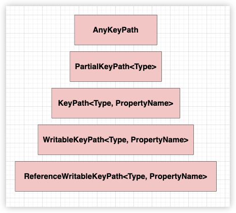

<font size = 4>

### 对象
笔者最开始就明确了在swift的学习文档中使用对象来对所有变量进行统称:
1. 全局变量: 全局对象
2. 局部变量: 局部对象
3. 成员变量: 成员对象

若以读写区分则是:
1. 只读变量(<font color = red>let变量</font>): 只读对象
1. 读写变量(<font color = red>var变量</font>): 读写对象

其实无论怎么划分, 它们的本质是一样的: 都占据了内存空间. 为了理解swift中的属性概念, 笔者将对象和属性进行拆分(<font color = red>特别是与存储属性</font>): 属性最主要的功能用来规定对象是如何进行访问的. 简单来说:
1. 存储属性修饰的对象可以直接从内存中读写对象
2. 计算属性只是读写方法, 在调用形式上和存储属性保持一致. 

可以在语法层面上使用计算属性修饰对象, 同时调用格式上和存储属性是一致, 但要清楚计算属性本质是方法,  所以逻辑上它不能修饰对象. 通过它调用setter来设置数据, 调用getter来获取数据, 但这些数据的来源和去向它自己本身并不知道. 也就是说计算属性虽然修饰了对象, 但其实只是声明了方法名, 没有对应的关联内存. 语法层面上它所访问的对象内存其实是假象.


默认情况下声明的对象都被存储属性修饰, 所以之前案例中对对象的访问实际都是内存直接读写. 从这一点来看存储属性在逻辑上其实和对象是一致的. 

> 计算属性和存在属性是互斥的, 不会同时存在


### 计算属性
上小节提到过属性用来修饰对象的, 所以不管是全局对象还是局部对象都可以被属性修饰. 那现在牵扯到2种对象:
1. let对象
2. var对象

先说结论: <font color = red>不能修饰let对象</font>. 看一下声明和定义格式

```swift

// 计算属性没有关键字
//  直接在声明对象的类型后面添加相关的getter,setter
var n: Int {
    get {
        // 这里面本质就是方法,
        //  只有1条语句直接省略return
        Int(os.arc4random_uniform(0xffffff))
    }

    set {
        // 默认参数名为newValue
        //  由swift传递进来, 它的类型是Int
        print("要设置的值为\(newValue)")
    }
}


var n2: Double {
    get {0}
    set(new_value){
        // 自定义参数名, 原来的newValue不能再使用
    }
}


// 只读计算属性时, 可以省略get的声明区
//  在整个区域内给出返回值
//  因为只有1条语句, 所以又可以省略return
var n3: String{
    "hello"
}
```

> 注意计算属性的声明定义在类型的后面没有`=`, 若加上`=`则变成了lambda. 计算属性至少是可读的(<font color = red>即只有getter</font>)


计算属性不能修饰let对象, 这个是强制性的语法要求.  笔者认为应该这样理解: 计算属性会调用方法设置数据所以逻辑上存在状态的改变的倾向. 而let对象的逻辑意义是不允许修改对象, 即状态不能修改, 所以从这一点来看这2点就是矛盾的. 


<a id="link-cal-pro-ref-obj"></a>

### 计算属性引用外围对象
计算属性在声明的地点做了定义, 理论上相当于是嵌套函数. 由于定义和引用外围局部对象其实在同一作用域, 所以它可以引用inout参数, 不存在对是否是逃逸闭包的调用

```swift
func test(val: inout Int, noes_lam:() -> (), es_lam:@escaping () -> ()){
    var n3: Int{
        val += 20   // 引用外围的局部对象, 可以是inout

        noes_lam()  // 调用非逃逸闭包
    
        es_lam()    // 调用逃逸闭包

        return val
    }
    _ = n3          // 访问n3, 会触发getter


    // no escaping
    //  非逃逸闭包, 效果和n3一样
    _ = {
        noes_lam()

        es_lam()

        val += 20

        print(n3)
    }()


    // escaping(声明的是let, 但产生了调用, 所以是escaping)
    let es_lam = {
        noes_lam()      // error, escaping调用no escaping

        es_lam()        // ok

        val += 20       // error, escaping 访问 inout

        print(n3)       // error, 编译器直接将n3的getter代码复制过来, 发现
                        //  1. 引用了局部inout对象val
                        //  2. 调用了no escaping noes_lam
    }
    es_lam()
} 
```


### 计算属性不会传递
上一小节在函数内部定义了计算属性n3, 它可以引用外围的局部inout对象, 也可以调用no escaping闭包, 从效果上看相当于是一个no escaping闭包. 现在来做一些别的测试:

```swift
func call(val: Int){
    let n = val
}

func test(val: inout Int, noes_lam:() -> (), es_lam:@escaping () -> ()){
    var n3: Int{
        val += 20   // __code_ref_inout

        noes_lam()  // __code_call_no_escaping

        es_lam()

        return val
    }

    call(n3)
}
```

[前面](#link-cal-pro-ref-obj)测试使得n3的getter方法的行为像一个no escaping, 所以这里笔者就假设getter就是一个no escaping闭包, 所以:
1. 将n3传递到其他函数
2. 查看编译器的行为

> 若真的是no escaping则会变成escaping, 这样会导致`__code_ref_inout`以及`__code_call_no_escaping`报错

最后发现编译器没有报任何错误, 所以getter本身不是no escaping, call调用前只是调用了getter将获取到的值传递给了call的参数val, 并且call运行的整个过程也没有出现任何getter的打印日志, 所以结论就是计算属性不会往后传递. 


### inout接收计算属性
上一小节中知道了计算属性不会向后传递, 但有一种情况需要测试, 即计算属性能不能当作地址传递给其他函数?? 从本质来看计算属性只是方法, 而方法本身确实是有地址的, 即编译器是不是将getter或setter的方法传递出去了呢? 但这样的逻辑显然是不成立的:
1. 是传递getter的地址, 还是setter的地址?
2. inout的参数可以修改的, 方法地址是禁止修改的
3. 传递方法地址本身没有意义
4. 如果将call的参数换成inout, 则call方法本身来说, 它并不清楚接收的对象具体什么属性:
    - 可能外界传递了一个有计算属性的对象地址
    - 也可能外界传递了一个没有计算属性的对象地址


> 笔者提一点: 现在之所以要假设可以使用inout参数接收一个计算属性, 是因为在语言层面计算属性是一个对象修饰(<font color = red>但本质它不是</font>), 它使对象有触发getter和setter的特性, 所以传递地址出去的这种特性对象应该能触发setter,getter, 只是现在不确定编译器传递的是什么地址? 因为计算属性本身没有内存. 

```swift
func test(_ val: inout Int){
    print("assign before")
    val = 20                // __call_setter
    print("assign after")
}

do {
    var n: Int  {
        get{
            print("getter")
            return #line
        }

        set {
            print("setter")
        }
    }

    test(&n)    // __call_getter
} 

#if false
getter
assign before
assign after
setter
#endif
```

经过测试确实可以使用inout参数接收计算属性, 并且可以触发getter和setter, 只是细致观察触发的机制好像不对:
1. 正常情况下打印应该是:
    1. `getter` 对应 `__call_getter`
    2. `assign before`
    3. `setter` 对应 `__call_setter`
    4. `assign after`

所以明显触发的操作发生在调用之后, 但传递地址确实可以触发. 现在直接查看汇编, 测试代码如下:

```swift
func test(_ val: inout Int){
    val = 20
}

do {
    var n: Int  {
        get{
            return #line
        }

        set {
        }
    }

    test(&n)
} 
```

```lua
swift`main:
    0x100003b0c <+0>:  sub    sp, sp, #0x20
    0x100003b10 <+4>:  stp    x29, x30, [sp, #0x10]
    0x100003b14 <+8>:  add    x29, sp, #0x10            
->  0x100003b18 <+12>: bl     0x100003b44               ; swift.n.getter : Swift.Int at main.swift:12
                                                        ;  gtter发生在调用test前, 对应 __call_getter

    0x100003b1c <+16>: mov    x8, x0                    ; x8 =  x0 = getter的返回值 ret-get
    0x100003b20 <+20>: add    x0, sp, #0x8              ; x0 = sp + 8 = &tmp_local
    0x100003b24 <+24>: str    x8, [sp, #0x8]            ; *(sp + 8) = ret-get

    0x100003b28 <+28>: bl     0x100003d84               ; swift.test(inout Swift.Int) -> () at main.swift:4
                                                        ;   调用test, 实际传递了x0, 一个局部对象的地址

    0x100003b2c <+32>: ldr    x0, [sp, #0x8]            ; x0 = *tmp-local
                                                        ;   tmp-local的内存一定在test函数内部被修改

    0x100003b30 <+36>: bl     0x100003cb0               ; swift.n.setter : Swift.Int at main.swift:17
                                                        ;   test调用完毕后, 再调用的setter, 这个时候触发 setter

    0x100003b34 <+40>: mov    w0, #0x0                  ; =0 
    0x100003b38 <+44>: ldp    x29, x30, [sp, #0x10]
    0x100003b3c <+48>: add    sp, sp, #0x20
    0x100003b40 <+52>: ret     


swift`test(_:):
    0x100003f6c <+0>:  sub    sp, sp, #0x10
    0x100003f70 <+4>:  str    xzr, [sp, #0x8]
    0x100003f74 <+8>:  mov    x8, x0                    ; x8 = &tmp-local
    0x100003f78 <+12>: str    x8, [sp, #0x8]            ; *(sp + 8) = &tmp-local, 原来存储的是getter获取的值
->  0x100003f7c <+16>: mov    w8, #0x14                 ; x8 = 20 
    0x100003f80 <+20>: str    x8, [x0]                  ; *x0 = 20 ==> tmp-local<0~7> = 20
    0x100003f84 <+24>: add    sp, sp, #0x10
    0x100003f88 <+28>: ret    
```

通过汇编可以清楚的知道当使用inout参数接收一个计算属性时, 一定会触发getter或getter, setter. 但触发的时机不同:
1. 调用前先触发getter获取值, 存储到局部对象
2. 调用函数, 传递局部对象的地址, 函数内部可能修改局部对象的值
3. 调用setter传递局部对象的值触发setter

这里面也可以看出: 不管调用函数内部有没有修改局部对象, 最终还是会触发setter, 这个就不验证了


### recursive
在计算属性时使用getter, setter时尽量避免递归调用

```swift
var n: Int {
    get {
        // 在这里访问n, 又会再调用getter
        //  然后下一次进来又重复获取, 形成了递归
        print("value:\(n)")
        return n
    }

    set {
        if newValue > 0 {
            // 这里又会调用 setter 形成递归
            n = newValue
        }
    }
}

print(n)

n = 20 
```

### 计算属性声明和定义分开
当对一个对象附加计算属性时, 默认情况下必须同时给出定义. 但其实利用协议[^ann-protocol]可以将声明和实现分开. 
```swift
// 协议是接口, 没有关联的对象内存,
//  所以协议的声明中不能含有内存布局相关的属性
//  只能声明方法, 计算属性
protocol P {
    // 协议声明一个计算属性
     var n: Int {get}
}

// 默认协议的实现
extension P{
    var n: Int {
        20
    }
}


// 遵循协议, 但没有实现计算属性
//  不过没有关系, 有默认的实现
struct E: P{}

// 遵循了实现 
//  变成了存储属性, 直接内存访问
//  存储属性符合只读计算属性的功能
struct T : P{
    // 存储属性
    var n: Int = 50
}


// 遵循协议, 并且提高了计算属性的权限(read-write)
class C : P {
    var n: Int {
        get {100}
        set {}
    }
}

let e: E = .init()
print(e.n)              // 20

let t: T = .init()
print(t.n)              // 50

let c: C = .init()
print(c.n)              // 100
```

### 计算属性与协议
协议中只能声明方法, 所以当协议中声明了计算属性后, 遵循协议者必须实现读写的动作, 但实现的权限必须`>=`协议所以有2种方式:
1. 使用存储属性(<font color = red>其读写的格式上与计算属性一致</font>)
2. 计算属性

```swift
protocol P {
    var p: Int{
        get
    }
}

// 扩展, 相当于P.p的默认实现
extension P {
    // 计算属性
    //  提高了权限(RW)
    var p: Int {
        get {20}
        set {}
    }
}

struct S: P {
    // 存储属性, 未提高权限(R)
    let p: Int
}


struct S2: P {
    // 存储属性, 提高了权限(RW)
    var p: Int
}

struct S3: P {
    // 计算属性, 未提高权限(R)
    var p: Int{
        20
    }
}

struct S4: P{
    // 计算属性, 提高了权限(RW)
    var p: Int{
        get {20}
        set {}
    }
}
```

### 计算属性与继承[^ann-inherit]
计算属性和存储属性是不能共存的, 所以从这一点结合继承的内存布局来看, 子类覆盖的原则是不能修改内存布局:
1. 子类不能使用存储属性来提权父类中的计算属性, 这样在逻辑上内存中父类部分的内存布局被修改
2. 子类可以覆盖父类中存储对象的访问形式(<font color = red>以计算属性形式</font>)

```swift
class S{
    // 父类是一个计算属性(R)
    var p: Int{
        get {20}
    }

    // 父类是一个存储属性(RW)
    var n: Int = 20
}

class S2: S {
    // 子类覆盖父类的实现, 未提权(R)
    override var p: Int {
        300
    }

    // 子类覆盖父类的实现, 添加了getter和setter
    //  来改变n的访问形式
    override var n: Int{
        get {20}
        set {}
    }
}

class S3: S {
    // 子类提权(RW)
    override var p: Int{
        get {30}
        set {}
    }
} 
```

### 再次提及枚举
在枚举的章节, 曾经提及到枚举的原始值本质就是计算属性, 只不过是编译器实现的, 当时自定义了枚举的原始值. 这里简单写个demo

```swift
enum Week: Int, RawRepresentable{
    case _0, _1, _2, _3, _4, _5, _6

    init(rawValue: String) {
        switch rawValue {
             case "周日":
                 self = ._0
             case "周一":
                 self = ._1
             case "周二":
                 self = ._2
             case "周三":
                 self = ._3
             case "周四":
                 self = ._4
             case "周五":
                 self = ._5
             case "周六":
                 self = ._6
            default:
                 self = ._0
        }
    }

    // 只有gette的计算属性
    var rawValue: String {
        switch self {
            case ._0:
                return "周日"
            case ._1:
                return "周一"
            case ._2:
                return "周二"
            case ._3:
                return "周三"
            case ._4:
                return "周四"
            case ._5:
                return "周五"
            case ._6:
                return "周六"
        }
    }
}
```

### struct中计算属性的setter
由于计算属性本质就是方法, 当它修饰struct的成员对象时, 要考虑该方法与mutating的关系. 默认情况下:
1. getter是nonmutating
2. setter是mutating

```swift
struct S {
    private var value = 20
    var mod_value: Int {
        get {
            value = 30      // error, 因为get默认是 nonmutating, 不能修改成员对象的值 
            return 30
        }

        set {
            value = 50      // ok, set默认是mutating
        }
    }
}
```

笔者强调一下: 心里知道这一点很重要, 因为这是SwiftUI中`@State`的原理之一, 笔者将在下一节给出一个在struct中修改成员对象的案例, 该案例是State包装器的原理


### nonmutaing修改成员对象
在struct的章节最后笔者留下了一个埋点: 可以利用计算属性在nonmutating的成员方法中修改self. 原理是:
1. 计算属性本身不关联到内存, 所以相当于是一个方法, 只要方法是nonmutating的, 理论上就可以修改成员对象
2. 计算属性的书写格式和存储属性是一致的, 所以诸如:`self.a = b`的书写格式其实是调用了setter方法, 如果该setter是nonmutating的, 则编译就可以通过

如下面的一个小测试:

```swift
import os
import Foundation
class Data{
    var value: Int
    init(value: Int) {
        self.value = value
    }
}

struct S1{
    private var data: Data = .init(value: 0)

    // getter, 和setter都是 nonmutating
    //  向外界保证不会修改self
    // 内存修改的是引用类型的对象, 自己本身并未修改
    var value: Int{
        get {
            return data.value
        }

        nonmutating set {
            data.value = newValue
        }
    }
}

struct S2{
    var value:Int {
        // getter, setter都为nonmutating
        //  这里使用持久化存储来读写数据, 自己本身并未改变
        get {
            return UserDefaults.standard.integer(forKey: "number")
        }
        nonmutating set {
            UserDefaults.standard.set(newValue, forKey: "number")
        }
    }
}

struct T {
    var s1 = S1()
    var s2 = S2()

    func test() {
        // s1的计算属性已经标注了 nonmutating,
        //  会保证不会修改s1的内存, 所这里编译不会报错
        s1.value = 20
    }

    func test2(){
        // 同上
        s2.value = 20
    }
} 
```

它有什么用?? 笔者这里不行过多介绍, 但它是SwiftUI中`@State`实现的原理, 后续到了Builder和SwiftUI时, 笔者会详细探究

### lazy
lazy也用来修饰对象, 表示第1次访问对象时才自动初始化它的值. 它的目的是初始化1次, 但不是线程安全的. 这有点像let对象, let对象在使用前必须是已经初始化的, 所以在声明对象时未赋值的let对象必须在使用前进行一次手动初始化

```swift
let n: Int

print(n)        // error, 未初始化

n = 20          // 手动初始化

print(n)        // right

n = 30          // error, n初始化过后, 不能改变
```

如果在声明let对象时直接立即初始化, 则后续不能再修改, 只能读取

```swift
let  n: Int = 20    // 直接立即初始化
print(n)
n = 30          // error, 不能修改let对象的值
```

而lazy在语法上的定义是在用到时才自动初始化, lazy的使用有以下限制:
1. 不能修饰全局对象
2. 不能修饰let对象
3. 不能修饰计算属性
4. 必须有初始值(<font color = red>语法规定</font>)

> 总结就是: 只能修饰局部可写对象

不能修饰全局对象的原因:
1. 当是整个进程的全局对象时, 这种全局对象会由swift的运行时库初始化, 逻辑上并非懒加载的(<font color = red>用到时加载</font>)
2. 当是static修饰的类型属性对象时, 这种全局对象的初始化过程必须是线程安全的, 但lazy生成的getter, setter并不是线程安全的, 所以编译器索性禁止lazy修饰这种对象. 编译器会生成其他线程安全的代码来只初始化一次该对象

不能修饰let对象的原因:
因为lazy不是线程安全的, 所以可能导致对象被初始化多次, 这和let的逻辑意义不符. 

> 即如果`lazy let n = 20`这句代码成立, 则为了符合lazy的定义, 不能立即初始化. 同时为了符合let的定义, 只能初始化一次. 所以到时候真正使用n时可能是多条线程在访问造成n初始化多次, 与let被初始化1次的定义不符, 并且逻辑就是在不断的修改n也与let定义不符


不能修饰计算属性的原因: 这个笔者认为直接从逻辑上来解释, 因为lazy要求修改一个存在的对象, 而计算属性本质就是函数方法, 没有所谓的对象


### lazy工作流程
lazy旨在初始化1次对象, 后续直接读取已经设置好的值, 所以lazy的工作模式很好推测:
1. 开辟heap空间用来存储对象
2. 像计算属性一样为其生成getter, setter
3. getter方法中有取值和初始化的判断流程
    - 如果有值则直接取出来返回
    - 没有值则初始化, 然后将初始化的值填充到heap中
4. 对象的所有赋值操作会调用setter

这个过程直接看汇编代码:

```swift
do {
    lazy var n: Int = {
        20
    }()

    n = 50
}
```


```lua
swift`main:
    0x100003d64 <+0>:   sub    sp, sp, #0x30
    0x100003d68 <+4>:   stp    x29, x30, [sp, #0x20]
    0x100003d6c <+8>:   add    x29, sp, #0x20
    0x100003d70 <+12>:  stur   xzr, [x29, #-0x8]
    0x100003d74 <+16>:  str    xzr, [sp, #0x10]
    0x100003d78 <+20>:  adrp   x8, 1
    0x100003d7c <+24>:  add    x8, x8, #0x28
    0x100003d80 <+28>:  add    x0, x8, #0x10
    0x100003d84 <+32>:  mov    w8, #0x20                ; =32 
    0x100003d88 <+36>:  mov    x1, x8
    0x100003d8c <+40>:  mov    w8, #0x7                 ; =7 
    0x100003d90 <+44>:  mov    x2, x8
    0x100003d94 <+48>:  bl     0x100003f40              ; symbol stub for: swift_allocObject
                                                        ; 开辟heap用来存储局部对象n
                                                        ;   x0: &Int.metadata
                                                        ;   x1: 32(大小)
                                                        ;   x2: 一个mask
                                                        ; 返回值 x0 = &heap-n (0x2_00_00_00_03)
    0x100003d98 <+52>:  str    x0, [sp, #0x8]           ; *(sp + 8) = &heap-n
    0x100003d9c <+56>:  add    x8, x0, #0x10            ; x8 = x0 + 16 = &heap-n.data
                                                        ;   swift堆中的对象前16字节是metadata和引用计数, 第16字节后开始是数据

    0x100003da0 <+60>:  stur   x8, [x29, #-0x8]         ; *(x29 - 8) = &heap-n.data
    0x100003da4 <+64>:  str    xzr, [x0, #0x10]         ; *(x0 + 16) = 0 ==> heap-n.data<0~7> = 0
    0x100003da8 <+68>:  mov    w8, #0x1                 ; x8 = 1 
    0x100003dac <+72>:  and    w8, w8, #0x1             ; x8 = 1
    0x100003db0 <+76>:  and    w8, w8, #0x1             ; x8 = 1
    0x100003db4 <+80>:  strb   w8, [x0, #0x18]          ; *(x0 + 0x18) = 1 ==> heap.n.data<8~15> = 1
->  0x100003db8 <+84>:  bl     0x100003e10              ; swift.n.getter : Swift.Int at main.swift:7
    0x100003dbc <+88>:  ldr    x1, [sp, #0x8]           ; x1 = *(sp + 8) = &heap-n
    0x100003dc0 <+92>:  str    x0, [sp, #0x10]          ; *(sp + 0x10) = getter的返回值(20)
    0x100003dc4 <+96>:  mov    w8, #0x32                ; x8 = 50 
    0x100003dc8 <+100>: mov    x0, x8                   ; x0 = 50
    0x100003dcc <+104>: bl     0x100003ecc              ; swift.n.setter : Swift.Int at main.swift:7
                                                        ;   参数x0: 50
                                                        ;   参数x1: &heap-n, 内部赋值

    0x100003dd0 <+108>: ldr    x0, [sp, #0x8]           ; x0 = *(sp + 8) = &heap-n
    0x100003dd4 <+112>: bl     0x100003f70              ; symbol stub for: swift_release
                                                        ;   作用域结束release(0x3 - 0x2_00_00_00_03, 将小于0会释放对象)
    0x100003dd8 <+116>: mov    w0, #0x0                 ; =0 
    0x100003ddc <+120>: ldp    x29, x30, [sp, #0x20]
    0x100003de0 <+124>: add    sp, sp, #0x30
    0x100003de4 <+128>: ret    


;x0: &heap-n
;    &heap-n<16~23>: heap-n.data<0~7>(脏数据, 未初始化)
;    &heap-n<24~31>: heap-n.data<8~15>(1)
swift`getter of n #1 in :
->  0x100003e10 <+0>:   sub    sp, sp, #0x60
    0x100003e14 <+4>:   stp    x29, x30, [sp, #0x50]
    0x100003e18 <+8>:   add    x29, sp, #0x50
    0x100003e1c <+12>:  str    x0, [sp, #0x20]          ; *(sp + 0x20) = &heap-n
    0x100003e20 <+16>:  stur   xzr, [x29, #-0x8]        ; *(x29 - 8) = 0
    0x100003e24 <+20>:  add    x8, x0, #0x10            ; x8 = &heap-n.data
    0x100003e28 <+24>:  stur   x8, [x29, #-0x8]         ; *(x29 - 8) = &heap-n.data
    0x100003e2c <+28>:  ldr    x8, [x0, #0x10]          ; x8 = heap-n.data<0~7> (可能是未初始化的脏数据, 也可能已经初始化了)
    0x100003e30 <+32>:  str    x8, [sp, #0x28]          ; *(sp + 0x28) = 
    0x100003e34 <+36>:  ldrb   w8, [x0, #0x18]          ; w8 = heap-n.data<8~15> (1)

    0x100003e38 <+40>:  tbnz   w8, #0x0, 0x100003e58    ; <+72> at main.swift:7:23
                                                        ;   if w8<0bit> == 1 
                                                        ;       goto __asm_init

    0x100003e3c <+44>:  b      0x100003e40              ; <+48> at main.swift
    0x100003e40 <+48>:  ldr    x8, [sp, #0x28]          ; x8 = *(sp + 0x28) = heap-n.data<0~7>, 取出数据
    0x100003e44 <+52>:  str    x8, [sp, #0x18]          ; *(sp + 0x18) = heap-n.data<0~7>
    0x100003e48 <+56>:  b      0x100003e4c              ; <+60> at main.swift
    0x100003e4c <+60>:  ldr    x0, [sp, #0x18]          ; x0 = *(sp + 0x18) = heap-n.data<0~7>
    0x100003e50 <+64>:  str    x0, [sp, #0x10]          ; *(sp + 0x10) = heap-n.data<0~7>
    0x100003e54 <+68>:  b      0x100003eb0              ; <+160> at <compiler-generated>
                                                        ;   goto __asm_return

; __asm_init
    0x100003e58 <+72>:  bl     0x100003ec0              ; closure #1 () -> Swift.Int in swift at main.swift:9:5
                                                        ;   x0 = 20(返回值) 
    0x100003e5c <+76>:  ldr    x8, [sp, #0x20]          ; x8 = *(sp + 0x20) = &heap-n
    0x100003e60 <+80>:  str    x0, [sp, #0x8]           ; *(sp + 8) = 20
    0x100003e64 <+84>:  add    x0, x8, #0x10            ; x0 = &heap-n.data
    0x100003e68 <+88>:  sub    x1, x29, #0x20           ; x1 = x29 - 0x20 = &tmp-local-0
    0x100003e6c <+92>:  str    x1, [sp]                 ; *sp = &tmp-local-0
    0x100003e70 <+96>:  mov    w8, #0x21                ; x8 = 33(写操作)
    0x100003e74 <+100>: mov    x2, x8                   ; x2 = 33
    0x100003e78 <+104>: mov    x3, #0x0                 ; x3 = 0 
    0x100003e7c <+108>: bl     0x100003f4c              ; symbol stub for: swift_beginAccess
                                                        ;   这里埋个点

    0x100003e80 <+112>: ldr    x9, [sp, #0x20]          ; x9 = *(sp + 0x20) = &heap-n 
    0x100003e84 <+116>: ldr    x0, [sp]                 ; x0 = *sp = &tmp-local-0, 准备调用endAccess释放TLS中的链表(指针章节)
    0x100003e88 <+120>: ldr    x8, [sp, #0x8]           ; x8 = *(sp + 8) = 闭包的返回值20
    0x100003e8c <+124>: str    x8, [x9, #0x10]          ; *(x9 + 16) = heap-n.data<0~7> = 20
    0x100003e90 <+128>: mov    w8, #0x0                 ; w8 = 0  
    0x100003e94 <+132>: and    w8, w8, #0x1             ; w8 = 0
    0x100003e98 <+136>: and    w8, w8, #0x1             ; w8 = 0
    0x100003e9c <+140>: strb   w8, [x9, #0x18]          ; *(x9 + 24) = 0 ==> heap-n.data<8~15> = 0(标记已经初始化了)
    0x100003ea0 <+144>: bl     0x100003f64              ; symbol stub for: swift_endAccess
    0x100003ea4 <+148>: ldr    x0, [sp, #0x8]           ; x0 = 20
    0x100003ea8 <+152>: str    x0, [sp, #0x10]          ; *(sp + 0x10) = 20
    0x100003eac <+156>: b      0x100003eb0              ; <+160> at <compiler-generated>

; __asm_return
    0x100003eb0 <+160>: ldr    x0, [sp, #0x10]
    0x100003eb4 <+164>: ldp    x29, x30, [sp, #0x50]
    0x100003eb8 <+168>: add    sp, sp, #0x60
    0x100003ebc <+172>: ret   


; x0: 50
; x1: &heap-n
swift`setter of n #1 in :
->  0x100003ecc <+0>:   sub    sp, sp, #0x50            
    0x100003ed0 <+4>:   stp    x29, x30, [sp, #0x40]
    0x100003ed4 <+8>:   add    x29, sp, #0x40
    0x100003ed8 <+12>:  str    x0, [sp]                 ; *sp = 50
    0x100003edc <+16>:  str    x1, [sp, #0x8]           ; *(sp + 8) = &heap-n
    0x100003ee0 <+20>:  stur   xzr, [x29, #-0x8]        ; *(x29 - 8) = 0
    0x100003ee4 <+24>:  stur   xzr, [x29, #-0x10]       ; *(x29 - 16) = 0
    0x100003ee8 <+28>:  stur   x0, [x29, #-0x8]         ; *(x29 - 8) = 50
    0x100003eec <+32>:  add    x0, x1, #0x10            ; x0 = &heap-n.data
    0x100003ef0 <+36>:  mov    x8, x0                   ; x8 = &heap-n.data
    0x100003ef4 <+40>:  stur   x8, [x29, #-0x10]        ; *(x29 - 16) = &heap-n.data
    0x100003ef8 <+44>:  add    x1, sp, #0x18            ; x1 = sp + 0x18 = &tmp-local-0
    0x100003efc <+48>:  str    x1, [sp, #0x10]          ; *(sp + 0x16) = &tmp-local-0
    0x100003f00 <+52>:  mov    w8, #0x21                ; x8 =33 
    0x100003f04 <+56>:  mov    x2, x8                   ; x2 = 33
    0x100003f08 <+60>:  mov    x3, #0x0                 ; x3 =0 
    0x100003f0c <+64>:  bl     0x100003f4c              ; symbol stub for: swift_beginAccess
                                                        ;   内存错误检查(对&heap-n.data)

    0x100003f10 <+68>:  ldr    x8, [sp]                 ; *sp = 50(参数)
    0x100003f14 <+72>:  ldr    x1, [sp, #0x8]           ; x1 = *(sp + 8) = &heap-n
    0x100003f18 <+76>:  ldr    x0, [sp, #0x10]          ; x0 = *(sp + 16) = &tmp-local-0
    0x100003f1c <+80>:  str    x8, [x1, #0x10]          ; *(x1 + 16) = 50 ==> heap-n.data<0~7> = 50,赋值
    0x100003f20 <+84>:  mov    w8, #0x0                 ; =0 
    0x100003f24 <+88>:  and    w8, w8, #0x1
    0x100003f28 <+92>:  and    w8, w8, #0x1
    0x100003f2c <+96>:  strb   w8, [x1, #0x18]          ; heap-n.data<8~15> = 0, 标记已经初始化 
    0x100003f30 <+100>: bl     0x100003f64              ; symbol stub for: swift_endAccess
                                                        ;   销毁TLS中的链表
    0x100003f34 <+104>: ldp    x29, x30, [sp, #0x40]
    0x100003f38 <+108>: add    sp, sp, #0x50
    0x100003f3c <+112>: ret   
```

总结:
1. 对于局部对象的lazy, 将开辟heap
2. `heap<16~23>`表示数据部分
3. `heap<24~31>`标记是否初始化, 若是1则未初始化. 当初始化后或setter后会标记为0
4. getter时先判断标记, 若为0则表示初始化了,直接取值, 若为1则初始化, 但其实是直接在getter内初始化的, 并未调用setter
5. 每次访问对象时会有内存检查

问题: 为什么要对lazy对象做内存检查? 毕竟lazy所修饰的局部对象是无法离开作用域的, 并且在getter和setter虽然出现了`swift_xxxAccess`, 但配对的这2个函数中间并未调用其他函数, 所以从getter和setter的调用是不会有内存错误的!! 除非在进入getter或setter前出现了`swift_beginAccess`, 那什么场景下会出现外界调用了`swift_beginAccess`. 最常见的情况是传入给了inout参数. 这个答案将在下节给出


### 自己赋值自己
结合计算属性, 当计算属性传递给inout参数时, 实际传递的是临时对象的地址, 从逻辑上这个临时对象对用户来说没有意义, 所以前面观察的计算属性相关的inout汇编代码中并未出现`swift_Access`.  下面来测试一下:

```swift
var cal: Int {
    set{}
    get{20}
} 
cal = cal   // __code_self_assign_to_self
```

代码中`__code_self_assign_to_self` 应该是报错的, 因为swift中不允许自己对自己赋值(<font color = red>回顾指针的章节</font>), 但事实上编译器通过了这种语法.  又因为在进入getter, setter前并未调用`swift_beginAccess`, 所以不会出现内存错误. 其实`cal = cal`就像是`cal.setter(cal.getter)`.

同样的流程来看一下lazy: lazy的getter中出现了`swift_beginAccess`, 则若在调用getter前出现了`swift_beginAccess`并且是写操作时则一定是内存错误, 但前面所分析的汇编中在调用getter或setter前没有调用任何`swift_beginAccess`, 所以没有内存错误的问题, 如下面

```swift
lazy var b = 20
b = b       
```
自己对自己赋值不会出现问题. 当然这只是一种情况. 另一种情况是当将lazy传递给inout时, 根据前面的总结: 传递inout参数时swift会发起`swift_beginAccess`, 所以要考虑lazy是否也是一样? 笔者这里直接给出总结: lazy传递inout参数时的行为模式和计算属性一样, 也是传递了一个局部对象, 然后在调用完毕后再调用setter, 所以它也不会出现内存错误.

```swift
do {
    lazy var n: Int = {
        20
    }()

    func f2(_ v1: inout Int, _ v2: inout Int){
        v1 = v2
    }


    func test(_ val: inout Int) {
        f2(&val, &n)
    }

    test(&n)
}
```

> 代码没有内存错误


### lazy不是线程安全的
```swift
do {
    lazy var n: String = {
        print(pthread_self())
        return String("\(pthread_self())")
    }()

    for _ in 1...5 {
        Task{
            print("get n:\(n)")
        }
    }
    os.pause()
} 
```
上述使用lazy修饰局部对象n的初始化是一个闭包表达式, 然后以并发的方式访问n, 编译器生成的getter方法内部并不是线程安全的, 所以最后n的值是不确定的 


### lazy与协议和继承
由于lazy需要关联内存, 但在协议中不允许带有内存相关的声明, 所以2者不能共存. 这同样适合于扩展, 即扩展内部不能有let声明. lazy在子类中只能覆盖为计算属性(<font color = red>不会改变子类内存中父类的部分</font>)

```swift
protocol P {
    // 协议中不能声明附带内存的声明
    //  lazy本身在逻辑上确实要关联一个内存
    lazy var p: Int = 20        // error
}

class S{
    // 父类定义一个lazy
    lazy var l: Int = 20
}

extension S {
    // 扩展中不能声明lazy属性, 逻辑上要改变S类型的内存布局
    //  所以swift中不允许这样做
    lazy let s: Int = 20
}

class S2: S {
    // 子类使用计算属性覆盖父类中lazy的访问形式
    override var l: Int{
        get {20}
        set {}
    }
}
```


### 它们与指针的处理
前面已经清楚了, 当产生inout参数时, 不管是计算属性还是lazy都会将局部对象的地址传递给inout参数, 并且没调用`swift_xxxAccess`的内存错误检查代码. 而指针和inout本质是一样的东西, 所以可以推测使用指针时它们接收的也是局部对象的地址


```swift
lazy var n: Int = {
        20
    }()


    let ptr = UnsafePointer<Int>.init(&n)

    // 实际运行起来后, 直接将n对象的getter值存储到局部对象的空间中
    let val = ptr.pointee

    // 直接传递局部对象的地址(没有引用计数)
    func f2(_ ptr: UnsafePointer<Int>){
        print(ptr.pointee)
    }

    f2(ptr)
}
```
```lua
swift`main:
    0x100003be8 <+0>:   sub    sp, sp, #0x40
    0x100003bec <+4>:   stp    x29, x30, [sp, #0x30]
    0x100003bf0 <+8>:   add    x29, sp, #0x30
    0x100003bf4 <+12>:  adrp   x8, 1
    0x100003bf8 <+16>:  ldr    x8, [x8, #0x38]
    0x100003bfc <+20>:  ldr    x8, [x8]
    0x100003c00 <+24>:  stur   x8, [x29, #-0x8]
    0x100003c04 <+28>:  stur   xzr, [x29, #-0x10]
    0x100003c08 <+32>:  str    xzr, [sp, #0x10]
    0x100003c0c <+36>:  str    xzr, [sp, #0x8]
    0x100003c10 <+40>:  adrp   x8, 1
    0x100003c14 <+44>:  add    x8, x8, #0x70
    0x100003c18 <+48>:  add    x0, x8, #0x10
    0x100003c1c <+52>:  mov    w8, #0x20               
    0x100003c20 <+56>:  mov    x1, x8
    0x100003c24 <+60>:  mov    w8, #0x7                 
    0x100003c28 <+64>:  mov    x2, x8
    0x100003c2c <+68>:  bl     0x100003f20               
    0x100003c30 <+72>:  str    x0, [sp]                 
    0x100003c34 <+76>:  add    x8, x0, #0x10
    0x100003c38 <+80>:  stur   x8, [x29, #-0x10]
    0x100003c3c <+84>:  str    xzr, [x0, #0x10]
    0x100003c40 <+88>:  mov    w8, #0x1                  
    0x100003c44 <+92>:  and    w8, w8, #0x1
    0x100003c48 <+96>:  and    w8, w8, #0x1
    0x100003c4c <+100>: strb   w8, [x0, #0x18]
    0x100003c50 <+104>: bl     0x100003cd8              ; swift.n.getter : Swift.Int at main.swift:7
    0x100003c54 <+108>: mov    x8, x0
    0x100003c58 <+112>: add    x0, sp, #0x18
    0x100003c5c <+116>: str    x8, [sp, #0x18]          ; tmp-local = gette的返回值
    0x100003c60 <+120>: mov    x8, x0
    0x100003c64 <+124>: str    x8, [sp, #0x10]
    0x100003c68 <+128>: ldr    x8, [sp, #0x18]
    0x100003c6c <+132>: str    x8, [sp, #0x8]

->  0x100003c70 <+136>: bl     0x100003d94              ; swift.f2(Swift.UnsafePointer<Swift.Int>) -> () at main.swift:15
                                                        ; 只关心传递指针时的参数x0
                                                        ;   x0 = sp + 0x18 = &tmp-local
                                                        ;   所以当前lazy被引用的指针其实是局部对象的地址
    0x100003c74 <+140>: ldr    x0, [sp]
    0x100003c78 <+144>: bl     0x100003f5c        
    0x100003c7c <+148>: ldur   x9, [x29, #-0x8]
    0x100003c80 <+152>: adrp   x8, 1
    0x100003c84 <+156>: ldr    x8, [x8, #0x38]
    0x100003c88 <+160>: ldr    x8, [x8]
    0x100003c8c <+164>: subs   x8, x8, x9
    0x100003c90 <+168>: cset   w8, eq
    0x100003c94 <+172>: tbnz   w8, #0x0, 0x100003ca0  
    0x100003c98 <+176>: b      0x100003c9c           
    0x100003c9c <+180>: bl     0x100003f14          
    0x100003ca0 <+184>: mov    w0, #0x0            
    0x100003ca4 <+188>: ldp    x29, x30, [sp, #0x30]
    0x100003ca8 <+192>: add    sp, sp, #0x40
    0x100003cac <+196>: ret     
```

> 计算属性的过程也是一样的


### 观察器
可以对一个<font color = red>属性</font>添加<font color = red>写监听</font>, 当属性被<font color = red>赋值</font>时会触发, 这里面默认隐含了3个细节:
1. 属性: 存储属性一定可以添加写监听! 对于计算属性来说, 若它本身有setter, 添加写监听是冗余的, 即 <font color = red>setter和写监听不能共存</font>
2. 写监听: 所以let对象不能添加监听
3. 赋值: 所以构造过程中不会触发. 经过测试在构造器内部时都不会触发

> 关于计算属性的监听细节下小段探究, 这里先来最基本的定义格式

```swift
// 不能修饰let
let n1: Int = 30  {
    didSet{}
    willSet{}
}


// 修饰全局的avr
var n2: Int = 30  {
    didSet{
        // newValue其实是 n2自己
        print("\(oldValue)")
    }

    willSet{
        // oldValue其实是 n2自己
        print("\(newValue)")
    }
}


// 修饰局部的var
do {
    lazy var n3: Int = 30 {
        didSet{}
        willSet{}
    }
}


struct int {
    // 修饰局部var(成员)
    var n: Int {
        didSet{}
        willSet{}
    }

    // 修饰全局var(static)
    static var n: Int = 30 {
        didSet{}
        willSet{}
    }
} 
```


### 计算与监听共存的场景
在协议中计算属性的声明和实现被分离, 所以遵循协议的实现者可以做提权操作, 当以存储属性实现时, 看上去就像存储属性和计算属性共存了. 并且可以在存储属性上添加监听. 但事实上实现者本身的内存布局和所遵循的协议没有任何关系

```swift
protocol P {
    var n: Int {get set}
}

struct S{
    // 直接使用存储属性,
    //  S的内存布局不会受P的影响
    //  从整个声明角度看, n像是同时有 getter, setter, didSet, ,willSet
    var n: Int{
        didSet{}
        willSet{}
    }
} 

class Human{
    // 基类有身高的计算属性
    var hight: Double {
        // 世界平均身高
        get { 155 }
        set { }
    }
}

class Chinese: Human {
    // 若是中国人设置身高监听一下
    //  子类只是改变了身高的访问形式
    //  没有改变任何内存布局
    //  所以看上去hight相当于同时实现了 setter, getter, didSet, willSet
    override var hight: Double {
        didSet{}
        willSet{}
    }
}
```

### 监听被覆盖
这种情况只存在继承体系中

```swift
class Human{
    var hight: Double {
        didSet{

        }
        willSet{

        }
    }

    init(hight: Double) {
        self.hight = hight
    }
}

class Chinese: Human {
    override var hight: Double {
        didSet{

        }
        willSet{

        }
    }
} 
```

### 监听触发的场景
监听只有在非init方法中才会有效

```swift
struct S {
    var s1: Int {
        didSet {print("didSet")}
        willSet {print("willSet")}
    }

    init(s1: Int) {
        // 初始化, 不触发
        self.s1 = s1

        // 已经初始化完毕了, 这里是赋值, 但不也会触发监听
        self.s1 = s1

        _ = {
            // 没有在init方法中, 触发监听
            self.s1 = 20
        }()

        // 触发监听
        test()
    }

    mutating func test(){
        // 由于当前不在init方法中,  所以触发监听
        //  即使由init方法调用
        self.s1 = 20
    }
}

let s1: S = .init(s1: 20) 
```

demo中的结构比较简单, 如果牵扯到继承经过笔者的测试, 逻辑上是一样的, 只要不在init方法中都会触发: <font color = red>出现派生时子类的init会触发, 说白了还是不在自己的init中</font>


```swift
class C {
    var c: Int {
        didSet{print("didSet")}
        willSet{print("willSet")}
    }
    init(c: Int) {
        self.c = c

        self.c = c  // 不触发

        _ = {
            self.c = 30 // 触发
        }()

        test()      // 触发
    }

    func test(){
        self.c = 20
    }
}

class C1: C {
    var n: Int
    init(n: Int) {
        self.n = n

        super.init(c: 20)

        self.c = 20     // 注意这里, 会触发. 没有在c所在的init中

        // 触发 
        _ = {
            self.c = 30
        }()

        // 触发
        self.c_test()
    }

    func c_test(){
        self.c = 30
    }
}

let c1: C1 = .init(c: 20)
```

### 监听注意递归
像计算属性一样, 在didSet或willSet中尽量不要直接赋值

```swift
var n: Int = 22{
    didSet{
        // 这里是访问, 不是赋值, 所以不会有问题
        print("value:\(n)")
    }

    willSet{
        if newValue < 20 {
            // 这里对n进行了赋值, 将造成递归
            n = 20
        }
    }
} 
```


### 属性包装器
计算属性的getter, setter其实针对于对象来说有一种过滤功能, 为了引导出包装器, 现在给出一个需求: 要求成员(<font color = red>class中的成员</font>)在进行赋值是线程安全的

思路分析: 成员要线程安全必须在IO部分形成临界, 所以要手动控制getter和setter的实现, 这就必须使用到计算属性, 但还是要关联一个存在的对象, 所以将该对象设置为外界不可访问的. 总结起来:
1. 向外界公开计算属性
2. 内部设计一个私有对象, 供计算属性修改
3. 计算属性内部做好线程安全

> 这里目前不能考虑实现struct, 只实现class, 具体原因实现完之后点评

具体在实现上若私有对象的IO要线程安全, 则:
1. 所有线程在访问它时, 要保证是同一块内存
2. 所有线程在访问它时, 要保证是同一把锁, 所以锁也必须是同一块内存
3. 从语言层面上看对象和锁最好封装在一起

所以具体的实现架构:
1. 抽象一个包装类Wrap, Wrap是一个引用类型
2. 内部声明opaqueObj, 逻辑上表示不透明类型, 它的类型应该由外界传入, 所以整个Wrap是一个泛型 
3. 内部声明lock的值类型, 用来保护opaqueObj的访问
    - 可以使用atomic
    - 也可以使用mutex

代码如下: <font color = red>为了测试这个过程是不是线程安全的, 笔者修改了setter的实现, 通过多线程累加测试是不是线程安全的</font>

```swift
protocol LockProtocol<T> {
    associatedtype T
    mutating func lock()
    mutating func unlock()
}

/// Wrap要实现的协议
protocol WrapProtocol<T> {
    associatedtype T
    var value: T {set get}
}

/// 包装类
class Wrap<E> : WrapProtocol 

where E:BinaryInteger               // __code_test_0

{
    typealias T = E

    private var opaque_obj: T 

    private var lock: AtomicLock

    init(_ opaque_obj: E) {
        self.opaque_obj = opaque_obj
        self.lock = .init()
    }

    var value:T {
        get{
            lock.lock()
            let tmp = self.opaque_obj
            lock.unlock()
            return tmp
        }
        set{
            lock.lock()
#if DEBUG
            self.opaque_obj += 1   // __code_tets_1
#else   
            self.opaque = newValue
#endif
            lock.unlock()
        }
    }

    deinit{
        print("deinit")
    }

    // 锁实现
    private struct AtomicLock : LockProtocol{
        typealias T = os.atomic_flag

        // 不能使用lazy
        private var _lock = T()

        mutating func lock(){
            while os.atomic_flag_test_and_set_explicit(&_lock, memory_order_acq_rel) {
                continue
            }
        }

        mutating func unlock(){
            os.atomic_flag_clear_explicit(&_lock, memory_order_release)
        }
    }
}
```

最外层的Wrap本身必须是引用类型(<font color = red>原因放在最后</font>), Wrap内部的锁是私有嵌套类型, 只能在Wrap内访问. Wrap实现了取值的逻辑`value`计算属性, 这个过程由AtomicLock来保证线程安全, 所以比较核心的是锁的实现.

```txt
AtomicLock类型:
    1. struct
    2. 提供临界区函数
    3. 它不能使用lazy:
        1. threadA调用 obj.val = 30
        2. threadB调用 obj.val = 50
        3. threadA.obj.setter(30)
        4. threadB.obj.setter(50)

            此刻threadA.obj.lock对象中的lock需要初始化
            可能这2条线程都发现, obj.lock还未初始化,
            根据前面lazy的getter已经得出了不是线程安全的, 所以
            threadA, threadB可能会多次初始化同一个对象obj.lock对象中的成员lock,
            所以可能出现:

        6. threadA.obj.setter(30):::lock.getter_lock()_ing_0    先进入初始化, 但未返回
        7. threadB.obj.setter(50):::lock.getter_lock()_ing_0    后进入初始化, 也未返回

        8. threadA.obj.setter(30):::lock.getter_lock()_ing_1::: _lock = false

        9. threadA.obj.setter(30):::lock.lock()                 A初始化后返回并加锁
        10.threadA.obj.setter(30):::obj.opaque_n = newValue    
            30, 但还未解锁, 逻辑上B不能进来的, 假设A由于调度机制被挂起

        11.threadB.obj.setter(30):::lock.getter_lock()_ing_1::: _lock = false
            此刻调度器调度B, B又将_lock设置为false, 会导致它可以加锁成功

        12.threadB.obj.setter(50):::lock.lock()                 B初始化后返回并加锁

        13.threadB.obj.setter(50):::obj.opaque_n = newValue    50,
            此刻2条线程都在所谓的临界区, 所以出问题了
```

程序中的`__code_test_0`和`__code_test_1`是为了测试. 现在先来说一下内存: 不会出现Wrap对象被释放后, 然后还处于`setter, getter`的过程中. 因为时间顺序上总是先做了ARC,然后才会有调用setter和getter, 最后对象离开作用域前一定是调用完了setter, getter, 举例来说单线程场景顺序:
1. 创建对象, retain操作
2. 访问对象的value, 内部通过lock线程安全的修改value
3. 对象离开作用域, 则value的访问已完毕, 做release操作

所以不会有问题. 对于单线程下对象赋值到其他对象也是一样的流程. 但要提一下逃逸闭包:
1. 逃逸闭包捕获对象, 做retain
2. 逃逸闭包内访问value
3. 逃逸闭包结束, 做release

所以正规的调用不会出现内存问题(<font color = red>如果不了解ARC机制, 不要使用指针</font>), 当涉及到多线程情况复杂一些, 但还是安全的:
1. 如果在其他线程(<font color = red>基于swift标准库下的线程</font>)中引用, 和逃逸闭包一样, 先retain
2. 在线程在访问value, 此刻对象内部的计算属性在所有线程看来是同一把锁, 不会出现问题
3. 访问完value
4. 线程结束, 做release操作

所以正常调用不会有内存问题, 下面是笔者对于Wrap的类型测试, 里面使用了swift标准库下的Task并发, 是严格做好ARC的. 但同时为了演示内核线程, 笔者使用了信号相关的函数指针, 并给出内存管理的细节

```swift
// 函数指针(C语言), 编译器会将对应的swift闭包或函数做好转换桥接
typealias SignalCallback    = @convention(c) (Int32) -> ()

// OC下的block, 编译器会将对应的sift闭包或函数做好转换接
typealias BridgeBlock       = @convention(block) () -> ()

/// 因为系统的函数指针不能引用swift的对象
///  这里做一步中转, 转换成block, 然后就可以引用了
/// 以系统函数signal为例
///     public func signal(_: Int32, _: (@convention(c) (Int32) -> Void)!) -> (@convention(c) (Int32) -> Void)!
/// 调用:
/// let n = 2 // swift引用对象
/// let op:Int? = n     // 为了统一引用类型
/// signal(os.SIGINT, cFunction{
///     print(op!)
///     op = nil    // 若是引用对象则会做ARC
/// })
func cFunction(_ block: @escaping BridgeBlock) -> SignalCallback {
    return unsafeBitCast(
        imp_implementationWithBlock(block),
        to: (@convention(c) (Int32) -> ()).self
    )
}

// 主线程的thread_id
let main = pthread_self()

var counting = 8, loop = 10_0000

print("main<\(main)>")


do {
    // 准备保留默认的信号处理函数(后续要还原)
    //  Mac环境下的GCD对信号模式做了修改, 只能是主线程处理信号
    //  POSIX下的线程库是没有问题的, 对谁发送信号, 谁就处理
    //  所以这里是从子线程向主线程发信号, 主线程在信号处理中等待所有的子线程
    var old:SignalCallback?

    do {
        let obj = Wrap.init(20)

        // 注册SIGINT异步回调
        //  因为这里涉及C的函数指针, 不能直接在闭包内引用swift对象,
        //  所以使用cFunction做中转, 先转成block.
        //  但需要处理内存管理
        var tmp:Wrap<Int>? = obj        // 接收对象时, retain第1次

                                        // 进入调用前, 由编译器 retain第2次
        old = signal(os.SIGUSR1, cFunction {
                                        
            counting -= 1

            // __code_logic_error
            if counting == 0 {
                print("signal<\(pthread_self()), \(String(describing: tmp?.value))>")

                
                tmp = nil               // release, 手动释放(不然没有ARC的操作)
                                        // 相当于release了调用前的那一次
            }
        })


        // obj和tmp会在do的作用域结束前release, 所以数量上是匹配的
        

        for i in (1...counting) {

            // 使用swift的标准库下的线程
            Task{
                print("sub<\(pthread_self())>")

                // 引用了obj, 会做好引用计数
                let o1 = obj

                // 循环loop次做加1操作, 这里就是多条线程的数据竞争区
                //  但ol.value的setter方法内部是有锁机制的
                //  最后的结果是没有问题的的
                for _ in (1...loop) {
                    o1.value = 1
                }

                // 这里是为了解决 __code_logic_error
                //  因为POSIX下的简单信号是不可靠的, 
                //  不可靠并不意味着是错误的, 而是信号机制本身的问题
                //  在信号处理期间, 如果再收到相同的信号是直接忽略的, 并不会排队.
                //  只有信号处理完毕后, 才恢复信号的监听
                //  所以若有8条线程发送SIGUSR1, 则可能处理的次数小于8次.
                //  为了保证信号处理8次, 笔者让每条线程再做完加法后, 依次睡眠N+1秒
                //  这样尽可能让信号在信号处理状态是正常的时刻发送出去
                sleep(UInt32(i))

                pthread_kill(main, os.SIGUSR1)
            }
        }
    }
    while counting != 0 {
        os.pause()
    }
    os.signal(os.SIGUSR1, old)
    assert(true)
}


#if false
main<0x00000001f0e73240>
sub<0x000000016fe87000>
sub<0x000000016ff13000>
sub<0x000000016ff9f000>
sub<0x00000001700b7000>
sub<0x000000017002b000>
sub<0x0000000170143000>
sub<0x00000001701cf000>
sub<0x000000017025b000>         

    // 等待大约8秒后, 最后打印, 发现数量是对的
    //  所以obj.value内部的setter是线程安全的
signal<0x00000001f0e73240, Optional(8000020)>
deinit  // 释放了内存
#endif
```

至此已经得到了一个Wrap包装器, 并且它是线程安全的, 现在将它运用到其他类中

```swift
struct Test {

    private var _n: Wrap<Int>       // __code_decl_value

    // 为了方便
     var n: Int {                   // __code_impl_value
        get {
            _n.value
        }

        set {
            _n.value = newValue
        }
    }

    init(_ n: Int) {
        _n = Wrap(n)
    }
}

// 测试是不是 500_0002
var t = Test.init(2)
for _ in 1...5 {
    Task{
        for _ in 1...1000000 {
            t.n = 1
        }
    }
}

sleep(5)        // 为了尽量等待线程执行完毕
print(t.n)      // 500_0002
```
现在来总结一下Wrap的使用:
1. 在其他类型中声明`__code_decl_value`, 私有并带下划线
2. 公开一个访问的计算属性`__code_impl_value`, 内部调用到Wrap的真实内存

以上就是开始业务的实现代码, 其实系统的Wrapper就是这个过程, 先来体验一下


```cpp
// 使用编译器识别的属性修饰自定义的struct, class, enum等
@propertyWrapper
struct SysWrap {
    private var opaque: Int
    var wrappedValue: Int{
        get {
            opaque
        }

        set {
            opaque = newValue
        }
    }

    init(opaque: Int) {
        self.opaque = opaque
    }
}


// 测试类
class obj{
#if true
    // 这一句代码就是下面 #else部分的展开
    

    // 会调用默认的 init(opaque:)
    @SysWrap(opaque: 20) var n: Int

#else
    private var _n: SysWrap = .init(opaque: 20)
    var n: Int {
        get {
            _n.wrappedValue
        }

        set {
            _n.wrappedValue = newValue
        }
    }
#endif
}
```

系统包装器会默认生成隐藏的对象: <font color = red>下划线版本的包装器类型的的对象</font>, 它的作用域仅在obj这个类的成员方法中. 同时声明一个对外的计算属性n用来间接访问闭包器中的对象值. 这个实现基本和笔者实现的过程是一样的. 下面的代码是使用包装器来修改笔者实现的代码:

```swift
protocol LockProtocol<T> {
    associatedtype T
    mutating func lock()
    mutating func unlock()
}


/// 不需要再遵循WrapProtocol协议了
/// 系统默认有固定的协议, 固定的计算属性去实现
///     以这种方式可以被编译器优化代码
@propertyWrapper
class Wrap<E: BinaryInteger> {
    typealias T = E

    private var opaque_obj: T

    private var lock: AtomicLock


    // 一般实现中固定一个 wrappedValue的构造器,
    //  这是一种编码约定, 习惯上:
    //      @Wrap(2)时 约定调用 init(_ wrappedValue: T)的构造器
    init(_ wrappedValue: T) {
        self.opaque_obj = wrappedValue
        self.lock = .init()
    }

    // 系统固定的协议: 必须实现的计算属性, 对应原来的value
    var wrappedValue: T {
        get{
            lock.lock()
            let result = self.opaque_obj
            lock.unlock()
            return result
        }
        set{
            lock.lock()
            self.opaque_obj += 1
            lock.unlock()
        }
    }

    deinit{
        print("deinit")
    }

    // 锁实现
    private struct AtomicLock : LockProtocol{
        // 这里的T和外层的T不是一个东西, 不要搞混了
        typealias T = os.atomic_flag

        // 不能使用lazy
        private var _lock = T()

        mutating func lock(){
            while os.atomic_flag_test_and_set_explicit(&_lock, memory_order_acq_rel) {
                continue
            }
        }

        mutating func unlock(){
            os.atomic_flag_clear_explicit(&_lock, memory_order_release)
        }
    }
}


struct Test {
    // swift会调用到 Wrap(_ wrappedValue:Int)
    @Wrap(2) var n: Int
}

do {
    let t = Test.init()
    for _ in 1...5 {
        Task{
            for _ in 1...1000000 {
                t.n = 1
            }
        }
    }
    sleep(5)
    print(t.n)
}
```


### PropertyWrap的构造方法
包装器本质就是swift的类型(<font color = red>以struct来说</font>),  可以在该类型中定义多种数据结构, 同时就需要提供不同的init方法, 其定义和调用策略如下:

```swift

@propertyWrapper
struct Wrap {
    private var des: String

    private var opaque: Int

    var wrappedValue: Int {
        get {opaque}
        set {opaque = newValue}
    }

    init(_ value: Int, des:String = ""){
        self.opaque = value
        self.des = des
    }

    init(wrappedValue: Int, des:String){
        self.init(wrappedValue, des:des)
    }

    // 1个参数
    init(_ value: Int){
        self.init(value:value)
    }

    // 1个参数, 但有参数标签
    init(value: Int) {
        self.init(value, des: "")
    }

    // 1个参数, 程序员之间的约定方式, 可以不指定
    //  但为了编码约定最好实现, 格式是固定的
    init(wrappedValue: Int){
        self.init(value: wrappedValue)
    }
}


struct Test{
    // init(wrappedValue: Int)
    @Wrap var n1: Int = 20

    // 指定了构造器后, 就不能再给n2初始值
    @Wrap(wrappedValue: 20) var n2

    // init(_ value: Int)
    @Wrap(20) var n3: Int

    // init(value: Int)
    @Wrap(value: 20) var n4: Int

    // init(_ value: Int, des: String)
    @Wrap(20, des: "测试") var n5: Int

    // init(wrappedValue: Int, des: String)
    @Wrap(des: "测试") var n6: Int = 20
}
```

### 包装器隐含的成员
根据前面推导过程, 包装器会生成一个下划线版本的同名对象, 它的类型就是包装器的类型, 也就是说在外界(<font color = red>被包装类的内部</font>)可以引用到引用到包装类型

> 以前一小节的案例举例
```swift
// 在Wrap中再添加一个可访问的对象
@propertyWrapper
struct Wrap {
    ...

    // 只能在本类的内部修改, 外界不能修改,
    //  但可以在外界被访问到
    private(set) var flag: Bool


    // 公开flag2
    var flag2: Bool

    ...
}


// 扩展和Test在同一文件下, 相当于直接在Test类型的实现体中添加方法
extension Test {
    // 为了访问方便, 定义一个setter和getter
    var access_f2: Bool {
        get{self._n1.flag2}
        set{self._n1.flag2 = newVlaue}
    }
    mutating func f() {
        // 直接通过隐藏的对象去访问到内部的属性, 当然前提是Wrap公开
        //  flag
        print(self._n1.flag)

        // 通过计算属性来访问到flag2, 只是用法比较方便 
        print(self.access_flag2)
        self.access_flag2 = false
    }
}
```

这2种访问不管怎么样都无法绕开访问`_n1`. 事实上`@propertyWrapper`有一个隐藏的属性`projectedValue`, 用户可以明确定义出这个属性, 访问它有一种快捷的方式:`self.$n1`, 编译器会将代码转换成`self._n1.projectedValue`

```swift
// 在Wrap中再添加一个可访问的对象
@propertyWrapper
struct Wrap {
    ...

    // 明确在包装器中定义出这上特殊的属性,
    //  这里以存储属性来实现它, 和前面一样只
    //  能在当前包装器中修改它
    private var projectedValue: Bool = false
    ...
}

extension Test {
    func f2() {
        // 闭包器定义了编译器识别的对象 projectedValue
        //  所以这里是特殊的访问形式 $n1, 
        //  编译器会自动转成 self._n1.projectedValue
        print(self.$n1)
    }
}
```

### 局部对象的包装器
包装器可以修饰class 以及 局部对象, 整个流程和在struct中一样. 

```swift
do {
    @Wrap(des: "测试") var n = 20
    // projectedValue
    print($n)

    // Wrap对象
    print(_n)
} 
```

### 包装器不能修饰lazy
原理和计算属性和lazy不能共存一样


### 下标
swift中可以通过下标语法调用到函数, 加上下标后目前已知的函数形式:
1. swift函数
2. 嵌套函数
3. 成员方法
4. 类型方法(<font color = red>static方法</font>)
5. lambda
6. 计算属性
7. 下标(<font color = red>subscript</font>)
    - class, struct, enum


下标有固定的语法格式, 并且在值类型中的下标有一些细节要注意

```swift
struct T {
    // t[2] --> 20
    // t[2] = 50
    //  value是内部参数名, 外界调用时禁止指定参数
    //  相当于 [_ : Int]
    subscript(value : Int) -> Int{
        get {20}
        set {}
    }

    // 和 [value: Int]形成二义性
    //subscript(number: Int) -> Int {}

    // 和 [value: Int] 形成参数名重载
    //  必须指定外界调用参数名
    //  arg_name外界调用时必须指定
    //  value是内部使用的参数名
    subscript(arg_name value: Int) -> Int {
        get {20}
        set {}
    }

    // 相当于重载, 参数个数不一样
    //  这里只提供了getter
    subscript(arg1: Int, arg2: String) -> (Int, String){
        (arg1, arg2)
    }

    // 下标没有返回值
    //  只提供getter时, 必须返回
    subscript(_: Int, args: Int...) -> Void{
        return ()
    }

    // 类型也可以指定下标
    //  T[2] --> 2.0
    static subscript(_: Int) -> Double {
        return 2.0
    }
} 
```

其实下标就是在声明和定义方法(<font color = red>可以使用协议将声明和定义分开</font>), 同时在struct中默认是mutating

```swift
protocol P {
    subscript(_: Int) -> Int {get set}
}

extension P {
    // 默认实现
    subscript(_: Int) -> Int {
        get {30}
        set {}
    }
}

struct T : P{
    // 实现协议声明的下标
    subscript(_: Int) -> Int {
        get {20}
        set {}
    }
    subscript(value number: Int) -> Int{
        get {20}
        set {}
    }

    // 默认情况下成员方法的定义就是 nonmutating
    //  所以这里写不写都没有关系
    //  不能在该方法内通过下标修改自己
    //nonmutating func test() {   self[2] = 30}

    // 可以在mutating方法中修改
    mutating func test(_:Int){
        self[value: 2] = 30
    }
} 
```


### 下标中get和set的类型

以下面这条下标的声明:

> `subscript(index: Int) -> Double` 

生成的getter类型是:

> `getter(index: Int) -> Double`

生成的setter类型是:

> `setter(index: Int, newValue: Double) -> Void`

为了说明下标在值类型的特性, 现在来给出一个坐标的案例, 它的结构如下:

```swift
protocol P {
    var x: Double {get set}
    var y: Double {get set}
}

struct T: P{
    typealias E = Double

    //  以存储属性来实现协议的接口
    var x, y: E

    enum Coordinates {
        case x, y
    }
}

extension T {
    // 获取坐标
    subscript(coordinate: Self.Coordinates) -> Self.E {
        get {
            coordinate == .x ? self.x : self.y
        }

        // 根据指定修改self中的对应坐标值
        set {
            coordinate == .x ? self.x = newValue : self.y = newValue
        }
    }

    // 0:表示访问x, 其他一律访问y
    //  只提供了getter
    subscript(_ index: Int) -> Self.E {
        index == 0 ? self.x : self.y
    }
} 
```

> 笔者给出的定义使用了协议模式, 是为了是早早开始swift的编程模式(<font color = red>swift中标准库都是基于协议编程</font>). 


### 与计算属性
其实下标在逻辑上就是匿名的计算属性, 因为它们都不是正常的函数调用, 但又同时整合了getter和setter, 只不过下标的setter可以接收更多的参数

> 这个只是笔者从逻辑上理解的


### 下标可以返回self(指针)

先说结论, 下标有setter时, 在getter中返回self时就是self指针

```swift
// T还是前面的定义
extension T {
    // 获取坐标
    subscript(coordinate: Self.Coordinates) -> Self {
        get {
            self
        }
        set {
            self = newValue
        }
    }
}

var n: T = .init(x: 20, y: 30)
n[.x].x = 100
```

```lua
swift`main:
    0x100002e38 <+0>:   sub    sp, sp, #0x50
    0x100002e3c <+4>:   stp    x20, x19, [sp, #0x30]
    0x100002e40 <+8>:   stp    x29, x30, [sp, #0x40]
    0x100002e44 <+12>:  add    x29, sp, #0x40
    0x100002e48 <+16>:  fmov   d0, #20.00000000         ; d0 = 20.0(浮点寄存器)
    0x100002e4c <+20>:  fmov   d1, #30.00000000         ; d1 = 30.0(浮点寄存器)
    0x100002e50 <+24>:  bl     0x100002ecc              ; swift.T.init(x: Swift.Double, y: Swift.Double) -> swift.T at main.swift
    0x100002e54 <+28>:  adrp   x8, 6                    ; x8 = &n - 16
    0x100002e58 <+32>:  str    x8, [sp]                 ; *sp = &n - 16
    0x100002e5c <+36>:  adrp   x20, 6                   ; x20 = &n - 16
    0x100002e60 <+40>:  add    x20, x20, #0x10          ; swift.n : swift.T
                                                        ; x20 = &n
    0x100002e64 <+44>:  str    d0, [x8, #0x10]          ; n<0~7> = d0 = 20.0
    0x100002e68 <+48>:  str    d1, [x20, #0x8]          ; n<8~15>= d1 = 30.0
    0x100002e6c <+52>:  mov    x0, x20                  ; x0 = x20 = &fn
->  0x100002e70 <+56>:  add    x1, sp, #0x18            ; x1 = &tmp-local-0
    0x100002e74 <+60>:  str    x1, [sp, #0x8]           ; *(sp + 8) = &tmp-local-0
    0x100002e78 <+64>:  mov    w8, #0x21                ; x8 = 33(写) 
    0x100002e7c <+68>:  mov    x2, x8                   ; x2 = 33
    0x100002e80 <+72>:  mov    x3, #0x0                 ; x3 = 0 
    0x100002e84 <+76>:  bl     0x100003d54              ; symbol stub for: swift_beginAccess

    0x100002e88 <+80>:  ldr    x8, [sp]                 ; x8 = *sp = &n - 16
    0x100002e8c <+84>:  ldr    d0, [x8, #0x10]          ; d0 = *(x8 + 16) = n<0~7> = 20.0
    0x100002e90 <+88>:  ldr    d1, [x20, #0x8]          ; d1 = 30.0
    0x100002e94 <+92>:  mov    w0, #0x0                 ; x0 = 0 
    0x100002e98 <+96>:  str    w0, [sp, #0x14]          ; *(sp + 20) = 0
    0x100002e9c <+100>: bl     0x100002ed0              ; swift.T.subscript.getter : (swift.T.Coordinates) -> swift.T at main.swift:30
                                                        ;   x0 =
    0x100002ea0 <+104>: ldr    w0, [sp, #0x14]          ; x0 = 0, getter的汇编里没有改变n的内存
    0x100002ea4 <+108>: adrp   x8, 1                    ; 
    0x100002ea8 <+112>: ldr    d0, [x8, #0xd78]         ; d0 = 100
    0x100002eac <+116>: bl     0x100002efc              ; swift.T.subscript.setter : (swift.T.Coordinates) -> swift.T at main.swift:33
                                                        ;   setter内部直接修改了x20(&n)的内存
                                                        ;   最终结合整个流程其实逻辑上相当于getter返回了&n
    0x100002eb0 <+120>: ldr    x0, [sp, #0x8]
    0x100002eb4 <+124>: bl     0x100003d60              ; symbol stub for: swift_endAccess
    0x100002eb8 <+128>: ldr    w0, [sp, #0x14]
    0x100002ebc <+132>: ldp    x29, x30, [sp, #0x40]
    0x100002ec0 <+136>: ldp    x20, x19, [sp, #0x30]
    0x100002ec4 <+140>: add    sp, sp, #0x50
    0x100002ec8 <+144>: ret    


x0: 0
d0: 20.0
d1: 30.0
x20:&n
swift`T.subscript.getter:
->  0x100002ed0 <+0>:  sub    sp, sp, #0x20
    0x100002ed4 <+4>:  strb   wzr, [sp, #0x18]          ; *(sp + 24) = 0
    0x100002ed8 <+8>:  str    xzr, [sp, #0x8]           ; *(sp + 8) = 0, 8bit
    0x100002edc <+12>: str    xzr, [sp, #0x10]          ; *(sp + 16) = 0
    0x100002ee0 <+16>: and    w8, w0, #0x1              ; x8 = 0
    0x100002ee4 <+20>: and    w8, w8, #0x1              ; x8 = 0
    0x100002ee8 <+24>: strb   w8, [sp, #0x18]           ; *(sp + 24) = 0
    0x100002eec <+28>: str    d0, [sp, #0x8]            ; *(sp + 8) = 20.0
    0x100002ef0 <+32>: str    d1, [sp, #0x10]           ; *(sp + 16) = 30.0
    0x100002ef4 <+36>: add    sp, sp, #0x20
    0x100002ef8 <+40>: ret
; getter的内部全是自己栈桢的局部对象的IO操作, 所以返回值x0还是0

w0: 0
d0: 100.0
d1: 30
x20:&n
swift`T.subscript.setter:
->  0x100002efc <+0>:  sub    sp, sp, #0x20
    0x100002f00 <+4>:  str    xzr, [sp, #0x10]          ; *(sp + 0x10) = 0
    0x100002f04 <+8>:  str    xzr, [sp, #0x18]          ; *(sp + 0x18) = 0
    0x100002f08 <+12>: strb   wzr, [sp, #0x8]           ; *(sp + 8) = 0, 8bit
    0x100002f0c <+16>: str    xzr, [sp]                 ; *sp = 0
    0x100002f10 <+20>: str    d0, [sp, #0x10]           ; *(sp + 16) = 100.0
    0x100002f14 <+24>: str    d1, [sp, #0x18]           ; *(sp + 24) = 30.0
    0x100002f18 <+28>: and    w8, w0, #0x1              ; w8 = 0 & 1 = 0
    0x100002f1c <+32>: and    w8, w8, #0x1              ; w8 = 0
    0x100002f20 <+36>: strb   w8, [sp, #0x8]            ; *(sp + 8) = 0, 8bit
    0x100002f24 <+40>: mov    x8, x20                   ; x8 = &n
    0x100002f28 <+44>: str    x8, [sp]                  ; *sp = &n
    0x100002f2c <+48>: str    d0, [x20]                 ; n<0~7> = 100.0
    0x100002f30 <+52>: str    d1, [x20, #0x8]           ; n<8~15>= 30.0
    0x100002f34 <+56>: add    sp, sp, #0x20
    0x100002f38 <+60>: ret
```

汇编中可以明显看到下标指定返回self时, 本质上得到的对象还是自己, 但这里有个前提: <font color = red>必须没有接收者</font> `var get = n[.x]` 这种形式编译器会复制n的值在一个新的对象中. 其实这很好理解

```swift
var arr = [2, 3, 4]
arr[1] = -1
```
`arr[1]`返回的一定是`&arr + 1`这个位置的内存, 所以数组第1个位置的内存数据才会修改掉, 类比这里也是一样的, getter内部返回了self, 书写`n[.x].x = 20`目的是修改n的x坐标, 这个是从正常的逻辑上来讲的, 所以编译器实现这个逻辑的功能就必须返回self本身自己


### KeyPath的概念
KeyPath固名思义就是键路径. 语言层面一般用一个键去关联一个对象, 说白了就是配对(<font color = red>Pair</font>). 将Pair应用到关联集合中就是键值集合: 如c++中的map, OC中的Dictionary, swift中的Dictionary. 这当然只是一种应用方式. 为了说清楚这个概念, 笔者要结合OC, 其中KeyPath的概念在OC中也应用到了KVC(<font color = red>Key Value Coding</font>). 

OC中访问对象的方式其实有3种:

```objc
@interface T : NSObject{
@public
    NSInteger _n;
}

@property (nonatomic,strong) NSString* str;     // __code_property_str
@end


@implementation T
// 编译器默生成的 __code_property_str 相关的代码
//  PS: 类似是这些代码
#if 0
{
    __strong NSString* _str;
}
- (void)setStr:(NSString *)str{
    _str = str
}

- (NSString *)str{
    return _str;
}
#endif

- (void)test{
    // 直接寻址访问, 速度最快
    self->_n = 20;

    // 直接寻址
    self->_str = @"tierry";

    // 通过调用 setter方法
    self.str = @"jerry";

    // 以KVC的形式设置值, 但存在寻找顺序:
    //  1. 若有 -[T setStr:]的方法, 直接调用赋值后返回
    //  2. 若有 _str的成员对象, 直接寻址赋值后返回
    //  3. 若有 str的成员对象,  直接寻址赋值后返回
    //  4. 以上不成立会报OC的经典错误 方法找不到
    [self setValue:@"qogir" forKey:@"str"];


#define auto __unused __auto_type

    // 直接通过寻址取值
    auto get_n = self->_n;

    // 同上
    auto str1  = self->_str;

    // 通过访问getter获取值
    auto str2  = self.str;
    
    // 通过KVC的方式取值, 取值顺序:
    //  1. 若有 -[T str]方法, 则直接调用后返回
    //  2. 若有 _str成员对象, 直接寻址赋值后返回
    //  3. 若有 str成员对象,  直接寻址赋值后返回
    //  4. 以不不成立, 报错:方法找不到
    __unused NSString* str3  = [self valueForKey:@"str"];
}
@end 
```

KVC它的原理就是KeyPath的概念应用, 即一个对象或属性关联一个值(<font color = red>对象</font>). 在OC中KVC机制完全依赖于运行时机制(<font color = red>OC runtime环境</font>), 这样做的目的只有一点: 灵活性.

```objc
#import<Foundation/Foundation.h>

#define objc_strong (nonatomic, strong)
#define objc_copyed (nonatomic, copy)
#define objc_weaked (nonatomic, weak)
#define objc_unsafe (nonatomic, unsafe_unretained)
#define objc_normal (nonatomic)
#define objc_class  (nonatomic,class)
#define objc_clas_r (nonatomic,class,readonly)


// 将服务器返回的key附加一个前缀的版本
#define Property(_attribute, _type, _prefix, _name, ...) \
    @property _attribute _type _prefix##_##_name;


#define MapKeyPath(_attribute, _type, _prefix, _name, ...) \
    @(#_name): @(#_prefix "_" #_name),


// 和服务器一样的key
#define Property2(_attribute, _type, _prefix, _name, ...) \
    @property _attribute _type _name;

#define MapKeyPath2(_attribute, _type, _prefix, _name, ...) \
    @(#_name): @(#_name),

// 默认的key, 如果有别的定义可以在自己的文件里重新定义
#define KEY_NO_PREFIX @"<-no-prefix->"


// 不管有没有前缀都加上这些方法
#define MapKeyPathMake(_expand) \
+ (NSDictionary*)map_path{      \
    static id dic;              \
    if(dic == nil) {            \
        dic = @{                \
            Members(_expand)    \
        }.mutableCopy;          \
        [dic removeObjectForKey:@"path"]; \
    }                           \
    return dic;                 \
}                               \
- (NSDictionary*)map_path{      \
    return [self.class map_path];   \
}                               \
-   (void)setObject:(nullable NSDictionary*)data    \
  forKeyedSubscript:(nonnull NSString*)prefix{      \
    if([prefix isKindOfClass:NSString.class] &&     \
       [data isKindOfClass:NSDictionary.class] &&   \
       ([self.map_path.allValues.firstObject hasPrefix:prefix] ||  \
        [prefix isEqualToString:KEY_NO_PREFIX]      \
        )){                                         \
        for (id key in data) {                      \
            [self setValue:data[key] forKey:self.map_path[key]];    \
        }                                           \
    }                                               \
}


////////// 以上可以单独抽取成头文件


// 定义订单的所有成员
#define Members(_expand)    \
    _expand(objc_strong, NSString*, order, id,          "订单id")     \
    _expand(objc_normal, NSInteger, order, status,      "订单状态")    \
    _expand(objc_strong, NSString*, order, price,       "订单价格")    \
    _expand(objc_normal, NSInteger, order, create_time, "创建时间")    \


// 测试没有前缀的
#define TEST_2


@interface Order : NSObject

// key无前缀
#ifdef TEST_2
    Members(Property2)

// key有前缀的
#else
    Members(Property)
#endif

// 可以自行设置一个公开的类getter
//@property (nonatomic,class,readonly) NSDictionary* map_path;

// 带前缀的展开
#if 0
    @property (nonatomic, strong) NSString* order_id;
    @property (nonatomic) NSInteger order_status;
    @property (nonatomic, strong) NSString* order_price;
    @property (nonatomic) NSInteger order_create_time;


// 不带前缀的展开
#elif 0
    @property (nonatomic, strong) NSString* id;
    @property (nonatomic) NSInteger status;
    @property (nonatomic, strong) NSString* price;
    @property (nonatomic) NSInteger create_time;
#endif
@end

@implementation Order
#ifdef TEST_2
    MapKeyPathMake(MapKeyPath2)
#else
    MapKeyPathMake(MapKeyPath)
#endif

// 带前缀生成的方法
#if 0
    + (NSDictionary*)map_path{
        static id dic;
        if(dic == ((void *)0)) {
            dic = @{
                @("id"): @("order" "_" "id"),
                @("status"): @("order" "_" "status"),
                @("price"): @("order" "_" "price"),
                @("create_time"): @("order" "_" "create_time"),
            }.mutableCopy;
            [dic removeObjectForKey:@"path"];
        }
        return dic;
    }

    - (NSDictionary*)map_path{ return [self.class map_path]; }

// 不带前缀生成的方法
#elif 0
    + (NSDictionary*)map_path{
        static id dic;
        if(dic == ((void *)0)) {
            dic = @{
                @("id"): @("id"),
                @("status"): @("status"),
                @("price"): @("price"),
                @("create_time"): @("create_time"),
            }.mutableCopy;
            [dic removeObjectForKey:@"path"];
        }
        return dic;
    }

    - (NSDictionary*)map_path{ return [self.class map_path]; }
#endif


#ifdef DEBUG
- (NSString *)description{
    NSMutableArray* tmp_arr = @[].mutableCopy;
    [tmp_arr addObject:@"("];
    for(id okey in self.map_path){
        id key = self.map_path[okey];
        [tmp_arr addObject:[NSString stringWithFormat:@"\t<%@\t\t:\t\t%@>", key,[self valueForKey:key]]];
    }
    [tmp_arr addObject:@")"];
    return [tmp_arr componentsJoinedByString:@"\n"];
}
#endif
@end

int main(void){
    Order* o = [Order new];
    // MARK: 这里笔者就不拿一个json数据来做演示了, 直接使用OC对象中的结构,
    //  OC也提供了json 转 Dic的接口
    NSDictionary* server_order_data = @{
        @"id": @(arc4random_uniform(0xfffffff)).stringValue,
        @"status": @(arc4random_uniform(4)),
        @"price": @(arc4random_uniform(0xfffffff) * 1.0 / arc4random_uniform(0xffff)).stringValue,
        @"create_time": ({
            // 纳秒
            @(clock_gettime_nsec_np(CLOCK_REALTIME)).stringValue;
        })
    };

#if 0
    // 一个一个赋值, 最后将o对象填充
    for (id key in server_order_data) {
        [o setValue:server_order_data[key] forKey:Order.map_path[key]];
    }
#elif 1

#ifdef TEST_2
    // 使用提供的下标方法批量动态填充对象o
    o[KEY_NO_PREFIX] = server_order_data;
#else
    o[@"order"] = server_order_data;
#endif


#else
    // 使用KVC提供的字典批量填充, 原理和下标实现是一样的
    //  前提是未附加前缀的key, 即使用 Preperty2的macro
    [o setValuesForKeysWithDictionary:server_order_data];
#endif

    NSLog(@"%@", o);
    return 0;
}
```

这个demo中的KeyPath概念被OC编译器运用产生了KVC机制, 依赖于KVC, 在用户层面可以很灵活的运用. Order对象中的属性名就是KeyPath, 它在被实例化成对象o后, 每一个属性关联一个值, 使用OC提供的KVC接口可以动态批量设置值. 这里面用到了macro(<font color = red>swift中也有macro, 但使用门槛很高, 但功能却十分很强悍</font>). 但这种实现显得有点冗余, 可以再借助OC的语法特性将功能定义的更简洁:

```objc
#import<Foundation/Foundation.h>

#define p_stro (nonatomic, strong)
#define p_copy (nonatomic, copy)
#define p_weak (nonatomic, weak)
#define p_dang (nonatomic, unsafe_unretained)
#define p_norm (nonatomic)
#define p_clas (nonatomic,class)
#define p_clar (nonatomic,class,readonly)

#define o_stro __strong
#define o_copy
#define o_weak __weak
#define o_dang __unsafe_unretained
#define o_norm


// 公开访问的属性接口(取 _local_name)
//  大多数情况下是固定的(和服务器key不相同)
#define Property(_p, _att, _type, _local_name, _server_name, ...)   \
    @property _p _type _local_name;


#define MakeVar(_p, _att, _type, _local_name, _server_name, ...)    \
    _att _type _##_server_name;

#define MakeSyn(_p, _att, _type, _local_name, _server_name, ...)    \
    @synthesize _local_name = _##_server_name;


#define MakeVar2(_p, _att, _type, _local_name, _server_name, ...)   \


// 默认的key, 如果有别的定义可以在自己的文件里重新定义
#define KEY_NO_PREFIX @"<-no-prefix->"


// 不管有没有前缀都加上这些方法
#define MapKeyPathMake(_var, _syn)  \
    {                               \
        Members(_var)               \
    }                               \
    Members(_syn)

////////// 以上可以单独抽取成头文件


// 定义订单的所有成员
#define Members(_)    \
_(p_stro, o_stro, NSString*, order_id,           id,          "订单id")     \
_(p_norm, o_norm, NSInteger, order_status,       status,      "订单状态")    \
_(p_stro, o_stro, NSString*, order_price,        price,       "订单价格")    \
_(p_norm, o_norm, NSInteger, order_create_time,  create_time, "创建时间")    \


@interface Order : NSObject
Members(Property)
@end

@implementation Order
MapKeyPathMake(MakeVar, MakeSyn)

@end

int main(void){
    Order* o = [Order new];
    NSDictionary* server_order_data = @{
        @"id": @(arc4random_uniform(0xfffffff)).stringValue,
        @"status": @(arc4random_uniform(4)),
        @"price": @(arc4random_uniform(0xfffffff) * 1.0 / arc4random_uniform(0xffff)).stringValue,
        @"create_time": ({
            // 纳秒
            @(clock_gettime_nsec_np(CLOCK_REALTIME)).stringValue;
        })
    };
    [o setValuesForKeysWithDictionary:server_order_data];

    NSLog(@"%@", o);
    return 0;
}
```

这一种实现完全删除了不必要的字典映射, 利用了`@synthesize`来重定位属性和对象:
1. 对外的访问接口是固定的`_local_name`
2. 如果`_local_name`和服务器刚好一致, 则生成映射为`@synthesize id = _id`
3. 如果`_local_name`和服务器刚不一致, 则生成映射为`@synthesize order_id = _id`

这样根据KVC的特性, 当服务器返回的是`id`但本地定义的是`order_id`时其实真正的getter, setter是`_id`. 并且外界访问`oreder_id`是不会改变的, 即使后台返回修改了字段名, 也可以修改Members的定义再重新编译就行了. OC中的KVC不仅支持一层路径, 还支持多层路径, 举例来说

```objc
@interface Name : NSObject
@property (nonatomic,strong) NSString* value;
@end
@implementation Name
@end

@interface Person : NSObject
@property (nonatomic,strong) Name* name;
@end

@implementation Person
- (instancetype)init {
    self = [super init];
    if(self){
        self.name = [Name new];
    }
    return self;
}
@end

int main(void){
    @autoreleasepool {
        Person* p = [Person new];
        [p setValue:@"tierry" forKeyPath:@"name.value"];
        NSLog(@"%@", p.name.value);
    }
   return 0;
} 
```

这里OC相关的KVC就介绍到这里. swift中也有KeyPath的应用, 但KeyPath的环境只在编译期. 在swift中KeyPath表示对属性本身的引用, 并不是属性值的引用. 通俗来讲KeyPath应该属于Metadata的层面, 用来描述类型的信息, 但swift对KeyPath不需要了解到Metadata, 编译器在语法层面提供特性:
1. KeyPath不能直接初始化, 必须通过`\Type.property` 的字面量形式初始化
2. KeyPath泛指相关的类型, KeyPath在初始化形式上是一样的, 只是对象的类型不一样, 导致编译器推导出的类型不一样
3. 字面量所表示的KeyPath会在某些情况下转换为其他类型
4. KeyPath配合下标实现属性的间接访问


在进行KeyPath之前, 先来直观感受一下KeyPath的使用:

 
```swift
print("\nstruct------------------------")
do {
    struct S {
        var n: Int
    }
    let path = \S.n
    let number = S(n: 20)[keyPath: path]
    print("number:\(number)")               // 20
}

print("\nclass------------------------")
do {
    class C {
        let n: Int = 50
    }
    let path:KeyPath<C,Int> = \.n
    let c: C = .init()
    let number = c[keyPath: path]
    print("number:\(number)")               // 50
}

print("\nenum------------------------")
do {
    enum E {
    case one, two
        var des: String {"hello"}
    }

    let path = \E.des
    print(E.one[keyPath: path])             // hello
}

print("\ntuple------------------------")
do {
    var tuple = (a: 20, b: "jerry")
    print(tuple[keyPath: \.0])              // 20
    print(tuple[keyPath: \.b])              // jerry
    tuple[keyPath: \.self] = (18, "tierry")
    print(tuple)                            // (a: 30, b: "tierry")
}

print("\nString------------------------")
do {
    let str = "tierry🤣"
    print(str[keyPath: \.utf8])             // 相当于调用 str.utf8这个属性
}

print("\nArray------------------------")
do {

    let arr = ["tierry", "tom", "jerry"]
    print(arr[keyPath: \Array<String>.count])
    print(arr[keyPath: \[String].count])
    print(arr[keyPath: \.count])            // 以上都是3
    print(arr[keyPath: \.[2]])              // jerry, 其实是调用下标
    print(arr.map(\.count))                 // [6, 3, 5], 取每个字符串的长度
    struct S {
        var name = "tierry"
        var age = 20
    }
    let all = [
        S(name: "tom", age: 18),
        S(),
        S(name: "jerry", age: 22),
    ]
    // 模拟数组的map行为
    func trans(_ value: (S) -> String) -> [String]{
        all.reduce(into: Array<String>(), {$0.append($1.name)})
    }
    print(trans(\.name))                    // ["tom", "tierry", "jerry"]:
}

print("\nDictionary------------------------")
do {
    let dic = ["name": "tierry", "age": 20] as [String : Any]
    print(dic[keyPath: \.["name"]]!)        // tierry
    print(dic[keyPath: \.["age"]]!)         // 20

    struct S {
        var name = "tierry"
        var age = 20
    }
    let names = ["one": S(), "two": S(name: "jerry", age: 18)].mapValues(\.name)
    print(names)                            // ["one": "tierry", "two": "jerry"]


    // 模拟mapValues行为
    func trans(_ value: (S) -> String) -> Dictionary<String,String> {
        names.reduce(Dictionary<String,String>()){
            var tmp = $0
            tmp[$1.key] = $1.value
            return tmp
        }
    }
    print(trans(\.name))                    // ["one": "tierry", "two": "jerry"]
}

#if false
struct------------------------
number:20

class------------------------
number:50

enum------------------------
hello

tuple------------------------
20
jerry
(a: 18, b: "tierry")

String------------------------
tierry🤣

Array------------------------
3
3
3
jerry
[6, 3, 5]
["tom", "tierry", "jerry"]

Dictionary------------------------
tierry
20
["two": "jerry", "one": "tierry"]
["one": "tierry", "two": "jerry"]
#endif
```

总的来看有2种形式接收KeyPath:
1. 下标: 可以是KeyPath类型的对象, 也可以是`\Type.propertyName`的字面量
2. 固定类型的闭包参数(`(T) -> R`): 编译器会将字面量`\Type.propertyName`转换成:
    ```swift
    {($0: Type) -> R in 
        $0.propertyName // 值
    }
    ```


### KeyPath的的类型
KeyPath有5种类型, 它们之间的关系如下:

--- 



> 整个是从下往上继承


```swift
public class AnyKeyPath: _AppendKeyPath{}

public class PartialKeyPath<Type>: AnyKeyPath {}

public class KeyPath<Type, PropertyName>: PartialKeyPath<Type> {}

public class WritableKeyPath<Type, PropertyName>: KeyPath<Type, PropertyName>{}

public class ReferenceWritableKeyPath<Type, PropertyName>: WritableKeyPath<Type, PropertyName>{}
```

由于继承所以派生类可以向上转换, 如: AnyKeyPath可以接收任意派生类. `_AppendKeyPath`只是协议. 这5种类型的KeyPath只能通过统一的初始化格式


```swift
class Goods {
    var id: String
    var name: String
    var price: String
    let test = 0
    init(id: String, name: String, price: String) {
        self.id = id
        self.name = name
        self.price = price
    }
}

struct Order {
    var id: String
    var goods: Goods
    var status: Int
}

// __code_akp
let akp: AnyKeyPath = \Order.id                     

// __code_pkp
let pkp: PartialKeyPath<Order> = \.goods
// 全写
let pkp2: PartialKeyPath<Order> = \Order.goods

// __code_kp
let kp: KeyPath<Order, Goods> = \.goods

// __code_wkp
//  .goods 必须是var属性
let wkp: WritableKeyPath<Order, Goods> = \.goods

// __code_rkp
//  Goods必须是引用类型, .id必须是var属性
let rkp: ReferenceWritableKeyPath<Goods, String> = \.id 
```

这5种初始化都是在明确类型的情况下定义对象, 定义对象的格式必须是这种固定的字面量, 编译器会负责初始化, 这个过程是在编译期:
1. `__code_akp`: 初始化时必须明确指定`<T, P>`
2. `__code_pkp`: 初始化时必须明确指定`<P>`, 因为`T`已经是固定的了
3. `__code_kp` : 初始化时必须明确指定`<T, P>`, 但`P`其实类型(<font color = red>Goods</font>)已经固定了. 即相比于AnyKeyPath, 它的`P`有类型限制
4. `__code_wkp`: 同KeyPath的初始化, 但同时要求`<P>`必须为var属性. 即`<P>`必须是一个var属性
5. `__code_wkp`: 同Writable的初始化,但同时要求`<T>`必须为引用类型, `<P>`必须是一个var属性

> PS: `<T, P>`表示`<Type, PropertyName>`, 可写的KeyPath必须保证`P`为var属性

事实上在开发过程中, 声明定义对象时不需要指定类型, 编译器会自动推导出KeyPath的类型:

```swift
// String为值类型, .count ==> var count{get}, 整个属性是不能修改的
//  所以是 KeyPath<String,Int>
let kp = \String.count

// Order为值类型, .goods = var Goods
//  所以是 WritableKeyPath<Order,Goods>
let wkp_goods = \Order.goods

// Goods为引用类型, .id = var String
//  所以是 referenceWritableKeyPath<Goods, String>
let rkp_gid = \Goods.id

// Goods为引用类型, .test = let Int, 整个属性是不能修改的
//  所以是 KeyPath<Goods, Int>
let kp_gtest = \Goods.test 
```

### KeyPath通过下标使用
这个是固定的格式, 虽然未定义这种下标, 但它是由编译器默认生成的, 用法如下:

```swift
struct Circle: CustomStringConvertible{
    static let PI = 3.1415926
    var radius: Double = 0.0
    var diameter: Double { 2 * radius}
    var area: Double {Self.PI * diameter}

    var description: String {
        "圆的半径:\(radius), 直径:\(diameter) 面积:\(area)"
    }
}


let c1: Circle = .init(radius: 10)
print("圆的半径\(c1.radius)")

print("圆的半径\(c1[keyPath: \.radius])")

// c1[keyPath: \.radius] = 30.0         // error
                                        //  c1是let对象
                                        //  subscript是mutating方法,
                                        //  所以不可以被let对象调用

var c2: Circle = .init(radius: 20)
// c2是var, 可以调用 subscript
//  \.raduis的类型是 WritableKeyPath<Circle, Double>
c2[keyPath: \.radius] = 50
print(c2) 
```

### KeyPath引用self
```swift
let name = "tierry"

// 这里的 \.self ==> \String.self
//  相当于引用了自身, 之所以省略String是因为name本身就是String类型
print(name[keyPath: \.self])    // tierry
```


### KeyPath引用下标
前面笔者提到过下标可以看成是匿名的计算属性, 其实KeyPath也可以引用计算属性(<font color = red>这个笔者就不验证了</font>), 所以自然而然的下标也可以被KeyPath引用. 它具体被引用的格式如下面这个demo

```swift
// 这种模式在c++中很常见, 使用类型配合函数重载从而替代if-else
struct PositionLength: Hashable{}
struct PositionWidth: Hashable {}

struct Rectangle: CustomStringConvertible{
    var length, width: Double
    var area: Double {length * width}
    subscript(_ index: Int) -> Double {
        get {
            index == 0 ? length : width
        }
        set {
            index == 0 ? (self.length = newValue) : (self.width = newValue)
        }
    }
    subscript(position_length: PositionLength) -> Double{
        get {
            length
        }
        set {
            length = newValue
        }
    }

    subscript(position_width: PositionWidth) -> Double{
        get {
            width
        }
        set {
            width = newValue
        }
    }

    subscript<T>(position type: T) -> Double {
        get {self[T.self is PositionLength.Type ? 0 : 1]}
        set {self[T.self is PositionLength.Type ? 0 : 1] = newValue}
    }

    var description: String{
        "(\(length), \(width))"
    }
}


var r1 = Rectangle(length: 50, width: 20)
print(r1)                               // (50.0, 20.0)

// 直接获取长度
var length = r1.length                  // 50.0

// __code_path_length
let path_length = \Rectangle.[0]
length = r1[keyPath: path_length]       // 50.0

// 相当于 r1.length = 100
r1[keyPath: path_length] = 100
print(r1)                               // (100.0, 20.0)

// 相当于 r1.width = 30
r1[keyPath: \.[1]] = 30
print(r1)                               // (100.0, 30.0)

// 相当于 r1 = .init(length: 70, width: 40)
r1[keyPath: \.self] = .init(length: 70, width: 40)
print(r1)                               // (70.0, 40.0)

// 相当于 length = r1[PositionLength()] = r1.length
length = r1[keyPath: \.[PositionLength()]]  // 70.0
r1[keyPath: \.[PositionLength()]] = 500
print(r1)                               // (500.0, 40.0)


length = r1[keyPath: \.[position: PositionLength()]]    // 500.0
r1[keyPath: \.[position: PositionLength()]] = 200
print(r1)                               // (200.0, 40.0)
```

通过demo来总结一下下标被KeyPath引用:
1. 下标在引用时直接以`[标签: 对象]`来表示:
    - demo中的`\.[0]`表示引用`subscript(_ index: Int) -> Double`
    - demo中的`\.[PositionLength()]` 表示引用`subscript(position: PositionLength] -> Double`
    - demo中的`\.[position: PositionLength()]`表示引用`subscript<T>(position type: T] -> Double`
2. 下标产生的KeyPath类型, 以demo来说其实就是:`WritableKeyPath<Rectangle, Double>`, 因为demo中所引用的都是的可写下标, 该下标的类型是Double

所以同理可以使用KeyPath引用Array以及Dictionary的属性, 因为数组中定义了下标相关的方法:

```swift
var arr = [2, 3, 4, 5]

// Array<Int>中定义了:
//  subscript(index: Int) -> Element{get, set}
//  所以这里实际的类型是 WritableKeyPath<Array<Int>, Int>
arr[keyPath: \.[0]] = arr[keyPath: \.[0]] * arr[keyPath: \.[0]]

print(arr[0])   // 4

// Dictionary<String, String>定义了
//  subscript(key: Key) -> Value?
//  所以这里的类型是 WritableKeyPath<Dictionary<String,String>, String>
var dic = ["name": "tierry", "school": "清华大学"]
let name = dic[keyPath: \.["name"]]      // String? ==> "tierry"
```

### KeyPath与特定的lambda
根据前面的学习, 当KeyPath引用下标时, 可以在逻辑上看成是一个函数类型的引用, 所以理论上可以将这种引用的KeyPath当作参数传递

```swift
struct Coordinate{
    var x, y: Double
}

struct Circle {
    var center: Coordinate = .init(x: 0, y: 0)
    var r: Double

    // 获取圆心的x或y
    subscript(_ index: Int) -> Double {
        get { index == 0 ? center.x : center.y }
        set { index == 0 ? (center.x = newValue) : (center.y = newValue)}
    }

    // 在不在圆内
    subscript(x _x: Double, y _y: Double) -> Bool {
        !(fabsl(_x - center.x) > r && fabsl(_y - center.y) > r)
    }
}

// WritableKeyPath<Circle, Double>
let wkp_x = \Circle.[0]

// WritableKeyPath<Circle, Bool>
let wkp = \Circle.[x: 2, y: 0]

func get(circle:inout Circle, cbk: (Circle) -> Double) -> Double {
    cbk(circle)
}
func get(circle:inout Circle, cbk: (Circle) -> Bool) -> Bool {
    cbk(circle)
}

var c = Circle(center: .init(x: 5, y: 0), r: 20)

//var value_x = get(circle: &c, cbk: wkp_x)     // error, 没有 get(inout Circle, WriableKeyPath<Circle, Double>)的函数

var value_x = get(circle: &c, cbk: \.[0])       // right, 编译器自动将字面量转换成对应的闭包实现
print(value_x)                                  // 5.0

print(get(circle: &c, cbk: \.[x: 2, y: 0]))     // true, 编译器自动将字面量转换成对应的闭包实现
```
通过测试可以发现, 当使用一个`(T) -> P`的闭包时, 可以传递一个KeyPath的字面量, 编译器会将该字面量包装成闭包实现. 但不可以直接传递一个`KeyPath`的类型, 除非有接收这种类型的函数. 下面通过汇编层面看一下这种由KeyPath字面量生成的闭包到底是什么样的

```swift
struct Coordinate{
    var x, y: Double
}

struct Circle {
    var center: Coordinate = .init(x: 0, y: 0)
    var r: Double

    // 获取圆心的x(测试)
    subscript(_ index: Int) -> Double {
        get { center.x }
        set { center.x = newValue }
    }
}

let c = Circle.init(r: 20)
func get(_ cbk: (Circle) -> Double) -> Double {
    cbk(c)
}

let result = get(\.[0])
```

由于这个过程比较复杂, 直接看函数调用栈大致知道swift实现KeyPath的转换过程:

```lua
frame #0: 0x00000001000034b0 swift`Circle.subscript.getter(index=0) at main.swift:33:24
frame #1: 0x00000001000034dc swift`key path getter for Circle.subscript(_:) : Circle at <compiler-generated>:0
frame #2: 0x000000019d4b8bec libswiftCore.dylib`function signature specialization <Arg[5] = Stack Promoted from Box> of project2<τ_0_0, τ_0_1><τ_1_0><τ_2_0>(τ_2_0.Type) -> Swift.Optional<τ_0_1> + 1052
frame #3: 0x000000019d4b85a8 libswiftCore.dylib`Swift.KeyPath._projectReadOnly(from: τ_0_0) -> τ_0_1 + 936
frame #4: 0x000000019d4bd418 libswiftCore.dylib`swift_getAtKeyPath + 24
frame #5: 0x00000001000035b0 swift`implicit closure #1 in  at <compiler-generated>:0
frame #6: 0x000000010000361c swift`get(cbk=0x00000001000035d0 swift`partial apply forwarder for implicit closure #1 (swift.Circle) -> Swift.Double in swift at <compiler-generated>) at main.swift:41:5
frame #7: 0x0000000100003384 swift`main at main.swift:44:14
frame #8: 0x000000018c3b0274 dyld`start + 2840 
```

从调用栈可以看出字面量最终变成了`implicit closure #1`, 该闭包内部最终会调用到subscript的getter方法. 实际上KeyPath这种初始化的字面量并不是字符串, 所以它不会直接存储在可执行文件中, 而是直接由编译器生成KeyPath的描述, 这个描述存储在可执行文件中的某个位置, 然后程序运行时读取这个描述创建对应的数据结构(<font color = red>KeyPath类型</font>), 一旦创建好KeyPath也就同时绑定了subcript的实现, 所以这个读取描述然后创建KeyPath的过程只有1次, 后续直接从缓存取. 即当编译器发现`get(\.[0])`后直接读取KeyPath, 然后调用相关的方法定位到subscript的getter方法

总结: `\Type.PropertyName`直接传递给`(T) -> P`类型的参数时, 会被编译器包装成闭包的调用, 逻辑上大致是:

```swift
{
    (type: Type) -> PropertyType in 
    return type.PropertyName
} 
```

当然这个逻辑的过程并非如此. 知道这了个转换规则, 来看一下标准库相关的运用(<font color = red>以Array和Dictionary来测试</font>)

```swift
do {
    // map的参数类型为 (E) -> T
    //  所以可以直接传递 \Int.description
    //  逻辑上生成的闭包为
    //  cbk = {
    //      ($0: Int) -> String in
    //          $0.description
    //  }
    //  Array的map内部会遍历并调用: cbk(item)
    let result = [0, 2, 3, -1, 1, 5].map(\.description)
    print(result)
}


// 因为map的参数不符合 (T) -> P, 所以这里扩展一个这种格式的参数
//  目的是将[Key:Vaule]在保持Key不变的情况下转换Value为其他类型
extension Dictionary {
    func my_map<R>(_ item:(Value) -> R) -> [Key: R] {
        var result = Dictionary<Key, R>.init(minimumCapacity: self.capacity)
        self.forEach { 
            result[$0] = item($1)
        }
        return result
    }
}
extension String {
    var int: Int{Int(self)!}
}

do {
    let result = ["id": "100", "score":"92"].my_map(\.int)
    print(result)   // [String: Int]
}
```


### 闭包章节的埋点1
前面在学习闭包时曾经提到过一个埋点1: 计算属性和下标不能直接通过函数类型来引用, 但其实可以发现swift并未缺少这种功能, 而是通过KeyPath来实现间接调用, 所以在逻辑上和函数类型的功能形成了统一


### KeyPath向下扩展
> 摘取标准库定义的方法(<font color = red>简化了</font>)

```swift
public protocol _AppendKeyPath {}

// 默认的扩展实现
//  也就是说派生类可以不实现任何协议的方法
extension _AppendKeyPath {
    func appending<Root>(path: AnyKeyPath) -> PartialKeyPath<Root>? where Self == PartialKeyPath<Root>

    func appending<Root, AppendedRoot, AppendedValue>(path: KeyPath<AppendedRoot, AppendedValue>) -> KeyPath<Root, AppendedValue>? where Self == PartialKeyPath<Root>

    func appending<Root, AppendedRoot, AppendedValue>(path: ReferenceWritableKeyPath<AppendedRoot, AppendedValue>) -> ReferenceWritableKeyPath<Root, AppendedValue>? where Self == PartialKeyPath<Root>

    func appending<Root, Value, AppendedValue>(path: KeyPath<Value, AppendedValue>) -> KeyPath<Root, AppendedValue> where Self : KeyPath<Root, Value>

    func appending<Root, Value, AppendedValue>(path: ReferenceWritableKeyPath<Value, AppendedValue>) -> ReferenceWritableKeyPath<Root, AppendedValue> where Self == KeyPath<Root, Value>

    func appending<Root, Value, AppendedValue>(path: WritableKeyPath<Value, AppendedValue>) -> WritableKeyPath<Root, AppendedValue> where Self == WritableKeyPath<Root, Value>

    func appending<Root, Value, AppendedValue>(path: ReferenceWritableKeyPath<Value, AppendedValue>) -> ReferenceWritableKeyPath<Root, AppendedValue> where Self == WritableKeyPath<Root, Value>

    func appending<Root, Value, AppendedValue>(path: WritableKeyPath<Value, AppendedValue>) -> ReferenceWritableKeyPath<Root, AppendedValue> where Self == ReferenceWritableKeyPath<Root, Value>
}

extension _AppendKeyPath where Self == AnyKeyPath {
    @inlinable public func appending(path: AnyKeyPath) -> AnyKeyPath?
}
```

这些扩展转换方法其实就1条原则: 高向低扩展. 如PartialKeyPath接收不同的KeyPath就转换为对应的参数类型. 举例来看一下实际运用

```swift
struct U_R_L {
    var path: String
}

struct File{
    var url: U_R_L
}

var kp_url: PartialKeyPath<File> = \File.url


// 参数的类型是 WritableKeyPath<U_R_L, String>,
//  但PartialKeyPath没有参数为WritableKeyPath的appending方法,
//  所以编译器会自动向上(基类方向)转型, 所以参数类型实际为KeyPath<U_R_L, String>
//  所以最终kp_new的类型是KeyPath<U_R_L, String>.
//  但实际上kp_new为 /File.url.path
var kp_new = kp_url.appending(path: \U_R_L.path)!

var file: File = .init(url: .init(path: "file:///tmp/test.cpp"))

// 以指定类型传递给下标调用, 编译器不会报错,
//  相当于keyPath:的参数类型是 AnyKeyPath
let result = file[keyPath: kp_new]

// 以字面量传递时, 编译器报错, 因为 file的Type必须从File开始,
//  U_R_L无法转换成File
//let result2 = file[keyPath: \U_R_L.path]  // error
print(result)                               // file:///tmp/test.cpp

// 继续在kp_new增加路径, 之后实际为 /File.url.path.count
var kp_length = kp_new.appending(path: \.count)
print(file[keyPath: kp_length])             // 20

let n = \U_R_L.path
```

### KeyPath的缺点
笔者认为缺点主要在效率方面, 相比于直接调用方法, 这种形式的调用在中间会穿插动态性的代码, 并且操作KeyPath只能在编译期以字面量的形式初始化, 不能以字符串进行, 所以相比于OC它没有太杰出的动态性. 举例来说: 不能通过服务器返回的json格式的字符串来使用KeyPath进行批量成员属性的初始化


### 动态查找
不能使用KeyPath来批量对属性赋值, 但swift提供了另一种机制<font color = red>dynamicMemberLookup</font>. 固名思义就是动态成员访问

```swift
@dynamicMemberLookup
struct User {
    // 该类型其实没有任何成员对象,
    //  使用字典来实现成员对象的存储功能
    private var _data = [String: Any]()

    // 被dynamicMemberLookup修饰后, 必须实现的下标方法
    //  外界可以以 obj.abc 调用
    //  即使当前类型没有abc这个成员, 但是会来到这里集中处理,
    subscript(dynamicMember member: String) -> Any {
        get {
            // 从字典中取出值
            _data[member] as Any
        }
        set {
            // 将值存储到字典
            _data[member] = newValue
        }
    }
}

var u: User = .init()

// 由于没有abc这个属性,所以编译器转换成了对下标的调用 u["abc"]
let r = u.abc

// u["abc"] = "tierry"
u.abc = "tierry"
print(u.abc)    // tierry
```

> 其实这种方式在效果上确实可以实现json到属性的批量赋值, 但本质是只是把json数据转换成了Dictionary. 真正要做到这个功能必须使用metadata的知识. 

动态查找也可以配合KeyPath:

```swift

struct Value<T> {
    var value: T
}

@dynamicMemberLookup
struct User<T> {
    typealias ValueType = Value<T>

    private var val: ValueType

    init(val: ValueType) {
        self.val = val
    }

    subscript(dynamicMember member: WritableKeyPath<ValueType,T>) -> T{
        get {
            print("[](KeyPath)")
            return val[keyPath: member]
        }
        set {
            print("[](KeyPath) = T")
            val[keyPath: member] = newValue
        }
    }
}


extension Int {
    var abc: String {
        get {"tierry"}
        set {}
    }
}

// 这里体现出了动态性, 编译器的步骤:
//  1. 查看User中所有的成员(包括私有), 若有value直接访问, 返回
//  2. 递归一层, 查找到val(私有)成员内部有value属性, 然后将调用表达式转换:
//      u1[\.val.value] = 50
u1.value = 50

print(u1.value) // 50

// 不能递归到第2层去检查, 所以报错
let r = u1.abc
```

当动态查找实现重载时, 编译器转换是有优化级的:

```swift
struct Value<T> {
    var value: T
}

@dynamicMemberLookup
struct User<T> {
    typealias ValueType = Value<T>

    private var name: String = "tierry"

    private var val: ValueType

    init(val: ValueType) {
        self.val = val
    }

    // 外界访问一个不能访问的属性(private或根本不存在的属性)时来这里:
    //  obj.name, obj.hello
    //  但由于name和val确实存在, 所以要处理
    subscript(dynamicMember member: String) -> Any{
        get {
            switch member {
                case "name":
                    return name
                case "val":
                    return val
                default:
                    return "no property"
            }
        }
        set {
            switch member {
                case "name" where newValue is String:
                    name = newValue as! String
                case "val" where newValue is ValueType:
                    val = newValue as! ValueType
                default:
                    print("no property")
                    break
            }
        }
    }

    subscript(dynamicMember member: WritableKeyPath<ValueType,T>) -> T{
        get {
            print("[](KeyPath)")
            return val[keyPath: member]
        }
        set {
            print("[](KeyPath) = T")
            val[keyPath: member] = newValue
        }
    }
}

var u1: User = .init(val: .init(value: 20))

// 没有abc这个属性, 但产生了下标调用:
//  u1[dynamicMember: "abc"]
print(u1.abc)       // no porperty

// 有这个属性, 但它是private, 无法直接访问,
//  产生下标的调用: u1[dynamicMember: "val"]
print(u1.val)       // Value<Int>(Value: 20)


// 这里有函数重载调用:
//  1. u1[dynamicMember: "value"] = 50, 匹配
//  2. u1[dynamicMember: \Value<Int>.value] = 50, 匹配
//  编译器选择的是第2种
u1.value = 50

//  1. tmp = u1[dynamicMember: "value"]
//  2. tmp = u1[dynamicMember: \Value<Int>.value]
//  编译器选择的第1个
print(u1.value)     // no property

print(u1.val)       // Value<Int>(Value: 50)
```


### 对象修饰汇总
总的原则就是不能改变内存布局. 这些表中没有列出监听与协议,继承的关系, 但其实监听的原则很简单:
1. var修饰
2. 不能同时和计算属性共存

<br/>

||全局|static|成员|局部|
|:-:|:-:|:-:|:-:|:-:|
|let|:white_check_mark:|:white_check_mark:|:white_check_mark:|:white_check_mark:|
|var|:white_check_mark:|:white_check_mark:|:white_check_mark:|:white_check_mark:|

<br/>

||let|var|lazy|wrapper|
|:-:|:-:|:-:|:-:|:-:|
|计算属性|:x:|:white_check_mark:|:x:|:x:|
|lazy|:x:|:white_check_mark:局部||:x:|
|监听|:x:|:white_check_mark:|:white_check_mark:|:white_check_mark:|

> let 和 var表示全局(<font color = red>包括static</font>), 局部(<font color = red>包括成员</font>)

<br/>

||let|var|lazy|监听|wrapper|
|:-:|:-:|:-:|:-:|:-:|:-:|
|protocol|:x:|:white_check_mark:计算|:x:|:x:|:x:|
|extension|:x:|:white_check_mark:计算|:x:|:x:|:x:|

> lazy和监听本质要关联内存, 而protocol以及extension不允许涉及内存布局部相关, 所以不对

<br/>


|protocol|getter<font color = red>可提权</font>|getter setter|
|:-:|:-:|:-:|
|extension|:white_check_mark:计算|:white_check_mark:计算|
|sturct|:white_check_mark:计算 or 存储|:white_check_mark:计算 or 存储|
|class|:white_check_mark:计算 or 存储|:white_check_mark:计算 or 存储|

> 遵循协议中并实现计算属性

</br>

|base|getter<font color = red>可提权</font>|getter setter|存储|lazy(<font color = red>RW</font>)|
|:-:|:-:|:-:|:-:|:-:|
|extension|:x:|:x:|:x:|:x:|
|derivation|:white_check_mark:计算|:white_check_mark:计算|:white_check_mark:计算|:white_check_mark:计算(<font color = red>RW</font>)|

> 该表表示基类中定义了计算属性后, 扩展和派生类的覆盖行为


[^ann-protocol]: 到后续的章节会学习到, 当前只是演示如何使用
[^ann-inherit]: 继承后续会学习, 这里先开始熟悉


</font>


