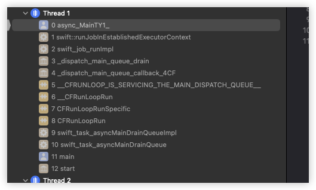

<font size = 4>

### 前序
并发[^ann-concurrency]属于操作系统层面的概念, 所有的编程语言不提供并发机制, 它们全部要依赖运行的平台. 所以像C++的线程库在Unix平台上依赖于pthread库, 在Windows平台上依赖于Window的线程机制, 对于Java也是同样的道理. 本章主要讨论Mac平台下的Swift结构化并发(<font color = red>也称协程</font>) 

编译器分为三个部分
  - 语言部分
  - 运行库
  - 标准库

语言本身不提供并发, 结构化编程的原理是: 底层并发代码由运行库实现, 编译器负责调用运行库. 然而这些库是依赖平台的, 但处于上层的使用者来说不用太过关心实现过程, 但笔者不这样认为, 笔者提倡: 使用一样东西却不知道它的原理是不明智的!!

理论上只要对内核的调度机制了解的足够透彻就可以随心所欲的使用线程和进程, 甚至对其进行封装简化. 笔者将从传统线程编程模式开始逐步引申到结构化并发编程

### 自定义的名词
|名词|意义|
|-|-|
|main|程序的main函数|
|async main|异步main函数|
|async function|异步函数|
|ctx|异步上下文|
|`main-AsyncTask`|主线程的异步任务|
|`f-AsyncTask`|异步任务f|
|`main-task-ctx`|`main-AsyncTask`的上下文,实际是`main-AsyncTask`的第1个异步函数|
|`main-ctx`|异步main函数的上下文|
|`f-task-ctx`|异步任务f的上下文,实际是`f-AsyncTask`的第1个异步函数|
|`f-AsyncFunc`|异步函数f|
|`f-ctx`|异步函数f的上下文|
|`(*ctx)<0 ~ 7 bit>`|ctx指向空间的前8字节|
|`context<AsyncContext*>`|对象context的类型|
|`context<AsyncContext*>(nullptr)`|对象context的类型以及值|

### 特殊的
|寄存器|函数参数属性|意义|
|:-:|:-:|-|
|x22|`SWIFT_ASYNC_CONTEXT`|异步函数的上下文|
|x20|`SWIFT_CONTEXT`|异步任务的上下文,同时也是this指针|
|无|`SWIFT_CC(swiftasync)`|尾部调用消除<font color = red>tce</font>|

这里面着重提一下tce(<font color = red>Tail Call Elimination</font>), llvm的尾部调用消除, 用来减少函数调用开销. 以Swift中`future_adapter`的源码和展开的汇编为例
```cpp
// future_adatper:
//  > void
//  > 函数结束时调用了asyncEntryPoint
//      SWIFT_CC(swiftasync) void(OpaqueValue *, SWIFT_ASYNC_CONTEXT AsyncContext *, SWIFT_CONTEXT void *);
// 由于使用了 SWIFT_CC(swiftasync) 修饰, 这样llvm在生成future_adapter的源码时,会对其进行优化:
//  > ret指令, 
//  > 直接跳转到asyncEntryPoint这个地址
SWIFT_CC(swiftasync)
static void future_adapter(SWIFT_ASYNC_CONTEXT AsyncContext *_context) {
  auto asyncContextPrefix = reinterpret_cast<FutureAsyncContextPrefix *>(
      reinterpret_cast<char *>(_context) - sizeof(FutureAsyncContextPrefix));
  return asyncContextPrefix->asyncEntryPoint(
      asyncContextPrefix->indirectResult, _context,
      asyncContextPrefix->closureContext);
}


// 上述函数的汇编
libswift_Concurrency.dylib`future_adapter:
->  0x268a7b90c <+0>:  mov    x1, x22                   // x1 = ctx
    0x268a7b910 <+4>:  ldr    x2, [x1, #-0x18]!         // x1 = ctx - 0x18, x2 = *x1, 实际x1 = &asyncEntryPoint, x2 = asyncEntryPoint
    0x268a7b914 <+8>:  ldur   x0, [x22, #-0x20]         // x0 = *(ctx - 0x20), 实际取出了 indirectResult*
    0x268a7b918 <+12>: ldur   x20, [x22, #-0x10]        // x20 = *(ctx - 0x10), 实际取出了 closureContext*
    0x268a7b91c <+16>: mov    x16, x1                   // 对入口地址的指针进行加密 
    0x268a7b920 <+20>: movk   x16, #0x2c42, lsl #48
    0x268a7b924 <+24>: braa   x2, x16                   // 调用asyncEntryPoint入口函数, 见下面的汇编(无参数)
                                                        // 没有ret的返回指令
```

在Swift的源码中有很多这样的函数, 这些函数基本都没有返回值, 因为在Swift中并发模式中, 前后调用的异步函数在逻辑上相连的, 但中间可能穿插其他中转函数, 这些中转函数对于使用者来说其实并不存在, 甚至跨域线程, 这就意味着当前函数想要将参数或结果传递到下一个流程函数时不能通过堆栈(<font color = red>通过异步函数的上下文</font>), 所以它们没有返回值!! 同时异步函数的某个拆分函数结束时都是调用了下一个void类型的函数, 基于此Swift异步模式下的函数可以形成天然的Tail Call Elimination. 后续在源码及汇编的探究中, 会经常出现这种情况, 当前tce函数f1在调用下一个函数f2:
- 先销毁f1的栈桢
- 没有ret指令
- 直接跳转到f2, 此刻xcode的栈桢视图中f1的栈桢被f2替换


### swift中的并发选择
从系统层面来看, 并发只有2种模型:
1. 多进程
2. 多线程

但其实不同内核的线程和进程模型在架构, 实现上是不一样的. 如Linux中站在内核的层面去看, 并没有线程(<font color = red>一种轻量级进程</font>)的这一概念, 但在BSD中进程和线程有明显的区分. 笔者的建议是除非进行系统开发, 否则最好不要使用多进程并发.

> 这里笔者给出一个简单的案例, 只是简单了解一下多进程并发的编程模式


```cpp
#include <unistd.h>
#include <fcntl.h>
#include <sys/stat.h>

#include <algorithm>
#include <initializer_list>

#include <cstdio>
#include <cstdlib>
#include <cstring>

#define _0  0,
#define _1  1,
#define _2  2,
#define _3  3,
#define _4  4,
#define _5  5,
#define _6  6,
#define _7  7,
#define _8  8,
#define _9  9
#define _10  _0 _1 _2 _3 _4 _5 _6 _7 _8 _9


#define _50     _10, _10, _10, _10, _10
#define _100    _50, _50
#define _500    _100, _100, _100, _100, _100

#define range(...) { __VA_ARGS__ }

static auto list = range(_500, _500);

static uint8_t buf[256];

int main() {
    chdir("/tmp");          // 切换工作目录

    unlink("./a.txt");      // 删除文件

    umask(0);               // 创建文件,指定屏蔽字
    auto file = open("./a.txt", O_RDWR | O_CREAT, S_IRUSR | S_IWUSR);
    if(file < 0){
        perror("open");
        exit(-1);
    }

    auto count = 0;

    // 3个子进程
    for(int i = -1; ++i < 3;){
        auto pid = fork();

        // 忽略失败(直接创建下一个子进程), 毕竟这里只是测试
        if(pid < 0){
            perror("fork");
            continue ;
        }

        if(pid == 0){   // 当前位于子进程中

            // 每个子进程循环1000次, 对文件中的内容数字做累加
            //  read --> add --> write
            std::for_each(list.begin(), list.end(), [=](int){
                char buf[128] = {0};

                // 上锁
                lockf(file, F_LOCK, 128);

                auto rlen = pread(file, buf, 128, 0);

                // 读取失败后, 再回去重新读
                //  因为这里读取的是普通文件, 出现错误的概率将很小.
                //  当出现错误时(无论什么错误), 尝试回去重新读取
                if(rlen < 0){
                    lockf(file, F_ULOCK, 128);
                    perror("read");
                    return;
                }

                auto number = 0ll;

                // eof, 第1次
                if(rlen == 0){
                    number = 0;
                }else{
                    number = atoll(buf);
                }

                // add
                number += 1;
                snprintf(buf, 128, "%lld", number);

                // write
                pwrite(file, buf, 128, 0); // ignore error handle

                // 解锁
                lockf(file, F_ULOCK, 128);
            });

            exit(0);
        }
        
        // 有效的子进程数量
        ++count;
    }

    // 等待所有的子进程
    while(true){
        // -1: 等待当前主进程下的任意子进程
        // nullptr, 不关心子进程的收尸状态
        // 0: 选项值(具体看man手册)
        //  当有子进程在运行时, 会阻塞等待它们结束
        //  当没有子进程时(子进程可能已经结束), 会直接返回子进程的进程号(大于0)
        auto wait_pid = waitpid(-1, nullptr, 0);

        wait_pid > 0 ? --count : 0;

        if(count) {
            continue;
        }
        break;
    }


    // 最终在主进程中读取文件的内容, 查看一下累加的值
    if(read(file, ::buf, 256) < 0){
        perror("read");
        return -1;
    }

    printf("%s\n", buf);

    return 0;
}
```

该demo在Mac下使用c++编写, 因为swift不支持fork, demo的功能:
1. 多进程读取文件
2. 将文件中的内容做累加
3. 将累加的结果写入到文件中

整个过程使用文件锁做临界区, 最后的累加结果是3000(<font color = red>从0开始3个子进程每个累加1000次</font>). 这种使用多进程的并发模式会牵扯到很多细节, 笔者建议不要使用这种并发模型. 相应的在应用层面, 可以选择的方式有很多:
1. pthread
2. GCD
3. NSThread
4. NSOperation
5. swift的concurrency

这5种使用方式并不会改变内核中的并发模型, 它们的区别在使用形式上, 说白了就是对内核线程的抽象深度不同, 抽象越高使用越简单, 就越接触不到最底层的细节(<font color = red>为了方便, 笔者称pthread是相对最底层的API</font>). swift中的并发已经将线程抽象成了结构化并发的模型, 其中牵扯到用户态调度的逻辑, 后续会详细学习


### CPU,线程以及调用栈
这三者详细的概念笔者这里不会过多阐述. 线程本质上是内核中的一种数据结构: 用来描述任务的调度状态. 这些状态随着函数的执行过程被不断更改:
1. 时间片
2. 阻塞
3. 自动放弃CPU
4. ...

线程运行过程中会绑定对应的函数调用栈在CPU上执行, 当线程状态发生变化后这3者可能互相脱离绑定:
- 如: 线程阻塞后由内核将其挂起, 但CPU不会空闲, 它可能绑定其他的的线程或进程. 
- 如: 信号的异步调用, CPU和线程很可能没有脱离绑定, 但线程会绑定其他调用栈
- 如: 线程池中线程是复用的, 当线程执行完毕当前的所有函数后, 并不回收给内核, 而是进行睡眠让出CPU, 有新的任务来了后重新绑定调用栈并且又重新绑定其他的CPU

严格来说不能用绑定来描述线程和调用栈的关系, 像第2种情况中当线程被信号打断进入到信号处理函数时, 线程的调用栈其实有2部分:
1. 原调用栈中底部的部分函数
2. 信号处理调用栈


```cpp
#include <unistd.h>
#include <signal.h>
#include <execinfo.h>
#include <pthread/pthread.h>

#include <cstdio>

// 打印函数调用栈
void print_callstack(void){
    void* buf[1024] = {0};
    auto frames = backtrace(buf, 128);
    auto symbols = backtrace_symbols(buf, frames);
    printf("thread<%p>\n", pthread_self());
    for(int i = -1; ++i < frames;){
        printf("%s\n", symbols[i]);
    }
}

// 信号处理
void sig_handle(int){
    print_callstack();
}

int main() {
    // 主线程
    printf("main<%p>\n", pthread_self());

    // 注册信号
    signal(SIGALRM, sig_handle);

    // 5秒后发送
    alarm(5);

    // 主线程阻塞
    while(pause()){
        // 被alarm唤醒(先执行信号函数, 再回来这里执行循环)
        printf("*************************\n");
        print_callstack();
    }

    return 0;
} 

#if 0
main<0x203647840>
thread<0x203647840>                     // 信号唤醒了主线程, 并先进入到信号处理函数
0   cpp                                 0x0000000100003d8c _Z15print_callstackv + 80    // 中间3个已经是新的函数栈桢
1   cpp                                 0x0000000100003e58 _Z10sig_handlei + 20
2   libsystem_platform.dylib            0x000000019e568184 _sigtramp + 56
3   libsystem_c.dylib                   0x000000019e43d480 pause + 44           // 这里还是原来的栈桢
4   cpp                                 0x0000000100003eb8 main + 84
5   dyld                                0x000000019e1b0274 start + 2840
*************************                                                       // 信号处理程序处理完毕后, 循环体打印
thread<0x203647840>                                                             
0   cpp                                 0x0000000100003d8c _Z15print_callstackv + 80 
1   cpp                                 0x0000000100003ed8 main + 116
2   dyld                                0x000000019e1b0274 start + 2840
#endif
```

当前demo中当信号产生后, 进入到信号处理函数是属于异步回调, 这种异步回调是相当于打断了主线程的顺序执行, 被内核强制制造了新的现场. 固使用绑定这个词来描述线程和调用栈之间的关系或许并不贴切, 但为了方便笔者还是以绑定来描述. 同样的原理当使用线程池时, 线程本身是复用的, 但它可以通过绑定调用栈(<font color = red>其实就是回调</font>)从而执行不同的业务. 


### 传统线程模式(1)
先来看一个简单的下载案例(<font color = red>笔者简化了业务</font>)

```cpp
#include <unistd.h>
#include <pthread/pthread.h>
#include <iostream>
#include <sstream>

using namespace std;
static void* sub_thread(void* data){
    cout << "子线程<" << pthread_self() << ">开始下载...\n";        
    sleep(5);       // 模拟下载 __code_3

    cout << "子线程<" << pthread_self() << ">下载成功!\n";
    auto os = ostringstream();
    os.setf(ios::hex);
    os << "hello tierry!";

    return new string(os.str());
}

static void download(std::string url,void(*cbk)(void* _Nullable)){
    pthread_t pid;
    pthread_create(&pid, nullptr,sub_thread, (void*)url.c_str());   // __code_1
    void* ret = nullptr;
    pthread_join(pid, &ret);                                        // __code_2
    if(ret){
        cbk(ret);
    }
}

static void handle(void* data){ //__code_4
    if(data){
        cout << "main<"<< pthread_self() << ">:" << *static_cast<string*>(data) << endl;
        delete static_cast<string*>(data);
    }
}

int main() {
    cout << "main" << "<" << pthread_self() << ">\n";
    download("下载的地址", handle);     // __code_0
    return 0;
}

#if 0
main<0x1fac93840>
子线程<0x16fe87000>开始下载...      // 阻塞5秒
子线程<0x16fe87000>下载成功!        
main<0x1fac93840>:hello tierry!
#endif
```

程序的流程:
1. 主线程发起下载(`__code_0`)
2. 创建下载任务(`__code_1`)
3. 内核调度子线程
4. 子线程内部做下载, 笔者使用睡眠5秒来模拟这个过程(`__code_3`)
5. 子下载完毕后返回数据
6. 主线程在创建子线程后, 采用阻塞等待模式(`__code_2`)
    - 在这个期间主线程不能执行任何操作
7. 子线程返回后, 主线程被唤醒并接收子线程返回的数据(`__code_2`)
8. 主线程调用打印函数(`__code_4`)

整个过程在逻辑上确实是顺序执行的, 但为了顺序执行牺牲主线程: 主线程在子线程请求的5秒内不能做任何事情. 


### 传统线程模式(2)
上一小节的案例可以通过分离线程, 添加异步回调的方式来解决
```cpp
#include <unistd.h>
#include <pthread/pthread.h>

#include <iostream>
#include <queue>
#include <atomic>

using namespace std;

static std::queue<string> main_q;

static atomic_flag flag;

static pthread_t main_tid;

#define $(_code)        \
    do {                \
        while(flag.test_and_set()){ \
            pthread_yield_np(); \
            continue;   \
        }               \
        _code           \
        flag.clear();   \
    }while(false)


static void push(string data){
    $({
        main_q.push(data);
    });

    // 相当于唤醒主线程,
    //  PS: pthread_kill是向指定的线程发信号, 但在Mac中笔者测试的只有
    //  指定主线程时, 这个信号才是成功的
    pthread_kill(main_tid, SIGUSR1);
}

static void pop(){
    while(true){
        string str;
        $({
            if(!main_q.empty()){
                str = main_q.front();
                main_q.pop();
            }else {
                flag.clear();
                return;
            }
        });

        if(!str.empty()){
            cout << "main<" << pthread_self() << ">: " << str << endl;
        }
    }
}

static void* sub_thread(void* data){
    cout << "子线程<" << pthread_self() << ">开始下载...\n";

    sleep(5);       // 模拟下载

    cout << "子线程<" << pthread_self() << ">下载成功!\n";

    push("hello tierry!");  // __code_6

    return nullptr;
}

static void download(std::string url){
    pthread_t pid;
                                        // __code_7
    pthread_create(&pid, nullptr,sub_thread, (void*)url.c_str());

    pthread_detach(pid);                // __code_8
}


int main() {
    main_tid = pthread_self();

    signal(SIGUSR1, SIG_IGN);           // __code_0

    cout << "main" << "<" << pthread_self() << ">\n";

    download("下载的地址");             // __code_1

    sleep(1);
                                        // __code_2
    cout << "main" << "<" << pthread_self() << ">下载期间做其他事情...\n";

    while(pause()){                     // __code_3
        printf("wake up!!\n");          // __code_4
        pop();                          // __code_5
    }
    return 0;
} 

#if 0
子线程<0x16fe87000>开始下载...          //子线程阻塞(5秒) 
main<0x1fac93840>下载期间做其他事情...  // 主线程在子线程阻塞期间可以做其他事情
子线程<0x16fe87000>下载成功!            // 当子线程下载成功后, 会将数据添加到主线程的任务队列, 唤醒主线程
wake up!!                               // 主线程被唤醒
main<0x1fac93840>: hello tierry!        // 执行打印, 后面会继续睡眠, 等待任务
#endif
```

流程:
1. `__code_0`: 主线程注册一个异步信号用来被唤醒
2. `__code_1`: 主线程发起请求
    - 内部创建子线程(`__code_7`)
    - 和子线程分离(`__code_8`)
3. 主线程执行其他任务
    - 睡眠(<font color = red>也是一种任务</font>)
    - 执行一句打印(`__code_2`)
4. 子线程此刻还在进行下载
5. `__code_3`: 主线程挂起, 等待唤醒
6. 当子线程下载完毕后, 将数据添加到主线程的任务队列中, 并唤醒主线程(push函数)
7. 主线程被唤醒, 取出任务打印一下(pop函数)

整个流程并不是顺序执行的, 主线程并不需要一直等待子线程下载完毕, 所以它可以执行其他的任务, 主线程是通过异步通知的方法被唤醒. 实际开发中:
1. 信号唤醒会替换成条件锁
2. 主线程也会关联一个任务队列, 但队列中的元素并不是简单的字符串, 可能是格式统一的回调函数

该模型也算是单一的线程池, 即main线程其实一直被复用. 


### 传统线程模式(3)
使用lambda可以对上一小节的模型做简化, 这样程序看起来更集中

```cpp
int main() {
    main_tid = pthread_self();

    signal(SIGUSR1, SIG_IGN);

    cout << "main" << "<" << pthread_self() << ">\n";

    thread([](void* data){
        cout << "子线程<" << pthread_self() << ">开始下载...\n";

        sleep(5);       // 模拟下载

        cout << "子线程<" << pthread_self() << ">下载成功!\n";

        push("hello tierry!");

        return nullptr;
    }, (void*)"下载的地址").detach();

    sleep(1);

    cout << "main" << "<" << pthread_self() << ">下载期间做其他事情...\n";

    while(pause()){
        printf("wake up!!\n");
        pop();
    }
    return 0;
} 
```

使用c++的线程库可以使用lambda表达式, 这样代码更为集中. thread底层调用的是POSIX线程, 所以本质上是一样的, 流程并不会改变. 现在来总结这3小节案例的缺点:
1. 不管怎么修改, 都不可避免的要使用异步
2. 因为异步的机制, 整个代码在书写形式上并不是顺序化的(<font color = red>结构化</font>)

将异步的处理机制架构成顺序模型是比较困难的, 后面笔者将以iOS(<font color = red>简化</font>)来加以引导.


### 传统线程模式(4)
先看一个简单的案例:
```objc
#include <Foundation/Foundation.h>

typedef CFRunLoopRef EventLoop;
typedef CFRunLoopMode EventMode;

static EventLoop mainloop;

static void req_data(const char* url, void(^cbk)(id _Nullable, NSError* _Nullable)){
    dispatch_async(dispatch_get_global_queue(0, 0), ^{

        auto path = [NSString stringWithCString:url encoding:NSUTF8StringEncoding];

        path = [path stringByAddingPercentEncodingWithAllowedCharacters:NSCharacterSet.URLQueryAllowedCharacterSet];

        NSURLRequest* req = [NSURLRequest requestWithURL:[NSURL URLWithString:path]];

        // 获取到数据
        id e;
        auto data = [NSURLConnection sendSynchronousRequest:req returningResponse:nil error:&e];

        // 解析数据
        id oc = [NSJSONSerialization JSONObjectWithData:data options:0 error:nil];

        // 唤醒主线程
        dispatch_async(dispatch_get_main_queue(), ^{
            e ? cbk(nil, e) : cbk(oc, nil);
        });
    });
}

int main(void){
    mainloop = CFRunLoopGetCurrent();

    constexpr auto url = "http://t.weather.sojson.com/api/weather/city/101030100";

    auto observer = CFRunLoopObserverCreateWithHandler(
        CFAllocatorGetDefault(),kCFRunLoopAllActivities,true,1,
        ^(CFRunLoopObserverRef observer, CFRunLoopActivity activity) {
            if(activity != kCFRunLoopEntry)
                return;

            req_data(url, ^void(NSDictionary* data, NSError* e){
                if(e)
                    return;

                NSDictionary* fir = data[@"data"][@"forecast"][0];
                
                NSLog(@"%@\t\t%@", fir[@"high"], fir[@"low"]);
            });
        });

    CFRunLoopAddObserver(mainloop, observer, kCFRunLoopDefaultMode);

    CFRunLoopRun();

    return 0;
}

#if 0
高温 17℃		低温 8℃
#endif
```

这个案例使用苹果的runloop来模拟UI开发下的基本流程:
1. runloop刚进入时就开始从服务器获取数据
2. 为了演示, 笔者使用了同步请求的接口, 这意味着调用线程将被阻塞, 所以必须开启子线程
3. 子线程请求完数据后, 通过回调的方式向主线程回传数据

这种代码在iOS开发很常见(OC), 它们存在的主要问题: 主线程和子线程传递数据方式不是流程化的, 如果涉及多个异步顺序处理将形成嵌套地狱, 可以自行进行封装达到如下这种效果(<font color = red>并非本例</font>):

```objc
@Async(id, result) = @Await http_req(API.module_home.sysconfig, nil, GET) @Awake
REQ_SUC(){
    [LCSaveData savePaydomain:__res.to_dic.read(@"ossDomain")];
    [LCSaveData saveSysId:__res.to_dic.read(@"sysId")];
    [LCSaveData saveServerId:__res.to_dic.read(@"servId")];
}
@Catch();
@Over(); 

// 笔者封装的OC网络请求, 这里只是举例
```

笔者封装的原理其实很简单:
1. macro
2. 信号量

即在主线程发起请求后, 开辟子线程利用信号量做同步, 然后利用macro抽象顺序的书写语法, 这里不多赘述. 它最主要的优点: 从上往下的书写格式看起来更直观. 这当然算是一种简化使用.  

> swift在语言层面提供了这种语法, 并配合标准库的并发架构实现了结构化并发[^ann-struct-concurrency]. 

### 结构化并发的基本概念
前面几个小案例是典型的异步回调模式. 使用异步回调的传统并发编程中有2个缺点:
1. 在编码形式上不是结构化的(顺序性), 这会导致大型程序在架构上过度复杂, 不容易维护
2. 即使使用lambda这种匿名函数, 让代码在形式上展现的像结构化, 但也有很大概率造成嵌套地狱, 也不易阅读和维护

而结构化并发就是为了解决这两个问题! Swift中的结构化并发在架构上将某个流程抽象成了Job(AsyncTask), 一个AsyncTask<font color = red>在逻辑上</font>就是一个完整的调用流程. 它由多个函数顺序执行形成(<font color = red>一般指异步函数</font>). 

这句话有3个点:
1. AsyncTask
2. 异步函数
3. 顺序执行

这3个概念不仅是Swift的结构化并发核心, 其实也是其他语言在协程架构上的核心概念. 关于这3个概念的具体实现会在后续详细探究!

笔者这里先给出一些简单的概念描述
1. AsyncTask是抽象出来的异步函数调用栈, 所以它整个过程是顺序的
    - `main-AsyncTask`: 在实现上并非顺序的, 但在逻辑上是顺序的
    - `other-AsyncTask`: 在实现和逻辑上都是顺序的
    > 注意这个顺序是逻辑上的顺序, 在实现中并非顺序的
```swift
func f() async{} 


await f()       // main-AsyncTask当前的async main调用异步f,
                // 由于主线程的特殊性, main-AsyncTask将切换线程
                // 并进入睡眠, 等待f完毕后唤醒. 从这一点来看:
                // main-AsyncTask不是结构化的. 但在执行流程上
                // 下一句的打印语句必定在f执行完毕后回到主线程后被调用
print("hello")


func f1() async{
    await f()   // 调用异步函数f, 在源码实现中将直接在当前的线程中调用f,
                // f调用完毕后继续在当前线程中回到f1, 执行下面的打印语句,
                // 所以不管从逻辑上还是实现上 f1-AsyncTask都是顺序的
    print("tierry")
} 
async let _ = f1()      // 分离f1-AsyncTask
```
> 不同场景下创建的AsyncTask具有不同的性质, 这将在后续逐个学习

2. 异步函数在Swift中由多个函数组合而成(拆分函数), 这些拆分函数: 
    - 使用async修饰
    - 物理地址是相连的
    - 拆分函数之间是顺序调用, 顺序返回的
    - 拆分点由await标识
    > 这些都会在后续探究中通过源码和汇编呈现出来 

3. 顺序执行是整个AsyncTask的流程在逻辑上顺序的, 但该过程中执行的某些异步函数可能在不同的线程!! 但上层的程序员不用太过关心这些

### 上下文切换
严格来说上下文切换发生在CPU切换线程时. 当前线程由于某些原因(<font color = red>如时间片, 阻塞IO等</font>)要放弃CPU时, 内核会记录下当前与线程相关的状态信息(<font color = red>寄存器,PC,堆栈指针,TCB等</font>), 并将这些寄存器,PC, FP, TCB等重置为目标运行线程状态. 频繁的上下文切换会带来性能损耗, 所以内核在调度模块其实也做了很多优化, 笔者这里不探究这种层面
> 这里用户态向内核态发生转换时, 也有类似上下文切换机制, 但这种上下文并不是线程的上下文(某些系统实现可能会牵连线程的上下文切换).

从权限层面来看, 用户是无法避免这种切换的. 即使是使用线程池也是一样的. 因为处于线程池中的线程不处于运行状态, 它不占据CPU, 所以当用户唤醒线程池中的线程时, 对应的内核会给该线程分配CPU, 这个时候必然发生上下文的切换. 但它可以避免线程的频繁创建和销毁, 也可以达到一定程度的优化.  笔者指出这一点的目的是为了说明(Mac环境): 
1. gcd框架其实就是线程池机制, 所以也有上下方切换
2. swift协程基于gcd, 所以不能避免上下文切换
3. swift协程是用户层面实现的调度(<font color = red>由swift运行库, swift标准库以及编译器配合实现</font>)
4. swift的结构化并发的效率取决于gcd, 并不是该并发机制的效率
> 笔者认为swift中的结构化并发只是极简了异步编程模式(<font color = red>其他语言也是一样的原理</font>), 如果单纯的使用传统并发(如OC)效率会更高一点(<font color = red>但程序相对复杂</font>)


### 异步函数初识
使用关键字async修饰的函数被称为异步函数. 异步函数的特点:
1. 整个函数被执行时, 被拆分成多个函数, 这些拆分函数在物理地址上是相连的
2. 拆分函数顺序调用, 顺序返回
3. 拆分点由await指定
4. 前后2个相邻的拆分函数可能处于不同的线程, 但它们逻辑上一定是顺序的

所有的拆分函数在汇编层面和普通函数区别是:
1. 开头时都有`orr x29, x29, #0x1000000000000000`
2. 结束前都有`and x29, x29, #0xefffffffffffffff`
3. 都有tce(Tail Call Elimination)优化
4. 普通函数内部不能调用异步函数, 异步函数可以调用普通函数

和普通函数相同点:
1. 本质都是函数(对操作系统来说)
2. 都可以使用`await 或 async let`进行调用. 但异步函数不能省略.
    - 普通函数以await格式被调用时, 和平常调用没区别
    - 普通函数以async let被调用时, 将创建新的异步任务, 并在异步任务中直接调用该函数

由于异步函数中的拆分点await造成相邻两个拆分函数可能处于不同线程, 所以不能使用传统意义上的堆栈!! Swift通过异步上下文对象来模拟堆栈. 所有的拆分函数都有自己的上下文, 异步上下文处理:函数参数; 局部对象; 返回值
> async其实也算是一个拆分点, 不过它并不阻塞调用点, 而是开启了一个新的异步任务. 关于异步函数怎么拆分的, 这个将在后面的小节详细探究


### 定义异步函数
```swift
func ThreadInfo(other: String = #function) {
    print("\(other + ":")thread<\(pthread_main_np() == 1 ? "main": "sub"),\(pthread_self())>")
}

func f() async {
    ThreadInfo(other: #function)
} 
```

`f`通过`aysnc`修饰, 它是一个异步函数, 一般情况下异步函数在并发队列上运行(线程由队列决定)

```swift
// 打印一下主线程
ThreadInfo(other:"main") 

// 阻塞调用异步函数
await f()

#if false 
main():thread<main,0x00000001ec77f840>
f():thread<sub,0x000000016fe87000>
#endif
```
可以发现主线程中以await形式调用异步函数时, 异步函数在子线程中执行. 这里并不能确定主线程是否真被阻塞. 看下面的案例

```swift
func f() async {
    ThreadInfo(other: #function)
    sleep(1)
}
await f()
ThreadInfo(other: "main()") 

#if false
f():thread<sub,0x000000016fe87000>          // 程序运行后,立即打印, 然后会睡眠1秒
main():thread<main,0x00000001ec77f840>      // 1秒后打印, 说明主线程被阻塞了
#endif
```

如果以所谓的分离方式调用, 则f函数一定在子线程中执行, 但main始终会等待子线程执行完毕

```swift
func f() async {
    ThreadInfo(other: #function)
    sleep(1)
    DispatchQueue.main.async {
        ThreadInfo(other: "main():\(#line)")// __code_12
        print("wake main runloop")
    }
}
// 分离方式调用, 这时的await可以省略(不阻塞主线程)
async let result = await f()  
ThreadInfo(other: "main():\(#line)")        // __code_18

#if false 
main():18:thread<main,0x00000001ec77f840>   // __code_18
f():thread<sub,0x000000016fe87000>          // f异步函数的打印(子线程中). 这里不能确定是先执行main的打印还是f的打印, 因为调度时机是不确定的
main():12:thread<main,0x00000001ec77f840>   // 1秒后在子线程中唤醒主线程(__code_12)
wake main runloop                           // 测试打印
Program ended with exit code: 0             // 整个进程结束
#endif
```

通过这个测试有这几个结论:
1. 主线程会等待异步函数执行完毕后才结束, 整个进程也就结束
2. 异步函数内的机制是gcd, 因为异步函数在结束前通过gcd的主队列唤醒主线程
3. 通过第2条的结论, 可以推断:
    - 主线程运行在`gcd_main_q`上
    - 主线程在执行完`__code_18`后一定启动了runloop(<font color = red>这个将会在后续进行汇编的验证</font>)


### 不一定开辟线程1
main函数是一个特例, 在main函数上进行的异步函数调用一定会开辟新的的线程. 但在异步函数中调用其他异步函数时, 并不确定是否开启子线程, 先来看分离时的情况:

```swift
func f2() async {
    ThreadInfo(other: "f2()")
}

func f() async {
    for _ in 1...10 {
        print("----------------------------")
        ThreadInfo(other: "f1()")
        async let res = f2()            // __code_detatch
    }
}


ThreadInfo(other: "main():\(#line)")
async let _ = f()


#if false
main():36:thread<main,0x00000001ec77f840>
----------------------------
f1():thread<sub,0x000000016fe87000>
f2():thread<sub,0x000000016fe87000>
----------------------------
f1():thread<sub,0x000000016fe87000>
f2():thread<sub,0x000000016fe87000>
----------------------------
f1():thread<sub,0x000000016ff13000>
f2():thread<sub,0x000000016ff13000>
----------------------------
f1():thread<sub,0x000000016ff13000>
f2():thread<sub,0x000000016ff13000>
----------------------------
f1():thread<sub,0x000000016ff13000>
f2():thread<sub,0x000000016ff13000>
----------------------------
f1():thread<sub,0x000000016ff13000>
f2():thread<sub,0x000000016ff13000>
----------------------------
f1():thread<sub,0x000000016ff13000>
f2():thread<sub,0x000000016ff13000>
----------------------------
f1():thread<sub,0x000000016ff13000>
f2():thread<sub,0x000000016ff13000>
----------------------------
f1():thread<sub,0x000000016ff13000>
f2():thread<sub,0x000000016ff13000>
----------------------------
f1():thread<sub,0x000000016ff13000>
f2():thread<sub,0x000000016ff13000>
#endif
```

<font color = red>这个测试结果并不能作为推导一些结论所需要的样本数据</font>, 也就是说f1要不要开辟线程去执行f2是不确定的. 但有一个隐式的结论: <font color = red>即使是分离调用, 每次循环结束后f1也会等待f2</font>. 
> 至于这些原因都会在后面的源码分析中说明

再来看一下f1阻塞调用f2时, 测试情况

```swift
func f2() async {
    ThreadInfo(other: "f2()")
}

func f1() async {
    for _ in 1...10 {
        print("----------------------------")
        ThreadInfo(other: "f1()")
        await f2()
    }
}


ThreadInfo(other: "main():\(#line)")
async let _ = f1() 

#if false
main():42:thread<main,0x00000001ec77f840>
----------------------------
f1():thread<sub,0x000000016fe87000>
f2():thread<sub,0x000000016fe87000>
----------------------------
f1():thread<sub,0x000000016fe87000>
f2():thread<sub,0x000000016fe87000>
----------------------------
f1():thread<sub,0x000000016fe87000>
f2():thread<sub,0x000000016fe87000>
----------------------------
f1():thread<sub,0x000000016fe87000>
f2():thread<sub,0x000000016fe87000>
----------------------------
f1():thread<sub,0x000000016fe87000>
f2():thread<sub,0x000000016fe87000>
----------------------------
f1():thread<sub,0x000000016fe87000>
f2():thread<sub,0x000000016fe87000>
----------------------------
f1():thread<sub,0x000000016fe87000>
f2():thread<sub,0x000000016fe87000>
----------------------------
f1():thread<sub,0x000000016fe87000>
f2():thread<sub,0x000000016fe87000>
----------------------------
f1():thread<sub,0x000000016fe87000>
f2():thread<sub,0x000000016fe87000>
----------------------------
f1():thread<sub,0x000000016fe87000>
f2():thread<sub,0x000000016fe87000>
#endif
```

这个笔者直接说结论: <font color = red>f1不会开辟线程去执行f2</font>(后面有汇编和源码说明)

### 死锁??
使用swift并发机制时, 要注意死锁的问题, 先来看一下案例

```swift
func ThreadInfo(other: String = #function) {
    print("\(other + ":")thread<\(pthread_main_np() == 1 ? "main": "sub"),\(pthread_self())>")
}

var lock = os.OSAllocatedUnfairLock()

func f() async {
    lock.lock()                         
    ThreadInfo(other: "f1()-locked")        
    try! await Task.sleep(nanoseconds: UInt64(1e9))
    ThreadInfo(other: "f1()-unlock")        // 解锁时可能不在加锁的线程, 所以这里可能直接闪退
    lock.unlock()
}


ThreadInfo(other: "main():\(#line)")
await f() 
```

测试中使用了操作系统的锁, 如果在线程1中上锁, 但在线程2中解锁将直接异常结束程序. 


### 思考
根据前面的简单测试, 现在最关心的问题:
1. 什么是所谓的拆分函数
2. 暂停点是什么, 为什么暂停点前后所在的线程可能不一样? 如果涉及到函数参数, 局部对象会有什么问题?
3. swift怎么做到用户态切换线程的


### 前置知识
后续会从源码的角度结合汇编来探究Swift并发机制的过程, 所以这需要先了解一些额外的知识:
1. C++中函数类型的参数分离
2. Swift中的`bit mask`操作
3. Swift中指针偏移
4. Swift中的指针共用

```cpp
// 必须有这原始模板的声明
template <class Sig, bool HasErrorResult>
struct AsyncSignature;

// 类型模板特化版本
// 函数类型的参数分离:
//  AsyncSignature<int(string, double), false>
//  c++的编译器会分解成:
//      DirectResultTy = int
//      ArgTys = string, double
//      HasErrorResult = false
template <class DirectResultTy, class... ArgTys, bool HasErrorResult>
struct AsyncSignature<DirectResultTy(ArgTys...), HasErrorResult> {
  // std::is_same<int, void> == false, 因为int != void
  // 所以直接在编译期就确定了是否有返回类型, 即hasDirectResult = true
  bool hasDirectResult = !std::is_same<DirectResultTy, void>::value;

  // 返回类型
  using DirectResultType = DirectResultTy;
  
  // 标记是否有异常
  bool hasErrorResult = HasErrorResult;
}; 


/////////////////////////////////////////////////////////////////////////////////////////////////


// bit mask
// 以最底层的 FlagSet为例

template <typename IntType>
class FlagSet {
    // IntType必须是整型, 这些都是在编译期就能确定的
  static_assert(std::is_integral<IntType>::value,
                "storage type for FlagSet must be an integral type");

  // number
  IntType Bits;

protected:
  // 成员函数模板
  // bit位的宽度, 即有哪些连续的bit位将被使用, 
  // 如BitWidth = 3, 则lowMaskFor就表示连续的3个bit位将被用作标识
  template <unsigned BitWidth>
  static constexpr IntType lowMaskFor() {
    return IntType((1 << BitWidth) - 1);
  }

  // lowMaskFor确定了哪些连续的bit位被使用,
  // 但在一个整型的number中还不能确定从第几个bit位开始, 所以
  // maskFor表示从第FristBit开始后连续的BitWidth个bit将被使用.
  // eg: FirstBit = 2, BitWidth = 3
  //     lowMaskFor<3> = 0b111
  //     maskFor<2, 3> = 0b111 << 2 = 0b11100
  // 当number = 8时, number<2 ~ 4 bit> = number & maskFor
  template <unsigned FirstBit, unsigned BitWidth = 1>
  static constexpr IntType maskFor() {
    return lowMaskFor<BitWidth>() << FirstBit;
  }

  // 默认全部bit为0
  constexpr FlagSet(IntType bits = 0) : Bits(bits) {}

  // 函数模板
  // N = Bit
  // 取出number的第N个bit位上的值
  template <unsigned Bit>
  bool getFlag() const {
    return Bits & maskFor<Bit>();
  }

  // N = Bit
  // 设置number的第N个bit位为1或0
  template <unsigned Bit>
  void setFlag(bool value) {
    if (value) {
      Bits |= maskFor<Bit>();
    } else {
      Bits &= ~maskFor<Bit>();
    }
  }

  // 第3个模板参数只是标注类型
  // 取出 number<FirstBit ~ (FirstBit + BitWdith) bit>上的值
  template <unsigned FirstBit, unsigned BitWidth, typename FieldType = IntType>
  constexpr FieldType getField() const {
    return FieldType((Bits >> FirstBit) & lowMaskFor<BitWidth>());
  }

  // number<FirstBit ~ (FirstBit + BitWidth) bit> = value
  template <unsigned FirstBit, unsigned BitWidth, typename FieldType = IntType>
  void setField(typename std::enable_if<true, FieldType>::type value) {
    assert(IntType(value) <= lowMaskFor<BitWidth>() && "value out of range");
    Bits = (Bits & ~maskFor<FirstBit, BitWidth>())
         | (IntType(value) << FirstBit);
  }

  // macro, 子类会进行批量定义生成对应bit的getter和setter
#define FLAGSET_DEFINE_FLAG_ACCESSORS(BIT, GETTER, SETTER) \
  bool GETTER() const {                                    \
    return this->template getFlag<BIT>();                  \
  }                                                        \
  void SETTER(bool value) {                                \
    this->template setFlag<BIT>(value);                    \
  }

  // macro, 子类会进行批量定义生成对应 <BIT ~ (BIT + WIDTH) bit>的getter和setter
#define FLAGSET_DEFINE_FIELD_ACCESSORS(BIT, WIDTH, TYPE, GETTER, SETTER) \
  constexpr TYPE GETTER() const {                                        \
    return this->template getField<BIT, WIDTH, TYPE>();                  \
  }                                                                      \
  void SETTER(TYPE value) {                                              \
    this->template setField<BIT, WIDTH, TYPE>(value);                    \
  }

  // macro, 操作符重载, 2个相同类型的FlagSet的方便比较
#define FLAGSET_DEFINE_EQUALITY(TYPENAME)                                \
  friend bool operator==(TYPENAME lhs, TYPENAME rhs) {                   \
    return lhs.getOpaqueValue() == rhs.getOpaqueValue();                 \
  }                                                                      \
  friend bool operator!=(TYPENAME lhs, TYPENAME rhs) {                   \
    return lhs.getOpaqueValue() != rhs.getOpaqueValue();                 \
  }

public:
  IntType getOpaqueValue() const {
    return Bits;
  }
};

// 应用
class TaskCreateFlags : public FlagSet<size_t> {
public:
    // 定义各种bit
  enum {
    // <0 ~ 7 bit> 表示任务的优先级, 这意味着
    // 有8个bit位来标记当前任务的优先级
    RequestedPriority = 0,
    RequestedPriority_width = 8,

    
    // 以下是第8到第14bit需要用到的标记
    Task_IsChildTask                              = 8,
    Task_IsInlineTask                             = 9,
    Task_CopyTaskLocals                           = 10,
    Task_InheritContext                           = 11,
    Task_EnqueueJob                               = 12,
    Task_AddPendingGroupTaskUnconditionally       = 13,
    Task_IsDiscardingTask                         = 14,

    // Swift 6.1后添加
    Task_IsTaskFunctionConsumed                   = 15,
  };

  // 构造函数
  explicit constexpr TaskCreateFlags(size_t bits) : FlagSet(bits) {}

  // 无参的构造函数, 会调用到FlagSet的默认构造, Bits = 0
  constexpr TaskCreateFlags() {}

  // 生成 <0 ~ 7 bit>位的setter和getter
  FLAGSET_DEFINE_FIELD_ACCESSORS(RequestedPriority, RequestedPriority_width,
                                 JobPriority, getRequestedPriority,
                                 setRequestedPriority)

  // 生成第8bit位的setter和getter, 后面的同理
  FLAGSET_DEFINE_FLAG_ACCESSORS(Task_IsChildTask,
                                isChildTask,
                                setIsChildTask)
  FLAGSET_DEFINE_FLAG_ACCESSORS(Task_IsInlineTask,
                                isInlineTask,
                                setIsInlineTask)
  FLAGSET_DEFINE_FLAG_ACCESSORS(Task_CopyTaskLocals,
                                copyTaskLocals,
                                setCopyTaskLocals)
  FLAGSET_DEFINE_FLAG_ACCESSORS(Task_InheritContext,
                                inheritContext,
                                setInheritContext)
  FLAGSET_DEFINE_FLAG_ACCESSORS(Task_EnqueueJob,
                                enqueueJob,
                                setEnqueueJob)
  FLAGSET_DEFINE_FLAG_ACCESSORS(Task_AddPendingGroupTaskUnconditionally,
                                addPendingGroupTaskUnconditionally,
                                setAddPendingGroupTaskUnconditionally)
  FLAGSET_DEFINE_FLAG_ACCESSORS(Task_IsDiscardingTask,
                                isDiscardingTask,
                                setIsDiscardingTask)
  FLAGSET_DEFINE_FLAG_ACCESSORS(Task_IsTaskFunctionConsumed,
                                isTaskFunctionConsumed,
                                setIsTaskFunctionConsumed)
};

// 这意味着外界可以:
//  TaskCreateFlags flag;
//  flag.getRequestedPriority 得到前8bit的值
//  flag.setRequestedPriority(UserInteractive), 设置<0 ~ 7 bit>, UserInteractive是JobPriority
//  flag.isChildTask, 获取第8bit的值
//  flag.setIsChildTask(true /*或false*/)


/// 关于指针偏移后面遇到后再介绍


/////////////////////////////////////////////////////////////////////////////////////////////////


// 指针共用
llvm::PointerIntPair<AsyncTask *, 2, unsigned> taskAndFlags;


// 注意该类模板是特化版本, eg: T = AsyncTask(64位)
//  后面会学习到该类型
template <typename T> struct PointerLikeTypeTraits<T *> {
  // real type: AsyncTask*
  static inline void *getAsVoidPointer(T *P) { return P; }

  // AsyncTask*
  static inline T *getFromVoidPointer(void *P) { return static_cast<T *>(P); }

  //  sizeof(AsyncTask) = 192
  //  alignof(AsyncTask) = 16
  //  log2(16) = 4
  // 这个过程在编译期就算出来了
  //
  // PS: 这里用了很高的技巧, alignof计算对齐系数(一般是2的N倍数),
  //     当一个指针p的的对齐系统是N时, (*p)<0 ~ log2(N) bit> 一定为0,
  //     此刻就可以共用指针的 log2(N)个bit来作特殊标记
  static constexpr int NumLowBitsAvailable =
      detail::ConstantLog2<alignof(T)>::value;
};

// PointerT = AsyncTask*   IntBits = 2,  PtrTarits =  PointerLikeTypeTraits<AsyncTask*> 
template <typename PointerT, unsigned IntBits, typename PtrTraits>
struct PointerIntPairInfo {
  // NumLowBitsAvailable  = 4
  // numeric_limits<uintptr_t>::digits = 4(获取unsigned long(8字节)的有效位数, 至少需要4bit位来表示)
  // 这里是在检查:
  //    如果PointerT的对齐系数不是16(或小于16的倍数), 则这里直接在编译期就报错
  // PS: AsyncTask的对象系数是16, 则低4个bit一定是0, 所以可以借助这4bit来作特殊标记,
  static_assert(PtrTraits::NumLowBitsAvailable <
                    std::numeric_limits<uintptr_t>::digits,
                "cannot use a pointer type that has all bits free");

  // PointerT最多在低4个bit作标记, IntBtis则表示要用到几个, 所以 IntBits 必须小于= 4
  // 这里IntBits为2, 则表示只用到2bit
  static_assert(IntBits <= PtrTraits::NumLowBitsAvailable,
                "PointerIntPair with integer size too large for pointer");
  enum MaskAndShiftConstants : uintptr_t {
    // 指针部分的掩码:  ~ ((1 << 4) - 1)
    //  0xFF_FF_FF_FF__FF_FF_FF_F0, 低4bit为0
    PointerBitMask =
        ~(uintptr_t)(((intptr_t)1 << PtrTraits::NumLowBitsAvailable) - 1),

    // 2
    IntShift = (uintptr_t)PtrTraits::NumLowBitsAvailable - IntBits,
    
    // 0x3
    IntMask = (uintptr_t)(((intptr_t)1 << IntBits) - 1),

    // 用到的bit位部分的掩码: (0x3 << 2) = 0xc
    // 最后的效果是: <0 ~ 1 bit>是保留的, 没有用到
    //               <2 ~ 3 bit>用来做标记
    //               <4 ~ 63bit>指针部分
    ShiftedIntMask = (uintptr_t)(IntMask << IntShift)
  };

  // 构造指针p,  (*p)<0 ~ 3 bit> = 0
  static PointerT getPointer(intptr_t Value) {
    return PtrTraits::getFromVoidPointer(
        reinterpret_cast<void *>(Value & PointerBitMask));
  }

  // 获取标记
  static intptr_t getInt(intptr_t Value) {
    return (Value >> IntShift) & IntMask;
  }

  // 更新指针部分
  static intptr_t updatePointer(intptr_t OrigValue, PointerT Ptr) {
    intptr_t PtrWord =
        reinterpret_cast<intptr_t>(PtrTraits::getAsVoidPointer(Ptr));
    assert((PtrWord & ~PointerBitMask) == 0 &&
           "Pointer is not sufficiently aligned");
    // Preserve all low bits, just update the pointer.
    return PtrWord | (OrigValue & ~PointerBitMask);
  }

  // 更新标记部分
  static intptr_t updateInt(intptr_t OrigValue, intptr_t Int) {
    intptr_t IntWord = static_cast<intptr_t>(Int);
    assert((IntWord & ~IntMask) == 0 && "Integer too large for field");

    // Preserve all bits other than the ones we are updating.
    return (OrigValue & ~ShiftedIntMask) | IntWord << IntShift;
  }
};


// PointerTy = AsyncTask*, unsigned = 2
// 最后2个模板参数见上面的2个类型
template <typename PointerTy, unsigned IntBits, typename IntType = unsigned,
          typename PtrTraits = PointerLikeTypeTraits<PointerTy>,
          typename Info = PointerIntPairInfo<PointerTy, IntBits, PtrTraits>>
class PointerIntPair {
  using InfoTy = Info;

  // 变体指针, 由于当前类的大小就是8字节, 所以可以直接使用(*this)来表示Value的值
  intptr_t Value = 0;

public:
  constexpr PointerIntPair() = default;

  // (*this).pointer = PtrVal
  // (*this).bits = IntVal
  PointerIntPair(PointerTy PtrVal, IntType IntVal) {
    setPointerAndInt(PtrVal, IntVal);
  }

  // (*this).pontier = PtrVal
  // (*this).bits = 0
  explicit PointerIntPair(PointerTy PtrVal) { initWithPointer(PtrVal); }

  // 返回正确的指针
  PointerTy getPointer() const { return Info::getPointer(Value); }

  // 返回bits
  IntType getInt() const { return (IntType)Info::getInt(Value); }

  // 更新指针
  void setPointer(PointerTy PtrVal) LLVM_LVALUE_FUNCTION {
    Value = Info::updatePointer(Value, PtrVal);
  }

  // 更新标记
  void setInt(IntType IntVal) LLVM_LVALUE_FUNCTION {
    Value = Info::updateInt(Value, static_cast<intptr_t>(IntVal));
  }

  void initWithPointer(PointerTy PtrVal) LLVM_LVALUE_FUNCTION {
    Value = Info::updatePointer(0, PtrVal);
  }

  void setPointerAndInt(PointerTy PtrVal, IntType IntVal) LLVM_LVALUE_FUNCTION {
    Value = Info::updateInt(Info::updatePointer(0, PtrVal),
                            static_cast<intptr_t>(IntVal));
  }

  // 获取数据的起始地址, 这里不关心这个
  PointerTy const *getAddrOfPointer() const {
    return const_cast<PointerIntPair *>(this)->getAddrOfPointer();
  }

  PointerTy *getAddrOfPointer() {
    assert(Value == reinterpret_cast<intptr_t>(getPointer()) &&
           "Can only return the address if IntBits is cleared and "
           "PtrTraits doesn't change the pointer");
    return reinterpret_cast<PointerTy *>(&Value);
  }

  // 获取变体指针
  void *getOpaqueValue() const { return reinterpret_cast<void *>(Value); }

  // 设置变体指针
  void setFromOpaqueValue(void *Val) LLVM_LVALUE_FUNCTION {
    Value = reinterpret_cast<intptr_t>(Val);
  }

  // 复制*this
  static PointerIntPair getFromOpaqueValue(void *V) {
    PointerIntPair P;
    P.setFromOpaqueValue(V);
    return P;
  }
  
  static PointerIntPair getFromOpaqueValue(const void *V) {
    (void)PtrTraits::getFromVoidPointer(V);
    return getFromOpaqueValue(const_cast<void *>(V));
  }

  bool operator==(const PointerIntPair &RHS) const {
    return Value == RHS.Value;
  }

  bool operator!=(const PointerIntPair &RHS) const {
    return Value != RHS.Value;
  }

  bool operator<(const PointerIntPair &RHS) const { return Value < RHS.Value; }
  bool operator>(const PointerIntPair &RHS) const { return Value > RHS.Value; }

  bool operator<=(const PointerIntPair &RHS) const {
    return Value <= RHS.Value;
  }

  bool operator>=(const PointerIntPair &RHS) const {
    return Value >= RHS.Value;
  }
};

// 通过上面的这个类外界就可以方便的使用指针共用, 如:
// taskAndFlags就可以实现一个变体指针, 低4bit位用来作标记, 但只用到了第2~3bit,
// 第2bit标识: HasResult(1) or NO-HasResult(0)
// 第3bit标识: DidAllocateFromParentTask(1) or NO-DidAllocateFromParentTask(0)
llvm::PointerIntPair<AsyncTask *, 2, unsigned> taskAndFlags;
```


### 异步main函数
Swift中用户在`main.swift`中书写的代码其实并不是真正的程序入口, 它是由Swift动态库调用的, 特别是程序中如果出现了异步函数的调用, 则main函数本身会被编译器编译成异步函数, 所以真正进入到用户代码前实际上做了很多工作. 看下面的测试案例

```swift
func test() async {
    print("hello")
}

await test() 
```

整个代码书写在`main.swift`中, 但它只是用户代码的入口, 在程序启动后, 要经过很多步骤才会来到这里. 首先通过lldb做一下测试, 发现start函数启动后, 确实进入了main函数, 但该main函数并不是用户书写的代码, 而是在为准备进入用户书写的main做初始化
```lua
swift`main:
    0x10000396c <+0>:   sub    sp, sp, #0x20
    0x100003970 <+4>:   stp    x29, x30, [sp, #0x10]
    0x100003974 <+8>:   add    x29, sp, #0x10
    0x100003978 <+12>:  adrp   x8, 1
    0x10000397c <+16>:  add    x8, x8, #0x90
    0x100003980 <+20>:  add    x0, x8, #0x10
    0x100003984 <+24>:  mov    w8, #0x18                ; =24 
    0x100003988 <+28>:  mov    x1, x8
    0x10000398c <+32>:  mov    w8, #0x7                 ; =7 
    0x100003990 <+36>:  mov    x2, x8
->  0x100003994 <+40>:  bl     0x100003ee8              ; symbol stub for: swift_allocObject
                                                        ; 异步任务入口函数的x20参数(不关心这个)
    0x100003998 <+44>:  mov    x4, x0                   ; x4 = ctx
    0x10000399c <+48>:  adrp   x8, 5                   
    0x1000039a0 <+52>:  add    x8, x8, #0x0             ; async_MainTu
    0x1000039a4 <+56>:  str    x8, [x4, #0x10]          ; (*ctx)<0x10 ~ 0x17 bit> = ctx 
                                                        ; 上下文的第16~23bit通过用来记录另一个上下文, 一般是自己(不一定)
    0x1000039a8 <+60>:  mov    w8, #0x800               ; main-AsyncTask的创建标识(2048)
    0x1000039ac <+64>:  mov    x0, x8
    0x1000039b0 <+68>:  mov    x1, #0x0                 ; =0 
    0x1000039b4 <+72>:  adrp   x8, 1
    0x1000039b8 <+76>:  ldr    x8, [x8, #0x30]
    0x1000039bc <+80>:  add    x2, x8, #0x8
    0x1000039c0 <+84>:  adrp   x3, 5
    0x1000039c4 <+88>:  add    x3, x3, #0x10            ; async function pointer to partial apply forwarder for reabstraction thunk helper from @escaping @convention(thin) @async () -> () to @escaping @callee_guaranteed @async () -> (@out (), @error @owned Swift.Error)
    0x1000039c8 <+92>:  bl     0x100003f30              ; symbol stub for: swift_task_create
                                                        ;   一个很重要的函数, 参数
                                                        ;   x0<TaskCreateFlags>(2048): 创建异步任务时的选项
                                                        ;   x1<TaskOptionRecord*>(0):  目前先不关心这个参数
                                                        ;   x2<Metadata>(nullptr):     Void.metadata, 返回值的类型
                                                        ;   x3<void*>(0x100008010):    main-AsyncTask入口相关信息(对象)
                                                        ;   x4<void*>(ctx):            不关心这个
                                                        ; 内部将创建main-AsycTask, 
                                                        ; 并向外界返回{x0<AsyncTask*>, x1<AsyncContext*>}
                                                        
    0x1000039cc <+96>:  str    x0, [sp]
    0x1000039d0 <+100>: bl     0x100003f48              ; symbol stub for: swift_task_getMainExecutor
                                                        ;   获取串主线程的执行器(actor), SerialExecutorRef(后续简称SerialExecutor)
                                                        ; x0 = SerialExecutor.Identity(gcd_main_q<MainActor>), 
                                                        ; x1 = SerialExecutor.Implementation(MainActor.executorWitnessTable)
    0x1000039d4 <+104>: mov    x2, x0
    0x1000039d8 <+108>: ldr    x0, [sp]
    0x1000039dc <+112>: str    x2, [sp, #0x8]
    0x1000039e0 <+116>: mov    x2, x1
    0x1000039e4 <+120>: ldr    x1, [sp, #0x8]
    0x1000039e8 <+124>: bl     0x100003f0c              ; symbol stub for: swift_job_run
                                                        ;   启动main-AsyncTask

    0x1000039ec <+128>: bl     0x100003f24              ; symbol stub for: swift_task_asyncMainDrainQueue
                                                        ; 在主线程启动runloop, 后续通过主队列唤醒主线程
    0x1000039f0 <+132>: brk    #0x1 
```

这个汇编简单展示了程序的启动的基本过程, 但其实还未展开更细节的流程:
1. 创建`main-AsyncTask`, `main-task-ctx`的过程
2. 启动任务后怎么进入到用户代码

从创建`main-AsyncTask`开始, 源码如下

```cpp
// 整个函数是通过还原 closureEntry得到main-AsyncTask第1个异步函数的信息:
//  1. 入口地址
//  2. 该异步函数需要的x20参数(不关心)
SWIFT_CC(swift) AsyncTaskAndContext swift::swift_task_create(
    size_t rawTaskCreateFlags,
    TaskOptionRecord *options,
    const Metadata *futureResultType,
    void *closureEntry, HeapObject *closureContext) {
    // 2048(第11bit为1), 对应的任务标记是Task_InheritContext
  TaskCreateFlags taskCreateFlags(rawTaskCreateFlags);

  // 外界需要异步任务的返回值, 所以整个if是false
  if (taskCreateFlags.isDiscardingTask()) {
    ThinNullaryAsyncSignature::FunctionType *taskEntry;
    size_t initialContextSize; 

    std::tie(taskEntry, initialContextSize) =
      getAsyncClosureEntryPointAndContextSize<
        ThinNullaryAsyncSignature,
        SpecialPointerAuthDiscriminators::AsyncThinNullaryFunction>(closureEntry); 

    return swift_task_create_common(
        rawTaskCreateFlags, options, futureResultType,
        reinterpret_cast<TaskContinuationFunction *>(taskEntry), closureContext,
        initialContextSize);

    // __code_here
  } else {

    FutureAsyncSignature::FunctionType *taskEntry;
    size_t initialContextSize;

    std::tie(taskEntry, initialContextSize) =
        getAsyncClosureEntryPointAndContextSize<
            FutureAsyncSignature,
            SpecialPointerAuthDiscriminators::AsyncFutureFunction>(closureEntry);

    return swift_task_create_common(
        rawTaskCreateFlags, options, futureResultType,
        reinterpret_cast<TaskContinuationFunction *>(taskEntry), closureContext,
        initialContextSize);
  }
} 

// 该函数里需要知道closureEntry是怎么还原的, 这个过程比较复杂, 先来看几个重要的数据结构

// 异步函数类型的模板, 使用函数参数的分离技巧构造异步函数的签名
template <class Fn>
using AsyncFunctionType = typename AsyncFunctionTypeImpl<Fn>::type
template <class DirectResultTy, class... ArgTys, bool HasErrorResult>
struct AsyncFunctionTypeImpl<
    AsyncSignature<DirectResultTy(ArgTys...), HasErrorResult>> {

  // void(AsyncContext*, ArgTys...)
  // 通过函数类型的分离, 可以同时定义出对应的函数类型
  using type = SWIFT_CC(swiftasync) void(SWIFT_ASYNC_CONTEXT AsyncContext *,
                                         ArgTys...);
};


// 异步函数的签名模板, 使用函数的分离技巧定义相关的函数类型信息
template <class DirectResultTy, class... ArgTys, bool HasErrorResult>
struct AsyncSignature<DirectResultTy(ArgTys...), HasErrorResult> {
  
  // 有没有返回值
  bool hasDirectResult = !std::is_same<DirectResultTy, void>::value;

  // 返回类型
  using DirectResultType = DirectResultTy;

  // 是不是异常(throws)
  bool hasErrorResult = HasErrorResult;
 
  // 异步函数的整体信息:
  //    入口地址, 是一个变体指针, 低位的bit位将被作用标识
  //    异步函数的大小
  using FunctionPointer = AsyncFunctionPointer<AsyncSignature>;

  // 异步函数类型
  // 如: AsyncSignature<int(string, double), false>, 则异步函数的类型是
  //    int(string, double)
  using FunctionType = typename AsyncFunctionTypeImpl<AsyncSignature>::type;

  //  AsyncContinuationTypeImpl有4个特化版本, 所以这里的
  //    AsyncSignature不同时, 得到的类型就不同(后面有机会再介绍)
  // 异步函数继续点(也是一个异步函数)类型
  // 如: AsyncSignature<int(string, double), false>, 则
  //    type = void(AsyncContext*, int, void*)
  // PS: 从可以推断出, 异步函数结束返回到上一个继续点后, 会传递一个结果, 该结果
  //     为异步函数的返回结果
  using ContinuationType = typename AsyncContinuationTypeImpl<AsyncSignature>::type;
};

///////////////////////// 有返回类型 /////////////////////////////////
// taskEntry的类型为
//  SWIFT_CC(swiftasync) void(*)(SWIFT_ASYNC_CONTEXT AsyncContext*, void*)
//  PS: 注意第1个参数会以x22传递过去
using FutureAsyncSignature = AsyncSignature<void(void*), true>
using FunctionType = typename AsyncFunctionTypeImpl<AsyncSignature>::type;


// closureEntry的类型
template <class AsyncSignature>
class AsyncFunctionPointer {
public:
  TargetCompactFunctionPointer<InProcess, AsyncFunctionType<AsyncSignature>,
                        false,
                        int32_t> Function;

  uint32_t ExpectedContextSize;
};


// 传递了2个模板参数:
//  AsyncSignature = AsyncSignature<void(void*),  true>
//  AuthDiscriminator = 0x720f
template<typename AsyncSignature, uint16_t AuthDiscriminator>
SWIFT_ALWAYS_INLINE std::pair<typename AsyncSignature::FunctionType *, size_t>
getAsyncClosureEntryPointAndContextSize(void *function) {
  // AsyncFunctionPointer<AsyncSignature<void(void*),  true>>
  // TargetCompactFunctionPointer<
  //                     InProcess, 
  //                     AsyncFunctionType<AsyncSignature<void(void*),  true>>,
  //                     false,
  //                     int32_t> Function;
  // Function的类型是
  //     InProcess::RelativeDirectPointer<
  //                         SWIFT_CC(swiftasync) void(SWIFT_ASYNC_CONTEXT AsyncContext*, void*),
  //                         false, 
  //                         int32_t>
  // Function是一个对象, 可以通过偏移得到正确的指针:
  //    right_pointer = Function.get()<SWIFT_CC(swiftasync) void(*)(SWIFT_ASYNC_CONTEXT AsyncContext*, void*)>
  // fnPtr是还原后的对象, 有异步任务的入口(异步函数)以及该函数的上下文大小
  auto fnPtr =
      reinterpret_cast<const AsyncFunctionPointer<AsyncSignature> *>(function);
#if SWIFT_PTRAUTH
  // 加密
  fnPtr = (const AsyncFunctionPointer<AsyncSignature> *)ptrauth_auth_data(
      (void *)fnPtr, ptrauth_key_process_independent_data, AuthDiscriminator);
#endif
  // 取出具体的入口: fnPtr.Function.get()
  return {reinterpret_cast<typename AsyncSignature::FunctionType *>(
              fnPtr->Function.get()),
          fnPtr->ExpectedContextSize};
}


///////////////////////// 没有返回类型 /////////////////////////////////
// 同理 taskEntry的类型是
//  SWIFT_CC(swiftasync) void(*)(SWIFT_ASYNC_CONTEXT AsyncContext*)
// right_pointer 的类型是
//  Function.get()<SWIFT_CC(swiftasync) void(*)(SWIFT_ASYNC_CONTEXT AsyncContext*)>
```

这里面发现经过转换取出的`right_pointer`可能是2种类型之一:
1. 无返回类型时:`void(*)(AsyncContext*)`
2. 有返回类型时:`void(*)(AsyncContext*, void*)`

但传递给`swift_task_create_commonImpl`时却强制转换成了`void(*)(AsyncContext*)`, 从代码上来看这是不对的, 因为函数指针的类型都不一样, 但后续肯定会有强转回真实类型的操作, 这里笔者给出结论(对于有返回类型时):
1. closureEntry中记录的第1个异步函数类型是在调用前通过汇编并不能确定

2. create内部还原成对象后, 取出第1个异步函数, 
    - 类型是`SWIFT_CC(swiftasync) void(*)(SWIFT_ASYNC_CONTEXT AsyncContext*, void*)`
    > 注意此刻只是强制转换, 并不确定真实类型是什么

3. 传递给`create_commonImpl`的时:
    - 被转换在了`SWIFT_CC(swiftasync) void(*)(SWIFT_ASYNC_CONTEXT AsyncContext*)`
    > 此刻类型已经对不上了

4. `create_commonImpl`又会进行强制转换
    - `SWIFT_CC(swiftasync) void(*)(OpaqueValue *,SWIFT_ASYNC_CONTEXT AsyncContext *, SWIFT_CONTEXT void *)`

5. 最后真正产生对它的调用时, 实际是以第4步转换的类型

> 换句话说最开始编译器创建的类型就是第4步的类型. 其实整个过程为了适配函数中参数类型, 都对该函数指针进行了转换, 但它的真实类型并未发生改变, 看一下下面这个案例

```cpp
using F2 = void(void*, void*);
using F3 = void(void*, void*, void*);

void func2(void*, void*){
    printf("f2\n");
}

void func3(void*, void*, void*){
    printf("f3\n");
}

template<typename... Args>
struct Traits{};

// 负责比对 T 和 Return(Args...) 是不是同一种类型
// 如果不是直接在编译期报错
template<typename T, typename Return, typename... Args>
struct Traits<T, Return(Args...)>{
    static_assert(
        std::is_same<T, Return(Args...)>::value,
        "function pointer type is not same with pass template function type");
    typedef Return  ReturnType;
    typedef ReturnType(*FuncPointerT)(Args...);
};


#define rmv_p(_t) std::remove_pointer<typeof(_t)>::type

// 调用函数, func的函数类型 必须== CheckFuncT,
//  hook内部并不是直接 reinterpret_cast<CheckFuncT*>(func)(xx, xx),
//  而是在传递模板时就在检查类型是否匹配, 只有类型匹配成功才会进行调用
template<
    typename CheckFuncT,
    typename FuncPtrT,
    typename... Args,
    typename FuncT = rmv_p(FuncPtrT),
    typename RetT  = Traits<FuncT,CheckFuncT>::ReturnType
>
auto hook(FuncPtrT func, Args... arg) -> RetT {
    return func(arg...);
}

// 赋值转换成dst, 这个过程是内存重新解释, 如果类型不匹配则会
// 发生运行时错误
template<typename SrcPtrT, typename DstPtrT>
auto reborn(SrcPtrT src, DstPtrT dst) -> rmv_p(DstPtrT)*{
#define convinience(_src, _dst)  _src = reinterpret_cast<rmv_p(_src)*>(_dst)
    convinience(src, dst);
    return dst;
#undef convinience
}
#undef rmv_p

void test_func(){
    F2* f2 = func2;     
    F3* f3 = func3;     

    hook<F2>(f2,    nullptr, nullptr);  // f2
    hook<F2>(func2, nullptr, nullptr);  // f2

    hook<F3>(f3,    nullptr, nullptr, nullptr); // f3
    hook<F3>(func3, nullptr, nullptr, nullptr); // f3

    // 将f3强制赋值成f2, 并调用
    hook<F2>(reborn(f3, f2), nullptr, nullptr); // f2
    
    // 将f2强制赋值成f3, 并调用
    hook<F3>(reborn(f2, f3), nullptr, nullptr, nullptr);// f3
}

void test(void) {
    test_func();
} 
```
> 举这个案例的目的是说明`taskEntry`前后指针类型不相同, 但最后在`future_adapter`函数中被转换成真实的类型后是调用成功的, 所以说编译器在调用`swift_task_create`时`ClosureEntry->Function.get()`的真实类型就是`void(*)(OpaqueValue*, AsyncContext*, void*)`(<font color = red>有返回值时</font>)

回到前面的流程(即将进入common), 在真正进入到`swift_task_create_commonImpl`之前, 先来看一下异步任务的数据结构

```cpp
// AsyncTask的父类(其实它是所有任务的父类, 这些任务可能不是异步任务)
class alignas(2 * alignof(void*)) Job : public HeapObject {
    // HeapObject是Swift中堆对象的基类:
    //  1. HeapMetadata* metadata
    //  2. InlineRefCounts refCounts
    // 各自占据8字节
public:
  enum {
    // eg: func f() async -> Int {2}
    //     async let number = f()
    // 这种情况下虽然是分离调用, 但main-AsyncTask在逻辑上需要等待f-AsyncTask, 
    // 而实现这个机制中有一步是: main-AsyncTask被标记到f-AsyncTask的上下文中,
    // 后面f-AsyncTask在结束后会从自己的上下文中知道main-AsyncTask在等待自己,
    // 而获取main-AsyncTask需要NextWaitingTaskIndex 
    NextWaitingTaskIndex = 0,

    // 目前只考虑64位上的情形, 所以为false
    DispatchHasLongObjectHeader = sizeof(void *) == sizeof(int),

    /// An opaque field used by Dispatch when enqueueing Jobs directly.
    DispatchLinkageIndex = DispatchHasLongObjectHeader ? 1 : 0,

    // 存储异步任务当前的gcd队列
    DispatchQueueIndex = DispatchHasLongObjectHeader ? 0 : 1,
  };

  // 64位上: 第0个元素是waitingTask的链表
  // 64位上: 第1个元素是 cur-AsyncTask所在的队列
  void *SchedulerPrivate[2];

  // 任务选项
  // <0 ~ 7 bit> 任务的类型 JobKind
  // <8 ~ 15 bit> 任务的优先级 JobPriority
  // <24 ~ 29 bit> 其他标记
  JobFlags Flags;

  // 每个任务都有标识, 它是64位的整数, 
  // 高32bit存储在 AsyncTask.Private.Id
  // 低32bit存储在 AsyncTask.Id
  uint32_t Id = 0;

  // Mac上使用, 不关心这个
  voucher_t Voucher = nullptr;

  // 保留
  void *Reserved = nullptr;

  // 当是异步任务时, 使用 ResumeTask,
  // 当是非异步任务, 使用 RunJob
  union {
    JobInvokeFunction * __ptrauth_swift_job_invoke_function RunJob;
    TaskContinuationFunction * __ptrauth_swift_task_resume_function ResumeTask;
  };

    // ... 笔者省略了成员函数, 后面遇到的时候会展开
};


// 异步任务:
//  64位: sizeof(Job) = 64, sizeof(AsyncTask) = 192
class AsyncTask : public Job {
public:
  // 异步任务的上下文(同时也是异步任务启动后第1个异步函数的上下文)
  AsyncContext * __ptrauth_swift_task_resume_context ResumeContext;

#if SWIFT_POINTER_IS_8_BYTES
  // 64位上有这个值
  void *Reserved64;
#endif

  struct PrivateStorage;

  struct alignas(2 * alignof(void*)) OpaquePrivateStorage {
    void *Storage[14];

    void initialize(JobPriority basePri);
    void initializeWithSlab(JobPriority basePri, void *slab,
                            size_t slabCapacity);

    void complete(AsyncTask *task);

    void destroy();

    PrivateStorage &get();
    const PrivateStorage &get() const;
  };
  PrivateStorage &_private();
  const PrivateStorage &_private() const;

  OpaquePrivateStorage Private;

  // cur-AsyncTask.Parent
  // eg: async let _ = f()
  // 则 f-AsyncTask.Parent = main-AsyncTask
  class ChildFragment {
    AsyncTask *Parent;

    AsyncTask *NextChild = nullptr;

  public:
    void setNextChild(AsyncTask *task) {
      NextChild = task;
    }
  };

  // Group内部创建的任务, 它们需要记录上Group
  // 后续将会详细探究Group
  class GroupChildFragment {
  private:
    TaskGroup* Group;

    friend class AsyncTask;
    friend class TaskGroup;

  public:
  };

  // cur-AsyncTask有返回值,
  // 该返回值将存储在 FutureFragment->waitQueue.storage中
  // 后续将会详细探究这个过程
  class FutureFragment {
  public:
    enum class Status : uintptr_t {
      Executing = 0,
      Success,
      Error,
    };

    struct WaitQueueItem {
      static const uintptr_t statusMask = 0x03;

      uintptr_t storage;

    };

  private:
    std::atomic<WaitQueueItem> waitQueue;

    ResultTypeInfo resultType;

    SwiftError *error = nullptr;

    friend class AsyncTask;
  };
};
```
了解了异步任务的结构后, 接下来看最重要的函数, 创建异步任务

<a id="link-create_common"></a>

```cpp
// 从main函数那边过来(创建main-AsyncTask)
//  rawTaskCreateFlags = 2048, 对应的任务选项为Task_InheritContext
//  options = nullptr
//  futureResultTypeMetadata = Void.metadata
//  function: void(*)(SWIFT_ASYNC_CONTEXT AsyncContext*), main-AysncTask启动后的第1个异步函数
//      这里也可以对应上TaskContinuationFunction*
//  closureContext: 异步任务第1个异步函数的第3个参数x20(不关心)
//  initialContextSize: main-AsyncTask开辟空间时需要扩展的大小
swift_task_create_commonImpl(size_t rawTaskCreateFlags,
                             TaskOptionRecord *options,
                             const Metadata *futureResultTypeMetadata,
                             TaskContinuationFunction *function, /*void(AsyncContext*)*/
                             void *closureContext, size_t initialContextSize) { 

  // 转换为TaskFlag
  TaskCreateFlags taskCreateFlags(rawTaskCreateFlags);

  // Job的类型(Task(0)) 以及 优先级(UN(0))
  // PS: Swift任务的优先级在Mac平台上依赖于Dipatch.Qos(gcd), 这里的优先级
  //     和gcd是对应的
  JobFlags jobFlags(JobKind::Task, JobPriority::Unspecified);

  // main-AsyncTask是否是一个子异步任务, 
  // 很明显为false
  jobFlags.task_setIsChildTask(taskCreateFlags.isChildTask());

  // 存储返回值类型, 当前返回值的类型是Void.metadata, 
  // 其实是它是一个Tuple类型, 所以main-AsyncTask是有返回值的
  ResultTypeInfo futureResultType;
  #if !SWIFT_CONCURRENCY_EMBEDDED
  futureResultType.metadata = futureResultTypeMetadata;
  #endif

  // 下面这个循环的操作当前调用 swift_task_create的上下文决定,
  // 如果是分离调用, 如:
  //    async let _ = f()
  // 则options有值, 会创建一个AsyncLet的异步任务,
  // 如果是Group添加任务, 则new-AsyncTask应该记录group.
  // PS: 不同场景下调用的swift_task_create在后续会分开探究, 这里因为是程序启动创建main-AsyncTask
  //     所以options为空, 不会进入到这个循环中
  SerialExecutorRef serialExecutor = SerialExecutorRef::generic();
  TaskExecutorRef taskExecutor = TaskExecutorRef::undefined();
  bool taskExecutorIsOwned = false;
  TaskGroup *group = nullptr;
  AsyncLet *asyncLet = nullptr;
  bool hasAsyncLetResultBuffer = false;
  RunInlineTaskOptionRecord *runInlineOption = nullptr;
  for (auto option = options; option; option = option->getParent()) {
    switch (option->getKind()) {
           // 串行执行器
    case TaskOptionRecordKind::InitialSerialExecutor:
      serialExecutor = cast<InitialSerialExecutorTaskOptionRecord>(option)
                          ->getExecutorRef();
      break;

    case TaskOptionRecordKind::InitialTaskExecutorUnowned:
      taskExecutor = cast<InitialTaskExecutorRefPreferenceTaskOptionRecord>(option)
                         ->getExecutorRef();
      jobFlags.task_setHasInitialTaskExecutorPreference(true);
      taskExecutorIsOwned = false;
      break;

    case TaskOptionRecordKind::InitialTaskExecutorOwned:    //__code_preference
    // 自定义Executor发起异步函数分离时会执行这个if:
    #if 0
        // 自定义Executor
        @available(macOS 15.0, *)
        final class MyTaskExecutor: TaskExecutor, @unchecked Sendable {
            let queue: DispatchQueue

            init(queue: DispatchQueue) {
                self.queue = queue
            }

            func enqueue(_ job: consuming ExecutorJob) {
                let job = UnownedJob(job)
                queue.async {
                    job.runSynchronously(on: self.asUnownedTaskExecutor())
                }
            }
            static func test() {
                // 这种形式创建的任务: options->getKind() == InitialTaskExecutorOwned
                // 会导致task-AsyncTask的task_hasInitialTaskExecutorPreference为true
                let task = Task(executorPreference: MyTaskExecutor(queue: DispatchQueue(label: "test"))) { 
                    // other-AsyncTask.Parent = task-AsyncTask
                    // other-AsyncTask.task_hasInitialTaskExecutorPreference = false,
                    // 此刻种情况下就会进入到当前case中 
                    async let _ = other_function()  // 假设other_function又是一个异步函数
                }
            }
        }

        if #available(macOS 15.0, *) {
            MyTaskExecutor.test()
        }
    #endif


      #if SWIFT_CONCURRENCY_EMBEDDED
      swift_unreachable("owned TaskExecutor cannot be used in embedded Swift");
      #else
      taskExecutor = cast<InitialTaskExecutorOwnedPreferenceTaskOptionRecord>(option)
                         ->getExecutorRefFromUnownedTaskExecutor();
      taskExecutorIsOwned = true;
      jobFlags.task_setHasInitialTaskExecutorPreference(true);
      #endif
      break;

    case TaskOptionRecordKind::TaskGroup:
      group = cast<TaskGroupTaskOptionRecord>(option)->getGroup();
      assert(group && "Missing group");
      jobFlags.task_setIsGroupChildTask(true);
      break;

    case TaskOptionRecordKind::AsyncLet:
      asyncLet = cast<AsyncLetTaskOptionRecord>(option)->getAsyncLet();
      assert(asyncLet && "Missing async let storage");
      jobFlags.task_setIsAsyncLetTask(true);
      jobFlags.task_setIsChildTask(true);
      break;

    case TaskOptionRecordKind::AsyncLetWithBuffer: {
      auto *aletRecord = cast<AsyncLetWithBufferTaskOptionRecord>(option);
      asyncLet = aletRecord->getAsyncLet();
      // TODO: Actually digest the result buffer into the async let task
      // context, so that we can emplace the eventual result there instead
      // of in a FutureFragment.
      hasAsyncLetResultBuffer = true;
      assert(asyncLet && "Missing async let storage");

      jobFlags.task_setIsAsyncLetTask(true);
      jobFlags.task_setIsChildTask(true);
      break;
    }

    // 当前Mac下不支持这种形式的异步任务
    case TaskOptionRecordKind::RunInline: {
      runInlineOption = cast<RunInlineTaskOptionRecord>(option);
      // TODO (rokhinip): We seem to be creating runInline tasks like detached
      // tasks but they need to maintain the voucher and priority of calling
      // thread and therefore need to behave a bit more like SC child tasks.
      break;
    }
    case TaskOptionRecordKind::ResultTypeInfo: {
#if SWIFT_CONCURRENCY_EMBEDDED
      auto *typeInfo = cast<ResultTypeInfoTaskOptionRecord>(option);
      futureResultType = {
          .size = typeInfo->size,
          .alignMask = typeInfo->alignMask,
          .initializeWithCopy = typeInfo->initializeWithCopy,
          .storeEnumTagSinglePayload = typeInfo->storeEnumTagSinglePayload,
          .destroy = typeInfo->destroy,
      };
      break;
#else
      swift_unreachable("ResultTypeInfo in non-embedded");
#endif
    }
    }
  }

  #if SWIFT_CONCURRENCY_EMBEDDED
  assert(!futureResultType.isNull());
  #endif

  // 如果有返回值, 则new-AsyncTask需要将返回值保存起来, 此时作上标记.
  // 关于这个保存操作, 在后续的返回值小节中详细探究
  if (!futureResultType.isNull()) {
    jobFlags.task_setIsFuture(true);
    assert(initialContextSize >= sizeof(FutureAsyncContext));
  }

  // 从当前线程的TLS中获取绑定的异步任务.
  // 每一条线程在某一时刻只能执行一个异步任务, 当需要切换异步函数时,
  // cur-AsyncTask可能切换到其他线程, 这个时候旧线程要还原, 新线程要重新绑定异步任务,
  // 此刻获取当前线程绑定的异步任务, 由于是程序启动创建main-AsyncTask, 所以
  // 此刻主线程上没有绑定任何异步任务
  AsyncTask *currentTask = swift_task_getCurrent();

  // 有3种情况jobFlags的isChildTask置位
  //  > 编译器直接指定当前要创建的任务是child
  //  > 分离的异步函数调用(async let r = f())
  //  > group
  // 还是一样的原因, 当前创建 main-AsyncTask, 所以parent = nullptr
  AsyncTask *parent = jobFlags.task_isChildTask() ? currentTask : nullptr;

  // 同样的判断, 如果是group添加的任务, 则
  // 需要在group中新增一个任务,
  // group的过程后续会在具体的小节中探究
  if (group) {
    assert(parent && "a task created in a group must be a child task");
    if (taskCreateFlags.addPendingGroupTaskUnconditionally()) {
      assert(group && "Missing group");
      swift_taskGroup_addPending(group, /*unconditionally=*/true);
    }
  }

  // 开始初始化优先级(优先级的过程不用太过关心)
  // PS: 提示一下它并不是new-AsyncTask的优先级, new-AsyncTask.Flags<JobFlags<0 ~ 7 bit>>
  //     才是优先级
  JobPriority basePriority = (taskCreateFlags.getRequestedPriority());

  if (taskCreateFlags.isInlineTask()) {
     SWIFT_TASK_DEBUG_LOG("Creating an inline task from %p", currentTask);

     // inline的优先级和当前线程一致
     basePriority = swift_task_getCurrentThreadPriority();

    // swift的内部实现中的分离概念和笔者所说的分离概念不同,
    // 笔者认为 async let _ = f()
    // 的调用在逻辑上不会阻塞当前线程, 所以认为是分离的,
  } else if (taskIsDetached(taskCreateFlags, jobFlags)) {
      //    job.not_contain(task_isAsyncLetTask) &&
      //    job.not_contain(task_isGroupChildTask) &&
      //    task.not_contain(copyTaskLocals) &&
      //    task.not_contain(isInlineTask)
     SWIFT_TASK_DEBUG_LOG("Creating a detached task from %p", currentTask);
     // Case 1: No priority specified
     //    Base priority = UN
     //    Escalated priority = UN
     // Case 2: Priority specified
     //    Base priority = user specified priority
     //    Escalated priority = UN
     //
     // Task will be created with max priority = max(base priority, UN) = base
     // priority. We shouldn't need to do any additional manipulations here since
     // basePriority should already be the right value
      // 不需要做额外的操作, 因为此时basePriority应该已经是正常值


  } else if (taskIsUnstructured(taskCreateFlags, jobFlags)) { // 非结构化
      //    job.not_contain(task_isAsyncLetTask) &&
      //    job.not_contain(task_isGroupChildTask) &&
      //    task.not_contain(isInlineTask)
     SWIFT_TASK_DEBUG_LOG("Creating an unstructured task from %p", currentTask);

    if (isUnspecified(basePriority)) {
      // Case 1: No priority specified
      //    Base priority = Base priority of parent with a UI -> IN downgrade
      //    Escalated priority = UN
      if (currentTask) { // 继承当前task的优先级
        basePriority = currentTask->_private().BasePriority;
      } else {          // 继承当前线程的优先级
        basePriority = swift_task_getCurrentThreadPriority();
      }
        // 最高为UI
      basePriority = withUserInteractivePriorityDowngrade(basePriority);
    } else {
      // Case 2: User specified a priority
      //    Base priority = user specified priority
      //    Escalated priority = UN
    }

    // Task will be created with max priority = max(base priority, UN) = base
    // priority
  } else { // 结构化的task
    // Is a structured concurrency child task. Must have a parent.
    assert((asyncLet || group) && parent);
    SWIFT_TASK_DEBUG_LOG("Creating an structured concurrency task from %p", currentTask);

    if (isUnspecified(basePriority)) {
      // Case 1: No priority specified
      //    Base priority = Base priority of parent with a UI -> IN downgrade
      //    Escalated priority = Escalated priority of parent with a UI -> IN
      //    downgrade
      JobPriority parentBasePri = parent->_private().BasePriority;
      basePriority = withUserInteractivePriorityDowngrade(parentBasePri);
    } else {
      // Case 2: User priority specified
      //    Base priority = User specified priority
      //    Escalated priority = Escalated priority of parent with a UI -> IN
      //    downgrade
    }

    // Task will be created with escalated priority = base priority. We will
    // update the escalated priority with the right rules in
    // updateNewChildWithParentAndGroupState when we link the child into
    // the parent task/task group since we'll have the right
    // synchronization then.
  }

  if (isUnspecified(basePriority)) {
     basePriority = JobPriority::Default;
  }// 优先级初始化完毕

  SWIFT_TASK_DEBUG_LOG("Task's base priority = %#zx", basePriority);

// __code_space_info
    // 计算大小
    //  实际空间在逻辑上分为这几部分(0开始加):
    //  1. += AsyncTask(192)                            _1
    //  2. += Parent? ChildFragment(40)         : 0     _2
    //  3. += group?  GroupChildFragment(8)     : 0     _3
    //  4. += 返回值相关                                _4
    //  5. 上述累加的结果后再对齐到16的倍数, 最后的结果就是是headerSize
    //  6. += initialContextSize 
    //  最后的结果为amountToAllocate(它同时也必须是16的倍数)
    //
    // 这里需要对_4部分内存进行说明(有返回值时):
    //  _4分为这几个部分:
    //      > FutureFragment的地址为: AsyncTask + _1 + _2 + _3
    //      > padding: 这部分的空间是用来填充的, 它必须使得后面result的地址为result.Align的倍数 
    //      > result: 整个异步任务的返回值空间, 它的地址为FutureFragment + size(padding)
    //      > sizeof(FutureAsyncContextPrefix)
    // PS: 如果没有返回值, 则 _4的大小是 sizeof(AsyncContextPrefix)
  size_t headerSize, amountToAllocate;
  std::tie(headerSize, amountToAllocate) = amountToAllocateForHeaderAndTask(
      parent, group, futureResultType, initialContextSize);

  // new-AsyncTask的上下文大小
  unsigned initialSlabSize = 512;

  void *allocation = nullptr;
  if (asyncLet) {
    assert(parent);
    // 这里还是提及一下: async let _ = f()的情况,
    // 这种情况下前面的asyscLet对象将在options中找到,
    // asyncLet:
    //  > 实际类型是 AsyncLet*
    //  > 实际使用是 AsyncLetImpl*
    // AsyncLet并不是AsyncLetImpl的父类, 但它的空间前半部分包含了AsyncLetImpl,
    // sizeof(AsyncLet) = void*[80] = 640
    // sizeof(AsyncLetImpl) = 80
    // 这里getSizeOfPreallocatedSpace中实际计算的是 640 - 80
    // 如果该空间足够, 则不需要开辟新的空间, 否则需要开辟空间
    if (asyncLet->getSizeOfPreallocatedSpace() < amountToAllocate) {
      // 空间不够用 
      hasAsyncLetResultBuffer = false;
    }

    // 这个方法过期了, 这里是为了适配以前的.
    // 如果asyncLet中没有足够的空间
    if (!hasAsyncLetResultBuffer) {
      // 在当前异步任务的内存池中取出新的空间
      //    返回到外界的指针类型是void*, 但实际返回的是 Allocation*,
      allocation = _swift_task_alloc_specific(parent,
                                          amountToAllocate + initialSlabSize);
    // 空间足够
    } else {
      // new-AsyncTask起始位置
      //    逻辑上相当于new-AsyncTask的头部, 这个头部的类型是AsyncLet
      allocation = asyncLet->getPreallocatedSpace();
      assert(asyncLet->getSizeOfPreallocatedSpace() >= amountToAllocate
             && "async let does not preallocate enough space for child task");

      // 分配完new-AsyncTask后有没有剩余空间
      initialSlabSize = asyncLet->getSizeOfPreallocatedSpace()
                          - amountToAllocate;
    }

  } else if (runInlineOption && runInlineOption->getAllocation()) {
    // NOTE: If the space required for the task and initial context was
    //       greater than SWIFT_TASK_RUN_INLINE_INITIAL_CONTEXT_BYTES,
    //       getAllocation will return nullptr and we'll fall back to malloc to
    //       allocate the buffer.
    //
    // This was already checked in swift_task_run_inline.
    size_t runInlineBufferBytes = runInlineOption->getAllocationBytes();
    assert(amountToAllocate <= runInlineBufferBytes);
    allocation = runInlineOption->getAllocation();
    initialSlabSize = runInlineBufferBytes - amountToAllocate;
  } else {
    allocation = malloc(amountToAllocate);
  }
  SWIFT_TASK_DEBUG_LOG("allocate task %p, parent = %p, slab %u", allocation,
                       parent, initialSlabSize);

  //// 至此main-AsyncTask所需要的空间已经分配完毕

  // initialContext 即为 main-AsyncTask.ResumeContext, 
  // 它的内存起始地址为: main-AsyncTask + headerSize,
  // 后面出现main-task-ctx时也表示它
  AsyncContext *initialContext =
    reinterpret_cast<AsyncContext*>(
      reinterpret_cast<char*>(allocation) + headerSize);

  // 指定main-AsyncTask的入口函数, 
  // 事实上所有的new-AsyncTask的入口都是统一的, 简述一下这个过程
#if 0
  main-AsyncTask的空间由 header + main-AsyncTask.ResumeContext两部分构成, 其中header又由4部分构成:
    1. AsyncTask
    2. child ?? ChildFragment
    3. group ?? GroupChildFragment
    4. result ? FutureFrament + padding + result.size() + sizeof(FutureAsyncContextPrefix) : sizeof(AsyncContextPrefix)
    所以可以根据 main-AsyncTask + headerSize - sizeof(FutureAsyncContextPrefix)找到
    main-AsyncTask
    
    现在已经有了空间, 但还未初始化它们, 接下来就是逐一为这些空间进行初始化.
#endif
  // 初始化FutureAsyncContextPrefix部分(fac),
  // fac本身是一个对象, 它记录了new-AsyncTask的启动要执行的第1个异步函数, 以及该函数需要的第3个参数(x20,后面会通过汇编验证).
  //    至于异步函数的所需要的上下文, 由future_adapter传递

  // 如果没有返回值 或 当前调用swift_task_create的异步函数忽略了new-AsyncTask的返回,
  // 而new-AsyncTask的启动入口就是no_future_adapter
  if (futureResultType.isNull() || taskCreateFlags.isDiscardingTask()) {
    // 计算出asyncContextPrefix的地址
    auto asyncContextPrefix = reinterpret_cast<AsyncContextPrefix *>(
        reinterpret_cast<char *>(allocation) + headerSize -
        sizeof(AsyncContextPrefix));
    
    // 将启动后的第1个异步函数记录在asyncContextPrefix中,
#if 0
    这里笔者有个疑问:
        function的类型是:
            SWIFT_CC(swiftasync) void(*)(SWIFT_ASYNC_CONTEXT AsyncContext*)
        却将其强制转换成了
            SWIFT_CC(swiftasync) void(*)(SWIFT_ASYNC_CONTEXT AsyncContext*, SWIFT_CONTEXT void*)
    明明这2个函数指针的类型对不上,为什么可以进行转换??
#endif
    // new-AsyncTask的第1个异步函数的入口地址(已经加密了)
    asyncContextPrefix->asyncEntryPoint =
        reinterpret_cast<AsyncVoidClosureEntryPoint *>(function);

    // new-AsyncTask的第1个异步函数的x20参数
    asyncContextPrefix->closureContext = closureContext;

    // 则new-AsyncTask的启动入口是no_future_adapter
    function = non_future_adapter;
    assert(sizeof(AsyncContextPrefix) == 3 * sizeof(void *));
  


  // 在当前的测试中, 指令会执行到这里来
  } else {

    // 还原到正确的对象
    auto asyncContextPrefix = reinterpret_cast<FutureAsyncContextPrefix *>(
        reinterpret_cast<char *>(allocation) + headerSize -
        sizeof(FutureAsyncContextPrefix));
    
    // 同理将function强制转换成AsyncGenericClosureEntryPoint*,
    // 这里面的问题和上个if一样:
    //  function的类型
    //        SWIFT_CC(swiftasync) void(*)(SWIFT_ASYNC_CONTEXT AsyncContext*, void*)
    //  asyncEntryPoint 的类型
    //        SWIFT_CC(swiftasync) void(OpaqueValue *,SWIFT_ASYNC_CONTEXT AsyncContext *, SWIFT_CONTEXT void *);
    asyncContextPrefix->asyncEntryPoint =
        reinterpret_cast<AsyncGenericClosureEntryPoint *>(function);
    function = future_adapter;
    asyncContextPrefix->closureContext = closureContext;
    assert(sizeof(FutureAsyncContextPrefix) == 4 * sizeof(void *));
  }

  // 这牵扯到使用某些特定参数的Task的构造函数所创建的任务, 这里先不关心,
  // 当前main-AsyncTask下整个if不会执行
  if (!jobFlags.task_hasInitialTaskExecutorPreference()) {
    // do we have a parent we can inherit the task executor from?
    if (parent) {
      auto parentTaskExecutor = parent->getPreferredTaskExecutor();
      if (parentTaskExecutor.isDefined()) {
        jobFlags.task_setHasInitialTaskExecutorPreference(true);
        taskExecutor = parentTaskExecutor;
      }
    }
  }

  AsyncTask *task = nullptr;
  // 再次强调一下: 笔者定义的分离和 taskIsDetached有岐义, 笔者认为的分离在逻辑上当前线程不会等待要创建的任务.
  // 在当前的流程中 main-AsyncTask是一个 !taskIsDetatched, 所以会执行else分支.
  bool captureCurrentVoucher = !taskIsDetached(taskCreateFlags, jobFlags);
  if (asyncLet) {
    task = new (allocation)
        AsyncTask(taskHeapMetadataPtr, InlineRefCounts::Immortal, jobFlags,
                  function, initialContext, captureCurrentVoucher);

  // 代码来到这里, 调用AsyncTask.ctor初始化main-AsyncTask.header.asyncTask的空间
  } else {
    task = new (allocation) AsyncTask(taskHeapMetadataPtr, jobFlags, function,
                                      initialContext, captureCurrentVoucher);
  }

  // 如果有父级任务, 则:
  //    > new-AsyncTask.header.child.Parent = cur-AsyncTask
  //    > new-AsyncTask.header.child.NextChild = nullptr
  // PS: 这里在创建new-AsyncTask时会记录下创建它的当前异步任务, 而在当前流程中
  //     parent为空, 所以header中没有这部分空间,该if也就不会执行
  if (parent) {
    auto childFragment = task->childFragment();
    ::new (childFragment) AsyncTask::ChildFragment(parent);
  }

  // 关于group后面有单独的小节
  if (group) {
    auto groupChildFragment = task->groupChildFragment();
    ::new (groupChildFragment) AsyncTask::GroupChildFragment(group);
  }

  // 初始化返回值相关的空间, 当前流程中值类型是  Void.metadata
  if (!futureResultType.isNull()) {
    assert(task->isFuture());

    // 实际的地址是(__code_space_info):
    //  main-AsyncTask + _1 + _2 + _3
    auto futureFragment = task->futureFragment();

    // 调用构造函数:
    //      > (main-AsyncTask + _1 + _2 + _3)->resultType = Void.metadata
    //      > (main-AsyncTask + _1 + _2 + _3)->waitQueue.storage = nullptr | Executing
    //  waitQueue记录了逻辑上正在等待的任务, 比如: 在主线程中产生 async let _ = f()的调用时:
    //      由swift的并发机制导致: main-AsyncTask必须等待f-AsyncTask完成, 所以
    //      waitQueue.storage就记录了main-AsyncTask, 当f-AsyncTask完成前将取出main-AsyncTask将
    //      返回值填充到指定位置
    //  PS: 这个过程将在单独的小节中详细学习
    ::new (futureFragment) FutureFragment(futureResultType);

    // 根据前面的计算(__code_space_info):
    //      异步任务的返回值target_result  = main-AsyncTask + _1 + _2 + _3 + offset(_4.result)
    // 所以这里的 getStoragePtr()函数实际上就是获取 target_result,
    // 再将这个指针保存在futureAsyncContextPrefix->indirectResult
    auto futureAsyncContextPrefix =
        reinterpret_cast<FutureAsyncContextPrefix *>(
            reinterpret_cast<char *>(allocation) + headerSize -
            sizeof(FutureAsyncContextPrefix));
    futureAsyncContextPrefix->indirectResult = futureFragment->getStoragePtr();
  }
#if 0
    AsyncTask的过程:
        1. 根据编译器提供参数
        2. 确定parent
        3. 确定group
        4. 确定futureResultType
        5. 确定优先级
        6. 分配内存(计算大小)
        7. 构造AsyncTask
        8. 初始化AsyncTask的空间
        9. 初始化其他相关部分
    初始化header空间的内容
        1. AsyncTask: 使用构造方法初始化
            .metadata = taskHeapMetadataPtr, 一个全局对象(目前不关心它)
            .Flags = (Job.Flags)
            .ResumeTask = future_adapter, main-AsyncTask启动入口
            .ResumeContext = initialContext(main-AsyncTas + headerSize)
                其大小是initialContextSize, 这块空间此刻还未初始化 

        2. ChildFragment: 如果有parent, 直接在固定的内存地址使用构造方法

        3. GroupChildFragment: 如果有group, 直接在固定的内存地址使用构造方法

        4. 返回值
            FutureFragment:指定的内存位置调用构造函数
            FutureAsyncContextPrefix:
                .asyncEntryPoint = main-AsyncTask启动后的第1个异步函数
                .closureContext = 第1个异步函数的上下文(由编译器创建, 即函数的参数)

        到这里main-AsyncTask其实还未初始化完毕:
            .Private部分
            .initialContext指向的空间
#endif

  SWIFT_TASK_DEBUG_LOG("creating task %p ID %" PRIu64
                       " with parent %p at base pri %zu",
                       task, task->getTaskId(), parent, basePriority);

  // 这里说明一点: AsyncTask都有一个AsyncContext(task-ctx),
  //        在当前的流程中: main-task-ctx = initialContext, 
  // 对于每个异步函数来说, 也有一个对应的上下文(第1个异步函数的上下文即 new-task-ctx), 它相当于异步函数堆栈,
  // f-ctx会记录调用它的那个异步函数的上下文, 这在逻辑就将异步函数之间串联了起来,
  // 异步函数的上下文有不同的类型, 但:
  //    <0 ~ 7 bit> 存储的是父级上下文
  //    <8 ~ f bit> 存储的入口地址
  //    <0x10 ~ 0x17 bit> 存储的也是上下文(但不一定), 一般是自己
  //    其他空间存储的则是异步函数的:
  //        参数
  //        局部对象
  //        返回值空间等
  
  // main-AsyncTask要结束时需要调用的函数, 在这里是 &completeTaskWithClosure
  initialContext->ResumeParent =
      runInlineOption ? &completeInlineTask
                      : reinterpret_cast<TaskContinuationFunction *>(
                            asyncLet         ? &completeTask
                            : closureContext ? &completeTaskWithClosure
                                             : &completeTaskAndRelease);
  // 初始化main-AsyncTask:
  //    > 内存池
  //    > TaskLocal(类似于ThreadLocal)
  //    > 初始化任务状态(其实只标识了任务的优先级)
  // 这个if表示前面有预留的空间了, 则该空间可以直接配置到内存池的中使用
  // PS: 内存池是动态增长的, 不够了内部将会自动扩展
  if ((asyncLet || (runInlineOption && runInlineOption->getAllocation())) &&
      initialSlabSize > 0) {
    assert(parent || (runInlineOption && runInlineOption->getAllocation()));
    void *initialSlab = (char*)allocation + amountToAllocate;
    task->Private.initializeWithSlab(basePriority, initialSlab,
                                     initialSlabSize);
  } else { 
    // 没有多余的内存时, 内部的内存池会自己malloc
    task->Private.initialize(basePriority);
  }

  // 在当前的流程中parent为nullptr, 所以不用关心这个if, 但笔者还是要注释一下
  // parent不为空, 则 new-AsyncTask.Parent = cur-AsyncTask, 则可能的情况是(parent声明那里也提到过):
  //  1. 在group中创建异步任务
  //  2. async let _ = f(), 也会导致parent有值
  // 在这里if主要判断此刻 cur-AsyncTask是否已经取消了, 至于什么场景下会触发这种操作:
  //    明明 cur-AsyncTask正在创建new-AsyncTask, 怎么就变成取消状态了??
  // 是有这种情况的:
  //    func f1() async {}
  //    func f2() async -> Int{
  //        sleep(1)
  //        async let _ = f1()
  //        return 3
  //    }
  //    func f3() async{
  //        async let _ = f2()
  //            分离调用,由于没有接收f2的返回值,
  //            编译器在结束f3之前会调用 swift_asyncLet_finish,
  //            内部会取消f3-AsyncTask, 并递归取消掉f3-AsyncTask的所有子任务.
  //            而当f2睡眠结束后, 其的状态已经变成了cnacel, 所以在调用
  //            async let _ = f1()时就会产生这种情况, 逻辑上f1-AsyncTask应该立即结束
  //    }
  if (parent) {
    if ((group && group->isCancelled()) || swift_task_isCancelled(parent))
      swift_task_cancel(task);  // 直接在当前线程中取消任务

    // debug模式下的测试, 不用管
    if (group) {
      assert(parent && "a task created in a group must be a child task");
    }

    assert(!taskCreateFlags.copyTaskLocals() &&
           "Currently we don't have child tasks which force copying task "
           "locals; unexpected attempt to combine the two!");
    // 复制TaskLocal(parent到task), 这一点会在后续的小节探究
    task->_private().Local.initializeLinkParent(task, parent);
  }

  // 所有AsyncTask.ResumeContext.Parent 都为nullptr
  initialContext->Parent = nullptr;

  // 这些trace的调用和业务没多大关系(配合xcode的可视化调试)
  concurrency::trace::task_create(
      task, parent, group, asyncLet,
      static_cast<uint8_t>(task->Flags.getPriority()),
      task->Flags.task_isChildTask(), task->Flags.task_isFuture(),
      task->Flags.task_isGroupChildTask(), task->Flags.task_isAsyncLetTask());

  // 将new-AysncTask附加到group中, 在当前的流程中该if不会执行
  if (group) {
    swift_taskGroup_attachChild(group, task);
#if SWIFT_CONCURRENCY_TASK_TO_THREAD_MODEL
    // We need to take a retain here to keep the child task for the task group
    // alive. In the non-task-to-thread model, we'd always take this retain
    // below since we'd enqueue the child task. But since we're not going to be
    // enqueueing the child task in this model, we need to take this +1 to
    // balance out the release that exists after the task group child task
    // creation
    swift_retain(task);
#endif
  }

  // 复制 cur-AsyncTask的本地对象到new-AsyncTask中
  if (taskCreateFlags.copyTaskLocals()) {
    swift_task_localsCopyTo(task);
  }

  // 当前的流程中不会执行该if, 但笔者这里还是要给出注释:
  // 当出现 async let _ = f(), 编译器会调用swift_task_create, 进而会执行该if, 函数内部:
  // 1. asyncLet的类型实现是 AsyncLetImpl
  // 2. 初始化asyncLet
  //        .Flags = ChildTask
  //        .Parent = nullptr
  //        .FirstChild = new-AsyncTask
  //        .taskAndFlags.pointer = new-AsyncTask
  //        .taskAndFlags根据(!hasAsyncLetResultBuffer)的值标记第3bit
  //    PS: taskAndFlags的原理见最开始的前置知识
  // 3. 构造record
  //    真实类型是 AsyncLetImp*, 但由于继承机制, 可以向上转型为ChildTaskStatusRecord*,
  //        record.Flags = ChildTask
  //        record.Parent = nullptr
  //        record.First = new-AsyncTask
  // 4. 将record添加到cur-AsyncTask.Private.status().Record中,
  //        record.Parent = cur-AsyncTask.Private.status().Record
  //        cur-AsyncTask.Private.status().Record = record
  // 这4步在逻辑上就记录下了2者的关系 cur-AsyncTask.Private.status().Record可以找到cur-AsyncTask
  // PS: 后续为详细的async let的探究, 在这里只是简要说明一下
  if (asyncLet) {
    asyncLet_addImpl(task, asyncLet, !hasAsyncLetResultBuffer);
  }

  // 后续再说
  if (jobFlags.task_hasInitialTaskExecutorPreference()) {
    assert(jobFlags.task_hasInitialTaskExecutorPreference());
    task->pushInitialTaskExecutorPreference(
        taskExecutor, /*owned=*/taskExecutorIsOwned);
  }

  // 根据外界传递的选项(Task_EnqueueJob)决定要不要直接开始, 在当前的流程中
  // main函数并未指定, 所以不会执行该if.  但async let _ = f()的情况下, 外界
  // 传递了Task_EnqueueJob, 所以会直接启动任务
  if (taskCreateFlags.enqueueJob()) {
#if SWIFT_CONCURRENCY_TASK_TO_THREAD_MODEL
    assert(false && "Should not be enqueuing tasks in task-to-thread model");
#endif
    swift_retain(task);
    // 直接开始调试new-AsyncTask
    task->flagAsAndEnqueueOnExecutor(
        serialExecutor);
  }

  // 将创建好的 new-AsyncTask以及上下文返回到外界
  return {task, initialContext};
}
```

在创建好`main-AsyncTask`后, 程序继续执行main函数:
- 获取MainExecutor
- 启动`main-AsyncTask`
- 调用runloop

再回到最开始的main

```lua
swift`main:
->  0x10000396c <+0>:   sub    sp, sp, #0x20
    0x100003970 <+4>:   stp    x29, x30, [sp, #0x10]
    0x100003974 <+8>:   add    x29, sp, #0x10
    0x100003978 <+12>:  adrp   x8, 1
    0x10000397c <+16>:  add    x8, x8, #0x90
    0x100003980 <+20>:  add    x0, x8, #0x10
    0x100003984 <+24>:  mov    w8, #0x18                ; =24 
    0x100003988 <+28>:  mov    x1, x8
    0x10000398c <+32>:  mov    w8, #0x7                 ; =7 
    0x100003990 <+36>:  mov    x2, x8
    0x100003994 <+40>:  bl     0x100003ee8              ; symbol stub for: swift_allocObject
    0x100003998 <+44>:  mov    x4, x0
    0x10000399c <+48>:  adrp   x8, 5
    0x1000039a0 <+52>:  add    x8, x8, #0x0             ; async_MainTu
    0x1000039a4 <+56>:  str    x8, [x4, #0x10]
    0x1000039a8 <+60>:  mov    w8, #0x800               ; =2048 
    0x1000039ac <+64>:  mov    x0, x8
    0x1000039b0 <+68>:  mov    x1, #0x0                 ; =0 
    0x1000039b4 <+72>:  adrp   x8, 1
    0x1000039b8 <+76>:  ldr    x8, [x8, #0x30]
    0x1000039bc <+80>:  add    x2, x8, #0x8
    0x1000039c0 <+84>:  adrp   x3, 5
    0x1000039c4 <+88>:  add    x3, x3, #0x10            ; async function pointer to partial apply forwarder for reabstraction thunk helper from @escaping @convention(thin) @async () -> () to @escaping @callee_guaranteed @async () -> (@out (), @error @owned Swift.Error)
    0x1000039c8 <+92>:  bl     0x100003f30              ; symbol stub for: swift_task_create

; 至此main-AsyncTask已经创建完毕
;   x0 = main-AsyncTask
;   x1 = main-task-ctx

    0x1000039cc <+96>:  str    x0, [sp]                 *sp = main-AsyncTask
    0x1000039d0 <+100>: bl     0x100003f48              ; symbol stub for: swift_task_getMainExecutor
                                                        ;  x0 = SerialExecutor.Identity = gcd_main_q<MainActor>
                                                        ;  x1 = SerialExecutor.Implementation = MainActor.executorWitnessTable
    0x1000039d4 <+104>: mov    x2, x0                   ; x2 = gcd_main_q
    0x1000039d8 <+108>: ldr    x0, [sp]                 ; x0 = main-AsyncTask
    0x1000039dc <+112>: str    x2, [sp, #0x8]           ; *(sp + 8) = gcd_main_q
    0x1000039e0 <+116>: mov    x2, x1                   ; x2 = MainActor.executorWitnessTable
    0x1000039e4 <+120>: ldr    x1, [sp, #0x8]           ; x1 = gcd_main_q<MainActor>
    0x1000039e8 <+124>: bl     0x100003f0c              ; symbol stub for: swift_job_run
                                                        ; x0<AsycTask*>(main-AsyncTask)
                                                        ; {SerialExecutor.Identity(x0(gcd_main_q)), SerialExecutor.Implementation(x1(MainActor.executorWitnessTable))}
                                                        ; 启动main-AsyncTask

    0x1000039ec <+128>: bl     0x100003f24              ; symbol stub for: swift_task_asyncMainDrainQueue
                                                        ; 主线程进行runloop
                                                        
    0x1000039f0 <+132>: brk    #0x1 
```

<a id="link-get-main-executor"></a>

获取MainExecutor的源码如下:
```cpp
// 会执行到这里来
// 返回了 .Identity = gcd_main_q<MainActor>
//        .Implementation = MainActor.executorWitnessTable
// 该Actor由标准库实现, 后续会证明这一点
SWIFT_CC(swift)
SwiftExecutorRef swift_task_getMainExecutorImpl() {
  return swift_executor_ordinary(
           reinterpret_cast<SwiftHeapObject*>(&_dispatch_main_q),
           reinterpret_cast<SwiftExecutorWitnessTable *>(
             _swift_task_getDispatchQueueSerialExecutorWitnessTable()));
} 
```

获取到了MainExecutor后, 接下来就要执行`main-AsyncTask`, 这个由`swift_job_run`来做.

```cpp
// 该函数可能有3种情况被调用:
//  1. 程序启动由main创建main-AsyncTask后, 主动调用
//  2. 程序执行过程中, 产生了新的异步任务, 启动线程后也执行`swift_job_run`
//  3. 切换异步函数时如果需要并发执行则也会来到`swift_job_run`.
//
// 现在只讨论第1种情况下, 其流程
//  1. 标记main-AysncTask不允许同步切换, trackingInfo.AllowsSwitching = false
//      > 因为gcd_main_q是一个串行队列, 逻辑上不能同步切换(死锁)
//  2. 获取main-AsyncTask旧的taskExecutor
//      > 如果没有获取到, 则taskExecutor = {.Identity = nullptr, .Implementation = nullptr}
//  3. 当前线程绑定相关信息
//      > trackingInfo.ActiveExecutor = executor
//      > trackingInfo.TaskExecutor = taskExecutor
//      > MainThread在TLS中记录下trackingInfo 
//  4. 执行main-AsyncTask
//  5. 还原MainThread原来的tracking
//  6. 其他(后续学习)
// 其实这里并不是因为第3步而导致 main-AsyncTask运行在了主线程, 而是原本代码执行到这里时就已经在主
// 线程了, 所以第2, 第3种情况也是这个原因, 切换线程的操作并不发生在当前, 而是在之前就已经切换好了


SWIFT_CC(swift)
static void swift_job_runImpl(Job *job, SerialExecutorRef executor) { // job = new-AsyncTask, 在当前的流程中也是 main-AsyncTask
  ExecutorTrackingInfo trackingInfo;

  // executor.Identity(gcd_main_q) == 0(false), 所以if为真,
  // 如果不是通用的执行器, 则不允许切换
  // PS: Swift并发中, 通用的执行器是gcd的并发队列, 这种队列是异步并发的, 
  //     默认情况下如果 Indentity = nullptr && Implementation = nullptr, 则表示使用这种并发队列,
  //     而主线程下使用gcd_main_q<MainActor>, 该队列是串行队列, 不允许同步切换到其他函数,
  //     同样的用户定义actor类型也是一样的,它在逻辑上是串行队列(实现可能不同), 所以也不允许同步切换函数
  if (!executor.isGeneric()) trackingInfo.disallowSwitching();

  // 从代码上看是获取job当前的executor, 也就是获取旧值
  auto taskExecutor = executor.isGeneric()
                          ? TaskExecutorRef::fromTaskExecutorPreference(job)
                          : TaskExecutorRef::undefined();

  // 绑定线程当前的Executor, 后续切换异步函数时, 会读取到这个executor,
  // 是否能切换线程, 是否能放弃线程都要依赖于这个记录
  trackingInfo.enterAndShadow(executor, taskExecutor);

  SWIFT_TASK_DEBUG_LOG("job %p", job);
  runJobInEstablishedExecutorContext(job);      // __code_start_async_task

  // 还原
  trackingInfo.leave();

  // 这里先不管
  auto currentExecutor = trackingInfo.getActiveExecutor();
  if (trackingInfo.allowsSwitching() && currentExecutor.isDefaultActor()) {
    asImpl(currentExecutor.getDefaultActor())->unlock(true);
  }
} 
```

接下来就是`runJobInEstablishedExecutorContext` 

```cpp
// job ==> new-AsyncTask, 当前流程中也是 main-AsyncTask
void swift::runJobInEstablishedExecutorContext(Job *job) {
  _swift_tsan_acquire(job);

  SWIFT_TASK_DEBUG_LOG("Run job in established context %p", job);

    // 适配OC(自动释放池)
#if SWIFT_OBJC_INTEROP
  auto pool = objc_autoreleasePoolPush();
#endif

    // 如果是一个异步任务(main-AsyncTask)
  if (auto task = dyn_cast<AsyncTask>(job)) {
    // 当前线程重新绑定为AsyncTask,
    // 在当前的流程中 oldTask为nullptr, 因为目前只是main-AsyncTask, 而且此刻还未绑定到MainThread中
    auto oldTask = ActiveTask::swap(task);

    // main-AsyncTask标记为running状态, 内部会清空依赖, 这意味着
    // new-AsyncTask是一个从0开始的任务, 它不应该有任何依赖
    task->flagAsRunning(); 

    auto traceHandle = concurrency::trace::job_run_begin(job);

    // 实际上就是 new-AsyncTask->ResumeTask(new-AsyncTask->ResumeContext)
    //  > ResumeTask = main-AsyncTask.ResumeTask = future_adapter
    //  > ResumeContext = main-AsyncTask.ResumeContext = main-task-ctx
    task->runInFullyEstablishedContext();
    concurrency::trace::job_run_end(traceHandle);

    assert(ActiveTask::get() == nullptr &&
           "active task wasn't cleared before suspending?");
    // 切换回原来的任务
    if (oldTask) ActiveTask::set(oldTask);
  } else {

    // 如果不是异步任务,直接在当前线程执行
    //  task->ResumeTask(ResumeContext)
    // There's no extra bookkeeping to do for simple jobs besides swapping in
    // the voucher.
    ExecutorTrackingInfo::current()->swapToJob(job);
    job->runSimpleInFullyEstablishedContext();
  }

#if SWIFT_OBJC_INTEROP
  objc_autoreleasePoolPop(pool);
#endif

  _swift_tsan_release(job);
}
```

代码执行到`future_adapter`

```cpp
// 在汇编层面, 实际传递的参数
//  x22: main-task-ctx
SWIFT_CC(swiftasync)
static void future_adapter(SWIFT_ASYNC_CONTEXT AsyncContext *_context) {
  // 这里对应swift_task_create_commonImpl中的 main-AsyncTask + headrSize - sizeof(FutureAsyncContextPrefix),
  // 先前这个空间里进行了初始化
  //    > asyncContextPrefix.indirectResult =  main-AsyncTask + _1 + _2 + _3 + offset(_4.result)
  //    > asyncContextPrefix.asyncEntryPoint = 第1个异步函数的入口地址, 由最开始main函数中生成(编译器生成)
  //    > asyncContextPrefix.closureContext = 第1个异步函数的上下文
  auto asyncContextPrefix = reinterpret_cast<FutureAsyncContextPrefix *>(
      reinterpret_cast<char *>(_context) - sizeof(FutureAsyncContextPrefix));

  // 这里调用第1个异步函数, 并传递相关的参数,
  // 要根据该函数的签名才能确定汇编层面的参数是怎么传递的
  return asyncContextPrefix->asyncEntryPoint(
      asyncContextPrefix->indirectResult, _context,
      asyncContextPrefix->closureContext);
}

class FutureAsyncContextPrefix {
public:
  OpaqueValue *indirectResult;
  // 函数指针
  //    using AsyncGenericClosureEntryPoint =
        SWIFT_CC(swiftasync) void(
            OpaqueValue *,
            SWIFT_ASYNC_CONTEXT AsyncContext *, 
            SWIFT_CONTEXT void *);
  // 所以汇编层面对应的寄存器是:
  // x0 --> OpaqueValue*    indirectResult(异步任务返回值的地址)
  // x22--> AsyncContext*   main-task-ctx
  // x20--> void*           main-AsyncTask.ResumeContext
  AsyncGenericClosureEntryPoint *__ptrauth_swift_task_resume_function
      asyncEntryPoint;
  void *closureContext;
  SwiftError *errorResult;
};

对应的汇编
libswift_Concurrency.dylib`future_adapter:
->  0x268a7b90c <+0>:  mov    x1, x22                   ; x1 = main-task-ctx
    0x268a7b910 <+4>:  ldr    x2, [x1, #-0x18]!         ; x1 = main-task-ctx - 0x18, x2 = *x1, 
                                                        ; 实际x1 = &asyncEntryPoint, x2 = asyncEntryPoint(入口地址)
    0x268a7b914 <+8>:  ldur   x0, [x22, #-0x20]         ; x0 = *(main-task-ctx - 0x20), 实际取出了 indirectResult*
    0x268a7b918 <+12>: ldur   x20, [x22, #-0x10]        ; x20 = *(main-task-ctx - 0x10), 实际取出了 closureContext*
    0x268a7b91c <+16>: mov    x16, x1                   ; 对入口地址的指针进行加密 
    0x268a7b920 <+20>: movk   x16, #0x2c42, lsl #48
    0x268a7b924 <+24>: braa   x2, x16                   ; 调用asyncEntryPoint入口函数, 见下面的汇编
```

这里实际就取出了用户最早传递的异步函数入口(还未进入到用户的main代码):

```lua
// x22: main-task-ctx
// x20: main-AsyncTask.ResumeContext
// x0:  indirectResult*(整个异步任务结果存储空间的起始地址), 后面使用result
swift`partial apply for thunk for @escaping @convention(thin) @async () -> ():
->  0x100003c00 <+0>:   orr    x29, x29, #0x1000000000000000    ; 异步函数独有的操作(根据测试arm64上并未发生改变)
    0x100003c04 <+4>:   sub    sp, sp, #0x40                    
    0x100003c08 <+8>:   stp    x29, x30, [sp, #0x30]
    0x100003c0c <+12>:  str    x22, [sp, #0x28]         ; 在完全建立堆栈前, 先存储 main-task-ctx, *(sp + 0x28) = main-task-ctx
    0x100003c10 <+16>:  add    x29, sp, #0x30           ; 完全建立堆栈
    0x100003c14 <+20>:  stur   x0, [x29, #-0x10]        ; 将保存结果的地址存储到局部对象中, tmp-local-0 = result        
    0x100003c18 <+24>:  mov    x8, x22                  ; x8 = main-task-ctx
    0x100003c1c <+28>:  str    x8, [sp]                 ; *sp = main-task-ctx
    0x100003c20 <+32>:  mov    x22, x8                  ; x22 = main-task-ctx
    0x100003c24 <+36>:  str    x22, [x8, #0x10]         ;               (*main-task-ctx)<0x10 ~ 0x17 bit> = main-task-ctx

    0x100003c28 <+40>:  ldr    x8, [x20, #0x10]         ; x8 = (*ResumeContext)<0x10 ~ 0x17 bit>
                                                        ;   这个值其实在最开始的main函数中设置过, async_MainTu
    0x100003c2c <+44>:  str    x8, [sp, #0x18]          ; *(sp + 0x18) = 0x0000000100008000(async_MainTu)

    0x100003c30 <+48>:  adrp   x8, 5
    0x100003c34 <+52>:  str    x8, [sp, #0x8]           ; *(sp + 8) = 0x100008000(全局对象的地址 async_MainTu)
                                                        ;   这2步的区别就是: 前一个是从对象中获取的, 后一个是直接读取的
    0x100003c38 <+56>:  adrp   x8, 5
    0x100003c3c <+60>:  add    x8, x8, #0x8             ; async function pointer to reabstraction thunk helper from @escaping @convention(thin) @async () -> () to @escaping @callee_guaranteed @async () -> (@out (), @error @owned Swift.Error)
                                                        ; x8 = 0x100008008

    0x100003c40 <+64>:  str    x8, [sp, #0x10]          ; *(sp + 0x10) = 0x100008008
    0x100003c44 <+68>:  ldr    w8, [x8, #0x4]           ; 获取大小(上下文)
    0x100003c48 <+72>:  mov    x0, x8
    0x100003c4c <+76>:  bl     0x100003f18              ; symbol stub for: swift_task_alloc, 分配上下文
                                                        ; 参数x0:  大小
                                                        ; 返回x0: ctx-1

    0x100003c50 <+80>:  ldr    x10, [sp]                ; x10 = ctx
    0x100003c54 <+84>:  ldr    x9, [sp, #0x8]           ; x9 = async_MainTu
    0x100003c58 <+88>:  ldr    x8, [sp, #0x10]          ; x8 = 0x100008008
    0x100003c5c <+92>:  ldr    x1, [sp, #0x18]          ; x1 = async_MainTu
    0x100003c60 <+96>:  mov    x22, x0                  ; x22 = ctx-1, 新的上下文
    0x100003c64 <+100>: ldur   x0, [x29, #-0x10]        ; x0 = result
    0x100003c68 <+104>: mov    x11, x22                 ; x11 = ctx-1
    0x100003c6c <+108>: str    x11, [x10, #0x18]        ;               (*main-task-ctx)<0x18 ~ 0x1f bit> = ctx-1
    0x100003c70 <+112>: ldr    x10, [x10, #0x10]        ; x10 = (*mian-task-ctx)<0x10 ~ 0x17 bit> = main-task-ctx 
    0x100003c74 <+116>: str    x10, [x22]               ;               (*ctx-1)<0~7bit> = main-task-ctx, 记录下父级上下文
    0x100003c78 <+120>: adrp   x10, 0           
    0x100003c7c <+124>: add    x10, x10, #0xc9c         ; (1) await resume partial function for partial apply forwarder for reabstraction thunk helper from @escaping @convention(thin) @async () -> () to @escaping @callee_guaranteed @async () -> (@out (), @error @owned Swift.Error) at <compiler-generated>
                                                        ; 暂停后被继续的指令地址, 观察发现正好是 <+156>
    0x100003c80 <+128>: str    x10, [x22, #0x8]         ;               (*ctx-1)<0x8 ~ 0xf bit> = continuation函数<+156>
    0x100003c84 <+132>: ldrsw  x9, [x9, #0x8]           
    0x100003c88 <+136>: add    x2, x8, x9
                                                        ; 相当于await func, 而这里就是从async_MainTu中获取func的地址, 有一个解密的过程
    0x100003c8c <+140>: ldp    x29, x30, [sp, #0x30]
    0x100003c90 <+144>: and    x29, x29, #0xefffffffffffffff
    0x100003c94 <+148>: add    sp, sp, #0x40            ; 先还原堆栈
    0x100003c98 <+152>: br     x2                       ; 跳转到await的函数地址
                                                        ; 这里没有ret指令, 说明是tce优化(Tail Call Elimination)
```

异步函数的开头汇编会改变x29的值(但x29并不会被修改), 同时使用x22寄存器来存储异步上下文. 异步上下文:
1. task由若干个异步上下文构成
2. 每个异步上下文的前8字节记录了上一步的上下文
3. 每个异步上下文的`8~15`记录了恢复函数的地址
4. 每个异步上下文的`16~23`实际记录了自己
5. 每个异步上下文的`24~31`实际记录了下一个上下文

> 末尾的16字节会在后续的异步函数中根据情况设置(<font color = red>一般后续若还有await调用则会被设置</font>)

```txt
// 如main-task-ctx:
0 ~ 7bit: nullptr, 表示没有父级
8 ~ 15bit:0x268a7e034(completeTaskWithClosure), 在swift_task_create_commonImpl中有定义
16~ 23bit:main-task-ctx(自己)
24~ 31bit:ctx-1(子级, 也可能是执行器)

// 如ctx-1:
0 ~ 7bit = main-task-ctx, 表示它的父级上下文是ctx
8 ~ 15bit = 0x100003c9c(<+156>)
16~ 23bit = nullptr, 它将会在下个函数中被设置为ctx-1
24~ 31bit = nullptr, 它将会在下个函数中被设置为它的子级

从16字节后, 后面的属于个性设置
```

将该汇编整理成对应的函数, 大致如下

```cpp
SWIFT_CC(swiftasync) void main_task_async_1_1(
    OpaqueValue* result,                // x0
    SWIFT_ASYNC_CONTEXT AsyncContext* main_task_ctx, // x22
    SWIFT_CONTEXT void* ResumeContext   // x20
){
    *(main_task_ctx + 0x10) = main_task_ctx;

    size_t size = *(tmp_local_sp_10 + 4);

    ctx_1 =  swift_task_alloc(size);    // ctx-1

    // async_MainTu
    tmp_x1 = *(ResumeContext + 0x10);

    *(main_task_ctx + 0x18) = ctx_1;     
    *(main_task_ctx + 0x10) = main_task_ctx; 
    *(ctx_1) = main_task_ctx;           // ctx_1.Parent = main_task_ctx
    *(ctx_1 + 8) = __func + size(__func__); // ctx_1.ResumeFunc = 0x100003c9c
                                          

    // 逻辑上是从0x100008008这个全局对象获取成员函数
    next_func = *(asinc_MainTu + 8) + 0x100008008;

    // tce: 直接在当前函数中跳转到下个异步函数
    //      在xcode中的将: 直接替换现在函数的栈桢为 next_func
    return next_func(result, ctx_1, ResumeContext, tmp_x1);
} 
```

程序跳转到`next_func`

```lua
// x22: ctx-1
// x20: ResumeContext
// x0: result
// x1: async_MainTu<void*>, 目前不知道是什么类型, 所以定义成void*
swift`thunk for @escaping @convention(thin) @async () -> ():
->  0x100003afc <+0>:   orr    x29, x29, #0x1000000000000000
    0x100003b00 <+4>:   sub    sp, sp, #0x30
    0x100003b04 <+8>:   stp    x29, x30, [sp, #0x20]
    0x100003b08 <+12>:  str    x22, [sp, #0x18]         ; *(sp + 0x18) = ctx-1
    0x100003b0c <+16>:  add    x29, sp, #0x20           
    0x100003b10 <+20>:  mov    x8, x22  
    0x100003b14 <+24>:  str    x8, [sp, #0x8]           ; *(sp + 8) = ctx-1
    0x100003b18 <+28>:  mov    x22, x8              
    0x100003b1c <+32>:  str    x22, [x8, #0x10]         ;               (*ctx-1)<0x10 ~ 0x17 bit> = ctx-1      
    0x100003b20 <+36>:  ldrsw  x9, [x1]                 ; x9 = (*async_MainTu)<0 ~ 31bit> 并且符号扩展
    0x100003b24 <+40>:  mov    x8, x1                   ; x8 = async_MainTu
    0x100003b28 <+44>:  add    x8, x8, x9               ; 通过汇编调试 x8 = 0x00000001000039f4(async_Main)
    0x100003b2c <+48>:  str    x8, [sp, #0x10]          ; *(sp + 0x10) = async_Main(next_func)
    0x100003b30 <+52>:  ldr    w8, [x1, #0x4]           ; w8 = *(async_MainTu + 4) = 0x30, 这里是取出上下文的大小, 接着创建该上下文
                                                        ; 表示下一步有await调用
    0x100003b34 <+56>:  mov    x0, x8                   ; x0 = 0x30
    0x100003b38 <+60>:  bl     0x100003f18              ; symbol stub for: swift_task_alloc
    0x100003b3c <+64>:  ldr    x8, [sp, #0x8]           ; x8 = ctx-1
    0x100003b40 <+68>:  mov    x22, x0                  ; x22 = ctx-2, 新的上下文
    0x100003b44 <+72>:  ldr    x0, [sp, #0x10]          ; x0 = async_Main
    0x100003b48 <+76>:  mov    x9, x22                  ; x9 = ctx-2
    0x100003b4c <+80>:  str    x9, [x8, #0x18]          ;               (*ctx-1)<0x18 ~ 0x1f bit> = ctx-2
    0x100003b50 <+84>:  ldr    x8, [x8, #0x10]          ; x8 = ctx-1
    0x100003b54 <+88>:  str    x8, [x22]                ;               (*ctx-2)<0~7bit> = ctx-1
    0x100003b58 <+92>:  adrp   x8, 0
    0x100003b5c <+96>:  add    x8, x8, #0xb74           ; (1) await resume partial function for reabstraction thunk helper from @escaping @convention(thin) @async () -> () to @escaping @callee_guaranteed @async () -> (@out (), @error @owned Swift.Error) at <compiler-generated>
    0x100003b60 <+100>: str    x8, [x22, #0x8]                          (*ctx-2)<8~0xf bit> = <+120>
    0x100003b64 <+104>: ldp    x29, x30, [sp, #0x20]
    0x100003b68 <+108>: and    x29, x29, #0xefffffffffffffff
    0x100003b6c <+112>: add    sp, sp, #0x30
    0x100003b70 <+116>: br     x0                       ; 跳转到async_Main
```

将该汇编事理成伪代码如下:

```cpp
SWIFT_CC(swiftasync) void main_task_async_1_2(
    OpaqueValue* result,                // x0
    SWIFT_ASYNC_CONTEXT AsyncContext* ctx_1, // x22
    SWIFT_CONTEXT void* ResumeContext,  // x20
    void* other_ctx // async_MainTu     // x1
){
    *(ctx_1 + 0x10) = ctx_1;

    int32_t tmp_x9 = *((int32_t*)other_ctx) << 32; // 带符号左移

    next_func = other_ctx + tmp_x9;      //async_Main, 异步main函数

    size_t size = *(other + 4);          // async_main-ctx的大小

    ctx_2 = swift_task_alloc(size);

    *(ctx_1 + 0x18) = ctx_2             
    *(ctx_2) = ctx_1                    // ctx_2.Parent = ctx_1
    *(ctx_2 + 0x8) = __func__ + size(__func__)  // ctx_2.ResumeFunc = 0x100003b74
                                                // __func + size(__func__)

    return next_func(result, ctx_2, ResumeContext, other_ctx)
} 
```

通过上面2个异步函数, 发现:
1. 异步函数的继续点(`ctx.ResumeFunc`)就是当前这个异步函数结束点的下一条指令
2. 异步函数都有一个描述信息的对象, 该对象是全局的, 记录了它的上下文大小等信息
3. 异步函数一般会传递4个参数:
    - result: 异步任务存储结果的地址(<font color = red></font>
    - ctx: 当前异步函数上下文, 由上个异步函数传递
    - ResumeContext: 最初由调用`swift_task_create`的编译器创建, 它是一个对象
    - 其他信息

接下来真正进入到用户的main函数, 该main函数其实是一个异步函数

```lua
; x22: ctx-2
; x20: ResumeContext
; x0
; x1: other_ctx
; 此刻还未真正进入到用户书写的代码
swift`async_Main:
->  0x1000039f4 <+0>:   orr    x29, x29, #0x1000000000000000
    0x1000039f8 <+4>:   sub    sp, sp, #0x20
    0x1000039fc <+8>:   stp    x29, x30, [sp, #0x10]
    0x100003a00 <+12>:  str    x22, [sp, #0x8]          ; *(sp + 8) = ctx-2
    0x100003a04 <+16>:  add    x29, sp, #0x10           
    0x100003a08 <+20>:  str    x22, [sp]                ; *sp = ctx-2
    0x100003a0c <+24>:  mov    x8, x22  
    0x100003a10 <+28>:  str    x8, [x22, #0x10]         ;               (*ctx-2)<0x10 ~ 0x17 bit)> = ctx-2
    0x100003a14 <+32>:  bl     0x100003f48              ; symbol stub for: swift_task_getMainExecutor
                                                        ; 返回 SerialExecutor{Identity(gcd_main_q), Implementation(实现)}
    0x100003a18 <+36>:  str    x0, [x22, #0x18]         ;               (*ctx-2)<0x18 ~ 0x1f bit> = gcd_main_q
    0x100003a1c <+40>:  str    x1, [x22, #0x20]         ;               (*ctx-2)<0x20 ~ 0x27 bit> = 实现
    0x100003a20 <+44>:  adrp   x8, 5
    0x100003a24 <+48>:  add    x8, x8, #0x18            ; async function pointer to swift.test() async -> ()
                                                        ; x8指向记录异步函数test的信息, 注意test函数本身又是一个异步函数, 所以这里获取的是test函数被拆分的第1个函数信息
    0x100003a28 <+52>:  ldr    w8, [x8, #0x4]           ; 从信息中可以获取到 test-0所需要的上下文大小
    0x100003a2c <+56>:  mov    x0, x8                   ; x0 = 0x20
    0x100003a30 <+60>:  bl     0x100003f18              ; symbol stub for: swift_task_alloc
    0x100003a34 <+64>:  ldr    x8, [sp]                 ; x8 = ctx-2
    0x100003a38 <+68>:  mov    x22, x0                  ; x22 = ctx-3, 新的上下文
    0x100003a3c <+72>:  mov    x0, x22                  ; x0 = ctx-3
    0x100003a40 <+76>:  str    x0, [x8, #0x28]          ;               (*ctx-2)<0x28 ~ 0x2f bit> = ctx-3
    0x100003a44 <+80>:  ldr    x8, [x8, #0x10]          ; x8 = ctx-2
    0x100003a48 <+84>:  str    x8, [x22]                ;               (*ctx-3)<0~7 bit> = ctx-2
    0x100003a4c <+88>:  adrp   x8, 0        
    0x100003a50 <+92>:  add    x8, x8, #0xa68           ; async_MainTQ0_ at <compiler-generated>
    0x100003a54 <+96>:  str    x8, [x22, #0x8]          ;               (*ctx-3)<8~0xf bit> = async_MainTQ0_ 即<+116>
    0x100003a58 <+100>: ldp    x29, x30, [sp, #0x10]
    0x100003a5c <+104>: and    x29, x29, #0xefffffffffffffff
    0x100003a60 <+108>: add    sp, sp, #0x20
    0x100003a64 <+112>: b      0x100003cfc              ; swift.test() async -> () at main.swift:6
```

以上事理成伪代码:

```cpp
SWIFT_CC(swiftasync) void main_task_async_main_0(
    SWIFT_ASYNC_CONTEXT AsyncContext* ctx_2, // x22
    SWIFT_CONTEXT void* ResumeContext,  // x20
){
    *(ctx_2 + 0x10) = ctx_2

    // Identity = gcd_maxn_q<MainActor>
    // Implementation = MainActor.executorWitnessTable
    SerailExecutor executor = swift_task_getMainExecutor
    *(ctx_2 + 0x18) = gcd_main_q;
    *(ctx_2 + 0x20) = MainActor.executorWitnessTable

    size_t size = 32;  // test() 异步函数大小

    ctx_3 = swift_task_alloc(size);

    *(ctx_2 + 0x28) = ctx_3;
    *(ctx_3) = ctx_2    // ctx_3.Parent = ctx_2
    *(ctx_3 + 8) = __func__ + size(__func__);  // ctx_3.ResumeFunc = 0x100003a68

    return test(ctx_3);
} 
```

接下来正式进入test异步函数的拆分函数 
```lua
; x22: ctx-3
swift`test():
->  0x100003cfc <+0>:  mov    x8, x22                   ; x8 = ctx-3
    0x100003d00 <+4>:  str    x8, [x22, #0x10]          ;               (*ctx-3)<0x10 ~ 0x1f bit> = ctx-3
    0x100003d04 <+8>:  ldr    x22, [x22, #0x10]         ; x22 = ctx-3, 这里发现开始取上下文了, 因为在test函数中并没有任何暂停点(await), 所以这里不再调用 swift_task_alloc创建上下文
                                                        ;   其实说白了就是取当前最新的上下文的最后一个, 后续要开始调度了
    0x100003d08 <+12>: adrp   x0, 0
    0x100003d0c <+16>: add    x0, x0, #0xd1c            ; (1) suspend resume partial function for swift.test() async -> () at main.swift:6
                                                        ;   x0 = 0x100003d1c<+32>, 表示回来后的启动地址(当前函数的最后1条指令的下一条)
    0x100003d10 <+20>: mov    x2, #0x0                  ; =0 
    0x100003d14 <+24>: mov    x1, x2
    0x100003d18 <+28>: b      0x100003f54               ; symbol stub for: swift_task_switch 
                                                        ;   static void swift_task_switchImpl(SWIFT_ASYNC_CONTEXT AsyncContext *resumeContext,
                                                        ;       TaskContinuationFunction *resumeFunction,
                                                        ;       SerialExecutorRef newExecutor)
                                                        ; 传递的参数: 
                                                        ;   x22: 上下文(ctx-3)
                                                        ;   x0(0x100003d1c), 启动函数
                                                        ;   x1, x2 = 0 ==> {SerialExecutor.Identity = nullptr, SerialExecutor.Implementation = nullptr}
```

以上整理成代码

```cpp
SWIFT_CC(swiftasync) void main_task_async_test_0(
    SWIFT_ASYNC_CONTEXT AsyncContext* ctx_3, // x22
){
    *(ctx_3 + 0x10) = ctx_3
    ctx = *(ctx_3 + 0x10)
    
    next_func = __func + size(__func);      // 下一个异步函数的地址: 0x100003d1c
                                            //实际上是当前异步函数的最后一条指令的下一条
    return swift_task_switch(ctx, next_func,{.Identity = nullptr, .Implementation = nullptr});
} 
```

从test的第1个拆分函数可以总结出:
1. 每个异步函数的第1个拆分函数一般调用`swift_task_switch`
2. 对于从async main函数中发起的对其他异步函数调用, 会使用默认的Executor(并发队列)
    - 前提是非自定义的Actor(<font color = red>后续会学习</font>)

至此开始调度`main-AsyncTask`, 传递的上下文已经是第4个了(算上`main-AsyncTask`). 下面开始切换异步函数

```cpp
// 目前还在主线中(还未切换到任务)
// resumeContext = ctx-3
// resumeFunction = 0x100003d1c
// newExecutor.Identity = nullptr
// newExecutor.Implementatin = nullptr
// PS: SerialExecutor中若 Identity = Implementation = nullptr, 则会使用
//     默认的Executor, 会在并发队列上执行任务
SWIFT_CC(swiftasync)
static void swift_task_switchImpl(SWIFT_ASYNC_CONTEXT AsyncContext *resumeContext,
                                  TaskContinuationFunction *resumeFunction,
                                  SerialExecutorRef newExecutor) {
    // 获取当前线程绑定的任务, 
    // 在前面的 runJobInEstablishedExecutorContext 中实际已经将
    //   最初main函数中创建的main-AsyncTask绑定到了主线程中
  auto task = swift_task_getCurrent();
  assert(task && "no current task!");

    // 当前的流程是在主线程中调用 test函数,
    // 在swift_job_run中, mainThread中已经绑定了主线程的
    //  SerialExecutor{.Identity = gcd_main_q<MainActor>, .Implementation = MainActor.executorWitnessTable}
  auto trackingInfo = ExecutorTrackingInfo::current();
  auto currentExecutor =
    (trackingInfo ? trackingInfo->getActiveExecutor()
                  : SerialExecutorRef::generic());

    // TaskExecutorRef::undefined() ==> {Identity = nullptr, Implementation = nullptr}
  auto currentTaskExecutor = (trackingInfo ? trackingInfo->getTaskExecutor()
                                           : TaskExecutorRef::undefined());

  // TaskExecutorRef::undefined(){Identity = nullptr, Implementation = nullptr}
  auto newTaskExecutor = task->getPreferredTaskExecutor();
  SWIFT_TASK_DEBUG_LOG("Task %p trying to switch executors: executor %p%s to "
                       "new serial executor: %p%s; task executor: from %p%s to %p%s",
                       task,
                       currentExecutor.getIdentity(),
                       currentExecutor.getIdentityDebugName(),
                       newExecutor.getIdentity(),
                       newExecutor.getIdentityDebugName(),
                       currentTaskExecutor.getIdentity(),
                       currentTaskExecutor.isDefined() ? "" : " (undefined)",
                       newTaskExecutor.getIdentity(),
                       newTaskExecutor.isDefined() ? "" : " (undefined)");

  // 是否必须切换:
  // currentExecutor.Identity(gcd_main_q) != newExecutor.Identity(nullptr)
  //    条件为true
  // 整个if为false
  if (!mustSwitchToRun(currentExecutor, newExecutor, currentTaskExecutor,
                       newTaskExecutor)) {
    // 即可以直接停下当前的任务, 转变执行其他任务
    // 这里 resumeFunction 其实是上一个函数传递的ResumeFunc, 它是一个异步函数,
    // 所以也有tce优化
    return resumeFunction(resumeContext); // 'return' forces tail call
  }

  // 注意目前还是在主线程
  //    这里将最开始在main中创建的main-AsyncTask的信息作了修改
  //        resumeContext:  旧值为main-task-ctx, 新值为ctx-3
  //        ResumeTask:     旧值为future_adapter,新值为ResumeFunc, 即test函数的第2个拆分函数
  task->ResumeContext = resumeContext;
  task->ResumeTask = resumeFunction;

  // 检查是否可以放弃当前线程, 如果可以放弃则不开辟线程, 直接在当前线程上运行. 
  // PS: 由于这里是从开头追踪的主线程, 而在前面的 swift_job_runImpl函数中已经设置了disallowSwitching为false
  //     所以这里的if条件为false
  if (currentTaskExecutor.isUndefined() &&
      canGiveUpThreadForSwitch(trackingInfo, currentExecutor) &&  // 因为disallowSwitching==false,所以这进而返回false
      !shouldYieldThread() &&
      tryAssumeThreadForSwitch(newExecutor, newTaskExecutor)) {
    SWIFT_TASK_DEBUG_LOG(
        "switch succeeded, task %p assumed thread for executor %p", task,
        newExecutor.getIdentity());
    giveUpThreadForSwitch(currentExecutor);
    // 'return' forces tail call
    return runOnAssumedThread(task, newExecutor, trackingInfo);
  }

  SWIFT_TASK_DEBUG_LOG(
      "switch failed, task %p enqueued on executor %p (task executor: %p)",
      task, newExecutor.getIdentity(), currentTaskExecutor.getIdentity());

  // 清空当前线程绑定的Task, 后续会在新的线程中重新绑定
  _swift_task_clearCurrent();

  // 入队并执行任务
  task->flagAsAndEnqueueOnExecutor(newExecutor);
}

```

此刻还是在主线程, 即将进入到调度流程, `main-AsyncTask`的启动地址和上下文已经被修改
- ResumeTask(<font color = red>或 ResumeFunc</font>): `0x100003d1c`: 异步函数test的第2个拆分函数
- ResumeContext: `ctx-3`, 异步函数test的上下文


再接下来是入队操作

```cpp
// this: main-AsyncTask
// newExecutor.Identity = nullptr
// newExecutor.Implementation = nullptr
inline void AsyncTask::flagAsAndEnqueueOnExecutor(SerialExecutorRef newExecutor) {
#if SWIFT_CONCURRENCY_TASK_TO_THREAD_MODEL
  assert(false && "Should not enqueue any tasks to execute in task-to-thread model");


#else /* SWIFT_CONCURRENCY_TASK_TO_THREAD_MODEL */

  // 读取任务状态, 实际此刻main-AsyncTask的为running状态
  auto oldStatus = _private()._status().load(std::memory_order_relaxed);
  assert(!oldStatus.isEnqueued());

  // 查看任务有没有依赖, 如果:
  //    任务未运行 && 但任务有依赖, 则应该更新依赖
  // PS: 异步机制中的依赖在后面会详细学习, 这里因为是main-AsyncTask第1次, 该if不会被执行
  if (!oldStatus.isRunning() && oldStatus.hasTaskDependency()) {
    TaskDependencyStatusRecord *dependencyRecord = _private().dependencyRecord;
    assert(dependencyRecord != nullptr);

    SWIFT_TASK_DEBUG_LOG("[Dependency] %p->flagAsAndEnqueueOnExecutor() and update dependencyRecord %p",
      this, dependencyRecord);

    updateStatusRecord(this, dependencyRecord, [&] {

      // Update dependency record to the new dependency
      dependencyRecord->updateDependencyToEnqueuedOn(newExecutor);

    }, oldStatus, [&](ActiveTaskStatus unused, ActiveTaskStatus &newStatus) {

      // Remove escalation bits + set enqueued bit
      newStatus = newStatus.withoutStoredPriorityEscalation();
      newStatus = newStatus.withEnqueued();
      assert(newStatus.hasTaskDependency());
    });

  
  // 实际流程的代码来到这里, 创建依赖(对Executor的依赖)
  } else {
    assert(_private().dependencyRecord == nullptr);

    void *allocation = _swift_task_alloc_specific(this, sizeof(class TaskDependencyStatusRecord));
    
    // record.Flags = TaskDependency
    // record.Parent = nullptr
    // record.DependentOn.Executor = newExecutor{nullptr, nullptr}
    // record.DependencyKind = EnqueuedOnExecutor
    // record.WaitingTask = main-AsyncTask
    TaskDependencyStatusRecord *dependencyRecord = _private().dependencyRecord = ::new (allocation) TaskDependencyStatusRecord(this, newExecutor);
    SWIFT_TASK_DEBUG_LOG("[Dependency] %p->flagAsAndEnqueueOnExecutor() with dependencyRecord %p", this,
      dependencyRecord);

    // 更新record
    addStatusRecord(this, dependencyRecord, oldStatus, [&](ActiveTaskStatus unused,
                    ActiveTaskStatus &newStatus) {

      newStatus = newStatus.withRunning(false);
      newStatus = newStatus.withoutStoredPriorityEscalation();
      newStatus = newStatus.withEnqueued();
      newStatus = newStatus.withTaskDependency();

      return true;
    });

    // 在当前的流程中该if是成立的
    //      main-AsyncTask确实在 swift_job_run --> runJobInEstablishedExecutorContext中被修改为了running
    // 但有些情况下该if是不成立的, 笔者认为还是提出来:
    //  func f() async {
    //      async let _ = f2()  // 省略了f2,它是一个异步函数
    //  }
    // 这种情况下f2-AsyncTask可能在新的线程中运行, 但会直接从`swift_task_create_commonImpl`中启动,
    // 然后来到该函数, 此刻running是false(因为它没有经历flagAsRunning)
    //  该if主要的功能牵扯到swift的内存访问冲突, 这将在后续的小节详细学习
    if (oldStatus.isRunning()) {
#if SWIFT_CONCURRENCY_ENABLE_PRIORITY_ESCALATION
      if (oldStatus.isStoredPriorityEscalated()) {
        SWIFT_TASK_DEBUG_LOG("[Override] Reset override %#x on thread from task %p",
          oldStatus.getStoredPriority(), this);
        swift_dispatch_lock_override_end((qos_class_t) oldStatus.getStoredPriority());
      }
#endif /* SWIFT_CONCURRENCY_ENABLE_PRIORITY_ESCALATION */
      swift_task_exitThreadLocalContext((char *)&_private().ExclusivityAccessSet[0]);
      restoreTaskVoucher(this);
    }
  }


  /// 代码到这里还未开辟线程, 这里要对主线程添加依赖:
  //    因为用户书写的源码中要 await test, 所以逻辑上主线程要等待test, 
  //    这个机制就是在当前的task中设置依赖, 不关心这个过程

  // Set up task for enqueue to next location by setting the Job priority field
  Flags.setPriority(oldStatus.getStoredPriority());

  concurrency::trace::task_flags_changed(
      this, static_cast<uint8_t>(Flags.getPriority()), Flags.task_isChildTask(),
      Flags.task_isFuture(), Flags.task_isGroupChildTask(),
      Flags.task_isAsyncLetTask());

  // 从这里后续会获取gcd的并发队列, 然后将任务放到该队列中执行
  // 目前执行的入口点是 0x100003d1c
  swift_task_enqueue(this, newExecutor);
#endif /* SWIFT_CONCURRENCY_TASK_TO_THREAD_MODEL */
}
```

代码执行到这里,在流程上是: 即将在子线程中调用`test`异步函数, 但此刻还需要获取并发队列


```cpp
// job: main-AsyncTask
// serialExecutor{Identity = nullptr, Implementation = nullptr}
SWIFT_CC(swift)
static void swift_task_enqueueImpl(Job *job, SerialExecutorRef serialExecutorRef) {
    // 测试打印, 不管
#ifndef NDEBUG
  auto _taskExecutorRef = TaskExecutorRef::undefined();
  if (auto task = dyn_cast<AsyncTask>(job)) {
    _taskExecutorRef = task->getPreferredTaskExecutor();
  }
  SWIFT_TASK_DEBUG_LOG("enqueue job %p on serial serialExecutor %p, taskExecutor = %p", job,
                       serialExecutorRef.getIdentity(),
                       _taskExecutorRef.getIdentity());
#endif

  // 清零
  assert(job && "no job provided");
  job->SchedulerPrivate[0] = NULL;
  job->SchedulerPrivate[1] = NULL;

  _swift_tsan_release(job);

  // if为true
  if (serialExecutorRef.isGeneric()) {
    
    // true
    if (auto task = dyn_cast<AsyncTask>(job)) {

      // taskExecutorRef = nullptr
      auto taskExecutorRef = task->getPreferredTaskExecutor();

      // false
      if (taskExecutorRef.isDefined()) {
#if SWIFT_CONCURRENCY_EMBEDDED
        swift_unreachable("task executors not supported in embedded Swift");
#else
        auto taskExecutorIdentity = taskExecutorRef.getIdentity();
        auto taskExecutorType = swift_getObjectType(taskExecutorIdentity);
        auto taskExecutorWtable = taskExecutorRef.getTaskExecutorWitnessTable();

        return _swift_task_enqueueOnTaskExecutor(
            job,
            taskExecutorIdentity, taskExecutorType, taskExecutorWtable);
#endif // SWIFT_CONCURRENCY_EMBEDDED
      } // else, fall-through to the default global enqueue
    }

    // 所以进入到这里来, 这里将根据缓存的并发队列执行task
    return swift_task_enqueueGlobal(job);
  }

  // 自定义的Actor
  if (serialExecutorRef.isDefaultActor()) {
    return swift_defaultActor_enqueue(job, serialExecutorRef.getDefaultActor());
  }

#if SWIFT_CONCURRENCY_EMBEDDED
  swift_unreachable("custom executors not supported in embedded Swift");
#else

  // 自定义的Executor, Swift中可以自定义SerialExecutor, 这个到后面学习
  auto serialExecutorIdentity = serialExecutorRef.getIdentity();
  auto serialExecutorType = swift_getObjectType(serialExecutorIdentity);
  auto serialExecutorWtable = serialExecutorRef.getSerialExecutorWitnessTable();
  _swift_task_enqueueOnExecutor(job, serialExecutorIdentity, serialExecutorType,
                                serialExecutorWtable);
#endif // SWIFT_CONCURRENCY_EMBEDDED
}
```

代码已经执行到了获取并发队列的操作, 源码如下

```cpp
// 省略了不相关的函数, 上面函数直接来到这里
SWIFT_CC(swift)
void swift_task_enqueueGlobalImpl(SwiftJob *job) {
  assert(job && "no job provided");
  SwiftJobPriority priority = swift_job_getPriority(job);

  // 取出缓存的并发队列
  // PS: 队列的缓存机制是通过优先级, 相同优先级会在同一个gcd的队列,
  //     如果是并发队列前后2个任务的优先级一样时, 则它们一定在同一队列
  //     中运行, 但可能在不同的线程
  auto queue = getGlobalQueue(priority);

    // 在并发队列上执行job
  dispatchEnqueue(queue, job, (dispatch_qos_class_t)priority,
                  DISPATCH_QUEUE_GLOBAL_EXECUTOR);
}


// 上面最终会执行到这里
static void initializeDispatchEnqueueFunc(dispatch_queue_t queue, void *obj,
                                          dispatch_qos_class_t qos) {
  dispatchEnqueueFuncType func = nullptr;

#if !defined(SWIFT_CONCURRENCY_BACK_DEPLOYMENT)

#if SWIFT_CONCURRENCY_HAS_DISPATCH_PRIVATE  // 经过lldb调试执行这个if

  // 进入统一的函数, 内部向队列注册线程启动要执行的函数
  // 该函数是swift_job_run
  if (SWIFT_RUNTIME_WEAK_CHECK(dispatch_async_swift_job))
    func = SWIFT_RUNTIME_WEAK_USE(dispatch_async_swift_job);
#elif defined(_WIN32)
  func = reinterpret_cast<dispatchEnqueueFuncType>(
      GetProcAddress(LoadLibraryW(L"dispatch.dll"),
      "dispatch_async_swift_job"));
#else
  func = reinterpret_cast<dispatchEnqueueFuncType>(
      dlsym(RTLD_NEXT, "dispatch_async_swift_job"));
#endif

#endif

    // 取出统一的调用入口
  if (!func)
    func = dispatchEnqueueDispatchAsync;

    // 缓存起来
  dispatchEnqueueFunc.store(func, std::memory_order_relaxed);

    // 调用
  func(queue, obj, qos);
}
```

代码执行到这里已经明显可以看出Swift底层依赖的是gcd, 其实Swift的优化是体现在`swift_task_switch`中, 可能不切换线程直接在当前线程中执行了(<font color = red>某些情况下</font>). 后续将在子线程中唤醒`swift_job_run`, 并传递
- job: `main-AsyncTask`
- Identity: nullptr
- Implementation: nullptr

> job的入口其实在`swift_task_switch`被重新指定了
>   - ResumeTask(或ResumeFunc): `0x100003d1c`, test第2个拆分函数 
>   - ResumeContext:  `ctx-3`, test异步函数的上下文
>
> PS: 该Executor由前面的`dispatch_async_swift_job`决定, 现在2个值是nullptr, 则会使用默认的并发队列, 所以会在子线程中唤醒`swift_job_run`, 下面再次将源码贴出来

```cpp
SWIFT_CC(swift)
static void swift_job_runImpl(Job *job, SerialExecutorRef executor) {
  ExecutorTrackingInfo trackingInfo;

  // 此刻条件为false, 逻辑上就允许切换任务
  if (!executor.isGeneric()) trackingInfo.disallowSwitching();

  // {nullptr, nullptr}
  auto taskExecutor = executor.isGeneric()
                          ? TaskExecutorRef::fromTaskExecutorPreference(job)
                          : TaskExecutorRef::undefined();

  // 绑定executor 和 taskExecutor 到子线程
  trackingInfo.enterAndShadow(executor, taskExecutor);

  // 1. flagAsRunning: 由于在前面的flagAsAndEnqueueOnExecutor中添加了依赖, 
  //    而现在main-AsyncTask相当于重新启动, 不能有依赖, 所以内部删除了依赖
  // 2. main-AsycTask->ResumeTask(main-AsyncTask->ResumeContext);
  //    直接跳转到  0x100003d1c
  SWIFT_TASK_DEBUG_LOG("job %p", job);
  runJobInEstablishedExecutorContext(job);

  trackingInfo.leave();

  auto currentExecutor = trackingInfo.getActiveExecutor();
  if (trackingInfo.allowsSwitching() && currentExecutor.isDefaultActor()) {
    asImpl(currentExecutor.getDefaultActor())->unlock(true);
  }
} 
```

程序已经到了子线程, 现在开始调用test的第2个拆分函数, 实际该函数就是用户书写的代码

```lua
// 子线程中
// x22: ctx-3
// main-AsyncTask
swift`test():
    0x100003d1c <+0>:   orr    x29, x29, #0x1000000000000000
    0x100003d20 <+4>:   sub    sp, sp, #0x50
    0x100003d24 <+8>:   stp    x29, x30, [sp, #0x40]
    0x100003d28 <+12>:  str    x22, [sp, #0x38]
    0x100003d2c <+16>:  add    x29, sp, #0x40
    0x100003d30 <+20>:  mov    x8, x22                  ; x8 = ctx-3
    0x100003d34 <+24>:  str    x8, [x22, #0x10]         ; 
    0x100003d38 <+28>:  mov    w8, #0x1                 ; =1 
    0x100003d3c <+32>:  mov    x0, x8
    0x100003d40 <+36>:  adrp   x8, 1
    0x100003d44 <+40>:  ldr    x8, [x8, #0x28]
    0x100003d48 <+44>:  add    x1, x8, #0x8
    0x100003d4c <+48>:  str    x1, [sp, #0x10]
    0x100003d50 <+52>:  bl     0x100003ec4              ; symbol stub for: Swift._allocateUninitializedArray<τ_0_0>(Builtin.Word) -> (Swift.Array<τ_0_0>, Builtin.RawPointer)
    0x100003d54 <+56>:  str    x0, [sp, #0x8]
    0x100003d58 <+60>:  str    x1, [sp]
->  0x100003d5c <+64>:  adrp   x0, 0
    0x100003d60 <+68>:  add    x0, x0, #0xf78           ; "hello"
    0x100003d64 <+72>:  mov    w8, #0x5                 ; =5 
    0x100003d68 <+76>:  mov    x1, x8
    0x100003d6c <+80>:  mov    w8, #0x1                 ; =1 
    0x100003d70 <+84>:  and    w2, w8, #0x1
    0x100003d74 <+88>:  bl     0x100003eac              ; symbol stub for: Swift.String.init(_builtinStringLiteral: Builtin.RawPointer, utf8CodeUnitCount: Builtin.Word, isASCII: Builtin.Int1) -> Swift.String
    0x100003d78 <+92>:  ldr    x9, [sp]
    0x100003d7c <+96>:  mov    x10, x0
    0x100003d80 <+100>: ldr    x0, [sp, #0x8]
    0x100003d84 <+104>: mov    x8, x1
    0x100003d88 <+108>: ldr    x1, [sp, #0x10]
    0x100003d8c <+112>: adrp   x11, 1
    0x100003d90 <+116>: ldr    x11, [x11, #0x8]
    0x100003d94 <+120>: str    x11, [x9, #0x18]
    0x100003d98 <+124>: str    x10, [x9]
    0x100003d9c <+128>: str    x8, [x9, #0x8]
    0x100003da0 <+132>: bl     0x100003e08              ; Swift._finalizeUninitializedArray<Element>(__owned Swift.Array<Element>) -> Swift.Array<Element> at <compiler-generated>
    0x100003da4 <+136>: stur   x0, [x29, #-0x10]
    0x100003da8 <+140>: bl     0x100003e48              ; default argument 1 of Swift.print(_: Any..., separator: Swift.String, terminator: Swift.String) -> () at <compiler-generated>
    0x100003dac <+144>: str    x0, [sp, #0x18]
    0x100003db0 <+148>: stur   x1, [x29, #-0x18]
    0x100003db4 <+152>: bl     0x100003e74              ; default argument 2 of Swift.print(_: Any..., separator: Swift.String, terminator: Swift.String) -> () at <compiler-generated>
    0x100003db8 <+156>: ldur   x2, [x29, #-0x18]
    0x100003dbc <+160>: mov    x3, x0
    0x100003dc0 <+164>: ldur   x0, [x29, #-0x10]
    0x100003dc4 <+168>: mov    x4, x1
    0x100003dc8 <+172>: ldr    x1, [sp, #0x18]
    0x100003dcc <+176>: str    x4, [sp, #0x20]
    0x100003dd0 <+180>: bl     0x100003ed0              ; symbol stub for: Swift.print(_: Any..., separator: Swift.String, terminator: Swift.String) -> ()
    0x100003dd4 <+184>: ldr    x0, [sp, #0x20]
    0x100003dd8 <+188>: bl     0x100003ef4              ; symbol stub for: swift_bridgeObjectRelease
    0x100003ddc <+192>: ldur   x0, [x29, #-0x18]
    0x100003de0 <+196>: bl     0x100003ef4              ; symbol stub for: swift_bridgeObjectRelease
    0x100003de4 <+200>: ldur   x0, [x29, #-0x10]
    0x100003de8 <+204>: bl     0x100003ef4              ; symbol stub for: swift_bridgeObjectRelease

; 上面的汇编不关心, 是调用print函数
    0x100003dec <+208>: ldr    x8, [x22, #0x10]         ; x8 = (*ctx-3)<0x10 ~ 0x1f bit> = ctx-3
    0x100003df0 <+212>: ldr    x0, [x8, #0x8]           ; x0 = (*ctx-3)<8 ~ 0xf bit> = 下一个执行地址(0x100003a68: async_MainTQ0_(在前面设置过))
    0x100003df4 <+216>: ldr    x22, [x22, #0x10]        ; x22 = ctx-3
    0x100003df8 <+220>: ldp    x29, x30, [sp, #0x40]
    0x100003dfc <+224>: and    x29, x29, #0xefffffffffffffff
    0x100003e00 <+228>: add    sp, sp, #0x50
    0x100003e04 <+232>: br     x0                       ; __asm_go_back
```

可以发现异步函数确实是被编译器拆分成了几份, 以test函数来看:
1. 第1个拆分函数主要用来发起`swift_task_switch`
2. 第2个拆分函数已经进入了用户的代码, 并且在最后领回返回(`__asm_go_back`)

下面看是怎么返回的:

```lua
// 子线程
// x22: ctx-3
swift`async_MainTQ0_:
->  0x100003a68 <+0>:   orr    x29, x29, #0x1000000000000000
    0x100003a6c <+4>:   sub    sp, sp, #0x20           
    0x100003a70 <+8>:   stp    x29, x30, [sp, #0x10]
    0x100003a74 <+12>:  str    x22, [sp, #0x8]          ; *(sp + 8) = ctx-3
    0x100003a78 <+16>:  add    x29, sp, #0x10          
    0x100003a7c <+20>:  ldr    x9, [x22]                ; x9 = ctx-2
    0x100003a80 <+24>:  str    x9, [sp]                 ; *sp = ctx-2
    0x100003a84 <+28>:  mov    x8, x29                  
    0x100003a88 <+32>:  sub    x8, x8, #0x8
    0x100003a8c <+36>:  str    x9, [x8]                 ; *(x29 - 8) = ctx-2
    0x100003a90 <+40>:  ldr    x0, [x9, #0x28]          ; x0 = (*ctx-2)<0x28 ~ 0x2f bit>, 在async_Main中被设置为了ctx-3
    0x100003a94 <+44>:  ldr    x8, [x22]                ; x8 = ctx-2
    0x100003a98 <+48>:  mov    x10, x29                 
    0x100003a9c <+52>:  sub    x10, x10, #0x8
    0x100003aa0 <+56>:  str    x8, [x10]                ; *(x29 - 8) = ctx-2
    0x100003aa4 <+60>:  str    x8, [x9, #0x10]          ;       (*ctx-2)<0x10 ~ 0x1f bit> = ctx-2
    0x100003aa8 <+64>:  bl     0x100003f3c              ; symbol stub for: swift_task_dealloc
                                                        ; // 销毁ctx-3
    0x100003aac <+68>:  ldr    x8, [sp]                 ; x8 = ctx-2
    0x100003ab0 <+72>:  ldr    x22, [x8, #0x10]         ; x22 = (*ctx-2)<0x10 ~ 0x1f bit> = ctx-2
    0x100003ab4 <+76>:  ldr    x2, [x8, #0x20]          ; x2 = (*ctx-2)<0x20 ~ 0x27 bit> = 实现
    0x100003ab8 <+80>:  ldr    x1, [x8, #0x18]          ; x2 = (*ctx-2)<0x18 ~ 0x1f bit> = gcd_main_q
    0x100003abc <+84>:  adrp   x0, 0
    0x100003ac0 <+88>:  add    x0, x0, #0xad4           ; async_MainTY1_ at <compiler-generated>
    0x100003ac4 <+92>:  ldp    x29, x30, [sp, #0x10]
    0x100003ac8 <+96>:  and    x29, x29, #0xefffffffffffffff
    0x100003acc <+100>: add    sp, sp, #0x20
    0x100003ad0 <+104>: b      0x100003f54              ; symbol stub for: swift_task_switch
                                                        ; 准备切换任务
                                                        ;   x22: 上下文ctx-2
                                                        ;   x0: 启动地址(0x100003ad4)
                                                        ;   x1: SerialExecutor.Identity = gcd_main_q
                                                        ;   x2: SerialExecutor.Implementation = 实现

```

将上述汇编整理成伪代码

```cpp
SWIFT_CC(swiftasync) void main_task_async_main_tq0(
    SWIFT_ASYNC_CONTEXT AsyncContext* ctx_3, // x22
){
    previous_ctx = *ctx_3;      // ctx_2

    *(previous_ctx + 0x10) = *ctx_3 // 即 (*ctx-2)<0x10 ~ 0x17 bit> = ctx-2

    swift_task_dealloc(ctx_3);  // 销毁 ctx-3, 意味着异步函数f已经结束

    x22 = *(previous_ctx + 0x10);   // 记录上下文, ctx-2

    // tce
    return swift_task_switch(
        x22,
        __func__ + size(__func__),  // 下一个异步函数的地址0x100003ad4, 其实就是当前函数结束点的下一条指令
        {
            .Identity = *(previous_ctx + 0x18),  // gcd_main_q
            .Implementation = *(previous_ctx + 0x20) // MainActor.executorWitnessTable
        }
    );
} 
```

在调用`swift_task_switch`前
- 子线程
- ResumeTask(<font color = red>或 ResumeFunc</font>): `0x100003d1c`: 异步函数test的第2个拆分函数
- ResumeContext: `ctx-3`, 异步函数test的上下文

逻辑上应该进入到下一个异步函数(`0x100003ad4`), 但必须通过`swift_task_switch`来进行切换, 所以`swift_task_switch`内部必定再次更改`main-AsyncTask`的启动地址及上下文(<font color = red>前面分析的源码中确实如此</font>), 再看一下切换函数的源码

```cpp
// 子线程
// main-AsyncTask
// resumeContext: ctx-2
// resumeFunction: 0x100003ad4(未改变前)
// newExecutor{.Identity = gcd_main_q<MainActor>, .Implementation = MainActor.executorWitnessTable}
SWIFT_CC(swiftasync)
static void swift_task_switchImpl(SWIFT_ASYNC_CONTEXT AsyncContext *resumeContext,
                                  TaskContinuationFunction *resumeFunction,
                                  SerialExecutorRef newExecutor) {
  // main-AsyncTask(子线程)
  auto task = swift_task_getCurrent();
  assert(task && "no current task!");

  // 获取子线程上绑定的Executor, 还记得这个过程吗:
  //    主线程调用f
  //    切换任务
  //    子线程启动进入swift_job_run
  //    然后在子线程中绑定了Executor{nullptr, nullptr}
  // 所以此刻在切换异步函数时, 看一下接下来要在 newExecutor运行的cur-AsyncTask
  //   是不是原来的Executor, 如果是则表示前后Executor相同则就不需要切换线程,
  // 但对于main-AsyncTask来说, 当前gcd_main_q还正在代码呢(当前函数), 所以不允许切换的 


  auto trackingInfo = ExecutorTrackingInfo::current();

  // {nullptr, nullptr}
  auto currentExecutor =
    (trackingInfo ? trackingInfo->getActiveExecutor()
                  : SerialExecutorRef::generic());

  // {nullptr, nullptr}
  auto currentTaskExecutor = (trackingInfo ? trackingInfo->getTaskExecutor()
                                           : TaskExecutorRef::undefined());
  // {nullptr, nullptr}
  auto newTaskExecutor = task->getPreferredTaskExecutor();


  SWIFT_TASK_DEBUG_LOG("Task %p trying to switch executors: executor %p%s to "
                       "new serial executor: %p%s; task executor: from %p%s to %p%s",
                       task,
                       currentExecutor.getIdentity(),
                       currentExecutor.getIdentityDebugName(),
                       newExecutor.getIdentity(),
                       newExecutor.getIdentityDebugName(),
                       currentTaskExecutor.getIdentity(),
                       currentTaskExecutor.isDefined() ? "" : " (undefined)",
                       newTaskExecutor.getIdentity(),
                       newTaskExecutor.isDefined() ? "" : " (undefined)");

  // mustSwitch {currentExecutor.Identity(nullptr) != newExecutor.Identity(gcd_main_q)} = true
  // 所以整个if为false, 意味着必须切换任务到 newExecutor的队列中(gcd_main_q)
  if (!mustSwitchToRun(currentExecutor, newExecutor, currentTaskExecutor,
                       newTaskExecutor)) {
    return resumeFunction(resumeContext); // 'return' forces tail call
  }

  // 重新指定main-AsyncTask的启动地址和上下文
  task->ResumeContext = resumeContext;  // ctx-2
  task->ResumeTask = resumeFunction;    // 0x100003ad4

#if 0
    // 放弃并不是说当前指令立即停下跳转到其他指令!!
    //  由于代码进行到该函数时, 此刻cur-AsyncTask必定不在某个异步函数中,
    //  并且在cur-Executor上, 放弃意味着接下来的异步函数可以切换到new-Executor
    canGiveUpThreadForSwitch {
        // 这里只关注这个条件, 当前子线程绑定的Executor实际上是通用的执行器,
        // 它内部关联的是一个并发队列, 并发队列允许由步切换异步函数, 所以
        // trackingInfo->allowsSwitching() == true(前面子线程启动时, 也判断过, 值是true),
        // 所以整个if的条件为true, 函数返回true
        if (trackingInfo && !trackingInfo->allowsSwitching())
            return false;

        if (currentExecutor.isGeneric())
            return true;

        if (currentExecutor.isDefaultActor())
            return true;

        return false;
    }
#endif
  // 整个if赋于canGiveUpThreadForSwitch为false, 所以为false
  if (currentTaskExecutor.isUndefined() &&
      canGiveUpThreadForSwitch(trackingInfo, currentExecutor) &&
      !shouldYieldThread() &&
      tryAssumeThreadForSwitch(newExecutor, newTaskExecutor)) {
    SWIFT_TASK_DEBUG_LOG(
        "switch succeeded, task %p assumed thread for executor %p", task,
        newExecutor.getIdentity());
    giveUpThreadForSwitch(currentExecutor);
    return runOnAssumedThread(task, newExecutor, trackingInfo);
  }

  SWIFT_TASK_DEBUG_LOG(
      "switch failed, task %p enqueued on executor %p (task executor: %p)",
      task, newExecutor.getIdentity(), currentTaskExecutor.getIdentity());

  _swift_task_clearCurrent();
  
  // 在newExecutor上{gcd_main_q, MainActor.executorWitnessTable}调度
  //    意味着将切换到主线程
  task->flagAsAndEnqueueOnExecutor(newExecutor);
} 
```

由于主线程在完成`await test()`时开辟了子线程中执行异步test任务, 自己则是进入了runloop, 所以`swift_task_switch`后续将在runloop上唤醒主线程, 并且调用`swift_job_run`并传递出:
- `main-AsyncTask`
- `gcd_main_q`
- `MainActor.executorWitnessTable`

截图函数调用栈如下图



笔者省略了:
- `swift_job_run`
- `runJobInEstablishedExecutorContext`

> 这2个函数的过程和前面一样

```lua
swift`async_MainTY1_:
->  0x100003ad4 <+0>:  orr    x29, x29, #0x1000000000000000
    0x100003ad8 <+4>:  sub    sp, sp, #0x20
    0x100003adc <+8>:  stp    x29, x30, [sp, #0x10]
    0x100003ae0 <+12>: str    x22, [sp, #0x8]
    0x100003ae4 <+16>: add    x29, sp, #0x10
    0x100003ae8 <+20>: mov    x8, x22
    0x100003aec <+24>: mov    x22, x8
    0x100003af0 <+28>: str    x22, [x8, #0x10]
    0x100003af4 <+32>: mov    w0, #0x0                  ; =0 
    0x100003af8 <+36>: bl     0x100003edc               ; symbol stub for: exit 
```


### 不同场景下异步函的调用
上述程序的启动过程只是一个极其简单的用户代码, 实际开发中对异步函数的调用形式是多种多样的, 前后的2个异步函数在不在同一线程要根据不同的场景才能确定. 作为上层的用户可以不用太过关心底层的原理, 但笔者认为知道原理使用起来才会得心应手.  

在线程中有阻塞(join)和分离(detach)两个概念, 笔者将其推广到Swift的并发中, 异步函数:
1. 阻塞调用: await
2. 分离调用:
    - async let
    - Task
    - Group

所谓阻塞调用就是`cur-AsyncFunc`要等待`next-AsyncFunc`, 当然这个等待在函数调用栈上并不是连续的, 它要经过任务切换, 调度等, 它们只在逻辑上连续. 分离也是一样的道理, `cur-AsyncFunc`发起`next-AsyncFunc`后, 自己继续执行调用点后的代码.

> 上一小节启动过程其实是阻塞调用, 主线程在逻辑上要等待test函数调用结束(<font color = red>中间自己进入了runloop后被要结束的test唤醒</font>). 

对于异步函数的调用场景可以分为以下几种:
1. main函数发起对其他异步函数的调用
2. 异步函数内部发起的其他异步函数调用
3. Task调用
    - 包括任务内部后续再发起的异步调用
4. Group调用
    - 包括Group内部的子任务后续再发起的异步调用
5. Actor调用
    - 包括Actor函数内部再次发起的异步函数调用
6. lambda格式

主要探究这些场景:
- 异步函数的切换流程
- 前后在不在同一线程

### async main发起异步调用
异步main的特点:
- 一定在`gcd_main_q`上运行
- 不能无故被其他异步函数阻塞(<font color = red>线程上的阻塞</font>)

所以逻辑上`next-AsyncTask`一定不在主线程中. 看下面这个案例

```swift
func where_thread(_ info :Int = 0){
    print("seq<\(info)>\(pthread_self())")
}


func f() async {
    where_thread(1)             // __code_p_sub_1
}

where_thread()                  // __coed_p_main_0
defer {
    where_thread(3)             // __code_p_defer_3
}
async let _ = f()               // __code_detach_call_async_f
where_thread(2)                 // __code_p_main_2

#if false
seq<0>0x00000001ea54c240        // 主线程: 0
seq<2>0x00000001ea54c240        // 主线程: 2
seq<1>0x000000016fe87000        // 子线程: 1
seq<3>0x00000001ea54c240        // 主线程: 3  defer
#endif
```

整个执行顺序:
1. start
2. main
3. `swift_task_create`
4. `swift_task_getMainExecutor`
5. `swift_job_run`
6. `runloop`

> 其中第5步内部流程:

7. `swift_job_run`
8. `swift_job_runImpl`: 实际上面的就是个中转函数, 不会改变参数
    - `main-AsyncTask`
    - `{gcd_main_q, MainActor.executorWitnessTable}`
9. runJobInEstablishedExecutorContext
    - `main-AsyncTask`
    - flagAsRunning
    - `main-AsyncTask->ResumeTask(main-AsyncTask->ResumeContext)`, 进入到第10步
10. `future_adapter`
11. `main_task_async_1_1`(笔者自己定义)
    - result
    - `main-AsyncTask`
    - ResumeContext
12. `main_task_async_1_2`
    - result
    - `main-AsyncTask`
    - ResumeContext
    - `async_MainTu`
13. `async main`
    - `main-AsyncTask`
14. `__code_p_main_0`
15. `swift_task_alloc`: 分配`f-AsyncTask`第1个入口函数的第3个参数
    - 第1个入口函数的上下文为`f-task-ctx`
16. `swift_asyncLet_begin`
17. 主线程继续执行`__code_p_main_2`
18. `swift_asyncLet_finish`

> 其中第16步将创建`f-AsyncTask`并立即运行在并发队列中, 第18步是`main-AsyncTask`将自己注册到`f-AsyncTask`的等待链表中(<font color = red>后面会详细学习</font>), 其中第16步的流程:

19. `swift_asyncLet_begin`
20. `swift_task_create`
21. `swift_task_create_common`
    - 由于传递了`Task_EnqueueJob`, 所以导致在返回前直接调用第4步
22. `f-AsyncTask->flagAsAndEnqueueOnExecutor(SerailExecutor{nullptr, nullptr})`
23. `swift_task_enqueue(f-AsyncTask, SerialExecutor{nullptr, nullptr})`
24. 创建并发队列并缓存起来, 在该队列上注册任务
25. 第6步后主线程返回到第5步流程中的第11步
26. 并发队列唤醒线程, 并执行`swift_job_run`:
    - `f-AsyncTask`
    - `SerialExecutor{nullptr, nullptr}`
    - 后续执行到第9步
27. 子线程逐步来到f的拆分函数
28. 子线程中执行`__code_p_sub_1`
29. `f-AsyncTask`在结束前唤醒主线程
30. 主线程执行defer

上面的过程是笔者总结的, 实际上这个互相等待的过程是十分复杂的, 这个将在后面的小节详细学习. 现在想讨论的是为什么会切换线程? 

这里先给出结论:

```swift
func f1() {} 

await f1()          // f1将在子线程
async let _ = f1()  // f1将在子线程


@MainActor func f2(){}

f2()                // f2在主线程, 直接调用 
await f2()          // f2在主线程, 直接调用 
async let _ = f2()  // 会创建f2-AsyncTask, 然后再切换加主线程执行f2 


func f3() async {
    await f1()              // 和f3在同一线程
    async let _ = f1()      // 不确定f1在哪个线程(但它们在同一并发队列)
    
    await f2()              // f2在主线程
    async let _ = f2()      // f2在主线程
}
```


### 是否会切换线程1
```swift
func f1() {} 
async let _ = f1()  // f1将在子线程
```
即在主线程中分离出f1, 先给出大致流程, 然后跟踪汇编和源码:
1. 程序启动逐步进入到async main
2. `swift_asyncLet_begin`
3. `swift_task_create`创建`f1-AsyncTask`
4. `future_adapter`
5. 逐步进入到`f1-AsyncTask`的异步函数中
6. `swift_task_switch`
7. 切换队列
8. 在子线程中执行f1
9. f1结束再回到主线程

> 关于分离出任务之前的等待机制, 在后续小节详细学习

先来看是怎么产生`swift_asyncLet_begin`的调用
```lua
; 程序已经进行到了 async main了
; x22: ctx
; PS: 程序启动后会经历2个异步函数后才会来到这里, 所以ctx是第3个上下文,
;     这个过程见前面 async main的章节
swift`async_Main:
    0x100003910 <+0>:   orr    x29, x29, #0x1000000000000000
    0x100003914 <+4>:   sub    sp, sp, #0x30
    0x100003918 <+8>:   stp    x29, x30, [sp, #0x20]
    0x10000391c <+12>:  str    x22, [sp, #0x18]         ; *(sp + 0x18) = ctx
    0x100003920 <+16>:  add    x29, sp, #0x20               
    0x100003924 <+20>:  str    x22, [sp, #0x10]         ; *(sp + 0x10) = ctx
    0x100003928 <+24>:  mov    x8, x22                  
    0x10000392c <+28>:  str    x8, [x22, #0x2b8]        ; (*ctx)<0x2b8 ~ 0x2bf bit> = ctx
    0x100003930 <+32>:  bl     0x100003f54              ; symbol stub for: swift_task_getMainExecutor
    0x100003934 <+36>:  str    x0, [x22, #0x2c0]        ; x0 = SerialExecutor.Identity<MainActor>(gcd_main_q)
->  0x100003938 <+40>:  str    x1, [x22, #0x2c8]        ; x1 = SerialExecutor.Implementation(MainActor.executorWitnessTable)
    0x10000393c <+44>:  mov    w8, #0x20                ; =32 
    0x100003940 <+48>:  mov    x0, x8                   
    0x100003944 <+52>:  bl     0x100003f24              ; symbol stub for: swift_task_alloc
                                                        ; x0 = f1-AsyncTask.FirFun.Arg3
                                                        ;   表示f1-AsyncTask的第1个异步函数的第3个参数
                                                        ;   后面简称: f1-Arg3
                                                        ;   大小: 32字节

    0x100003948 <+56>:  ldr    x5, [sp, #0x8]           ;   resultBuffer = *(sp + 8);  resultBuffer是当前函数局部对象的地址,
                                                        ;   它并未初始化, 所以x5也就相当于是一个野指针, 至于原因
                                                        ;   放在后面深究

    0x10000394c <+60>:  mov    x4, x0                   ;       x4<HeapObject*> = f1-Arg3
    0x100003950 <+64>:  mov    x0, x4                   
    0x100003954 <+68>:  str    x0, [x22, #0x2d0]        ; (*ctx)<0x2d0 ~ 0x2d7 bit> = f1-Arg3
    0x100003958 <+72>:  adrp   x8, 5                    
    0x10000395c <+76>:  add    x8, x8, #0x20            ; async function pointer to implicit closure #1 () async -> () in swift
    0x100003960 <+80>:  str    x8, [x4, #0x10]          ; (*f1-Arg3)<0x10 ~ 0x17 bit> = 0x100008080
    0x100003964 <+84>:  mov    x1, #0x0                 ;       x1<TaskOptionRecord*> = nullptr 

    0x100003968 <+88>:  str    xzr, [x4, #0x18]         ; (*f1-Arg3)<0x18 ~ 0x1f bit> = 0
                                                        ;   实际类型是 AsyncLetImpl*
                                                        ;   将在swift_task_create_commonImpl中进行初始化
    0x10000396c <+92>:  add    x0, x22, #0x10           ;       x0<AsyncLet*> = ctx + 0x10

    0x100003970 <+96>:  str    x0, [sp]                 ; *sp = ctx + 0x10
    0x100003974 <+100>: adrp   x8, 1                    
    0x100003978 <+104>: ldr    x8, [x8]
    0x10000397c <+108>: add    x2, x8, #0x8             ;       x2 = Void.metadata
    0x100003980 <+112>: adrp   x3, 5                    
    0x100003984 <+116>: add    x3, x3, #0x30            ; async function pointer to partial apply forwarder for reabstraction thunk helper from @escaping @callee_guaranteed @async () -> () to @escaping @callee_guaranteed @async () -> (@out (), @error @owned Swift.Error)
                                                        ;       x3<void*> = 0x100008030

    0x100003988 <+120>: bl     0x100003ef4              ; symbol stub for: swift_asyncLet_begin
                                                        ;   总共6个参数(见上)
; 线程分离了(主线程)
    0x10000398c <+124>: ldr    x0, [sp]                 ; x0<AsyncLetImpl*> = ctx + 0x10, 此刻已经被初始化
    0x100003990 <+128>: ldr    x1, [sp, #0x8]           ; x1<void*> = resultBuffer
    0x100003994 <+132>: ldr    x8, [sp, #0x10]          ; x8 = ctx
    0x100003998 <+136>: ldr    x22, [x8, #0x2b8]        ; x22 = ctx
    0x10000399c <+140>: adrp   x2, 0                
    0x1000039a0 <+144>: add    x2, x2, #0x9b8           ; = async_MainTY0_ at <compiler-generated>
                                                        ;   x2<SWIFT_CC(swiftasync) void(SWIFT_ASYNC_CONTEXT AsyncContext*)>
                                                        ;     = 0x1000039b8<+168>
    0x1000039a4 <+148>: add    x3, x8, #0x290           ; x3<AsyncContext*> = ctx + 0x290
                                                        ;   当前ctx的大小是0x2e0
                                                        ;   偏移0x290后其实是类型是 AsyncLetContinuationContext(未初始化)
                                                        ; 会在swift_asyncLet_finish中被初始化, 这个主要是实现任务之前的等待, 后续会学习
    0x1000039a8 <+152>: ldp    x29, x30, [sp, #0x20]        
    0x1000039ac <+156>: and    x29, x29, #0xefffffffffffffff
    0x1000039b0 <+160>: add    sp, sp, #0x30
    0x1000039b4 <+164>: b      0x100003f00              ; symbol stub for: swift_asyncLet_finish
```

整理成伪代码如下:

```cpp
SWIFT_CC(swiftasync) void main_task_async_main(
    SWIFT_ASYNC_CONTEXT AsyncContext* ctx, // x22
){
    *(ctx + 0x2b8) = ctx

    SerialExecutor executor = swift_task_getMainExecutor()

    *(ctx + 0x2c0) = executor.Identity<MainActor>(gcd_main_q)
    *(ctx + 0x2c8) = executor.Implementation = MainActor.executorWitnessTable

    f1_arg3 = swift_task_alloc(32)

    // 野指针
    void* result_buf;

    swift_asyncLet_begin(
      AsyncLet*(ctx + 0x10),
      TaskOptionRecord*(nullptr),
      void*(Void.metadata),
      void*(0x100008030),   // 封装了第1个异步函数的信息
      HeapObject*(f1_arg3),
      void*(result_buf) 
                         
    )

    // tce
    return swift_asyncLet_finish(
        AsyncLet*(ctx + 0x10),  // 已经在swift_task_create_commonImpl中被初始化
        result_buf<void*>,      // 是一个野指针
        async_MainTY0_(0x1000039b8), // f1-AsyncTask结束后要返回到main-AsyncTask的入口函数
        AsyncContext*(ctx + 0x290),  // main-AsyncTask要注册到f1-AsyncTask.waitingLink的信息,
                                     // 未初始化, 会在函数内部进行初始化
    )
}
```

在当前小节并不探究`swift_asyncLet_finish`的过程. 接下来观察`swift_asyncLet_begin`源码:

```cpp
// alet                 = ctx + 0x10
// options              = nullptr
// futureResultType     = Void.metadata
// closureEntryPoint    = 0x100008030(实际上是描述f1-AsyncTask第1个异步函数的信息的对象)
// closureContext       = f1_arg3
// resultBuffer         = 上个函数的局部对象, 其实是一个野指针
// PS: 在当前的流程中不关心最后一个参数, 后续会详细解释
SWIFT_CC(swift)
void swift::swift_asyncLet_begin(AsyncLet *alet,
                                 TaskOptionRecord *options,
                                 const Metadata *futureResultType,
                                 void *closureEntryPoint,
                                 HeapObject *closureContext,
                                 void *resultBuffer) {
  SWIFT_TASK_DEBUG_LOG("creating async let buffer of type %s at %p",
                       swift_getTypeName(futureResultType, true).data,
                       resultBuffer);

  // 创建TaskFlag(0)
  auto flags = TaskCreateFlags();
#if SWIFT_CONCURRENCY_TASK_TO_THREAD_MODEL  // false
  flags.setEnqueueJob(false);           
#else
  // 标记Task_EnqueueJob, 第12bit位为0, 即: 0x1000(4096)
  // PS: 意味着在swift_task_create_commonImpl中直接启动
  flags.setEnqueueJob(true);
#endif

  // 构造一个options
  //    .Flags<TaskOptionRecordKind> = AsyncLetWithBuffer
  //    .Parent<TaskOptionRecord*>   = options(nullptr)
  //    .asyncLet<AsyncLet*>         = alet(ctx + 0x10), 后面会进行初始化
  //    .resultBuffer<voi*>          = resultBuffer(野指针)
  AsyncLetWithBufferTaskOptionRecord asyncLetOptionRecord(alet, resultBuffer);
  asyncLetOptionRecord.Parent = options;

  // 并不是tce(Tail Call Elimination)
  swift_task_create(
      flags.getOpaqueValue(),
      &asyncLetOptionRecord,
      futureResultType,
      closureEntryPoint, closureContext);
}
```

接下来到`swift_task_create`, 在该函数中将对`closureEntryPoint`进行还原:
> PS: 后续某些源码可能是片段式的(<font color = red>前面出现过</font>), 目的是集中关注当前要探究的问题

```cpp
SWIFT_CC(swift)
AsyncTaskAndContext swift::swift_task_create(
    size_t rawTaskCreateFlags,  // Task_EnqueueJob
    TaskOptionRecord *options,   
    const Metadata *futureResultType, // Void.metadata
    void *closureEntry,         // 0x100008030
    HeapObject *closureContext  // f1-arg3
){
  TaskCreateFlags taskCreateFlags(rawTaskCreateFlags);

  // 外界是否忽略返回值(任务中没有这个选项, 所以为false)
  if (taskCreateFlags.isDiscardingTask()) {  }

  // 对closureEntry进行还原
  else {
    FutureAsyncSignature::FunctionType *taskEntry;
    size_t initialContextSize;

    std::tie(taskEntry, initialContextSize) =
        getAsyncClosureEntryPointAndContextSize<
            FutureAsyncSignature,
            SpecialPointerAuthDiscriminators::AsyncFutureFunction>(closureEntry);

#pragma clang diagnostic push
#pragma clang diagnostic ignored "-Wcast-function-type-mismatch"
    // taskEntry被声明成的类型(前面已经分析过): 
    //      SWIFT_CC(swiftasync) void(*)(SWIFT_ASYNC_CONTEXT AsyncContext*, void*)
    // 但被强制转换成了如下:(保护函数参数类型一致)
    //      SWIFT_CC(swiftasync) void (SWIFT_ASYNC_CONTEXT AsyncContext *);
    // 实际上taskEntry真实的类型是(最后调用的就是这个类型):
    //      SWIFT_CC(swiftasync) void (OpaqueValue*,SWIFT_ASYNC_CONTEXT AsyncContext *, SWIFT_CONTEXT void*);
    return swift_task_create_common(
        rawTaskCreateFlags, 
        options, 
        futureResultType,
        reinterpret_cast<TaskContinuationFunction *>(taskEntry), 
        closureContext,
        initialContextSize);
#pragma clang diagnostic pop
  }
} 
```

接下来是很重要的`swift_task_create_commonImpl`, [前面](#link-create_common)在async main的流程中已经对该函数进行了比较系统的注解, 这里牵扯到了async let, 内部的逻辑要更为细致, 不过下面源码注解也只是针对AsyncLet相关的部分
```swift
/*
    rawTaskCreateFlags: Task_EnqueueJob(0x1000 或 4096),
    options: 从前面传递过来, 是有值的
    futureResultTypeMetadata: Void.metadata
    function: 第1个异步函数的入口地址, 但真实类型是 void(*)(void*, AsyncContext*, void*)
              (只不过当前函数声明的类型是为了统一入口)
    closureContext: function的第3个参数
    initialContextSize: 第1个异步函数上下文的大小
*/
SWIFT_CC(swift)
static AsyncTaskAndContext
swift_task_create_commonImpl(size_t rawTaskCreateFlags,
                             TaskOptionRecord *options,
                             const Metadata *futureResultTypeMetadata,
                             TaskContinuationFunction *function,
                             void *closureContext, size_t initialContextSize){
  // 任务选项(此刻有入队选项)
  TaskCreateFlags taskCreateFlags(rawTaskCreateFlags);

  // 复制到job中
  JobFlags jobFlags(JobKind::Task, JobPriority::Unspecified);

  jobFlags.task_setIsChildTask(taskCreateFlags.isChildTask());

  // Void.metadata
  ResultTypeInfo futureResultType;
  #if !SWIFT_CONCURRENCY_EMBEDDED
  futureResultType.metadata = futureResultTypeMetadata;
  #endif

  // 获取通用的执行器{.Identity = nullptr, .Implementation = nullptr}
  SerialExecutorRef serialExecutor = SerialExecutorRef::generic();

  // {.Identity nullptr, .Implementation = nullptr}
  TaskExecutorRef taskExecutor = TaskExecutorRef::undefined();
  bool taskExecutorIsOwned = false;
  TaskGroup *group = nullptr;
  AsyncLet *asyncLet = nullptr;
  bool hasAsyncLetResultBuffer = false;
  RunInlineTaskOptionRecord *runInlineOption = nullptr;

#if 0
  函数参数options成员如下:
      .Flags<TaskOptionRecordKind> = AsyncLetWithBuffer
      .Parent<TaskOptionRecord*>   = options(nullptr)
      .asyncLet<AsyncLet*>         = alet(ctx + 0x10), 后面会进行初始化
      .resultBuffer<voi*>          = resultBuffer(野指针)

  PS: 其中ctx是async main的上下文(main-ctx)

  所以这里只关注 AsyncLet, 所以for循环造成的结果最终是:
      group = nullptr
      taskExecutorIsOwned = false
      runInlineOption = nullptr
      serialExecutor = {.Identity = nullptr, .Implementation = nullptr}
      taskExecutor =  {.Identity = nullptr, .Implementation = nullptr}

      asyncLet = main-ctx +  0x10, 此刻还未初始化
      hasAsyncLetResultBuffer  = true
      jobFlags |= Task_IsAsyncLetTask
      jobFlags |= Task_IsChildTask
#endif
  for (auto option = options; option; option = option->getParent()) {
    switch (option->getKind()) {
        // ... 省略了循环体中的代码 
    }
  }

  #if SWIFT_CONCURRENCY_EMBEDDED
  assert(!futureResultType.isNull());
  #endif
 
  // true(有返回类型<Void>)
  if (!futureResultType.isNull()) {
    jobFlags.task_setIsFuture(true);
    assert(initialContextSize >= sizeof(FutureAsyncContext));
  }

  // main-AsyncTask
  AsyncTask *currentTask = swift_task_getCurrent();

  // main-AsyncTask
  AsyncTask *parent = jobFlags.task_isChildTask() ? currentTask : nullptr;

  // false()
  if (group) {
    // 省略了不相关的代码
    // PS: 这里牵扯到group中添加任务, 因为当前关注的是
    //     AsyncLet, 所以这里省略了
  }

  // 并不是new-AsyncTask的优先级(new-AsyncTask.Private.BasePriority),
  // new-AsyncTask的优先级: new-AsyncTask->Flags<JobFlags<0 ~ 7 bit>>,
  // 这里的basePriority上目前的并发架构中没有使用上, 笔者认为应该是为以后做功能扩展暂停保留的
  // basePriority = UN(0), 最小的优先级为0
  //    因为swift_asyncLet_begin传递任务选项中<0 ~ 7 bit>为0,
  //    而这8bit的空间表示的就是优先级.
  JobPriority basePriority = (taskCreateFlags.getRequestedPriority());

  // Mac上不支持inlineTask
  if (taskCreateFlags.isInlineTask()) {
     basePriority = swift_task_getCurrentThreadPriority();

  // 由于task_isAsyncLetTask在前面已被置位, 这样会导致这个if为false
  } else if (taskIsDetached(taskCreateFlags, jobFlags)) {
    // 其实什么都不做, 不指定优先级
    // PS: 根据文档中的解释, 这种情况下实际上等效于:
    //      expect_priority = max(basePriority, UN)
    //     所以一定为 basePriority

  // 同理因为已经置位task_isAsyncLetTask, 导致该if为false.
  // PS: 回到最开始(结构化并发说明), 当使用async let _ = f1(),
  //     后创建的f1-AsyncTask不管在逻辑上还是在实现上都是结构化的,
  //     所以该if不成立
  } else if (taskIsUnstructured(taskCreateFlags, jobFlags)) {

    // 如果未指定, 则查看cur-AsyncTask和cur-Thread
    if (isUnspecified(basePriority)) {
      if (currentTask) {
        // 如果已经有异步任务, 则优先级和它一样
        basePriority = currentTask->_private().BasePriority;
      } else {

        // 继承线程的优先级
        basePriority = swift_task_getCurrentThreadPriority();
      }

      // basePriority = basePriority == UI(最高) ? IN(次最高) : basePriority 
      // PS: UI的优先级一般用作如iOS程序的主线程, 这里不允许其他任务的优先级为最高
      basePriority = withUserInteractivePriorityDowngrade(basePriority);
    
    } else {
        // 已经指定了, 就不需要改优先级
    }

  // 结构化的异步任务, 当前demo中会执行到这里.
  // PS: main-AsyncTask是一个非结构化的异步任务, 后续所有异步任务都是从它分离出去,
  //     所以parent一定有值
  } else {
    assert((asyncLet || group) && parent);
    SWIFT_TASK_DEBUG_LOG("Creating an structured concurrency task from %p", currentTask);
    
    // 如果未指定则继承parent的优先级
    PS: 这意味着
    if (isUnspecified(basePriority)) {
      JobPriority parentBasePri = parent->_private().BasePriority;

      // 降级为IN
      basePriority = withUserInteractivePriorityDowngrade(parentBasePri);


    } else {
        // 如果指定了则不作修改
    }
  }

  // 如果经过前面的流程优先级还是未指定的, 同为DEF(次次高)
  // PS: 再次强调它不是f1-AsyncTask的优先级
  if (isUnspecified(basePriority)) {
     basePriority = JobPriority::Default;
  }

  SWIFT_TASK_DEBUG_LOG("Task's base priority = %#zx", basePriority);

  // 计算f1-AsyncTask总大小(前面的源码中已经作了详细注解),
  // 只不过在当前的流程中一定有: _2<ChildFragment>
  size_t headerSize, amountToAllocate;
  std::tie(headerSize, amountToAllocate) = amountToAllocateForHeaderAndTask(
      parent, group, futureResultType, initialContextSize);

  unsigned initialSlabSize = 512;

  void *allocation = nullptr;
  if (asyncLet) {
    assert(parent);
    
    // 前面的源码中已经作了注解, 这里再提一下:
    // sizeof(AsyncLet) - sizeof(AsyncLetImpl) = 560, 
    // 如果f1-AsyncTask的大小 > 560, 则不从这些空间中使用内存
    if (asyncLet->getSizeOfPreallocatedSpace() < amountToAllocate) {
      // 空间不够, 作一下标记
      hasAsyncLetResultBuffer = false;
    }

    // 过期(为了适配以前的)
    //  早期的版本中没有AsyncLetWithBuffer<TaskOptionRecordKind>(3),
    //  使用的是AsyncLet<TaskOptionRecordKind>(2),
    //  所以早期的版本中new-AsyncTask的空间是从cur-AsyncTask的内存池中得到的
    if (!hasAsyncLetResultBuffer) {
      allocation = _swift_task_alloc_specific(parent,
                                          amountToAllocate + initialSlabSize);
    // 如果空间足够则直接使用这些空间
    } else {
      // asyncLet + 80
      // f1-AsyncTask.header, 起始地址
      allocation = asyncLet->getPreallocatedSpace();

      assert(asyncLet->getSizeOfPreallocatedSpace() >= amountToAllocate
             && "async let does not preallocate enough space for child task");

      // size(f1-AsyncTask.ResumeContext)
      initialSlabSize = asyncLet->getSizeOfPreallocatedSpace()
                          - amountToAllocate;
    }
  } else if (runInlineOption && runInlineOption->getAllocation()) {
    // 省略
  } else {
    // 省略
  }


  SWIFT_TASK_DEBUG_LOG("allocate task %p, parent = %p, slab %u", allocation,
                       parent, initialSlabSize);

  // 偏移headerSize, 即:
  //    f1-AsyncTask.ResumeContext = f1-AsyncTask.header + headerSizer
  AsyncContext *initialContext =
    reinterpret_cast<AsyncContext*>(
      reinterpret_cast<char*>(allocation) + headerSize);

  // 初始化启动函数 和 第1个异步函数的入口及所需要的参数(具体过程在前面的源码中已经分析了)
  // false
  if (futureResultType.isNull() || taskCreateFlags.isDiscardingTask()) {
  
    // 省略

  // 来到这里
  } else {
    // 启动函数是future_adapter
    // 第1个异步函数 fuction
    // 第1个异步函数需要的参数:
    //  OpaqueValue*: 存储异步结果的空间, 在后面初始化
    //  AsyncContext*: f1-task-ctx
    //  void*: 当前函数的参数closureContext
    auto asyncContextPrefix = reinterpret_cast<FutureAsyncContextPrefix *>(
        reinterpret_cast<char *>(allocation) + headerSize -
        sizeof(FutureAsyncContextPrefix));
#pragma clang diagnostic push
#pragma clang diagnostic ignored "-Wcast-function-type-mismatch"
    asyncContextPrefix->asyncEntryPoint =
        reinterpret_cast<AsyncGenericClosureEntryPoint *>(function);
#pragma clang diagnostic pop
    function = future_adapter;
    asyncContextPrefix->closureContext = closureContext;
    assert(sizeof(FutureAsyncContextPrefix) == 4 * sizeof(void *));
  }


  // new-AsyncTask要检查创建自己的上下环境是否是自定义的任务
  // 后续讨论这种场景下创建的任务
  if (!jobFlags.task_hasInitialTaskExecutorPreference()) {  
    if (parent) {
      auto parentTaskExecutor = parent->getPreferredTaskExecutor();
      if (parentTaskExecutor.isDefined()) {
        jobFlags.task_setHasInitialTaskExecutorPreference(true);
        taskExecutor = parentTaskExecutor;
      }
    }
  }

  // f1-AsyncTask
  AsyncTask *task = nullptr;

  // 在 结构化并发说明 的小节曾经解释了Swift并发架构的结构化概念.
  // async let _ = f1()创建的f1-AsyncTask启动后, 后续有 await other_func() 时在代码层 
  // 面和逻辑层面都是顺序的, 这种异步任务就是结构化的. 所以以当前的流程来看
  // !taskIsDetached 的判断必定为true
  // PS: 事实上函数内部确实返回false, 然后取反则为true
  bool captureCurrentVoucher = !taskIsDetached(taskCreateFlags, jobFlags); 

  // 初始化f1-AsyncTask, 对于asyncLet这种场景下创建的new-AsyncTask, 
  // 它的引用计数是不朽的(retain release操作不会改变引用计数)
  if (asyncLet) {
    task = new (allocation)
        AsyncTask(taskHeapMetadataPtr, InlineRefCounts::Immortal, jobFlags,
                  function, initialContext, captureCurrentVoucher);
  } else {
    task = new (allocation) AsyncTask(taskHeapMetadataPtr, jobFlags, function,
                                      initialContext, captureCurrentVoucher);
  }

  // f1-AsyncTask.header.childFragment.Parent<AsyncTask*> = cur-AsyncTask(main-AsyncTask)
  // f1-AsyncTask.header.childFragment.NextChild<AsyncTask*> = nullptr
  if (parent) {
    auto childFragment = task->childFragment();
    ::new (childFragment) AsyncTask::ChildFragment(parent);
  }

  // false
  // 关于group场景下的异步任务后续学习
  if (group) {
    auto groupChildFragment = task->groupChildFragment();
    ::new (groupChildFragment) AsyncTask::GroupChildFragment(group);
  }

  // true, 初始化f1-AsyncTask的返回值空间
  if (!futureResultType.isNull()) {
    assert(task->isFuture());

    // f1-AsyncTask     = allocation
    // futureFragment   = f1-AsyncTask + _1 + _2 + _3
    // result_addr      = futureFragment + _4.futureFragment + _4.padding
    // futureAsyncContextPrefix = result_addr + _4.result_memory(Void.metadata.vw_size())
    // futureAsyncContextPrefix = f1-AsyncTask + headerSize - sizeof(FutureAsyncContextPrefix)
    // PS: 这些地址在前面的源码中详细注解过, 其中_4.result.memory表示存储结果的内存地址


    // futureFragment.waitQueue<atomic<WaitQueueItem>>.storage<uintptr_t> = nullptr | 0(Executing)
    // futureFragment.resultType = futureResultType<ResultTypeInfo>{.metadata = Void.metadata}
    // futureFragment.error = nullptr;
    auto futureFragment = task->futureFragment();
    ::new (futureFragment) FutureFragment(futureResultType);

    // futureAsyncContextPrefix->indirectResult =  result_addr
    auto futureAsyncContextPrefix =
        reinterpret_cast<FutureAsyncContextPrefix *>(
            reinterpret_cast<char *>(allocation) + headerSize -
            sizeof(FutureAsyncContextPrefix));
    futureAsyncContextPrefix->indirectResult = futureFragment->getStoragePtr();
  }

  SWIFT_TASK_DEBUG_LOG("creating task %p ID %" PRIu64
                       " with parent %p at base pri %zu",
                       task, task->getTaskId(), parent, basePriority);

  // f1-task-ctx->Parent = nullptr
  initialContext->Parent = nullptr;


  // 指定f1-task-ctx(initialContext)恢复点(continuation), 因为f1-task-ctx
  // 是f1-AsyncTask的第1个异步函数, 逻辑上f1-AsyncTask的流程上应该像函数一样
  // 返回, 所以最终返回到的最后一个收尾函数就是 f1-task-ctx所在的函数, 
  // 这里指定收尾函数地址:completeTask
#pragma clang diagnostic push
#pragma clang diagnostic ignored "-Wcast-function-type-mismatch"
  // false
  if (runInlineOption) {
    initialContext->ResumeParent = &completeInlineTask;

  // true
  } else if (asyncLet) {
    initialContext->ResumeParent =
      reinterpret_cast<TaskContinuationFunction*>(&completeTask);

  // false(eg: main-AsyncTask的收尾函数)
  } else if (closureContext && !taskCreateFlags.isTaskFunctionConsumed()) {
    initialContext->ResumeParent =
      reinterpret_cast<TaskContinuationFunction*>(&completeTaskWithClosure);

  // false
  } else {
    initialContext->ResumeParent =
      reinterpret_cast<TaskContinuationFunction*>(&completeTaskAndRelease);
  }
#pragma clang diagnostic pop

  // 初始化f1-AsyncTask的内存池,
  // 如果有内存就使用剩余的, 没有的话内存池将默认初始化, 后期使用内存的时候,
  // 内存池内部将自动调用malloc创建, 并且在异步函数逐步深入的过程中自动扩展
  if ((asyncLet || (runInlineOption && runInlineOption->getAllocation())) &&
      initialSlabSize > 0) {
    assert(parent || (runInlineOption && runInlineOption->getAllocation()));
    void *initialSlab = (char*)allocation + amountToAllocate;
    task->Private.initializeWithSlab(basePriority, initialSlab,
                                     initialSlabSize);
  // 没有多余的内存
  } else {
    task->Private.initialize(basePriority);
  }

  // 前面源码中已经有注解
  if (parent) {
    if ((group && group->isCancelled()) || swift_task_isCancelled(parent))
      swift_task_cancel(task);

    if (group) {
      assert(parent && "a task created in a group must be a child task");
    }

    assert(!taskCreateFlags.copyTaskLocals() &&
           "Currently we don't have child tasks which force copying task "
           "locals; unexpected attempt to combine the two!");
    // 复制parent的本地对象(类比ThreadLocal, 但这种对象是任务共享的)
    task->_private().Local.initializeLinkParent(task, parent);
  }

 
  concurrency::trace::task_create(
      task, parent, group, asyncLet,
      static_cast<uint8_t>(task->Flags.getPriority()),
      task->Flags.task_isChildTask(), task->Flags.task_isFuture(),
      task->Flags.task_isGroupChildTask(), task->Flags.task_isAsyncLetTask());

  if (group) {
    swift_taskGroup_attachChild(group, task);
#if SWIFT_CONCURRENCY_TASK_TO_THREAD_MODEL
    swift_retain(task);
#endif
  }

  // 复制cur-AsyncTask的本地对象到f1-AsyncTask
  if (taskCreateFlags.copyTaskLocals()) {
    swift_task_localsCopyTo(task);
  }

  // asyncLet.Flag = ChildTask<TaskStatusRecordKind>
  // asyncLet.Parent<TaskStatusRecord*> = nullptr
  // asyncLet.FirstChild = f1-AsyncTask
  // asyncLet.FirstChild = f1-AsyncTask
  // asyncLet.taskAndFlags<4 ~ 63 bit> = f1-AsyncTask 
  // asyncLet.taskAndFlags< 2 bit> = NO-HasResult(0) // 有结果则为HasResult(1)
  // asyncLet.taskAndFlags< 3 bit> = (!hasAsyncLetResultBuffer(true))  
  //        第 3bit 位:
  //            DidAllocateFromParentTask(1), 表示f1-AsyncTask的空间是从parent的内存池中分配
  //            NO-DidAllocateFromParentTask(0), 表示f1-AsyncTask的空间是从asyncLet中获取(编译器负责)
  //        PS: 旧版本中f1-AsyncTask的空间是从parent的内存池中获取
  if (asyncLet) {
    asyncLet_addImpl(task, asyncLet, !hasAsyncLetResultBuffer);
  }

  // 前面如果task_hasInitialTaskExecutorPreference被标记, 表示当前异步任务
  // 是从自定义的Executor中创建的, 则它后续执行的异步函数必须位于Executor
  // PS: task_hasInitialTaskExecutorPreference涉及到自定义Executor,  会在对应的章节学习
  if (jobFlags.task_hasInitialTaskExecutorPreference()) {
    assert(jobFlags.task_hasInitialTaskExecutorPreference());
    task->pushInitialTaskExecutorPreference(
        taskExecutor, /*owned=*/taskExecutorIsOwned);
  }

  // 由于最开始指定了Task_EnqueueJob, 所以这里将直接启动f1-AsyncTask
  if (taskCreateFlags.enqueueJob()) {
#if SWIFT_CONCURRENCY_TASK_TO_THREAD_MODEL
    assert(false && "Should not be enqueuing tasks in task-to-thread model");
#endif
    swift_retain(task);
    //{.Identity = nullptr, .Implementation = nullptr}
    task->flagAsAndEnqueueOnExecutor(serialExecutor);
  }

  // 向外界返回 f1-AsyncTask和f1-task-ctx
  return {task, initialContext};
}
```

可以发现`async let _ = f1()`时在创建`f1-AsyncTask`时比单纯的创建`main-AsyncTask`要复杂很多. 接下来就是入队操作:

```cpp
#if 0
    该函数表示要将this<AsyncTask*>入队到newExecutor中,
    由于当前函数的调用者并不一定是 swift_task_create_commonImpl, 
    所以AsyncTask可能已经运行在其他curExectuor中, 在这种情况下需要
    将this从curExecutor切换到newExecutor.

    PS: 注意当前函数只是作一下依赖标记, 并不表示已经运行在了newExecutor, 因为目前还正运行在curExecutor中,
        这个切换的动作发生在后续的swift_task_switch时. 当前不关心依赖的整个机制(后续会详细学习)
#endif
// x0: this<AsycTask*>(f1-AsyncTask)
// x1: .Identity = nullptr
// x2: .Implementation = nullptr
// PS: cur-AsyncTask = main-AsyncTask
inline void
AsyncTask::flagAsAndEnqueueOnExecutor(SerialExecutorRef newExecutor) {
#if SWIFT_CONCURRENCY_TASK_TO_THREAD_MODEL  // false
  assert(false && "Should not enqueue any tasks to execute in task-to-thread model");
#else /* SWIFT_CONCURRENCY_TASK_TO_THREAD_MODEL */

  // 获取 f1-AsyncTask的状态:
  //    running = false
  auto oldStatus = /*this->*/_private()._status().load(std::memory_order_relaxed);
  assert(!oldStatus.isEnqueued());
   
  // 从当前的流程来看:
  //    oldStatus.record = nullptr
  //    oldStatus.isRunning = false
  //    所以整个if的条件为false
  if (!oldStatus.isRunning() && oldStatus.hasTaskDependency()) {
    TaskDependencyStatusRecord *dependencyRecord = _private().dependencyRecord;
    assert(dependencyRecord != nullptr);

    SWIFT_TASK_DEBUG_LOG("[Dependency] %p->flagAsAndEnqueueOnExecutor() and update dependencyRecord %p",
      this, dependencyRecord);

    // 更新依赖
    updateStatusRecord(this, dependencyRecord, [&] {

      // Update dependency record to the new dependency
      dependencyRecord->updateDependencyToEnqueuedOn(newExecutor);

    }, oldStatus, [&](ActiveTaskStatus unused, ActiveTaskStatus &newStatus) {

      // Remove escalation bits + set enqueued bit
      newStatus = newStatus.withoutStoredPriorityEscalation();
      newStatus = newStatus.withEnqueued();
      assert(newStatus.hasTaskDependency());
    });
  } else {
    assert(_private().dependencyRecord == nullptr);
    
    void *allocation = _swift_task_alloc_specific(this, sizeof(class TaskDependencyStatusRecord));
    TaskDependencyStatusRecord *dependencyRecord = _private().dependencyRecord = ::new (allocation) TaskDependencyStatusRecord(this, newExecutor);
    SWIFT_TASK_DEBUG_LOG("[Dependency] %p->flagAsAndEnqueueOnExecutor() with dependencyRecord %p", this,
      dependencyRecord);

    // 添加依赖
    addStatusRecord(this, dependencyRecord, oldStatus, [&](ActiveTaskStatus unused,
                    ActiveTaskStatus &newStatus) {

      newStatus = newStatus.withRunning(false);
      newStatus = newStatus.withoutStoredPriorityEscalation();
      newStatus = newStatus.withEnqueued();
      newStatus = newStatus.withTaskDependency();

      return true;
    });

    if (oldStatus.isRunning()) {
#if SWIFT_CONCURRENCY_ENABLE_PRIORITY_ESCALATION
      if (oldStatus.isStoredPriorityEscalated()) {
        SWIFT_TASK_DEBUG_LOG("[Override] Reset override %#x on thread from task %p",
          oldStatus.getStoredPriority(), this);
        swift_dispatch_lock_override_end((qos_class_t) oldStatus.getStoredPriority());
      }
#endif /* SWIFT_CONCURRENCY_ENABLE_PRIORITY_ESCALATION */
      swift_task_exitThreadLocalContext((char *)&_private().ExclusivityAccessSet[0]);
      restoreTaskVoucher(this);
    }
  }

  Flags.setPriority(oldStatus.getStoredPriority());
  concurrency::trace::task_flags_changed(
      this, static_cast<uint8_t>(Flags.getPriority()), Flags.task_isChildTask(),
      Flags.task_isFuture(), Flags.task_isGroupChildTask(),
      Flags.task_isAsyncLetTask());
    
  // 入队(准备运行到newExecutor上)
  swift_task_enqueue(this, newExecutor);
#endif /* SWIFT_CONCURRENCY_TASK_TO_THREAD_MODEL */
}
```

上述函数已经做好了依赖, 接下来就是要在newExecutor上运行`f1-AsyncTask`

```cpp
// job = f1-AsyncTask
// serialExecutor.Identity = nullptr
// serialExecutor.Implementation = nullptr
// PS: f1-AsyncTask的优先级UN(0)
SWIFT_CC(swift)
static void swift_task_enqueueImpl(Job *job, SerialExecutorRef serialExecutorRef) {
#ifndef NDEBUG
  auto _taskExecutorRef = TaskExecutorRef::undefined();
  if (auto task = dyn_cast<AsyncTask>(job)) {
    _taskExecutorRef = task->getPreferredTaskExecutor();
  }
  SWIFT_TASK_DEBUG_LOG("enqueue job %p on serial serialExecutor %p, taskExecutor = %p", job,
                       serialExecutorRef.getIdentity(),
                       _taskExecutorRef.getIdentity());
#endif

  assert(job && "no job provided");
  // 第0个表示等待f1-AsyncTask的waitingTask链表
  job->SchedulerPrivate[0] = NULL;
  // f1-AsyncTask现在所在的Executor, 后续由动态库修改
  job->SchedulerPrivate[1] = NULL;

  _swift_tsan_release(job);

  // 如果是通用的Executor(Identity = nullptr)
  if (serialExecutorRef.isGeneric()) {

    // 如果是异步任务
    if (auto task = dyn_cast<AsyncTask>(job)) {
      
      // 查看一下是不是自定义的Executor, 如果是自定义的执行器(用户使用swift语法定义的Executor),
      // 则后续应该进入用户自定义的Executer的回调函数中
      // PS: 现在不关心这个, 后面详细学习
      auto taskExecutorRef = task->getPreferredTaskExecutor();
      if (taskExecutorRef.isDefined()) {
#if SWIFT_CONCURRENCY_EMBEDDED
        swift_unreachable("task executors not supported in embedded Swift");
#else
        auto taskExecutorIdentity = taskExecutorRef.getIdentity();
        auto taskExecutorType = swift_getObjectType(taskExecutorIdentity);
        auto taskExecutorWtable = taskExecutorRef.getTaskExecutorWitnessTable();

        return _swift_task_enqueueOnTaskExecutor(
            job,
            taskExecutorIdentity, taskExecutorType, taskExecutorWtable);
#endif // SWIFT_CONCURRENCY_EMBEDDED
      } // else, fall-through to the default global enqueue
    }

    // 根据当前的流程, 将在通用的Executor中执行它(并发队列)
    return swift_task_enqueueGlobal(job);       // __code_here
  }

  // 如果是自定义的CustomActor类型, 则编译器会提供一个默认的Executor的实现{.Identity = Actor实现的地址, .Implementation = nullptr},
  // 该Executor对于某个 CustomActor.Instance 来说是数据隔离的,
  // 后面到Actor的章节时会详细学习
  if (serialExecutorRef.isDefaultActor()) {
    return swift_defaultActor_enqueue(job, serialExecutorRef.getDefaultActor());
  }

#if SWIFT_CONCURRENCY_EMBEDDED
  swift_unreachable("custom executors not supported in embedded Swift");
#else
  // For main actor or actors with custom executors
  auto serialExecutorIdentity = serialExecutorRef.getIdentity();
  auto serialExecutorType = swift_getObjectType(serialExecutorIdentity);
  auto serialExecutorWtable = serialExecutorRef.getSerialExecutorWitnessTable();
  _swift_task_enqueueOnExecutor(job, serialExecutorIdentity, serialExecutorType,
                                serialExecutorWtable);
#endif // SWIFT_CONCURRENCY_EMBEDDED
}
```

流程执行到上述函数后, 会执行到`__code_here`, 后续:
1. 取出优先级: `f1-AsyncTask->Flags<0 ~ 7 bit>(UN(0))`
2. 将优先级作为key在全局的Map中查找并发队列
    - 如果找到了则直接使用
    - 如果没有找到则创建后根据key缓存, 然后返回队列
3. 将队列缓存到`f1-AsyncTask->schedulerPrivate[Job::DispatchQueueIndex]`中
4. 读取全局的函数, 调用它在队列里注册统一的入口`swift_job_run`

```cpp
// job = f1-AsyncTask
SWIFT_CC(swift)
void swift_task_enqueueGlobalImpl(SwiftJob *job) {
  assert(job && "no job provided");

#if 0
    Swift并发架构的优先级依赖于gcd,     Mac平台
        __QOS_ENUM(qos_class, unsigned int,
            QOS_CLASS_USER_INTERACTIVE
                    __QOS_CLASS_AVAILABLE(macos(10.10), ios(8.0)) = 0x21,
            QOS_CLASS_USER_INITIATED
                    __QOS_CLASS_AVAILABLE(macos(10.10), ios(8.0)) = 0x19,
            QOS_CLASS_DEFAULT
                    __QOS_CLASS_AVAILABLE(macos(10.10), ios(8.0)) = 0x15,
            QOS_CLASS_UTILITY
                    __QOS_CLASS_AVAILABLE(macos(10.10), ios(8.0)) = 0x11,
            QOS_CLASS_BACKGROUND
                    __QOS_CLASS_AVAILABLE(macos(10.10), ios(8.0)) = 0x09,
            QOS_CLASS_UNSPECIFIED
                    __QOS_CLASS_AVAILABLE(macos(10.10), ios(8.0)) = 0x00,
        );

    而并发中的优先级JobPriority:
        enum class JobPriority : size_t {
            UserInteractive = 0x21, /* UI */
            UserInitiated   = 0x19, /* IN */
            Default         = 0x15, /* DEF */
            Utility         = 0x11, /* UT */
            Background      = 0x09, /* BG */
            Unspecified     = 0x00, /* UN */
        };

    队列与优先级机制,
      1. globalQueueCache是一个全局的Array
            atomic<dispatch_queue_t> globalQueueCache[globalQueueCacheCount];

      2. 最多缓存22个并发队列
            globalQueueCacheCount = UI(21) + 1

      3. 因为有6种优先级, 所以实际上 globalQueueCache只用到了:
        [0],[9],[0x11],[0x15],[0x19],[0x21]
        所以它本质就是HashTable, 这样做的目的是为了高效
#endif
  // job->Flags<0 ~ 7 bit>: 任务的优先级
  SwiftJobPriority priority = swift_job_getPriority(job);

  // 根据优先级从缓存取, 没有的话就创建
  auto queue = getGlobalQueue(priority);

  // 
  dispatchEnqueue(queue, job, (dispatch_qos_class_t)priority,
                  DISPATCH_QUEUE_GLOBAL_EXECUTOR);
}
 

///////////////////////////////////////////////////////////////////////

static std::atomic<dispatchEnqueueFuncType> dispatchEnqueueFunc{initializeDispatchEnqueueFunc};

static void dispatchEnqueueDispatchAsync(dispatch_queue_t queue, void *obj,
                                         dispatch_qos_class_t qos) {
  dispatch_async_f(queue, obj, __swift_run_job);
}

static void initializeDispatchEnqueueFunc(dispatch_queue_t queue, void *obj,
                                          dispatch_qos_class_t qos) {
  dispatchEnqueueFuncType func = nullptr;

#if !defined(SWIFT_CONCURRENCY_BACK_DEPLOYMENT)
#if SWIFT_CONCURRENCY_HAS_DISPATCH_PRIVATE 
  if (SWIFT_RUNTIME_WEAK_CHECK(dispatch_async_swift_job))
    func = SWIFT_RUNTIME_WEAK_USE(dispatch_async_swift_job);
#elif defined(_WIN32)
  func = reinterpret_cast<dispatchEnqueueFuncType>(
      GetProcAddress(LoadLibraryW(L"dispatch.dll"),
      "dispatch_async_swift_job"));
#else
  func = reinterpret_cast<dispatchEnqueueFuncType>(
      dlsym(RTLD_NEXT, "dispatch_async_swift_job"));
#endif
#endif

  if (!func)
    func = dispatchEnqueueDispatchAsync;

  dispatchEnqueueFunc.store(func, std::memory_order_relaxed);

  func(queue, obj, qos);
}


// job = f1-AsyncTask
static void dispatchEnqueue(dispatch_queue_t queue, SwiftJob *job,
                            dispatch_qos_class_t qos, void *executorQueue) {
  // 将队列缓存到schedulerPrivate[1], DispatchQueueIndex为1(64平台上),
  job->schedulerPrivate[Job::DispatchQueueIndex] = executorQueue;

  // 取出 void(*)(dispatch_queue_t queue, void *,dispatch_qos_class_t), 然后调用
  // 实际上取出的是 dispatch_async_swift_job, 该函数将向queue中注册启动函数start_func(随便定义的),
  // 当子线程启动后会执行start_func, 然后该函数内部会取出:
  //    job
  //    job->schedulerPrivate[1], 
  //        实际上是 DISPATCH_QUEUE_GLOBAL_EXECUTOR, 然后内部有一张映射表,
  //        根据 Executor.Identity(DISPATCH_QUEUE_GLOBAL_EXECUTOR) 找到 Executor.Implementation
  //    PS: 其实 Executor实际就是:
  //            1. main.Executor = {.Identity =  gcd_main_q, .Implementation = MainActor.executorWitnessTable}
  //                MainActor实际是标准库在主线程上执行器的默认实现
  //
  //            2. 用户定义的actor类型(DefaultActor)
  //                .Identity = 该acor类型的对象的内存地址
  //                .Implementation = nullptr
  //
  //            3. 默认的
  //                .Identity = nullptr
  //                .Implementation = nullptr, 但映射的key为1, 整个源码中处理逻辑是 .Identity = nullptr && .Implementation = nullptr
  //    最后调用 swift_job_run(job, {.Identity, .Implementation}) 
  // PS: 虽然线程启动唤醒的不是swift_job_run, 但为了探究源码, 笔者还是称线程启动的入口为swift_job_run
  dispatchEnqueueFunc.load(std::memory_order_relaxed)(queue, job, qos);
}
```

代码执行到这里(<font color = red>此刻还在主线程</font>)后, 将在并发队列上唤醒`swift_job_run`, 所以后续f1的流程一定在子线中. 源码分析的比较长, 所以在当前案例的结尾还是贴出测试代码

```swift
func f1() {} 
async let _ = f1()  // f1将在子线程
```


### 是否会切换线程2
```swift
func f2() async {   // 线程A
    print("hello")
}  

func f1() async{    // 线程A
    await f2()      // __code_call
}
await f1() 
```

对于上述这种情况下, f2一定和f1在同一线程. 基本流程:
1. 程序进入到async main
2. 调用f1, 开辟线程A运行f1函数
3. f1异步函数内部阻塞调用f2(`__code_call`)
4. 创建上下文后不经过`swift_task_switch`直接调用了f2

```lua
; 线程A
; 当前任务: main-AsyncTask
; x22: f1-ctx
; PS: 异步f1的第2个拆分函数
swift`f1():
    0x100003e1c <+0>:   orr    x29, x29, #0x1000000000000000
    0x100003e20 <+4>:   sub    sp, sp, #0x20
    0x100003e24 <+8>:   stp    x29, x30, [sp, #0x10]
    0x100003e28 <+12>:  str    x22, [sp, #0x8]
    0x100003e2c <+16>:  add    x29, sp, #0x10
    0x100003e30 <+20>:  mov    x8, x22
    0x100003e34 <+24>:  str    x8, [sp]
    0x100003e38 <+28>:  mov    x22, x8
    0x100003e3c <+32>:  str    x22, [x8, #0x10]
->  0x100003e40 <+36>:  adrp   x8, 5
    0x100003e44 <+40>:  add    x8, x8, #0x20            ; async function pointer to swift.f2() async -> ()
    0x100003e48 <+44>:  ldr    w8, [x8, #0x4]
    0x100003e4c <+48>:  mov    x0, x8
    0x100003e50 <+52>:  bl     0x100003f34              ; symbol stub for: swift_task_alloc
                                                        ; 创建f2-ctx
    0x100003e54 <+56>:  ldr    x8, [sp]                 
    0x100003e58 <+60>:  mov    x22, x0                  ; x22 = f2-ctx
    0x100003e5c <+64>:  mov    x0, x22
    0x100003e60 <+68>:  str    x0, [x8, #0x18]
    0x100003e64 <+72>:  ldr    x8, [x8, #0x10]
    0x100003e68 <+76>:  str    x8, [x22]               
    0x100003e6c <+80>:  adrp   x8, 0
    0x100003e70 <+84>:  add    x8, x8, #0xe88           ; (1) await resume partial function for swift.f1() async -> () at main.swift:4
                                                        ; x8 = continuation_func:0x100003e88<+108>
                                                        ;  实际就是f1的第3个拆分函数
    0x100003e74 <+88>:  str    x8, [x22, #0x8]          ; (*f2-ctx)<0x8 ~ 0xf bit> = 0x100003e88
    0x100003e78 <+92>:  ldp    x29, x30, [sp, #0x10]
    0x100003e7c <+96>:  and    x29, x29, #0xefffffffffffffff
    0x100003e80 <+100>: add    sp, sp, #0x20
    0x100003e84 <+104>: b      0x100003ee8              ; swift.f2() async -> () at main.swift:2


; 异步函数f2的第1个拆分函数
; 线程A
; 当前异步任务: main-AsyncTask
; x22: f2-ctx
swift`f2():
->  0x100003ee8 <+0>:  sub    sp, sp, #0x10
    0x100003eec <+4>:  str    x22, [sp, #0x8]           ;*(sp + 8) = ctx
    0x100003ef0 <+8>:  ldr    x8, [sp, #0x8]            ; x8 = f2-ctx    
    0x100003ef4 <+12>: ldr    x0, [x8, #0x8]            ; x8 = (*f2-ctx)<0x8 ~ 0xf bit>: 0x100003e88
    0x100003ef8 <+16>: ldr    x22, [sp, #0x8]           ; x22 = *f2-ctx
    0x100003efc <+20>: add    sp, sp, #0x10
    0x100003f00 <+24>: br     x0                        ; 跳转回上一个异步函数的continuation(0x100003e88)

; 进入到0x100003e88
; x22: f2-ctx
; 该函数是f1的第3个拆分函数, 负责释放f2-ctx, 并切换x22(f1-ctx), 再往上一个异步函数返回
```

可以发现在异步函数中以阻塞形式调用下一个异步函数时, 其实没有切换, 直接在当前异步函数中继续往下一个异步函数执行

> 并不是由于demo足够简单导致Swift对代码作了优化

### 是否会切换线程3
```swift
func f2() async {       // 线程A或线程B
    print("hello")
}  

func f1() async{        // 线程A
    async let _ = f2()  // __code_call
}
await f1() 
```

如上面有这种形式的调用, f2可能会在新的线程中执行, 大致流程(<font color = red>省略了进入f1的流程</font>):
1. 线程A调用`swift_asyncLet_begin`

2. 调用`swift_task_create`, 创建`f2-AsyncTask`
    - Parent为`main-AsyncTask`

3. `f2-AsyncTask->flagAsAndEnqueueOnExecutor({.Identity = nullptr, .Implementation = nullptr})`

4. `swift_task_enqueue(f2-AsyncTask, {nullptr, nullptr})`
    - `f2-AsyncTask`进行入队
    > 由于`main-AsyncTask`的优先级标记为0, 导致f1所在的并发队列的key是0, 而在分离出`f1-AsyncTask`的优先级标记也是0, 所以f2会和f1在同一并发队列中. 但f2在没在线程A则由gcd决定

5. 队列选取线程启动, 执行`swift_job_run`

6. 逐步进入到f2

> f1在`__code_all`后会继续执行, 后续会有等待机制(<font color = red>后面学习</font>)


### 是否会切换线程4(往前返回)
通过前面3种场景下汇编以及源码的分析, 实际很大可能发生线程切换的函数是`swift_task_switch`, 而异步函数结束后往前一个调用点返回时伴随着该函数的调用, 所以需要考虑这些场景:

```swift
func f1() async{}
await f1() 
            // __code_continuation
```

这种极其简单的代码(<font color = red>f1是一个空函数</font>), 编译器会做优化: 直接在async main中调用异步f1(<font color = red>即在主线程中执行f1</font>), 但异步函数的处理逻辑不会变:
1. 创建`f1-ctx`, 但直接在主线程中调用f1
2. f1结束后会调用`swift_task_switch`重新在`gcd_main_q`上执行`__code_continuation`

流程的伪代码如下:

```swift
func f1() async {   // 主线程
    async_main_1()  // 直接在主线程调用, 不经过 gcd_main_q {async main_1()}
}

f1()                // 主线程

func async_main_1() async { // 主线程
}
```

所以这里只需要看主线程中执行的f1, 以及它调用的`swift_task_switch`

```lua
; 主线程
; x22: f1-ctx
swift`f1():
    0x100003ecc <+0>:  sub    sp, sp, #0x10
    0x100003ed0 <+4>:  str    x22, [sp, #0x8]
->  0x100003ed4 <+8>:  ldr    x8, [sp, #0x8]
    0x100003ed8 <+12>: ldr    x0, [x8, #0x8]        ; x0 = (*f1-ctx)<0x8 ~ 0xf bit>, 实际上是上一上异步函数的恢复点
    0x100003edc <+16>: ldr    x22, [sp, #0x8]
    0x100003ee0 <+20>: add    sp, sp, #0x10
    0x100003ee4 <+24>: br     x0 


; 主线程
; x22: f1-ctx
swift`async_MainTQ0_:
->  0x100003c38 <+0>:   orr    x29, x29, #0x1000000000000000
    0x100003c3c <+4>:   sub    sp, sp, #0x20
    0x100003c40 <+8>:   stp    x29, x30, [sp, #0x10]    
    0x100003c44 <+12>:  str    x22, [sp, #0x8]         
    0x100003c48 <+16>:  add    x29, sp, #0x10           
    0x100003c4c <+20>:  ldr    x9, [x22]                ; x9 = *f1-ctx = main-ctx
    0x100003c50 <+24>:  str    x9, [sp]                 ; *sp = main-ctx
    0x100003c54 <+28>:  mov    x8, x29
    0x100003c58 <+32>:  sub    x8, x8, #0x8
    0x100003c5c <+36>:  str    x9, [x8]
    0x100003c60 <+40>:  ldr    x0, [x9, #0x28]
    0x100003c64 <+44>:  ldr    x8, [x22]                ; x8 = f1-ctx
    0x100003c68 <+48>:  mov    x10, x29
    0x100003c6c <+52>:  sub    x10, x10, #0x8
    0x100003c70 <+56>:  str    x8, [x10]
    0x100003c74 <+60>:  str    x8, [x9, #0x10]
    0x100003c78 <+64>:  bl     0x100003f58              ; symbol stub for: swift_task_dealloc
                                                        ; 释放f1-ctx
    0x100003c7c <+68>:  ldr    x8, [sp]                 ; x8 = main-ctx                
    0x100003c80 <+72>:  ldr    x22, [x8, #0x10]         ; x22 = (*main-ctx)<0x10 ~ 0x17 bit>, 这段内存在上下文中其实就是自己(大多数情况)
                                                        ; 经过调试x22为main-ctx 

    0x100003c84 <+76>:  ldr    x2, [x8, #0x20]          ; x2 = MainActor.executorWitnessTable
    0x100003c88 <+80>:  ldr    x1, [x8, #0x18]          ; x1 = gcd_main_q
                                                        ; PS: 笔者省略了mai-ctx的初始化过程
    0x100003c8c <+84>:  adrp   x0, 0        
    0x100003c90 <+88>:  add    x0, x0, #0xca4           ; async_MainTY1_ at <compiler-generated>
                                                        ; 下一个异步函数的启动地址, 实际就是 async main的拆分函数0x100003ca4<+108>

    0x100003c94 <+92>:  ldp    x29, x30, [sp, #0x10]        
    0x100003c98 <+96>:  and    x29, x29, #0xefffffffffffffff
    0x100003c9c <+100>: add    sp, sp, #0x20
    0x100003ca0 <+104>: b      0x100003f70              ; symbol stub for: swift_task_switch
                                                        ; x22: main-ctx
                                                        ; x0<TasContinuationFunction>: 0x100003ca4
                                                        ; x1: SerailExecutor.Identity = gcd_main_q
                                                        ; x2: SerailExecutor.Implementation = MainActor.executorWitnessTable
```

现在进行异步函数的切换
```cpp
// 主线程
// resumeContext = main-ctx
// resumeFunction = 0x100003ca4
// newExecutor.Identity = gcd_main_q
// newExecutor.Implementation = MainActor.executorWitnessTable
SWIFT_CC(swiftasync)
static void swift_task_switchImpl(SWIFT_ASYNC_CONTEXT AsyncContext *resumeContext,
                                  TaskContinuationFunction *resumeFunction,
                                  SerialExecutorRef newExecutor) {
  // task = main-AsyncTask
  auto task = swift_task_getCurrent();
  assert(task && "no current task!");
  
  // 从当前线程(主线程)的TLS中获取绑定的信息
  //    currentExecutor = {gcd_main_q, MainActor.executorWitnessTable}
  // 
  // PS: 程序启动后:
  //    > 创建main-AsyncTask
  //    > swift_job_run, 传递的参数是:
  //        1. main-AsyncTask
  //        2. executor.Identity = gcd_main_q
  //        3. executor.Implementation = MainActor.witness
  //    > 所以会将gcd_main_q和MainActor的实现存储到主线程的TLS中,
  //      所以这里取出的currentTaskExecutor就是{gcd_main_q, MainActor.executorWitnessTable}
  auto trackingInfo = ExecutorTrackingInfo::current();
  auto currentExecutor =
    (trackingInfo ? trackingInfo->getActiveExecutor()
                  : SerialExecutorRef::generic());
  auto currentTaskExecutor = (trackingInfo ? trackingInfo->getTaskExecutor()
                                           : TaskExecutorRef::undefined());

  // {nullptr, nullptr}
  // PS: 这里之所以有这一步是因为, 调用swift_talk_switch的异步函数所在的环境可能是
  //     在自定义的Exectuor中, 这种情况下swift会回调到自定义的代码流程中, 而在当前
  //     main-AsyncTask中所有的异步函数调用都没有处于自定义的Executor中, 所以
  //     newTaskExecutor = {nullptr, nullptr}
  auto newTaskExecutor = task->getPreferredTaskExecutor();
  SWIFT_TASK_DEBUG_LOG("Task %p trying to switch executors: executor %p%s to "
                       "new serial executor: %p%s; task executor: from %p%s to %p%s",
                       task,
                       currentExecutor.getIdentity(),
                       currentExecutor.getIdentityDebugName(),
                       newExecutor.getIdentity(),
                       newExecutor.getIdentityDebugName(),
                       currentTaskExecutor.getIdentity(),
                       currentTaskExecutor.isDefined() ? "" : " (undefined)",
                       newTaskExecutor.getIdentity(),
                       newTaskExecutor.isDefined() ? "" : " (undefined)");

  // mustSwitchToRun
  //    currentExecutor.Identity(gcd_main_q) == newExecutor.Identity(gcd_main_q) == true
  //    currentTaskExecutor.Identity(nullptr) == newTaskExecutor.Identity(nullptr) == true
  // 返回false, 所以if为true, 立即调用resumeFunction
  // 
  // PS: 不切换在逻辑上也可以这样来看: 由于前后的执行器相同(Identity), 所以不需要切换异步函数,
  //     立即执行, 这样做减少的不必要的调度开销
  if (!mustSwitchToRun(currentExecutor, newExecutor, currentTaskExecutor,
                       newTaskExecutor)) {
    return resumeFunction(resumeContext); // 'return' forces tail call
  }

  /// 以当前流程, 代码在上个if直接调用了 0x100003ca4

  task->ResumeContext = resumeContext;
  task->ResumeTask = resumeFunction;

  if (currentTaskExecutor.isUndefined() &&
      canGiveUpThreadForSwitch(trackingInfo, currentExecutor) &&
      !shouldYieldThread() &&
      tryAssumeThreadForSwitch(newExecutor, newTaskExecutor)) {
    SWIFT_TASK_DEBUG_LOG(
        "switch succeeded, task %p assumed thread for executor %p", task,
        newExecutor.getIdentity());
    giveUpThreadForSwitch(currentExecutor);
    return runOnAssumedThread(task, newExecutor, trackingInfo);
  }

  SWIFT_TASK_DEBUG_LOG(
      "switch failed, task %p enqueued on executor %p (task executor: %p)",
      task, newExecutor.getIdentity(), currentTaskExecutor.getIdentity());

  _swift_task_clearCurrent();
  task->flagAsAndEnqueueOnExecutor(newExecutor);
} 
```

上述过程也适应于如下场景:

```swift
func f2() async {}  // 主线程
func f1() async{    // 主线程
    await f2(       // 主线程直接调用
}
await f1()          // 主线程 
                    // __code_continuation  主线程
```

原因和上面一样, 因为f1, f2的函数实现是空的, 编译器没有必要开辟子线程去执行空函数. 


### 是否会切换线程5(往前返回)
如果在第4种场景中, f1的实现中有业务代码, 则这个过程就复杂一点了

```swift
func f2() {}    // 子线程

// 由于f1的实现中有了业务代码, 所以编译器在调用f1时
// 会向swift_task_switch传递{.Identity = nullptr, .Implementation = nullptr}
// 这会导致在子线程中运行f1
func f1() async{ 
    f2()        
}
await f1()      // 主线程
                // __code_continuation
```

整个流程的伪代码如下:

```swift
func f2(){}

func f1() async {
    f2()
    gcd_main_q {
         async_main_continuation()
    }
}

func async_main_continuation() async {}

global_q {
    f1()
}
```

这里面主要还是观察f1内部怎么向`swift_task_switch`传递参数的

```lua
; 子线程(main-AsyncTask)
; x22: f1-ctx
swift`f1():
    0x100003ebc <+0>:  orr    x29, x29, #0x1000000000000000
    0x100003ec0 <+4>:  sub    sp, sp, #0x20
    0x100003ec4 <+8>:  stp    x29, x30, [sp, #0x10]
    0x100003ec8 <+12>: str    x22, [sp, #0x8]
    0x100003ecc <+16>: add    x29, sp, #0x10
    0x100003ed0 <+20>: mov    x8, x22
    0x100003ed4 <+24>: str    x8, [x22, #0x10]          ; (*f1-ctx)<0x10 ~ 0x17 bit> = f1-ctx
->  0x100003ed8 <+28>: bl     0x100003ef8               ; swift.f2() -> () at main.swift:3:12
    0x100003edc <+32>: ldr    x8, [x22, #0x10]          ; x8 = f1-ctx
    0x100003ee0 <+36>: ldr    x0, [x8, #0x8]            ; x0 = (*f1-ctx)<0x8 ~ 0xf bit>: 上一个异步函数的恢复点
    0x100003ee4 <+40>: ldr    x22, [x22, #0x10]
    0x100003ee8 <+44>: ldp    x29, x30, [sp, #0x10]
    0x100003eec <+48>: and    x29, x29, #0xefffffffffffffff
    0x100003ef0 <+52>: add    sp, sp, #0x20
    0x100003ef4 <+56>: br     x0 

; 子线程(main-AsyncTask)
; x22: f1-ctx
swift`async_MainTQ0_:
->  0x100003c08 <+0>:   orr    x29, x29, #0x1000000000000000
    0x100003c0c <+4>:   sub    sp, sp, #0x20
    0x100003c10 <+8>:   stp    x29, x30, [sp, #0x10]
    0x100003c14 <+12>:  str    x22, [sp, #0x8]
    0x100003c18 <+16>:  add    x29, sp, #0x10
    0x100003c1c <+20>:  ldr    x9, [x22]                ; x9 = (*f1-ctx) = main-ctx
    0x100003c20 <+24>:  str    x9, [sp]                 ; *sp = main-ctx
    0x100003c24 <+28>:  mov    x8, x29
    0x100003c28 <+32>:  sub    x8, x8, #0x8
    0x100003c2c <+36>:  str    x9, [x8]
    0x100003c30 <+40>:  ldr    x0, [x9, #0x28]
    0x100003c34 <+44>:  ldr    x8, [x22]
    0x100003c38 <+48>:  mov    x10, x29
    0x100003c3c <+52>:  sub    x10, x10, #0x8
    0x100003c40 <+56>:  str    x8, [x10]
    0x100003c44 <+60>:  str    x8, [x9, #0x10]
    0x100003c48 <+64>:  bl     0x100003f50              ; symbol stub for: swift_task_dealloc
                                                        ; 销毁f1-ctx
    0x100003c4c <+68>:  ldr    x8, [sp]                 ; x8 = main-ctx
    0x100003c50 <+72>:  ldr    x22, [x8, #0x10]         ; x22 = (*main-ctx)<0x10 ~ 0x17 bit>: 这段内存在上下文中表示自己(大多数情况下)
                                                        ; PS: 笔者省略了前面main-ctx的初始化, 这里其实x22 = main-ctx
    0x100003c54 <+76>:  ldr    x2, [x8, #0x20]          ; x2 = MainActor.executorWitnessTable
    0x100003c58 <+80>:  ldr    x1, [x8, #0x18]          ; x1 = gcd_main_q
    0x100003c5c <+84>:  adrp   x0, 0                
    0x100003c60 <+88>:  add    x0, x0, #0xc74           ; async_MainTY1_ at <compiler-generated>
                                                        ; x0 = 0x100003c74
    0x100003c64 <+92>:  ldp    x29, x30, [sp, #0x10]
    0x100003c68 <+96>:  and    x29, x29, #0xefffffffffffffff
    0x100003c6c <+100>: add    sp, sp, #0x20
    0x100003c70 <+104>: b      0x100003f68              ; symbol stub for: swift_task_switch
```

通过汇编可以清楚的看到编译器不再对f1的调用进行优化, 而是将f1分配到了子线程中, 接着f1执行过程中直接在当前子线程中调用普通函数f2, 最后准备回到上一个异步函数前(<font color = red>切换异步函数</font>), 向`swift_task_switch`传递了`gcd_main_q`:

```cpp
// 主线程
// resumeContext: main-ctx
// resumeFunction = 0x100003c74
// newExecutor = {gcd_main_q, MainActor.executorWitnessTable}
SWIFT_CC(swiftasync)
static void swift_task_switchImpl(SWIFT_ASYNC_CONTEXT AsyncContext *resumeContext,
                                  TaskContinuationFunction *resumeFunction,
                                  SerialExecutorRef newExecutor) {
  auto task = swift_task_getCurrent();
  assert(task && "no current task!");

  auto trackingInfo = ExecutorTrackingInfo::current();
  
  // 由于当前是在子线程中, 而最开始的 await f1(), 会调用
  //    swift_task_switch(main-ctx, f1的拆分函数地址, {nullptr, nullptr})
  // 然后主线程切换到子线程, 子线程启动后调用到swift_job_run向子线程.TLS存储了SerialExecutor{nullptr, nullptr}
  // 所以这里从子线程的TLS中取出的currentExecutor{nullptr, nullptr}
  auto currentExecutor =
    (trackingInfo ? trackingInfo->getActiveExecutor()
                  : SerialExecutorRef::generic());

  // 同理子线程启动后存储了TaskExecutor{nullptr, nullptr}, 那在这里取到的就是{nullptr, nullptr}
  auto currentTaskExecutor = (trackingInfo ? trackingInfo->getTaskExecutor()
                                           : TaskExecutorRef::undefined());

  // 查看 new-AsyncTask是否运行在自定义的Executor环境下, 基于当前的流程
  // newTaskExecutor = {nullptr, nullptr}
  auto newTaskExecutor = task->getPreferredTaskExecutor();
  SWIFT_TASK_DEBUG_LOG("Task %p trying to switch executors: executor %p%s to "
                       "new serial executor: %p%s; task executor: from %p%s to %p%s",
                       task,
                       currentExecutor.getIdentity(),
                       currentExecutor.getIdentityDebugName(),
                       newExecutor.getIdentity(),
                       newExecutor.getIdentityDebugName(),
                       currentTaskExecutor.getIdentity(),
                       currentTaskExecutor.isDefined() ? "" : " (undefined)",
                       newTaskExecutor.getIdentity(),
                       newTaskExecutor.isDefined() ? "" : " (undefined)");

  // 由于前后2个SerialExectuor.Identity不同:
  //    currentExecutor.Identity(nullptr) != newExecutor.Identity(nullptr)
  // 所以newTaskExecutor为true, if的判断为false
  if (!mustSwitchToRun(currentExecutor, newExecutor, currentTaskExecutor,
                       newTaskExecutor)) {
    return resumeFunction(resumeContext); // 'return' forces tail call
  }

  // 重新指定 main-AsyncTask的启动地址和上下文
  task->ResumeContext = resumeContext;  // main-ctx
  task->ResumeTask = resumeFunction;    // 0x100003c74

  
#if 0
    static bool canGiveUpThreadForSwitch(ExecutorTrackingInfo *trackingInfo,
                                        SerialExecutorRef currentExecutor) {
        assert(trackingInfo || currentExecutor.isGeneric());

        // cur-Thread.TLS.tracking.allowsSwitching只在swift_job_run中根据执行器条件修改,
        // 也就是说只要AsyncTask被切换了Executor都会在新的线程中被修改, 由于await f1()
        // 导致main-AsyncTask切换了Exectuor:
        //      从gcd_main_q切换成了全局的并发队列(.Identity = nullptr)
        // 所以子线程:
        //  cur-Thread.TLS.tracking.allowsSwitching = true,
        // 所以这里取到的是true, 函数返回为false
        if (trackingInfo && !trackingInfo->allowsSwitching())
            return false;

        // 如果是通用的执行器(.Identity = nullptr), 使用全局并发队列,
        // 全局并发队列允许放弃当前线程:
        //  重新再次在全局队列上执行下一个异步函数, 就像:
        //      global_q{
        //          next_async_func()
        //      }
        if (currentExecutor.isGeneric())  // .Identity == nullptr
            return true;

        // 如果是用户自定义的actor类型, 也可以放弃线程(这到后面再说)
        if (currentExecutor.isDefaultActor())
            return true;

        return false;
    }
#endif
  // 在当前的流程中该if为false
  if (currentTaskExecutor.isUndefined() &&      // true
      canGiveUpThreadForSwitch(trackingInfo, currentExecutor) && //false
      !shouldYieldThread() &&                   // true
      tryAssumeThreadForSwitch(newExecutor, newTaskExecutor)) {
    SWIFT_TASK_DEBUG_LOG(
        "switch succeeded, task %p assumed thread for executor %p", task,
        newExecutor.getIdentity());
    giveUpThreadForSwitch(currentExecutor);
    // 'return' forces tail call
    return runOnAssumedThread(task, newExecutor, trackingInfo);
  }

  // 在主队列上(newExecutor(.Identity = gcd_main_q).isGeneric() == true)重启任务
  task->flagAsAndEnqueueOnExecutor(newExecutor);
}
```
后续将在主线程中调用到`0x100003c74`


### 是否会切换线程6(往前返回)
```swift
func f1() async{}    
async let _ = f1()   
                    // __code_continuation  
```

虽然f1是一个空异步函数, 但编译器却并未优化(<font color = red>笔者debug模式下没有做O的优化选项</font>), 流程上如下面的伪代码:

```swift
func f1() async {   // 子线程
    gcd_main_q {
        continuation()
    }
}

async let _ = f1()  // 后续将调用swift_task_create后运行在并发队列上


goto_sleep_in_runloop() 

// 被唤醒
// continuation()   // 主线程
```

在这个过程中笔者省略了`swift_asyncLet_finish`的等待机制, 这将在后面详细学习. 它的整个过程笔者就不给出汇编了, 这个过程很像第5种

### 是否会切换线程7(往前返回)
```swift
func test(){}

func f2() async {       
    test()              // 可能在线程A
}

func f1() async{        // 线程A
    test()              // 线程A

    async let _ = f2()  // 分离出f2-AsyncTask

    test()              

    // __code_f1_continue 
}
await  f1() 


// 执行的过程就像发下代码


func test(){}

func f2() async {       
    test()              // 可能在线程A

    f1_continue()       // 直接在当前线程中调用上一个异步函数的恢复点(不调用swift_task_switch)
}

func f1() async{        // 线程A
    test()              // 线程A

    async let _ = f2()  // 分离出f2-AsyncTask
                        // f2将在并发队列上运行, 所以可能在线程A


    test()              // 线程A, 而且它和上面的代码谁先执行其实是不确定的

                        // __code_f1_continue, 一定在f2结束后执行
                        // 从并行功能这个层面来看: f1在逻辑上要等待f2, 所以f2结束后会执行这里
                        // PS: 等待机制将在后续学习
}
await  f1()             
```

这种场景下主要关注f2结束后回到f1:

```lua
; 子线程, f2-AsyncTask
; x22: f2-ctx
swift`f2():
    0x100003bec <+0>:  orr    x29, x29, #0x1000000000000000
    0x100003bf0 <+4>:  sub    sp, sp, #0x20
    0x100003bf4 <+8>:  stp    x29, x30, [sp, #0x10]
    0x100003bf8 <+12>: str    x22, [sp, #0x8]
    0x100003bfc <+16>: add    x29, sp, #0x10
    0x100003c00 <+20>: mov    x8, x22
    0x100003c04 <+24>: str    x8, [x22, #0x10]
->  0x100003c08 <+28>: bl     0x100003bc8             ; swift.test() -> () at main.swift:3:13
    0x100003c0c <+32>: ldr    x8, [x22, #0x10]        ; x8 = (*f2-ctx)<0x10 ~ 0x17 bit> = f2-ctx 
    0x100003c10 <+36>: ldr    x0, [x8, #0x8]          ; x0 = 上个函数的继续点
    0x100003c14 <+40>: ldr    x22, [x22, #0x10]
    0x100003c18 <+44>: ldp    x29, x30, [sp, #0x10]
    0x100003c1c <+48>: and    x29, x29, #0xefffffffffffffff
    0x100003c20 <+52>: add    sp, sp, #0x20
    0x100003c24 <+56>: br     x0 


; f2结束直接回到了f1的继续点
swift`implicit closure #1 in f1():
->  0x100003c94 <+0>:  orr    x29, x29, #0x1000000000000000
    0x100003c98 <+4>:  sub    sp, sp, #0x20
    0x100003c9c <+8>:  stp    x29, x30, [sp, #0x10]
    0x100003ca0 <+12>: str    x22, [sp, #0x8]
    0x100003ca4 <+16>: add    x29, sp, #0x10
    0x100003ca8 <+20>: ldr    x9, [x22]
    0x100003cac <+24>: str    x9, [sp]
    0x100003cb0 <+28>: mov    x8, x29
    0x100003cb4 <+32>: sub    x8, x8, #0x8
    0x100003cb8 <+36>: str    x9, [x8]
    0x100003cbc <+40>: ldr    x0, [x9, #0x18]
    0x100003cc0 <+44>: ldr    x8, [x22]
    0x100003cc4 <+48>: mov    x10, x29
    0x100003cc8 <+52>: sub    x10, x10, #0x8
    0x100003ccc <+56>: str    x8, [x10]
    0x100003cd0 <+60>: str    x8, [x9, #0x10]
    0x100003cd4 <+64>: bl     0x100003f48               ; symbol stub for: swift_task_dealloc
    0x100003cd8 <+68>: ldr    x8, [sp]
    0x100003cdc <+72>: ldr    x22, [x8, #0x10]
    0x100003ce0 <+76>: ldr    x0, [x22, #0x8]
    0x100003ce4 <+80>: ldp    x29, x30, [sp, #0x10]
    0x100003ce8 <+84>: and    x29, x29, #0xefffffffffffffff
    0x100003cec <+88>: add    sp, sp, #0x20
    0x100003cf0 <+92>: br     x0
```


### 是否会切换线程8(往前返回)
```swift
func test(){}

func f2() async {
    test()
}

func f1() async{
    test()
    await f2()
    test()
}
await  f1() 
```

该流程对应的伪代码如下:

```swift
func test(){}

func f2() async {       
    test()              // 可能在线程A

    f1_continue()       // 直接在当前线程中调用上一个异步函数的恢复点(不调用swift_task_switch)
}

func f1() async{        // 线程A
    test()              // 线程A

    await f2()          // 阻塞调用f2   __code_switch_0
                        // f2中有业务代码, 所以会调用 swift_task_switch

                        // __code_f1_continue

    test()              // 取决于f2在哪个线程
}
await  f1()             
```

这里要关注2个地方:
1. 由于f2函数中有业务代码, 异步函数f1在阻塞调用f2时会调用`swift_task_switch`, 所以这里要判断f2所在的线程
2. f2执行完毕后, 它往f1的恢复点返回时, 会不会切换

先来看第1个

```cpp
// 线程A 
// main-AsyncTask
// x22: f1-ctx 
// PS: 笔者省略了汇编, 这里传递的 newExecutor{nullptr, nullptr}
SWIFT_CC(swiftasync)
static void swift_task_switchImpl(SWIFT_ASYNC_CONTEXT AsyncContext *resumeContext,
                                  TaskContinuationFunction *resumeFunction,
                                  SerialExecutorRef newExecutor) {
  // main-AsyncTask
  auto task = swift_task_getCurrent();
  assert(task && "no current task!");

#if 0
    f1在子线程中被启动, 会在swift_job_run中:
        > 线程A.TLS.tracking.allowSwitching = true
        > 线程A.TLS.tracking.activeExecutor = {nullptr, nullptr}
        > 线程A.TLS.tracking.taskExecutor = {nullptr, nullptr}
            因为线程A启动时进入到 swift_job_run后传递的是通用执行器({.Identiti = nullptr}),
            同时main-AsyncTask在整个程序中并没有处于自定义的Executor中,
            所以A.TLS.tracking.taskExecutor = {nullptr, nullptr}
    所以 currentExecutor{nullptr, nullptr}
         currentTaskExecutor{nullptr, nullptr}  
#endif
  auto trackingInfo = ExecutorTrackingInfo::current();

  auto currentExecutor =
    (trackingInfo ? trackingInfo->getActiveExecutor()
                  : SerialExecutorRef::generic());

  auto currentTaskExecutor = (trackingInfo ? trackingInfo->getTaskExecutor()
                                           : TaskExecutorRef::undefined());

  // 看一下此刻main-AsyncTask是否位于自定义的Executor的环境中, 
  // 很明显没有, 所以 newTaskExecutor{nullptr, nullptr}
  auto newTaskExecutor = task->getPreferredTaskExecutor();
  SWIFT_TASK_DEBUG_LOG("Task %p trying to switch executors: executor %p%s to "
                       "new serial executor: %p%s; task executor: from %p%s to %p%s",
                       task,
                       currentExecutor.getIdentity(),
                       currentExecutor.getIdentityDebugName(),
                       newExecutor.getIdentity(),
                       newExecutor.getIdentityDebugName(),
                       currentTaskExecutor.getIdentity(),
                       currentTaskExecutor.isDefined() ? "" : " (undefined)",
                       newTaskExecutor.getIdentity(),
                       newTaskExecutor.isDefined() ? "" : " (undefined)");

  // mustSwitchToRun = false(这个过程见前面小节的分析)
  // ==> if为true
  // 所以直接在当前线A调用resumeFunction
  if (!mustSwitchToRun(currentExecutor, newExecutor, currentTaskExecutor,
                       newTaskExecutor)) {
    return resumeFunction(resumeContext); // 'return' forces tail call
  }

    ... 省略后面的代码
}
```
可以看到f1阻塞调用f2时, 经过切换并未切换线程, 这个效率还是很高的, 而当f2结束后返回f1时, 直接没有经过`swift_task_switch`就跳转回去了


### 异步函数中暂停点前后线程可能不同
这里要分情况:
1. `await`形式的暂停(<font color = red>暂且不讨论actor</font>)
2. `os.sleep`形式的暂停
3. `Task.sleep`形式的暂停

对于第1种情况:
1. 如果是从async main中发起await的调用, 则暂停点前后都在主线程
2. 如果是从async func(<font color = red>非MainActor</font>)中发起await的调用, 则在暂停点前后的线程是不确定的


对于第2种情况`os.sleep`调用, 整个代码的执行在同一条线程

```swift
func test_print(){
    print("test_print:\(pthread_self())")
}

func test() async {
    test_print()
    // 这里相当于没有写任何代码, 
    //  操作系统使当前线程睡眠1秒, 醒来后一定在当前线程中执行,
    // 所以对于swift的并发机制来说, 相当于没有做任何切换
    os.sleep(1)
    test_print()
} 

#if 0
swift`test():
    0x1000020ec <+0>:  orr    x29, x29, #0x1000000000000000
    0x1000020f0 <+4>:  sub    sp, sp, #0x20
    0x1000020f4 <+8>:  stp    x29, x30, [sp, #0x10]
    0x1000020f8 <+12>: str    x22, [sp, #0x8]
    0x1000020fc <+16>: add    x29, sp, #0x10
    0x100002100 <+20>: mov    x8, x22
    0x100002104 <+24>: str    x8, [x22, #0x10]
->  0x100002108 <+28>: bl     0x100002134               ; swift.test_print() -> () at main.swift:5
    0x10000210c <+32>: mov    w0, #0x1                  ; =1 
    0x100002110 <+36>: bl     0x100003cd4               ; symbol stub for: sleep
    0x100002114 <+40>: bl     0x100002134               ; swift.test_print() -> () at main.swift:5
    0x100002118 <+44>: ldr    x8, [x22, #0x10]
    0x10000211c <+48>: ldr    x0, [x8, #0x8]
    0x100002120 <+52>: ldr    x22, [x22, #0x10]
    0x100002124 <+56>: ldp    x29, x30, [sp, #0x10]
    0x100002128 <+60>: and    x29, x29, #0xefffffffffffffff
    0x10000212c <+64>: add    sp, sp, #0x20
    0x100002130 <+68>: br     x0

// 通过汇编也可以明显看出整个过程并未有任何切换函数的调用
#endif
```

对于第3种情况`Task.sleep`就完全不一样了
```swift
func test() async {
    test_print()
    try? await Task.sleep(nanoseconds: UInt64(1e9)) // __code_task_sleep
    test_print()                                    // __code_wake
}

await test()    // 这里必须是阻塞的, 因为如果是非阻塞, 编译器会自动设置所有的子任务为取消状态, 睡眠就不管用了 
```

这种测试代码会在`__code_task_sleep`创建异步任务, 然后在当前队列上进行睡眠(<font color = red>调用gcd的after函数</font>), 醒来后可能会切换线程. 大致流程:
1. async main中阻塞调用test, test异步函数将在线程A中执行
2. 代码执行到`__code_task_sleep`时, 创建`new-AsyncTask`
3. test函数所在的队列的key为0(优先级), `new-AsyncTask`的优先级也为0, 所以`new-AsyncTask`必定和test函数所在的队列一样
4. 调用`dispatch_after_f`, 在队列q上进行睡眠
5. 第5步的操作并不是阻塞线程A的操作, 而是向q插入了一个异步回调(gcd相关的知识), 即1秒后在该回调中再返回到test函数
6. 唤醒后可能被切换线程, 这个由gcd实现决定(<font color = red>大部分情况下不在原来的线程</font>)
7. 后续执行到`__code_wake`

> 这里详细的知识将在后续学习


### 异步函数中的defer
Swift中的defer会在当前作用域结束前被调用, 普通函数中的defer很好理解: 
```swift
func test(){
    defer{
        print("over")        // 将在test函数结束前调用
    }
    print("hello")
    os.sleep(1)
}
```
现在要考虑异步函数中的defer, 异步函数被编译器拆分成了多个函数的组合, 如果defer允许出现在异步函数中, 也不能改变其语义, 所以逻辑上也应该在整个异步函数结束前被调用
```swift
func p(_ id: Int){
    print("id(\(id),\t\(pthread_self()))")
}

func f() async {
    defer {
        p(2)
    }
    p(0)
    try! await Task.sleep(nanoseconds: UInt64(1e9))
    p(1)
}

await f()

#if false
id(0,	0x000000016fe87000)
id(1,	0x000000016ff13000)     // 已经睡眠了1秒, 重新在队列上回到了try后的代码
id(2,	0x000000016ff13000)
#endif
```

在汇编层面defer所处的函数在异步函数f的最后一个拆分函数的结尾, 所以`p(1)`的打印在它前面(<font color = red>笔者认为没有必要贴出汇编</font>). defer还有一个特殊性: 它不能调用异步函数! 原因是defer在逻辑上必须位于异步函数的结尾(<font color = red>象征着整个异步函数全部结束</font>), 而Swift并发中有等待机制:
1. 没有明确给出await的调用(<font color = red>包括对一个async let的结果的await调用</font>), 编译器都会自动在异步函数的结尾启动等待
2. 明确await的调用

简单来说如下:
```swift
func f1() async {}
func f() async {
    defer {
        await f1()          // error
        async let _ = f1() // error

        // __code_defer
    }

    try? await Task.sleep(nanaseconds: UInt64(1e9)) // __code_detach
                                                    // 因为内部其实是使用了 after的异步回调, 并未阻塞当前线程

    // __code_continue

    // __code_compiler_register_wait    // no block thread

    // __code_defer_call
}
```

异步函数从`__code_detach`醒来后, 回到了`__code_continue`, 接着编译器自动调用等待机制的函数(`__code_compiler_register_wait`), 最后才调用`__code_defer_call`. 如果defer中有其他的异步函数调用, 则编译器无法继续添加等待机制的代码(<font color = red>说白了就是语法不允许</font>).

对于分离调用时的defer其语义也未变

```swift
func f() async {
    // __code_f
}


defer {
    //  __code_defer
}

async let _ = f()
```

这种情况下, defer和f在逻辑上是分离调用的, 所以编译会做这样的优化: defer直接在当前线程调用完`swift_asyncLet_begin`后被执行, 所以打印顺序是:
1. `__code_defer`
2. `__code_f`


### 异步函数的参数
到现在可以发现Swift中的并发核心是内部自定义的AsyncTask, 它和线程没有直接关系, 一个AsyncTask本质上就是一系列AsyncFunction的在逻辑上的顺序调用, 并且整个AsyncTask的执行过程可能在不同的线程.  而AsyncFunction在实现上是被拆分成了几份, 那这里就要考虑异步函数的参数和堆栈问题. 

众所周知函数的执行被分配在某一条线程上, 其参数只在当前函数的作用域中有效(<font color = red>当前线程的调用栈</font>). 而异步函数在逻辑上(<font color = red>面对使用swift的程序员</font>)就是一个函数, 所以自然的异步函数中的参数也必须满足这一点: 即使异步函数的执行过程在不同的线程也必须保证. 从这一点出发, 解决异步函数参数的方案是: 参数单独拿出来管理, 即保证不同线程在执行该异步函数时拿到的参数是同一个. 根据Swift并发架构: 只有将参数放在当前异步函数的上下文中是最合理的 

```swift
var number = 7

func test_print(_ value: Int) {
    print("<\(pthread_self())>:\(value)")
}

func test(_ number: Int) async {
    test_print(number)  // __code_get_ctx_0x20
}
                        
await test(number)      // __code_alloc_ctx
                        // __code_set_to_ctx_0x20 
```

上述程序会先创建上下文, 并将全局对象number的值存储到`(*ctx)<0x20 ~ 0x27 bit>`, 后续在异步函数test中对参数number的使用就是从上下文中取的, 下面来看汇编

```lua
; async main
; x22: main-ctx
swift`async_Main:
    0x100001dfc <+0>:   orr    x29, x29, #0x1000000000000000
    0x100001e00 <+4>:   sub    sp, sp, #0x40
    0x100001e04 <+8>:   stp    x29, x30, [sp, #0x30]
    0x100001e08 <+12>:  str    x22, [sp, #0x28]
    0x100001e0c <+16>:  add    x29, sp, #0x30
    0x100001e10 <+20>:  str    x22, [sp, #0x18]         ; *(sp + 0x18) = main-ctx
    0x100001e14 <+24>:  mov    x8, x22
    0x100001e18 <+28>:  str    x8, [x22, #0x28]
    0x100001e1c <+32>:  bl     0x100003d88              ; symbol stub for: swift_task_getMainExecutor
    0x100001e20 <+36>:  str    x0, [x22, #0x30]
    0x100001e24 <+40>:  str    x1, [x22, #0x38]
    0x100001e28 <+44>:  adrp   x9, 7
    0x100001e2c <+48>:  str    x9, [sp, #0x8]           ; *(sp + 8) = 全局区的起始地址(global-begin)
    0x100001e30 <+52>:  adrp   x0, 7
    0x100001e34 <+56>:  add    x0, x0, #0x38            ; swift.number : Swift.Int
    0x100001e38 <+60>:  mov    w8, #0x7                 ; =7 
    0x100001e3c <+64>:  str    x8, [x9, #0x38]          ; *(global-begin + 0x38) = 7 ==> number = 7, 对全局对象赋值
    0x100001e40 <+68>:  add    x1, x22, #0x10           
    0x100001e44 <+72>:  str    x1, [sp, #0x10]
    0x100001e48 <+76>:  mov    w8, #0x20                ; =32 
    0x100001e4c <+80>:  mov    x2, x8
    0x100001e50 <+84>:  mov    x3, #0x0                 ; =0 
    0x100001e54 <+88>:  bl     0x100003cec              ; symbol stub for: swift_beginAccess
    0x100001e58 <+92>:  ldr    x8, [sp, #0x8]           ; x8 = global-begin
    0x100001e5c <+96>:  ldr    x0, [sp, #0x10]          
    0x100001e60 <+100>: ldr    x8, [x8, #0x38]          ; x8 = *(global-begin + 0x38) = 7
    0x100001e64 <+104>: stur   x8, [x29, #-0x10]        ; *(x29 - 0x10) = 7
    0x100001e68 <+108>: bl     0x100003d1c              ; symbol stub for: swift_endAccess
->  0x100001e6c <+112>: adrp   x8, 7
    0x100001e70 <+116>: add    x8, x8, #0x18            ; async function pointer to swift.test(Swift.Int) async -> ()
    0x100001e74 <+120>: ldr    w8, [x8, #0x4]
    0x100001e78 <+124>: mov    x0, x8
    0x100001e7c <+128>: bl     0x100003d58              ; symbol stub for: swift_task_alloc
                                                        ; x0 = test-ctx, __code_alloc_ctx

    0x100001e80 <+132>: ldr    x8, [sp, #0x18]          
    0x100001e84 <+136>: mov    x22, x0                  ; x22 = test-ctx
    0x100001e88 <+140>: ldur   x0, [x29, #-0x10]        ; x0 = 7, 实际取出全局对象number的值
    0x100001e8c <+144>: mov    x9, x22
    0x100001e90 <+148>: str    x9, [x8, #0x40]
    0x100001e94 <+152>: ldr    x8, [x8, #0x28]
    0x100001e98 <+156>: str    x8, [x22]
    0x100001e9c <+160>: adrp   x8, 0
    0x100001ea0 <+164>: add    x8, x8, #0xeb8           ; async_MainTQ0_ at <compiler-generated>
    0x100001ea4 <+168>: str    x8, [x22, #0x8]
    0x100001ea8 <+172>: ldp    x29, x30, [sp, #0x30]
    0x100001eac <+176>: and    x29, x29, #0xefffffffffffffff
    0x100001eb0 <+180>: add    sp, sp, #0x40
    0x100001eb4 <+184>: b      0x10000214c              ; swift.test(Swift.Int) async -> () at main.swift:10 
                                                        ; 目前为止还未将7存储到ctx中, 接下来会调用异步test函数(子线程中)


; 异步test被拆分的第1个函数, 负责函数参数值的填充, 并切换任务                                                        
; x22: test-ctx
swift`test(_:):
->  0x10000214c <+0>:  str    x0, [x22, #0x20]          ; (*test-ctx)<0x20 ~ 0x27 bit> = 7, 相当于在上下文中保存了test异步函数的参数
                                                        ; __code_set_to_ctx_0x20
    0x100002150 <+4>:  mov    x8, x22                  
    0x100002154 <+8>:  str    x8, [x22, #0x10]
    0x100002158 <+12>: add    x8, x22, #0x18
    0x10000215c <+16>: str    xzr, [x22, #0x18]
    0x100002160 <+20>: str    x0, [x22, #0x18]          ; (*test-ctx)<0x18 ~ 0x1f bit> = 7, 发现目前上下文中有2个空间存储了所谓的函数参数
    0x100002164 <+24>: ldr    x22, [x22, #0x10]
    0x100002168 <+28>: adrp   x0, 0
    0x10000216c <+32>: add    x0, x0, #0x17c            ; (1) suspend resume partial function for swift.test(Swift.Int) async -> () at main.swift:10
    0x100002170 <+36>: mov    x2, #0x0                  ; =0 
    0x100002174 <+40>: mov    x1, x2
    0x100002178 <+44>: b      0x100003d94               ; symbol stub for: swift_task_switch
                                                        ; 切换任务后, 会在 0x10000217c<+48>执行


; 异步test被拆分的第2个函数, 这里面是正式的用户代码
; x22: f2-ctx
swift`test(_:):
->  0x10000217c <+0>:  orr    x29, x29, #0x1000000000000000
    0x100002180 <+4>:  sub    sp, sp, #0x20
    0x100002184 <+8>:  stp    x29, x30, [sp, #0x10]
    0x100002188 <+12>: str    x22, [sp, #0x8]
    0x10000218c <+16>: add    x29, sp, #0x10
    0x100002190 <+20>: ldr    x0, [x22, #0x20]          ; x0 = (*test-ctx)<0x20 ~ 0x27 bit>, 即取出上下文中存储的值, 逻辑上就相当于取出异步函数的参数值
                                                        ; __code_get_ctx_0x20
    0x100002194 <+24>: mov    x8, x22
    0x100002198 <+28>: str    x8, [x22, #0x10]
    0x10000219c <+32>: bl     0x1000021c0               ; swift.test_print(Swift.Int) -> () at main.swift:6
    0x1000021a0 <+36>: add    x8, x22, #0x18
    0x1000021a4 <+40>: ldr    x8, [x22, #0x10]
    0x1000021a8 <+44>: ldr    x0, [x8, #0x8]
    0x1000021ac <+48>: ldr    x22, [x22, #0x10]
    0x1000021b0 <+52>: ldp    x29, x30, [sp, #0x10]
    0x1000021b4 <+56>: and    x29, x29, #0xefffffffffffffff
    0x1000021b8 <+60>: add    sp, sp, #0x20
    0x1000021bc <+64>: br     x0
```

从汇编的流程可以明显看出, Swift中异步函数的参数实际并不在函数的堆栈中, 而是存储在了当前异步函数的上下文中, 由于AsyncFunction是整个AsyncTask的一部分, 所以上下文也是紧跟异步函数的, 逻辑上可以作为异步函数的数据空间, 所以即使切换了线程, 也没有问题


### 异步函数的局部对象1
局部对象的性质和参数性质是一样的
```swift
// swift6.0中, 默认的全局对象都被 MainActor所隔离, 
//  这样的对象在异步函数中被访问时必须以异步函数调用的方式访问: 
//      > let tmp = await number
//      > async let tmp = number
//  这2种访问都会单独的在主队列下取出number的值, 并复制到当前异步函数的上下文中, 
//
// 添加 nonisolated(unsafe) 是告诉编译器不要将该全局对象放在隔离区, 
// 这样在异步函数中对其访问时没有特殊的语法要求, 但这个访问的行为是线程不安全的
nonisolated(unsafe) var number = 7

func test() async {
    var n = 20      // __code_init_n
    n += number     // __code_add
}
await test() 
```

```lua
swift`test():
    0x100002110 <+0>:   orr    x29, x29, #0x1000000000000000
    0x100002114 <+4>:   sub    sp, sp, #0x50
    0x100002118 <+8>:   stp    x29, x30, [sp, #0x40]
    0x10000211c <+12>:  str    x22, [sp, #0x38]
    0x100002120 <+16>:  add    x29, sp, #0x40
    0x100002124 <+20>:  str    x22, [sp, #0x8]          ; *(sp 4 8) = test-ctx
    0x100002128 <+24>:  mov    x8, x22
    0x10000212c <+28>:  str    x8, [x22, #0x28]
    0x100002130 <+32>:  mov    w8, #0x14                ; =20 
    0x100002134 <+36>:  stur   x8, [x29, #-0x18]        ; *(x29 - 0x18) = 20
->  0x100002138 <+40>:  str    x8, [x22, #0x30]         ; (*test-ctx)<0x30 ~ 0x37 bit> = 20
                                                        ;   __code_init_n
                                                        ; PS: 逻辑上定义了局部对象n, 并做了初始化
    0x10000213c <+44>:  adrp   x8, 6
    0x100002140 <+48>:  str    x8, [sp, #0x10]
    0x100002144 <+52>:  adrp   x0, 6
    0x100002148 <+56>:  add    x0, x0, #0x38            ; swift.number : Swift.Int
    0x10000214c <+60>:  add    x1, x22, #0x10
    0x100002150 <+64>:  str    x1, [sp, #0x18]          ; *(sp + 0x18) = test-ctx + 0x10
    0x100002154 <+68>:  mov    w8, #0x20                ; =32 
    0x100002158 <+72>:  mov    x2, x8
    0x10000215c <+76>:  mov    x3, #0x0                 ; =0 
    0x100002160 <+80>:  bl     0x100003cec              ; symbol stub for: swift_beginAccess
    0x100002164 <+84>:  ldr    x8, [sp, #0x10]          
    0x100002168 <+88>:  ldr    x0, [sp, #0x18]          
    0x10000216c <+92>:  ldr    x8, [x8, #0x38]          ; x8 = number = 7, 取全局对象的值
    0x100002170 <+96>:  str    x8, [sp, #0x20]          ; *(sp + 0x20) = 7
    0x100002174 <+100>: bl     0x100003d1c              ; symbol stub for: swift_endAccess
    0x100002178 <+104>: ldr    x9, [sp, #0x20]          ; x9 = 20
    0x10000217c <+108>: ldur   x8, [x29, #-0x18]        ; x8 = 20
    0x100002180 <+112>: adds   x8, x8, x9               ; x8 = 27
    0x100002184 <+116>: stur   x8, [x29, #-0x10]        ; *(x29 - 0x10) = 27
    0x100002188 <+120>: cset   w8, vs
    0x10000218c <+124>: tbnz   w8, #0x0, 0x1000021bc    ; <+172> [inlined] Swift runtime failure: arithmetic overflow at <compiler-generated>
                                                        ; 判断是否溢出
                                                        
                                                        ; 未溢出
    0x100002190 <+128>: b      0x100002194              ; <+132> at main.swift
    0x100002194 <+132>: ldr    x8, [sp, #0x8]           ; x8 = test-ctx
    0x100002198 <+136>: ldur   x9, [x29, #-0x10]        ; x9 = 27, 结果
    0x10000219c <+140>: str    x9, [x8, #0x30]          ; (*test-ctx)<0x30 ~ 0x37 bit> = 27
                                                        ; 将计算的结果再存储到上下文
                                                        ; PS: 逻辑上相当于 __code_add
    0x1000021a0 <+144>: ldr    x9, [x8, #0x28]          
    0x1000021a4 <+148>: ldr    x0, [x9, #0x8]
    0x1000021a8 <+152>: ldr    x22, [x8, #0x28]
    0x1000021ac <+156>: ldp    x29, x30, [sp, #0x40]
    0x1000021b0 <+160>: and    x29, x29, #0xefffffffffffffff
    0x1000021b4 <+164>: add    sp, sp, #0x50
    0x1000021b8 <+168>: br     x0
    0x1000021bc <+172>: brk    #0x1
```

案例中异步test的局部对象n只存在它自己的作用域中, 所有对n的访问全部转换成了对上下文某块空间的访问(`test-ctx + 0x30`), 为了更详细的说明异步函数中局部对象的特点, 请看下在这个案例

```swift
func test_print(_ value: Int) {
    print("<\(pthread_self())>:\(value)")
}

func test(_ n: Int) async {
    test_print(n)
}

func test() async {
    var n = 20
    await test(n)   
    n += 30
}
await test() 
```

```lua
; 异步test的拆分函数
; x22: test-ctx
swift`test():
    0x10000205c <+0>:   orr    x29, x29, #0x1000000000000000
    0x100002060 <+4>:   sub    sp, sp, #0x30
    0x100002064 <+8>:   stp    x29, x30, [sp, #0x20]
    0x100002068 <+12>:  str    x22, [sp, #0x18]
    0x10000206c <+16>:  add    x29, sp, #0x20
    0x100002070 <+20>:  str    x22, [sp, #0x8]
    0x100002074 <+24>:  mov    x8, x22
    0x100002078 <+28>:  str    x8, [x22, #0x10]
    0x10000207c <+32>:  str    xzr, [x22, #0x18]
    0x100002080 <+36>:  mov    w8, #0x14                ; =20 
    0x100002084 <+40>:  str    x8, [sp, #0x10]          ; *(sp + 0x10) = 20, 即 n = 20
->  0x100002088 <+44>:  str    x8, [x22, #0x18]         ; (*test-ctx)<0x18 ~ 0x1f bit> = 20, 在当前异步函数的上下文中存储局部对象n的值
    0x10000208c <+48>:  adrp   x8, 6
    0x100002090 <+52>:  add    x8, x8, #0x20            ; async function pointer to swift.test(Swift.Int) async -> ()
    0x100002094 <+56>:  ldr    w8, [x8, #0x4]
    0x100002098 <+60>:  mov    x0, x8
    0x10000209c <+64>:  bl     0x100003d58              ; symbol stub for: swift_task_alloc
    0x1000020a0 <+68>:  ldr    x8, [sp, #0x8]
    0x1000020a4 <+72>:  mov    x22, x0                  ; x22 = testn-ctx
    0x1000020a8 <+76>:  ldr    x0, [sp, #0x10]          ; x0 = 20
    0x1000020ac <+80>:  mov    x9, x22
    0x1000020b0 <+84>:  str    x9, [x8, #0x20]
    0x1000020b4 <+88>:  ldr    x8, [x8, #0x10]
    0x1000020b8 <+92>:  str    x8, [x22]
    0x1000020bc <+96>:  adrp   x8, 0
    0x1000020c0 <+100>: add    x8, x8, #0xd8            ; (1) await resume partial function for swift.test() async -> () at main.swift:31
    0x1000020c4 <+104>: str    x8, [x22, #0x8]          ; (*testn-ctx)<0x8 ~ 0xf bit> = 0x1000020d8 <+124>
    0x1000020c8 <+108>: ldp    x29, x30, [sp, #0x20]
    0x1000020cc <+112>: and    x29, x29, #0xefffffffffffffff
    0x1000020d0 <+116>: add    sp, sp, #0x30
    0x1000020d4 <+120>: b      0x1000023ec              ; swift.test(Swift.Int) async -> () at main.swift:25 
                                                        ; 进入到 异步 test(Int)的拆分函数


; 异步test(_: Int)的拆分函数1
; x22: testn-ctx
swift`test(_:):
->  0x1000023ec <+0>:  str    x0, [x22, #0x20]          ; (*testn-ctx)<0x20 ~ 0x27 bit> = 20, 在当前异步函数test(Int)的上下文中存储n的值
    0x1000023f0 <+4>:  mov    x8, x22
    0x1000023f4 <+8>:  str    x8, [x22, #0x10]          ; (*testn-ctx)<0x10 ~ 0x17 bit> = ctx-1
    0x1000023f8 <+12>: add    x8, x22, #0x18
    0x1000023fc <+16>: str    xzr, [x22, #0x18]          
    0x100002400 <+20>: str    x0, [x22, #0x18]          ; (*testn-ctx)<0x18 ~ 0x1f bit> = 20, 同上
    0x100002404 <+24>: ldr    x22, [x22, #0x10]         ; x22 = (*testn-ctx)<0x10 ~ 0x17 bit> = ctx-1
    0x100002408 <+28>: adrp   x0, 0
    0x10000240c <+32>: add    x0, x0, #0x41c            ; (1) suspend resume partial function for swift.test(Swift.Int) async -> () at main.swift:25
    0x100002410 <+36>: mov    x2, #0x0                  ; =0 
    0x100002414 <+40>: mov    x1, x2
    0x100002418 <+44>: b      0x100003d94               ; symbol stub for: swift_task_switch
                                                        ; 切换任务, 会执行到 0x10000241c<+48>


; 异步test(Int)的拆分函数2
; x22: tenstn-ctx
swift`test(_:):
->  0x10000241c <+0>:  orr    x29, x29, #0x1000000000000000
    0x100002420 <+4>:  sub    sp, sp, #0x20
    0x100002424 <+8>:  stp    x29, x30, [sp, #0x10]
    0x100002428 <+12>: str    x22, [sp, #0x8]           ; *(sp + 8) = ctx-1
    0x10000242c <+16>: add    x29, sp, #0x10
    0x100002430 <+20>: ldr    x0, [x22, #0x20]          ; x0 = (*testn-ctx)<0x20 ~ 0x27 bit> = 20, 相当于取出局部对象n的值
    0x100002434 <+24>: mov    x8, x22                   ; x8 = testn-ctx
    0x100002438 <+28>: str    x8, [x22, #0x10]          ; (*testn-ctx)<0x10 ~ 0x17 bit> = testn-ctx
    0x10000243c <+32>: bl     0x100002164               ; swift.test_print(Swift.Int) -> () at main.swift:7
                                                        ; test_print不是异步函数, 所以是直接调用, 传递参数x0(20)
    0x100002440 <+36>: add    x8, x22, #0x18          
    0x100002444 <+40>: ldr    x8, [x22, #0x10]          ; x8 = (*testn-ctx)<0x10 ~ 0x17 bit> = testn-ctx
    0x100002448 <+44>: ldr    x0, [x8, #0x8]            ; x0 = (*testn-ctx)<0x8 ~ 0xf bit>,  上下文第8~15bit 存储的是返回到上一个继续点 0x1000020d8
    0x10000244c <+48>: ldr    x22, [x22, #0x10]         ; x22 = testn-ctx
    0x100002450 <+52>: ldp    x29, x30, [sp, #0x10]
    0x100002454 <+56>: and    x29, x29, #0xefffffffffffffff
    0x100002458 <+60>: add    sp, sp, #0x20
    0x10000245c <+64>: br     x0                        ; 跳转到 0x1000020d8


; 异步test拆分函数的最后一个, 它负责销毁testn-ctx, 并重新指向test-ctx
; x22: testn-ctx
swift`test():
->  0x1000020d8 <+0>:   orr    x29, x29, #0x1000000000000000
    0x1000020dc <+4>:   sub    sp, sp, #0x20
    0x1000020e0 <+8>:   stp    x29, x30, [sp, #0x10]
    0x1000020e4 <+12>:  str    x22, [sp, #0x8]
    0x1000020e8 <+16>:  add    x29, sp, #0x10
    0x1000020ec <+20>:  ldr    x9, [x22]
    0x1000020f0 <+24>:  str    x9, [sp]
    0x1000020f4 <+28>:  mov    x8, x29
    0x1000020f8 <+32>:  sub    x8, x8, #0x8
    0x1000020fc <+36>:  str    x9, [x8]
    0x100002100 <+40>:  ldr    x0, [x9, #0x20]
    0x100002104 <+44>:  ldr    x8, [x22]
    0x100002108 <+48>:  mov    x10, x29
    0x10000210c <+52>:  sub    x10, x10, #0x8
    0x100002110 <+56>:  str    x8, [x10]
    0x100002114 <+60>:  str    x8, [x9, #0x10]
    0x100002118 <+64>:  bl     0x100003d7c              ; symbol stub for: swift_task_dealloc
    0x10000211c <+68>:  ldr    x8, [sp]
    0x100002120 <+72>:  ldr    x22, [x8, #0x10]         ; x22 = test-ctx
    0x100002124 <+76>:  adrp   x0, 0
    0x100002128 <+80>:  add    x0, x0, #0x144           ; (2) suspend resume partial function for swift.test() async -> () at main.swift:31:11
    0x10000212c <+84>:  mov    x2, #0x0                 ; =0 
    0x100002130 <+88>:  mov    x1, x2
    0x100002134 <+92>:  ldp    x29, x30, [sp, #0x10]
    0x100002138 <+96>:  and    x29, x29, #0xefffffffffffffff
    0x10000213c <+100>: add    sp, sp, #0x20
    0x100002140 <+104>: b      0x100003d94              ; symbol stub for: swift_task_switch
```

从汇编可以明显看出: 异步函数test中的局部对象n(<font color = red>存储在当前异步上下文中</font>)以值传递调用`test(_: Int)`时是将值再次复制到了下一个上下文中. 


### 异步函数的局部对象2
前面是阻塞调用时局部对象的传递, 如果是分离调用时进行值传递, 则这个过程要复杂一点
```swift
func test_print(_ value: Int) {
    print("<\(pthread_self())>:\(value)")
}

func test(_ n: Int) async {
    test_print(n)
}

func test() async {
    var n = 20
    async let _ = test(n)       // 分离调用时进行值传递
                                // 传递到test时, n的值可能是50(符合逻辑)
    n += 30
}
await test() 
```

```cpp
// 异步test的拆分函数
// x22: test-ctx
swift`test():
    0x100001b2c <+0>:   orr    x29, x29, #0x1000000000000000
    0x100001b30 <+4>:   sub    sp, sp, #0x50
    0x100001b34 <+8>:   stp    x29, x30, [sp, #0x40]
    0x100001b38 <+12>:  str    x22, [sp, #0x38]         // *(sp + 0x38) = test-ctx
    0x100001b3c <+16>:  add    x29, sp, #0x40
    0x100001b40 <+20>:  str    x22, [sp, #0x8]          // *(sp + 0x8) = test-ctx
    0x100001b44 <+24>:  mov    x8, x22                  // x8 = test-ctx
    0x100001b48 <+28>:  str    x8, [x22, #0x2d0]        // (*test-ctx)<0x2d0 ~ 0x2d7 bit> = test-ctx
    0x100001b4c <+32>:  adrp   x8, 3                
    0x100001b50 <+36>:  add    x8, x8, #0x148           // x8 = 0x100004148
    0x100001b54 <+40>:  add    x0, x8, #0x10            // x0 = Int.metadata
    0x100001b58 <+44>:  mov    w8, #0x18                 
    0x100001b5c <+48>:  mov    x1, x8                   // x1 = 24
    0x100001b60 <+52>:  mov    w8, #0x7                 // w8 = 7 
    0x100001b64 <+56>:  mov    x2, x8                   // x2 = 7, 对齐系数的掩码(这里不关心这个参数)
    0x100001b68 <+60>:  bl     0x100003c9c              // symbol stub for: swift_allocObject
                                                        // 其实就是局部对象n

    0x100001b6c <+64>:  stur   x0, [x29, #-0x18]        // *(x29 - 0x18) = n
    0x100001b70 <+68>:  mov    x8, x0                   // x8 = n
    0x100001b74 <+72>:  str    x8, [x22, #0x2e0]        // (*test-ctx)<0x2e0 ~ 0x2e7 bit> = n
                                                        //  将n存储到了上下文中

    0x100001b78 <+76>:  add    x9, x0, #0x10            // x9 = n + 0x10
    0x100001b7c <+80>:  str    x9, [sp, #0x18]          // *(sp + 0x18) = n.data, 数据域地址
    0x100001b80 <+84>:  add    x8, x22, #0x2d8          
    0x100001b84 <+88>:  str    x9, [x22, #0x2d8]        // (*test-ctx)<0x2d8 ~ 0x2df bit> = n.data
->  0x100001b88 <+92>:  mov    w8, #0x14                // 
    0x100001b8c <+96>:  str    x8, [x0, #0x10]          // (*n.data) = 20
    0x100001b90 <+100>: bl     0x100003d2c              // symbol stub for: swift_retain

// 接下来准备调用 swift_asyncLet_begin创建 testn-AsyncTask
    0x100001b94 <+104>: mov    w8, #0x20                  
    0x100001b98 <+108>: mov    x0, x8                    
    0x100001b9c <+112>: bl     0x100003d38              // symbol stub for: swift_task_alloc
                                                        //  返回的x0后续会传递给testn-AsyncTask的第1个异步函数的第3个参数
                                                        //  后面简称为:testn-arg3

    0x100001ba0 <+116>: ldr    x5, [sp, #0x10]          //      x5<void*>:       第5个参数resultBuffer
    0x100001ba4 <+120>: mov    x4, x0                   //      x4<HeapObject*>: 第4个参数表示testn-arg3
    0x100001ba8 <+124>: ldur   x0, [x29, #-0x18]        // x0 = n
    0x100001bac <+128>: mov    x8, x4                   // x8 = testn-arg3
    0x100001bb0 <+132>: str    x8, [x22, #0x2e8]        // (*test-ctx)<0x2e8 ~ 0x2ef bit> = testn-arg3
    0x100001bb4 <+136>: adrp   x8, 7                
    0x100001bb8 <+140>: add    x8, x8, #0x28            // async function pointer to partial apply forwarder for implicit closure #1 () async -> () in swift.test() async -> ()
    0x100001bbc <+144>: str    x8, [x4, #0x10]          // (*testn-arg3)<0x10 ~ 0x17 bit> = 0x100008028(一个对象)
    0x100001bc0 <+148>: str    x0, [x4, #0x18]          // (*testn-arg3)<0x18 ~ 0x1f bit> = n 
    0x100001bc4 <+152>: add    x0, x22, #0x10           //      x0<AsyncTask*> = test-ctx + 0x10
    0x100001bc8 <+156>: mov    x1, #0x0                 //      x1<TaskOperationRecord*> = nullptr
    0x100001bcc <+160>: str    x1, [sp, #0x20]          // *(sp + 0x20) = nullptr
    0x100001bd0 <+164>: adrp   x8, 3                
    0x100001bd4 <+168>: ldr    x8, [x8, #0x68]          // x8 =  0x100004068
    0x100001bd8 <+172>: add    x2, x8, #0x8             //      x2<Metadata*> = Void.metadata
    0x100001bdc <+176>: adrp   x3, 7                    
    0x100001be0 <+180>: add    x3, x3, #0x38            // async function pointer to partial apply forwarder for reabstraction thunk helper from @escaping @callee_guaranteed @async () -> () to @escaping @callee_guaranteed @async () -> (@out (), @error @owned Swift.Error)
                                                        //      x3<void*> = 0x100008038
    0x100001be4 <+184>: bl     0x100003ca8              // symbol stub for: swift_asyncLet_begin


// 从这里已经出现了分离
//  testn-AsyncTask将被并发队列选择线程执行, 
//  同时test-AsyncTask继续执行 n += 30, swift_asyncLet_finish

    0x100001be8 <+188>: ldr    x0, [sp, #0x18]          // x0 = n.data
    0x100001bec <+192>: ldr    x3, [sp, #0x20]          // x3<PC> = nullptr
    0x100001bf0 <+196>: add    x1, x22, #0x2b8          // x1<ValueBuffer*> = test-ctx + 0x2b8
                                                        //   要传递给 swift_beginAccess的第1个参数, 实际它的类型是Access*
    0x100001bf4 <+200>: mov    w8, #0x21                 
    0x100001bf8 <+204>: mov    x2, x8                   // x2<ExclusivityFlags> = 33, 标识为写入动作(第0bit为1, 表示写入动作)
    0x100001bfc <+208>: bl     0x100003cc0              // symbol stub for: swift_beginAccess
    0x100001c00 <+212>: ldur   x0, [x29, #-0x18]
    0x100001c04 <+216>: ldr    x8, [x0, #0x10]
    0x100001c08 <+220>: adds   x8, x8, #0x1e
    0x100001c0c <+224>: stur   x8, [x29, #-0x10]
    0x100001c10 <+228>: cset   w8, vs
    0x100001c14 <+232>: tbnz   w8, #0x0, 0x100001c60     // <+308> [inlined] Swift runtime failure: arithmetic overflow at <compiler-generated>
    0x100001c18 <+236>: b      0x100001c1c               // <+240> at main.swift
    0x100001c1c <+240>: ldr    x8, [sp, #0x8]
    0x100001c20 <+244>: ldur   x9, [x29, #-0x10]
    0x100001c24 <+248>: ldur   x10, [x29, #-0x18]
    0x100001c28 <+252>: str    x9, [x10, #0x10]
    0x100001c2c <+256>: add    x0, x8, #0x2b8
    0x100001c30 <+260>: bl     0x100003cf0               // symbol stub for: swift_endAccess
    0x100001c34 <+264>: ldr    x1, [sp, #0x10]
    0x100001c38 <+268>: ldr    x8, [sp, #0x8]
    0x100001c3c <+272>: ldr    x22, [x8, #0x2d0]
    0x100001c40 <+276>: add    x0, x8, #0x10
    0x100001c44 <+280>: adrp   x2, 0
    0x100001c48 <+284>: add    x2, x2, #0xc64            // (2) suspend resume partial function for swift.test() async -> () at main.swift:18:7
    0x100001c4c <+288>: add    x3, x8, #0x290
    0x100001c50 <+292>: ldp    x29, x30, [sp, #0x40]
    0x100001c54 <+296>: and    x29, x29, #0xefffffffffffffff
    0x100001c58 <+300>: add    sp, sp, #0x50
    0x100001c5c <+304>: b      0x100003cb4               // symbol stub for: swift_asyncLet_finish
    0x100001c60 <+308>: brk    #0x1


// 上述函数的伪代码如下:
// 线程A
SWIFT_CC(swiftasync) void test_0(SWIFT_ASYNC_CONTEXT AsyncContext* test_ctx){
    *(test_ctx + 0x2d0) = test_ctx

    // n大小是32字节(内部会调整到16对齐)
    // <0 ~ 7 bit> = HeapMetadata*
    // <8 ~ 15bit> = 引用计数
    // <16~ 23bit> = 数据域(n.data)
    Int* n = swift_allocObject(Int.metadata, 24/*大小*/, 7/*对齐系数的掩码*/)

    *(test_ctx + 0x2e0) = n
    *(test_ctx + 0x2d8) = n.data
    *(n.data) = 20

    swift_retain(n)

    testn_arg3 = swift_task_alloc(32)  // 未初始化
    (*testn_arg3)<0x10 ~ 0x17 bit> = 0x100008028
    (*testn_arg3)<0x18 ~ 0x1f bit> = n

    void* resultBuffer;  // 野指针

    swift_asyncLet_begin(
        x0<AsyncLet*>(test_ctx + 0x10),
        x1<TaskOperationRecord*>(nullptr),
        x2<Metadata*>(Void.metadata),
        x3<void*>(0x100008038), /*test-AsyncTask第1个异步函数的信息*/
        x4<HeapObject*>(testn_arg3),  /*test-AsyncTask第1个异步函数的第3个参数*/
        x5<void*>(resultBuffer) /*因为源码中是忽略了testn的函数返回值, 所以其实这里的buffer用不上*/
    )

    tmp = n.data

    // 下面其实已经出现了分离, 可能和 testn-AsyncTask运行在不同的线程
    swift_beginAccess(
        n.data,                 // 要访问的内存
        test_ctx + 0x2b8,       // Access*, 内部会进行初始化
        33,                     // 写动作
        nullptr                 // PC, 内部会初始化为swift_beginAccess函数的返回地址
    )

    *tmp = *tmp + 20

    swift_endAccess(
        // 省略了
    )

    if(未溢出){
        n = tmp
    }

    swift_asyncLet_finish(...)
}


// 由上述函数调用 swift_asyncLet_begin后:
//  > 创建testn-AsyncTask
//  > 取出缓存的并发队列(和test_0一样的队列)
//  > 在队列上启动testn-AsyncTask的流程
//  > 逐步进入到future_adapter
//  > 由future_adapter进入到testn-AsyncTask的第1个异步函数


//     目前状态:
//       x0: result
//       x22: testn-AsyncTask.ResumeContext(或testn-task-ctx)
//       x20: testn-arg3
//          (*testn-arg3)<0x10 ~ 0x17 bit> = 0x100008028(一个对象)
//          (*testn-arg3)<0x18 ~ 0x1f bit> = n(地址)

// PS: 只关注n相关的指令

swift`partial apply for thunk for @escaping @callee_guaranteed @async () -> ():
->  0x1000022fc <+0>:   orr    x29, x29, #0x1000000000000000
    0x100002300 <+4>:   sub    sp, sp, #0x50
    0x100002304 <+8>:   stp    x29, x30, [sp, #0x40]
    0x100002308 <+12>:  str    x22, [sp, #0x38]     
    0x10000230c <+16>:  add    x29, sp, #0x40       
    0x100002310 <+20>:  stur   x0, [x29, #-0x10]    // *(x29 - 0x10) = result
    0x100002314 <+24>:  mov    x8, x22              
    0x100002318 <+28>:  str    x8, [sp, #0x8]       
    0x10000231c <+32>:  mov    x22, x8              
    0x100002320 <+36>:  str    x22, [x8, #0x10]     
    0x100002324 <+40>:  ldr    x8, [x20, #0x10]     
    0x100002328 <+44>:  str    x8, [sp, #0x20]      // *(sp + 0x20) = 0x100008028
    0x10000232c <+48>:  ldr    x8, [x20, #0x18]     // x8 = n
    0x100002330 <+52>:  stur   x8, [x29, #-0x18]    // *(x29 - 0x18) = n
    0x100002334 <+56>:  adrp   x8, 6                
    0x100002338 <+60>:  str    x8, [sp, #0x10]      
    0x10000233c <+64>:  adrp   x8, 6                
    0x100002340 <+68>:  add    x8, x8, #0x30        // async function pointer to reabstraction thunk helper from @escaping @callee_guaranteed @async () -> () to @escaping @callee_guaranteed @async () -> (@out (), @error @owned Swift.Error)
    0x100002344 <+72>:  str    x8, [sp, #0x18]       
    0x100002348 <+76>:  ldr    w8, [x8, #0x4]      
    0x10000234c <+80>:  mov    x0, x8
    0x100002350 <+84>:  bl     0x100003d38          // symbol stub for: swift_task_alloc
    0x100002354 <+88>:  ldr    x10, [sp, #0x8]      
    0x100002358 <+92>:  ldr    x9, [sp, #0x10]      
    0x10000235c <+96>:  ldr    x8, [sp, #0x18]      
    0x100002360 <+100>: ldr    x1, [sp, #0x20]      // x1 = 0x100008028
    0x100002364 <+104>: ldur   x2, [x29, #-0x18]    // x2 = n
    0x100002368 <+108>: mov    x22, x0              // x22 = ctx-1
    0x10000236c <+112>: ldur   x0, [x29, #-0x10]    // x0 = result
    0x100002370 <+116>: mov    x11, x22             
    0x100002374 <+120>: str    x11, [x10, #0x18]    
    0x100002378 <+124>: ldr    x10, [x10, #0x10]    
    0x10000237c <+128>: str    x10, [x22]           
    0x100002380 <+132>: adrp   x10, 0           
    0x100002384 <+136>: add    x10, x10, #0x3a4     // (1) await resume partial function for partial apply forwarder for reabstraction thunk helper from @escaping @callee_guaranteed @async () -> () to @escaping @callee_guaranteed @async () -> (@out (), @error @owned Swift.Error) at <compiler-generated>
    0x100002388 <+140>: str    x10, [x22, #0x8]     
    0x10000238c <+144>: ldrsw  x9, [x9, #0x30]      
    0x100002390 <+148>: add    x3, x8, x9           
    0x100002394 <+152>: ldp    x29, x30, [sp, #0x40]
    0x100002398 <+156>: and    x29, x29, #0xefffffffffffffff
    0x10000239c <+160>: add    sp, sp, #0x50
    0x1000023a0 <+164>: br     x3
                                                   

// x22: ctx-1
// x0: result
// x1: 0x100008028
// x2: n
swift`thunk for @escaping @callee_guaranteed @async () -> ():
->  0x10000221c <+0>:   orr    x29, x29, #0x1000000000000000
    0x100002220 <+4>:   sub    sp, sp, #0x30
    0x100002224 <+8>:   stp    x29, x30, [sp, #0x20]
    0x100002228 <+12>:  str    x22, [sp, #0x18]     
    0x10000222c <+16>:  add    x29, sp, #0x20
    0x100002230 <+20>:  mov    x8, x22              
    0x100002234 <+24>:  str    x8, [sp, #0x8]       
    0x100002238 <+28>:  mov    x20, x2              // x20 = n
    0x10000223c <+32>:  mov    x22, x8              
    0x100002240 <+36>:  str    x22, [x8, #0x10]     
    0x100002244 <+40>:  ldrsw  x9, [x1]             
    0x100002248 <+44>:  mov    x8, x1
    0x10000224c <+48>:  add    x8, x8, x9           // swift`partial apply forwarder for implicit closure #1 () async -> () in swift.test() async -> () at <compiler-generated>
    0x100002250 <+52>:  str    x8, [sp, #0x10]  
    0x100002254 <+56>:  ldr    w8, [x1, #0x4]       
    0x100002258 <+60>:  mov    x0, x8
    0x10000225c <+64>:  bl     0x100003d38          // symbol stub for: swift_task_alloc
    0x100002260 <+68>:  ldr    x8, [sp, #0x8]        
    0x100002264 <+72>:  mov    x22, x0              // x22 = ctx-2
    0x100002268 <+76>:  ldr    x0, [sp, #0x10]      // x0 = 0x100002148
    0x10000226c <+80>:  mov    x9, x22            
    0x100002270 <+84>:  str    x9, [x8, #0x18]     
    0x100002274 <+88>:  ldr    x8, [x8, #0x10]      
    0x100002278 <+92>:  str    x8, [x22]         
    0x10000227c <+96>:  adrp   x8, 0
    0x100002280 <+100>: add    x8, x8, #0x298       // (1) await resume partial function for reabstraction thunk helper from @escaping @callee_guaranteed @async () -> () to @escaping @callee_guaranteed @async () -> (@out (), @error @owned Swift.Error) at <compiler-generated>
    0x100002284 <+104>: str    x8, [x22, #0x8]      
    0x100002288 <+108>: ldp    x29, x30, [sp, #0x20]
    0x10000228c <+112>: and    x29, x29, #0xefffffffffffffff
    0x100002290 <+116>: add    sp, sp, #0x30
    0x100002294 <+120>: br     x0                   


// x22: ctx-2
// x20: n
swift`partial apply for implicit closure #1 in test():
->  0x100002148 <+0>:   orr    x29, x29, #0x1000000000000000
    0x10000214c <+4>:   sub    sp, sp, #0x30
    0x100002150 <+8>:   stp    x29, x30, [sp, #0x20]
    0x100002154 <+12>:  str    x22, [sp, #0x18]     
    0x100002158 <+16>:  add    x29, sp, #0x20       
    0x10000215c <+20>:  mov    x8, x22      
    0x100002160 <+24>:  str    x8, [sp, #0x8]      
    0x100002164 <+28>:  str    x20, [sp, #0x10]     // *(sp + 0x10) = n
    0x100002168 <+32>:  mov    x22, x8              
    0x10000216c <+36>:  str    x22, [x8, #0x10]   
    0x100002170 <+40>:  adrp   x8, 6            
    0x100002174 <+44>:  add    x8, x8, #0x20        // async function pointer to implicit closure #1 () async -> () in swift.test() async -> ()
    0x100002178 <+48>:  ldr    w8, [x8, #0x4]
    0x10000217c <+52>:  mov    x0, x8
    0x100002180 <+56>:  bl     0x100003d38          // symbol stub for: swift_task_alloc
    0x100002184 <+60>:  ldr    x8, [sp, #0x8]    
    0x100002188 <+64>:  mov    x22, x0              // x22 = ctx-3
    0x10000218c <+68>:  ldr    x0, [sp, #0x10]      // x0 = n
    0x100002190 <+72>:  mov    x9, x22          
    0x100002194 <+76>:  str    x9, [x8, #0x18] 
    0x100002198 <+80>:  ldr    x8, [x8, #0x10]
    0x10000219c <+84>:  str    x8, [x22]     
    0x1000021a0 <+88>:  adrp   x8, 0                
    0x1000021a4 <+92>:  add    x8, x8, #0x1bc       // (1) await resume partial function for partial apply forwarder for implicit closure #1 () async -> () in swift.test() async -> () at <compiler-generated>
    0x1000021a8 <+96>:  str    x8, [x22, #0x8]     
    0x1000021ac <+100>: ldp    x29, x30, [sp, #0x20]
    0x1000021b0 <+104>: and    x29, x29, #0xefffffffffffffff
    0x1000021b4 <+108>: add    sp, sp, #0x30
    0x1000021b8 <+112>: b      0x100002004          // implicit closure #1 () async -> () in swift.test() async -> () at main.swift


// x22: ctx-3
// x0: n
swift`implicit closure #1 in test():
->  0x100002004 <+0>:  str    x0, [x22, #0x38]      // (*ctx-3)<0x38 ~ 0x3f bit> = n
    0x100002008 <+4>:  mov    x8, x22               
    0x10000200c <+8>:  str    x8, [x22, #0x28]     
    0x100002010 <+12>: add    x8, x22, #0x30      
    0x100002014 <+16>: str    xzr, [x22, #0x30]     
    0x100002018 <+20>: add    x9, x0, #0x10         // x9 = n.data(地址)  
    0x10000201c <+24>: str    x9, [x22, #0x30]      // (*ctx-3)<0x30 ~ 0x37 bit> = n.data 
    0x100002020 <+28>: ldr    x22, [x22, #0x28]     
    0x100002024 <+32>: adrp   x0, 0
    0x100002028 <+36>: add    x0, x0, #0x38         // (1) suspend resume partial function for implicit closure #1 () async -> () in swift.test() async -> () at main.swift:17
    0x10000202c <+40>: mov    x2, #0x0             
    0x100002030 <+44>: mov    x1, x2
    0x100002034 <+48>: b      0x100003d74           // symbol stub for: swift_task_switch
                                                  


// 该汇编即将进入到 test(Int)
// x22: ctx-3
swift`implicit closure #1 in test():
->  0x100002038 <+0>:   orr    x29, x29, #0x1000000000000000
    0x10000203c <+4>:   sub    sp, sp, #0x40
    0x100002040 <+8>:   stp    x29, x30, [sp, #0x30]
    0x100002044 <+12>:  str    x22, [sp, #0x28]     
    0x100002048 <+16>:  add    x29, sp, #0x30       
    0x10000204c <+20>:  str    x22, [sp, #0x18]    
    0x100002050 <+24>:  ldr    x8, [x22, #0x38]     // x8 = n
    0x100002054 <+28>:  str    x8, [sp, #0x8]       // *(sp + 0x8) = n
    0x100002058 <+32>:  mov    x9, x22            
    0x10000205c <+36>:  str    x9, [x22, #0x28]  
    0x100002060 <+40>:  add    x0, x8, #0x10        // x0 = n.data
    0x100002064 <+44>:  add    x1, x22, #0x10       
    0x100002068 <+48>:  str    x1, [sp, #0x10]      
    0x10000206c <+52>:  mov    w8, #0x20           
    0x100002070 <+56>:  mov    x2, x8               
    0x100002074 <+60>:  mov    x3, #0x0           
    0x100002078 <+64>:  bl     0x100003cc0          // symbol stub for: swift_beginAccess

    0x10000207c <+68>:  ldr    x8, [sp, #0x8]       // x8 = n
    0x100002080 <+72>:  ldr    x0, [sp, #0x10]      
    0x100002084 <+76>:  ldr    x8, [x8, #0x10]      // x8 = *n.data = n.dataResult
                                                    //  此刻这个值可能是50, 因为在源码中async let逻辑上分出了2条线路出来,
                                                    //  指令到这里来时, 可能n在另一条线路中已经做了n += 30, 
                                                    //  所以当前线程取出来的值很可能是50.

    0x100002088 <+80>:  stur   x8, [x29, #-0x10]    // *(x29 - 0x10) = n.dataResult
    0x10000208c <+84>:  bl     0x100003cf0          // symbol stub for: swift_endAccess
    0x100002090 <+88>:  adrp   x8, 6
    0x100002094 <+92>:  add    x8, x8, #0x48        // async function pointer to swift.test(Swift.Int) async -> ()
    0x100002098 <+96>:  ldr    w8, [x8, #0x4]       
    0x10000209c <+100>: mov    x0, x8
    0x1000020a0 <+104>: bl     0x100003d38          // symbol stub for: swift_task_alloc
    0x1000020a4 <+108>: ldr    x8, [sp, #0x18]     
    0x1000020a8 <+112>: mov    x22, x0              // x22 = ctx-4
    0x1000020ac <+116>: ldur   x0, [x29, #-0x10]    // x0 = n.dataResult
    0x1000020b0 <+120>: mov    x9, x22               
    0x1000020b4 <+124>: str    x9, [x8, #0x40]      
    0x1000020b8 <+128>: ldr    x8, [x8, #0x28]     
    0x1000020bc <+132>: str    x8, [x22]          
    0x1000020c0 <+136>: adrp   x8, 0                
    0x1000020c4 <+140>: add    x8, x8, #0xdc        // (2) await resume partial function for implicit closure #1 () async -> () in swift.test() async -> () at main.swift:17
    0x1000020c8 <+144>: str    x8, [x22, #0x8]      
    0x1000020cc <+148>: ldp    x29, x30, [sp, #0x30]
    0x1000020d0 <+152>: and    x29, x29, #0xefffffffffffffff
    0x1000020d4 <+156>: add    sp, sp, #0x40
    0x1000020d8 <+160>: b      0x100001f90          // swift.test(Swift.Int) async -> () at main.swift:11


// 异步test(Int)的第1个拆分函数
// x22: ctx-4
// x0: n.dataResult(值)
swift`test(_:):
->  0x100001f90 <+0>:  str    x0, [x22, #0x20]      // (*ctx-4)<0x20 ~ 0x27 bit> = n.dataResult
    0x100001f94 <+4>:  mov    x8, x22               
    0x100001f98 <+8>:  str    x8, [x22, #0x10]     
    0x100001f9c <+12>: add    x8, x22, #0x18      
    0x100001fa0 <+16>: str    xzr, [x22, #0x18]     
    0x100001fa4 <+20>: str    x0, [x22, #0x18]      // (*ctx-4)<0x18 ~ 0x1f bit> = n.dataResult
                                                    //  此刻是将值复制到了ctx-4中 
    0x100001fa8 <+24>: ldr    x22, [x22, #0x10]     
    0x100001fac <+28>: adrp   x0, 0
    0x100001fb0 <+32>: add    x0, x0, #0xfc0        // (1) suspend resume partial function for swift.test(Swift.Int) async -> () at main.swift:11
    0x100001fb4 <+36>: mov    x2, #0x0              // =0 
    0x100001fb8 <+40>: mov    x1, x2
    0x100001fbc <+44>: b      0x100003d74           // symbol stub for: swift_task_switch
```

通过分离过程的汇编探究, 可以发现异步函数中局部对象在被分离调用时, 本质也是通过值传递的, 但这里有细节: 该局部对象并不在当前异步函数的上下文中, 而是从heap中分配空间, 只有在执行到`test(Int)`调用的那一刻才会再读取该空间的值!! 这样做是符合逻辑的, 因为在产生调用的时并不确定`n += 30`是否已经执行 


### 异步函数间的inout传递1
从前面两小节中可以看出: 异步函数中的参数和局部对象在传递时, 还是遵循传统的堆栈原则(只是在实现机制上有所不同). 同样的如果异步函数有inout参数, 则这个过程也和普通函数中的inout没有区别:
1. 同一个内存地址传递
2. 内存访问冲突限制

至于第2点, 将在[后续小节](#link-access), 这里先来看第1点. 根据Swift的并发架构, 可以想像异步函数中inout传递的地址一定位于AsyncFunction的上下文

```swift
nonisolated(unsafe) var number = 7
func test_print(_ value: Int) {
    print("<\(pthread_self())>:\(value)")
}

func test(_ n: inout Int) async {
    test_print(n)
}

func test() async {
    await test(&number)     // __code_call_async
}
await test()
```

demo中在发起异步函数调用的地址`__code_call_async`传递了一个全局的inout对象, 对应的汇编如下:

```lua
; x22: ctx, 异步函数test的上下文
swift`test():
    0x100002048 <+0>:   orr    x29, x29, #0x1000000000000000
    0x10000204c <+4>:   sub    sp, sp, #0x30
    0x100002050 <+8>:   stp    x29, x30, [sp, #0x20]
    0x100002054 <+12>:  str    x22, [sp, #0x18]         ; *(sp + 0x18) = ctx
    0x100002058 <+16>:  add    x29, sp, #0x20           
    0x10000205c <+20>:  str    x22, [sp, #0x8]          ; *(sp + 8) = ctx
    0x100002060 <+24>:  mov    x8, x22
    0x100002064 <+28>:  str    x8, [x22, #0x28]         ; (*ctx)<0x28 ~ 0x2f bit> = ctx
    0x100002068 <+32>:  adrp   x0, 6            
    0x10000206c <+36>:  add    x0, x0, #0x40            ; swift.number : Swift.Int
    0x100002070 <+40>:  str    x0, [sp, #0x10]          ; *(sp + 0x10) = number
->  0x100002074 <+44>:  add    x1, x22, #0x10           ; x1 = ctx + 0x10
    0x100002078 <+48>:  mov    w8, #0x21                ; =33 
    0x10000207c <+52>:  mov    x2, x8                   ; x2 = 33(第0bit位为1, 标记为写的动作), 所以后续所有对number的操作必须全部为read, 否则异常
    0x100002080 <+56>:  mov    x3, #0x0                 ; =0 
    0x100002084 <+60>:  bl     0x100003cec              ; symbol stub for: swift_beginAccess
                                                        ; 对number进行内存冲突的布署(参考指针章节), 这个到后续的小节详细探究. 
                                                        ; 此刻还未将number的地址保存到上下文中(目标是保存到下一个异步函数的上下文(ctx-1), 并不是当前的上下文(ctx))
    0x100002088 <+64>:  adrp   x8, 6
    0x10000208c <+68>:  add    x8, x8, #0x20            ; async function pointer to swift.test(inout Swift.Int) async -> ()
    0x100002090 <+72>:  ldr    w8, [x8, #0x4]          
    0x100002094 <+76>:  mov    x0, x8
    0x100002098 <+80>:  bl     0x100003d58              ; symbol stub for: swift_task_alloc
                                                        ; x0 = ctx-1
    0x10000209c <+84>:  ldr    x8, [sp, #0x8]           ; x8 = ctx
    0x1000020a0 <+88>:  mov    x22, x0                  ; x22 = ctx-1
    0x1000020a4 <+92>:  ldr    x0, [sp, #0x10]          ; x0 = number(地址)
    0x1000020a8 <+96>:  mov    x9, x22                  ; x9 = ctx-1
    0x1000020ac <+100>: str    x9, [x8, #0x30]          ; (*ctx)<0x30 ~ 0x37 bit> = ctx-1
    0x1000020b0 <+104>: ldr    x8, [x8, #0x28]          ; x8 = ctx
    0x1000020b4 <+108>: str    x8, [x22]                ; (*ctx-1)<0 ~ 7 bit> = ctx
    0x1000020b8 <+112>: adrp   x8, 0
    0x1000020bc <+116>: add    x8, x8, #0xd4            ; (2) await resume partial function for swift.test() async -> () at main.swift:14
    0x1000020c0 <+120>: str    x8, [x22, #0x8]          ; (*ctx-1)<8 ~ 0xf bit> = 0x100002d4<+140>
    0x1000020c4 <+124>: ldp    x29, x30, [sp, #0x20]
    0x1000020c8 <+128>: and    x29, x29, #0xefffffffffffffff
    0x1000020cc <+132>: add    sp, sp, #0x30
    0x1000020d0 <+136>: b      0x1000023cc              ; swift.test(inout Swift.Int) async -> () at main.swift:9 
                                                        ; 可以发现现在还未将 number的地址复制到 ctx-1中, 接下来调用 test.int(inou Int), 将
                                                        ;   传递x0(number的地址)


; 异步函数 test(inout Int)的第1个拆分函数, 负责调用 swift_task_switch 和 存储number
; x22: ctx-1
; x0:  number
; PS: 指令执行到这里后在逻辑上已经不清楚函数参数的来源了, 意思是说在进入到该函数
;     之前可以断定参数是全局对象number, 但一旦进入到该函数时, 对于当前函数来说
;     就不清楚这个函数的参数来自哪里, 所以该函数的任务必定是将函数参数存储在ctx-1中, 并
;     调用test(inout Int)的第2个拆分函数
swift`test(_:):
->  0x1000023cc <+0>:  mov    x8, x0                    ; x8 = number(地址)
    0x1000023d0 <+4>:  str    x8, [x22, #0x20]          ; (*ctx-1)<0x20 ~ 0x27 bit> = number(地址)
                                                        ; 这一步逻辑上就是将number的地址存储到上下文ctx-1中, 后面继续存储了这个地址
    0x1000023d4 <+8>:  mov    x8, x22                   ; x8 = ctx-1
    0x1000023d8 <+12>: str    x8, [x22, #0x10]          ; (*ctx-1)<0x10 ~ 0x17 bit> = ctx-1
    0x1000023dc <+16>: add    x8, x22, #0x18            ; x8 = &number    
    0x1000023e0 <+20>: str    xzr, [x22, #0x18]
    0x1000023e4 <+24>: str    x0, [x22, #0x18]          ; (*ctx-1)<0x18 ~ 0x1f bit> = number(地址), 这里又存储了一次
    0x1000023e8 <+28>: ldr    x22, [x22, #0x10]         ; x22 = ctx-1
    0x1000023ec <+32>: adrp   x0, 0
    0x1000023f0 <+36>: add    x0, x0, #0x400            ; (1) suspend resume partial function for swift.test(inout Swift.Int) async -> () at main.swift:9
    0x1000023f4 <+40>: mov    x2, #0x0                  ; =0 
    0x1000023f8 <+44>: mov    x1, x2                    
    0x1000023fc <+48>: b      0x100003d94               ; symbol stub for: swift_task_switch
                                                        ; 传递了2个参数:
                                                        ;   x0: 启动地址 0x100002400<+52>
                                                        ;   {SerialExecutor.Identity = nullptr, SerialExecutor.Implementation = nullptr}
                                                        ; 由于当前已经在子线程中, 所以后续会直接在当前线程中跳转到 0x100002400(前面分析过)


; 异步函数 test(inout Int)的第2个拆分函数, 负责调用 test_print(Int)
; x22: ctx-1
swift`test(_:):
->  0x100002400 <+0>:  orr    x29, x29, #0x1000000000000000
    0x100002404 <+4>:  sub    sp, sp, #0x20
    0x100002408 <+8>:  stp    x29, x30, [sp, #0x10]
    0x10000240c <+12>: str    x22, [sp, #0x8]           ; *(sp + 0x8) = ctx-1
    0x100002410 <+16>: add    x29, sp, #0x10            
    0x100002414 <+20>: ldr    x8, [x22, #0x20]          ; x8 = number, 准备传递参数, 从上下文中取出地址
    0x100002418 <+24>: mov    x9, x22                   ; x9 = ctx-1
    0x10000241c <+28>: str    x9, [x22, #0x10]          ; (*ctx-1)<0x10 ~ 0x17 bit> = ctx-1
    0x100002420 <+32>: ldr    x0, [x8]                  ; x0 = *number, 取出number的值
    0x100002424 <+36>: bl     0x100002144               ; swift.test_print(Swift.Int) -> () at main.swift:5
                                                        ; 调用普通函数, 直接使用x0传递参数
    0x100002428 <+40>: add    x8, x22, #0x18
    0x10000242c <+44>: ldr    x8, [x22, #0x10]
    0x100002430 <+48>: ldr    x0, [x8, #0x8]
    0x100002434 <+52>: ldr    x22, [x22, #0x10]
    0x100002438 <+56>: ldp    x29, x30, [sp, #0x10]
    0x10000243c <+60>: and    x29, x29, #0xefffffffffffffff
    0x100002440 <+64>: add    sp, sp, #0x20
    0x100002444 <+68>: br     x0
```

### 异步函数间的inout传递2
如果上述代码中number是test函数中的局部对象, 那这个number到底是在heap中还是在上下文中?
```swift
func test_print(_ value: Int) {
    print("<\(pthread_self())>:\(value)")
}

func test(_ n: inout Int) async {
    test_print(n)
}

func test() async {
    var number = 20
    await test(&number)     // __code_call_async
}
await test()
```

只需要关注发起`__code_cal_async`调用时, number是在heap中还是ctx中, 后续的流程其实和上一小节一样

```lua
; x22: test-ctx
swift`test():
    0x10000205c <+0>:   orr    x29, x29, #0x1000000000000000
    0x100002060 <+4>:   sub    sp, sp, #0x30
    0x100002064 <+8>:   stp    x29, x30, [sp, #0x20]
    0x100002068 <+12>:  str    x22, [sp, #0x18]
    0x10000206c <+16>:  add    x29, sp, #0x20
    0x100002070 <+20>:  str    x22, [sp, #0x8]
    0x100002074 <+24>:  mov    x8, x22
    0x100002078 <+28>:  str    x8, [x22, #0x10]
    0x10000207c <+32>:  add    x8, x22, #0x18
    0x100002080 <+36>:  str    x8, [sp, #0x10]          *(sp + 0x10) = test-ctx + 0x18 = number
    0x100002084 <+40>:  mov    w8, #0x14                ; =20 
    0x100002088 <+44>:  str    x8, [x22, #0x18]         ; (*test-ctx)<0x18 ~ 0x1f bit> = 20
->  0x10000208c <+48>:  adrp   x8, 6
    0x100002090 <+52>:  add    x8, x8, #0x20            ; async function pointer to swift.test(inout Swift.Int) async -> ()
    0x100002094 <+56>:  ldr    w8, [x8, #0x4]
    0x100002098 <+60>:  mov    x0, x8
    0x10000209c <+64>:  bl     0x100003d58              ; symbol stub for: swift_task_alloc
    0x1000020a0 <+68>:  ldr    x8, [sp, #0x8]
    0x1000020a4 <+72>:  mov    x22, x0                  ; x22 = testn-ctx
    0x1000020a8 <+76>:  ldr    x0, [sp, #0x10]          ; x0 = number
    0x1000020ac <+80>:  mov    x9, x22
    0x1000020b0 <+84>:  str    x9, [x8, #0x20]
    0x1000020b4 <+88>:  ldr    x8, [x8, #0x10]
    0x1000020b8 <+92>:  str    x8, [x22]
    0x1000020bc <+96>:  adrp   x8, 0
    0x1000020c0 <+100>: add    x8, x8, #0xd8            ; (2) await resume partial function for swift.test() async -> () at main.swift:12
    0x1000020c4 <+104>: str    x8, [x22, #0x8]
    0x1000020c8 <+108>: ldp    x29, x30, [sp, #0x20]
    0x1000020cc <+112>: and    x29, x29, #0xefffffffffffffff
    0x1000020d0 <+116>: add    sp, sp, #0x30
    0x1000020d4 <+120>: b      0x1000023e4              ; swift.test(inout Swift.Int) async -> () at main.swift:6 
                                                        ; 调用异步函数时实际传递了:
                                                        ; x22: testn-ctx
                                                        ;  x0: number(地址)
```

### 异步函数间的inout传递3
通过类比推导, 当向分离的异步函数中传递一个局部对象的地址时:局部对象一定是heap(<font color = red>并非当前异步函数上下文中的空间</font>)

```swift
func test_print(_ value: Int) {
    print("<\(pthread_self())>:\(value)")
}

func test(_ n: inout Int) async {
    test_print(n)
}

func test() async {
    var number = 7
    async let _ = test(&number) // __code_call_async
}
await test()
```

需要关注的有:
1. `__code_call_async`
2. number的地址是如何往后传递的

先来看test函数的汇编

```lua
; 子线程
; x22: test-ctx
swift`test():
    0x100001b7c <+0>:   orr    x29, x29, #0x1000000000000000
    0x100001b80 <+4>:   sub    sp, sp, #0x40
    0x100001b84 <+8>:   stp    x29, x30, [sp, #0x30]
    0x100001b88 <+12>:  str    x22, [sp, #0x28]
    0x100001b8c <+16>:  add    x29, sp, #0x30
    0x100001b90 <+20>:  stur   x22, [x29, #-0x10]
    0x100001b94 <+24>:  mov    x8, x22
    0x100001b98 <+28>:  str    x8, [x22, #0x2b8]
    0x100001b9c <+32>:  adrp   x8, 3
    0x100001ba0 <+36>:  add    x8, x8, #0x148
    0x100001ba4 <+40>:  add    x0, x8, #0x10
    0x100001ba8 <+44>:  mov    w8, #0x18                ; =24 
    0x100001bac <+48>:  mov    x1, x8
    0x100001bb0 <+52>:  mov    w8, #0x7                 ; =7 
    0x100001bb4 <+56>:  mov    x2, x8
    0x100001bb8 <+60>:  bl     0x100003c9c              ; symbol stub for: swift_allocObject
    0x100001bbc <+64>:  str    x0, [sp, #0x8]           ; *(sp + 0x8) = number
    0x100001bc0 <+68>:  mov    x8, x0                   ; x8 = number
    0x100001bc4 <+72>:  str    x8, [x22, #0x2c8]
    0x100001bc8 <+76>:  add    x9, x0, #0x10
    0x100001bcc <+80>:  add    x8, x22, #0x2c0
    0x100001bd0 <+84>:  str    x9, [x22, #0x2c0]
    0x100001bd4 <+88>:  mov    w8, #0x14                ; =20 
    0x100001bd8 <+92>:  str    x8, [x0, #0x10]          ; (*number)<0x10 ~ 0x17 bit> = 20
                                                        ; PS: number由malloc分配来, 它是一个heap:
                                                        ;     <0 ~ 7bit> = Int.metadata
                                                        ;     <8 ~ 0xfbit>=引用计数
                                                        ;     <0x10~0x17bit> = 数据域
                                                        ;    为了方便说明后续的 *number直接表示 number<0x10 ~ 0x17 bit>

->  0x100001bdc <+96>:  bl     0x100003d2c              ; symbol stub for: swift_retain
    0x100001be0 <+100>: mov    w8, #0x20                ; =32 
    0x100001be4 <+104>: mov    x0, x8
    0x100001be8 <+108>: bl     0x100003d38              ; symbol stub for: swift_task_alloc
    0x100001bec <+112>: ldr    x5, [sp, #0x18]
    0x100001bf0 <+116>: mov    x4, x0                   ; x4 = testn-arg3
    0x100001bf4 <+120>: ldr    x0, [sp, #0x8]           ; x0 = number
    0x100001bf8 <+124>: mov    x8, x4
    0x100001bfc <+128>: str    x8, [x22, #0x2d0]
    0x100001c00 <+132>: adrp   x8, 7
    0x100001c04 <+136>: add    x8, x8, #0x28            ; async function pointer to partial apply forwarder for implicit closure #1 () async -> () in swift.test() async -> ()
    0x100001c08 <+140>: str    x8, [x4, #0x10]          ; (*testn-arg3)<0x10 ~ 0x17 bit> = 0x100008028
    0x100001c0c <+144>: str    x0, [x4, #0x18]          ; (*testn-arg3)<0x18 ~ 0x1f bit> = number
                                                        ; PS: 这里相当于将number存储到了testn-AsyncTask的环境中, testn-arg3表示
                                                        ;     testn-AsyncTask第1个拆分函数的第3个参数
    0x100001c10 <+148>: add    x0, x22, #0x10
    0x100001c14 <+152>: str    x0, [sp, #0x10]
    0x100001c18 <+156>: mov    x1, #0x0                 ; =0 
    0x100001c1c <+160>: adrp   x8, 3
    0x100001c20 <+164>: ldr    x8, [x8, #0x68]
    0x100001c24 <+168>: add    x2, x8, #0x8
    0x100001c28 <+172>: adrp   x3, 7
    0x100001c2c <+176>: add    x3, x3, #0x38            ; async function pointer to partial apply forwarder for reabstraction thunk helper from @escaping @callee_guaranteed @async () -> () to @escaping @callee_guaranteed @async () -> (@out (), @error @owned Swift.Error)
    0x100001c30 <+180>: bl     0x100003ca8              ; symbol stub for: swift_asyncLet_begin
                                                        ; 创建testn-AsyncTask


    0x100001c34 <+184>: ldr    x0, [sp, #0x10]
    0x100001c38 <+188>: ldr    x1, [sp, #0x18]
    0x100001c3c <+192>: ldur   x8, [x29, #-0x10]
    0x100001c40 <+196>: ldr    x22, [x8, #0x2b8]
    0x100001c44 <+200>: adrp   x2, 0
    0x100001c48 <+204>: add    x2, x2, #0xc60           ; (2) suspend resume partial function for swift.test() async -> () at main.swift:12:11
    0x100001c4c <+208>: add    x3, x8, #0x290
    0x100001c50 <+212>: ldp    x29, x30, [sp, #0x30]
    0x100001c54 <+216>: and    x29, x29, #0xefffffffffffffff
    0x100001c58 <+220>: add    sp, sp, #0x40
    0x100001c5c <+224>: b      0x100003cb4              ; symbol stub for: swift_asyncLet_finish 
```

笔者省略了`testn-AsyncTask`被创建的过程, 现在只需要关注number是如何传递到`testn-AsyncTask`的中的异步函数 

```cpp
// 省略了进入到future_adapter的流程
// _context = testn-AsyncTask.ResumeContext
SWIFT_CC(swiftasync)
static void future_adapter(SWIFT_ASYNC_CONTEXT AsyncContext *_context) {
  auto asyncContextPrefix = reinterpret_cast<FutureAsyncContextPrefix *>(
      reinterpret_cast<char *>(_context) - sizeof(FutureAsyncContextPrefix));

  // 启动tesnt-AsyncTask第1个异步函数, 其中第3个参数closureContext就是testn-arg3
  // PS: 这个过程见前面源码的分析流程
  return asyncContextPrefix->asyncEntryPoint(
      asyncContextPrefix->indirectResult, _context,
      asyncContextPrefix->closureContext);
}
```

启动第1个异步函数中后续会逐步进入到`test(&number)`调用的异步函数中, 在往后调用的过程中一定存在number从`testn-arg3<0x18 ~ 0x1f bit>`向后传递的赋值操作

```lua
; 第1个异步函数
; x22: test-AsyncTask.ResumeContext, 也是testn-task-ctx
; x0: result
; x20: testn-arg3
; PS: 只需要关注 testn-arg3<0x18 ~ 0x19 bit>
swift`partial apply for thunk for @escaping @callee_guaranteed @async () -> ():
->  0x1000022fc <+0>:   orr    x29, x29, #0x1000000000000000
    0x100002300 <+4>:   sub    sp, sp, #0x50
    0x100002304 <+8>:   stp    x29, x30, [sp, #0x40]
    0x100002308 <+12>:  str    x22, [sp, #0x38]
    0x10000230c <+16>:  add    x29, sp, #0x40
    0x100002310 <+20>:  stur   x0, [x29, #-0x10]        ; *(x29 - 0x10) = result
    0x100002314 <+24>:  mov    x8, x22
    0x100002318 <+28>:  str    x8, [sp, #0x8]
    0x10000231c <+32>:  mov    x22, x8
    0x100002320 <+36>:  str    x22, [x8, #0x10]
    0x100002324 <+40>:  ldr    x8, [x20, #0x10]
    0x100002328 <+44>:  str    x8, [sp, #0x20]          ; *(sp + 0x20) = testn-arg3<0x10 ~ 0x17 bit> = 0x100008028
    0x10000232c <+48>:  ldr    x8, [x20, #0x18]         ; x8 = number
    0x100002330 <+52>:  stur   x8, [x29, #-0x18]        ; *(x29 - 0x18) = number
    0x100002334 <+56>:  adrp   x8, 6
    0x100002338 <+60>:  str    x8, [sp, #0x10]
    0x10000233c <+64>:  adrp   x8, 6
    0x100002340 <+68>:  add    x8, x8, #0x30            ; async function pointer to reabstraction thunk helper from @escaping @callee_guaranteed @async () -> () to @escaping @callee_guaranteed @async () -> (@out (), @error @owned Swift.Error)
    0x100002344 <+72>:  str    x8, [sp, #0x18]
    0x100002348 <+76>:  ldr    w8, [x8, #0x4]
    0x10000234c <+80>:  mov    x0, x8
    0x100002350 <+84>:  bl     0x100003d38              ; symbol stub for: swift_task_alloc
    0x100002354 <+88>:  ldr    x10, [sp, #0x8]
    0x100002358 <+92>:  ldr    x9, [sp, #0x10]
    0x10000235c <+96>:  ldr    x8, [sp, #0x18]
    0x100002360 <+100>: ldr    x1, [sp, #0x20]          ; x1 = 0x100008028(一个闭包对象的描述)
    0x100002364 <+104>: ldur   x2, [x29, #-0x18]        ; x2 = number
    0x100002368 <+108>: mov    x22, x0                  ; x22 = ctx-1
    0x10000236c <+112>: ldur   x0, [x29, #-0x10]        ; x0 = result
    0x100002370 <+116>: mov    x11, x22
    0x100002374 <+120>: str    x11, [x10, #0x18]
    0x100002378 <+124>: ldr    x10, [x10, #0x10]
    0x10000237c <+128>: str    x10, [x22]
    0x100002380 <+132>: adrp   x10, 0
    0x100002384 <+136>: add    x10, x10, #0x3a4         ; (1) await resume partial function for partial apply forwarder for reabstraction thunk helper from @escaping @callee_guaranteed @async () -> () to @escaping @callee_guaranteed @async () -> (@out (), @error @owned Swift.Error) at <compiler-generated>
    0x100002388 <+140>: str    x10, [x22, #0x8]
    0x10000238c <+144>: ldrsw  x9, [x9, #0x30]
    0x100002390 <+148>: add    x3, x8, x9
    0x100002394 <+152>: ldp    x29, x30, [sp, #0x40]
    0x100002398 <+156>: and    x29, x29, #0xefffffffffffffff
    0x10000239c <+160>: add    sp, sp, #0x50
    0x1000023a0 <+164>: br     x3 


; 由上面的函数调用来
; x22: ctx
; x0: result
; x1: 0x100008028
; x2: number
swift`thunk for @escaping @callee_guaranteed @async () -> ():
->  0x10000221c <+0>:   orr    x29, x29, #0x1000000000000000
    0x100002220 <+4>:   sub    sp, sp, #0x30
    0x100002224 <+8>:   stp    x29, x30, [sp, #0x20]
    0x100002228 <+12>:  str    x22, [sp, #0x18]
    0x10000222c <+16>:  add    x29, sp, #0x20
    0x100002230 <+20>:  mov    x8, x22
    0x100002234 <+24>:  str    x8, [sp, #0x8]
    0x100002238 <+28>:  mov    x20, x2                  ; x20 = number
    0x10000223c <+32>:  mov    x22, x8
    0x100002240 <+36>:  str    x22, [x8, #0x10]         
    0x100002244 <+40>:  ldrsw  x9, [x1]
    0x100002248 <+44>:  mov    x8, x1
    0x10000224c <+48>:  add    x8, x8, x9
    0x100002250 <+52>:  str    x8, [sp, #0x10]          ; 从0x100008028的描述中获取闭包地址并存储在 *(sp + 0x10)
    0x100002254 <+56>:  ldr    w8, [x1, #0x4]
    0x100002258 <+60>:  mov    x0, x8
    0x10000225c <+64>:  bl     0x100003d38              ; symbol stub for: swift_task_alloc
                                                        ; x0 = ctx-1
    0x100002260 <+68>:  ldr    x8, [sp, #0x8]           
    0x100002264 <+72>:  mov    x22, x0                  ; x22 = ctx-1
    0x100002268 <+76>:  ldr    x0, [sp, #0x10]
    0x10000226c <+80>:  mov    x9, x22
    0x100002270 <+84>:  str    x9, [x8, #0x18]
    0x100002274 <+88>:  ldr    x8, [x8, #0x10]
    0x100002278 <+92>:  str    x8, [x22]
    0x10000227c <+96>:  adrp   x8, 0
    0x100002280 <+100>: add    x8, x8, #0x298            ; (1) await resume partial function for reabstraction thunk helper from @escaping @callee_guaranteed @async () -> () to @escaping @callee_guaranteed @async () -> (@out (), @error @owned Swift.Error) at <compiler-generated>
    0x100002284 <+104>: str    x8, [x22, #0x8]
    0x100002288 <+108>: ldp    x29, x30, [sp, #0x20]
    0x10000228c <+112>: and    x29, x29, #0xefffffffffffffff
    0x100002290 <+116>: add    sp, sp, #0x30
    0x100002294 <+120>: br     x0


; 由上面调用过来
; x22: ctx-1
; x20: number
swift`partial apply for implicit closure #1 in test():
->  0x100002148 <+0>:   orr    x29, x29, #0x1000000000000000
    0x10000214c <+4>:   sub    sp, sp, #0x30
    0x100002150 <+8>:   stp    x29, x30, [sp, #0x20]
    0x100002154 <+12>:  str    x22, [sp, #0x18]
    0x100002158 <+16>:  add    x29, sp, #0x20
    0x10000215c <+20>:  mov    x8, x22
    0x100002160 <+24>:  str    x8, [sp, #0x8]
    0x100002164 <+28>:  str    x20, [sp, #0x10]         ; *(sp + 0x10) = number
    0x100002168 <+32>:  mov    x22, x8
    0x10000216c <+36>:  str    x22, [x8, #0x10]
    0x100002170 <+40>:  adrp   x8, 6
    0x100002174 <+44>:  add    x8, x8, #0x20            ; async function pointer to implicit closure #1 () async -> () in swift.test() async -> ()
    0x100002178 <+48>:  ldr    w8, [x8, #0x4]
    0x10000217c <+52>:  mov    x0, x8
    0x100002180 <+56>:  bl     0x100003d38              ; symbol stub for: swift_task_alloc
    0x100002184 <+60>:  ldr    x8, [sp, #0x8]
    0x100002188 <+64>:  mov    x22, x0                  ; x22 = ctx-2
    0x10000218c <+68>:  ldr    x0, [sp, #0x10]          ; x0 = number
    0x100002190 <+72>:  mov    x9, x22
    0x100002194 <+76>:  str    x9, [x8, #0x18]
    0x100002198 <+80>:  ldr    x8, [x8, #0x10]
    0x10000219c <+84>:  str    x8, [x22]
    0x1000021a0 <+88>:  adrp   x8, 0
    0x1000021a4 <+92>:  add    x8, x8, #0x1bc           ; (1) await resume partial function for partial apply forwarder for implicit closure #1 () async -> () in swift.test() async -> () at <compiler-generated>
    0x1000021a8 <+96>:  str    x8, [x22, #0x8]
    0x1000021ac <+100>: ldp    x29, x30, [sp, #0x20]
    0x1000021b0 <+104>: and    x29, x29, #0xefffffffffffffff
    0x1000021b4 <+108>: add    sp, sp, #0x30
    0x1000021b8 <+112>: b      0x100002008              ; implicit closure #1 () async -> () in swift.test() async -> () at main.swift

; x22: ctx-2
; x0: number
swift`implicit closure #1 in test():
->  0x100002008 <+0>:  str    x0, [x22, #0x38]          ; (*ctx-2)<0x38 ~ 0x3f bit> = number
    0x10000200c <+4>:  mov    x8, x22
    0x100002010 <+8>:  str    x8, [x22, #0x28]
    0x100002014 <+12>: add    x8, x22, #0x30
    0x100002018 <+16>: str    xzr, [x22, #0x30]
    0x10000201c <+20>: add    x9, x0, #0x10
    0x100002020 <+24>: str    x9, [x22, #0x30]
    0x100002024 <+28>: ldr    x22, [x22, #0x28]
    0x100002028 <+32>: adrp   x0, 0
    0x10000202c <+36>: add    x0, x0, #0x3c             ; (1) suspend resume partial function for implicit closure #1 () async -> () in swift.test() async -> () at main.swift:12
    0x100002030 <+40>: mov    x2, #0x0                  ; =0 
    0x100002034 <+44>: mov    x1, x2
    0x100002038 <+48>: b      0x100003d74               ; symbol stub for: swift_task_switch
                                                        ; x22: ctx-2 
                                                        ; x0:  0x10000203c
                                                        ; SerialExecutor{nullptr, nullptr}


; swift_task_switch会直接在当前线程中调用下面这个函数
; x22: ctx-2
swift`implicit closure #1 in test():
->  0x10000203c <+0>:   orr    x29, x29, #0x1000000000000000
    0x100002040 <+4>:   sub    sp, sp, #0x30
    0x100002044 <+8>:   stp    x29, x30, [sp, #0x20]
    0x100002048 <+12>:  str    x22, [sp, #0x18]
    0x10000204c <+16>:  add    x29, sp, #0x20
    0x100002050 <+20>:  str    x22, [sp, #0x8]
    0x100002054 <+24>:  ldr    x8, [x22, #0x38]         ; x8 = number
    0x100002058 <+28>:  str    x8, [sp, #0x10]          ; *(sp + 0x10) = number
    0x10000205c <+32>:  mov    x9, x22
    0x100002060 <+36>:  str    x9, [x22, #0x28]
    0x100002064 <+40>:  add    x0, x8, #0x10            ; x0 = number
    0x100002068 <+44>:  add    x1, x22, #0x10
    0x10000206c <+48>:  mov    w8, #0x21                ; =33 
    0x100002070 <+52>:  mov    x2, x8
    0x100002074 <+56>:  mov    x3, #0x0                 ; =0 
    0x100002078 <+60>:  bl     0x100003cc0              ; symbol stub for: swift_beginAccess
    0x10000207c <+64>:  adrp   x8, 6
    0x100002080 <+68>:  add    x8, x8, #0x48            ; async function pointer to swift.test(inout Swift.Int) async -> ()
    0x100002084 <+72>:  ldr    w8, [x8, #0x4]
    0x100002088 <+76>:  mov    x0, x8
    0x10000208c <+80>:  bl     0x100003d38              ; symbol stub for: swift_task_alloc
    0x100002090 <+84>:  ldr    x9, [sp, #0x8]
    0x100002094 <+88>:  ldr    x8, [sp, #0x10]          ; x8 = number
    0x100002098 <+92>:  mov    x22, x0                  ; x20 = ctx-3
    0x10000209c <+96>:  mov    x0, x22
    0x1000020a0 <+100>: str    x0, [x9, #0x40]
    0x1000020a4 <+104>: ldr    x9, [x9, #0x28]
    0x1000020a8 <+108>: str    x9, [x22]
    0x1000020ac <+112>: adrp   x9, 0
    0x1000020b0 <+116>: add    x9, x9, #0xcc            ; (2) await resume partial function for implicit closure #1 () async -> () in swift.test() async -> () at main.swift:12
    0x1000020b4 <+120>: str    x9, [x22, #0x8]
    0x1000020b8 <+124>: add    x0, x8, #0x10            ; x0 = number.data, number的数据域地址
    0x1000020bc <+128>: ldp    x29, x30, [sp, #0x20]
    0x1000020c0 <+132>: and    x29, x29, #0xefffffffffffffff
    0x1000020c4 <+136>: add    sp, sp, #0x30
    0x1000020c8 <+140>: b      0x100001f8c              ; swift.test(inout Swift.Int) async -> () at main.swift:6
                                                        ; 在这里调用test(inout), 将number地址域传递了过去
```


### 异步函数中返回值1
由于异步任务流程中的所有异步函数在逻辑上是相连的, 所以逻辑上返回值能被接收到!! 对于分离情况下的返回值处理将在后续小节探究, 现在先来看简单的阻塞调用获取返回值

```swift
func test_p(_ value: Int) {
    print(value)
}

func f() async -> Int{
    // 这里为了给出测试效果: 如果当前函数的代码只是一句简单的 __code
    // 则编译器会做优化, 不会将f编译成异步函数, 所以笔者将返回值
    // 的代码稍微做了下修改(动态函数调用), 这样f会变成异步函数
    os.time(nil)    

    
    // 2        // __code
}

let n = await f()

test_p(n)           // __code_print_result
```

由于是在async main中调用f, 所以f一定在子线程中, 下面是async main拆分函数的汇编:

> 后面只关注返回值相关的指令

```lua
; 主线程
; main-ctx
swift`async_Main:
    0x1000039d8 <+0>:   orr    x29, x29, #0x1000000000000000
    0x1000039dc <+4>:   sub    sp, sp, #0x20
    0x1000039e0 <+8>:   stp    x29, x30, [sp, #0x10]
    0x1000039e4 <+12>:  str    x22, [sp, #0x8]
    0x1000039e8 <+16>:  add    x29, sp, #0x10
    0x1000039ec <+20>:  str    x22, [sp]
    0x1000039f0 <+24>:  mov    x8, x22
    0x1000039f4 <+28>:  str    x8, [x22, #0x10]
    0x1000039f8 <+32>:  bl     0x100003f44              ; symbol stub for: swift_task_getMainExecutor
    0x1000039fc <+36>:  str    x0, [x22, #0x18]
->  0x100003a00 <+40>:  str    x1, [x22, #0x20]
    0x100003a04 <+44>:  adrp   x8, 5
    0x100003a08 <+48>:  add    x8, x8, #0x18            ; async function pointer to swift.f() async -> Swift.Int
    0x100003a0c <+52>:  ldr    w8, [x8, #0x4]
    0x100003a10 <+56>:  mov    x0, x8
    0x100003a14 <+60>:  bl     0x100003f14              ; symbol stub for: swift_task_alloc
    0x100003a18 <+64>:  ldr    x8, [sp]     
    0x100003a1c <+68>:  mov    x22, x0                  ; x22 = f-ctx
    0x100003a20 <+72>:  mov    x0, x22
    0x100003a24 <+76>:  str    x0, [x8, #0x28]
    0x100003a28 <+80>:  ldr    x8, [x8, #0x10]          ; x8 = main-ctx, 上下文中的这段内存里基本是自己
    0x100003a2c <+84>:  str    x8, [x22]                ;(*f-ctx)<0 ~ 7 bit> = main-ctx
    0x100003a30 <+88>:  adrp   x8, 0
    0x100003a34 <+92>:  add    x8, x8, #0xa4c           ; async_MainTQ0_ at <compiler-generated>
    0x100003a38 <+96>:  str    x8, [x22, #0x8]
    0x100003a3c <+100>: ldp    x29, x30, [sp, #0x10]
    0x100003a40 <+104>: and    x29, x29, #0xefffffffffffffff
    0x100003a44 <+108>: add    sp, sp, #0x20
    0x100003a48 <+112>: b      0x100003cfc              ; swift.f() async -> Swift.Int at main.swift:7
```

因为是await调用, 所以在f函数未结束前, `__code_print_result`不会被调用, 所以:
- 打印的语句必定从子线程切到主线程后执行
- 由于函数不是连惯的, n一定在上下文中 


```lua
; 主线程
; x22: f-ctx
; PS: 异步f的拆分函数, 可以发现由于f足够简单编译器甚至没有为其建立堆栈
swift`f():
->  0x100003cfc <+0>:  mov    x8, x22
    0x100003d00 <+4>:  str    x8, [x22, #0x10]
    0x100003d04 <+8>:  ldr    x22, [x22, #0x10]
    0x100003d08 <+12>: adrp   x0, 0
    0x100003d0c <+16>: add    x0, x0, #0xd1c            ; (1) suspend resume partial function for swift.f() async -> Swift.Int at main.swift:7
    0x100003d10 <+20>: mov    x2, #0x0                  ; =0 
    0x100003d14 <+24>: mov    x1, x2
    0x100003d18 <+28>: b      0x100003f50               ; symbol stub for: swift_task_switch
                                                        ; x22: f-ctx
                                                        ; x0:  0x100003d1c<+32>
                                                        ; SerialExecutor{nullptr, nullptr}
                                                        ; 所以会在子线程调用到0x100003d1c


; 子线程
; x22: f-ctx
swift`f():
->  0x100003d1c <+0>:  orr    x29, x29, #0x1000000000000000
    0x100003d20 <+4>:  sub    sp, sp, #0x20
    0x100003d24 <+8>:  stp    x29, x30, [sp, #0x10]
    0x100003d28 <+12>: str    x22, [sp, #0x8]
    0x100003d2c <+16>: add    x29, sp, #0x10
    0x100003d30 <+20>: mov    x8, x22
    0x100003d34 <+24>: str    x8, [x22, #0x10]
    0x100003d38 <+28>: mov    x0, #0x0                  ; =0 
    0x100003d3c <+32>: bl     0x100003f5c               ; symbol stub for: time, x0表示此刻获取的时间戳
    0x100003d40 <+36>: ldr    x8, [x22, #0x10]           
    0x100003d44 <+40>: ldr    x1, [x8, #0x8]            ; 实际上取出上一个继续点
    0x100003d48 <+44>: ldr    x22, [x22, #0x10]
    0x100003d4c <+48>: ldp    x29, x30, [sp, #0x10]
    0x100003d50 <+52>: and    x29, x29, #0xefffffffffffffff
    0x100003d54 <+56>: add    sp, sp, #0x20
    0x100003d58 <+60>: br     x1


; 子线程
; x22: f-ctx
; x0: timestamp(时间戳)
swift`async_MainTQ0_:
->  0x100003a4c <+0>:   orr    x29, x29, #0x1000000000000000
    0x100003a50 <+4>:   sub    sp, sp, #0x20
    0x100003a54 <+8>:   stp    x29, x30, [sp, #0x10]
    0x100003a58 <+12>:  str    x22, [sp, #0x8]
    0x100003a5c <+16>:  add    x29, sp, #0x10
    0x100003a60 <+20>:  mov    x8, x0                   ; x8 = timestamp
    0x100003a64 <+24>:  ldr    x9, [x22]                ; x9 = *f-ctx, 获取上一个异步上下文, 即main-ctx
    0x100003a68 <+28>:  str    x9, [sp]                 ; *sp = main-ctx
    0x100003a6c <+32>:  mov    x10, x29
    0x100003a70 <+36>:  sub    x10, x10, #0x8
    0x100003a74 <+40>:  str    x9, [x10]
    0x100003a78 <+44>:  ldr    x0, [x9, #0x28]
    0x100003a7c <+48>:  ldr    x10, [x22]
    0x100003a80 <+52>:  mov    x11, x29
    0x100003a84 <+56>:  sub    x11, x11, #0x8
    0x100003a88 <+60>:  str    x10, [x11]
    0x100003a8c <+64>:  str    x10, [x9, #0x10]
    0x100003a90 <+68>:  str    x8, [x9, #0x30]          ; *(main-ctx)<0x30 ~ 0x37 bit> = timestamp
                                                        ; 将返回结果存储到上一个异步函数的上下文中

    0x100003a94 <+72>:  bl     0x100003f38              ; symbol stub for: swift_task_dealloc
    0x100003a98 <+76>:  ldr    x8, [sp]                 ; x8 = main-ctx
    0x100003a9c <+80>:  ldr    x22, [x8, #0x10]         ; x22 = main-ctx, 上下文中的<0x10 ~ 0x17 bit>一般存储着自己
    0x100003aa0 <+84>:  ldr    x2, [x8, #0x20]          ; x2 = MainActor.executorWitnessTable
    0x100003aa4 <+88>:  ldr    x1, [x8, #0x18]          ; x1 = gcd_main_q
    0x100003aa8 <+92>:  adrp   x0, 0
    0x100003aac <+96>:  add    x0, x0, #0xac0           ; async_MainTY1_ at <compiler-generated>
    0x100003ab0 <+100>: ldp    x29, x30, [sp, #0x10]
    0x100003ab4 <+104>: and    x29, x29, #0xefffffffffffffff
    0x100003ab8 <+108>: add    sp, sp, #0x20
    0x100003abc <+112>: b      0x100003f50              ; symbol stub for: swift_task_switch
                                                        ; 准备切换到主线程(跳转到 0x100003ac0)


; 主线程
; x22: main-ctx
swift`async_MainTY1_:
->  0x100003ac0 <+0>:  orr    x29, x29, #0x1000000000000000
    0x100003ac4 <+4>:  sub    sp, sp, #0x20
    0x100003ac8 <+8>:  stp    x29, x30, [sp, #0x10]
    0x100003acc <+12>: str    x22, [sp, #0x8]
    0x100003ad0 <+16>: add    x29, sp, #0x10
    0x100003ad4 <+20>: mov    x8, x22                   ; x8 = main-ctx
    0x100003ad8 <+24>: ldr    x9, [x8, #0x30]           ; x9 = (*main-ctx)<0x30 ~ 0x37 bit> = timestamp
    0x100003adc <+28>: mov    x22, x8
    0x100003ae0 <+32>: str    x22, [x8, #0x10]
    0x100003ae4 <+36>: adrp   x8, 5
    0x100003ae8 <+40>: str    x9, [x8, #0x20]           ; (*main-ctx)<0x20 ~ 0x27 bit> = timestamp
    0x100003aec <+44>: ldr    x0, [x8, #0x20]           ; x0 = timestamp
    0x100003af0 <+48>: bl     0x100003d5c               ; swift.test_p(Swift.Int) -> () at main.swift:3
    0x100003af4 <+52>: mov    w0, #0x0                  ; =0 
    0x100003af8 <+56>: bl     0x100003ed8               ; symbol stub for: exi
```

从这个简单的案例中可以看出, 异步函数之间的返回值也是通过上下文传递的, 对于如下这种场景也是一样的流程:

```swift
func test_p(_ value: Int) {
    print(value)
}

func f() async -> Int{
    os.time(nil)
}

func timeStamp() async{
    let n = await f()
    test_p(n)
}

await timeStamp() 


///////////////////// 流程如下面的伪代码
#if false
func test_p(_ value: Int) {
    print(value)
}

func f() async -> Int{
    os.time(nil)
}

func timeStamp() async{
    main_ctx.f_data = f()
    gcd_main_q {
        continuation()
    }
}

global_q {
    timeStamp()
}

// goto runloop sleep

func continuation() {
    test_p(main_ctx_f_data)
}
#endif
```


### 异步函数中返回值2
如果是分离状态下获取返回值, 则情况比较复杂(<font color = red>牵扯到阻塞机制</font>), 下面以main函数获取异步函数的返回值为例

```swift
func f() async -> Int{
    os.time(nil)
}

async let _ = f()   // __code_discard_result

// other code
                    
                    // end 注册等待
```

主线程中忽略了`f-AsyncTask`的返回值, 但这不意味着Swift就放弃了返回值的处理, 相反由于有等待机制, 所以整个过程比较复杂, 笔者先给出流程:
1. async main分离出`f-AsyncTask`
2. async main注册AsyncLet等待机制


async main在`__code_discard_result`后不阻塞, 并且继续执行 other code, 但在结束前会调用`swift_asyncLet_finish`, 只有等`f-AsyncTask`执行完毕并且结果也处理完毕后, 才会结束. 大致流程是:
1. 主线程创建`f-AsyncTask`
2. `f-AsyncTask`启动执行到f
3. f异步函数将结果往回传递
4. 在进入到completeTask前将时间戳存储在了`f-AsyncTask.fragment.result`中
5. 调用completeTask取出waitingTask(`main-AsyncTask`)将结果存储在asyncLet关联的空间中
6. 从第1步开始主线程已经分离, 调用`swift_asyncLet_finish`修改入口地址和上下文(<font color = red>asyncLet存储结果的空间</font>)
7. 等待`f-AsyncTask`结束后唤醒自己


先来看async main函数调用f的汇编代码:
```lua
; 主线程
; x22: main-ctx
 swift`async_Main:
    0x100003700 <+0>:   orr    x29, x29, #0x1000000000000000
    0x100003704 <+4>:   sub    sp, sp, #0x30
    0x100003708 <+8>:   stp    x29, x30, [sp, #0x20]
    0x10000370c <+12>:  str    x22, [sp, #0x18]
    0x100003710 <+16>:  add    x29, sp, #0x20
    0x100003714 <+20>:  str    x22, [sp, #0x10]
    0x100003718 <+24>:  mov    x8, x22
    0x10000371c <+28>:  str    x8, [x22, #0x2b8]
    0x100003720 <+32>:  bl     0x100003f34              ; symbol stub for: swift_task_getMainExecutor
    0x100003724 <+36>:  str    x0, [x22, #0x2c8]       
    0x100003728 <+40>:  str    x1, [x22, #0x2d0]
->  0x10000372c <+44>:  mov    w8, #0x20                ; =32 
    0x100003730 <+48>:  mov    x0, x8
    0x100003734 <+52>:  bl     0x100003f04              ; symbol stub for: swift_task_alloc
                                                        ; x0 = f-arg3
    0x100003738 <+56>:  mov    x4, x0                   ; x4 = f-arg3
    0x10000373c <+60>:  mov    x0, x4
    0x100003740 <+64>:  str    x0, [x22, #0x2d8]
    0x100003744 <+68>:  adrp   x8, 5
    0x100003748 <+72>:  add    x8, x8, #0x20            ; async function pointer to implicit closure #1 () async -> Swift.Int in swift
    0x10000374c <+76>:  str    x8, [x4, #0x10]          ; (*f-arg3)<0x10 ~ 0x17 bit> = 0x100008020
    0x100003750 <+80>:  mov    x1, #0x0                 ; =0 
    0x100003754 <+84>:  str    xzr, [x4, #0x18]         ; (*f-arg3)<0x18 ~ 0x1f bit> = 0
    0x100003758 <+88>:  add    x0, x22, #0x10           
    0x10000375c <+92>:  str    x0, [sp]                 ; *sp<AsyncLet*> = main-ctx + 0x10
    0x100003760 <+96>:  adrp   x2, 1
    0x100003764 <+100>: ldr    x2, [x2, #0x10]
    0x100003768 <+104>: adrp   x3, 5
    0x10000376c <+108>: add    x3, x3, #0x30            ; async function pointer to partial apply forwarder for reabstraction thunk helper from @escaping @callee_guaranteed @async () -> (@unowned Swift.Int) to @escaping @callee_guaranteed @async () -> (@out Swift.Int, @error @owned Swift.Error)
    0x100003770 <+112>: add    x5, x22, #0x2c0          ; x5 = main-ctx + 0x2c0
                                                        ; 这里就不像之前, x5此刻并不是一个野指针, 因为它指向的是上下文中的某个内存,
                                                        ; 该上下文在最初开辟空间时已经将 Int.Size计算进去了
                                            
    0x100003774 <+116>: str    x5, [sp, #0x8]
    0x100003778 <+120>: bl     0x100003ec8              ; symbol stub for: swift_asyncLet_begin
                                                        ; x0<AsyncLet*>(main-ctx + 0x10)
                                                        ; x1<TaskOptionRecord*>(nullptr)
                                                        ; x2<Metadata*>(Int.metadata)
                                                        ; x3<void*>(0x100008030), 第1个异步函数的信息
                                                        ; x4<HeapObject*>(f-arg3)
                                                        ; x5<void*>(main-ctx + 0x2c0), f函数结束后结果存储的位置


; 从这里已经产生了分离, 下面的指令在主线程, 而上面创建的f-AsyncTask将在子线程中运行
; __asm_detach

    0x10000377c <+124>: ldr    x0, [sp]                 
    0x100003780 <+128>: ldr    x1, [sp, #0x8]          
    0x100003784 <+132>: ldr    x8, [sp, #0x10]
    0x100003788 <+136>: ldr    x22, [x8, #0x2b8]
    0x10000378c <+140>: adrp   x2, 0
    0x100003790 <+144>: add    x2, x2, #0x7a8           ; async_MainTY0_ at <compiler-generated>
    0x100003794 <+148>: add    x3, x8, #0x290
    0x100003798 <+152>: ldp    x29, x30, [sp, #0x20]
    0x10000379c <+156>: and    x29, x29, #0xefffffffffffffff
    0x1000037a0 <+160>: add    sp, sp, #0x30
    0x1000037a4 <+164>: b      0x100003ed4              ; symbol stub for: swift_asyncLet_finish
                                                        ; x22<AsyncContext*>(main-ctx)
                                                        ; x0<AsyncLet*>(main-ctx + 0x10)
                                                        ; x1<void*>(main-ctx + 0x2c0), resultBuffer
                                                        ; x2<TaskContinuationFunction*>(0x1000037a8)
                                                        ; x3<AsyncContext*>(main-ctx + 0x290), 后面填充
```

`__asm_detach`产生了分离, f函数和async main在逻辑上已经不是连续的了, async main接收f的返回值不能再单纯的放到上下文中!! 下面先看主线程是怎么注册到`f-AsynsTask`的waitingTask链表中的

```cpp
// 调用finish后直接跳转到该函数
SWIFT_CC(swiftasync)
static void swift_asyncLet_finishImpl(
  SWIFT_ASYNC_CONTEXT AsyncContext *callerContext,      // main-ctx, 调用者的上下文
  AsyncLet *alet,                                       // main-ctx + 0x10
  void *resultBuffer,                                   // main-ctx + 0x2c0
  TaskContinuationFunction *resumeFunction,             // 0x1000037a8
  AsyncContext *callContext) {                          // main-ctx + 0x290, 后续调用要传递的上下文
  auto task = alet->getTask();

  // 主线程运行到这里查看一下结果是否已经填充, 如果填充了则
  // 表示f-AsyncTask已经正确执行完毕, 并且将结果复制到了这个空间中:
  //    1. main-AsyncTask.Private.status().record移除asyncLet
  //    2. 释放f-AsyncTask
  //    3. 直接在回调:  0x1000037a8(main-ctx, nullptr)
  if (asImpl(alet)->hasResultInBuffer()) {
    task->futureFragment()->getResultType().vw_destroy(
                                  reinterpret_cast<OpaqueValue*>(resultBuffer));
    return asyncLet_finish_after_task_completion(callerContext,
                                                 alet,
                                                 resumeFunction,
                                                 callContext,
                                                 nullptr);
  } 
  
  // 执行到这里表示子任务f-AsyncTask还未执行完毕, main-AsyncTask应该要等待它结束

  // 标记取消, 内部是递归(所有派生出的任务全部变成取消状态)
  swift_task_cancel(task);

  // 准备重新指定 main-AsyncTask的启动入口和上下文, 后续f-AsyncTask结束时
  // 会将返回值填充到该上下文中并调用这个入口.
  // PS: 这里保存了main-AsyncTask原来的继续点和上下文(main-ctx), 处理返回值后将被还原, 以便
  //     回到主线程
  auto aletContext = static_cast<AsyncLetContinuationContext*>(callContext);
  aletContext->Parent = callerContext;          // main-ctx
  aletContext->ResumeParent = resumeFunction;   // continuation
  aletContext->alet = alet;
  aletContext->resultBuffer = reinterpret_cast<OpaqueValue*>(resultBuffer);
  auto futureContext = asImpl(alet)->getFutureContext(); // 未初始化

  return swift_task_future_wait_throwing(
                         reinterpret_cast<OpaqueValue*>(resultBuffer),
                         callContext, 
                         alet->getTask(),
                         _asyncLet_finish_continuation,
                         futureContext);
}


SWIFT_CC(swiftasync)
void swift_task_future_wait_throwingImpl(
    OpaqueValue *result,                                // main-ctx + 0x2c0
    SWIFT_ASYNC_CONTEXT AsyncContext *callerContext,    // main-ctx + 0x290
    AsyncTask *task,                                    // f-AsyncTask
    ThrowingTaskFutureWaitContinuationFunction *resumeFunction, // _asyncLet_finish_continuation
    AsyncContext *callContext) {                        // alet->futureWaitContextStorage

  // main-AsyncTask, 表示main-AsyncTask要等待task(f-AsyncTask)
  auto waitingTask = swift_task_getCurrent();

  // 重新指定main-AsyncTask的启动地址和上下文
  waitingTask->ResumeTask = task_wait_throwing_resume_adapter;
  waitingTask->ResumeContext = callContext;             // alet->futureWaitContextStorage
                                                        // 将在waitFuture中被初始化

#pragma clang diagnostic push
#pragma clang diagnostic ignored "-Wcast-function-type-mismatch"
  auto resumeFn = reinterpret_cast<TaskContinuationFunction *>(resumeFunction);
#pragma clang diagnostic pop

  // Wait on the future.
  assert(task->isFuture());

  // 并不会阻塞住当前线程(更何况当前是主线程)
  // 只是尝试CAS一下状态
  switch (task->waitFuture(waitingTask, callContext, resumeFn, callerContext,
                           result)) {
  
  // 如果发现f-AsyncTask的存储状态是0, 则逻辑上主线程应该进入runloop, 等待f-AsyncTask结束唤醒
  case FutureFragment::Status::Executing:
#ifdef __ARM_ARCH_7K__
    return workaround_function_swift_task_future_wait_throwingImpl(
        result, callerContext, task, resumeFunction, callContext);
#else
    // true, 主线程将回到runloop
    return;
#endif

  // 如果发现存储的状态是1, 则取出结果, 直接回调出去
  case FutureFragment::Status::Success: {
    auto future = task->futureFragment();
    future->getResultType().vw_initializeWithCopy(result, future->getStoragePtr());
    return resumeFunction(callerContext, nullptr /*error*/);
  }

  // 如果发现存储的状态是2, 则也是取出错误, 直接回调出去
  case FutureFragment::Status::Error: {
    #if SWIFT_CONCURRENCY_EMBEDDED
    swift_unreachable("untyped error used in embedded Swift");
    #else
    // Run the task with an error result.
    auto future = task->futureFragment();
    auto error = future->getError();
    swift_errorRetain(error);
    return resumeFunction(callerContext, error);
    #endif
  }
  }
}


// this: f-AsyncTask
FutureFragment::Status AsyncTask::waitFuture(
   AsyncTask *waitingTask,              // main-AsyncTask
   AsyncContext *waitingTaskContext,    // alet->futureWaitContextStorage
   TaskContinuationFunction *resumeFn,  // _asyncLet_finish_continuation
   AsyncContext *callerContext,         // main-ctx + 0x290 
   OpaqueValue *result) {               // main-ctx + 0x2c0
  using Status = FutureFragment::Status;
  using WaitQueueItem = FutureFragment::WaitQueueItem;

  assert(isFuture());
  // f-AsyncTask + _1 + _2 + _3
  auto fragment = futureFragment();

  // 这里是直接CAS读取出结果和状态:
  // waitQueue<2 ~ 63bit> = uintptr_t*, 指向结果的指针
  // waitQueue<0 ~ 1 bit> = 标记(0(Executing, 1(Success), 2(Error))
  auto queueHead = fragment->waitQueue.load(std::memory_order_acquire);

  bool contextInitialized = false;

  while (true) {
    switch (queueHead.getStatus()) {

    // 表示f-AsyncTask已经执行完毕有一个结果(成功和异常)
    case Status::Error:
    case Status::Success:
      SWIFT_TASK_DEBUG_LOG("task %p waiting on task %p, completed immediately",
                           waitingTask, this);
      _swift_tsan_acquire(static_cast<Job *>(this));

      if (contextInitialized) waitingTask->flagAsRunning();

      // 直接告诉外界结果处理状态
      return queueHead.getStatus();

    // 按当前案例来看, 主线程执行到这里时, 很大可能swift_asyncLet_begin所创建的f-AsyncTask还未启动,
    // 所以代码会进入到这个case
    case Status::Executing:
      SWIFT_TASK_DEBUG_LOG("task %p waiting on task %p, going to sleep",
                           waitingTask, this);
      _swift_tsan_release(static_cast<Job *>(waitingTask));

      // 这里并不是使线程睡眠, 该系统调用是向xcode发送消息, 用于可视化调试
      concurrency::trace::task_wait(
          waitingTask, this, static_cast<uintptr_t>(queueHead.getStatus()));
      break;
    }

    // 初始化alet->futureWaitContextStorage
    if (!contextInitialized) {
      contextInitialized = true;
      auto context =
          reinterpret_cast<TaskFutureWaitAsyncContext *>(waitingTaskContext);
      context->errorResult = nullptr;
      context->successResultPointer = result;   // 指向结果的空间(main-ctx + 0x2c0)
      context->ResumeParent = resumeFn;         // _asyncLet_finish_continuation
      context->Parent = callerContext;          // 用于还原main-AsyncTask, 在最开始被初始化了

      // main-AsyncTask添加依赖
      waitingTask->flagAsSuspendedOnTask(this);
    }

#if SWIFT_CONCURRENCY_TASK_TO_THREAD_MODEL
    ... 省略了
    lldb测试结论: swift该编译选项为0
#else

    // main-AsyncTask记录下
    waitingTask->getNextWaitingTask() = queueHead.getTask();

    // newQueueHead<2 ~ 63bit>{.storage = main-AsyncTask}
    // newQueueHead<0 ~ 1 bit>{0(Executing)}
    // (f-AsyncTask + _1 + _2 + _3)->waitQueue.storage = newQueueHead
    // PS: f-AsyncTask在自己的等待链表上记录依赖者main-AsyncTask
    auto newQueueHead = WaitQueueItem::get(Status::Executing, waitingTask);
    if (fragment->waitQueue.compare_exchange_weak(
            queueHead, newQueueHead,
            /*success*/ std::memory_order_release,
            /*failure*/ std::memory_order_acquire)) {

      _swift_task_clearCurrent();
      return FutureFragment::Status::Executing;
    }
#endif /* SWIFT_CONCURRENCY_TASK_TO_THREAD_MODEL */
  }
}
```

至此主线程已经注册完毕. 接下来需要关注的是`f-AsyncTask`启动到执行完毕的过程. 笔者将省略`f-AsyncTask`的创建(<font color = red>前面源码已经有注解</font>)

```cpp
// 由前面的汇编调用
SWIFT_CC(swift) void swift::swift_asyncLet_begin(
    AsyncLet *alet,                     // main-ctx + 0x10
    TaskOptionRecord *options,          // nullptr
    const Metadata *futureResultType,   // Int.metadata
    void *closureEntryPoint,            // 0x100008030, 第1个异步函数的信息(会在swift_task_create中被还原取出入口点)
    HeapObject *closureContext,         // f-arg3, f-AsyncTask的第1个异步函数的x20参数(第3个参数)
    void *resultBuffer) {               // main-ctx + 0x2c0

  SWIFT_TASK_DEBUG_LOG("creating async let buffer of type %s at %p",
                       swift_getTypeName(futureResultType, true).data,
                       resultBuffer);

  auto flags = TaskCreateFlags();
#if SWIFT_CONCURRENCY_TASK_TO_THREAD_MODEL  // false
  flags.setEnqueueJob(false);
#else
  flags.setEnqueueJob(true);
#endif

  // alet是未初始化的空间
  //  asyncLetOptionRecord.Flags = AsyncLetWithBuffer
  //  asyncLetOptionRecord.Parent = nullptr
  //  asyncLetOptionRecord.asyncLet = main-ctx + 0x10
  //  asyncLetOptionRecord.resultBuffer = main-ctx + 0x2c0
  AsyncLetWithBufferTaskOptionRecord asyncLetOptionRecord(alet, resultBuffer);
  asyncLetOptionRecord.Parent = options; // nullptr

  swift_task_create(
      flags.getOpaqueValue(),
      &asyncLetOptionRecord,
      futureResultType,
      closureEntryPoint, closureContext);
}
```

省略过`swift_task_create`, 该函数内部会将`closureEntryPoint`还原为正确的对象, 并取出
1. 第1个异步函数的入口地址
2. 第1个异步函数的上下文大小

这些由编译器来做, 下面直接看`swift_task_create_commonImpl`

```cpp
// 该函数在前面已经详细溶解过, 这里只关注asyncLet相关的部分

// rawTaskCreateFlags = Task_EnqueueJob
// options = {.Flgas(AsyncLetWithBuffer), .Parent(nullptr), .asyncLet(main-ctx + 0x10), resultBuffer = main-ct + 0x2c0}
// futureResultTypeMetadata = Int.metadata
// function = 第1个异步函数的地址
// closureContext = f-arg3
// initialContextSize =  第1个异步函数上下文的大小
SWIFT_CC(swift) static AsyncTaskAndContext swift_task_create_commonImpl(
    size_t rawTaskCreateFlags,              
    TaskOptionRecord *options,              
    const Metadata *futureResultTypeMetadata,
    TaskContinuationFunction *function,
    void *closureContext, 
    size_t initialContextSize) 
{

  // ...

  for (auto option = options; option; option = option->getParent()) {
    switch (option->getKind()) {
        // ...

        case TaskOptionRecordKind::AsyncLetWithBuffer: {
            auto *aletRecord = cast<AsyncLetWithBufferTaskOptionRecord>(option);
            asyncLet = aletRecord->getAsyncLet();
            hasAsyncLetResultBuffer = true;
            assert(asyncLet && "Missing async let storage");

            jobFlags.task_setIsAsyncLetTask(true);
            jobFlags.task_setIsChildTask(true);
            break;
        }

        // ...
    }
  }


  // main-AsyncTask
  AsyncTask *currentTask = swift_task_getCurrent();

  // parent = main-AsyncTask
  AsyncTask *parent = jobFlags.task_isChildTask() ? currentTask : nullptr;


  // ...

  // 初始化返回值相关的内存
  if (!futureResultType.isNull()) {
    // f1-AsyncTask     = allocation
    // futureFragment   = f1-AsyncTask + _1 + _2 + _3
    // result_addr      = futureFragment + _4.futureFragment + _4.padding
    // futureAsyncContextPrefix = result_addr + _4.result_memory(Void.metadata.vw_size())
    // futureAsyncContextPrefix = f1-AsyncTask + headerSize - sizeof(FutureAsyncContextPrefix)
    // PS: 这些地址在前面的源码中详细注解过, 其中_4.result_memory表示存储结果的内存地址


    // futureFragment.waitQueue<atomic<WaitQueueItem>>.storage<uintptr_t> = nullptr | 0(Executing)
    // futureFragment.resultType = futureResultType<ResultTypeInfo>{.metadata = Void.metadata}
    // futureFragment.error = nullptr;

    assert(task->isFuture());
    auto futureFragment = task->futureFragment();
    ::new (futureFragment) FutureFragment(futureResultType);

    auto futureAsyncContextPrefix =
        reinterpret_cast<FutureAsyncContextPrefix *>(
            reinterpret_cast<char *>(allocation) + headerSize -
            sizeof(FutureAsyncContextPrefix));
    futureAsyncContextPrefix->indirectResult = futureFragment->getStoragePtr();
  }

  initialContext->Parent = nullptr;

#pragma clang diagnostic push
#pragma clang diagnostic ignored "-Wcast-function-type-mismatch"
  if (runInlineOption) {
    // ...
  } else if (asyncLet) {
    // f-AsyncTask结束时的入口地址:
    // PS: 每个异步任务都是若干个异步函数构成, 它们是顺序调用的,
    //     所以第1个异步函数在逻辑上也是该异步函数最终要返回到的函数,
    //     而第1个异步函数往前返回意味着异步任务结束, 返回的这个函数就是completeTask
    initialContext->ResumeParent =
      reinterpret_cast<TaskContinuationFunction*>(&completeTask);

  } else if (closureContext && !taskCreateFlags.isTaskFunctionConsumed()) {
    // ...
  } else {
    // ...
  }
#pragma clang diagnostic pop

  // ...

  // 初始化asyncLet
  // asyncLet.Flag = ChildTask<TaskStatusRecordKind>
  // asyncLet.FirstChild = f1-AsyncTask
  // asyncLet.taskAndFlags<4 ~ 63 bit> = f1-AsyncTask 
  // asyncLet.taskAndFlags< 2 bit> = NO-HasResult(0) // 有结果则为HasResult(1)
  // asyncLet.taskAndFlags< 3 bit> = (!hasAsyncLetResultBuffer(true))  
  
  // asyncLet.Parent<TaskStatusRecord*> = main-AsyncTask.Private().status().record
  // main-AsyncTask->Private.status().record = asyncLet
    // 这2步形成了链表

  // f-AsyncTask->Private.status().priority 继承main-AsyncTask->Private.status().priority的优先级
  //    该优先级并不是任务的优先级, 这里不用关心, 它的record将在flagAsAndEnqueueOnExecutor中进行初始化

  // PS: 其实这个if的操作是告诉main-AsyncTask有一个依赖, 它是asyncLet, 而asyncLet内部
  //     关联的是f1-AsyncTask, 所以main-AsyncTask依赖了f1-AsyncTask
  if (asyncLet) {
    asyncLet_addImpl(task, asyncLet, !hasAsyncLetResultBuffer);
  }


  // ..

  // 当前流程下会直接入队: serialExecutor{nullptr, nullptr}
  if (taskCreateFlags.enqueueJob()) {
#if SWIFT_CONCURRENCY_TASK_TO_THREAD_MODEL
    assert(false && "Should not be enqueuing tasks in task-to-thread model");
#endif
    swift_retain(task);
    task->flagAsAndEnqueueOnExecutor(
        serialExecutor);
  }

  return {task, initialContext};
}
```

省略入队的注解(<font color = red>前面有</font>), 后续会启动子线程并调用`swift_job_run`, 然后逐步进入到`future_adapter`, 从这里开始再次关注:

```cpp
// 子线程(f-AsyncTask)
// _context = f-AsyncTask.ResumeContext(也称为f-task-ctx)
SWIFT_CC(swiftasync)
static void future_adapter(SWIFT_ASYNC_CONTEXT AsyncContext *_context) {
  auto asyncContextPrefix = reinterpret_cast<FutureAsyncContextPrefix *>(
      reinterpret_cast<char *>(_context) - sizeof(FutureAsyncContextPrefix));
  // 取出第1个异步函数并调用:
  // (result, f-task-ctx, f-arg3)
  return asyncContextPrefix->asyncEntryPoint(
      asyncContextPrefix->indirectResult, _context,
      asyncContextPrefix->closureContext);
} 
```

后续会经历多个异步函数进入到f函数, 为了方便, 笔者这里给出的汇编是部分(<font color = red>只关注f的返回值走向</font>)

```lua
; 子线程
; x0: result
; x22: f-AsyncTask.ResumeContext 或 f-task-ctx
; x20: f-arg3
; PS: result只是一个地址, 实际上存储结果的空间位于: f-AsyncTask + _1 + _2 + _3 + _4.futureFragment + _4.padding

swift`partial apply for thunk for @escaping @callee_guaranteed @async () -> (@unowned Int):
0x100003d78 <+0>:   orr    x29, x29, #0x1000000000000000
->  0x100003d7c <+4>:   sub    sp, sp, #0x50
...
0x100003d8c <+20>:  stur   x0, [x29, #-0x10]    ; *(x29 - 0x10) = result 
...
0x100003de8 <+112>: ldur   x0, [x29, #-0x10]    ; x0 = result
...
0x100003e1c <+164>: br     x3                   


; x22: ctx-1
; x0: result
swift`thunk for @escaping @callee_guaranteed @async () -> (@unowned Int):
->  0x100003b30 <+0>:   orr    x29, x29, #0x1000000000000000
0x100003b34 <+4>:   sub    sp, sp, #0x30
...
0x100003b44 <+20>:  mov    x8, x22                  ; x8 = ctx-1
...
0x100003b50 <+32>:  str    x0, [x8, #0x18]          ; (*ctx-1)<0x18 ~ 0x1f bit> = result,
....
0x100003bac <+124>: br     x0


; x22: ctx-2
swift`implicit closure #1 in :
0x1000039fc <+0>:   orr    x29, x29, #0x1000000000000000
0x100003a00 <+4>:   sub    sp, sp, #0x20
...
0x100003a64 <+104>: b      0x100003ad0              ; swift.f() async -> Swift.Int at main.swift:7
                                                    ; 准备调用f 


; x22: f-ctx
swift`f():
->  0x100003ad0 <+0>:  mov    x8, x22
...
0x100003aec <+28>: b      0x100003f40               ; symbol stub for: swift_task_switch
                                                    ; 实际跳转到0x100003af0 

; x22: f-ctx
swift`f():
->  0x100003af0 <+0>:  orr    x29, x29, #0x1000000000000000
0x100003af4 <+4>:  sub    sp, sp, #0x20
...
0x100003b10 <+32>: bl     0x100003f4c               ; symbol stub for: time
...
0x100003b2c <+60>: br     x1                        
                                                    ; 返回的时间戳在x0中


; x22: f-ctx
swift`implicit closure #1 in :
0x100003a68 <+0>:   orr    x29, x29, #0x1000000000000000
...
0x100003aac <+68>:  bl     0x100003f28              ; symbol stub for: swift_task_dealloc
...                                                 ; 销毁f-ctx
0x100003ab8 <+80>:  ldr    x22, [x8, #0x10]         ; x22 = ctx-2
...
0x100003acc <+100>: br     x1                       ; x0没有被修改, 继续往前一个异步函数传递
                                    


; x22: ctx-2
; x0: timestamp
swift`thunk for @escaping @callee_guaranteed @async () -> (@unowned Int):
->  0x100003bb0 <+0>:   orr    x29, x29, #0x1000000000000000
0x100003bc4 <+20>:  str    x0, [sp, #0x8]           ; *(sp + 0x8) = timestamp
0x100003bc8 <+24>:  ldr    x9, [x22]                ; x9 = ctx-1
0x100003bcc <+28>:  str    x9, [sp, #0x10]          ; *(sp + 0x10) = ctx-1
...
0x100003be0 <+48>:  ldr    x8, [x9, #0x18]          ; x8 = ctx-1<0x18 ~ 0x1f bit>(result)
0x100003be4 <+52>:  str    x8, [sp]                 ; *sp = result
...
0x100003bfc <+76>:  bl     0x100003f28              ; symbol stub for: swift_task_dealloc
                                                    ; 销毁ctx-2
0x100003c00 <+80>:  ldr    x9, [sp]                 ; x9 = result
0x100003c04 <+84>:  ldr    x0, [sp, #0x8]           ; x0 = timestamp
0x100003c08 <+88>:  ldr    x8, [sp, #0x10]
0x100003c0c <+92>:  str    x0, [x9]                 ; *result = timestamp, 即在f-AsyncTask.futureFragMent.result的空间中存储结果
...

0x100003c18 <+104>: mov    x20, #0x0                ; x20 = nullptr
...
0x100003c28 <+120>: br     x0


; x22: ctx-1
; PS: 实际在上一个异步函数中, 已经在f-AsyncTask.futureFragment.result中存储了结果
swift`partial apply for thunk for @escaping @callee_guaranteed @async () -> (@unowned Int):
->  0x100003e20 <+0>:  orr    x29, x29, #0x1000000000000000
...
0x100003e34 <+20>: ldr    x9, [x22]                 ; x9 = f-task-ctx
0x100003e38 <+24>: str    x9, [sp]                  ; *sp = f-task-ctx
...
0x100003e60 <+64>: bl     0x100003f28               ; symbol stub for: swift_task_dealloc
0x100003e64 <+68>: ldr    x8, [sp]                  ; x8 = f-task-ctx
0x100003e68 <+72>: ldr    x22, [x8, #0x10]          ; x22 = f-task-ctx, 上下文中该内存区一般存储着自己
0x100003e6c <+76>: ldr    x0, [x22, #0x8]           ; x0 = completeTask
                                                    ;   在swift_task_create_commonIpml中:
                                                    ;       f-AsyncTask.ResumeContext = &completeTask
                                                    ;       即: (*f-task-ctx)<0x8 ~ 0xf bit> = &completeTask
                                                    ;   所以x0 = &completeTask
                                                    ; PS: 说明一下C语言中调用函数的方法:
                                                    ;   fname()
                                                    ;   (&fname)(), 取地址调用
                                                    ; 这两种调用都没有问题
...
0x100003e7c <+92>: br     x0                        ; 调用到completeTask
```

指令执行到这里后, 将调用completeTask

```cpp
// context: f-task-ctx
// error = nullptr
SWIFT_CC(swiftasync)
static void completeTask(SWIFT_ASYNC_CONTEXT AsyncContext *context,
                         SWIFT_CONTEXT SwiftError *error) {
  // f-AsyncTask
  auto task = _swift_task_clearCurrent();
  assert(task && "completing task, but there is no active task registered");

  completeTaskImpl(task, context, error);
} 


static void completeTaskImpl(AsyncTask *task,
                             AsyncContext *context,
                             SwiftError *error) {
  assert(task && "completing task, but there is no active task registered");

  // 在swift_task_create_commonImpl中, 因为有返回值, 所以对应的类型是FutureAsyncContextPrefix
  // 这里的源码是一种策略, 如果没有返回值 task->isFuture() == false,则 后面的if就不会进入
  auto asyncContextPrefix = reinterpret_cast<AsyncContextPrefix *>(
      reinterpret_cast<char *>(context) - sizeof(AsyncContextPrefix));
  asyncContextPrefix->errorResult = error;

  task->Private.complete(task);

  SWIFT_TASK_DEBUG_LOG("task %p completed", task);

  // 很明显当前流程下有返回值(虽然没有接收), 内部会强转换成FutureAsyncContextPrefix
  if (task->isFuture()) {
    task->completeFuture(context);
  }
}


// this: f-AsyncTask
// context: f-task-ctx
void AsyncTask::completeFuture(AsyncContext *context) {
  using Status = FutureFragment::Status;
  using WaitQueueItem = FutureFragment::WaitQueueItem;
  SWIFT_TASK_DEBUG_LOG("complete future = %p", this);
  assert(isFuture());
  auto fragment = futureFragment();

  // 这里的操作是判断当前异步任务有没有异常
  //    整个异步任务出现异常时, 运行库会将错误存储在f-AsyncTask上下文的头部中:
  auto asyncContextPrefix = reinterpret_cast<FutureAsyncContextPrefix *>(
      reinterpret_cast<char *>(context) - sizeof(FutureAsyncContextPrefix));
  bool hadErrorResult = false;
  auto errorObject = asyncContextPrefix->errorResult;
  fragment->getError() = errorObject;
  if (errorObject) {
    hadErrorResult = true;
  }

  _swift_tsan_release(static_cast<Job *>(this));

  // 准备标记异步任务的结果状态(有异常或成功), 不可能是Executing, 因为f-AsyncTask已经要结束了
  // newQueueHead<2 ~ 63 bit>(.storage = nullptr)
  // newQueueHead<0 ~ 1 bit>(1(Success) or 2(Error))
  auto newQueueHead = WaitQueueItem::get(
    hadErrorResult ? Status::Error : Status::Success,
    nullptr
  );

  // CAS更新状态, 并获取在等待f-AsyncTask的任务链表.
  // PS: fragment->waitQueue在主线程中被 swift_asyncLet_finish的流程中初始化:
  //      queueHead.storage = main-AsyncTask
  auto queueHead = fragment->waitQueue.exchange(
      newQueueHead, std::memory_order_acq_rel);
  assert(queueHead.getStatus() == Status::Executing);

  // 当前流程中是false
  if (hasGroupChildFragment()) {
    auto group = groupChildFragment()->getGroup();
    group->offer(this, context);
  }

  // main-AsyncTask
  auto waitingTask = queueHead.getTask();

  if (!waitingTask) {
    SWIFT_TASK_DEBUG_LOG("task %p had no waiting tasks", this);
  } else {
#if SWIFT_CONCURRENCY_TASK_TO_THREAD_MODEL
    assert(false && "Task should have no waiters in task-to-thread model");
#endif
  }

  while (waitingTask) {

    auto nextWaitingTask = waitingTask->getNextWaitingTask();

    SWIFT_TASK_DEBUG_LOG("waking task %p from future of task %p", waitingTask,
                         this);

    // 将结果复制到main-AsyncTask的ResumeContext中,
    // main-AsyncTask在最开始被创时
    //      > ResumeContext为main-AsyncTask + headerSize
    //      > 在swift_asyncLet_finish中被修改为asyncLet-getFutureContext(),
    //     所以主线程将来会在asyncLet->getFutureContext()上取得结果
    // PS: 这里其实有个隐藏的结论:
    //      main-AsyncTask若有N个分离的异步任务, 则会取得N个结果, 这N个结果
    //      的空间必须是独立的, 所以在逻辑上将结果存储在 asyncLet-N->getFutureContext()
    //      就是存储每个结果
    auto waitingContext =
      static_cast<TaskFutureWaitAsyncContext *>(waitingTask->ResumeContext);
    if (hadErrorResult) {
      #if SWIFT_CONCURRENCY_EMBEDDED
      swift_unreachable("untyped error used in embedded Swift");
      #else
      waitingContext->fillWithError(fragment);
      #endif
    } else {
      waitingContext->fillWithSuccess(fragment);
    }

    _swift_tsan_acquire(static_cast<Job *>(waitingTask));

    concurrency::trace::task_resume(waitingTask);

    // 在并发队列中唤醒main-AsyncTask, 在主线程的swift_asyncLet_finish中, 已经做了修改:
    //  入口地址: task_wait_throwing_resume_adapter
    //  上下文:   alet->getFutureContext
    //              > .errorResult = nullptr, 
    //              > .successResultPointer = result(main-ctx + 0x2c0)}
    //              > .ResumParent =  _asyncLet_finish_continuation
    //              > .Parent = main-ctx + 0x290 
    //                  .Parent = main-ctx
    //                  .ResumeParent =  0x1000037a8
    //                  .alet= alet
    //                  .resultBuffer = main-ctx + 0x2c0
    // 所以接下来会在并发队列中调用到 task_wait_throwing_resume_adapter, 并传递alet->getFutureContext
    waitingTask->flagAsAndEnqueueOnExecutor(SerialExecutorRef::generic());

    // Move to the next task.
    waitingTask = nextWaitingTask;
  }
}


// 子线程中
SWIFT_CC(swiftasync)
static void task_wait_throwing_resume_adapter(
SWIFT_ASYNC_CONTEXT AsyncContext *_context) // alet->getFutureContext
{

  auto context = static_cast<TaskFutureWaitAsyncContext *>(_context);
#pragma clang diagnostic push
#pragma clang diagnostic ignored "-Wcast-function-type-mismatch"
  auto resumeWithError =
      reinterpret_cast<AsyncVoidClosureEntryPoint *>(context->ResumeParent);
#pragma clang diagnostic pop
  // 调用到   _asyncLet_finish_continuation(main-ctx + 0x290, nullptr)
  return resumeWithError(context->Parent, context->errorResult);
}


// 子线程, 这里已经是f-AsyncTask必须结束的地方, 结果已经复制到main-AsyncTask中.
// 其中参数callContext的内容
//     .Parent = main-ctx
//     .ResumeParent =  0x1000037a8
//     .alet= alet
//     .resultBuffer = main-ctx + 0x2c0
SWIFT_CC(swiftasync)
static void _asyncLet_finish_continuation(
    SWIFT_ASYNC_CONTEXT AsyncContext *callContext,  // main-ctx + 0x290
    SWIFT_CONTEXT void *error) {                    // nullptr
  
  // 还原为具体的类型
  auto continuationContext
    = reinterpret_cast<AsyncLetContinuationContext*>(callContext);

  // 取出alet
  auto alet = continuationContext->alet;

  // main-ctx + 0x2c0
  auto resultBuffer = continuationContext->resultBuffer;

  if (error) {
    #if SWIFT_CONCURRENCY_EMBEDDED
    swift_unreachable("untyped error used in embedded Swift");
    #else
    swift_errorRelease((SwiftError*)error);
    #endif
  } else {
    // 实际取出的是f-AsyncTask, 相当于调用Int.metadata的析构方法
    // PS: 由于流程上忽略返回值, 所以这里直接销毁
    alet->getTask()->futureFragment()->getResultType().vw_destroy(resultBuffer);
  }

  // 内部销毁f-AsyncTask, 并且在当前子线程中调用   0x1000037a8(main-ctx)
  // 然后在对应的函数中切换Executor回到主线程
  return asyncLet_finish_after_task_completion(callContext->Parent,
                                               alet,
                                               callContext->ResumeParent,
                                               callContext,
                                               nullptr);
}
```

返回到主线程: 
```lua
; 子线程
; x22: main-ctx
swift`async_MainTY0_:
->  0x1000037a8 <+0>:  mov    x8, x22
    0x1000037ac <+4>:  mov    x22, x8
    0x1000037b0 <+8>:  str    x22, [x8, #0x2b8]
    0x1000037b4 <+12>: ldr    x22, [x8, #0x2b8]
    0x1000037b8 <+16>: ldr    x2, [x8, #0x2d0]          ; MainActor.executorWitnessTable
    0x1000037bc <+20>: ldr    x1, [x8, #0x2c8]          ; gcd_main_q
    0x1000037c0 <+24>: adrp   x0, 0
    0x1000037c4 <+28>: add    x0, x0, #0x7cc            ; async_MainTY1_ at <compiler-generated>
    0x1000037c8 <+32>: b      0x100003f40               ; symbol stub for: swift_task_switch 

; 后续回到主线程并执行 0x1000037cc


; 主线程
swift`async_MainTY1_:
->  0x1000037cc <+0>:  orr    x29, x29, #0x1000000000000000
    0x1000037d0 <+4>:  sub    sp, sp, #0x20
    0x1000037d4 <+8>:  stp    x29, x30, [sp, #0x10]
    0x1000037d8 <+12>: str    x22, [sp, #0x8]
    0x1000037dc <+16>: add    x29, sp, #0x10
    0x1000037e0 <+20>: mov    x8, x22
    0x1000037e4 <+24>: ldr    x0, [x8, #0x2d8]
    0x1000037e8 <+28>: mov    x22, x8
    0x1000037ec <+32>: str    x22, [x8, #0x2b8]
    0x1000037f0 <+36>: bl     0x100003f28               ; symbol stub for: swift_task_dealloc
    0x1000037f4 <+40>: mov    w0, #0x0                  ; =0 
    0x1000037f8 <+44>: bl     0x100003eb0               ; symbol stub for: exit
                                                        ; 结束程序
```

从整个过程来看有依赖关系的任务之间有着复杂的等待机制. 但作为上层的程序员其实不用太过关心这个过程


### 异步函数中返回值3
上个小节是主动忽略返回值, 对于异步分离的的任务来说, 可以主动接收返回值
```swift
func test_p(_ value: Int) {
    print(value)
}

func f() async -> Int{
    sleep(5)
    os.time(nil)
}

async let result = f()

var n = await result        // 第1次获取时, 阻塞5秒, 是等待f-AsyncTask结束

var n2 = await result       // 第2次获取时, 结果已经存储好了, 直接就返回了
```

这种情况下编译器:
1. 先调用`swift_asyncLet_getImpl`注册
2. async main结束前还是会调用`swift_asyncLet_finish`销毁`f-AsyncTask`

只需要关心
```cpp
// 主线程
SWIFT_CC(swiftasync)
static void swift_asyncLet_getImpl(
   SWIFT_ASYNC_CONTEXT AsyncContext *callerContext, // main-ctx
   AsyncLet *alet,                                  // main-ctx + 0x10
   void *resultBuffer,                              // main-ctx + 0x2e8
   TaskContinuationFunction *resumeFunction,        // 0x100003744
   AsyncContext *callContext) {                     // main-ctx + 0x290
  // 如果结果已经存储好了, 则直接回调
  if (asImpl(alet)->hasResultInBuffer()) {  // __code_get
    return resumeFunction(callerContext);
  }

  // 标记主动获取
  // PS: 由于是 await xxx, 则逻辑上一定是要等到结果存储好, 所以不会
  //     存在n1还未获取到返回值, 就执行了n2
  //     同一个异步任务中的所有异步函数是顺序执行的
  asImpl(alet)->setHasResultInBuffer();

  swift_task_future_wait(reinterpret_cast<OpaqueValue*>(resultBuffer),
                         callerContext, 
                         alet->getTask(),
                         resumeFunction, 
                         callContext);
} 


SWIFT_CC(swiftasync)
static void swift_task_future_waitImpl(
  OpaqueValue *result,
  SWIFT_ASYNC_CONTEXT AsyncContext *callerContext,
  AsyncTask *task,
  TaskContinuationFunction *resumeFn,
  AsyncContext *callContext) {
  
  // main-AsyncTask
  auto waitingTask = swift_task_getCurrent();
  waitingTask->ResumeTask = task_future_wait_resume_adapter;
  waitingTask->ResumeContext = callContext;

  assert(task->isFuture());

  switch (task->waitFuture(waitingTask, callContext, resumeFn, callerContext,
                           result)) {
  case FutureFragment::Status::Executing:
    // The waiting task has been queued on the future.
#ifdef __ARM_ARCH_7K__
    return workaround_function_swift_task_future_waitImpl(
        result, callerContext, task, resumeFn, callContext);
#else
    return;
#endif

  case FutureFragment::Status::Success: {
    // Run the task with a successful result.
    auto future = task->futureFragment();
    future->getResultType().vw_initializeWithCopy(result, future->getStoragePtr());
    return resumeFn(callerContext);
  }

  case FutureFragment::Status::Error:
    swift_Concurrency_fatalError(0, "future reported an error, but wait cannot throw");
  }
}
```

最后f函数调用完毕后往回传递时间戳, 这个过程和上一小节一样, 最后需要关注的是`f-AsyncTask`的`completeFuture`中将结果复制到`main-ctx + 0x2e8`中, 接着在主线程唤醒`main-AsyncTask`(0x100003744)

```lua
; 子线程
; x22: main-ctx
swift`async_MainTY0_:
    0x100003744 <+0>:  mov    x8, x22
->  0x100003748 <+4>:  mov    x22, x8
    0x10000374c <+8>:  str    x22, [x8, #0x2b8]
    0x100003750 <+12>: ldr    x22, [x8, #0x2b8]
    0x100003754 <+16>: ldr    x2, [x8, #0x2f8]          ; x2 = MainAcotor.witnessTable
    0x100003758 <+20>: ldr    x1, [x8, #0x2f0]          ; x1 = gcd_main_q
    0x10000375c <+24>: adrp   x0, 0
    0x100003760 <+28>: add    x0, x0, #0x768            ; async_MainTY1_ at <compiler-generated>
    0x100003764 <+32>: b      0x100003f40               ; symbol stub for: swift_task_switch


; 主线程
; x22: main-ctx
swift`async_MainTY1_:
->  0x100003768 <+0>:  mov    x8, x22
    0x10000376c <+4>:  mov    x22, x8
    0x100003770 <+8>:  str    x22, [x8, #0x2b8]
    0x100003774 <+12>: add    x1, x8, #0x2e8
    0x100003778 <+16>: ldr    x9, [x8, #0x2e8]          ; x9 = (*main-ctx)<0x2e8 ~ 0x2ef bit>, 即取出时间戳
    0x10000377c <+20>: adrp   x10, 5
    0x100003780 <+24>: str    x9, [x10, #0x38]          ; n = 时间戳
    0x100003784 <+28>: ldr    x22, [x8, #0x2b8]
    0x100003788 <+32>: add    x0, x8, #0x10
    0x10000378c <+36>: adrp   x2, 0
    0x100003790 <+40>: add    x2, x2, #0x79c            ; async_MainTY2_ at <compiler-generated>
    0x100003794 <+44>: add    x3, x8, #0x2c0
    0x100003798 <+48>: b      0x100003ec8               ; symbol stub for: swift_asyncLet_finish
```

由于alet中已经标记了结果, 所以`swift_asyncLet_finish`将直接返回

```cpp
SWIFT_CC(swiftasync)
static void swift_asyncLet_finishImpl(SWIFT_ASYNC_CONTEXT AsyncContext *callerContext,
                                   AsyncLet *alet,
                                   void *resultBuffer,
                                   TaskContinuationFunction *resumeFunction,
                                   AsyncContext *callContext) {
  auto task = alet->getTask();

  // 到这里, 内部销毁任务, 并直接回调出来
  if (asImpl(alet)->hasResultInBuffer()) {
    task->futureFragment()->getResultType().vw_destroy(
                                  reinterpret_cast<OpaqueValue*>(resultBuffer));
    return asyncLet_finish_after_task_completion(callerContext,
                                                 alet,
                                                 resumeFunction,
                                                 callContext,
                                                 nullptr);
  }

  ...
} 
```

### 异步函数的访问冲突原理1
先来回顾线程堆栈中内存访问冲突机制

```swift
nonisolated(unsafe) var number = 7
func test(_ n: inout Int) {
    n = number      // __code_check
}
test(&number)       // __code_begin_access
```
程序运行起来后将直接异常. 函数test接收一个inout参数, 所以编译器在调用test前会先进行注册(<font color = red>对全局对象number标记write动作</font>`__code_begin_access`), 然后在函数内部以对inout的参数n进行了写入动作, 此刻编译器继续调用`swift_beginAccess`, 发现链表中已经有对number这块内存记录了写动作,所以直接异常退出. 

> 只有全局对象的赋值操作才会调用`swift_beginAccess`, 这个操作包括直接赋值和传递inout

<a id="link-access-sub"></a>

下面的过程中编译器调用`swift_beginAccess`两次, 由于访问链表存储在TLS中, 所以不同线程所绑定的链表不同, 所以不同线程调用就没有问题:
```swift
nonisolated(unsafe) var number = 7

func test2(_ n: inout Int) {
    number = 20                         // __code_will_exception
}

func test(_ n: inout Int) {
    DispatchQueue.global().async{
        print("sub<\(pthread_self())>")
        number = 20                     // __code_access_sub
    }
}

print("main<\(pthread_self())>")
test(&number)                           // __code_access_main_0

//test2(&number)                        // __code_access_main_1
pause()

#if false
main<0x00000001ea898240>
sub<0x000000016fe87000>
#endif
```

在该测试中:
1. `__code_access_main_0`: 向主线程注册了全局对象number的写入动作
2. `__code_access_sub`: 在子线程中调用了`swift_beginAccess`后, TLS中绑定的链表中并没有number的记录, 所以不会出现问题
3. `__code_access_main_1`: 该代码被执行时, 主线程已经移除了对number的注册(<font color = red>调用`swift_endAccess`</font>), 这里是重新注册
4. `__code_will_exception`: 在执行这句代码前又会调用`swift_beginAccess`, 此刻还是在主线程, 在调用test2之前已经记录了number的写动作, 此刻又要对number进行写, 所以这里报错

基于这个机制, 不同线程下`swift_beginAccess`同一块内存写动作时没有冲突, 但Swift的并发机制中, 异步函数的调用可能处在不同线程, 但异步函数被调用的前后点逻辑上应该是顺序的, 所以理论应该出问题

```swift
nonisolated(unsafe) var number = 7

func test(_ n: inout Int) async {
    n = number          // exception
}

await test(&number) 
```

在主线程中调用了异步函数test, 在调用前会在主线程对number进行注册(写动作), 然后进入子线程调用test函数, 最后程序运行后发生异常

从逻辑上来看异常的发生是必须的, 因为test函数在调用上是顺序的, 所以前一步注册的写动作在下一步被赋值在逻辑上是冲突的. 那么值得探究的就是swift究竟是怎么实现这种不同线程下内存访问冲突检查? 

由于对number的访问在不同的线程, 所以一定有: 主线程TLS记录的访问链表被复制到子线程TLS访问链表的操作!!  以下面的测试代码来探究这个过程:

```swift
nonisolated(unsafe) var number = 7
func test(_ n: inout Int) async {
    n = number          // __code_beginAccess_sub
}
await test(&number)     // __code_beginAccess_main
                        // __code_task_switch(swift_task_switch)
```

流程中一定有`mainThread.TLS.AccessLink`复制到`subThread.TLS.AccessLink`, 这中间的桥梁必定是共享的`main-AsyncTask`. 所以:
1. 主线程记录下number的写动作
2. 调用`swift_task_switch`
3. 复制`mainThread.TLS.AccessLink`到指定位置(where)
4. 启动subThread, 再从where复制到`subThread.TLS.AccessLink`

> 这里的where是笔者埋的点, 并不指代什么, 主要意图是说明有这么个地址


先来看第1步中记录number的写动作

```lua
swift`async_Main:
0x100003ae4 <+0>:   orr    x29, x29, #0x1000000000000000
0x100003ae8 <+4>:   sub    sp, sp, #0x30
...
0x100003b38 <+84>:  bl     0x100003f04              ; symbol stub for: swift_beginAccess
                                                    ; x0<void*>(number)
                                                    ; x1<Access*>(main-ctx + 0x10), 未初始化的, 会在函数内部进行
                                                    ; x2<ExclusivityFlags>(33), 第0bit位为1表示写动作
                                                    ; x3<void*>(nullptr), 用于最后异常报告的错误地址(PC), 这里传递的是NULL, 内部会初始化为 0x100003b3c<+88>, __builtin_return_address(0

...
0x100003b84 <+160>: b      0x100003e2c              ; swift.test(inout Swift.Int) async -> () at main.swift:4
                                                    ; x0<Int>(number)
```

整个汇编过程笔者省略了不必要的指令!! 主线程调用完毕`swift_beginAccess`后将在`mainThread.TLS.AccessLink`中链入number的写操作. 

```cpp
Access* acc = main-ctx + 0x10
acc.Pointer = number
acc.PC = 0x100003b3c
acc.NextAndAction = Head // 即将Access链入到Head, Head重新指向acc, 由当前的流程Head为nullptr
```

并且当前async main中并未出现配对的`swift_endAccess`, 因为async main是以await阻塞方式调用f, 所以`swift_endAccess`将在后续被唤醒后调用. 

当前汇编同时也创建了`test-ctx`, 然后会跳转到`test(inout Int)`的拆分函数, 并调用`swift_task_switch`

```cpp
// 主线程
SWIFT_CC(swiftasync)
static void swift_task_switchImpl(
  SWIFT_ASYNC_CONTEXT AsyncContext *resumeContext,  // test-ctx
  TaskContinuationFunction *resumeFunction,         // test(inout Int)的下一个拆分函数
  SerialExecutorRef newExecutor) {                  // {nullptr, nullptr}

  // main-AsyncTask
  auto task = swift_task_getCurrent();
  assert(task && "no current task!");

  auto trackingInfo = ExecutorTrackingInfo::current();

  // {gcd_main_q, MainActor.executorWitnessTable}
  auto currentExecutor =
    (trackingInfo ? trackingInfo->getActiveExecutor()
                  : SerialExecutorRef::generic());
  // {nullptr, nullptr}
  auto currentTaskExecutor = (trackingInfo ? trackingInfo->getTaskExecutor()
                                           : TaskExecutorRef::undefined());
  // {nullptr, nullptr}
  auto newTaskExecutor = task->getPreferredTaskExecutor();

  // mustSwitchToRun为true(具体过程看之前的源码注解)
  // 所以要切换异步函数
  if (!mustSwitchToRun(currentExecutor, newExecutor, currentTaskExecutor,
                       newTaskExecutor)) {
    return resumeFunction(resumeContext); // 'return' forces tail call
  }

  // 重新指定main-AsyncTask的入口和上下文
  task->ResumeContext = resumeContext;
  task->ResumeTask = resumeFunction;

  // canGiveUpThreadForSwitch为false(见前面源码的注解)
  if (currentTaskExecutor.isUndefined() &&
      canGiveUpThreadForSwitch(trackingInfo, currentExecutor) &&
      !shouldYieldThread() &&
      tryAssumeThreadForSwitch(newExecutor, newTaskExecutor)) {
    SWIFT_TASK_DEBUG_LOG(
        "switch succeeded, task %p assumed thread for executor %p", task,
        newExecutor.getIdentity());
    giveUpThreadForSwitch(currentExecutor);
    return runOnAssumedThread(task, newExecutor, trackingInfo);
  }


  _swift_task_clearCurrent();

  // 准备切换到全局的Executor上执行main-AsyncTask
  task->flagAsAndEnqueueOnExecutor(newExecutor);
} 
```

到这一步`mainThread.TLS.AccessLink`还未复制到where. 接下来看下一步

```cpp
// 主线程
//  newExecutor{nullptr, nullptr}
inline void
AsyncTask::flagAsAndEnqueueOnExecutor(SerialExecutorRef newExecutor) {
#if SWIFT_CONCURRENCY_TASK_TO_THREAD_MODEL
  assert(false && "Should not enqueue any tasks to execute in task-to-thread model");
#else /* SWIFT_CONCURRENCY_TASK_TO_THREAD_MODEL */
  auto oldStatus = _private()._status().load(std::memory_order_relaxed);
  assert(!oldStatus.isEnqueued());

  // main-AsyncTask已经是running了, 所以该if不成立
  if (!oldStatus.isRunning() && oldStatus.hasTaskDependency()) {
    ...
  } else {
   
    ... 添加依赖

    // 当前流程会执行到这里来
    if (oldStatus.isRunning()) {
      ...

      // mainThread.TLS.AccessLink复制到 &(main-AsyncTask.Private.ExclusivityAccessSet[0])
      // 所以这个where就是这个地址
      swift_task_exitThreadLocalContext((char *)&_private().ExclusivityAccessSet[0]);
      restoreTaskVoucher(this);
    }
  }

  Flags.setPriority(oldStatus.getStoredPriority());

  swift_task_enqueue(this, newExecutor);
#endif /* SWIFT_CONCURRENCY_TASK_TO_THREAD_MODEL */
}
```

流程执行到该函数后, 将调用`swift_task_exitThreadLocalContext`, 在这个函数内部会进行访问链表的复制转移. 在了解这个函数前, 先来看几个相关的数据结构:

```cpp
// 该结构其实是 AsyncTask.Private.ExclusivityAccessSet的真实内存结构
//  uintptr_t ExclusivityAccessSet[2] = {0, 0};
struct SwiftTaskThreadLocalContext {
  uintptr_t state[2];
  bool hasInitialAccessSet() const {
    return bool(state[0]);
  }

    // 对应 AsyncTask.Private.ExclusivityAccessSet[0]
  Access *getTaskAccessSetHead() const {
    return reinterpret_cast<Access *>(state[0]);
  }

    // 对应 AsyncTask.Private.ExclusivityAccessSet[1]
  Access *getTaskAccessSetTail() const {
    return reinterpret_cast<Access *>(state[1]);
  }

  void setTaskAccessSetHead(Access *newHead) { state[0] = uintptr_t(newHead); }

  void setTaskAccessSetTail(Access *newTail) { state[1] = uintptr_t(newTail); }

    ...
}; 


// 获取TLS链表的类
class SwiftTLSContext {
public:
  // 访问链表
  AccessSet accessSet;

  bool CallOriginalOfReplacedFunction = false;

  // 内部相当于有一个ThreadLocal对象(TLS.AccessLinkInfo<SwiftTLSContext*>)
  static SwiftTLSContext &get();
};


// 链表
class AccessSet {
    //  链表的表头(记录的第1个对象的动作)
  Access *Head = nullptr;

public:
  constexpr AccessSet() {}
  constexpr AccessSet(Access *Head) : Head(Head) {}

    // eg: AccessSet accessSet;
    // if(accessSet) ==> if(accessSet.Head)
  constexpr operator bool() const { return bool(Head); }

  constexpr Access *getHead() const { return Head; }

  void setHead(Access *newHead) { Head = newHead; }

  constexpr bool isHead(Access *access) const { return Head == access; }

    // 这个就是 swift_beginAccess内部的检查函数, 同时将 access插入到链表中
  bool insert(Access *access, void *pc, void *pointer, ExclusivityFlags flags);
  void remove(Access *access);

    // 查找 childAccess的前一个结点
  Access *findParentAccess(Access *childAccess) const {
    auto cur = Head;
    Access *last = cur;
    for (cur = cur->getNext(); cur != nullptr;
         last = cur, cur = cur->getNext()) {
      assert(last->getNext() == cur);
      if (cur == childAccess) {
        return last;
      }
    }
    return nullptr;
  }

    // 整个链表的最后一个结点
 Access *getTail() const {
    auto cur = Head;
    if (!cur)
      return nullptr;

    while (auto *next = cur->getNext()) {
      cur = next;
    }
    assert(cur != nullptr);
    return cur;
  }
  ...
};

// 链表中记录的结点
// 结点的初始化由AccessSet.insert内部进行初始化,
// 如果是在普通函数中(函数堆栈中不存在异步函数的调用)出现的inout调用, 则Access是函数局部对象的地址
struct Access {
    // 当前访问的哪个对象
  void *Pointer;

    // 如果传递给swift_beginAccess对应的参数为nullptr时, 
    // 它会被初始化为swift_beginAccess的下一条指令的地址 
  void *PC;

    // 下一个结点地址, 这里共用了第0bit位, 如果是0表示read action, 如果是1表示 write action
  uintptr_t NextAndAction;

  enum : uintptr_t {
    ActionMask = (uintptr_t)ExclusivityFlags::ActionMask,
    NextMask = ~ActionMask
  };

  Access *getNext() const {
    return reinterpret_cast<Access *>(NextAndAction & NextMask);
  }

  void setNext(Access *next) {
    NextAndAction =
        reinterpret_cast<uintptr_t>(next) | (NextAndAction & ActionMask);
  }

  ExclusivityFlags getAccessAction() const {
    return ExclusivityFlags(NextAndAction & ActionMask);
  }

  void initialize(void *pc, void *pointer, Access *next,
                  ExclusivityFlags action) {
    Pointer = pointer;
    PC = pc;
    NextAndAction = reinterpret_cast<uintptr_t>(next) | uintptr_t(action);
  }
};
```
了解完相关的数据结构后, 来看`swift_task_exitThreadLocalContext`

```cpp
// 主线程
// state = &(main-AsyncTask.Private.ExlusivityAccessSet[0])
//  实际上就是ExlusivityAccessSet的地址, 目前的流程 ExlusivityAccessSet[0] = *state = nullptr
void swift::swift_task_exitThreadLocalContext(char *state) {

  // 引用state, 意味着对state进行修改将同时影响到main-AsyncTask.Private.ExlusivityAccessSet
  auto &taskCtx = *reinterpret_cast<SwiftTaskThreadLocalContext *>(state);

  // 引用 mainThread.TLS.AccessLink
  // PS: 当前流程的状态: mainThread.TLS.AccessLink.Head = main-ctx + 0x10
  auto &tlsCtxAccessSet = SwiftTLSContext::get().accessSet;

  auto logEndState = [] {};

  
  // nullptr
  Access *oldHead = taskCtx.getTaskAccessSetHead();

  if (!oldHead) {
    // 如果main-AsyncTask此刻没有访问记录
    //  并且
    // 当前线程也没有访问记录
    //  则
    // 直接返回
    if (!tlsCtxAccessSet) {  // main-ctx + 0x10
      assert(taskCtx.getTaskAccessSetTail() == nullptr &&
             "Make sure we set this to nullptr when we pushed");
      logEndState();
      return;
    }

    // 以当前的流程来注解:
    //  mainThread此刻已经记录了number的写动作,
    //  因为mainThread此刻运行着main-AsyncTask,
    //  main-AsyncTask将从mainThread切换到子线程中继续执行,
    //  所以应该将mainThread.TLS.AccessLink复制到main-AsyncTask.Private.ExclusivityAccessSet[0],
    //  后面子线程启动后再复制到subThread.TLS.AccessLink中

    // 取出mainThread.TLS.AccessLink.Head(main-ctx + 0x10)
    auto *newHead = tlsCtxAccessSet.getHead();

    // 取出mainThread.TLS.AccessLink.tail(nullptr)
    auto *newTail = tlsCtxAccessSet.getTail();


    assert(newTail && "Failed to find tail?!");

    // 当前线程要清空访问链表, 因为当前线程逻辑上要放弃当前的异步任务, 它不应该再拥有访问链表
    tlsCtxAccessSet = nullptr;

    // 复制到 where(main-AsyncTask.Private.ExclusivityAcessetSet)
    // PS: 后面main-AsyncTask被切换到subThread后, 将从这里再复制到 subThread.TLS.AccessLink
    taskCtx.setTaskAccessSetHead(newHead);
    taskCtx.setTaskAccessSetTail(newTail);
    logEndState();

    return;
  }


  // cur-AsyncTask有访问记录

  
  // 以当前的流程来说, 并不会执行这里, 但笔者还是要作一下注解:
  //  curThread拥有cur-AsyncTask
  // 从源码来看:
  //    curThread没有清空curThread.TLS.AccessLink, 这意味着接下来curThread并不会放弃cur-AsyncTask,
  // PS: 出现这种情况的场景, 笔者暂时还未想到
  if (tlsCtxAccessSet.getHead() == oldHead) {
    taskCtx.setTaskAccessSetHead(nullptr);
    taskCtx.setTaskAccessSetTail(nullptr);
    logEndState();
    return;
  }

  // 2者都有记录时, 至少 cur-AsyncTask要将curThread.TLS.AccessLink复制过来
  auto *newHead = tlsCtxAccessSet.getHead();
  auto *newEnd = tlsCtxAccessSet.findParentAccess(oldHead);
  tlsCtxAccessSet.setHead(oldHead);
  newEnd->setNext(nullptr);

  // 复制
  taskCtx.setTaskAccessSetHead(newHead);
  taskCtx.setTaskAccessSetTail(newEnd);
  logEndState();

  // 以当前的流程来看, 不用太过关心下面这2种
}
```

执行完该函数后就将`mainThread.TLS.AccessLink`复制到where(`main-AsyncTask.Private.ExclusivityAccessSet`), 后面将在入队`swift_task_enqueue`, 后续子线程将被唤醒, 调用`swift_job_run`并标记running(`flagAsRunning`)

```cpp
// 子线程
// main-AsyncTask
inline void AsyncTask::flagAsRunning() {

#if SWIFT_CONCURRENCY_ENABLE_PRIORITY_ESCALATION
    ...
#endif

    ...

  // 以当前的流程来看, 该if为true
  if (!oldStatus.hasTaskDependency()) {
    SWIFT_TASK_DEBUG_LOG("%p->flagAsRunning() with no task dependency", this);
    assert(_private().dependencyRecord == nullptr);

    while (true) {
#if SWIFT_CONCURRENCY_ENABLE_PRIORITY_ESCALATION
#endif
        ....
    // 从main-AsyncTask.PrivateExclusivityAccessSet中复制到subThread.TLS.AccessLink中
    swift_task_enterThreadLocalContext(
        (char *)&_private().ExclusivityAccessSet[0]);

  } else {
    ...
  }

} 


// 子线程
// state = &(main-AsyncTask.Private.ExclusivityAccessSet[0]), 
//   实际state[0] = main-ctx + 0x10
void swift::swift_task_enterThreadLocalContext(char *state) {
  auto &taskCtx = *reinterpret_cast<SwiftTaskThreadLocalContext *>(state);
    
  auto &tlsCtxAccessSet = SwiftTLSContext::get().accessSet;

  auto logEndState = [] {};

  // taskCtx有记录: main-ctx + 0x10 
  // tlsCtx没有记录: 因为当前是新的线程

  // false
  if (!taskCtx.hasInitialAccessSet()) {

    if (!tlsCtxAccessSet) {
      logEndState();
      return;
    }

    // 复制到子线程的访问链表
    taskCtx.setTaskAccessSetHead(tlsCtxAccessSet.getHead());
    logEndState();
    return;
  }
  ...

  // 准备将 main-AsyncTask.Private.ExclusivityAccessSet复制到 子线程.TLS.AccessLink
  auto *oldHead = tlsCtxAccessSet.getHead();    // nullptr
  auto *tail = taskCtx.getTaskAccessSetTail();  // nullptr

  // 复制操作
  tlsCtxAccessSet.setHead(taskCtx.getTaskAccessSetHead());

  tail->setNext(oldHead);

  // 这2句导致 main-AsyncTask.PrivateExclusivityAccessSet的记录被清空
  taskCtx.setTaskAccessSetHead(oldHead);
  taskCtx.setTaskAccessSetTail(nullptr);
  logEndState(); 
} 
```

此刻子线程的访问链表中已经有了number的写动作, 所以后续在test函数中`__code_beginAccess_sub`将调用`swift_beginAccess`在作检查, 所以会出现异常. 

> 关于`swift_endAccess`的调用发生在test函数返回的那个异步函数中

至此分析结束, 可以发现在并发机制中, swift是通过线程到任务的相互复制来保证内存访问冲突的. 至于`swift_endAccess`则是在链表中删除`Access`. 


### 异步函数的访问冲突原理2
上一小节是主线程阻塞调用异步函数时, 对内存的访问冲突检查. 还有一种情况是分离: 

```swift
nonisolated(unsafe) var number = 7
func test_print(_ value: Int) {
    print("<\(pthread_self())>:\(value)")
}

func test(_ n: inout Int) async {
    // 或 number = 20 
    n = number                  // __code_access_check
}

async let _ = test(&number)     // __code_task_create
                                // __code_register_write
```

大致过程:
1. `__code_task_create`: 主线程创建`test-AsyncTask`
2. 子线程启动`test-AsyncTask`
3. 逐步进入到test函数中
4. `__code_register_write`: 注册number的写动作
5. `__code_access_check`: 此刻对n进行赋值, n是一个inout, 要进行n的内存访问检查, 所以异常

> 笔者并不明白为什么这种情况下出现内存访问冲突, 异步test相当于分离出了一个任务, 逻辑上就是一个新的线程, 2条线程对同一块内存的写操作现象应该如同[这里](#link-access-sub)


### 异步函数的访问冲突原理3
如果相同的调用发生在异步函数(非MainActor)时, 阻塞情况下内存访问冲突的检查机制和主线程await是一样的
```swift
nonisolated(unsafe) var number = 7

func test2(_ n: inout Int) async {      // 不会切换线程(以当前流程来看)
    number = 20     // 或n = number //check, 异常 
}

func test() async {                     // subThreadA
    await test2(&number)                // subThreadA.TLS.AccessLink.Head = numberAccess
}

await test()                           
```

当前这个案例将发生异常, 直接从逻辑上来看test和test2其实是顺序执行的, 所以前一步在test中记录的写动作, 在后一步test2中的写动作必定是冲突的. 

> test和test2没有切换线程, 但这并不是导致内存访问冲突的原因!!!


### 异步函数的访问冲突原理4
如果test对test2的调用是一个分离调用, 也发生了异常!! 

```swift
nonisolated(unsafe) var number = 7

func test2(_ n: inout Int) async {
    number = 20     // 或n = number     // __code_access_check
}

func test() async {
    async let _ = test2(&number)        // __code_register_write
    sleep(10)       
}

await test()                     
```

这里睡眠的原因是笔者想尝试test独占住当前线程, 导致Swift底层的切换操作将test2安排到其他线程, 但还是异常!! 其原因和第2种(异步函数的访问冲突原理4)场景下一样 


### 异步函数的访问冲突原理5
```swift
nonisolated(unsafe) var number = 7
func test2(_ n: inout Int) async {
    // 或number = 20
    n = number                  // __code_check_number(read)
                                // 虽然全局对象number是一个读动作, 但此刻访问链表上已经有了
}

func test(_ a: inout Int) async {//subThreadA
    var n = 20
    await test2(&n)              
}

await test(&number)             // __code_register_write_number
                                // 后续会先复制到 main-AsyncTask.Private.ExclusivityAccessSet
                                // 启动子线程后再复制到 subThreadA.TLS.AccessLink
```
从逻辑上来看:test和test2的调用是顺序的, 所以一定有异常


### 异步函数的访问冲突原理6
```swift
nonisolated(unsafe) var number = 7

func test2(_ n: inout Int)  {
    // 或n = number
    n = number              // __code_check_number(read)
}

func test(_ a: inout Int)  {
    test2(&a)               
}

test(&number)               // __code_register_write
```

上述程序只是普通的函数, 整个过程会出现异常, 这个原因不多说了, 但如果发生在了异步函数中, 则没有异常(<font color = red>个人认为这是一个不合理的现象</font>)

```swift
nonisolated(unsafe) var number = 7


func test2(_ n: inout Int)  async{
     n = number             // __code_check_number(read)
}

func test(_ a: inout Int) async {
    async let _ = test2(&a) // __code_create_task2     
}

await test(&number)         // __code_register_write
```

整个过程没有任务异常, 这个原因要从源码来分析, 先说下大致流程:
1. `__code_register_write`: 注册number的写动作

2. 切换异步函数, 并将`mainThread.TLS.AccessLink`复制到`main-AsyncTask.Private.ExclusivityAccessSet`
    - 见前面的源码注解

3. 启动子线程subThreadA
    - 启动前会将`main-AsyncTask.Private.ExclusivityAccessSet`复制到`subThreadA.TLS.AccessLink`, 并清空`main-AsyncTask.Private.ExclusivityAccessSet`

4. subThreadA逐步运行到test函数

5. `__code_create_task2`: 创建`test2-AsyncTask`

6. 在返回`test2-AsyncTask`前执行`test2-AsyncTask.flagAsAndEnqueueOnExecutor(SerialExecutor{nullptr, nullptr})`
    - 由于`test2-AsyncTask`并不处于运行状态, 所以没有将`subThreadA.TLS.AccessLink`复制到`test2-AsyncTask.Private.ExclusivityAccessSet`
    > 见`flagAsAndEnqueueOnExecutor`的源码注解

7. 当`test2-AsyncTask`启动后进入到`flagAsRunning`, 调用`swift_task_enterThreadLocalContext`
    - 此刻`test2-AsyncTask.Private.ExclusivityAccessSet`没有记录
    - 这样会导致当前线程的访问链表清空

第6步中创建`test2-AsyncTask`后直接在subThreadA中执行`flagAsAndEnqueueOnExecutor`之后进入gcd的调度状态, 此刻test函数继续往后执行`swift_asyncLet_finish`, 在该函数中将注册等待机制, 并清空subThreadA的访问链表.  这样第7步启动`test2-AsyncTask`的线程若是subThreadA(取决于gcd的调度), 则`subThreadA.TLS.AccessLink`已经被清空, 所以test2中对n进行赋值时, 没有任何异常. 

`swift_asyncLet_finish`的大致流程:
1. `swift_task_future_wait_throwing`
2. `waitFuture`
3. `flagAsSuspendedOnTask`
4. `swift_task_exitThreadLocalContext`

只关注第4个

```cpp
// subThreadA
// main-AsyncTask.Private.ExclusivityAccessSet, 已经被清空
// subThreadA.TLS.AccessLink记录着number的写动作

void swift::swift_task_exitThreadLocalContext(char *state) {
  auto &taskCtx = *reinterpret_cast<SwiftTaskThreadLocalContext *>(state);
  auto &tlsCtxAccessSet = SwiftTLSContext::get().accessSet;

  auto logEndState = [] {};

  // nullptr
  Access *oldHead = taskCtx.getTaskAccessSetHead();

  if (!oldHead) {

    // false
    if (!tlsCtxAccessSet) {
      assert(taskCtx.getTaskAccessSetTail() == nullptr &&
             "Make sure we set this to nullptr when we pushed");
      logEndState();
      return;
    }

    
    auto *newHead = tlsCtxAccessSet.getHead();  // number.write
    auto *newTail = tlsCtxAccessSet.getTail();  // nullptr

    // subThreadA.TLS.AccessLink被清空
    tlsCtxAccessSet = nullptr;                  // nullptr

    // 记录下原来线程的访问记录,  后面要还原的.
    // 正如当前这个案例, 如果test2被gcd调度在subThreadA, 则test2的执行过程中线程没有访问链表记录,
    // 但是当test2执行完毕后, 切换回test时, test函数在逻辑上必须有number的记录, 这就涉及到还原的问题了,
    // 所以这里要记录
    taskCtx.setTaskAccessSetHead(newHead);
    taskCtx.setTaskAccessSetTail(newTail);
    logEndState();
    return;
  }

    ...
} 
```

当test函数注册等待完毕后, 可能此刻`test2-AsyncTask`还未开启, 所以它可能被gcd复用subThreadA, 但后期涉及还原. 也可能在subThreadB中, 这种情况下subThreabB没有访问记录, 所以也不会有问题. 

可能会有这样的疑问: 当test2复用subThreadA时, 有没有一种可能test函数还未执行到`swift_asyncLet_finish`?? 答案是不可能, 因为test在分离出`test2-AsyncTask`时就拥有subThreadA, 只有test执行完毕`swift_asyncLet_finish`后, 才会放弃subThreadA, 此刻test2才可能会复用到subThreadA


### 等待注册的时机
事实上swift调用`swift_asyncLet_finish`的时间点是在`swift_asyncLet_begin`所在的作用域结束前

```swift
func f() async {
    for _ in 1...10 {
        async let _ = { // lambda-N-AsyncTask
            n += 1
            sleep(1)
            print("thread<\(pthread_self())>", n)

        }()     // __code_call_finish
    }
}

await f() 
```

整个程序每隔1秒打印n叠加后的值. 循环中的每一轮结束后都会调用`__code_call_finish`, 这样导致`f-AsyncTask`要等待当前这次`lambda-N-AsyncTask`结束, 所以是间隔1秒打印n当前的值


### TaskLocal的前置知识
后面的小节将探究异步任务的本地对象, 所以需要先了解它的数据结构!! 这里面牵扯到Swift和C++的交互. 用户使用Swift时只是TaskLocal公开的接口, 事实上还有一份对应的`TaskLocal.swift`的源码实现, 而`TaskLocal.swift`的源码实现中底层则要依赖于C++中`TaskLocal.cpp`实现. 所以有3份源码需要观察:
1. 接口
2. Swift的源码实现
3. C++的源码实现


先来看第1个接口

```swift
@available(macOS 10.15, iOS 13.0, watchOS 6.0, tvOS 13.0, *)
final public class TaskLocal<Value> : Sendable, CustomStringConvertible where Value : Sendable {
    public init(wrappedValue defaultValue: Value)

    final public func get() -> Value

    @available(macOS 10.15, iOS 13.0, watchOS 6.0, tvOS 13.0, *)
    @backDeployed(before: macOS 15.0, iOS 18.0, watchOS 11.0, tvOS 18.0, visionOS 2.0)
    @discardableResult
    @inlinable final public func withValue<R>(_ valueDuringOperation: Value, operation: () async throws -> R, isolation: isolated (any Actor)? = #isolation, file: String = #fileID, line: UInt = #line) async rethrows -> R

    @discardableResult
    @inlinable final public func withValue<R>(_ valueDuringOperation: Value, operation: () throws -> R, file: String = #fileID, line: UInt = #line) rethrows -> R

    final public var projectedValue: TaskLocal<Value>

    final public var wrappedValue: Value { get }

    final public var description: String { get }
}
```

公开的接口简单来说就是对defaultValue进行IO, 主要还是得看源码实现, 笔者只摘取接口对应的源码, 源码还有其他一些辅助实现将会适当省略:

```swift
// 它是一个引用类型, 并且不能被继承
@available(SwiftStdlib 5.1, *)
public final class TaskLocal<Value: Sendable>: Sendable, CustomStringConvertible {
  // 内部关联了一个只读的存储属性
  let defaultValue: Value

  public init(wrappedValue defaultValue: Value) {
    self.defaultValue = defaultValue
  }

  // key = 当前对象的地址
  @_alwaysEmitIntoClient
  var key: Builtin.RawPointer {
    unsafeBitCast(self, to: Builtin.RawPointer.self)
  }

  // 简单说一下内部机制:
  //    1. 如果是一个异步程序,   从cur-AsyncTask.Private.Local.getValue(key)获取result, 成功返回
  //    2. 如果并非一个异步程序, 从curThread.TLS中根据key获取result, 成功返回
  //    3. 如果result为空, 则返回defalutValue
  //    4. 如果result有值, 则强制转换成Swift的指针, 并取出值返回到外界
  // PS: 具体过程在后面的C++源码
  public func get() -> Value {
    guard let rawValue = _taskLocalValueGet(key: key) else {
      return self.defaultValue
    }

    // 获取到值后转换成Swift的指针类型, 并取出内部返回到外界
    let storagePtr =
        rawValue.bindMemory(to: Value.self, capacity: 1)
    return UnsafeMutablePointer<Value>(mutating: storagePtr).pointee
  }

  // 修改
  @inlinable
  @discardableResult
  @available(SwiftStdlib 5.1, *)
  @backDeployed(before: SwiftStdlib 6.0)
  public func withValue<R>(_ valueDuringOperation: Value,
                           operation: () async throws -> R,
                           isolation: isolated (any Actor)? = #isolation,
                           file: String = #fileID, line: UInt = #line) async rethrows -> R {
    return try await withValueImpl(
      valueDuringOperation,
      operation: operation,
      isolation: isolation,
      file: file, line: line)
  }


  // 该方法使用 internal修饰, 所以不是对外公开的接口
  @inlinable
  @discardableResult
  @available(SwiftStdlib 5.1, *)
  @backDeployed(before: SwiftStdlib 6.0)
  internal func withValueImpl<R>(_ valueDuringOperation: __owned Value,
                                 operation: () async throws -> R,
                                 isolation: isolated (any Actor)?,
                                 file: String = #fileID, line: UInt = #line) async rethrows -> R {
    _taskLocalValuePush(key: key, value: consume valueDuringOperation)
    defer { _taskLocalValuePop() }

    return try await operation()
  }


  @inlinable
  @discardableResult
  public func withValue<R>(_ valueDuringOperation: Value, operation: () throws -> R,
                           file: String = #fileID, line: UInt = #line) rethrows -> R {
    _taskLocalValuePush(key: key, value: valueDuringOperation)
    defer { _taskLocalValuePop() }

    return try operation()
  }

  public var projectedValue: TaskLocal<Value> {
    get {
      self
    }

    // 已经过期, 赋值使用 withValue
    @available(*, unavailable, message: "use '$myTaskLocal.withValue(_:do:)' instead")
    set {
      fatalError("Illegal attempt to set a TaskLocal value, use `withValue(...) { ... }` instead.")
    }
  }

  @available(*, unavailable, message: "property wrappers cannot be instance members")
  public static subscript(
    _enclosingInstance object: Never,
    wrapped wrappedKeyPath: ReferenceWritableKeyPath<Never, Value>,
    storage storageKeyPath: ReferenceWritableKeyPath<Never, TaskLocal<Value>>
  ) -> Value {
    get {
    }
  }

  public var wrappedValue: Value {
    self.get()
  }

  public var description: String {
    "\(Self.self)(defaultValue: \(self.defaultValue))"
  }
}
```

从源码的实现来看, 需要关注的C++源码:
1. `_taskLocalValueGet`  映射到C++的`swift_task_localValueGet`
2. `_taskLocalValuePush` 映射到C++的`swift_task_localValuePush`
3. `_taskLocalValuePop`  映射到C++的`swift_task_localValuePop`
4. `AsyncTask.Private.local`

这里先不观察C++的源码实现, 直接在使用的场景中追踪汇编来探究 


### TaskLocal-1
```swift
// PS: 6.0中全局对象默认放在 MainActor中
let n :TaskLocal<Int> = .init(wrappedValue: 2) 

// 在主线程中获取全局对象, 可以省略await
var n1 = n.get()    // 或 n1 = n.wrappedValue
```

由于当前测试代码足够简单: 所有对n的读取操作全部在主线程, 所以编译器不会将main函数编译器成异步函数, 整个过程就像普通函数的调用:

```lua
; main函数并不是异步函数, 它就是程序的启动main函数
swift`main:
    0x100003e94 <+0>:  sub    sp, sp, #0x30
    0x100003e98 <+4>:  stp    x20, x19, [sp, #0x10]
    0x100003e9c <+8>:  stp    x29, x30, [sp, #0x20]
    0x100003ea0 <+12>: add    x29, sp, #0x20
    0x100003ea4 <+16>: adrp   x0, 5
    0x100003ea8 <+20>: add    x0, x0, #0x0              ; demangling cache variable for type metadata for Swift.TaskLocal<Swift.Int>
    0x100003eac <+24>: bl     0x100003ef0               ; __swift_instantiateConcreteTypeFromMangledName at <compiler-generated>
    0x100003eb0 <+28>: mov    x20, x0                   ; x20 = metadata
    0x100003eb4 <+32>: add    x0, sp, #0x8              ; x0 = sp + 8, 后面称arg1
    0x100003eb8 <+36>: mov    w8, #0x2                  ; =2 
    0x100003ebc <+40>: str    x8, [sp, #0x8]            ; *(sp + 8) = 2 ==> (*arg1)<0 ~ 7 bit> = 2
    0x100003ec0 <+44>: bl     0x100003f5c               ; symbol stub for: Swift.TaskLocal.__allocating_init(wrappedValue: τ_0_0) -> Swift.TaskLocal<τ_0_0>
                                                        ; 创建TaskLocal,
                                                        ;   x0: arg1<void*> 
                                                        ;  x20: metadata
                                                        ; 这里的调用由编译器决定, 它会根据情况来选择合适的构造函数来创建 TaskLocal, 
                                                        ;       goto __asm_create_local_n
                                                        ; 返回: x0<TaskLocal<Int>*>(.defaultValue = 2)
                                                        ; PS: 这里称返回值为 heap

    0x100003ec4 <+48>: adrp   x8, 5                     
    0x100003ec8 <+52>: str    x0, [x8, #0x8]            ; n = heap, 这里相当于取出了全局对象n, 然后存储了heap 
->  0x100003ecc <+56>: ldr    x20, [x8, #0x8]           ; x20 = heap
    0x100003ed0 <+60>: adrp   x8, 5
    0x100003ed4 <+64>: add    x8, x8, #0x10             ; swift.n1 : Swift.Int
    0x100003ed8 <+68>: bl     0x100003f68               ; symbol stub for: Swift.TaskLocal.get() -> τ_0_0
                                                        ; goto heap->get()

    0x100003edc <+72>: mov    w0, #0x0                  ; =0 
    0x100003ee0 <+76>: ldp    x29, x30, [sp, #0x20]
    0x100003ee4 <+80>: ldp    x20, x19, [sp, #0x10]
    0x100003ee8 <+84>: add    sp, sp, #0x30
    0x100003eec <+88>: ret     


; __asm_create_local_n
; x0: arg1, (*arg1)<0 ~ 7 bit>(2)
;x20: metadata TaskLocal<Int>
; PS: 只关注2被赋值到TaskLocal<Int>.defalutVaule中
libswift_Concurrency.dylib`Swift.TaskLocal.__allocating_init(wrappedValue: τ_0_0) -> Swift.TaskLocal<τ_0_0>:
->  0x27c53f578 <+0>:   pacibsp 
    0x27c53f57c <+4>:   stp    x20, x19, [sp, #-0x20]!
    0x27c53f580 <+8>:   stp    x29, x30, [sp, #0x10]
    0x27c53f584 <+12>:  add    x29, sp, #0x10
    0x27c53f588 <+16>:  mov    x19, x0                  ; x19 = arg1
    0x27c53f58c <+20>:  ldr    w1, [x20, #0x30]         ; x1<size_t>(sizeof(TaskLocal<Int>)), 经过调试32个字节
    0x27c53f590 <+24>:  ldrh   w2, [x20, #0x34]         ; x2<size_t>(对齐系数), 会调整到16的倍数
    0x27c53f594 <+28>:  mov    x0, x20                  ; x0 = metadata
    0x27c53f598 <+32>:  bl     0x27c57e254              ; symbol stub for: swift_allocObject
    0x27c53f59c <+36>:  mov    x20, x0                  ; x20 = heap,  heap<TaskLocal<Int>*>
    0x27c53f5a0 <+40>:  ldr    x8, [x0]                 ; x8 = heap.metadata
    0x27c53f5a4 <+44>:  mov    x16, x8                  ; x16= heap.metadata
    0x27c53f5a8 <+48>:  mov    x17, x0                  
    0x27c53f5ac <+52>:  movk   x17, #0x6ae1, lsl #48    
    0x27c53f5b0 <+56>:  autda  x16, x17
    0x27c53f5b4 <+60>:  ldr    x9, [x16, #0x58]         ; x9 = *(heap.meta + 0x58)
    0x27c53f5b8 <+64>:  mov    x16, x8                  
    0x27c53f5bc <+68>:  add    x0, x0, x9               ; x0 = heap + *(heap.meta + 0x58)
                                                        ; 这里很明显计算 offset(TaskLocal<Int>.defaultValue):
                                                        ;   <0 ~ 7 bit> = metadata
                                                        ;   <8 ~ 15bit>= 引用计数
                                                        ;   <16~ 23bit>= defalutValue
                                                        ; 所以x0 = heap.data(地址)
    0x27c53f5c0 <+72>:  mov    x17, x20
    0x27c53f5c4 <+76>:  movk   x17, #0x6ae1, lsl #48
    0x27c53f5c8 <+80>:  autda  x16, x17
    0x27c53f5cc <+84>:  ldr    x2, [x16, #0x50]         
    0x27c53f5d0 <+88>:  mov    x8, x2                  
    0x27c53f5d4 <+92>:  ldr    x16, [x8, #-0x8]!      
    0x27c53f5d8 <+96>:  mov    x17, x8
    0x27c53f5dc <+100>: movk   x17, #0x2e3f, lsl #48
    0x27c53f5e0 <+104>: autda  x16, x17
    0x27c53f5e4 <+108>: ldr    x8, [x16, #0x20]!
    0x27c53f5e8 <+112>: mov    x9, x16
    0x27c53f5ec <+116>: mov    x1, x19                  ; x1 = arg1
    0x27c53f5f0 <+120>: mov    x17, x9                  
    0x27c53f5f4 <+124>: movk   x17, #0x48d8, lsl #48
    0x27c53f5f8 <+128>: blraa  x8, x17                  ; ldr x8, [x1];  str x8, [x0]
                                                        ; 实际就是 *head.data = *arg1 = 2

    0x27c53f5fc <+132>: mov    x0, x20                  ; x0 = heap
    0x27c53f600 <+136>: ldp    x29, x30, [sp, #0x10]
    0x27c53f604 <+140>: ldp    x20, x19, [sp], #0x20
    0x27c53f608 <+144>: retab   
```

目前的汇编很明朗, 整个程序进行到现在其实没有创建任何`AsyncTask`! 回顾`TaskLocal.get()`的源码:
1. c++的底层实现`swift_task_localValueGetImpl`
2. swift提供的调用接口

```cpp
// key = heap
SWIFT_CC(swift)
static OpaqueValue* swift_task_localValueGetImpl(const HeapObject *key) {
  // 在当前流程下没有任何异步任务, 所以task = nullptr
  if (AsyncTask *task = swift_task_getCurrent()) {
    auto value = task->localValueGet(key);
    SWIFT_TASK_LOCAL_DEBUG_LOG(key, "got value: %p", value);
    return value;
  }

  // nullptr(由lldb测试过)
  if (auto Local = FallbackTaskLocalStorage::get()) {
    auto value = Local->getValue(/*task*/nullptr, key);
    SWIFT_TASK_LOCAL_DEBUG_LOG(key, "got value: %p", value);
    return value;
  }

  // 所以返回的是nullptr
  SWIFT_TASK_LOCAL_DEBUG_LOG(key, "got no value: %d", 0);
  return nullptr;
} 
```

```swift
public func get() -> Value {
    // heap.get()
    // 调用到底层的 swift_task_localValueGetImpl 获取返回值为nullptr,
    // 所以相当于在当前线程下直接读取了defaultValue, 也就是2
    guard let rawValue = _taskLocalValueGet(key: key) else {
      return self.defaultValue
    }

    let storagePtr =
        rawValue.bindMemory(to: Value.self, capacity: 1)
    return UnsafeMutablePointer<Value>(mutating: storagePtr).pointee
}
```

### TaskLocal-2
上一小节的案例其实最终形成的效果是在使用一个普通的全局对象n, 因为从前到后没有看到异步任务下所有异步函数间的共享功能, 接下来看在不同的异步任务中, 对该类型对象的访问机制

```swift
// __code_init
nonisolated(unsafe) var n = TaskLocal<Int>(wrappedValue: 20)   
func f() async {
    // n1-f
    var n1 = n.get()            // __code_f_get
                                // 如果这里加上await, 也不会出现swift_task_switch的调用
}                               

// n1-main
var n1 = n.get()                // __code_main_get                 
async let _ = f()
```

该测试中在不同的异步任务中获取全局对象n, 如果TaskLocal的语义如同ThreadLocal, 则希望发生的是`__code_f_get`和`__code_main_get`所获取的内容是互相独立的. 但这也只是猜想, 下面从汇编和源码的层面来观察整个过程. 首先在async main中进行的`__code_init`

```lua
; 主线程
; main-AsyncTask
; async main
; x22: main-ctx
swift`async_Main:
    0x100003700 <+0>:   orr    x29, x29, #0x1000000000000000
    ...
    0x100003730 <+48>:  add    x0, x0, #0x20            ; demangling cache variable for type metadata for Swift.TaskLocal<Swift.Int>
    0x100003734 <+52>:  bl     0x100003c20              ; __swift_instantiateConcreteTypeFromMangledName at <compiler-generated>
    0x100003738 <+56>:  mov    x20, x0                  ; x20 = TaskLocal<Int>.metadata
    0x10000373c <+60>:  add    x0, x22, #0x300
    0x100003740 <+64>:  mov    w8, #0x14                ; =20 
    0x100003744 <+68>:  str    x8, [x22, #0x300]
    0x100003748 <+72>:  bl     0x100003e74              ; symbol stub for: Swift.TaskLocal.__allocating_init(wrappedValue: τ_0_0) -> Swift.TaskLocal<τ_0_0>
    0x10000374c <+76>:  mov    x8, x0                   ; x8 = heap
    0x100003750 <+80>:  adrp   x9, 5
    0x100003754 <+84>:  str    x9, [sp, #0x8]
    0x100003758 <+88>:  adrp   x0, 5
    0x10000375c <+92>:  add    x0, x0, #0x40            ; swift.n : Swift.TaskLocal<Swift.Int>
    0x100003760 <+96>:  str    x8, [x9, #0x40]          ; *n = heap
    0x100003764 <+100>: add    x1, x22, #0x2b8
    0x100003768 <+104>: str    x1, [sp, #0x10]
    0x10000376c <+108>: mov    w8, #0x20                ; =32 
    0x100003770 <+112>: mov    x2, x8
    0x100003774 <+116>: str    x2, [sp, #0x20]
    0x100003778 <+120>: mov    x3, #0x0                 ; =0 
    0x10000377c <+124>: str    x3, [sp, #0x28]
    0x100003780 <+128>: bl     0x100003ec8              ; symbol stub for: swift_beginAccess
    0x100003784 <+132>: ldr    x8, [sp, #0x8]
    0x100003788 <+136>: ldr    x20, [x8, #0x40]         ; x20 = *n = heap
    0x10000378c <+140>: str    x20, [sp, #0x18]         
    0x100003790 <+144>: mov    x0, x20
    0x100003794 <+148>: bl     0x100003f10              ; symbol stub for: swift_retain
    0x100003798 <+152>: ldr    x0, [sp, #0x10]
    0x10000379c <+156>: bl     0x100003ee0              ; symbol stub for: swift_endAccess
    0x1000037a0 <+160>: adrp   x8, 5
    0x1000037a4 <+164>: add    x8, x8, #0x48            ; swift.n1 : Swift.Int, x8 = n1-main
    0x1000037a8 <+168>: bl     0x100003e80              ; symbol stub for: Swift.TaskLocal.get() -> τ_0_0
                                            ; __asm_main_get


    0x1000037ac <+172>: ldr    x0, [sp, #0x18]          ; x0 = heap
    0x1000037b0 <+176>: bl     0x100003f04              ; symbol stub for: swift_release

    0x1000037b4 <+180>: ldr    x0, [sp, #0x20]           
    0x1000037b8 <+184>: bl     0x100003f1c              ; symbol stub for: swift_task_alloc
    0x1000037bc <+188>: ldr    x1, [sp, #0x28]
    0x1000037c0 <+192>: ldur   x5, [x29, #-0x18]
    0x1000037c4 <+196>: mov    x4, x0                   ; x4 = f-arg3
    0x1000037c8 <+200>: mov    x0, x4                  
    0x1000037cc <+204>: str    x0, [x22, #0x318]
    0x1000037d0 <+208>: adrp   x8, 5
    0x1000037d4 <+212>: add    x8, x8, #0x28            ; async function pointer to implicit closure #1 () async -> () in swift
    0x1000037d8 <+216>: str    x8, [x4, #0x10]
    0x1000037dc <+220>: str    xzr, [x4, #0x18]
    0x1000037e0 <+224>: add    x0, x22, #0x10
    0x1000037e4 <+228>: stur   x0, [x29, #-0x20]
    0x1000037e8 <+232>: adrp   x8, 1
    0x1000037ec <+236>: ldr    x8, [x8, #0x18]
    0x1000037f0 <+240>: add    x2, x8, #0x8
    0x1000037f4 <+244>: adrp   x3, 5
    0x1000037f8 <+248>: add    x3, x3, #0x38            ; async function pointer to partial apply forwarder for reabstraction thunk helper from @escaping @callee_guaranteed @async () -> () to @escaping @callee_guaranteed @async () -> (@out (), @error @owned Swift.Error)
    0x1000037fc <+252>: bl     0x100003ea4              ; symbol stub for: swift_asyncLet_begin
                                                        ; x0<AsyncLet*>(main-ctx + 0x10)
                                                        ; x1<TaskOptionRecord*>(nullptr)
                                                        ; x2<Metadata*>(Int.metadata), 返回值类型
                                                        ; x3<void*>(0x100008038)
                                                        ; x4<HeapObject*>(f-arg3)
                                                        ; x5<void*>(x29 - 0x18)
                                            ; __asm_create_f_asynctask


    0x100003800 <+256>: ldur   x0, [x29, #-0x20]
    0x100003804 <+260>: ldur   x1, [x29, #-0x18]
    0x100003808 <+264>: ldur   x8, [x29, #-0x10]
    0x10000380c <+268>: ldr    x22, [x8, #0x2f8]
    0x100003810 <+272>: adrp   x2, 0
    0x100003814 <+276>: add    x2, x2, #0x82c           ; async_MainTY0_ at <compiler-generated>
    0x100003818 <+280>: add    x3, x8, #0x290
    0x10000381c <+284>: ldp    x29, x30, [sp, #0x50]
    0x100003820 <+288>: and    x29, x29, #0xefffffffffffffff
    0x100003824 <+292>: add    sp, sp, #0x60
    0x100003828 <+296>: b      0x100003ebc              ; symbol stub for: swift_asyncLet_get 
```

从汇编中至少可以得到:
1. 全局对象n关联的`ThreadLocal<Int>`实际上是一个heap对象
    - 笔者认为是n的使用涉及到了不同的异步任务, 当然这是由Swift的架构决定的
2. 单纯获取n值(`__asm_main_get`)的过程其实和前面一样(接下来有源码注解)

第2步在执行前并未将n的值关联到`main-AsyncTask`或`main-ctx`中, 所以`n.get()`(`__code_main_get`)的过程和前面一样:

> `__asm_main_get`传递了`this(n), x8(n1-main)`, 最终汇编的效果是: `*n1-main = 20`

```cpp
// 由Swift源码中的 n.get()调用而来(Swift调用C++代码)
// 主线程, main-AsyncTask
// key: n
SWIFT_CC(swift)
static OpaqueValue* swift_task_localValueGetImpl(const HeapObject *key) {
  // 当前流程此刻状态下 main-AsyncTask.Private.Local.head = nullptr
  if (AsyncTask *task = swift_task_getCurrent()) {
    auto value = task->localValueGet(key);
    SWIFT_TASK_LOCAL_DEBUG_LOG(key, "got value: %p", value);
    return value;
  }

  // 由lldb调试, 也是nullptr
  if (auto Local = FallbackTaskLocalStorage::get()) {
    auto value = Local->getValue(/*task*/nullptr, key);
    SWIFT_TASK_LOCAL_DEBUG_LOG(key, "got value: %p", value);
    return value;
  }

  // 所以返回到外界是nullptr, 这会导致 n.get()中直接读取n.defaultValue(20)
  SWIFT_TASK_LOCAL_DEBUG_LOG(key, "got no value: %d", 0);
  return nullptr;
} 
```

接下来要看`__code_f_get`, 首先async main在分离出`f-AsyncTask`时会调用到`swift_task_create_commonImpl`, 在该函数中有这样一段源码:

```cpp
// 笔者省略了 swift_task_create_commonImpl中不相关的代码(具体源码的注解看之前的)
// 此刻的状态:
//  主线程
//  parent: mainAsyncTask
//  group : nullptr
//  task:   f-AsyncTask
//  mainAsyncTask.Private.local.head = nullptr
//  taskCreateFlags: Task_EnqueueJob
...
  if (parent) {
    if ((group && group->isCancelled()) || swift_task_isCancelled(parent))
      swift_task_cancel(task);

    if (group) {
      assert(parent && "a task created in a group must be a child task");
    }

    // 由于main-AsyncTask.Pravite.local.head为空, 所以内部将直接返回. 
    // PS: 至于内部具体的逻辑, 在后续小节中将详细探究
    task->_private().Local.initializeLinkParent(task, parent);
  } 


  // 在当前流程会该if不会执行
  // PS: 内部的实现将在后续小节详细探究
  if (taskCreateFlags.copyTaskLocals()) {
    swift_task_localsCopyTo(task);
  }
...
```
所以当`f-AsyncTask`被创建后, 自身并未与n有任何关联, 所以推断`__code_f_get`内部的实现也是一样的:

```lua
; 笔者省略了f启动过程 
; 子线程
; f-AsyncTask
; f-ctx
swift`f():
0x100003ba0 <+0>:   orr    x29, x29, #0x1000000000000000
0x100003ba4 <+4>:   sub    sp, sp, #0x30
0x100003ba8 <+8>:   stp    x29, x30, [sp, #0x20]
0x100003bac <+12>:  str    x22, [sp, #0x18]
0x100003bb0 <+16>:  add    x29, sp, #0x20
0x100003bb4 <+20>:  mov    x8, x22
0x100003bb8 <+24>:  str    x8, [x22, #0x28]
0x100003bbc <+28>:  adrp   x8, 5
0x100003bc0 <+32>:  str    x8, [sp]                 ; x8 = global-start
0x100003bc4 <+36>:  adrp   x0, 5                   
0x100003bc8 <+40>:  add    x0, x0, #0x40            ; swift.n : Swift.TaskLocal<Swift.Int>
                                                    ; x0 = global-start + 0x40, 即n的地址,
                                                    ; 对比async main中, 这里的n和前面是一个对象,
                                                    ; 所以TaskLocal<Int>创建的对象在不同的异步任务中并不是独立的, 说白了:
                                                    ;   main-AsyncTask中的n和f-AsyncTask中的n是同一个对象
0x100003bcc <+44>:  add    x1, x22, #0x10
0x100003bd0 <+48>:  str    x1, [sp, #0x8]
0x100003bd4 <+52>:  mov    w8, #0x20              
0x100003bd8 <+56>:  mov    x2, x8
0x100003bdc <+60>:  mov    x3, #0x0                
0x100003be0 <+64>:  bl     0x100003ec8              
0x100003be4 <+68>:  ldr    x8, [sp]                 ; x8 = global-start
0x100003be8 <+72>:  ldr    x20, [x8, #0x40]         ; x20 = *(global-start + 0x40) = heap
                                                    ; PS: 在async main中, *n = heap
0x100003bec <+76>:  str    x20, [sp, #0x10]
0x100003bf0 <+80>:  mov    x0, x20
0x100003bf4 <+84>:  bl     0x100003f10              ; symbol stub for: swift_retain
0x100003bf8 <+88>:  ldr    x0, [sp, #0x8]
0x100003bfc <+92>:  bl     0x100003ee0              ; symbol stub for: swift_endAccess
0x100003c00 <+96>:  add    x8, x22, #0x30
0x100003c04 <+100>: bl     0x100003e8c              ; symbol stub for: Swift.TaskLocal.get() -> τ_0_0
                                                    ; 传递的参数:
                                                    ;   this(x20(heap))
                                                    ;   x8: f-ctx + 0x30,  f函数中的局部对象n1
                                                    ; PS: 内部会造成 *(f-ctx + 0x30) = heap<16 ~ 23 bit>(20)

0x100003c08 <+104>: ldr    x0, [sp, #0x10]
0x100003c0c <+108>: bl     0x100003f04              ; symbol stub for: swift_release
0x100003c10 <+112>: ldr    x8, [x22, #0x28]
0x100003c14 <+116>: ldr    x0, [x8, #0x8]
0x100003c18 <+120>: ldr    x22, [x22, #0x28]
0x100003c1c <+124>: ldp    x29, x30, [sp, #0x20]
0x100003c20 <+128>: and    x29, x29, #0xefffffffffffffff
0x100003c24 <+132>: add    sp, sp, #0x30
0x100003c28 <+136>: br     x0 
```

在f中调用的`n.get`的过程也是一样的: 最终取值是`n.defaultValue`


### TaskLocal-3
TaskLocal并未提供直接赋值的接口, 如:

```swift
var n = TaskLocal.init(wrappedValue: 20)
n = 30      // error
```

相反是通过

```swift
func withValue<R>(
    _ valueDuringOperation: Value, 
    operation: () async throws -> R, isolation: isolated (any Actor)? = #isolation, file: String = #fileID, line: UInt = #line) async rethrows -> R;

func withValue<R>(_ valueDuringOperation: Value, operation: () throws -> R, file: String = #fileID, line: UInt = #line) rethrows -> R

```
它们的调用格式是一样的, 但Swift会根据当前的上下自动使用对应的接口:

```swift
var n = TaskLocal.init(wrappedValue: 2)

#if false
nonisolated(unsafe)  var n = TaskLocal<Int>(wrappedValue: 20)
func f() async {        // __code_with_f
    // 对应的第1个 
    n.withValue(30) {
        var n1 = n.get()
    }
}
#endif


var n1 = n.get()

// 对应的是第2个(非异步的版本)
n.withValue(30) {       // __code_with_main
    var n1 = n.get()    // __code_closure_get
}
sleep(1)
var n1 = n.get()        // __code_main_get  
```

接着作测试, 相关的汇编如下:

```lua
swift`main:
    0x100003af8 <+0>:   sub    sp, sp, #0xc0
    0x100003afc <+4>:   stp    x22, x21, [sp, #0x90]
    0x100003b00 <+8>:   stp    x20, x19, [sp, #0xa0]
    0x100003b04 <+12>:  stp    x29, x30, [sp, #0xb0]
    0x100003b08 <+16>:  add    x29, sp, #0xb0          
    0x100003b0c <+20>:  mov    x21, #0x0                ; =0 
    0x100003b10 <+24>:  str    x21, [sp, #0x38]
    0x100003b14 <+28>:  adrp   x0, 5
    0x100003b18 <+32>:  add    x0, x0, #0x0             ; demangling cache variable for type metadata for Swift.TaskLocal<Swift.Int>
    0x100003b1c <+36>:  bl     0x100003c80              ; __swift_instantiateConcreteTypeFromMangledName at <compiler-generated>
    0x100003b20 <+40>:  mov    x20, x0
    0x100003b24 <+44>:  sub    x0, x29, #0x28
    0x100003b28 <+48>:  mov    w8, #0x14                ; =20 
    0x100003b2c <+52>:  stur   x8, [x29, #-0x28]
    0x100003b30 <+56>:  bl     0x100003e88              ; symbol stub for: Swift.TaskLocal.__allocating_init(wrappedValue: τ_0_0) -> Swift.TaskLocal<τ_0_0>
                                                        ; x0 = heap
    0x100003b34 <+60>:  ldr    x3, [sp, #0x38]
    0x100003b38 <+64>:  mov    x8, x0                   ; x8 = heap
    0x100003b3c <+68>:  adrp   x9, 5
    0x100003b40 <+72>:  str    x9, [sp, #0x18]
    0x100003b44 <+76>:  adrp   x0, 5
    0x100003b48 <+80>:  add    x0, x0, #0x10            ; swift.n : Swift.TaskLocal<Swift.Int>
    0x100003b4c <+84>:  str    x8, [x9, #0x10]          ; *n = heap
    0x100003b50 <+88>:  sub    x1, x29, #0x40
    0x100003b54 <+92>:  str    x1, [sp, #0x28]
    0x100003b58 <+96>:  mov    w8, #0x20                ; =32 
    0x100003b5c <+100>: mov    x2, x8
    0x100003b60 <+104>: bl     0x100003eb8              ; symbol stub for: swift_beginAccess
    0x100003b64 <+108>: ldr    x8, [sp, #0x18]
    0x100003b68 <+112>: ldr    x20, [x8, #0x10]         ; x20 = *n = heap
    0x100003b6c <+116>: str    x20, [sp, #0x20]
    0x100003b70 <+120>: mov    x0, x20
    0x100003b74 <+124>: bl     0x100003f00              ; symbol stub for: swift_retain
    0x100003b78 <+128>: ldr    x0, [sp, #0x28]
    0x100003b7c <+132>: bl     0x100003ed0              ; symbol stub for: swift_endAccess
    0x100003b80 <+136>: sub    x8, x29, #0x48
    0x100003b84 <+140>: str    x8, [sp, #0x40]
->  0x100003b88 <+144>: mov    w8, #0x1e                ; =30 
    0x100003b8c <+148>: stur   x8, [x29, #-0x48]
    0x100003b90 <+152>: adrp   x0, 0
    0x100003b94 <+156>: add    x0, x0, #0xf30           ; "swift/main.swift"
    0x100003b98 <+160>: mov    w8, #0x10                ; =16 
    0x100003b9c <+164>: mov    x1, x8
    0x100003ba0 <+168>: mov    w8, #0x1                 ; =1 
    0x100003ba4 <+172>: and    w2, w8, #0x1
    0x100003ba8 <+176>: bl     0x100003e58              ; symbol stub for: Swift.String.init(_builtinStringLiteral: Builtin.RawPointer, utf8CodeUnitCount: Builtin.Word, isASCII: Builtin.Int1) -> Swift.String
    0x100003bac <+180>: ldr    x8, [sp, #0x30]
    0x100003bb0 <+184>: ldr    x2, [sp, #0x38]
    0x100003bb4 <+188>: mov    x3, x0
    0x100003bb8 <+192>: ldr    x0, [sp, #0x40]
    0x100003bbc <+196>: mov    x4, x1
    0x100003bc0 <+200>: str    x4, [sp, #0x48]
    0x100003bc4 <+204>: adrp   x1, 0
    0x100003bc8 <+208>: add    x1, x1, #0xcec           ; closure #1 () -> () in swift at main.swift:10
    0x100003bcc <+212>: mov    w9, #0xa                 ; =10 
    0x100003bd0 <+216>: mov    x5, x9
    0x100003bd4 <+220>: adrp   x9, 1
    0x100003bd8 <+224>: ldr    x9, [x9, #0x48]
    0x100003bdc <+228>: add    x6, x9, #0x8
    0x100003be0 <+232>: bl     0x100003ea0              ; symbol stub for: Swift.TaskLocal.withValue<τ_0_0>(_: τ_0_0, operation: () throws -> τ_1_0, file: Swift.String, line: Swift.UInt) throws -> τ_1_0
                                                        ; TaskLocal.withValue需要5个参数:
                                                        ; this<TaskLocal<Int>>(x20(heap))
                                                        ; x0<Int>(30)
                                                        ; x1<()->()>(0x100003cec)
                                                        ; x2<String>(nullptr), #fileID
                                                        ; x3<Uint>(行号)

```


上述流程的汇编未结束, 因为要跳转到`TaskLocal<Int>.withValue`, 所以笔者按指令的执行顺序继续查看对应的源码:

```cpp
// this<TaskLocal<Int>>(x20(heap))
// valueDuringOperation: x0<Int>(30)
// operation: x1<() -> ()>(0x100003cec)
@inlinable
public func withValue<R>(_ valueDuringOperation: Value, operation: () throws -> R,
                        file: String = #fileID, line: UInt = #line) rethrows -> R {
    
    // 调用C++代码, swift_task_localValuePush
    // PS: C++的实现需要3个参数:
    //  key<HeapObject*>: heap
    //  value<OpaqueValue*>: 30
    //  valueType<Metadata*>: Int.metadata
    // 这里只传递了前2个参数, 是因为Swift在实现汇编时和源码有些差异, 
    // 实际上第3个参数在汇编代码中已经置位(Int.metadata)
    _taskLocalValuePush(key: key, value: valueDuringOperation)


    defer { _taskLocalValuePop() }

    // 先回调用户的代码, 再pop
    return try operation()
} 
```

指令执行到这里, 整个程序还是没有任何AsyncTask, 所以有必要搞清楚push和pop的过程:

```cpp
// 由 swift_task_localValuePush 调用过来(参数未改变)
// key: heap
// value: 30
// valueType: Int.metadata
SWIFT_CC(swift)
static void swift_task_localValuePushImpl(const HeapObject *key,
                                              /* +1 */ OpaqueValue *value,
                                              const Metadata *valueType) {
  // 由当前的流程来看: task = nullptr, 所以该if是不成立的
  // PS: 笔者还是要作一下注解, localValuePush的内部操作是
  //     1. newItem->nextAndKind = task.Private.Local.head | Kind::Value(0)
  //     2. newItem->key = heap
  //     3. newItem->valueType = Int.metadata
  //     4. newItem->data = 30,  data这个字段不存在, 但有它的存储空间
  //     5. task.Private.Local.head = newItem
  //     其实就相当于复制了一份value
  if (AsyncTask *task = swift_task_getCurrent()) {
    task->localValuePush(key, value, valueType);
    return;
  }

  // 如果整个环境没有异步任务(如当前流程), 则在当前线程的TLS中关联一个Local的链表:
  //     FallbackTaskLocalStorage的内部有一个 ThreadLocal对象
  // 该链表本质的结构是一个stack, 它复制了value, 并放在了top的位置,
  // 后期 TaskLocal<Int>.get() 访问时, 由于key是统一的, 所以获取到的就是top,
  // 以当前的流程来说:
  //    n.withValue(30) {       // 30被Push到curThread.TLS.local
  //        var n1 = n.get()    
  //    }                       // Pop
  // 
  // 闭包作用域中获取n1时, 实际读取的是 curThread.TLS.local.top, 也就是30.
  // 如果是 n.withValue的调用位于子线程, 则: 参数30被push到了 subThread.TLS.local, 则也不会影响原来线程中n的值
  TaskLocal::Storage *Local = nullptr;
  if (auto storage = FallbackTaskLocalStorage::get()) {
    Local = storage;
  } else {
    void *allocation = malloc(sizeof(TaskLocal::Storage));
    auto *freshStorage = new(allocation) TaskLocal::Storage();

    FallbackTaskLocalStorage::set(freshStorage);
    Local = freshStorage;
  }

  Local->pushValue(/*task=*/nullptr, key, value, valueType);
}
```

指令执行到这里会在主线程中创建一个local链表(`mainThread.TLS.local`), 它复制了`__code_with_main`中的参数30, 所以闭包中的`__code_closure_get`读取的就是30, 当闭包调用完毕后, 将pop出30, 最后`__code_main_get`将获取到`n.defaultValue`为20.

> 不用再看main函数后续的汇编代码.

总结:
1. TaskLocal机制在逻辑上确实做到了ThreadLocal的效果
2. 其实现的原理复制`withValue`的参数值到异步任务的local链表中(stack)
3. 如果整个程序并非一个异步任务的程序, 则可以将其当作ThreadLocal来用

TaskLocal内部的defaultValue(wrappedValue)其实是一个只读类型, 所以一旦它进行了初始化, 后续不发生变化. TaskLocal的赋值操作(`withValue`)其实是一个假象, 它复制该参数的值到共享的位置, 后续通过闭包再将复制的参数值回调给用户, 最后闭包结束后会销毁这个复制, 这整个过程原始的TaskLocal对象内部的defaultValue并不涉及到. 至于这个共享位置: 当withValue的调用环境在一个异步函数时, 将复制到`cur-AsyncTask.Private.Local`, 如果没有任何异步任务环境, 则复制到`curThread.TLS.local`


### TaskLocal-4
上一小节最后笔者总结了在某些情况下TaskLocal可以当作ThreadLocal, 下面看这个案例:

```swift
nonisolated(unsafe) var n = TaskLocal<Int>(wrappedValue: 20)

for _ in 1...3 {
    DispatchQueue.global().async{
        // 获取当前线程的ID, 并Push到 curThread.TLS.local中
        n.withValue(Int(bitPattern: pthread_self())) {
            print(n.get())          // 每条线程的local链表是独立的 
        }
    }                               // Pop, 销毁复制
}
sleep(1)
print(n.get())                      // n.defaultValue(20)
```

其实是n的作用就是提供一个key值用来关联


### TaskLocal-5
在`swift_task_create_commonImpl`中有些操作是复制`parent.Private.local`到`new-AsyncTask.Private.local`的操作, 发生这种场景的代码如下:

```swift
nonisolated(unsafe) var n = TaskLocal<Int>(wrappedValue: 20)

func f() async {
    // value被Push到 main-AsyncTask.Private.local
    n.withValue(Int(bitPattern: pthread_self())) {

        print(n.get())  

    } // Pop
}
await f() 
```


### 异步函数可以是任意的表达式
前面所有的异步函数的调用基本都是:
1. await func()
2. async let reult = func()

其实Swift执行一个异步函数可以是任意表达式:
1. lambda
2. Swift语句

```swift
// await后面是一个lambda表达式
await {
    () async -> Int in      // 明确指出lambda的签名
    2
}()

await {
    2       // 省略了lambda的签名
}()

async let _ = {             // 以分离方式调用
    2
}   

await (2, sleep(1))         // 逻辑上相当于将tuple中的2个表达式封装在了一个异步函数中
```


### actor的概念
在线程中通过锁机制(<font color = red>自旋和互斥</font>)对全局对象进行保护, 而Swift结构化并发中对象的保护是通过actor. actor是Swift中的数据类型(不可被继承的引用类型). Swift并发中使用`"隔离"`这一术语来描述数据保护, 这是为了和传统锁机制区分开!! 而隔离的原理就是前面学习的结构化并发过程, 这个过程将在后续再次详细探究

### actor的基本定义
虽然actor本质是一个引用类型, 但它还是和class有很多不同的地方:
1. 不能被继承, 这有点像`final class`
2. 不能使用convenience初始化器


```swift
// 直接使用actor关键字即可定义一个actor类型
actor A {
    // 存储属性没有默认值, 所以必须提供初始化器
    let n: Int
    init(n: Int){
        self.n = n
    }

    // error, actor中不能有convenience初始化器
    convenience init(_ n: Int) {
        self(n: n)
    }
} 


// actor B: A {}    // error, actor不能被继承
```

actor对象的内存布局和class一样:
1. `<0 ~ 7>`: 前8字节表示metadata
2. `<8 ~ 15>`:接下来的8字节表示引用计数
3. 后续的空间是数据(<font color = red>实际上还预留了96字节的空间, 这个将在后续详细学习</font>)
4. 整个对象的对齐系数为16(最小是16)


有必要对actor的初始化过程作深度探究!! 笔者将由浅入深来展开, 这里先简单从汇编层面看下actor的初始化过程:

```swift
actor A {
    var n = 0xff    // __code_assign
}
var a = A() 
```

这是一个很简单的测试代码, 主要观察actor的初始化器有什么操作:

```lua
; 由main函数调用
; this<HeapMetadata*>(x20(A.metadata))
swift`A.__allocating_init():
    0x100003ae8 <+0>:  stp    x20, x19, [sp, #-0x20]!
    0x100003aec <+4>:  stp    x29, x30, [sp, #0x10]
    0x100003af0 <+8>:  add    x29, sp, #0x10
    0x100003af4 <+12>: mov    x0, x20                    
    0x100003af8 <+16>: mov    w8, #0x78                 ; =120 
    0x100003afc <+20>: mov    x1, x8
    0x100003b00 <+24>: mov    w8, #0xf                  ; =15 
    0x100003b04 <+28>: mov    x2, x8                    
    0x100003b08 <+32>: bl     0x100003df8               ; symbol stub for: swift_allocObject
                                                        ; x0<HeapMetadata*>(A.metadata)
                                                        ; x1<size_t>(120), 大小
                                                        ; x2<size_t>(15), 对齐,内部会调整成16的倍数, 并调用malloc
    0x100003b0c <+36>: mov    x20, x0                   ; x20 = heap
    0x100003b10 <+40>: bl     0x100003d5c               ; swift.A.init() -> swift.A at main.swift:4
                                                        ; goto __asm_actor_init
->  0x100003b14 <+44>: ldp    x29, x30, [sp, #0x10]
    0x100003b18 <+48>: ldp    x20, x19, [sp], #0x20
    0x100003b1c <+52>: ret     


; __asm_actor_init
; actor的通用初始化(Swift实现部分)
; this: x20(heap)
swift`A.init():
    0x100003d5c <+0>:  sub    sp, sp, #0x30
    0x100003d60 <+4>:  stp    x20, x19, [sp, #0x10]
    0x100003d64 <+8>:  stp    x29, x30, [sp, #0x20]
    0x100003d68 <+12>: add    x29, sp, #0x20
    0x100003d6c <+16>: mov    x0, x20
    0x100003d70 <+20>: str    x0, [sp]                  ; *sp = heap
    0x100003d74 <+24>: str    xzr, [sp, #0x8]           
    0x100003d78 <+28>: mov    x20, x0
    0x100003d7c <+32>: str    x20, [sp, #0x8]           ; *(sp + 8) = heap
    0x100003d80 <+36>: bl     0x100003e28               ; symbol stub for: swift_defaultActor_initialize
                                                        ; 这里将调用到C++代码, 做一些额外的初始化(后续详细探究)
                                                        ; PS: 所有的actor都会进行这一步

->  0x100003d84 <+40>: ldr    x0, [sp]                  ; x0 = heap
    0x100003d88 <+44>: mov    w8, #0xff                 ; =255 
    0x100003d8c <+48>: str    x8, [x0, #0x70]           ; *(heap + 0x70) = 255, 这里对应 __code_assign
    0x100003d90 <+52>: ldp    x29, x30, [sp, #0x20]     
    0x100003d94 <+56>: ldp    x20, x19, [sp, #0x10]
    0x100003d98 <+60>: add    sp, sp, #0x30
    0x100003d9c <+64>: ret  
```

从汇编的过程可以发现actor内部的初始化有一个额外的操作: 调用`swift_defaultActor_initalize`.  在探究这个方法前给出3点猜想:
1. actor实际的大小至少112字节
2. actor数据域的起始偏移是`0x70`(112)
3. actor必定映射到C++底层的数据结构

第1个猜想笔者直接给结论: 在底层的数据结构中至少需要112字节. 

第2个猜想说明前112字节有其他用途. 

第3个猜想可以从汇编中看出来: actor底层的真实结构是DefaultActor(实际是DefaultActorImpl). 


### actor的真实结构
在上一小节中笔者提到过actor的真实结构是底层的DefaultActor, 它是C++的class, 用来描述Swift层面定义的actor类型:

```cpp
// 用来描述Swift层面定义的actor类型.
// PS: 实际上最终的真实类型是DefaultActorImpl

// 16对齐
class alignas(Alignment_DefaultActor) DefaultActor : public HeapObject {
public:
  constexpr DefaultActor(const HeapMetadata *metadata)
    : HeapObject(metadata), PrivateData{} {}

  constexpr DefaultActor(const HeapMetadata *metadata,
                         InlineRefCounts::Immortal_t immortal)
    : HeapObject(metadata, immortal), PrivateData{} {}

  // NumWords_DefaultActor = 112
  void *PrivateData[NumWords_DefaultActor];
}; 
```

笔者还曾提到过actor的大小至少是112, 现在从该结构就可以看出来! 总结起来就是:
1. 前112字节是actor对象的头部
2. 用户数据偏移112字节开始

DefaultActor其实并不是最终真实的类型, 真实的类型是DefaultActorImpl

> 由于底层的结构涉及到C++的多继承, 下面是笔者整理之后的结构

```cpp
class alignas(sizeof(void *) * 2) ActiveActorStatus {
#if SWIFT_CONCURRENCY_ENABLE_PRIORITY_ESCALATION && SWIFT_POINTER_IS_4_BYTES
    uint32_t Flags;
    dispatch_lock_t DrainLock;
    LLVM_ATTRIBUTE_UNUSED uint32_t Unused = {};
#elif SWIFT_CONCURRENCY_ENABLE_PRIORITY_ESCALATION && SWIFT_POINTER_IS_8_BYTES  // true
    uint32_t Flags;
    dispatch_lock_t DrainLock;
#elif !SWIFT_CONCURRENCY_ENABLE_PRIORITY_ESCALATION && SWIFT_POINTER_IS_4_BYTES
    uint32_t Flags;
#else /* !SWIFT_CONCURRENCY_ENABLE_PRIORITY_ESCALATION && SWIFT_POINTER_IS_8_BYTES */
    uint32_t Flags;
    __attribute__((unused)) uint32_t Unused = {};
#endif
    void *FirstJob;
};


class actor: HeapObject{
    // DefaultActorImplHeader
    bool isDistributedRemoteActor;
    alignas(sizeof(ActiveActorStatus)) char StatusStorage[sizeof(ActiveActorStatus)];

    char padding[16];       // 填充部分(不使用的区域)

    // DefaultActorImplFooter
    Job* head;
    Job* tails[5];          

    ...
};
```

总共112个字节来做为每个actor的头部(`actor.header`), 而这个头部中又分为了3部分:
1. headerImpl, 大小是48
2. padding, 大小是16
3. footerImpl, 大小是48

也就是说由Swift中定义的actor类型再去定义Swift的对象时, 这些对象都有112字节的header部分. 至于它们有什么用, 这要结合actor与异步函数的调度. 先来看一下actor对象的初始化器中调用的`swift_defaultActor_initialize`:

```cpp
void DefaultActorImpl::initialize(bool isDistributedRemote = false) {
    this->isDistributedRemoteActor = isDistributedRemote;
#if SWIFT_CONCURRENCY_ACTORS_AS_LOCKS  // false
    new (&this->drainLock) Mutex();
    lockReferenceCount = 1;
#else
   _status().store(ActiveActorStatus(), std::memory_order_relaxed);
   new (&this->prioritizedJobs) PriorityQueue();
#endif
    // trace命名中的函数都是辅助跟踪使用的, 这里不关心
    SWIFT_TASK_DEBUG_LOG("Creating default actor %p", this);
    concurrency::trace::actor_create(this);
}
void swift::swift_defaultActor_initialize(DefaultActor *_actor) {
  asImpl(_actor)->initialize();
} 
```

即actor对象调用完初始化器后`actor.header`中的`DefaultActorImplHeader`部分的空间被清零!! 关于actor的工作机制将在后续探究


### actor的工作机制1
actor本身有isolated语义(`隔离`), 外界调用actor内部的成员方法时(isolated修饰), 逻辑上进入了隔离区(线程安全), 而明白隔离的过程对理解actor非常重要! 同时这个过程理解后, 也能明白自定义Executor下的MainActor和GlobalActor机制. 

> 所谓隔离是在针对actor对象而言, 包括它的成员对象, 成员属性, 成员方法.  所以从这一点来看可以将隔离理解为actor对象


```swift
actor A {
    var n = 0
    // PS: 不能直接以 isolated func add()来定义, 因为add成员方法一定处于隔离区(某个actor对象调用)
    //     可以使用 nonisolated 关键字来修饰add函数, 这样add方法和普通函数没有区别
    func add() {
        n += 1
    }
    noisolated func no_safe(){}
}
var a = A()
await a.add() 
```

在这个简单的案例中需要关心:
1. add被调度过程
2. add执行过程
3. add返回过程

```lua
; mainThread
; async main
; x22: main-ctx
swift`async_Main:
0x10000368c <+0>:   orr    x29, x29, #0x1000000000000000
0x100003690 <+4>:   sub    sp, sp, #0x40
0x100003694 <+8>:   stp    x29, x30, [sp, #0x30]
0x100003698 <+12>:  str    x22, [sp, #0x28]
0x10000369c <+16>:  add    x29, sp, #0x30
0x1000036a0 <+20>:  mov    x8, x22
0x1000036a4 <+24>:  str    x8, [x22, #0x28]         ; (*main-ctx)<0x28 ~ 0x2f bit> = main-ctx
0x1000036a8 <+28>:  bl     0x100003e2c              ; symbol stub for: swift_task_getMainExecutor
0x1000036ac <+32>:  str    x0, [x22, #0x30]         ; (*main-ctx)<0x30 ~ 0x37 bit> = gcd_main_q
0x1000036b0 <+36>:  str    x1, [x22, #0x38]         ; (*main-ctx)<0x38 ~ 0x3f bit> = MainActor.executorWitnessTable
0x1000036b4 <+40>:  mov    x0, #0x0                 ; =0 
0x1000036b8 <+44>:  stur   x0, [x29, #-0x10]        ; *(x29 - 0x10) = nullptr
0x1000036bc <+48>:  bl     0x100003d3c              ; type metadata accessor for swift.A at <compiler-generated>
0x1000036c0 <+52>:  mov    x20, x0                  ; x20 = A.metadata
0x1000036c4 <+56>:  bl     0x1000039d4              ; swift.A.__allocating_init() -> swift.A at main.swift:3
0x1000036c8 <+60>:  mov    x8, x0                   ; x8 = actor-heap
0x1000036cc <+64>:  adrp   x9, 5
0x1000036d0 <+68>:  str    x9, [sp, #0x8]
0x1000036d4 <+72>:  adrp   x0, 5
0x1000036d8 <+76>:  add    x0, x0, #0x1b8           ; swift.a : swift.A
0x1000036dc <+80>:  str    x8, [x9, #0x1b8]         ; *a = actor-heap
0x1000036e0 <+84>:  add    x1, x22, #0x10         
0x1000036e4 <+88>:  str    x1, [sp, #0x10]         
0x1000036e8 <+92>:  mov    w8, #0x20              
0x1000036ec <+96>:  mov    x2, x8                  
0x1000036f0 <+100>: mov    x3, #0x0                 
0x1000036f4 <+104>: bl     0x100003d90              ; symbol stub for: swift_beginAccess
0x1000036f8 <+108>: ldr    x8, [sp, #0x8]           
0x1000036fc <+112>: ldr    x0, [x8, #0x1b8]         ; x0 = *a = actor-heap
0x100003700 <+116>: str    x0, [sp, #0x18]          ; *(sp + 0x18) = actor-heap
0x100003704 <+120>: mov    x8, x0                   ; x8 = actor-heap
0x100003708 <+124>: str    x8, [x22, #0x40]         ; (*main-ctx)<0x40 ~ 0x47 bit> = actor-heap
0x10000370c <+128>: bl     0x100003df0              ; symbol stub for: swift_retain
0x100003710 <+132>: ldr    x0, [sp, #0x10]       
0x100003714 <+136>: bl     0x100003dcc              ; symbol stub for: swift_endAccess
0x100003718 <+140>: ldr    x1, [sp, #0x18]          ; x1 = actor-heap
0x10000371c <+144>: ldur   x2, [x29, #-0x10]        ; x2 = nullptr
0x100003720 <+148>: ldr    x8, [x1]                 ; x8 = A.metadata
0x100003724 <+152>: ldr    x8, [x8, #0x78]          ; x8 = A.add的入口地址
0x100003728 <+156>: str    x8, [x22, #0x48]         ; (*main-ctx)<0x48 ~ 0x4f bit> = A.add
0x10000372c <+160>: ldr    x22, [x22, #0x28]        ; x22 = main-ctx
0x100003730 <+164>: adrp   x0, 0            
0x100003734 <+168>: add    x0, x0, #0x748           ; async_MainTY0_ at <compiler-generated>
0x100003738 <+172>: ldp    x29, x30, [sp, #0x30]
0x10000373c <+176>: and    x29, x29, #0xefffffffffffffff
0x100003740 <+180>: add    sp, sp, #0x40
0x100003744 <+184>: b      0x100003e38              ; symbol stub for: swift_task_switch
                                                    ; x22<AsyncContext>(main-ctx)
                                                    ; SerialExecutor{.Identity = actor-heap, .Implementation = nullptr}
                                                    ; PS: 笔者曾经提到过, 这种Executor是DefaultActor
```

指令执行到此刻, 会从async main进入到`swift_task_switch`, 该函数在之前曾多次注解过, 在当前的流程下需要再看一下该函数的细节:

```cpp
; mainThread
; main-AsyncTask
; resumeContext = main-ctx
; resumeFunction= 0x100003748
; newExecutor = {actor-heap, nullptr}
SWIFT_CC(swiftasync)
static void swift_task_switchImpl(SWIFT_ASYNC_CONTEXT AsyncContext *resumeContext,
                                  TaskContinuationFunction *resumeFunction,
                                  SerialExecutorRef newExecutor) {
  // main-AsyncTask
  auto task = swift_task_getCurrent();
  assert(task && "no current task!");

  auto trackingInfo = ExecutorTrackingInfo::current();
  // {gcd_main_q, MainActor.executorWitnessTable}
  // 这个执行器是在main-AsyncTask被启动时(swift_job_run)被设置
  auto currentExecutor =
    (trackingInfo ? trackingInfo->getActiveExecutor()
                  : SerialExecutorRef::generic());

  // {nullptr, nullptr}
  auto currentTaskExecutor = (trackingInfo ? trackingInfo->getTaskExecutor()
                                           : TaskExecutorRef::undefined());

  // {nullptr, nullptr}
  auto newTaskExecutor = task->getPreferredTaskExecutor();


  // 由于 currentExecutor.Identity(gcd_main_q) != newExecutor.Identity(actor-heap)
  // 所以mustSwitchToRun为true
  // 所以整个if为false
  if (!mustSwitchToRun(currentExecutor, newExecutor, currentTaskExecutor,
                       newTaskExecutor)) {
    return resumeFunction(resumeContext); // 'return' forces tail call
  }

  // 修改main-AsyncTask的启动地址和上下文
  task->ResumeContext = resumeContext;
  task->ResumeTask = resumeFunction;

  // 由当前流程来看, canGiveUpThreadForSwitch为false,
  // 所以整个if为false
  // PS: 关于Executor在什么情况下会放弃线程放到最后再探究
  if (currentTaskExecutor.isUndefined() &&      
      canGiveUpThreadForSwitch(trackingInfo, currentExecutor) && 
      !shouldYieldThread() &&                   
      tryAssumeThreadForSwitch(newExecutor, newTaskExecutor)) {  
    giveUpThreadForSwitch(currentExecutor);
    return runOnAssumedThread(task, newExecutor, trackingInfo);
  }

  _swift_task_clearCurrent();

  // 切换到 {actor-heap, nullptr}
  task->flagAsAndEnqueueOnExecutor(newExecutor);
} 
```

指令执行到上述函数时, 最终会到`swift_task_enqueueImpl`:

```cpp
// mainThread
// main-ctx
// job: main-AsyncTask
// serialExecutor{actor-heap, nullptr}
SWIFT_CC(swift)
static void swift_task_enqueueImpl(Job *job, SerialExecutorRef serialExecutorRef) {
  // 笔者省略了和流程不相关的代码, 只关注DefaultActor相关的源码

  ...

  // 当前流程中该if是成立的
  // PS: 笔者曾经也说过: .Identity != nullptr && .Implementation == nullptr时, 底层使用的是DefaultActor,
  //     具体反应到代码中就是用户定义的 actor类型, 在当前的流程中就是 actor A {}
  if (serialExecutorRef.isDefaultActor()) {
    // getDefaultActor ==> reinterpret_cast<DefaultActor*>(actor-heap)
    return swift_defaultActor_enqueue(job, serialExecutorRef.getDefaultActor());
  }

  ...
}
```

此刻已经进入了入队流程, 接着将在actor中进行入队:

```cpp
// mainThread
// job: main-AsyncTask
// _actor: actor-heap
void swift::swift_defaultActor_enqueue(Job *job, DefaultActor *_actor) {
  asImpl(_actor)->enqueue(job, job->getPriority());
} 
```

此刻还未看见任何有效的gcd队列, 这个将在后续通过策略匹配一个队列!! 接着调用actor的入队操作:

```cpp
// mainThread
// job: main-AsyncTask
// priority: 0 
// this: actor-heap
//  PS: main-AsyncTask在被创建时优先级为0(main-AsyncTask.Flags.getPriority())
//      优先级牵扯到缓存的并发队列
void DefaultActorImpl::enqueue(Job *job, JobPriority priority) {

  // ... 忽略不需要关注的代码

  // false, DefaultActor在初始化时isDistributedRemoteActor(成员对象)被置为false
  bool distributedActorIsRemote = swift_distributed_actor_is_remote(this);

  // 取出当前记录的状态
  auto oldState = _status().load(std::memory_order_relaxed);

  SwiftDefensiveRetainRAII thisRetainHelper{this};

  while (true) {
    // newState是copy出来的单独对象, 后面要通过CAS替换 actor-heap._status
    auto newState = oldState;

    // 从当前的测试流程来看: currentHead = nullptr. 
    #if false
        // PS: 在actor-heap中关联上job. 这3步的操作实际形成了单向链表(不断在表头中插入job). 
        //     出现这种场景的代码如下:
        actor A{
            var n = 20
            func add() {n += 1}
        }
        var a = A()
        async let n1 = a.add()
        async let n2 = a.add()
        async let n3 = a.add()
        await (n1, n2, n3)
        // 此刻会有3个AsyncTask访问同一个actor对象, 就会在当前方法的这个地方做3次表头插入操作(CAS)
    #endif


    Job *currentHead = oldState.getFirstUnprioritisedJob();
    setNextJob(job, currentHead);
    newState = newState.withFirstUnprioritisedJob(job);

#if false
//  关于调度有4种状态:
//      > Idle:         闲置, 可以变为(调度, 死亡)
//      > Scheduled:    调度, 可以变为(运行)
//      > Running:      运行, 可以变为(闲置,调度,僵尸) 
//      > Zombie_ReadyForDeallocation: 僵尸, 可以变为(死亡)
//   PS: 这4种状态是互斥的

// 当前函数主要功能: cur-job尝试标记actor为Scheduled, 其他的状态是后续过程中根据执行流程而做更改, 
// 所有的修改都是CAS操作, 所以cur-job不能随意设置为其他状态(有other-job可能持有actor并正在做操作),
// cur-job发现actor不是Idle时, 唯一能做的是修改优先级!!!

// cur-job相对于other-job来说优先级更高, 逻辑上other-job应该放弃优先执行cur-job,
//  但并不是说放弃other-job立即执行cur-job, 由于actor机制是线程安全的, 所以一定是
//  等待other-job运行完毕后再调度cur-job, 只不过cur-job的优先级高要保证优先调用到它.
// PS: 修改gcd优先级会涉及到更多底层及内核, 笔者这里不讨论这些!!!
#endif


    if (oldState.isIdle()) {                                    // 当前的测试流程中会进入该if
      // cur-job尝试设置为调度(后面CAS成功就设置成功)
      // 后面CAS成功后直接调度
      newState = newState.withScheduled();
      newState = newState.withNewPriority(priority);

    } else {
      // 这里的修改不会影响到4个状态位
      // job有较高的优先级, 则需要提升
      if (priority > oldState.getMaxPriority()) {
        newState = newState.withEscalatedPriority(priority);
      }
    }

    // {nullptr, nullptr}
    TaskExecutorRef taskExecutor;

    // actor是否需要调度
    bool needsScheduling = !oldState.isScheduled() && newState.isScheduled();   // 当前流程是true

    // 根据指令的执行流程, 一定是:
    //  > oldState = isRunning: 有其他持有actor的other-job
    //  > other-job.Priority < cur-job.Priority
    // 则在逻辑上other-job要暂停下来让cur-job优先执行
    bool needsStealer =                                                         // 当前流程是false
        oldState.getMaxPriority() != newState.getMaxPriority() &&
        newState.isRunning();

    // cur-job要持有actor(包括了优先级过高抢占过来的这种情况), 
    // 查看当前的job的Executor是否有Preference的上下文
    if (needsScheduling || needsStealer)
      taskExecutor = TaskExecutorRef::fromTaskExecutorPreference(job);          // {nullptr, nullptr}, 因为当前流程中没有Preference的上下文

    
    // 这一段暂时不关注
    bool willSchedule = !oldState.isScheduled() && newState.isScheduled();
    bool priorityMismatch = oldState.getMaxPriority() != newState.getMaxPriority();
    if (!willSchedule && priorityMismatch)
        thisRetainHelper.defensiveRetain();

    // CAS
    // PS: 当前流程中会执行到 __code_scheduled, 至于更细节的处理将在后续的小节中详细探究
    if (_status().compare_exchange_weak(oldState, newState,
                   /* success */ std::memory_order_release,
                   /* failure */ std::memory_order_relaxed)) {
      job = nullptr; 

      // 跟踪性的代码, 这里不用管 
      traceActorStateTransition(this, oldState, newState, distributedActorIsRemote);

      // cur-job标记调度成功, 直接调度
      if (!oldState.isScheduled() && newState.isScheduled()) {  // __code_scheduled
        return scheduleActorProcessJob(newState.getMaxPriority(), taskExecutor);
      }

#if SWIFT_CONCURRENCY_ENABLE_PRIORITY_ESCALATION // true, 优先级升级
      if (oldState.getMaxPriority() != newState.getMaxPriority()) {
        assert(thisRetainHelper.isRetained());
        
        // other-job已经在运行, 则内部牵扯到gcd的优先级修改, 笔者这里不讨论这些(笔者也不清楚这些)
        if (newState.isRunning()) {
          dispatch_lock_t *lockAddr = this->drainLockAddr();
          swift_dispatch_lock_override_start_with_debounce(lockAddr, newState.currentDrainer(),
                         (qos_class_t) priority);

        } else {
          // 如果other-job没有在运行, 则创建优先级较高的Job, 后续gcd会创建较高的优先级队列, 然后
          // 调度cur-job
          thisRetainHelper.takeRetain();
          scheduleActorProcessJob(newState.getMaxPriority(), taskExecutor);
        }
      }
#endif
      return;
    }
  }
} 
// 在该函数中有一种情况: cur-job.priority = other-job.priority && other-job.state = running时, 发现
// 并不会产生scheduleActorProcessJob调用, 但cur-job已经插入到链表中了, 这是因为当other-job执行完毕后,
// 会继续从链表中取, 然后再调度, 所以cur-job一定会被执行
```

指令执行上述函数会调用到`__code_scheduled`:

```cpp
// this: actor-heap
// priority: main-AsyncTaskJob的优先级(0)
// taskExecutor{nullptr, nullptr}
void DefaultActorImpl::scheduleActorProcessJob(
    JobPriority priority, TaskExecutorRef taskExecutor) {

  // 创建了一个临时的job(并不是AsyncTask)
  // job.Kind = DefaultActorSeparate | priority, 关于job.Knd在前面的Job结构中已注解
  // job.RunJob = &ProcessOutOfLineJob::process
  // job.Actor = this(actor-heap)
  Job *job = swift_cxx_newObject<ProcessOutOfLineJob>(this, priority);

  // false
  if (taskExecutor.isDefined()) {
#if SWIFT_CONCURRENCY_EMBEDDED
    swift_unreachable("task executors not supported in embedded Swift");
#else
    auto taskExecutorIdentity = taskExecutor.getIdentity();
    auto taskExecutorType = swift_getObjectType(taskExecutorIdentity);
    auto taskExecutorWtable = taskExecutor.getTaskExecutorWitnessTable();

    return _swift_task_enqueueOnTaskExecutor(
        job, taskExecutorIdentity, taskExecutorType, taskExecutorWtable);
#endif
  }
 
  // 入队(前面的源码有注解)
  swift_task_enqueueGlobal(job);
} 
```

省略入队到并发队列的过程, `job<ProcessOutOfLineJob*>`将在子线程启动(`swift_job_run`)然后调用`ProcessOutOfLineJob::process`:

```cpp
// subThread
// main-AsyncTask
// job<ProcessOutOfLineJob*>(tmp-job)
SWIFT_CC(swiftasync)
void ProcessOutOfLineJob::process(Job *job) {
  auto self = cast<ProcessOutOfLineJob>(job);
  // actor-heap
  DefaultActorImpl *actor = self->Actor;

  swift_cxx_deleteObject(self);
  return defaultActorDrain(actor); // 'return' forces tail call
}  


// subThread
// main-AsyncTask
// actor:actor-heap
static void defaultActorDrain(DefaultActorImpl *actor) {
  DefaultActorImpl *currentActor = actor;

  // 尝试上锁(上锁可以保证线程安全), 关于上锁的过程在后续详细探究
  bool actorLockAcquired = actor->tryLock(true);
#if SWIFT_CONCURRENCY_ENABLE_PRIORITY_ESCALATION
  if (!actorLockAcquired) {
    goto done;
  }
#endif

  (void)actorLockAcquired;
  assert(actorLockAcquired);

  ExecutorTrackingInfo trackingInfo;
  trackingInfo.enterAndShadow(
      SerialExecutorRef::forDefaultActor(asAbstract(currentActor)),
      TaskExecutorRef::undefined());

  // actor上锁成功后, 会不断从链表中取出job并在当前线程上运行, 当所有持有actor的job运行完毕后,
  // 将直接解锁, 这意味着如果有大量的job访问actor, 则整个过程中线程的上下文切换将非常小,效率还是很高的

  while (true) {
    // main-AsyncTask
    Job *job = currentActor->drainOne();
    if (job == NULL) {
      // 没有job在访问actor了, 则解锁
      if (currentActor->unlock(false)) {
        break;
      }


    } else { 
      
      // 如果是AsyncTask, 则查找当前是否在Preferred的环境下, 这要记录到TLS中
      if (AsyncTask *task = dyn_cast<AsyncTask>(job)) {
        auto taskExecutor = task->getPreferredTaskExecutor();
        trackingInfo.setTaskExecutor(taskExecutor);
      }

      // job->flagAsRunning
      // job->ResumeTask(ResumeContext)
      //    .ResumeContext = main-ctx
      //    .ResumeTask = 0x100003748
      // 这里就调用了 A.add()
      // PS: 目前不关注后续的代码
      runJobInEstablishedExecutorContext(job);

      // 调用结束后, 还原
      auto currentExecutor = trackingInfo.getActiveExecutor();
      if (!currentExecutor.isDefaultActor()) {
        currentActor = nullptr;
        break;
      }
      currentActor = asImpl(currentExecutor.getDefaultActor());
    }

    if (shouldYieldThread()) {
      currentActor->unlock(true);
      break;
    }

    currentActor->processIncomingQueue();
  }

  trackingInfo.leave();

#if SWIFT_CONCURRENCY_ENABLE_PRIORITY_ESCALATION
done:
  ; // Suppress a -Wc++23-extensions warning
#endif
}
```

接下来就会运行到`0x100003748`:

```lua
; subThread
; main-AsyncTask
; x22: main-ctx
swift`async_MainTY0_:
->  0x100003748 <+0>:  orr    x29, x29, #0x1000000000000000
    0x10000374c <+4>:  sub    sp, sp, #0x30
    0x100003750 <+8>:  stp    x29, x30, [sp, #0x20]
    0x100003754 <+12>: str    x22, [sp, #0x18]
    0x100003758 <+16>: add    x29, sp, #0x20
    0x10000375c <+20>: mov    x9, x22
    0x100003760 <+24>: str    x9, [sp, #0x10]
    0x100003764 <+28>: ldr    x8, [x9, #0x48]           ; x8 = A.add
    0x100003768 <+32>: ldr    x20, [x9, #0x40]          
    0x10000376c <+36>: str    x20, [sp, #0x8]
    0x100003770 <+40>: mov    x22, x9
    0x100003774 <+44>: str    x22, [x9, #0x28]
    0x100003778 <+48>: blr    x8                        ; 调用A.add, 此刻是在优先级为0的并发队列派发的subThread中调用A.add
                                                        ; add成员方法并非异步函数(因为没有调用swift_task_switch切换)
                                                        ; PS: 汇编观察的也是普通函数的汇编格式
    0x10000377c <+52>: ldr    x0, [sp, #0x8]
    0x100003780 <+56>: bl     0x100003de4               ; symbol stub for: swift_release
    0x100003784 <+60>: ldr    x8, [sp, #0x10]
    0x100003788 <+64>: ldr    x22, [x8, #0x28]
    0x10000378c <+68>: ldr    x2, [x8, #0x38]
    0x100003790 <+72>: ldr    x1, [x8, #0x30]
    0x100003794 <+76>: adrp   x0, 0
    0x100003798 <+80>: add    x0, x0, #0x7ac            ; async_MainTY1_ at <compiler-generated>
    0x10000379c <+84>: ldp    x29, x30, [sp, #0x20]
    0x1000037a0 <+88>: and    x29, x29, #0xefffffffffffffff
    0x1000037a4 <+92>: add    sp, sp, #0x30
    0x1000037a8 <+96>: b      0x100003e38               ; symbol stub for: swift_task_switch
```

调用完add后, 会调用switch_task_switch回到主线程, 同时subThread会回到 defaultActorDrain的循环中, 取出链中的下一个job. 可以发现一旦actor的状态变为running, 如果actor的链表上有大量共享actor的Job,则这个过程基本不需要进行线程的上下文切换


### actor的成员方法细节
虽然actor的成员方法默认是处于隔离区(<font color = red>一定由某个actor调用</font>), 但它并非异步函数, 所以不能在成员方法中调用其他异步函数

```swift
func f() async {}

actor A {
    // 如果要调用其他异步函数, 则必须显示指定async
    func f1() async{
        await f()
    }
    // 同样的道理, 如果非隔离成员方法要调用其他异步函数, 也必须指定async
    nonisolated func test() async{
        await f()
    }
} 
```


### actor是线程安全的
根据上一小节的分析, 当多个AsyncTask同时访问actor时, actor一定是线程安全的. 所以当前小节只是写一个Swift的测试程序

```swift
actor A {
    var n = 0
    func add() {
        n += 1
    }
    func get() -> Int{
        n
    }
}
var a = A()
await withTaskGroup(of: Void.self) {
    let before = DispatchTime.now()
    for _ in 1...10000 {
        $0.addTask {
            for _ in 1...1000 {
                await a.add()
            }
        }
    }
    await $0.waitForAll()
    let after = DispatchTime.now().uptimeNanoseconds - before.uptimeNanoseconds
    print(await a.get(), Double(after) / 1e9)
} 

#if false
10000000 9.062045709
#endif
```
测试中相当于有10000个job同时访问同一个actor对象a, 最后的结果没有问题, 但还是很耗时!!


### actor的非隔离方法
actor类型中默认的成员方法是隔离的, 也可以手动指定非隔离
```swift
actor A {
    nonisolated(unsafe) var n = 0
    nonisolated func unsafe_add(){
        n += 1
    }
    func a(){}
}
var a = A()         
a.a()               // error, 隔离方法是异步函数, 必须使用正确的调用格式
a.unsafe_add()      // 访问非隔离方法只是普通的函数调用, 它不是线程安全的 
```
> 非隔离方法逻辑是只是一个普通的方法, 只能访问非隔离的成员对象, 同时它不是线程安全的


### Actor协议
所有的actor类型都遵循了Actor协议, 这个是默认的. Actor协议的内容如下:

```swift
@available(macOS 10.15, iOS 13.0, watchOS 6.0, tvOS 13.0, *)
public protocol Actor : AnyObject, Sendable {
    // 不需要实现, 编译器有默认的实现
    nonisolated var unownedExecutor: UnownedSerialExecutor { get }
} 

@available(macOS 10.15, iOS 13.0, watchOS 6.0, tvOS 13.0, *)
@backDeployed(before: macOS 14.0, iOS 17.0, watchOS 10.0, tvOS 17.0)
nonisolated public func preconditionIsolated(_ message: @autoclosure () -> String = String(), file: StaticString = #fileID, line: UInt = #line)

// 只有当actor在某个job上运行时, 才可以调用该方法, 否则异常
@available(macOS 10.15, iOS 13.0, watchOS 6.0, tvOS 13.0, *)
    nonisolated public func assumeIsolated<T>(_ operation: (isolated Self) throws -> T, file: StaticString = #fileID, line: UInt = #line) rethrows -> T where T : Sendable


actor A {
    var n = 0
    func _add() {
        n += 5
    }
    func add() {
        self.assumeIsolated {
            $0._add()
        }
    }
    func get() -> Int{
        n
    }
    
}

await a.add()                   // 没有问题, 因为是调度A.add时顺便在当前的Executor下执行assumeIsolated

#if compiler(<6.0)
var a = A()                     // 6.0以前默认是非隔离的
func add(){                     // add为普通函数, 在async main的Executor下调用 assumeIsolated,
                                // gcd_main_q != a.unownedExecutor, 所以异常打印
    a.assumeIsolated {
        $0.get()
    }
}
add()

#else
nonisolated(unsafe) var a = A() // 6.0默认是MainActor, 这里要手动指定为非隔离
func add(){                     // 异常打印: 原因同上
    a.assumeIsolated {
        $0.get()
    }
}
add()
#endif
```

这里面最关心的是`unownedExecutor`的计算属性:
- 未实现: 编译器会向`swift_task_switch`传递的`SerialExecutor{actor对象的地址, nullptr}`, 导致`swift_task_enqueueImpl`中使用DefaultActor
- 若实现: 编译器会调用该方法获取SerialExectuor, 一般来说传递的是`SerialExectuor{executor对象的地址, executor.witnessTable}`
    > witnessTable有用户自定义的`enqueue`的入口地址, 这将在后续详细学习


### actor自定义SerialExecutor1
Switf层面没有提供构造SerialExecutor的方法, 但为了方便引导出自定义, 可以先使用当前标准库存在的MainActor. 主要测试当自定义Executor时,`swift_task_switch`是怎么传递参数的

```swift
// A默认遵循了Actor协议, 所以有 unownedExecutor 的声明(可以不实现)
actor A {
    var n = 0
    func add() {}

    // A自定义SerialExecutor
    nonisolated var unownedExecutor: UnownedSerialExecutor{
        MainActor.sharedUnownedExecutor
    }
}

var a = A()
await a.add()
```

简单介绍一下, 当前测试中发起add调用时, Swift先调用unownedExecutor获取SerialExecutor再传递给`swift_task_switch`, 通过前面的汇编分析, 将直接在主线程中调用add方法.  

通过该测试可以总结出: 当实现unownedExecutor方法时, Swift将向`swift_task_switch`传递自定义的SerialExecutor. 而SerialExecutor在Swift层面其实就是一个协议, 它有默认的实现, 所以可以遵循它自定义一个SerialExecutor

```swift
public protocol SerialExecutor : Executor {

    @available(macOS 10.15, iOS 13.0, watchOS 6.0, tvOS 13.0, *)
    @available(*, deprecated, message: "Implement 'enqueue(_: consuming ExecutorJob)' instead")
    func enqueue(_ job: UnownedJob)

    @available(macOS 14.0, iOS 17.0, watchOS 10.0, tvOS 17.0, *)
    @available(*, deprecated, message: "Implement 'enqueue(_: consuming ExecutorJob)' instead")
    func enqueue(_ job: consuming Job)

    @available(macOS 14.0, iOS 17.0, watchOS 10.0, tvOS 17.0, *)
    func enqueue(_ job: consuming ExecutorJob)

    /// 上面3个方法分情况实现, 笔者的环境要实现第3个

    /// 有默认实现
    func asUnownedSerialExecutor() -> UnownedSerialExecutor
}
```

下面这个案例是自定义, 但有问题存在:

```swift
final class MyExecutor: SerialExecutor {
    func enqueue(_ job: consuming ExecutorJob) {    // __code_enqueue_entry
        // __code_exception_1
    }

    // 默认不用实现 asUnownedSerialExecutor
}

actor A {
    var n = 0
    nonisolated(unsafe) var e = MyExecutor()
    func add() {}

    // 自己实现SerialExecutor
    nonisolated var unownedExecutor: UnownedSerialExecutor{
        // UnownedSerialExecutor有一个接收SerialExecutor对象的初始化器
        .init(ordinary: MyExecutor()) // __code_exception_2
    }
}

var a = A()
await a.add() 
```

这个测试主要关注UnownedSerialExecutor的构造过程以及`swift_task_switch`的过程, 先来看UnownedSerialExecutor:

```swift
; 当前断点在直接在`__code_exeception_2`
; 省略了async main的启动过程
; mainThread
; x22: main-ctx
swift`A.unownedExecutor.getter:
    0x1000038d4 <+0>:   sub    sp, sp, #0x50
    0x1000038d8 <+4>:   stp    x20, x19, [sp, #0x30]
    0x1000038dc <+8>:   stp    x29, x30, [sp, #0x40]
    0x1000038e0 <+12>:  add    x29, sp, #0x40            
    0x1000038e4 <+16>:  stur   xzr, [x29, #-0x18]
    0x1000038e8 <+20>:  stur   x20, [x29, #-0x18]       ; *(x29 - 0x18) = main-ctx
->  0x1000038ec <+24>:  mov    x0, #0x0                 ; =0 
    0x1000038f0 <+28>:  bl     0x100003a08              ; type metadata accessor for swift.MyExecutor at <compiler-generated>
                                                        ; x0 = MyExecutor.metadata
    0x1000038f4 <+32>:  mov    x20, x0                  ; x20 = MyExecutor.metadata
    0x1000038f8 <+36>:  str    x20, [sp, #0x8]          ; *(sp + 8) = MyExecutor.metadata
    0x1000038fc <+40>:  bl     0x10000335c              ; swift.MyExecutor.__allocating_init() -> swift.MyExecutor at main.swift:5
    0x100003900 <+44>:  str    x0, [sp, #0x10]          ; *(sp + 0x10) = excutor-heap
    0x100003904 <+48>:  bl     0x100003a2c              ; lazy protocol witness table accessor for type swift.MyExecutor and conformance swift.MyExecutor : Swift.SerialExecutor in swift at <compiler-generated>
                                                        ; x0 = excutor.witnessTable
    0x100003908 <+52>:  ldr    x1, [sp, #0x8]           ; x1 = MyExecutor.metadata
    0x10000390c <+56>:  mov    x2, x0                   ; x2 = executor.witnessTable(遵循的协议方法表)
    0x100003910 <+60>:  ldr    x0, [sp, #0x10]          ; x0 = executor-heap
    0x100003914 <+64>:  bl     0x100003bf4              ; symbol stub for: Swift.UnownedSerialExecutor.init<τ_0_0 where τ_0_0: Swift.SerialExecutor>(ordinary: __shared τ_0_0) -> Swift.UnownedSerialExecutor
                                                        ; 向该函数传递了x0, x1(泛型参数), x2(executor.witnessTable)
                                                        ; 这里有个注意点: 参数使用了 __shared, 所以不会对 executor-heap进行retain操作,
                                                        ; 这会导致后续在子线程中访问executor-heap时造成野指针, 这也正是 __code_exception_2的错误
                                                        ; 为了顺序展示, 接下来的汇编是UnownedSerialExecutor.init方法, 它的内部很简单
                                                        

; 由0x100003914 跳转过来, 中间有一个跳转函数(直接跳转到当前函数)
; x0: executor-heap
; x1: MyExecutor.metadata
; x2: executor.witnessTable
libswift_Concurrency.dylib`Swift.UnownedSerialExecutor.init<τ_0_0 where τ_0_0: Swift.SerialExecutor>(ordinary: __shared τ_0_0) -> Swift.UnownedSerialExecutor:
->  0x2716012bc <+0>: mov    x1, x2                     ; x1 = executor.witnessTable
    0x2716012c0 <+4>: ret    


; 由0x2716012c0返回来
    0x100003918 <+68>:  mov    x2, x0                   ; x2 = executor-heap
    0x10000391c <+72>:  ldr    x0, [sp, #0x10]          ; x0 = executor-heap
    0x100003920 <+76>:  str    x2, [sp, #0x18]          ; *(sp + 0x18) = executor-heap
    0x100003924 <+80>:  str    x1, [sp, #0x20]          ; *(sp + 0x20) = executor.witnessTable
    0x100003928 <+84>:  bl     0x100003c90              ; symbol stub for: swift_release
                                                        ; 释放了 executor-heap, 这会导致后续访问executor-heap直接野指针
    0x10000392c <+88>:  ldr    x0, [sp, #0x18]          ; x0 = executor-heap
    0x100003930 <+92>:  ldr    x1, [sp, #0x20]          ; x1 = executor.witnessTable
                                                        ; 这里相当于对外界返回了 SerialExecutor{.Identity = executor-heap, .Implementation = executor.witnessTable}
                                                        ;  但 executor-heap已经被释放了
    0x100003934 <+96>:  ldp    x29, x30, [sp, #0x40]
    0x100003938 <+100>: ldp    x20, x19, [sp, #0x30]
    0x10000393c <+104>: add    sp, sp, #0x50
    0x100003940 <+108>: ret     
```

当前函数获取到的SerialExecutor:
- `executor-heap`: 已经被释放了
- `executor.witnessTable`: 协议表, 可以通过它找到`MyExecutor.enqueue`方法地址
    > 该方法地址就是代码中的`__code_enqueue_entry`

接下来代码逐步执行:
1. `swift_task_switch`
2. `main-AsyncTask->flagAsAndEnqueueOnExecutor(SerialExecutor{executor-heap, executor.witnessTable})`  
3. `swift_task_enqueueImpl(main-AsyncTask, {executor-heap, executor.witnessTable})`

```cpp
SWIFT_CC(swift)
static void swift_task_enqueueImpl(Job *job, SerialExecutorRef serialExecutorRef) {
  // ... 省略不需要关注的源码

  // serialExecutor.Identity != nullptr && serialExecutor.Implementation != nullptr
  // 则表示用户自定义的Executor, 所以后续回调到Swift的用户代码(即 __code_enqueue_entry)

  // executor-heap(野指针)
  auto serialExecutorIdentity = serialExecutorRef.getIdentity();

  // 当前流程执行到这里直接异常, 因为内部使用了 executor-heap去寻址
  // PS: 如果是正常的指针, 则获取到的结果必定是 MyExecutor.metadata
  auto serialExecutorType = swift_getObjectType(serialExecutorIdentity); // __code_get_class

  // executor.witnessTable
  auto serialExecutorWtable = serialExecutorRef.getSerialExecutorWitnessTable();

#if false
    // 下面调用的函数是外部函数
    extern "C" SWIFT_CC(swift) void _swift_task_enqueueOnExecutor(
        Job *job, HeapObject *executor, const Metadata *executorType,
        const SerialExecutorWitnessTable *wtable);
#endif
  _swift_task_enqueueOnExecutor(job, serialExecutorIdentity, serialExecutorType,
                                serialExecutorWtable);
}
```

至此程序已经出现异常了, 原因就是`executor-heap`已经被释放, 在获取它的class(`__code_get_class`)时发生野指针异常.


### actor自定义SerialExecutor2
上一小节通过汇编发现`__code_enqueue_2`出现异常的原因, 可以传递一个不会释放的对象:
1. 可以考虑传递一个全局对象
2. 可以考虑传递actor对象的成员对象, 因为actor对象a一直被持有

```swift
final class MyExecutor: SerialExecutor {
    func enqueue(_ job: consuming ExecutorJob) {
        // __code_exception_1
    }
}

actor A {
    var n = 0
    nonisolated(unsafe) var e = MyExecutor()
    func add() {}
    nonisolated var unownedExecutor: UnownedSerialExecutor{
        // 传递当前actor对象的成员对象, 由于self不会被释放(正确的retain和release),
        // 所以它持有的e也不会释放
        .init(ordinary: e)  
    }
}
var a = A()
await a.add()
```

由当前的程序继续往后执行, 一直到`_swift_task_enqueueOnExecutor`, 下面看它的汇编:

```lua
; mainThread
; x0: main-AsyncTask
; x1: executor-heap
; x2: MyExecutor.metadata
; x3: executor.witnessTable, 可以通过它找到 MyExecutor.enqueue的地址
libswift_Concurrency.dylib`_swift_task_enqueueOnExecutor:
->  0x2716014d8 <+0>:   pacibsp 
    0x2716014dc <+4>:   stp    x22, x21, [sp, #-0x30]!
    0x2716014e0 <+8>:   stp    x20, x19, [sp, #0x10]
    0x2716014e4 <+12>:  stp    x29, x30, [sp, #0x20]
    0x2716014e8 <+16>:  add    x29, sp, #0x20
    0x2716014ec <+20>:  mov    x19, x3                  ; x19 = executor.witnessTable
    0x2716014f0 <+24>:  mov    x21, x2                  ; x21 = Myexecutor.metadata
    0x2716014f4 <+28>:  mov    x20, x1                  ; x20 = executor-heap
    0x2716014f8 <+32>:  mov    x22, x0                  ; x22 = main-AsyncTask
    0x2716014fc <+36>:  mov    w0, #0xe                 ; =14 
    0x271601500 <+40>:  mov    x1, #0x0                 ; =0 
    0x271601504 <+44>:  mov    x2, #0x0                 ; =0 
    0x271601508 <+48>:  mov    w3, #0x11                ; =17 
    0x27160150c <+52>:  mov    x4, #0x0                 ; =0 
    0x271601510 <+56>:  mov    x5, #0x0                 ; =0 
    0x271601514 <+60>:  bl     0x27166c9a4              ; symbol stub for: Swift._stdlib_isOSVersionAtLeastOrVariantVersionAtLeast(Builtin.Word, Builtin.Word, Builtin.Word, Builtin.Word, Builtin.Word, Builtin.Word) -> Builtin.Int1
                                                        ; 该函数是在判断版本, 这里不关心
                                                        

    0x271601518 <+64>:  mov    x8, x19                  ; x8 = executor.witnessTable
    0x27160151c <+68>:  tbz    w0, #0x0, 0x271601540    ; <+104> 当前汇编不会跳转到 <+104>

    0x271601520 <+72>:  ldr    x9, [x8, #0x20]!         ; x8 = executor.witnessTable + 0x20, x9 = SerialExecutor.enqueue的地址, 然后通过该函数可以定位到MyExecutor.enqueue的地址
    0x271601524 <+76>:  mov    x0, x22                  ; x0 = main-AsyncTask
    0x271601528 <+80>:  mov    x1, x21                  ; x1 = MyExecutor.metadata
    0x27160152c <+84>:  mov    x2, x19                  ; x2 = executor.witnessTable
    0x271601530 <+88>:  mov    x17, x8                  
    0x271601534 <+92>:  movk   x17, #0x8c54, lsl #48
    0x271601538 <+96>:  blraa  x9, x17                  ; 跳转到 MyExecutor.enqueue函数(Swift中的代码) goto __asm_serialExecutor_enqueue
                                                        ; 传递了x0(main-AsyncTask)
    0x27160153c <+100>: b      0x27160155c              ; <+132>


    ...

    0x27160155c <+132>: ldp    x29, x30, [sp, #0x20]
    0x271601560 <+136>: ldp    x20, x19, [sp, #0x10]
    0x271601564 <+140>: ldp    x22, x21, [sp], #0x30
    0x271601568 <+144>: retab  


; __asm_serialExecutor_enqueue
; mainThread
; x0: main-AsyncTask
swift`protocol witness for SerialExecutor.enqueue(_:) in conformance MyExecutor:
->  0x100003428 <+0>:  stp    x29, x30, [sp, #-0x10]!
    0x10000342c <+4>:  mov    x29, sp
    0x100003430 <+8>:  bl     0x1000032c8               ; swift.MyExecutor.enqueue(__owned Swift.ExecutorJob) -> () at main.swift:6
    0x100003434 <+12>: ldp    x29, x30, [sp], #0x10
    0x100003438 <+16>: ret    


; mainThread
; x0: main-AsyncTask
; 隐藏了一个this指针, x20: executor-heap
; 该函数就是Swift中的 MyExecutor.enqueue
swift`MyExecutor.enqueue(_:):
->  0x1000032c8 <+0>:  sub    sp, sp, #0x20
    0x1000032cc <+4>:  stp    x29, x30, [sp, #0x10]
    0x1000032d0 <+8>:  add    x29, sp, #0x10
    0x1000032d4 <+12>: mov    x8, x0                    ; x8 = main-AsyncTask
    0x1000032d8 <+16>: add    x0, sp, #0x8              ; x0 = local
    0x1000032dc <+20>: str    xzr, [sp, #0x8]           ; *local = nullptr
    0x1000032e0 <+24>: str    xzr, [sp]                 
    0x1000032e4 <+28>: str    x8, [sp, #0x8]            ; *local = main-AsyncTask
    0x1000032e8 <+32>: str    x20, [sp]                 ; *sp = executor-heap
    0x1000032ec <+36>: bl     0x100003a04               ; outlined destroy of Swift.ExecutorJob at <compiler-generated>
                                                        ; 内部是空的指令, 所以直接返回
    0x1000032f0 <+40>: ldp    x29, x30, [sp, #0x10]
    0x1000032f4 <+44>: add    sp, sp, #0x20
    0x1000032f8 <+48>: ret
```

指令执行完毕`MyExecutor.enqueue`后, 由于该方法是空, 导致不断往前返回, 最终导致主线程进入到runloop睡眠导致程序没有结束, 这也正是`__code_exception_1`的原因, 可以写个代码测试一下是不是真的在runloop睡眠

```swift
final class MyExecutor: SerialExecutor {
    func enqueue(_ job: consuming ExecutorJob) {
        DispatchQueue.main.asyncAfter(deadline: .now() + 2) {
            print("hello")
        }
    }
}

actor A {
    var n = 0
    nonisolated(unsafe) var e = MyExecutor()
    func add() {}
    nonisolated var unownedExecutor: UnownedSerialExecutor{
        .init(ordinary: e) 
    }
}

var a = A()
await a.add() 
```

测试程序在2秒后打印`hello`, 但最终还是不能结束程序, 因为主线程又进入了睡眠!! 至于解决方案在下一小节


### actor自定义SerialExecutor3
在前一小节中由于`MyExecutor.enqueue`的方法为空, 导致主线程进入了runloop睡眠, 所以需要考虑该方法的实现格式. 我们知道该方法由底层的入队函数回调出来, 所以相应的在实现方法内应该利用传递出来的参数启动job, 所以来观察一下Swift中的Job类型

```swift
@available(macOS 14.0, iOS 17.0, watchOS 10.0, tvOS 17.0, *)
extension ExecutorJob {

    @inlinable public func runSynchronously(on executor: UnownedSerialExecutor)

    @available(macOS 15.0, iOS 18.0, watchOS 11.0, tvOS 18.0, visionOS 2.0, *)
    @inlinable public func runSynchronously(on executor: UnownedTaskExecutor)

    @available(macOS 15.0, iOS 18.0, watchOS 11.0, tvOS 18.0, visionOS 2.0, *)
    @inlinable public func runSynchronously(isolatedTo serialExecutor: UnownedSerialExecutor, taskExecutor: UnownedTaskExecutor)
}
// 简述一下回调的流程:
//  1. swift_task_switch调用actor对象的unownedExecutor.getter
//  2. unownedExecutor.getter内部有2种方式返回给swift_task_swtich需要的SerialExecutor
//      1. UnownedSerialExecutor(ordinary: CustomExecutor对象)
//          编译器直接构造 {CustomExecutor对象, CustomExecutor.witnessTable}
//      2. 调用CustomExecutor-obj.asUnownedSerialExecutor
//          编译器同样构造 {CustomExecutor对象, CustomExecutor.witnessTable}
//  3. 底层执行到swift_task_enqueueImpl函数, 并通过第2步获取的SerialExecutor, 执行不同的逻辑:
//      .Identity = nullptr, .Implementation = nullptr, 则使用缓存的并发队列进行异步函数的调度
//      .Identity = gcd_main_q, .Implementation = MainActor.executorWitnessTable, 则在主队列上进行异步函数的调度
//      .Identity = actor对象的地址, .Implementation = nullptr, 则进入到DefaultActor.enqueue的入队流程
//      .Identity = executor对象的地址, .Implementation = executor.witnessTable, 则进入到CustomExecutor.enqueue
//  4. 在CustomExecutor.enqueue中一般自己定义临界区, 并调用 job.runSynchronously
//      此时runSynchronously将直接在当前线程中启动job, 而runSynchronously所需要的Executor并不会导致底层重新选取队列
```
这些方法都有具体的实现, 目前只关注参数类型是SerialExecutor的方法, 所以将上一小节的程序修改如下:

```cpp
final class MyExecutor: SerialExecutor {
    func enqueue(_ job: consuming ExecutorJob) {
        // lock

        // 调用方法, 相当于告诉底层的入队函数: 我自己已经保证了job启动前的临界,
        // 该方法需要一个SerialExecutor, 刚好可以使用默认的实现(asUnownedSerialExecutor)
        job.runSynchronously(on: self.asUnownedSerialExecutor())

        // unlock
    }
}

actor A {
    var n = 0
    nonisolated(unsafe) var e = MyExecutor()
    func add() {}
    nonisolated var unownedExecutor: UnownedSerialExecutor{
        .init(ordinary: e) 
    }
}

var a = A()
await a.add() 
```

至此只需要关注`MyExecutor.enqueue`和`job.runSynchronously`的实现:

```lua
; x0: main-AsyncTask
; this: x20: executor-heap
swift`MyExecutor.enqueue(_:):
    0x100003274 <+0>:  sub    sp, sp, #0x30
    0x100003278 <+4>:  stp    x29, x30, [sp, #0x20]
    0x10000327c <+8>:  add    x29, sp, #0x20
    0x100003280 <+12>: ldr    x8, [x20]                 ; x8 = MyExecutor.metadata
    0x100003284 <+16>: str    x8, [sp, #0x8]            ; *(sp + 8) = MyExecutor.metadata
    0x100003288 <+20>: stur   xzr, [x29, #-0x8]
    0x10000328c <+24>: str    xzr, [sp, #0x10]
    0x100003290 <+28>: stur   x0, [x29, #-0x8]          ; *(x29 - 8) = main-AsyncTask
    0x100003294 <+32>: mov    x8, x20
    0x100003298 <+36>: str    x8, [sp, #0x10]           ; *(sp + 0x10) = MyExecutor.metadata
    0x10000329c <+40>: bl     0x1000039fc               ; lazy protocol witness table accessor for type swift.MyExecutor and conformance swift.MyExecutor : Swift.SerialExecutor in swift at <compiler-generated>
    0x1000032a0 <+44>: mov    x1, x0                    ; x1 = executor.witnessTable
    0x1000032a4 <+48>: ldr    x0, [sp, #0x8]            ; x0 = MyExecutor.metadata
    0x1000032a8 <+52>: bl     0x100003c0c               ; symbol stub for: Swift.SerialExecutor.asUnownedSerialExecutor() -> Swift.UnownedSerialExecutor
                                                        ; 内部实现和前面不一样, x0 = x20 = executor-heap
                                                        ; 所以相当于返回了 SerialExecutor{.Identity(x0(executor-heap), .Implementation(x1(executor.witnessTable)))
    0x1000032ac <+56>: ldur   x2, [x29, #-0x8]          ; x2 = main-AsyncTask, 这里的this使用了x2寄存器, 并不是x20
    0x1000032b0 <+60>: bl     0x1000032c0               ; Swift.ExecutorJob.runSynchronously(on: Swift.UnownedSerialExecutor) -> () at <compiler-generated>
                                                        ; goto __asm_job_run_sync
->  0x1000032b4 <+64>: ldp    x29, x30, [sp, #0x20]
    0x1000032b8 <+68>: add    sp, sp, #0x30
    0x1000032bc <+72>: ret


; __asm_job_run_sync
; 由MyExecutor.enqueuue中通过job调用runSynchronously而来:
; mainThread
; this: x2->main-AsyncTask
; SerialExecutor{x0(executor-heap, executor.witnessTable)}
swift`ExecutorJob.runSynchronously(on:):
->  0x1000032c0 <+0>:  sub    sp, sp, #0x20
    0x1000032c4 <+4>:  stp    x29, x30, [sp, #0x10]
    0x1000032c8 <+8>:  add    x29, sp, #0x10
    0x1000032cc <+12>: str    x0, [sp]                  ; *sp = executor-heap 
    0x1000032d0 <+16>: str    x1, [sp, #0x8]            ; *(sp + 8) = executor.witnessTable
    0x1000032d4 <+20>: mov    x0, x2                    ; x0 = main-AsyncTask
    0x1000032d8 <+24>: bl     0x100003be8               ; symbol stub for: Swift.UnownedJob.init(__owned Swift.ExecutorJob) -> Swift.UnownedJob
    0x1000032dc <+28>: ldr    x1, [sp]                  ; x1 = executor-heap
    0x1000032e0 <+32>: ldr    x2, [sp, #0x8]            ; x2 = executor.witnessTable
    0x1000032e4 <+36>: bl     0x100003c84               ; symbol stub for: swift_job_run
                                                        ; 调用到c++的swift_job_run, 后续直接会启动job
    0x1000032e8 <+40>: ldp    x29, x30, [sp, #0x10]
    0x1000032ec <+44>: add    sp, sp, #0x20
    0x1000032f0 <+48>: ret     
```

可以发现用户自定义的`MyExecutor.enqueue`被C++底层的入队函数回调出来, 但是整个过程没有gcd队列的获取和注册, 代码中的`lock`和`unlock`这2步的操作其实是留给外界的, 所以测试案例中直接调用`job.runSynchronously`其实流程上是对的, 但线程是不安全的. 这个问题留在下一小节


### actor自定义SerialExecutor4
上一小节留下了一个问题: `job.runSynchronously`的调用不安全, 其实是Swift将同步操作留给了外界, 有多种解决方案:
1. 使用队列 
2. 使用互斥锁
3. 使用CAS

只需要保证这些队列或锁对象前后是一样的

```swift
final class MyExecutor: SerialExecutor {
    // 使用全局对象, 它是一个串行队列
    static let g_q = DispatchQueue(label: "GlobalSerialQueue")

    // 外界保证引用当前对象不变, 这样前后的m_q也是不变的
    let m_q = DispatchQueue(label: "ActorInstanceReferenceQueue")

    // 使用互斥锁(也可以使用局部对象)
    nonisolated(unsafe) static var mutex = pthread_mutex_t()

    // 使用CAS
    nonisolated(unsafe) static var cas = atomic_flag()


    func enqueue(_ job: consuming ExecutorJob) {
        // cosuming的特性, 现在不关心这个, 记住先构造一下就行了
        let task = UnownedJob(job)

        // Target --> Build Settings --> Swift Compiler - Custom Flags
        // --> Archive Compilation Conditions
        // PS: runSynchronously需要的Executor不会导致重新选取队列, 关于它的作用将在后续详细学习 
#if GQ
        // 在串行队列中同步执行 task.runSynchronously
        // PS: 上一小节提到过 task.runSynchronously直接在当前线程中启动job,
        //     所以这里可以将job的启动过程包装在队列的同步操作中
        Self.g_q.sync { // 7.8秒左右
            task.runSynchronously(on: self.asUnownedSerialExecutor())
        }
#elseif MQ
        self.m_q.sync{ // 7.8秒左右
            task.runSynchronously(on: self.asUnownedSerialExecutor())
        }
#elseif MUTEX
        // 5.5秒左右
        os.pthread_mutex_lock(&Self.mutex)
        task.runSynchronously(on: self.asUnownedSerialExecutor())
        os.pthread_mutex_unlock(&Self.mutex)
#elseif CAS
    
        // 也是5.5秒左右, 但比互斥锁更耗性能
        while os.atomic_flag_test_and_set(&Self.cas) {
            os.pthread_yield_np()
        }
        task.runSynchronously(on: self.asUnownedSerialExecutor())
        os.atomic_flag_clear(&Self.cas)
#else
#error("没有选择")
#endif
    }
}

actor A {
    var n = 0
    nonisolated(unsafe) var e = MyExecutor()
    func add() {
        n += 1
    }
    func get() -> Int{ n}
    nonisolated var unownedExecutor: UnownedSerialExecutor{
        .init(ordinary: e)
    }
}

var a = A()

await withTaskGroup(of: Void.self) {
    let before = DispatchTime.now()
    for _ in 1...1000 {
        $0.addTask {
            for _ in 1...10000 {
                async let _ = a.add()
            }
        }
    }
    await $0.waitForAll()
    let end = Double(DispatchTime.now().uptimeNanoseconds - before.uptimeNanoseconds) / 1e9
    print(end, await a.get())
}
```

### actor自定义SerialExecutor5
上一小节自定义SerialExecutor的过程没有任何问题, 但笔者认为还有一些小的地方需要改进: MyExecutor内部的同步队列可以从使用上分2部分: 一个是全局的, 另一个是局部的, 并且创建队列的过程可以交给外界

```swift
final class MyExecutor: SerialExecutor{
    static let g_q = DispatchQueue(label: "GlobalSerialQueue")

    let m_q: DispatchQueue

    init(q: DispatchQueue) {
        self.m_q = q
    }

    func enqueue(_ job: consuming ExecutorJob) {
        let task = UnownedJob(job)
        Self.g_q.sync {
            task.runSynchronously(on: self.asUnownedSerialExecutor())
        }
    }
}
actor A {
    var n = 0
    private let e: any SerialExecutor
    init(e: some SerialExecutor) {
        self.e = e
    }
    func add() {
        n += 1
    }
    func get() -> Int{ n}

    nonisolated var unownedExecutor: UnownedSerialExecutor{
        // 这里获取的Executor是交给底层swift_task_switch, 导致后续的入队逻辑发生变化
        .init(ordinary: e)
    }
}

// 外界创建actor对象时指定Executor, 同时指定了队列
var a = A(e: MyExecutor(q: .init(label: "myQ"))) 
```

### GlobalActor引导
通过前面的学习已经明晓了actor默认情况下会调用`unownedExecutor`来获取SerialExecutor!! 所以理论上可以写一个全局的Actor协议来让系统中所有的actor都使用同一个SerialExecutor

```swift
// 定义一个全局的SerialExecutor
final class MyGlobalExecutor: SerialExecutor{
    /// public
    static var asUnownedSerialExecutor: UnownedSerialExecutor {
        shared.asUnownedSerialExecutor()
    }

    /// private
    private static let shared = MyGlobalExecutor.init(q: .init(label: "share_q"))

    private let m_q: DispatchQueue

    private init(q: DispatchQueue) {    self.m_q = q    }

    func enqueue(_ job: consuming ExecutorJob) {
        let task = UnownedJob(job)
        self.m_q.sync {
            task.runSynchronously(on: self.asUnownedSerialExecutor())
        }
    }
}
protocol MyGlobalActor {
    static var unownedExecutor: UnownedSerialExecutor {get}
}

extension MyGlobalActor {
    static var unownedExecutor: UnownedSerialExecutor {
        MyGlobalExecutor.asUnownedSerialExecutor
    }
}

actor A: MyGlobalActor {
    // 必须实现, 若不实现将使用DefaultActorImpl隔离机制
    // PS: 内部隔离的成员方法会自动调用该方法获取SerialExecutor
    nonisolated var unownedExecutor: UnownedSerialExecutor{
        // 返回MyGlobalActor的全局SerialExecutor
        Self.unownedExecutor
    }

    func f() {
        print("hello")
    }
} 
```

后续只需要:
1. 定义actor类型
2. 遵循MyGlobalActor
3. 实现`unownedExecutor`, 内部返回MyGlobalActor的实现


### GlobalActor引导2
在上一小节中手动自定义了一个全局的MyGlobalActor协议, 实际上标准库已经声明了一个现成的协议GlobalActor

```swift
@available(macOS 10.15, iOS 13.0, watchOS 6.0, tvOS 13.0, *)
public protocol GlobalActor {
    associatedtype ActorType : Actor
    
    // 比对MyGlobalActor, shared必须是一个actor类型的对象
    static var shared: Self.ActorType { get }
    
    // 有默认实现, 该方法将在后面详细探究
    static var sharedUnownedExecutor: UnownedSerialExecutor { get }
} 
```

使用GlobalActor修改前一小节的案例: 

```swift
typealias SysGlobalExecutor = GlobalActor

// 全局的SerialExecutor
final class MyGlobalExecutor: SerialExecutor, SysGlobalExecutor{
    // GlobalActor必须要实现的类型存储属性, 并且它的类型必须是Actor,
    // 这里选取了A
    static let shared = A(q: .init(label: "global_q"))

    let q: DispatchQueue

    init(q: DispatchQueue) {
        self.q = q
    }

    // 该方法并不是Swift回调获取SerialExecutor的方法
    static var sharedUnownedExecutor: UnownedSerialExecutor {
        shared.e.asUnownedSerialExecutor()
    }

    func enqueue(_ job: consuming ExecutorJob) {
        let task = UnownedJob(job)
        self.q.sync {
            task.runSynchronously(on: self.asUnownedSerialExecutor())
        }
    }

    #if false
    // 遵循了SerialExecutor协议, 可以不实现也可以实现.
    func asUnownedSerialExecutor() -> UnownedSerialExecutor {
        .init(ordinary: self)       // __code_make_executor
    }
    #endif

}

actor A{
    let e: MyGlobalExecutor?

    init(q: DispatchQueue? = nil) {
        if let q {
            self.e = .init(q: q)
            return
        }
        self.e = nil
    }

    // 编译器会调用这个方法获取SerialExecutor
    nonisolated var unownedExecutor: UnownedSerialExecutor{
        // 如果当前对象初始化时有队列, 则使用对象的队列去做同步
        if let e {
            e.asUnownedSerialExecutor()

        // 如果当前对象初始化时没有队列, 则使用全局的队列做同上步
        }else{
            MyGlobalExecutor.sharedUnownedExecutor
        }
    }

    func f() {
        print("hello")
    }
} 
```

编译器获取Executor的过程(若用户未传递队列给actor A):
1. 调用`a.unownedExecutor`
2. 调用`MyGlobalExecutor.sharedUnownedExecutor`
3. 通过shared再回访到e(`MyGlobalExecutor`), 然后调用`e.asUnownedSerialExecutor`
4. 调用到编译器默认实现的asUnownedSerialExecutor方法获取SerialExecutor

<a id="link-globalactor-question"></a>

当前这种实现逻辑有很多问题:
1. 使用class遵循GlobalActor协议时,需要特定再定义一个actor类型以供shared使用
2. 获取Executor其实绕了那多无非就是`__code_make_executor`, 这句代码完全可以放在`A.unownedExecutor`中
3. GlobalActor的语义是actor, 所以当前这种架构其实不符合正常的语义, 应该使用actor来遵循GlobalActor

> 关于这3个问题将在后续改正过来


### @globalActor
前一小节定义的MyGlobalExecutor并不是真正意义上的全局, 它只能在A的内部对隔离方法产生效果, 并不能修饰函数或lambda!! Swift提供了`@globalActor`属性来修饰类型:
1. struct
2. enum
3. class
4. actor

实际应用中通常使用它来修饰class或actor, 将前一小节的代码修改如下:

```swift
// 使用 @globalActor修饰class类型, 可以省略遵循SysGlobalExecutor(GlobalActor)
@globalActor final class MyGlobalExecutor: SerialExecutor /*, SysGlobalExecutor */{
    ... 实现部分没有任何改变
}

// 此时可以使用 @MyGlobalExecutor修饰函数, 方法
@MyGlobalExecutor func f() {

}
await f()
```

### @globalActor修饰值类型的方案
如果想使用值类型被修饰, 则这个过程比较绕, 下面笔者给一个简单案例(实际开发中不要这么做)

```swift
final class MyGlobalExecutor: SerialExecutor{
    let q: DispatchQueue

    init(q: DispatchQueue) {
        self.q = q
    }

    func enqueue(_ job: consuming ExecutorJob) {
        let task = UnownedJob(job)
        self.q.sync {
            task.runSynchronously(on: self.asUnownedSerialExecutor())
        }
    }
}


actor A{
    let e: MyGlobalExecutor?

    init(q: DispatchQueue? = nil) {
        if let q {
            self.e = .init(q: q)
            return
        }
        self.e = nil
    }


    // 编译器会调用这个方法获取SerialExecutor
    nonisolated var unownedExecutor: UnownedSerialExecutor{
        if let e {
            e.asUnownedSerialExecutor()
        }else{
            MyEnumGlobalExecutor.sharedUnownedExecutor
        }
    }

    func f() {
        print("hello")
    }
}

@globalActor enum MyEnumGlobalExecutor {
    static let shared = A(q: .init(label: "global_q"))

    static var sharedUnownedExecutor: UnownedSerialExecutor {
        shared.e!.asUnownedSerialExecutor()
    }
}

var a = A()
await a.f()

@MyEnumGlobalExecutor func f(){}
await f() 
```

在该实现中其实是分离的思想:
1. enum遵循了GlobalActor, 所以它内部需要一个actor类型A
2. actor内部需要Executor, 所以它内部关联了一个MyGlobalExecutor

### UnownedSerialExecutor探究
利用actor实现隔离的核心是unownedExecutor计算属性, 需要关注的是Swift层面的Executor是怎么得到的!!! 以下面的测试为例:

> 其实在之前已经简单提到过了, 不过在当前小节会更详细

```swift
final class MyGlobalExecutor: SerialExecutor{
    func enqueue(_ job: consuming ExecutorJob) {
        job.runSynchronously(on: self.asUnownedSerialExecutor())
    }
}

var g = MyGlobalExecutor()
var e = g.asUnownedSerialExecutor() 
```

这是一个相当简单的案例, 因为只需要关注asUnownedSerialExecutor的汇编

```lua
swift`main:
    0x100003940 <+0>:   sub    sp, sp, #0x70
    0x100003944 <+4>:   stp    x20, x19, [sp, #0x50]
    0x100003948 <+8>:   stp    x29, x30, [sp, #0x60]
    0x10000394c <+12>:  add    x29, sp, #0x60
    0x100003950 <+16>:  mov    x0, #0x0                 ; =0 
    0x100003954 <+20>:  bl     0x100003a04              ; type metadata accessor for swift.MyGlobalExecutor at <compiler-generated>
    0x100003958 <+24>:  mov    x20, x0                  
    0x10000395c <+28>:  str    x20, [sp, #0x18]         ; *(sp + 0x18) = MyGlobalExecutor.metadata
    0x100003960 <+32>:  bl     0x100003a28              ; swift.MyGlobalExecutor.__allocating_init() -> swift.MyGlobalExecutor at main.swift:3
    0x100003964 <+36>:  mov    x8, x0                   ; x8 = executor-heap
    0x100003968 <+40>:  adrp   x9, 5
    0x10000396c <+44>:  str    x9, [sp, #0x8]           ; *(sp + 8) = global-addr
    0x100003970 <+48>:  adrp   x0, 5
    0x100003974 <+52>:  add    x0, x0, #0x138           ; swift.g : swift.MyGlobalExecutor
    0x100003978 <+56>:  str    x8, [x9, #0x138]         ; *g = executor-heap ==> *(global-addr + 0x138) = executor-heap
    0x10000397c <+60>:  sub    x1, x29, #0x28           
    0x100003980 <+64>:  str    x1, [sp, #0x10]
    0x100003984 <+68>:  mov    w8, #0x20               
    0x100003988 <+72>:  mov    x2, x8
    0x10000398c <+76>:  mov    x3, #0x0               
    0x100003990 <+80>:  bl     0x100003dcc              ; symbol stub for: swift_beginAccess
    0x100003994 <+84>:  ldr    x8, [sp, #0x8]           ; x8 = global-addr
    0x100003998 <+88>:  ldr    x20, [x8, #0x138]        ; x20 = executor-heap
    0x10000399c <+92>:  str    x20, [sp, #0x20]         ; *(sp + 0x20) = executor-heap
    0x1000039a0 <+96>:  mov    x0, x20
    0x1000039a4 <+100>: bl     0x100003e14              ; symbol stub for: swift_retain
    0x1000039a8 <+104>: ldr    x0, [sp, #0x10]
    0x1000039ac <+108>: bl     0x100003de4              ; symbol stub for: swift_endAccess
->  0x1000039b0 <+112>: bl     0x100003a60              ; lazy protocol witness table accessor for type swift.MyGlobalExecutor and conformance swift.MyGlobalExecutor : Swift.SerialExecutor in swift at <compiler-generated>
    0x1000039b4 <+116>: mov    x1, x0                   ; x1 = executor-heap.witnessTable, 通过它可以找到MyGlobalExecutor.enqueue
    0x1000039b8 <+120>: ldr    x0, [sp, #0x18]          ; x0 = MyGlobalExecutor.metadata
    0x1000039bc <+124>: bl     0x100003d9c              ; symbol stub for: Swift.SerialExecutor.asUnownedSerialExecutor() -> Swift.UnownedSerialExecutor
                                                        ; 该函数内部就1条指令  mov x0, x20
                                                        ; 所以返回的内容相当于  SerialExecutor{
                                                        ;                           .Identity = x0(executor-heap), 
                                                        ;                           .Implementation = x1(executor-heap.witnessTable)
                                                        ;                       }
    0x1000039c0 <+128>: mov    x8, x0                   ; x8 = executor-heap
    0x1000039c4 <+132>: ldr    x0, [sp, #0x20]          ; x0 = executor-heap
    0x1000039c8 <+136>: str    x8, [sp, #0x28]          ; *(sp + 0x28) = executor-heap
    0x1000039cc <+140>: str    x1, [sp, #0x30]          ; *(sp + 0x30) = executor-heap.witnessTable
    0x1000039d0 <+144>: bl     0x100003e08              ; symbol stub for: swift_release
    0x1000039d4 <+148>: ldr    x0, [sp, #0x28]          ; x0 = executor-heap
    0x1000039d8 <+152>: ldr    x1, [sp, #0x30]          ; x1 = executor-heap.witnessTable
    0x1000039dc <+156>: adrp   x9, 5
    0x1000039e0 <+160>: adrp   x8, 5
    0x1000039e4 <+164>: add    x8, x8, #0x140           ; swift.e : Swift.UnownedSerialExecutor
    0x1000039e8 <+168>: str    x0, [x9, #0x140]
    0x1000039ec <+172>: str    x1, [x8, #0x8]
    0x1000039f0 <+176>: mov    w0, #0x0                 ; =0 
    0x1000039f4 <+180>: ldp    x29, x30, [sp, #0x60]
    0x1000039f8 <+184>: ldp    x20, x19, [sp, #0x50]
    0x1000039fc <+188>: add    sp, sp, #0x70
    0x100003a00 <+192>: ret                             ; 最终整个函数返回给外界的就是 x0, x1
```

也就是说自定义的SerialExecutor实际上就是该类型的对象以及它的协议表, 知道这一点很重要, 因为在调度时会影响`swift_task_enqueueImpl`内部的判断逻辑(<font color = red>前面的源码注解</font>)


### Executor总结
Swift层面的Executor是一个协议, 有2种形式的子协议遵循它:
1. SerialExecutor
2. TaskExecutor

Swift并未提供构造它们的初始化器, 但提供了对应的类型`UnownedSerailExecutor`和`UnownedTaskExecutor`:

```swift
// UnownedSerailExecutor初始化器
@inlinable public init<E>(ordinary executor: E) where E : SerialExecutor


// UnownedTaskExecutor初始化器
@inlinable public init<E>(ordinary executor: E) where E : TaskExecutor

// PS: 这2个初始化器的参数是 __shared, 所以必须保证传递的参数要有足够的生命周期(一般传递静态属性或全局对象)

#if false
// 使用形式
var serialExecutor  // 一个遵循了SerialExecutor协议的类型对象
// 汇编层面的指令流程执行完该方法后结果是:
// x0: serialExecutor地址  
// x1: serialExecutor.witnessTable  
// PS: 并不是直接将self直接强制转换成C++底层的SerialExecutor, 而是构造了一个 struct
//      {self, self.witnessTable}
UnownedSerailExecutor.init(ordinary: serialExecutor) 
#endif
```

通过初始化器将Swift层面的any SerialExecutor对象地址和见证表一齐传递给了C++底层的`class SerialExecutorRef`对象, 这需要保证Swift下的SerialExecutor对象的内存布局必须和SerialExecutorRef相同!!(同时还有对应的字段意义, 这一点将在MainActor的章节中给出答案) 至此对Executor的场景作出总结:
1. 主线程
2. 普通异步函数
    - 没有任何隔离区的异步函数
3. actor类型
    - Swift中定义的Actor隔离区
4. 自定义的GlobalActor

也就是说异步函数被调用的上下文环境处于上述4种场景中的某一个:

<a id="link-executor-kind"></a>

|调用上下文环境|Identity|Implementation|
|:-|:-|:-|
|主线程|`gcd_main_q`|`MainActor.executorWitnessTable`|
|普通异步函数|nullptr,底层是gcd的并发队列|nullptr|
|actor成员(属性或方法)|该actor对象的地址|C++实现的DefaultActor|
|自定义GlobalActor|executor对象的地址|可以找到`enqueue`地址的witnessTable|


### @globalActor的正确格式
现在来回顾[前面的问题](#link-globalactor-question), 其主要原因是GlobalActor协议中必须需要一个actor的类型对象(static), 所以可以直接使用GlobalActor修饰actor, 这样可以避免声明多余的类型

```swift
final class MySerialExecutor: SerialExecutor{
    // 当进行swift_task_switch后,
    // 会逐步来到这里, 并传递 this(executor-heap),
    // 然后在enqueue的方法内部自己做好线程同步
    func enqueue(_ job: consuming ExecutorJob) {
        // ignore lock

        job.runSynchronously(on: self.asUnownedSerialExecutor())

        // ignore unlock
    }
}

@globalActor actor A {
    static var shared = A.init()

    let serial = MySerialExecutor()

    init() {}

    // Swift调用这个方法获取SerialExecutor
    nonisolated var unownedExecutor: UnownedSerialExecutor {
        // 这里通过调用 serial.asUnownedSerialExecutor 获取的
        // SerialExecutor会回传给底层的swift_task_switch, 然后在 swift_task_enqueueImpl
        // 中回调到 MySerialExecutor.enqueue
        serial.asUnownedSerialExecutor()
    }

    // 该方法并不是回调而被调用
    static var sharedUnownedExecutor: UnownedSerialExecutor {
        shared.unownedExecutor
    }
}
```


### MainActor
MainActor是标准库实现的特殊GlobalActor, 明白了actor以及GlobalActor后它其实很简单! 在这里主要关注3部分源码:
1. 接口
2. 源码实现
3. 依赖的底层C++

> 目前只关注接口

```swift
// MainActor没有向用户提供初始化的方法
@available(macOS 10.15, iOS 13.0, watchOS 6.0, tvOS 13.0, *)
@globalActor final public actor MainActor : GlobalActor {
    
    // GlobalActor协议必须要实现的类型存储属性
    public static let shared: MainActor

    // 内部会调用到C++的代码, 并返回SerialExecutor
    //  > .identity = gcd_main_q
    //  > .implementation = MainActor.executorWitnessTable
    @inlinable nonisolated final public var unownedExecutor: UnownedSerialExecutor { get }

    // 同上
    @inlinable public static var sharedUnownedExecutor: UnownedSerialExecutor { get }

    #if false
    // 由编译器调用
    @inlinable
    public nonisolated func enqueue(_ job: UnownedJob) {
        _enqueueOnMain(job) // 映射到C++的函数swift_task_enqueueMainExecutor
    }
    #endif
    @inlinable nonisolated final public func enqueue(_ job: UnownedJob)


    @available(iOS 13.0, tvOS 13.0, watchOS 6.0, macOS 10.15, *)
    public typealias ActorType = MainActor
}

@available(macOS 10.15, iOS 13.0, watchOS 6.0, tvOS 13.0, *)
extension MainActor {
    #if false
    内部实现: return try await body()
    
    会调用swift_task_switch切换到主线程执行
    #endif
    public static func run<T>(resultType: T.Type = T.self, body: @MainActor @Sendable () throws -> T) async rethrows -> T where T : Sendable
}

@available(macOS 10.15, iOS 13.0, watchOS 6.0, tvOS 13.0, *)
extension MainActor {
    // 该方法只能在普通函数中调用, 但同时会检查当前
    // 是不是在MainActor上执行, 如果没有则直接异常
    @available(macOS 10.15, iOS 13.0, watchOS 6.0, tvOS 13.0, *)
    public static func assumeIsolated<T>(_ operation: @MainActor () throws -> T, file: StaticString = #fileID, line: UInt = #line) rethrows -> T where T : Sendable
}
```


### MainActor的基本用法1
MainActor虽然是actor(<font color = red>Swift的类型</font>), 但编译器却不允许创建它的实例:

```swift
var main = MainActor()      
```
当前代码直接报错: MainAactor不能被构造, 因为它没有可访问的初始化器. 从逻辑上来说MainActor是它所修饰元素的一种属性[^ann-att]. 这些元素包括:
1. 全局对象(6.0以后)
2. 静态对象
3. 成员对象
4. class, enum
5. 函数, 方法

被MainActor修饰的元素在被访问时(IO)将在特定的隔离区(isolated)进行! 具体来说;
1. 当修饰对象时, 该对象访问时的上下文必须为主线程环境
2. 当修饰class, enum时, 则对应的成员方法, 类型方法默认是异步函数, 被调用时将被切换到主线程
3. 当修饰单个函数和方法时必须指定async, 且被调用时会切换到主线程

这表示对该元素的访问是线程安全的, 当然这个过程由编译器配合Swift的并发来完成, 稍后也会详细探究原理.  由于MainActor被`@globalActor`修饰, 所以可以使用`@MainActor`指定所要修饰的元素.

```swift
// 一个普通的全局对象, 并不是线程安全的
var n1 = 20      

@MainActor var n2 = 30      // error, 不能修饰顶层对象

func f() {
    @MainActor var n3 = 30  // error, 不能修饰局部对象
}
```

所以要想隔离全局对象, 只能将其封装在类型中, 如下面这种:

```swift
class N {
    // 修饰静态对象(类型存储属性)
    @MainActor static var n1 = 20

    // 修饰成员对象(成员存储属性)
    @MainActor var n2 = 30
}

var r1 = await N.n1
async let r2 = N.n1                 
var r3 = await N().n2
async let r4 =  N().n2              // 6.0以前没有问题


func f1() async {               
    var r1 = await N.n1             // 非MainActor的异步函数, 不能省略await
}

@MainActor func f2() async{
    var r1 = N.n1                   // 在MainActor函数中可以像普通对象一样直接获取
}
```

访问对应的值时涉及到异步函数的Executor切换, 所以需要指定异步函数的调用语法. 

```swift
class N {
    @MainActor static var n1 = 20
}

await N.n1 += 1         
```

程序会被编译成异步流程, 在async main中直接读取`N.n1`内存的值

```lua
; 笔者省略了进入async main的过程, 前面已经有很多小节作过详细的注解
; mainThread
; main-ctx
swift`async_Main:
    0x1000039cc <+0>:   orr    x29, x29, #0x1000000000000000
    0x1000039d0 <+4>:   sub    sp, sp, #0x50
    0x1000039d4 <+8>:   stp    x29, x30, [sp, #0x40]
    0x1000039d8 <+12>:  str    x22, [sp, #0x38]
    0x1000039dc <+16>:  add    x29, sp, #0x40
    0x1000039e0 <+20>:  stur   x22, [x29, #-0x10]
->  0x1000039e4 <+24>:  bl     0x100003c3c              ; swift.N.n1.unsafeMutableAddressor : Swift.Int at main.swift:5:27
    0x1000039e8 <+28>:  str    x0, [sp, #0x8]           ; x0<Int*>(N.n1), *(sp + 8) = N.n1
    0x1000039ec <+32>:  add    x1, sp, #0x18
    0x1000039f0 <+36>:  mov    w8, #0x21                ; =33 
    0x1000039f4 <+40>:  mov    x2, x8
    0x1000039f8 <+44>:  mov    x3, #0x0                 ; =0 
    0x1000039fc <+48>:  bl     0x100003e70              ; symbol stub for: swift_beginAccess
    0x100003a00 <+52>:  ldr    x0, [sp, #0x8]           ; 
    0x100003a04 <+56>:  ldr    x8, [x0]                 ; x8 = (*N.n1)<0 ~ 7 bit> = 20
    0x100003a08 <+60>:  adds   x8, x8, #0x1             ; x8 += 1
    0x100003a0c <+64>:  str    x8, [sp, #0x10]          ; *(sp + 0x10) = x8, 加1后的结果
    0x100003a10 <+68>:  cset   w8, vs
    0x100003a14 <+72>:  tbnz   w8, #0x0, 0x100003a38    ; <+108> [inlined] Swift runtime failure: arithmetic overflow at <compiler-generated>
                                                        ; 检查是否溢出
    0x100003a18 <+76>:  b      0x100003a1c              ; <+80> at main.swift
    0x100003a1c <+80>:  ldr    x8, [sp, #0x10]          ; x8 = added-result
    0x100003a20 <+84>:  ldr    x9, [sp, #0x8]           ; x9 = N.n1
    0x100003a24 <+88>:  str    x8, [x9]                 ; *x9 = added-result ==> (*N.n1)<0 ~ 7 bit> = added-result
    0x100003a28 <+92>:  add    x0, sp, #0x18
    0x100003a2c <+96>:  bl     0x100003e94              ; symbol stub for: swift_endAccess
    0x100003a30 <+100>: mov    w0, #0x0                 ; =0 
    0x100003a34 <+104>: bl     0x100003e4c              ; symbol stub for: exit
    0x100003a38 <+108>: brk    #0x1
```
可以看到在主线程中通过await获取MainActor对象的值时, 编译器作了优化, 并未调用`swift_task_switch`, 而是直接访问对应的内存. 但如果是分离形式的调用则会报错

```swift
class N {
    @MainActor static var n1 = 20
}

async let _ = N.n1 += 1     // error
                            // Main actor-isolated static property 'n1' can not be mutated from a Sendable closure
```

这种情况下编译报错: 在编译器看来, 由于分离调用产生的`new-AsyncTask`会在子线程中启动, 即`N.n1 += 1`也会在子线程, 而在最初n1已经明确了只能在主线程的隔离区, 所以报错了

说明一点: 以整个程序来说`new-AsyncTask`即使在子线程中运行, n1的加法操作也是安全的, 毕竟当前只在`new-AsyncTask`中访问了它一次, 但即使这样编译器也不允许, n1已经指明了在主线程中运行, 但事实上编译器又看到了它会在子线程中修改, 所以存在安全隐患, 如果不好理解就看下在这个:


```swift
class N {
    @MainActor static var n1 = 20
}

func f() async{
    async let _ = N.n1 += 1 // error  __code_mod_in_sub
}

async let _ = {             // __code_call_tmp_async_closure
    await f()
}()

await N.n1 += 1             // __code_mod_in_main
```
正如该案例: 主线程先调用了一个临时的异步闭包, 该闭包将在子线程中运行, 同时闭包中又调用了f, 所以f在子线程中运行, 而程序中有2处对n1进行修改, 并且它们在不同的线程, 所以编译器直接看出来了, 提示的错误在逻辑上的意思就是n1的修改是不安全的

其实说白了就是: 非MainActor的异步函数的隔离区与MainActor的隔离区不同, 而n1又在声明时指定了隔离区, 所以报错. 通过这个原则下面这种情况也是错误的:

```swift 
class N {
    // n1声明的隔离区是MainActor
    @MainActor static var n1 = 20
}

func f() async {
    await N.n1 += 1         // error
                            // 因为f可能没有运行在主线程, 所以有安全隐患
} 
```

正确的访问形式是:
1. async main中await形式调用
2. MainActor函数中await形式调用
3. MainActor调用run或assumeIsolated

```swift
class N {
    @MainActor static var n1 = 20
}

@MainActor func f1() async {
    /*await*/ N.n1 += 1
}

func main_check_call() {
    // 必须在主线程运行, 否则异常
    MainActor.assumeIsolated {
        N.n1 += 1
    }
}

func f2() async {
    await MainActor.run {
        N.n1 += 1
    }
    
    // __code_runtime_check
    main_check_call()
}

await f2()  // __code_runtime_check将直接异常, 因为f2运行在子线程


let _ = {
    main_check_call()   // 没有问题
}() 
```


### 6.0的全局对象
6.0之前全局对象并不在任何隔离区! 6.0以后, 全局对象被默认添加上了MainActor:

```swift
var n1 = 20

func f() async {
    // 6.0以前n1就是一个线程不安全的普通全局对象,
    // 所以函数中可以直接修改它的值
    n1 += 1
} 

/////////////////////// 6.0 /////////////////////////
func f() async {
    await n1 += 1       // error, 原因是n1默认是在MainActor的隔离区, 而f
                        // 可能不在主线程运行, 所以修改是不安全的
                        // PS: 解决方案见前面的小节
}
```


### MainActor的隔离原理1
主要讨论在异步函数中对MainActor修饰元素的访问:
```swift
// 6.0的环境下
var n = 20              // __code_init

@MainActor func f() async { // __code_func_f
    n += 1              // __code_n_assign
}
await f()               // __code_call_f
```

该案例是在6.0的版本:
1. `__code_init`: 全局对象n默认被隔离在主线程, 如果当前访问n的隔离区不在主线程(编译器在编译期自行判断)将直接报错

2. `__code_func_f`: f函数明确指定的隔离区在主线程, 所以在调用时底层会切换到主线程
    - 即使当前调用f的环境不在主线程也会做切换
    - 即使当前调用f的环境在子线程, 也会做一次`swift_task_switch`

3. `__code_n_assign`: 可以省略await, 因为编译器已经确定了f将在主线程, 所以访问主线程隔离的全局对象n不用加上await

4. `__code_call_f`: 当前async main中将要调用f, 虽然f已经明确了在主线程的隔离区, 但编译器并未直接调用f, 而是像异步函数一样调用`swift_task_switch`, 不过最终的结果f还是在主线程
    > 笔者认为: f在主线程环境下可以直接调用, 在子线程下则调用`swift_task_switch`做切换!! 但对编译器来说并不是想像的这样简单, 如果直接调用f, 则意味着f整个函数是一个整体, 但f毕竟是一个异步函数, 它由多个函数拼凑而成, 所以编译器底层不做优化是有道理的

下面简单看下汇编的过程(<font color = red>其实这些过程和前面切换的过程是一样的</font>)

```lua
; mainThread
; async main
; x22: main-ctx
swift`async_Main:
    0x100003a0c <+0>:   orr    x29, x29, #0x1000000000000000
    0x100003a10 <+4>:   sub    sp, sp, #0x20
    0x100003a14 <+8>:   stp    x29, x30, [sp, #0x10]
    0x100003a18 <+12>:  str    x22, [sp, #0x8]          ; *(sp + 8) = main-ctx
    0x100003a1c <+16>:  add    x29, sp, #0x10
    0x100003a20 <+20>:  str    x22, [sp]                ; *sp = main-ctx
    0x100003a24 <+24>:  mov    x8, x22
    0x100003a28 <+28>:  str    x8, [x22, #0x10]
    0x100003a2c <+32>:  bl     0x100003f64              ; symbol stub for: swift_task_getMainExecutor
    0x100003a30 <+36>:  str    x0, [x22, #0x18]         ; (*main-ctx)<0x18 ~ 0x1f bit> = gcd_main_q
->  0x100003a34 <+40>:  str    x1, [x22, #0x20]         ; (*main-ctx)<0x20 ~ 0x27 bit> = MainActor.executorWitnessTable
    0x100003a38 <+44>:  adrp   x9, 5
    0x100003a3c <+48>:  mov    w8, #0x14                ; =20 
    0x100003a40 <+52>:  str    x8, [x9, #0x28]          ; *n = 20
    0x100003a44 <+56>:  adrp   x8, 5
    0x100003a48 <+60>:  add    x8, x8, #0x18            ; async function pointer to swift.f() async -> ()
    0x100003a4c <+64>:  ldr    w8, [x8, #0x4]
    0x100003a50 <+68>:  mov    x0, x8
    0x100003a54 <+72>:  bl     0x100003f34              ; symbol stub for: swift_task_alloc
    0x100003a58 <+76>:  ldr    x8, [sp]                 ; x8 = main-ctx
    0x100003a5c <+80>:  mov    x22, x0                  ; x22 = f-ctx
    0x100003a60 <+84>:  mov    x0, x22                  
    0x100003a64 <+88>:  str    x0, [x8, #0x28]          ; (*main-ctx)<0x28 ~ 0x2f bit> = f-ctx 
    0x100003a68 <+92>:  ldr    x8, [x8, #0x10]          ; x8 = main-ctx, 上下文中<0x10 ~ 0x17 bit>一般存储着自己
    0x100003a6c <+96>:  str    x8, [x22]                ; (*f-ctx)<0 ~ 7 bit> = main-ctx
    0x100003a70 <+100>: adrp   x8, 0
    0x100003a74 <+104>: add    x8, x8, #0xa8c           ; async_MainTQ0_ at <compiler-generated>
    0x100003a78 <+108>: str    x8, [x22, #0x8]          ; (*f-ctx)<8 ~ 16bit> = 0x100003a8c<+128>
    0x100003a7c <+112>: ldp    x29, x30, [sp, #0x10]
    0x100003a80 <+116>: and    x29, x29, #0xefffffffffffffff
    0x100003a84 <+120>: add    sp, sp, #0x20
    0x100003a88 <+124>: b      0x100003d20              ; swift.f() async -> () at main.swift:5


; 异步f的第1个拆分函数, 负责调用swift_task_switch
; maitThread
; f-ctx
swift`f():
->  0x100003d20 <+0>:   orr    x29, x29, #0x1000000000000000
    0x100003d24 <+4>:   sub    sp, sp, #0x30
    0x100003d28 <+8>:   stp    x29, x30, [sp, #0x20]
    0x100003d2c <+12>:  str    x22, [sp, #0x18]         ; *(sp + 0x18) = f-ctx
    0x100003d30 <+16>:  add    x29, sp, #0x20           
    0x100003d34 <+20>:  mov    x8, x22          
    0x100003d38 <+24>:  str    x8, [x22, #0x28]         ; (*f-ctx)<0x28 ~ 0x2f bit> = f-ctx
    0x100003d3c <+28>:  mov    x0, #0x0                 ; =0 
    0x100003d40 <+32>:  bl     0x100003ec8              ; symbol stub for: type metadata accessor for Swift.MainActor
                                                        ; x0 = MainActor.metadata
    0x100003d44 <+36>:  mov    x20, x0                  ; x20 = MainActor.metadata
    0x100003d48 <+40>:  str    x20, [sp, #0x8]          ; *(sp + 8) = MainActor.metadata
    0x100003d4c <+44>:  bl     0x100003ebc              ; symbol stub for: static Swift.MainActor.shared.getter : Swift.MainActor
                                                        ; 这里其实是发起 MainActor.shared 的调用
    0x100003d50 <+48>:  mov    x20, x0                  ; x20 = MainActor.shared<MainActor>
    0x100003d54 <+52>:  mov    x0, x20
    0x100003d58 <+56>:  str    x0, [x22, #0x30]         ; (*f-ctx)<0x30 ~ 0x37 bit> = MainActor.shared
    0x100003d5c <+60>:  bl     0x100003e40              ; lazy protocol witness table accessor for type Swift.MainActor and conformance Swift.MainActor : Swift.Actor in Swift at <compiler-generated>
    0x100003d60 <+64>:  mov    x1, x0                   ; x1 = Actor.witneessTable
    0x100003d64 <+68>:  ldr    x0, [sp, #0x8]           ; x0 = MainActor.metadata
    0x100003d68 <+72>:  bl     0x100003eb0              ; symbol stub for: dispatch thunk of Swift.Actor.unownedExecutor.getter : Swift.UnownedSerialExecutor
    0x100003d6c <+76>:  str    x0, [sp, #0x10]          ; *(sp + 0x10) = gcd_main_q
    0x100003d70 <+80>:  mov    x2, x1                   ; x2 = MainActor.executorWitnessTable
    0x100003d74 <+84>:  ldr    x1, [sp, #0x10]          ; x1 = gcd_main_q
    0x100003d78 <+88>:  ldr    x22, [x22, #0x28]        ; x22 = f-ctx
    0x100003d7c <+92>:  adrp   x0, 0
    0x100003d80 <+96>:  add    x0, x0, #0xd94           ; (1) suspend resume partial function for swift.f() async -> () at main.swift:5
                                                        ; x0 = 0x100003d94<+116>
    0x100003d84 <+100>: ldp    x29, x30, [sp, #0x20]
    0x100003d88 <+104>: and    x29, x29, #0xefffffffffffffff
    0x100003d8c <+108>: add    sp, sp, #0x30
    0x100003d90 <+112>: b      0x100003f70              ; symbol stub for: swift_task_switch
                                                        ; 切换异步函数, 但实际会在 gcd_main_q上运行0x100003d94


; mainThread
; x22: f-ctx
swift`f():
->  0x100003d94 <+0>:   orr    x29, x29, #0x1000000000000000
    0x100003d98 <+4>:   sub    sp, sp, #0x40
    0x100003d9c <+8>:   stp    x29, x30, [sp, #0x30]
    0x100003da0 <+12>:  str    x22, [sp, #0x28]         ; *(sp + 0x28) = f-ctx
    0x100003da4 <+16>:  add    x29, sp, #0x30   
    0x100003da8 <+20>:  str    x22, [sp, #0x10]         ; *(sp + 0x10) = f-ctx
    0x100003dac <+24>:  mov    x8, x22      
    0x100003db0 <+28>:  str    x8, [x22, #0x28]         ; (*f-ctx)<0x28 ~ 0x2f bit> = f-ctx
    0x100003db4 <+32>:  adrp   x8, 5        
    0x100003db8 <+36>:  str    x8, [sp, #0x18]
    0x100003dbc <+40>:  adrp   x0, 5
    0x100003dc0 <+44>:  add    x0, x0, #0x28            ; swift.n : Swift.Int
    0x100003dc4 <+48>:  add    x1, x22, #0x10           
    0x100003dc8 <+52>:  mov    w8, #0x21                ; =33 
    0x100003dcc <+56>:  mov    x2, x8
    0x100003dd0 <+60>:  mov    x3, #0x0                 ; =0 
    0x100003dd4 <+64>:  bl     0x100003eec              ; symbol stub for: swift_beginAccess
                                                        ; 由于要对全局对象n进行赋值, 所以这里要做检查
                                                        ; x0<Int*>(n)
                                                        ; x1<Access*>(f-cx + 0x10), 在内部会被初始化
                                                        ; x2<ExclusivityFlags>(33), 写动作
                                                        ; x3<void*>(nullptr), PC值用来报错的,会在内部初始化成0x100003dd8
    0x100003dd8 <+68>:  ldr    x8, [sp, #0x18]
    0x100003ddc <+72>:  ldr    x8, [x8, #0x28]          ; x8 = *n
    0x100003de0 <+76>:  adds   x8, x8, #0x1             ; 即源码中的 __code_n_assign
    0x100003de4 <+80>:  stur   x8, [x29, #-0x10]        ; *(x29 - 0x10) = added_result
    0x100003de8 <+84>:  cset   w8, vs                   
    0x100003dec <+88>:  tbnz   w8, #0x0, 0x100003e3c    ; <+168> [inlined] Swift runtime failure: arithmetic overflow at <compiler-generated>
    0x100003df0 <+92>:  b      0x100003df4              ; <+96> at main.swift
    0x100003df4 <+96>:  ldr    x8, [sp, #0x10]          ; x8 = f-ctx
    0x100003df8 <+100>: ldur   x9, [x29, #-0x10]        ; x9 = added_result
    0x100003dfc <+104>: ldr    x10, [x8, #0x30]         ; x10 = MainActor.shared
    0x100003e00 <+108>: str    x10, [sp, #0x8]          ; *(sp + 0x8) = MainActor.shared
    0x100003e04 <+112>: adrp   x10, 5
    0x100003e08 <+116>: str    x9, [x10, #0x28]         ; *n = added_result
    0x100003e0c <+120>: add    x0, x8, #0x10            ; x0 = f-ctx + 0x10, 准备删除Access
    0x100003e10 <+124>: bl     0x100003f04              ; symbol stub for: swift_endAccess
    0x100003e14 <+128>: ldr    x0, [sp, #0x8]           ; x0 = MainActor.shared
    0x100003e18 <+132>: bl     0x100003f28              ; symbol stub for: swift_release
    0x100003e1c <+136>: ldr    x8, [sp, #0x10]
    0x100003e20 <+140>: ldr    x9, [x8, #0x28]
    0x100003e24 <+144>: ldr    x0, [x9, #0x8]
    0x100003e28 <+148>: ldr    x22, [x8, #0x28]
    0x100003e2c <+152>: ldp    x29, x30, [sp, #0x30]
    0x100003e30 <+156>: and    x29, x29, #0xefffffffffffffff
    0x100003e34 <+160>: add    sp, sp, #0x40
    0x100003e38 <+164>: br     x0
    0x100003e3c <+168>: brk    #0x1
```

从汇编可以看出f函数会被切换到主线程执行. 由于MainActor的异步函数在执行过程中需要不断回到主线程, 所以某些场景下效率很低下:

```swift
var n = 20

@MainActor func f1() async {
    n += 1
}

var n1 = clock_gettime_nsec_np(CLOCK_REALTIME)
for _ in 1...10000000 {
    await f1()
}
var n2 = clock_gettime_nsec_np(CLOCK_REALTIME)
print(Double.init(n2 - n1) / 1e9)


func f2() {
    var n = 0
    let n3 = clock_gettime_nsec_np(CLOCK_REALTIME)
    for _ in 1...1000_0000 {
        n += 1
    }
    let n4 = clock_gettime_nsec_np(CLOCK_REALTIME)
    print(Double.init(n4 - n3) / 1e9)
}
f2()

#if false
2.785024        // 2.8 +- 0.3
1.964393        // 2.0 +- 0.1
#endif
```
笔者的是Mac M2架构, 异步函数f1的测试过程中性能瓶颈:
1. 每次循环都要做`gcd_main_q.async { n += 1}`
2. 每次访问全局对象n都有`swift_bigenAccess`和`swift_endAccess`
3. 加法的的操作其实先是加, 再判断有无溢出, 最后再将结果赋值回n中
所以相对于C++或OC来说很慢(五十毫秒左右), 但很安全! 

f2的时间总体来说的瓶颈只存在第3个, 但逻辑上一个简单的加法指令`add`在Swift中由于存在安全机制, 所以效率相对来说较低

总结一下: MainActor修饰的元素有固定的隔离区, 对象要符合在主线程的环境下访问, 函数或方法会做`swift_task_switch`到主线程的切换, 所以逻辑上访问是串行的, 安全的


### MainActor的隔离原理2
在非MainActor函数中同样可以访问MainActor全局对象

```swift
// 6.0
var n = 20

func f1() async{
    await MainActor.run {
        n += 1
    }
    // __code_continue 
}

await f1() 
```

当前案例主要想看一下`MainActor.run`的过程, 下面主要看汇编的过程:

```lua
; 笔者省略了f的启动过程
; subThreadA
; x22: f-ctx
swift`f():
    0x1000039c4 <+0>:   orr    x29, x29, #0x1000000000000000
    0x1000039c8 <+4>:   sub    sp, sp, #0x40
    0x1000039cc <+8>:   stp    x29, x30, [sp, #0x30]
    0x1000039d0 <+12>:  str    x22, [sp, #0x28]         ; *(sp + 0x28) = f-ctx
    0x1000039d4 <+16>:  add    x29, sp, #0x30           
    0x1000039d8 <+20>:  mov    x8, x22                  ; x8 = f-ctx
    0x1000039dc <+24>:  str    x8, [sp, #0x8]           ; *(sp + 0x8) = f-ctx
    0x1000039e0 <+28>:  mov    x22, x8              
    0x1000039e4 <+32>:  str    x22, [x8, #0x10]         ; (*f-ctx)<0x10 ~ 0x17 bit> = f-ctx
->  0x1000039e8 <+36>:  mov    x0, #0x0                 ; =0 
    0x1000039ec <+40>:  bl     0x100003e14              ; symbol stub for: type metadata accessor for Swift.MainActor
    0x1000039f0 <+44>:  mov    x20, x0                  ; x20 = MainActor.metadata
    0x1000039f4 <+48>:  adrp   x8, 1
    0x1000039f8 <+52>:  ldr    x8, [x8, #0x20]
    0x1000039fc <+56>:  add    x0, x8, #0x8
    0x100003a00 <+60>:  str    x0, [sp, #0x10]          ; x0 = Void.metadata, 实际偏移了8
    0x100003a04 <+64>:  bl     0x100003c18              ; default argument 0 of static Swift.MainActor.run<T where T: Swift.Sendable>(resultType: T.Type, body: @Swift.MainActor @Sendable () throws -> T) async throws -> T at <compiler-generated>
                                                        ; x0未变
    0x100003a08 <+68>:  adrp   x9, 5
    0x100003a0c <+72>:  adrp   x8, 5
    0x100003a10 <+76>:  add    x8, x8, #0x20            ; async function pointer to static Swift.MainActor.run<τ_0_0 where τ_0_0: Swift.Sendable>(resultType: τ_0_0.Type, body: @Swift.MainActor @Sendable () throws -> τ_0_0) async throws -> τ_0_0
                                                        ; x8 = MainActor.run的信息, 后面简称 MainActor.runInfo
    0x100003a14 <+80>:  ldrsw  x10, [x9, #0x20]
    0x100003a18 <+84>:  mov    x9, x8                   
    0x100003a1c <+88>:  add    x9, x9, x10              ; x9 = MainActor.run(函数地址)
    0x100003a20 <+92>:  str    x9, [sp, #0x18]          ; *(sp + 0x18) = MainActor.run
    0x100003a24 <+96>:  ldr    w8, [x8, #0x4]               
    0x100003a28 <+100>: mov    x0, x8
    0x100003a2c <+104>: bl     0x100003e80              ; symbol stub for: swift_task_alloc
                                                        ; x0 = MainActor.run-ctx
    0x100003a30 <+108>: ldr    x8, [sp, #0x8]           ; x8 = f-ctx
    0x100003a34 <+112>: ldr    x4, [sp, #0x10]          ; x4 = Void.metadata, 实际偏移了8
    0x100003a38 <+116>: ldr    x5, [sp, #0x18]          ; x5 = MainActor.run
    0x100003a3c <+120>: mov    x22, x0                  ; x22 = MainActor.run-ctx
    0x100003a40 <+124>: ldur   x0, [x29, #-0x10]        ; x0 = local, 局部对象的地址
    0x100003a44 <+128>: mov    x9, x22                  ; x9 = MainActor.run-ctx
    0x100003a48 <+132>: str    x9, [x8, #0x18]          ; *(x8 + 0x18) = MainActor.run-ctx
    0x100003a4c <+136>: ldr    x8, [x8, #0x10]          ; x8 = f-ctx
    0x100003a50 <+140>: str    x8, [x22]                ; (*MainActor.run-ctx)<0 ~ 7 bit> = f-ctx
    0x100003a54 <+144>: adrp   x8, 0                
    0x100003a58 <+148>: add    x8, x8, #0xa80           ; (2) await resume partial function for swift.f() async -> () at main.swift:6
    0x100003a5c <+152>: str    x8, [x22, #0x8]          ; (*MainActor.run-ctx)<8 ~ 16bit> = 0x100003a80
    0x100003a60 <+156>: mov    x1, x4                   ; x1 = Void.metadata
    0x100003a64 <+160>: adrp   x2, 0                    
    0x100003a68 <+164>: add    x2, x2, #0xb1c           ; closure #1 @Swift.MainActor @Sendable () -> () in swift.f() async -> () at main.swift:6
                                                        ; x2 = 0x100003b1c, 实际上是 run接收的闭包地址
    0x100003a6c <+168>: mov    x3, #0x0                 ; x3 = nullptr 
    0x100003a70 <+172>: ldp    x29, x30, [sp, #0x30]
    0x100003a74 <+176>: and    x29, x29, #0xefffffffffffffff
    0x100003a78 <+180>: add    sp, sp, #0x40
    0x100003a7c <+184>: br     x5


; subThreadA
; x22: MainActor.run-ctx, 后面以 run-ctx 简称
; x20: MainActor.metadata
; x0: local, 上个函数的局部对象地址, 后面以 freed-local 简称
; x1: Void.metadata, 实际偏移了8
; x2: 0x100003b1c, MainActor.run接收的闭包地址, 后面以 run-closure 简称
; x3: nullptr
; x4: Void.metadata
; PS: 实际上这里local已经被销毁了(上个函数已经销毁了自己的栈桢), 所以可以推断当前函数是不会使用的,
;     结合 MainActor.run的函数签名和目前的参数没有一一对应上, 目前先不管这些
swift`static MainActor.run<τ_0_0>(resultType:body:):
->  0x100003c2c <+0>:  sub    sp, sp, #0x10
    0x100003c30 <+4>:  str    x4, [sp, #0x8]            ; *(sp + 8) = Void.metadat, 实际偏移了8
    0x100003c34 <+8>:  str    x20, [x22, #0x30]         ; (*run-ctx)<0x30 ~ 0x37 bit> = MainActor.metadata
    0x100003c38 <+12>: str    x3, [x22, #0x28]          ; (*run-ctx)<0x28 ~ 0x2f bit> = nullptr
    0x100003c3c <+16>: str    x2, [x22, #0x20]          ; (*run-ctx)<0x20 ~ 0x27 bit> = run-closure
    0x100003c40 <+20>: str    x0, [x22, #0x18]          ; (*run-ctx)<0x18 ~ 0x1f bit> = freed-local
    0x100003c44 <+24>: mov    x8, x22                   ; x8 = run-ctx
    0x100003c48 <+28>: str    x8, [x22, #0x10]          ; (*run-ctx)<0x10 ~ 0x17 bit> = run-ctx
    0x100003c4c <+32>: ldr    x22, [x22, #0x10]         ; x22 = run-ctx
    0x100003c50 <+36>: adrp   x0, 0                     
    0x100003c54 <+40>: add    x0, x0, #0xc68            ; (1) suspend resume partial function for static Swift.MainActor.run<T where T: Swift.Sendable>(resultType: T.Type, body: @Swift.MainActor @Sendable () throws -> T) async throws -> T at <compiler-generated>
    0x100003c58 <+44>: mov    x2, #0x0                  ; =0 
    0x100003c5c <+48>: mov    x1, x2
    0x100003c60 <+52>: add    sp, sp, #0x10
    0x100003c64 <+56>: b      0x100003ed4               ; symbol stub for: swift_task_switch
                                                        ;   x22<AsyncContext>(run-ctx)
                                                        ;   x0<TaskContinuationFunction*>(0x100003c68<+60>)
                                                        ;   SerialExecutor{.Identity = x1(nullptr), .Implementation = x2(nullptr)}
                                                        ; 根据切换流程(见之前源码的注解), 将直接在当前线程中调用 x0


; 由上述汇编经过swift_task_switch内部调用而来(没有切换线程, 直接在当前线程中跳转到这里来)
; x22: run-ctx
swift`static MainActor.run<τ_0_0>(resultType:body:):
->  0x100003c68 <+0>:   orr    x29, x29, #0x1000000000000000
    0x100003c6c <+4>:   sub    sp, sp, #0x30            
    0x100003c70 <+8>:   stp    x29, x30, [sp, #0x20]
    0x100003c74 <+12>:  str    x22, [sp, #0x18]         ; *(sp + 0x18) = run-ctx
    0x100003c78 <+16>:  add    x29, sp, #0x20   
    0x100003c7c <+20>:  ldr    x20, [x22, #0x30]        ; x20 = MainActor.metadata
    0x100003c80 <+24>:  str    x20, [sp, #0x8]          ; *(sp + 0x8) = MainActor.metadata
    0x100003c84 <+28>:  mov    x8, x22                  ; x8 = run-ctx
    0x100003c88 <+32>:  str    x8, [x22, #0x10]         ; (*run-ctx)<0x10 ~ 0x17 bit> = run-ctx
    0x100003c8c <+36>:  bl     0x100003e08              ; symbol stub for: static Swift.MainActor.shared.getter : Swift.MainActor
                                                        ; x0 = MainActor.shared<MainActor>, 这里可以类比于OC中的类方法, this = MaicActor.metadata
    0x100003c90 <+40>:  mov    x20, x0                  ; x20 = MainActor.shared 
    0x100003c94 <+44>:  mov    x0, x20                  
    0x100003c98 <+48>:  str    x0, [x22, #0x38]         ; (*run-ctx)<0x38 ~ 0x3f bit> = MainActor.shared
    0x100003c9c <+52>:  bl     0x100003d8c              ; lazy protocol witness table accessor for type Swift.MainActor and conformance Swift.MainActor : Swift.Actor in Swift at <compiler-generated>
                                                        ; x0 = Actor.witnessTable
    0x100003ca0 <+56>:  mov    x1, x0                   ; x1 = Actor.witnessTable
    0x100003ca4 <+60>:  ldr    x0, [sp, #0x8]           ; x0 = MainActor.metadata
    0x100003ca8 <+64>:  bl     0x100003dfc              ; symbol stub for: dispatch thunk of Swift.Actor.unownedExecutor.getter : Swift.UnownedSerialExecutor
    0x100003cac <+68>:  str    x0, [sp, #0x10]          ; *(sp + 0x10) = gcd_main_q
    0x100003cb0 <+72>:  mov    x2, x1                   ; x2 = MainActor.executorWitnessTable
    0x100003cb4 <+76>:  ldr    x1, [sp, #0x10]          ; x1 = gcd_main_q
    0x100003cb8 <+80>:  ldr    x22, [x22, #0x10]        ; x22 = run-ctx
    0x100003cbc <+84>:  adrp   x0, 0
    0x100003cc0 <+88>:  add    x0, x0, #0xcd4           ; (2) suspend resume partial function for static Swift.MainActor.run<T where T: Swift.Sendable>(resultType: T.Type, body: @Swift.MainActor @Sendable () throws -> T) async throws -> T at <compiler-generated>
                                                        ; x0 = 0x100003cd4
    0x100003cc4 <+92>:  ldp    x29, x30, [sp, #0x20]
    0x100003cc8 <+96>:  and    x29, x29, #0xefffffffffffffff
    0x100003ccc <+100>: add    sp, sp, #0x30
    0x100003cd0 <+104>: b      0x100003ed4              ; symbol stub for: swift_task_switch
                                                        ; x22<AsyncContext*>(run-ctx)
                                                        ; x0<TaskContinuationFunction*>(0x100003cd4), 实际上是run的拆分函数
                                                        ; SerialExecutor{.Identity = x1(gcd_main_q), .Implementation = x2(MainActor.executorWitnessTable)}
                                                        ; PS: 后续将切换到主线程执行 0x100003cd4


; 主线程
; x22: run-ctx
swift`static MainActor.run<τ_0_0>(resultType:body:):
->  0x100003cd4 <+0>:   orr    x29, x29, #0x1000000000000000
    0x100003cd8 <+4>:   sub    sp, sp, #0x40
    0x100003cdc <+8>:   str    x21, [sp, #0x20]         ; 保存x21, 因为当前函数会用该寄存器, 而x21由被调用者还原
    0x100003ce0 <+12>:  stp    x29, x30, [sp, #0x30]
    0x100003ce4 <+16>:  str    x22, [sp, #0x28]         ; *(sp + 0x28) = run-ctx
    0x100003ce8 <+20>:  add    x29, sp, #0x30
    0x100003cec <+24>:  mov    x8, x22                  ; x8 = run-ctx
    0x100003cf0 <+28>:  str    x8, [sp]                 ; *sp = run-ctx
    0x100003cf4 <+32>:  ldr    x0, [x8, #0x38]          ; x0 = MainActor.shared
    0x100003cf8 <+36>:  ldr    x20, [x8, #0x28]         ; x20 = nullptr
    0x100003cfc <+40>:  ldr    x9, [x8, #0x20]          ; x9 = run-clousre
    0x100003d00 <+44>:  str    x9, [sp, #0x10]          ; *(sp + 0x10) = run-closure
    0x100003d04 <+48>:  ldr    x9, [x8, #0x18]          ; x9 = freed-local
    0x100003d08 <+52>:  str    x9, [sp, #0x8]           ; *(sp + 8) = freed-local
    0x100003d0c <+56>:  mov    x22, x8                  
    0x100003d10 <+60>:  str    x22, [x8, #0x10]         ; (*run-ctx)<0x10 ~ 0x17 bit> = run-ctx
    0x100003d14 <+64>:  bl     0x100003e74              ; symbol stub for: swift_release
                                                        ; release(MainActor.shared)
    0x100003d18 <+68>:  ldr    x8, [sp, #0x8]           ; x8 = freed-local
    0x100003d1c <+72>:  ldr    x9, [sp, #0x10]          ; x9 = run-closure
    0x100003d20 <+76>:  mov    x21, #0x0                ; x21 = nullptr, x21在闭包返回前会被还原为nullptr
    0x100003d24 <+80>:  blr    x9                       ; 调用闭包, goto __asm_call_closure, x21将填充闭包的返回结果


    0x100003d28 <+84>:  str    x21, [sp, #0x18]         ; *(sp + 0x18) = nullptr
    0x100003d2c <+88>:  subs   x8, x21, #0x0            ; x8 = nullptr
    0x100003d30 <+92>:  cset   w8, eq               
    0x100003d34 <+96>:  tbnz   w8, #0x0, 0x100003d64    ; <+144> at <compiler-generated>  
    0x100003d38 <+100>: b      0x100003d3c              ; <+104> at <compiler-generated>
                                                        ; 目前这一段的汇编是固定的, x21一定为0, 导致:
                                                        ;   subs x8,  x21, #0x0     x8 = 0
                                                        ;   cset w8 eq              上一条指令导致ZeroFlag置位, 所以这条指令导致x8 = 1
                                                        ; 所以该汇编一定跳转到 <+144>

; __asm_never
    0x100003d3c <+104>: ldr    x20, [sp, #0x18]         ; x20 = nullptr
    0x100003d40 <+108>: ldr    x8, [sp]                 ; x8 = run-ctx
    0x100003d44 <+112>: ldr    x9, [x8, #0x10]          ; x9 = run-ctx
    0x100003d48 <+116>: ldr    x0, [x9, #0x8]           ; x0 =  0x100003a80, 实际是f的拆分函数
    0x100003d4c <+120>: ldr    x22, [x8, #0x10]         ; x22 = run-ctx
    0x100003d50 <+124>: ldp    x29, x30, [sp, #0x30]    
    0x100003d54 <+128>: ldr    x21, [sp, #0x20]         ; 还原x21
    0x100003d58 <+132>: and    x29, x29, #0xefffffffffffffff
    0x100003d5c <+136>: add    sp, sp, #0x40
    0x100003d60 <+140>: br     x0                       ; 跳转到f的拆分, 可以发现f的拆分函数将在主线程执行
                                                        ; 注意这里直接销毁了堆栈, 后期一定会经历 swift_task_switch,
                                                        ; 不然如果是普通的函数调用栈会返回回来, 所以f的拆分函数先在主线程执行,
                                                        ; 然后再切换到并发队列上执行
                                                        ; goto __asm_f_in_main

    0x100003d64 <+144>: ldr    x8, [sp]                 ; x8 = run-ctx
    0x100003d68 <+148>: ldr    x9, [x8, #0x10]          ; x9 = run-ctx
    0x100003d6c <+152>: ldr    x0, [x9, #0x8]           ; x0 = 0x100003a80
    0x100003d70 <+156>: ldr    x22, [x8, #0x10]         ; x22 = run-ctx
    0x100003d74 <+160>: mov    x20, #0x0                ; x20 = 0 
    0x100003d78 <+164>: ldp    x29, x30, [sp, #0x30]
    0x100003d7c <+168>: ldr    x21, [sp, #0x20]
    0x100003d80 <+172>: and    x29, x29, #0xefffffffffffffff
    0x100003d84 <+176>: add    sp, sp, #0x40
    0x100003d88 <+180>: br     x0                       ; 执行f的拆分函数, 在主线程进行swift_task_switch, 然后回到并发队列上继续执行
                                                        ; goto __asm_f_in_main


; __asm_call_closure
; x21: nullptr
; PS: 当前函数并不是异步函数, 截止到现在只需要关心x21以及 n += 1的操作
swift`closure #1 in f():
->  0x100003b1c <+0>:   sub    sp, sp, #0x70
    0x100003b20 <+4>:   str    x20, [sp, #0x50]         ; x20寄存器由被调函数保存还原
    0x100003b24 <+8>:   stp    x29, x30, [sp, #0x60]    
    0x100003b28 <+12>:  add    x29, sp, #0x60           
    0x100003b2c <+16>:  str    x21, [sp, #0x10]         ; *(sp + 0x10) = nullptr, 同x20一样, 由被调用函数还原
    0x100003b30 <+20>:  mov    x0, #0x0                 
    0x100003b34 <+24>:  bl     0x100003e14             
    0x100003b38 <+28>:  mov    x20, x0                  
    0x100003b3c <+32>:  str    x20, [sp, #0x20]
    0x100003b40 <+36>:  bl     0x100003e08            
    0x100003b44 <+40>:  mov    x20, x0                  ; x20 = MainActor.shared
    0x100003b48 <+44>:  str    x20, [sp, #0x18]         ; *(sp + 0x18) = MainActor.shared
    0x100003b4c <+48>:  bl     0x100003d8c           
    0x100003b50 <+52>:  mov    x1, x0
    0x100003b54 <+56>:  ldr    x0, [sp, #0x20]
    0x100003b58 <+60>:  bl     0x100003dfc          
    0x100003b5c <+64>:  str    x0, [sp, #0x28]
    0x100003b60 <+68>:  str    x1, [sp, #0x30]
    0x100003b64 <+72>:  bl     0x100003ebc            
    0x100003b68 <+76>:  tbz    w0, #0x0, 0x100003b74   
    0x100003b6c <+80>:  b      0x100003b70  
    0x100003b70 <+84>:  b      0x100003ba4   
    0x100003b74 <+88>:  ldr    x5, [sp, #0x30]
    0x100003b78 <+92>:  ldr    x4, [sp, #0x28]
    0x100003b7c <+96>:  adrp   x0, 0
    0x100003b80 <+100>: add    x0, x0, #0xf00 
    0x100003b84 <+104>: mov    w8, #0x10   
    0x100003b88 <+108>: mov    x1, x8
    0x100003b8c <+112>: mov    w8, #0x1     
    0x100003b90 <+116>: and    w2, w8, #0x1
    0x100003b94 <+120>: mov    w8, #0x6      
    0x100003b98 <+124>: mov    x3, x8
    0x100003b9c <+128>: bl     0x100003ec8    
    0x100003ba0 <+132>: b      0x100003ba4     
    0x100003ba4 <+136>: adrp   x8, 5
    0x100003ba8 <+140>: str    x8, [sp]                 ; *sp = global-addr
    0x100003bac <+144>: adrp   x0, 5
    0x100003bb0 <+148>: add    x0, x0, #0x30            ; x0 = n
    0x100003bb4 <+152>: sub    x1, x29, #0x28
    0x100003bb8 <+156>: mov    w8, #0x21         
    0x100003bbc <+160>: mov    x2, x8
    0x100003bc0 <+164>: mov    x3, #0x0           
    0x100003bc4 <+168>: bl     0x100003e38         
    0x100003bc8 <+172>: ldr    x8, [sp]
    0x100003bcc <+176>: ldr    x8, [x8, #0x30]          ; x8 = *n
    0x100003bd0 <+180>: adds   x8, x8, #0x1             ; x8 = *n + 1, added-result
    0x100003bd4 <+184>: str    x8, [sp, #0x8]           ; *(sp + 8) = added-result
    0x100003bd8 <+188>: cset   w8, vs
    0x100003bdc <+192>: tbnz   w8, #0x0, 0x100003c14    ; 是否溢出
    0x100003be0 <+196>: b      0x100003be4           
    0x100003be4 <+200>: ldr    x8, [sp, #0x8]           ; x8 = added-result
    0x100003be8 <+204>: adrp   x9, 5
    0x100003bec <+208>: str    x8, [x9, #0x30]          ; *n = added-result
    0x100003bf0 <+212>: sub    x0, x29, #0x28           
    0x100003bf4 <+216>: bl     0x100003e50            
    0x100003bf8 <+220>: ldr    x0, [sp, #0x18]          
    0x100003bfc <+224>: bl     0x100003e74             
    0x100003c00 <+228>: ldr    x21, [sp, #0x10]         ; x21 = nullptr
    0x100003c04 <+232>: ldp    x29, x30, [sp, #0x60]
    0x100003c08 <+236>: ldr    x20, [sp, #0x50]         ; x20 = nullptr
    0x100003c0c <+240>: add    sp, sp, #0x70
    0x100003c10 <+244>: ret    
    0x100003c14 <+248>: brk    #0x1


; __asm_f_in_main
; 主线程
; x22: run-ctx
; x20: nullptr
; PS: 当前函数的功能是销毁 run-ctx, 并切换x22为f-ctx然后到并发队列上执行,
;     也就是说源码中的 __code_continue 可能被切换了线程(一定不在主线程)
swift`f():
->  0x100003a80 <+0>:   orr    x29, x29, #0x1000000000000000
    0x100003a84 <+4>:   sub    sp, sp, #0x20
    0x100003a88 <+8>:   stp    x29, x30, [sp, #0x10]
    0x100003a8c <+12>:  str    x22, [sp, #0x8]          ; *(sp + 8) = run-ctx
    0x100003a90 <+16>:  add    x29, sp, #0x10          
    0x100003a94 <+20>:  ldr    x8, [x22]                ; x8 = f-ctx
    0x100003a98 <+24>:  mov    x9, x29                  
    0x100003a9c <+28>:  sub    x9, x9, #0x8
    0x100003aa0 <+32>:  str    x8, [x9]                 ; *(x29 - 8) = f-ctx
    0x100003aa4 <+36>:  ldr    x0, [x8, #0x18]          ; x0 = run-ctx
    0x100003aa8 <+40>:  ldr    x9, [x22]                ; x9 = f-ctx
    0x100003aac <+44>:  mov    x10, x29                
    0x100003ab0 <+48>:  sub    x10, x10, #0x8
    0x100003ab4 <+52>:  str    x9, [x10]                ; *(x29 - 8) = f-ctx
    0x100003ab8 <+56>:  str    x9, [x8, #0x10]!         ; x8 = f-ctx + 0x10, x9 = f-ctx
    0x100003abc <+60>:  str    x8, [sp]                 ; *sp = f-ctx + 0x10
                                                        ; PS: 上下文的<0x10 ~ 0x17 bit>一般存储的是自己

    0x100003ac0 <+64>:  bl     0x100003ea4              ; symbol stub for: swift_task_dealloc
                                                        ; 销毁run-ctx
    0x100003ac4 <+68>:  cbnz   x20, 0x100003af4         ; <+116> at main.swift:6:21
                                                        ; 这里牵扯到 MainActor的返回值, 后面再探究, 目前的流程x20 = nullptr

    0x100003ac8 <+72>:  b      0x100003acc              ; <+76> at main.swift
    0x100003acc <+76>:  ldr    x8, [sp]                 ; x8 = f-ctx + 0x10
    0x100003ad0 <+80>:  ldr    x22, [x8]                ; x22 = f-ctx
    0x100003ad4 <+84>:  adrp   x0, 0                    
    0x100003ad8 <+88>:  add    x0, x0, #0xb04           ; (3) suspend resume partial function for swift.f() async -> () at main.swift:6:21
    0x100003adc <+92>:  mov    x2, #0x0                 ; =0 
    0x100003ae0 <+96>:  mov    x1, x2
    0x100003ae4 <+100>: ldp    x29, x30, [sp, #0x10]
    0x100003ae8 <+104>: and    x29, x29, #0xefffffffffffffff
    0x100003aec <+108>: add    sp, sp, #0x20
    0x100003af0 <+112>: b      0x100003ed4              ; symbol stub for: swift_task_switch
                                                        ; x22<AsyncContext*>(f-ctx)
                                                        ; x0<TaskContinuationFunction*>(0x100003b04)
                                                        ; SerialExecutor{.Identity = x1(nullptr), .Implementation = x2(nullptr)}
                                                        ; PS: 向并发队列中注册下一个异步函数的启动流程, 当前主线程注册流程完毕后
                                                        ;     继续回到这里执行后面的指令, 进入runloop睡眠
    0x100003af4 <+116>: ldp    x29, x30, [sp, #0x10]
    0x100003af8 <+120>: and    x29, x29, #0xefffffffffffffff
    0x100003afc <+124>: add    sp, sp, #0x20
    0x100003b00 <+128>: ret                             ; 后续进入runloop睡眠
```

跟踪汇编发现`MainActor.run`其实是一个异步函数, 所以它会被拆分成几个部分, 但回调用户的闭包会在主线程, 之后再切换回上一个异步函数的Executor中(<font color = red>当前的流程中run的前一个异步函数f的Executor实际为全局的并发队列</font>)

根据源码的过程, 其实上述代码类似于:

```swift
var n = 20 

func MainActorRunContinue(){
    // ...
}

func MainActorRun() async {
    gcd_main_q.async {
        n += 1
        gcd_global_q.async {
            MainActorRunContinue()
        }
    }
}

func f() async {
    await MainActorRun()
}

await f()
```

### MainActor的隔离原理3
在前一小节中, 出现了一个让笔者很疑惑的问题: `freed-local`, 它明明是一个局部对象, 并且销毁了, 但居然会向后传递! 虽然前一小节的案例中最终并未使用到该空间, 但笔者认为还是有必要观察一下这块空间是不是与返回值相关的处理逻辑

```swift
var n = 20
func f() async{
    var result = await MainActor.run {
        n += 1
        return 2
    }
}
await f() 
```

其实只需要关注最开始传递的x0, 前一小节中传递的是`x29 - 0x10`, 传递过去时这个函数的栈桢已经销毁了, 所以这里也是要观察所传递的x0:

```lua
; subThreadA
; x22: f-ctx
; PS: 笔者省略了大部分的汇编, 只需要关注向后传递的 x0(local)
swift`f():
    0x1000039b8 <+0>:   orr    x29, x29, #0x1000000000000000
    ...
    0x1000039cc <+20>:  mov    x8, x22          ; x8 = f-ctx
    0x1000039d0 <+24>:  str    x8, [sp]         ; *sp = f-ctx
    ....
    0x100003a4c <+148>: add    x0, x8, #0x18    ; x0 = f-ctx + 0x18
                                                ; 从这里可以看出x0不再是 x29 - 0x10的局部对象了,
                                                ; f-ctx + 0x18将作为存储结果的空间, 该空间后续由闭包返回后的异步函数填充

    0x100003a64 <+172>: and    x29, x29, #0xefffffffffffffff
    ...
->  0x100003a6c <+180>: br     x5


; subThreadA
; x22: run-ctx
; x0:  result
; x1:  Int.metadata
; x2:  run-closure
; x3:  nullptr
; x4:  Int.metadata
; PS: 只关注result, 上一个异步函数在调用当前异步函数前切换x22为run-ctx
swift`static MainActor.run<τ_0_0>(resultType:body:):
->  0x100003c2c <+0>:  sub    sp, sp, #0x10
    0x100003c30 <+4>:  str    x4, [sp, #0x8]
    0x100003c34 <+8>:  str    x20, [x22, #0x30]
    0x100003c38 <+12>: str    x3, [x22, #0x28]
    0x100003c3c <+16>: str    x2, [x22, #0x20]
    0x100003c40 <+20>: str    x0, [x22, #0x18]          ; (*run-ctx)<0x18 ~ 0x1f bit> = result 
    ...
    0x100003c64 <+56>: b      0x100003ed4               ; symbol stub for: swift_task_switch


; 主线程, 闭包(普通函数被调用)
; x8: result = f-ctx + 0x18, 是前一个异步上下文中的空间
; PS: 笔者省略了其他的过程
swift`closure #1 in f():
    0x100003b0c <+0>:   sub    sp, sp, #0x80
    ...
    0x100003b1c <+16>:  str    x8, [sp, #0x18]          ; *(sp + 0x18) = result
    ...
    0x100003bec <+224>: ldr    x9, [sp, #0x18]          ; x9 = result
    ..
    0x100003bf4 <+232>: mov    w8, #0x2                 ; =2 
    0x100003bf8 <+236>: str    x8, [x9]                 ; *result = 2, 即(*f-ctx)<0x18 ~ 0x1f bit> = 2
    ...
->  0x100003c10 <+260>: ret                             ; 返回到MainActor.run的拆分函数, 现在结果已经保存到f-ctx的上下文中
                                                        ; 后续切换到子线程中时f将直接读取 f-ctx + 0x18
    0x100003c14 <+264>: brk    #0x1
```

### MainActor的Executor
GlobalActor中的Executor来自于`shared.unownedExecutor`,所以MainActor也是同样的道理, 该方法在MainActor中有Swift实现, 在学习它的源码前先来回顾之前C++中提供的MainActor关联的Executor的内存:
1. 前8字节是`gcd_main_q`
2. 后8字节是`MainActor.executorWitnessTable`
    - 实际上它的类型是`DispatchQueueShim<SerialExecutor>`

> MainActor是一种特殊的GlobalActor, 所以也可以自定义MyMainActor来模拟MainActor


```swift
print(MemoryLayout<DispatchQueue>.size)
print(MemoryLayout<DispatchQueue>.alignment)
print(MemoryLayout<DispatchQueue>.stride)
print(MemoryLayout<UnownedSerialExecutor>.size)
print(MemoryLayout<UnownedSerialExecutor>.alignment)
print(MemoryLayout<UnownedSerialExecutor>.stride)

var main_1 = DispatchQueue.main
var main_1_p = UnsafeRawPointer(&main_1)

var main_2 = MainActor.sharedUnownedExecutor
var main_2_p = UnsafeRawPointer(&main_2)

var _1 = unsafeBitCast(main_1_p, to: UnsafePointer<UInt>.self)
var _2 = unsafeBitCast(main_2_p, to: UnsafePointer<UInt>.self)
print(_1.pointee, _2.pointee)

#if false
8
8
8           // DispatchQueue在libDispatch内部的结构, 实际上是一个OC对象
16
8
16          // MainActor的Executor大小是16字节(实际内存结构可以映射为底层C++的SerialExecutor), 前8字节是Identity
4296723904 4296723904
#endif
```

这个测试是从Swift的层面验证MainActor的Executor的Identity为`gcd_main_q`. MainActor获取Executor的过程和GlobalActor是一样的(`shared.unownedExecutor`)

```swift
// 笔者举这个方法可能引起混淆, 它并非MainActor获取Executor的方法
var q = MainActor.sharedUnownedExecutor

// 这个才是编译器自动调用获取MainActor的Executor的方法,
// 不过它内部也同样是调用到C++的swift_task_getMainExecutor 
// vare = Main.shared.unownedExecutor
```

使用类型方法获取, 对应的汇编如下:

```lua
; 主要关心获取的过程,所以省略不相关的汇编
swift`main:
...
0x100003f54 <+24>: bl     0x100003f7c       ; symbol stub for: static Swift.MainActor.sharedUnownedExecutor.getter : Swift.UnownedSerialExecutor
                                            ; 实际上最终执行到C++的swift_task_getMainExecutor 
...
```
[C++的实现](#link-get-main-executor). 而UnownedSerialExecutor实际的类型是其实是底层C++的SerialExecutor, 它的类型声明如下:

```cpp
class SerialExecutorRef {
  HeapObject *Identity;         
  uintptr_t Implementation;
  ...
};
// 对于MainActor来说: Identity = gcd_main_q, Implementation = MainActor.executorWitnessTable

// 自定义的Executor, 后面学习
class TaskExecutorRef {
  HeapObject *Identity;
  uintptr_t Implementation;
  ...
};
```


### MainActor的入队过程
前面分析源码的过程中有一个函数`swift_task_enqueueImpl`, 现在来简单回顾它:
1. 某个`f1-AsyncFunc`调用`f2-AsyncFunc`时将调用`swift_task_switch`

2. 如果`f1-SerialExecutor`必须要切换到`newExecutor`则会进入切换Executor的流程
    > 具体见前面该源码的注解

3. 第2步会调用到`task->flagAsAndEnqueueOnExecutor(newExecutor)`

4. 入队, 即调用`swift_task_enqueue(cur-AsyncTask, newExecutor)`

现在需要探究的是MainActor的异步函数是怎么在Executor上执行的, 下面这个案例:
```swift
var n = 20

@MainActor func f() async {
    var n2 = n
}

async let _ = f()   // __code_create_tmp_async_task
```

需要清楚的了解f函数是怎么从子线程切换到主线程的详细过程, 这里涉及到`swift_task_enqueue`源码特定的Executor的操作. 原来的源码注解中是普通异步函数在并发队列的切换过程, 并对没有MainActor的异步函数作注解, 实际上这个过程和GlobalActor过程一样, 但在GlobalActor的章节并未详细探究, 这里借助MainActor, 再将对应的源码贴出来:


```cpp
#if false
状态:
    tmp-AsyncTask
    子线程
    现在在子线程中发现f是一个MainActor, 所以调用swift_task_switch(
        tmp-AsyncTask, SerialExecutor{gcd_main_q, MainActor.executorWitnessTable}
    )
    然后逐步来到当前函数
#endif
SWIFT_CC(swift)
static void swift_task_enqueueImpl(Job *job, SerialExecutorRef serialExecutorRef) {
  // ... , 笔者省略了不相关的代码, 由于是gcd_main_q, 所以这些省略的代码不会执行,
  //       这里只关注gcd_main_q的切换

  // gcd_main_q
  auto serialExecutorIdentity = serialExecutorRef.getIdentity();

  // 这里调用到OC的代码. gcd_main_q是OC对象, 内部获取它的class
  auto serialExecutorType = swift_getObjectType(serialExecutorIdentity);

  // 获取witnessTable(16对象)
  auto serialExecutorWtable = serialExecutorRef.getSerialExecutorWitnessTable();

  // 该函数是外部实现(Swift团队实现)
  _swift_task_enqueueOnExecutor(job, serialExecutorIdentity, serialExecutorType,
                                serialExecutorWtable);
#endif // SWIFT_CONCURRENCY_EMBEDDED
} 

// 外部函数, 可以观察它的汇编
extern "C" SWIFT_CC(swift) void _swift_task_enqueueOnExecutor(
    Job *job, HeapObject *executor, const Metadata *executorType,
    const SerialExecutorWitnessTable *wtable);
```

```lua
; 子线程
; x0<Job* == AsyncTask*>(tmp-AsyncTask)
; x1<HeapObject*>(gcd_main_q)
; x2<Metadata*>(gcd_main_q.metadata)        // 在Mac中队列是dispatch的数据结构, 它是OC实现的, 对应的有class
; x3<SerialExecutorWitnessTable*>(MainActor.executorWitnessTable) //后面以 witenssTable简称
libswift_Concurrency.dylib`_swift_task_enqueueOnExecutor:
->  0x27c5124d8 <+0>:   pacibsp 
    0x27c5124dc <+4>:   stp    x22, x21, [sp, #-0x30]!
    0x27c5124e0 <+8>:   stp    x20, x19, [sp, #0x10]
    0x27c5124e4 <+12>:  stp    x29, x30, [sp, #0x20]
    0x27c5124e8 <+16>:  add    x29, sp, #0x20
    0x27c5124ec <+20>:  mov    x19, x3                  ; x19 = witnessTable
    0x27c5124f0 <+24>:  mov    x21, x2                  ; x21 = gcd_main_q.metadata
    0x27c5124f4 <+28>:  mov    x20, x1                  ; x20 = gcd_main_q
    0x27c5124f8 <+32>:  mov    x22, x0                  ; x22 = tmp-AsyncTask
    0x27c5124fc <+36>:  mov    w0, #0xe                 ; =14 
    0x27c512500 <+40>:  mov    x1, #0x0                 ; =0 
    0x27c512504 <+44>:  mov    x2, #0x0                 ; =0 
    0x27c512508 <+48>:  mov    w3, #0x11                ; =17 
    0x27c51250c <+52>:  mov    x4, #0x0                 ; =0 
    0x27c512510 <+56>:  mov    x5, #0x0                 ; =0 
    0x27c512514 <+60>:  bl     0x27c57d9a4              ; symbol stub for: Swift._stdlib_isOSVersionAtLeastOrVariantVersionAtLeast(Builtin.Word, Builtin.Word, Builtin.Word, Builtin.Word, Builtin.Word, Builtin.Word) -> Builtin.Int1
                                                        ; Swift的版本检查, 这里不关心该函数

    0x27c512518 <+64>:  mov    x8, x19                  ; x8 = witnessTable

    0x27c51251c <+68>:  tbz    w0, #0x0, 0x27c512540    ; <+104>
                                                        ; goto __asm_swift_version_no_change

; Swift的版本至少是变体版本
    0x27c512520 <+72>:  ldr    x9, [x8, #0x20]!         ; x8 = witnessTable - 0x20, x9 = *x8,
    0x27c512524 <+76>:  mov    x0, x22                  ; x0 = tmp-AsyncTask
    0x27c512528 <+80>:  mov    x1, x21                  ; x1 = gcd_main_q.metadata
    0x27c51252c <+84>:  mov    x2, x19                  ; x2 = witnessTable
    0x27c512530 <+88>:  mov    x17, x8                  
    0x27c512534 <+92>:  movk   x17, #0x8c54, lsl #48
    0x27c512538 <+96>:  blraa  x9, x17                  ; DispatchQueueShim.enqueue
                                                        ; 实际传递了2个参数
                                                        ;   this(x20(gcd_main_q))
                                                        ;   x0<AsyncTask*>(tmp-AsyncTask)


    0x27c51253c <+100>: b      0x27c51255c              ; <+132>    goto __asm_will_return

; __asm_swift_version_no_change, 在当前的环境下, 不会执行这里
    ...

; __asm_will_return
    ...
```

<a id="link-main-actor-impl"></a>

当指令执行到这里时x9的值是`SerialExecutor.enqueue`的地址, 也就是说进入到了Swift的代码!! 由于MainActor的`Executor.Implementation`的是DispatchQueueShim, 该类是标准库的内部实现, 所以会调用到`DispatchQueueShim.enqueue`:

```swift
// 子线程
// job: tmp-AsyncTask
// this: x20(gcd_main_q)
// PS: DispatchQueueShim大小是16, 前8字节是metadata, 后8字节是引用计数(SerialExecutor是一个协议)
@available(SwiftStdlib 5.1, *)
internal final class DispatchQueueShim: @unchecked Sendable, SerialExecutor {
  func enqueue(_ job: UnownedJob) {
    // 跳转到C++的swift_task_enqueueOnDispatchQueue
    _enqueueOnDispatchQueue(job, queue: self)
  }
  ...
}
```
这里有个疑问: 编译器调用`_enqueueOnDispatchQueue`时传递的第2个参数是this(`gcd_main_q`)!!! 解释一下: `gcd_main_q`在这里有2层含义:
1. gcd的队列本身就是OC类型, 这里的`gcd_main_q`实际上是主队列的一个实例对象
2. 标准库定义的DispatchQueueShim从内存布局来看有16字节, 前8字节存储的是`gcd_main_q.metadata`, 后8字节是引用计数, 所以从这一点来看`gcd_main_q`同时也是DispatchQueueShim对象

```cpp
// 子线程
// job: tmp-AsyncTask
// this<DispatchQueueShim*>(gcd_main_q)
void swift::swift_task_enqueueOnDispatchQueue(Job *job,
                                              HeapObject *_queue) {
  // 取出优先级
  JobPriority priority = job->getPriority();

  // 类型转换成 dispatch_queue_t 
  auto queue = reinterpret_cast<dispatch_queue_t>(_queue);

  dispatchEnqueue(queue, (SwiftJob *)job, (dispatch_qos_class_t)priority, queue);
} 


// 入队 子线程
// queue: gcd_main_q
// job: tmp-AsyncTask
// qos: 优先级
// executorQueue: gcd_main_q
static void dispatchEnqueue(dispatch_queue_t queue, SwiftJob *job,
                            dispatch_qos_class_t qos, void *executorQueue) {
  // 记录下启动的队列
  job->schedulerPrivate[Job::DispatchQueueIndex] = executorQueue;

  // 内部在gcd_main_q上注册一个调度
  dispatchEnqueueFunc.load(std::memory_order_relaxed)(queue, job, qos);
}
```

后续将在主线程启动, 执行`swift_job_run`, 后续执行到f


### 模拟MainActor的机制
目前所知异步任务一定运行在某个Executor上, Swift层面的Executor是依赖于底层C++的Executor, 虽然2者的Executor是不同的语言环境, 但从内存布局的角度来看, 2者是一样的. 先来看C++层面的2种Executor

```cpp
class SerialExecutorRef {
  HeapObject *Identity; 

  uintptr_t Implementation;

  enum: uintptr_t {
    WitnessTableMask = ~uintptr_t(alignof(void*) - 1)
  };

  enum class ExecutorKind : uintptr_t {
    Ordinary = 0b00,
    ComplexEquality = 0b01,
  };
  ...
}; 

class TaskExecutorRef {
  HeapObject *Identity; 
  uintptr_t Implementation;
  enum: uintptr_t {
    WitnessTableMask = ~uintptr_t(alignof(void*) - 1)
  };

  enum class TaskExecutorKind : uintptr_t {
    Ordinary = 0b00,
  };
  ...
};
```

[前面介绍过](#link-executor-kind)不同场景下的Executor, MainActor由Swift的标准库实现, 它的Executor和底层C++的SerialExecutor的关系如下:

||Swift|C++|
|-|-|-|
|对应的类型|DispatchQueueShim|SerialExecutor|
|前8字节|`Metadata*`|`HeapObject*`|
|后8字节|引用计数|`uintptr_t`|

从内存大小上来看2者一样, 这就注定了可以将DispatchQueueShim对象当前作C++的SerialExecutor来使用. 对于前8字节, 当内容是`gcd_main_q`时, 也没有任何问题, 因为`gcd_main_q`本身就是OC对象, 而DispatchQueueShim本身也是class类型, 所以`gcd_main_q`表示DispatchQueueShim的对象没有问题.

后8字节在Swift层面看来并不是一个正确的引用计数, 但整个处理流程中后8字节其实和引用计数也没多大关系, 基于此可以自定义MyMainActor来模拟MainActor的行为. 为了理解这个过程, 笔者将从3个层次来逐步深入, 这样才能明白GlobalActor自定义的一般格式为什么是第3种:
1. 套壳
2. 强制修改前8字节的队列(利用指针)
3. 正确的自定义格式


第1种套壳其实就是封装MainActor, 这种形式是最简单的:

```swift
// @globalActor修饰的MyMainActor可以再修饰给其他异步对象(函数,类型)
// 该类型内部直接使用了MainActor的Executor, 所以本质上来看和MainActor没有区别
@globalActor actor MyMainActor: GlobalActor {
    typealias ActorType = MyMainActor
    static var shared: MyMainActor = MyMainActor()

    // 编译器调用该方法获取Executor
    nonisolated var unownedExecutor: UnownedSerialExecutor{
        MainActor.sharedUnownedExecutor
    }
    static var sharedUnownedExecutor: UnownedSerialExecutor {
        MainActor.sharedUnownedExecutor
    }
}


@MyMainActor func f()  {
    print(pthread_main_np())    // 由于使用的是MainActor的Executor, 所以会运行在主队列上
}

async let _ = f()
```


第2种也要借用MainActor, 然后利用指针强制将前8字节的队列修改掉, 这样在不改变后8字节的(`MainActor.executorWitnessTable`)情况下后续的异步函数将直接在新的队列上执行异步函数:

```swift
@globalActor actor MyMainActor: GlobalActor {
    typealias ActorType = MyMainActor
    static var shared: MyMainActor = MyMainActor()

    // 串行队列
    static let q = DispatchQueue(label: "myq")

    struct ExecutorImpl {
        var q: DispatchQueue
        let impl: UInt64
    }
    nonisolated var unownedExecutor: UnownedSerialExecutor{
        return Self.sharedUnownedExecutor
    }

    // 直接在内存中将前8字节的gcd_main_q修改为自定义的q,
    // 后期异步函数将在q这个队列上运行, 并且不会在主队列
    static var sharedUnownedExecutor: UnownedSerialExecutor {
        let e1 = MainActor.sharedUnownedExecutor
        var impl = unsafeBitCast(e1, to: ExecutorImpl.self)
        impl.q = Self.q
        return unsafeBitCast(impl, to: UnownedSerialExecutor.self)
    }
}

print("main<\(pthread_self())>")

// 标记运行在MyMainActor内部关联的队列上
@MyMainActor func f()  {
    print("thread<\(pthread_self())>")  // 不在主线程运行
}

await f()

#if false
main<0x00000001fa6f8840>
thread<0x000000016fe87000>
#endif
```

前面2种自定义其实是投机取巧, 正确自定义GlobalActor有固定的格式, 其实这个过程在GlobalActor的章节已经举出好几个案例了

```swift
@globalActor actor MyMainActor: GlobalActor {
    typealias ActorType = MyMainActor
    static let shared = MyMainActor()

    // 串行队列
    static let q = DispatchQueue(label: "myMainQ")

    final class MyMainExecutor: SerialExecutor {

        // __code_callback_enqueue
        func enqueue(_ job: consuming ExecutorJob) {
            let task = UnownedJob(job)
            q.sync {
                task.runSynchronously(on: self.asUnownedSerialExecutor())
            }
        }

        #if false
        // 可以不实现
        func asUnownedSerialExecutor() -> UnownedSerialExecutor {
            UnownedSerialExecutor(ordinary: self)
        }
        #endif
    }

    let executor = MyMainExecutor()     // __code_actor_executor

    static var sharedUnownedExecutor: UnownedSerialExecutor {   // __code_actor_get_unowned_executor
        Self.shared.executor.asUnownedSerialExecutor()
    }

    nonisolated var unownedExecutor: UnownedSerialExecutor {
        Self.sharedUnownedExecutor
    }
}

print("main<\(pthread_self())>")
@MyMainActor func f() async{
    print("thread<\(pthread_self())>")
}

await f()               // __code_in_main

async let _ = f()       // __code_in_sub

#if false
main<0x00000001fa6f8840>
thread<0x00000001fa6f8840>          // __code_in_main
thread<0x000000016fe87000>          // __code_in_sub
#endif
```

整个流程和MainActor的入队过程是一致的, 只不过最后回调的地址是`MyMainExecutor.enqueue`, 在该成员方法中笔者提供了一个全局的串行队列. 其实这里面还需要考虑`MyMainExecutor.asUnownedSerialExecutor`到底是什么内容?? 

前面笔者已经不止一次强调过, 前8字节根据场景内容是不一样的, 在该案例中(自定义的GlobalActor)`__code_actor_executor.asUnownedSerialExecutor`的返回值: 
1. 前8字节: 当前`__code_actor_executor`对象的地址
    > MainActor中则是`gcd_main_q`

2. 后8字节: `MyMainExecutor.witnessTable`, 通过它可以找到`MyMainExecutor.enqueue`的地址

现在需要探究asUnownedSerialExecutor过程:

```lua
;  __code_actor_get_unowned_executor
swift`static MyMainActor.sharedUnownedExecutor.getter:
    0x1000058cc <+0>:   sub    sp, sp, #0x50
    0x1000058d0 <+4>:   stp    x20, x19, [sp, #0x30]
    0x1000058d4 <+8>:   stp    x29, x30, [sp, #0x40]
    0x1000058d8 <+12>:  add    x29, sp, #0x40
    0x1000058dc <+16>:  stur   xzr, [x29, #-0x18]
    0x1000058e0 <+20>:  stur   x20, [x29, #-0x18]
    0x1000058e4 <+24>:  bl     0x100004fec              ; swift.MyMainActor.shared.unsafeMutableAddressor : swift.MyMainActor at main.swift:5
    0x1000058e8 <+28>:  ldr    x0, [x0]                 ; 返回值是 shared<MyMainActor*>(shared)
    0x1000058ec <+32>:  str    x0, [sp]                 ; *sp = shared
    0x1000058f0 <+36>:  bl     0x1000079ac              ; symbol stub for: swift_retain
                                                        ; 因为见证表中实际是运行创建的描述对象, 这里要引用一下

    0x1000058f4 <+40>:  ldr    x8, [sp]                 ; x8 = shared
    0x1000058f8 <+44>:  ldr    x20, [x8, #0x10]         ; x20 = *(shared + 0x10) = executor成员对象
    0x1000058fc <+48>:  str    x20, [sp, #0x10]         ; *(sp + 0x10) = exectuor
    0x100005900 <+52>:  mov    x0, x20                  ; x0 = executor
    0x100005904 <+56>:  bl     0x1000079ac              ; symbol stub for: swift_retain
    0x100005908 <+60>:  ldr    x0, [sp]                 ; x0 = shared
    0x10000590c <+64>:  bl     0x1000079a0              ; symbol stub for: swift_release
    0x100005910 <+68>:  mov    x0, #0x0                 ; =0 
    0x100005914 <+72>:  bl     0x100005b80              ; type metadata accessor for swift.MyMainActor.MyMainExecutor at <compiler-generated>
                                                        ; x0 = MyMainExecutor.metadata
    0x100005918 <+76>:  str    x0, [sp, #0x8]           ; *(sp + 8) = MyMainExecutor.metadata
    0x10000591c <+80>:  bl     0x100005ba4              ; lazy protocol witness table accessor for type swift.MyMainActor.MyMainExecutor and conformance swift.MyMainActor.MyMainExecutor : Swift.SerialExecutor in swift at <compiler-generated>
    0x100005920 <+84>:  mov    x1, x0                   
    0x100005924 <+88>:  ldr    x0, [sp, #0x8]
    0x100005928 <+92>:  bl     0x1000077fc              ; symbol stub for: Swift.SerialExecutor.asUnownedSerialExecutor() -> Swift.UnownedSerialExecutor
                                                        ; x0<MyMainExecutor.metadata>
                                                        ; x1<MyMainExecutor.WitnessTable>, 即MyMainExecutor协议方法信息, 
                                                        ;   通过它可以找到MyMainExecutor.enqueue


; 由前面跳转过来, 中间经历一个跳转函数(什么也没做)
; x0 = executor
libswift_Concurrency.dylib`Swift.SerialExecutor.asUnownedSerialExecutor() -> Swift.UnownedSerialExecutor:
->  0x2716012b4 <+0>: mov    x0, x20
    0x2716012b8 <+4>: ret


; 由上面的汇编接着执行, 该汇编接着 0x100005928<+92>
->  0x10000592c <+96>:  mov    x2, x0                   ; x2 = executor
    0x100005930 <+100>: ldr    x0, [sp, #0x10]          ; x0 = executor
    0x100005934 <+104>: str    x2, [sp, #0x18]          ; *(sp + 0x18) = executor
    0x100005938 <+108>: str    x1, [sp, #0x20]          ; *(sp + 0x20) = MyMainExecutor.witnessTable
    0x10000593c <+112>: bl     0x1000079a0              ; symbol stub for: swift_release
    0x100005940 <+116>: ldr    x0, [sp, #0x18]          
    0x100005944 <+120>: ldr    x1, [sp, #0x20]
    0x100005948 <+124>: ldp    x29, x30, [sp, #0x40]
    0x10000594c <+128>: ldp    x20, x19, [sp, #0x30]
    0x100005950 <+132>: add    sp, sp, #0x50
    0x100005954 <+136>: ret    
                        ; 最终返回给外界的Executor实际上是 {.Identity = executor,  .Implementation = MyMainExecutor.witnessTable}
```

这个汇编实际上是编译器默认实现的`MyMainExecutor.asUnownedSerialExecutor`,  前8字节是executor对象的地址, 后8字节是MyMainExecutor的见证表地址(`MyMainExecutor.witnessTable`), 通过该见证表可以找到`MyMainExecutor.enqueue`的地址


### DispathSerialQueue
该类是Swift标准库定义的class
```swift
open class DispatchQueue : DispatchObject, @unchecked Sendable {}

open class _DispatchSerialExecutorQueue : DispatchQueue, @unchecked Sendable {}
extension _DispatchSerialExecutorQueue : SerialExecutor {
    public func enqueue(_ job: consuming ExecutorJob)
    public func asUnownedSerialExecutor() -> UnownedSerialExecutor
}

open class DispatchSerialQueue : _DispatchSerialExecutorQueue, @unchecked Sendable {}
```

也就是说DispatchSerialQueue不仅是gcd的串行队列, 同时也是一个SerialExecutor, 所以前面所自定义的Executor可以在actor中直接使用DispatchSerialQueue

```swift
actor A  {
    let q = DispatchSerialQueue(label: "hello")
    nonisolated var unownedExecutor: UnownedSerialExecutor {
        q.asUnownedSerialExecutor()
    }
} 
```

> MainActor的SerialExecutor见证表DispatchQueueShim本质其实和DispatchSerialQueue一样


### 隔离的概念(6.0)
前面笔者多次提到过隔离这个术语, 实际上它的本质就是actor对象. 所有Swift元素的隔离属性有3种情况:
1. `GlobalActor.share`: 如全局对象默认位于`MainActor.shared`
2. actor对象
3. 非隔离: 
    - 通过`nonisolated(unsafe)`修饰的对象
    - actor内部通过noisolated修饰的成员方法
    - 普通异步函数
    - 普通函数

在这里笔者先作一个全局的总结:

```swift
let n1 = 20     // 全局任何地方使用安全

var n2 = 20     // MainActor.shared, 所以后续被访问时, 如果隔离区不在MainActor则编译报错

nonisolated(unsafe) let n3 = 20 // 此处的 nonisolated(unsafe) 是多余的

nonisolated(unsafe) var n3 = 20 // 指定为非隔离区, 意味着非线程安全

// MainActor.shared, 后续可能因为Task或Group机制导致运行时异常(后续会有案例说明其原因)
let lambda_1 = {}

let lambda_2:@Sendable () -> () = {}    // 向编译器说明闭包参数对象是一个可发送的类型(类似于值传递),
                                        // 可发送类型在发生参数传递时内存是独立的, 所以理论上多线程间传递没有问题!!
                                        // 同时闭包内部的生成指令中将不会有 运行时的队列检查, 所以 lambda_2 后续被调用时没有问题!
                                        // PS: 这一点将在后续的案例中说明其原因


var lambda_3 = {} // MainActor.shared, 同n2

var lambda_4:@Sendable ()->() = {}      // 同lambda_2 


func f1() {}        // 非隔离
func f2() async {}  // 非隔离
@MainActor func f3(){} // MainActor.shared


// enum同理
struct A{
    // 必须指定, 非隔离区
    nonisolated(unsafe) static var n1 = 0        
    static let n2 = 0                   // Sendable
    @MainActor static var n3 = 0        // MainActor.shared

    static func f1() {}                 // 非隔离
    static func f2() async {}           // 非隔离
    @MainActor static func f3() {}      // MainActor.shared

    let n1 = 0                          // self是一个Sendable对象, 所以n1使用是安全的
    var n2 = 0                          // 同 self.n1

    func f1(){}                         // 非隔离
    func f2()async{}                    // 非隔离
    @MainActor func f3(){}              // MainActor.shared
}


actor A {
    // 必须指定, 非隔离区
    nonisolated(unsafe) static var n1 = 0
    static let n2 = 0                   // Sendable
    @MainActor static var n3 = 0        // MainActor.shared

    static func f1() {}                 // 非隔离
    static func f2() async {}           // 非隔离
    @MainActor static func f3() {}      // MainActor.shared

    let n1 = 0                          // Sendable
    var n2 = 0                          // self(当前actor对象)
                                        // PS: 这里不同于struct, n2的使用是安全的(actor的隔离机制)

    func f1(){}                         // self
    func f2()async{}                    // self
    @MainActor func f3(){}              // MainActor.shared
}
```

关于class的与隔离的关系, 将在后续学习


### Task初始化过程1
目前为止AsyncTask创建的场景有:
- 程序的main函数创建`main-AsyncTask`
- `async let _ = someFunc()`

这两种场景会导致`swift_task_create`被调用, 还可以使用Task创建异步任务, 先来看它的声明

```swift
// PS: Task并没有底层的C++结构
@available(macOS 10.15, iOS 13.0, watchOS 6.0, tvOS 13.0, *)
@frozen public struct Task<Success, Failure> : Sendable where Success : Sendable, Failure : Error {} 

@discardableResult
public init(priority: TaskPriority? = nil, operation: sending @escaping @isolated(any) () async -> Success)

@discardableResult
public init(priority: TaskPriority? = nil, operation: sending @escaping @isolated(any) () async throws -> Success)

@discardableResult
public static func detached(priority: TaskPriority? = nil, operation: sending @escaping @isolated(any) () async -> Success) -> Task<Success, Failure>

@discardableResult
public static func detached(priority: TaskPriority? = nil, operation: sending @escaping @isolated(any) () async throws -> Success) -> Task<Success, Failure>

@discardableResult
public init(executorPreference taskExecutor: consuming (any TaskExecutor)?, priority: TaskPriority? = nil, operation: sending @escaping () async -> Success)

@discardableResult
public init(executorPreference taskExecutor: consuming (any TaskExecutor)?, priority: TaskPriority? = nil, operation: sending @escaping () async throws -> Success)
```

所有初始化器都有尾随闭包参数, 使用起来特别方便(目前先关注前2个最简单的)

```swift
Task {
    2
} 
```
>  Swift 6.0下的汇编过程, 5.0中是不一样的, 现在以最高的版本为主

我们需要关心的是: 从用户出发的Swift初始化代码是如何调用到`swift_task_create`!! 下面结合初始化器的源码和汇编来探究这个过程, 先来看Task的源码

```swift
@available(SwiftStdlib 5.1, *)
@frozen
public struct Task<Success: Sendable, Failure: Error>: Sendable {
  @usableFromInline
  internal let _task: Builtin.NativeObject

  @_alwaysEmitIntoClient
  internal init(_ task: Builtin.NativeObject) {
    self._task = task
  }
}


@discardableResult
@_alwaysEmitIntoClient
public init(
priority: TaskPriority? = nil,
@_inheritActorContext @_implicitSelfCapture operation: sending @escaping @isolated(any) () async -> Success
) {
    // 创建AsyncTask(异步任务, 前面有该类的源码注解)
    let flags = taskCreateFlags(

    //  创建TaskCreateFlags(在前置知识的章节中详细列举出了该类)!!
    //  由当前的流程来看:
    //    priority              <0 ~ 7 bit>     = 0
    //    Task_IsChildTask      <8 bit>         = 0
    //    Task_CopyTaskLocals   <10 bit>        = 1
    //    Task_InheritContext   <11 bit>        = 1
    //    Task_EnqueueJob       <12 bit>        = 1
    // Task_IsDiscardingTask    <14 bit>        = 0
    // Task_AddPendingGroupTaskUnconditionally<13 bit> = 0
    // 
    // 所以调用到 swift_task_create时, 传递的是7168, 这个到后面验证
    priority: priority, isChildTask: false, copyTaskLocals: true,
    inheritContext: true, enqueueJob: true,
    addPendingGroupTaskUnconditionally: false,
    isDiscardingTask: false)

    
    let builtinSerialExecutor =
        Builtin.extractFunctionIsolation(operation)?.unownedExecutor.executor

    let (task, _) = Builtin.createTask(flags: flags,
                                    initialSerialExecutor:
                                        builtinSerialExecutor,
                                    operation: operation)

    self._task = task
} 
```

源码中无法查看到:
1. builtinSerialExecutor的获取过程
2. `Builtin.createTask`的过程

所以必须从汇编层面来了解整个过程:

```lua
; 整个程序并非一个async main开启的异步函数, 因为逻辑上是在创建一个Task对象
swift`main:
0x1000035d8 <+0>:   stp    x20, x19, [sp, #-0x20]!
0x1000035dc <+4>:   stp    x29, x30, [sp, #0x10]
0x1000035e0 <+8>:   add    x29, sp, #0x10
0x1000035e4 <+12>:  sub    sp, sp, #0x30
0x1000035e8 <+16>:  adrp   x0, 5
0x1000035ec <+20>:  add    x0, x0, #0x0             ; demangling cache variable for type metadata for Swift.Optional<Swift.TaskPriority>
0x1000035f0 <+24>:  bl     0x1000036d4              ; __swift_instantiateConcreteTypeFromMangledName at <compiler-generated>
0x1000035f4 <+28>:  ldur   x8, [x0, #-0x8]
0x1000035f8 <+32>:  ldr    x8, [x8, #0x40]
0x1000035fc <+36>:  lsr    x8, x8, #0
0x100003600 <+40>:  add    x8, x8, #0xf
0x100003604 <+44>:  and    x9, x8, #0xfffffffffffffff0
0x100003608 <+48>:  stur   x9, [x29, #-0x38]
0x10000360c <+52>:  adrp   x16, 1
0x100003610 <+56>:  ldr    x16, [x16, #0x38]
0x100003614 <+60>:  blr    x16                      ; 检查堆栈是否溢出
0x100003618 <+64>:  ldur   x9, [x29, #-0x38]
0x10000361c <+68>:  mov    x8, sp
0x100003620 <+72>:  subs   x0, x8, x9
0x100003624 <+76>:  stur   x0, [x29, #-0x18]        ; *(x29 - 0x18) = local-1
0x100003628 <+80>:  mov    sp, x0
0x10000362c <+84>:  mov    x0, #0x0
0x100003630 <+88>:  stur   x0, [x29, #-0x30]
0x100003634 <+92>:  bl     0x100003ea4
0x100003638 <+96>:  mov    x3, x0
0x10000363c <+100>: ldur   x0, [x29, #-0x18]
0x100003640 <+104>: ldur   x8, [x3, #-0x8]
0x100003644 <+108>: ldr    x8, [x8, #0x38]
0x100003648 <+112>: mov    w2, #0x1
0x10000364c <+116>: mov    x1, x2
0x100003650 <+120>: blr    x8                       ; 返回x0: nil<TaskPriority?>
0x100003654 <+124>: ldur   x0, [x29, #-0x30]
0x100003658 <+128>: bl     0x100003e8c              ; symbol stub for: type metadata accessor for Swift.MainActor
0x10000365c <+132>: mov    x20, x0
0x100003660 <+136>: bl     0x100003e80              ; symbol stub for: static Swift.MainActor.shared.getter : Swift.MainActor
0x100003664 <+140>: stur   x0, [x29, #-0x28]        ; *(x29 - 0x28) = MainActor.shared
0x100003668 <+144>: bl     0x100003804              ; lazy protocol witness table accessor for type Swift.MainActor and conformance Swift.MainActor : Swift.Actor in Swift at <compiler-generated>
0x10000366c <+148>: stur   x0, [x29, #-0x20]        ; *(x29 - 0x20) = MainActor.witnessTable, 它并不是MainActor.executorWitnessTable
                                                    ; PS: 之所以有这些操作, 是因为operation参数被 @isolation(any)修饰, 编译会负责
                                                    ;     在当前的上下文中找寻隔离对象(actor对象), 当前调用者是主线程下的main函数, 所以
                                                    ;     隔离区是MainActor.shared
0x100003670 <+152>: adrp   x8, 1
0x100003674 <+156>: add    x8, x8, #0xa0
0x100003678 <+160>: add    x0, x8, #0x10
0x10000367c <+164>: mov    w8, #0x20
0x100003680 <+168>: mov    x1, x8
0x100003684 <+172>: mov    w8, #0x7
0x100003688 <+176>: mov    x2, x8
0x10000368c <+180>: bl     0x100003eb0              ; symbol stub for: swift_allocObject
                                                    ; x0<Metadata*>(0x1000040b0)
                                                    ; x1<size_t>(0x20)
                                                    ; x2<size_t>(7), 对齐
                                                    ; 返回x0(heap)

0x100003690 <+184>: ldur   x9, [x29, #-0x28]
0x100003694 <+188>: ldur   x8, [x29, #-0x20]
0x100003698 <+192>: mov    x2, x0                   ; x2 = heap
0x10000369c <+196>: ldur   x0, [x29, #-0x18]        ; x0 = local-1
0x1000036a0 <+200>: str    x9, [x2, #0x10]          ; *(heap + 0x10) = MainActor.shared, 即在heap的数据域中保存shared
0x1000036a4 <+204>: str    x8, [x2, #0x18]          ; *(heap + 0x18) = MainActor.witnessTable
0x1000036a8 <+208>: adrp   x1, 5
0x1000036ac <+212>: add    x1, x1, #0x18            ; async function pointer to partial apply forwarder for closure #1 () async -> Swift.Int in swift
                                                    ; x1<void*>(closure-desc(0x100008018)), Task的尾随闭包的描述信息
0x1000036b0 <+216>: adrp   x3, 1
0x1000036b4 <+220>: ldr    x3, [x3, #0x30]          ; x3 = Int.metadata
0x1000036b8 <+224>: bl     0x10000399c              ; Swift.Task< where B == Swift.Never>.init(priority: Swift.Optional<Swift.TaskPriority>, operation: __owned @isolated(any) () async -> Success) -> Swift.Task<Success, Swift.Never> at <compiler-generated>
->  0x1000036bc <+228>: bl     0x100003eec          ; symbol stub for: swift_release

0x1000036c0 <+232>: mov    w0, #0x0                 ; =0
0x1000036c4 <+236>: sub    sp, x29, #0x10
0x1000036c8 <+240>: ldp    x29, x30, [sp, #0x10]
0x1000036cc <+244>: ldp    x20, x19, [sp], #0x20
0x1000036d0 <+248>: ret


; x0<TaskPriority?>(local-1)
; x1<()->Int>(closure-desc)
; x2<void*>(heap)
; x3<Metadata*>(Int.metadata)
swift`Task<>.init(priority:operation:):
->  0x10000399c <+0>:   sub    sp, sp, #0x110
0x1000039a0 <+4>:   stp    x20, x19, [sp, #0xf0]
0x1000039a4 <+8>:   stp    x29, x30, [sp, #0x100]
0x1000039a8 <+12>:  add    x29, sp, #0x100
0x1000039ac <+16>:  stur   x0, [x29, #-0x50]        ; *(x29 - 0x50) = local-1
0x1000039b0 <+20>:  stur   x1, [x29, #-0x68]        ; *(x29 - 0x68) = closure-desc
0x1000039b4 <+24>:  stur   x2, [x29, #-0x60]        ; *(x29 - 0x60) = heap
0x1000039b8 <+28>:  stur   x3, [x29, #-0x58]        ; *(x29 - 0x58) = Int.metadata
0x1000039bc <+32>:  stur   x3, [x29, #-0x18]        ; *(x29 - 0x18) = Int.metadata
0x1000039c0 <+36>:  mov    x0, #0x0
0x1000039c4 <+40>:  bl     0x100003ea4              ; symbol stub for: type metadata accessor for Swift.TaskPriority
0x1000039c8 <+44>:  mov    x2, x0
0x1000039cc <+48>:  ldur   x0, [x29, #-0x50]
0x1000039d0 <+52>:  stur   x2, [x29, #-0x48]
0x1000039d4 <+56>:  ldur   x8, [x2, #-0x8]
0x1000039d8 <+60>:  stur   x8, [x29, #-0x40]
0x1000039dc <+64>:  ldr    x8, [x8, #0x30]
0x1000039e0 <+68>:  mov    w1, #0x1
0x1000039e4 <+72>:  blr    x8                       ; 返回1, 其实返回的是 Optional<TaskPriority>的编号位, 为1则表示 .none, 即 nil
0x1000039e8 <+76>:  subs   w8, w0, #0x1
0x1000039ec <+80>:  cset   w8, ne
                                                    ; if 参数优先级 == nil  goto __asm_88 else goto __asm_120

0x1000039f0 <+84>:  tbnz   w8, #0x0, 0x100003a14    ; <+120> at <compiler-generated>  goto __asm_120

; __asm_88 true, 外界没有传递优先级
0x1000039f4 <+88>:  b      0x1000039f8              ; <+92> at <compiler-generated>
0x1000039f8 <+92>:  ldur   x0, [x29, #-0x50]        ; x0 = local-1
0x1000039fc <+96>:  mov    x8, #0x0                 ; x8 = nullptr, 默认的优先为0
0x100003a00 <+100>: stur   x8, [x29, #-0x78]        ; *(x29 - 0x78) = nullptr
0x100003a04 <+104>: bl     0x100003bc4              ; outlined destroy of Swift.Optional<Swift.TaskPriority> at <compiler-generated>
0x100003a08 <+108>: ldur   x8, [x29, #-0x78]        ; x8 = nullptr
0x100003a0c <+112>: stur   x8, [x29, #-0x70]        ; *(x29 - 0x70) = nullptr
0x100003a10 <+116>: b      0x100003a4c              ; <+176> at <compiler-generated>


; __asm_120 false, 外界传递了优先级, 则需要转换成底层C++需要的TaskCreateFlags的优先级部分
0x100003a14 <+120>: ldur   x20, [x29, #-0x50]
...
0x100003a48 <+172>: b      0x100003a4c               ; <+176> at <compiler-generated>


0x100003a4c <+176>: ldur   x8, [x29, #-0x60]        ; x8 = heap
0x100003a50 <+180>: ldur   x9, [x29, #-0x70]        ; x9 = nullptr
0x100003a54 <+184>: orr    x9, x9, #0x1c00          ; x9 = 0x1c00(7168), 这个是swift_task_create的第1个参数TaskCreateFlags
0x100003a58 <+188>: str    x9, [sp, #0x68]          ; *(sp + 0x68) = 0x1c00
0x100003a5c <+192>: ldr    x0, [x8, #0x10]          ; x0 = MainActor.shared
0x100003a60 <+196>: str    x0, [sp, #0x78]          ; *(sp + 0x78) = MainActor.shared
0x100003a64 <+200>: ldr    x8, [x8, #0x18]          ; x8 = MainActor.witnessTable
0x100003a68 <+204>: str    x8, [sp, #0x70]          ; *(sp + 0x70) = MainActor.witnessTable
0x100003a6c <+208>: bl     0x100003f34              ; symbol stub for: swift_unknownObjectRetain
0x100003a70 <+212>: ldr    x8, [sp, #0x78]          ; x8 = MainActor.shared
0x100003a74 <+216>: subs   x8, x8, #0x0
0x100003a78 <+220>: cset   w8, eq
                                                    ; if MainActor.shared == nullptr goto __asm_252 else goto __asm_228

0x100003a7c <+224>: tbnz   w8, #0x0, 0x100003a98    ; <+252> at <compiler-generated>

; __asm_228 true
0x100003a80 <+228>: b      0x100003a84              ; <+232> at <compiler-generated>
0x100003a84 <+232>: ldr    x8, [sp, #0x70]          ; x8 = MainActor.witnessTable
0x100003a88 <+236>: ldr    x9, [sp, #0x78]          ; x9 = MainActor.shared
0x100003a8c <+240>: str    x9, [sp, #0x58]          ; *(sp + 0x58) = MainActor.shared
0x100003a90 <+244>: str    x8, [sp, #0x60]          ; *(sp + 0x60) = MainActor.witnessTable
0x100003a94 <+248>: b      0x100003aac              ; <+272> at <compiler-generated>

; __asm_252
0x100003a98 <+252>: mov    x8, #0x0                  ; =0
...
0x100003aa8 <+268>: b      0x100003af4               ; <+344> at <compiler-generated>


0x100003aac <+272>: ldr    x20, [sp, #0x58]         ; x20 = MainActor.shared
0x100003ab0 <+276>: ldr    x8, [sp, #0x60]          ; x8 = MainActor.witnessTable
0x100003ab4 <+280>: str    x8, [sp, #0x28]          ; *(sp + 0x28) = MainActor.witnessTable
0x100003ab8 <+284>: str    x20, [sp, #0x30]         ; *(sp + 0x30) = MainActor.shared
0x100003abc <+288>: mov    x0, x20                  ; x0 = MainActor.shared
0x100003ac0 <+292>: bl     0x100003ec8              ; symbol stub for: swift_getObjectType
                                                    ; x0 = MainActor.metadata
0x100003ac4 <+296>: ldr    x1, [sp, #0x28]          ; x1 = MainActor.witnessTable
0x100003ac8 <+300>: bl     0x100003e74              ; symbol stub for: dispatch thunk of Swift.Actor.unownedExecutor.getter : Swift.UnownedSerialExecutor
                                                    ; 获取MainActor的Executor
                                                    ; 返回 SerialExecutor{.Identity = x0(gcd_main_q), .Implementation = x1(MainActor.executorWitnessTable)}

0x100003acc <+304>: mov    x2, x0                   ; x2 = gcd_main_q
0x100003ad0 <+308>: ldr    x0, [sp, #0x30]          ; x0 = MainActor.shared
0x100003ad4 <+312>: str    x2, [sp, #0x38]          ; *(sp + 0x38) = gcd_main_q
0x100003ad8 <+316>: str    x1, [sp, #0x40]          ; *(sp + 0x40) = MainActor.executorWitenssTable
0x100003adc <+320>: bl     0x100003f28              ; symbol stub for: swift_unknownObjectRelease
0x100003ae0 <+324>: ldr    x0, [sp, #0x38]          ; x0 = gcd_main_q
0x100003ae4 <+328>: ldr    x1, [sp, #0x40]          ; x1 = MainActor.executorWitenssTable
0x100003ae8 <+332>: str    x0, [sp, #0x48]          ; *(sp + 0x48) = gcd_main_q
0x100003aec <+336>: str    x1, [sp, #0x50]          ; *(sp + 0x50) = MainActor.executorWitenssTable
0x100003af0 <+340>: b      0x100003af4              ; <+344> at <compiler-generated>
0x100003af4 <+344>: ldr    x8, [sp, #0x48]          ; x8 = gcd_main_q
0x100003af8 <+348>: ldr    x9, [sp, #0x50]          ; x9 = MainActor.executorWitenssTable
0x100003afc <+352>: str    x9, [sp, #0x8]           ; *(sp + 8) = MainActor.executorWitenssTable
0x100003b00 <+356>: str    x8, [sp]                 ; *sp = gcd_main_q
0x100003b04 <+360>: mov    x8, #0x0                 ; =0
0x100003b08 <+364>: str    x8, [sp, #0x10]          ; *(sp + 0x10) = nullptr
0x100003b0c <+368>: adrp   x8, 1
0x100003b10 <+372>: add    x8, x8, #0x130           ; _swift_FORCE_LOAD_$_swiftDispatch_$_swift + 8
0x100003b14 <+376>: add    x0, x8, #0x10
0x100003b18 <+380>: mov    w8, #0x28                ; =40
0x100003b1c <+384>: mov    x1, x8
0x100003b20 <+388>: mov    w8, #0x7                 ; =7
0x100003b24 <+392>: mov    x2, x8
0x100003b28 <+396>: bl     0x100003eb0              ; symbol stub for: swift_allocObject

0x100003b2c <+400>: ldur   x13, [x29, #-0x58]       ; x13 = Int.metadata
0x100003b30 <+404>: ldur   x12, [x29, #-0x68]       ; x12 = closure-desc
0x100003b34 <+408>: ldur   x11, [x29, #-0x60]       ; x11 = heap
0x100003b38 <+412>: ldr    x8, [sp]                 ; x8 = gcd_main_q
0x100003b3c <+416>: ldr    x10, [sp, #0x8]          ; x10 = MainActor.executorWitnessTable
0x100003b40 <+420>: ldr    x9, [sp, #0x10]          ; x9 = nullptr
0x100003b44 <+424>: str    x0, [sp, #0x18]          ; *(sp + 0x18) = heap-2
0x100003b48 <+428>: str    x13, [x0, #0x10]         ; (*heap-2)<0x10 ~ 0x17 bit> = Int.metadata
0x100003b4c <+432>: str    x12, [x0, #0x18]         ; (*heap-2)<0x18 ~ 0x1f bit> = closure-desc
0x100003b50 <+436>: str    x11, [x0, #0x20]         ; (*heap-2)<0x20 ~ 0x27 bit> = heap

0x100003b54 <+440>: subs   x8, x8, #0x0
0x100003b58 <+444>: cset   w8, eq                   ; w8 = gcd_main_q == nullptr ? true : false
0x100003b5c <+448>: subs   x10, x10, #0x0
0x100003b60 <+452>: cset   w10, eq                  ; w10 = MainActor.executorWitnessTable == nullptr ? true : false
0x100003b64 <+456>: and    w8, w8, w10              ; w8 = w8 & w10 ==> w8 = 0, 因为gcd_main_q 和 witnessTable都不为空
0x100003b68 <+460>: str    x9, [sp, #0x20]          ; *(sp + 0x20) = nullptr
0x100003b6c <+464>: tbnz   w8, #0x0, 0x100003b98    ; <+508> at <compiler-generated>
                                                    ; w8 = 0, 所以 goto __asm_has_executor_context

; __asm_has_executor_context
; 编译器获取到的隔离上下文有值
0x100003b70 <+468>: b      0x100003b74              ; <+472> at <compiler-generated>
0x100003b74 <+472>: ldr    x9, [sp, #0x8]           ; x9 = MainActor.executorWitnessTable
0x100003b78 <+476>: ldr    x10, [sp]                ; x10 = gcd_main_q
0x100003b7c <+480>: sub    x8, x29, #0x38           ; x8 = local-2
0x100003b80 <+484>: stur   xzr, [x29, #-0x38]       ; *x8 = nullptr ==> *local-2 = nullptr
0x100003b84 <+488>: stur   xzr, [x29, #-0x30]       ; *(x29 - 0x30) = nullptr
0x100003b88 <+492>: stur   x10, [x29, #-0x28]       ; *(x29 - 0x28) = gcd_main_q
0x100003b8c <+496>: stur   x9, [x29, #-0x20]        ; *(x29 - 0x20) = MainActor.executorWitnessTable
                                                    ; 这里实际上是对 swift_task_create的第1个参数TaskOptionRecord
                                                    ; 初始化, 记录了当前调用环境的隔离区
0x100003b90 <+500>: str    x8, [sp, #0x20]          ; *(sp + 0x20) = local-2
0x100003b94 <+504>: b      0x100003b98              ; <+508> at <compiler-generated>


; 编译获取的隔离上下文为空时直接来这里
0x100003b98 <+508>: ldr    x4, [sp, #0x18]          ; x4<HeapObject*>(task-arg3(heap-2))
0x100003b9c <+512>: ldur   x2, [x29, #-0x58]        ; x2<Metadata*>(Int.metadata), 异步任务的返回类型
0x100003ba0 <+516>: ldr    x0, [sp, #0x68]          ; x0<TaskCreateFlags>(0x1c00)
0x100003ba4 <+520>: ldr    x1, [sp, #0x20]          ; x1<TaskOptionRecord*>(local-2)
0x100003ba8 <+524>: adrp   x3, 5
0x100003bac <+528>: add    x3, x3, #0x28             ; async function pointer to partial apply forwarder for reabstraction thunk helper <τ_0_0, τ_0_1 where τ_0_0: Swift.Sendable, τ_0_1 == Swift.Never> from @escaping @isolated(any) @callee_guaranteed @async () -> (@out τ_0_0) to @escaping @callee_guaranteed @async () -> (@out τ_0_0, @error @owned Swift.Error)
                                                    ; x3<void*>(task第1个异步函数的入口描述(0x100008028))
0x100003bb0 <+532>: bl     0x100003f04              ; symbol stub for: swift_task_create

0x100003bb4 <+536>: ldp    x29, x30, [sp, #0x100]
0x100003bb8 <+540>: ldp    x20, x19, [sp, #0xf0]
0x100003bbc <+544>: add    sp, sp, #0x110
0x100003bc0 <+548>: ret
```

这整个过程如下面的伪代码:

```cpp
void main(){
    // 因为 clouser的签名有 @_inheritActorContext属性,
    // 所以编译器会匹配当前调用者(main)的隔离区, MainActor的隔离区由MainActor.shared.unownedExecutor决定
    // PS: ActorContext是笔者自定义的, 并不存在这样的类型
    ActorContext* heap = swift_allocObject(32)
    heap->actorObject = MainActor.shared
    heap->actorWitnessTable = MainActor.witnessTable
    Task.init(nullptr/*priority*/, {2}/*closure闭包*/, heap)
}


void Task.init(
    TaskPriority* priority ,
    sending @escaping @isolated(any) () async -> Int:  @_inheritActorContext operation
    ActorContext* heap
    ) {
    // Task_CopyTaskLocals  | Task_InheritContext | Task_EnqueueJob
    TaskCreateFlags flags = 0x1c00 //7168

    if priority {
        flags |= priority    // 前8bit是优先级
    }

    SerialExecutor executor = heap->actorOjbect.unownedExecutor

    InitialSerialExecutorTaskOptionRecord op;
    op.Flags = 0
    op.Parent = nullptr
    op.Executor = executor  // gcd_main_q, MainActor.executorWitnessTable

    // task-asyncTask的第1个异步函数的第3个参数
    // 它记录了返回类型(Int.metadata), Task.init接收的闭包, ActorContext*
    void* arg3 = swifc_allocObject()

    swift_task_create(flags, &op, Int.metadata, task第1个异步函数的入口信息指针, arg3)
} 
```

> 这里需要强调一点: 由于向函数传递的op记录了此刻所在的隔离区, 所以会导致创建的异步任务运行在该隔离区中!! 以当前的测试流程来看`task-AsyncTask`启动后会在`gcd_main_q`上运行

后续会调用到`swift_task_create_commonImpl`

```cpp
SWIFT_CC(swift)
static AsyncTaskAndContext
swift_task_create_commonImpl(size_t rawTaskCreateFlags,
                             TaskOptionRecord *options,
                             const Metadata *futureResultTypeMetadata,
                             TaskContinuationFunction *function,
                             void *closureContext, size_t initialContextSize) {

  SerialExecutorRef serialExecutor = SerialExecutorRef::generic();

  ...

  for (auto option = options; option; option = option->getParent()) {
    switch (option->getKind()) {

    // 当前的流程到这里, 取出的SerialExecutor实际就是 {gcd_main_q, MainActor.executorWitnessTable}
    case TaskOptionRecordKind::InitialSerialExecutor:
      serialExecutor = cast<InitialSerialExecutorTaskOptionRecord>(option)
                          ->getExecutorRef();
      break;

  }

  ...

  // 由于传递了Task_EnqueueJob, 所以会直接运行
  if (taskCreateFlags.enqueueJob()) {
#if SWIFT_CONCURRENCY_TASK_TO_THREAD_MODEL
    assert(false && "Should not be enqueuing tasks in task-to-thread model");
#endif
    swift_retain(task);
    // {gcd_main_q, MainActor.executor.witnessTable}
    task->flagAsAndEnqueueOnExecutor(
        serialExecutor);
  }

  ...
}
```

创建`task-AsyncTask`后会直接开始启动:
1. `task-AsyncTask->flagAsAndEnqueueOnExecutor({gcd_main_q, MainActor.executorWitnessTable})`
2. `swift_task_enqueueImpl(task-AsyncTask,{gcd_main_q, MainActor.executorWitnessTable})`
3. `_swift_task_enqueueOnExecutor(task-Asynctask, gcd_main_q, gcd_main_q.metadata, MainActor.executorWitnessTable)`
4. 进入到`DispatchQueueShim.enqueue`, 该源码前面有注解
5. 第4步内部又跳转到C++的`swift_task_enqueueOnDispatchQueue(task-AsyncTask, gcd_main_q)`
6. 第5步过后向做了`gcd_main_q.async { func()}`
7. func会在主队列上被启动(下一次的runloop), 然后启动`swift_job_run(task-AsyncTask, {gcd_main_q, MainActor.executorWitnessTable})`
8. 后续逐步调用到Task的闭包

其实第3步开始就和前面MainActor一样的过程了, 由于后续是向`gcd_main_q`注册一个异步回调(第6步), 而主线程在创建完`task-AsyncTask`后, 后续直接结束了程序, 所以闭包还未来得及执行!


### Task初始化过程2
前一小节传递了一个闭包, Task的初始化器内部获取到了当前创建异步任务的隔离区(`MainActor`). 接下来测试传递一个非隔离的异步函数, 这种情况下没有隔离区, 意味着`task-AsyncTask`启动后在并发队列中执行

```swift
func f() {
    print(pthread_self())
}

Task(operation: f)
```

下面的汇编代码只关注隔离区(actor对象)和Executor的获取过程

```lua
swift`main:
0x100001930 <+0>:   stp    x29, x30, [sp, #-0x10]!
0x100001934 <+4>:   mov    x29, sp
0x100001938 <+8>:   sub    sp, sp, #0x40
0x10000193c <+12>:  adrp   x0, 7
0x100001940 <+16>:  add    x0, x0, #0x0              ; demangling cache variable for type metadata for Swift.Optional<Swift.TaskPriority>
0x100001944 <+20>:  bl     0x100001a70               ; __swift_instantiateConcreteTypeFromMangledName at <compiler-generated>
...
0x1000019c4 <+148>: stur   x2, [x29, #-0x28]
0x1000019c8 <+152>: bl     0x100003cbc              ; symbol stub for: swift_allocObject
0x1000019cc <+156>: mov    x8, x0                   ; x8 = heap-1
0x1000019d0 <+160>: stur   x8, [x29, #-0x10]        ; *(x29 - 0x10) = heap-1
0x1000019d4 <+164>: str    xzr, [x8, #0x10]         ; *(heap-1 + 0x10) = nullptr
0x1000019d8 <+168>: str    xzr, [x8, #0x18]         ; *(heap-1 + 0x18) = nullptr
0x1000019dc <+172>: adrp   x9, 0
0x1000019e0 <+176>: add    x9, x9, #0xadc
0x1000019e4 <+180>: str    x9, [x8, #0x20]
0x1000019e8 <+184>: str    xzr, [x8, #0x28]
0x1000019ec <+188>: ldr    x0, [x8, #0x10]          ; x0 = nullptr
0x1000019f0 <+192>: stur   x0, [x29, #-0x20]        ; *(x29 - 0x20) = nullptr
0x1000019f4 <+196>: ldr    x8, [x8, #0x18]          ; x8 = nullptr
0x1000019f8 <+200>: stur   x8, [x29, #-0x18]        ; *(x29 - 0x18) = nullptr
0x1000019fc <+204>: bl     0x100003d4c
0x100001a00 <+208>: ldur   x1, [x29, #-0x30]
0x100001a04 <+212>: ldur   x2, [x29, #-0x28]
0x100001a08 <+216>: adrp   x8, 3
0x100001a0c <+220>: add    x8, x8, #0xf0
0x100001a10 <+224>: add    x0, x8, #0x10
0x100001a14 <+228>: bl     0x100003cbc              ; symbol stub for: swift_allocObject
0x100001a18 <+232>: ldur   x10, [x29, #-0x20]       ; x10= nullptr
0x100001a1c <+236>: ldur   x9, [x29, #-0x18]        ; x9 = nullptr
0x100001a20 <+240>: ldur   x8, [x29, #-0x10]        ; x8 = heap-1
0x100001a24 <+244>: mov    x2, x0                   ; x2 = heap
0x100001a28 <+248>: ldur   x0, [x29, #-0x8]
0x100001a2c <+252>: str    x10, [x2, #0x10]         ; *(heap + 0x10) = nullptr
0x100001a30 <+256>: str    x9, [x2, #0x18]          ; *(heap + 0x18) = nullptr
0x100001a34 <+260>: adrp   x9, 7
0x100001a38 <+264>: add    x9, x9, #0x10
0x100001a3c <+268>: str    x9, [x2, #0x20]
0x100001a40 <+272>: str    x8, [x2, #0x28]          ; *(heap + 0x28) = heap-1
0x100001a44 <+276>: adrp   x1, 7
0x100001a48 <+280>: add    x1, x1, #0x20
0x100001a4c <+284>: adrp   x8, 3
0x100001a50 <+288>: ldr    x8, [x8, #0x40]
0x100001a54 <+292>: add    x3, x8, #0x8
0x100001a58 <+296>: bl     0x100001f6c              ; Swift.Task< where B == Swift.Never>.init(priority: Swift.Optional<Swift.TaskPriority>, operation: __owned @isolated(any) () async -> Success) -> Swift.Task<Success, Swift.Never> at <compiler-generated>
                                                    ; 这里关注传递x2参数
0x100001a5c <+300>: bl     0x100003d04
0x100001a60 <+304>: mov    w0, #0x0
0x100001a64 <+308>: mov    sp, x29
0x100001a68 <+312>: ldp    x29, x30, [sp], #0x10
0x100001a6c <+316>: ret


; 只关注x2(heap)
swift`Task<>.init(priority:operation:):
->  0x100001f6c <+0>:   sub    sp, sp, #0x110
0x100001f70 <+4>:   stp    x20, x19, [sp, #0xf0]
0x100001f74 <+8>:   stp    x29, x30, [sp, #0x100]
0x100001f78 <+12>:  add    x29, sp, #0x100
0x100001f7c <+16>:  stur   x0, [x29, #-0x50]
0x100001f80 <+20>:  stur   x1, [x29, #-0x68]
0x100001f84 <+24>:  stur   x2, [x29, #-0x60]        ; *(x29 - 0x60) = heap
0x100001f88 <+28>:  stur   x3, [x29, #-0x58]
0x100001f8c <+32>:  stur   x3, [x29, #-0x18]
0x100001f90 <+36>:  mov    x0, #0x0
0x100001f94 <+40>:  bl     0x100003c80
0x100001f98 <+44>:  mov    x2, x0
0x100001f9c <+48>:  ldur   x0, [x29, #-0x50]
0x100001fa0 <+52>:  stur   x2, [x29, #-0x48]
0x100001fa4 <+56>:  ldur   x8, [x2, #-0x8]
0x100001fa8 <+60>:  stur   x8, [x29, #-0x40]
0x100001fac <+64>:  ldr    x8, [x8, #0x30]
0x100001fb0 <+68>:  mov    w1, #0x1
0x100001fb4 <+72>:  blr    x8
0x100001fb8 <+76>:  subs   w8, w0, #0x1
0x100001fbc <+80>:  cset   w8, ne
0x100001fc0 <+84>:  tbnz   w8, #0x0, 0x100001fe4

; __asm_88 true, 外界没有指定优先级, 所以当前指令一定到这里
0x100001fc4 <+88>:  b      0x100001fc8
0x100001fc8 <+92>:  ldur   x0, [x29, #-0x50]
0x100001fcc <+96>:  mov    x8, #0x0
0x100001fd0 <+100>: stur   x8, [x29, #-0x78]        ; *(x29 - 0x78) = nullptr
0x100001fd4 <+104>: bl     0x10000369c
0x100001fd8 <+108>: ldur   x8, [x29, #-0x78]
0x100001fdc <+112>: stur   x8, [x29, #-0x70]        ; *(x29 - 0x70) = nullptr
0x100001fe0 <+116>: b      0x10000201c              ; <+176> at <compiler-generated>

...

; __asm_176 true
0x10000201c <+176>: ldur   x8, [x29, #-0x60]        ; x8 = heap
0x100002020 <+180>: ldur   x9, [x29, #-0x70]        ; x9 = nullptr
0x100002024 <+184>: orr    x9, x9, #0x1c00
0x100002028 <+188>: str    x9, [sp, #0x68]
0x10000202c <+192>: ldr    x0, [x8, #0x10]          ; x0<Aocter*> = *(heap + 0x10) = nullptr
0x100002030 <+196>: str    x0, [sp, #0x78]          ; *(sp + 0x78) = nullptr
0x100002034 <+200>: ldr    x8, [x8, #0x18]          ; x8<WitnessTable*> = *(heap + 0x18) = nullptr
0x100002038 <+204>: str    x8, [sp, #0x70]          ; *(sp + 0x70) = nullptr
0x10000203c <+208>: bl     0x100003d4c              ; symbol stub for: swift_unknownObjectRetain
0x100002040 <+212>: ldr    x8, [sp, #0x78]
0x100002044 <+216>: subs   x8, x8, #0x0
0x100002048 <+220>: cset   w8, eq
0x10000204c <+224>: tbnz   w8, #0x0, 0x100002068    ; <+252> at <compiler-generated>

; __asm_228 false(actor对象为空)
....
0x100002064 <+248>: b      0x10000207c              ; <+272> at <compiler-generated>


; __asm_252 true  actor对象为空, 来到这里
0x100002068 <+252>: mov    x8, #0x0                 ; x8 = nullptr
0x10000206c <+256>: mov    x9, x8                   ; x9 = nullptr
0x100002070 <+260>: str    x9, [sp, #0x48]          ; *(sp + 0x48) = nullptr
0x100002074 <+264>: str    x8, [sp, #0x50]          ; *(sp + 0x50) = nullptr
0x100002078 <+268>: b      0x1000020c4              ; <+344> at <compiler-generated>


; __asm_from_228 false
...
0x1000020c0 <+340>: b      0x1000020c4              ; <+344> at <compiler-generated>


; __asm_from_252 true
0x1000020c4 <+344>: ldr    x8, [sp, #0x48]          ; x8 = nullptr
0x1000020c8 <+348>: ldr    x9, [sp, #0x50]          ; x9 = nullptr
0x1000020cc <+352>: str    x9, [sp, #0x8]           ; *(sp + 8) = nullptr, SerialExecutor.Identity = nullptr
0x1000020d0 <+356>: str    x8, [sp]                 ; *(sp) = nullptr,     SerialExecutor.Implementation = nullptr
0x1000020d4 <+360>: mov    x8, #0x0
0x1000020d8 <+364>: str    x8, [sp, #0x10]          ; *(sp + 0x10) = nullptr
0x1000020dc <+368>: adrp   x8, 2
0x1000020e0 <+372>: add    x8, x8, #0x200           ; full type metadata for __C._opaque_pthread_t + 40
0x1000020e4 <+376>: add    x0, x8, #0x10
0x1000020e8 <+380>: mov    w8, #0x28
0x1000020ec <+384>: mov    x1, x8
0x1000020f0 <+388>: mov    w8, #0x7
0x1000020f4 <+392>: mov    x2, x8
0x1000020f8 <+396>: bl     0x100003cbc              ; symbol stub for: swift_allocObject
0x1000020fc <+400>: ldur   x13, [x29, #-0x58]
0x100002100 <+404>: ldur   x12, [x29, #-0x68]
0x100002104 <+408>: ldur   x11, [x29, #-0x60]       ; x11 = heap
0x100002108 <+412>: ldr    x8, [sp]                 ; x8<SerialExecutor.Identity*>(nullptr),
0x10000210c <+416>: ldr    x10, [sp, #0x8]          ; x10<SerialExecutor.Implementaiton>(nullptr)
0x100002110 <+420>: ldr    x9, [sp, #0x10]          ; x9 = nullptr
0x100002114 <+424>: str    x0, [sp, #0x18]
0x100002118 <+428>: str    x13, [x0, #0x10]
0x10000211c <+432>: str    x12, [x0, #0x18]
0x100002120 <+436>: str    x11, [x0, #0x20]
0x100002124 <+440>: subs   x8, x8, #0x0
0x100002128 <+444>: cset   w8, eq
0x10000212c <+448>: subs   x10, x10, #0x0
0x100002130 <+452>: cset   w10, eq
0x100002134 <+456>: and    w8, w8, w10
0x100002138 <+460>: str    x9, [sp, #0x20]          ; *(sp + 0x20) = nullptr
0x10000213c <+464>: tbnz   w8, #0x0, 0x100002168    ; <+508> at <compiler-generated>

; __asm_has_executor_context false
...
0x100002164 <+504>: b      0x100002168              ; <+508> at <compiler-generated>


; true 当前流程中没有executor的上下文, 所以执行到这里
0x100002168 <+508>: ldr    x4, [sp, #0x18]          ;
0x10000216c <+512>: ldur   x2, [x29, #-0x58]        
0x100002170 <+516>: ldr    x0, [sp, #0x68]
0x100002174 <+520>: ldr    x1, [sp, #0x20]          ; x1<TaskOptionRecord*>(nullptr)
                                                    ; PS: 导致task-AsyncTask->flagAsAndEnqueueOnExecutor在在并发队列中启动
0x100002178 <+524>: adrp   x3, 6
0x10000217c <+528>: add    x3, x3, #0x40
0x100002180 <+532>: bl     0x100003d28              ; symbol stub for: swift_task_create
0x100002184 <+536>: ldp    x29, x30, [sp, #0x100]
0x100002188 <+540>: ldp    x20, x19, [sp, #0xf0]
0x10000218c <+544>: add    sp, sp, #0x110
0x100002190 <+548>: ret
```

发现传递一个非隔离的异步函数时, Task内部获取的SerialExecutor为空, 这要决定了Task启动后, 会在全局的并发队列中运行闭包函数(后续的过程就不验证了). 同样的道理对于下面的测试代码:

```swift
func f() {
    print(pthread_main_np())
}

Task(operation: f)      // 初始化器内部获取的executor也是空, 所以task-AsyncTask启动后将在并发队列上启动(子线程)
                        // 同时f是以普通函数被调用
```

### Task初始化过程3(全局lambda)
前面两个小节中进行初始化时传递的是匿名闭包和函数, 也可以向其传递一个命名lamda对象, 当前小节讨论全局lambda.  全局的lambda默认在MainActor中(<font color = red>6.0版本</font>), 如果在编译期手动调用时,编译器会强制要求附加await, 这样可以保证是安全的

```swift
// 测试1
var abc: /*@Sendable*/() ->() = {
    print(pthread_main_np())
}

/*await*/ abc()           // 全局区, 默认在MainActor的隔离环境下, 可以省略

@MainActor func f1() {
    abc()                   // f必定在MainActor的隔离区, 可以省略await
}

func f2() async {
    // 编译报错, 至于原因以笔者的总结来理解:
    //   1. abc是引用类型(闭包本身是一个heap对象)
    //   2. f2是非隔离 
    //   3. abc隔离区为MainActor.shared
    //  所以在f2访问abc时, 有数据竞争的风险(只有在同一隔离区下访问才是安全的)
    //  编译器在编译期就识别出了这个不安全的行为,所以报错! 
    // 
    // 解决方案方式1:
    //  使用 @Sendable 修饰 abc, 这样向编译器保证abc可以安全的在多线程间传递.
    //  PS: Sendable后续会学习, 所以后续会说明原因
    await abc()
}

// 编译报错: async let将创建一个非隔离的 async-AsyncTask, 所以原因同f2
async let _ = abc() 
```

> 报错的两个地方除了对abc附加`@Sendable`外, 还可以主动指定abc为非隔离`nonisolated(unsafe) var abc = {xxx}`

demo中这种报错可以在编译期就发现, 但如果将abc传递给Task初始化器的参数, 则有运行时问题:

```swift
// 测试2
var abc: () ->() = {
    print(pthread_main_np())
}

Task(operation: abc)        // __code_compile_no_error

func f() {
    // Task(operation: abc) // __code_compile_error
}
pause()  
```

这个测试中不会在编译期报错!! 但运行起来后报错. 通过反复调试发现: abc在传递给Task的初始化参数operation时, 类型被强制转换成了

> `sending @escaping @isolated(any) () async -> ()`

导致编译器认为abc是一个Sendable对象, 所以它是安全的, 可以通过编译. 但是当`task-AsyncTask`启动后运行在并发队列的子线程中(非隔离区), 执行到abc,  abc内部调用了一个队列检查的函数:

> `swift_task_isCurrentExecutorImpl(gcd_main_q)`
> 
> 由于abc声明在`MainActor.shared`的隔离区, 所以编译器生成的实现中传递了`gcd_main_q`. 

Dispatch检查时发现2个队列不相等, 直接异常!! 所以对应的解决方案1:
- 标注abc为Sendable
```swift
// 方案1: 声明为Sendble, 这样闭包的汇编中不会生成swift_task_isCurrentExecutorImpl
var abc: @Sendable ()->() = {
    print(pthread_main_np())  // 这种情况下不运行在主线程
}
```
> 这种方案下abc的实现内部没有`swift_task_isCurrentExecutorImpl`的调用, 最终运行时就没有问题


解决方案2
- 标注abc为的实现为异步函数(笔者测试出来的)

```swift
// 方案2: 声明为异步
var abc:() async -> () = {    // 非隔离
    print(pthread_main_np())  // 0
}
```
> 这种方案下相当于传递给了`Task`一个异步函数(同初始化过程2)

解决方案3:
- 标注abc的实现位于固定的隔离区

```swift
// 方案3: 主动指定MainActor
var abc:@MainActor () -> () = { // MainActor.shared
    print(pthread_main_np())    // 1
}
```

### Task怎么不执行?
在前面初始化器过程的1和2中, 最终`task-AsyncTask`不会执行它接收的闭包或函数! 其实这个原因已经说过了, 这里来总结一下. 因为`task-AsyncTask`的启动要经过一次队列的调度, 所以:
1. 初始化过程1中创建完毕`task-AsyncTask`后需要主队列的异步调度, 但创建完任务后整个程序就结束了, 所以不会执行
2. 初始化过程2中也是同样的道理, 需要并发队列进行一个异步调度, 但程序已经结束了

可以测试一个有趣的现象:

```swift
// 测试1
Task {
    print("hello")
} 

pause()
```

测试1的流程:
1. 主线程创建`task-AsyncTask`
2. 立即在主线程中调用`task-AsyncTask->flagAsAndEnqueueOnExecutor({gcd_main_q, MainActor.executorWitnessTable})`
3. 后续会在主队列上异步注册一个调度
4. 第3步后主线程继续运行到`pause()`, 导致主线程被暂停
    - pasue在Unix中是对当前线程进行暂停, 并不是进程
5. 由于主线程被暂停了, 它不能响应任何非标准信号的唤醒, 所以主队列也不能唤醒它

> 这种情况并非死锁!!!!

同样的再看下面这个测试:

```swift
// 测试2
func f() {
    print("hello")
}

Task(operation: f)

pause() 
```

在这个demo中f会被执行, 因为`task-AsyncTask`运行在并发队列上, 后续只是主线程被阻塞了, 所以f是被调用在子线程. 还有一种情况也会运行:

```swift
// 测试3 
@MainActor func f1() {}
func f2() async {
    // 传递一个非隔离的函数也执行
    Task(operation: f1)

    // Task{}   // 也执行, task-AsyncTask启动在f2所在的隔离区, 而f2
                // 为非隔离, 会导致task-AsyncTask启动在SerialExecutor{nullptr, nullptr}
                // 运行在子线程
}
await f2()
```

这种情形下程序是一个async main的异步函数, 当调用`await f2`时, 主线程等待f2进入runloop, 而f2传递的f1本身在MainActor的隔离区, 导致`task-AsyncTask`启动在主队列, 主队列被唤醒后执行f1这个异步函数. 如果传递的是一个非隔离的异步函数, 也是同样的道理, 只不过运行在并发队列上

关于Task启动时位于哪个Executor笔将从三个方面来探究:
1. 传递函数
2. 传递命名的lambda
3. 传递匿名的lambda


### Task启动Executor1
最直观的是参数operation有明确的隔离时, 将直接在该隔离区对应的SerialExecutor上启动:

```swift
/////////////////// 测试1
@MainActor func f() {           // 明确了隔离为MainActor.shared
    print(pthread_main_np())
}
Task(operation: f)              // 启动SerialExecutor为{gcd_main_q, MainActor.executorWitnessTable}

func f1() {
    Task(operation: f)          // 同上
}


////////////////// 测试2
func f() {                      // 明确了隔离为非隔离
    print(pthread_main_np())
}

Task(operation: f)              // 启动的SerialExecutor为{nullptr, nullptr}

func f1() {
    Task(operation: f)          // 同上
}


////////////////// 测试2
func f() {                      // 非隔离
    print(pthread_main_np())
}

actor A {
    func f() {
        Task(operation: f)      // 启动的SerialExecutor为{nullptr, nullptr}
    }
}
let a = A()
await a.f()
```

> Task启动后的Executor由函数本身的隔离区决定

### Task启动Executor2
如果传递的是lambda对象, 则Task逻辑上要通过包装一层函数, 然后在函数内部调用这个lambda
```swift
////////////////// 测试1
let f =  {                      // MainActor.shared
    print(pthread_main_np())
}

Task(operation: f)              // 先包装一个非隔离的异步函数tmp-func,
                                // tmp-func启动在 SerialExectuor{nullptr, nullptr},
                                // 然后内部调用f的时候切换为SerialExecutor{gcd_main_q, MainActor.executorWitnessTable}
                                // PS: 这会导致运行时异常(原因前面已经描述过)

func f2() {
    Task(operation: f)          // 直接编译报错, 在非隔离区的f2下访问MainActor下的f
}


////////////////// 测试2
let f:@Sendable () -> () = {    // Sendable(表示是安全的, 可以编译通过), 非隔离
    print(pthread_main_np())
}

Task(operation: f)              // 启动的SerialExecutor{nullptr, nullptr}


func f1() {
    Task(operation: f)          // 同上
}


////////////////// 测试3
let f: ()async -> () = {        // MainActor.shared
    print(pthread_main_np())
}

Task(operation: f)              // 启动的SerialExecutor{gcd_main_q, MainActor.executorWitnessTable}

func f1() async {
    Task(operation: f)          // 编译报错, 因为非隔离环境下访问一个MainActor的隔离对象,
                                // 可以对f添加@Sendable
}
```
> 这里不能传递成员方法


### Task启动Executor3
前面2种传递在形式上都确定了隔离区:
1. 函数定义时就已经确定好了
2. 命名的lambda在定义时也确定好了

但是当向Task传递一个匿名的lambda时, 若不指定其隔离区则有相应的机制, 先来看匿名lambda指定隔离区

```swift
////////////////// 测试1
@globalActor actor ABC {
    static var shared = ABC.init()

}
await Task {
    @ABC () async -> () in      // 指定了隔离区有 ABC.shared
                                // 所以Task启动的SerialExecutor{ABC.shared, nullptr}
}.value 


////////////////// 测试2
let f:  () -> () =  {           // 明确了隔离为MainActor.shared
    print(pthread_main_np())
}

await Task {
    @MainActor () async -> () in // 指定了MainActor.shared
    f()                          // 启动的SerialExecutor{gcd_main_q, MainActor.executorWitnessTable}
                                 // 所以访问f没有问题
}.value


////////////////// 测试3
let f:  () -> () =  {           // 明确了隔离为MainActor.shared
    print(pthread_main_np())
}

@globalActor actor ABC {
    static var shared = ABC.init()

}
await Task {
    @ABC () async -> () in      // 指定了隔离区有 ABC.shared
                                // 所以Task启动的SerialExecutor{ABC.shared, nullptr}
    f()                         // 运行时异常(原因前面已经解释过)
}.value 
```


### Task启动Executor4
如果在传递匿名lambda时, 不想指定任何隔离区, 则有一套隔离区继承机制. 通过前面的汇编探究可以发现最终`task-AsyncTask`运行的SerialExecutor追根溯源是调用`Task.init`的调用者决定. 通过笔者的测试发现其实是由`Task.init`的参数operation的属性决定:
1. `@_inheritActorContext`
2. `@_implicitSelfCapture `
3. `@isolated(any)`

首先这3个属性只能修饰函数类型(<font color = red>注意是类型, 函数定义时不允许</font>). 


<a id="link-inherit-actor"></a>

`@_inheritActorContext`决定了传递的隔离区:
1. MainActor上下文中调用`Task.init`时, 传递`MainActor.shared`
2. 非隔离上下文中调用   `Task.niit`时, 传递空actor
3. actor隔离成员方法内部调用`Task.init`时,传递当前actor对象


`_implicitSelfCapture`只在actor隔离成员方法中有效, 决定了: 
1. 若调用`Task.init`是一个闭包, 且闭包内部引用了self(当前actor对象), 则传递当前actor对象
2. 若调用`Task.init`是一个闭包, 但闭包内部未引用self(当前actor对象), 则传递空actor

所以`Task.init`一定会接收一个`actor ?`的对象(<font color = red>见`初始化流程1`</font>), 同时operation又有`@isolated(any)`修饰, 所以编译器会根据所传递的actor对象获取SerialExecutor, 这样创建的`task-AsyncTask`将运行在该Executor上. 

下面根据这几点来做测试:
```swift
////////////////// 测试1
Task{}              // 1. 调用点在MainActor.shared
                    // 2. 所以传递到Task.init的actor也是它
                    // 3. 当前没在actor的成员方法内, 所以直接以 SerailExecutor{gcd_main_q, MainActor.executorWitenssTable}启动


////////////////// 测试2
func f() {
    Task{}          // 1. 调用点在非隔离区
                    // 2. 传递到Task.init的actor为空
                    // 3. 启动SerialExecutor{nullptr, nullptr}(非隔离)
}


////////////////// 测试3
actor A {
    func f() {
        Task{}      // 1. 调用点的隔离区为 self(当前actor对象)
                    // 2. 传递到Task.init的actor为self
                    // 3. 但是闭包中未引用self, 所以获取的是SerialExecutor{nullptr, nullptr}
    }
}

////////////////// 测试4
actor A {
    func f() {
        Task{
            print(self)
        }           // 1. 调用点的隔离区为 self(当前actor对象)
                    // 2. 传递到Task.init的actor为self
                    // 3. 同时闭包中引用了self, 所以获取的是SerialExecutor{self, nullptr}
    }
}
```


### `#isolation`
它是一个表达式宏, 获取当前上下文所在的隔离区(actor对象), 可能获取到nil. 当获取到为nil时有一些静态特性!!

```swift
// 在async main的环境下获取的隔离区(actor)为 MainActor.shared
// PS: 若程序本身并非async main, 则actor也是一样的值
let actor = #isolation

guard let main_actor = actor else {
    fatalError()
}

func f1()  {
    main_actor.assumeIsolated {
        print($0)
    }
}

f1()        // 没有问题, f1运行在MainActor.shared隔离区

func f2() async { // f2为非隔离
    f1()          // f1为非隔离, 
                  // main_actor.assumeIsolated醒来应该在MainActor.shared中但却运行在非隔离,
                  // 所以异常
}
await f2()

/////////////////////////////////////
func f() async {
    let actor = #isolation  // nil, 非隔离
}
await f()


////////////////////////////////////
actor A {
    func f() async {            // 隔离区为a对象
        let actor = #isolation  // a对象 
    }
}

let a = A()
await a.f(
```

其实`#isolation`获取的值取决于[该属性](#link-inherit-actor)`@_inheriteActorContext`, 但同时它有一些静态特性(<font color = red>宏的机制</font>), 笔者整理了以下测试:

```swift
// error 测试1: 测试字面量nil的错误
print(nil)          // 'nil' is not compatible with expected argument type 'Any'

// ok    测试2: 测试对象为nil
let n: Int? = nil
print(n)            // 没有问题. 
                    // PS: 不要与测试1中的结果产生纠结, 就是语法问题


// ok    测试3: 直接在main.swift中书写这唯一的一句代码,
print(#isolation)   // 整个程序并非一个异步程序(async main), 编译器
                    // 直接获取了 MainActor.shared赋值给了临时对象, 然后打印临时对象


// ok    测试4: 
func f() {}         
await f()            
print(#isolation)   // 同测试3


// error 测试5:
func f() {              // 非隔离
    print(#isolation)   // 获取到的actor为nil, 展开后为print(nil), 所以报错
    // let iso = #isolation
    // print(iso)       // 先使用对象引用一下, 再打印对象就没有问题
}


// error 测试6:
func f() async{         // 非隔离
    print(#isolation)   // 同测试5
}

// ok    测试7
@MainActor func f() {   // MainActor.shared
    print(#isolation)   // 同测试3
}


// ok    测试8
Task {                  // Task接收的参数是一个匿名闭包, Task被调用点在MainActor, 所以闭包被执行在MainActor的隔离区
    print(#isolation)   // 编译期就可以断定出#isolation是有值的
}


// error 测试9      
actor A {
    func f() {          // f的隔离区是self(当前actor对象)
        Task {          // Task的调用点在self隔离区, 但闭包实现中未引用self. 所以闭包运行在非隔离区
            print(#isolation)   // 获取为nil, 展开后是字面量nil, 所以报错
        }
    }
}


// ok    测试10
actor A {
    func f() {
        Task {
            print(self)         // 引用了隔离者
            print(#isolation)   // 所以这里获取的是有值的
        }
    }
}
```

> 这些发生错误的地址, 其实可以声明一个对象去接收`#isolation`, 这样打印就没有问题了

### `@isolation(any)`

### TaskGroup

### 回顾异步任务创建的函数

### Prefence上下文

### 并发下线程切换的本质

### actor的加锁过程


### Sendable


### isolated修饰函数参数


### 笔者认为异步函数的缺点
分析了这么多源码, 可以发现异步函数之间的调用异常复杂, 虽然在编码流程上要简便很多, 但一旦涉及到Actor, MainActor, 自定义的GlobalActor的穿插调用时, 中间会很多函数用来辅助切换(<font color = red>包括线程</font>), 这里面笔者并不清楚线程上下文的切换损耗是否远高于异步函数的调度机制, 但从Swift的官方的推荐来看, 异步函数之间的调度开销应该远低于线程上下文的开销.


 


[^ann-concurrency]: 进程和线程, 笔者这里并不过度讨论这些概念.
[^ann-struct-concurrency]: 所谓的结构化并发直接理解为顺序执行的并发代码
[^ann-att]: Swift中元素的属性一般使用@xxx修饰, 类似于clang, clang++, gcc中的`__attribute__`, 如@propertyWrapper, 一般来说编译器会对该元素附加额外的性质. 在宏的章节中有详细介绍
</font>

