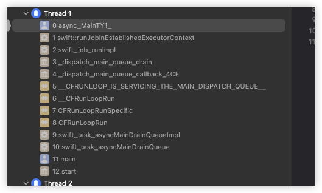

<font size = 4>

### 前序
并发[^ann-concurrency]属于操作系统层面的概念, 所有的编程语言不提供并发机制, 它们全部要依赖运行的平台. 所以像C++的线程库在Unix平台上依赖于pthread库, 在Windows平台上依赖于Window的线程机制, 对于Java也是同样的道理. 本章主要讨论Mac平台下的Swift结构化并发(<font color = red>也称协程</font>) 

编译器分为三个部分
  - 语言部分
  - 运行库
  - 标准库

语言本身不提供并发, 结构化编程的原理是: 底层并发代码由运行库实现, 编译器负责调用运行库. 然而这些库是依赖平台的, 但处于上层的使用者来说不用太过关心实现过程, 但笔者不这样认为, 笔者提倡: 使用一样东西却不知道它的原理是不明智的!!

理论上只要对内核的调度机制了解的足够透彻就可以随心所欲的使用线程和进程, 甚至对其进行封装简化. 笔者将从传统线程编程模式开始逐步引申到结构化并发编程

### 自定义的名词
|名词|意义|
|-|-|
|main|程序的main函数|
|async main|异步main函数|
|async function|异步函数|
|ctx|异步上下文|
|`main-AsyncTask`|主线程的异步任务|
|`f-AsyncTask`|异步任务f|
|`main-task-ctx`|`main-AsyncTask`的上下文|
|`main-ctx`|异步main函数的上下文|
|`f-task-ctx`|异步任务f的上下文|
|`f-ctx`|异步函数f的上下文|
|`(*ctx)<0 ~ 7 bit>`|ctx指向空间的前8字节|
|`context<AsyncContext*>`|对象context的类型|
|`context<AsyncContext*>(nullptr)`|对象context的类型以及值|

### 特殊的
|寄存器|函数参数属性|意义|
|:-:|:-:|-|
|x22|`SWIFT_ASYNC_CONTEXT`|异步函数的上下文|
|x20|`SWIFT_CONTEXT`|异步任务的上下文|
|无|`SWIFT_CC(swiftasync)`|尾部调用消除<font color = red>tce</font>|

这里面有着重提一下tce(<font color = red>Tail Call Elimination</font>), llvm的尾部调用消除, 用来减少函数调用开销. 以Swift中`future_adapter`的源码和展开的汇编为例
```cpp
// future_adatper:
//  > void
//  > 函数结束时调用了asyncEntryPoint
//      SWIFT_CC(swiftasync) void(OpaqueValue *, SWIFT_ASYNC_CONTEXT AsyncContext *, SWIFT_CONTEXT void *);
// 由于使用了 SWIFT_CC(swiftasync) 修饰, 这样llvm在生成future_adapter的源码时,会对其进行优化:
//  > ret指令, 
//  > 直接跳转到asyncEntryPoint这个地址
SWIFT_CC(swiftasync)
static void future_adapter(SWIFT_ASYNC_CONTEXT AsyncContext *_context) {
  auto asyncContextPrefix = reinterpret_cast<FutureAsyncContextPrefix *>(
      reinterpret_cast<char *>(_context) - sizeof(FutureAsyncContextPrefix));
  return asyncContextPrefix->asyncEntryPoint(
      asyncContextPrefix->indirectResult, _context,
      asyncContextPrefix->closureContext);
}


// 上述函数的汇编
libswift_Concurrency.dylib`future_adapter:
->  0x268a7b90c <+0>:  mov    x1, x22                   // x1 = ctx
    0x268a7b910 <+4>:  ldr    x2, [x1, #-0x18]!         // x1 = ctx - 0x18, x2 = *x1, 实际x1 = &asyncEntryPoint, x2 = asyncEntryPoint
    0x268a7b914 <+8>:  ldur   x0, [x22, #-0x20]         // x0 = *(ctx - 0x20), 实际取出了 indirectResult*
    0x268a7b918 <+12>: ldur   x20, [x22, #-0x10]        // x20 = *(ctx - 0x10), 实际取出了 closureContext*
    0x268a7b91c <+16>: mov    x16, x1                   // 对入口地址的指针进行加密 
    0x268a7b920 <+20>: movk   x16, #0x2c42, lsl #48
    0x268a7b924 <+24>: braa   x2, x16                   // 调用asyncEntryPoint入口函数, 见下面的汇编(无参数)
                                                        // 没有ret的返回指令
```

在Swift的源码中有很多这样的函数, 这些函数基本都没有返回值, 因为在Swift中并发模式中, 前后调用的异步函数在逻辑上相连的, 但中间可能穿插其他中转函数, 这些中转函数对于使用者来说其实并不存在, 甚至跨域线程, 这就意味着当前函数想要将参数或结果传递到下一个流程函数时不能通过堆栈(<font color = red>通过异步函数的上下文</font>), 所以它们没有返回值!! 同时异步函数的某个拆分函数结束时都是调用了下一个void类型的函数, 基于此Swift异步模式下的函数可以形成天然的Tail Call Elimination. 后续在源码及汇编的探究中, 会经常出现这种情况, 当前tce函数f1在调用下一个函数f2:
- 先销毁f1的栈桢
- 没有ret指令
- 直接跳转到f2, 此刻xcode的栈桢视图中f1的栈桢被f2替换


### swift中的并发选择
从系统层面来看, 并发只有2种模型:
1. 多进程
2. 多线程

但其实不同内核的线程和进程模型在架构, 实现上是不一样的. 如Linux中站在内核的层面去看, 并没有线程(<font color = red>一种轻量级进程</font>)的这一概念, 但在BSD中进程和线程有明显的区分. 笔者的建议是除非进行系统开发, 否则最好不要使用多进程并发.

> 这里笔者给出一个简单的案例, 只是简单了解一下多进程并发的编程模式


```cpp
#include <unistd.h>
#include <fcntl.h>
#include <sys/stat.h>

#include <algorithm>
#include <initializer_list>

#include <cstdio>
#include <cstdlib>
#include <cstring>

#define _0  0,
#define _1  1,
#define _2  2,
#define _3  3,
#define _4  4,
#define _5  5,
#define _6  6,
#define _7  7,
#define _8  8,
#define _9  9
#define _10  _0 _1 _2 _3 _4 _5 _6 _7 _8 _9


#define _50     _10, _10, _10, _10, _10
#define _100    _50, _50
#define _500    _100, _100, _100, _100, _100

#define range(...) { __VA_ARGS__ }

static auto list = range(_500, _500);

static uint8_t buf[256];

int main() {
    chdir("/tmp");          // 切换工作目录

    unlink("./a.txt");      // 删除文件

    umask(0);               // 创建文件,指定屏蔽字
    auto file = open("./a.txt", O_RDWR | O_CREAT, S_IRUSR | S_IWUSR);
    if(file < 0){
        perror("open");
        exit(-1);
    }

    auto count = 0;

    // 3个子进程
    for(int i = -1; ++i < 3;){
        auto pid = fork();

        // 忽略失败(直接创建下一个子进程), 毕竟这里只是测试
        if(pid < 0){
            perror("fork");
            continue ;
        }

        if(pid == 0){   // 当前位于子进程中

            // 每个子进程循环1000次, 对文件中的内容数字做累加
            //  read --> add --> write
            std::for_each(list.begin(), list.end(), [=](int){
                char buf[128] = {0};

                // 上锁
                lockf(file, F_LOCK, 128);

                auto rlen = pread(file, buf, 128, 0);

                // 读取失败后, 再回去重新读
                //  因为这里读取的是普通文件, 出现错误的概率将很小.
                //  当出现错误时(无论什么错误), 尝试回去重新读取
                if(rlen < 0){
                    lockf(file, F_ULOCK, 128);
                    perror("read");
                    return;
                }

                auto number = 0ll;

                // eof, 第1次
                if(rlen == 0){
                    number = 0;
                }else{
                    number = atoll(buf);
                }

                // add
                number += 1;
                snprintf(buf, 128, "%lld", number);

                // write
                pwrite(file, buf, 128, 0); // ignore error handle

                // 解锁
                lockf(file, F_ULOCK, 128);
            });

            exit(0);
        }
        
        // 有效的子进程数量
        ++count;
    }

    // 等待所有的子进程
    while(true){
        // -1: 等待当前主进程下的任意子进程
        // nullptr, 不关心子进程的收尸状态
        // 0: 选项值(具体看man手册)
        //  当有子进程在运行时, 会阻塞等待它们结束
        //  当没有子进程时(子进程可能已经结束), 会直接返回子进程的进程号(大于0)
        auto wait_pid = waitpid(-1, nullptr, 0);

        wait_pid > 0 ? --count : 0;

        if(count) {
            continue;
        }
        break;
    }


    // 最终在主进程中读取文件的内容, 查看一下累加的值
    if(read(file, ::buf, 256) < 0){
        perror("read");
        return -1;
    }

    printf("%s\n", buf);

    return 0;
}
```

该demo在Mac下使用c++编写, 因为swift不支持fork, demo的功能:
1. 多进程读取文件
2. 将文件中的内容做累加
3. 将累加的结果写入到文件中

整个过程使用文件锁做临界区, 最后的累加结果是3000(<font color = red>从0开始3个子进程每个累加1000次</font>). 这种使用多进程的并发模式会牵扯到很多细节, 笔者建议不要使用这种并发模型. 相应的在应用层面, 可以选择的方式有很多:
1. pthread
2. GCD
3. NSThread
4. NSOperation
5. swift的concurrency

这5种使用方式并不会改变内核中的并发模型, 它们的区别在使用形式上, 说白了就是对内核线程的抽象深度不同, 抽象越高使用越简单, 就越接触不到最底层的细节(<font color = red>为了方便, 笔者称pthread是相对最底层的API</font>). swift中的并发已经将线程抽象成了结构化并发的模型, 其中牵扯到用户态调度的逻辑, 后续会详细学习


### CPU,线程以及调用栈
这三者详细的概念笔者这里不会过多阐述. 线程本质上是内核中的一种数据结构: 用来描述任务的调度状态. 这些状态随着函数的执行过程被不断更改:
1. 时间片
2. 阻塞
3. 自动放弃CPU
4. ...

线程运行过程中会绑定对应的函数调用栈在CPU上执行, 当线程状态发生变化后这3者可能互相脱离绑定:
- 如: 线程阻塞后由内核将其挂起, 但CPU不会空闲, 它可能绑定其他的的线程或进程. 
- 如: 信号的异步调用, CPU和线程很可能没有脱离绑定, 但线程会绑定其他调用栈
- 如: 线程池中线程是复用的, 当线程执行完毕当前的所有函数后, 并不回收给内核, 而是进行睡眠让出CPU, 有新的任务来了后重新绑定调用栈并且又重新绑定其他的CPU

严格来说不能用绑定来描述线程和调用栈的关系, 像第2种情况中当线程被信号打断进入到信号处理函数时, 线程的调用栈其实有2部分:
1. 原调用栈中底部的部分函数
2. 信号处理调用栈


```cpp
#include <unistd.h>
#include <signal.h>
#include <execinfo.h>
#include <pthread/pthread.h>

#include <cstdio>

// 打印函数调用栈
void print_callstack(void){
    void* buf[1024] = {0};
    auto frames = backtrace(buf, 128);
    auto symbols = backtrace_symbols(buf, frames);
    printf("thread<%p>\n", pthread_self());
    for(int i = -1; ++i < frames;){
        printf("%s\n", symbols[i]);
    }
}

// 信号处理
void sig_handle(int){
    print_callstack();
}

int main() {
    // 主线程
    printf("main<%p>\n", pthread_self());

    // 注册信号
    signal(SIGALRM, sig_handle);

    // 5秒后发送
    alarm(5);

    // 主线程阻塞
    while(pause()){
        // 被alarm唤醒(先执行信号函数, 再回来这里执行循环)
        printf("*************************\n");
        print_callstack();
    }

    return 0;
} 

#if 0
main<0x203647840>
thread<0x203647840>                     // 信号唤醒了主线程, 并先进入到信号处理函数
0   cpp                                 0x0000000100003d8c _Z15print_callstackv + 80    // 中间3个已经是新的函数栈桢
1   cpp                                 0x0000000100003e58 _Z10sig_handlei + 20
2   libsystem_platform.dylib            0x000000019e568184 _sigtramp + 56
3   libsystem_c.dylib                   0x000000019e43d480 pause + 44           // 这里还是原来的栈桢
4   cpp                                 0x0000000100003eb8 main + 84
5   dyld                                0x000000019e1b0274 start + 2840
*************************                                                       // 信号处理程序处理完毕后, 循环体打印
thread<0x203647840>                                                             
0   cpp                                 0x0000000100003d8c _Z15print_callstackv + 80 
1   cpp                                 0x0000000100003ed8 main + 116
2   dyld                                0x000000019e1b0274 start + 2840
#endif
```

当前demo中当信号产生后, 进入到信号处理函数是属于异步回调, 这种异步回调是相当于打断了主线程的顺序执行, 被内核强制制造了新的现场. 固使用绑定这个词来描述线程和调用栈之间的关系或许并不贴切, 但为了方便笔者还是以绑定来描述. 同样的原理当使用线程池时, 线程本身是复用的, 但它可以通过绑定调用栈(<font color = red>其实就是回调</font>)从而执行不同的业务. 


### 传统线程模式(1)
先来看一个简单的下载案例(<font color = red>笔者简化了业务</font>)

```cpp
#include <unistd.h>
#include <pthread/pthread.h>
#include <iostream>
#include <sstream>

using namespace std;
static void* sub_thread(void* data){
    cout << "子线程<" << pthread_self() << ">开始下载...\n";        
    sleep(5);       // 模拟下载 __code_3

    cout << "子线程<" << pthread_self() << ">下载成功!\n";
    auto os = ostringstream();
    os.setf(ios::hex);
    os << "hello tierry!";

    return new string(os.str());
}

static void download(std::string url,void(*cbk)(void* _Nullable)){
    pthread_t pid;
    pthread_create(&pid, nullptr,sub_thread, (void*)url.c_str());   // __code_1
    void* ret = nullptr;
    pthread_join(pid, &ret);                                        // __code_2
    if(ret){
        cbk(ret);
    }
}

static void handle(void* data){ //__code_4
    if(data){
        cout << "main<"<< pthread_self() << ">:" << *static_cast<string*>(data) << endl;
        delete static_cast<string*>(data);
    }
}

int main() {
    cout << "main" << "<" << pthread_self() << ">\n";
    download("下载的地址", handle);     // __code_0
    return 0;
}

#if 0
main<0x1fac93840>
子线程<0x16fe87000>开始下载...      // 阻塞5秒
子线程<0x16fe87000>下载成功!        
main<0x1fac93840>:hello tierry!
#endif
```

程序的流程:
1. 主线程发起下载(`__code_0`)
2. 创建下载任务(`__code_1`)
3. 内核调度子线程
4. 子线程内部做下载, 笔者使用睡眠5秒来模拟这个过程(`__code_3`)
5. 子下载完毕后返回数据
6. 主线程在创建子线程后, 采用阻塞等待模式(`__code_2`)
    - 在这个期间主线程不能执行任何操作
7. 子线程返回后, 主线程被唤醒并接收子线程返回的数据(`__code_2`)
8. 主线程调用打印函数(`__code_4`)

整个过程在逻辑上确实是顺序执行的, 但为了顺序执行牺牲主线程: 主线程在子线程请求的5秒内不能做任何事情. 


### 传统线程模式(2)
上一小节的案例可以通过分离线程, 添加异步回调的方式来解决
```cpp
#include <unistd.h>
#include <pthread/pthread.h>

#include <iostream>
#include <queue>
#include <atomic>

using namespace std;

static std::queue<string> main_q;

static atomic_flag flag;

static pthread_t main_tid;

#define $(_code)        \
    do {                \
        while(flag.test_and_set()){ \
            pthread_yield_np(); \
            continue;   \
        }               \
        _code           \
        flag.clear();   \
    }while(false)


static void push(string data){
    $({
        main_q.push(data);
    });

    // 相当于唤醒主线程,
    //  PS: pthread_kill是向指定的线程发信号, 但在Mac中笔者测试的只有
    //  指定主线程时, 这个信号才是成功的
    pthread_kill(main_tid, SIGUSR1);
}

static void pop(){
    while(true){
        string str;
        $({
            if(!main_q.empty()){
                str = main_q.front();
                main_q.pop();
            }else {
                flag.clear();
                return;
            }
        });

        if(!str.empty()){
            cout << "main<" << pthread_self() << ">: " << str << endl;
        }
    }
}

static void* sub_thread(void* data){
    cout << "子线程<" << pthread_self() << ">开始下载...\n";

    sleep(5);       // 模拟下载

    cout << "子线程<" << pthread_self() << ">下载成功!\n";

    push("hello tierry!");  // __code_6

    return nullptr;
}

static void download(std::string url){
    pthread_t pid;
                                        // __code_7
    pthread_create(&pid, nullptr,sub_thread, (void*)url.c_str());

    pthread_detach(pid);                // __code_8
}


int main() {
    main_tid = pthread_self();

    signal(SIGUSR1, SIG_IGN);           // __code_0

    cout << "main" << "<" << pthread_self() << ">\n";

    download("下载的地址");             // __code_1

    sleep(1);
                                        // __code_2
    cout << "main" << "<" << pthread_self() << ">下载期间做其他事情...\n";

    while(pause()){                     // __code_3
        printf("wake up!!\n");          // __code_4
        pop();                          // __code_5
    }
    return 0;
} 

#if 0
子线程<0x16fe87000>开始下载...          //子线程阻塞(5秒) 
main<0x1fac93840>下载期间做其他事情...  // 主线程在子线程阻塞期间可以做其他事情
子线程<0x16fe87000>下载成功!            // 当子线程下载成功后, 会将数据添加到主线程的任务队列, 唤醒主线程
wake up!!                               // 主线程被唤醒
main<0x1fac93840>: hello tierry!        // 执行打印, 后面会继续睡眠, 等待任务
#endif
```

流程:
1. `__code_0`: 主线程注册一个异步信号用来被唤醒
2. `__code_1`: 主线程发起请求
    - 内部创建子线程(`__code_7`)
    - 和子线程分离(`__code_8`)
3. 主线程执行其他任务
    - 睡眠(<font color = red>也是一种任务</font>)
    - 执行一句打印(`__code_2`)
4. 子线程此刻还在进行下载
5. `__code_3`: 主线程挂起, 等待唤醒
6. 当子线程下载完毕后, 将数据添加到主线程的任务队列中, 并唤醒主线程(push函数)
7. 主线程被唤醒, 取出任务打印一下(pop函数)

整个流程并不是顺序执行的, 主线程并不需要一直等待子线程下载完毕, 所以它可以执行其他的任务, 主线程是通过异步通知的方法被唤醒. 实际开发中:
1. 信号唤醒会替换成条件锁
2. 主线程也会关联一个任务队列, 但队列中的元素并不是简单的字符串, 可能是格式统一的回调函数

该模型也算是单一的线程池, 即main线程其实一直被复用. 


### 传统线程模式(3)
使用lambda可以对上一小节的模型做简化, 这样程序看起来更集中

```cpp
int main() {
    main_tid = pthread_self();

    signal(SIGUSR1, SIG_IGN);

    cout << "main" << "<" << pthread_self() << ">\n";

    thread([](void* data){
        cout << "子线程<" << pthread_self() << ">开始下载...\n";

        sleep(5);       // 模拟下载

        cout << "子线程<" << pthread_self() << ">下载成功!\n";

        push("hello tierry!");

        return nullptr;
    }, (void*)"下载的地址").detach();

    sleep(1);

    cout << "main" << "<" << pthread_self() << ">下载期间做其他事情...\n";

    while(pause()){
        printf("wake up!!\n");
        pop();
    }
    return 0;
} 
```

使用c++的线程库可以使用lambda表达式, 这样代码更为集中. thread底层调用的是POSIX线程, 所以本质上是一样的, 流程并不会改变. 现在来总结这3小节案例的缺点:
1. 不管怎么修改, 都不可避免的要使用异步
2. 因为异步的机制, 整个代码在书写形式上并不是顺序化的(<font color = red>结构化</font>)

将异步的处理机制架构成顺序模型是比较困难的, 后面笔者将以iOS(<font color = red>简化</font>)来加以引导.


### 传统线程模式(4)
先看一个简单的案例:
```objc
#include <Foundation/Foundation.h>

typedef CFRunLoopRef EventLoop;
typedef CFRunLoopMode EventMode;

static EventLoop mainloop;

static void req_data(const char* url, void(^cbk)(id _Nullable, NSError* _Nullable)){
    dispatch_async(dispatch_get_global_queue(0, 0), ^{

        auto path = [NSString stringWithCString:url encoding:NSUTF8StringEncoding];

        path = [path stringByAddingPercentEncodingWithAllowedCharacters:NSCharacterSet.URLQueryAllowedCharacterSet];

        NSURLRequest* req = [NSURLRequest requestWithURL:[NSURL URLWithString:path]];

        // 获取到数据
        id e;
        auto data = [NSURLConnection sendSynchronousRequest:req returningResponse:nil error:&e];

        // 解析数据
        id oc = [NSJSONSerialization JSONObjectWithData:data options:0 error:nil];

        // 唤醒主线程
        dispatch_async(dispatch_get_main_queue(), ^{
            e ? cbk(nil, e) : cbk(oc, nil);
        });
    });
}

int main(void){
    mainloop = CFRunLoopGetCurrent();

    constexpr auto url = "http://t.weather.sojson.com/api/weather/city/101030100";

    auto observer = CFRunLoopObserverCreateWithHandler(
        CFAllocatorGetDefault(),kCFRunLoopAllActivities,true,1,
        ^(CFRunLoopObserverRef observer, CFRunLoopActivity activity) {
            if(activity != kCFRunLoopEntry)
                return;

            req_data(url, ^void(NSDictionary* data, NSError* e){
                if(e)
                    return;

                NSDictionary* fir = data[@"data"][@"forecast"][0];
                
                NSLog(@"%@\t\t%@", fir[@"high"], fir[@"low"]);
            });
        });

    CFRunLoopAddObserver(mainloop, observer, kCFRunLoopDefaultMode);

    CFRunLoopRun();

    return 0;
}

#if 0
高温 17℃		低温 8℃
#endif
```

这个案例使用苹果的runloop来模拟UI开发下的基本流程:
1. runloop刚进入时就开始从服务器获取数据
2. 为了演示, 笔者使用了同步请求的接口, 这意味着调用线程将被阻塞, 所以必须开启子线程
3. 子线程请求完数据后, 通过回调的方式向主线程回传数据

这种代码在iOS开发很常见(OC), 它们存在的主要问题: 主线程和子线程传递数据方式不是流程化的, 如果涉及多个异步顺序处理将形成嵌套地狱, 可以自行进行封装达到如下这种效果(<font color = red>并非本例</font>):

```objc
@Async(id, result) = @Await http_req(API.module_home.sysconfig, nil, GET) @Awake
REQ_SUC(){
    [LCSaveData savePaydomain:__res.to_dic.read(@"ossDomain")];
    [LCSaveData saveSysId:__res.to_dic.read(@"sysId")];
    [LCSaveData saveServerId:__res.to_dic.read(@"servId")];
}
@Catch();
@Over(); 

// 笔者封装的OC网络请求, 这里只是举例
```

笔者封装的原理其实很简单:
1. macro
2. 信号量

即在主线程发起请求后, 开辟子线程利用信号量做同步, 然后利用macro抽象顺序的书写语法, 这里不多赘述. 它最主要的优点: 从上往下的书写格式看起来更直观. 这当然算是一种简化使用.  

> swift在语言层面提供了这种语法, 并配合标准库的并发架构实现了结构化并发[^ann-struct-concurrency]. 

### 结构化并发说明
前面几个小案例是典型的异步回调模式, 在编码范式上并不是顺序书写的(<font color = red>即使使用lambda</font>), 所以相对的结构化就是书写的并发代码在形式上就是顺序的(就像线程中join). 从这个概念出发Swift中的源码在架构上将某个流程抽象成了Job, 有多种形式的Job, 但着重关心的是AsyncTask. 一个AsyncTask在<font color = red>逻辑上</font>就是一个完整流程, 它由多个异步函数顺序调用形成. 笔者这里先给出结论:
- `main-AsyncTask`在实现上并非结构化的, 但在逻辑上是的
- `other-AsyncTask`在实现和逻辑上都是结构化的

```swift
func f() async{} 


await f()       // main-AsyncTask当前的async main调用异步f,
                // 由于主线程的特殊性, main-AsyncTask将切换线程
                // 并进入睡眠, 等待f完毕后唤醒. 从这一点来看:
                // main-AsyncTask不是结构化的. 但在执行流程上
                // 下一句的打印语句必定在f执行完毕后回到主线程后被调用
print("hello")


func f1() async{
    await f()   // 调用异步函数f, 在源码实现中将直接在当前的线程中调用f,
                // f调用完毕后继续在当前线程中回到f1, 执行下面的打印语句,
                // 所以不管从逻辑上还是实现上 f1-AsyncTask都是顺序的
    print("tierry")
} 
async let _ = f1()      // 分离f1-AsyncTask
```

> 不同场景下创建的AsyncTask具有不同的性质, 这将在后续逐个学习


### 上下文切换
严格来说上下文切换发生在CPU切换线程时. 当前线程由于某些原因(<font color = red>如时间片, 阻塞IO等</font>)要放弃CPU时, 内核会记录下当前与线程相关的状态信息(<font color = red>寄存器,PC,堆栈指针,TCB等</font>), 并将这些寄存器,PC, FP, TCB等重置为目标运行线程状态. 频繁的上下文切换会带来性能损耗, 所以内核在调度模块其实也做了很多优化, 笔者这里不探究这种层面
> 这里用户态向内核态发生转换时, 也有类似上下文切换机制, 但这种上下文并不是线程的上下文(某些系统实现可能会牵连线程的上下文切换).

从权限层面来看, 用户是无法避免这种切换的. 即使是使用线程池也是一样的. 因为处于线程池中的线程不处于运行状态, 它不占据CPU, 所以当用户唤醒线程池中的线程时, 对应的内核会给该线程分配CPU, 这个时候必然发生上下文的切换. 但它可以避免线程的频繁创建和销毁, 也可以达到一定程度的优化.  笔者指出这一点的目的是为了说明(Mac环境): 
1. gcd框架其实就是线程池机制, 所以也有上下方切换
2. swift协程基于gcd, 所以不能避免上下文切换
3. swift协程是用户层面实现的调度(<font color = red>由swift运行库, swift标准库以及编译器配合实现</font>)
4. swift的结构化并发的效率取决于gcd, 并不是该并发机制的效率
> 笔者认为swift中的结构化并发只是极简了异步编程模式(<font color = red>其他语言也是一样的原理</font>), 如果单纯的使用传统并发(如OC)效率会更高一点(<font color = red>但程序相对复杂</font>)


### 异步函数初识
`5.6`新增了一个关键字async, 它用来修饰函数, 这种函数被称为异步函数. 异步函数的特点:
1. 整个函数并不是独立的, 而是可被拆分的
    - 在暂停点被拆分


<br/>

2. 函数的堆栈并非传统意义上的堆栈, 而是异步上下文对象所包含的一部分

<br/>

3. 异步函数内部是多线程执行的(<font color = red>视情况</font>)
    - 如果有暂停点, 则拆分后的函数将在新的线程中执行, 执行完毕后会跳转回暂停点之后

<br/>

4. 异步函数的调用有固定的格式 
    - 阻塞调用: 使用`await`
    - 分离调用: 使用: 1. `await let`; 2. Task

> 关于异步函数怎么拆分的, 这个将在后面的小节详细探究


### 定义异步函数
```swift
func ThreadInfo(other: String = #function) {
    print("\(other + ":")thread<\(pthread_main_np() == 1 ? "main": "sub"),\(pthread_self())>")
}

func f() async {
    ThreadInfo(other: #function)
} 
```

`f`通过`aysnc`修饰, 它是一个异步函数, 一般情况下异步函数在子线程中执行:

```swift
// 打印一下主线程
ThreadInfo(other:"main") 

// 阻塞调用异步函数
await f()

#if false 
main():thread<main,0x00000001ec77f840>
f():thread<sub,0x000000016fe87000>
#endif
```
可以发现主线程中以await形式调用异步函数时, 异步函数在子线程中执行. 这里并不能确定主线程是否真被阻塞. 看下面的案例

```swift
func f() async {
    ThreadInfo(other: #function)
    sleep(1)
}
await f()
ThreadInfo(other: "main()") 

#if false
f():thread<sub,0x000000016fe87000>          // 程序运行后,立即打印, 然后会睡眠1秒
main():thread<main,0x00000001ec77f840>      // 1秒后打印, 说明主线程被阻塞了
#endif
```

如果以所谓的分离方式调用, 则f函数一定在子线程中执行, 但main始终会等待子线程执行完毕

```swift
func f() async {
    ThreadInfo(other: #function)
    sleep(1)
    DispatchQueue.main.async {
        ThreadInfo(other: "main():\(#line)")// __code_12
        print("wake main runloop")
    }
}
// 分离方式调用, 这时的await可以省略(不阻塞主线程)
async let result = await f()  
ThreadInfo(other: "main():\(#line)")        // __code_18

#if false 
main():18:thread<main,0x00000001ec77f840>   // __code_18
f():thread<sub,0x000000016fe87000>          // f异步函数的打印(子线程中). 这里不能确定是先执行main的打印还是f的打印, 因为调度时机是不确定的
main():12:thread<main,0x00000001ec77f840>   // 1秒后在子线程中唤醒主线程(__code_12)
wake main runloop                           // 测试打印
Program ended with exit code: 0             // 整个进程结束
#endif
```

通过这个测试有这几个结论:
1. 主线程会等待异步函数执行完毕后才结束, 整个进程也就结束
2. 异步函数内的机制是gcd, 因为异步函数在结束前通过gcd的主队列唤醒主线程, 并且主线程真的被唤醒了
3. 通过第2条的结论, 可以推断:
    - 主线程运行在`gcd_main_q`上
    - 主线程在执行完`__code_18`后一定启动了runloop(<font color = red>这个将会在后续进行汇编的验证</font>)


### 不一定开辟线程1
main函数是一个特例, 在main函数上进行的异步函数调用一定会开辟新的的线程. 但在异步函数中调用其他异步函数时, 并不确定是否开启子线程, 先来看分离时的情况:

```swift
func f2() async {
    ThreadInfo(other: "f2()")
}

func f() async {
    for _ in 1...10 {
        print("----------------------------")
        ThreadInfo(other: "f1()")
        async let res = f2()            // __code_detatch
    }
}


ThreadInfo(other: "main():\(#line)")
async let _ = f()


#if false
main():36:thread<main,0x00000001ec77f840>
----------------------------
f1():thread<sub,0x000000016fe87000>
f2():thread<sub,0x000000016fe87000>
----------------------------
f1():thread<sub,0x000000016fe87000>
f2():thread<sub,0x000000016fe87000>
----------------------------
f1():thread<sub,0x000000016ff13000>
f2():thread<sub,0x000000016ff13000>
----------------------------
f1():thread<sub,0x000000016ff13000>
f2():thread<sub,0x000000016ff13000>
----------------------------
f1():thread<sub,0x000000016ff13000>
f2():thread<sub,0x000000016ff13000>
----------------------------
f1():thread<sub,0x000000016ff13000>
f2():thread<sub,0x000000016ff13000>
----------------------------
f1():thread<sub,0x000000016ff13000>
f2():thread<sub,0x000000016ff13000>
----------------------------
f1():thread<sub,0x000000016ff13000>
f2():thread<sub,0x000000016ff13000>
----------------------------
f1():thread<sub,0x000000016ff13000>
f2():thread<sub,0x000000016ff13000>
----------------------------
f1():thread<sub,0x000000016ff13000>
f2():thread<sub,0x000000016ff13000>
#endif
```

<font color = red>这个测试结果并不能作为推导一些结论所需要的样本数据</font>, 也就是说f1要不要开辟线程去执行f2是不确定的. 但有一个隐式的结论: <font color = red>即使是分离调用, 每次循环结束后f1也会等待f2</font>. 
> 至于这些原因都会在后面的源码分析中说明

再来看一下f1阻塞调用f2时, 测试情况

```swift
func f2() async {
    ThreadInfo(other: "f2()")
}

func f() async {
    for _ in 1...10 {
        print("----------------------------")
        ThreadInfo(other: "f1()")
        await f2()
    }
}


ThreadInfo(other: "main():\(#line)")
async let _ = f() 

#if false
main():42:thread<main,0x00000001ec77f840>
----------------------------
f1():thread<sub,0x000000016fe87000>
f2():thread<sub,0x000000016fe87000>
----------------------------
f1():thread<sub,0x000000016fe87000>
f2():thread<sub,0x000000016fe87000>
----------------------------
f1():thread<sub,0x000000016fe87000>
f2():thread<sub,0x000000016fe87000>
----------------------------
f1():thread<sub,0x000000016fe87000>
f2():thread<sub,0x000000016fe87000>
----------------------------
f1():thread<sub,0x000000016fe87000>
f2():thread<sub,0x000000016fe87000>
----------------------------
f1():thread<sub,0x000000016fe87000>
f2():thread<sub,0x000000016fe87000>
----------------------------
f1():thread<sub,0x000000016fe87000>
f2():thread<sub,0x000000016fe87000>
----------------------------
f1():thread<sub,0x000000016fe87000>
f2():thread<sub,0x000000016fe87000>
----------------------------
f1():thread<sub,0x000000016fe87000>
f2():thread<sub,0x000000016fe87000>
----------------------------
f1():thread<sub,0x000000016fe87000>
f2():thread<sub,0x000000016fe87000>
#endif
```

这个笔者直接说结论: <font color = red>f1不会开辟线程去执行f2</font>(后面有汇编和源码说明)

### 死锁??
使用swift并发机制时, 要注意死锁的问题, 先来看一下案例

```swift
func ThreadInfo(other: String = #function) {
    print("\(other + ":")thread<\(pthread_main_np() == 1 ? "main": "sub"),\(pthread_self())>")
}

var lock = os.OSAllocatedUnfairLock()

func f() async {
    lock.lock()                         
    ThreadInfo(other: "f1()-locked")        
    try! await Task.sleep(nanoseconds: UInt64(1e9))
    ThreadInfo(other: "f1()-unlock")        // 解锁时可能不在加锁的线程, 所以这里可能直接闪退
    lock.unlock()
}


ThreadInfo(other: "main():\(#line)")
await f() 
```

测试中使用了操作系统的锁, 如果在线程1中上锁, 但在线程2中解锁将直接异常结束程序. 


### 思考
根据前面的简单测试, 现在最关心的问题:
1. 什么是所谓的拆分函数
2. 暂停点是什么, 为什么暂停点前后所在的线程可能不一样? 如果涉及到函数参数, 局部对象会有什么问题?
3. swift怎么做到用户态切换线程的


### 前置知识
后续会从源码的角度结合汇编来探究Swift并发机制的过程, 所以这需要先了解一些额外的知识:
1. C++中函数类型的参数分离
2. Swift中的`bit mask`操作
3. Swift中指针偏移
4. Swift中的指针共用

```cpp
// 必须有这原始模板的声明
template <class Sig, bool HasErrorResult>
struct AsyncSignature;

// 类型模板特化版本
// 函数类型的参数分离:
//  AsyncSignature<int(string, double), false>
//  c++的编译器会分解成:
//      DirectResultTy = int
//      ArgTys = string, double
//      HasErrorResult = false
template <class DirectResultTy, class... ArgTys, bool HasErrorResult>
struct AsyncSignature<DirectResultTy(ArgTys...), HasErrorResult> {
  // std::is_same<int, void> == false, 因为int != void
  // 所以直接在编译期就确定了是否有返回类型, 即hasDirectResult = true
  bool hasDirectResult = !std::is_same<DirectResultTy, void>::value;

  // 返回类型
  using DirectResultType = DirectResultTy;
  
  // 标记是否有异常
  bool hasErrorResult = HasErrorResult;
}; 


/////////////////////////////////////////////////////////////////////////////////////////////////


// bit mask
// 以最底层的 FlagSet为例

template <typename IntType>
class FlagSet {
    // IntType必须是整型, 这些都是在编译期就能确定的
  static_assert(std::is_integral<IntType>::value,
                "storage type for FlagSet must be an integral type");

  // number
  IntType Bits;

protected:
  // 成员函数模板
  // bit位的宽度, 即有哪些连续的bit位将被使用, 
  // 如BitWidth = 3, 则lowMaskFor就表示连续的3个bit位将被用作标识
  template <unsigned BitWidth>
  static constexpr IntType lowMaskFor() {
    return IntType((1 << BitWidth) - 1);
  }

  // lowMaskFor确定了哪些连续的bit位被使用,
  // 但在一个整型的number中还不能确定从第几个bit位开始, 所以
  // maskFor表示从第FristBit开始后连续的BitWidth个bit将被使用.
  // eg: FirstBit = 2, BitWidth = 3
  //     lowMaskFor<3> = 0b111
  //     maskFor<2, 3> = 0b111 << 2 = 0b11100
  // 当number = 8时, number<2 ~ 4 bit> = number & maskFor
  template <unsigned FirstBit, unsigned BitWidth = 1>
  static constexpr IntType maskFor() {
    return lowMaskFor<BitWidth>() << FirstBit;
  }

  // 默认全部bit为0
  constexpr FlagSet(IntType bits = 0) : Bits(bits) {}

  // 函数模板
  // N = Bit
  // 取出number的第N个bit位上的值
  template <unsigned Bit>
  bool getFlag() const {
    return Bits & maskFor<Bit>();
  }

  // N = Bit
  // 设置number的第N个bit位为1或0
  template <unsigned Bit>
  void setFlag(bool value) {
    if (value) {
      Bits |= maskFor<Bit>();
    } else {
      Bits &= ~maskFor<Bit>();
    }
  }

  // 第3个模板参数只是标注类型
  // 取出 number<FirstBit ~ (FirstBit + BitWdith) bit>上的值
  template <unsigned FirstBit, unsigned BitWidth, typename FieldType = IntType>
  constexpr FieldType getField() const {
    return FieldType((Bits >> FirstBit) & lowMaskFor<BitWidth>());
  }

  // number<FirstBit ~ (FirstBit + BitWidth) bit> = value
  template <unsigned FirstBit, unsigned BitWidth, typename FieldType = IntType>
  void setField(typename std::enable_if<true, FieldType>::type value) {
    assert(IntType(value) <= lowMaskFor<BitWidth>() && "value out of range");
    Bits = (Bits & ~maskFor<FirstBit, BitWidth>())
         | (IntType(value) << FirstBit);
  }

  // macro, 子类会进行批量定义生成对应bit的getter和setter
#define FLAGSET_DEFINE_FLAG_ACCESSORS(BIT, GETTER, SETTER) \
  bool GETTER() const {                                    \
    return this->template getFlag<BIT>();                  \
  }                                                        \
  void SETTER(bool value) {                                \
    this->template setFlag<BIT>(value);                    \
  }

  // macro, 子类会进行批量定义生成对应 <BIT ~ (BIT + WIDTH) bit>的getter和setter
#define FLAGSET_DEFINE_FIELD_ACCESSORS(BIT, WIDTH, TYPE, GETTER, SETTER) \
  constexpr TYPE GETTER() const {                                        \
    return this->template getField<BIT, WIDTH, TYPE>();                  \
  }                                                                      \
  void SETTER(TYPE value) {                                              \
    this->template setField<BIT, WIDTH, TYPE>(value);                    \
  }

  // macro, 操作符重载, 2个相同类型的FlagSet的方便比较
#define FLAGSET_DEFINE_EQUALITY(TYPENAME)                                \
  friend bool operator==(TYPENAME lhs, TYPENAME rhs) {                   \
    return lhs.getOpaqueValue() == rhs.getOpaqueValue();                 \
  }                                                                      \
  friend bool operator!=(TYPENAME lhs, TYPENAME rhs) {                   \
    return lhs.getOpaqueValue() != rhs.getOpaqueValue();                 \
  }

public:
  IntType getOpaqueValue() const {
    return Bits;
  }
};

// 应用
class TaskCreateFlags : public FlagSet<size_t> {
public:
    // 定义各种bit
  enum {
    // <0 ~ 7 bit> 表示任务的优先级, 这意味着
    // 有8个bit位来标记当前任务的优先级
    RequestedPriority = 0,
    RequestedPriority_width = 8,

    
    // 以下是第8到第14bit需要用到的标记
    Task_IsChildTask                              = 8,
    Task_IsInlineTask                             = 9,
    Task_CopyTaskLocals                           = 10,
    Task_InheritContext                           = 11,
    Task_EnqueueJob                               = 12,
    Task_AddPendingGroupTaskUnconditionally       = 13,
    Task_IsDiscardingTask                         = 14,

    // Swift 6.1后添加
    Task_IsTaskFunctionConsumed                   = 15,
  };

  // 构造函数
  explicit constexpr TaskCreateFlags(size_t bits) : FlagSet(bits) {}

  // 无参的构造函数, 会调用到FlagSet的默认构造, Bits = 0
  constexpr TaskCreateFlags() {}

  // 生成 <0 ~ 7 bit>位的setter和getter
  FLAGSET_DEFINE_FIELD_ACCESSORS(RequestedPriority, RequestedPriority_width,
                                 JobPriority, getRequestedPriority,
                                 setRequestedPriority)

  // 生成第8bit位的setter和getter, 后面的同理
  FLAGSET_DEFINE_FLAG_ACCESSORS(Task_IsChildTask,
                                isChildTask,
                                setIsChildTask)
  FLAGSET_DEFINE_FLAG_ACCESSORS(Task_IsInlineTask,
                                isInlineTask,
                                setIsInlineTask)
  FLAGSET_DEFINE_FLAG_ACCESSORS(Task_CopyTaskLocals,
                                copyTaskLocals,
                                setCopyTaskLocals)
  FLAGSET_DEFINE_FLAG_ACCESSORS(Task_InheritContext,
                                inheritContext,
                                setInheritContext)
  FLAGSET_DEFINE_FLAG_ACCESSORS(Task_EnqueueJob,
                                enqueueJob,
                                setEnqueueJob)
  FLAGSET_DEFINE_FLAG_ACCESSORS(Task_AddPendingGroupTaskUnconditionally,
                                addPendingGroupTaskUnconditionally,
                                setAddPendingGroupTaskUnconditionally)
  FLAGSET_DEFINE_FLAG_ACCESSORS(Task_IsDiscardingTask,
                                isDiscardingTask,
                                setIsDiscardingTask)
  FLAGSET_DEFINE_FLAG_ACCESSORS(Task_IsTaskFunctionConsumed,
                                isTaskFunctionConsumed,
                                setIsTaskFunctionConsumed)
};

// 这意味着外界可以:
//  TaskCreateFlags flag;
//  flag.getRequestedPriority 得到前8bit的值
//  flag.setRequestedPriority(UserInteractive), 设置<0 ~ 7 bit>, UserInteractive是JobPriority
//  flag.isChildTask, 获取第8bit的值
//  flag.setIsChildTask(true /*或false*/)


/// 关于指针偏移后面遇到后再介绍


/////////////////////////////////////////////////////////////////////////////////////////////////


// 指针共用
llvm::PointerIntPair<AsyncTask *, 2, unsigned> taskAndFlags;


// 注意该类模板是特化版本, eg: T = AsyncTask(64位)
//  后面会学习到该类型
template <typename T> struct PointerLikeTypeTraits<T *> {
  // real type: AsyncTask*
  static inline void *getAsVoidPointer(T *P) { return P; }

  // AsyncTask*
  static inline T *getFromVoidPointer(void *P) { return static_cast<T *>(P); }

  //  sizeof(AsyncTask) = 192
  //  alignof(AsyncTask) = 16
  //  log2(16) = 4
  // 这个过程在编译期就算出来了
  //
  // PS: 这里用了很高的技巧, alignof计算对齐系数(一般是2的N倍数),
  //     当一个指针p的的对齐系统是N时, (*p)<0 ~ log2(N) bit> 一定为0,
  //     此刻就可以共用指针的 log2(N)个bit来作特殊标记
  static constexpr int NumLowBitsAvailable =
      detail::ConstantLog2<alignof(T)>::value;
};

// PointerT = AsyncTask*   IntBits = 2,  PtrTarits =  PointerLikeTypeTraits<AsyncTask*> 
template <typename PointerT, unsigned IntBits, typename PtrTraits>
struct PointerIntPairInfo {
  // NumLowBitsAvailable  = 4
  // numeric_limits<uintptr_t>::digits = 4(获取unsigned long(8字节)的有效位数, 至少需要4bit位来表示)
  // 这里是在检查:
  //    如果PointerT的对齐系数不是16(或小于16的倍数), 则这里直接在编译期就报错
  // PS: AsyncTask的对象系数是16, 则低4个bit一定是0, 所以可以借助这4bit来作特殊标记,
  static_assert(PtrTraits::NumLowBitsAvailable <
                    std::numeric_limits<uintptr_t>::digits,
                "cannot use a pointer type that has all bits free");

  // PointerT最多在低4个bit作标记, IntBtis则表示要用到几个, 所以 IntBits 必须小于= 4
  // 这里IntBits为2, 则表示只用到2bit
  static_assert(IntBits <= PtrTraits::NumLowBitsAvailable,
                "PointerIntPair with integer size too large for pointer");
  enum MaskAndShiftConstants : uintptr_t {
    // 指针部分的掩码:  ~ ((1 << 4) - 1)
    //  0xFF_FF_FF_FF__FF_FF_FF_F0, 低4bit为0
    PointerBitMask =
        ~(uintptr_t)(((intptr_t)1 << PtrTraits::NumLowBitsAvailable) - 1),

    // 2
    IntShift = (uintptr_t)PtrTraits::NumLowBitsAvailable - IntBits,
    
    // 0x3
    IntMask = (uintptr_t)(((intptr_t)1 << IntBits) - 1),

    // 用到的bit位部分的掩码: (0x3 << 2) = 0xc
    // 最后的效果是: <0 ~ 1 bit>是保留的, 没有用到
    //               <2 ~ 3 bit>用来做标记
    //               <4 ~ 63bit>指针部分
    ShiftedIntMask = (uintptr_t)(IntMask << IntShift)
  };

  // 构造指针p,  (*p)<0 ~ 3 bit> = 0
  static PointerT getPointer(intptr_t Value) {
    return PtrTraits::getFromVoidPointer(
        reinterpret_cast<void *>(Value & PointerBitMask));
  }

  // 获取标记
  static intptr_t getInt(intptr_t Value) {
    return (Value >> IntShift) & IntMask;
  }

  // 更新指针部分
  static intptr_t updatePointer(intptr_t OrigValue, PointerT Ptr) {
    intptr_t PtrWord =
        reinterpret_cast<intptr_t>(PtrTraits::getAsVoidPointer(Ptr));
    assert((PtrWord & ~PointerBitMask) == 0 &&
           "Pointer is not sufficiently aligned");
    // Preserve all low bits, just update the pointer.
    return PtrWord | (OrigValue & ~PointerBitMask);
  }

  // 更新标记部分
  static intptr_t updateInt(intptr_t OrigValue, intptr_t Int) {
    intptr_t IntWord = static_cast<intptr_t>(Int);
    assert((IntWord & ~IntMask) == 0 && "Integer too large for field");

    // Preserve all bits other than the ones we are updating.
    return (OrigValue & ~ShiftedIntMask) | IntWord << IntShift;
  }
};


// PointerTy = AsyncTask*, unsigned = 2
// 最后2个模板参数见上面的2个类型
template <typename PointerTy, unsigned IntBits, typename IntType = unsigned,
          typename PtrTraits = PointerLikeTypeTraits<PointerTy>,
          typename Info = PointerIntPairInfo<PointerTy, IntBits, PtrTraits>>
class PointerIntPair {
  using InfoTy = Info;

  // 变体指针, 由于当前类的大小就是8字节, 所以可以直接使用(*this)来表示Value的值
  intptr_t Value = 0;

public:
  constexpr PointerIntPair() = default;

  // (*this).pointer = PtrVal
  // (*this).bits = IntVal
  PointerIntPair(PointerTy PtrVal, IntType IntVal) {
    setPointerAndInt(PtrVal, IntVal);
  }

  // (*this).pontier = PtrVal
  // (*this).bits = 0
  explicit PointerIntPair(PointerTy PtrVal) { initWithPointer(PtrVal); }

  // 返回正确的指针
  PointerTy getPointer() const { return Info::getPointer(Value); }

  // 返回bits
  IntType getInt() const { return (IntType)Info::getInt(Value); }

  // 更新指针
  void setPointer(PointerTy PtrVal) LLVM_LVALUE_FUNCTION {
    Value = Info::updatePointer(Value, PtrVal);
  }

  // 更新标记
  void setInt(IntType IntVal) LLVM_LVALUE_FUNCTION {
    Value = Info::updateInt(Value, static_cast<intptr_t>(IntVal));
  }

  void initWithPointer(PointerTy PtrVal) LLVM_LVALUE_FUNCTION {
    Value = Info::updatePointer(0, PtrVal);
  }

  void setPointerAndInt(PointerTy PtrVal, IntType IntVal) LLVM_LVALUE_FUNCTION {
    Value = Info::updateInt(Info::updatePointer(0, PtrVal),
                            static_cast<intptr_t>(IntVal));
  }

  // 获取数据的起始地址, 这里不关心这个
  PointerTy const *getAddrOfPointer() const {
    return const_cast<PointerIntPair *>(this)->getAddrOfPointer();
  }

  PointerTy *getAddrOfPointer() {
    assert(Value == reinterpret_cast<intptr_t>(getPointer()) &&
           "Can only return the address if IntBits is cleared and "
           "PtrTraits doesn't change the pointer");
    return reinterpret_cast<PointerTy *>(&Value);
  }

  // 获取变体指针
  void *getOpaqueValue() const { return reinterpret_cast<void *>(Value); }

  // 设置变体指针
  void setFromOpaqueValue(void *Val) LLVM_LVALUE_FUNCTION {
    Value = reinterpret_cast<intptr_t>(Val);
  }

  // 复制*this
  static PointerIntPair getFromOpaqueValue(void *V) {
    PointerIntPair P;
    P.setFromOpaqueValue(V);
    return P;
  }
  
  static PointerIntPair getFromOpaqueValue(const void *V) {
    (void)PtrTraits::getFromVoidPointer(V);
    return getFromOpaqueValue(const_cast<void *>(V));
  }

  bool operator==(const PointerIntPair &RHS) const {
    return Value == RHS.Value;
  }

  bool operator!=(const PointerIntPair &RHS) const {
    return Value != RHS.Value;
  }

  bool operator<(const PointerIntPair &RHS) const { return Value < RHS.Value; }
  bool operator>(const PointerIntPair &RHS) const { return Value > RHS.Value; }

  bool operator<=(const PointerIntPair &RHS) const {
    return Value <= RHS.Value;
  }

  bool operator>=(const PointerIntPair &RHS) const {
    return Value >= RHS.Value;
  }
};

// 通过上面的这个类外界就可以方便的使用指针共用, 如:
// taskAndFlags就可以实现一个变体指针, 低4bit位用来作标记, 但只用到了第2~3bit,
// 第2bit标识: HasResult(1) or NO-HasResult(0)
// 第3bit标识: DidAllocateFromParentTask(1) or NO-DidAllocateFromParentTask(0)
llvm::PointerIntPair<AsyncTask *, 2, unsigned> taskAndFlags;
```


### 异步main函数
Swift中用户在`main.swift`中书写的代码其实并不是真正的程序入口, 它是由Swift动态库调用的, 特别是程序中如果出现了异步函数的调用, 则main函数本身会被编译器编译成异步函数, 所以真正进入到用户代码前实际上做了很多工作. 看下面的测试案例

```swift
func test() async {
    print("hello")
}

await test() 
```

整个代码书写在`main.swift`中, 但它只是用户代码的入口, 在程序启动后, 要经过很多步骤才会来到这里. 首先通过lldb做一下测试, 发现start函数启动后, 确实进入了main函数, 但该main函数并不是用户书写的代码, 而是在为准备进入用户书写的main做初始化
```lua
swift`main:
    0x10000396c <+0>:   sub    sp, sp, #0x20
    0x100003970 <+4>:   stp    x29, x30, [sp, #0x10]
    0x100003974 <+8>:   add    x29, sp, #0x10
    0x100003978 <+12>:  adrp   x8, 1
    0x10000397c <+16>:  add    x8, x8, #0x90
    0x100003980 <+20>:  add    x0, x8, #0x10
    0x100003984 <+24>:  mov    w8, #0x18                ; =24 
    0x100003988 <+28>:  mov    x1, x8
    0x10000398c <+32>:  mov    w8, #0x7                 ; =7 
    0x100003990 <+36>:  mov    x2, x8
->  0x100003994 <+40>:  bl     0x100003ee8              ; symbol stub for: swift_allocObject
                                                        ; 异步任务入口函数的x20参数(不关心这个)
    0x100003998 <+44>:  mov    x4, x0                   ; x4 = ctx
    0x10000399c <+48>:  adrp   x8, 5                   
    0x1000039a0 <+52>:  add    x8, x8, #0x0             ; async_MainTu
    0x1000039a4 <+56>:  str    x8, [x4, #0x10]          ; (*ctx)<0x10 ~ 0x17 bit> = ctx 
                                                        ; 上下文的第16~23bit通过用来记录另一个上下文, 一般是自己(不一定)
    0x1000039a8 <+60>:  mov    w8, #0x800               ; main-AsyncTask的创建标识(2048)
    0x1000039ac <+64>:  mov    x0, x8
    0x1000039b0 <+68>:  mov    x1, #0x0                 ; =0 
    0x1000039b4 <+72>:  adrp   x8, 1
    0x1000039b8 <+76>:  ldr    x8, [x8, #0x30]
    0x1000039bc <+80>:  add    x2, x8, #0x8
    0x1000039c0 <+84>:  adrp   x3, 5
    0x1000039c4 <+88>:  add    x3, x3, #0x10            ; async function pointer to partial apply forwarder for reabstraction thunk helper from @escaping @convention(thin) @async () -> () to @escaping @callee_guaranteed @async () -> (@out (), @error @owned Swift.Error)
    0x1000039c8 <+92>:  bl     0x100003f30              ; symbol stub for: swift_task_create
                                                        ;   一个很重要的函数, 参数
                                                        ;   x0<TaskCreateFlags>(2048): 创建异步任务时的选项
                                                        ;   x1<TaskOptionRecord*>(0):  目前先不关心这个参数
                                                        ;   x2<Metadata>(nullptr):     Void.metadata, 返回值的类型
                                                        ;   x3<void*>(0x100008010):    main-AsyncTask入口相关信息(对象)
                                                        ;   x4<void*>(ctx):            不关心这个
                                                        ; 内部将创建main-AsycTask, 
                                                        ; 并向外界返回{x0<AsyncTask*>, x1<AsyncContext*>}
                                                        
    0x1000039cc <+96>:  str    x0, [sp]
    0x1000039d0 <+100>: bl     0x100003f48              ; symbol stub for: swift_task_getMainExecutor
                                                        ;   获取串主线程的执行器(actor), SerialExecutorRef(后续简称SerialExecutor)
                                                        ; x0 = SerialExecutor.Identity(gcd_main_q<MainActor>), 
                                                        ; x1 = SerialExecutor.Implementation(MainActor.witnessTable)
    0x1000039d4 <+104>: mov    x2, x0
    0x1000039d8 <+108>: ldr    x0, [sp]
    0x1000039dc <+112>: str    x2, [sp, #0x8]
    0x1000039e0 <+116>: mov    x2, x1
    0x1000039e4 <+120>: ldr    x1, [sp, #0x8]
    0x1000039e8 <+124>: bl     0x100003f0c              ; symbol stub for: swift_job_run
                                                        ;   启动main-AsyncTask

    0x1000039ec <+128>: bl     0x100003f24              ; symbol stub for: swift_task_asyncMainDrainQueue
                                                        ; 在主线程启动runloop, 后续通过主队列唤醒主线程
    0x1000039f0 <+132>: brk    #0x1 
```

这个汇编简单展示了程序的启动的基本过程, 但其实还未展开更细节的流程:
1. 创建`main-AsyncTask`, `main-task-ctx`的过程
2. 启动任务后怎么进入到用户代码

从创建`main-AsyncTask`开始, 源码如下

```cpp
// 整个函数是通过还原 closureEntry得到main-AsyncTask第1个异步函数的信息:
//  1. 入口地址
//  2. 该异步函数需要的x20参数(不关心)
SWIFT_CC(swift) AsyncTaskAndContext swift::swift_task_create(
    size_t rawTaskCreateFlags,
    TaskOptionRecord *options,
    const Metadata *futureResultType,
    void *closureEntry, HeapObject *closureContext) {
    // 2048(第11bit为1), 对应的任务标记是Task_InheritContext
  TaskCreateFlags taskCreateFlags(rawTaskCreateFlags);

  // 外界需要异步任务的返回值, 所以整个if是false
  if (taskCreateFlags.isDiscardingTask()) {
    ThinNullaryAsyncSignature::FunctionType *taskEntry;
    size_t initialContextSize; 

    std::tie(taskEntry, initialContextSize) =
      getAsyncClosureEntryPointAndContextSize<
        ThinNullaryAsyncSignature,
        SpecialPointerAuthDiscriminators::AsyncThinNullaryFunction>(closureEntry); 

    return swift_task_create_common(
        rawTaskCreateFlags, options, futureResultType,
        reinterpret_cast<TaskContinuationFunction *>(taskEntry), closureContext,
        initialContextSize);

    // __code_here
  } else {

    FutureAsyncSignature::FunctionType *taskEntry;
    size_t initialContextSize;

    std::tie(taskEntry, initialContextSize) =
        getAsyncClosureEntryPointAndContextSize<
            FutureAsyncSignature,
            SpecialPointerAuthDiscriminators::AsyncFutureFunction>(closureEntry);

    return swift_task_create_common(
        rawTaskCreateFlags, options, futureResultType,
        reinterpret_cast<TaskContinuationFunction *>(taskEntry), closureContext,
        initialContextSize);
  }
} 

// 该函数里需要知道closureEntry是怎么还原的, 这个过程比较复杂, 先来看几个重要的数据结构

// 异步函数类型的模板, 使用函数参数的分离技巧构造异步函数的签名
template <class Fn>
using AsyncFunctionType = typename AsyncFunctionTypeImpl<Fn>::type
template <class DirectResultTy, class... ArgTys, bool HasErrorResult>
struct AsyncFunctionTypeImpl<
    AsyncSignature<DirectResultTy(ArgTys...), HasErrorResult>> {

  // void(AsyncContext*, ArgTys...)
  // 通过函数类型的分离, 可以同时定义出对应的函数类型
  using type = SWIFT_CC(swiftasync) void(SWIFT_ASYNC_CONTEXT AsyncContext *,
                                         ArgTys...);
};


// 异步函数的签名模板, 使用函数的分离技巧定义相关的函数类型信息
template <class DirectResultTy, class... ArgTys, bool HasErrorResult>
struct AsyncSignature<DirectResultTy(ArgTys...), HasErrorResult> {
  
  // 有没有返回值
  bool hasDirectResult = !std::is_same<DirectResultTy, void>::value;

  // 返回类型
  using DirectResultType = DirectResultTy;

  // 是不是异常(throws)
  bool hasErrorResult = HasErrorResult;
 
  // 异步函数的整体信息:
  //    入口地址, 是一个变体指针, 低位的bit位将被作用标识
  //    异步函数的大小
  using FunctionPointer = AsyncFunctionPointer<AsyncSignature>;

  // 异步函数类型
  // 如: AsyncSignature<int(string, double), false>, 则异步函数的类型是
  //    int(string, double)
  using FunctionType = typename AsyncFunctionTypeImpl<AsyncSignature>::type;

  //  AsyncContinuationTypeImpl有4个特化版本, 所以这里的
  //    AsyncSignature不同时, 得到的类型就不同(后面有机会再介绍)
  // 异步函数继续点(也是一个异步函数)类型
  // 如: AsyncSignature<int(string, double), false>, 则
  //    type = void(AsyncContext*, int, void*)
  // PS: 从可以推断出, 异步函数结束返回到上一个继续点后, 会传递一个结果, 该结果
  //     为异步函数的返回结果
  using ContinuationType = typename AsyncContinuationTypeImpl<AsyncSignature>::type;
};

///////////////////////// 有返回类型 /////////////////////////////////
// taskEntry的类型为
//  SWIFT_CC(swiftasync) void(*)(SWIFT_ASYNC_CONTEXT AsyncContext*, void*)
//  PS: 注意第1个参数会以x22传递过去
using FutureAsyncSignature = AsyncSignature<void(void*), true>
using FunctionType = typename AsyncFunctionTypeImpl<AsyncSignature>::type;


// closureEntry的类型
template <class AsyncSignature>
class AsyncFunctionPointer {
public:
  TargetCompactFunctionPointer<InProcess, AsyncFunctionType<AsyncSignature>,
                        false,
                        int32_t> Function;

  uint32_t ExpectedContextSize;
};


// 传递了2个模板参数:
//  AsyncSignature = AsyncSignature<void(void*),  true>
//  AuthDiscriminator = 0x720f
template<typename AsyncSignature, uint16_t AuthDiscriminator>
SWIFT_ALWAYS_INLINE std::pair<typename AsyncSignature::FunctionType *, size_t>
getAsyncClosureEntryPointAndContextSize(void *function) {
  // AsyncFunctionPointer<AsyncSignature<void(void*),  true>>
  // TargetCompactFunctionPointer<
  //                     InProcess, 
  //                     AsyncFunctionType<AsyncSignature<void(void*),  true>>,
  //                     false,
  //                     int32_t> Function;
  // Function的类型是
  //     InProcess::RelativeDirectPointer<
  //                         SWIFT_CC(swiftasync) void(SWIFT_ASYNC_CONTEXT AsyncContext*, void*),
  //                         false, 
  //                         int32_t>
  // Function是一个对象, 可以通过偏移得到正确的指针:
  //    right_pointer = Function.get()<SWIFT_CC(swiftasync) void(*)(SWIFT_ASYNC_CONTEXT AsyncContext*, void*)>
  // fnPtr是还原后的对象, 有异步任务的入口(异步函数)以及该函数的上下文大小
  auto fnPtr =
      reinterpret_cast<const AsyncFunctionPointer<AsyncSignature> *>(function);
#if SWIFT_PTRAUTH
  // 加密
  fnPtr = (const AsyncFunctionPointer<AsyncSignature> *)ptrauth_auth_data(
      (void *)fnPtr, ptrauth_key_process_independent_data, AuthDiscriminator);
#endif
  // 取出具体的入口: fnPtr.Function.get()
  return {reinterpret_cast<typename AsyncSignature::FunctionType *>(
              fnPtr->Function.get()),
          fnPtr->ExpectedContextSize};
}


///////////////////////// 没有返回类型 /////////////////////////////////
// 同理 taskEntry的类型是
//  SWIFT_CC(swiftasync) void(*)(SWIFT_ASYNC_CONTEXT AsyncContext*)
// right_pointer 的类型是
//  Function.get()<SWIFT_CC(swiftasync) void(*)(SWIFT_ASYNC_CONTEXT AsyncContext*)>
```

这里面发现经过转换取出的`right_pointer`可能是2种类型之一:
1. 无返回类型时:`void(*)(AsyncContext*)`
2. 有返回类型时:`void(*)(AsyncContext*, void*)`

但传递给`swift_task_create_commonImpl`时却强制转换成了`void(*)(AsyncContext*)`, 从代码上来看这是不对的, 因为函数指针的类型都不一样, 但后续肯定会有强转回真实类型的操作, 这里笔者给出结论(对于有返回类型时):
1. closureEntry中记录的第1个异步函数类型是在调用前通过汇编并不能确定

2. create内部还原成对象后, 取出第1个异步函数, 
    - 类型是`SWIFT_CC(swiftasync) void(*)(SWIFT_ASYNC_CONTEXT AsyncContext*, void*)`
    > 注意此刻只是强制转换, 并不确定真实类型是什么

3. 传递给`create_commonImpl`的时:
    - 被转换在了`SWIFT_CC(swiftasync) void(*)(SWIFT_ASYNC_CONTEXT AsyncContext*)`
    > 此刻类型已经对不上了

4. `create_commonImpl`又会进行强制转换
    - `SWIFT_CC(swiftasync) void(*)(OpaqueValue *,SWIFT_ASYNC_CONTEXT AsyncContext *, SWIFT_CONTEXT void *)`

5. 最后真正产生对它的调用时, 实际是以第4步转换的类型

> 换句话说最开始编译器创建的类型就是第4步的类型. 其实整个过程为了适配函数中参数类型, 都对该函数指针进行了转换, 但它的真实类型并未发生改变, 看一下下面这个案例

```cpp
using F2 = void(void*, void*);
using F3 = void(void*, void*, void*);

void func2(void*, void*){
    printf("f2\n");
}

void func3(void*, void*, void*){
    printf("f3\n");
}

template<typename... Args>
struct Traits{};

// 负责比对 T 和 Return(Args...) 是不是同一种类型
// 如果不是直接在编译期报错
template<typename T, typename Return, typename... Args>
struct Traits<T, Return(Args...)>{
    static_assert(
        std::is_same<T, Return(Args...)>::value,
        "function pointer type is not same with pass template function type");
    typedef Return  ReturnType;
    typedef ReturnType(*FuncPointerT)(Args...);
};


#define rmv_p(_t) std::remove_pointer<typeof(_t)>::type

// 调用函数, func的函数类型 必须== CheckFuncT,
//  hook内部并不是直接 reinterpret_cast<CheckFuncT*>(func)(xx, xx),
//  而是在传递模板时就在检查类型是否匹配, 只有类型匹配成功才会进行调用
template<
    typename CheckFuncT,
    typename FuncPtrT,
    typename... Args,
    typename FuncT = rmv_p(FuncPtrT),
    typename RetT  = Traits<FuncT,CheckFuncT>::ReturnType
>
auto hook(FuncPtrT func, Args... arg) -> RetT {
    return func(arg...);
}

// 赋值转换成dst, 这个过程是内存重新解释, 如果类型不匹配则会
// 发生运行时错误
template<typename SrcPtrT, typename DstPtrT>
auto reborn(SrcPtrT src, DstPtrT dst) -> rmv_p(DstPtrT)*{
#define convinience(_src, _dst)  _src = reinterpret_cast<rmv_p(_src)*>(_dst)
    convinience(src, dst);
    return dst;
#undef convinience
}
#undef rmv_p

void test_func(){
    F2* f2 = func2;     
    F3* f3 = func3;     

    hook<F2>(f2,    nullptr, nullptr);  // f2
    hook<F2>(func2, nullptr, nullptr);  // f2

    hook<F3>(f3,    nullptr, nullptr, nullptr); // f3
    hook<F3>(func3, nullptr, nullptr, nullptr); // f3

    // 将f3强制赋值成f2, 并调用
    hook<F2>(reborn(f3, f2), nullptr, nullptr); // f2
    
    // 将f2强制赋值成f3, 并调用
    hook<F3>(reborn(f2, f3), nullptr, nullptr, nullptr);// f3
}

void test(void) {
    test_func();
} 
```
> 举这个案例的目的是说明`taskEntry`前后指针类型不相同, 但最后在`future_adapter`函数中被转换成真实的类型后是调用成功的, 所以说编译器在调用`swift_task_create`时`ClosureEntry->Function.get()`的真实类型就是`void(*)(OpaqueValue*, AsyncContext*, void*)`(<font color = red>有返回值时</font>)

回到前面的流程(即将进入common), 在真正进入到`swift_task_create_commonImpl`之前, 先来看一下异步任务的数据结构

```cpp
// AsyncTask的父类(其实它是所有任务的父类, 这些任务可能不是异步任务)
class alignas(2 * alignof(void*)) Job : public HeapObject {
    // HeapObject是Swift中堆对象的基类:
    //  1. HeapMetadata* metadata
    //  2. InlineRefCounts refCounts
    // 各自占据8字节
public:
  enum {
    // eg: func f() async -> Int {2}
    //     async let number = f()
    // 这种情况下虽然是分离调用, 但main-AsyncTask在逻辑上需要等待f-AsyncTask, 
    // 而实现这个机制中有一步是: main-AsyncTask被标记到f-AsyncTask的上下文中,
    // 后面f-AsyncTask在结束后会从自己的上下文中知道main-AsyncTask在等待自己,
    // 而获取main-AsyncTask需要NextWaitingTaskIndex 
    NextWaitingTaskIndex = 0,

    // 目前只考虑64位上的情形, 所以为false
    DispatchHasLongObjectHeader = sizeof(void *) == sizeof(int),

    /// An opaque field used by Dispatch when enqueueing Jobs directly.
    DispatchLinkageIndex = DispatchHasLongObjectHeader ? 1 : 0,

    // 存储异步任务当前的gcd队列
    DispatchQueueIndex = DispatchHasLongObjectHeader ? 0 : 1,
  };

  // 64位上: 第0个元素是waitingTask的链表
  // 64位上: 第1个元素是 cur-AsyncTask所在的队列
  void *SchedulerPrivate[2];

  // 任务选项
  // <0 ~ 7 bit> 任务的类型 JobKind
  // <8 ~ 15 bit> 任务的优先级 JobPriority
  // <24 ~ 29 bit> 其他标记
  JobFlags Flags;

  // 每个任务都有标识, 它是64位的整数, 
  // 高32bit存储在 AsyncTask.Private.Id
  // 低32bit存储在 AsyncTask.Id
  uint32_t Id = 0;

  // Mac上使用, 不关心这个
  voucher_t Voucher = nullptr;

  // 保留
  void *Reserved = nullptr;

  // 当是异步任务时, 使用 ResumeTask,
  // 当是非异步任务, 使用 RunJob
  union {
    JobInvokeFunction * __ptrauth_swift_job_invoke_function RunJob;
    TaskContinuationFunction * __ptrauth_swift_task_resume_function ResumeTask;
  };

    // ... 笔者省略了成员函数, 后面遇到的时候会展开
};


// 异步任务:
//  64位: sizeof(Job) = 64, sizeof(AsyncTask) = 192
class AsyncTask : public Job {
public:
  // 异步任务的上下文(同时也是异步任务启动后第1个异步函数的上下文)
  AsyncContext * __ptrauth_swift_task_resume_context ResumeContext;

#if SWIFT_POINTER_IS_8_BYTES
  // 64位上有这个值
  void *Reserved64;
#endif

  struct PrivateStorage;

  struct alignas(2 * alignof(void*)) OpaquePrivateStorage {
    void *Storage[14];

    void initialize(JobPriority basePri);
    void initializeWithSlab(JobPriority basePri, void *slab,
                            size_t slabCapacity);

    void complete(AsyncTask *task);

    void destroy();

    PrivateStorage &get();
    const PrivateStorage &get() const;
  };
  PrivateStorage &_private();
  const PrivateStorage &_private() const;

  OpaquePrivateStorage Private;

  // cur-AsyncTask.Parent
  // eg: async let _ = f()
  // 则 f-AsyncTask.Parent = main-AsyncTask
  class ChildFragment {
    AsyncTask *Parent;

    AsyncTask *NextChild = nullptr;

  public:
    void setNextChild(AsyncTask *task) {
      NextChild = task;
    }
  };

  // Group内部创建的任务, 它们需要记录上Group
  // 后续将会详细探究Group
  class GroupChildFragment {
  private:
    TaskGroup* Group;

    friend class AsyncTask;
    friend class TaskGroup;

  public:
  };

  // cur-AsyncTask有返回值,
  // 该返回值将存储在 FutureFragment->waitQueue.storage中
  // 后续将会详细探究这个过程
  class FutureFragment {
  public:
    enum class Status : uintptr_t {
      Executing = 0,
      Success,
      Error,
    };

    struct WaitQueueItem {
      static const uintptr_t statusMask = 0x03;

      uintptr_t storage;

    };

  private:
    std::atomic<WaitQueueItem> waitQueue;

    ResultTypeInfo resultType;

    SwiftError *error = nullptr;

    friend class AsyncTask;
  };
};
```
了解了异步任务的结构后, 接下来看最重要的函数, 创建异步任务

<a id = "link-create_common"><a/>

```cpp
// 从main函数那边过来(创建main-AsyncTask)
//  rawTaskCreateFlags = 2048, 对应的任务选项为Task_InheritContext
//  options = nullptr
//  futureResultTypeMetadata = Void.metadata
//  function: void(*)(SWIFT_ASYNC_CONTEXT AsyncContext*), main-AysncTask启动后的第1个异步函数
//      这里也可以对应上TaskContinuationFunction*
//  closureContext: 异步任务第1个异步函数的第3个参数x20(不关心)
//  initialContextSize: main-AsyncTask开辟空间时需要扩展的大小
swift_task_create_commonImpl(size_t rawTaskCreateFlags,
                             TaskOptionRecord *options,
                             const Metadata *futureResultTypeMetadata,
                             TaskContinuationFunction *function, /*void(AsyncContext*)*/
                             void *closureContext, size_t initialContextSize) {

  // 转换为TaskFlag
  TaskCreateFlags taskCreateFlags(rawTaskCreateFlags);

  // Job的类型(Task(0)) 以及 优先级(UN(0))
  // PS: Swift任务的优先级在Mac平台上依赖于Dipatch.Qos(gcd), 这里的优先级
  //     和gcd是对应的
  JobFlags jobFlags(JobKind::Task, JobPriority::Unspecified);

  // main-AsyncTask是否是一个子异步任务, 
  // 很明显为false
  jobFlags.task_setIsChildTask(taskCreateFlags.isChildTask());

  // 存储返回值类型, 当前返回值的类型是Void.metadata, 
  // 其实是它是一个Tuple类型, 所以main-AsyncTask是有返回值的
  ResultTypeInfo futureResultType;
  #if !SWIFT_CONCURRENCY_EMBEDDED
  futureResultType.metadata = futureResultTypeMetadata;
  #endif

  // 下面这个循环的操作当前调用 swift_task_create的上下文决定,
  // 如果是分离调用, 如:
  //    async let _ = f()
  // 则options有值, 会创建一个AsyncLet的异步任务,
  // 如果是Group添加任务, 则new-AsyncTask应该记录group.
  // PS: 不同场景下调用的swift_task_create在后续会分开探究, 这里因为是程序启动创建main-AsyncTask
  //     所以options为空, 不会进入到这个循环中
  SerialExecutorRef serialExecutor = SerialExecutorRef::generic();
  TaskExecutorRef taskExecutor = TaskExecutorRef::undefined();
  bool taskExecutorIsOwned = false;
  TaskGroup *group = nullptr;
  AsyncLet *asyncLet = nullptr;
  bool hasAsyncLetResultBuffer = false;
  RunInlineTaskOptionRecord *runInlineOption = nullptr;
  for (auto option = options; option; option = option->getParent()) {
    switch (option->getKind()) {
           // 串行执行器
    case TaskOptionRecordKind::InitialSerialExecutor:
      serialExecutor = cast<InitialSerialExecutorTaskOptionRecord>(option)
                          ->getExecutorRef();
      break;

    case TaskOptionRecordKind::InitialTaskExecutorUnowned:
      taskExecutor = cast<InitialTaskExecutorRefPreferenceTaskOptionRecord>(option)
                         ->getExecutorRef();
      jobFlags.task_setHasInitialTaskExecutorPreference(true);
      taskExecutorIsOwned = false;
      break;

    case TaskOptionRecordKind::InitialTaskExecutorOwned:    //__code_preference
    // 自定义Excutor发起异步函数分离时会执行这个if:
    #if 0
        // 自定义Executor
        @available(macOS 15.0, *)
        final class MyTaskExecutor: TaskExecutor, @unchecked Sendable {
            let queue: DispatchQueue

            init(queue: DispatchQueue) {
                self.queue = queue
            }

            func enqueue(_ job: consuming ExecutorJob) {
                let job = UnownedJob(job)
                queue.async {
                    job.runSynchronously(on: self.asUnownedTaskExecutor())
                }
            }
            static func test() {
                // 这种形式创建的任务: options->getKind() == InitialTaskExecutorOwned
                // 会导致task-AsyncTask的task_hasInitialTaskExecutorPreference为true
                let task = Task(executorPreference: MyTaskExecutor(queue: DispatchQueue(label: "test"))) { 
                    // other-AsyncTask.Parent = task-AsyncTask
                    // other-AsyncTask.task_hasInitialTaskExecutorPreference = false,
                    // 此刻种情况下就会进入到 
                    async let _ = other_function()  // 假设other_function在是一个普通的函数
                }
            }
        }

        if #available(macOS 15.0, *) {
            MyTaskExecutor.test()
        }
    #endif


      #if SWIFT_CONCURRENCY_EMBEDDED
      swift_unreachable("owned TaskExecutor cannot be used in embedded Swift");
      #else
      taskExecutor = cast<InitialTaskExecutorOwnedPreferenceTaskOptionRecord>(option)
                         ->getExecutorRefFromUnownedTaskExecutor();
      taskExecutorIsOwned = true;
      jobFlags.task_setHasInitialTaskExecutorPreference(true);
      #endif
      break;

    case TaskOptionRecordKind::TaskGroup:
      group = cast<TaskGroupTaskOptionRecord>(option)->getGroup();
      assert(group && "Missing group");
      jobFlags.task_setIsGroupChildTask(true);
      break;

    case TaskOptionRecordKind::AsyncLet:
      asyncLet = cast<AsyncLetTaskOptionRecord>(option)->getAsyncLet();
      assert(asyncLet && "Missing async let storage");
      jobFlags.task_setIsAsyncLetTask(true);
      jobFlags.task_setIsChildTask(true);
      break;

    case TaskOptionRecordKind::AsyncLetWithBuffer: {
      auto *aletRecord = cast<AsyncLetWithBufferTaskOptionRecord>(option);
      asyncLet = aletRecord->getAsyncLet();
      // TODO: Actually digest the result buffer into the async let task
      // context, so that we can emplace the eventual result there instead
      // of in a FutureFragment.
      hasAsyncLetResultBuffer = true;
      assert(asyncLet && "Missing async let storage");

      jobFlags.task_setIsAsyncLetTask(true);
      jobFlags.task_setIsChildTask(true);
      break;
    }

    // 当前Mac下不支持这种形式的异步任务
    case TaskOptionRecordKind::RunInline: {
      runInlineOption = cast<RunInlineTaskOptionRecord>(option);
      // TODO (rokhinip): We seem to be creating runInline tasks like detached
      // tasks but they need to maintain the voucher and priority of calling
      // thread and therefore need to behave a bit more like SC child tasks.
      break;
    }
    case TaskOptionRecordKind::ResultTypeInfo: {
#if SWIFT_CONCURRENCY_EMBEDDED
      auto *typeInfo = cast<ResultTypeInfoTaskOptionRecord>(option);
      futureResultType = {
          .size = typeInfo->size,
          .alignMask = typeInfo->alignMask,
          .initializeWithCopy = typeInfo->initializeWithCopy,
          .storeEnumTagSinglePayload = typeInfo->storeEnumTagSinglePayload,
          .destroy = typeInfo->destroy,
      };
      break;
#else
      swift_unreachable("ResultTypeInfo in non-embedded");
#endif
    }
    }
  }

  #if SWIFT_CONCURRENCY_EMBEDDED
  assert(!futureResultType.isNull());
  #endif

  // 如果有返回值, 则new-AsyncTask需要将返回值保存起来, 此时作上标记.
  // 关于这个保存操作, 在后续的返回值小节中详细探究
  if (!futureResultType.isNull()) {
    jobFlags.task_setIsFuture(true);
    assert(initialContextSize >= sizeof(FutureAsyncContext));
  }

  // 从当前线程的TLS中获取绑定的异步任务.
  // 每一条线程在某一时刻只能执行一个异步任务, 当需要切换异步函数时,
  // cur-AsyncTask可能切换到其他线程, 这个时候旧线程要还原, 新线程要重新绑定异步任务,
  // 此刻获取当前线程绑定的异步任务, 由于是程序启动创建main-AsyncTask, 所以
  // 此刻主线程上没有绑定任何异步任务
  AsyncTask *currentTask = swift_task_getCurrent();

  // 有3种情况jobFlags的isChildTask置位
  //  > 编译器直接指定当前要创建的任务是child
  //  > 分离的异步函数调用(async let r = f())
  //  > group
  // 还是一样的原因, 当前创建 main-AsyncTask, 所以parent = nullptr
  AsyncTask *parent = jobFlags.task_isChildTask() ? currentTask : nullptr;

  // 同样的判断, 如果是group添加的任务, 则
  // 需要在group中新增一个任务,
  // group的过程后续会在具体的小节中探究
  if (group) {
    assert(parent && "a task created in a group must be a child task");
    if (taskCreateFlags.addPendingGroupTaskUnconditionally()) {
      assert(group && "Missing group");
      swift_taskGroup_addPending(group, /*unconditionally=*/true);
    }
  }

  // 开始初始化优先级(优先级的过程不用太过关心)
  // PS: 提示一下它并不是new-AsyncTask的优先级, new-AsyncTask.Flags<JobFlags<0 ~ 7 bit>>
  //     才是优先级
  JobPriority basePriority = (taskCreateFlags.getRequestedPriority());

  if (taskCreateFlags.isInlineTask()) {
     SWIFT_TASK_DEBUG_LOG("Creating an inline task from %p", currentTask);

     // inline的优先级和当前线程一致
     basePriority = swift_task_getCurrentThreadPriority();

    // swift的内部实现中的分离概念和笔者所说的分离概念不同,
    // 笔者认为 async let _ = f()
    // 的调用在逻辑上不会阻塞当前线程, 所以认为是分离的,
  } else if (taskIsDetached(taskCreateFlags, jobFlags)) {
      //    job.not_contain(task_isAsyncLetTask) &&
      //    job.not_contain(task_isGroupChildTask) &&
      //    task.not_contain(copyTaskLocals) &&
      //    task.not_contain(isInlineTask)
     SWIFT_TASK_DEBUG_LOG("Creating a detached task from %p", currentTask);
     // Case 1: No priority specified
     //    Base priority = UN
     //    Escalated priority = UN
     // Case 2: Priority specified
     //    Base priority = user specified priority
     //    Escalated priority = UN
     //
     // Task will be created with max priority = max(base priority, UN) = base
     // priority. We shouldn't need to do any additional manipulations here since
     // basePriority should already be the right value
      // 不需要做额外的操作, 因为此时basePriority应该已经是正常值


  } else if (taskIsUnstructured(taskCreateFlags, jobFlags)) { // 非结构化
      //    job.not_contain(task_isAsyncLetTask) &&
      //    job.not_contain(task_isGroupChildTask) &&
      //    task.not_contain(isInlineTask)
     SWIFT_TASK_DEBUG_LOG("Creating an unstructured task from %p", currentTask);

    if (isUnspecified(basePriority)) {
      // Case 1: No priority specified
      //    Base priority = Base priority of parent with a UI -> IN downgrade
      //    Escalated priority = UN
      if (currentTask) { // 继承当前task的优先级
        basePriority = currentTask->_private().BasePriority;
      } else {          // 继承当前线程的优先级
        basePriority = swift_task_getCurrentThreadPriority();
      }
        // 最高为UI
      basePriority = withUserInteractivePriorityDowngrade(basePriority);
    } else {
      // Case 2: User specified a priority
      //    Base priority = user specified priority
      //    Escalated priority = UN
    }

    // Task will be created with max priority = max(base priority, UN) = base
    // priority
  } else { // 结构化的task
    // Is a structured concurrency child task. Must have a parent.
    assert((asyncLet || group) && parent);
    SWIFT_TASK_DEBUG_LOG("Creating an structured concurrency task from %p", currentTask);

    if (isUnspecified(basePriority)) {
      // Case 1: No priority specified
      //    Base priority = Base priority of parent with a UI -> IN downgrade
      //    Escalated priority = Escalated priority of parent with a UI -> IN
      //    downgrade
      JobPriority parentBasePri = parent->_private().BasePriority;
      basePriority = withUserInteractivePriorityDowngrade(parentBasePri);
    } else {
      // Case 2: User priority specified
      //    Base priority = User specified priority
      //    Escalated priority = Escalated priority of parent with a UI -> IN
      //    downgrade
    }

    // Task will be created with escalated priority = base priority. We will
    // update the escalated priority with the right rules in
    // updateNewChildWithParentAndGroupState when we link the child into
    // the parent task/task group since we'll have the right
    // synchronization then.
  }

  if (isUnspecified(basePriority)) {
     basePriority = JobPriority::Default;
  }// 优先级初始化完毕

  SWIFT_TASK_DEBUG_LOG("Task's base priority = %#zx", basePriority);

// __code_space_info
    // 计算大小
    //  实际空间在逻辑上分为这几部分(0开始加):
    //  1. += AsyncTask(192)                            _1
    //  2. += Parent? ChildFragment(40)         : 0     _2
    //  3. += group?  GroupChildFragment(8)     : 0     _3
    //  4. += 返回值相关                                _4
    //  5. 上述累加的结果后再对齐到16的倍数, 最后的结果就是是headerSize
    //  6. += initialContextSize 
    //  最后的结果为amountToAllocate(它同时也必须是16的倍数)
    //
    // 这里需要对_4部分内存进行说明(有返回值时):
    //  _4分为这几个部分:
    //      > FutureFragment的地址为: AsyncTask + _1 + _2 + _3
    //      > padding: 这部分的空间是用来填充的, 它必须使得后面result的地址为result.Align的倍数 
    //      > result: 整个异步任务的返回值空间, 它的地址为FutureFragment + size(padding)
    //      > sizeof(FutureAsyncContextPrefix)
    // PS: 如果没有返回值, 则 _4的大小是 sizeof(AsyncContextPrefix)
  size_t headerSize, amountToAllocate;
  std::tie(headerSize, amountToAllocate) = amountToAllocateForHeaderAndTask(
      parent, group, futureResultType, initialContextSize);

  // new-AsyncTask的上下文大小
  unsigned initialSlabSize = 512;

  void *allocation = nullptr;
  if (asyncLet) {
    assert(parent);
    // 这里还是提及一下: async let _ = f()的情况,
    // 这种情况下前面的asyscLet对象将在options中找到,
    // asyncLet:
    //  > 实际类型是 AsyncLet*
    //  > 实际使用是 AsyncLetImpl*
    // AsyncLet并不是AsyncLetImpl的父类, 但它的空间前半部分包含了AsyncLetImpl,
    // sizeof(AsyncLet) = void*[80] = 640
    // sizeof(AsyncLetImpl) = 80
    // 这里getSizeOfPreallocatedSpace中实际计算的是 640 - 80
    // 如果该空间足够, 则不需要开辟新的空间, 否则需要开辟空间
    if (asyncLet->getSizeOfPreallocatedSpace() < amountToAllocate) {
      // 空间不够用 
      hasAsyncLetResultBuffer = false;
    }

    // 这个方法过期了, 这里是为了适配以前的.
    // 如果asyncLet中没有足够的空间
    if (!hasAsyncLetResultBuffer) {
      // 在当前异步任务的内存池中取出新的空间
      //    返回到外界的指针类型是void*, 但实际返回的是 Allocation*,
      allocation = _swift_task_alloc_specific(parent,
                                          amountToAllocate + initialSlabSize);
    // 空间足够
    } else {
      // new-AsyncTask起始位置
      //    逻辑上相当于new-AsyncTask的头部, 这个头部的类型是AsyncLet
      allocation = asyncLet->getPreallocatedSpace();
      assert(asyncLet->getSizeOfPreallocatedSpace() >= amountToAllocate
             && "async let does not preallocate enough space for child task");

      // 分配完new-AsyncTask后有没有剩余空间
      initialSlabSize = asyncLet->getSizeOfPreallocatedSpace()
                          - amountToAllocate;
    }

  } else if (runInlineOption && runInlineOption->getAllocation()) {
    // NOTE: If the space required for the task and initial context was
    //       greater than SWIFT_TASK_RUN_INLINE_INITIAL_CONTEXT_BYTES,
    //       getAllocation will return nullptr and we'll fall back to malloc to
    //       allocate the buffer.
    //
    // This was already checked in swift_task_run_inline.
    size_t runInlineBufferBytes = runInlineOption->getAllocationBytes();
    assert(amountToAllocate <= runInlineBufferBytes);
    allocation = runInlineOption->getAllocation();
    initialSlabSize = runInlineBufferBytes - amountToAllocate;
  } else {
    allocation = malloc(amountToAllocate);
  }
  SWIFT_TASK_DEBUG_LOG("allocate task %p, parent = %p, slab %u", allocation,
                       parent, initialSlabSize);

  //// 至此main-AsyncTask所需要的空间已经分配完毕

  // initialContext 即为 main-AsyncTask.ResumeContext, 
  // 它的内存起始地址为: main-AsyncTask + headerSize,
  // 后面出现main-task-ctx时也表示它
  AsyncContext *initialContext =
    reinterpret_cast<AsyncContext*>(
      reinterpret_cast<char*>(allocation) + headerSize);

  // 指定main-AsyncTask的入口函数, 
  // 事实上所有的new-AsyncTask的入口都是统一的, 简述一下这个过程
#if 0
  main-AsyncTask的空间由 header + main-AsyncTask.ResumeContext两部分构成, 其中header又由4部分构成:
    1. AsyncTask
    2. child ?? ChildFragment
    3. group ?? GroupChildFragment
    4. result ? FutureFrament + padding + result.size() + sizeof(FutureAsyncContextPrefix) : sizeof(AsyncContextPrefix)
    所以可以根据 main-AsyncTask + headerSize - sizeof(FutureAsyncContextPrefix)找到
    main-AsyncTask
    
    现在已经有了空间, 但还未初始化它们, 接下来就是逐一为这些空间进行初始化.
#endif
  // 初始化FutureAsyncContextPrefix部分(fac),
  // fac本身是一个对象, 它记录了new-AsyncTask的启动要执行的第1个异步函数, 以及该函数需要的第3个参数(x20,后面会通过汇编验证).
  //    至于异步函数的所需要的上下文, 由future_adapter传递

  // 如果没有返回值 或 当前调用swift_task_create的异步函数忽略了new-AsyncTask的返回,
  // 而new-AsyncTask的启动入口就是no_future_adapter
  if (futureResultType.isNull() || taskCreateFlags.isDiscardingTask()) {
    // 计算出asyncContextPrefix的地址
    auto asyncContextPrefix = reinterpret_cast<AsyncContextPrefix *>(
        reinterpret_cast<char *>(allocation) + headerSize -
        sizeof(AsyncContextPrefix));
    
    // 将启动后的第1个异步函数记录在asyncContextPrefix中,
#if 0
    这里笔者有个疑问:
        function的类型是:
            SWIFT_CC(swiftasync) void(*)(SWIFT_ASYNC_CONTEXT AsyncContext*)
        却将其强制转换成了
            SWIFT_CC(swiftasync) void(*)(SWIFT_ASYNC_CONTEXT AsyncContext*, SWIFT_CONTEXT void*)
    明明这2个函数指针的类型对不上,为什么可以进行转换??
#endif
    // new-AsyncTask的第1个异步函数的入口地址(已经加密了)
    asyncContextPrefix->asyncEntryPoint =
        reinterpret_cast<AsyncVoidClosureEntryPoint *>(function);

    // new-AsyncTask的第1个异步函数的x20参数
    asyncContextPrefix->closureContext = closureContext;

    // 则new-AsyncTask的启动入口是no_future_adapter
    function = non_future_adapter;
    assert(sizeof(AsyncContextPrefix) == 3 * sizeof(void *));
  


  // 在当前的测试中, 指令会执行到这里来
  } else {

    // 还原到正确的对象
    auto asyncContextPrefix = reinterpret_cast<FutureAsyncContextPrefix *>(
        reinterpret_cast<char *>(allocation) + headerSize -
        sizeof(FutureAsyncContextPrefix));
    
    // 同理将function强制转换成AsyncGenericClosureEntryPoint*,
    // 这里面的问题和上个if一样:
    //  function的类型
    //        SWIFT_CC(swiftasync) void(*)(SWIFT_ASYNC_CONTEXT AsyncContext*, void*)
    //  asyncEntryPoint 的类型
    //        SWIFT_CC(swiftasync) void(OpaqueValue *,SWIFT_ASYNC_CONTEXT AsyncContext *, SWIFT_CONTEXT void *);
    asyncContextPrefix->asyncEntryPoint =
        reinterpret_cast<AsyncGenericClosureEntryPoint *>(function);
    function = future_adapter;
    asyncContextPrefix->closureContext = closureContext;
    assert(sizeof(FutureAsyncContextPrefix) == 4 * sizeof(void *));
  }

  // 这牵扯到使用某些特定参数的Task的构造函数所创建的任务, 这里先不关心,
  // 当前main-AsyncTask下整个if不会执行
  if (!jobFlags.task_hasInitialTaskExecutorPreference()) {
    // do we have a parent we can inherit the task executor from?
    if (parent) {
      auto parentTaskExecutor = parent->getPreferredTaskExecutor();
      if (parentTaskExecutor.isDefined()) {
        jobFlags.task_setHasInitialTaskExecutorPreference(true);
        taskExecutor = parentTaskExecutor;
      }
    }
  }

  AsyncTask *task = nullptr;
  // 再次强调一下: 笔者定义的分离和 taskIsDetached有岐义, 笔者认为的分离在逻辑上当前线程不会等待要创建的任务.
  // 在当前的流程中 main-AsyncTask是一个 !taskIsDetatched, 所以会执行else分支.
  bool captureCurrentVoucher = !taskIsDetached(taskCreateFlags, jobFlags);
  if (asyncLet) {
    task = new (allocation)
        AsyncTask(taskHeapMetadataPtr, InlineRefCounts::Immortal, jobFlags,
                  function, initialContext, captureCurrentVoucher);

  // 代码来到这里, 调用AsyncTask.ctor初始化main-AsyncTask.header.asyncTask的空间
  } else {
    task = new (allocation) AsyncTask(taskHeapMetadataPtr, jobFlags, function,
                                      initialContext, captureCurrentVoucher);
  }

  // 如果有父级任务, 则:
  //    > new-AsyncTask.header.child.Parent = cur-AsyncTask
  //    > new-AsyncTask.header.child.NextChild = nullptr
  // PS: 这里在创建new-AsyncTask时会记录下创建它的当前异步任务, 而在当前流程中
  //     parent为空, 所以header中没有这部分空间,该if也就不会执行
  if (parent) {
    auto childFragment = task->childFragment();
    ::new (childFragment) AsyncTask::ChildFragment(parent);
  }

  // 关于group后面有单独的小节
  if (group) {
    auto groupChildFragment = task->groupChildFragment();
    ::new (groupChildFragment) AsyncTask::GroupChildFragment(group);
  }

  // 初始化返回值相关的空间, 当前流程中值类型是  Void.metadata
  if (!futureResultType.isNull()) {
    assert(task->isFuture());

    // 实际的地址是(__code_space_info):
    //  main-AsyncTask + _1 + _2 + _3
    auto futureFragment = task->futureFragment();

    // 调用构造函数:
    //      > (main-AsyncTask + _1 + _2 + _3)->resultType = Void.metadata
    //      > (main-AsyncTask + _1 + _2 + _3)->waitQueue.storage = nullptr | Executing
    //  waitQueue记录了逻辑上正在等待的任务, 比如: 在主线程中产生 async let _ = f()的调用时:
    //      由swift的并发机制导致: main-AsyncTask必须等待f-AsyncTask完成, 所以
    //      waitQueue.storage就记录了main-AsyncTask, 当f-AsyncTask完成前将取出main-AsyncTask将
    //      返回值填充到指定位置
    //  PS: 这个过程将在单独的小节中详细学习
    ::new (futureFragment) FutureFragment(futureResultType);

    // 根据前面的计算(__code_space_info):
    //      异步任务的返回值target_result  = main-AsyncTask + _1 + _2 + _3 + offset(_4.result)
    // 所以这里的 getStoragePtr()函数实际上就是获取 target_result,
    // 再将这个指针保存在futureAsyncContextPrefix->indirectResult
    auto futureAsyncContextPrefix =
        reinterpret_cast<FutureAsyncContextPrefix *>(
            reinterpret_cast<char *>(allocation) + headerSize -
            sizeof(FutureAsyncContextPrefix));
    futureAsyncContextPrefix->indirectResult = futureFragment->getStoragePtr();
  }
#if 0
    AsyncTask的过程:
        1. 根据编译器提供参数
        2. 确定parent
        3. 确定group
        4. 确定futureResultType
        5. 确定优先级
        6. 分配内存(计算大小)
        7. 构造AsyncTask
        8. 初始化AsyncTask的空间
        9. 初始化其他相关部分
    初始化header空间的内容
        1. AsyncTask: 使用构造方法初始化
            .metadata = taskHeapMetadataPtr, 一个全局对象(目前不关心它)
            .Flags = (Job.Flags)
            .ResumeTask = future_adapter, main-AsyncTask启动入口
            .ResumeContext = initialContext(main-AsyncTas + headerSize)
                其大小是initialContextSize, 这块空间此刻还未初始化 

        2. ChildFragment: 如果有parent, 直接在固定的内存地址使用构造方法

        3. GroupChildFragment: 如果有group, 直接在固定的内存地址使用构造方法

        4. 返回值
            FutureFragment:指定的内存位置调用构造函数
            FutureAsyncContextPrefix:
                .asyncEntryPoint = main-AsyncTask启动后的第1个异步函数
                .closureContext = 第1个异步函数的上下文(由编译器创建, 即函数的参数)

        到这里main-AsyncTask其实还未初始化完毕:
            .Private部分
            .initialContext指向的空间
#endif

  SWIFT_TASK_DEBUG_LOG("creating task %p ID %" PRIu64
                       " with parent %p at base pri %zu",
                       task, task->getTaskId(), parent, basePriority);

  // 这里说明一点: AsyncTask都有一个AsyncContext(task-ctx),
  //        在当前的流程中: main-task-ctx = initialContext, 
  // 对于每个异步函数来说, 也有一个对应的上下文(第1个异步函数的上下文即 new-task-ctx), 它相当于异步函数堆栈,
  // f-ctx会记录调用它的那个异步函数的上下文, 这在逻辑就将异步函数之间串联了起来,
  // 异步函数的上下文有不同的类型, 但:
  //    <0 ~ 7 bit> 存储的是父级上下文
  //    <8 ~ f bit> 存储的入口地址
  //    <0x10 ~ 0x17 bit> 存储的也是上下文(但不一定), 一般是自己
  //    其他空间存储的则是异步函数的:
  //        参数
  //        局部对象
  //        返回值空间等
  
  // main-AsyncTask要结束时需要调用的函数, 在这里是 &completeTaskWithClosure
  initialContext->ResumeParent =
      runInlineOption ? &completeInlineTask
                      : reinterpret_cast<TaskContinuationFunction *>(
                            asyncLet         ? &completeTask
                            : closureContext ? &completeTaskWithClosure
                                             : &completeTaskAndRelease);
  // 初始化main-AsyncTask:
  //    > 内存池
  //    > TaskLocal(类似于ThreadLocal)
  //    > 初始化任务状态(其实只标识了任务的优先级)
  // 这个if表示前面有预留的空间了, 则该空间可以直接配置到内存池的中使用
  // PS: 内存池是动态增长的, 不够了内部将会自动扩展
  if ((asyncLet || (runInlineOption && runInlineOption->getAllocation())) &&
      initialSlabSize > 0) {
    assert(parent || (runInlineOption && runInlineOption->getAllocation()));
    void *initialSlab = (char*)allocation + amountToAllocate;
    task->Private.initializeWithSlab(basePriority, initialSlab,
                                     initialSlabSize);
  } else { 
    // 没有多余的内存时, 内部的内存池会自己malloc
    task->Private.initialize(basePriority);
  }

  // 在当前的流程中parent为nullptr, 所以不用关心这个if, 但笔者还是要注释一下
  // parent不为空, 则 new-AsyncTask.Parent = cur-AsyncTask, 则可能的情况是(parent声明那里也提到过):
  //  1. 在group中创建异步任务
  //  2. async let _ = f(), 也会导致parent有值
  // 在这里if主要判断此刻 cur-AsyncTask是否已经取消了, 至于什么场景下会触发这种操作:
  //    明明 cur-AsyncTask正在创建new-AsyncTask, 怎么就变成取消状态了??
  // 是有这种情况的:
  //    func f1() async {}
  //    func f2() async -> Int{
  //        sleep(1)
  //        async let _ = f1()
  //        return 3
  //    }
  //    func f3() async{
  //        async let _ = f2()
  //            分离调用,由于没有接收f2的返回值,
  //            编译器在结束f3之前会调用 swift_asyncLet_finish,
  //            内部会取消f3-AsyncTask, 并递归取消掉f3-AsyncTask的所有子任务.
  //            而当f2睡眠结束后, 其的状态已经变成了cnacel, 所以在调用
  //            async let _ = f1()时就会产生这种情况, 逻辑上f1-AsyncTask应该立即结束
  //    }
  if (parent) {
    if ((group && group->isCancelled()) || swift_task_isCancelled(parent))
      swift_task_cancel(task);  // 直接在当前线程中取消任务

    // debug模式下的测试, 不用管
    if (group) {
      assert(parent && "a task created in a group must be a child task");
    }

    assert(!taskCreateFlags.copyTaskLocals() &&
           "Currently we don't have child tasks which force copying task "
           "locals; unexpected attempt to combine the two!");
    // 复制TaskLocal(parent到task), 这一点会在后续的小节探究
    task->_private().Local.initializeLinkParent(task, parent);
  }

  // 所有AsyncTask.ResumeContext.Parent 都为nullptr
  initialContext->Parent = nullptr;

  // 这些trace的调用和业务没多大关系(配合xcode的可视化调试)
  concurrency::trace::task_create(
      task, parent, group, asyncLet,
      static_cast<uint8_t>(task->Flags.getPriority()),
      task->Flags.task_isChildTask(), task->Flags.task_isFuture(),
      task->Flags.task_isGroupChildTask(), task->Flags.task_isAsyncLetTask());

  // 将new-AysncTask附加到group中, 在当前的流程中该if不会执行
  if (group) {
    swift_taskGroup_attachChild(group, task);
#if SWIFT_CONCURRENCY_TASK_TO_THREAD_MODEL
    // We need to take a retain here to keep the child task for the task group
    // alive. In the non-task-to-thread model, we'd always take this retain
    // below since we'd enqueue the child task. But since we're not going to be
    // enqueueing the child task in this model, we need to take this +1 to
    // balance out the release that exists after the task group child task
    // creation
    swift_retain(task);
#endif
  }

  // 复制 cur-AsyncTask的本地对象到new-AsyncTask中
  if (taskCreateFlags.copyTaskLocals()) {
    swift_task_localsCopyTo(task);
  }

  // 当前的流程中不会执行该if, 但笔者这里还是要给出注释:
  // 当出现 async let _ = f(), 编译器会调用swift_task_create, 进而会执行该if, 函数内部:
  // 1. asyncLet的类型实现是 AsyncLetImpl
  // 2. 初始化asyncLet
  //        .Flags = ChildTask
  //        .Parent = nullptr
  //        .FirstChild = new-AsyncTask
  //        .taskAndFlags.pointer = new-AsyncTask
  //        .taskAndFlags根据(!hasAsyncLetResultBuffer)的值标记第3bit
  //    PS: taskAndFlags的原理见最开始的前置知识
  // 3. 构造record
  //    真实类型是 AsyncLetImp*, 但由于继承机制, 可以向上转型为ChildTaskStatusRecord*,
  //        record.Flags = ChildTask
  //        record.Parent = nullptr
  //        record.First = new-AsyncTask
  // 4. 将record添加到cur-AsyncTask.Private.status().Record中,
  //        record.Parent = cur-AsyncTask.Private.status().Record
  //        cur-AsyncTask.Private.status().Record = record
  // 这4步在逻辑上就记录下了2者的关系 cur-AsyncTask.Private.status().Record可以找到cur-AsyncTask
  // PS: 后续为详细的async let的探究, 在这里只是简要说明一下
  if (asyncLet) {
    asyncLet_addImpl(task, asyncLet, !hasAsyncLetResultBuffer);
  }

  // 后续再说
  if (jobFlags.task_hasInitialTaskExecutorPreference()) {
    assert(jobFlags.task_hasInitialTaskExecutorPreference());
    task->pushInitialTaskExecutorPreference(
        taskExecutor, /*owned=*/taskExecutorIsOwned);
  }

  // 根据外界传递的选项(Task_EnqueueJob)决定要不要直接开始, 在当前的流程中
  // main函数并未指定, 所以不会执行该if.  但async let _ = f()的情况下, 外界
  // 传递了Task_EnqueueJob, 所以会直接启动任务
  if (taskCreateFlags.enqueueJob()) {
#if SWIFT_CONCURRENCY_TASK_TO_THREAD_MODEL
    assert(false && "Should not be enqueuing tasks in task-to-thread model");
#endif
    swift_retain(task);
    // 直接开始调试new-AsyncTask
    task->flagAsAndEnqueueOnExecutor(
        serialExecutor);
  }

  // 将创建好的 new-AsyncTask以及上下文返回到外界
  return {task, initialContext};
}
```

在创建好`main-AsyncTask`后, 程序继续执行main函数:
- 获取MainExecutor
- 启动`main-AsyncTask`
- 调用runloop

再回到最开始的main

```lua
swift`main:
->  0x10000396c <+0>:   sub    sp, sp, #0x20
    0x100003970 <+4>:   stp    x29, x30, [sp, #0x10]
    0x100003974 <+8>:   add    x29, sp, #0x10
    0x100003978 <+12>:  adrp   x8, 1
    0x10000397c <+16>:  add    x8, x8, #0x90
    0x100003980 <+20>:  add    x0, x8, #0x10
    0x100003984 <+24>:  mov    w8, #0x18                ; =24 
    0x100003988 <+28>:  mov    x1, x8
    0x10000398c <+32>:  mov    w8, #0x7                 ; =7 
    0x100003990 <+36>:  mov    x2, x8
    0x100003994 <+40>:  bl     0x100003ee8              ; symbol stub for: swift_allocObject
    0x100003998 <+44>:  mov    x4, x0
    0x10000399c <+48>:  adrp   x8, 5
    0x1000039a0 <+52>:  add    x8, x8, #0x0             ; async_MainTu
    0x1000039a4 <+56>:  str    x8, [x4, #0x10]
    0x1000039a8 <+60>:  mov    w8, #0x800               ; =2048 
    0x1000039ac <+64>:  mov    x0, x8
    0x1000039b0 <+68>:  mov    x1, #0x0                 ; =0 
    0x1000039b4 <+72>:  adrp   x8, 1
    0x1000039b8 <+76>:  ldr    x8, [x8, #0x30]
    0x1000039bc <+80>:  add    x2, x8, #0x8
    0x1000039c0 <+84>:  adrp   x3, 5
    0x1000039c4 <+88>:  add    x3, x3, #0x10            ; async function pointer to partial apply forwarder for reabstraction thunk helper from @escaping @convention(thin) @async () -> () to @escaping @callee_guaranteed @async () -> (@out (), @error @owned Swift.Error)
    0x1000039c8 <+92>:  bl     0x100003f30              ; symbol stub for: swift_task_create

; 至此main-AsyncTask已经创建完毕
;   x0 = main-AsyncTask
;   x1 = main-task-ctx

    0x1000039cc <+96>:  str    x0, [sp]                 *sp = main-AsyncTask
    0x1000039d0 <+100>: bl     0x100003f48              ; symbol stub for: swift_task_getMainExecutor
                                                        ;  x0 = SerialExecutor.Identity = gcd_main_q<MainActor>
                                                        ;  x1 = SerialExecutor.Implementation = MainActor.witnessTable
    0x1000039d4 <+104>: mov    x2, x0                   ; x2 = gcd_main_q
    0x1000039d8 <+108>: ldr    x0, [sp]                 ; x0 = main-AsyncTask
    0x1000039dc <+112>: str    x2, [sp, #0x8]           ; *(sp + 8) = gcd_main_q
    0x1000039e0 <+116>: mov    x2, x1                   ; x2 = MainActor.witnessTable
    0x1000039e4 <+120>: ldr    x1, [sp, #0x8]           ; x1 = gcd_main_q<MainActor>
    0x1000039e8 <+124>: bl     0x100003f0c              ; symbol stub for: swift_job_run
                                                        ; x0<AsycTask*>(main-AsyncTask)
                                                        ; {SerialExecutor.Identity(x0(gcd_main_q)), SerialExecutor.Implementation(x1(MainActor.witnessTable))}
                                                        ; 启动main-AsyncTask

    0x1000039ec <+128>: bl     0x100003f24              ; symbol stub for: swift_task_asyncMainDrainQueue
                                                        ; 主线程进行runloop
                                                        
    0x1000039f0 <+132>: brk    #0x1 
```

获取MainExecutor的源码如下:
```cpp
// 会执行到这里来
// 返回了 .Identity = gcd_main_q<MainActor>
//        .Implementation = MainActor.witnessTable
// 该Actor由标准库实现, 后续会证明这一点
SWIFT_CC(swift)
SwiftExecutorRef swift_task_getMainExecutorImpl() {
  return swift_executor_ordinary(
           reinterpret_cast<SwiftHeapObject*>(&_dispatch_main_q),
           reinterpret_cast<SwiftExecutorWitnessTable *>(
             _swift_task_getDispatchQueueSerialExecutorWitnessTable()));
} 
```

获取到了MainExecutor后, 接下来就要执行`main-AsyncTask`, 这个由`swift_job_run`来做.

```cpp
// 该函数可能有3种情况被调用:
//  1. 程序启动由main创建main-AsyncTask后, 主动调用
//  2. 程序执行过程中, 产生了新的异步任务, 启动线程后也执行`swift_job_run`
//  3. 切换异步函数时如果需要并发执行则也会来到`swift_job_run`.
//
// 现在只讨论第1种情况下, 其流程
//  1. 标记main-AysncTask不允许同步切换, trackingInfo.AllowsSwitching = false
//      > 因为gcd_main_q是一个串行队列, 逻辑上不能同步切换(死锁)
//  2. 获取main-AsyncTask旧的taskExecutor
//      > 如果没有获取到, 则taskExecutor = {.Identity = nullptr, .Implementation = nullptr}
//  3. 当前线程绑定相关信息
//      > trackingInfo.ActiveExecutor = executor
//      > trackingInfo.TaskExecutor = taskExecutor
//      > MainThread在TLS中记录下trackingInfo 
//  4. 执行main-AsyncTask
//  5. 还原MainThread原来的tracking
//  6. 其他(后续学习)
// 其实这里并不是因为第3步而导致 main-AsyncTask运行在了主线程, 而是原本代码执行到这里时就已经在主
// 线程了, 所以第2, 第3种情况也是这个原因, 切换线程的操作并不发生在当前, 而是在之前就已经切换好了


SWIFT_CC(swift)
static void swift_job_runImpl(Job *job, SerialExecutorRef executor) { // job = new-AsyncTask, 在当前的流程中也是 main-AsyncTask
  ExecutorTrackingInfo trackingInfo;

  // executor.Identity(gcd_main_q) == 0(false), 所以if为真,
  // 如果不是通用的执行器, 则不允许切换
  // PS: Swift并发中, 通用的执行器是gcd的并发队列, 这种队列是异步并发的, 
  //     默认情况下如果 Indentity = nullptr && Implementation = nullptr, 则表示使用这种并发队列,
  //     而主线程下使用gcd_main_q<MainActor>, 该队列是串行队列, 不允许同步切换到其他函数,
  //     同样的用户定义actor类型也是一样的,它在逻辑上是串行队列(实现可能不同), 所以也不允许同步切换函数
  if (!executor.isGeneric()) trackingInfo.disallowSwitching();

  // 从代码上看是获取job当前的executor, 也就是获取旧值
  auto taskExecutor = executor.isGeneric()
                          ? TaskExecutorRef::fromTaskExecutorPreference(job)
                          : TaskExecutorRef::undefined();

  // 绑定线程当前的Executor, 后续切换异步函数时, 会读取到这个executor,
  // 是否能切换线程, 是否能放弃线程都要依赖于这个记录
  trackingInfo.enterAndShadow(executor, taskExecutor);

  SWIFT_TASK_DEBUG_LOG("job %p", job);
  runJobInEstablishedExecutorContext(job);      // __code_start_async_task

  // 还原
  trackingInfo.leave();

  // 这里先不管
  auto currentExecutor = trackingInfo.getActiveExecutor();
  if (trackingInfo.allowsSwitching() && currentExecutor.isDefaultActor()) {
    asImpl(currentExecutor.getDefaultActor())->unlock(true);
  }
} 
```

接下来就是`runJobInEstablishedExecutorContext` 

```cpp
// job ==> new-AsyncTask, 当前流程中也是 main-AsyncTask
void swift::runJobInEstablishedExecutorContext(Job *job) {
  _swift_tsan_acquire(job);

  SWIFT_TASK_DEBUG_LOG("Run job in established context %p", job);

    // 适配OC(自动释放池)
#if SWIFT_OBJC_INTEROP
  auto pool = objc_autoreleasePoolPush();
#endif

    // 如果是一个异步任务(main-AsyncTask)
  if (auto task = dyn_cast<AsyncTask>(job)) {
    // 当前线程重新绑定为AsyncTask,
    // 在当前的流程中 oldTask为nullptr, 因为目前只是main-AsyncTask, 而且此刻还未绑定到MainThread中
    auto oldTask = ActiveTask::swap(task);

    // main-AsyncTask标记为running状态, 内部会清空依赖, 这意味着
    // new-AsyncTask是一个从0开始的任务, 它不应该有任何依赖
    task->flagAsRunning(); 

    auto traceHandle = concurrency::trace::job_run_begin(job);

    // 实际上就是 new-AsyncTask->ResumeTask(new-AsyncTask->ResumeContext)
    //  > ResumeTask = main-AsyncTask.ResumeTask = future_adapter
    //  > ResumeContext = main-AsyncTask.ResumeContext = main-task-ctx
    task->runInFullyEstablishedContext();
    concurrency::trace::job_run_end(traceHandle);

    assert(ActiveTask::get() == nullptr &&
           "active task wasn't cleared before suspending?");
    // 切换回原来的任务
    if (oldTask) ActiveTask::set(oldTask);
  } else {

    // 如果不是异步任务,直接在当前线程执行
    //  task->ResumeTask(ResumeContext)
    // There's no extra bookkeeping to do for simple jobs besides swapping in
    // the voucher.
    ExecutorTrackingInfo::current()->swapToJob(job);
    job->runSimpleInFullyEstablishedContext();
  }

#if SWIFT_OBJC_INTEROP
  objc_autoreleasePoolPop(pool);
#endif

  _swift_tsan_release(job);
}
```

代码执行到`future_adapter`

```cpp
// 在汇编层面, 实际传递的参数
//  x22: main-task-ctx
SWIFT_CC(swiftasync)
static void future_adapter(SWIFT_ASYNC_CONTEXT AsyncContext *_context) {
  // 这里对应swift_task_create_commonImpl中的 main-AsyncTask + headrSize - sizeof(FutureAsyncContextPrefix),
  // 先前这个空间里进行了初始化
  //    > asyncContextPrefix.indirectResult =  main-AsyncTask + _1 + _2 + _3 + offset(_4.result)
  //    > asyncContextPrefix.asyncEntryPoint = 第1个异步函数的入口地址, 由最开始main函数中生成(编译器生成)
  //    > asyncContextPrefix.closureContext = 第1个异步函数的上下文
  auto asyncContextPrefix = reinterpret_cast<FutureAsyncContextPrefix *>(
      reinterpret_cast<char *>(_context) - sizeof(FutureAsyncContextPrefix));

  // 这里调用第1个异步函数, 并传递相关的参数,
  // 要根据该函数的签名才能确定汇编层面的参数是怎么传递的
  return asyncContextPrefix->asyncEntryPoint(
      asyncContextPrefix->indirectResult, _context,
      asyncContextPrefix->closureContext);
}

class FutureAsyncContextPrefix {
public:
  OpaqueValue *indirectResult;
  // 函数指针
  //    using AsyncGenericClosureEntryPoint =
        SWIFT_CC(swiftasync) void(
            OpaqueValue *,
            SWIFT_ASYNC_CONTEXT AsyncContext *, 
            SWIFT_CONTEXT void *);
  // 所以汇编层面对应的寄存器是:
  // x0 --> OpaqueValue*    indirectResult(异步任务返回值的地址)
  // x22--> AsyncContext*   main-task-ctx
  // x20--> void*           main-AsyncTask.ResumeContext
  AsyncGenericClosureEntryPoint *__ptrauth_swift_task_resume_function
      asyncEntryPoint;
  void *closureContext;
  SwiftError *errorResult;
};

对应的汇编
libswift_Concurrency.dylib`future_adapter:
->  0x268a7b90c <+0>:  mov    x1, x22                   ; x1 = main-task-ctx
    0x268a7b910 <+4>:  ldr    x2, [x1, #-0x18]!         ; x1 = main-task-ctx - 0x18, x2 = *x1, 
                                                        ; 实际x1 = &asyncEntryPoint, x2 = asyncEntryPoint(入口地址)
    0x268a7b914 <+8>:  ldur   x0, [x22, #-0x20]         ; x0 = *(main-task-ctx - 0x20), 实际取出了 indirectResult*
    0x268a7b918 <+12>: ldur   x20, [x22, #-0x10]        ; x20 = *(main-task-ctx - 0x10), 实际取出了 closureContext*
    0x268a7b91c <+16>: mov    x16, x1                   ; 对入口地址的指针进行加密 
    0x268a7b920 <+20>: movk   x16, #0x2c42, lsl #48
    0x268a7b924 <+24>: braa   x2, x16                   ; 调用asyncEntryPoint入口函数, 见下面的汇编
```

这里实际就取出了用户最早传递的异步函数入口(还未进入到用户的main代码):

```lua
// x22: main-task-ctx
// x20: main-AsyncTask.ResumeContext
// x0:  indirectResult*(整个异步任务结果存储空间的起始地址), 后面使用result
swift`partial apply for thunk for @escaping @convention(thin) @async () -> ():
->  0x100003c00 <+0>:   orr    x29, x29, #0x1000000000000000    ; 异步函数独有的操作(根据测试arm64上并未发生改变)
    0x100003c04 <+4>:   sub    sp, sp, #0x40                    
    0x100003c08 <+8>:   stp    x29, x30, [sp, #0x30]
    0x100003c0c <+12>:  str    x22, [sp, #0x28]         ; 在完全建立堆栈前, 先存储 main-task-ctx, *(sp + 0x28) = main-task-ctx
    0x100003c10 <+16>:  add    x29, sp, #0x30           ; 完全建立堆栈
    0x100003c14 <+20>:  stur   x0, [x29, #-0x10]        ; 将保存结果的地址存储到局部对象中, tmp-local-0 = result        
    0x100003c18 <+24>:  mov    x8, x22                  ; x8 = main-task-ctx
    0x100003c1c <+28>:  str    x8, [sp]                 ; *sp = main-task-ctx
    0x100003c20 <+32>:  mov    x22, x8                  ; x22 = main-task-ctx
    0x100003c24 <+36>:  str    x22, [x8, #0x10]         ;               (*main-task-ctx)<0x10 ~ 0x17 bit> = main-task-ctx

    0x100003c28 <+40>:  ldr    x8, [x20, #0x10]         ; x8 = (*ResumeContext)<0x10 ~ 0x17 bit>
                                                        ;   这个值其实在最开始的main函数中设置过, async_MainTu
    0x100003c2c <+44>:  str    x8, [sp, #0x18]          ; *(sp + 0x18) = 0x0000000100008000(async_MainTu)

    0x100003c30 <+48>:  adrp   x8, 5
    0x100003c34 <+52>:  str    x8, [sp, #0x8]           ; *(sp + 8) = 0x100008000(全局对象的地址 async_MainTu)
                                                        ;   这2步的区别就是: 前一个是从对象中获取的, 后一个是直接读取的
    0x100003c38 <+56>:  adrp   x8, 5
    0x100003c3c <+60>:  add    x8, x8, #0x8             ; async function pointer to reabstraction thunk helper from @escaping @convention(thin) @async () -> () to @escaping @callee_guaranteed @async () -> (@out (), @error @owned Swift.Error)
                                                        ; x8 = 0x100008008

    0x100003c40 <+64>:  str    x8, [sp, #0x10]          ; *(sp + 0x10) = 0x100008008
    0x100003c44 <+68>:  ldr    w8, [x8, #0x4]           ; 获取大小(上下文)
    0x100003c48 <+72>:  mov    x0, x8
    0x100003c4c <+76>:  bl     0x100003f18              ; symbol stub for: swift_task_alloc, 分配上下文
                                                        ; 参数x0:  大小
                                                        ; 返回x0: ctx-1

    0x100003c50 <+80>:  ldr    x10, [sp]                ; x10 = ctx
    0x100003c54 <+84>:  ldr    x9, [sp, #0x8]           ; x9 = async_MainTu
    0x100003c58 <+88>:  ldr    x8, [sp, #0x10]          ; x8 = 0x100008008
    0x100003c5c <+92>:  ldr    x1, [sp, #0x18]          ; x1 = async_MainTu
    0x100003c60 <+96>:  mov    x22, x0                  ; x22 = ctx-1, 新的上下文
    0x100003c64 <+100>: ldur   x0, [x29, #-0x10]        ; x0 = result
    0x100003c68 <+104>: mov    x11, x22                 ; x11 = ctx-1
    0x100003c6c <+108>: str    x11, [x10, #0x18]        ;               (*main-task-ctx)<0x18 ~ 0x1f bit> = ctx-1
    0x100003c70 <+112>: ldr    x10, [x10, #0x10]        ; x10 = (*mian-task-ctx)<0x10 ~ 0x17 bit> = main-task-ctx 
    0x100003c74 <+116>: str    x10, [x22]               ;               (*ctx-1)<0~7bit> = main-task-ctx, 记录下父级上下文
    0x100003c78 <+120>: adrp   x10, 0           
    0x100003c7c <+124>: add    x10, x10, #0xc9c         ; (1) await resume partial function for partial apply forwarder for reabstraction thunk helper from @escaping @convention(thin) @async () -> () to @escaping @callee_guaranteed @async () -> (@out (), @error @owned Swift.Error) at <compiler-generated>
                                                        ; 暂停后被继续的指令地址, 观察发现正好是 <+156>
    0x100003c80 <+128>: str    x10, [x22, #0x8]         ;               (*ctx-1)<0x8 ~ 0xf bit> = continuation函数<+156>
    0x100003c84 <+132>: ldrsw  x9, [x9, #0x8]           
    0x100003c88 <+136>: add    x2, x8, x9
                                                        ; 相当于await func, 而这里就是从async_MainTu中获取func的地址, 有一个解密的过程
    0x100003c8c <+140>: ldp    x29, x30, [sp, #0x30]
    0x100003c90 <+144>: and    x29, x29, #0xefffffffffffffff
    0x100003c94 <+148>: add    sp, sp, #0x40            ; 先还原堆栈
    0x100003c98 <+152>: br     x2                       ; 跳转到await的函数地址
                                                        ; 这里没有ret指令, 说明是tce优化(Tail Call Elimination)
```

异步函数的开头汇编会改变x29的值(但x29并不会被修改), 同时使用x22寄存器来存储异步上下文. 异步上下文:
1. task由若干个异步上下文构成
2. 每个异步上下文的前8字节记录了上一步的上下文
3. 每个异步上下文的`8~15`记录了恢复函数的地址
4. 每个异步上下文的`16~23`实际记录了自己
5. 每个异步上下文的`24~31`实际记录了下一个上下文

> 末尾的16字节会在后续的异步函数中根据情况设置(<font color = red>一般后续若还有await调用则会被设置</font>)

```txt
// 如main-task-ctx:
0 ~ 7bit: nullptr, 表示没有父级
8 ~ 15bit:0x268a7e034(completeTaskWithClosure), 在swift_task_create_commonImpl中有定义
16~ 23bit:main-task-ctx(自己)
24~ 31bit:ctx-1(子级, 也可能是执行器)

// 如ctx-1:
0 ~ 7bit = main-task-ctx, 表示它的父级上下文是ctx
8 ~ 15bit = 0x100003c9c(<+156>)
16~ 23bit = nullptr, 它将会在下个函数中被设置为ctx-1
24~ 31bit = nullptr, 它将会在下个函数中被设置为它的子级

从16字节后, 后面的属于个性设置
```

将该汇编整理成对应的函数, 大致如下

```cpp
SWIFT_CC(swiftasync) void main_task_async_1_1(
    OpaqueValue* result,                // x0
    SWIFT_ASYNC_CONTEXT AsyncContext* main_task_ctx, // x22
    SWIFT_CONTEXT void* ResumeContext   // x20
){
    *(main_task_ctx + 0x10) = main_task_ctx;

    size_t size = *(tmp_local_sp_10 + 4);

    ctx_1 =  swift_task_alloc(size);    // ctx-1

    // async_MainTu
    tmp_x1 = *(ResumeContext + 0x10);

    *(main_task_ctx + 0x18) = ctx_1;     
    *(main_task_ctx + 0x10) = main_task_ctx; 
    *(ctx_1) = main_task_ctx;           // ctx_1.Parent = main_task_ctx
    *(ctx_1 + 8) = __func + size(__func__); // ctx_1.ResumeFunc = 0x100003c9c
                                          

    // 逻辑上是从0x100008008这个全局对象获取成员函数
    next_func = *(asinc_MainTu + 8) + 0x100008008;

    // tce: 直接在当前函数中跳转到下个异步函数
    //      在xcode中的将: 直接替换现在函数的栈桢为 next_func
    return next_func(result, ctx_1, ResumeContext, tmp_x1);
} 
```

程序跳转到`next_func`

```lua
// x22: ctx-1
// x20: ResumeContext
// x0: result
// x1: async_MainTu<void*>, 目前不知道是什么类型, 所以定义成void*
swift`thunk for @escaping @convention(thin) @async () -> ():
->  0x100003afc <+0>:   orr    x29, x29, #0x1000000000000000
    0x100003b00 <+4>:   sub    sp, sp, #0x30
    0x100003b04 <+8>:   stp    x29, x30, [sp, #0x20]
    0x100003b08 <+12>:  str    x22, [sp, #0x18]         ; *(sp + 0x18) = ctx-1
    0x100003b0c <+16>:  add    x29, sp, #0x20           
    0x100003b10 <+20>:  mov    x8, x22  
    0x100003b14 <+24>:  str    x8, [sp, #0x8]           ; *(sp + 8) = ctx-1
    0x100003b18 <+28>:  mov    x22, x8              
    0x100003b1c <+32>:  str    x22, [x8, #0x10]         ;               (*ctx-1)<0x10 ~ 0x17 bit> = ctx-1      
    0x100003b20 <+36>:  ldrsw  x9, [x1]                 ; x9 = (*async_MainTu)<0 ~ 31bit> 并且符号扩展
    0x100003b24 <+40>:  mov    x8, x1                   ; x8 = async_MainTu
    0x100003b28 <+44>:  add    x8, x8, x9               ; 通过汇编调试 x8 = 0x00000001000039f4(async_Main)
    0x100003b2c <+48>:  str    x8, [sp, #0x10]          ; *(sp + 0x10) = async_Main(next_func)
    0x100003b30 <+52>:  ldr    w8, [x1, #0x4]           ; w8 = *(async_MainTu + 4) = 0x30, 这里是取出上下文的大小, 接着创建该上下文
                                                        ; 表示下一步有await调用
    0x100003b34 <+56>:  mov    x0, x8                   ; x0 = 0x30
    0x100003b38 <+60>:  bl     0x100003f18              ; symbol stub for: swift_task_alloc
    0x100003b3c <+64>:  ldr    x8, [sp, #0x8]           ; x8 = ctx-1
    0x100003b40 <+68>:  mov    x22, x0                  ; x22 = ctx-2, 新的上下文
    0x100003b44 <+72>:  ldr    x0, [sp, #0x10]          ; x0 = async_Main
    0x100003b48 <+76>:  mov    x9, x22                  ; x9 = ctx-2
    0x100003b4c <+80>:  str    x9, [x8, #0x18]          ;               (*ctx-1)<0x18 ~ 0x1f bit> = ctx-2
    0x100003b50 <+84>:  ldr    x8, [x8, #0x10]          ; x8 = ctx-1
    0x100003b54 <+88>:  str    x8, [x22]                ;               (*ctx-2)<0~7bit> = ctx-1
    0x100003b58 <+92>:  adrp   x8, 0
    0x100003b5c <+96>:  add    x8, x8, #0xb74           ; (1) await resume partial function for reabstraction thunk helper from @escaping @convention(thin) @async () -> () to @escaping @callee_guaranteed @async () -> (@out (), @error @owned Swift.Error) at <compiler-generated>
    0x100003b60 <+100>: str    x8, [x22, #0x8]                          (*ctx-2)<8~0xf bit> = <+120>
    0x100003b64 <+104>: ldp    x29, x30, [sp, #0x20]
    0x100003b68 <+108>: and    x29, x29, #0xefffffffffffffff
    0x100003b6c <+112>: add    sp, sp, #0x30
    0x100003b70 <+116>: br     x0                       ; 跳转到async_Main
```

将该汇编事理成伪代码如下:

```cpp
SWIFT_CC(swiftasync) void main_task_async_1_2(
    OpaqueValue* result,                // x0
    SWIFT_ASYNC_CONTEXT AsyncContext* ctx_1, // x22
    SWIFT_CONTEXT void* ResumeContext,  // x20
    void* other_ctx // async_MainTu     // x1
){
    *(ctx_1 + 0x10) = ctx_1;

    int32_t tmp_x9 = *((int32_t*)other_ctx) << 32; // 带符号左移

    next_func = other_ctx + tmp_x9;      //async_Main, 异步main函数

    size_t size = *(other + 4);          // async_main-ctx的大小

    ctx_2 = swift_task_alloc(size);

    *(ctx_1 + 0x18) = ctx_2             
    *(ctx_2) = ctx_1                    // ctx_2.Parent = ctx_1
    *(ctx_2 + 0x8) = __func__ + size(__func__)  // ctx_2.ResumeFunc = 0x100003b74
                                                // __func + size(__func__)

    return next_func(result, ctx_2, ResumeContext, other_ctx)
} 
```

通过上面2个异步函数, 发现:
1. 异步函数的继续点(`ctx.ResumeFunc`)就是当前这个异步函数结束点的下一条指令
2. 异步函数都有一个描述信息的对象, 该对象是全局的, 记录了它的上下文大小等信息
3. 异步函数一般会传递4个参数:
    - result: 异步任务存储结果的地址(<font color = red></font>
    - ctx: 当前异步函数上下文, 由上个异步函数传递
    - ResumeContext: 最初由调用`swift_task_create`的编译器创建, 它是一个对象
    - 其他信息

接下来真正进入到用户的main函数, 该main函数其实是一个异步函数

```lua
; x22: ctx-2
; x20: ResumeContext
; x0
; x1: other_ctx
; 此刻还未真正进入到用户书写的代码
swift`async_Main:
->  0x1000039f4 <+0>:   orr    x29, x29, #0x1000000000000000
    0x1000039f8 <+4>:   sub    sp, sp, #0x20
    0x1000039fc <+8>:   stp    x29, x30, [sp, #0x10]
    0x100003a00 <+12>:  str    x22, [sp, #0x8]          ; *(sp + 8) = ctx-2
    0x100003a04 <+16>:  add    x29, sp, #0x10           
    0x100003a08 <+20>:  str    x22, [sp]                ; *sp = ctx-2
    0x100003a0c <+24>:  mov    x8, x22  
    0x100003a10 <+28>:  str    x8, [x22, #0x10]         ;               (*ctx-2)<0x10 ~ 0x17 bit)> = ctx-2
    0x100003a14 <+32>:  bl     0x100003f48              ; symbol stub for: swift_task_getMainExecutor
                                                        ; 返回 SerialExcutor{Identity(gcd_main_q), Implementation(实现)}
    0x100003a18 <+36>:  str    x0, [x22, #0x18]         ;               (*ctx-2)<0x18 ~ 0x1f bit> = gcd_main_q
    0x100003a1c <+40>:  str    x1, [x22, #0x20]         ;               (*ctx-2)<0x20 ~ 0x27 bit> = 实现
    0x100003a20 <+44>:  adrp   x8, 5
    0x100003a24 <+48>:  add    x8, x8, #0x18            ; async function pointer to swift.test() async -> ()
                                                        ; x8指向记录异步函数test的信息, 注意test函数本身又是一个异步函数, 所以这里获取的是test函数被拆分的第1个函数信息
    0x100003a28 <+52>:  ldr    w8, [x8, #0x4]           ; 从信息中可以获取到 test-0所需要的上下文大小
    0x100003a2c <+56>:  mov    x0, x8                   ; x0 = 0x20
    0x100003a30 <+60>:  bl     0x100003f18              ; symbol stub for: swift_task_alloc
    0x100003a34 <+64>:  ldr    x8, [sp]                 ; x8 = ctx-2
    0x100003a38 <+68>:  mov    x22, x0                  ; x22 = ctx-3, 新的上下文
    0x100003a3c <+72>:  mov    x0, x22                  ; x0 = ctx-3
    0x100003a40 <+76>:  str    x0, [x8, #0x28]          ;               (*ctx-2)<0x28 ~ 0x2f bit> = ctx-3
    0x100003a44 <+80>:  ldr    x8, [x8, #0x10]          ; x8 = ctx-2
    0x100003a48 <+84>:  str    x8, [x22]                ;               (*ctx-3)<0~7 bit> = ctx-2
    0x100003a4c <+88>:  adrp   x8, 0        
    0x100003a50 <+92>:  add    x8, x8, #0xa68           ; async_MainTQ0_ at <compiler-generated>
    0x100003a54 <+96>:  str    x8, [x22, #0x8]          ;               (*ctx-3)<8~0xf bit> = async_MainTQ0_ 即<+116>
    0x100003a58 <+100>: ldp    x29, x30, [sp, #0x10]
    0x100003a5c <+104>: and    x29, x29, #0xefffffffffffffff
    0x100003a60 <+108>: add    sp, sp, #0x20
    0x100003a64 <+112>: b      0x100003cfc              ; swift.test() async -> () at main.swift:6
```

以上事理成伪代码:

```cpp
SWIFT_CC(swiftasync) void main_task_async_main_0(
    SWIFT_ASYNC_CONTEXT AsyncContext* ctx_2, // x22
    SWIFT_CONTEXT void* ResumeContext,  // x20
){
    *(ctx_2 + 0x10) = ctx_2

    // Identity = gcd_maxn_q<MainActor>
    // Implementation = MainActor.witnessTable
    SerailExecutor executor = swift_task_getMainExecutor
    *(ctx_2 + 0x18) = gcd_main_q;
    *(ctx_2 + 0x20) = MainActor.witnessTable

    size_t size = 32;  // test() 异步函数大小

    ctx_3 = swift_task_alloc(size);

    *(ctx_2 + 0x28) = ctx_3;
    *(ctx_3) = ctx_2    // ctx_3.Parent = ctx_2
    *(ctx_3 + 8) = __func__ + size(__func__);  // ctx_3.ResumeFunc = 0x100003a68

    return test(ctx_3);
} 
```

接下来正式进入test异步函数的拆分函数 
```lua
; x22: ctx-3
swift`test():
->  0x100003cfc <+0>:  mov    x8, x22                   ; x8 = ctx-3
    0x100003d00 <+4>:  str    x8, [x22, #0x10]          ;               (*ctx-3)<0x10 ~ 0x1f bit> = ctx-3
    0x100003d04 <+8>:  ldr    x22, [x22, #0x10]         ; x22 = ctx-3, 这里发现开始取上下文了, 因为在test函数中并没有任何暂停点(await), 所以这里不再调用 swift_task_alloc创建上下文
                                                        ;   其实说白了就是取当前最新的上下文的最后一个, 后续要开始调度了
    0x100003d08 <+12>: adrp   x0, 0
    0x100003d0c <+16>: add    x0, x0, #0xd1c            ; (1) suspend resume partial function for swift.test() async -> () at main.swift:6
                                                        ;   x0 = 0x100003d1c<+32>, 表示回来后的启动地址(当前函数的最后1条指令的下一条)
    0x100003d10 <+20>: mov    x2, #0x0                  ; =0 
    0x100003d14 <+24>: mov    x1, x2
    0x100003d18 <+28>: b      0x100003f54               ; symbol stub for: swift_task_switch 
                                                        ;   static void swift_task_switchImpl(SWIFT_ASYNC_CONTEXT AsyncContext *resumeContext,
                                                        ;       TaskContinuationFunction *resumeFunction,
                                                        ;       SerialExecutorRef newExecutor)
                                                        ; 传递的参数: 
                                                        ;   x22: 上下文(ctx-3)
                                                        ;   x0(0x100003d1c), 启动函数
                                                        ;   x1, x2 = 0 ==> {SerialExcutor.Identity = nullptr, SerialExcutor.Implementation = nullptr}
```

以上整理成代码

```cpp
SWIFT_CC(swiftasync) void main_task_async_test_0(
    SWIFT_ASYNC_CONTEXT AsyncContext* ctx_3, // x22
){
    *(ctx_3 + 0x10) = ctx_3
    ctx = *(ctx_3 + 0x10)
    
    next_func = __func + size(__func);      // 下一个异步函数的地址: 0x100003d1c
                                            //实际上是当前异步函数的最后一条指令的下一条
    return swift_task_switch(ctx, next_func,{.Identity = nullptr, .Implementation = nullptr});
} 
```

从test的第1个拆分函数可以总结出:
1. 每个异步函数的第1个拆分函数一般调用`swift_task_switch`
2. 对于从async main函数中发起的对其他异步函数调用, 会使用默认的Executor(并发队列)
    - 前提是非自定义的Actor(<font color = red>后续会学习</font>)

至此开始调度`main-AsyncTask`, 传递的上下文已经是第4个了(算上`main-AsyncTask`). 下面开始切换异步函数

```cpp
// 目前还在主线中(还未切换到任务)
// resumeContext = ctx-3
// resumeFunction = 0x100003d1c
// newExecutor.Identity = nullptr
// newExecutor.Implementatin = nullptr
// PS: SerialExecutor中若 Identity = Implementation = nullptr, 则会使用
//     默认的Executor, 会在并发队列上执行任务
SWIFT_CC(swiftasync)
static void swift_task_switchImpl(SWIFT_ASYNC_CONTEXT AsyncContext *resumeContext,
                                  TaskContinuationFunction *resumeFunction,
                                  SerialExecutorRef newExecutor) {
    // 获取当前线程绑定的任务, 
    // 在前面的 runJobInEstablishedExecutorContext 中实际已经将
    //   最初main函数中创建的main-AsyncTask绑定到了主线程中
  auto task = swift_task_getCurrent();
  assert(task && "no current task!");

    // 当前的流程是在主线程中调用 test函数,
    // 在swift_job_run中, mainThread中已经绑定了主线程的
    //  SerialExcutor{.Identity = gcd_main_q<MainActor>, .Implementation = MainActor.witnessTable}
  auto trackingInfo = ExecutorTrackingInfo::current();
  auto currentExecutor =
    (trackingInfo ? trackingInfo->getActiveExecutor()
                  : SerialExecutorRef::generic());

    // TaskExecutorRef::undefined() ==> {Identity = nullptr, Implementation = nullptr}
  auto currentTaskExecutor = (trackingInfo ? trackingInfo->getTaskExecutor()
                                           : TaskExecutorRef::undefined());

  // TaskExecutorRef::undefined(){Identity = nullptr, Implementation = nullptr}
  auto newTaskExecutor = task->getPreferredTaskExecutor();
  SWIFT_TASK_DEBUG_LOG("Task %p trying to switch executors: executor %p%s to "
                       "new serial executor: %p%s; task executor: from %p%s to %p%s",
                       task,
                       currentExecutor.getIdentity(),
                       currentExecutor.getIdentityDebugName(),
                       newExecutor.getIdentity(),
                       newExecutor.getIdentityDebugName(),
                       currentTaskExecutor.getIdentity(),
                       currentTaskExecutor.isDefined() ? "" : " (undefined)",
                       newTaskExecutor.getIdentity(),
                       newTaskExecutor.isDefined() ? "" : " (undefined)");

  // 是否必须切换:
  // currentExecutor.Identity(gcd_main_q) != newExcutor.Identity(nullptr)
  //    条件为true
  // 整个if为false
  if (!mustSwitchToRun(currentExecutor, newExecutor, currentTaskExecutor,
                       newTaskExecutor)) {
    // 即可以直接停下当前的任务, 转变执行其他任务
    // 这里 resumeFunction 其实是上一个函数传递的ResumeFunc, 它是一个异步函数,
    // 所以也有tce优化
    return resumeFunction(resumeContext); // 'return' forces tail call
  }

  // 注意目前还是在主线程
  //    这里将最开始在main中创建的main-AsyncTask的信息作了修改
  //        resumeContext:  旧值为main-task-ctx, 新值为ctx-3
  //        ResumeTask:     旧值为future_adapter,新值为ResumeFunc, 即test函数的第2个拆分函数
  task->ResumeContext = resumeContext;
  task->ResumeTask = resumeFunction;

  // 检查是否可以放弃当前线程, 如果可以放弃则不开辟线程, 直接在当前线程上运行. 
  // PS: 由于这里是从开头追踪的主线程, 而在前面的 swift_job_runImpl函数中已经设置了disallowSwitching为false
  //     所以这里的if条件为false
  if (currentTaskExecutor.isUndefined() &&
      canGiveUpThreadForSwitch(trackingInfo, currentExecutor) &&  // 因为disallowSwitching==false,所以这进而返回false
      !shouldYieldThread() &&
      tryAssumeThreadForSwitch(newExecutor, newTaskExecutor)) {
    SWIFT_TASK_DEBUG_LOG(
        "switch succeeded, task %p assumed thread for executor %p", task,
        newExecutor.getIdentity());
    giveUpThreadForSwitch(currentExecutor);
    // 'return' forces tail call
    return runOnAssumedThread(task, newExecutor, trackingInfo);
  }

  SWIFT_TASK_DEBUG_LOG(
      "switch failed, task %p enqueued on executor %p (task executor: %p)",
      task, newExecutor.getIdentity(), currentTaskExecutor.getIdentity());

  // 清空当前线程绑定的Task, 后续会在新的线程中重新绑定
  _swift_task_clearCurrent();

  // 入队并执行任务
  task->flagAsAndEnqueueOnExecutor(newExecutor);
}

```

此刻还是在主线程, 即将进入到调度流程, `main-AsyncTask`的启动地址和上下文已经被修改
- ResumeTask(<font color = red>或 ResumeFunc</font>): `0x100003d1c`: 异步函数test的第2个拆分函数
- ResumeContext: `ctx-3`, 异步函数test的上下文


再接下来是入队操作

```cpp
// this: main-AsyncTask
// newExcutor.Identity = nullptr
// newExcutor.Implementation = nullptr
inline void AsyncTask::flagAsAndEnqueueOnExecutor(SerialExecutorRef newExecutor) {
#if SWIFT_CONCURRENCY_TASK_TO_THREAD_MODEL
  assert(false && "Should not enqueue any tasks to execute in task-to-thread model");


#else /* SWIFT_CONCURRENCY_TASK_TO_THREAD_MODEL */

  // 读取任务状态, 实际此刻main-AsyncTask的为running状态
  auto oldStatus = _private()._status().load(std::memory_order_relaxed);
  assert(!oldStatus.isEnqueued());

  // 查看任务有没有依赖, 如果:
  //    任务未运行 && 但任务有依赖, 则应该更新依赖
  // PS: 异步机制中的依赖在后面会详细学习, 这里因为是main-AsyncTask第1次, 该if不会被执行
  if (!oldStatus.isRunning() && oldStatus.hasTaskDependency()) {
    TaskDependencyStatusRecord *dependencyRecord = _private().dependencyRecord;
    assert(dependencyRecord != nullptr);

    SWIFT_TASK_DEBUG_LOG("[Dependency] %p->flagAsAndEnqueueOnExecutor() and update dependencyRecord %p",
      this, dependencyRecord);

    updateStatusRecord(this, dependencyRecord, [&] {

      // Update dependency record to the new dependency
      dependencyRecord->updateDependencyToEnqueuedOn(newExecutor);

    }, oldStatus, [&](ActiveTaskStatus unused, ActiveTaskStatus &newStatus) {

      // Remove escalation bits + set enqueued bit
      newStatus = newStatus.withoutStoredPriorityEscalation();
      newStatus = newStatus.withEnqueued();
      assert(newStatus.hasTaskDependency());
    });

  
  // 实际流程的代码来到这里, 创建依赖(对Excutor的依赖)
  } else {
    assert(_private().dependencyRecord == nullptr);

    void *allocation = _swift_task_alloc_specific(this, sizeof(class TaskDependencyStatusRecord));
    
    // record.Flags = TaskDependency
    // record.Parent = nullptr
    // record.DependentOn.Executor = newExecutor{nullptr, nullptr}
    // record.DependencyKind = EnqueuedOnExecutor
    // record.WaitingTask = main-AsyncTask
    TaskDependencyStatusRecord *dependencyRecord = _private().dependencyRecord = ::new (allocation) TaskDependencyStatusRecord(this, newExecutor);
    SWIFT_TASK_DEBUG_LOG("[Dependency] %p->flagAsAndEnqueueOnExecutor() with dependencyRecord %p", this,
      dependencyRecord);

    // 更新record
    addStatusRecord(this, dependencyRecord, oldStatus, [&](ActiveTaskStatus unused,
                    ActiveTaskStatus &newStatus) {

      newStatus = newStatus.withRunning(false);
      newStatus = newStatus.withoutStoredPriorityEscalation();
      newStatus = newStatus.withEnqueued();
      newStatus = newStatus.withTaskDependency();

      return true;
    });

    // 在当前的流程中该if是成立的
    //      main-AsyncTask确实在 swift_job_run --> runJobInEstablishedExecutorContext中被修改为了running
    // 但有些情况下该if是不成立的, 笔者认为还是提出来:
    //  func f() async {
    //      async let _ = f2()  // 省略了f2,它是一个异步函数
    //  }
    // 这种情况下f2-AsyncTask可能在新的线程中运行, 但会直接从`swift_task_create_commonImpl`中启动,
    // 然后来到该函数, 此刻running是false(因为它没有经历flagAsRunning)
    //  该if主要的功能牵扯到swift的内存访问冲突, 这将在后续的小节详细学习
    if (oldStatus.isRunning()) {
#if SWIFT_CONCURRENCY_ENABLE_PRIORITY_ESCALATION
      if (oldStatus.isStoredPriorityEscalated()) {
        SWIFT_TASK_DEBUG_LOG("[Override] Reset override %#x on thread from task %p",
          oldStatus.getStoredPriority(), this);
        swift_dispatch_lock_override_end((qos_class_t) oldStatus.getStoredPriority());
      }
#endif /* SWIFT_CONCURRENCY_ENABLE_PRIORITY_ESCALATION */
      swift_task_exitThreadLocalContext((char *)&_private().ExclusivityAccessSet[0]);
      restoreTaskVoucher(this);
    }
  }


  /// 代码到这里还未开辟线程, 这里要对主线程添加依赖:
  //    因为用户书写的源码中要 await test, 所以逻辑上主线程要等待test, 
  //    这个机制就是在当前的task中设置依赖, 不关心这个过程

  // Set up task for enqueue to next location by setting the Job priority field
  Flags.setPriority(oldStatus.getStoredPriority());

  concurrency::trace::task_flags_changed(
      this, static_cast<uint8_t>(Flags.getPriority()), Flags.task_isChildTask(),
      Flags.task_isFuture(), Flags.task_isGroupChildTask(),
      Flags.task_isAsyncLetTask());

  // 从这里后续会获取gcd的并发队列, 然后将任务放到该队列中执行
  // 目前执行的入口点是 0x100003d1c
  swift_task_enqueue(this, newExecutor);
#endif /* SWIFT_CONCURRENCY_TASK_TO_THREAD_MODEL */
}
```

代码执行到这里,在流程上是: 即将在子线程中调用`test`异步函数, 但此刻还需要获取并发队列


```cpp
// job: main-AsyncTask
// serialExecutor{Identity = nullptr, Implementation = nullptr}
SWIFT_CC(swift)
static void swift_task_enqueueImpl(Job *job, SerialExecutorRef serialExecutorRef) {
    // 测试打印, 不管
#ifndef NDEBUG
  auto _taskExecutorRef = TaskExecutorRef::undefined();
  if (auto task = dyn_cast<AsyncTask>(job)) {
    _taskExecutorRef = task->getPreferredTaskExecutor();
  }
  SWIFT_TASK_DEBUG_LOG("enqueue job %p on serial serialExecutor %p, taskExecutor = %p", job,
                       serialExecutorRef.getIdentity(),
                       _taskExecutorRef.getIdentity());
#endif

  // 清零
  assert(job && "no job provided");
  job->SchedulerPrivate[0] = NULL;
  job->SchedulerPrivate[1] = NULL;

  _swift_tsan_release(job);

  // if为true
  if (serialExecutorRef.isGeneric()) {
    
    // true
    if (auto task = dyn_cast<AsyncTask>(job)) {

      // taskExecutorRef = nullptr
      auto taskExecutorRef = task->getPreferredTaskExecutor();

      // false
      if (taskExecutorRef.isDefined()) {
#if SWIFT_CONCURRENCY_EMBEDDED
        swift_unreachable("task executors not supported in embedded Swift");
#else
        auto taskExecutorIdentity = taskExecutorRef.getIdentity();
        auto taskExecutorType = swift_getObjectType(taskExecutorIdentity);
        auto taskExecutorWtable = taskExecutorRef.getTaskExecutorWitnessTable();

        return _swift_task_enqueueOnTaskExecutor(
            job,
            taskExecutorIdentity, taskExecutorType, taskExecutorWtable);
#endif // SWIFT_CONCURRENCY_EMBEDDED
      } // else, fall-through to the default global enqueue
    }

    // 所以进入到这里来, 这里将根据缓存的并发队列执行task
    return swift_task_enqueueGlobal(job);
  }

  // 自定义的Actor
  if (serialExecutorRef.isDefaultActor()) {
    return swift_defaultActor_enqueue(job, serialExecutorRef.getDefaultActor());
  }

#if SWIFT_CONCURRENCY_EMBEDDED
  swift_unreachable("custom executors not supported in embedded Swift");
#else

  // 自定义的Excutor, Swift中可以自定义SerialExecutor, 这个到后面学习
  auto serialExecutorIdentity = serialExecutorRef.getIdentity();
  auto serialExecutorType = swift_getObjectType(serialExecutorIdentity);
  auto serialExecutorWtable = serialExecutorRef.getSerialExecutorWitnessTable();
  _swift_task_enqueueOnExecutor(job, serialExecutorIdentity, serialExecutorType,
                                serialExecutorWtable);
#endif // SWIFT_CONCURRENCY_EMBEDDED
}
```

代码已经执行到了获取并发队列的操作, 源码如下

```cpp
// 省略了不相关的函数, 上面函数直接来到这里
SWIFT_CC(swift)
void swift_task_enqueueGlobalImpl(SwiftJob *job) {
  assert(job && "no job provided");
  SwiftJobPriority priority = swift_job_getPriority(job);

  // 取出缓存的并发队列
  // PS: 队列的缓存机制是通过优先级, 相同优先级会在同一个gcd的队列,
  //     如果是并发队列前后2个任务的优先级一样时, 则它们一定在同一队列
  //     中运行, 但可能在不同的线程
  auto queue = getGlobalQueue(priority);

    // 在并发队列上执行job
  dispatchEnqueue(queue, job, (dispatch_qos_class_t)priority,
                  DISPATCH_QUEUE_GLOBAL_EXECUTOR);
}


// 上面最终会执行到这里
static void initializeDispatchEnqueueFunc(dispatch_queue_t queue, void *obj,
                                          dispatch_qos_class_t qos) {
  dispatchEnqueueFuncType func = nullptr;

#if !defined(SWIFT_CONCURRENCY_BACK_DEPLOYMENT)

#if SWIFT_CONCURRENCY_HAS_DISPATCH_PRIVATE  // 经过lldb调试执行这个if

  // 进入统一的函数, 内部向队列注册线程启动要执行的函数
  // 该函数是swift_job_run
  if (SWIFT_RUNTIME_WEAK_CHECK(dispatch_async_swift_job))
    func = SWIFT_RUNTIME_WEAK_USE(dispatch_async_swift_job);
#elif defined(_WIN32)
  func = reinterpret_cast<dispatchEnqueueFuncType>(
      GetProcAddress(LoadLibraryW(L"dispatch.dll"),
      "dispatch_async_swift_job"));
#else
  func = reinterpret_cast<dispatchEnqueueFuncType>(
      dlsym(RTLD_NEXT, "dispatch_async_swift_job"));
#endif

#endif

    // 取出统一的调用入口
  if (!func)
    func = dispatchEnqueueDispatchAsync;

    // 缓存起来
  dispatchEnqueueFunc.store(func, std::memory_order_relaxed);

    // 调用
  func(queue, obj, qos);
}
```

代码执行到这里已经明显可以看出Swift底层依赖的是gcd, 其实Swift的优化是体现在`swift_task_switch`中, 可能不切换线程直接在当前线程中执行了(<font color = red>某些情况下</font>). 后续将在子线程中唤醒`swift_job_run`, 并传递
- job: `main-AsyncTask`
- Identity: nullptr
- Implementation: nullptr

> job的入口其实在`swift_task_switch`被重新指定了
>   - ResumeTask(或ResumeFunc): `0x100003d1c`, test第2个拆分函数 
>   - ResumeContext:  `ctx-3`, test异步函数的上下文
>
> PS: 该Executor由前面的`dispatch_async_swift_job`决定, 现在2个值是nullptr, 则会使用默认的并发队列, 所以会在子线程中唤醒`swift_job_run`, 下面再次将源码贴出来

```cpp
SWIFT_CC(swift)
static void swift_job_runImpl(Job *job, SerialExecutorRef executor) {
  ExecutorTrackingInfo trackingInfo;

  // 此刻条件为false, 逻辑上就允许切换任务
  if (!executor.isGeneric()) trackingInfo.disallowSwitching();

  // {nullptr, nullptr}
  auto taskExecutor = executor.isGeneric()
                          ? TaskExecutorRef::fromTaskExecutorPreference(job)
                          : TaskExecutorRef::undefined();

  // 绑定executor 和 taskExecutor 到子线程
  trackingInfo.enterAndShadow(executor, taskExecutor);

  // 1. flagAsRunning: 由于在前面的flagAsAndEnqueueOnExecutor中添加了依赖, 
  //    而现在main-AsyncTask相当于重新启动, 不能有依赖, 所以内部删除了依赖
  // 2. main-AsycTask->ResumeTask(main-AsyncTask->ResumeContext);
  //    直接跳转到  0x100003d1c
  SWIFT_TASK_DEBUG_LOG("job %p", job);
  runJobInEstablishedExecutorContext(job);

  trackingInfo.leave();

  auto currentExecutor = trackingInfo.getActiveExecutor();
  if (trackingInfo.allowsSwitching() && currentExecutor.isDefaultActor()) {
    asImpl(currentExecutor.getDefaultActor())->unlock(true);
  }
} 
```

程序已经到了子线程, 现在开始调用test的第2个拆分函数, 实际该函数就是用户书写的代码

```lua
// 子线程中
// x22: ctx-3
// main-AsyncTask
swift`test():
    0x100003d1c <+0>:   orr    x29, x29, #0x1000000000000000
    0x100003d20 <+4>:   sub    sp, sp, #0x50
    0x100003d24 <+8>:   stp    x29, x30, [sp, #0x40]
    0x100003d28 <+12>:  str    x22, [sp, #0x38]
    0x100003d2c <+16>:  add    x29, sp, #0x40
    0x100003d30 <+20>:  mov    x8, x22                  ; x8 = ctx-3
    0x100003d34 <+24>:  str    x8, [x22, #0x10]         ; 
    0x100003d38 <+28>:  mov    w8, #0x1                 ; =1 
    0x100003d3c <+32>:  mov    x0, x8
    0x100003d40 <+36>:  adrp   x8, 1
    0x100003d44 <+40>:  ldr    x8, [x8, #0x28]
    0x100003d48 <+44>:  add    x1, x8, #0x8
    0x100003d4c <+48>:  str    x1, [sp, #0x10]
    0x100003d50 <+52>:  bl     0x100003ec4              ; symbol stub for: Swift._allocateUninitializedArray<τ_0_0>(Builtin.Word) -> (Swift.Array<τ_0_0>, Builtin.RawPointer)
    0x100003d54 <+56>:  str    x0, [sp, #0x8]
    0x100003d58 <+60>:  str    x1, [sp]
->  0x100003d5c <+64>:  adrp   x0, 0
    0x100003d60 <+68>:  add    x0, x0, #0xf78           ; "hello"
    0x100003d64 <+72>:  mov    w8, #0x5                 ; =5 
    0x100003d68 <+76>:  mov    x1, x8
    0x100003d6c <+80>:  mov    w8, #0x1                 ; =1 
    0x100003d70 <+84>:  and    w2, w8, #0x1
    0x100003d74 <+88>:  bl     0x100003eac              ; symbol stub for: Swift.String.init(_builtinStringLiteral: Builtin.RawPointer, utf8CodeUnitCount: Builtin.Word, isASCII: Builtin.Int1) -> Swift.String
    0x100003d78 <+92>:  ldr    x9, [sp]
    0x100003d7c <+96>:  mov    x10, x0
    0x100003d80 <+100>: ldr    x0, [sp, #0x8]
    0x100003d84 <+104>: mov    x8, x1
    0x100003d88 <+108>: ldr    x1, [sp, #0x10]
    0x100003d8c <+112>: adrp   x11, 1
    0x100003d90 <+116>: ldr    x11, [x11, #0x8]
    0x100003d94 <+120>: str    x11, [x9, #0x18]
    0x100003d98 <+124>: str    x10, [x9]
    0x100003d9c <+128>: str    x8, [x9, #0x8]
    0x100003da0 <+132>: bl     0x100003e08              ; Swift._finalizeUninitializedArray<Element>(__owned Swift.Array<Element>) -> Swift.Array<Element> at <compiler-generated>
    0x100003da4 <+136>: stur   x0, [x29, #-0x10]
    0x100003da8 <+140>: bl     0x100003e48              ; default argument 1 of Swift.print(_: Any..., separator: Swift.String, terminator: Swift.String) -> () at <compiler-generated>
    0x100003dac <+144>: str    x0, [sp, #0x18]
    0x100003db0 <+148>: stur   x1, [x29, #-0x18]
    0x100003db4 <+152>: bl     0x100003e74              ; default argument 2 of Swift.print(_: Any..., separator: Swift.String, terminator: Swift.String) -> () at <compiler-generated>
    0x100003db8 <+156>: ldur   x2, [x29, #-0x18]
    0x100003dbc <+160>: mov    x3, x0
    0x100003dc0 <+164>: ldur   x0, [x29, #-0x10]
    0x100003dc4 <+168>: mov    x4, x1
    0x100003dc8 <+172>: ldr    x1, [sp, #0x18]
    0x100003dcc <+176>: str    x4, [sp, #0x20]
    0x100003dd0 <+180>: bl     0x100003ed0              ; symbol stub for: Swift.print(_: Any..., separator: Swift.String, terminator: Swift.String) -> ()
    0x100003dd4 <+184>: ldr    x0, [sp, #0x20]
    0x100003dd8 <+188>: bl     0x100003ef4              ; symbol stub for: swift_bridgeObjectRelease
    0x100003ddc <+192>: ldur   x0, [x29, #-0x18]
    0x100003de0 <+196>: bl     0x100003ef4              ; symbol stub for: swift_bridgeObjectRelease
    0x100003de4 <+200>: ldur   x0, [x29, #-0x10]
    0x100003de8 <+204>: bl     0x100003ef4              ; symbol stub for: swift_bridgeObjectRelease

; 上面的汇编不关心, 是调用print函数
    0x100003dec <+208>: ldr    x8, [x22, #0x10]         ; x8 = (*ctx-3)<0x10 ~ 0x1f bit> = ctx-3
    0x100003df0 <+212>: ldr    x0, [x8, #0x8]           ; x0 = (*ctx-3)<8 ~ 0xf bit> = 下一个执行地址(0x100003a68: async_MainTQ0_(在前面设置过))
    0x100003df4 <+216>: ldr    x22, [x22, #0x10]        ; x22 = ctx-3
    0x100003df8 <+220>: ldp    x29, x30, [sp, #0x40]
    0x100003dfc <+224>: and    x29, x29, #0xefffffffffffffff
    0x100003e00 <+228>: add    sp, sp, #0x50
    0x100003e04 <+232>: br     x0                       ; __asm_go_back
```

可以发现异步函数确实是被编译器拆分成了几份, 以test函数来看:
1. 第1个拆分函数主要用来发起`swift_task_switch`
2. 第2个拆分函数已经进入了用户的代码, 并且在最后领回返回(`__asm_go_back`)

下面看是怎么返回的:

```lua
// 子线程
// x22: ctx-3
swift`async_MainTQ0_:
->  0x100003a68 <+0>:   orr    x29, x29, #0x1000000000000000
    0x100003a6c <+4>:   sub    sp, sp, #0x20           
    0x100003a70 <+8>:   stp    x29, x30, [sp, #0x10]
    0x100003a74 <+12>:  str    x22, [sp, #0x8]          ; *(sp + 8) = ctx-3
    0x100003a78 <+16>:  add    x29, sp, #0x10          
    0x100003a7c <+20>:  ldr    x9, [x22]                ; x9 = ctx-2
    0x100003a80 <+24>:  str    x9, [sp]                 ; *sp = ctx-2
    0x100003a84 <+28>:  mov    x8, x29                  
    0x100003a88 <+32>:  sub    x8, x8, #0x8
    0x100003a8c <+36>:  str    x9, [x8]                 ; *(x29 - 8) = ctx-2
    0x100003a90 <+40>:  ldr    x0, [x9, #0x28]          ; x0 = (*ctx-2)<0x28 ~ 0x2f bit>, 在async_Main中被设置为了ctx-3
    0x100003a94 <+44>:  ldr    x8, [x22]                ; x8 = ctx-2
    0x100003a98 <+48>:  mov    x10, x29                 
    0x100003a9c <+52>:  sub    x10, x10, #0x8
    0x100003aa0 <+56>:  str    x8, [x10]                ; *(x29 - 8) = ctx-2
    0x100003aa4 <+60>:  str    x8, [x9, #0x10]          ;       (*ctx-2)<0x10 ~ 0x1f bit> = ctx-2
    0x100003aa8 <+64>:  bl     0x100003f3c              ; symbol stub for: swift_task_dealloc
                                                        ; // 销毁ctx-3
    0x100003aac <+68>:  ldr    x8, [sp]                 ; x8 = ctx-2
    0x100003ab0 <+72>:  ldr    x22, [x8, #0x10]         ; x22 = (*ctx-2)<0x10 ~ 0x1f bit> = ctx-2
    0x100003ab4 <+76>:  ldr    x2, [x8, #0x20]          ; x2 = (*ctx-2)<0x20 ~ 0x27 bit> = 实现
    0x100003ab8 <+80>:  ldr    x1, [x8, #0x18]          ; x2 = (*ctx-2)<0x18 ~ 0x1f bit> = gcd_main_q
    0x100003abc <+84>:  adrp   x0, 0
    0x100003ac0 <+88>:  add    x0, x0, #0xad4           ; async_MainTY1_ at <compiler-generated>
    0x100003ac4 <+92>:  ldp    x29, x30, [sp, #0x10]
    0x100003ac8 <+96>:  and    x29, x29, #0xefffffffffffffff
    0x100003acc <+100>: add    sp, sp, #0x20
    0x100003ad0 <+104>: b      0x100003f54              ; symbol stub for: swift_task_switch
                                                        ; 准备切换任务
                                                        ;   x22: 上下文ctx-2
                                                        ;   x0: 启动地址(0x100003ad4)
                                                        ;   x1: SerialExecutor.Identity = gcd_main_q
                                                        ;   x2: SerialExecutor.Implementation = 实现

```

将上述汇编整理成伪代码

```cpp
SWIFT_CC(swiftasync) void main_task_async_main_tq0(
    SWIFT_ASYNC_CONTEXT AsyncContext* ctx_3, // x22
){
    previous_ctx = *ctx_3;      // ctx_2

    *(previous_ctx + 0x10) = *ctx_3 // 即 (*ctx-2)<0x10 ~ 0x17 bit> = ctx-2

    swift_task_dealloc(ctx_3);  // 销毁 ctx-3, 意味着异步函数f已经结束

    x22 = *(previous_ctx + 0x10);   // 记录上下文, ctx-2

    // tce
    return swift_task_switch(
        x22,
        __func__ + size(__func__),  // 下一个异步函数的地址0x100003ad4, 其实就是当前函数结束点的下一条指令
        {
            .Identity = *(previous_ctx + 0x18),  // gcd_main_q
            .Implementation = *(previous_ctx + 0x20) // MainActor.witnessTable
        }
    );
} 
```

在调用`swift_task_switch`前
- 子线程
- ResumeTask(<font color = red>或 ResumeFunc</font>): `0x100003d1c`: 异步函数test的第2个拆分函数
- ResumeContext: `ctx-3`, 异步函数test的上下文

逻辑上应该进入到下一个异步函数(`0x100003ad4`), 但必须通过`swift_task_switch`来进行切换, 所以`swift_task_switch`内部必定再次更改`main-AsyncTask`的启动地址及上下文(<font color = red>前面分析的源码中确实如此</font>), 再看一下切换函数的源码

```cpp
// 子线程
// main-AsyncTask
// resumeContext: ctx-2
// resumeFunction: 0x100003ad4(未改变前)
// newExecutor{.Identity = gcd_main_q<MainActor>, .Implementation = MainActor.witnessTable}
SWIFT_CC(swiftasync)
static void swift_task_switchImpl(SWIFT_ASYNC_CONTEXT AsyncContext *resumeContext,
                                  TaskContinuationFunction *resumeFunction,
                                  SerialExecutorRef newExecutor) {
  // main-AsyncTask(子线程)
  auto task = swift_task_getCurrent();
  assert(task && "no current task!");

  // 获取子线程上绑定的Executor, 还记得这个过程吗:
  //    主线程调用f
  //    切换任务
  //    子线程启动进入swift_job_run
  //    然后在子线程中绑定了Executor{nullptr, nullptr}
  // 所以此刻在切换异步函数时, 看一下接下来要在 newExecutor运行的cur-AsyncTask
  //   是不是原来的Executor, 如果是则表示前后Executor相同则就不需要切换线程,
  // 但对于main-AsyncTask来说, 当前gcd_main_q还正在代码呢(当前函数), 所以不允许切换的 


  auto trackingInfo = ExecutorTrackingInfo::current();

  // {nullptr, nullptr}
  auto currentExecutor =
    (trackingInfo ? trackingInfo->getActiveExecutor()
                  : SerialExecutorRef::generic());

  // {nullptr, nullptr}
  auto currentTaskExecutor = (trackingInfo ? trackingInfo->getTaskExecutor()
                                           : TaskExecutorRef::undefined());
  // {nullptr, nullptr}
  auto newTaskExecutor = task->getPreferredTaskExecutor();


  SWIFT_TASK_DEBUG_LOG("Task %p trying to switch executors: executor %p%s to "
                       "new serial executor: %p%s; task executor: from %p%s to %p%s",
                       task,
                       currentExecutor.getIdentity(),
                       currentExecutor.getIdentityDebugName(),
                       newExecutor.getIdentity(),
                       newExecutor.getIdentityDebugName(),
                       currentTaskExecutor.getIdentity(),
                       currentTaskExecutor.isDefined() ? "" : " (undefined)",
                       newTaskExecutor.getIdentity(),
                       newTaskExecutor.isDefined() ? "" : " (undefined)");

  // mustSwitch {currentExecutor.Identity(nullptr) != newExecutor.Identity(gcd_main_q)} = true
  // 所以整个if为false, 意味着必须切换任务到 newExecutor的队列中(gcd_main_q)
  if (!mustSwitchToRun(currentExecutor, newExecutor, currentTaskExecutor,
                       newTaskExecutor)) {
    return resumeFunction(resumeContext); // 'return' forces tail call
  }

  // 重新指定main-AsyncTask的启动地址和上下文
  task->ResumeContext = resumeContext;  // ctx-2
  task->ResumeTask = resumeFunction;    // 0x100003ad4

#if 0
    // 放弃并不是说当前指令立即停下跳转到其他指令!!
    //  由于代码进行到该函数时, 此刻cur-AsyncTask必定不在某个异步函数中,
    //  并且在cur-Executor上, 放弃意味着接下来的异步函数可以切换到new-Executor
    canGiveUpThreadForSwitch {
        // 这里只关注这个条件, 当前子线程绑定的Executor实际上是通用的执行器,
        // 它内部关联的是一个并发队列, 并发队列允许由步切换异步函数, 所以
        // trackingInfo->allowsSwitching() == true(前面子线程启动时, 也判断过, 值是true),
        // 所以整个if的条件为true, 函数返回true
        if (trackingInfo && !trackingInfo->allowsSwitching())
            return false;

        if (currentExecutor.isGeneric())
            return true;

        if (currentExecutor.isDefaultActor())
            return true;

        return false;
    }
#endif
  // 整个if赋于canGiveUpThreadForSwitch为false, 所以为false
  if (currentTaskExecutor.isUndefined() &&
      canGiveUpThreadForSwitch(trackingInfo, currentExecutor) &&
      !shouldYieldThread() &&
      tryAssumeThreadForSwitch(newExecutor, newTaskExecutor)) {
    SWIFT_TASK_DEBUG_LOG(
        "switch succeeded, task %p assumed thread for executor %p", task,
        newExecutor.getIdentity());
    giveUpThreadForSwitch(currentExecutor);
    return runOnAssumedThread(task, newExecutor, trackingInfo);
  }

  SWIFT_TASK_DEBUG_LOG(
      "switch failed, task %p enqueued on executor %p (task executor: %p)",
      task, newExecutor.getIdentity(), currentTaskExecutor.getIdentity());

  _swift_task_clearCurrent();
  
  // 在newExecutor上{gcd_main_q, MainActor.witnessTable}调度
  //    意味着将切换到主线程
  task->flagAsAndEnqueueOnExecutor(newExecutor);
} 
```

由于主线程在完成`await test()`时开辟了子线程中执行异步test任务, 自己则是进入了runloop, 所以`swift_task_switch`后续将在runloop上唤醒主线程, 并且调用`swift_job_run`并传递出:
- `main-AsyncTask`
- `gcd_main_q`
- `MainActor.witnessTable`

截图函数调用栈如下图



笔者省略了:
- `swift_job_run`
- `runJobInEstablishedExecutorContext`

> 这2个函数的过程和前面一样

```lua
swift`async_MainTY1_:
->  0x100003ad4 <+0>:  orr    x29, x29, #0x1000000000000000
    0x100003ad8 <+4>:  sub    sp, sp, #0x20
    0x100003adc <+8>:  stp    x29, x30, [sp, #0x10]
    0x100003ae0 <+12>: str    x22, [sp, #0x8]
    0x100003ae4 <+16>: add    x29, sp, #0x10
    0x100003ae8 <+20>: mov    x8, x22
    0x100003aec <+24>: mov    x22, x8
    0x100003af0 <+28>: str    x22, [x8, #0x10]
    0x100003af4 <+32>: mov    w0, #0x0                  ; =0 
    0x100003af8 <+36>: bl     0x100003edc               ; symbol stub for: exit 
```


### 不同场景下异步函的调用
上述程序的启动过程只是一个极其简单的用户代码, 实际开发中对异步函数的调用形式是多种多样的, 前后的2个异步函数在不在同一线程要根据不同的场景才能确定. 作为上层的用户可以不用太过关心底层的原理, 但笔者认为知道原理使用起来才会得心应手.  

在线程中有阻塞(join)和分离(detach)两个概念, 笔者将其推广到Swift的并发中, 异步函数:
1. 阻塞调用: await
2. 分离调用:
    - async let
    - Task
    - Group
所谓阻塞调用就是`cur-AsyncFunc`要等待`next-AsyncFunc`, 当然这个等待在函数调用栈上并不是连续的, 它要经过任务切换, 调度等, 它们只在逻辑上连续. 分离也是一样的道理, `cur-AsyncFunc`发起`next-AsyncFunc`后, 自己继续执行调用点后的代码.

> 上一小节启动过程其实是阻塞调用, 主线程在逻辑上要等待test函数调用结束(<font color = red>中间自己进入了runloop后被要结束的test唤醒</font>). 

对于异步函数的调用场景可以分为以下几种:
1. main函数发起对其他异步函数的调用
2. 异步函数内部发起的其他异步函数调用
3. Task调用
    - 包括任务内部后续再发起的异步调用
4. Group调用
    - 包括Group内部的子任务后续再发起的异步调用
5. Actor调用
    - 包括Actor函数内部再次发起的异步函数调用
6. lambda格式

主要探究这些场景:
- 异步函数的切换流程
- 前后在不在同一线程

### async main发起异步调用
异步main的特点:
- 一定在`gcd_main_q`上运行
- 不能无故被其他异步函数阻塞(<font color = red>线程上的阻塞</font>)

所以逻辑上`next-AsyncTask`一定不在主线程中. 看下面这个案例

```swift
func where_thread(_ info :Int = 0){
    print("seq<\(info)>\(pthread_self())")
}


func f() async {
    where_thread(1)             // __code_p_sub_1
}

where_thread()                  // __coed_p_main_0
defer {
    where_thread(3)             // __code_p_defer_3
}
async let _ = f()               // __code_detach_call_async_f
where_thread(2)                 // __code_p_main_2

#if false
seq<0>0x00000001ea54c240        // 主线程: 0
seq<2>0x00000001ea54c240        // 主线程: 2
seq<1>0x000000016fe87000        // 子线程: 1
seq<3>0x00000001ea54c240        // 主线程: 3  defer
#endif
```

整个执行顺序:
1. start
2. main
3. `swift_task_create`
4. `swift_task_getMainExecutor`
5. `swift_job_run`
6. `runloop`

其中第5步内部流程:
7. `swift_job_run`
8. `swift_job_runImpl`: 实际上面的就是个中转函数, 不会改变参数
    - `main-AsyncTask`
    - `{gcd_main_q, MainActor.witnessTable}`
9. runJobInEstablishedExecutorContext
    - `main-AsyncTask`
    - flagAsRunning
    - `main-AsyncTask->ResumeTask(main-AsyncTask->ResumeContext)`, 进入到第4步
10. `future_adapter`
11. `main_task_async_1_1`(笔者自己定义)
    - result
    - `main-AsyncTask`
    - ResumeContext
12. `main_task_async_1_2`
    - result
    - `main-AsyncTask`
    - ResumeContext
    - `async_MainTu`
13. `async main`
    - `main-AsyncTask`
14. `__code_p_main_0`
15. `swift_task_alloc`: 分配`f-AsyncTask`第1个入口函数的第3个参数
    - 第1个入口函数的上下文为`f-task-ctx`
16. `swift_asyncLet_begin`
17. 主线程继续执行`__code_p_main_2`
18. `swift_asyncLet_finish`

其中第16步将创建`f-AsyncTask`并立即运行在并发队列中, 第18步是`main-AsyncTask`将自己注册到`f-AsyncTask`的等待链表中(<font color = red>后面会详细学习</font>), 其中第16步的流程:
19. `swift_asyncLet_begin`
20. `swift_task_create`
21. `swift_task_create_common`
    - 由于传递了`Task_EnqueueJob`, 所以导致在返回前直接调用第4步
22. `f-AsyncTask->flagAsAndEnqueueOnExecutor(SerailExecutor{nullptr, nullptr})`
23. `swift_task_enqueue(f-AsyncTask, SerialExecutor{nullptr, nullptr})`
24. 创建并发队列并缓存起来, 在该队列上注册任务
25. 第6步后主线程返回到第5步流程中的第11步
26. 并发队列唤醒线程, 并执行`swift_job_run`:
    - `f-AsyncTask`
    - `SerialExecutor{nullptr, nullptr}`
    - 后续执行到第9步
27. 子线程逐步来到f的拆分函数
28. 子线程中执行`__code_p_sub_1`
29. `f-AsyncTask`在结束前唤醒主线程
30. 主线程执行defer

上面的过程是笔者总结的, 实际上这个互相等待的过程是十分复杂的, 这个将在后面的小节详细学习. 现在想讨论的是为什么会切换线程? 

这里先给出结论:

```swift
func f1() {} 

await f1()          // f1将在子线程
async let _ = f1()  // f1将在子线程


@MainActor func f2(){}

f2()                // f2在主线程, 直接调用 
await f2()          // f2在主线程, 直接调用 
async let _ = f2()  // 会创建f2-AsyncTask, 然后再切换加主线程执行f2 


func f3() async {
    await f1()              // 和f3在同一线程
    async let _ = f1()      // 不确定f1在哪个线程(但它们在同一并发队列)
    
    await f2()              // f2在主线程
    async let _ = f2()      // f2在主线程
}
```


### 是否会切换线程1
```swift
func f1() {} 
async let _ = f1()  // f1将在子线程
```
即在主线程中分离出f1, 先给出大致流程, 然后跟踪汇编和源码:
1. 程序启动逐步进入到async main
2. `swift_asyncLet_begin`
3. `swift_task_create`创建`f1-AsyncTask`
4. `future_adapter`
5. 逐步进入到`f1-AsyncTask`的异步函数中
6. `swift_task_switch`
7. 切换队列
8. 在子线程中执行f1
9. f1结束再回到主线程

> 关于分离出任务之前的等待机制, 在后续小节详细学习

先来看是怎么产生`swift_asyncLet_begin`的调用
```lua
; 程序已经进行到了 async main了
; x22: ctx
; PS: 程序启动后会经历2个异步函数后才会来到这里, 所以ctx是第3个上下文,
;     这个过程见前面 async main的章节
swift`async_Main:
    0x100003910 <+0>:   orr    x29, x29, #0x1000000000000000
    0x100003914 <+4>:   sub    sp, sp, #0x30
    0x100003918 <+8>:   stp    x29, x30, [sp, #0x20]
    0x10000391c <+12>:  str    x22, [sp, #0x18]         ; *(sp + 0x18) = ctx
    0x100003920 <+16>:  add    x29, sp, #0x20               
    0x100003924 <+20>:  str    x22, [sp, #0x10]         ; *(sp + 0x10) = ctx
    0x100003928 <+24>:  mov    x8, x22                  
    0x10000392c <+28>:  str    x8, [x22, #0x2b8]        ; (*ctx)<0x2b8 ~ 0x2bf bit> = ctx
    0x100003930 <+32>:  bl     0x100003f54              ; symbol stub for: swift_task_getMainExecutor
    0x100003934 <+36>:  str    x0, [x22, #0x2c0]        ; x0 = SerialExecutor.Identity<MainActor>(gcd_main_q)
->  0x100003938 <+40>:  str    x1, [x22, #0x2c8]        ; x1 = SerialExecutor.Implementation(MainActor.witnessTable)
    0x10000393c <+44>:  mov    w8, #0x20                ; =32 
    0x100003940 <+48>:  mov    x0, x8                   
    0x100003944 <+52>:  bl     0x100003f24              ; symbol stub for: swift_task_alloc
                                                        ; x0 = f1-AsyncTask.FirFun.Arg3
                                                        ;   表示f1-AsyncTask的第1个异步函数的第3个参数
                                                        ;   后面简称: f1-Arg3
                                                        ;   大小: 32字节

    0x100003948 <+56>:  ldr    x5, [sp, #0x8]           ;   resultBuffer = *(sp + 8);  resultBuffer是当前函数局部对象的地址,
                                                        ;   它并未初始化, 所以x5也就相当于是一个野指针, 至于原因
                                                        ;   放在后面深究

    0x10000394c <+60>:  mov    x4, x0                   ;       x4<HeapObject*> = f1-Arg3
    0x100003950 <+64>:  mov    x0, x4                   
    0x100003954 <+68>:  str    x0, [x22, #0x2d0]        ; (*ctx)<0x2d0 ~ 0x2d7 bit> = f1-Arg3
    0x100003958 <+72>:  adrp   x8, 5                    
    0x10000395c <+76>:  add    x8, x8, #0x20            ; async function pointer to implicit closure #1 () async -> () in swift
    0x100003960 <+80>:  str    x8, [x4, #0x10]          ; (*f1-Arg3)<0x10 ~ 0x17 bit> = 0x100008080
    0x100003964 <+84>:  mov    x1, #0x0                 ;       x1<TaskOptionRecord*> = nullptr 

    0x100003968 <+88>:  str    xzr, [x4, #0x18]         ; (*f1-Arg3)<0x18 ~ 0x1f bit> = 0
                                                        ;   实际类型是 AsyncLetImpl*
                                                        ;   将在swift_task_create_commonImpl中进行初始化
    0x10000396c <+92>:  add    x0, x22, #0x10           ;       x0<AsyncLet*> = ctx + 0x10

    0x100003970 <+96>:  str    x0, [sp]                 ; *sp = ctx + 0x10
    0x100003974 <+100>: adrp   x8, 1                    
    0x100003978 <+104>: ldr    x8, [x8]
    0x10000397c <+108>: add    x2, x8, #0x8             ;       x2 = Void.metadata
    0x100003980 <+112>: adrp   x3, 5                    
    0x100003984 <+116>: add    x3, x3, #0x30            ; async function pointer to partial apply forwarder for reabstraction thunk helper from @escaping @callee_guaranteed @async () -> () to @escaping @callee_guaranteed @async () -> (@out (), @error @owned Swift.Error)
                                                        ;       x3<void*> = 0x100008030

    0x100003988 <+120>: bl     0x100003ef4              ; symbol stub for: swift_asyncLet_begin
                                                        ;   总共6个参数(见上)
; 线程分离了(主线程)
    0x10000398c <+124>: ldr    x0, [sp]                 ; x0<AsyncLetImpl*> = ctx + 0x10, 此刻已经被初始化
    0x100003990 <+128>: ldr    x1, [sp, #0x8]           ; x1<void*> = resultBuffer
    0x100003994 <+132>: ldr    x8, [sp, #0x10]          ; x8 = ctx
    0x100003998 <+136>: ldr    x22, [x8, #0x2b8]        ; x22 = ctx
    0x10000399c <+140>: adrp   x2, 0                
    0x1000039a0 <+144>: add    x2, x2, #0x9b8           ; = async_MainTY0_ at <compiler-generated>
                                                        ;   x2<SWIFT_CC(swiftasync) void(SWIFT_ASYNC_CONTEXT AsyncContext*)>
                                                        ;     = 0x1000039b8<+168>
    0x1000039a4 <+148>: add    x3, x8, #0x290           ; x3<AsyncContext*> = ctx + 0x290
                                                        ;   当前ctx的大小是0x2e0
                                                        ;   偏移0x290后其实是类型是 AsyncLetContinuationContext(未初始化)
                                                        ; 会在swift_asyncLet_finish中被初始化, 这个主要是实现任务之前的等待, 后续会学习
    0x1000039a8 <+152>: ldp    x29, x30, [sp, #0x20]        
    0x1000039ac <+156>: and    x29, x29, #0xefffffffffffffff
    0x1000039b0 <+160>: add    sp, sp, #0x30
    0x1000039b4 <+164>: b      0x100003f00              ; symbol stub for: swift_asyncLet_finish
```

整理成伪代码如下:

```cpp
SWIFT_CC(swiftasync) void main_task_async_main(
    SWIFT_ASYNC_CONTEXT AsyncContext* ctx, // x22
){
    *(ctx + 0x2b8) = ctx

    SerialExecutor executor = swift_task_getMainExecutor()

    *(ctx + 0x2c0) = executor.Identity<MainActor>(gcd_main_q)
    *(ctx + 0x2c8) = executor.Implementation = MainActor.witnessTable

    f1_arg3 = swift_task_alloc(32)

    // 野指针
    void* result_buf;

    swift_asyncLet_begin(
      AsyncLet*(ctx + 0x10),
      TaskOptionRecord*(nullptr),
      void*(Void.metadata),
      void*(0x100008030),   // 封装了第1个异步函数的信息
      HeapObject*(f1_arg3),
      void*(result_buf) 
                         
    )

    // tce
    return swift_asyncLet_finish(
        AsyncLet*(ctx + 0x10),  // 已经在swift_task_create_commonImpl中被初始化
        result_buf<void*>,      // 是一个野指针
        async_MainTY0_(0x1000039b8), // f1-AsyncTask结束后要返回到main-AsyncTask的入口函数
        AsyncContext*(ctx + 0x290),  // main-AsyncTask要注册到f1-AsyncTask.waitingLink的信息,
                                     // 未初始化, 会在函数内部进行初始化
    )
}
```

在当前小节并不探究`swift_asyncLet_finish`的过程. 接下来观察`swift_asyncLet_begin`源码:

```cpp
// alet                 = ctx + 0x10
// options              = nullptr
// futureResultType     = Void.metadata
// closureEntryPoint    = 0x100008030(实际上是描述f1-AsyncTask第1个异步函数的信息的对象)
// closureContext       = f1_arg3
// resultBuffer         = 上个函数的局部对象, 其实是一个野指针
// PS: 在当前的流程中不关心最后一个参数, 后续会详细解释
SWIFT_CC(swift)
void swift::swift_asyncLet_begin(AsyncLet *alet,
                                 TaskOptionRecord *options,
                                 const Metadata *futureResultType,
                                 void *closureEntryPoint,
                                 HeapObject *closureContext,
                                 void *resultBuffer) {
  SWIFT_TASK_DEBUG_LOG("creating async let buffer of type %s at %p",
                       swift_getTypeName(futureResultType, true).data,
                       resultBuffer);

  // 创建TaskFlag(0)
  auto flags = TaskCreateFlags();
#if SWIFT_CONCURRENCY_TASK_TO_THREAD_MODEL  // false
  flags.setEnqueueJob(false);           
#else
  // 标记Task_EnqueueJob, 第12bit位为0, 即: 0x1000(4096)
  // PS: 意味着在swift_task_create_commonImpl中直接启动
  flags.setEnqueueJob(true);
#endif

  // 构造一个options
  //    .Flags<TaskOptionRecordKind> = AsyncLetWithBuffer
  //    .Parent<TaskOptionRecord*>   = options(nullptr)
  //    .asyncLet<AsyncLet*>         = alet(ctx + 0x10), 后面会进行初始化
  //    .resultBuffer<voi*>          = resultBuffer(野指针)
  AsyncLetWithBufferTaskOptionRecord asyncLetOptionRecord(alet, resultBuffer);
  asyncLetOptionRecord.Parent = options;

  // 并不是tce(Tail Call Elimination)
  swift_task_create(
      flags.getOpaqueValue(),
      &asyncLetOptionRecord,
      futureResultType,
      closureEntryPoint, closureContext);
}
```

接下来到`swift_task_create`, 在该函数中将对`closureEntryPoint`进行还原:
> PS: 后续某些源码可能是片段式的(<font color = red>前面出现过</font>), 目的是集中关注当前要探究的问题

```cpp
SWIFT_CC(swift)
AsyncTaskAndContext swift::swift_task_create(
    size_t rawTaskCreateFlags,  // Task_EnqueueJob
    TaskOptionRecord *options,   
    const Metadata *futureResultType, // Void.metadata
    void *closureEntry,         // 0x100008030
    HeapObject *closureContext  // f1-arg3
){
  TaskCreateFlags taskCreateFlags(rawTaskCreateFlags);

  // 外界是否忽略返回值(任务中没有这个选项, 所以为false)
  if (taskCreateFlags.isDiscardingTask()) {  }

  // 对closureEntry进行还原
  else {
    FutureAsyncSignature::FunctionType *taskEntry;
    size_t initialContextSize;

    std::tie(taskEntry, initialContextSize) =
        getAsyncClosureEntryPointAndContextSize<
            FutureAsyncSignature,
            SpecialPointerAuthDiscriminators::AsyncFutureFunction>(closureEntry);

#pragma clang diagnostic push
#pragma clang diagnostic ignored "-Wcast-function-type-mismatch"
    // taskEntry被声明成的类型(前面已经分析过): 
    //      SWIFT_CC(swiftasync) void(*)(SWIFT_ASYNC_CONTEXT AsyncContext*, void*)
    // 但被强制转换成了如下:(保护函数参数类型一致)
    //      SWIFT_CC(swiftasync) void (SWIFT_ASYNC_CONTEXT AsyncContext *);
    // 实际上taskEntry真实的类型是(最后调用的就是这个类型):
    //      SWIFT_CC(swiftasync) void (OpaqueValue*,SWIFT_ASYNC_CONTEXT AsyncContext *, SWIFT_CONTEXT void*);
    return swift_task_create_common(
        rawTaskCreateFlags, 
        options, 
        futureResultType,
        reinterpret_cast<TaskContinuationFunction *>(taskEntry), 
        closureContext,
        initialContextSize);
#pragma clang diagnostic pop
  }
} 
```

接下来是很重要的`swift_task_create_commonImpl`, [前面](#link-create_common)在async main的流程中已经对该函数进行了比较系统的注解, 这里牵扯到了async let, 内部的逻辑要更为细致, 不过下面源码注解也只是针对AsyncLet相关的部分
```swift
/*
    rawTaskCreateFlags: Task_EnqueueJob(0x1000 或 4096),
    options: 从前面传递过来, 是有值的
    futureResultTypeMetadata: Void.metadata
    function: 第1个异步函数的入口地址, 但真实类型是 void(*)(void*, AsyncContext*, void*)
              (只不过当前函数声明的类型是为了统一入口)
    closureContext: function的第3个参数
    initialContextSize: 第1个异步函数上下文的大小
*/
SWIFT_CC(swift)
static AsyncTaskAndContext
swift_task_create_commonImpl(size_t rawTaskCreateFlags,
                             TaskOptionRecord *options,
                             const Metadata *futureResultTypeMetadata,
                             TaskContinuationFunction *function,
                             void *closureContext, size_t initialContextSize){
  // 任务选项(此刻有入队选项)
  TaskCreateFlags taskCreateFlags(rawTaskCreateFlags);

  // 复制到job中
  JobFlags jobFlags(JobKind::Task, JobPriority::Unspecified);

  jobFlags.task_setIsChildTask(taskCreateFlags.isChildTask());

  // Void.metadata
  ResultTypeInfo futureResultType;
  #if !SWIFT_CONCURRENCY_EMBEDDED
  futureResultType.metadata = futureResultTypeMetadata;
  #endif

  // 获取通用的执行器{.Identity = nullptr, .Implementation = nullptr}
  SerialExecutorRef serialExecutor = SerialExecutorRef::generic();

  // {.Identity nullptr, .Implementation = nullptr}
  TaskExecutorRef taskExecutor = TaskExecutorRef::undefined();
  bool taskExecutorIsOwned = false;
  TaskGroup *group = nullptr;
  AsyncLet *asyncLet = nullptr;
  bool hasAsyncLetResultBuffer = false;
  RunInlineTaskOptionRecord *runInlineOption = nullptr;

#if 0
  函数参数options成员如下:
      .Flags<TaskOptionRecordKind> = AsyncLetWithBuffer
      .Parent<TaskOptionRecord*>   = options(nullptr)
      .asyncLet<AsyncLet*>         = alet(ctx + 0x10), 后面会进行初始化
      .resultBuffer<voi*>          = resultBuffer(野指针)

  PS: 其中ctx是async main的上下文(main-ctx)

  所以这里只关注 AsyncLet, 所以for循环造成的结果最终是:
      group = nullptr
      taskExecutorIsOwned = false
      runInlineOption = nullptr
      serialExecutor = {.Identity = nullptr, .Implementation = nullptr}
      taskExecutor =  {.Identity = nullptr, .Implementation = nullptr}

      asyncLet = main-ctx +  0x10, 此刻还未初始化
      hasAsyncLetResultBuffer  = true
      jobFlags |= Task_IsAsyncLetTask
      jobFlags |= Task_IsChildTask
#endif
  for (auto option = options; option; option = option->getParent()) {
    switch (option->getKind()) {
        // ... 省略了循环体中的代码 
    }
  }

  #if SWIFT_CONCURRENCY_EMBEDDED
  assert(!futureResultType.isNull());
  #endif
 
  // true(有返回类型<Void>)
  if (!futureResultType.isNull()) {
    jobFlags.task_setIsFuture(true);
    assert(initialContextSize >= sizeof(FutureAsyncContext));
  }

  // main-AsyncTask
  AsyncTask *currentTask = swift_task_getCurrent();

  // main-AsyncTask
  AsyncTask *parent = jobFlags.task_isChildTask() ? currentTask : nullptr;

  // false()
  if (group) {
    // 省略了不相关的代码
    // PS: 这里牵扯到group中添加任务, 因为当前关注的是
    //     AsyncLet, 所以这里省略了
  }

  // 并不是new-AsyncTask的优先级(new-AsyncTask.Private.BasePriority),
  // new-AsyncTask的优先级: new-AsyncTask->Flags<JobFlags<0 ~ 7 bit>>,
  // 这里的basePriority上目前的并发架构中没有使用上, 笔者认为应该是为以后做功能扩展暂停保留的
  // basePriority = UN(0), 最小的优先级为0
  //    因为swift_asyncLet_begin传递任务选项中<0 ~ 7 bit>为0,
  //    而这8bit的空间表示的就是优先级.
  JobPriority basePriority = (taskCreateFlags.getRequestedPriority());

  // Mac上不支持inlineTask
  if (taskCreateFlags.isInlineTask()) {
     basePriority = swift_task_getCurrentThreadPriority();

  // 由于task_isAsyncLetTask在前面已被置位, 这样会导致这个if为false
  } else if (taskIsDetached(taskCreateFlags, jobFlags)) {
    // 其实什么都不做, 不指定优先级
    // PS: 根据文档中的解释, 这种情况下实际上等效于:
    //      expect_priority = max(basePriority, UN)
    //     所以一定为 basePriority

  // 同理因为已经置位task_isAsyncLetTask, 导致该if为false.
  // PS: 回到最开始(结构化并发说明), 当使用async let _ = f1(),
  //     后创建的f1-AsyncTask不管在逻辑上还是在实现上都是结构化的,
  //     所以该if不成立
  } else if (taskIsUnstructured(taskCreateFlags, jobFlags)) {

    // 如果未指定, 则查看cur-AsyncTask和cur-Thread
    if (isUnspecified(basePriority)) {
      if (currentTask) {
        // 如果已经有异步任务, 则优先级和它一样
        basePriority = currentTask->_private().BasePriority;
      } else {

        // 继承线程的优先级
        basePriority = swift_task_getCurrentThreadPriority();
      }

      // basePriority = basePriority == UI(最高) ? IN(次最高) : basePriority 
      // PS: UI的优先级一般用作如iOS程序的主线程, 这里不允许其他任务的优先级为最高
      basePriority = withUserInteractivePriorityDowngrade(basePriority);
    
    } else {
        // 已经指定了, 就不需要改优先级
    }

  // 结构化的异步任务, 当前demo中会执行到这里.
  // PS: main-AsyncTask是一个非结构化的异步任务, 后续所有异步任务都是从它分离出去,
  //     所以parent一定有值
  } else {
    assert((asyncLet || group) && parent);
    SWIFT_TASK_DEBUG_LOG("Creating an structured concurrency task from %p", currentTask);
    
    // 如果未指定则继承parent的优先级
    PS: 这意味着
    if (isUnspecified(basePriority)) {
      JobPriority parentBasePri = parent->_private().BasePriority;

      // 降级为IN
      basePriority = withUserInteractivePriorityDowngrade(parentBasePri);


    } else {
        // 如果指定了则不作修改
    }
  }

  // 如果经过前面的流程优先级还是未指定的, 同为DEF(次次高)
  // PS: 再次强调它不是f1-AsyncTask的优先级
  if (isUnspecified(basePriority)) {
     basePriority = JobPriority::Default;
  }

  SWIFT_TASK_DEBUG_LOG("Task's base priority = %#zx", basePriority);

  // 计算f1-AsyncTask总大小(前面的源码中已经作了详细注解),
  // 只不过在当前的流程中一定有: _2<ChildFragment>
  size_t headerSize, amountToAllocate;
  std::tie(headerSize, amountToAllocate) = amountToAllocateForHeaderAndTask(
      parent, group, futureResultType, initialContextSize);

  unsigned initialSlabSize = 512;

  void *allocation = nullptr;
  if (asyncLet) {
    assert(parent);
    
    // 前面的源码中已经作了注解, 这里再提一下:
    // sizeof(AsyncLet) - sizeof(AsyncLetImpl) = 560, 
    // 如果f1-AsyncTask的大小 > 560, 则不从这些空间中使用内存
    if (asyncLet->getSizeOfPreallocatedSpace() < amountToAllocate) {
      // 空间不够, 作一下标记
      hasAsyncLetResultBuffer = false;
    }

    // 过期(为了适配以前的)
    //  早期的版本中没有AsyncLetWithBuffer<TaskOptionRecordKind>(3),
    //  使用的是AsyncLet<TaskOptionRecordKind>(2),
    //  所以早期的版本中new-AsyncTask的空间是从cur-AsyncTask的内存池中得到的
    if (!hasAsyncLetResultBuffer) {
      allocation = _swift_task_alloc_specific(parent,
                                          amountToAllocate + initialSlabSize);
    // 如果空间足够则直接使用这些空间
    } else {
      // asyncLet + 80
      // f1-AsyncTask.header, 起始地址
      allocation = asyncLet->getPreallocatedSpace();

      assert(asyncLet->getSizeOfPreallocatedSpace() >= amountToAllocate
             && "async let does not preallocate enough space for child task");

      // size(f1-AsyncTask.ResumeContext)
      initialSlabSize = asyncLet->getSizeOfPreallocatedSpace()
                          - amountToAllocate;
    }
  } else if (runInlineOption && runInlineOption->getAllocation()) {
    // 省略
  } else {
    // 省略
  }


  SWIFT_TASK_DEBUG_LOG("allocate task %p, parent = %p, slab %u", allocation,
                       parent, initialSlabSize);

  // 偏移headerSize, 即:
  //    f1-AsyncTask.ResumeContext = f1-AsyncTask.header + headerSizer
  AsyncContext *initialContext =
    reinterpret_cast<AsyncContext*>(
      reinterpret_cast<char*>(allocation) + headerSize);

  // 初始化启动函数 和 第1个异步函数的入口及所需要的参数(具体过程在前面的源码中已经分析了)
  // false
  if (futureResultType.isNull() || taskCreateFlags.isDiscardingTask()) {
  
    // 省略

  // 来到这里
  } else {
    // 启动函数是future_adapter
    // 第1个异步函数 fuction
    // 第1个异步函数需要的参数:
    //  OpaqueValue*: 存储异步结果的空间, 在后面初始化
    //  AsyncContext*: f1-task-ctx
    //  void*: 当前函数的参数closureContext
    auto asyncContextPrefix = reinterpret_cast<FutureAsyncContextPrefix *>(
        reinterpret_cast<char *>(allocation) + headerSize -
        sizeof(FutureAsyncContextPrefix));
#pragma clang diagnostic push
#pragma clang diagnostic ignored "-Wcast-function-type-mismatch"
    asyncContextPrefix->asyncEntryPoint =
        reinterpret_cast<AsyncGenericClosureEntryPoint *>(function);
#pragma clang diagnostic pop
    function = future_adapter;
    asyncContextPrefix->closureContext = closureContext;
    assert(sizeof(FutureAsyncContextPrefix) == 4 * sizeof(void *));
  }


  // new-AsyncTask要检查创建自己的上下环境是否是自定义的任务
  // 后续讨论这种场景下创建的任务
  if (!jobFlags.task_hasInitialTaskExecutorPreference()) {  
    if (parent) {
      auto parentTaskExecutor = parent->getPreferredTaskExecutor();
      if (parentTaskExecutor.isDefined()) {
        jobFlags.task_setHasInitialTaskExecutorPreference(true);
        taskExecutor = parentTaskExecutor;
      }
    }
  }

  // f1-AsyncTask
  AsyncTask *task = nullptr;

  // 在 结构化并发说明 的小节曾经解释了Swift并发架构的结构化概念.
  // async let _ = f1()创建的f1-AsyncTask启动后, 后续有 await other_func() 时在代码层 
  // 面和逻辑层面都是顺序的, 这种异步任务就是结构化的. 所以以当前的流程来看
  // !taskIsDetached 的判断必定为true
  // PS: 事实上函数内部确实返回false, 然后取反则为true
  bool captureCurrentVoucher = !taskIsDetached(taskCreateFlags, jobFlags); 

  // 初始化f1-AsyncTask, 对于asyncLet这种场景下创建的new-AsyncTask, 
  // 它的引用计数是不朽的(retain release操作不会改变引用计数)
  if (asyncLet) {
    task = new (allocation)
        AsyncTask(taskHeapMetadataPtr, InlineRefCounts::Immortal, jobFlags,
                  function, initialContext, captureCurrentVoucher);
  } else {
    task = new (allocation) AsyncTask(taskHeapMetadataPtr, jobFlags, function,
                                      initialContext, captureCurrentVoucher);
  }

  // f1-AsyncTask.header.childFragment.Parent<AsyncTask*> = cur-AsyncTask(main-AsyncTask)
  // f1-AsyncTask.header.childFragment.NextChild<AsyncTask*> = nullptr
  if (parent) {
    auto childFragment = task->childFragment();
    ::new (childFragment) AsyncTask::ChildFragment(parent);
  }

  // false
  // 关于group场景下的异步任务后续学习
  if (group) {
    auto groupChildFragment = task->groupChildFragment();
    ::new (groupChildFragment) AsyncTask::GroupChildFragment(group);
  }

  // true, 初始化f1-AsyncTask的返回值空间
  if (!futureResultType.isNull()) {
    assert(task->isFuture());

    // f1-AsyncTask     = allocation
    // futureFragment   = f1-AsyncTask + _1 + _2 + _3
    // result_addr      = futureFragment + _4.futureFragment + _4.padding
    // futureAsyncContextPrefix = result_addr + _4.result_memory(Void.metadata.vw_size())
    // futureAsyncContextPrefix = f1-AsyncTask + headerSize - sizeof(FutureAsyncContextPrefix)
    // PS: 这些地址在前面的源码中详细注解过, 其中_4.result.memory表示存储结果的内存地址


    // futureFragment.waitQueue<atomic<WaitQueueItem>>.storage<uintptr_t> = nullptr | 0(Executing)
    // futureFragment.resultType = futureResultType<ResultTypeInfo>{.metadata = Void.metadata}
    // futureFragment.error = nullptr;
    auto futureFragment = task->futureFragment();
    ::new (futureFragment) FutureFragment(futureResultType);

    // futureAsyncContextPrefix->indirectResult =  result_addr
    auto futureAsyncContextPrefix =
        reinterpret_cast<FutureAsyncContextPrefix *>(
            reinterpret_cast<char *>(allocation) + headerSize -
            sizeof(FutureAsyncContextPrefix));
    futureAsyncContextPrefix->indirectResult = futureFragment->getStoragePtr();
  }

  SWIFT_TASK_DEBUG_LOG("creating task %p ID %" PRIu64
                       " with parent %p at base pri %zu",
                       task, task->getTaskId(), parent, basePriority);

  // f1-task-ctx->Parent = nullptr
  initialContext->Parent = nullptr;


  // 指定f1-task-ctx(initialContext)恢复点(continuation), 因为f1-task-ctx
  // 是f1-AsyncTask的第1个异步函数, 逻辑上f1-AsyncTask的流程上应该像函数一样
  // 返回, 所以最终返回到的最后一个收尾函数就是 f1-task-ctx所在的函数, 
  // 这里指定收尾函数地址:completeTask
#pragma clang diagnostic push
#pragma clang diagnostic ignored "-Wcast-function-type-mismatch"
  // false
  if (runInlineOption) {
    initialContext->ResumeParent = &completeInlineTask;

  // true
  } else if (asyncLet) {
    initialContext->ResumeParent =
      reinterpret_cast<TaskContinuationFunction*>(&completeTask);

  // false(eg: main-AsyncTask的收尾函数)
  } else if (closureContext && !taskCreateFlags.isTaskFunctionConsumed()) {
    initialContext->ResumeParent =
      reinterpret_cast<TaskContinuationFunction*>(&completeTaskWithClosure);

  // false
  } else {
    initialContext->ResumeParent =
      reinterpret_cast<TaskContinuationFunction*>(&completeTaskAndRelease);
  }
#pragma clang diagnostic pop

  // 初始化f1-AsyncTask的内存池,
  // 如果有内存就使用剩余的, 没有的话内存池将默认初始化, 后期使用内存的时候,
  // 内存池内部将自动调用malloc创建, 并且在异步函数逐步深入的过程中自动扩展
  if ((asyncLet || (runInlineOption && runInlineOption->getAllocation())) &&
      initialSlabSize > 0) {
    assert(parent || (runInlineOption && runInlineOption->getAllocation()));
    void *initialSlab = (char*)allocation + amountToAllocate;
    task->Private.initializeWithSlab(basePriority, initialSlab,
                                     initialSlabSize);
  // 没有多余的内存
  } else {
    task->Private.initialize(basePriority);
  }

  // 前面源码中已经有注解
  if (parent) {
    if ((group && group->isCancelled()) || swift_task_isCancelled(parent))
      swift_task_cancel(task);

    if (group) {
      assert(parent && "a task created in a group must be a child task");
    }

    assert(!taskCreateFlags.copyTaskLocals() &&
           "Currently we don't have child tasks which force copying task "
           "locals; unexpected attempt to combine the two!");
    // 复制parent的本地对象(类比ThreadLocal, 但这种对象是任务共享的)
    task->_private().Local.initializeLinkParent(task, parent);
  }

 
  concurrency::trace::task_create(
      task, parent, group, asyncLet,
      static_cast<uint8_t>(task->Flags.getPriority()),
      task->Flags.task_isChildTask(), task->Flags.task_isFuture(),
      task->Flags.task_isGroupChildTask(), task->Flags.task_isAsyncLetTask());

  if (group) {
    swift_taskGroup_attachChild(group, task);
#if SWIFT_CONCURRENCY_TASK_TO_THREAD_MODEL
    swift_retain(task);
#endif
  }

  // 复制cur-AsyncTask的本地对象到f1-AsyncTask
  if (taskCreateFlags.copyTaskLocals()) {
    swift_task_localsCopyTo(task);
  }

  // asyncLet.Flag = ChildTask<TaskStatusRecordKind>
  // asyncLet.Parent<TaskStatusRecord*> = nullptr
  // asyncLet.FirstChild = f1-AsyncTask
  // asyncLet.FirstChild = f1-AsyncTask
  // asyncLet.taskAndFlags<4 ~ 63 bit> = f1-AsyncTask 
  // asyncLet.taskAndFlags< 2 bit> = NO-HasResult(0) // 有结果则为HasResult(1)
  // asyncLet.taskAndFlags< 3 bit> = (!hasAsyncLetResultBuffer(true))  
  //        第 3bit 位:
  //            DidAllocateFromParentTask(1), 表示f1-AsyncTask的空间是从parent的内存池中分配
  //            NO-DidAllocateFromParentTask(0), 表示f1-AsyncTask的空间是从asyncLet中获取(编译器负责)
  //        PS: 旧版本中f1-AsyncTask的空间是从parent的内存池中获取
  if (asyncLet) {
    asyncLet_addImpl(task, asyncLet, !hasAsyncLetResultBuffer);
  }

  // 前面如果task_hasInitialTaskExecutorPreference被标记, 表示当前异步任务
  // 是从自定义的Executor中创建的, 则它后续执行的异步函数必须位于Executor
  // PS: task_hasInitialTaskExecutorPreference涉及到自定义Executor,  会在对应的章节学习
  if (jobFlags.task_hasInitialTaskExecutorPreference()) {
    assert(jobFlags.task_hasInitialTaskExecutorPreference());
    task->pushInitialTaskExecutorPreference(
        taskExecutor, /*owned=*/taskExecutorIsOwned);
  }

  // 由于最开始指定了Task_EnqueueJob, 所以这里将直接启动f1-AsyncTask
  if (taskCreateFlags.enqueueJob()) {
#if SWIFT_CONCURRENCY_TASK_TO_THREAD_MODEL
    assert(false && "Should not be enqueuing tasks in task-to-thread model");
#endif
    swift_retain(task);
    //{.Identity = nullptr, .Implementation = nullptr}
    task->flagAsAndEnqueueOnExecutor(serialExecutor);
  }

  // 向外界返回 f1-AsyncTask和f1-task-ctx
  return {task, initialContext};
}
```

可以发现`async let _ = f1()`时在创建`f1-AsyncTask`时比单纯的创建`main-AsyncTask`要复杂很多. 接下来就是入队操作:

```cpp
#if 0
    该函数表示要将this<AsyncTask*>入队到newExecutor中,
    由于当前函数的调用者并不一定是 swift_task_create_commonImpl, 
    所以AsyncTask可能已经运行在其他curExectuor中, 在这种情况下需要
    将this从curExecutor切换到newExecutor.

    PS: 注意当前函数只是作一下依赖标记, 并不表示已经运行在了newExecutor, 因为目前还正运行在curExecutor中,
        这个切换的动作发生在后续的swift_task_switch时. 当前不关心依赖的整个机制(后续会详细学习)
#endif
// x0: this<AsycTask*>(f1-AsyncTask)
// x1: .Identity = nullptr
// x2: .Implementation = nullptr
// PS: cur-AsyncTask = main-AsyncTask
inline void
AsyncTask::flagAsAndEnqueueOnExecutor(SerialExecutorRef newExecutor) {
#if SWIFT_CONCURRENCY_TASK_TO_THREAD_MODEL  // false
  assert(false && "Should not enqueue any tasks to execute in task-to-thread model");
#else /* SWIFT_CONCURRENCY_TASK_TO_THREAD_MODEL */

  // 获取 f1-AsyncTask的状态:
  //    running = false
  auto oldStatus = /*this->*/_private()._status().load(std::memory_order_relaxed);
  assert(!oldStatus.isEnqueued());
   
  // 从当前的流程来看:
  //    oldStatus.record = nullptr
  //    oldStatus.isRunning = false
  //    所以整个if的条件为false
  if (!oldStatus.isRunning() && oldStatus.hasTaskDependency()) {
    TaskDependencyStatusRecord *dependencyRecord = _private().dependencyRecord;
    assert(dependencyRecord != nullptr);

    SWIFT_TASK_DEBUG_LOG("[Dependency] %p->flagAsAndEnqueueOnExecutor() and update dependencyRecord %p",
      this, dependencyRecord);

    // 更新依赖
    updateStatusRecord(this, dependencyRecord, [&] {

      // Update dependency record to the new dependency
      dependencyRecord->updateDependencyToEnqueuedOn(newExecutor);

    }, oldStatus, [&](ActiveTaskStatus unused, ActiveTaskStatus &newStatus) {

      // Remove escalation bits + set enqueued bit
      newStatus = newStatus.withoutStoredPriorityEscalation();
      newStatus = newStatus.withEnqueued();
      assert(newStatus.hasTaskDependency());
    });
  } else {
    assert(_private().dependencyRecord == nullptr);
    
    void *allocation = _swift_task_alloc_specific(this, sizeof(class TaskDependencyStatusRecord));
    TaskDependencyStatusRecord *dependencyRecord = _private().dependencyRecord = ::new (allocation) TaskDependencyStatusRecord(this, newExecutor);
    SWIFT_TASK_DEBUG_LOG("[Dependency] %p->flagAsAndEnqueueOnExecutor() with dependencyRecord %p", this,
      dependencyRecord);

    // 添加依赖
    addStatusRecord(this, dependencyRecord, oldStatus, [&](ActiveTaskStatus unused,
                    ActiveTaskStatus &newStatus) {

      newStatus = newStatus.withRunning(false);
      newStatus = newStatus.withoutStoredPriorityEscalation();
      newStatus = newStatus.withEnqueued();
      newStatus = newStatus.withTaskDependency();

      return true;
    });

    if (oldStatus.isRunning()) {
#if SWIFT_CONCURRENCY_ENABLE_PRIORITY_ESCALATION
      if (oldStatus.isStoredPriorityEscalated()) {
        SWIFT_TASK_DEBUG_LOG("[Override] Reset override %#x on thread from task %p",
          oldStatus.getStoredPriority(), this);
        swift_dispatch_lock_override_end((qos_class_t) oldStatus.getStoredPriority());
      }
#endif /* SWIFT_CONCURRENCY_ENABLE_PRIORITY_ESCALATION */
      swift_task_exitThreadLocalContext((char *)&_private().ExclusivityAccessSet[0]);
      restoreTaskVoucher(this);
    }
  }

  Flags.setPriority(oldStatus.getStoredPriority());
  concurrency::trace::task_flags_changed(
      this, static_cast<uint8_t>(Flags.getPriority()), Flags.task_isChildTask(),
      Flags.task_isFuture(), Flags.task_isGroupChildTask(),
      Flags.task_isAsyncLetTask());
    
  // 入队(准备运行到newExecutor上)
  swift_task_enqueue(this, newExecutor);
#endif /* SWIFT_CONCURRENCY_TASK_TO_THREAD_MODEL */
}
```

上述函数已经做好了依赖, 接下来就是要在newExecutor上运行`f1-AsyncTask`

```cpp
// job = f1-AsyncTask
// serialExecutor.Identity = nullptr
// serialExecutor.Implementation = nullptr
// PS: f1-AsyncTask的优先级UN(0)
SWIFT_CC(swift)
static void swift_task_enqueueImpl(Job *job, SerialExecutorRef serialExecutorRef) {
#ifndef NDEBUG
  auto _taskExecutorRef = TaskExecutorRef::undefined();
  if (auto task = dyn_cast<AsyncTask>(job)) {
    _taskExecutorRef = task->getPreferredTaskExecutor();
  }
  SWIFT_TASK_DEBUG_LOG("enqueue job %p on serial serialExecutor %p, taskExecutor = %p", job,
                       serialExecutorRef.getIdentity(),
                       _taskExecutorRef.getIdentity());
#endif

  assert(job && "no job provided");
  // 第0个表示等待f1-AsyncTask的waitingTask链表
  job->SchedulerPrivate[0] = NULL;
  // f1-AsyncTask现在所在的Executor, 后续由动态库修改
  job->SchedulerPrivate[1] = NULL;

  _swift_tsan_release(job);

  // 如果是通用的Executor(Identity = nullptr)
  if (serialExecutorRef.isGeneric()) {

    // 如果是异步任务
    if (auto task = dyn_cast<AsyncTask>(job)) {
      
      // 查看一下是不是自定义的Executor, 如果是自定义的执行器(用户使用swift语法定义的Executor),
      // 则后续应该进入用户自定义的Executer的回调函数中
      // PS: 现在不关心这个, 后面详细学习
      auto taskExecutorRef = task->getPreferredTaskExecutor();
      if (taskExecutorRef.isDefined()) {
#if SWIFT_CONCURRENCY_EMBEDDED
        swift_unreachable("task executors not supported in embedded Swift");
#else
        auto taskExecutorIdentity = taskExecutorRef.getIdentity();
        auto taskExecutorType = swift_getObjectType(taskExecutorIdentity);
        auto taskExecutorWtable = taskExecutorRef.getTaskExecutorWitnessTable();

        return _swift_task_enqueueOnTaskExecutor(
            job,
            taskExecutorIdentity, taskExecutorType, taskExecutorWtable);
#endif // SWIFT_CONCURRENCY_EMBEDDED
      } // else, fall-through to the default global enqueue
    }

    // 根据当前的流程, 将在通用的Executor中执行它(并发队列)
    return swift_task_enqueueGlobal(job);       // __code_here
  }

  // 如果是自定义的CustomActor类型, 则编译器会提供一个默认的Executor的实现{.Identity = Actor实现的地址, .Implementation = nullptr},
  // 该Executor对于某个 CustomActor.Instance 来说是数据隔离的,
  // 后面到Actor的章节时会详细学习
  if (serialExecutorRef.isDefaultActor()) {
    return swift_defaultActor_enqueue(job, serialExecutorRef.getDefaultActor());
  }

#if SWIFT_CONCURRENCY_EMBEDDED
  swift_unreachable("custom executors not supported in embedded Swift");
#else
  // For main actor or actors with custom executors
  auto serialExecutorIdentity = serialExecutorRef.getIdentity();
  auto serialExecutorType = swift_getObjectType(serialExecutorIdentity);
  auto serialExecutorWtable = serialExecutorRef.getSerialExecutorWitnessTable();
  _swift_task_enqueueOnExecutor(job, serialExecutorIdentity, serialExecutorType,
                                serialExecutorWtable);
#endif // SWIFT_CONCURRENCY_EMBEDDED
}
```

流程执行到上述函数后, 会执行到`__code_here`, 后续:
1. 取出优先级: `f1-AsyncTask->Flags<0 ~ 7 bit>(UN(0))`
2. 将优先级作为key在全局的Map中查找并发队列
    - 如果找到了则直接使用
    - 如果没有找到则创建后根据key缓存, 然后返回队列
3. 将队列缓存到`f1-AsyncTask->schedulerPrivate[Job::DispatchQueueIndex]`中
4. 读取全局的函数, 调用它在队列里注册统一的入口`swift_job_run`

```cpp
// job = f1-AsyncTask
SWIFT_CC(swift)
void swift_task_enqueueGlobalImpl(SwiftJob *job) {
  assert(job && "no job provided");

#if 0
    Swift并发架构的优先级依赖于gcd,     Mac平台
        __QOS_ENUM(qos_class, unsigned int,
            QOS_CLASS_USER_INTERACTIVE
                    __QOS_CLASS_AVAILABLE(macos(10.10), ios(8.0)) = 0x21,
            QOS_CLASS_USER_INITIATED
                    __QOS_CLASS_AVAILABLE(macos(10.10), ios(8.0)) = 0x19,
            QOS_CLASS_DEFAULT
                    __QOS_CLASS_AVAILABLE(macos(10.10), ios(8.0)) = 0x15,
            QOS_CLASS_UTILITY
                    __QOS_CLASS_AVAILABLE(macos(10.10), ios(8.0)) = 0x11,
            QOS_CLASS_BACKGROUND
                    __QOS_CLASS_AVAILABLE(macos(10.10), ios(8.0)) = 0x09,
            QOS_CLASS_UNSPECIFIED
                    __QOS_CLASS_AVAILABLE(macos(10.10), ios(8.0)) = 0x00,
        );

    而并发中的优先级JobPriority:
        enum class JobPriority : size_t {
            UserInteractive = 0x21, /* UI */
            UserInitiated   = 0x19, /* IN */
            Default         = 0x15, /* DEF */
            Utility         = 0x11, /* UT */
            Background      = 0x09, /* BG */
            Unspecified     = 0x00, /* UN */
        };

    队列与优先级机制,
      1. globalQueueCache是一个全局的Array
            atomic<dispatch_queue_t> globalQueueCache[globalQueueCacheCount];

      2. 最多缓存22个并发队列
            globalQueueCacheCount = UI(21) + 1

      3. 因为有6种优先级, 所以实际上 globalQueueCache只用到了:
        [0],[9],[0x11],[0x15],[0x19],[0x21]
        所以它本质就是HashTable, 这样做的目的是为了高效
#endif
  // job->Flags<0 ~ 7 bit>: 任务的优先级
  SwiftJobPriority priority = swift_job_getPriority(job);

  // 根据优先级从缓存取, 没有的话就创建
  auto queue = getGlobalQueue(priority);

  // 
  dispatchEnqueue(queue, job, (dispatch_qos_class_t)priority,
                  DISPATCH_QUEUE_GLOBAL_EXECUTOR);
}
 

///////////////////////////////////////////////////////////////////////

static std::atomic<dispatchEnqueueFuncType> dispatchEnqueueFunc{initializeDispatchEnqueueFunc};

static void dispatchEnqueueDispatchAsync(dispatch_queue_t queue, void *obj,
                                         dispatch_qos_class_t qos) {
  dispatch_async_f(queue, obj, __swift_run_job);
}

static void initializeDispatchEnqueueFunc(dispatch_queue_t queue, void *obj,
                                          dispatch_qos_class_t qos) {
  dispatchEnqueueFuncType func = nullptr;

#if !defined(SWIFT_CONCURRENCY_BACK_DEPLOYMENT)
#if SWIFT_CONCURRENCY_HAS_DISPATCH_PRIVATE 
  if (SWIFT_RUNTIME_WEAK_CHECK(dispatch_async_swift_job))
    func = SWIFT_RUNTIME_WEAK_USE(dispatch_async_swift_job);
#elif defined(_WIN32)
  func = reinterpret_cast<dispatchEnqueueFuncType>(
      GetProcAddress(LoadLibraryW(L"dispatch.dll"),
      "dispatch_async_swift_job"));
#else
  func = reinterpret_cast<dispatchEnqueueFuncType>(
      dlsym(RTLD_NEXT, "dispatch_async_swift_job"));
#endif
#endif

  if (!func)
    func = dispatchEnqueueDispatchAsync;

  dispatchEnqueueFunc.store(func, std::memory_order_relaxed);

  func(queue, obj, qos);
}


// job = f1-AsyncTask
static void dispatchEnqueue(dispatch_queue_t queue, SwiftJob *job,
                            dispatch_qos_class_t qos, void *executorQueue) {
  // 将队列缓存到schedulerPrivate[1], DispatchQueueIndex为1(64平台上),
  job->schedulerPrivate[Job::DispatchQueueIndex] = executorQueue;

  // 取出 void(*)(dispatch_queue_t queue, void *,dispatch_qos_class_t), 然后调用
  // 实际上取出的是 dispatch_async_swift_job, 该函数将向queue中注册启动函数start_func(随便定义的),
  // 当子线程启动后会执行start_func, 然后该函数内部会取出:
  //    job
  //    job->schedulerPrivate[1], 
  //        实际上是 DISPATCH_QUEUE_GLOBAL_EXECUTOR, 然后内部有一张映射表,
  //        根据 Executor.Identity(DISPATCH_QUEUE_GLOBAL_EXECUTOR) 找到 Executor.Implementation
  //    PS: 其实 Executor实际就是:
  //            1. main.Executor = {.Identity =  gcd_main_q, .Implementation = MainActor.witnessTable}
  //                MainActor实际是标准库在主线程上执行器的默认实现
  //
  //            2. 用户定义的actor类型
  //                .Identity = ABC某个实例的内存地址
  //                .Implementation = DefaultActor
  //
  //            3. 默认的
  //                .Identity = nullptr
  //                .Implementation = nullptr, 但映射的key为1, 整个源码中处理逻辑是 .Identity = nullptr && .Implementation = nullptr
  //    最后调用 swift_job_run(job, {.Identity, .Implementation}) 
  // PS: 虽然线程启动唤醒的不是swift_job_run, 但为了探究源码, 笔者还是称线程启动的入口为swift_job_run
  dispatchEnqueueFunc.load(std::memory_order_relaxed)(queue, job, qos);
}
```

代码执行到这里(<font color = red>此刻还在主线程</font>)后, 将在并发队列上唤醒`swift_job_run`, 所以后续f1的流程一定在子线中. 源码分析的比较长, 所以在当前案例的结尾还是贴出测试代码

```swift
func f1() {} 
async let _ = f1()  // f1将在子线程
```


### 是否会切换线程2
```swift
func f2() async {   // 线程A
    print("hello")
}  

func f1() async{    // 线程A
    await f2()      // __code_call
}
await f1() 
```

对于上述这种情况下, f2一定和f1在同一线程. 基本流程:
1. 程序进入到async main
2. 调用f1, 开辟线程A运行f1函数
3. f1异步函数内部阻塞调用f2(`__code_call`)
4. 创建上下文后不经过`swift_task_switch`直接调用了f2

```lua
; 线程A
; 当前任务: main-AsyncTask
; x22: f1-ctx
; PS: 异步f1的第2个拆分函数
swift`f1():
    0x100003e1c <+0>:   orr    x29, x29, #0x1000000000000000
    0x100003e20 <+4>:   sub    sp, sp, #0x20
    0x100003e24 <+8>:   stp    x29, x30, [sp, #0x10]
    0x100003e28 <+12>:  str    x22, [sp, #0x8]
    0x100003e2c <+16>:  add    x29, sp, #0x10
    0x100003e30 <+20>:  mov    x8, x22
    0x100003e34 <+24>:  str    x8, [sp]
    0x100003e38 <+28>:  mov    x22, x8
    0x100003e3c <+32>:  str    x22, [x8, #0x10]
->  0x100003e40 <+36>:  adrp   x8, 5
    0x100003e44 <+40>:  add    x8, x8, #0x20            ; async function pointer to swift.f2() async -> ()
    0x100003e48 <+44>:  ldr    w8, [x8, #0x4]
    0x100003e4c <+48>:  mov    x0, x8
    0x100003e50 <+52>:  bl     0x100003f34              ; symbol stub for: swift_task_alloc
                                                        ; 创建f2-ctx
    0x100003e54 <+56>:  ldr    x8, [sp]                 
    0x100003e58 <+60>:  mov    x22, x0                  ; x22 = f2-ctx
    0x100003e5c <+64>:  mov    x0, x22
    0x100003e60 <+68>:  str    x0, [x8, #0x18]
    0x100003e64 <+72>:  ldr    x8, [x8, #0x10]
    0x100003e68 <+76>:  str    x8, [x22]               
    0x100003e6c <+80>:  adrp   x8, 0
    0x100003e70 <+84>:  add    x8, x8, #0xe88           ; (1) await resume partial function for swift.f1() async -> () at main.swift:4
                                                        ; x8 = continuation_func:0x100003e88<+108>
                                                        ;  实际就是f1的第3个拆分函数
    0x100003e74 <+88>:  str    x8, [x22, #0x8]          ; (*f2-ctx)<0x8 ~ 0xf bit> = 0x100003e88
    0x100003e78 <+92>:  ldp    x29, x30, [sp, #0x10]
    0x100003e7c <+96>:  and    x29, x29, #0xefffffffffffffff
    0x100003e80 <+100>: add    sp, sp, #0x20
    0x100003e84 <+104>: b      0x100003ee8              ; swift.f2() async -> () at main.swift:2


; 异步函数f2的第1个拆分函数
; 线程A
; 当前异步任务: main-AsyncTask
; x22: f2-ctx
swift`f2():
->  0x100003ee8 <+0>:  sub    sp, sp, #0x10
    0x100003eec <+4>:  str    x22, [sp, #0x8]           ;*(sp + 8) = ctx
    0x100003ef0 <+8>:  ldr    x8, [sp, #0x8]            ; x8 = f2-ctx    
    0x100003ef4 <+12>: ldr    x0, [x8, #0x8]            ; x8 = (*f2-ctx)<0x8 ~ 0xf bit>: 0x100003e88
    0x100003ef8 <+16>: ldr    x22, [sp, #0x8]           ; x22 = *f2-ctx
    0x100003efc <+20>: add    sp, sp, #0x10
    0x100003f00 <+24>: br     x0                        ; 跳转回上一个异步函数的continuation(0x100003e88)

; 进入到0x100003e88
; x22: f2-ctx
; 该函数是f1的第3个拆分函数, 负责释放f2-ctx, 并切换x22(f1-ctx), 再往上一个异步函数返回
```

可以发现在异步函数中以阻塞形式调用下一个异步函数时, 其实没有切换, 直接在当前异步函数中继续往下一个异步函数执行

> 并不是由于demo足够简单导致Swift对代码作了优化

### 是否会切换线程3
```swift
func f2() async {       // 线程A或线程B
    print("hello")
}  

func f1() async{        // 线程A
    async let _ = f2()  // __code_call
}
await f1() 
```

如上面有这种形式的调用, f2可能会在新的线程中执行, 大致流程(<font color = red>省略了进入f1的流程</font>):
1. 线程A调用`swift_asyncLet_begin`

2. 调用`swift_task_create`, 创建`f2-AsyncTask`
    - Parent为`main-AsyncTask`

3. `f2-AsyncTask->flagAsAndEnqueueOnExecutor({.Identity = nullptr, .Implementation = nullptr})`

4. `swift_task_enqueue(f2-AsyncTask, {nullptr, nullptr})`
    - `f2-AsyncTask`进行入队
    > 由于`main-AsyncTask`的优先级标记为0, 导致f1所在的并发队列的key是0, 而在分离出`f1-AsyncTask`的优先级标记也是0, 所以f2会和f1在同一并发队列中. 但f2在没在线程A则由gcd决定

5. 队列选取线程启动, 执行`swift_job_run`

6. 逐步进入到f2

> f1在`__code_all`后会继续执行, 后续会有等待机制(<font color = red>后面学习</font>)


### 是否会切换线程4(往前返回)
通过前面3种场景下汇编以及源码的分析, 实际很大可能发生线程切换的函数是`swift_task_switch`, 而异步函数结束后往前一个调用点返回时伴随着该函数的调用, 所以需要考虑这些场景:

```swift
func f1() async{}
await f1() 
            // __code_continuation
```

这种极其简单的代码(<font color = red>f1是一个空函数</font>), 编译器会做优化: 直接在async main中调用异步f1(<font color = red>即在主线程中执行f1</font>), 但异步函数的处理逻辑不会变:
1. 创建`f1-ctx`, 但直接在主线程中调用f1
2. f1结束后会调用`swift_task_switch`重新在`gcd_main_q`上执行`__code_continuation`

流程的伪代码如下:

```swift
func f1() async {   // 主线程
    async_main_1()  // 直接在主线程调用, 不经过 gcd_main_q {async main_1()}
}

f1()                // 主线程

func async_main_1() async { // 主线程
}
```

所以这里只需要看主线程中执行的f1, 以及它调用的`swift_task_switch`

```lua
; 主线程
; x22: f1-ctx
swift`f1():
    0x100003ecc <+0>:  sub    sp, sp, #0x10
    0x100003ed0 <+4>:  str    x22, [sp, #0x8]
->  0x100003ed4 <+8>:  ldr    x8, [sp, #0x8]
    0x100003ed8 <+12>: ldr    x0, [x8, #0x8]        ; x0 = (*f1-ctx)<0x8 ~ 0xf bit>, 实际上是上一上异步函数的恢复点
    0x100003edc <+16>: ldr    x22, [sp, #0x8]
    0x100003ee0 <+20>: add    sp, sp, #0x10
    0x100003ee4 <+24>: br     x0 


; 主线程
; x22: f1-ctx
swift`async_MainTQ0_:
->  0x100003c38 <+0>:   orr    x29, x29, #0x1000000000000000
    0x100003c3c <+4>:   sub    sp, sp, #0x20
    0x100003c40 <+8>:   stp    x29, x30, [sp, #0x10]    
    0x100003c44 <+12>:  str    x22, [sp, #0x8]         
    0x100003c48 <+16>:  add    x29, sp, #0x10           
    0x100003c4c <+20>:  ldr    x9, [x22]                ; x9 = *f1-ctx = main-ctx
    0x100003c50 <+24>:  str    x9, [sp]                 ; *sp = main-ctx
    0x100003c54 <+28>:  mov    x8, x29
    0x100003c58 <+32>:  sub    x8, x8, #0x8
    0x100003c5c <+36>:  str    x9, [x8]
    0x100003c60 <+40>:  ldr    x0, [x9, #0x28]
    0x100003c64 <+44>:  ldr    x8, [x22]                ; x8 = f1-ctx
    0x100003c68 <+48>:  mov    x10, x29
    0x100003c6c <+52>:  sub    x10, x10, #0x8
    0x100003c70 <+56>:  str    x8, [x10]
    0x100003c74 <+60>:  str    x8, [x9, #0x10]
    0x100003c78 <+64>:  bl     0x100003f58              ; symbol stub for: swift_task_dealloc
                                                        ; 释放f1-ctx
    0x100003c7c <+68>:  ldr    x8, [sp]                 ; x8 = main-ctx                
    0x100003c80 <+72>:  ldr    x22, [x8, #0x10]         ; x22 = (*main-ctx)<0x10 ~ 0x17 bit>, 这段内存在上下文中其实就是自己(大多数情况)
                                                        ; 经过调试x22为main-ctx 

    0x100003c84 <+76>:  ldr    x2, [x8, #0x20]          ; x2 = MainActor.witnessTable
    0x100003c88 <+80>:  ldr    x1, [x8, #0x18]          ; x1 = gcd_main_q
                                                        ; PS: 笔者省略了mai-ctx的初始化过程
    0x100003c8c <+84>:  adrp   x0, 0        
    0x100003c90 <+88>:  add    x0, x0, #0xca4           ; async_MainTY1_ at <compiler-generated>
                                                        ; 下一个异步函数的启动地址, 实际就是 async main的拆分函数0x100003ca4<+108>

    0x100003c94 <+92>:  ldp    x29, x30, [sp, #0x10]        
    0x100003c98 <+96>:  and    x29, x29, #0xefffffffffffffff
    0x100003c9c <+100>: add    sp, sp, #0x20
    0x100003ca0 <+104>: b      0x100003f70              ; symbol stub for: swift_task_switch
                                                        ; x22: main-ctx
                                                        ; x0<TasContinuationFunction>: 0x100003ca4
                                                        ; x1: SerailExecutor.Identity = gcd_main_q
                                                        ; x2: SerailExecutor.Implementation = MainActor.witnessTable
```

现在进行异步函数的切换
```cpp
// 主线程
// resumeContext = main-ctx
// resumeFunction = 0x100003ca4
// newExecutor.Identity = gcd_main_q
// newExecutor.Implementation = MainActor.witnessTable
SWIFT_CC(swiftasync)
static void swift_task_switchImpl(SWIFT_ASYNC_CONTEXT AsyncContext *resumeContext,
                                  TaskContinuationFunction *resumeFunction,
                                  SerialExecutorRef newExecutor) {
  // task = main-AsyncTask
  auto task = swift_task_getCurrent();
  assert(task && "no current task!");
  
  // 从当前线程(主线程)的TLS中获取绑定的信息
  //    currentExecutor = {gcd_main_q, MainActor.witnessTable}
  // 
  // PS: 程序启动后:
  //    > 创建main-AsyncTask
  //    > swift_job_run, 传递的参数是:
  //        1. main-AsyncTask
  //        2. executor.Identity = gcd_main_q
  //        3. executor.Implementation = MainActor.witness
  //    > 所以会将gcd_main_q和MainActor的实现存储到主线程的TLS中,
  //      所以这里取出的currentTaskExecutor就是{gcd_main_q, MainActor.witnessTable}
  auto trackingInfo = ExecutorTrackingInfo::current();
  auto currentExecutor =
    (trackingInfo ? trackingInfo->getActiveExecutor()
                  : SerialExecutorRef::generic());
  auto currentTaskExecutor = (trackingInfo ? trackingInfo->getTaskExecutor()
                                           : TaskExecutorRef::undefined());

  // {nullptr, nullptr}
  // PS: 这里之所以有这一步是因为, 调用swift_talk_switch的异步函数所在的环境可能是
  //     在自定义的Exectuor中, 这种情况下swift会回调到自定义的代码流程中, 而在当前
  //     main-AsyncTask中所有的异步函数调用都没有处于自定义的Executor中, 所以
  //     newTaskExecutor = {nullptr, nullptr}
  auto newTaskExecutor = task->getPreferredTaskExecutor();
  SWIFT_TASK_DEBUG_LOG("Task %p trying to switch executors: executor %p%s to "
                       "new serial executor: %p%s; task executor: from %p%s to %p%s",
                       task,
                       currentExecutor.getIdentity(),
                       currentExecutor.getIdentityDebugName(),
                       newExecutor.getIdentity(),
                       newExecutor.getIdentityDebugName(),
                       currentTaskExecutor.getIdentity(),
                       currentTaskExecutor.isDefined() ? "" : " (undefined)",
                       newTaskExecutor.getIdentity(),
                       newTaskExecutor.isDefined() ? "" : " (undefined)");

  // mustSwitchToRun
  //    currentExecutor.Identity(gcd_main_q) == newExecutor.Identity(gcd_main_q) == true
  //    currentTaskExecutor.Identity(nullptr) == newTaskExecutor.Identity(nullptr) == true
  // 返回false, 所以if为true, 立即调用resumeFunction
  // 
  // PS: 不切换在逻辑上也可以这样来看: 由于前后的执行器相同(Identity), 所以不需要切换异步函数,
  //     立即执行, 这样做减少的不必要的调度开销
  if (!mustSwitchToRun(currentExecutor, newExecutor, currentTaskExecutor,
                       newTaskExecutor)) {
    return resumeFunction(resumeContext); // 'return' forces tail call
  }

  /// 以当前流程, 代码在上个if直接调用了 0x100003ca4

  task->ResumeContext = resumeContext;
  task->ResumeTask = resumeFunction;

  if (currentTaskExecutor.isUndefined() &&
      canGiveUpThreadForSwitch(trackingInfo, currentExecutor) &&
      !shouldYieldThread() &&
      tryAssumeThreadForSwitch(newExecutor, newTaskExecutor)) {
    SWIFT_TASK_DEBUG_LOG(
        "switch succeeded, task %p assumed thread for executor %p", task,
        newExecutor.getIdentity());
    giveUpThreadForSwitch(currentExecutor);
    return runOnAssumedThread(task, newExecutor, trackingInfo);
  }

  SWIFT_TASK_DEBUG_LOG(
      "switch failed, task %p enqueued on executor %p (task executor: %p)",
      task, newExecutor.getIdentity(), currentTaskExecutor.getIdentity());

  _swift_task_clearCurrent();
  task->flagAsAndEnqueueOnExecutor(newExecutor);
} 
```

上述过程也适应于如下场景:

```swift
func f2() async {}  // 主线程
func f1() async{    // 主线程
    await f2(       // 主线程直接调用
}
await f1()          // 主线程 
                    // __code_continuation  主线程
```

原因和上面一样, 因为f1, f2的函数实现是空的, 编译器没有必要开辟子线程去执行空函数. 


### 是否会切换线程5(往前返回)
如果在第4种场景中, f1的实现中有业务代码, 则这个过程就复杂一点了

```swift
func f2() {}    // 子线程

// 由于f1的实现中有了业务代码, 所以编译器在调用f1时
// 会向swift_task_switch传递{.Identity = nullptr, .Implementation = nullptr}
// 这会导致在子线程中运行f1
func f1() async{ 
    f2()        
}
await f1()      // 主线程
                // __code_continuation
```

整个流程的伪代码如下:

```swift
func f2(){}

func f1() async {
    f2()
    gcd_main_q {
         async_main_continuation()
    }
}

func async_main_continuation() async {}

global_q {
    f1()
}
```

这里面主要还是观察f1内部怎么向`swift_task_switch`传递参数的

```lua
; 子线程(main-AsyncTask)
; x22: f1-ctx
swift`f1():
    0x100003ebc <+0>:  orr    x29, x29, #0x1000000000000000
    0x100003ec0 <+4>:  sub    sp, sp, #0x20
    0x100003ec4 <+8>:  stp    x29, x30, [sp, #0x10]
    0x100003ec8 <+12>: str    x22, [sp, #0x8]
    0x100003ecc <+16>: add    x29, sp, #0x10
    0x100003ed0 <+20>: mov    x8, x22
    0x100003ed4 <+24>: str    x8, [x22, #0x10]          ; (*f1-ctx)<0x10 ~ 0x17 bit> = f1-ctx
->  0x100003ed8 <+28>: bl     0x100003ef8               ; swift.f2() -> () at main.swift:3:12
    0x100003edc <+32>: ldr    x8, [x22, #0x10]          ; x8 = f1-ctx
    0x100003ee0 <+36>: ldr    x0, [x8, #0x8]            ; x0 = (*f1-ctx)<0x8 ~ 0xf bit>: 上一个异步函数的恢复点
    0x100003ee4 <+40>: ldr    x22, [x22, #0x10]
    0x100003ee8 <+44>: ldp    x29, x30, [sp, #0x10]
    0x100003eec <+48>: and    x29, x29, #0xefffffffffffffff
    0x100003ef0 <+52>: add    sp, sp, #0x20
    0x100003ef4 <+56>: br     x0 

; 子线程(main-AsyncTask)
; x22: f1-ctx
swift`async_MainTQ0_:
->  0x100003c08 <+0>:   orr    x29, x29, #0x1000000000000000
    0x100003c0c <+4>:   sub    sp, sp, #0x20
    0x100003c10 <+8>:   stp    x29, x30, [sp, #0x10]
    0x100003c14 <+12>:  str    x22, [sp, #0x8]
    0x100003c18 <+16>:  add    x29, sp, #0x10
    0x100003c1c <+20>:  ldr    x9, [x22]                ; x9 = (*f1-ctx) = main-ctx
    0x100003c20 <+24>:  str    x9, [sp]                 ; *sp = main-ctx
    0x100003c24 <+28>:  mov    x8, x29
    0x100003c28 <+32>:  sub    x8, x8, #0x8
    0x100003c2c <+36>:  str    x9, [x8]
    0x100003c30 <+40>:  ldr    x0, [x9, #0x28]
    0x100003c34 <+44>:  ldr    x8, [x22]
    0x100003c38 <+48>:  mov    x10, x29
    0x100003c3c <+52>:  sub    x10, x10, #0x8
    0x100003c40 <+56>:  str    x8, [x10]
    0x100003c44 <+60>:  str    x8, [x9, #0x10]
    0x100003c48 <+64>:  bl     0x100003f50              ; symbol stub for: swift_task_dealloc
                                                        ; 销毁f1-ctx
    0x100003c4c <+68>:  ldr    x8, [sp]                 ; x8 = main-ctx
    0x100003c50 <+72>:  ldr    x22, [x8, #0x10]         ; x22 = (*main-ctx)<0x10 ~ 0x17 bit>: 这段内存在上下文中表示自己(大多数情况下)
                                                        ; PS: 笔者省略了前面main-ctx的初始化, 这里其实x22 = main-ctx
    0x100003c54 <+76>:  ldr    x2, [x8, #0x20]          ; x2 = MainActor.witnessTable
    0x100003c58 <+80>:  ldr    x1, [x8, #0x18]          ; x1 = gcd_main_q
    0x100003c5c <+84>:  adrp   x0, 0                
    0x100003c60 <+88>:  add    x0, x0, #0xc74           ; async_MainTY1_ at <compiler-generated>
                                                        ; x0 = 0x100003c74
    0x100003c64 <+92>:  ldp    x29, x30, [sp, #0x10]
    0x100003c68 <+96>:  and    x29, x29, #0xefffffffffffffff
    0x100003c6c <+100>: add    sp, sp, #0x20
    0x100003c70 <+104>: b      0x100003f68              ; symbol stub for: swift_task_switch
```

通过汇编可以清楚的看到编译器不再对f1的调用进行优化, 而是将f1分配到了子线程中, 接着f1执行过程中直接在当前子线程中调用普通函数f2, 最后准备回到上一个异步函数前(<font color = red>切换异步函数</font>), 向`swift_task_switch`传递了`gcd_main_q`:

```cpp
// 主线程
// resumeContext: main-ctx
// resumeFunction = 0x100003c74
// newExecutor = {gcd_main_q, MainActor.witnessTable}
SWIFT_CC(swiftasync)
static void swift_task_switchImpl(SWIFT_ASYNC_CONTEXT AsyncContext *resumeContext,
                                  TaskContinuationFunction *resumeFunction,
                                  SerialExecutorRef newExecutor) {
  auto task = swift_task_getCurrent();
  assert(task && "no current task!");

  auto trackingInfo = ExecutorTrackingInfo::current();
  
  // 由于当前是在子线程中, 而最开始的 await f1(), 会调用
  //    swift_task_switch(main-ctx, f1的拆分函数地址, {nullptr, nullptr})
  // 然后主线程切换到子线程, 子线程启动后调用到swift_job_run向子线程.TLS存储了SerialExecutor{nullptr, nullptr}
  // 所以这里从子线程的TLS中取出的currentExecutor{nullptr, nullptr}
  auto currentExecutor =
    (trackingInfo ? trackingInfo->getActiveExecutor()
                  : SerialExecutorRef::generic());

  // 同理子线程启动后存储了TaskExecutor{nullptr, nullptr}, 那在这里取到的就是{nullptr, nullptr}
  auto currentTaskExecutor = (trackingInfo ? trackingInfo->getTaskExecutor()
                                           : TaskExecutorRef::undefined());

  // 查看 new-AsyncTask是否运行在自定义的Executor环境下, 基于当前的流程
  // newTaskExecutor = {nullptr, nullptr}
  auto newTaskExecutor = task->getPreferredTaskExecutor();
  SWIFT_TASK_DEBUG_LOG("Task %p trying to switch executors: executor %p%s to "
                       "new serial executor: %p%s; task executor: from %p%s to %p%s",
                       task,
                       currentExecutor.getIdentity(),
                       currentExecutor.getIdentityDebugName(),
                       newExecutor.getIdentity(),
                       newExecutor.getIdentityDebugName(),
                       currentTaskExecutor.getIdentity(),
                       currentTaskExecutor.isDefined() ? "" : " (undefined)",
                       newTaskExecutor.getIdentity(),
                       newTaskExecutor.isDefined() ? "" : " (undefined)");

  // 由于前后2个SerialExectuor.Identity不同:
  //    currentExecutor.Identity(nullptr) != newExecutor.Identity(nullptr)
  // 所以newTaskExecutor为true, if的判断为false
  if (!mustSwitchToRun(currentExecutor, newExecutor, currentTaskExecutor,
                       newTaskExecutor)) {
    return resumeFunction(resumeContext); // 'return' forces tail call
  }

  // 重新指定 main-AsyncTask的启动地址和上下文
  task->ResumeContext = resumeContext;  // main-ctx
  task->ResumeTask = resumeFunction;    // 0x100003c74

  
#if 0
    static bool canGiveUpThreadForSwitch(ExecutorTrackingInfo *trackingInfo,
                                        SerialExecutorRef currentExecutor) {
        assert(trackingInfo || currentExecutor.isGeneric());

        // cur-Thread.TLS.tracking.allowsSwitching只在swift_job_run中根据执行器条件修改,
        // 也就是说只要AsyncTask被切换了Executor都会在新的线程中被修改, 由于await f1()
        // 导致main-AsyncTask切换了Exectuor:
        //      从gcd_main_q切换成了全局的并发队列(.Identity = nullptr)
        // 所以子线程:
        //  cur-Thread.TLS.tracking.allowsSwitching = true,
        // 所以这里取到的是true, 函数返回为false
        if (trackingInfo && !trackingInfo->allowsSwitching())
            return false;

        // 如果是通用的执行器(.Identity = nullptr), 使用全局并发队列,
        // 全局并发队列允许放弃当前线程:
        //  重新再次在全局队列上执行下一个异步函数, 就像:
        //      global_q{
        //          next_async_func()
        //      }
        if (currentExecutor.isGeneric())  // .Identity == nullptr
            return true;

        // 如果是用户自定义的actor类型, 也可以放弃线程(这到后面再说)
        if (currentExecutor.isDefaultActor())
            return true;

        return false;
    }
#endif
  // 在当前的流程中该if为false
  if (currentTaskExecutor.isUndefined() &&      // true
      canGiveUpThreadForSwitch(trackingInfo, currentExecutor) && //false
      !shouldYieldThread() &&                   // true
      tryAssumeThreadForSwitch(newExecutor, newTaskExecutor)) {
    SWIFT_TASK_DEBUG_LOG(
        "switch succeeded, task %p assumed thread for executor %p", task,
        newExecutor.getIdentity());
    giveUpThreadForSwitch(currentExecutor);
    // 'return' forces tail call
    return runOnAssumedThread(task, newExecutor, trackingInfo);
  }

  // 在主队列上(newExecutor(.Identity = gcd_main_q).isGeneric() == true)重启任务
  task->flagAsAndEnqueueOnExecutor(newExecutor);
}
```
后续将在主线程中调用到`0x100003c74`


### 是否会切换线程6(往前返回)
```swift
func f1() async{}    
async let _ = f1()   
                    // __code_continuation  
```

虽然f1是一个空异步函数, 但编译器却并未优化(<font color = red>笔者debug模式下没有做O的优化选项</font>), 流程上如下面的伪代码:

```swift
func f1() async {   // 子线程
    gcd_main_q {
        continuation()
    }
}

async let _ = f1()  // 后续将调用swift_task_create后运行在并发队列上


goto_sleep_in_runloop() 

// 被唤醒
// continuation()   // 主线程
```

在这个过程中笔者省略了`swift_asyncLet_finish`的等待机制, 这将在后面详细学习. 它的整个过程笔者就不给出汇编了, 这个过程很像第5种

### 是否会切换线程7(往前返回)
```swift
func test(){}

func f2() async {       
    test()              // 可能在线程A

    f1_continue()       // 直接在当前线程中调用上一个异步函数的恢复点(不调用swift_task_switch)
}

func f1() async{        // 线程A
    test()              // 线程A

    async let _ = f2()  // 分离出f2-AsyncTask
                        // f2将在并发队列上运行, 所以可能在线程A


    test()              // 线程A, 而且它和上面的代码谁先执行其实是不确定的

                        // __code_f1_continue, 一定在f2结束后执行
                        // 这里基于架构, f1在逻辑上要等待f2, 所以f2结束后在逻辑上会执行这里
                        // 这个等待机制将在后续学习
}
await  f1()             
```

这种场景下主要关注f2结束后回到f1:

```lua
; 子线程, f2-AsyncTask
; x22: f2-ctx
swift`f2():
    0x100003bec <+0>:  orr    x29, x29, #0x1000000000000000
    0x100003bf0 <+4>:  sub    sp, sp, #0x20
    0x100003bf4 <+8>:  stp    x29, x30, [sp, #0x10]
    0x100003bf8 <+12>: str    x22, [sp, #0x8]
    0x100003bfc <+16>: add    x29, sp, #0x10
    0x100003c00 <+20>: mov    x8, x22
    0x100003c04 <+24>: str    x8, [x22, #0x10]
->  0x100003c08 <+28>: bl     0x100003bc8             ; swift.test() -> () at main.swift:3:13
    0x100003c0c <+32>: ldr    x8, [x22, #0x10]        ; x8 = (*f2-ctx)<0x10 ~ 0x17 bit> = f2-ctx 
    0x100003c10 <+36>: ldr    x0, [x8, #0x8]          ; x0 = 上个函数的继续点
    0x100003c14 <+40>: ldr    x22, [x22, #0x10]
    0x100003c18 <+44>: ldp    x29, x30, [sp, #0x10]
    0x100003c1c <+48>: and    x29, x29, #0xefffffffffffffff
    0x100003c20 <+52>: add    sp, sp, #0x20
    0x100003c24 <+56>: br     x0 


; f2结束直接回到了f1的继续点
swift`implicit closure #1 in f1():
->  0x100003c94 <+0>:  orr    x29, x29, #0x1000000000000000
    0x100003c98 <+4>:  sub    sp, sp, #0x20
    0x100003c9c <+8>:  stp    x29, x30, [sp, #0x10]
    0x100003ca0 <+12>: str    x22, [sp, #0x8]
    0x100003ca4 <+16>: add    x29, sp, #0x10
    0x100003ca8 <+20>: ldr    x9, [x22]
    0x100003cac <+24>: str    x9, [sp]
    0x100003cb0 <+28>: mov    x8, x29
    0x100003cb4 <+32>: sub    x8, x8, #0x8
    0x100003cb8 <+36>: str    x9, [x8]
    0x100003cbc <+40>: ldr    x0, [x9, #0x18]
    0x100003cc0 <+44>: ldr    x8, [x22]
    0x100003cc4 <+48>: mov    x10, x29
    0x100003cc8 <+52>: sub    x10, x10, #0x8
    0x100003ccc <+56>: str    x8, [x10]
    0x100003cd0 <+60>: str    x8, [x9, #0x10]
    0x100003cd4 <+64>: bl     0x100003f48               ; symbol stub for: swift_task_dealloc
    0x100003cd8 <+68>: ldr    x8, [sp]
    0x100003cdc <+72>: ldr    x22, [x8, #0x10]
    0x100003ce0 <+76>: ldr    x0, [x22, #0x8]
    0x100003ce4 <+80>: ldp    x29, x30, [sp, #0x10]
    0x100003ce8 <+84>: and    x29, x29, #0xefffffffffffffff
    0x100003cec <+88>: add    sp, sp, #0x20
    0x100003cf0 <+92>: br     x0
```


### 是否会切换线程8(往前返回)
```swift
func test(){}

func f2() async {
    test()
}

func f1() async{
    test()
    await f2()
    test()
}
await  f1() 
```

该流程对应的伪代码如下:

```swift
func test(){}

func f2() async {       
    test()              // 可能在线程A

    f1_continue()       // 直接在当前线程中调用上一个异步函数的恢复点(不调用swift_task_switch)
}

func f1() async{        // 线程A
    test()              // 线程A

    await f2()          // 阻塞调用f2   __code_switch_0
                        // f2中有业务代码, 所以会调用 swift_task_switch

                        // __code_f1_continue

    test()              // 取决于f2在哪个线程
}
await  f1()             
```

这里要关注2个地方:
1. 由于f2函数中有业务代码, 异步函数f1在阻塞调用f2时会调用`swift_task_switch`, 所以这里要判断f2所在的线程
2. f2执行完毕后, 它往f1的恢复点返回时, 会不会切换

先来看第1个

```cpp
// 线程A 
// main-AsyncTask
// x22: f1-ctx 
// PS: 笔者省略了汇编, 这里传递的 newExecutor{nullptr, nullptr}
SWIFT_CC(swiftasync)
static void swift_task_switchImpl(SWIFT_ASYNC_CONTEXT AsyncContext *resumeContext,
                                  TaskContinuationFunction *resumeFunction,
                                  SerialExecutorRef newExecutor) {
  // main-AsyncTask
  auto task = swift_task_getCurrent();
  assert(task && "no current task!");

#if 0
    f1在子线程中被启动, 会在swift_job_run中:
        > 线程A.TLS.tracking.allowSwitching = true
        > 线程A.TLS.tracking.activeExecutor = {nullptr, nullptr}
        > 线程A.TLS.tracking.taskExecutor = {nullptr, nullptr}
            因为线程A启动时进入到 swift_job_run后传递的是通用执行器({.Identiti = nullptr}),
            同时main-AsyncTask在整个程序中并没有处于自定义的Executor中,
            所以A.TLS.tracking.taskExecutor = {nullptr, nullptr}
    所以 currentExecutor{nullptr, nullptr}
         currentTaskExecutor{nullptr, nullptr}  
#endif
  auto trackingInfo = ExecutorTrackingInfo::current();

  auto currentExecutor =
    (trackingInfo ? trackingInfo->getActiveExecutor()
                  : SerialExecutorRef::generic());

  auto currentTaskExecutor = (trackingInfo ? trackingInfo->getTaskExecutor()
                                           : TaskExecutorRef::undefined());

  // 看一下此刻main-AsyncTask是否位于自定义的Executor的环境中, 
  // 很明显没有, 所以 newTaskExecutor{nullptr, nullptr}
  auto newTaskExecutor = task->getPreferredTaskExecutor();
  SWIFT_TASK_DEBUG_LOG("Task %p trying to switch executors: executor %p%s to "
                       "new serial executor: %p%s; task executor: from %p%s to %p%s",
                       task,
                       currentExecutor.getIdentity(),
                       currentExecutor.getIdentityDebugName(),
                       newExecutor.getIdentity(),
                       newExecutor.getIdentityDebugName(),
                       currentTaskExecutor.getIdentity(),
                       currentTaskExecutor.isDefined() ? "" : " (undefined)",
                       newTaskExecutor.getIdentity(),
                       newTaskExecutor.isDefined() ? "" : " (undefined)");

  // mustSwitchToRun = false(这个过程见前面小节的分析)
  // ==> if为true
  // 所以直接在当前线A调用resumeFunction
  if (!mustSwitchToRun(currentExecutor, newExecutor, currentTaskExecutor,
                       newTaskExecutor)) {
    return resumeFunction(resumeContext); // 'return' forces tail call
  }

    ... 省略后面的代码
}
```
可以看到f1阻塞调用f2时, 经过切换并未切换线程, 这个效率还是很高的, 而当f2


### 异步函数中暂停点前后线程可能不同
这里要分情况:
1. `await`形式的暂停
2. `OS.sleep`形式的暂停
3. `Task.sleep`形式的暂停

当是await形式的阻塞调用时会在当前线程中调用下一个异步函数, 当所谓的下一个异步函数(<font color = red>相对于当前异步函数</font>)执行完毕后, 往当前异步函数返回时, 也会调用`swift_task_switch`, 而这种情况下不会切换线程

```swift
func test_print(_ info: String = "", _ t: UInt32 = 0){
    print("test_print(\(info)):\(pthread_self())")
}

func test3() async {
    test_print("test3-begin", 0)
    test_print("test3-ended", 0)
}
func test2() async {
    test_print("test2-begin", 0)
    await test3()
    test_print("test2-ended", 0)
}

func test() async {
    for _ in 1...100 {
        test_print("test-begin", 0)
        await test2()
        test_print("test-ended", 0)
        print("")
    }
}

await test() 

// 这里省略了100次的打印, 所有的打印都是在同一条线程中
```

原因是swift中判断切换任务的函数中做了优化

```cpp
#if 0
    情况1: 主线程--> test --> test2 --> test3
        这个过程在前面已经叙说过, 从test开始后的子线程会一直执行到test3,
        也就是说begin的过程全部在同一条子线程

    情况2: 往前返回 test3 --> test2 --> test --> 主线程
        这个过程中编译器每次调用 swift_task_switch时所传递的是固定的执行器:
            newExecutor.Identity = nullptr
            newExecutor.Implementation = nullptr

    只以当前的测试案例来看:
        newExecutor.Identity(nullptr) == currentExecutor.Identity(nullptr) &&
        newTaskExecutor.Identity(nullptr) == currentTaskExecutor.Identity(nullptr)

        导致
            __code_condition_1为true
        所以在当前线程中执行, 并且因为该if成立, 进入不到后续的再绑定操作(__code_condition_2)
        整个程序的异步执行流程后续也不会出现__code_condition_2, 也就是说异步函数阻塞进入到其他异步函数, 
        或一步一步往回返回时, 在当前函数中 __code_condition_1为true, 所以在同一线程中执行

    PS: 什么情况下出现 __code_condition_2, 取决于:
        1. 编译器调用当前函数时传递的 newExecutor
            > 如果是异步函数中await其他异步函数, 则传递的是{nullptr, nullptr}
            > 如果是异步main中await其他异步函数, 则传递的是{gcd_main_q, nullptr}, 后续进入到__code_3
            
        2. 当前线程所绑定的ActiveExecutor和TaskExecutor
            这2个值取决于当前线程下的AsyncTask,
            当AsyncTask被创建时被包含于其他AsyncTask时, 可能有自定义的TaskExecutor, 如:
                > Task{await someFunc()} //编译器会创建new-AsyncTask, 并且new-AsyncTask处于current.AsyncTask中
                > async let r = someFunc()   func someFunc() async { awit other()} // async let这个点会创建new-AsyncTask, 并且new-AsyncTask处于current.AsyncTask中


#endif
SWIFT_CC(swiftasync)
static void swift_task_switchImpl(SWIFT_ASYNC_CONTEXT AsyncContext *resumeContext,
                                  TaskContinuationFunction *resumeFunction,
                                  SerialExecutorRef newExecutor) {
  auto task = swift_task_getCurrent();
  assert(task && "no current task!");

  auto trackingInfo = ExecutorTrackingInfo::current();

  auto currentExecutor =
    (trackingInfo ? trackingInfo->getActiveExecutor()
                  : SerialExecutorRef::generic());

  auto currentTaskExecutor = (trackingInfo ? trackingInfo->getTaskExecutor()
                                           : TaskExecutorRef::undefined());
  auto newTaskExecutor = task->getPreferredTaskExecutor();

  if (!mustSwitchToRun(currentExecutor, newExecutor, currentTaskExecutor,
                       newTaskExecutor)) {  // __code_condition_1
    // 在当前线程中执行
    return resumeFunction(resumeContext); // 'return' forces tail call
  }

  ....

  if (currentTaskExecutor.isUndefined() &&
      canGiveUpThreadForSwitch(trackingInfo, currentExecutor) &&
      !shouldYieldThread() &&
      tryAssumeThreadForSwitch(newExecutor, newTaskExecutor)) { // __code_condition_2
    giveUpThreadForSwitch(currentExecutor);

    // 在当前线程中执行
    //  会在内部绑定线程的ActiveExcutor和TaskExecutor
    return runOnAssumedThread(task, newExecutor, trackingInfo);     
  }


  ...

    // 选取对应的队列, 后续可能在新的线程中执行
  task->flagAsAndEnqueueOnExecutor(newExecutor);            // __code_3
} 
```

如果以阻塞当前线程(`os.sleep`)调用, 则整个代码的执行也在同一条线程

```swift
func test_print(){
    print("test_print:\(pthread_self())")
}

func test() async {
    test_print()
    // 这里其他相当于没有写任何代码, 
    // 操作系统使当前线程睡眠1秒, 醒来后一定在当前线程中执行,
    // 所以对于swift的并发机制来说, 相当于没有做任何切换
    os.sleep(1)
    test_print()
} 

#if 0
swift`test():
    0x1000020ec <+0>:  orr    x29, x29, #0x1000000000000000
    0x1000020f0 <+4>:  sub    sp, sp, #0x20
    0x1000020f4 <+8>:  stp    x29, x30, [sp, #0x10]
    0x1000020f8 <+12>: str    x22, [sp, #0x8]
    0x1000020fc <+16>: add    x29, sp, #0x10
    0x100002100 <+20>: mov    x8, x22
    0x100002104 <+24>: str    x8, [x22, #0x10]
->  0x100002108 <+28>: bl     0x100002134               ; swift.test_print() -> () at main.swift:5
    0x10000210c <+32>: mov    w0, #0x1                  ; =1 
    0x100002110 <+36>: bl     0x100003cd4               ; symbol stub for: sleep
    0x100002114 <+40>: bl     0x100002134               ; swift.test_print() -> () at main.swift:5
    0x100002118 <+44>: ldr    x8, [x22, #0x10]
    0x10000211c <+48>: ldr    x0, [x8, #0x8]
    0x100002120 <+52>: ldr    x22, [x22, #0x10]
    0x100002124 <+56>: ldp    x29, x30, [sp, #0x10]
    0x100002128 <+60>: and    x29, x29, #0xefffffffffffffff
    0x10000212c <+64>: add    sp, sp, #0x20
    0x100002130 <+68>: br     x0

// 通过汇编也可以明显看出整个过程并未有任何切换函数的调用
#endif
```

但是使用swift提供的`Task.sleep`就完全不一样了
```swift
func test() async {
    test_print()
    try? await Task.sleep(nanoseconds: UInt64(1e9)) // __code_task_create
    test_print()                                    // __code_wake
}

await test()    // 这里必须是阻塞的, 因为如果是非阻塞, 编译器会自动设置所有的子任务为取消状态, 睡眠就不管用了 
```

这种测试代码会在`__code_task_create`创建异步任务, 然后在当前队列上进行睡眠(<font color = red>调用gcd的after函数</font>), 然后醒来后会切换线程. 大致流程:
1. test函数在threadA中执行, 队列为q
2. 代码执行到`__code_task_create`时, 进入异步任务的创建流程
3. 创建的`new-AsyncTask`的优先级为0
4. 根据优先级在缓存中取出队列cacheq, 因为`new-AsyncTask`的优先级和ThreadA.asyncTask优先级是一样的,所以cacheq和q相等, 即同一队列
5. 调用`dispatch_after_f`, 在队列q上进行睡眠
6. 睡眠1秒后在队列q上被唤醒
7. 唤醒后可能被切换线程, 这个由gcd实现决定(<font color = red>大部分情况下不在原来的线程</font>)
8. 后续执行到`__code_wake`


### 异步函数中的defer
swift中的defer会在结束当前作用域结束前被编译器调用, 普通函数中的defer很好理解, 它在函数结束前将被调用. 
```swift
func test(){
    defer{
        print("over")        // 将在test函数结束前调用
    }
    print("hello")
    os.sleep(1)
}
```
但现在要考虑异步函数中的defer!! 异步函数被编译器拆分成了多个函数的组合, 如果defer允许出现在异步函数中, 则不能改变其语义, 所以逻辑上即使是在异步函数中, defer也应该在整个异步函数结束前被调用
```swift

func test() async {
    defer {
        test_print("test-ended")    // 1秒后被打印
    }
    test_print("test-begin")
    try? await Task.sleep(nanoseconds: UInt64(1e9))
}

await test()
```
这里可以直接从汇编去分析(<font color = red>部分汇编</font>)

```lua
; 当前函数是异步函数test的部分, 它是整个异步函数test的最后一个, 可以发现
;   defer<+72> 在wake打印的后面, 所以在异步函数中defer的逻辑意义是没有变化的
swift`test():
    0x100001ea8 <+0>:   orr    x29, x29, #0x1000000000000000
    0x100001eac <+4>:   sub    sp, sp, #0x20
    0x100001eb0 <+8>:   stp    x29, x30, [sp, #0x10]
    0x100001eb4 <+12>:  str    x22, [sp, #0x8]
    0x100001eb8 <+16>:  add    x29, sp, #0x10
    0x100001ebc <+20>:  mov    x8, x22
    0x100001ec0 <+24>:  str    x8, [x22, #0x10]
    0x100001ec4 <+28>:  adrp   x0, 2
    0x100001ec8 <+32>:  add    x0, x0, #0xdb4            ; "wake"
    0x100001ecc <+36>:  mov    w8, #0x4                  ; =4 
    0x100001ed0 <+40>:  mov    x1, x8
    0x100001ed4 <+44>:  mov    w8, #0x1                  ; =1 
    0x100001ed8 <+48>:  and    w2, w8, #0x1
    0x100001edc <+52>:  bl     0x100003b78               ; symbol stub for: Swift.String.init(_builtinStringLiteral: Builtin.RawPointer, utf8CodeUnitCount: Builtin.Word, isASCII: Builtin.Int1) -> Swift.String
    0x100001ee0 <+56>:  str    x1, [sp]
    0x100001ee4 <+60>:  bl     0x100001fa8               ; swift.test_print(Swift.String) -> () at main.swift:4
    0x100001ee8 <+64>:  ldr    x0, [sp]
    0x100001eec <+68>:  bl     0x100003c2c               ; symbol stub for: swift_bridgeObjectRelease
    0x100001ef0 <+72>:  bl     0x100002320               ; $defer() -> () at main.swift:20     
    0x100001ef4 <+76>:  ldr    x8, [x22, #0x10]
    0x100001ef8 <+80>:  ldr    x0, [x8, #0x8]
    0x100001efc <+84>:  ldr    x22, [x22, #0x10]
    0x100001f00 <+88>:  ldp    x29, x30, [sp, #0x10]
    0x100001f04 <+92>:  and    x29, x29, #0xefffffffffffffff
    0x100001f08 <+96>:  add    sp, sp, #0x20
->  0x100001f0c <+100>: br     x0 
```

### 分离时父任务在结束前会等待??
线程中的分离操作时, 当前线程不会等待分离线程, 但在swift中的并发机制中, 当前任务在分离出子任务后, 在最后结束前会等待子任务(<font color = red>逻辑上的等待</font>)
```swift
func test_print(_ info: String = ""){
    print("test_print(\(info)):\(pthread_self())")
}
func test_p(_ number: Int) {
    test_print("\(number)<\(pthread_self())>")
}
func test() async {
    defer{
        test_p(2)                   // __code_super_defer
    }
    async let _ =  { () async in    // __code_async_call
        test_p(0)                   // __code_async_print
        sleep(1)
    }()
    test_p(1)                       // __code_super_print
}

#if false
// 第1次测试
test_print(1<0x000000016fe87000>):0x000000016fe87000        
test_print(0<0x000000016ff13000>):0x000000016ff13000        
test_print(2<0x000000016ff13000>):0x000000016ff13000        // 1秒后打印

// 第2次测试
test_print(0<0x000000016ff13000>):0x000000016ff13000
test_print(1<0x000000016fe87000>):0x000000016fe87000
test_print(2<0x000000016ff13000>):0x000000016ff13000        // 1秒后打印
#endif
```

经过简单的测试可以得出:
1. super分离出异步任务后, 后续super的打印(`__code_super_print`)和子异步任务(lambda)执行的顺序和线程都是不确定的
2. super最后defer的操作会等待子异步任务结束后才执行(`__code_super_defer`1秒后执行)

现在的问题应该聚焦在super和子任务的等待机制, 下面结合汇编和源码来说明这个机制

```lua
; 笔者忽略前面的函数(程序启动从start-->main-->异步main-->...--> 到这里), 当前汇编是test这个异步函数的拆分部分,
;  将断点打在 __code_async_call这里, 将会来到这里, 此刻已经处于子线程中
; x22: ctx
swift`test():
    0x100001c14 <+0>:   orr    x29, x29, #0x1000000000000000
    0x100001c18 <+4>:   sub    sp, sp, #0x30
    0x100001c1c <+8>:   stp    x29, x30, [sp, #0x20]
    0x100001c20 <+12>:  str    x22, [sp, #0x18]         ; *(sp + 0x18) = ctx
    0x100001c24 <+16>:  add    x29, sp, #0x20           
    0x100001c28 <+20>:  str    x22, [sp, #0x10]         ; *(sp + 0x10) = ctx
    0x100001c2c <+24>:  mov    x8, x22                  ; x8 = ctx
    0x100001c30 <+28>:  str    x8, [x22, #0x2b8]        ; *(ctx + 0x2b8) = ctx
    0x100001c34 <+32>:  add    x0, x22, #0x10           ; x0 = ctx + 0x10, 在前面提到过cxt的第16~23bit一般用来存储自己(上下文), 但这是不一定的(笔者也强调过)
                                                        ;   因为后面即将调用 swift_asyncLet_begin, 所以其实x0的类型是 AsyncLetImpl*
    0x100001c38 <+36>:  str    x0, [sp]                 ; *sp = x0
    0x100001c3c <+40>:  mov    x4, #0x0                 ; x4 = 0 
->  0x100001c40 <+44>:  mov    x1, x4                   ; x1 = 0
    0x100001c44 <+48>:  adrp   x8, 3                    
    0x100001c48 <+52>:  ldr    x8, [x8, #0x80]
    0x100001c4c <+56>:  add    x2, x8, #0x8             ; x2: 闭包返回的类型(Metadata*)
    0x100001c50 <+60>:  adrp   x3, 7
    0x100001c54 <+64>:  add    x3, x3, #0x20            ; async function pointer to implicit closure #1 @Sendable () async -> () in swift.test() async -> ()
                                                        ; x3: 异步任务后续要启动的地址信息
                                                        ;   根据swift_task_create源码(前面分析过), x3其实是一个对象, 该对象里有异步任务启动的地址(由future_adapter调用)
    0x100001c58 <+68>:  bl     0x100003c90              ; symbol stub for: swift_asyncLet_begin
                                                        ;   该函数需要6个参数
                                                        ;   x0: AsyncLet*, 它是包装类型, 实际传递的是一个AsyncLetImpl*,
                                                        ;       swift中的并发机制中, 后创建的任务要被当前任务所依赖,
                                                        ;       即current.AsyncTask必须依赖new-AsyncTask, 但 代码执行到这里
                                                        ;       new-AsyncTask还未创建, 创建操作及设置依赖的操作将在swift_task_create中完成 
                                                        ;   x1: TaskOptionRecord*, 在当前时刻, 编译器传递的是nullptr, 这个参数影响后面创建AsyncTask
                                                        ;   x2: 异步任务的返回类型, 这里异步任务是一个闭包, 返回一个空元组
                                                        ;   x3: 启动地址相关的信息, 后续异步任务在队列上开始后, 会逐步调用到这个对象记录的入口地址, 并传递上下文
                                                        ;   x4: HeapObject*, 入口地址需要的上下文
                                                        ;   x5: resultBuffer<void*>, 这里编译器没有提供x5
                                                        ;       根据最新的源码, 在swift_task_create_commonImpl中, 这个值其实没有用上
                                                        ; 调用该函数后, 后续进入到 swift_task_create_commonImpl中, 并传递了Task_EnqueueJob, 这样会导致直接
                                                        ;   启动异步任务. 因为new-AsyncTask的优先级与current.AsyncTask相同, 根据源码内部的并发队列缓存机制,
                                                        ;   new-AsyncTask也在当前队列上执行, 所以不确定是不是在新的线程中(由gcd的调度决定)
                                                        ; PS: 这里可以解释 __code_async_print 和 __code_super_print相关的问题:
                                                        ;       2者打印的顺序不确定, 可以确定的是 __code_async_print这个任务先添加到当前的并发队列,
                                                        ;       但不能保证它先执行, 由队列调度决定

    0x100001c5c <+72>:  mov    w8, #0x1                 ; =1 
    0x100001c60 <+76>:  mov    x0, x8
    0x100001c64 <+80>:  bl     0x100002120              ; swift.test_p(Swift.Int) -> () at main.swift:32
                                                        ; 分离出任务后, 当前任务继续执行自己的任务(__code_super_print)
    0x100001c68 <+84>:  ldr    x0, [sp]                 ; x0 = AsyncLetImpl*
    0x100001c6c <+88>:  ldr    x1, [sp, #0x8]           ; x1 = resultBuffer<void*>, 目前并不清楚该值怎么来的
    0x100001c70 <+92>:  ldr    x8, [sp, #0x10]          ; x8 = ctx
    0x100001c74 <+96>:  ldr    x22, [x8, #0x2b8]        ; x22 = *(ctx + 0x2b8) = ctx
    0x100001c78 <+100>: adrp   x2, 0
    0x100001c7c <+104>: add    x2, x2, #0xc94           ; (2) suspend resume partial function for swift.test() async -> () at main.swift:57:5
    0x100001c80 <+108>: add    x3, x8, #0x290           
    0x100001c84 <+112>: ldp    x29, x30, [sp, #0x20]
    0x100001c88 <+116>: and    x29, x29, #0xefffffffffffffff
    0x100001c8c <+120>: add    sp, sp, #0x30
    0x100001c90 <+124>: b      0x100003c9c              ; symbol stub for: swift_asyncLet_finish 
                                                        ; 该函数由编译器调用, 在 swift_asyncLet_beginn离开作用域前调用, 
                                                        ;   内部将取消current.AsyncTask旗下所有子任务, 并等待,
                                                        ; 需要5个参数:
                                                        ;   第0个: x22上下文
                                                        ;   第1个: x0<AsyncLetImpl*>, <+128>
                                                        ;   第2个: x1,resultBuffer<void*>
                                                        ;   第3个: x2启动函数<+194>, 即等待完毕后, 要返回到的地址
                                                        ;   第4个: x3也是上下文, 给x2使用


```

这个取消和等待的操作在`swift_asyncLet_finish`函数中, 首先需要等待的任务是`new-AsyncTask`, 即`swift_asyncLet_begin`所创建的异步任务

```cpp
// 参数 callerContext, 是调用该函数的异步任务的上下文, 结合当前测试
//  x22: ctx
//  x0:  前面调用swift_asyncLet_begin时传递的参数, 它由编译器创建AsyncLetImpl时填充
//      逻辑上应该是当前任务要等待 new-AsyncTask
//  x2: 返回的地址, 在上述汇编中的 <+128>
SWIFT_CC(swiftasync)
static void swift_asyncLet_finishImpl(SWIFT_ASYNC_CONTEXT AsyncContext *callerContext,
                                   AsyncLet *alet,
                                   void *resultBuffer,
                                   TaskContinuationFunction *resumeFunction,
                                   AsyncContext *callContext) {
    // new-AsyncTask
  auto task = alet->getTask();

  // If the result buffer is already populated, then we just need to destroy
  // the value in it and then clean up the task.
  // 查看一下异步任务是否完成(完成的标志是结果被收集了)
  if (asImpl(alet)->hasResultInBuffer()) {
    // 销毁空间
    task->futureFragment()->getResultType().vw_destroy(
                                  reinterpret_cast<OpaqueValue*>(resultBuffer));

    // 后续直接在当前线程中返回到继续点, 在上面汇编中的 <+128>这个地址, 需要传递callerContext(x22),
    //  其实内部的逻辑处理就是 resumFunction(callerContext)
    return asyncLet_finish_after_task_completion(callerContext,
                                                 alet,
                                                 resumeFunction,
                                                 callContext,
                                                 nullptr);
  }

  // Otherwise, cancel the task and let it finish first.
  // 如果异步任务没有完成(结果未被收集), 则将异步task置为取消状态,
  // 这个过程是递归的, 即由Task后续创建所有子Task也会被取消
  swift_task_cancel(task);

  // Save the async let pointer in the context so we can clean it up once the
  // future completes.
  auto aletContext = static_cast<AsyncLetContinuationContext*>(callContext);
  aletContext->Parent = callerContext;
  aletContext->ResumeParent = resumeFunction;
  aletContext->alet = alet;
  aletContext->resultBuffer = reinterpret_cast<OpaqueValue*>(resultBuffer);
  auto futureContext = asImpl(alet)->getFutureContext();

  // 该函数并不会真的阻塞等待子任务, 但其内部实际了在逻辑上的等待
  return swift_task_future_wait_throwing(
                         reinterpret_cast<OpaqueValue*>(resultBuffer),
                         callContext, alet->getTask(),
                         _asyncLet_finish_continuation,
                         futureContext);
} 
```

从源码中可以明显看出swift中所有的任务有严格的状态管理, 即使是分离的任务, 为了保证状态是有效的也会有逻辑上的阻塞处理(<font color = red>笔者将在后续的章节中详细给出过程</font>), 当然这个阻塞的操作对待用户流程代码是不安全的, 但整个并发机制是完整的. 之所以不安全是因为有些异步函数可能在取消状态下会导致异常

```swift
try! await Task.sleep(UInt64(1e9)
```

> 像这种如果睡眠时已经发现任务被取消了, 则`try!`将导致程序异常退出, 所以前面笔者在调用该方法时, 都是通过`try?`. 

父级异步的取消点并不是在当前异步函数整体结束前作取消, 而是在分离点所在的作用域结束前就取消

```swift
func test_p(_ number: Int) {
    test_print("\(number)<\(pthread_self())>")
}

func test() async {
    defer {
        test_p(0xa)             // __code_print_10
    }
    test_p(0xb)                 // __code_print_11
    do {
        async let _ = test2()   // __code_async_call
        test_p(7)               // __code_print_7
    }       // 在这个位置就调用了swift_asyncLet_finish
    test_p(0xc)                 // __code_print_12
}
```

可以从汇编来看这个过程 

```lua
; 异步test函数的拆分部分1
swift`test():
    0x100001c7c <+0>:   orr    x29, x29, #0x1000000000000000
    0x100001c80 <+4>:   sub    sp, sp, #0x30
    0x100001c84 <+8>:   stp    x29, x30, [sp, #0x20]
    0x100001c88 <+12>:  str    x22, [sp, #0x18]
    0x100001c8c <+16>:  add    x29, sp, #0x20
    0x100001c90 <+20>:  str    x22, [sp, #0x10]
    0x100001c94 <+24>:  mov    x8, x22
    0x100001c98 <+28>:  str    x8, [x22, #0x2b8]
->  0x100001c9c <+32>:  mov    w8, #0xb                 ; =11 
    0x100001ca0 <+36>:  mov    x0, x8
    0x100001ca4 <+40>:  bl     0x1000021a4              ; swift.test_p(Swift.Int) -> () at main.swift:32
                                                        ; __code_print_11
    0x100001ca8 <+44>:  ldr    x5, [sp, #0x8]
    0x100001cac <+48>:  add    x0, x22, #0x10
    0x100001cb0 <+52>:  str    x0, [sp]
    0x100001cb4 <+56>:  mov    x4, #0x0                 ; =0 
    0x100001cb8 <+60>:  mov    x1, x4
    0x100001cbc <+64>:  adrp   x8, 3
    0x100001cc0 <+68>:  ldr    x8, [x8, #0x80]
    0x100001cc4 <+72>:  add    x2, x8, #0x8
    0x100001cc8 <+76>:  adrp   x3, 7
    0x100001ccc <+80>:  add    x3, x3, #0x20            ; async function pointer to implicit closure #1 @Sendable () async -> () in swift.test() async -> ()
    0x100001cd0 <+84>:  bl     0x100003ca0              ; symbol stub for: swift_asyncLet_begin
                                                        ; 分离创建异步任务(可能在新的线程)
    0x100001cd4 <+88>:  mov    w8, #0x7                 ; =7 
    0x100001cd8 <+92>:  mov    x0, x8
    0x100001cdc <+96>:  bl     0x1000021a4              ; swift.test_p(Swift.Int) -> () at main.swift:32
                                                        ; __code_print_7
    0x100001ce0 <+100>: ldr    x0, [sp]
    0x100001ce4 <+104>: ldr    x1, [sp, #0x8]
    0x100001ce8 <+108>: ldr    x8, [sp, #0x10]
    0x100001cec <+112>: ldr    x22, [x8, #0x2b8]
    0x100001cf0 <+116>: adrp   x2, 0
    0x100001cf4 <+120>: add    x2, x2, #0xd0c           ; (2) suspend resume partial function for swift.test() async -> () at main.swift:44:13
    0x100001cf8 <+124>: add    x3, x8, #0x290
    0x100001cfc <+128>: ldp    x29, x30, [sp, #0x20]
    0x100001d00 <+132>: and    x29, x29, #0xefffffffffffffff
    0x100001d04 <+136>: add    sp, sp, #0x30
    0x100001d08 <+140>: b      0x100003cac              ; symbol stub for: swift_asyncLet_finish
                                                        ;  阻塞完毕后, 会直接跳转到 <+144> 0x100001d0c
                                                        ;   指令执行到这里还未执行 __code_print_12 以及 __code_print_10
                                                        ; 所以在分离任务这一步所在的作用域结束时就调用了取消


; 阻塞等待分离的异步任务结束后, 从这里开始执行
swift`test():
->  0x100001d0c <+0>:  mov    x8, x22
    0x100001d10 <+4>:  str    x8, [x22, #0x2b8]
    0x100001d14 <+8>:  ldr    x22, [x22, #0x2b8]
    0x100001d18 <+12>: adrp   x0, 0
    0x100001d1c <+16>: add    x0, x0, #0xd2c            ; (3) suspend resume partial function for swift.test() async -> () at main.swift:41
    0x100001d20 <+20>: mov    x2, #0x0                  ; =0 
    0x100001d24 <+24>: mov    x1, x2
    0x100001d28 <+28>: b      0x100003d48               ; symbol stub for: swift_task_switch
                                                        ; 切换任务, 跳转到<+32> 0x100001d2c


swift`test():
->  0x100001d2c <+0>:  orr    x29, x29, #0x1000000000000000
    0x100001d30 <+4>:  sub    sp, sp, #0x20
    0x100001d34 <+8>:  stp    x29, x30, [sp, #0x10]
    0x100001d38 <+12>: str    x22, [sp, #0x8]
    0x100001d3c <+16>: add    x29, sp, #0x10
    0x100001d40 <+20>: mov    x8, x22
    0x100001d44 <+24>: str    x8, [x22, #0x2b8]
    0x100001d48 <+28>: mov    w8, #0xc                  ; =12 
    0x100001d4c <+32>: mov    x0, x8
    0x100001d50 <+36>: bl     0x1000021a4               ; swift.test_p(Swift.Int) -> () at main.swift:32
    0x100001d54 <+40>: bl     0x100002304               ; $defer() -> () at main.swift:37
                                                        ; 执行 __code_print_12和__code_print_10
    0x100001d58 <+44>: ldr    x8, [x22, #0x2b8]
    0x100001d5c <+48>: ldr    x0, [x8, #0x8]
    0x100001d60 <+52>: ldr    x22, [x22, #0x2b8]
    0x100001d64 <+56>: ldp    x29, x30, [sp, #0x10]
    0x100001d68 <+60>: and    x29, x29, #0xefffffffffffffff
    0x100001d6c <+64>: add    sp, sp, #0x20
    0x100001d70 <+68>: br     x0

```

### 循环中的异步函数
先来看下面这个循环分离调用的案例
```swift
func test_print(_ info: String = ""){
    print("test_print(\(info)):\(pthread_self())")
}


func test2() async {
    test_print("test2-begin")
    test_print("test2-ended")
}

func test_p(_ number: Int) {
    test_print("\(number)")
}
func print_sep(){
    print("-------------------------")
}

func test() async {
    defer {
        test_p(0xa)     // __code_0
    }
    test_p(0xb)         // __code_1
    do {
        for i in 0...17 {   // __code_loop_begin
            async let _ = test2()   // __code_2
            test_p(i)   // __code_3               
            print_sep() // __code_4
        }               // __code_asynclet_finish
    }
    test_p(0xc)         // __code_5
}

await test() 
```

从逻辑上观察整个异步函数的执行流程应该是:
1. `__code_1`
2. 因为是分离调用, 所以循环中间的打印不能确定
    - `__code_2` 或
    - `__code_3`, `__code_4`
3. `__code_asynclet_finish`
4. 循环判断进入第2步
5. 循环结束`__code_5`
6. 整个异步函数test结束: `__code_0`

所以编译器在实现异步函数的拆分时, 必须保证这个逻辑是正确的. 现在异步函数中`__code_2`是一次分离调用, 它不是一个暂停点所以在这个点是不做拆分, 但是基于swift的并发机制, 在离开分离点的作用域时必须调用`__code_asynclet_finish`, 这其实是一个暂停点, 而在swift中暂停点续接的下一个点必须是函数, 所以不能直接从`__code_asynclet_finish`跳转回`__code_loop_begin`, 笔者不作任何猜想, 直接观察汇编探究这个过程(<font color = red>能确定的是每次循环发起等待后, 一定跳转到新的函数</font>)

```lua
; x22: 上下文ctx
; 越过了前面test拆分函数的第1步(异步上下文由前一个异步函数负责创建) 
; 指令执行到这里来上下文已经创建, 这里给给出一个结论: 
;   异步函数的上下文除了记录父级启动函数, 当前级的启动函数, 恢复点外,
;   它还负责存储当前异步函数所需要的局部对象, 当前异步函数所需要的参数.
; PS: 至于异步任务中的本地对象(概念上类似于线程对象), 是在整个异步任务中(AsyncTask.Private.get().local),
; 异步任务中的本地对象的内部是一个动态增长过程, 整个异步任务结束后, 这部分的空间会被释放的
swift`test():
    0x1000019b0 <+0>:   orr    x29, x29, #0x1000000000000000
    0x1000019b4 <+4>:   sub    sp, sp, #0x50
    0x1000019b8 <+8>:   stp    x29, x30, [sp, #0x40]
    0x1000019bc <+12>:  str    x22, [sp, #0x38]         ; *(sp + 0x38) = ctx
    0x1000019c0 <+16>:  add    x29, sp, #0x40           
    0x1000019c4 <+20>:  str    x22, [sp, #0x18]         ; *(sp + 0x18) = ctx
    0x1000019c8 <+24>:  mov    x8, x22                  ; x8 = ctx
    0x1000019cc <+28>:  str    x8, [x22, #0x2f8]        ; x
->  0x1000019d0 <+32>:  mov    w8, #0xb                 ; w8 = 11 
    0x1000019d4 <+36>:  mov    x0, x8                   ; x0 = 11
    0x1000019d8 <+40>:  bl     0x100001f74              ; swift.test_p(Swift.Int) -> () at main.swift:14
                                                        ;   __code_1


    0x1000019dc <+44>:  add    x20, x22, #0x2d8         ; x20 = ctx + 0x2d8, (*ctx)<0x2d8 + 16bit>是 CloseRange<Int>对象的空间
    0x1000019e0 <+48>:  str    xzr, [x22, #0x2d8]       ; (*ctx)<0x2d8 ~ 0x2df bit> = 0, 循环起始的计数
    0x1000019e4 <+52>:  mov    w8, #0x11                
    0x1000019e8 <+56>:  str    x8, [x22, #0x2e0]        ; (*ctx)<0x2e0 ~ 0x2e7 bit> = 17, 循环结束的计数, 
                                                        ; (*ctx)<0x2e8 ~ 0x2ef bit> 每次循环后计量+1
                                                        ; (*ctx)<0x2f0 ~ 0x2f7 bit> 当循环结束后, 该空间被置1
    0x1000019ec <+60>:  adrp   x0, 7                    
    0x1000019f0 <+64>:  add    x0, x0, #0x20            ; demangling cache variable for type metadata for Swift.ClosedRange<Swift.Int>
    0x1000019f4 <+68>:  bl     0x10000207c              ; __swift_instantiateConcreteTypeFromMangledName at <compiler-generated>
    0x1000019f8 <+72>:  str    x0, [sp, #0x20]
    0x1000019fc <+76>:  bl     0x1000020e8              ; lazy protocol witness table accessor for type Swift.ClosedRange<Swift.Int> and conformance < where A: Swift.Strideable, A.Stride: Swift.SignedInteger> Swift.ClosedRange<A> : Swift.Collection in Swift at <compiler-generated>
    0x100001a00 <+80>:  mov    x1, x0
    0x100001a04 <+84>:  ldr    x0, [sp, #0x20]
    0x100001a08 <+88>:  add    x8, x22, #0x2b8
    0x100001a0c <+92>:  stur   x8, [x29, #-0x18]
    0x100001a10 <+96>:  bl     0x100003bc4              ; symbol stub for: Swift.Collection< where τ_0_0.Iterator == Swift.IndexingIterator<τ_0_0>>.makeIterator() -> Swift.IndexingIterator<τ_0_0>
    0x100001a14 <+100>: ldur   x20, [x29, #-0x18]
    0x100001a18 <+104>: adrp   x0, 7
    0x100001a1c <+108>: add    x0, x0, #0x38            ; demangling cache variable for type metadata for Swift.IndexingIterator<Swift.ClosedRange<Swift.Int>>
    0x100001a20 <+112>: bl     0x10000207c              ; __swift_instantiateConcreteTypeFromMangledName at <compiler-generated>
    0x100001a24 <+116>: add    x8, x22, #0x2e8          ; 上面在构造跌代器, x8 = ctx + 0x2e8
    0x100001a28 <+120>: bl     0x100003bd0              ; symbol stub for: Swift.IndexingIterator.next() -> Swift.Optional<τ_0_0.Element>
                                                        ;  往后下一个元素, 内部会改变计数相当于循环一次:
                                                        ;   (*ctx)<0x2e8 ~ 0x2ef> = 0, 取出第0个元素, 它的值是0
                                                        ;   (*ctx)<0x2f0 ~ 0x2f7> = 0, 因为还未超过17, 所以循环未结束
    0x100001a2c <+124>: ldr    x8, [x22, #0x2e8]        ; 第1次跌代过后, (*ctx)<0x2e8 ~ 0x2ef> = 0, 所以 x8 = 0
    0x100001a30 <+128>: stur   x8, [x29, #-0x10]        ; tmp-local-0 = 0
    0x100001a34 <+132>: ldrb   w8, [x22, #0x2f0]        ; 查看循环是否结束 ==> (*ctx)<0x2f0 ~ 0x2f7> = 0 , 这里寄存器是32位的, 笔者直接忽略它, 使用8字节的64位来表示这个计数
    0x100001a38 <+136>: tbnz   w8, #0x0, 0x100001ab4    ; <+260> at main.swift:33:5,  判断为false, 所以进入到下一条指令<+140>
    0x100001a3c <+140>: b      0x100001a40              ; <+144> at main.swift, 继续循环

    0x100001a40 <+144>: ldr    x8, [sp, #0x18]         
    0x100001a44 <+148>: ldr    x5, [sp, #0x10]
    0x100001a48 <+152>: ldur   x10, [x29, #-0x10]       
    0x100001a4c <+156>: add    x9, x8, #0x300
    0x100001a50 <+160>: str    x10, [x8, #0x300]
    0x100001a54 <+164>: add    x0, x8, #0x10
    0x100001a58 <+168>: str    x0, [sp, #0x8]
    0x100001a5c <+172>: mov    x4, #0x0                 ; =0 
    0x100001a60 <+176>: mov    x1, x4
    0x100001a64 <+180>: adrp   x8, 3
    0x100001a68 <+184>: ldr    x8, [x8, #0xb0]
    0x100001a6c <+188>: add    x2, x8, #0x8
    0x100001a70 <+192>: adrp   x3, 7
    0x100001a74 <+196>: add    x3, x3, #0x40            ; async function pointer to implicit closure #1 @Sendable () async -> () in swift.test() async -> ()
                                                        ; x3 表示异步任务的启动入口 

    0x100001a78 <+200>: bl     0x100003c60              ; symbol stub for: swift_asyncLet_begin
                                                        ; 分离创建异步任务, 会在当前队列上执行(前面分析过),
                                                        ;   观察当前异步拆分函数的汇编, 并未体现出循环创建 new-AsyncTask的步骤, 所以
                                                        ;   有一种可能是循环操作在 x3开始后的流程中
                                                        ; PS: 笔者直接给结论, x3后续只是单纯的创建new-AsyncTask, 内部并没有循环的逻辑,
                                                        ;   所以循环逻辑由<+256> --> <+236>指向的指令后开始
                                                           
    0x100001a7c <+204>: ldur   x0, [x29, #-0x10]        ; x0 = 0(第1次跌代后)
    0x100001a80 <+208>: bl     0x100001f74              ; swift.test_p(Swift.Int) -> () at main.swift:14
                                                        ; __code_3
    0x100001a84 <+212>: bl     0x10000224c              ; swift.print_sep() -> () at main.swift:17
                                                        ; __code_4

    0x100001a88 <+216>: ldr    x0, [sp, #0x8]
    0x100001a8c <+220>: ldr    x1, [sp, #0x10]
    0x100001a90 <+224>: ldr    x8, [sp, #0x18]
    0x100001a94 <+228>: ldr    x22, [x8, #0x2f8]
    0x100001a98 <+232>: adrp   x2, 0
    0x100001a9c <+236>: add    x2, x2, #0xae4           ; (2) suspend resume partial function for swift.test() async -> () at main.swift:30:13
    0x100001aa0 <+240>: add    x3, x8, #0x290
    0x100001aa4 <+244>: ldp    x29, x30, [sp, #0x40]
    0x100001aa8 <+248>: and    x29, x29, #0xefffffffffffffff
    0x100001aac <+252>: add    sp, sp, #0x50            ; 销毁堆栈
    0x100001ab0 <+256>: b      0x100003c6c              ; symbol stub for: swift_asyncLet_finish
                                                        ; 在离开作用域前调用 finish
                                                        ;  finish内部会等待前面的 new-AsyncTask, 注意这里没有体现出循环, 
                                                        ;  实际上只创建了一个new-AsyncTask, 当上面的分离任务结束后, 将直接跳转到 0x100001ae4<+308>


    ; 后续的指令是执行 __code_5, __code_0, 因为目前为止只创建了1个new-Async, 所以逻辑上指令不能
    ; 执行到这里, 毕竟还有16个new-AsyncTask还未创建执行, 所以上面的<+256>后面开始必定是循环的逻辑
    0x100001ab4 <+260>: mov    w8, #0xc                 ; =12 
    0x100001ab8 <+264>: mov    x0, x8
    0x100001abc <+268>: bl     0x100001f74              ; swift.test_p(Swift.Int) -> () at main.swift:14
    0x100001ac0 <+272>: bl     0x100002318              ; $defer() -> () at main.swift:22
    0x100001ac4 <+276>: ldr    x8, [sp, #0x18]
    0x100001ac8 <+280>: ldr    x9, [x8, #0x2f8]
    0x100001acc <+284>: ldr    x0, [x9, #0x8]
    0x100001ad0 <+288>: ldr    x22, [x8, #0x2f8]
    0x100001ad4 <+292>: ldp    x29, x30, [sp, #0x40]
    0x100001ad8 <+296>: and    x29, x29, #0xefffffffffffffff
    0x100001adc <+300>: add    sp, sp, #0x50
    0x100001ae0 <+304>: br     x0
    ; 中间这段汇编相当于是作废的


; 异步test被拆分的第3个函数, 相当于循环开始的函数(为了实现循环)
; 第1次循环后, 由finish等待 new-AsyncTask-1后跳转过来
swift`test():
->  0x100001ae4 <+0>:  mov    x8, x22
    0x100001ae8 <+4>:  str    x8, [x22, #0x2f8]
    0x100001aec <+8>:  ldr    x22, [x22, #0x2f8]
    0x100001af0 <+12>: adrp   x0, 0
    0x100001af4 <+16>: add    x0, x0, #0xb04            ; (3) suspend resume partial function for swift.test() async -> () at main.swift:27
    0x100001af8 <+20>: mov    x2, #0x0                  ; =0 
    0x100001afc <+24>: mov    x1, x2
    0x100001b00 <+28>: b      0x100003d20               ; symbol stub for: swift_task_switch
                                                        ; 将直接在当前队列上执行 0x100001b04<+32> 


; 异步test被拆分的第4个函数
; 根据test的拆分的第2个函数, 发现第1次循环实际在第2个函数中完成,
; 后面第N次循环在当前这个拆分函数中完成
swift`test():
->  0x100001b04 <+0>:   orr    x29, x29, #0x1000000000000000
    0x100001b08 <+4>:   sub    sp, sp, #0x40            ; 每次都会创建堆栈
    0x100001b0c <+8>:   stp    x29, x30, [sp, #0x30]
    0x100001b10 <+12>:  str    x22, [sp, #0x28]
    0x100001b14 <+16>:  add    x29, sp, #0x30
    0x100001b18 <+20>:  str    x22, [sp, #0x18]
    0x100001b1c <+24>:  mov    x8, x22
    0x100001b20 <+28>:  str    x8, [x22, #0x2f8]
    0x100001b24 <+32>:  add    x8, x22, #0x300
    0x100001b28 <+36>:  adrp   x0, 7
    0x100001b2c <+40>:  add    x0, x0, #0x38            ; demangling cache variable for type metadata for Swift.IndexingIterator<Swift.ClosedRange<Swift.Int>>
    0x100001b30 <+44>:  bl     0x10000207c              ; __swift_instantiateConcreteTypeFromMangledName at <compiler-generated>
    0x100001b34 <+48>:  add    x8, x22, #0x2e8
    0x100001b38 <+52>:  add    x20, x22, #0x2b8
    0x100001b3c <+56>:  bl     0x100003bd0              ; symbol stub for: Swift.IndexingIterator.next() -> Swift.Optional<τ_0_0.Element>
                                                        ; 循环下一次, 内部会改变计数, 现在假设循环到第2次
    0x100001b40 <+60>:  ldr    x8, [x22, #0x2e8]        ; x8 = (*ctx)<0x2e8 ~ 0x2ef bit> = 1, 取出当前计数(第2次是1, 第1次是0)
    0x100001b44 <+64>:  stur   x8, [x29, #-0x10]        ; tmp-local-0 = 1
    0x100001b48 <+68>:  ldrb   w8, [x22, #0x2f0]        ; w8 = (*ctx)<0xf0 ~ 0xf7 bit> = 0, 因为目前没有循环到第17次, 所以是0

    0x100001b4c <+72>:  tbnz   w8, #0x0, 0x100001bc8    ; <+196> at main.swift:33:5, 结束循环: (*ctx)<0x2e8 ~ 0x2ef bit> = 17,  (*ctx)<0x2f0 ~ 0x2f7 bit> = 1时
                                                        ; goto __asm_loop_over

    0x100001b50 <+76>:  b      0x100001b54              ; <+80> at main.swift, 继续循环
    0x100001b54 <+80>:  ldr    x8, [sp, #0x18]
    0x100001b58 <+84>:  ldr    x5, [sp, #0x10]
    0x100001b5c <+88>:  ldur   x10, [x29, #-0x10]
    0x100001b60 <+92>:  add    x9, x8, #0x300
    0x100001b64 <+96>:  str    x10, [x8, #0x300]
    0x100001b68 <+100>: add    x0, x8, #0x10
    0x100001b6c <+104>: str    x0, [sp, #0x8]
    0x100001b70 <+108>: mov    x4, #0x0                 ; =0 
    0x100001b74 <+112>: mov    x1, x4
    0x100001b78 <+116>: adrp   x8, 3
    0x100001b7c <+120>: ldr    x8, [x8, #0xb0]
    0x100001b80 <+124>: add    x2, x8, #0x8
    0x100001b84 <+128>: adrp   x3, 7
    0x100001b88 <+132>: add    x3, x3, #0x40            ; async function pointer to implicit closure #1 @Sendable () async -> () in swift.test() async -> ()
    0x100001b8c <+136>: bl     0x100003c60              ; symbol stub for: swift_asyncLet_begin
                                                        ; 循环体中创建 new-AsyncTask-N
                                                        ;  __code_2

    0x100001b90 <+140>: ldur   x0, [x29, #-0x10]
    0x100001b94 <+144>: bl     0x100001f74              ; swift.test_p(Swift.Int) -> () at main.swift:14
    0x100001b98 <+148>: bl     0x10000224c              ; swift.print_sep() -> () at main.swift:17
                                                        ; __code_3, __code_4

    0x100001b9c <+152>: ldr    x0, [sp, #0x8]
    0x100001ba0 <+156>: ldr    x1, [sp, #0x10]
    0x100001ba4 <+160>: ldr    x8, [sp, #0x18]
    0x100001ba8 <+164>: ldr    x22, [x8, #0x2f8]
    0x100001bac <+168>: adrp   x2, 0
    0x100001bb0 <+172>: add    x2, x2, #0xae4           ; (2) suspend resume partial function for swift.test() async -> () at main.swift:30:13
    0x100001bb4 <+176>: add    x3, x8, #0x290
    0x100001bb8 <+180>: ldp    x29, x30, [sp, #0x30]
    0x100001bbc <+184>: and    x29, x29, #0xefffffffffffffff ; 销毁堆栈(循环中的堆栈)
    0x100001bc0 <+188>: add    sp, sp, #0x40
    0x100001bc4 <+192>: b      0x100003c6c              ; symbol stub for: swift_asyncLet_finish
                                                        ; 离开new-AsyncTask-N的作用域, 调用finish, 逻辑上阻塞等待异步任务, 然后跳转到 0x100001ae4, 此刻发现:
                                                        ;   跳转加到函数是 异步函数test被拆分的第3个函数, 相当于循环跳转回去了, 进行下一次
                                                        
; __asm_loop_over
    0x100001bc8 <+196>: mov    w8, #0xc                 ; =12 
    0x100001bcc <+200>: mov    x0, x8
    0x100001bd0 <+204>: bl     0x100001f74              ; swift.test_p(Swift.Int) -> () at main.swift:14
    0x100001bd4 <+208>: bl     0x100002318              ; $defer() -> () at main.swift:22
                                                        ; __code_5, __code_0

    0x100001bd8 <+212>: ldr    x8, [sp, #0x18]
    0x100001bdc <+216>: ldr    x9, [x8, #0x2f8]
    0x100001be0 <+220>: ldr    x0, [x9, #0x8]
    0x100001be4 <+224>: ldr    x22, [x8, #0x2f8]
    0x100001be8 <+228>: ldp    x29, x30, [sp, #0x30]
    0x100001bec <+232>: and    x29, x29, #0xefffffffffffffff  ; 销毁堆栈(销毁最后1次的堆栈)
    0x100001bf0 <+236>: add    sp, sp, #0x40
    0x100001bf4 <+240>: br     x0
```


该案例测试的是分离状态下异步函数在循环场景下的实现, 对于阻塞调用时在细节上有点不同

```swift
func test_print(_ info: String = ""){
    print("test_print(\(info)):\(pthread_self())")
}


func test2() async {
    test_print("test2-begin")
    test_print("test2-ended")
}

func test_p(_ number: Int) {
    test_print("\(number)")
}
func print_sep(){
    print("-------------------------")
}

func test() async {
    defer {
        test_p(0xa)         // __code_0
    }
    test_p(0xb)             // __code_1
    do {
        for i in 0...3 {
            await test2()   // __code_2
            test_p(i)       // __code_3
            print_sep()     // __code_4
        }  
    }
    test_p(0xc)             // __code_5
}

await test()
```

流程上必须是:
1. `__code_1`
2. `__code_2`
3. `__code_3`
4. `__code_4`
5. 回到`__code_2`循环3次
6. 循环结束`__code_5`
7. 整个异步函数结束`__code_0`

对应的汇编如下

```lua
; 异步test被拆分的第2个函数, 第1个函数是入口函数, 负责调用切换(swift_task_switch)
; x22: ctx
swift`test():
    0x100001a80 <+0>:   orr    x29, x29, #0x1000000000000000
    0x100001a84 <+4>:   sub    sp, sp, #0x40
    0x100001a88 <+8>:   stp    x29, x30, [sp, #0x30]
    0x100001a8c <+12>:  str    x22, [sp, #0x28]
    0x100001a90 <+16>:  add    x29, sp, #0x30
    0x100001a94 <+20>:  str    x22, [sp, #0x8]          ; *(sp + 0x8) = ctx
    0x100001a98 <+24>:  mov    x8, x22
    0x100001a9c <+28>:  str    x8, [x22, #0x50]         ; *(ctx + 0x50) = ctx
->  0x100001aa0 <+32>:  mov    w8, #0xb                 ; =11 
    0x100001aa4 <+36>:  mov    x0, x8
    0x100001aa8 <+40>:  bl     0x10000206c              ; swift.test_p(Swift.Int) -> () at main.swift:14
                                                        ; __code_1

    0x100001aac <+44>:  add    x20, x22, #0x30
    0x100001ab0 <+48>:  str    xzr, [x22, #0x30]
    0x100001ab4 <+52>:  mov    w8, #0x3                 ; =3 
    0x100001ab8 <+56>:  str    x8, [x22, #0x38]
    0x100001abc <+60>:  adrp   x0, 7
    0x100001ac0 <+64>:  add    x0, x0, #0x20            ; demangling cache variable for type metadata for Swift.ClosedRange<Swift.Int>
    0x100001ac4 <+68>:  bl     0x100002174              ; __swift_instantiateConcreteTypeFromMangledName at <compiler-generated>
    0x100001ac8 <+72>:  str    x0, [sp, #0x10]
    0x100001acc <+76>:  bl     0x1000021e0              ; lazy protocol witness table accessor for type Swift.ClosedRange<Swift.Int> and conformance < where A: Swift.Strideable, A.Stride: Swift.SignedInteger> Swift.ClosedRange<A> : Swift.Collection in Swift at <compiler-generated>
    0x100001ad0 <+80>:  mov    x1, x0
    0x100001ad4 <+84>:  ldr    x0, [sp, #0x10]
    0x100001ad8 <+88>:  add    x8, x22, #0x10
    0x100001adc <+92>:  str    x8, [sp, #0x18]
    0x100001ae0 <+96>:  bl     0x100003bec              ; symbol stub for: Swift.Collection< where τ_0_0.Iterator == Swift.IndexingIterator<τ_0_0>>.makeIterator() -> Swift.IndexingIterator<τ_0_0>
    0x100001ae4 <+100>: ldr    x20, [sp, #0x18]
    0x100001ae8 <+104>: adrp   x0, 7
    0x100001aec <+108>: add    x0, x0, #0x38            ; demangling cache variable for type metadata for Swift.IndexingIterator<Swift.ClosedRange<Swift.Int>>
    0x100001af0 <+112>: bl     0x100002174              ; __swift_instantiateConcreteTypeFromMangledName at <compiler-generated>
    0x100001af4 <+116>: add    x8, x22, #0x40
    0x100001af8 <+120>: bl     0x100003bf8              ; symbol stub for: Swift.IndexingIterator.next() -> Swift.Optional<τ_0_0.Element>
                                                        ; 创建CloseRange<Int>
                                                        ;  (*ctx)<0x30 ~ 0x37 bit> 循环起始计数
                                                        ;  (*ctx)<0x38 ~ 0x3f bit> 循环结束计数
                                                        ;  (*ctx)<0x40 ~ 0x47 bit> 每次循环计数累加
                                                        ;  (*ctx)<0x48 ~ 0x4f bit> 循环结束后被标记为1, 判断结束的条件
    0x100001afc <+124>: ldr    x8, [x22, #0x40]
    0x100001b00 <+128>: stur   x8, [x29, #-0x10]        ; tmp-local-0 = 0(第1次取的是0)
    0x100001b04 <+132>: str    x8, [x22, #0x60]         ; (*ctx)<0x60 ~ 0x67 bit> = 0
    0x100001b08 <+136>: ldrb   w8, [x22, #0x48]         ; w8 = 0(此刻还未满3次)

    0x100001b0c <+140>: tbnz   w8, #0x0, 0x100001b6c    ; <+236> at main.swift:33:5,  循环结束(相当于一开始循环就不成立) goto __asm_loop_over

; 第1次循环成立, 后面要创建上下文
    0x100001b10 <+144>: b      0x100001b14              ; <+148> at main.swift
    0x100001b14 <+148>: ldr    x10, [sp, #0x8]
    0x100001b18 <+152>: ldur   x9, [x29, #-0x10]
    0x100001b1c <+156>: add    x8, x10, #0x58
    0x100001b20 <+160>: str    x9, [x10, #0x58]
    0x100001b24 <+164>: adrp   x8, 7
    0x100001b28 <+168>: add    x8, x8, #0x40            ; async function pointer to swift.test2() async -> ()
    0x100001b2c <+172>: ldr    w8, [x8, #0x4]
    0x100001b30 <+176>: mov    x0, x8
    0x100001b34 <+180>: bl     0x100003cf4              ; symbol stub for: swift_task_alloc
                                                        ; 创建异步函数test2的上下文 ctx-1
    0x100001b38 <+184>: ldr    x8, [sp, #0x8]           ; x8 = ctx
    0x100001b3c <+188>: mov    x22, x0                  ; x22 = ctx-1
    0x100001b40 <+192>: mov    x0, x22                  ; x0 = ctx-1
    0x100001b44 <+196>: str    x0, [x8, #0x68]          ; *(ctx + 0x68) = ctx-1
    0x100001b48 <+200>: ldr    x8, [x8, #0x50]          ; x8 = ctx
    0x100001b4c <+204>: str    x8, [x22]                ; (*ctx-1)<0 ~ 7bit> = ctx
    0x100001b50 <+208>: adrp   x8, 0
    0x100001b54 <+212>: add    x8, x8, #0xb9c           ; (2) await resume partial function for swift.test() async -> () at main.swift:28
    0x100001b58 <+216>: str    x8, [x22, #0x8]          ; 异步test2被完全执行完毕后的恢复点 (*ctx-1)<0x8 ~ 0xf bit> = 0x100001b9c<+284>
                                                        ; (*ctx-1)<0x8 ~ 0xf bit> = 0x100001b9c
    0x100001b5c <+220>: ldp    x29, x30, [sp, #0x30]
    0x100001b60 <+224>: and    x29, x29, #0xefffffffffffffff
    0x100001b64 <+228>: add    sp, sp, #0x40
    0x100001b68 <+232>: b      0x100001fb8              ; swift.test2() async -> () at main.swift:9
                                                        ; 准备进入异步test2的流程, 这里发现:
                                                        ;   在当前拆分函数中没有循环的代码, 所以循环的机制也和前面分离调用时一致, 

; __asm_loop_over
    0x100001b6c <+236>: mov    w8, #0xc                  ; =12 
    0x100001b70 <+240>: mov    x0, x8
    0x100001b74 <+244>: bl     0x10000206c               ; swift.test_p(Swift.Int) -> () at main.swift:14
    0x100001b78 <+248>: bl     0x100002410               ; $defer() -> () at main.swift:22
    0x100001b7c <+252>: ldr    x8, [sp, #0x8]
    0x100001b80 <+256>: ldr    x9, [x8, #0x50]
    0x100001b84 <+260>: ldr    x0, [x9, #0x8]
    0x100001b88 <+264>: ldr    x22, [x8, #0x50]
    0x100001b8c <+268>: ldp    x29, x30, [sp, #0x30]
    0x100001b90 <+272>: and    x29, x29, #0xefffffffffffffff
    0x100001b94 <+276>: add    sp, sp, #0x40
    0x100001b98 <+280>: br     x0
 


; 异步test2被拆分的第1个函数
swift`test2():
->  0x100001fb8 <+0>:  mov    x8, x22
    0x100001fbc <+4>:  str    x8, [x22, #0x10]
    0x100001fc0 <+8>:  ldr    x22, [x22, #0x10]
    0x100001fc4 <+12>: adrp   x0, 0
    0x100001fc8 <+16>: add    x0, x0, #0xfd8            ; (1) suspend resume partial function for swift.test2() async -> () at main.swift:9
    0x100001fcc <+20>: mov    x2, #0x0                  ; =0 
    0x100001fd0 <+24>: mov    x1, x2
    0x100001fd4 <+28>: b      0x100003d30               ; symbol stub for: swift_task_switch
                                                        ; 在当前队列上执行test2, 会在执行到 0x100001fd8<+32>


; 异步test2被拆分的第2个函数 0x100001fd8, (笔者忽略了)
; 它的功能:
; 1. 负责打印
; 2. 执行完毕后, 返回到 (*ctx-1)<0x8 ~ 0xf bit> ==> 0x100001b9c


; 异步test被拆分的第3个函数, 这个函数还未体现出循环
; 负责销毁ctx-1, 并切换为ctx
; x22: ctx-1
swift`test():
->  0x100001b9c <+0>:   orr    x29, x29, #0x1000000000000000
    0x100001ba0 <+4>:   sub    sp, sp, #0x20
    0x100001ba4 <+8>:   stp    x29, x30, [sp, #0x10]
    0x100001ba8 <+12>:  str    x22, [sp, #0x8]          ; *(sp + 0x8) = ctx-1
    0x100001bac <+16>:  add    x29, sp, #0x10            
    0x100001bb0 <+20>:  ldr    x9, [x22]                ; x9 = *ctx-1 = ctx
    0x100001bb4 <+24>:  str    x9, [sp]                 ; *sp = ctx
    0x100001bb8 <+28>:  mov    x8, x29                  
    0x100001bbc <+32>:  sub    x8, x8, #0x8             ; x8 = tmp-local
    0x100001bc0 <+36>:  str    x9, [x8]                 ; *tmp-local = ctx
    0x100001bc4 <+40>:  ldr    x0, [x9, #0x68]          ; x0 = *(ctx + 0x68) = ctx-1
    0x100001bc8 <+44>:  ldr    x8, [x22]                ; x8 = ctx
    0x100001bcc <+48>:  mov    x10, x29                     
    0x100001bd0 <+52>:  sub    x10, x10, #0x8           
    0x100001bd4 <+56>:  str    x8, [x10]                ; *tmp-local = ctx
    0x100001bd8 <+60>:  str    x8, [x9, #0x50]          ; *(ctx + 0x50) = ctx
    0x100001bdc <+64>:  bl     0x100003d18              ; symbol stub for: swift_task_dealloc
                                                        ; 销毁ctx-1
    0x100001be0 <+68>:  ldr    x8, [sp]                 ; x8 = ctx
    0x100001be4 <+72>:  ldr    x22, [x8, #0x50]         ; x22 = ctx
                                                        ; 切换上下文
    0x100001be8 <+76>:  adrp   x0, 0                    
    0x100001bec <+80>:  add    x0, x0, #0xc08           ; (3) suspend resume partial function for swift.test() async -> () at main.swift:28
    0x100001bf0 <+84>:  mov    x2, #0x0                 ; =0 
    0x100001bf4 <+88>:  mov    x1, x2
    0x100001bf8 <+92>:  ldp    x29, x30, [sp, #0x10]
    0x100001bfc <+96>:  and    x29, x29, #0xefffffffffffffff
    0x100001c00 <+100>: add    sp, sp, #0x20
    0x100001c04 <+104>: b      0x100003d30              ; symbol stub for: swift_task_switch
                                                        ; 后续将跳转到 0x100001c08<+108>


; 异步test被拆分的第4个函数
swift`test():
->  0x100001c08 <+0>:   orr    x29, x29, #0x1000000000000000
    0x100001c0c <+4>:   sub    sp, sp, #0x30
    0x100001c10 <+8>:   stp    x29, x30, [sp, #0x20]
    0x100001c14 <+12>:  str    x22, [sp, #0x18]
    0x100001c18 <+16>:  add    x29, sp, #0x20
    0x100001c1c <+20>:  str    x22, [sp, #0x8]
    0x100001c20 <+24>:  ldr    x0, [x22, #0x60]
    0x100001c24 <+28>:  mov    x8, x22
    0x100001c28 <+32>:  str    x8, [x22, #0x50]
    0x100001c2c <+36>:  bl     0x10000206c              ; swift.test_p(Swift.Int) -> () at main.swift:14
    0x100001c30 <+40>:  bl     0x100002344              ; swift.print_sep() -> () at main.swift:17
                                                        ; 这里很明显体现了阻塞调用时的逻辑流程, __code_2必须在__code_3, __code_4之前, 
                                                        ;   先执行了await test2后通过任务切换来到这里(执行test中循环中的打印)
    0x100001c34 <+44>:  add    x8, x22, #0x58
    0x100001c38 <+48>:  adrp   x0, 7
    0x100001c3c <+52>:  add    x0, x0, #0x38            ; demangling cache variable for type metadata for Swift.IndexingIterator<Swift.ClosedRange<Swift.Int>>
    0x100001c40 <+56>:  bl     0x100002174              ; __swift_instantiateConcreteTypeFromMangledName at <compiler-generated>
    0x100001c44 <+60>:  add    x8, x22, #0x40
    0x100001c48 <+64>:  add    x20, x22, #0x10
    0x100001c4c <+68>:  bl     0x100003bf8              ; symbol stub for: Swift.IndexingIterator.next() -> Swift.Optional<τ_0_0.Element>
    0x100001c50 <+72>:  ldr    x8, [x22, #0x40]
    0x100001c54 <+76>:  str    x8, [sp, #0x10]
    0x100001c58 <+80>:  str    x8, [x22, #0x60]
    0x100001c5c <+84>:  ldrb   w8, [x22, #0x48]
    0x100001c60 <+88>:  tbnz   w8, #0x0, 0x100001cc0    ; <+184> at main.swift:33:5, goto __asm_loop_over
                                                        ; 这几步在判断循环是否结束

; 进入循环(这里其实已经是第2次循环了, 第1次的循环在异步test被拆分的第2个函数中)
    0x100001c64 <+92>:  b      0x100001c68              ; <+96> at main.swift, 
    0x100001c68 <+96>:  ldr    x10, [sp, #0x8]
    0x100001c6c <+100>: ldr    x9, [sp, #0x10]
    0x100001c70 <+104>: add    x8, x10, #0x58
    0x100001c74 <+108>: str    x9, [x10, #0x58]
    0x100001c78 <+112>: adrp   x8, 7
    0x100001c7c <+116>: add    x8, x8, #0x40            ; async function pointer to swift.test2() async -> ()
    0x100001c80 <+120>: ldr    w8, [x8, #0x4]
    0x100001c84 <+124>: mov    x0, x8
    0x100001c88 <+128>: bl     0x100003cf4              ; symbol stub for: swift_task_alloc
    0x100001c8c <+132>: ldr    x8, [sp, #0x8]
    0x100001c90 <+136>: mov    x22, x0
    0x100001c94 <+140>: mov    x0, x22
    0x100001c98 <+144>: str    x0, [x8, #0x68]
    0x100001c9c <+148>: ldr    x8, [x8, #0x50]
    0x100001ca0 <+152>: str    x8, [x22]
    0x100001ca4 <+156>: adrp   x8, 0
    0x100001ca8 <+160>: add    x8, x8, #0xb9c           ; (2) await resume partial function for swift.test() async -> () at main.swift:28
                                                        ; 这个入口点正是异步test2被拆分的第1个函数, 执行该函数后, 就相当于循环体中的代码开始执行了
    0x100001cac <+164>: str    x8, [x22, #0x8]
    0x100001cb0 <+168>: ldp    x29, x30, [sp, #0x20]
    0x100001cb4 <+172>: and    x29, x29, #0xefffffffffffffff ; 销毁堆栈
    0x100001cb8 <+176>: add    sp, sp, #0x30
    0x100001cbc <+180>: b      0x100001fb8              ; swift.test2() async -> () at main.swift:9
                                                        ; 创建上下文, 进入test2(0x100001b9c), 后续又回到0x100001c08(即当前函数), 这里就相当于再循环了

; __asm_loop_over
    0x100001cc0 <+184>: mov    w8, #0xc                 ; =12 
    0x100001cc4 <+188>: mov    x0, x8
    0x100001cc8 <+192>: bl     0x10000206c              ; swift.test_p(Swift.Int) -> () at main.swift:14
    0x100001ccc <+196>: bl     0x100002410              ; $defer() -> () at main.swift:22
    0x100001cd0 <+200>: ldr    x8, [sp, #0x8]
    0x100001cd4 <+204>: ldr    x9, [x8, #0x50]
    0x100001cd8 <+208>: ldr    x0, [x9, #0x8]
    0x100001cdc <+212>: ldr    x22, [x8, #0x50]
    0x100001ce0 <+216>: ldp    x29, x30, [sp, #0x20]
    0x100001ce4 <+220>: and    x29, x29, #0xefffffffffffffff
    0x100001ce8 <+224>: add    sp, sp, #0x30
    0x100001cec <+228>: br     x0
```

可以发现阻塞和分离异步代涉及循环时, 异步函数的实现完全不同, 这更体现了一个结构化并发框架是十分复杂的.

### 异步函数的参数
前面通过汇编分析, 可以发现swift中的并发核心是内部自定义的AsyncTask, 它和线程没有直接关系, 一个AsyncTask本质上就是一系列AsyncFunction的在逻辑上的顺序调用, 并且整个AsyncTask的执行过程可能在不同的线程.  而AsyncFunction在实现上是被拆分成了几份, 那这里就要考虑异步函数的参数和堆栈问题. 

众所周知函数的执行被分配在某一条线程上, 它参数只在当前函数的作用域中有效(<font color = red>当前线程的堆栈</font>). 而异步函数在逻辑上(<font color = red>面对使用swift的程序员</font>)就是一个函数, 所以自然的异步函数中的参数也必须满足这一点: 即使异步函数的执行过程在不同的线程也必须保证这一点. 从这一点出发, 解决异步函数参数的方案是: 参数单独拿出来管理, 即保证不同线程在执行该异步函数时拿到的参数是同一个. 根据swift并发架构: 只有将参数放在当前异步函数的上下文中是最合理的, 事实上swift就是这么做的(<font color = red>当然这是那些实现并发的程序员架构出来的, 所以才有这个结论, 我们得出的结论只是个猜想结果罢了</font>).

接下来验证这一点

```swift
var number = 7

func test_print(_ value: Int) {
    print("<\(pthread_self())>:\(value)")
}

func test(_ number: Int) async {
    test_print(number)  // __code_get_ctx_0x20
}
                        
await test(number)      // __code_alloc_ctx
                        // __code_set_to_ctx_0x20 
```

上述程序会先创建上下文, 并将全局对象number的值存储到`(*ctx)<0x20 ~ 0x27 bit>`, 后续在异步函数test中对参数number的使用就是从上下文中取的, 下面来看汇编

```lua
; 异步main函数
swift`async_Main:
    0x100001dfc <+0>:   orr    x29, x29, #0x1000000000000000
    0x100001e00 <+4>:   sub    sp, sp, #0x40
    0x100001e04 <+8>:   stp    x29, x30, [sp, #0x30]
    0x100001e08 <+12>:  str    x22, [sp, #0x28]
    0x100001e0c <+16>:  add    x29, sp, #0x30
    0x100001e10 <+20>:  str    x22, [sp, #0x18]         ; *(sp + 0x18) = main-ctx
    0x100001e14 <+24>:  mov    x8, x22
    0x100001e18 <+28>:  str    x8, [x22, #0x28]
    0x100001e1c <+32>:  bl     0x100003d88              ; symbol stub for: swift_task_getMainExecutor
    0x100001e20 <+36>:  str    x0, [x22, #0x30]
    0x100001e24 <+40>:  str    x1, [x22, #0x38]
    0x100001e28 <+44>:  adrp   x9, 7
    0x100001e2c <+48>:  str    x9, [sp, #0x8]           ; *(sp + 8) = 全局区的起始地址(global-begin)
    0x100001e30 <+52>:  adrp   x0, 7
    0x100001e34 <+56>:  add    x0, x0, #0x38            ; swift.number : Swift.Int
    0x100001e38 <+60>:  mov    w8, #0x7                 ; =7 
    0x100001e3c <+64>:  str    x8, [x9, #0x38]          ; *(global-begin + 0x38) = 7 ==> number = 7, 对全局对象赋值
    0x100001e40 <+68>:  add    x1, x22, #0x10           
    0x100001e44 <+72>:  str    x1, [sp, #0x10]
    0x100001e48 <+76>:  mov    w8, #0x20                ; =32 
    0x100001e4c <+80>:  mov    x2, x8
    0x100001e50 <+84>:  mov    x3, #0x0                 ; =0 
    0x100001e54 <+88>:  bl     0x100003cec              ; symbol stub for: swift_beginAccess
    0x100001e58 <+92>:  ldr    x8, [sp, #0x8]           ; x8 = global-begin
    0x100001e5c <+96>:  ldr    x0, [sp, #0x10]          
    0x100001e60 <+100>: ldr    x8, [x8, #0x38]          ; x8 = *(global-begin + 0x38) = 7
    0x100001e64 <+104>: stur   x8, [x29, #-0x10]        ; *(x29 - 0x10) = 7
    0x100001e68 <+108>: bl     0x100003d1c              ; symbol stub for: swift_endAccess
->  0x100001e6c <+112>: adrp   x8, 7
    0x100001e70 <+116>: add    x8, x8, #0x18            ; async function pointer to swift.test(Swift.Int) async -> ()
    0x100001e74 <+120>: ldr    w8, [x8, #0x4]
    0x100001e78 <+124>: mov    x0, x8
    0x100001e7c <+128>: bl     0x100003d58              ; symbol stub for: swift_task_alloc
                                                        ; x0 = ctx, __code_alloc_ctx
    0x100001e80 <+132>: ldr    x8, [sp, #0x18]          
    0x100001e84 <+136>: mov    x22, x0                  ; x22 = ctx
    0x100001e88 <+140>: ldur   x0, [x29, #-0x10]        ; x0 = 7, 实际取出全局对象number的值
    0x100001e8c <+144>: mov    x9, x22
    0x100001e90 <+148>: str    x9, [x8, #0x40]
    0x100001e94 <+152>: ldr    x8, [x8, #0x28]
    0x100001e98 <+156>: str    x8, [x22]
    0x100001e9c <+160>: adrp   x8, 0
    0x100001ea0 <+164>: add    x8, x8, #0xeb8           ; async_MainTQ0_ at <compiler-generated>
    0x100001ea4 <+168>: str    x8, [x22, #0x8]
    0x100001ea8 <+172>: ldp    x29, x30, [sp, #0x30]
    0x100001eac <+176>: and    x29, x29, #0xefffffffffffffff
    0x100001eb0 <+180>: add    sp, sp, #0x40
    0x100001eb4 <+184>: b      0x10000214c              ; swift.test(Swift.Int) async -> () at main.swift:10 
                                                        ; 目前为止还未将7存储到ctx中, 接下来会调用异步test函数(子线程中)


; 异步test被拆分的第1个函数, 负责函数参数值的填充, 并切换任务                                                        
swift`test(_:):
->  0x10000214c <+0>:  str    x0, [x22, #0x20]          ; (*ctx)<0x20 ~ 0x27 bit> = 7, 相当于在上下文中保存了test异步函数的参数
                                                        ; __code_set_to_ctx_0x20
    0x100002150 <+4>:  mov    x8, x22                  
    0x100002154 <+8>:  str    x8, [x22, #0x10]
    0x100002158 <+12>: add    x8, x22, #0x18
    0x10000215c <+16>: str    xzr, [x22, #0x18]
    0x100002160 <+20>: str    x0, [x22, #0x18]          ; (*ctx)<0x18 ~ 0x1f bit> = 7, 发现目前上下文中有2个空间存储了所谓的函数参数, 所以要继续往后看
    0x100002164 <+24>: ldr    x22, [x22, #0x10]
    0x100002168 <+28>: adrp   x0, 0
    0x10000216c <+32>: add    x0, x0, #0x17c            ; (1) suspend resume partial function for swift.test(Swift.Int) async -> () at main.swift:10
    0x100002170 <+36>: mov    x2, #0x0                  ; =0 
    0x100002174 <+40>: mov    x1, x2
    0x100002178 <+44>: b      0x100003d94               ; symbol stub for: swift_task_switch
                                                        ; 切换任务后, 会在 0x10000217c<+48>执行

; 异步test被拆分的第2个函数, 这里面是正式的用户代码
swift`test(_:):
->  0x10000217c <+0>:  orr    x29, x29, #0x1000000000000000
    0x100002180 <+4>:  sub    sp, sp, #0x20
    0x100002184 <+8>:  stp    x29, x30, [sp, #0x10]
    0x100002188 <+12>: str    x22, [sp, #0x8]
    0x10000218c <+16>: add    x29, sp, #0x10
    0x100002190 <+20>: ldr    x0, [x22, #0x20]          ; x0 = (*ctx)<0x20 ~ 0x27 bit>, 即取出上下文中存储的值, 逻辑上就相当于取出异步函数的参数值
                                                        ; __code_get_ctx_0x20
    0x100002194 <+24>: mov    x8, x22
    0x100002198 <+28>: str    x8, [x22, #0x10]
    0x10000219c <+32>: bl     0x1000021c0               ; swift.test_print(Swift.Int) -> () at main.swift:6
    0x1000021a0 <+36>: add    x8, x22, #0x18
    0x1000021a4 <+40>: ldr    x8, [x22, #0x10]
    0x1000021a8 <+44>: ldr    x0, [x8, #0x8]
    0x1000021ac <+48>: ldr    x22, [x22, #0x10]
    0x1000021b0 <+52>: ldp    x29, x30, [sp, #0x10]
    0x1000021b4 <+56>: and    x29, x29, #0xefffffffffffffff
    0x1000021b8 <+60>: add    sp, sp, #0x20
    0x1000021bc <+64>: br     x0

```

从汇编的流程可以明显看出, swift中异步函数的参数实际并不在函数的堆栈中, 而是存储在了当前异步函数的上下文中, 由于AsyncFunction是整个AsyncTask的一部分, 所以上下文也是紧跟异步函数的, 逻辑上可以作为异步函数的数据空间, 所以即使切换了线程, 也没有问题


### 异步函数的局部对象
局部对象的性质和异步函数中的参数性质是一样的, 所以异步函数中的局部对象也是存储在上下文中
```swift
// swift6.0中, 默认的全局对象都被 MainActor所隔离, 
//  这样的对象在异步函数中被访问时必须以异步函数调用的方式访问: 
//      > let tmp = await number
//      > async let tmp = number
//  这2种访问都会单独的在主队列下取出number的值, 并复制到当前异步上下文中, 
//  只不过第2种访问是分离的, 当前任务不会阻塞等待
//
// 添加 nonisolated(unsafe) 是告诉编译器不要将该全局对象放在隔离区, 
// 这样在异步函数中对其访问时没有特殊的语法要求, 但这个访问的行为是线程不安全的
nonisolated(unsafe) var number = 7

func test() async {
    var n = 20
    n += number     // __code_add
}
await test() 
```

```lua
swift`test():
    0x100002110 <+0>:   orr    x29, x29, #0x1000000000000000
    0x100002114 <+4>:   sub    sp, sp, #0x50
    0x100002118 <+8>:   stp    x29, x30, [sp, #0x40]
    0x10000211c <+12>:  str    x22, [sp, #0x38]
    0x100002120 <+16>:  add    x29, sp, #0x40
    0x100002124 <+20>:  str    x22, [sp, #0x8]          ; *(sp 4 8) = ctx
    0x100002128 <+24>:  mov    x8, x22
    0x10000212c <+28>:  str    x8, [x22, #0x28]
    0x100002130 <+32>:  mov    w8, #0x14                ; =20 
    0x100002134 <+36>:  stur   x8, [x29, #-0x18]        ; *(x29 - 0x18) = 20
->  0x100002138 <+40>:  str    x8, [x22, #0x30]         ; (*ctx)<0x30 ~ 0x37 bit> = 20
                                                        ;   局部对象存储在了上下文中
    0x10000213c <+44>:  adrp   x8, 6
    0x100002140 <+48>:  str    x8, [sp, #0x10]
    0x100002144 <+52>:  adrp   x0, 6
    0x100002148 <+56>:  add    x0, x0, #0x38            ; swift.number : Swift.Int
    0x10000214c <+60>:  add    x1, x22, #0x10
    0x100002150 <+64>:  str    x1, [sp, #0x18]          ; *(sp + 0x18) = ctx + 0x10
    0x100002154 <+68>:  mov    w8, #0x20                ; =32 
    0x100002158 <+72>:  mov    x2, x8
    0x10000215c <+76>:  mov    x3, #0x0                 ; =0 
    0x100002160 <+80>:  bl     0x100003cec              ; symbol stub for: swift_beginAccess
    0x100002164 <+84>:  ldr    x8, [sp, #0x10]          
    0x100002168 <+88>:  ldr    x0, [sp, #0x18]          
    0x10000216c <+92>:  ldr    x8, [x8, #0x38]          ; x8 = number = 7, 取全局对象的值
    0x100002170 <+96>:  str    x8, [sp, #0x20]          ; *(sp + 0x20) = 7
    0x100002174 <+100>: bl     0x100003d1c              ; symbol stub for: swift_endAccess
    0x100002178 <+104>: ldr    x9, [sp, #0x20]          ; x9 = 20
    0x10000217c <+108>: ldur   x8, [x29, #-0x18]        ; x8 = 20
    0x100002180 <+112>: adds   x8, x8, x9               ; x8 = 27, 即 __code_add
    0x100002184 <+116>: stur   x8, [x29, #-0x10]        ; *(x29 - 0x10) = 27
    0x100002188 <+120>: cset   w8, vs
    0x10000218c <+124>: tbnz   w8, #0x0, 0x1000021bc    ; <+172> [inlined] Swift runtime failure: arithmetic overflow at <compiler-generated>
                                                        ; 判断是否溢出
                                                        
                                                        ; 未溢出
    0x100002190 <+128>: b      0x100002194              ; <+132> at main.swift
    0x100002194 <+132>: ldr    x8, [sp, #0x8]           ; x8 = ctx
    0x100002198 <+136>: ldur   x9, [x29, #-0x10]        ; x9 = 27, 结果
    0x10000219c <+140>: str    x9, [x8, #0x30]          ; (*ctx)<0x30 ~ 0x37 bit> = 27, 将结果存储在了上下文中
    0x1000021a0 <+144>: ldr    x9, [x8, #0x28]          
    0x1000021a4 <+148>: ldr    x0, [x9, #0x8]
    0x1000021a8 <+152>: ldr    x22, [x8, #0x28]
    0x1000021ac <+156>: ldp    x29, x30, [sp, #0x40]
    0x1000021b0 <+160>: and    x29, x29, #0xefffffffffffffff
    0x1000021b4 <+164>: add    sp, sp, #0x50
    0x1000021b8 <+168>: br     x0
    0x1000021bc <+172>: brk    #0x1
```

案例中异步test的局部对象n只存在它自己的作用域中, 并没有向外传递. 可以想像的是如果异步函数之间在传递参数时使用了值传递, 则逻辑上该值会复制到每个异步函数自己的上下文中, 这样其他异步函数的修改不会影响到当前的异步函数, 这是一个安全的行为

```swift
func test_print(_ value: Int) {
    print("<\(pthread_self())>:\(value)")
}

func test(_ n: Int) async {
    test_print(n)
}

func test() async {
    var n = 20
    await test(n)   
    n += 30
}
await test() 
```

```lua
swift`test():
    0x10000205c <+0>:   orr    x29, x29, #0x1000000000000000
    0x100002060 <+4>:   sub    sp, sp, #0x30
    0x100002064 <+8>:   stp    x29, x30, [sp, #0x20]
    0x100002068 <+12>:  str    x22, [sp, #0x18]
    0x10000206c <+16>:  add    x29, sp, #0x20
    0x100002070 <+20>:  str    x22, [sp, #0x8]
    0x100002074 <+24>:  mov    x8, x22
    0x100002078 <+28>:  str    x8, [x22, #0x10]
    0x10000207c <+32>:  str    xzr, [x22, #0x18]
    0x100002080 <+36>:  mov    w8, #0x14                ; =20 
    0x100002084 <+40>:  str    x8, [sp, #0x10]          ; *(sp + 0x10) = 20
->  0x100002088 <+44>:  str    x8, [x22, #0x18]         ; (*ctx)<0x18 ~ 0x1f bit> = 20, 在当前异步函数的上下文ctx中存储局部对象n的值
    0x10000208c <+48>:  adrp   x8, 6
    0x100002090 <+52>:  add    x8, x8, #0x20            ; async function pointer to swift.test(Swift.Int) async -> ()
    0x100002094 <+56>:  ldr    w8, [x8, #0x4]
    0x100002098 <+60>:  mov    x0, x8
    0x10000209c <+64>:  bl     0x100003d58              ; symbol stub for: swift_task_alloc
    0x1000020a0 <+68>:  ldr    x8, [sp, #0x8]
    0x1000020a4 <+72>:  mov    x22, x0                  ; x22 = ctx-1
    0x1000020a8 <+76>:  ldr    x0, [sp, #0x10]          ; x0 = 20
    0x1000020ac <+80>:  mov    x9, x22
    0x1000020b0 <+84>:  str    x9, [x8, #0x20]
    0x1000020b4 <+88>:  ldr    x8, [x8, #0x10]
    0x1000020b8 <+92>:  str    x8, [x22]
    0x1000020bc <+96>:  adrp   x8, 0
    0x1000020c0 <+100>: add    x8, x8, #0xd8            ; (1) await resume partial function for swift.test() async -> () at main.swift:31
    0x1000020c4 <+104>: str    x8, [x22, #0x8]          ; (*ctx-1)<0x8 ~ 0xf bit> = 0x1000020d8 <+124>
    0x1000020c8 <+108>: ldp    x29, x30, [sp, #0x20]
    0x1000020cc <+112>: and    x29, x29, #0xefffffffffffffff
    0x1000020d0 <+116>: add    sp, sp, #0x30
    0x1000020d4 <+120>: b      0x1000023ec              ; swift.test(Swift.Int) async -> () at main.swift:25 
                                                        ; 进入到 异步 test(Int)的拆分函数


; 异步test(_: Int)的拆分函数1
; x22: ctx-1
swift`test(_:):
->  0x1000023ec <+0>:  str    x0, [x22, #0x20]          ; (*ctx-1)<0x20 ~ 0x27 bit> = 20, 在当前异步函数test(Int)的上下文中存储n的值
    0x1000023f0 <+4>:  mov    x8, x22
    0x1000023f4 <+8>:  str    x8, [x22, #0x10]          ; (*ctx-1)<0x10 ~ 0x17 bit> = ctx-1
    0x1000023f8 <+12>: add    x8, x22, #0x18
    0x1000023fc <+16>: str    xzr, [x22, #0x18]          
    0x100002400 <+20>: str    x0, [x22, #0x18]          ; (*ctx-1)<0x18 ~ 0x1f bit> = 20, 同上
    0x100002404 <+24>: ldr    x22, [x22, #0x10]         ; x22 = (*ctx-1)<0x10 ~ 0x17 bit> = ctx-1
    0x100002408 <+28>: adrp   x0, 0
    0x10000240c <+32>: add    x0, x0, #0x41c            ; (1) suspend resume partial function for swift.test(Swift.Int) async -> () at main.swift:25
    0x100002410 <+36>: mov    x2, #0x0                  ; =0 
    0x100002414 <+40>: mov    x1, x2
    0x100002418 <+44>: b      0x100003d94               ; symbol stub for: swift_task_switch
                                                        ; 切换任务, 会执行到 0x10000241c<+48>


; 异步test(Int)的拆分函数2
; x22: ctx-1
swift`test(_:):
->  0x10000241c <+0>:  orr    x29, x29, #0x1000000000000000
    0x100002420 <+4>:  sub    sp, sp, #0x20
    0x100002424 <+8>:  stp    x29, x30, [sp, #0x10]
    0x100002428 <+12>: str    x22, [sp, #0x8]           ; *(sp + 8) = ctx-1
    0x10000242c <+16>: add    x29, sp, #0x10
    0x100002430 <+20>: ldr    x0, [x22, #0x20]          ; x0 = (*ctx-1)<0x20 ~ 0x27 bit> = 20, 相当于取出局部对象n的值
    0x100002434 <+24>: mov    x8, x22                   ; x8 = ctx-1
    0x100002438 <+28>: str    x8, [x22, #0x10]          ; (*ctx-1)<0x10 ~ 0x17 bit> = ctx-1
    0x10000243c <+32>: bl     0x100002164               ; swift.test_print(Swift.Int) -> () at main.swift:7
                                                        ; testp_print不是异步函数, 所以是直接调用, 传递参数x0(20)
    0x100002440 <+36>: add    x8, x22, #0x18          
    0x100002444 <+40>: ldr    x8, [x22, #0x10]          ; x8 = (*ctx-1)<0x10 ~ 0x17 bit> = ctx-1
    0x100002448 <+44>: ldr    x0, [x8, #0x8]            ; x0 = (*ctx-1)<0x8 ~ 0xf bit>,  上下文第8~15bit 存储的是返回到上一个继续点 0x1000020d8
    0x10000244c <+48>: ldr    x22, [x22, #0x10]
    0x100002450 <+52>: ldp    x29, x30, [sp, #0x10]
    0x100002454 <+56>: and    x29, x29, #0xefffffffffffffff
    0x100002458 <+60>: add    sp, sp, #0x20
    0x10000245c <+64>: br     x0                        ; 跳转到 0x1000020d8


; 异步test拆分函数的最后一个, 它负责销毁ctx-1, 并重新指向ctx
swift`test():
->  0x1000020d8 <+0>:   orr    x29, x29, #0x1000000000000000
    0x1000020dc <+4>:   sub    sp, sp, #0x20
    0x1000020e0 <+8>:   stp    x29, x30, [sp, #0x10]
    0x1000020e4 <+12>:  str    x22, [sp, #0x8]
    0x1000020e8 <+16>:  add    x29, sp, #0x10
    0x1000020ec <+20>:  ldr    x9, [x22]
    0x1000020f0 <+24>:  str    x9, [sp]
    0x1000020f4 <+28>:  mov    x8, x29
    0x1000020f8 <+32>:  sub    x8, x8, #0x8
    0x1000020fc <+36>:  str    x9, [x8]
    0x100002100 <+40>:  ldr    x0, [x9, #0x20]
    0x100002104 <+44>:  ldr    x8, [x22]
    0x100002108 <+48>:  mov    x10, x29
    0x10000210c <+52>:  sub    x10, x10, #0x8
    0x100002110 <+56>:  str    x8, [x10]
    0x100002114 <+60>:  str    x8, [x9, #0x10]
    0x100002118 <+64>:  bl     0x100003d7c              ; symbol stub for: swift_task_dealloc
    0x10000211c <+68>:  ldr    x8, [sp]
    0x100002120 <+72>:  ldr    x22, [x8, #0x10]         ; x22 = ctx, 重新指回ctx
    0x100002124 <+76>:  adrp   x0, 0
    0x100002128 <+80>:  add    x0, x0, #0x144           ; (2) suspend resume partial function for swift.test() async -> () at main.swift:31:11
    0x10000212c <+84>:  mov    x2, #0x0                 ; =0 
    0x100002130 <+88>:  mov    x1, x2
    0x100002134 <+92>:  ldp    x29, x30, [sp, #0x10]
    0x100002138 <+96>:  and    x29, x29, #0xefffffffffffffff
    0x10000213c <+100>: add    sp, sp, #0x20
    0x100002140 <+104>: b      0x100003d94              ; symbol stub for: swift_task_switch
```

> 从汇编的流程来看, 异步函数test中的局部对象n以值传递调用`test(_: Int)`时是将上下文中的值再次复制到了下一个上下文中, 这样做无疑是安全的. 

如果是分离调用时进行值传递, 则这个过程要复杂一点

```swift
func test_print(_ value: Int) {
    print("<\(pthread_self())>:\(value)")
}

func test(_ n: Int) async {
    test_print(n)
}

func test() async {
    var n = 20
    async let _ = test(n)       // 分离调用时进行值传递
                                // 传递到test时, n的值可能是50(符合逻辑的)
    n += 30
}
await test() 
```

```cpp
// 异步test的第2个拆分函数
// x22: ctx
swift`test():
    0x100001b2c <+0>:   orr    x29, x29, #0x1000000000000000
    0x100001b30 <+4>:   sub    sp, sp, #0x50
    0x100001b34 <+8>:   stp    x29, x30, [sp, #0x40]
    0x100001b38 <+12>:  str    x22, [sp, #0x38]         // *(sp + 0x38) = ctx
    0x100001b3c <+16>:  add    x29, sp, #0x40
    0x100001b40 <+20>:  str    x22, [sp, #0x8]          // *(sp + 0x8) = ctx
    0x100001b44 <+24>:  mov    x8, x22                  // x8 = ctx
    0x100001b48 <+28>:  str    x8, [x22, #0x2d0]        // (*ctx)<0x2d0 ~ 0x2d7 bit> = ctx
    0x100001b4c <+32>:  adrp   x8, 3                
    0x100001b50 <+36>:  add    x8, x8, #0x148
    0x100001b54 <+40>:  add    x0, x8, #0x10            // 下面即将调用分配函数, 需要的第0个参数: x0(Metadata*)
    0x100001b58 <+44>:  mov    w8, #0x18                // w8 = 24, 请求分配的大小 
    0x100001b5c <+48>:  mov    x1, x8                   // x1 = 24
    0x100001b60 <+52>:  mov    w8, #0x7                 // w8 = 7 
    0x100001b64 <+56>:  mov    x2, x8                   // x2 = 7, 对齐系数的掩码(这里不关心这个参数)
    0x100001b68 <+60>:  bl     0x100003c9c              // symbol stub for: swift_allocObject
                                                        //   x0: Metadata 
                                                        //   x1: 需要开辟大小
                                                        //   x2: 掩码(不关心)

    0x100001b6c <+64>:  stur   x0, [x29, #-0x18]        // *(x29 - 0x18) = heap
    0x100001b70 <+68>:  mov    x8, x0                   // x8 = heap
    0x100001b74 <+72>:  str    x8, [x22, #0x2e0]        // (*ctx)<0x2e0 ~ 0x2e7 bit> = heap(地址)
    0x100001b78 <+76>:  add    x9, x0, #0x10            // x9 = heap + 0x10(数据空间), (*heap)<0 ~ 7 bit> Metadata, heap<0x7 ~ 0xf bit> = (*heap.refcount)
    0x100001b7c <+80>:  str    x9, [sp, #0x18]          // *(sp + 0x18) = heap + 0x10 = heap.data
    0x100001b80 <+84>:  add    x8, x22, #0x2d8          // x8 = ctx + 0x2d8
    0x100001b84 <+88>:  str    x9, [x22, #0x2d8]        // (*ctx)<0x2d8 ~ 0x2df bit> = heap.data
                                                        //   到这里指向 heap 数据空间有3个:
                                                        //       > *(sp + 0x18), 相当于局部对象
                                                        //       > *x8
                                                        //       > *(ctx + 0x2d8)
->  0x100001b88 <+92>:  mov    w8, #0x14                // =20 
    0x100001b8c <+96>:  str    x8, [x0, #0x10]          // (*heap.data) = 20,
    0x100001b90 <+100>: bl     0x100003d2c              // symbol stub for: swift_retain
                                                        //   retain操作
                                                        // 这里发现, 当前异步函数的ctx并未引用到这个局部对象, 这个操作将在后面进行

    0x100001b94 <+104>: mov    w8, #0x20                // =32, 外界指定ctx-1的大小 
    0x100001b98 <+108>: mov    x0, x8                   // x0 = 32
    0x100001b9c <+112>: bl     0x100003d38              // symbol stub for: swift_task_alloc
    0x100001ba0 <+116>: ldr    x5, [sp, #0x10]          // x5 = *tmp-local-0, 目前不清楚这个值怎么来的
    0x100001ba4 <+120>: mov    x4, x0                   // x4 = tmp-ctx, 它并不是new-AsyncTask的上下文, new-AsyncTask的上下文将在swift_task_create中被创建.
                                                        //   x4同时是swift_asyncLet_begin的第4个参数(closureContext<HeapObject*>)

    0x100001ba8 <+124>: ldur   x0, [x29, #-0x18]        // x0 = heap
    0x100001bac <+128>: mov    x8, x4                   // x8 = tmp-ctx
    0x100001bb0 <+132>: str    x8, [x22, #0x2e8]        // (*ctx)<0x2e8 ~ 0x2ef bit> = tmp-ctx
    0x100001bb4 <+136>: adrp   x8, 7                
    0x100001bb8 <+140>: add    x8, x8, #0x28            // async function pointer to partial apply forwarder for implicit closure #1 () async -> () in swift.test() async -> ()
    0x100001bbc <+144>: str    x8, [x4, #0x10]          // (*tmp-ctx)<0x10 ~ 0x17 bit> = 0x100008028(一个对象)
    0x100001bc0 <+148>: str    x0, [x4, #0x18]          // (*tmp-ctx)<0x18 ~ 0x1f bit> = heap 
    0x100001bc4 <+152>: add    x0, x22, #0x10           // x0 = ctx + 0x10, 根据swift_asyncLet_begin的签名, x0 = AsyncLet*
    0x100001bc8 <+156>: mov    x1, #0x0                 // x1 = nullptr(TaskOperationRecord*)
    0x100001bcc <+160>: str    x1, [sp, #0x20]          // *(sp + 0x20) = nullptr
    0x100001bd0 <+164>: adrp   x8, 3                
    0x100001bd4 <+168>: ldr    x8, [x8, #0x68]          // x8 =  0x100004068
    0x100001bd8 <+172>: add    x2, x8, #0x8             // x2 = Void.metadata(Metadata*)
    0x100001bdc <+176>: adrp   x3, 7                    
    0x100001be0 <+180>: add    x3, x3, #0x38            // async function pointer to partial apply forwarder for reabstraction thunk helper from @escaping @callee_guaranteed @async () -> () to @escaping @callee_guaranteed @async () -> (@out (), @error @owned Swift.Error)
                                                        // x3 = 0x100008038, x3并不是入口函数, 但它包含了入口函数需要的信息(地址和参数)
    0x100001be4 <+184>: bl     0x100003ca8              // symbol stub for: swift_asyncLet_begin
                                                        //   具体看 __asm_begin_asynclet

    0x100001be8 <+188>: ldr    x0, [sp, #0x18]          // x0 = heap.data
    0x100001bec <+192>: ldr    x3, [sp, #0x20]          // x3 = nullptr
    0x100001bf0 <+196>: add    x1, x22, #0x2b8          // x1 = ctx + 0x2b8, 要传递给 switf_beginAccess的第1个参数
    0x100001bf4 <+200>: mov    w8, #0x21                // =33 
    0x100001bf8 <+204>: mov    x2, x8                   // x2 = 33, 标识为写入动作(第0bit为1, 表示写入动作)
    0x100001bfc <+208>: bl     0x100003cc0              // symbol stub for: swift_beginAccess
                                                        //   x0: 要检查的内存
                                                        //   x1: Access*
                                                        //   x2: 33, 第0bit为1表示写入动作
                                                        //   x3: nullptr, PC值,这里传递的是空指针, 但在函数内部会被初始化(0x10000c00<+212>, 下一条地址)
                                                        //       目的是报错使用
                                                        // swift_beginAccess是swift的内存独占机制(在013-指针与内存中讨论过), 对一个
                                                        // 对象不能同时在一个线程中进行读写操作, 否则报错. swift并发机制中也必须处理
                                                        // 这一点, 这个过程将在后续的小节中详细探究
                                                        
// 后面是加法的操作, 这里不关心
    0x100001c00 <+212>: ldur   x0, [x29, #-0x18]
    0x100001c04 <+216>: ldr    x8, [x0, #0x10]
    0x100001c08 <+220>: adds   x8, x8, #0x1e
    0x100001c0c <+224>: stur   x8, [x29, #-0x10]
    0x100001c10 <+228>: cset   w8, vs
    0x100001c14 <+232>: tbnz   w8, #0x0, 0x100001c60     // <+308> [inlined] Swift runtime failure: arithmetic overflow at <compiler-generated>
    0x100001c18 <+236>: b      0x100001c1c               // <+240> at main.swift
    0x100001c1c <+240>: ldr    x8, [sp, #0x8]
    0x100001c20 <+244>: ldur   x9, [x29, #-0x10]
    0x100001c24 <+248>: ldur   x10, [x29, #-0x18]
    0x100001c28 <+252>: str    x9, [x10, #0x10]
    0x100001c2c <+256>: add    x0, x8, #0x2b8
    0x100001c30 <+260>: bl     0x100003cf0               // symbol stub for: swift_endAccess
    0x100001c34 <+264>: ldr    x1, [sp, #0x10]
    0x100001c38 <+268>: ldr    x8, [sp, #0x8]
    0x100001c3c <+272>: ldr    x22, [x8, #0x2d0]
    0x100001c40 <+276>: add    x0, x8, #0x10
    0x100001c44 <+280>: adrp   x2, 0
    0x100001c48 <+284>: add    x2, x2, #0xc64            // (2) suspend resume partial function for swift.test() async -> () at main.swift:18:7
    0x100001c4c <+288>: add    x3, x8, #0x290
    0x100001c50 <+292>: ldp    x29, x30, [sp, #0x40]
    0x100001c54 <+296>: and    x29, x29, #0xefffffffffffffff
    0x100001c58 <+300>: add    sp, sp, #0x50
    0x100001c5c <+304>: b      0x100003cb4               // symbol stub for: swift_asyncLet_finish
    0x100001c60 <+308>: brk    #0x1
 

// __asm_begin_async_let
SWIFT_CC(swift)
void swift::swift_asyncLet_begin(AsyncLet *alet,                // x0: ctx + 0x10
                                 TaskOptionRecord *options,     // x1: nullptr
                                 const Metadata *futureResultType,//x2: Void.metadata
                                 void *closureEntryPoint,       // x3: 0x100008038(对象)
                                 HeapObject *closureContext,    // x4: tmp-ctx
                                 void *resultBuffer) {          // x5: *tmp-local-0(上面函数中的局部对象的空间, 不清楚怎么来的)
  SWIFT_TASK_DEBUG_LOG("creating async let buffer of type %s at %p",
                       swift_getTypeName(futureResultType, true).data,
                       resultBuffer);

  auto flags = TaskCreateFlags();
#if SWIFT_CONCURRENCY_TASK_TO_THREAD_MODEL
  flags.setEnqueueJob(false);
#else
  flags.setEnqueueJob(true);    // 实际上会执行到这里作这个标识
#endif
  AsyncLetWithBufferTaskOptionRecord asyncLetOptionRecord(alet, resultBuffer);
  asyncLetOptionRecord.Parent = options;

  swift_task_create(
      flags.getOpaqueValue(),
      &asyncLetOptionRecord,
      futureResultType,
      closureEntryPoint, closureContext);
}

// 接下来执行 swift_task_create
SWIFT_CC(swift) AsyncTaskAndContext swift::swift_task_create(
    size_t rawTaskCreateFlags,
    TaskOptionRecord *options,
    const Metadata *futureResultType,
    void *closureEntry,                 // 由前面的函数传递过来, 实际上就是最开始的x3
    HeapObject *closureContext) {       // 同上, 实际上是x4(heap)
  TaskCreateFlags taskCreateFlags(rawTaskCreateFlags);

  if (taskCreateFlags.isDiscardingTask()) {
    ThinNullaryAsyncSignature::FunctionType *taskEntry;
    size_t initialContextSize;

    // 这里函数模板getAsyncClosureEntryPointAndContextSize接收的
    // ThinNullaryAsyncSignature类型是AsyncSignature<void(void*), /*throws*/ true>
    std::tie(taskEntry, initialContextSize) =
      getAsyncClosureEntryPointAndContextSize<
        ThinNullaryAsyncSignature,
        SpecialPointerAuthDiscriminators::AsyncThinNullaryFunction>(closureEntry);

    return swift_task_create_common(
        rawTaskCreateFlags, options, futureResultType,
        reinterpret_cast<TaskContinuationFunction *>(taskEntry), closureContext,
        initialContextSize);

  } else {
    // 执行到这里来
    FutureAsyncSignature::FunctionType *taskEntry;
    size_t initialContextSize;

#if 0
    template <class DirectResultTy, class... ArgTys, bool HasErrorResult>
        struct AsyncFunctionTypeImpl<AsyncSignature<DirectResultTy(ArgTys...), HasErrorResult>> {
        using type = SWIFT_CC(swiftasync) void(SWIFT_ASYNC_CONTEXT AsyncContext *,ArgTys...);
    };

    template <class Fn>
    using AsyncFunctionType = typename AsyncFunctionTypeImpl<Fn>::type;

    // AsyncSignature = AsyncSignature<void(void*), true>
    template <class AsyncSignature>  
    class AsyncFunctionPointer {
    public:
        //  AsyncFunctionType<AsyncSignature> ==> AsyncFunctionType<AsyncSignature<void(void*),true>>
        //  这里将使用到模板的高级技巧, 编译器将对 AsyncSignature的模板参数进行拆分, 所以导致 AsyncFunctionType接收的模板参数实际上是:
        //   AsyncFunctionTypeImpl<void, void*, ture>
        //  所以 AsyncFunctionTypeImpl<void, void*, ture>::type ==> SWIFT_CC(swiftasync) void(SWIFT_ASYNC_CONTEXT AsyncContext*, void*);
        //      被调用时,参数会被放在x22寄存器中
        //  为了方便设这个函数类型为 FUNC, 即:
        //      TargetCompactFunctionPointer<InProcess, FUNC, false,int32_t>
        // 所以Function.get() 的实际类型就是: FUNC* ==> (void(*)(SWIFT_ASYNC_CONTEXT AsyncContext*, void*))
        TargetCompactFunctionPointer<InProcess, AsyncFunctionType<AsyncSignature>,
                            /*nullable*/ false,
                            int32_t> Function;
        uint32_t ExpectedContextSize;
    };
#endif

    // 函数内部实际是类型的转换, 但使用了模板, 比较复杂:
    //  1. closureEntry的类型: AsyncFunctionPointer<AsyncSignature<void(void*), true>>*
    //  2. taskEntry = closereEntry->Function.get()
    //      > void(*)(SWIFT_ASYNC_CONTEXT AsyncContext*, void*)
    //  PS: 函数内部会有指针的地址加密
    std::tie(taskEntry, initialContextSize) =
        getAsyncClosureEntryPointAndContextSize<
            FutureAsyncSignature,
            SpecialPointerAuthDiscriminators::AsyncFutureFunction>(closureEntry);

#pragma clang diagnostic push
#pragma clang diagnostic ignored "-Wcast-function-type-mismatch"
    return swift_task_create_common(
        rawTaskCreateFlags, options, futureResultType,
        reinterpret_cast<TaskContinuationFunction *>(taskEntry), closureContext,
        initialContextSize);
#pragma clang diagnostic pop
  }
}

// swift_task_create_common的过程比较复杂(前面也分析过),
// 它主要的作用是创建 new-AsyncTask* 和 任务的上下文AsyncContext*, 比较核心的步骤:
//  1. 初始化优先级, new-AsyncTask的优先级和 current.AsyncTask的优先级一样,
//      这会导致这2个异步任务在同一个并发队列上执行(可能在不同线程)
//  2. 计算headerSize, 该大小的详细过程在前面swift_task_create_commonImpl中探究过
//  3. 开辟new-AsyncTask的空间
//  4. AsyncContext = new-AsyncTask + headerSize
//  5. (AsyncContext - sizeof(FutureAsyncContextPrefix))->asyncEntryPoint = taskEntry
//  6. (AsyncContext - sizeof(FutureAsyncContextPrefix))->closureContext = closureContext(前面传递过来的)
//  7. (AsyncContext - sizeof(FutureAsyncContextPrefix))->indirectResult = new-AsyncTask.futureFragment().getStoragePtr() 存储异步结果的空间
//  8. new-AsyncTask->ResumeContext = AsyncContext
//  9. new-AsyncTask->ResumeTask = future_adapter
// 10. 由于编译器指定了 Task_EnqueueJob, 所以在函数返回前就会启动
//      new-AsyncTask->flagAsAndEnqueueOnExecutor(xx)
// 11. 后续会调用到:

// 这里的job实际的类型就是 new-AsyncTask
static void initializeDispatchEnqueueFunc(dispatch_queue_t queue, void *obj,
                                          dispatch_qos_class_t qos) {
  dispatchEnqueueFuncType func = nullptr;

  // Always fall back to plain dispatch_async_f for back-deployed concurrency.
#if !defined(SWIFT_CONCURRENCY_BACK_DEPLOYMENT)
#if SWIFT_CONCURRENCY_HAS_DISPATCH_PRIVATE //实际来到这里
  if (SWIFT_RUNTIME_WEAK_CHECK(dispatch_async_swift_job))
    func = SWIFT_RUNTIME_WEAK_USE(dispatch_async_swift_job);    // 实际汇编取的是这个值
#elif defined(_WIN32)
  func = reinterpret_cast<dispatchEnqueueFuncType>(
      GetProcAddress(LoadLibraryW(L"dispatch.dll"),
      "dispatch_async_swift_job"));
#else
  func = reinterpret_cast<dispatchEnqueueFuncType>(
      dlsym(RTLD_NEXT, "dispatch_async_swift_job"));
#endif
#endif

  if (!func)
    func = dispatchEnqueueDispatchAsync;

  dispatchEnqueueFunc.store(func, std::memory_order_relaxed);

    // 调用dispatch_async_swift_job
    // 函数内部将指定统一的入口 swift_job_run, 并传递new-AsyncTask
  func(queue, obj, qos);
}


// 后续会进入到(此刻已经在新的线程中)
SWIFT_CC(swift)
static void swift_job_runImpl(Job *job, SerialExecutorRef executor) {
  ExecutorTrackingInfo trackingInfo;

  // swift_job_run is a primary entrypoint for executors telling us to
  // run jobs.  Actor executors won't expect us to switch off them
  // during this operation.  But do allow switching if the executor
  // is generic.
  if (!executor.isGeneric()) trackingInfo.disallowSwitching();

  auto taskExecutor = executor.isGeneric()
                          ? TaskExecutorRef::fromTaskExecutorPreference(job)
                          : TaskExecutorRef::undefined();

  trackingInfo.enterAndShadow(executor, taskExecutor);

  SWIFT_TASK_DEBUG_LOG("job %p", job);
  // 调用 new-AsyncTask的启动函数
  runJobInEstablishedExecutorContext(job);

  trackingInfo.leave();

  auto currentExecutor = trackingInfo.getActiveExecutor();
  if (trackingInfo.allowsSwitching() && currentExecutor.isDefaultActor()) {
    asImpl(currentExecutor.getDefaultActor())->unlock(true);
  }
}


void swift::runJobInEstablishedExecutorContext(Job *job) {
  _swift_tsan_acquire(job);
  SWIFT_TASK_DEBUG_LOG("Run job in established context %p", job);

#if SWIFT_OBJC_INTEROP
  auto pool = objc_autoreleasePoolPush();
#endif

  if (auto task = dyn_cast<AsyncTask>(job)) {
    // Update the active task in the current thread.
    auto oldTask = ActiveTask::swap(task);

    // 标记运行状态
    task->flagAsRunning();

    auto traceHandle = concurrency::trace::job_run_begin(job);

    // 内部进行 new-AsyncTask->ResumeTask(new-AsyncTask.ResumeContext)
    //  即 future_adapter(AsyncContext)
    task->runInFullyEstablishedContext();

    concurrency::trace::job_run_end(traceHandle);

    assert(ActiveTask::get() == nullptr &&
           "active task wasn't cleared before suspending?");
    if (oldTask) ActiveTask::set(oldTask);
  } else {
    // There's no extra bookkeeping to do for simple jobs besides swapping in
    // the voucher.
    ExecutorTrackingInfo::current()->swapToJob(job);
    job->runSimpleInFullyEstablishedContext();
  }

#if SWIFT_OBJC_INTEROP
  objc_autoreleasePoolPop(pool);
#endif

  _swift_tsan_release(job);
}

// x22: _context(注意它是任务的上下文, 并不是异步函数的上下文)
SWIFT_CC(swiftasync) static void future_adapter(SWIFT_ASYNC_CONTEXT AsyncContext *_context) {
#if 0
class FutureAsyncContextPrefix {
public:
  OpaqueValue *indirectResult;
  AsyncGenericClosureEntryPoint *__ptrauth_swift_task_resume_function
      asyncEntryPoint;
  void *closureContext;
  SwiftError *errorResult;
};
#endif
    // 这里的操作就对应上了swift_task_create_commonImpl中的 (new-AsyncTask + headerSize - sizeof(FutureAsyncContextPrefix))的初始化操作
  auto asyncContextPrefix = reinterpret_cast<FutureAsyncContextPrefix *>(
      reinterpret_cast<char *>(_context) - sizeof(FutureAsyncContextPrefix));
  
  // 这里就取出了前面加密的入口地址Task: taskEntry(FUNC* ==> SWIFT_CC(swiftasync) void(SWIFT_ASYNC_CONTEXT AsyncContext *, void*)) 
  // 实际上传递了3个参数:
  //    x0: 存储结果的空间
  //    x22: new-AsyncTask的上下文
  //    x20: swift_asyncLet_begin的x4(tmp-ctx)
  // 这里调用函数时传递了3个参数, 和前面的 FUNC* 对不上, 目前不知道为什么, 所以来看这个函数运行状态下的汇编
  return asyncContextPrefix->asyncEntryPoint(
      asyncContextPrefix->indirectResult, _context,
      asyncContextPrefix->closureContext);
}

libswift_Concurrency.dylib`future_adapter:
->  0x27c0a790c <+0>:  mov    x1, x22               // x1 = new-AsyncTask.ResumeContext = new-AsyncTask + headerSize
                                                    //  (x1 - sizeof(FutureAsyncContextPrefix))->asyncEntryPoint = taskEntry
                                                    //  (x1 - sizeof(FutureAsyncContextPrefix))->closureContext = closureContext(tmp-ctx)
    0x27c0a7910 <+4>:  ldr    x2, [x1, #-0x18]!     // x1 = x1 - 0x18 =  &FutureAsyncContextPrefix.asyncEntryPoint
                                                    // x2 = *x1 = taskEntry
    0x27c0a7914 <+8>:  ldur   x0, [x22, #-0x20]     // x0 = FutureAsyncContextPrefix.IndirectResult(存储结果的空间)
    0x27c0a7918 <+12>: ldur   x20, [x22, #-0x10]    // x20 = tmp-ctx 
    0x27c0a791c <+16>: mov    x16, x1               
    0x27c0a7920 <+20>: movk   x16, #0x2c42, lsl #48
    0x27c0a7924 <+24>: braa   x2, x16               // 解密入口地址
                                                    // 调用函数时, 传递了 x22, x20, 可以对应上taskEntry的签名, 但同时传递了x0
                                                    // 从汇编来看: taskEntry的签名对应不上FutureAsyncContextPrefix.asyncEntryPoint
                                                    // 所以笔者不明白这样做的原因是什么(arm64中少量参数传递涉及不到堆栈)


// 异步函数的拆分函数1, 由future_adapter调用过来
// x22: new-AsyncTask.ResumeContext, 简称ns-ctx
// x20: tmp-ctx
// x0: result
swift`partial apply for thunk for @escaping @callee_guaranteed @async () -> ():
->  0x1000022fc <+0>:   orr    x29, x29, #0x1000000000000000
    0x100002300 <+4>:   sub    sp, sp, #0x50
    0x100002304 <+8>:   stp    x29, x30, [sp, #0x40]
    0x100002308 <+12>:  str    x22, [sp, #0x38]     // *(sp + 0x38) = ns-ctx
    0x10000230c <+16>:  add    x29, sp, #0x40       
    0x100002310 <+20>:  stur   x0, [x29, #-0x10]    // *(x29 - 0x10) = result
    0x100002314 <+24>:  mov    x8, x22              // x8 = ns-ctx
    0x100002318 <+28>:  str    x8, [sp, #0x8]       // *(sp + 0x8) = ns-ctx
    0x10000231c <+32>:  mov    x22, x8              // x22 = ns-ctx
    0x100002320 <+36>:  str    x22, [x8, #0x10]     // (*ns-ctx)<0x10 ~ 0x17 bit> = ns-ctx
    0x100002324 <+40>:  ldr    x8, [x20, #0x10]     // x8 = (*tmp-ctx)<0x10 ~ 0x17 bit> = 0x100008028(一个对象)
    0x100002328 <+44>:  str    x8, [sp, #0x20]      // *(sp + 0x20) = 0x100008028 async function pointer to partial apply forwarder for implicit closure #1 () async -> () in swift.test() async -> ()
    0x10000232c <+48>:  ldr    x8, [x20, #0x18]     // x8 = (*tmp-ctx)<0x18 ~ 0x1f bit> = heap(最开始开辟的空间n)
    0x100002330 <+52>:  stur   x8, [x29, #-0x18]    // *(x29 - 0x18) = heap
    0x100002334 <+56>:  adrp   x8, 6                
    0x100002338 <+60>:  str    x8, [sp, #0x10]      // *(sp + 0x10) = 0x100008000(全局区)
    0x10000233c <+64>:  adrp   x8, 6                
    0x100002340 <+68>:  add    x8, x8, #0x30        // async function pointer to reabstraction thunk helper from @escaping @callee_guaranteed @async () -> () to @escaping @callee_guaranteed @async () -> (@out (), @error @owned Swift.Error)
    0x100002344 <+72>:  str    x8, [sp, #0x18]      // *(sp + 0x18) = 0x100008030
    0x100002348 <+76>:  ldr    w8, [x8, #0x4]      
    0x10000234c <+80>:  mov    x0, x8
    0x100002350 <+84>:  bl     0x100003d38          // symbol stub for: swift_task_alloc
                                                    // 创建上下文(异步函数的上下文)
                                                    // x0 = ctx-1
    0x100002354 <+88>:  ldr    x10, [sp, #0x8]      // x10 = ns-ctx
    0x100002358 <+92>:  ldr    x9, [sp, #0x10]      // x9 = 0x100008000(async_MainTu)
    0x10000235c <+96>:  ldr    x8, [sp, #0x18]      // x8 = 0x100008030
    0x100002360 <+100>: ldr    x1, [sp, #0x20]      // x1 = 0x100008028
    0x100002364 <+104>: ldur   x2, [x29, #-0x18]    // x2 = heap
    0x100002368 <+108>: mov    x22, x0              // x22 = ctx-1
    0x10000236c <+112>: ldur   x0, [x29, #-0x10]    // x0 = result
    0x100002370 <+116>: mov    x11, x22             // x11 = ctx-1
    0x100002374 <+120>: str    x11, [x10, #0x18]    // (*ns-ctx)<0x18 ~ 0x1f bit> = ctx-1
    0x100002378 <+124>: ldr    x10, [x10, #0x10]    // x10 = ns-ctx
    0x10000237c <+128>: str    x10, [x22]           // (*ctx-1)<0 ~ 7 bit> = ns-ctx
    0x100002380 <+132>: adrp   x10, 0           
    0x100002384 <+136>: add    x10, x10, #0x3a4     // (1) await resume partial function for partial apply forwarder for reabstraction thunk helper from @escaping @callee_guaranteed @async () -> () to @escaping @callee_guaranteed @async () -> (@out (), @error @owned Swift.Error) at <compiler-generated>
    0x100002388 <+140>: str    x10, [x22, #0x8]     // (*ctx-1)<0x8 ~ 0xf bit> = 0x1000023a4<+168>
    0x10000238c <+144>: ldrsw  x9, [x9, #0x30]      // x9 = *(async_MainTu + 0x30)
    0x100002390 <+148>: add    x3, x8, x9           // x3 = 0x000000010000221c
    0x100002394 <+152>: ldp    x29, x30, [sp, #0x40]
    0x100002398 <+156>: and    x29, x29, #0xefffffffffffffff
    0x10000239c <+160>: add    sp, sp, #0x50
    0x1000023a0 <+164>: br     x3
                                                    // 目前为止还未在新的上下文中存储heap


// x22: ctx-1
// x1: 0x100008028
// x2: heap
swift`thunk for @escaping @callee_guaranteed @async () -> ():
->  0x10000221c <+0>:   orr    x29, x29, #0x1000000000000000
    0x100002220 <+4>:   sub    sp, sp, #0x30
    0x100002224 <+8>:   stp    x29, x30, [sp, #0x20]
    0x100002228 <+12>:  str    x22, [sp, #0x18]     // *(sp + 0x18) = ctx-1
    0x10000222c <+16>:  add    x29, sp, #0x20
    0x100002230 <+20>:  mov    x8, x22              // x8 = ctx-1
    0x100002234 <+24>:  str    x8, [sp, #0x8]       // *(sp + 8) = ctx-1
    0x100002238 <+28>:  mov    x20, x2              // x20 = heap
    0x10000223c <+32>:  mov    x22, x8              // x22 = ctx-1
    0x100002240 <+36>:  str    x22, [x8, #0x10]     // (*ctx-1)<0x10 ~ 0x17 bit> = ctx-1
    0x100002244 <+40>:  ldrsw  x9, [x1]             
    0x100002248 <+44>:  mov    x8, x1
    0x10000224c <+48>:  add    x8, x8, x9           // x8 = 0x100002148  swift`partial apply forwarder for implicit closure #1 () async -> () in swift.test() async -> () at <compiler-generated>
    0x100002250 <+52>:  str    x8, [sp, #0x10]  
    0x100002254 <+56>:  ldr    w8, [x1, #0x4]       
    0x100002258 <+60>:  mov    x0, x8
    0x10000225c <+64>:  bl     0x100003d38          // symbol stub for: swift_task_alloc
    0x100002260 <+68>:  ldr    x8, [sp, #0x8]       // x8 = ctx-1
    0x100002264 <+72>:  mov    x22, x0              // x22 = ctx-2
    0x100002268 <+76>:  ldr    x0, [sp, #0x10]      // x0 = 0x100002148
    0x10000226c <+80>:  mov    x9, x22              // x9 = ctx-2
    0x100002270 <+84>:  str    x9, [x8, #0x18]      // (*ctx-1)<0x18 ~ 0x1f bit> = ctx-2
    0x100002274 <+88>:  ldr    x8, [x8, #0x10]      // x8 = ctx-1
    0x100002278 <+92>:  str    x8, [x22]            // (*ctx-2)<0 ~ 7 bit> = ctx-1
    0x10000227c <+96>:  adrp   x8, 0
    0x100002280 <+100>: add    x8, x8, #0x298       // (1) await resume partial function for reabstraction thunk helper from @escaping @callee_guaranteed @async () -> () to @escaping @callee_guaranteed @async () -> (@out (), @error @owned Swift.Error) at <compiler-generated>
    0x100002284 <+104>: str    x8, [x22, #0x8]      // (*ctx-2)<0x8 ~ 0xf bit> = 0x100002298<+124>
    0x100002288 <+108>: ldp    x29, x30, [sp, #0x20]
    0x10000228c <+112>: and    x29, x29, #0xefffffffffffffff
    0x100002290 <+116>: add    sp, sp, #0x30
    0x100002294 <+120>: br     x0                   


// x22: ctx-2
// x20: heap
swift`partial apply for implicit closure #1 in test():
->  0x100002148 <+0>:   orr    x29, x29, #0x1000000000000000
    0x10000214c <+4>:   sub    sp, sp, #0x30
    0x100002150 <+8>:   stp    x29, x30, [sp, #0x20]
    0x100002154 <+12>:  str    x22, [sp, #0x18]     // *(sp + 0x18) = ctx-2
    0x100002158 <+16>:  add    x29, sp, #0x20       
    0x10000215c <+20>:  mov    x8, x22      
    0x100002160 <+24>:  str    x8, [sp, #0x8]       // *(sp + 0x8) = ctx-2
    0x100002164 <+28>:  str    x20, [sp, #0x10]     // *(sp + 0x10) = heap
    0x100002168 <+32>:  mov    x22, x8              
    0x10000216c <+36>:  str    x22, [x8, #0x10]     // (*ctx-2)<0x10 ~ 0x17 bit> = ctx-2
    0x100002170 <+40>:  adrp   x8, 6            
    0x100002174 <+44>:  add    x8, x8, #0x20        // async function pointer to implicit closure #1 () async -> () in swift.test() async -> ()
    0x100002178 <+48>:  ldr    w8, [x8, #0x4]
    0x10000217c <+52>:  mov    x0, x8
    0x100002180 <+56>:  bl     0x100003d38          // symbol stub for: swift_task_alloc
    0x100002184 <+60>:  ldr    x8, [sp, #0x8]       // x8 = ctx-2
    0x100002188 <+64>:  mov    x22, x0              // x22 = ctx-3
    0x10000218c <+68>:  ldr    x0, [sp, #0x10]      // x0 = heap
    0x100002190 <+72>:  mov    x9, x22              // x9 = ctx-3
    0x100002194 <+76>:  str    x9, [x8, #0x18]      // (*ctx-2)<0x18 ~ 0x1f bit> = ctx-3
    0x100002198 <+80>:  ldr    x8, [x8, #0x10]      // x8 = ctx-2
    0x10000219c <+84>:  str    x8, [x22]            // (*ctx-3)<0 ~ 7 bit> = ctx-2
    0x1000021a0 <+88>:  adrp   x8, 0                
    0x1000021a4 <+92>:  add    x8, x8, #0x1bc       // (1) await resume partial function for partial apply forwarder for implicit closure #1 () async -> () in swift.test() async -> () at <compiler-generated>
    0x1000021a8 <+96>:  str    x8, [x22, #0x8]      // (*ctx-3)<0x8 ~ 0xf bit> = 0x1000021bc<+116>
    0x1000021ac <+100>: ldp    x29, x30, [sp, #0x20]
    0x1000021b0 <+104>: and    x29, x29, #0xefffffffffffffff
    0x1000021b4 <+108>: add    sp, sp, #0x30
    0x1000021b8 <+112>: b      0x100002004          // implicit closure #1 () async -> () in swift.test() async -> () at main.swift


// x22: ctx-3
// x0: heap
swift`implicit closure #1 in test():
->  0x100002004 <+0>:  str    x0, [x22, #0x38]      // (*ctx-3)<0x38 ~ 0x3f bit> = heap
    0x100002008 <+4>:  mov    x8, x22               // x8 = ctx-3
    0x10000200c <+8>:  str    x8, [x22, #0x28]      // (*ctx-3)<0x28 ~ 0x2f bit> = ctx-3
    0x100002010 <+12>: add    x8, x22, #0x30        // x8 = ctx-3 + 0x30
    0x100002014 <+16>: str    xzr, [x22, #0x30]     
    0x100002018 <+20>: add    x9, x0, #0x10         // x9 = heap.data, 注意这里是地址
    0x10000201c <+24>: str    x9, [x22, #0x30]      // (*ctx-3)<0x30 ~ 0x37 bit> = heap.data, 发现在这里做了复制(地址)
    0x100002020 <+28>: ldr    x22, [x22, #0x28]     // x22 = ctx-3
    0x100002024 <+32>: adrp   x0, 0
    0x100002028 <+36>: add    x0, x0, #0x38         // (1) suspend resume partial function for implicit closure #1 () async -> () in swift.test() async -> () at main.swift:17
    0x10000202c <+40>: mov    x2, #0x0              // =0 
    0x100002030 <+44>: mov    x1, x2
    0x100002034 <+48>: b      0x100003d74           // symbol stub for: swift_task_switch
                                                    // 将跳转到 0x100002038<+52>


// 该汇编即将进入到 test(Int)
// x22: ctx-3
swift`implicit closure #1 in test():
->  0x100002038 <+0>:   orr    x29, x29, #0x1000000000000000
    0x10000203c <+4>:   sub    sp, sp, #0x40
    0x100002040 <+8>:   stp    x29, x30, [sp, #0x30]
    0x100002044 <+12>:  str    x22, [sp, #0x28]     // *(sp + 0x28) = ctx-3
    0x100002048 <+16>:  add    x29, sp, #0x30       
    0x10000204c <+20>:  str    x22, [sp, #0x18]     // *(sp + 0x18) = ctx-3
    0x100002050 <+24>:  ldr    x8, [x22, #0x38]     // x8 = heap
    0x100002054 <+28>:  str    x8, [sp, #0x8]       // *(sp + 0x8) = heap
    0x100002058 <+32>:  mov    x9, x22              // x9 = ctx-3
    0x10000205c <+36>:  str    x9, [x22, #0x28]     // (*ctx-3)<0x28 ~ 0x2f bit> = ctx-3
    0x100002060 <+40>:  add    x0, x8, #0x10        // x0 = heap.data(地址)
    0x100002064 <+44>:  add    x1, x22, #0x10       // x1 = ctx-3 + 0x10, 准备调用swift_beginAccess, 从这里就说明了, 异步函数中分离调用时对对象的访问有内部冲突的判断
    0x100002068 <+48>:  str    x1, [sp, #0x10]      // *(sp + 0x10) = ctx-3 + 0x10
    0x10000206c <+52>:  mov    w8, #0x20            // 第0bit为0, 表示是read的动作
    0x100002070 <+56>:  mov    x2, x8               
    0x100002074 <+60>:  mov    x3, #0x0             // =0 
    0x100002078 <+64>:  bl     0x100003cc0          // symbol stub for: swift_beginAccess

    0x10000207c <+68>:  ldr    x8, [sp, #0x8]       // x8 = heap
    0x100002080 <+72>:  ldr    x0, [sp, #0x10]      // x0 = ctx-3 + 0x10, 准备调用 swift_endAccess
    0x100002084 <+76>:  ldr    x8, [x8, #0x10]      // x8 = *(heap.data(地址)) = 取出值,
                                                    //  此刻这个值可能是50, 因为在最开始的分离点在逻辑上分出了2条线程出来,
                                                    //  指令到这里来表示当前在新的线程, 原来的线程会往后执行 n += 30, 
                                                    // 所以当前线程取出来的值很可能是50
                                                    // 从这里看当异步函数中出现分离调用时, 似乎局部对象的访问是不安全的, 事实上它同时安全也同时不安全:
                                                    //  1. 后续调用test(Int)时, 实际复制了 *(heap.data), 是值复制
                                                    //  2. 第1步的复制操作是读取, 但同时分离前的线程在修改这块空间
                                                    // 从逻辑上来看, 分离调用后, 进行到test(Int)调用时, 在传递参数的那一刻(值复制), 确实 heap.data这块空间应该是竞争的,
                                                    // 但后续test(Int)的操作将是对副本操作, 所以不会影响分离前的线程. 

    0x100002088 <+80>:  stur   x8, [x29, #-0x10]    // *(x29 - 0x10) = *(heap.data)
    0x10000208c <+84>:  bl     0x100003cf0          // symbol stub for: swift_endAccess
    0x100002090 <+88>:  adrp   x8, 6
    0x100002094 <+92>:  add    x8, x8, #0x48        // async function pointer to swift.test(Swift.Int) async -> ()
    0x100002098 <+96>:  ldr    w8, [x8, #0x4]       
    0x10000209c <+100>: mov    x0, x8
    0x1000020a0 <+104>: bl     0x100003d38          // symbol stub for: swift_task_alloc
                                                    // 创建异步函数 test(Int)的上下文
                                                    // x0 = ctx-4
    0x1000020a4 <+108>: ldr    x8, [sp, #0x18]      // x8 = ctx-3
    0x1000020a8 <+112>: mov    x22, x0              // x22 = ctx-4
    0x1000020ac <+116>: ldur   x0, [x29, #-0x10]    // x0 = *(heap.data)
    0x1000020b0 <+120>: mov    x9, x22              // x9 = ctx-4
    0x1000020b4 <+124>: str    x9, [x8, #0x40]      // (*ctx-3)<0x40 ~ 0x47 bit> = ctx-4
    0x1000020b8 <+128>: ldr    x8, [x8, #0x28]      // (*ctx-3)<0x28 ~ 0x2f bit> = ctx-3
    0x1000020bc <+132>: str    x8, [x22]            // (*ctx-4)<0 ~ 7 bit> = ctx-3
    0x1000020c0 <+136>: adrp   x8, 0                
    0x1000020c4 <+140>: add    x8, x8, #0xdc        // (2) await resume partial function for implicit closure #1 () async -> () in swift.test() async -> () at main.swift:17
    0x1000020c8 <+144>: str    x8, [x22, #0x8]      // (*ctx-4)<0x8 ~ 0xf bit> = 0x1000020dc<+164>
    0x1000020cc <+148>: ldp    x29, x30, [sp, #0x30]
    0x1000020d0 <+152>: and    x29, x29, #0xefffffffffffffff
    0x1000020d4 <+156>: add    sp, sp, #0x40
    0x1000020d8 <+160>: b      0x100001f90          // swift.test(Swift.Int) async -> () at main.swift:11
                                                    // 准备进入到异步 test(Int)函数, 但此刻还未将heap复制到ctx-4中


// 异步test(Int)的第1个拆分函数
// x22: ctx-4
// x0: heap.data
swift`test(_:):
->  0x100001f90 <+0>:  str    x0, [x22, #0x20]      // (*ctx-4)<0x20 ~ 0x27 bit> = *(heap.data(地址))
    0x100001f94 <+4>:  mov    x8, x22               // x8 = ctx-4
    0x100001f98 <+8>:  str    x8, [x22, #0x10]      // (*ctx-4)<0x10 ~ 0x17 bit) = ctx-4
    0x100001f9c <+12>: add    x8, x22, #0x18        // x8 = ctx-4 + 0x18 
    0x100001fa0 <+16>: str    xzr, [x22, #0x18]     
    0x100001fa4 <+20>: str    x0, [x22, #0x18]      // (*ctx-4)<0x18 ~ 0x1f bit> = *(heap.data)
                                                    //  此刻是将值复制到了ctx-4中 
    0x100001fa8 <+24>: ldr    x22, [x22, #0x10]     
    0x100001fac <+28>: adrp   x0, 0
    0x100001fb0 <+32>: add    x0, x0, #0xfc0        // (1) suspend resume partial function for swift.test(Swift.Int) async -> () at main.swift:11
    0x100001fb4 <+36>: mov    x2, #0x0              // =0 
    0x100001fb8 <+40>: mov    x1, x2
    0x100001fbc <+44>: b      0x100003d74           // symbol stub for: swift_task_switch
```

通过分离过程的汇编探究, 可以发现异步函数中局部对象在被分离调用时, 本质也是通过值传递的, 但这里最重要的细节就是: 该局部对象一定是在堆中, 只有在执行到`test(Int)`调用的那一刻才会再读取该空间的值, 这样做的目的是完成逻辑上的并发性(<font color = red>分离后是2条线程同时在对n操作</font>)


### AsyncLet的详细过程(看上一小节)


### 异步函数间的inout
从前面两小节中可以看出, 即使是在异步函数中, 参数和局部对象的传递在逻辑上还是遵循传统的堆栈原则, 只是在实现机制上有所不同. 同样的如果异步函数中存储在inout传递, 在逻辑上也必定遵循swift的语法规则:
1. 同一个内存地址传递
2. 内存访问冲突限制

至于第2点, 将在[后续小节](#link-access), 这里先来看第1点. 根据swift的并发架构, 可以想像异步函数中inout传递的地址一定位于AsyncFunction的上下文中. 

```swift
nonisolated(unsafe) var number = 7
func test_print(_ value: Int) {
    print("<\(pthread_self())>:\(value)")
}

func test(_ n: inout Int) async {
    test_print(n)
}

func test() async {
    await test(&number)     // __code_call_async
}
await test()
 
```

demo中在异步函数中调用其他异步异步函数时(`__code_call_async`), 传递了一个全局的inout对象

```lua
; 异步函数test的第2个拆分函数(第1个拆分函数负责调用调用 swift_task_switch)
; x22: ctx, 异步函数test的上下文
swift`test():
    0x100002048 <+0>:   orr    x29, x29, #0x1000000000000000
    0x10000204c <+4>:   sub    sp, sp, #0x30
    0x100002050 <+8>:   stp    x29, x30, [sp, #0x20]
    0x100002054 <+12>:  str    x22, [sp, #0x18]         ; *(sp + 0x18) = ctx
    0x100002058 <+16>:  add    x29, sp, #0x20           
    0x10000205c <+20>:  str    x22, [sp, #0x8]          ; *(sp + 8) = ctx
    0x100002060 <+24>:  mov    x8, x22
    0x100002064 <+28>:  str    x8, [x22, #0x28]         ; (*ctx)<0x28 ~ 0x2f bit> = ctx
    0x100002068 <+32>:  adrp   x0, 6            
    0x10000206c <+36>:  add    x0, x0, #0x40            ; swift.number : Swift.Int
    0x100002070 <+40>:  str    x0, [sp, #0x10]          ; *(sp + 0x10) = number
->  0x100002074 <+44>:  add    x1, x22, #0x10           ; x1 = ctx + 0x10
    0x100002078 <+48>:  mov    w8, #0x21                ; =33 
    0x10000207c <+52>:  mov    x2, x8                   ; x2 = 33(第0bit位为1, 标记为写的动作), 所以后续所有对number的操作必须全部为read, 否则异常
    0x100002080 <+56>:  mov    x3, #0x0                 ; =0 
    0x100002084 <+60>:  bl     0x100003cec              ; symbol stub for: swift_beginAccess
                                                        ; 对number进行内存冲突的布署(参考指针章节), 这个到后续的小节详细探究. 
                                                        ; 此刻还未将number的地址保存到上下文中(目标是保存到下一个异步函数的上下文(ctx-1), 并不是当前的上下文(ctx))
    0x100002088 <+64>:  adrp   x8, 6
    0x10000208c <+68>:  add    x8, x8, #0x20            ; async function pointer to swift.test(inout Swift.Int) async -> ()
    0x100002090 <+72>:  ldr    w8, [x8, #0x4]          
    0x100002094 <+76>:  mov    x0, x8
    0x100002098 <+80>:  bl     0x100003d58              ; symbol stub for: swift_task_alloc
                                                        ; x0 = ctx-1
    0x10000209c <+84>:  ldr    x8, [sp, #0x8]           ; x8 = ctx
    0x1000020a0 <+88>:  mov    x22, x0                  ; x22 = ctx-1
    0x1000020a4 <+92>:  ldr    x0, [sp, #0x10]          ; x0 = number(地址)
    0x1000020a8 <+96>:  mov    x9, x22                  ; x9 = ctx-1
    0x1000020ac <+100>: str    x9, [x8, #0x30]          ; (*ctx)<0x30 ~ 0x37 bit> = ctx-1
    0x1000020b0 <+104>: ldr    x8, [x8, #0x28]          ; x8 = ctx
    0x1000020b4 <+108>: str    x8, [x22]                ; (*ctx-1)<0 ~ 7 bit> = ctx
    0x1000020b8 <+112>: adrp   x8, 0
    0x1000020bc <+116>: add    x8, x8, #0xd4            ; (2) await resume partial function for swift.test() async -> () at main.swift:14
    0x1000020c0 <+120>: str    x8, [x22, #0x8]          ; (*ctx-1)<8 ~ 0xf bit> = 0x100002d4<+140>
    0x1000020c4 <+124>: ldp    x29, x30, [sp, #0x20]
    0x1000020c8 <+128>: and    x29, x29, #0xefffffffffffffff
    0x1000020cc <+132>: add    sp, sp, #0x30
    0x1000020d0 <+136>: b      0x1000023cc              ; swift.test(inout Swift.Int) async -> () at main.swift:9 
                                                        ; 可以发现现在还未将 number的地址复制到 ctx-1中, 接下来调用 test.int(inou Int), 将
                                                        ;   传递x0(number的地址)

; 异步函数 test(inout Int)的第1个拆分函数, 负责调用 swift_task_switch 和 存储number
; x22: ctx-1
; PS: 指令执行到这里后在逻辑上已经不清楚函数参数的来源了, 意思是说在进入到该函数
;     之前可以断定参数是全局对象number, 但一旦进入到该函数时, 对于当前函数来说
;     就不清楚这个函数的参数来自哪里, 所以该函数的任务必定是将函数参数存储在ctx-1中, 并
;     调用test(inout Int)的第2个拆分函数
swift`test(_:):
->  0x1000023cc <+0>:  mov    x8, x0                    ; x8 = number(地址)
    0x1000023d0 <+4>:  str    x8, [x22, #0x20]          ; (*ctx-1)<0x20 ~ 0x27 bit> = number(地址)
                                                        ; 这一步逻辑上就是将number的地址存储到上下文ctx-1中, 后面继续存储了这个地址
    0x1000023d4 <+8>:  mov    x8, x22                   ; x8 = ctx-1
    0x1000023d8 <+12>: str    x8, [x22, #0x10]          ; (*ctx-1)<0x10 ~ 0x17 bit> = ctx-1
    0x1000023dc <+16>: add    x8, x22, #0x18            ; x8 = &number    
    0x1000023e0 <+20>: str    xzr, [x22, #0x18]
    0x1000023e4 <+24>: str    x0, [x22, #0x18]          ; (*ctx-1)<0x18 ~ 0x1f bit> = number(地址), 这里又存储了一次
    0x1000023e8 <+28>: ldr    x22, [x22, #0x10]         ; x22 = ctx-1
    0x1000023ec <+32>: adrp   x0, 0
    0x1000023f0 <+36>: add    x0, x0, #0x400            ; (1) suspend resume partial function for swift.test(inout Swift.Int) async -> () at main.swift:9
    0x1000023f4 <+40>: mov    x2, #0x0                  ; =0 
    0x1000023f8 <+44>: mov    x1, x2                    
    0x1000023fc <+48>: b      0x100003d94               ; symbol stub for: swift_task_switch
                                                        ; 传递了2个参数:
                                                        ;   x0: 启动地址 0x100002400<+52>
                                                        ;   {SerialExecutor.Identity = nullptr, SerialExecutor.Implementation = nullptr}
                                                        ; 由于当前已经在子线程中, 所以后续会直接在当前线程中跳转到 0x100002400(前面分析过)


; 异步函数 test(inout Int)的第2个拆分函数, 负责调用 test_print(Int)
; x22: ctx-1
swift`test(_:):
->  0x100002400 <+0>:  orr    x29, x29, #0x1000000000000000
    0x100002404 <+4>:  sub    sp, sp, #0x20
    0x100002408 <+8>:  stp    x29, x30, [sp, #0x10]
    0x10000240c <+12>: str    x22, [sp, #0x8]           ; *(sp + 0x8) = ctx-1
    0x100002410 <+16>: add    x29, sp, #0x10            
    0x100002414 <+20>: ldr    x8, [x22, #0x20]          ; x8 = number, 准备传递参数, 从上下文中取出地址
    0x100002418 <+24>: mov    x9, x22                   ; x9 = ctx-1
    0x10000241c <+28>: str    x9, [x22, #0x10]          ; (*ctx-1)<0x10 ~ 0x17 bit> = ctx-1
    0x100002420 <+32>: ldr    x0, [x8]                  ; x0 = *number, 取出number的值
    0x100002424 <+36>: bl     0x100002144               ; swift.test_print(Swift.Int) -> () at main.swift:5
                                                        ; 调用普通函数, 直接使用x0传递参数
    0x100002428 <+40>: add    x8, x22, #0x18
    0x10000242c <+44>: ldr    x8, [x22, #0x10]
    0x100002430 <+48>: ldr    x0, [x8, #0x8]
    0x100002434 <+52>: ldr    x22, [x22, #0x10]
    0x100002438 <+56>: ldp    x29, x30, [sp, #0x10]
    0x10000243c <+60>: and    x29, x29, #0xefffffffffffffff
    0x100002440 <+64>: add    sp, sp, #0x20
    0x100002444 <+68>: br     x0
```

同样的如果使用分离调用异步函数时, 传递引用, 则这个过程要稍微复杂一些

```swift
nonisolated(unsafe) var number = 7
func test_print(_ value: Int) {
    print("<\(pthread_self())>:\(value)")
}

func test(_ n: inout Int) async {
    test_print(n)
}

func test() async {
    async let _ = test(&number)
}
await test()
```

```lua
; 异步函数test的第2个拆分函数, 负责创建异步任务 new-AsyncTask
; x22: ctx
swift`test():
    0x100001d1c <+0>:   orr    x29, x29, #0x1000000000000000
    0x100001d20 <+4>:   sub    sp, sp, #0x30
    0x100001d24 <+8>:   stp    x29, x30, [sp, #0x20]
    0x100001d28 <+12>:  str    x22, [sp, #0x18]         ; *(sp + 0x18) = ctx
    0x100001d2c <+16>:  add    x29, sp, #0x20
    0x100001d30 <+20>:  str    x22, [sp, #0x10]
    0x100001d34 <+24>:  mov    x8, x22
    0x100001d38 <+28>:  str    x8, [x22, #0x2b8]
->  0x100001d3c <+32>:  mov    w8, #0x20                 ; =32 
    0x100001d40 <+36>:  mov    x0, x8
    0x100001d44 <+40>:  bl     0x100003d48               ; symbol stub for: swift_task_alloc
    0x100001d48 <+44>:  ldr    x5, [sp, #0x8]
    0x100001d4c <+48>:  mov    x4, x0
    0x100001d50 <+52>:  mov    x0, x4
    0x100001d54 <+56>:  str    x0, [x22, #0x2c0]
    0x100001d58 <+60>:  adrp   x8, 7
    0x100001d5c <+64>:  add    x8, x8, #0x20             ; async function pointer to implicit closure #1 () async -> () in swift.test() async -> ()
    0x100001d60 <+68>:  str    x8, [x4, #0x10]
    0x100001d64 <+72>:  mov    x1, #0x0                  ; =0 
    0x100001d68 <+76>:  str    xzr, [x4, #0x18]
    0x100001d6c <+80>:  add    x0, x22, #0x10
    0x100001d70 <+84>:  str    x0, [sp]
    0x100001d74 <+88>:  adrp   x8, 3
    0x100001d78 <+92>:  ldr    x8, [x8, #0x68]
    0x100001d7c <+96>:  add    x2, x8, #0x8
    0x100001d80 <+100>: adrp   x3, 7
    0x100001d84 <+104>: add    x3, x3, #0x30             ; async function pointer to partial apply forwarder for reabstraction thunk helper from @escaping @callee_guaranteed @async () -> () to @escaping @callee_guaranteed @async () -> (@out (), @error @owned Swift.Error)
    0x100001d88 <+108>: bl     0x100003cc4               ; symbol stub for: swift_asyncLet_begin
    0x100001d8c <+112>: ldr    x0, [sp]
    0x100001d90 <+116>: ldr    x1, [sp, #0x8]
    0x100001d94 <+120>: ldr    x8, [sp, #0x10]
    0x100001d98 <+124>: ldr    x22, [x8, #0x2b8]
    0x100001d9c <+128>: adrp   x2, 0
    0x100001da0 <+132>: add    x2, x2, #0xdb8            ; (2) suspend resume partial function for swift.test() async -> () at main.swift:14:11
    0x100001da4 <+136>: add    x3, x8, #0x290
    0x100001da8 <+140>: ldp    x29, x30, [sp, #0x20]
    0x100001dac <+144>: and    x29, x29, #0xefffffffffffffff
    0x100001db0 <+148>: add    sp, sp, #0x30
    0x100001db4 <+152>: b      0x100003cd0               ; symbol stub for: swift_asyncLet_finish 

; 上述进入swift_asyncLet_begin后, 会创建 new-AsyncTask, 并在当前线程所在的并发队列上执行 new-AsyncTask
; 后续会执行到异步 test(), 笔者省略了相关的步骤

; 异步test 函数的第2个拆分函数, 负责进入异步test(inout Int)流程
; x22: ctx(异步test的上下文)
swift`implicit closure #1 in test():
->  0x10000213c <+0>:   orr    x29, x29, #0x1000000000000000
    0x100002140 <+4>:   sub    sp, sp, #0x30
    0x100002144 <+8>:   stp    x29, x30, [sp, #0x20]
    0x100002148 <+12>:  str    x22, [sp, #0x18]         ; *(sp + 0x18) = ctx
    0x10000214c <+16>:  add    x29, sp, #0x20
    0x100002150 <+20>:  str    x22, [sp, #0x8]          ; *(sp + 0x8) = ctx
    0x100002154 <+24>:  mov    x8, x22                  ; x8 = ctx
    0x100002158 <+28>:  str    x8, [x22, #0x28]         ; (*ctx)<0x28 ~ 0x2f bit> = ctx
    0x10000215c <+32>:  adrp   x0, 6
    0x100002160 <+36>:  add    x0, x0, #0x58            ; swift.number : Swift.Int
    0x100002164 <+40>:  str    x0, [sp, #0x10]          ; *(sp + 0x10) = number(地址)
    0x100002168 <+44>:  add    x1, x22, #0x10           ; x1 = ctx + 0x10, 传递给swift_beginAccess的第2个参数 Access*
    0x10000216c <+48>:  mov    w8, #0x21                ; =33(标记写动作) 
    0x100002170 <+52>:  mov    x2, x8                   
    0x100002174 <+56>:  mov    x3, #0x0                 ; =0 
    0x100002178 <+60>:  bl     0x100003cdc              ; symbol stub for: swift_beginAccess
                                                        ;  布署并同时检查冲突性, 这里发现没有配对的 swift_endAccess
    0x10000217c <+64>:  adrp   x8, 6
    0x100002180 <+68>:  add    x8, x8, #0x40            ; async function pointer to swift.test(inout Swift.Int) async -> ()
    0x100002184 <+72>:  ldr    w8, [x8, #0x4]           
    0x100002188 <+76>:  mov    x0, x8
    0x10000218c <+80>:  bl     0x100003d48              ; symbol stub for: swift_task_alloc
    0x100002190 <+84>:  ldr    x8, [sp, #0x8]           ; x8 = ctx
    0x100002194 <+88>:  mov    x22, x0                  ; x22 = ctx-1
    0x100002198 <+92>:  ldr    x0, [sp, #0x10]          ; x0 = number
    0x10000219c <+96>:  mov    x9, x22                  ; x9 = ctx-1
    0x1000021a0 <+100>: str    x9, [x8, #0x30]          ; (*ctx)<0x30 ~ 0x37 bit> = ctx-1
    0x1000021a4 <+104>: ldr    x8, [x8, #0x28]          ; x8 = ctx
    0x1000021a8 <+108>: str    x8, [x22]                ; (*ctx-1)<0 ~ 7 bit> = ctx
    0x1000021ac <+112>: adrp   x8, 0                        
    0x1000021b0 <+116>: add    x8, x8, #0x1c8           ; (2) await resume partial function for implicit closure #1 () async -> () in swift.test() async -> () at main.swift:14
    0x1000021b4 <+120>: str    x8, [x22, #0x8]          ; (*ctx-1)<8 ~ 0xf bit> = 0x1000021c8<+140>(异步函数test()的第3个拆分函数, swift_endAccess将在这个函数中完成)
    0x1000021b8 <+124>: ldp    x29, x30, [sp, #0x20]
    0x1000021bc <+128>: and    x29, x29, #0xefffffffffffffff
    0x1000021c0 <+132>: add    sp, sp, #0x30
    0x1000021c4 <+136>: b      0x1000020a0              ; swift.test(inout Swift.Int) async -> () at main.swift:9
                                                        ; 目前还未将地址存储到ctx-1中, 所以这个操作将在后续完成
                                                        ; 传递了参数x0: number的地址


; 异步test(inout Int)第1个拆分函数, 负责存储number到ctx-1中, 并切换任务
; x22: ctx-1
; x0: number的地址
swift`test(_:):
->  0x1000020a0 <+0>:  mov    x8, x0                    ; x8 = number
    0x1000020a4 <+4>:  str    x8, [x22, #0x20]          ; (*ctx-1)<0x20 ~ 0x27 bit> = number
    0x1000020a8 <+8>:  mov    x8, x22   
    0x1000020ac <+12>: str    x8, [x22, #0x10]          ; (*ctx-1)<0x10 ~ 0x17 bit> = ctx-1
    0x1000020b0 <+16>: add    x8, x22, #0x18            
    0x1000020b4 <+20>: str    xzr, [x22, #0x18]
    0x1000020b8 <+24>: str    x0, [x22, #0x18]          ; (*ctx-1)<0x18 ~ 0x1f bit> = number
    0x1000020bc <+28>: ldr    x22, [x22, #0x10]
    0x1000020c0 <+32>: adrp   x0, 0
    0x1000020c4 <+36>: add    x0, x0, #0xd4             ; (1) suspend resume partial function for swift.test(inout Swift.Int) async -> () at main.swift:9
    0x1000020c8 <+40>: mov    x2, #0x0                  ; =0 
    0x1000020cc <+44>: mov    x1, x2
    0x1000020d0 <+48>: b      0x100003d84               ; symbol stub for: swift_task_switch
                                                        ; 目前到这里只是将number的值存储到了ctx-1中, 接下来将调用
                                                        ;   0x1000020d4<+52>(异步test(inout Int)的第2个拆分函数)
                                                        ; 逻辑上已经将number的地址接收到了, 所以下个函数中将调用 test_print,
                                                        ; 会从ctx-1中取出上下文

; 异步test(inout Int)的第2个拆分函数, 即用户书写的代码逻辑
; x22: ctx-1
swift`test(_:):
->  0x1000020d4 <+0>:  orr    x29, x29, #0x1000000000000000
    0x1000020d8 <+4>:  sub    sp, sp, #0x20
    0x1000020dc <+8>:  stp    x29, x30, [sp, #0x10]
    0x1000020e0 <+12>: str    x22, [sp, #0x8]           ; *(sp + 8) = ctx-1
    0x1000020e4 <+16>: add    x29, sp, #0x10            
    0x1000020e8 <+20>: ldr    x8, [x22, #0x20]          ; x8 = number, 从上下文中取出地址
    0x1000020ec <+24>: mov    x9, x22                   ; x9 = ctx-1
    0x1000020f0 <+28>: str    x9, [x22, #0x10]          ; (*ctx-1)<0x10 ~ 0x17 bit> = ctx-1
    0x1000020f4 <+32>: ldr    x0, [x8]                  ; x0 = *number, 取出全局对象number的值, 准备调用 test_print
    0x1000020f8 <+36>: bl     0x100001e18               ; swift.test_print(Swift.Int) -> () at main.swift:5
    0x1000020fc <+40>: add    x8, x22, #0x18            ; x8 = ctx-1 + 0x18 = &number
    0x100002100 <+44>: ldr    x8, [x22, #0x10]          ; x8 = (*ctx-1)<0x10 ~ 0x17 bit> = ctx-1
    0x100002104 <+48>: ldr    x0, [x8, #0x8]            ; x0 = (*ctx-1)<8 ~ 0xf bit> =  0x1000021c8(释放ctx-1)
    0x100002108 <+52>: ldr    x22, [x22, #0x10]         ; x22 = (*ctx-1)<0x10 ~ 0x17 bit> = ctx-1
    0x10000210c <+56>: ldp    x29, x30, [sp, #0x10]
    0x100002110 <+60>: and    x29, x29, #0xefffffffffffffff
    0x100002114 <+64>: add    sp, sp, #0x20
    0x100002118 <+68>: br     x0
                                                        ; 异步test(inout Int)执行完毕, 接下来销毁上下文(ctx-1), 回到test()


; x22: ctx-1
swift`implicit closure #1 in test():
->  0x1000021c8 <+0>:   orr    x29, x29, #0x1000000000000000
    0x1000021cc <+4>:   sub    sp, sp, #0x30
    0x1000021d0 <+8>:   stp    x29, x30, [sp, #0x20]
    0x1000021d4 <+12>:  str    x22, [sp, #0x18]
    0x1000021d8 <+16>:  add    x29, sp, #0x20
    0x1000021dc <+20>:  ldr    x9, [x22]                ; x9 = (*ctx-1)<0 ~ 7 bit> = ctx, 前7bit记录的是父上下文
    0x1000021e0 <+24>:  str    x9, [sp, #0x10]          ; *(sp + 0x10) = ctx
    0x1000021e4 <+28>:  mov    x8, x29                  
    0x1000021e8 <+32>:  sub    x8, x8, #0x8
    0x1000021ec <+36>:  str    x9, [x8]                 
    0x1000021f0 <+40>:  add    x8, x9, #0x10            ; x8 = ctx + 0x10
    0x1000021f4 <+44>:  str    x8, [sp, #0x8]           ; *(sp + 0x8) = ctx + 0x10, 在test()的第2个拆分函数中, 曾经调用过 swift_beginAccess,
                                                        ; 传递了第2个参数 Access*, 值是 ctx + 0x10(一个地址)
    0x1000021f8 <+48>:  ldr    x0, [x9, #0x30]          
    0x1000021fc <+52>:  ldr    x8, [x22]
    0x100002200 <+56>:  mov    x10, x29
    0x100002204 <+60>:  sub    x10, x10, #0x8
    0x100002208 <+64>:  str    x8, [x10]
    0x10000220c <+68>:  str    x8, [x9, #0x28]
    0x100002210 <+72>:  bl     0x100003d6c              ; symbol stub for: swift_task_dealloc
                                                        ; 销毁ctx-1
    0x100002214 <+76>:  ldr    x0, [sp, #0x8]           ; x0 = *(sp + 0x8) = ctx + 0x10, 对应上swift_beginAccess
    0x100002218 <+80>:  bl     0x100003d0c              ; symbol stub for: swift_endAccess(ValueBuffer*), ValueBuffer实际上是Access*
    0x10000221c <+84>:  ldr    x8, [sp, #0x10]
    0x100002220 <+88>:  ldr    x22, [x8, #0x28]
    0x100002224 <+92>:  ldr    x0, [x22, #0x8]
    0x100002228 <+96>:  ldp    x29, x30, [sp, #0x20]
    0x10000222c <+100>: and    x29, x29, #0xefffffffffffffff
    0x100002230 <+104>: add    sp, sp, #0x30
    0x100002234 <+108>: br     x0
```

通过汇编流程可以看出异步函数中传递引用型的参数时, 本质还是传递地址, 但这个地址存储在上下文中, 一步一步往下传递, 对于全局对象来说, 还是有内存访问冲突的检查. 但这里面有个疑问:
```swift
nonisolated(unsafe) var number = 7
func test_print(_ value: Int) {
    print("<\(pthread_self())>:\(value)")
}

func test(_ n: inout Int) async {
    test_print(n)
}

func test() async {                 // 线程A中
    async let _ = test(&number)     // 线程A: swift_beginAccess

                                    // 不确定是不是在线程A中, 但执行 swift_endAccess
}
await test() 
```
即`beginAccess`和`endAccess`可能在不同线程. 在指针的章节中曾经探究过该函数, 它是在当前线程的TLS中存储了一个链表, 该链表记录了当前线程堆栈中所有inout对象的访问动作, 通过遍历该链表中记录的这些对象来检查当前这一步的访问是否在先前已经有写的动作. 但在该demo中调用`swift_beginAccess`的线程和`swift_endAccess`的线程可能不在同一条线程, 所以值得思考的是在swift并发中是怎么解决这种问题的


<a id="link-access"></a>

### 异步函数的访问冲突原理
先来回顾线程堆栈中内存访问冲突机制

```swift
nonisolated(unsafe) var number = 7
func test(_ n: inout Int) {
    n = number      // __code_check
}
test(&number)       // __code_begin_access
```
程序运行起来后将直接异常. 函数test接收一个inout参数, 所以编译器在调用test前会先进行注册(<font color = red>对全局对象number标记write动作</font>`__code_begin_access`), 然后在函数内部以对inout的参数n进行了写入动作, 此刻编译器继续调用`swift_beginAccess`, 发现链表中已经有对number这块内存记录了写动作,所以直接异常退出. 

<a id="link-access-sub"></a>

这个过程中比较核心的是编译器两次调用`swift_beginAccess`的链表, 该链表被存储在TLS中, 它只被当前线程拥有, 不同的线程所绑定的链表不同, 所以如果两次`swift_beginAccess`在不同线程调用, 就没有问题, 如下面这个案例
```swift
func test2(_ n: inout Int) {
    number = 20                         // __code_will_exception
}

func test(_ n: inout Int) {
    DispatchQueue.global().async{
        print("sub<\(pthread_self())>")
        number = 20                     // __code_access_sub
    }
}

print("main<\(pthread_self())>")
test(&number)                           // __code_access_main_0

//test2(&number)                        // __code_access_main_1
pause()

#if false
main<0x00000001ea898240>
sub<0x000000016fe87000>
#endif
```

在该测试中:
1. `__code_access_main_0`: 向主线程注册了全局对象number的写入动作
2. `__code_access_sub`: 在子线程中调用了`swift_beginAccess`后, TLS中绑定的链表中并没有number的记录, 所以不会出现问题
3. `__code_access_main_1`: 该代码被执行时, 主线程已经移除了对number的注册(<font color = red>调用`swift_endAccess`</font>), 这里是重新注册
4. `__code_will_exception`: 在执行这句代码前又会调用`swift_beginAccess`, 此刻还是在主线程, 在调用test2之前已经记录了number的写动作, 此刻又要对number进行写, 所以这里报错

基于这个机制, 不同线程下`swift_beginAccess`同一块内存写动作时没有冲突, 但swift的并发机制中, 异步函数的调用可能处在不同线程, 但异步函数被调用的前后点逻辑上应该是顺序的, 所以理论应该出问题

```swift
nonisolated(unsafe) var number = 7

func test(_ n: inout Int) async {
    n = number          // exception
}

await test(&number) 
```

在主线程中调用了异步函数test, 在调用前会在主线程对number进行注册(写动作), 然后进入子线程调用test函数, 最后执行结果是异常的(<font color = red>出现了内存访问冲突</font>), 从逻辑上来说异常的发生是必须的, 因为test函数在调用上应该是顺序的, 所以前一步注册的写动作在下一步被赋值前在逻辑上应该是冲突的(<font color = red>即使这2步在不同的线程异常也必须成立</font>)

那现在值得探究的就是swift究竟是怎么实现这种不同线程下内存访问冲突的检查的呢? 首先整个`swift_beginAccess`函数不会发生本质的修改: 即在`5.5`前结构化并发出来前和`5.5`及以后本函数实现不会有逻辑上的变动. 所以一定有: 任务切换前将主线程的链表复制到子线程中!! 但这里就有矛盾了<font color = red>因为切换任务前子线程都还未出现, 所以这个复制的操作不成立</font>, 但从结果来看逻辑上一定有链表复制的步骤, 所以可以断定在切换任务时, 这个链表先存储在了其他地方, 然后子线程开启后, 再从其他地方将链表复制过来了, 这样理所应当的子线程的TLS中就有了对number的写动作的记录, 所以后续该线程对number的写操作一定异常, 下面将从源码的角度来观察这个过程. 

为了理清这个过程, 笔者要先介绍几个数据结构(部分):

```cpp
// 所有任务的基类
class alignas(2 * alignof(void*)) Job : public HeapObject {
public:
    // 继承了父类的16字节
    ...

    // 16字节
  void *SchedulerPrivate[2];

    // 4字节
  JobFlags Flags;
    
    // 4字节
    // 记录任务标识(整数)的低32位, 高32位在 AsyncTask.Private.Id
  uint32_t Id = 0;      

    // 8字节
  voucher_t Voucher = nullptr;

    // 8字节
  void *Reserved = nullptr;

    // 8字节
  union {
    JobInvokeFunction * __ptrauth_swift_job_invoke_function RunJob;
    // 如果是 AsyncTask, 则 ResumeTask表示任务启动入口函数, 如: 若main函数是一个异步函数(async main),
    // 则程序启动后会在 main函数中创建异步任务(swift_task_create), 
    // 然后指定ResumeTask(future_adapter)为异步任务的启动入口, 后续会逐步进入到 async main,
    TaskContinuationFunction * __ptrauth_swift_task_resume_function ResumeTask;
  }; 
  ... 
};

// 异步任务类
class AsyncTask : public Job {
public:
    // 8字节
    // 异步任务的上下文, 它并不是异步函数的上下文
  AsyncContext * __ptrauth_swift_task_resume_context ResumeContext;

#if SWIFT_POINTER_IS_8_BYTES
    // 8字节
  void *Reserved64; // 在64位上的一个填充区域(只用在64平台上)
#endif

  ...

  // offset = 80(0x50)
  // 这里省略了 OpaquePrivateStorage的定义, 事实上它的类型是 PrivateStorage
  OpaquePrivateStorage Private;
};

struct AsyncTask::PrivateStorage {
    // 内存访问冲突相关的空间, 在整个 AsyncTask中, 它实际的偏移是0x50(80字节), 这个后面将会在汇编中验证
  uintptr_t ExclusivityAccessSet[2] = {0, 0};

    // 异步任务的状态管理, 大小为128bit,
    // 在arm64平台下, 有128bit的CAS指令, 该空间中(64平台下):
    //  <0 ~ 31bit>     标记任务的状态
    //  <32 ~ 63bit>    未使用, 即占位用的
    //  <64 ~ 127bit>   标记当前任务的依赖
    // 使用CAS时, 可以同时指定状态和依赖, 这样的效率是比较高的, 至于该字段的具体功能, 
    // 这里不涉及, 现在主要关心的是内存访问冲突
  alignas(ActiveTaskStatus) char StatusStorage[sizeof(ActiveTaskStatus)];

    // 每个异步任务特有的内存池, 内部是一个小型的分配器,
    // swift_task_create_commonImpl中会被初始化, 异步任务的执行过程中
    // 所有的需要的内存将从这里取
  TaskAllocator Allocator;

    // 异步任务的本地对象, 类比于 ThreadLocal 
  TaskLocal::Storage Local;

  /// The top 32 bits of the task ID. The bottom 32 bits are in Job::Id.
  // 每个任务都有一个64位整数的标识, 前32位存在 Job->Id中,
  // 后32位这个字段中
  uint32_t Id;

    // 任务的优先级
  JobPriority BasePriority;

  TaskDependencyStatusRecord *dependencyRecord = nullptr;
};
```

对于如下这样的代码:

```swift
nonisolated(unsafe) var number = 7
func test(_ n: inout Int) async {
    n = number          // __code_beginAccess_sub
}
await test(&number)     // __code_beginAccess_main
                        // __code_task_switch(swift_task_switch)
```

大致流程:
1. 程序的main函数启动
2. main函数创建异步任务, 即async main的AsyncTask
3. 调用`swift_job_run`准备启动async main
    - 标记SerialExecutor不允许切换
    > PS: 主线程的Identity为`gcd_main_q`, 是一个全局的串行队列, 这种队列不允许正在执行任务时被停掉切换为其他任务(<font color = red>前面`swift_task_switch`的源码中曾详细探究过</font>)
4. 调用`runJobInEstablishedExecutorContext`, 传递`AsyncTask`
5. 调用`AsyncTask->flagAsRunning()`
    - 若没有依赖, 则直接标记为running状态
    - 若有依赖, 则阻塞等待, 然后安全的删除依赖, 再设置running状态
    - 调用`swift_task_enterThreadLocalContext`, 因为是启动流程, 所以线程和任务此刻都还没有任何访问记录, 所以该函数内部直接返回了
6. 调用`AsyncTask->runInFullyEstablishedContext()`
    - 其入口是`future_adapter`, 该入口在`swift_task_create`函数中被指定
7. 后续逐步进入到async main(<font color = red>用户书写的代码</font>)
8. 执行`__code_beginAccess`
9. `swift_task_switch`
    - 将TLS中的链表复制到`&AsyncTask.Private.ExclusivityAccessSet[0]`中
    - 在并发队列中继续执行AsyncTask, 这个时候任务还是原来的, 但是由于是主线程中调用其他异步函数, 所以要选取并发队列来执行该异步函数(`test`)
10. 由并发队列选择了一个子线程, 子线程启动后, 其入口是`swift_job_run`
    - 后续将复制AsyncTask所记录的链表到子线程的TLS中
11. 原来主线程中的流程会进入runloop

我们从第3步开始. 相关的源码:

```cpp
// 由程序的main在调用完 swift_task_create后, 再调用该函数
// x0: AsyncTask*
// executor = { Identity = x1(gcd_main_q), Implementation = x2(它是swift的默认实现, 是一个actor) }
SWIFT_CC(swift) static void swift_job_runImpl(Job *job, SerialExecutorRef executor) {
  ExecutorTrackingInfo trackingInfo;

    // executor.Identity == nullptr为false, 
    // 标记gcd_main_q上不允许切换(即主线程不能立即停下来执行其他异步函数)
  if (!executor.isGeneric()) trackingInfo.disallowSwitching();

  auto taskExecutor = executor.isGeneric()
                          ? TaskExecutorRef::fromTaskExecutorPreference(job)
                          : TaskExecutorRef::undefined();

  runJobInEstablishedExecutorContext(job);
} 

void swift::runJobInEstablishedExecutorContext(Job *job) {
  _swift_tsan_acquire(job);
  SWIFT_TASK_DEBUG_LOG("Run job in established context %p", job);

#if SWIFT_OBJC_INTEROP
  auto pool = objc_autoreleasePoolPush();
#endif

  if (auto task = dyn_cast<AsyncTask>(job)) {
    // 如果是一个异步任务, 则需要标记状态(running)
    auto oldTask = ActiveTask::swap(task);

    // 标记状态, 会在内部做复制操作
    task->flagAsRunning();

    auto traceHandle = concurrency::trace::job_run_begin(job);

    // 这里会调用到 future_adapter, 
    // 由future_adapter后续会逐步进入到 async main, 
    // 这个过程在前面已经详细探究过了
    task->runInFullyEstablishedContext();
    concurrency::trace::job_run_end(traceHandle);

    if (oldTask) ActiveTask::set(oldTask);
  } else {
    ExecutorTrackingInfo::current()->swapToJob(job);
    job->runSimpleInFullyEstablishedContext();
  }

#if SWIFT_OBJC_INTEROP
  objc_autoreleasePoolPop(pool);
#endif

  _swift_tsan_release(job);
}


inline void AsyncTask::flagAsRunning() {

// 实际运行在Mac中的swift编译器, 会执行这些代码, 
// 它主要是动态的修改线程的优先级(其他操作系统的线程可能不支持这种功能)
#if SWIFT_CONCURRENCY_ENABLE_PRIORITY_ESCALATION
  dispatch_thread_override_info_s threadOverrideInfo;
  threadOverrideInfo = swift_dispatch_thread_get_current_override_qos_floor();
  qos_class_t overrideFloor = threadOverrideInfo.override_qos_floor;
#endif

  auto oldStatus = _private()._status().load(std::memory_order_relaxed);

    // 如果当前异步任务没有依赖, 此刻要直接CAS状态(标记为running)
  if (!oldStatus.hasTaskDependency()) {
    SWIFT_TASK_DEBUG_LOG("%p->flagAsRunning() with no task dependency", this);
    assert(_private().dependencyRecord == nullptr);

    while (true) {
        // 修改线程的优先级
#if SWIFT_CONCURRENCY_ENABLE_PRIORITY_ESCALATION
      qos_class_t maxTaskPriority = (qos_class_t) oldStatus.getStoredPriority();
      if (threadOverrideInfo.can_override && (maxTaskPriority > overrideFloor)) {
        SWIFT_TASK_DEBUG_LOG("[Override] Self-override thread with oq_floor %#x to match task %p's max priority %#x",
            overrideFloor, this, maxTaskPriority);

        (void) swift_dispatch_thread_override_self(maxTaskPriority);
        overrideFloor = maxTaskPriority;
      }
#endif
      auto newStatus = oldStatus.withRunning(true);
      newStatus = newStatus.withoutStoredPriorityEscalation();
      newStatus = newStatus.withoutEnqueued();

      if (_private()._status().compare_exchange_weak(oldStatus, newStatus,
               /* success */ std::memory_order_relaxed,
               /* failure */ std::memory_order_relaxed)) {
        newStatus.traceStatusChanged(this, true);
        adoptTaskVoucher(this);


        // 复制当前TLS下链表到 &AsyncTask.Private.ExclusivityAccessSet[0] 中, 
        // 但由于此刻是程序启动的过程, 所以此刻还在主线程中, 
        // 此刻主线程中没有任何对 inout对象的访问, 所以函数内部将直接返回, 它具体的操作
        // 请看下面
        swift_task_enterThreadLocalContext(
            (char *)&_private().ExclusivityAccessSet[0]);
        break;
      }
    }

    // 如果当前异步任务有依赖, 则移除依赖(移除依赖的过程比较复杂, 但整个过程是安全的)
  } else {
    auto dependencyRecord = _private().dependencyRecord;
    assert(dependencyRecord != nullptr);
    SWIFT_TASK_DEBUG_LOG("[Dependency] %p->flagAsRunning() and remove dependencyRecord %p",
                    this, dependencyRecord);

    // 移除依赖
    removeStatusRecord(this, dependencyRecord, oldStatus, [&](ActiveTaskStatus unused,
                       ActiveTaskStatus& newStatus) {

        // 由removeStatusRecord内部回调出来, 此刻已经移除完依赖, 并要同时线程安全的修改
        // 状态

    // 线程升级优先级
#if SWIFT_CONCURRENCY_ENABLE_PRIORITY_ESCALATION
      qos_class_t maxTaskPriority = (qos_class_t) oldStatus.getStoredPriority();
      if (threadOverrideInfo.can_override && (maxTaskPriority > overrideFloor)) {
        SWIFT_TASK_DEBUG_LOG("[Override] Self-override thread with oq_floor %#x to match task %p's max priority %#x",
            overrideFloor, this, maxTaskPriority);

        (void) swift_dispatch_thread_override_self(maxTaskPriority);
        overrideFloor = maxTaskPriority;
      }
#endif
      // 在lambda内部, 代码执行到这里是线程独占的, 这里标记running, 回调lambda的函数将做CAS操作(arm64下的16字节的CAS指令)
      newStatus = newStatus.withRunning(true);
      newStatus = newStatus.withoutStoredPriorityEscalation();
      newStatus = newStatus.withoutEnqueued();
      newStatus = newStatus.withoutTaskDependency();
    });
    this->destroyTaskDependency(dependencyRecord);

    adoptTaskVoucher(this);

    swift_task_enterThreadLocalContext(
        (char *)&_private().ExclusivityAccessSet[0]);
  }
}
```

此刻还是在程序启动的过程, 现在即将进入到`swift_task_enterThreadLocalContext`, 在了解这个函数前, 先来看几个相关的数据结构:

```cpp
// 该结构其实是 AsyncTask.Private.ExclusivityAccessSet的真实内存结构
struct SwiftTaskThreadLocalContext {
  uintptr_t state[2];
  bool hasInitialAccessSet() const {
    return bool(state[0]);
  }

    // 对应 AsyncTask.Private.ExclusivityAccessSet[0]
  Access *getTaskAccessSetHead() const {
    return reinterpret_cast<Access *>(state[0]);
  }

    // 对应 AsyncTask.Private.ExclusivityAccessSet[1]
  Access *getTaskAccessSetTail() const {
    return reinterpret_cast<Access *>(state[1]);
  }

  void setTaskAccessSetHead(Access *newHead) { state[0] = uintptr_t(newHead); }

  void setTaskAccessSetTail(Access *newTail) { state[1] = uintptr_t(newTail); }

    ...
}; 


// 获取TLS链表的类
class SwiftTLSContext {
public:
  // TLS链表
  AccessSet accessSet;

  bool CallOriginalOfReplacedFunction = false;

  // 从当前线程的TLS中获取SwiftTLSContext,
  // 内部是一个懒加载(线程安全), 也就是说每条线程只会获取1次
  static SwiftTLSContext &get();
};


// 链表
class AccessSet {
    //  链表的表头(记录的第1个对象的动作)
  Access *Head = nullptr;

public:
  constexpr AccessSet() {}
  constexpr AccessSet(Access *Head) : Head(Head) {}

    // eg: AccessSet accessSet;
    // if(accessSet) ==> if(accessSet.Head)
  constexpr operator bool() const { return bool(Head); }

  constexpr Access *getHead() const { return Head; }

  void setHead(Access *newHead) { Head = newHead; }

  constexpr bool isHead(Access *access) const { return Head == access; }

    // 这个就是 swift_beginAccess内部的检查函数, 同时将 access插入到链表中
  bool insert(Access *access, void *pc, void *pointer, ExclusivityFlags flags);
  void remove(Access *access);

    // 查找 childAccess的前一个结点
  Access *findParentAccess(Access *childAccess) const {
    auto cur = Head;
    Access *last = cur;
    for (cur = cur->getNext(); cur != nullptr;
         last = cur, cur = cur->getNext()) {
      assert(last->getNext() == cur);
      if (cur == childAccess) {
        return last;
      }
    }
    return nullptr;
  }

    // 整个链表的最后一个结点
 Access *getTail() const {
    auto cur = Head;
    if (!cur)
      return nullptr;

    while (auto *next = cur->getNext()) {
      cur = next;
    }
    assert(cur != nullptr);
    return cur;
  }
  ...
};

// 链表中记录的结点
// 结点的初始化由AccessSet.insert内部进行初始化,
// 如果是在普通函数中(函数堆栈中不存在异步函数的调用)出现的inout调用, 则Access是函数局部对象的地址
struct Access {
    // 当前访问的哪个对象
  void *Pointer;

    // 如果传递给swift_beginAccess对应的参数为nullptr时, 
    // 它会被初始化为swift_beginAccess的下一条指令的地址 
  void *PC;

    // 下一个结点地址, 这里共用了第0bit位, 如果是0表示read action, 如果是1表示 write action
  uintptr_t NextAndAction;

  enum : uintptr_t {
    ActionMask = (uintptr_t)ExclusivityFlags::ActionMask,
    NextMask = ~ActionMask
  };

  Access *getNext() const {
    return reinterpret_cast<Access *>(NextAndAction & NextMask);
  }

  void setNext(Access *next) {
    NextAndAction =
        reinterpret_cast<uintptr_t>(next) | (NextAndAction & ActionMask);
  }

  ExclusivityFlags getAccessAction() const {
    return ExclusivityFlags(NextAndAction & ActionMask);
  }

  void initialize(void *pc, void *pointer, Access *next,
                  ExclusivityFlags action) {
    Pointer = pointer;
    PC = pc;
    NextAndAction = reinterpret_cast<uintptr_t>(next) | uintptr_t(action);
  }
};
```

接下来进入到`swift_task_enterThreadLocalContext`, 但此刻因为是程序启动过程, 所以该函数内部相当于直接返回了:

```cpp
// 由前面的函数调用过来, 执行该函数说明已经分配好了线程, 
// > 如果当前是程序启动过程, 则 state = &main-AsyncTask.Private.ExlusivityAccessSet[0]
void swift::swift_task_enterThreadLocalContext(char *state) {
    // 注意这里是引用, 相当于将 state强制转换成了SwiftTaskThreadLocalContext
    // if(start->main) state[0] = nullptr(参见AsyncTask.Private的类型定义(默认值是nullptr))
  auto &taskCtx = *reinterpret_cast<SwiftTaskThreadLocalContext *>(state);
    
    // 当前线程中取出TLS链表(引用)
  auto &tlsCtxAccessSet = SwiftTLSContext::get().accessSet;

  auto logEndState = [] {};

  if (!taskCtx.hasInitialAccessSet()) {

    // 如果 current-AsyncTask 没有任何访问 && 线程也没有任何访问, 则直接返回
    // 由于当前是程序启动过程, 所以该if条件是成立的, 将会在这里直接返回
    if (!tlsCtxAccessSet) {
      logEndState();
      return;
    }

    // 如果 current-AsyncTask 没有任务访问记录, 但是当前线程的堆栈中有某个函数产生了inout调用.
    // 笔者这里不探究为什么会出现这种情况, 但既然源码有这种处理, 则情况就可能会出现.
    // swift的做法是保存线程的链表到current-AsyncTask.Private.ExlusivityAccessSet中, 
    // 但当前线程的TLS链表没有管
    // PS: 从逻辑上来说是符合的, 因为当前线程正在执行代码, 不能随意更改
    //      它堆栈相关的记录(删除swift_beginAccess的操作应该由对应的swift_endAccess来完成)
    taskCtx.setTaskAccessSetHead(tlsCtxAccessSet.getHead());
    logEndState();
    return;
  }

  // 如果 current-AsyncTask有链表记录, 则逻辑上应该将当前线程的链表修改为任务的链表
  // 所以这一步以及下面的都是在做复制操作(从任务复制到线程)
  // PS: 这个复制操作是链表指针的转换
  if (!bool(tlsCtxAccessSet)) {
    tlsCtxAccessSet = taskCtx.getTaskAccessSetHead();
    taskCtx.setTaskAccessSetHead(nullptr);
    taskCtx.setTaskAccessSetTail(nullptr);
    logEndState();
    return;
  }

    
  auto *oldHead = tlsCtxAccessSet.getHead();
  auto *tail = taskCtx.getTaskAccessSetTail();
    
    // 复制任务的链表到线程中
  tlsCtxAccessSet.setHead(taskCtx.getTaskAccessSetHead());
  tail->setNext(oldHead);
  taskCtx.setTaskAccessSetHead(oldHead);
  taskCtx.setTaskAccessSetTail(nullptr);
  logEndState();
} 
```

由于这个函数是公用的, 所以程序启动过程中来到这里直接返回了, 但后续出现了异步函数的inout调用, 那个时候将先从线程复制到任务, 然后切换任务后(在新的线程中后), 将会再来到这里将任务再复制到线程. 来看这个过程, 此刻程序继续启动, 后续将来到异步main函数(<font color = red>用户书写的代码区域</font>), 它的汇编如下

```lua
; 异步main的第2个函数, 即进入到了用户书写的函数
; x22: ctx
swift`async_Main:
    0x100001db8 <+0>:   orr    x29, x29, #0x1000000000000000
    0x100001dbc <+4>:   sub    sp, sp, #0x30
    0x100001dc0 <+8>:   stp    x29, x30, [sp, #0x20]
    0x100001dc4 <+12>:  str    x22, [sp, #0x18]
    0x100001dc8 <+16>:  add    x29, sp, #0x20
    0x100001dcc <+20>:  str    x22, [sp, #0x8]          ; *(sp + 8) = ctx
    0x100001dd0 <+24>:  mov    x8, x22
    0x100001dd4 <+28>:  str    x8, [x22, #0x28]         ; (*ctx)<0x28 ~ 0x2f bit> = ctx
    0x100001dd8 <+32>:  bl     0x100003d88              ; symbol stub for: swift_task_getMainExecutor
    0x100001ddc <+36>:  str    x0, [x22, #0x30]         ; (*ctx)<0x30 ~ 0x37 bit> = gcd_main_q
    0x100001de0 <+40>:  str    x1, [x22, #0x38]         ; (*ctx)<0x38 ~ 0x3f bit> = 默认actor的实现(MainActor)
    0x100001de4 <+44>:  adrp   x9, 7
    0x100001de8 <+48>:  adrp   x0, 7
    0x100001dec <+52>:  add    x0, x0, #0x38            ; swift.number : Swift.Int
    0x100001df0 <+56>:  str    x0, [sp, #0x10]          ; *(sp + 0x10) = number
    0x100001df4 <+60>:  mov    w8, #0x7                 ; =7 
    0x100001df8 <+64>:  str    x8, [x9, #0x38]          ; *number = 7
->  0x100001dfc <+68>:  add    x1, x22, #0x10           ; x22 + 0x10, 相当于swift_beginAccess的第2个参数Access*
                                                        ;   在普通函数中传递的是局部对象的地址
                                                        ;   在异步函数中局部对象实际是上下文中的某段内存
    0x100001e00 <+72>:  mov    w8, #0x21                ; =33 
    0x100001e04 <+76>:  mov    x2, x8
    0x100001e08 <+80>:  mov    x3, #0x0                 ; =0 
    0x100001e0c <+84>:  bl     0x100003cec              ; symbol stub for: swift_beginAccess
                                                        ; x0: number
                                                        ; x1: 临时开辟的空间, 因为当前是异步函数, 所以这个空间在上下文中(ctx + 0x10)
                                                        ; x2: 33(第0bit是1, 所以标记为write) 
                                                        ; x3: PC(nullptr), 由于传递的是nullptr, 所以函数内部会修改为 0x100001e10<+88>
                                                        ; 此刻是在主线中记录了Access到TLS中, 接下来看swift_beginAccess的源码
    0x100001e10 <+88>:  adrp   x8, 7
    0x100001e14 <+92>:  add    x8, x8, #0x18            ; async function pointer to swift.test(inout Swift.Int) async -> ()
    0x100001e18 <+96>:  ldr    w8, [x8, #0x4]
    0x100001e1c <+100>: mov    x0, x8
    0x100001e20 <+104>: bl     0x100003d58              ; symbol stub for: swift_task_alloc
    0x100001e24 <+108>: ldr    x8, [sp, #0x8]
    0x100001e28 <+112>: mov    x22, x0
    0x100001e2c <+116>: ldr    x0, [sp, #0x10]
    0x100001e30 <+120>: mov    x9, x22
    0x100001e34 <+124>: str    x9, [x8, #0x40]
    0x100001e38 <+128>: ldr    x8, [x8, #0x28]
    0x100001e3c <+132>: str    x8, [x22]
    0x100001e40 <+136>: adrp   x8, 0
    0x100001e44 <+140>: add    x8, x8, #0xe5c           ; async_MainTQ0_ at <compiler-generated>
    0x100001e48 <+144>: str    x8, [x22, #0x8]
    0x100001e4c <+148>: ldp    x29, x30, [sp, #0x20]
    0x100001e50 <+152>: and    x29, x29, #0xefffffffffffffff
    0x100001e54 <+156>: add    sp, sp, #0x30
    0x100001e58 <+160>: b      0x100002100              ; swift.test(inout Swift.Int) async -> () at main.swift:9 
```

此刻进入到异步main函数中(<font color = red>再次将代码给出来</font>)
```swift
nonisolated(unsafe) var number = 7
func test(_ n: inout Int) async {
    n = number          // __code_beginAccess_sub
}
await test(&number)     // __code_beginAccess_main
                        // __code_task_switch(swift_task_switch) 
```

代码执行到`__code_beginAccess`, 它的源码如下

```lua
// pointer: number(地址)
// buffer:  ctx + 0x10(局部对象的地址)
// flags:   33(写动作)
// pc:      nullptr
void swift::swift_beginAccess(void *pointer, ValueBuffer *buffer,
                              ExclusivityFlags flags, void *pc) {
    // 强制转换, 它会在insert内部进行初始化(没有内存访问冲突后被初始化)
  Access *access = reinterpret_cast<Access*>(buffer);

    // 返回false
  if (_swift_disableExclusivityChecking) {
    access->Pointer = nullptr;
    return;
  }

    // pc 若为nullptr, 被初始化为当前函数的返回点
  if (!pc)
    pc = get_return_address();

    // 从TLS中获取链表并插入结点,
    // 在插入的过程中, 将同时进行读写检查
  if (!SwiftTLSContext::get().accessSet.insert(access, pc, pointer, flags))
    access->Pointer = nullptr;
}


// 插入链表中
// x0: access = ctx + 0x10
// x1: pc = 0x100001e10(其实只用作debug模式的打印)
// x2: poniter = number(地址)
// x3: flags: 33(写)
bool AccessSet::insert(Access *access, void *pc, void *pointer,
                       ExclusivityFlags flags) {
#ifndef NDEBUG
  if (isExclusivityLoggingEnabled()) {
    withLoggingLock(
        [&]() { fprintf(stderr, "Inserting new access: %p\n", access); });
  }
#endif

  // 获取动作, 读取第0bit, action = 1, 表示写
  auto action = getAccessAction(flags);

    // 遍历链表
  for (Access *cur = Head; cur != nullptr; cur = cur->getNext()) {

    // 如果链表中当前结点记录并不是 number, 继续遍历
    if (cur->Pointer != pointer)
      continue;

    // 如果链表中当前结点记录的是read && 想插入的结点也是读, 则要看下一个 
    if (action == ExclusivityFlags::Read && action == cur->getAccessAction())
      continue;

    // 其他的情况就是冲突了:
    // 链表中已经记录了写的动作, 则必须出错,
    // 打印错误(没有逻辑处理)
    reportExclusivityConflict(cur->getAccessAction(), cur->PC, flags, pc,
                              pointer);

    // abort异常退出
    fatalError(0, "Fatal access conflict detected.\n");
  }

  // 这里不关心这个
  if (!isTracking(flags)) {
#ifndef NDEBUG
    if (isExclusivityLoggingEnabled()) {
      withLoggingLock([&]() { fprintf(stderr, "  Not tracking!\n"); });
    }
#endif
    return false;
  }

    // 构造access, 并插入到链表,
    // 从这里可以看出, 这个链表相当于栈结构, 后续插入的结点在前面
  access->initialize(pc, pointer, Head, action);
  Head = access;
#ifndef NDEBUG
  if (isExclusivityLoggingEnabled()) {
    withLoggingLock([&]() {
      fprintf(stderr, "  Tracking!\n");
      swift_dumpTrackedAccesses();
    });
  }
#endif
  return true;
}
```

此刻已经在主线程TLS的链表中记录了number的写动作, 接下来将:
1. 创建异步函数`test(inout Int)`的上下文
2. 切换任务

```lua
; 接前面的swift_beginAccess
0x100001e10 <+88>:  adrp   x8, 7                     
0x100001e14 <+92>:  add    x8, x8, #0x18            ; async function pointer to swift.test(inout Swift.Int) async -> ()
                                                    ; x8 = 0x100008018(一个全局对象), 其实是编译器记录的异步函数(test(inout Int))的信息
0x100001e18 <+96>:  ldr    w8, [x8, #0x4]           ; 异步函数需要开辟多大的空间
0x100001e1c <+100>: mov    x0, x8               
0x100001e20 <+104>: bl     0x100003d58              ; symbol stub for: swift_task_alloc
0x100001e24 <+108>: ldr    x8, [sp, #0x8]           ; x8 = ctx
0x100001e28 <+112>: mov    x22, x0                  ; x22 = ctx-1
0x100001e2c <+116>: ldr    x0, [sp, #0x10]          ; x0 = number
0x100001e30 <+120>: mov    x9, x22                  ; x9 = ctx-1
0x100001e34 <+124>: str    x9, [x8, #0x40]          ; (*ctx)<0x40 ~ 0x47 bit> = ctx-1
0x100001e38 <+128>: ldr    x8, [x8, #0x28]          ; (*ctx)<0x28 ~ 0x2f bit> = ctx
0x100001e3c <+132>: str    x8, [x22]                ; (*cx-1)<0 ~ 7 bit> = ctx
0x100001e40 <+136>: adrp   x8, 0
0x100001e44 <+140>: add    x8, x8, #0xe5c           ; async_MainTQ0_ at <compiler-generated>
0x100001e48 <+144>: str    x8, [x22, #0x8]          ; (*ctx-1)<8 ~ 0xf bit> = 100001e5c<+164>
0x100001e4c <+148>: ldp    x29, x30, [sp, #0x20]
0x100001e50 <+152>: and    x29, x29, #0xefffffffffffffff
0x100001e54 <+156>: add    sp, sp, #0x30
0x100001e58 <+160>: b      0x100002100              ; swift.test(inout Swift.Int) async -> () at main.swift:9


; test(inout Int)的第1个拆分函数
swift`test(_:):
->  0x100002100 <+0>:  mov    x8, x0                ; x8 = number(地址)
    0x100002104 <+4>:  str    x8, [x22, #0x38]      ; (*ctx-1)<0x38 ~ 0x3f bit> = number
    0x100002108 <+8>:  mov    x8, x22               ; x8 = ctx-1
    0x10000210c <+12>: str    x8, [x22, #0x28]      ; (*ctx-1)<0x28 ~ 0x2f bit> = ctx-1
    0x100002110 <+16>: add    x8, x22, #0x30        ; x8 = ctx-1 + 0x30
    0x100002114 <+20>: str    xzr, [x22, #0x30]
    0x100002118 <+24>: str    x0, [x22, #0x30]      ; *x8 = number, (*ctx-1)<0x30 ~ 0x37 bit> = number, 这里将number存储在了上下文中(两次)
    0x10000211c <+28>: ldr    x22, [x22, #0x28]     ; x22 = ctx-1
    0x100002120 <+32>: adrp   x0, 0                  
    0x100002124 <+36>: add    x0, x0, #0x134        ; (1) suspend resume partial function for swift.test(inout Swift.Int) async -> () at main.swift:9
                                                    ; x0 = 0x100002134, 后续test(inout Int)第2个拆分函数的地址
    0x100002128 <+40>: mov    x2, #0x0              ; =0 
    0x10000212c <+44>: mov    x1, x2                
    0x100002130 <+48>: b      0x100003d94           ; symbol stub for: swift_task_switch
                                                    ; 传递了x22: ctx-1
                                                    ; x0: SerialExecutor.Identity = nullptr
                                                    ; x1: SerialExecutor.Implementation = nullptr
```

此刻即将切换任务(<font color = red>还是在主线程中</font>), 会调用`swift_task_switch`, 该函数会执行到`task->flagAsAndEnqueueOnExecutor(newExecutor)`
> 注意task还是最初始的那个

```cpp
// 该函数前面已经有过, 程序执行到这里, 在当前线程(主线程)的TLS链表中已经
// 存储了number的Access记录, 接下来会执行到: __code_save_to_task
inline void AsyncTask::flagAsAndEnqueueOnExecutor(SerialExecutorRef newExecutor) {
#if SWIFT_CONCURRENCY_TASK_TO_THREAD_MODEL
  assert(false && "Should not enqueue any tasks to execute in task-to-thread model");
#else /* SWIFT_CONCURRENCY_TASK_TO_THREAD_MODEL */
  auto oldStatus = _private()._status().load(std::memory_order_relaxed);
  assert(!oldStatus.isEnqueued());

    // 程序启动后来到这里时, 任务已经变成了running状态(flagAsrunning函数中标注了)
    // 所以这种情况下该if将是false
  if (!oldStatus.isRunning() && oldStatus.hasTaskDependency()) {
    TaskDependencyStatusRecord *dependencyRecord = _private().dependencyRecord;
    assert(dependencyRecord != nullptr);

    SWIFT_TASK_DEBUG_LOG("[Dependency] %p->flagAsAndEnqueueOnExecutor() and update dependencyRecord %p",
      this, dependencyRecord);

    updateStatusRecord(this, dependencyRecord, [&] {

      dependencyRecord->updateDependencyToEnqueuedOn(newExecutor);

    }, oldStatus, [&](ActiveTaskStatus unused, ActiveTaskStatus &newStatus) {

      newStatus = newStatus.withoutStoredPriorityEscalation();
      newStatus = newStatus.withEnqueued();
      assert(newStatus.hasTaskDependency());
    });

  } else {
    void *allocation = _swift_task_alloc_specific(this, sizeof(class TaskDependencyStatusRecord));
    TaskDependencyStatusRecord *dependencyRecord = _private().dependencyRecord = ::new (allocation) TaskDependencyStatusRecord(this, newExecutor);
    SWIFT_TASK_DEBUG_LOG("[Dependency] %p->flagAsAndEnqueueOnExecutor() with dependencyRecord %p", this,
      dependencyRecord);

    // 由于是第1次程序启动, 调用addStatusRecord时传递了oldStatus的引用(running状态), 虽然
    // 内部的CAS操作可能会改变oldStatus的值(CAS失败后会更新oldStatus), 
    //  但根据lldb的调试, 由主线程产生的异步函数调用, 函数结束后 oldStatus的状态还是running,
    //  但若是异步函数中调用其他异步函数时, 函数结束后, oldStatus的状态被改为了 no-running,
    // 所以以当前主线程调用 test为准, 下面的__code_if将会成立, 也就是会执行 __code_save_to_task
    addStatusRecord(this, dependencyRecord, oldStatus, [&](ActiveTaskStatus unused,
                    ActiveTaskStatus &newStatus) {

      newStatus = newStatus.withRunning(false);
      newStatus = newStatus.withoutStoredPriorityEscalation();
      newStatus = newStatus.withEnqueued();
      newStatus = newStatus.withTaskDependency();

      return true;
    });

    if (oldStatus.isRunning()) {    // __code_if
#if SWIFT_CONCURRENCY_ENABLE_PRIORITY_ESCALATION
      if (oldStatus.isStoredPriorityEscalated()) {
        SWIFT_TASK_DEBUG_LOG("[Override] Reset override %#x on thread from task %p",
          oldStatus.getStoredPriority(), this);
        swift_dispatch_lock_override_end((qos_class_t) oldStatus.getStoredPriority());
      }
#endif /* SWIFT_CONCURRENCY_ENABLE_PRIORITY_ESCALATION */

      // __code_save_to_task
      // 将会保存线程中的链表到任务中
      swift_task_exitThreadLocalContext((char *)&_private().ExclusivityAccessSet[0]);
      restoreTaskVoucher(this);
    }
  }

  // Set up task for enqueue to next location by setting the Job priority field
  Flags.setPriority(oldStatus.getStoredPriority());
  concurrency::trace::task_flags_changed(
      this, static_cast<uint8_t>(Flags.getPriority()), Flags.task_isChildTask(),
      Flags.task_isFuture(), Flags.task_isGroupChildTask(),
      Flags.task_isAsyncLetTask());

    // 选取缓存的并发队列(没有就会创建), 然后在由队列安排任务执行,
    // 任务的入口点是 swift_job_run
  swift_task_enqueue(this, newExecutor);
#endif /* SWIFT_CONCURRENCY_TASK_TO_THREAD_MODEL */
} 
```

当程序进行到`__code_save_to_task`时, 对应的源码如下:

```cpp
// state = &current.AsyncTask.Private.ExclusivityAccessSet[0], 实际上就是 ExclusivityAccessSet的地址
void swift::swift_task_exitThreadLocalContext(char *state) {
    // 强制转换
  auto &taskCtx = *reinterpret_cast<SwiftTaskThreadLocalContext *>(state);

    // 获取当前线程的TLS访问链表, 目前已经有了number这个记录
  auto &tlsCtxAccessSet = SwiftTLSContext::get().accessSet;

  // 注意上面2个是引用, 也就是说修改的话会同时影响到源地址指向的空间

  auto logEndState = [] {};

  Access *oldHead = taskCtx.getTaskAccessSetHead();
  // current.AsyncTask 没有访问记录
  if (!oldHead) {
    // 当前线程TLS中没有访问记录
    if (!tlsCtxAccessSet) {
      logEndState();
      return;
    }

    // 根据目前的流程, 代码会执行到这里来

    // 取出线程链表的 head 和 tail
    // 保存到 current.AsyncTask的链表中,
    // 这样后续子线程启动后(swift_job_run), 将重新
    // 从current.AsyncTask中复制到子线程的TLS中, 这样
    // 就记录了number的写动作, 后续test(inout Int)函数中将直接报异常
    auto *newHead = tlsCtxAccessSet.getHead();
    auto *newTail = tlsCtxAccessSet.getTail();
    assert(newTail && "Failed to find tail?!");
    tlsCtxAccessSet = nullptr;
    taskCtx.setTaskAccessSetHead(newHead);
    taskCtx.setTaskAccessSetTail(newTail);
    logEndState();
    return;
  }

  if (tlsCtxAccessSet.getHead() == oldHead) {
    taskCtx.setTaskAccessSetHead(nullptr);
    taskCtx.setTaskAccessSetTail(nullptr);
    logEndState();
    return;
  }

  auto *newHead = tlsCtxAccessSet.getHead();
  auto *newEnd = tlsCtxAccessSet.findParentAccess(oldHead);
  tlsCtxAccessSet.setHead(oldHead);
  newEnd->setNext(nullptr);
  taskCtx.setTaskAccessSetHead(newHead);
  taskCtx.setTaskAccessSetTail(newEnd);
  logEndState();
} 
```

当代码执行完毕该函数后, 主线程中的访问链表就记录到了`AsyncTask`中, 后续子线程启动后会重新再从`AsyncTask`的记录中复制回自己的TLS访问链表中, 后面只需要看test的异步函数是怎么调用`swift_beginAccess`的

```lua
; test(inout Int)的第2个拆分函数, 用户书写的代码
; x22: ctx-1
swift`test(_:):
    0x100002134 <+0>:   orr    x29, x29, #0x1000000000000000
    0x100002138 <+4>:   sub    sp, sp, #0x40
    0x10000213c <+8>:   stp    x29, x30, [sp, #0x30]    
    0x100002140 <+12>:  str    x22, [sp, #0x28]         ; *(sp + 0x28) = ctx-1
    0x100002144 <+16>:  add    x29, sp, #0x30           
    0x100002148 <+20>:  ldr    x8, [x22, #0x38]         ; x8 = number(地址)
    0x10000214c <+24>:  str    x8, [sp, #0x18]          ; *(sp + 0x18) = number
    0x100002150 <+28>:  mov    x8, x22                  ; x8 = ctx-1
    0x100002154 <+32>:  str    x8, [x22, #0x28]         ; (*ctx-1)<0x28 ~ 0x2f bit> = ctx-1
    0x100002158 <+36>:  adrp   x8, 6                
    0x10000215c <+40>:  str    x8, [sp, #0x8]           ; *(sp + 8) = 0x100008000
    0x100002160 <+44>:  adrp   x0, 6                    
    0x100002164 <+48>:  add    x0, x0, #0x38            ; swift.number : Swift.Int
                                                        ; x0 = number
    0x100002168 <+52>:  add    x1, x22, #0x10           ; x1 = ctx-1 + 0x10
    0x10000216c <+56>:  str    x1, [sp, #0x10]          ; *(sp + 0x10) = ctx-1 + 0x10
->  0x100002170 <+60>:  mov    w8, #0x20                ; =32 
    0x100002174 <+64>:  mov    x2, x8
    0x100002178 <+68>:  mov    x3, #0x0                 ; =0 
    0x10000217c <+72>:  bl     0x100003cec              ; symbol stub for: swift_beginAccess
                                                        ; 传递了x0: number的地址
                                                        ;       x1: 局部对象的地址(Access*)
                                                        ;       x2: 32(读), 可以发现前面已经记录了一个写, 所以一定异常
                                                        ;       x3: pc(nullptr)
    0x100002180 <+76>:  ldr    x8, [sp, #0x8]
    0x100002184 <+80>:  ldr    x0, [sp, #0x10]
    0x100002188 <+84>:  ldr    x8, [x8, #0x38]
    0x10000218c <+88>:  stur   x8, [x29, #-0x10]
    0x100002190 <+92>:  bl     0x100003d1c               ; symbol stub for: swift_endAccess
    0x100002194 <+96>:  ldr    x9, [sp, #0x18]
    0x100002198 <+100>: ldur   x8, [x29, #-0x10]
    0x10000219c <+104>: str    x8, [x9]
    0x1000021a0 <+108>: add    x8, x22, #0x30
    0x1000021a4 <+112>: ldr    x8, [x22, #0x28]
    0x1000021a8 <+116>: ldr    x0, [x8, #0x8]
    0x1000021ac <+120>: ldr    x22, [x22, #0x28]
    0x1000021b0 <+124>: ldp    x29, x30, [sp, #0x30]
    0x1000021b4 <+128>: and    x29, x29, #0xefffffffffffffff
    0x1000021b8 <+132>: add    sp, sp, #0x40
    0x1000021bc <+136>: br     x0 
```
至此分析结束, 可以发现在并发机制中, swift是通过线程到任务的相互复制来保证内存访问冲突的. 至于`swift_endAccess`则是在链表中删除`Access`. 

目前已经讨论了主线程中阻塞情况下内存访问冲突机制, 还有一种情况是分离, 在主线程中分离情况下异步函数的inout调用和阻塞调用传递inout是不一样的. 理论上分离调用传递inout时, 应该互不影响(<font color = red>[逻辑上应该如这里](#link-access-sub)</font>)

```swift
nonisolated(unsafe) var number = 7
func test_print(_ value: Int) {
    print("<\(pthread_self())>:\(value)")
}

func test(_ n: inout Int) async {
    // __code_assign
    n = number      // 或 number = 20
}

async let _ = test(&number)     // __code_task_create
                                // sub thread: swift_beginAccess
```

> 结果是异常

这里同样是异常, 大致过程:
1. 主线程中创建任务(`__code_task_create`)
2. 启动`new-AsyncTask`(<font color = red>子线程中</font>)
3. 进入到异步`test(inout Int)`函数中(<font color = red>拆分函数</font>)
4. 调用`swift_beginAccess`
5. 后续进入到`n = number`(或`number = 20`)的过程将直接异常

也就是说主线程中产生的`test(&number)`调用其实发生在了子线程, 所以执行到test函数内部的`__code_assign`后将在子线程的TLS访问链表上做检查, 故异常! 以上是从主线程中发起的异步函数inout调用, 在异步函数中调用其他异步函数在传递inout时, 又不一样, 先来看阻塞形式的调用

```swift
func test2(_ n: inout Int) async {
    number = 20     // 或n = number
}

func test(_ n: inout Int) async {
    await test2(&n)
}

async let _ = test(&number) // __code_task_create
```
大致流程:
1. 异步main函数中执行`__code_task_create`
    - 调用`swift_asyncLet_begin`
    - 调用`swift_task_create`
    > 这2步都是在主线程, 并且此刻通过观察的汇编, `test(&number)`这一步并未调用, 也就是说主线程中的TLS访问链表中没有任何记录
2. 启动异步`new-AsyncTask`流程:
    - 开启子线程ThreadA
    - ThreadA启动后会调用到`swift_job_run --> flagAsRunning --> swift_task_enterThreadLocalContext`, 但由于`new-AsyncTask`没有任何访问记录, 所以ThreadA的TLS访问链表是空的
    - 调用`future_adapter`
    - 进入到一个跳转函数
    - 在跳转函数中调用`swift_beginAccess`在ThreadA中进行注册
3. 第2步注册完毕后, 后续调用到`swift_task_switch`, 由于在异步函数test中使用await机制, 所以不会切换线程, 会直接在当前ThreadA中继续往后执行
4. 进入到异步test2函数, 执行到`number = 20`的再次调用`swift_beginAccess`后在ThreadA的TLS访问链表中已经有了number的写动作, 所以异常


如果在异步函数中分离调用其他异步函数并传递inout时, 在流程上又不一样!!!

```swift
func test2(_ n: inout Int) async {
    number = 20     // 或n = number
}

func test(_ n: inout Int) async {
    async let _ = test2(&n) // 分离时传递inout
}

await test(&number)         // __code_user_0
```

大致过程:
1. 程序启动main函数(由编译器实现)
2. 调用`swift_task_create`, 创建`main-AsyncTask`
3. 调用`swift_job_run`, 传递`main-AsyncTask`和`SerialExecutor.Identity(gcd_main_q), SerialExectuor.Implementation(默认的MainActor)`
4. 标记主线程不允许切换(`AllowsSwitching = false`)
5. 调用`runJobInEstablishedExecutorContext(main-AsyncTask)`
6. 调用`main-AsyncTask->flagAsRunning`
    - 标记为running状态
    - 调用`swift_task_enterThreadLocalContext`复制`main-AsyncTask.Private.ExclusivityAccessSet`到`main-TLS.AccessLink`中, 由于是程序启动, 这2个记录都是空的函数内部相当于直接返回
7. 调用`main-AsyncTask->runInFullyEstablishedContext()`
8. 进入到`future_adapter`
9. 逐步进入到async main的流程
10. 进入到用户在`main.swift`书写的代码(`__code_user_0`)
11. 调用`swift_beginAccess`, 在`main-TLS.AccessLink`中记录number的写入动作
12. 创建异步test的上下文`test-AsyncCtx`
13. 在当前线程(此刻还是主线程)中调用异步test的第1个拆分函数
14. 调用`swift_task_switch`
    - 指定`main-AsyncTask`的下一步入口, 这个入口由第13步传递的参数决定(其实就是异步函数test的第1个拆分函数地址)
    - 由于当前是从主线程中切换为其他异步函数, 所以这里不会暂停主线程做切换, 会直接标记入队操作(在执行器上入队), 即第15步
15. 调用`main-AsyncTask->flagAsAndEnqueueOnExecutor(newExecutor)`
    - 创建依赖
    - 这里就回到前面提到的, 由于是启动流程(async main中的代码), 所以会调用`swift_task_exitThreadLocalContext`, 将`main-TLS.AccessLink`复制到`main-AsyncTask.Private.ExclusivityAccessSet`中
    > 这里同时会将`main-TLS.AccessLink`设置为空, 这就有1个问题: 主线程中还未调用`swift_endAccess`
16. 创建并发队列(第1次)并缓存起来, 准备启动异步test函数, 指定线程A启动后执行的第1个函数`swift_job_run`
17. 线程A调用`swift_job_run`, 参数: `main-AsyncTask`, `SerialExecutor.Identity = nullptr, SerialExecutor.Implementation = nullptr`
    - 当前执行器由于`Identity`为空, 所以它又是一个默认的actor实现, 这个默认的actor允许切换下一个异步函数在其他线程(`AllowsSwitching = true`)
    > PS: 这一点和`gcd_main_q`的默认actor不一样(`MainActor`)
    - 启动入口, 第18步
18. 调用`runJobInEstablishedExecutorContext(main-AsyncTask)`, 注意异步任务没有改变, 但是执行器发生了改变, 此刻已经在线程A(子线程)了
19. 调用`main-AsyncTask->flagAsRunning`
    - 删除依赖
    - 还是标记为running状态
    - 调用`swift_task_enterThreadLocalContext`复制`main-AsyncTask.Private.ExclusivityAccessSet`到`threadA-TLS.AccessLink`
    > 此刻线程A中已经有了number的写动作记录
20. 调用`main-asyncTask->runInFullyEstablishedContext`
21. 实际上取出了第14步中指定的入口(异步test的第1个拆分函数)
22. 线程A进入到test的第1个拆分函数
23. 调用`swift_asyncLet`创建`new-AsyncTask`
24. 调用`swift_task_create`
25. 在`swift_task_create`返回前调用`new-AsyncTask->flagAsAndEnqueueOnExecutor()`, 参数
    - `new-AsyncTask`
    - `SerialExecutor.Identity = nullptr`
    - `SerialExecutor.Implementation = nullptr`
    - 这里要创建依赖(<font color = red>当前探究的问题其实不需要太过关心这个依赖</font>)
    - 从缓存中选取并发队列, 该队列实际就是线程A所在的并发队列(在第16步创建的并行队列), 因为缓存的机制和异步任务的优先级有关, 前后的`main-AsyncTask`和`new-AsyncTask`的优先级换算时导致最后缓存队列的key是一样的, 所以此刻取出的队列就是第16步创建的并发队列
    > PS: 此刻还在线程A中, 但由于是子线程中发起异步函数的调用(分离), 所以并没有做复制操作, 即从`threadA.TLS.AccessLink`到`new-AsyncTask.Private.ExculsivityAccessSet`的复制
26. 队列派发新的线程B启动`new-Async`的流程, 醒来后进入第27步
27. 线程B调用`swift_job_run`, 参数:
    - `new-AsyncTask`
    - `Identity = nullptr`
    - `Implementation = nullptr`, 所以会使用默认的actor实现
    - 启动入口
28. 调用`runJobInEstablishedExecutorContext(new-AsyncTask)`
    - 线程B
    - 任务已经换了
29. 线程B调用`new-AsyncTask->flagAsRunning`
    - 删除依赖
    - 标记为running状态
    - 调用`swift_task_enterThreadLocalContext`复制`new-AsyncTask.Private.ExclusivityAccessSet`到`threadB-TLS.AccessLink`, 由于`new-AsyncTask`没有任何访问记录(<font color = red>第25步的PS</font>), 所以线程B的TLS链表是空的, 所以<font color = red>后续在线程B中对number这对象的操作不会引发异常</font>
30. 线程B调用`new-asyncTask->runInFullyEstablishedContext`
31. 第30步其实是取出`new-AsyncTask`的入口地址, 实际上就是`future_adapter`, 这个地址是在`swift_task_create`中被指定
32. 线程B调用`future_adapter`
33. 线程B逐步进入到test的的其他拆分函数, 然后继续调用到test2的第1个拆分函数, 再执行到test2后续的拆分函数(`number = 20`)
    > 注意根据汇编调试, 在调用`test2(&n)`时并没有产生`swift_beginAccess`的调用
34. 线程B发起`swift_beginAccess`的调用(`number = 20`), 此刻线程B的TLS的访问链表中没有number的记录, 所以是安全的
35. 主线程自从16步后, 会继续往后执行, 后面就是开启的runloop, 并没有调用`swift_endAccess`, 这个问题最后解释

这里面其实有1个问题: 第26步可能还是在线程A中执行test2的调用, 以上这些过程是笔者通过lldb断点运行的, 因为有断点, gcd的内部可能会创建新的线程, 导致第26步发起的`swift_job_run`在线程B, 但实际场景中, test2的很可能运行在线程A中(<font color = red>要不要开启线程由gcd决定</font>), 以下面这个模型来说明这个问题(<font color = red>前面也测试过, 这里再贴出来</font>)

```swift
func test_print(_ info: String = "", _ t: UInt32 = 0){
    t > 0 ? sleep(t) : 0        // __code_sleep
    print("test_print(\(info)):\(pthread_self())")
}

func test2() async {
    test_print("ing", 0)
}

func test() async {
    // 此刻已经在线程A中
    test_print("begin", 0)          // 线程A
    async let _ = test2()           // (分离调用)不确定在哪个线程
    test_print("ended", 1)          // 线程A, 因为第2句代码在结构化的逻辑流程中相当于是省略的, 所以这里还是在线程A中
}

await test()  
```

如果注释`__code_sleep`, 则test2基本会在线程A中执行, 回到当前的案例中, 如果第26步还是在线程A中执行, 根据流程也不会有问题, 因为在产生`test(&n)`调用时并没有发起`swift_beginAccess`, 而是当代码运行到test2函数内部时才有`swift_beginAccess`, 此时`threadA.TLS-AccessLink`是没有任何记录的, 所以不会有问题. 

总结就是: 异步函数中如果是分离调用并传递了inout参数, 则发起调用的地址(<font color = red>如demo中的`async let _ = test(&n)`</font>)不会发起`swift_beginAccess`, 所以没有问题.  可以写个简单的程序做测试:

```swift
nonisolated(unsafe) var number = 7
func test_print(_ value: Int) {
    print("<\(pthread_self())>:\(value)")
}

func test2(_ n: inout Int) async {
    test_print(2)
    n = number
}

func test(_ n: inout Int) async {
    test_print(1)
    async let _ = test2(&n)
}
await test(&number) 

#if false
<0x000000016fe87000>:1
<0x000000016fe87000>:2
#endif
```

可以发现, 当程序直接运行时(<font color = red>没有设置任何断点</font>), 则test2没有在新的线程, 并且程序最后是正常的!! 之所以test2没有切换线程是因为底层的gcd复用了当前线程A, 也就是说线程A执行到了26步之后, 此刻已经向并发队列注册了一个任务, 但gcd还未开始调度, 线程A继续执行test函数然后结束后gcd才调度了刚刚的注册, 发现线程A是空闲的, 于是重新启用了线程A去执行第26步, 后续内存冲突的检查只发生在某个线程在执行`n = number`, 所以不会有问题

> 再次声明: 主线程下不管是什么形式的异步函数调用, 在发起inout参数时, 一定将任务的流程切换到了子线程, 并且子线程复制了主线程访问记录的链表, 但子线程中发起阻塞形式的inout调用时, 逻辑上和普通函数发起inout调用一样, 不会开辟新的线程去执行任务的下一步操作, 所以会有内存访问冲突的检查, 而发起inout的分离调用时, 在传递inout参数的地址处不会有`swift_beginAccess`的调用, 所以任务的下一步被执行在任何线程时, 该线程的TLS中是没有inout参数的记录的

现在考虑最后一个问题, 就是主线程发起的第11步`swift_beginAccess`没有配对`swift_endAccess`, 实际上这一步的操作将在子线程中完成, 当test2的用户代码被执行完毕后, 会一直在当前线程中逐步调用`swift_task_swtich`往前一步返回(然后销毁对应的上下文), 最后在调用`swift_endAccess`前一定存在将`main-AsyncTask.Private.ExclusivityAccessSet`恢复到`threadA或B.TLS-AccessLink`中(<font color = red>该链表是在上面的第15步中得到</font>), 并删除最开始在主线程注册的`Access`(<font color = red>该地址在`main-AsyncCtx`的上下文中</font>, 这个过程笔者就不探究了


### 怎么等待的
笔者认为有必要探究异步函数之间的相互等待! 异步函数的等待场景上分3种:
1. 阻塞调用的等待
2. 分离后编译器设置等待
3. 分离后手动等待

第1种场景下要区分是否是主线程发起的`await`,  以主线程来说:
1. 从主线程调用的其他异步函数一定在子线程中被执行
2. 主线程要进入睡眠
3. 所有从主线程出去的异步函数回来后必须再回到主线程(<font color = red>这就涉及到线程唤醒</font>)

> 基于这3点, 可以肯定主线程在任何位置以阻塞形式发起异步函数调用后, 逻辑上会在<font color = red>调用点</font>进行睡眠, 后续异步函数被执行完毕后, 会唤醒主线程再从调用点后执行

在前面很多次已经提到程序启动后main函数创建了`main-AsyncTask`后, 后续直接执行到了async main的流程(相当于进入到了用户的代码), 然后某个点发起异步函数调用, 会分离出线程(<font color = red>虽然await语义是阻塞, 但由于主线程的特殊性它要分离出子线程</font>), 主线程从分离点后继续往执行, 然后进入runloop(这个进入runloop的操作只会有这1次), 后续任何异步函数要返回到主线程是都是唤醒了主线程的runloop.  以下面的测试代码为例

```swift
func test_p(_ info: String = "") {
    print("\(info):<\(pthread_self())>")
}

func f() async {
    test_p("f()")       // __code_print
}

await f()               // __code_await_call
test_p("async main()")  // __code_main_print
```

大致流程:
1. 程序启动进入main函数
2. 创建`main-AsyncTask`
3. 调用`swift_job_run`
4. 逐步进入到`async main`(<font color = red>进入到用户代码</font>)
5. 发起await调用(`__code_await_from`)
    - 子线程执行f函数
    - 主线程继续执行, 进入第6步
6. 调用runloop进行睡眠, 此刻在子线程中并行执行f函数
7. f函数执行完毕后, 销毁f的异步上下文, 然后返回到上一个继续点(`async main`)
8. 通过runloop唤醒主线程
9. 主线程从runloop唤醒后, 再执行`test_p`的打印
10. 主线程执行完毕打印后, 后续会结束runloop, 程序结束

```lua
swift`main:
    0x100001d48 <+0>:   sub    sp, sp, #0x20
    0x100001d4c <+4>:   stp    x29, x30, [sp, #0x10]
    0x100001d50 <+8>:   add    x29, sp, #0x10
    0x100001d54 <+12>:  adrp   x8, 3
    0x100001d58 <+16>:  add    x8, x8, #0xf8
    0x100001d5c <+20>:  add    x0, x8, #0x10
    0x100001d60 <+24>:  mov    w8, #0x18                ; =24 
    0x100001d64 <+28>:  mov    x1, x8
    0x100001d68 <+32>:  mov    w8, #0x7                 ; =7 
    0x100001d6c <+36>:  mov    x2, x8
    0x100001d70 <+40>:  bl     0x100003ce8              ; symbol stub for: swift_allocObject
    0x100001d74 <+44>:  mov    x4, x0
    0x100001d78 <+48>:  adrp   x8, 7
    0x100001d7c <+52>:  add    x8, x8, #0x0             ; async_MainTu
    0x100001d80 <+56>:  str    x8, [x4, #0x10]
    0x100001d84 <+60>:  mov    w8, #0x800               ; =2048 
    0x100001d88 <+64>:  mov    x0, x8
    0x100001d8c <+68>:  mov    x1, #0x0                 ; =0 
    0x100001d90 <+72>:  adrp   x8, 3
    0x100001d94 <+76>:  ldr    x8, [x8, #0x68]
    0x100001d98 <+80>:  add    x2, x8, #0x8
    0x100001d9c <+84>:  adrp   x3, 7
    0x100001da0 <+88>:  add    x3, x3, #0x10            ; async function pointer to partial apply forwarder for reabstraction thunk helper from @escaping @convention(thin) @async () -> () to @escaping @callee_guaranteed @async () -> (@out (), @error @owned Swift.Error)
->  0x100001da4 <+92>:  bl     0x100003d60              ; symbol stub for: swift_task_create
                                                        ; 创建 main-AsyncTask
    0x100001da8 <+96>:  str    x0, [sp]
    0x100001dac <+100>: bl     0x100003d78              ; symbol stub for: swift_task_getMainExecutor
    0x100001db0 <+104>: mov    x2, x0
    0x100001db4 <+108>: ldr    x0, [sp]
    0x100001db8 <+112>: str    x2, [sp, #0x8]
    0x100001dbc <+116>: mov    x2, x1
    0x100001dc0 <+120>: ldr    x1, [sp, #0x8]
    0x100001dc4 <+124>: bl     0x100003d30              ; symbol stub for: swift_job_run
                                                        ; 启动async main的流程, 会执行到main.swift中用户的代码, 并
                                                        ; 在 __code_await_call这个点分离出子线程去执行f函数, 然后自己往后执行, 来到<+128>进行runloop
    0x100001dc8 <+128>: bl     0x100003d54              ; symbol stub for: swift_task_asyncMainDrainQueue
                                                        ; 异步函数f执行完毕后, 以runloop的形式唤醒主线程, 然后执行主线程的打印, 后面
                                                        ; 会直接退出程序
    0x100001dcc <+132>: brk    #0x1 
```

这里要关心2个问题:
1. 异步函数是怎么返回到了主线程
2. 主线程执行完打印后, 是怎么退出程序的.


前面的探究中已经知道了怎么从async main进入到了子线程上的异步函数f, 但为了说明这整个过程, 笔者决定还是再重述一遍:
1. 程序启动创建`main-AysncTask`后续逐步进入到用户函数async main(`__code_await_call`)
2. 创建异步函数的上下文`f-AsyncCtx`
3. 调用f的第1个拆分函数, 此刻还在主线程
    - async main
    - main thread
4. 调用`swift_task_switch`
    - main thread
    - 重新指定`main-AsyncTask`的启动地址(f的第2个拆分函数`__code_print`)
    - 注册到并发队列
    > 从这里主线程继续往后执行开启runloop
5. 分配ThreadA继续`main-Aysnc`
6. 调用到`swift_job_run`
7. 取出第第4步指定的入口
8. 调用到f的第2个拆分函数
    - ThreadA
    - 调用打印
    - 取出上一个继续点, 实际上是async main的拆分函数
9. 进入async main的拆分函数
    - ThreadA
    - 删除当前的上下文(`f-AsyncCtx`)
    - 切换上下文`x22 = main-AsyncCtx`
10. 调用`swift_task_switch`
    - ThreadA
    - 传递了新的异步函数上下文
    - 传递了`main-AsyncTask`的下一步执行地址(实际上是async main的拆分函数`__code_main_print`)
    - 传递了`gcd_main_q`
    - switch内部将获取到主队列, 最终任务会在主线程被唤醒
        - 向主队列中注册了函数, 所以会唤醒主线程的runloop
11. 主线程被唤醒, 还是先开始`swift_job_run`
    - mainThread
12. 进入到第10步的执行地址, 实际上在线线程执行`__code_main_print`
13. 在当前的拆分函数函数中调用`exit`退出程序

该demo主线程在第4步的最后调用了runloop进入了睡眠, 而第11步唤醒了runloop, 所以此刻主线程被循环在了runloop中, 后续如果还有阻塞的异步函数2调用, 则主线程这个分支又将回到runloop的睡眠点, 而异步函数2结束时, 又会以同样的方式唤醒主线程, 直接主线程发现后续没有任何调用代码了, 就退出了, 以下面这个案例来说明

```swift
func test_p(_ info: String = "") {
    print("\(info):<\(pthread_self())>")
}

func f() async {
    test_p("f()")       
}

// 第1次阻塞调用f, f将在子线程中执行.
//  当前的async main将继续往后执行(进入runloop)
await f()               

// f结束, 切换异步函数, 唤醒了主队列, 主线程从runloop醒来后执行swift_job_run,
// 逐步执行到打印代码
//  PS: 该代码其实位于async main的拆分函数(以async main-2列简称)中, 同时
//      主线程已经处于runloop的循环中
test_p("async main()") 

// async main-2中又发起阻塞调用, 同样的道理分离出f函数, 自己回到runloop的睡眠点
await f()  

// 此刻同样的道理, f结束, 切换异步函数, 唤醒主线程进入到async main-3, 
// 在async main-3中调用该打印, 后续由于没有其他任何异步函数的调用, 
// async main-3将调用exit退出程序
test_p("async main()") 
```

回到开始的第2种场景: 如果主线程以分离方式调用, 在async main结束以前, 会自动调用相关的`swift_asyncLet_finish`, 该函数本身不会阻塞等待, 但它内部的机制可以在逻辑上造成主线程等待f函数结束!!! 以下面这个案例来说明这个过程

```swift
func test_p(_ info: String = "") {
    print("\(info):<\(pthread_self())>")
}

func f() async {
    test_p("f()")           // __code_sub_print
}

async let _ = f()           // __code_detach_call, 这里创建 f-AsyncTask, 并在子线程中执行
test_p("async main()")      // __code_main_print
                            
                            // __code_suspend
                            // 在这里编译器调用相关的代码, 使 main-AsyncTask等待 f-AsyncTask
```

需要思考的是对于主线程来说有2种等待方式:
1. 直接阻塞在`__code_suspend`这个点而回不到runloop
2. 打印后直接回到runloop进入睡眠

很明显是第2种情况, 要不然runloop就没有太大作用. 这里面要分2条线
1. 主线程在分离出f后, 是怎么等待的? 
2. 子线程完毕f函数, 怎么

```lua
; 线程A中调用f的拆分函数, 此刻的任务是f-AsyncTask
; x22: f-ctx
swift`f():
    0x10000210c <+0>:  orr    x29, x29, #0x1000000000000000
    0x100002110 <+4>:  sub    sp, sp, #0x20
    0x100002114 <+8>:  stp    x29, x30, [sp, #0x10]
    0x100002118 <+12>: str    x22, [sp, #0x8]
    0x10000211c <+16>: add    x29, sp, #0x10
    0x100002120 <+20>: mov    x8, x22
    0x100002124 <+24>: str    x8, [x22, #0x10]
->  0x100002128 <+28>: adrp   x0, 1
    0x10000212c <+32>: add    x0, x0, #0xddc            ; "f()"
    0x100002130 <+36>: mov    w8, #0x3                  ; =3 
    0x100002134 <+40>: mov    x1, x8
    0x100002138 <+44>: mov    w8, #0x1                  ; =1 
    0x10000213c <+48>: and    w2, w8, #0x1
    0x100002140 <+52>: bl     0x100003c4c               ; symbol stub for: Swift.String.init(_builtinStringLiteral: Builtin.RawPointer, utf8CodeUnitCount: Builtin.Word, isASCII: Builtin.Int1) -> Swift.String
    0x100002144 <+56>: str    x1, [sp]
    0x100002148 <+60>: bl     0x100002170               ; swift.test_p(Swift.String) -> () at main.swift:5
    0x10000214c <+64>: ldr    x0, [sp]
    0x100002150 <+68>: bl     0x100003cf4               ; symbol stub for: swift_bridgeObjectRelease
    0x100002154 <+72>: ldr    x8, [x22, #0x10]          ; x8 = (*f-ctx)<0x10 ~ 0x17 bit>, 异步函数的上正文该区域的内存中存储着当前的上下文(不一定),
                                                        ; 而在这里的值实际就是x22, 即f-ctx
    0x100002158 <+76>: ldr    x0, [x8, #0x8]            ; x0 = (*f-ctx)<0x8 ~ 0xf bit> = 上一个继续点,它负责释放f-ctx, 并切换到再上一个继续点
    0x10000215c <+80>: ldr    x22, [x22, #0x10]
    0x100002160 <+84>: ldp    x29, x30, [sp, #0x10]
    0x100002164 <+88>: and    x29, x29, #0xefffffffffffffff
    0x100002168 <+92>: add    sp, sp, #0x20
    0x10000216c <+96>: br     x0 


; 由上面跳转过来(还在线程A中)
; x22: f-ctx, 当前函数负责释放f-ctx, 并切换上一个继续点
; PS: 根据代码的流程, 此刻应该回到主线程进行打印, 而
;     主线程已经在runloop中睡眠了, 所以后续要切换异步函数唤醒主队列,
swift`implicit closure #1 in :
->  0x100002088 <+0>:  orr    x29, x29, #0x1000000000000000
    0x10000208c <+4>:  sub    sp, sp, #0x20
    0x100002090 <+8>:  stp    x29, x30, [sp, #0x10]
    0x100002094 <+12>: str    x22, [sp, #0x8]
    0x100002098 <+16>: add    x29, sp, #0x10
    0x10000209c <+20>: ldr    x9, [x22]                 ; x9 = *f-ctx = pre-ctx-0
    0x1000020a0 <+24>: str    x9, [sp]                  ; *sp = pre-ctx-0
    0x1000020a4 <+28>: mov    x8, x29                   
    0x1000020a8 <+32>: sub    x8, x8, #0x8              ; x8 = x29 - 8
    0x1000020ac <+36>: str    x9, [x8]                  ; *(x29- 8) = pre-ctx-0
    0x1000020b0 <+40>: ldr    x0, [x9, #0x18]           ; 即将调用 swift_datk_dealloc,所以x0 = f-ctx,
                                                        ; PS: 也可以从另一方面来验证, 在前面的流程中有过 (*pre-ctx-0)<0x18 ~ 0x1f bit> = f-ctx的操作
                                                        ;     笔者这里省略掉了
    0x1000020b4 <+44>: ldr    x8, [x22]                 ; x8 = *f-ctx = pre-ctx-0
    0x1000020b8 <+48>: mov    x10, x29                  
    0x1000020bc <+52>: sub    x10, x10, #0x8
    0x1000020c0 <+56>: str    x8, [x10]                 ; *(x29 - 8) = pre-ctx-0
    0x1000020c4 <+60>: str    x8, [x9, #0x10]           ; (*prec-ctx-0)<0x10 ~ 0x17 bit> = pre-ctx-0
    0x1000020c8 <+64>: bl     0x100003d6c               ; symbol stub for: swift_task_dealloc
                                                        ; 销毁 f-ctx
    0x1000020cc <+68>: ldr    x8, [sp]                  ; x8 = pre-ctx-0
    0x1000020d0 <+72>: ldr    x22, [x8, #0x10]          ; x22 = pre-ctx-0
    0x1000020d4 <+76>: ldr    x0, [x22, #0x8]           ; x0 = 上一个继续点
    0x1000020d8 <+80>: mov    x20, #0x0                 ; x20 = 0, x20在swift并发中有特殊的意义, 使用 SWIFT_CONTEXT 修饰的函数参数会使用该寄存器 
    0x1000020dc <+84>: ldp    x29, x30, [sp, #0x10]
    0x1000020e0 <+88>: and    x29, x29, #0xefffffffffffffff
    0x1000020e4 <+92>: add    sp, sp, #0x20
    0x1000020e8 <+96>: br     x0                        ; 实际上x0是一个函数的地址, 该地址其实是在 swift_task_create中被指定的completeTask,


; x22: pre-ctx-0
; x20 = nullptr
; x0 = 当前函数的入口地址
; PS: 实际该函数有源码, 由于汇编看上去比较简单, 所以这里给出的是汇编
libswift_Concurrency.dylib`completeTask:
->  0x2615c9fe0 <+0>:  pacibsp 
    0x2615c9fe4 <+4>:  orr    x29, x29, #0x1000000000000000
    0x2615c9fe8 <+8>:  sub    sp, sp, #0x20
    0x2615c9fec <+12>: stp    x29, x30, [sp, #0x10]
    0x2615c9ff0 <+16>: add    x16, sp, #0x8             
    0x2615c9ff4 <+20>: movk   x16, #0xc31a, lsl #48     
    0x2615c9ff8 <+24>: mov    x17, x22
    0x2615c9ffc <+28>: pacdb  x17, x16
    0x2615ca000 <+32>: str    x17, [sp, #0x8]
    0x2615ca004 <+36>: add    x29, sp, #0x10
    0x2615ca008 <+40>: bl     0x2615c174c               ; swift::_swift_task_clearCurrent()
                                                        ; x0 = cur-task, 实际上是在线程A中获取当前TLS中绑定的异步任务, 就是 f-AsyncTask
    0x2615ca00c <+44>: mov    x1, x22                   ; x1 = pre-ctx-0
    0x2615ca010 <+48>: mov    x2, x20                   ; x2 = nullptr
    0x2615ca014 <+52>: ldp    x29, x30, [sp, #0x10]
    0x2615ca018 <+56>: and    x29, x29, #0xefffffffffffffff
    0x2615ca01c <+60>: add    sp, sp, #0x20
    0x2615ca020 <+64>: autibsp 
    0x2615ca024 <+68>: eor    x16, x30, x30, lsl #1
    0x2615ca028 <+72>: tbz    x16, #0x3e, 0x2615ca030   ; <+80>
    0x2615ca02c <+76>: brk    #0xc471
    0x2615ca030 <+80>: b      0x2615ca420               ; completeTaskImpl(swift::AsyncTask*, swift::AsyncContext*, swift::SwiftError*)


; 下面继续在线程A中调用 completeTaskImpl, 它的源码如下
```

---

```cpp
// task = f-AsyncTask
// context = pre-ctx-0, 简称ctx
// error = nullptr
static void completeTaskImpl(AsyncTask *task,
                             AsyncContext *context,
                             SwiftError *error) {
  // debug模式下的测试打印
  assert(task && "completing task, but there is no active task registered");


  // 这里直接对ctx进行强制转换, 解释一下:
  // 在swift_task_create中, 创建了f-AsyncTask, 同时 f-AsyncTask.ResumeContext = initialContext(swift_task_create_commonImpl函数中的堆对象),
  // 而这里取出的context实际上就是initialContext, 而initialContext这个地址往下偏移:
  //    > AsyncContextPrefix(异步任务f-AsyncTask没有返回值时)
  //    > FutureAsyncContextPrefix(异步任务f-AsyncTask有返回值时)
  // 但在这里没有判断是否有返回值就直接强制转换为了AsyncContextPrefix, 
  // 这个没有关系, 因为后面有进一步的判断, 如果判断不成立, 当前这个强制转换逻辑上就是对的
  auto asyncContextPrefix = reinterpret_cast<AsyncContextPrefix *>(
      reinterpret_cast<char *>(context) - sizeof(AsyncContextPrefix));
  asyncContextPrefix->errorResult = error;

  // 先做上标记:
  // 1. runing = false
  // 2. complete = true
  // 3. 其他标记
  // PS: 做标记的目的是告诉其他线程:
  //     当前异步任务已经进入了结束流程, 而这个结束流程只有标记的线程来做
  task->Private.complete(task);

  SWIFT_TASK_DEBUG_LOG("task %p completed", task);

  // 判断当前异步任务是否有返回值, 如果有返回值, 则上面对ctx的强制转换就是错误的,
  // 在这里就要处理返回值
  if (task->isFuture()) {
    task->completeFuture(context);
  }

  // TODO: set something in the status?
  // if (task->hasChildFragment()) {
    // TODO: notify the parent somehow?
    // TODO: remove this task from the child-task chain?
  // }
} 


// 处理异步任务的返回值
void AsyncTask::completeFuture(AsyncContext *context) {
  using Status = FutureFragment::Status;
  using WaitQueueItem = FutureFragment::WaitQueueItem;
  SWIFT_TASK_DEBUG_LOG("complete future = %p", this);
  assert(isFuture());

  // 在当前的f-AsyncTask中, 因为最开始创建该任务时有返回值,
  // 所以开辟了额外的空间来描述该返回值, 这里是定位到这个内存的起始点,
  // 它实际的类型是FutureFragment:
  //    > std::atomic<WaitQueueItem> waitQueue
  //    > ResultTypeInfo resultType;    //返回值的metadata
  //    > SwiftError* error         
  // PS: 对于一个单一的AsyncLet来说, 逻辑上它是串行的, 以当前的测试来看, 
  //     不管f-AsyncTask执行到当前函数在哪个线程, 操作FutureFragment这个空间是安全的
  auto fragment = futureFragment();

  // 在context的这个位置往上做偏移, 得到正确的对象
  // If an error was thrown, save it in the future fragment.
  auto asyncContextPrefix = reinterpret_cast<FutureAsyncContextPrefix *>(
      reinterpret_cast<char *>(context) - sizeof(FutureAsyncContextPrefix));
  bool hadErrorResult = false;
  auto errorObject = asyncContextPrefix->errorResult;
  fragment->getError() = errorObject;
  // 从这里推断: 在异步函数执行的过程中, 随时产生异常, swift会将这个异步保存在
  //    1. (AsyncTask + headerSize - sizeof(FutureAsyncContextPrefix))->errorResult
  //        headerSize参考swift_task_create_commonImpl的源码
  //    2. fragment->error
  // 其实这2个空间都是f-AsyncTask共用的
  if (errorObject) {
    hadErrorResult = true;
  }

  _swift_tsan_release(static_cast<Job *>(this));

  // Update the status to signal completion.
  auto newQueueHead = WaitQueueItem::get(
    hadErrorResult ? Status::Error : Status::Success,
    nullptr
  );

  // NOTE: this acquire-release synchronizes with `waitFuture`.
  auto queueHead = fragment->waitQueue.exchange(
      newQueueHead, std::memory_order_acq_rel);
  assert(queueHead.getStatus() == Status::Executing);

  // If this is task group child, notify the parent group about the completion.
  if (hasGroupChildFragment()) {
    // then we must offer into the parent group that we completed,
    // so it may `next()` poll completed child tasks in completion order.
    auto group = groupChildFragment()->getGroup();
    group->offer(this, context);
  }

  // Schedule every waiting task on the executor.
  auto waitingTask = queueHead.getTask();

  if (!waitingTask) {
    SWIFT_TASK_DEBUG_LOG("task %p had no waiting tasks", this);
  } else {
#if SWIFT_CONCURRENCY_TASK_TO_THREAD_MODEL
    assert(false && "Task should have no waiters in task-to-thread model");
#endif
  }

  while (waitingTask) {
    // Find the next waiting task before we invalidate it by resuming
    // the task.
    auto nextWaitingTask = waitingTask->getNextWaitingTask();

    SWIFT_TASK_DEBUG_LOG("waking task %p from future of task %p", waitingTask,
                         this);

    // Fill in the return context.
    auto waitingContext =
      static_cast<TaskFutureWaitAsyncContext *>(waitingTask->ResumeContext);
    if (hadErrorResult) {
      #if SWIFT_CONCURRENCY_EMBEDDED
      swift_unreachable("untyped error used in embedded Swift");
      #else
      waitingContext->fillWithError(fragment);
      #endif
    } else {
      waitingContext->fillWithSuccess(fragment);
    }

    _swift_tsan_acquire(static_cast<Job *>(waitingTask));

    concurrency::trace::task_resume(waitingTask);

    // Enqueue the waiter on the global executor.
    // TODO: allow waiters to fill in a suggested executor
    waitingTask->flagAsAndEnqueueOnExecutor(SerialExecutorRef::generic());

    // Move to the next task.
    waitingTask = nextWaitingTask;
  }
}
```


### 异步函数的返回值
关于异步函数中还有一个

### swift的线程对象
 


 


[^ann-concurrency]: 进程和线程, 笔者这里并不过度讨论这些概念.
[^ann-triditional]: 传统线程指的是调度发生在内核中, 会伴随线程上下文切换, 而现代线程模型的调度发生在用户态, 整个调度由运行库处理. 
[^ann-struct-concurrency]: 所谓的结构化并发直接理解为顺序执行的并发代码
</font>

