<font size = 4>

### 突破语法限制
笔者从事iOS的经历中最痛苦的莫过于排版界面时重复一样的UI代码, 如下面这种布局:


```objc
- (void)viewDidLoad {
    [super viewDidLoad];

    UIImageView* iv = [UIImageView new];
    iv.contentMode = 2;
    iv.backgroundColor = UIColor.lightGrayColor;
    __weak UIImageView* wiv = iv;
    [iv sd_setImageWithURL:[NSURL URLWithString:@"http://gips0.baidu.com/it/u=3602773692,1512483864&fm=3028&app=3028&f=JPEG&fmt=auto?w=960&h=1280"] completed:^(UIImage * _Nullable image, NSError * _Nullable error, SDImageCacheType cacheType, NSURL * _Nullable imageURL) {
        double iv_w = 180;
        double iv_h = 180 * image.size.height / image.size.width;
        double left = 15;
        double space = 12;
        double content_w = wiv.superview.frame.size.width - left * 2;

        UILabel* name_lab = [wiv.superview viewWithTag:999];
        UILabel* info_lab = [wiv.superview viewWithTag:1000];

        double iv_x = left;

        double tle_x = iv_x + iv_w + space;
        double tle_w = name_lab.frame.size.width;
        double tle_h = name_lab.frame.size.height;

        double info_x = tle_x;
        double info_w = content_w - info_x;
        CGSize real_size = [info_lab sizeThatFits:CGSizeMake(info_w, CGFLOAT_MAX)];
        double right_h = tle_h + space + real_size.height;

        double iv_y = (iv.superview.frame.size.height - (iv_h > right_h ? iv_h : right_h)) * .5;
        double tle_y = iv_y;
        double info_y = tle_y + space + tle_h;

        wiv.frame = CGRectMake(iv_x, iv_y, iv_w, iv_h);
        name_lab.frame = CGRectMake(tle_x, tle_y, tle_w, tle_h);
        info_lab.frame = CGRectMake(info_x, info_y, info_w, real_size.height);
    }];
    [self.view addSubview:iv];

    UILabel* name_lab = [UILabel new];
    name_lab.text = @"tierry";
    name_lab.textColor = UIColor.blackColor;
    name_lab.font = [UIFont systemFontOfSize:18 weight:(UIFontWeightBold)];
    name_lab.textAlignment = 1;
    name_lab.tag = 999;
    [name_lab sizeToFit];
    [self.view addSubview:name_lab];

    UILabel* info_lab = [UILabel new];
    info_lab.text = @"hello worldhello worldhello worldhello worldhello worldhello worldhello worldhello worldhello worldhello worldhello worldhello world";
    info_lab.textColor = UIColor.grayColor;
    info_lab.font = [UIFont systemFontOfSize:12 weight:(UIFontWeightRegular)];
    info_lab.numberOfLines = 0;
    info_lab.tag = 1000;
    [self.view addSubview:info_lab];
} 
```

这种代码在早期的iOS中很常见, 它带来的最主要的问题: 视图的位置需要手动去计算, 这很繁琐. 针对这种情况苹果推导出了AutoLayout, 它主要帮助程序员省去坐标的计算

```objc
- (void)viewDidLoad {
    [super viewDidLoad];

    UIStackView* container_v = [UIStackView new];
    [self.view addSubview:container_v];

    UIImageView* iv = [UIImageView new];
    iv.contentMode = UIViewContentModeScaleAspectFit;
    iv.backgroundColor = UIColor.lightGrayColor;
    [iv sd_setImageWithURL:[NSURL URLWithString:@"http://gips0.baidu.com/it/u=3602773692,1512483864&fm=3028&app=3028&f=JPEG&fmt=auto?w=960&h=1280"]];
    [container_v addSubview:iv];

    UILabel* name_lab = [UILabel new];
    name_lab.text = @"tierry";
    name_lab.textColor = UIColor.blackColor;
    name_lab.font = [UIFont systemFontOfSize:18 weight:(UIFontWeightBold)];
    name_lab.textAlignment = 1;
    name_lab.tag = 999;
    [name_lab sizeToFit];
    [container_v addSubview:name_lab];

    UILabel* info_lab = [UILabel new];
    info_lab.text = @"hello worldhello worldhello worldhello worldhello worldhello worldhello worldhello worldhello worldhello worldhello worldhello world";
    info_lab.textColor = UIColor.grayColor;
    info_lab.font = [UIFont systemFontOfSize:12 weight:(UIFontWeightRegular)];
    info_lab.numberOfLines = 0;
    info_lab.tag = 1000;
    [container_v addSubview:info_lab];

    [container_v mas_makeConstraints:^(MASConstraintMaker *make) {
        make.left.offset(15);
        make.right.offset(-15);
        make.centerY.offset(0);
    }];
    [iv mas_makeConstraints:^(MASConstraintMaker *make) {
        make.left.top.bottom.offset(0);
        make.width.equalTo(@180);
        make.height.equalTo(@(180 * 1280.0 / 960));
    }];
    [name_lab mas_makeConstraints:^(MASConstraintMaker *make) {
        make.left.equalTo(iv.mas_right).offset(12);
        make.top.equalTo(iv);
    }];
    [info_lab mas_makeConstraints:^(MASConstraintMaker *make) {
        make.left.equalTo(name_lab);
        make.top.equalTo(name_lab.mas_bottom).offset(12);
        make.right.offset(0);
    }];
}
```
AutoLayout推出后出现了比较多的布局框架, 笔者用的是比较流行的, 它简化了苹果的API使用, 但从编码上并未减少太多. 笔者是一个懒散的人, 其实不想花太多功夫去写一个自己用的好的布局框架, 平时只是将自己用的框架做一下扩展(<font color = red>后面给出截图</font>), 没想到自己多年前利用macro实现的布局思想已经在当今移动端泛乱了, 并且如今的SwiftUI也是这种思想, 只不过SwiftUI有了语言的支持, 和swfitUI比起来, 我那是小巫见大巫了, 但其实对于笔者来说思想最重要, 因为当时有这种想法, 所以我才实现了, 并且笔者自认为自己的那一套确实是很创新的, 它完全是在编译时期, 项目要是不用它就不会参与编译, 也没有任何和原生API的冲突. 笔者提这些是为后续从这种思想来引导出builder, 以及builder下SwiftUI的机制. 

笔者并不打算介绍曾经实现框架的流程, 只给出一些代码片段, 直观感受一下前后的编码方式:


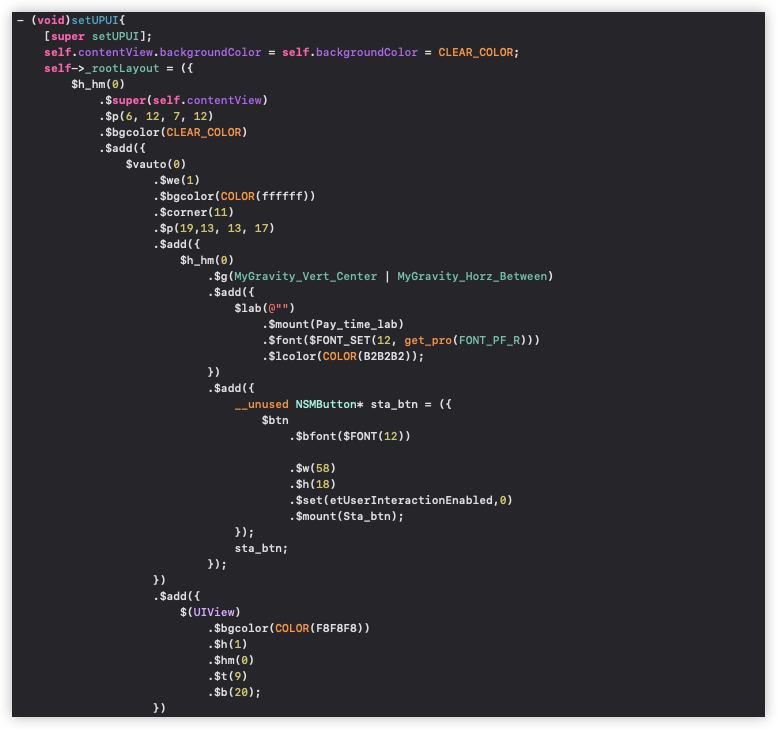
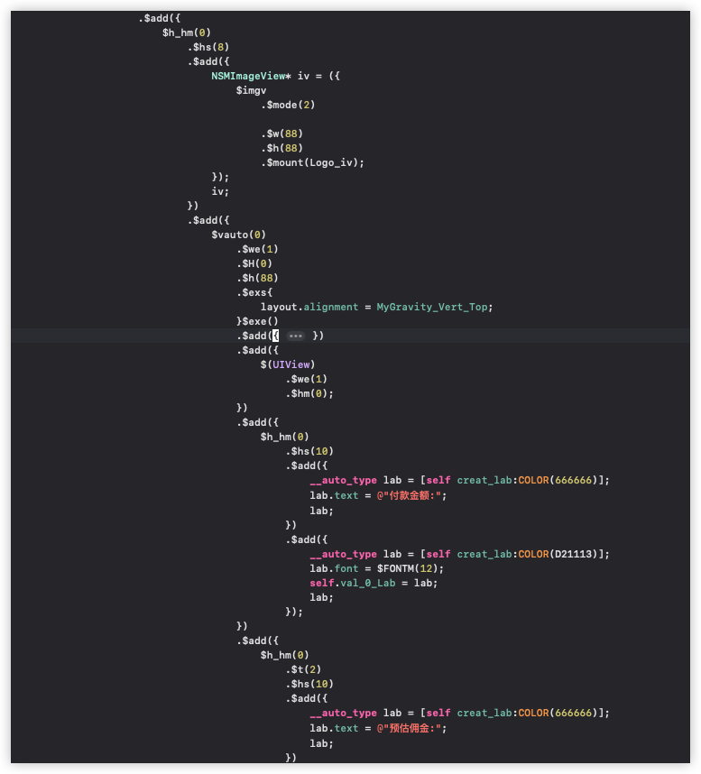
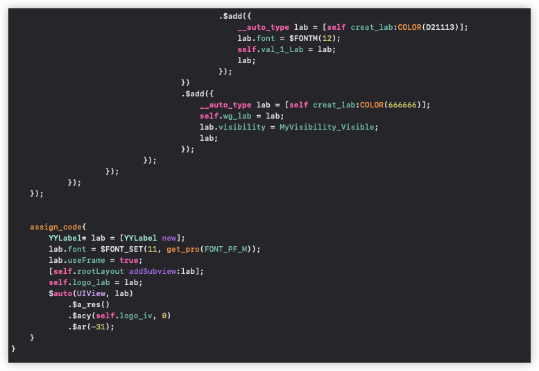

> 这个不是OC中的block, 这些只是用法的一部分, 实现是基于macro, 依赖MyLayout, 也有一部分是系统原生的AutoLayout. 该实现从编码方式上和以前完全不同, 这种相当于是使用宏自定义了自己的流程语言. 后续就是要在swift中往这个方向迈进 

### builder的概念[^ann-result-builder]
`swift5.4`中引入了结果构造器, 它旨在swift中定义DSL[^ann-dsl]语言. 这里简单提一下: 定义一个语言并不是说写一个语言解释器, 然后将这个语言解释器交给swift编译器去调用. 事实是swift编译器将语言中最核心的 <font color = red>顺序, 条件, 循环</font>抽象了出来, 这种抽象的实现机制就是回调函数. 具体来说swift识别用户书写的代码, 如果这些代码是顺序执行的部分, 则将这些执行的结果整合在一起通过函数回调给用户.  条件和循环也是这样一个过程, 只不过回调的函数不一样. 在这个过程中:
1. swift是桥梁
2. 自定义的DSL其实本质还是swift表达式语句, 并不是真正的在定义一个新的语言. 但从逻辑上来看确实是在自定义顺序,条件, 循环
3. 用户要开启DSL功能, 目的是告诉swift, 下面要书写的代码是自定义的, 请帮我将顺序, 条件, 循环的部分整合出来

至于编译器是怎么充当这个桥梁的, 需要进入到builder的使用, 并且明白这个过程是非常重要的. 现在还不确切知道编译器在这个过程的工作细节, 但笔者认为可以先提出问题! 因为现在有目标: 要自定义顺序, 条件, 循环! 所以问swift:
1. 你怎么识别我写的代码是顺序的? 条件的? 循环的? 
2. 你识别了顺序,条件,循环的这些代码后, 只是单纯的swift语句, 怎么才算是我实现自定义? 
3. 即使我确实是在逻辑上自定义语言, 我的最终输出结果怎么得到?
4. 你怎么知道哪一块代码是DSL?(<font color = red>即DSL范围</font>)

笔者现在问了swift四个问题, 实际是向编译器作者提了4个问题.编译器作者然后根据这4个问题来修改swift本身, 让它具备识别顺序,条件,循环的功能, 并能和自定义的用户进行交互. 


### DSL入门
swift作者以协议的形式实现了DSL的功能流程, 所以基于已经实现好的swift, 便有了规定:
1. 使用`@resultBuilder`修饰enum, struct, class实现协议方法, 这些方法是顺序, 条件,循环的识别回调
2. 将实现协议的实体修饰给函数类型, swift便在该函数中启用DSL
    1. 函数
    2. 方法
    3. 计算属性的getter
    4. 下标的getter
    4. lambda

以顺序执行为例: 

```swift
@resultBuilder          // __code_register_builder
struct Builder {

    // __code_seq_cbk
    static func buildBlock(_ values: String...) -> String {
        values.joined()
    }
}


@Builder                // __code_modification
func build() -> String{
    "<"                 // __code_1
    "p"                 // __code_2
    ">"                 // __code_3
    "这是一个p标签"     // __code_4
    "<"                 // __code_5
    "/"                 // __code_6
    "p"                 // __code_7
    ">"                 // __code_8
}
print(build())          // <p>这是一个p标签</p>
```

代码流程:
1. `__code_regsiter_builder`: 注册DSL的回调, 这里使用struct Builder来实现协议方法
2. `__code_seq_cbk`: 注册顺序执行的回调函数
3. `__code_modification`: 启动DSL域, 即告诉编译器在build函数内部是自定义语言, 这对build函数有2点限制:
    - build内部的表达式返回值必须和buildBlock函数的参数类型是一致的, 这里是参数是`String...`, 所以表达式返回值也必须是String
    - build函数返回值必须和回调函数buildBlock一样是String
4. `__code_N`: 顺序书写的swift表达式, 每条表达式都返回了String, 这些返回值将被swift收集起来
5. 当build函数结束前, swift会将收集的8个表达式的结果整合成`String...`传递给buildBlock函数, 并将该函数的结果作为build函数的返回值
    - 这也是为什么build的函数返回值要和buildBlock保持一致的原因

> 开发中一般使用一个空枚举来定义DSL的回调函数, 这种枚举不允许创建对象, 所以相当于容器

上述代码相当于下面这张图:

--- 

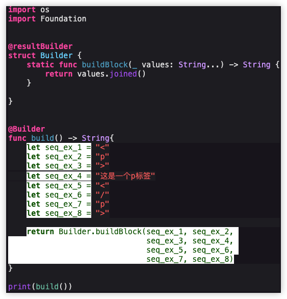

<a id="link-elephant"></a>

swift收集了每个表达式的结果, 然后创建了临时对象, 最后在函数返回前调用Builder.buildBlock. 这个过程看起来和自定义语言没任何关系! 来举一个案例: <font color = red>将大象放进冰箱</font>! 这是一个业务问题, 总共分3步:
1. 打开冰箱
2. 把大象放进去
3. 关闭冰箱

所有的编程语言(<font color = red>OOP</font>)都可以实现这个业务, 在swift中:

```swift
print("打开冰箱")
print("把大象放进冰箱")
print("关闭冰箱")
```

如果使用builder则变成了:

```swift
@resultBuilder
struct Builder {
    static func buildBlock(_ values: String){
        values.forEach {print($0)}
    }
}

@Builder
func build(){
    "打开冰箱"
    "把大象放进冰箱"
    "关闭冰箱"
}
```

从语法形式来看, 书写的格式只是写了3个字符串就实现了业务功能(打印), 所以可以看作是逻辑上的自定义


### buildBlock
前一小节的buildBlock是resultBuilder机制中必须实现的回调函数

```swift
static func buildBlock(_ component: ()) -> Result {} 
```

笔者对它的总结:
1. DSL域中的每个表达式会被赋值给临时对象
2. 在DSL结束前swift将收集到的这些临时对象整合成数组传递给该回调函数
3. 参数类型决定了DSL域中表达式返回的类型
4. 返回类型决定了DSL最终的返回值(<font color = red>未实现finalResult的情况</font>)
5. 可以使用泛型
6. 可以重载

```swift
@resultBuilder
struct Builder {
    static func buildBlock<T>(_ values: T...) -> String{
        values.description
    }
}

@Builder
func build() -> String{
    "<"
    "p"
    ">"
    "这是一个p标签"
    "<"
    "/"
    "p"
    ">"
}

print(build()) 
```

回调函数的参数类型是`T...`, 表示所有表达式的值必须为一种类型: 如全是Int, 或全是String等. 对于如下这种传递:

```swift

@Builder
func build() -> String{
    2               // error 2不是String类型
    "p"
    ">"
    "这是一个p标签"
    "<"
    "/"
    "p"
    ">"
} 
```
由于swift收集的结果中String的数量较多, 所以swift给出的报错体现在第1个整数2(<font color = red>2不是String类型</font>), 即swift认为T的类型是String, 数值2不是String. 但如下面这种调用:

```swift
@Builder
func build() -> String{
    2
    "p"             // error "p"不是整型
    ">"             // error ">"不是整型
    5
    5
    5
} 
```
即当前传递的整型数量较多, swift判断T的类型是整型, 所以表达式结果为String的将直接报错.  即使buildBlock可以重载, 但它所表示的意义可能并不是想要的

```swift
@resultBuilder
struct Builder {
    static func buildBlock(_ values: String...) -> String{
        return values.description
    }
    static func buildBlock(_ values: Int...) -> String{
        return values.description
    }
}


@Builder
func build(){
    "hello"
    20          
}
```

首先重载了buildBlock回调函数, 一个接收`String...` 一个接收`Int...`, 然后在DSL域(<font color = red>build函数</font>)中, 书写了2个表达式, 一个返回String, 一个返回Int, 编译器直接报错: <font color = red>找不到匹配的函数</font>, 因为收集的表达式结果不是统一的类型


<a id="link-demo-sql"></a>

### buildBlock案例
这里给出一个场景: 定义一个简单的SQL语句实现

> <font color = red>SELECT id frome user where id=20</font>

```swift
import os
import Foundation

protocol sql: CustomStringConvertible{}
extension sql { var description: String {"\(Self.self)".replacing("_", with: "")}}

protocol sql_literal: sql{}
protocol sql_variable<T>: sql where T: CustomStringConvertible{
    associatedtype T
    var variable: T {get set}
    init(_ value:() -> T)
}
extension sql_variable{
    var description: String {
        self.variable.description
    }
}


struct _SELECT_: sql_literal {}
struct _FROM_: sql_literal{}
struct _WHERE_: sql_literal{}
struct _AND_: sql_literal{}

struct _FIELD_: sql_variable {
    var variable: String = "*"
    init(_ value: () -> T) {
        variable = value()
    }
}

struct _VALUE_<E>: sql_variable where E: CustomStringConvertible{
    typealias T = E

    var variable: T

    init(_ value:() -> T) {
        variable = value()
    }
}

var SELECT  = _SELECT_()
var FROM    = _FROM_()
var WHERE   = _WHERE_()
var AND     = _AND_()

typealias FIELD     = _FIELD_
typealias TABLE     = _FIELD_
typealias VALUE     = _VALUE_
typealias CONDITION = _FIELD_

func ==<V> (_ field: FIELD, _ value: VALUE<V>) -> sql {
    CONDITION {field.description + "=" + value.description}
}

// 系统的 << 没有结合性, 这里添加一个左结合
precedencegroup M{
    assignment: true
    associativity: left
}
infix operator << : M

private func << (_ field: FIELD, _ other: @autoclosure () -> String) -> FIELD {
    FIELD {field.description + "," + other()}
}

@resultBuilder
struct Builder {
    static func buildBlock(_ values: sql...) -> String{
        return values.map(\.description).joined(separator:" ")
    }
}

@Builder
func build() -> String{
    SELECT

    FIELD { "id" }  << "name" << "age" << "city"

    FROM

    TABLE {"user"}

    WHERE

    FIELD {"city"} == VALUE {"北京"}

    AND

    FIELD {"age"} == VALUE {18}
}

print(build())      // SELECT id,name,age,city FROM user WHERE city=北京 AND age=18
```

1. demo中定义了sql的协议, 是一个模块的基协议. 遵循该协议的将会转变自己为字符串, 如`_SELECT_`将自己转换成`SELECT`, 它是sql中的关键字
2. 定义了sql中关键字的协议`sql_literal`, 所有sql的关键字将遵循它, 可以得到它们在sql中的字符串字面值
3. 定义了sql中变量的协议`sql_variable`,  它的任务是将在swift中存储sql语句中的变量部分
4. 定义各种select中要用到的部分关键字
    - select 
    - from 
    - where 
    - and
5. 为了做的像select, 笔者定义的类型是带下划线的, 然后再定义一个对应全局的只读对象, 目的是为了省去括号
6. 对于field部分重载了`<<`操作符, 第2个参数表示要搜索的字段. 
    - <font color = red>由于系统的`<<`没有结合性, 这里添加了左结合以保证可以不断连续使用它</font>
7. 对于where部分重载了`==`操作符, 是为了连接各种查询的条件

案例的缺点:
1. 做的足够简单, 没有将变量的部分以参数的形式传入
2. 为了做的像select, 额外定义了类型. 但这在swift中来说是必不可少的
3. where条件这里只定义了一个`==`, 事实上一个完整的select, where语句中有很多条件

> 这些缺点严格来说是可以慢慢实现的, 前提是得对select的语句十分精通, 同时封装成框架还要考虑效率, 可扩展性, 易用性等等


### 表达式不同类型
通过buildBlock的简单使用不难发现, 所有的表达式其实被无形限制了(<font color = red>被buildBlock的参数类型限制</font>), 这实际上就像笔者最开始所说, 不能在表达式之间插入无关的语句. 为了解决这种问题, swift给出的解决方案: 使用`buildExpression`对表达式先进行类型转换, 然后交给buildBlock函数

```swift
@resultBuilder
struct Builder {
    static func buildBlock(_ components: String...) -> String {
        components.joined(separator: "\n")
    }

    // 限制了DSL表达式中返回值, 但自己返回的类型必须和 buildBlock的String...对应上
    static func buildExpression(_ expression: Int) -> String {
        "0x" + String(expression, radix: 16)
    }
}

@Builder
func test() -> String{  // test函数的返回值要和buildBlock的返回值一样
    2024        // like: Builder.buildExpression(2024)
    10
    20
}
print(test()) 
```

demo中实现了另一个回调函数, 它被调用的优先级比buildBlock高, 表达式的返回值不再被buildBlock参数类型的限制, 而被buildExpression参数类型限制, 但被buildExperssion处理过后返回的类型必须为buildBlock函数参数的类型

### buildExpression的案例
这里做一个简单的录入信息

```swift
struct Human: CustomStringConvertible{
    var name: String = ""
    var age : UInt8 = 0
    var bir : String = ""
    var description: String {
        "(name:\(name), age: \(age), bir: \(bir))"
    }
}
struct Next{
    init(_ cbk: ()->String){
        print(cbk())
    }
}

@resultBuilder
struct Builder {
    static func buildBlock(_ components: Human?...) -> String {
        components.filter{$0 != nil}.map {$0!.description}.joined(separator: "\n")
    }
    static func buildExpression(_ expression: (name: String, age: UInt8, bir: String)) -> Human? {
        Human(name: expression.name, age: expression.age, bir: expression.bir)
    }
    static func buildExpression(_ expression: Next) -> Human? {
        nil
    }
}


let BUF_SIZE = 1024
var buf: UnsafeMutablePointer<CChar>! = UnsafeMutablePointer<CChar>.allocate(capacity: BUF_SIZE)
if buf == nil {
    fatalError("no memmory")
}
var buf_ptr = withUnsafeMutablePointer(to: &buf){$0}
var size = BUF_SIZE

func get_line(_ remind: String) -> String{
    print("\(remind):\n",terminator: "")
    // 返回读取内容的长度, 在测试中键入的内容是不会超过size的, 所以这里可以
    //  确定len是有效的
    let len = os.getline(buf_ptr, &size, os.stdin)
    if 0 >  len {
        os.perror("getline")
        os.exit(-1)
    }
    // 读取到eof, 当是标准输入时键入了 Ctrl+D后再键入Enter
    if 0 == len {
        os.exit(-1);
    }
    // getline会读取换行符, 这里去掉换行符
    buf!.advanced(by: len - 1).pointee = 0
    return String(cString: buf!)
}

let Name = {
    (arg: () -> String) -> String in
    get_line(arg())
}

let Age = {
    (arg: () -> String) -> UInt8 in
    UInt8(get_line(arg()))!
}
let Bir = Name


@Builder
func build() -> String{
    // (String, UInt8, String)
    (Name{"请输入姓名"},     Age {"请输入年龄"},  Bir {"请输入生日"})

    // (Next)
    Next {"**********************"}

    (Name{"请输入姓名"},     Age {"请输入年龄"},  Bir {"请输入生日"})
}

print(build())

buf.deallocate() 
```


### 修改返回类型
在builder机制里允许DSL的返回类型和buildBlock的返回类型不一致, 但要实现另一个回调函数<font color = red>buildFinalResult</font>, 它同时限制了:
1. DSL的返回类型必须和该函数的返回类型一致
2. buildBlock的返回类型必须和该函数的参数的类型一致

```swift
protocol 名: CustomStringConvertible {}
extension 名 {
    var description: String {
        "\(Self.self)"
    }
}

struct 铁矿: 名{
    init(_ 采矿: String){
        print("采矿得到:\(self)")
    }
}
struct 生铁: 名{
    init(_ 冶炼: 铁矿){
        print("冶炼:\(冶炼)")
    }
}
struct 钢: 名{
    init(_ 锻烧精炼: 生铁){
        print("锻烧精炼:\(锻烧精炼)")
    }
}

@resultBuilder
struct Builder {
    static func buildExpression(_ 采矿: String) -> 铁矿 {
        铁矿(采矿)
    }

    static func buildBlock(_ 所有铁矿: 铁矿...) -> [生铁] {
        所有铁矿.map { 生铁($0)}
    }

    static func buildFinalResult(_ 所有生铁: [生铁]) -> [钢] {
        所有生铁.map { 钢($0)}
    }
}


@Builder
func build() -> [钢]{   // 返回类型被 buildFinalResult限制
    "矿区采矿"      // 表达式的类型被 buildExpression限制
}

print(build()) 

#if false

采矿得到:铁矿
冶炼:铁矿
锻烧精炼:生铁
[钢]

#endif
```

这个demo体现了这3个函数的执行优先级, 就像炼铁的工序一样, 先调用的函数将结果交给下一个被调用的函数


### 依次回调每个表达式
buildBlock的机制是在函数返回前一次性将参数包装成`T...`被调用, swift还提供了2个回调函数来依次回调:

```swift
static func buildPartialBlock(first: T) -> T {}
static func buildPartialBlock(accumulated: T, next: T) -> T {} 
```

这两个函数的调用流程如下:

```swift
// 类型是Int

func build() -> Int {
    8
    7
    6
}

// 相当于
func build() -> Int {
    let tmp_local_0 = buildPartialBlock(first: 8)
    let tmp_local_1 = buildPartialBlock(accumulated: tmp_local_0, next: 7)
    let tmp_local_2 = buildPartialBlock(accumulated: tmp_local_1, next: 6)
    return tmp_local_2
}
func build()
```

这两个函数所影响的build的表达式类型比较复杂, 为了说明这个细节, 笔者这里定义几个名词:
1. TFirst: 表示first的类型
2. R1: 表示第1个函数的返回类型
3. TAccu: 表示accumulated的类型
4. TNext: 表示next的类型
5. R2: 表示第2个函数的返回类型

因为:
1. TAccu依赖于R1: swift回调第1个表达式得到的R1传递给第2个TAccu
2. TAccu依赖于R2, swift回调第2个, 第3个, 第4个, ... 表达式得到R2在下次传递给TAccu

所以结论:

1. `R1 == TAccu == R2`
2. TFirst任意类型, 至于它要不要转换为R1, 取决于第1个函数的实现
3. TNext任意类型, 至于它要不要转换为R2, 取决于第2个函数的实现
4. DSL函数的返回值必须和第2个函数的返回值保持一致


```swift
@resultBuilder
enum Builder{
    static func buildPartialBlock(first: String) -> Int {
        print("block first:\(first.self)")
        return Int(first)!
    }

    static func buildPartialBlock(accumulated: Int, next: String) -> Int {
        print("block next:<\(accumulated.self), \(next.self)>")
        return accumulated
    }
}

@Builder
@discardableResult func build() -> Int{
    "123"       // tmp_0 = (String) -> Int
    "hell"      // (Int, String) -> Int ===> tmp_1 = (tmp_0, "hell") -> Int
    3           // (Int, String) -> Int ===> tmp_2 = (tmp_1, 3) -> Int
                // 报错, 因为3不是String
} 
```

### 任意表达式类型
在只使用buildBlock回调函数时, 表达式的类型受到该函数参数类型的限制, 所有的表达式类型必须一致. 对于buildPartialBlock的定义可以指定泛型, 这样可以实现表达式的返回值是任意类型, 但是返回值类型必须为最后一条表达式的类型

```swift 
@resultBuilder
enum Builder{
    static func buildPartialBlock<T1>(first: T1) -> T1 {
        return first
    }

    static func buildPartialBlock<T2, T3>(accumulated: T2, next: T3) -> T3 {
        return next
    }
}
@Builder
@discardableResult func build() -> String{
    1 + 2 + 3
    "hello " + "nice " + "to " + "meet " + "u"
    (name: "tierry", age: 20)
    [2, "ehllo", (2, "jerry")] as [Any]
    ["name": "tom", "age": 20] as [String : Any]
    "return"
}
```

buildPartialBlock使用了泛型, 所以当产生调用时:
1. 第1次产生调用时: T1的类型是表达式`1 + 2 + 3`类型, 最后返回T1是Int
3. 第2次产生调用时: T2的类型被确定为Int, T3的类型是String, 返回T3是String
3. 第3次产生调用时: T2的类型被确定为String, T3的类型是Tuple, 返回T3是Tuple
4. 第4次产生调用时: T2的类型被确定为Tuple, T3的类型是Array, 返回T3是Array
5. 第5次产生调用时: T2的类型被确定为Array, T3的类型是Map, 返回T3是Map
6. 第6次产生调用时: T2的类型被确定为Map, T3的类型是String, 返回T3是String
7. 最终build函数返回的类型必须是最后一条表达式的类型

其实这种现象的原理就是:buildPartialBlock每次调用是独立的, 每次调用时, 泛型参数是独立的, 和上一次被调用时所传递的泛型参数没有任何关系. 根据这个机制, 可以直接修改前面的[sql案例](#link-demo-sql)

```swift
@resultBuilder
enum Builder{
    static func buildPartialBlock<T1>(first: T1) -> T1 {
        return first
    }

    static func buildPartialBlock<T2, T3>(accumulated: T2, next: T3) -> String {
        return "\(accumulated) \(next)"
    }
}
@Builder
@discardableResult func build() -> String{  // 返回值要和最后一条语句一致
    "SELECT"
    "*"
    "FROM"
    "user"
    "WHERE"
    "id = \(3)"
} 
```

这个demo相对来说就简洁多了


### 单个if的自定义
通过DSL顺序执行的机制, 目前已经清楚了builder的基本原理, 但实际自定义的语言中条件执行是必不可少的. 为了理解条件实现的流程细节, 笔者先从单个if开始探究. 如果在DSL中书写了一个单独的if语句, 则必须实现如下回调:
```swift
static func buildOptional(_ component: T?) -> R
```

> 返回值的类型由用户自己定义, 也可能返回可选

单个if语句块一定回调该函数. 只是传递的参数可能为nil:
1. 当if的条件为false时, swift直接回调该函数并传递nil
2. 当if的条件为true时,  swift的机制是:
    1. if条件中的每个表达式赋值到临时对象
    2. if语句块结束前, 调用buildBlock函数, 将收集到的所有临时对象传递进去
    3. 获取buildBlock的返回值, 并调用buildOptional, 参数为buildBlock的返回值
3. 将buildOptional的返回值赋值给临时对象tmp1
4. 最终tmp1会被收集在外层的临时对象集合中, 在DSL域结束前调用buildBlock函数用到它

以下面的demo来实, 共产生了2次buildBlock的调用


```swift
extension Optional {
    var ok: Bool {self != nil}
}

@resultBuilder
enum Builder{
    static func buildBlock(_ components: String? ...) -> String {
        (components.filter(\.ok) as! [String]).joined(separator: " ")
    }
    static func buildOptional(_ component: String?) -> String? {
        component
    }
}

@Builder
func build(_ flag: Bool) -> String{
    "tierry"        
    "is"            
    "work"          
    if flag {       
        "in"        
        "hubei"     
    }
}
print(build(true))  // tierry is work in hubei
```

该函数的调用类似下图:

---

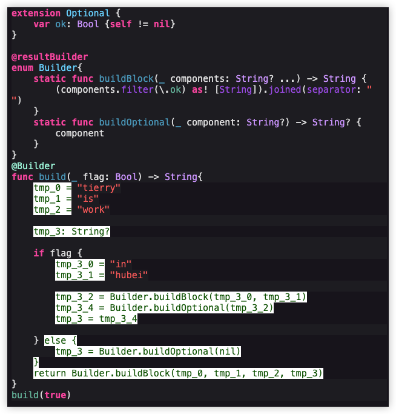

> 白色的部分相当于编译器添加的代码


swift在收集了if条件中的结果后, 是直接调用buildBlock函数, 并不会先调用buildExpression:

```swift
// 在Builder中添加buildExperssion的回调
@resultBuilder
enum Builder{
    ...

    static func buildExpression(_ expression: String...) -> String {
        expression.first!
    }
}

@Builder
func build(_ flag: Bool) -> String{
    "tierry"        // tmp_0 = buildExpression("tierry")
    "is"            // tmp_1 = buildExpression("is")
    "work"          // tmp_2 = buildExpression("work")

    // tmp_3: String?
    if flag {
        "in"        // tmp_3_0 = buildExpression("in")
        "hubei"     // tmp_3_1 = buildExpression("hubei")
                    // tmp_3_2 = buildBlock(tmp_3_0, tmp_3_1)
                    // tmp_3   = buildOptional(tmp_3_2)
    }   // __code 

    // else {
    //      tmp_3 = buildOptional(nil)
    // }
} 
```

> 在`__code`这里, swift并不会再次将`tmp_3`传递给buildExpression, 而是直接调用buildBlock.

从测试的过程可以发现, swift并不要求用户明确写出else的子语句, 但幕后处理时, swift会自动生成buildOptional(nil)的调用. 笔者认为生成else的语句其实不是必须的(<font color = red>用户在DSL中只写一个if的背后逻辑是else不做任何处理, 所以从这一点看笔者认为没有必要做这一步的操作</font>). 但SwiftUI需要这样的默认处理, 它需要在默认else的情况下生成View以使幕后的视图层级相对来说是稳定的(<font color = red>后续会详细学习</font>), 这样的目的是提高渲染的性能 


### 有else的分支
当用户明确写出了else语句:
1. `if--else`
2. `if--else if--else if -- ... --else`: 无限嵌套
3. `switch case`

swift给出了2个回调函数来处理有else的所有情况

```swift
// 第1个if成立时被回调
//  所有if系列处理完毕后, 在逻辑上相当于还有
//      一个else没处理, 编译器会再次调用first
static func buildEither(first component: String) -> String {
    component
}

// 其他书写的条件语句来这里
static func buildEither(second component: String) -> String {
    component
} 
```

first有2种调用时机:
1. 第1个if成立时
2. 默认的else处理

```swift
@resultBuilder
enum Builder{
    static func buildEither(first component: String) -> String {
        print("first")
        return component
    }
    
    static func buildEither(second component: String) -> String {
        print("second")
        return component
    }
    static func buildBlock(_ components: String? ...) -> String {
        print("block")
        return (components.filter(\.ok) as! [String]).joined(separator: " ")
    }

    static func buildOptional(_ component: String?) -> String? {
        print("optional")
        return component
    }
}

@Builder
func build(_ flag: Int) -> String{
    if flag == 0{
        "1"                     // tmp_0 = block("1") --> tmp_0 = first(tmp_0)
    }else if flag == 1 {
        "2"                     // tmp_0 = block("2") --> tmp_0 = first(tmp_0)
    }else{
        "3"                     // tmp_0 = block("3") --> tmp_0 = first(tmp_0)
    }
                                // 上述只有1个会成立, 所以在逻辑上相当于还有一个else未处理, 
                                // 类比buildOptional, 编译器会默认添加一个调用, 但这个调用函数为: first,
                                //  即使定义了buildOptional也是回调first
                                // tmp_0 = first(tmp_0)
                                //  所以first被回调了2次
    //return block(tmp_0)
}
print(build(0)) 
#if false
block
first
first
block
1
#endif


print(build(1))
#if false
block
second
first
block
2
#endif

print(build(3))
#if false
block
second
first
block
3
#endif
```

> switch的分支语句本质和if是一样的

### 没有else的分支
当书写的格式中没有else时:
1. 单个if
2. `if--else if-- ... --else if`

这个时候必须给出buildOptional的自定义, 在逻辑上未处理的else将回调到buildOptional

```swift
@resultBuilder
enum Builder{
    static func buildEither(first component: String) -> String {
        print("first")
        return component
    }
    
    static func buildEither(second component: String) -> String {
        print("second")
        return component
    }
    static func buildBlock(_ components: String? ...) -> String {
        print("block")
        return (components.filter(\.ok) as! [String]).joined(separator: " ")
    }

    static func buildOptional(_ component: String?) -> String? {
        print("optional")
        return component
    }
}

@Builder
func build(_ flag: Int) -> String{
    if flag == 0{
        "1"
    }else if flag == 1 {
        "2"
    }
}
print(build(1)) 

#if false
block
second
optional
block
2
#endif
```

> 当用户书写出`else if`的分支时, 也必须同时提供`second`的回调

### 版本限制下的if
在iOS的开发中常常一些API可能不适用于低版本的环境中, 通常会在代码中作版本判断:`if #avaiable(iOS 15, *)` 表示在`iOS 15` 以后可用, 如下面的测试:

```swift
@available(macOS 18, *)
struct Str: CustomStringConvertible{
    var description: String{
        "he"
    }
}

print(Str())        // __code_error


if #available(macOS 18, *) {    
    print(Str())
} else {
    // Fallback on earlier versions     // __code_exec
}
```

测试时笔者系统版本是`MacOS 15.0.1`, 代码中的`__code_error`将会在编译期直接报错, 将`__code_error`注释, 然后测试, 最终代码if进入了`__code_exec`. 如果要在DSL中书写出这样的单个if语句, swift是这样的处理流程:
1. 如果未实现buildLimitedAvailiablity时, 处理流程和单个if的过程一样
    - block
    - optional
    - block
2. 若1不成立 并且 if 不成立:
    - optional
    - block
3. 若1不成立 并且 if 成立:
    - block
    - availability
    - optional
    - block


```swift
extension Optional {
    var ok: Bool {self != nil}
}


@resultBuilder
enum Builder{
    static func buildEither(first component: String) -> String {
        print("first")
        return component
    }
    
    static func buildEither(second component: String) -> String {
        print("second")
        return component
    }
    static func buildBlock(_ components: String? ...) -> String {
        print("block")
        return (components.filter(\.ok) as! [String]).joined(separator: " ")
    }

    static func buildOptional(_ component: String?) -> String? {
        print("optional")
        return component
    }

    static func buildLimitedAvailability(_ component: String) -> String {
        print("availiablity")
        return component
    }
}

@Builder
func build() -> String{
    if #available(macOS 15, *) {
        "1"         // tmp_0 = block("1") 
                    // tmp_0 = availability(tmp_0) 
    }               
    // else {
    //      tmp_0 = optional(tmp_0)
    // }

    // return block(tmp_0)
}
print(build())     // 对应第3条
```

如果用户明确书写了`else`:

```swift
@Builder
func build2() -> String{
    if #available(macOS 15, *) {
        "1"         // tmp_0 = block("1")
                    // tmp_0 = availability(tmp_0)
    }else {
        "2"
    }

    // else {
    //      tmp_0 = first(tmp_0)
    // }

    // return block(tmp_0)
}
print(build())
```

### 嵌套的条件语句
当在DSL书写过多的嵌套条件时, swift的处理逻辑没有变. swift会以堆栈的形式尝试分解所有的条件语句, 从最里层往外依次回调

```swift
@resultBuilder
enum Builder{
    static func buildBlock(_ components: String ...) -> String {
        print("block")
        return components.joined(separator: " ")
    }

    static func buildOptional(_ component: String?) -> String {
        print("optional")
        return component ?? "nil"
    }

}

@Builder
func build(_ num: Int) -> String{  // num = 3
    if num > 0 {            // true
        
        if num > 5 {        // false
            "5"             
        }                   // tmp_0 = optional(nil) = "nil"

        if num > 2 {        // true
            "2"             // tmp_1 = block("2") = "2"
                            // tmp_1 = optional(tmp_1) = "2"
        }                   

        //  此刻整个if的代码相当于
        //      if num > 0 {
        //          tmp_0 = "nil"
        //          tmp_1 = "2"
        //      }
        //  即已经回调产生了 tmp_1, 要跳出 if num > 0 的作用域了, 所以在跳出之前:
        //      tmp_2 = block("nil", "2") = "nil 2"
        //      tmp_2 = optional(tmp_2) = "nil 2"
        //  最后出了作用域, 整个函数中的if完毕, 要再将次所有的结果交给block:
        //      return block(tmp_2)   "nil 2"
    }
}
```

### 局部作用域
在DSL中书写的代码如果是在作用域中, 也会导致回调的顺序发生改变.

```swift
@resultBuilder
enum Builder{
    static func buildBlock(_ components: String ...) -> String {
        print("block")
        return components.joined(separator: " ")
    }

    static func buildOptional(_ component: String?) -> String {
        print("optional")
        return component ?? "nil"
    }

}

@Builder
func build() -> String{
    do {
        "2"     // tmp_0 = block("2")
    }           

    // 将结束函数, 将收集到的所有临时对象交给block
    return block(tmp_0)
}

@Builder
func build2() -> String{
    do {
        if true {
            "2"     // tmp_0 = block("2")
        }           // tmp_0 = optional(tmp_0)

        // tmp_0 = block(tmp_0)
    }

    // return block(tmp_0)
}


@Builder
func build3(_ num: Int) -> String{  // num == 3
    if num > 0 {            // true

        do {
            if num > 5 {    // false
                "5"     
            }               // tmp_0 = optional(nil) = "nil"

            if num > 2 {    // true
                "2"         // tmp_1 = block("2")
                            // tmp_1 = optional(tmp_1)
            }

            tmp_2 = block(tmp_0, tmp_1) = "nil 2"
        }
        tmp_3 = block(tmp_2) = "nil 2"
        tmp_4 = optional(tmp_3) = "nil 2"
    }

    return block(tmp_4)
}
```


### 循环自定义
swift中的循环格式有多种, 但在DSL中只允许for循环格式的存在. 

```swift
@resultBuilder
enum Builder{
    static func buildBlock(_ components: String ...) -> String {
        print("block")
        return components.joined(separator: " ")
    }

    static func buildExpression(_ expression: Int) -> String {
        print("expression")
        return String(expression)
    }

    static func buildArray(_ components: [String]) -> String {
        print("array")
        return components.joined(separator: "-")
    }
}

@Builder
func build2(_ num: Int) -> String{
    for i in 0...num {
        i   
            // 0:  tmp_0 = expression(0)
            //     tmp_0 = block(tmp_0)

            // 1:  tmp_1 = expression(1)
            //     tmp_1 = block(tmp_1)

            // 2:  tmp_2 = expression(2)
            //     tmp_2 = block(tmp_2)

            // 3:  tmp_3 = expression(3)
            //     tmp_3 = block(tmp_3)

        // array即将结束, 这一点和条件不一样, swift优先调用array, 传递的参数是数组, 并不是可变参数
        //  tmp = array([tmp_0, tmp_1, tmp_2, tmp_3])
    }

    return block(tmp)
}

print(build2(3)) 
```


### 嵌套循环
当出现嵌套循环时, <font color = red>swift的作法是先计算最内层的循环, 再往外整合</font>

```swift
@resultBuilder
enum Builder{
    static func buildBlock(_ components: String ...) -> String {
        print("block")
        return components.joined(separator: " ")
    }

    static func buildExpression(_ expression: Int) -> String {
        String(expression)
    }

    static func buildArray(_ components: [String]) -> String {
        print("array")
        return components.joined(separator: "-")
    }
}

@Builder
func build2(_ num: Int) -> String{  // num = 3
    for i in 1...num {      
        i                           // __code_i
        for j in 1 ... 2 {
            j                       // __code_j
        }

                                    // i: 1
                                    //  __code_j:   tmp_j_1 = block(1) = "1"
                                    //              tmp_j_2 = block(2) = "2"
                                    //              tmp_j   = array([tmp_j_1, tmp_j_2]) = "1-2"
                                    //  出第2层for作用域后
                                    //              tmp_1 = block(i, tmp_j) = "1 1-2"

                                    // i: 2
                                    //  __code_j:   tmp_j_1 = block(1) = "1"
                                    //              tmp_j_2 = block(2) = "2"
                                    //              tmp_j   = array([tmp_j_1, tmp_j_2]) = "1-2"
                                    //  出第2层for作用域后
                                    //              tmp_2 = block(i, tmp_j) = "2 1-2"
                                    

                                    // i: 3
                                    //  __code_j:   tmp_j_1 = block(1) = "1"
                                    //              tmp_j_2 = block(2) = "2"
                                    //              tmp_j   = array([tmp_j_1, tmp_j_2]) = "1-2"
                                    //  出第2层for作用域后
                                    //              tmp_3 = block(i, tmp_j) = "3 1-2"


                                    // 即将出第1层for, 调用array
                                    //  tmp_4 = array([tmp_1, tmp_2, tmp_3) = "1 1-2-2 1-2-3 1-2"
    }

    // return block(tmp_4)
}

print(build2(3)) 
```

### 声明式编程
在编程领域常常听到指令式编程和声明式编程2种概念. 直观上来看这2种编程模式存在于代码形式上, [大象放进冰箱](#link-elephant)中, 使用了DSL自定义, 在书写形式上只关注了这个业务的3个功能, 所以直接顺序写出了3个字符串. 若以指令式来实现, 大致是:

```swift
// 大象
struct Elephant {}

// 冰箱
struct Refrigerator{
    func open(){print("打开冰箱")}
    func input(e:inout Elephant){print("把大象放进冰箱")}
    func close(){print("关闭冰箱")}
}

// 定义一个大象
var e = Elephant()

// 定义一个冰箱
let r = Refrigerator() 

// 打开冰箱
r.open()

// 将大象放进冰箱
r.input(e: &e)

// 关闭冰箱
r.close()
```

使用DSL就会简化这个过程, 大象放冰箱的DSL就相当于声明式编程的思想. 所谓声明式编程原则上只关注业务功能的结果, 不追求实现细节, 这个细节由专门的框架来实现. 如SwiftUI框架, 它使用DSL简化了苹果环境下UI布局的开发, 用户只需要告诉SwiftUI需要什么布局控件, 不需要刻意指定排版, 位置, 尺寸等等, 这些状态由SwiftUI自行管理. 所以使用SwiftUI的过程本身就是定制组合布局控件的过程. 


### SwiftUI的原理(<font color = red>简介</font>)
SwiftUI是苹果新的UI框架, 它使用swift语法编写, 目标是为了取代UIKit[^ann-uikit]. SwiftUI使用起来比较简洁, 它是典型的声明式语法(<font color = red>DSL</font>), 通过`@ViewBuilder`将结果构造为视图层级结构, 即用户在DSL中书写的语句会被它整合成特定高效的视图结构, 这个结构由SwiftUI在幕后维护. 关于它具体的实现将在SwiftUI的章节中详细探究


### 终止DSL
在DSL域中整个过程由swift来主导, 正常情况下必须执行完整个DSL域后才被block返回(<font color = red>未实现finalResult</font>), 即用户没有明确指定return语句. 但是当指定return语句后除了返回当前函数外, 也表示终止DSL

```swift
@resultBuilder
enum Builder {
    static func buildBlock(_ components: Int...) -> Int {
        2
    }
}


@Builder
func test(flag: Bool) -> Int{
    // 指定了if语句, 但同时指定了return语句,
    //  所以即使Builder中未实现 buildOptional的回调函数也不会报错,
    //  编译器会将当前函数当成普通函数, 相当于向编译器表示该函数不是DSL
    if flag {
        return 100      
    }
    return -100
}

print(test(flag: false))
```


### macro的概念
要讨论swift下的宏(<font color = red>macro</font>), 就要先了解C语言下的预编译. 在C语言中预编译阶段在正式编译源代码之前, 这个阶段主要的工作是执行所有的预编译指令. 预编译指令一般以`#`开头, 如:
1. `#include`
2. `#define`
3. `#if`
4. `#pragma`

笔者常说的macro就是`#define`这条预编译指令. macro的原理是预编译阶段的等价替换. 总结起来:
1. 不是C标准的部分, 各厂家编译器对macro的实现和展开有些许差异
2. 展开的过程没有语法检查
    - 利用宏实现的表达式相当于inline函数
    - 定义宏的过程不会有C语法的检查
    - 预编译完成以后, 编译源代码时才会做语法检查
3. 因为是等价替换, 所以展开的过程可能有陷阱
4. 非常灵活

C语言中的macro可以实现很多匪夷所思的功能, 甚至改变书写语法(<font color = red>简单的语言扩展</font>),macro的效率是最高的(<font color = red>C++中可变模板底层算法也是macro的原理</font>). macro在使用上需要很高的技巧性, 由于没有类型检查对待用户不很友好(<font color = red>笔者并不认为这是一种缺点</font>). 能够灵活运用macro的程序员一定是有个性且爱折腾追求创新的. 后续笔者并不会过多阐述C环境下的macro

swift`5.9`之前没有自定义macro的功能, 但swift提供了有很多关键字能够帮助用户生成繁复的代码, 其实这就是宏的功能(<font color = red>macro存在的意义就是生成代码</font>), 只不过不可定制. 诸如:
1. `@propertyWrapper`: 它告诉编译器生成固定的代码
2. `@resultBuilder`:  它也是告诉编译器在DSL域中生成调用回调函数的代码
3. `@OptionSet`: 标准库实现的bit位枚举(<font color = red>5.9之后才有</font>)

swift`5.9`公开了编译器的接口(SwiftSyntax), 允许用户扩展swift语法同时不改变编译器原有的功能. 


### swift中的macro
swift中的macro整体来说并不是C语言的继承, 它向用户公开了语法操作的接口, 从理论上来讲相当于语法扩展, 但还是受限于swift本身. 实现的扩展部分还是swift语句!! 其实这是符合逻辑的, 因为就算是C语言中的macro最终也是回归到C语言本身. 相比于C语言, swift中的macro优势:
1. 宏本质是swift的库, 定义过程就是在编写swift语句, 整个过程有语法检查, 所以编写比较方便
2. 宏展开是在编译期. 对宏的调用也有swift的语法检查, 就像在调用库一样
3. 宏可以实现重载, 泛型
4. 宏可以自由定制语法, 并且定制的过程很容易, 所以比C语言中的宏更强大
5. 宏可以与源码中的对象同名, 因为宏的调用方式可以区分开普通对象
    - C语言对象若和宏同名将改变对象的性质

但它同时也存在缺点:
1. 使用门槛较高
    - 要理解macro和编译器的工作流程
    - 要理解swift语法树相关的知识, 结构, 和使用
2. 宏的调用是在独立的进程中, 但不可以进行IO操作
    - 不能访问网络
    - 不能访问源工程的文件
3. 全是字符串操作, 要理解原始信息[^ann-info-raw]和字面信息[^ann-info-literal]的区别
4. 不能直接定义 <font color = red>半成品</font>
    - C语言中的macro之所以强大, 是因为macro在定义时不受语法限制, 定义一个半成品的macro, 然后再配合书写补全可以达到匪夷所思的功能    

swift中的宏也可以定义半成品, 但没有C语言那样直观:

---

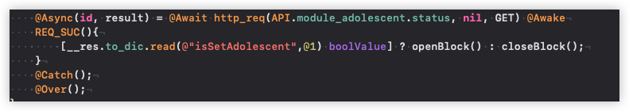

<br/>

如该图这是在C环境下利用宏封装`async-await`的语法. 其实在swift中也可以实现这种效果, 但并没有这样直观: 一方面是因为宏调用格式; 另一方面是宏的参数受语法检查不能直接传递字面量, 必须传递字符串, 所以显得不直观. 就类似于:

```swift
@Async("id", "result") = #Await { func(a, b) }
```


### swift中macro机制
swift中的macro不直接由编译器处理, 而是由扩展的编译插件处理. 具体来说:
1. swift遇到外部的macro
2. 调用这个macro的编译插件
3. 编译插件处理完后将结果返回给swift
4. swift将得到的结果做展开, 然后继续编译

这整个过程由swift编译器主导, 所谓的编译插件只不过是swift语言编写的库, 这种库并不是开发中的业务代码, 而是依赖SwiftSyntax. 因为整个macro的展开过程就是在编译期, 所以最终的可执行文件中并没有插件库, 也不会存在原始的macro代码(<font color = red>全部是展开后正确的swift代码</font>)

总结就是: 可以不使用macro来开发swift, 但使用macro可以更加精减代码

### macro的种类
共有2种形式的macro, 它们调用的格式:
1. 以`#`开头调用的macro表示独立宏, 它不被其他任何如对象,类型,属性等约束. 它们的功能是在调用点展开代码. 
2. 以`@`开头调用的macro表示附加宏, 它们要依赖于其他诸如对象,类型,属性,方法,函数等, 不可单独存在. 它们的功能是为所修饰的元素附加额外的属性, 如:
    - 修饰struct时添加方法, 属性(任意属性)
    - 修饰函数时添加参数形成重载

|macro|值类型|说明|
|:-:|:-:|:-|
|`#line`|整型字面量|行号|
|`#filePath`|字符串字面量|当前文件绝对路径|
|`#fileID`|字符串字面量|swift生成的唯一标识, 一般是文件名|
|`#file`|字符串字面量|一般是文件名|
|`#function`|字符串字面量|当前函数名(<font color = red>包括闭包,计算属性,下标等</font>)|


### macro的开发流程
因为macro本质是swift语言开发的库, 所以需要在特定的环境下进行开发测试. 

---

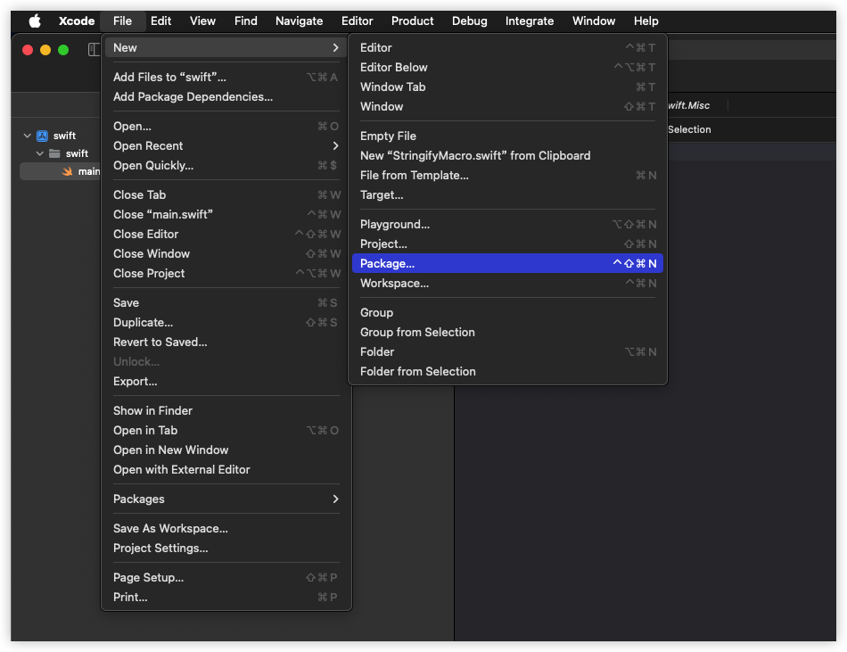

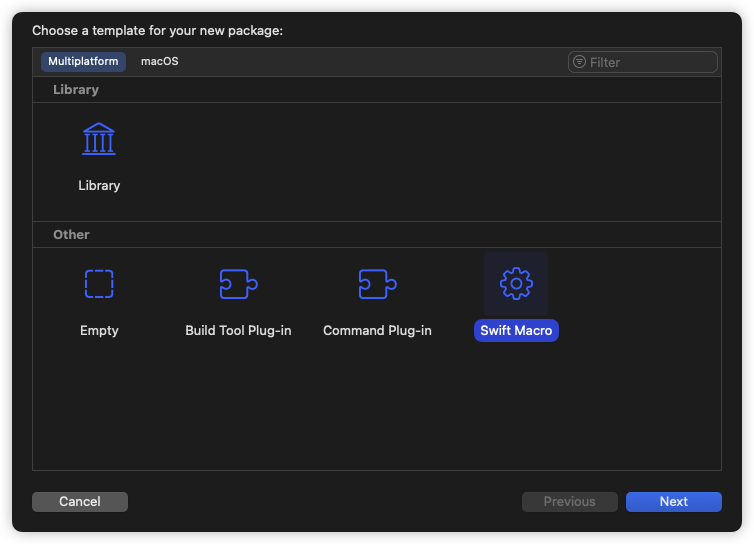

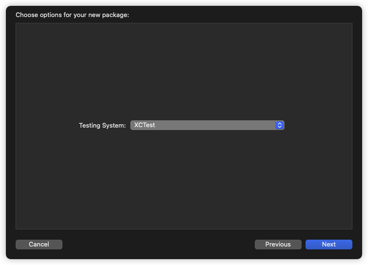

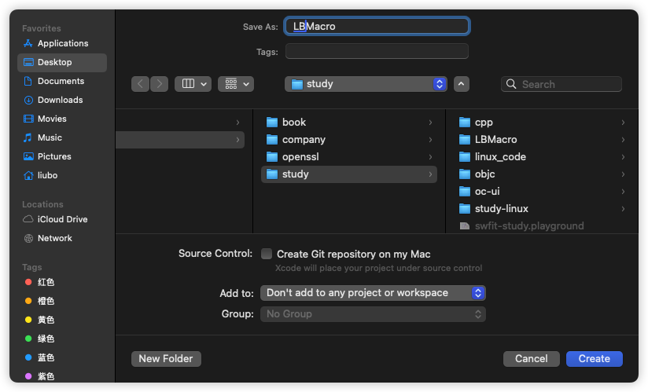

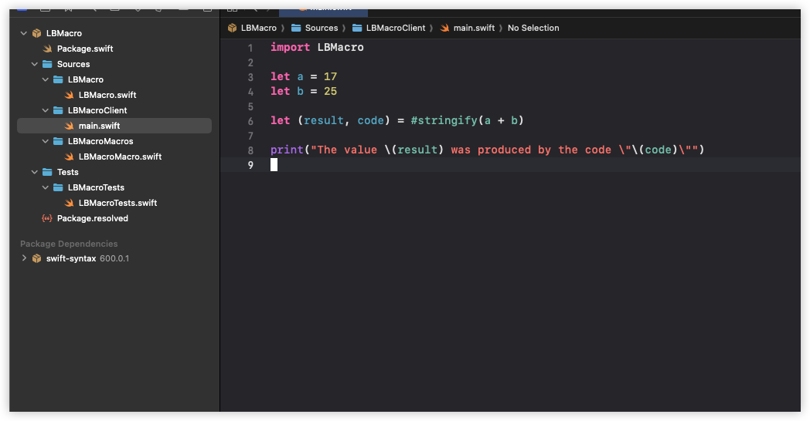


--- 

上述流程是自定义macro的环境, 当工程初始化后有这样几个文件:
1. `main.swift`: 该文件是在当前环境下使用自定义的macro, 相当于在一个业务工程中导入宏所在的模块然后使用它
2. `LBMacro.swift`: 宏的声明文件
3. `LBMacroMacros.swift`: 宏的实现文件
4. `LBMacroTest.swift`: 在当前环境下测试宏展开是不是对的


在任何地点使用一个测试好的宏时, 可以`鼠标-->右键-->Expand Macro`, 以查看宏的展开是不是符合预期

---

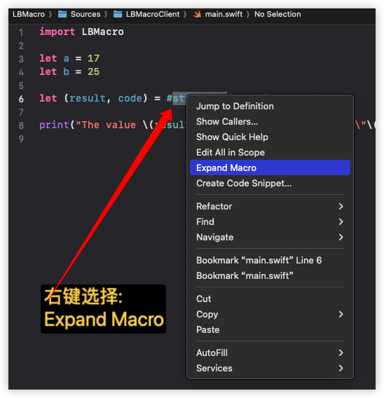
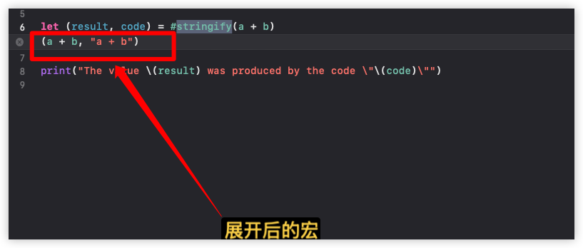

---


### stringify
初始化好工程后, Xcode默认实现了一个stringify的独立宏, 该宏的功能:

```swift
let a = 17
let b = 25

let (result, code) = #stringify(a + b)

/// 展开成
let (result, code) = (a + b, "a + b")
```

现在来测试一下这个宏:
1. 操作stringify的结果, 如看能不能调用tuple相关操作
2. 向其传入一个非法的表达式
3. 尝试使用组合书写

```swift
// 直接对macro生成的结果(tuple)进行操作
let value = #stringify(a + b).0     // 42
let key   = #stringify(a + b).1     // "a + b"


// swift直接在编译期报错(非法的表达式)
//#stringify(a + )

func f<T>(_ number: T, _ des: String) {}

// 这里的目的是想生成如下的代码:
//      f (a + b, "a + b")
//  产生函数调用, 但这里直接报错
f #stringify(a + b) 
```

为了对比这里给出C语言中的macro表现

```cpp
void f(int number, const char* key){
    printf("f被调用(%d, %s)", number, key);
}

// #_expr, C字符串化键入的字面字符串
//  abc ==> "abc"
//  a + b ==> "a + b"
#define stringify(_expr) ((_expr), #_expr)

int main(void){
    const int a = 17, b = 25;
    f stringify(a + b) ;
    
    // 展开成
    f ((a + b), "a + b") ;  // 通过键入的 f 和 stringify(a + b) 组合成正确的表达式
    return 0;
}
```

也就是说stringify不能实现这种组合表达, 因为它本质是swift表达式, 其展开的结果也是表达式, 并不是键入的字面量字符串. 综合这一点它只可以使用在表达式该出现在的地方. 


### stringify实现
在初始化的工程中, stringify的声明和实现是分开的.

```swift
// LBMacro.swift: 声明
@freestanding(expression)
public macro stringify<T>(_ value: T) -> (T, String) = #externalMacro(module: "LBMacroMacros", type: "StringifyMacro")
```

1. `@freestanding`: 表示stringify是一个独立宏
2. `expression`: 表示它的角色是表达式, 这对它有两个限制:
    1. 只能替换某个表达式, 同时决定了它只用在表达式出现的地方
    2. 替换后的结果必须是表达式
3. `public`: 所有的宏应该定义成public, 公开所有的访问权限(<font color = red>这只是一种约定</font>)
4. `macro`: 声明宏的关键字
5. `<T>`: stringify接收表达式时, 该表达式的结果可以是泛型, 最终stringify会生成新的表达式tuple
6. `=`: stringify实现所在的模块和实现
7. `#externalMacro`: 指明stringify是一个外部宏, 外部宏相当于编译扩展, 所以会生成编译器插件
8. `module`: 外部宏的参数, stringify实现所在的模块
9. `type`: 外部宏的参数, stringify实现者(<font color = red>只是方法的容器</font>)

这个声明将来被导入到用户模块时, 可以查看到, 相当于C语言中的头文件, 当swift遇到`#stringify(a + b)`时:
1. 查看该声明
2. 启动沙盒进程调用`LBMacroMacros.StringifyMacro`的实现
3. 将`a + b`封装成SwiftSyntax相关的结构(<font color = red>语法树</font>)传递给实现函数
4. 函数最终会返回处理好的tuple表达式给swift
5. swift拿到编tuple后就地展开, 然后继续编译

```swift
import SwiftCompilerPlugin      // 生成编译器插件
import SwiftSyntax              // 语法树, 最核心的结构(极其复杂)
import SwiftSyntaxBuilder       // 语法树结点的DSL构造者, 通过它可以直接使用字符串插值(swift语句)构建语法树结点
import SwiftSyntaxMacros        // 自定义宏实现时, 不同角色的宏需要遵循的协议

// LBMacroMacro.swift: 宏的实现
public struct StringifyMacro: ExpressionMacro { // __code_expr_protocol
    public static func expansion(
        of node: some FreestandingMacroExpansionSyntax, // __code_expr_syntax
        in context: some MacroExpansionContext          // __code_context
    ) -> ExprSyntax {                                   // __code_return_expr

        // __code_guard
        guard let argument = node.arguments.first?.expression else {
            fatalError("compiler bug: the macro does not have any arguments")
        }

        // __code_ctor_tuple
        return "(\(argument), \(literal: argument.description))" 
    }
}


// 注册到编译器插件中
@main
struct LBMacroPlugin: CompilerPlugin {
    let providingMacros: [Macro.Type] = [
        StringifyMacro.self,   //编译器会调用该函数生成编译器插件库
    ]
}
```

1. `__code_expr_protocol`: 实现者遵循表达式宏的协议, 这也同时对应了声明`@freestanding(exression)`
2. 函数expansion是需要实现的协议函数, 当swift在代码中遇到`stringify(a + b)`时会回调到这里来
3. `__code_expr_syntax`: swift回调时先封装`a + b`为语法树对象, 这个对象对应了stringify的角色, 在回调函数里可以拿到这个对象, 然后获取相关的信息, 如:
    - 表达式对象中参数的个数
    - 表达式的描述
4. `__code_context`: 和编译器通信的上下文, 可以利用它进行编译器级别的报错
5. `__code_return_expr`: 函数要返回的类型, stringify的声明决定了它必须返回一个swift表达式, 而它对应的结构就是ExprSyntax
    - swift中所有表达式有固定的类型, 如tuple为TupleExprSyntax, 这里使用ExprSyntax可以接收任意swift表达式
6. `__code_guard`: 根据swift构造的Syntax结点查看一下是否有表达式, 如果没有则stringify处理不了, 则直接报错
    - 报错时直接使用了fatalError函数, 该函数将直接结束当前的沙盒进程
    - 报错显示的错误信息会交给swift, swift在调用点`#string(a + b)`直接将错误展开
7. `__code_ctor_tuple`: 直接利用字符串插值构造tuple表达式

> PS: SwiftSyntax(<font color = red>AST</font>)是一个极其复杂语法解析器, 它是swift编译器的内核一部分. 笔者目前没有能力深究这些东西.


### stringify参数信息
当swift编译到`#stringify(a + b)`时:
1. 因为stringify是一个独立宏, 并且`#stringify(a + b)`的调用格式符合它的声明, 所以决定调用插件实现`LBMacroMacros.StringifyMacro`
2. 在调用前生成语法树结点, 并传递给实现的第1个参数
3. 创建上下文, 并传递给实现的第2个参数

可以利用测试模式, 在实现的函数打上一个断点, 然后利用lldb查看一下node(结点)的结构.

```swift
// 上下文, 这是工程提供的测试样例
func testMacro() throws {
    #if canImport(LBMacroMacros)
    assertMacroExpansion(
        """
        #stringify(a + b)
        """,
        expandedSource: """
        (a + b, "a + b")
        """,
        macros: testMacros
    )
    #else
    throw XCTSkip("macros are only supported when running tests for the host platform")
    #endif
}


public struct StringifyMacro: ExpressionMacro {
    public static func expansion(
        of node: some FreestandingMacroExpansionSyntax,
        in context: some MacroExpansionContext
    ) -> ExprSyntax {

        // __lldb_breakpoint

        guard let argument = node.arguments.first?.expression else {
            fatalError("compiler bug: the macro does not have any arguments")
        }
        return "(\(argument), \(literal: argument.description))"
    }
}


MacroExpansionExprSyntax                            // 代码中书写的 #stringify(a + b) 确实是宏表达式(@freestanding(expression))
├─pound: pound
├─macroName: identifier("stringify")                // 宏名是 stringify
├─leftParen: leftParen                              // 左括号  (
├─arguments: LabeledExprListSyntax                  // 参数表达式信息, 是一个数组(只有1个元素)
│ ╰─[0]: LabeledExprSyntax                          //  第0个元素:标签表达式
│   ╰─expression: InfixOperatorExprSyntax           //      表达式类型是: 中缀表达式
│     ├─leftOperand: DeclReferenceExprSyntax        //          左操作数: 声明表达式
│     │ ╰─baseName: identifier("a")                 //              左操作数的名字: a
│     ├─operator: BinaryOperatorExprSyntax          //          中缀操作符类型: 2元操作符
│     │ ╰─operator: binaryOperator("+")             //              中缀操作符: +
│     ╰─rightOperand: DeclReferenceExprSyntax       //          右操作数类型: 声明表达式
│       ╰─baseName: identifier("b")                 //              右操作数的名字: b
├─rightParen: rightParen                            //  右括号 )
╰─additionalTrailingClosures: MultipleTrailingClosureElementListSyntax 
```

观察可以发现回调函数中argument的取值流程完全是按照结点的层次结构依次取出的, 也就是说: <font color = red>FreestandingMacroExpansionSyntax的内存布局就是lldb中打印的结点结构</font>, 根据这种对应关系, 其实实现的代码可以修改成:

```swift
// let op = argument as!  InfixOperatorExprSyntax       // error, 不能直接转换

let op = InfixOperatorExprSyntax(argument)  // __code_0
// 或
// let op = argument.as(InfixOperatorExprSyntax.self)

if let op {
    let arg_0 = op.leftOperand              // __code_1
    let op_id = op.operator                 // __code_2
    let arg_1 = op.rightOperand             // __code_3

    // __code_4
    //let result = ExprSyntax("(\(arg_0) \(op_id) \(arg_1), \"\(arg_0) \(op_id) \(arg_1)\")")

    // __code_5
    let result = ExprSyntax("(\(arg_0) \(op_id) \(arg_1), \(literal: arg_0.description)+\(literal: op_id.description)+\(literal: arg_1.description))")
    return result
} 
```

由于目前测试的表达式是最简单的, 只传递了`a + b`, 不要考虑复杂的情况(如`a + b + c)`), 这个测试的目的: <font color = red>将回调的参数进行参数转换来获取表达式中的信息</font>. 笔者先给出一个总结: 不能直接转换argument对象, 会发生运行时错误, 所以笔者直接使用`__code_0`来通过argument对象构造一个中缀表达式
1. `__code_0`: 使用argument构造`a + b`的SwiftSyntax结构
2. `__code_1`: 取出语法结构中的左操作数, 从lldb中可以知道它是`DeclReferenceExprSyntax`
3. `__code_2`: 取出中缀表达式的运行符`+`, 它的类型是`BinaryOperatorExprSyntax`
4. `__code_3`: 同理取出右操作数
5. `__code_4`: 第1种形式构造tuple
6. `__code_5`: 第2种形式构造tuple

构造tuple的过程将在下小节给出


### stringify在返回时插值
笔者不了解SwiftSyntax, 这里只能根据默认stringify的返回来进行探究. 

```swift
public struct StringifyMacro: ExpressionMacro {
    public static func expansion(
        of node: some FreestandingMacroExpansionSyntax,
        in context: some MacroExpansionContext
    ) -> ExprSyntax {
        // 判断表达式的类型是否是有效的
        guard let argument = node.arguments.first?.expression else {
            fatalError("compiler bug: the macro does not have any arguments")
        }
        return "(\(argument), \(literal: argument.description))"
    }
} 
```

stringify向外声明的是返回一个`tuple(T, String)`表达式, 这个T由用户的表达式决定. 当前测试中表达式`a + b`的类型是Int, 所以宏应该返回`tuple(Int, String)`, 但它实现的协议函数要求返回一个ExprSyntax. 函数中使用字符串插值构造了该类型的对象. 这个过程实际由SwiftSyntaxBuilder模块中的SyntaxStringInterpolation完成, 它实现了ExpressibleByStringInterpolation(<font color = red>插值协议</font>), 所以用户可以直接使用插值来间接构造ExprSyntax对象. 有3种插值方式:
1. `"\(SwiftSyntax)"`: 直接给一个SwiftSyntax对象, 最终原样输出.  
    ```swift
    // 原始信息为 a + b
    // 构造信息为 a + b
    //  没有字符串化
    let result = ExprSyntax("\(argument)")
    ```

<br/>

2. `"\(literal: ExpressibleByLiteralSyntax)"`: 在使用上可以直接提供String对象, 最终String被转换成语法树对象.
    ```swift
    // 提供信息为 "a + b"
    // 构造信息为 "a + b"
    //  注意有空格
    let result1 = ExprSyntax("\(literal: "a + b")")

    // 原始信息为 value = "a + b"
    // 构造信息为 "a + b"
    //  注意有空格
    let value = "a + b"
    let result2 = ExprSyntax("\(literal: value)")

    // 原始信息为 a + b
    // 构造信息为 "a+b"
    //  注意没有空格
    let result3 = ExprSyntax("\(literal: argument)")
    ```
    > 之所以能直接提供字符串, 是因为内部扩展的String遵循了该协议

<br/>

3. `"\(raw: T)"`: 可以指定任意类型的对象, 不会附加引号
    ```swift
    // 提供信息为 "a + b"
    // 构造信息为 a + b
    //  去掉了双引号, 相当于用户代码中有a和b两个对象在做加法操作
    let result1 = ExprSyntax("\(raw: "a + b")")

    // 原始信息为 value = "a + b"
    // 构造信息为 a + b
    //  也是去掉了双引号
    let value = "a + b"
    let result1 = ExprSyntax("\(raw: value)")

    // 原始信息为 a + b
    // 构造信息为 a + b
    //  去掉了双引号
    let result3 = ExprSyntax("\(literal: argument)")
    ```

<br/>

4. 构造过程中字面量的值会原样输出
    ```swift
    // 在字符串中有7个字面量
    //  左括号      {
    //  第1个双引号 "
    //  key         key
    //  第2个双引号 "
    //  冒号        :
    //  空格        空格
    //  右括号      }
    // 这些信息会原样输出
    // 插值部分是原样输出, 所以最终的结果:
    //  {"key": a + b}
    let result = ExprSyntax("{\"key\": \(raw: argument)}")
    ```

知道这些插值规则后回到上一小节所修改的函数

```swift
// 原表达式 #stringify(a + b)
// arg_0: 中缀表达式的左操作数信息
// op_id: 中缀表达式的操作符信息
// arg_1: 中缀表达式的右操作数信息

// __code_4
let result = ExprSyntax("(\(arg_0) \(op_id) \(arg_1), \"\(arg_0) \(op_id) \(arg_1)\")")

// __code_5
let result = ExprSyntax("(\(arg_0) \(op_id) \(arg_1), \(literal: arg_0.description)+\(literal: op_id.description)+\(literal: arg_1.description))")
```

对于`__code_4`:
1. tuple第1个参数`\(arg_0) \(op_id) \(arg_1)`中所有的插值对象是SwiftSyntax结点, 所以会直接生成不带双引号的`a + b`加法表达式
2. tuple第2个参数`\"\(arg_0) \(op_id) \(arg_1)\"`中所有的插值是SwiftSyntax结点, 所以会直接生成`a + b`, 但因为前后加了`"`, 所以组合起来就是`"a + b"`

<br/>

对于`__code_5`:
1. tuple的第1个参数直接原样输出`a + b`
2. tuple的第2个参数中插值对象是String,  但标注了`literal`, 则其实每个插值生成的是字符串化`"a" "+" "b"`, 但第2个参数同时还书写了`+`, 则直接生成的是值为`"a" + "+" + "b"`:
    - `#stringify(a + b)` 展开成了 `(a + b, "a" + "+" + "b")`
这个表达式也是符合stringify的声明


### 表达式上下文类型信息?
在给出的测试中stringify接收的是`a + b`表达式, 其中a在当前的上下文中是一个Int对象, 但这一点信息是无法在宏的实现中获取到. swift这样做的目的是限制表达式宏的处理范围, 也是一种安全处理机制.


<a id="link-liteal-expr"></a>

### 字符串变字面值?
通过`"\(raw: "let a = 20")"` 构造的表达式实际上展开后是`let a = 20`的swift声明语句并不是字符串, 现在假设有这样的调用:

```swift
#stringify("let a = 20") 
```
这种形式的展开是什么样呢? stringify的声明应该返回`(String, String)`, 那本来所传递的参数就是字符串, 根据stringify的实现

```swift
return "(\(argument), \(literal: argument.description))"
```

笔者这里自定义2个名词来理解:
1. 原始信息[^ann-info-raw]
2. 字面信息[^ann-info-literal]

这2者中针对于非转义字符是直接输出, 回到代码:
1. `\(argument)`所获取的是表达式的原始信息, , 即: `"let a = 20"`
2. `\(literal: argument.description)`所获取的是字面信息. 它需要包装原始信息, 字符串中若存在:
    - `\n`: 如`"hello \n tierry"`, 则对应的包装成`"hello\\\ntierry"`

所以literal的工作就是包装转义字符!!! 在swift中使用`#"hello\ntierry"#`扩展字符串分隔符来表示字符串的字面信息, 它最终的效果就是`"hello\\\ntierry"`. 回到代码中, 对应的展开结果:

```swift
("let a = 20", #"let a = 20"#) 
```

其实说白了在stringify的实现中接收的值是<font color = red>带引号的字符串</font>, 即:
1. 外界传递的参数: `parm = "let a = 20"`
2. 内部接收时的值: `arg = "\"let a = 20\""`

举个案例: 去掉`"hello"`字符串中的引号, 在用户代码展开, 若上下文有hello对象, 则表达式就是正确的.

```swift
// 外界调用
#stringify("hello")

public struct StringifyMacro: ExpressionMacro {
    public static func expansion(
        of node: some FreestandingMacroExpansionSyntax,
        in context: some MacroExpansionContext
    ) -> ExprSyntax {
        guard let argument = node.arguments.first?.expression else {
            fatalError("compiler bug: the macro does not have any arguments")
        }
        // arg = "\"hello\""
        var arg = argument.description

        // 手动去掉引号, arg = "hello"
        arg.replace("\"", with: "")

        // 返回 (hello, "hello")
        //  但是上下文中没有hello, 所以是报错的
        return "(\(raw: arg), \(literal: arg))"
    }
}
```

### 宏的参数结点没有上下文
`#stringify("hello")`调用时传递了一个字符串, 则生成的结点描述是`"\"hello\""`, 如同上小节一样:
1. 实现中将双引号去掉(tmp)
2. 调用`"\(raw: tmp)"`后会展开成`hello`, 这个hello在源码中不带双引号, 相当于hello对象

但如果想在调用宏时, 指定一个字符串对象, 该字符串对象的内容是`"hello"`, 则可能与想像的不一样:
```swift
let code = "hello"
#stringify(code)
```
在宏的内部拿到的结点描述只是`"\"code\""`, 宏的实现中并不知晓code在源码中是一个对象, 所以也不知道有`"hello"`这个字符串


### 插入动态信息
stringify的实现中直接通过`ExprSyntax`接收一字符串进行返回值的构造, 这个过程可以提供自定义的String对象, 只要该对象能保证最终生成的是正确的, 符合上下文的swift语句即可. 有了这个功能则可以在实现中动态插入自定义的信息.  这里笔者给出一个测试函数调用耗时的案例. 

```txt
功能需求
    在当前程中测试某段代码的执行时间

实现方式
    使用表达式宏添加表达式实现

调用格式
    #time_call  {
        print("hello")
    }

期望输出结果
    hello
    执行了xxx/秒

分析:
    1. time_call的书写格式决定了time_call的参数是一个尾随闭包
    2. 传递了 time_call闭包, 但用户没有产生调用, 所以
        应该在macro的实现内部自动调用
```

```swift
// 声明一个表达式宏time_call
//  接收一个闭包参数, 由于是唯一参数, 所以可以使用尾随闭包的语法
@freestanding(expression)   
public macro time_call(_ exec: () -> ()) -> Void = #externalMacro(module: "LBMacroMacros", type: "LB")


// 实现
public enum LB: DeclarationMacro, ExpressionMacro{
    public static func expansion(
        of node: some FreestandingMacroExpansionSyntax, 
        in context: some MacroExpansionContext) throws -> ExprSyntax {

/* __code_0 */       let tmp_arg_0 = context.makeUniqueName("")
/* __code_1 */       let tmp_arg_1 = context.makeUniqueName("")
/* __code_2 */       return
/* __code_3 */
/* __code_4 */
/* __code_5 */
/* __code_6 */
/* __code_7 */
/* __code_8 */
/* __code_9 */      //3 ~9 是下面多行字符串
          """
          _ = {
              let \(raw: tmp_arg_0) = clock_gettime_nsec_np(os.CLOCK_REALTIME)
              _ = \(raw: node.trailingClosure?.description ?? "")()
              let \(raw: tmp_arg_1) = clock_gettime_nsec_np(os.CLOCK_REALTIME) - \(raw: tmp_arg_0)
              print("执行了\\(Double(\(tmp_arg_1)) * 1.0 / Double(os.NSEC_PER_SEC))/秒")
          }()
          """
    }
}
```

1. macro声明要求没有返回值, 所以macro实现中`__code_4`是一个闭包调用, 没有返回

<br/>

2. `__code_0`: 生成唯一对象名, 表示开始的时间

<br/>

3. `__code_1`: 生成唯一对象名, 表示结束的时间

<br/>

4. `__code_2`: 返回字符串插值, 生成swift的表达式语句

<br/>

5. `__code_3`: 多行字符串前缀, 使用多行字符串来书写表达式时, 整个表达式比较直观

<br/>

6. `__code_4`: 整个macro要返回一个Void类型, 所以这里使用匿名闭包, 并自动调用(`__code_9`)

<br/>

7. `__code_5`: 表达式中第1句代码, 获取此刻程序运行的纳秒时间戳. 这里使用插值`\(raw: tmp_arg_0)`实际上将产生的对象名的字面值展开在用户代码中

<br/>

8. `__code_6`: 调用用户传入的闭包
    - 获取用户传入的闭包参数表达式的原始字面值信息(<font color = red>node.trailingClosure?.description</font>)
        ```swift
        {
            print("hello")
        }
        ```
        > 这些信息其实就是字符串

    - `_ = \(raw: node.trailingClosure?.description ?? "")()`  使其产生调用

<br/>

9. `__code_7`: 用户代码已经调用完毕, 获取此刻程序的运行时间并减去开始时间`__code_5`. 同样的是使用插值来生成表达式

<br/>

10 `__code_8`: 打印代码运行的时间. 同样也是使用插值来生成打印语句

<br/>

11. `__code_9`: 整个外层的闭包产生调用


代码最终展开类似如下:

```swift
_ = {
    // 这种长长的对象名由macro实现中的context生成, 保证了唯一性
    // 获取当前时间戳
    let $s13LBMacroClient0015mainswift_tzEGbfMX36_0_33_27A6C6D516578B6CA358B1D61B5D3419Ll9time_callfMf_7__localfMu_ = clock_gettime_nsec_np(os.CLOCK_REALTIME)

    // macro实现中的 `__code_6`, 调用用户的闭包
    _ = {
        print("hello")
    }()

    // 计算结束的时间戳
    let $s13LBMacroClient0015mainswift_tzEGbfMX36_0_33_27A6C6D516578B6CA358B1D61B5D3419Ll9time_callfMf_7__localfMu0_ = clock_gettime_nsec_np(os.CLOCK_REALTIME) - $s13LBMacroClient0015mainswift_tzEGbfMX36_0_33_27A6C6D516578B6CA358B1D61B5D3419Ll9time_callfMf_7__localfMu_

    // 打印总时间, 注意类型转换
    print("执行了\(Double($s13LBMacroClient0015mainswift_tzEGbfMX36_0_33_27A6C6D516578B6CA358B1D61B5D3419Ll9time_callfMf_7__localfMu0_) * 1.0 / Double(os.NSEC_PER_SEC))/秒")
}() 
```

需要注意的地方: 因为声明的是expression的独立宏, 所以不能有声明语句
```swift
public enum LB: DeclarationMacro, ExpressionMacro{
    public static func expansion(
    of node: some FreestandingMacroExpansionSyntax, 
    in context: some MacroExpansionContext) throws -> ExprSyntax {

    let tmp_arg_0 = context.makeUniqueName("")
    let tmp_arg_1 = context.makeUniqueName("")
    return
            """
            let \(raw: tmp_arg_0) = clock_gettime_nsec_np(os.CLOCK_REALTIME)
            _ = \(raw: node.trailingClosure?.description ?? "")()
            let \(raw: tmp_arg_1) = clock_gettime_nsec_np(os.CLOCK_REALTIME) - \(raw: tmp_arg_0)
            print("执行了\\(Double(\(tmp_arg_1)) * 1.0 / Double(os.NSEC_PER_SEC))/秒")
            """
    }
}

/************************* 展开后 **********************************/
let $s13LBMacroClient0015mainswift_tzEGbfMX36_0_33_27A6C6D516578B6CA358B1D61B5D3419Ll9time_callfMf_7__localfMu_ = clock_gettime_nsec_np(os.CLOCK_REALTIME)

_ = {
    print("hello")
}()

let $s13LBMacroClient0015mainswift_tzEGbfMX36_0_33_27A6C6D516578B6CA358B1D61B5D3419Ll9time_callfMf_7__localfMu0_ = clock_gettime_nsec_np(os.CLOCK_REALTIME) - $s13LBMacroClient0015mainswift_tzEGbfMX36_0_33_27A6C6D516578B6CA358B1D61B5D3419Ll9time_callfMf_7__localfMu_

print("执行了\(Double($s13LBMacroClient0015mainswift_tzEGbfMX36_0_33_27A6C6D516578B6CA358B1D61B5D3419Ll9time_callfMf_7__localfMu0_) * 1.0 / Double(os.NSEC_PER_SEC))/秒")
```

展开到用户的代码后有声明的语句, 无法和macro声明时返回的Void类型对应, 所以直接报错. 也就是说当前macro的展开必须是一个Void类型的表达式. 该案例还有一点笔者没有处理
```swift
#time_call {
    print("hello")
}
```
在向宏传递参数时, 使用了尾随闭包的语法, 所以在协议函数中获取到的语法树结点的类型中参数列表中是空的, 但会多出一个`trailingClosure`的结点信息. 如果:

```swift
#time_call({print("hello")}) 
```
在形成的语法树结点的参数列表会出现ClosureExprSyntax. 


由于宏可以动态添加信息, 所以逻辑上可以作任何事情. 也就是说macro可能有改变用户代码的倾向, 但其实以独立表达式宏的使用来看, 它只是改变了表达式的意义, 它前后的上下文信息不会被改变!!! 但不管怎么样, macro有恶意的倾向, 事实上swift的宏实现还是有很多限制, 比如:
1. 不能异步调用
2. 不能产生网络访问
3. 不能访问源程序中的文件

后2条的原因是宏实现的库在被调用时的进程由swift决定, swift关闭了该进程的所有网络IO操作, 同时该进程处于封闭的沙盒工作空间, 它不能访问到源程序的工作空间. 当前的案例其实也是Swift6中的SwiftUI的`#Preview`的实现流程


### 表达式宏案例
笔者实现一个简单的数值字面量转换

```swift
// 宏声明 
//  这2个宏实际造成了重载, 必须接收数值字面量, 接收对象类型转换是失败的
@freestanding(expression)
public macro binary(_ value: Int) -> String = #externalMacro(module: "LBMacroMacros", type: "LB")
@freestanding(expression)
public macro binary(_ value: Double) -> String = #externalMacro(module: "LBMacroMacros", type: "LB")


// 宏实现
public enum LB: ExpressionMacro{
    static let FLOAT_MASK:Set<String> = [".", "e", "E", "p", "P"]
    static let NOT_DECIMAL: Dictionary<String, Int> = [
        "0b": 2, "0B":2, "-0b":2, "-0B":2,
        "0o": 8, "0O":8, "-0o":8, "-0O":8,
        "0x": 16, "0X":16, "-0x":16, "-0X":16
    ]
    static let DECIMAL_BASE = 10

    public static func expansion(
        of node: some FreestandingMacroExpansionSyntax,
        in context: some MacroExpansionContext) throws -> ExprSyntax {

            guard let arg = node.arguments.first else {
                fatalError("请传递参数")
            }

            var ex = arg.description

            // 浮点
            if !(FLOAT_MASK.filter {ex.contains($0)}).isEmpty {
                if let number = Double(ex) {
                    return "\(literal: String(number.bitPattern, radix:2))"
                }
            }

            // 整数, 因为这里接收的所有信息都是字符串, 所以需要转换

            // 取出表达式的进制
            let radix = NOT_DECIMAL.filter {ex.hasPrefix($0.key)}.first?.value ?? DECIMAL_BASE

            // 是否为负数
            let negative = ex.hasPrefix("-")

            // 去掉前缀(0b, -0b, 0x, -0x等)
            negative ? ex.replaceSubrange(ex.startIndex..<ex.index(ex.startIndex, offsetBy: 1), with: "") : ()
            radix == DECIMAL_BASE ? () :  ex.replaceSubrange(ex.startIndex..<ex.index(ex.startIndex, offsetBy: 2), with: "")

            // 从字符串转换成UInt, 注意转换的步骤
            let decimal = UInt(bitPattern: (Int(ex, radix: radix)! * (negative ? -1 : 1)))

            return "\(literal: String(decimal, radix:2))"

            // 关于错误的正确做法将在后续给出, 这里先不管
            throw "参数必须是数字字面量"
    }
}


// 使用
let number = 2

print(#binary(10))
print(#binary(-10))
print(#binary(0b10))
print(#binary(-0b10))
print(#binary(0o10))
print(#binary(-0o10))
print(#binary(0x10))
print(#binary(-0x10))
print(#binary(0.5))
print(#binary(-0.5))
print(#binary(5e-1))
print(#binary(-5e-1))
print(#binary(number))      // error, 内部解析出错, 不是一个字面量数值

#if false
1010
1111111111111111111111111111111111111111111111111111111111110110
10
1111111111111111111111111111111111111111111111111111111111111110
1000
1111111111111111111111111111111111111111111111111111111111111000
10000
1111111111111111111111111111111111111111111111111111111111110000
11111111100000000000000000000000000000000000000000000000000000
1011111111100000000000000000000000000000000000000000000000000000
11111111100000000000000000000000000000000000000000000000000000
1011111111100000000000000000000000000000000000000000000000000000
#endif
```


### 独立宏(声明)
前面学习的stringify宏就是独立宏, 只不过是其中的一种, 独立宏有2种:
1. 表达式
2. 声明

表达式角色的独立宏正如stringify, 使用`@freestanding(expression)`指定, 它们只能出现在表达式的地点, 也只能返回swift的表达式. 而声明的独立宏:
1. 只能出现声明位置
2. 展开后是一段声明

声明的含义:
1. 声明对象
2. 声明函数
3. 声明闭包
4. 声明类型
    - enum
    - struct
    - class

这里再提一点, 表达式和声明在swift中是有严格区分的, 表达式一定有一个结果反馈, 换言之对应一个结果类型. 声明严格来说是swift语句, 但它不是表达式, 而像stringify实现中返回ExprSyntax时可以指定一条声明语句, 但最终回到用户代码是编译报错的, 因为展开后的声明语句和stringify的声明时返回类型对不上

```swift
// 将stringify的实现修改如下(部分) 
public struct StringifyMacro: ExpressionMacro {
    public static func expansion(
        of node: some FreestandingMacroExpansionSyntax,
        in context: some MacroExpansionContext
    ) -> ExprSyntax {
        return ("let d: Int = 0")
    }
}
```
这里其实向外界返回了一条这样的swift语句:

> `let d: Int = 0`

它是正确的swift语句, 但最后在用户代码展开时直接报错, 因为stringify的声明保证会返回一个tuple, 但该展开的swift语句并不是一个tuple类型的结果, 所以报错. 可以使用`@freestanding(declaration)`的宏展开一段声明:
1. 声明对象
2. 声明类型(enum, struct, class等)
3. 声明函数

> 由于它也是独立宏, 所以不需要依赖上下文中的信息. 即写出来就直接展开声明. 

### swift与插件的交互探究
macro的实现本质上是一个独立的进程, 它接收swift生成语法树结点信息并被封闭调用, 然后处理这些信息再生成新的语法树结点信息再回传给swift. 在整个过程中并不能确定2者交互的载体是不是字符串, 即可能是:
1. swift先生成语法树结点的片段信息, 整合成字符串
2. 创建交互的通道
    - 可能是共享内存
    - 也可能是UDS(<font color = red>Unix Domain Socket</font>)
    - 也可能是管道, 文件等
3. fork子进程, swift阻塞等待子进程
4. 子进程关闭可能IO的所有文件描述符
5. 子进程和父进程交互, 子进程从通道中获取结点信息的字符串, 生成可操作的结点的内存结构
6. 子进程重新生成新的结构(<font color = red>回调函数</font>), 再转换成字符串信息通过通道发给父进程(swift)
7. swift收到新的结点信息(字符串)后, 将结点信息转换成表达式, 并展开在调用点

这个只是笔者理解的大致过程. 可以写一个程序来测试:
1. 创建一个独立的声明宏
2. 在实现函数中遍历所有的fd, 然后找到打开的那个查看其文件类型

```swift
// 声明
//  这里加了一个属性, 指定生成的对象名是abc这个标识
//  关于声明时对象的标识会在下小节详细探究
@freestanding(declaration, names: named(abc))
public macro decl_var() = #externalMacro(module: "LBMacroMacros", type: "LB")


// 辅助工具
private enum FILE_TYPE: Int, RawRepresentable, CaseIterable{
    // __code_sys_ftype_mask
    static let MASK =  0o170000

    // __code_sys_ftype_no
    case S_ISFIFO = 0o0010000
    case S_ISCHR = 0o0020000
    case S_ISDIR = 0o0040000
    case S_ISBLK = 0o0060000
    case S_ISREG = 0o1000000        // 4528
    case S_ISLNK = 0o1200000
    case S_ISSOCK = 0o1400000
    case S_NOFILE = -1

    typealias RawValue = String

    // 这个就是测试用的
    init?(rawValue: String) {
        self = .S_NOFILE
    }
    init(_ rawValue: Int) {
        switch rawValue {
            case 0o0010000:
                self = .S_ISFIFO

            case 0o0020000:
                self = .S_ISCHR

            case 0o0040000:
                self = .S_ISDIR

            case 0o0060000:
                self = .S_ISBLK

            case 0o1000000:
                self = .S_ISREG

            case 0o1200000:
                self = .S_ISLNK

            case 0o1400000:
                self = .S_ISSOCK

            default:
                self = .S_NOFILE
        }
    }

    var rawValue: String {
        switch self {
            case .S_ISFIFO:
                return "管道"

            case .S_ISCHR:
                return "字符设备"

            case .S_ISDIR:
                return "目录"

            case .S_ISBLK:
                return "块设备"

            case .S_ISREG:
                return "文件"

            case .S_ISLNK:
                return "软链接"

            case .S_ISSOCK:
                return "socket"

            case .S_NOFILE:
                fallthrough
            @unknown default:
                return "不合法的文件"
        }
    }
}

// 独立声明宏的实现类, 这里笔者定义了一个空枚举, 就是一个方法的容器
public enum LB: DeclarationMacro, ExpressionMacro{
    public static func expansion(
        of node: some SwiftSyntax.FreestandingMacroExpansionSyntax,
        in context: some SwiftSyntaxMacros.MacroExpansionContext) 
    throws -> [SwiftSyntax.DeclSyntax] {

        // 从后往前遍历, 因为笔者不确定前3个fd是否真的未关闭.
        for i in ((0..<1024) as Range<Int32>).reversed() {
            var s: os.stat = .init()
            // 若失败, 则表示当该描述符没有打开, 继续下一个
            if os.fstat(Int32(i), &s) < 0 {
                continue
            }

            // 比对
            let find = FILE_TYPE.allCases.filter {
                $0 == .init(Int(s.st_mode) & FILE_TYPE.MASK)
            }

            // 比对成功, 输出格式, eg: let abc = "文件类型是:管道<fd:15, mode:4528>"
            return ["let abc = \"文件类型是:\(raw: find.first!.rawValue)<fd:\(raw: i), mode:\(raw: s.st_mode)>\""]


            #if false
            // 这里是测试向这个fd中写入一个字符串化的语法结点表达式
            //  实际测试出来的文件描述符是管道,
            // 笔者的目的是测试一下, 向这个管道写入一个结点树信息看有什么效果
            //  但最后在用户端没有任何效果, 说明swift和插件之间的通信并不是想像的那么简单
            //  PS: 调用debugDescription显示的信息是树状的描述

            // 修改管道文件为非阻塞模式, 这样可以向管道写入内容, 而不在乎是否有读者
            let o = os.fcntl(i, os.F_GETFL)

            // 修改失败后, 直接返回错误的原因
            if os.fcntl(i, F_SETFL, o | os.O_NONBLOCK) < 0 {
                return ["let abc = \(literal: String(cString: os.strerror(os.errno)!))"]
            }

            let return_value = [ DeclSyntax("let abc = \"hello\"")]
            let str = return_value.debugDescription
            write(i, str, str.count)

            #endif
        }

        // 这是一个埋点
        return ["let abc = {0x100}()"]
    }
}
```

测试流程:
1. 在回调函数中直接从后往前遍历所有的fd. 经过笔者的测试, 当前插件的进程中会开15个管道, 如果插件和swift是以管道进行通信的, 则里面应该有一个管道是交互语法树结点的信息, 这个笔者没有测试出来

<br/>

2. 遍历到当前的fd后调用`fstat`函数, 获取文件的`s.st_mode`值, 该值中记录了文件类型的信息.
    > 笔者先定义系统文件(MacOS平台)的编号, 这个编号是从系统头文件`sys/stat.h`中直接拿过来的. 因为系统C层面提供的接口是宏调用, 而在swift中是无法引用系统宏相关的调用代码, 所以笔者将判断文件类型的宏做了展开:
    ```swift
    var s = os.stat.init()
    file_type = os.fstat(fd, &s)
    
    file_no = s.st_mode & 0o170000
    // 注意是八进制
    ```

3. 经过测试打印有15个fd都是是管道文件, 也就是说是和其他进程进行通信用的. 但通信的细节, 这里笔者没有能力去过分深究


### 声明宏的场景
笔者前面提过到, 声明这种动作可以发生在不同场景下:
1. 声明对象
2. 声明函数
3. 声明lambda
4. 声明类型(enum, struct, class等)


### 声明时named属性值
回过去看`decl_var`的声明:
```swift
@freestanding(declaration, names: named(abc))
public macro decl_var() = #externalMacro(module: "LBMacroMacros", type: "LB")
```

[前面](#link-liteal-expr)曾经测试过, macro可以将用户传递的字符串进行字面化,  如`"let age = 8"`生成`let age = 8`的表达式, 但展开合不合乎上下文由swift决定. 直白点如果用户提供一个`"name"`给宏的参数, 理论上宏可以生成name对象, 至于展开到用户代码后能不能通过是有限制的:
1. 上下文不能有name对象
2. 宏声明时是要注册`name`这个标识符, 通过

```swift
@freestanding(declaration, names: named(abc), named(ABC), named(name))
```
向外界表示内部生成的标识符名称为`abc`, `ABC`, `name`, 但其实到底有没有生成取决于:
1. 用户调用宏
2. 该宏确实在内部声明了这3个标识符

当声明宏声明了这些标识符, 并同时在内部声明了对应的对象时, 即使宏被用户调用, 也存在很多限制(<font color = red>笔者自己测试出来的</font>), 以name来说: 
1. name标识符的作用域只存在全局

<br/>

2. 当未在任何全局区调用宏, 则意味着没有生成name.
    - 若此刻在局部区调用宏不访问name时, 则编译<font color = red>直接报错</font>, name未定义
    - 若此刻在局部区调用宏且访问name时, 则编译<font color = red>直接报错</font>, name未定义

<br/>

3. 当在全局区调用宏(<font color = red>只允许调用一次</font>), 就生成民name
    - 若此刻在局部区调用宏不访问name时, 则编译<font color = red>不会报错</font>, 
    - 若此刻在局部区调用宏且访问name时, 则编译<font color = red>不会报错</font>, 访问的name是全局的

在局部区调用宏从生成的汇编来看, 其实是直接在给局部对象赋值, 逻辑来看是作废的(<font color = red>没用的代码</font>)
    
```swift
// 声明
@freestanding(declaration, names: named(abc))
public macro decl_var() = #externalMacro(module: "LBMacroMacros", type: "LB")

// 实现, 为了方便, 笔者这里只给出返回的表达式代码
return ["let abc = n"]


// 调用场景:上下文
let n = 0xa
#decl_var       // 展开后: let abc = n
print(abc)      // 10
```

程序中在全局区调用了宏, 宏展开后相当于在原地定义了abc, 并且它的值是n. 如果在局部作用域中<font color = red>单独</font>调用宏: error(找不到abc这个标识符)

```swift
let n = 0xa

do {
    #decl_var       // error: 找不到abc对象
}

func test() {
    #decl_var       // 同上, 找不到abc对象
    print(abc)      
}
```

如果先在全局区调用宏, 则其他任何局部区域的调用, 相当于什么都没有写

```swift
let n = 0xa         

#decl_var               // 在全局区调用1次, 生成了全局对象abc, 值为n

func test() {
    #decl_var           // 相当于什么都没写
    #decl_var           // 同上

    let number = abc + 0xa    
                        // 访问的是全局对象abc
}

// #decl_var           // error: 重复定义abc
```

这个行为很让人迷惑, 因为笔者已经给了结论: <font color = red>局部域中调用宏相当于都没写</font>, 这个结论是笔者从行为的效果上总结的, 接下来看汇编实现:

```lua
LBMacroClient`test():
    0x10000216c <+0>:  sub    sp, sp, #0x30
    0x100002170 <+4>:  stp    x29, x30, [sp, #0x20]
    0x100002174 <+8>:  add    x29, sp, #0x20
    0x100002178 <+12>: stur   xzr, [x29, #-0x8]     ; *(x29 - 8) = 0, tmp_local_0 = 0
    0x10000217c <+16>: str    xzr, [sp, #0x10]      ; *(sp + 16) = 0, tmp_local_1 = 0
    0x100002180 <+20>: str    xzr, [sp, #0x8]       ; *(sp + 8) =  0, tmp_local_2 = 0

    0x100002184 <+24>: adrp   x8, 6                 
    0x100002188 <+28>: ldr    x9, [x8, #0x360]
    0x10000218c <+32>: stur   x9, [x29, #-0x8]
    0x100002190 <+36>: ldr    x8, [x8, #0x360]
    0x100002194 <+40>: str    x8, [sp, #0x10]       ; 笔者没有给出main函数的汇编, 这里实际是:
                                                    ;   x9 = *&n, 即将n的值存储到局部对象中, x9就是局部对象
                                                    ;   tmp_local_0 = n
                                                    ;   tmp_local_1 = n
                                                    ;   这2条语句相当于, #decl_var的展开
                                                    ; 所以笔者才说局部对象中对声明宏的调用相当于没写.
                                                    ;   可以预想到在release下, 这些没有的代码将会被优化掉


->  0x100002198 <+44>: bl     0x1000021e0           
; LBMacroClient.abc.unsafeMutableAddressor : Swift.Int at 
;   @__swiftmacro_13LBMacroClient0015mainswift_tzEGbfMX8_0_33_27A6C6D516578B6CA358B1D61B5D3419Ll8decl_varfMf_.swift:1
                                                    ; 该函数是 dispatch_once, 获取全局对象abc的地址

    0x10000219c <+48>: ldr    x8, [x0]              ; x8 = *&abc, 实际abc内存中的值在进入函数前是n的值
    0x1000021a0 <+52>: adds   x8, x8, #0xa          ; x8 = x8 + 10 ==> abc += 0xa
    0x1000021a4 <+56>: str    x8, [sp]              ; *sp = x8
    0x1000021a8 <+60>: cset   w8, vs                ; 检查是否溢出
    0x1000021ac <+64>: tbnz   w8, #0x0, 0x1000021c8 ; <+92> [inlined] Swift runtime failure: arithmetic overflow at <compiler-generated>
                                                    ;   如果 w8<0bit> == 1, 则表示溢出, 即 +52 加法操作如果溢出会导致
                                                    ;   状态寄存器的v标志位置位, 这里其实就是在检查这个位

    0x1000021b0 <+68>: b      0x1000021b4           ; <+72> at main.swift, 未溢出 
    0x1000021b4 <+72>: ldr    x8, [sp]              ; x8 = *sp, 即加法的结果
    0x1000021b8 <+76>: str    x8, [sp, #0x8]        ; tmp_local_2 = x8
    0x1000021bc <+80>: ldp    x29, x30, [sp, #0x20] ; 还原栈底指针x29, 还原函数要返回的地址到x30中
    0x1000021c0 <+84>: add    sp, sp, #0x30         ; 销毁栈桢
    0x1000021c4 <+88>: ret                          ; 通过x30返回
    0x1000021c8 <+92>: brk    #0x1                  ; 溢出异常
```

从汇编中可以看出: 局部区对宏的调用实际什么也没有做!! 根据这种情况, 如果有2个宏的声明和实现是一样的, 只是宏名不同, 则第2个用到的宏其实就是第1个

```swift
// 宏的声明
@freestanding(declaration, names: named(abc), named(ABC), named(name))
public macro decl_var(_ value: String = "") = #externalMacro(module: "LBMacroMacros", type: "LB")

@freestanding(declaration, names: named(abc), named(ABC), named(name))
public macro decl_var2(_ value: String = "") = #externalMacro(module: "LBMacroMacros", type: "LB")


// 宏的实现, 两者是一样的
return ["let abc = n"]


let n: Int = 0xa

#decl_var


func test() {
    #decl_var2  // 因为它的实现和decl_var一样, 所以这里相当
                // #decl_var, 并且这里的调用相当于撒也没写
    #decl_var
    var number = abc + 0xa
}
test() 
```

从汇编中了解到局部区调用宏时, 是通过固定的函数获取对应的全局对象的地址, 如果是在全局区调用宏呢? 根据以前的学习:
1. 全局对象(<font color = red>非static</font>)的访问都是直接寻址. 
2. 全局对象的初始化正常使用时都是线程安全的(<font color = red>在POSIX线程中骚操作除外</font>)

而声明宏的本质上是在声明一个全局对象, 理论上来看它的访问也是直接寻址的. 这些具体的细节将在后续详细探究. 借助于named属性, 用户确实可以在外界给出一个表达式的字符串, 由内部生成, 只不过涉及到对象时, 必须由宏先声明好


### 生成唯一标识
声明宏在实现函数中指定声明表达式时, 表达式中的对象名必须与该宏声明标识符一致(named属性值), 这是声明宏的默认规定. 实际业务中, 声明宏可以生成内部的对象名, 这种对象名不需要指定named, 外界引用不到. 

```swift
@freestanding(declaration, names: named(abc), named(ABC), named(name))
public macro decl_var(_ value: String = "") = #externalMacro(module: "LBMacroMacros", type: "LB")

// 实现
public static func expansion(
    of node: some SwiftSyntax.FreestandingMacroExpansionSyntax,
    in context: some SwiftSyntaxMacros.MacroExpansionContext) throws -> [SwiftSyntax.DeclSyntax] {
        return ["let abc = n; let \(raw: context.makeUniqueName("")) = n"]
}


// 调用
let n = 50
#decl_var   

// 相当于生成了
let n = 50
let abc = n     // 由named指定, 编译不会报错
let $s13LBMacroClient0015mainswift_tzEGbfMX10_0_33_27A6C6D516578B6CA358B1D61B5D3419Ll8decl_varfMf_7__localfMu_ = n
```

这个很长的标识符由插件生成, 它能保证该标识符不会和工程中的其他标识符重名,所以在宏的声明语句中不用特意指出来, 同时在用户代码中也无权访问, 因为这是系统标识符(<font color = red>以$开头</font>).


### let对象声明和初始化
当在实现声明一个let对象时, 有没有初始化或初始化方式都会导致程序有不同的行为

```swift
@freestanding(declaration, names: named(abc))
public macro decl_var(_ value: Int = 0) = #externalMacro(module: "LBMacroMacros", type: "LB")

public static func expansion(
    of node: some SwiftSyntax.FreestandingMacroExpansionSyntax,
    in context: some SwiftSyntaxMacros.MacroExpansionContext) throws -> [SwiftSyntax.DeclSyntax] {
        // 返回表达式
}
```

当声明时不初始化
```swift
return ["let abc: Int"] 


// 调用
#decl_var(0)        // 可以省略参数, 因为宏的参数有默认值

// 展开后
let abc: Int
abc = 2             // 自己初始化, 没有问题
```

当声明时直接初始化
```swift
return ["let abc = 2"]

// 调用
let n = 0xa
#decl_var(0)        // 0传递了相当于没用上

// 展开后
let abc = 2         // 编译期不会报错
```
程序运行后将直接崩溃, 原因是: `let abc = 2`中的abc其实位于程序的常量区[^ann-mem-const], 常量区数据是禁止修改的. 看一下生成的汇编:

```lua
LBMacroClient`main:
->  0x100002204 <+0>:  adrp   x9, 6                     ; __addr_global, 全局区
    0x100002208 <+4>:  mov    w8, #0xa                  ; =10 
    0x10000220c <+8>:  str    x8, [x9, #0x360]          ; a = 0xa = 10

    0x100002210 <+12>: adrp   x9, 1                     ; 这里发现 x9 地址并不是 __addr_global
                                                        ;   实际这个地址是常量区, x9 = 0x100002210 & (~0xfff) + (1 << 12) = 0x100003000
                                                        ;   这个地址紧挨着代码区, 在内存里是常量区, 当然
                                                        ;   要验证它是常量区, 应该看mach-o文件, 笔者这里不演示了
    0x100002214 <+16>: mov    w8, #0x2                  ; =2 
    0x100002218 <+20>: str    x8, [x9, #0xa78]          ; *&abc = 2, 向常量区(0x100003a78)写入数据将直接崩溃

    0x10000221c <+24>: mov    w0, #0x0                  ; =0 
    0x100002220 <+28>: ret     
```

事实上abc对象的空间在编译时就已经存储好了初始化的值2

```lua
(lldb) x/gx 0x100003a78        ; abc空间里的值已经在编译时就指定好了
0x100003a78: 0x0000000000000002
```

上述测试中声明abc对象时赋一个Int导致程序崩溃, 笔者认为有必要测试通过传入的参数初始化看有没有问题:

```swift
public static func expansion(
    of node: some SwiftSyntax.FreestandingMacroExpansionSyntax,
    in context: some SwiftSyntaxMacros.MacroExpansionContext) throws -> [SwiftSyntax.DeclSyntax] {
        // 接收的参数是Int类型, 这里必须取出参数的原始信息
        //  使用raw表示取出的就是Int
        //  如果使用literal则会将Int转换为字符串
        return ["let abc = \(raw: node.arguments.first!)"]
} 


// 调用
#decl_var(2)

// 展开
let abc = 2         // 这个2在内部是通过解析语法树中的结点取出来的
```

经过测试程序同样崩溃, 原因和前面一样: 不能向常量区写入数据. 正确的赋值(Int)方式:
1. 使用闭包
2. 调用Int相关的某些初始化方法
    - `Int.init(number)`
    - `Int(number)`
3. 赋值一个已知的全局对象(<font color = red>笔者不推荐</font>)

```swift
// 使用闭包
return ["let abc = {2}()"]  

// 调用
#decl_var(0)    // 0相当于没有用上
// 展开
let abc = {2}() // 在程序运行中不会有问题


// 使用初始化方法
return ["let abc = Int.init(2)"]

// 调用
#decl_var(0)
// 展开
let abc = Int.init(2)       // 程序运行也没有问题


// 使用已知的值初始化
//  必须有一个n的全局对象
return ["let abc = n"]

// 调用(有上下文)
let abc = 0xa
#decl_var(0)            // 没有问题
```

> 这些情况下abc实际位于全局区, 所以可以向它的内存写入数据.  

abc位于常量区的情况只发生于声明let对象时, 并且:
1. 初始化为Int字面值
2. 初始化为Double字面值
3. 初始化为nil字面

也就是说, 如果声明的let对象初始化值是:
1. 字符串
2. 数组
3. 字典
4. enum
5. struct
6. class

这些情况下程序是正常的


### var对象的声明和初始化
声明一个var对象和let有差异:
1. 必须是并发安全的, 一般使用`@MainActor`修饰
2. 因为第1条该宏不可以在局部区调用
    - `@MainActor`不能修饰局部对象 
3. var对象不可能在常量区, 所以初始化值可以随意指定

> 笔者这里就不详细举例了


### 附加宏
附加宏不同于声明宏, 笔者从它们所在的功能上来讨论, 这些宏依赖已经存在的swift元素:
1. 对象
2. 函数
3. 类型

它们主要的功能是为修饰的元素附加新的属性. 如:
1. 对象附加setter和getter
2. 函数添加一个重载
3. 对类型做附加操作

事实上它们也能做如声明宏相关的操作, 因为做不做做附加这个行为是实现者决定, 在实现里可以做附加操作, 也可以声明新的对象(<font color = red>如同`decl_var`一样</font>). 

它们的工作流程:
1. swift遇到附加宏, 创建这些宏所修饰对象的Syntax结构(<font color = red>笔者认为是纯字符串</font>)
2. 根据附加宏的声明, swift能确定要调用哪个模块的哪个实现函数
3. fork出子进程, 调用模块函数. swift自身会阻塞等待模块函数执行完毕
4. 模块函数处于新的进程中, 接收swift传递过来的结点信息
5. 在实现函数内部解析这些结点信息, 做一些自定义的附加操作
6. 将生成好的新结点回传给swift
7. swift收到新结点(<font color = red>字符串</font>)后, 再生成对应的Syntax插入到调用点之后

> 第7步的过程swift并不会删除或修改原来的结点, 只是在结点后再插入新的结点. 这也就是macro只能做扩展, 而无法修改或删除原始结点的原因. 

这个过程是笔者从逻辑上理解的, 因为笔者认为插件进程和swift进程之间的信息载体应该是字符串(<font color = red>就像调试中lldb打印的结点结构一样</font>). 

实现一个附加宏的过程(<font color = red>以peer来举例</font>):
```swift
// 声明部分:
//     1. 使用 @attached声明
//     2. 指定宏的角色peer
//     3. 指定模块(LBMacroMacros)和实现者(Peer)
@attached(peer, names: overloaded, named(a))
public macro add() = #externalMacro(module: "LBMacroMacros", type: "Peer")

// 由于宏的角色是 peer, 所以实现者(Peer)应该遵循相应的协议, 然后实现对应的协议方法
public enum Peer: PeerMacro{        // 遵循对应的宏实现协议
    // 实现对应的协议方法
    public static func expansion<
        Context: MacroExpansionContext,
        Declaration: DeclSyntaxProtocol
    >(
        of node: AttributeSyntax,
        providingPeersOf declaration: Declaration,
        in context: Context
    ) throws -> [DeclSyntax] {
        return ["let a = print(\"hello\")"]
    }
}

// 使用
@add
let number = 20

// 展开
let number = 20
let a = "hello"
```

这个小案例确实做了附加操作, 但并不是做了重载(<font color = red>声明时属性值有overloaded</font>)行为, 它只是单纯的添加了一个新的对象. 

> 笔者其实想要表达: 对等(peer)只是一个概念, 要不要实现重载操作由实现者决定


附加宏存在的意义是为其修饰的元素添加新的属性, 但不同的元素所能添加的属性是不一样的, 如对象可以添加监听, 类型可以添加成员, 函数可以重载等. 为了区分这些元素的添加行为, 附加宏有5种类型:

|attach|功能|
|:-|:-|
|peer|添加新的声明|
|accessor|向属性添加getter, setter|
|memberAttribute|为类型, 扩展添加属性|
|member|为类型添加成员|
|conformance|为类型添加协议(<font color = red>6.0已经废弃, 换成了extension</font>)|
|extension|扩展类型|

这5种类型在实现时要遵循不同的宏协议, 然后在对应的回调方法中解析swift给出的结点信息. 所以笔者先不讨论这些宏具体的用途, 先来探究怎么解析:
1. 函数
2. 类型

函数声明部分在编译器看来是一个完整的函数签名, 笔者没有能力去深究这些编译器层面的知识, 这里只关心签名中的:
1. 函数名
2. 函数参数
3. 函数返回值
4. 闭包参数(<font color = red>可能作为参数, 也可以是尾随闭包</font>)
5. 函数属性

类型也是一样的道理, 先来看函数. 笔者以peer宏的回调函数来举一些函数范例, 该宏的代码如下:

```swift
@attached(peer, names: overloaded,named(Msg))
public macro add() = #externalMacro(module: "LBMacroMacros", type: "Doth") 

public enum Doth: PeerMacro{
    public static func expansion(
        of node: SwiftSyntax.AttributeSyntax,
        providingPeersOf declaration: some SwiftSyntax.DeclSyntaxProtocol,
        in context: some SwiftSyntaxMacros.MacroExpansionContext)
    throws -> [SwiftSyntax.DeclSyntax] {
        return []
    }
}
```
该宏什么也不返回, 即不会向原始的元素添加任何信息. 在回调函数中打上断点, 然后通过lldb查看declaration的结构(<font color = red>po declaration</font>).


### 函数1
先测试一个最普通的函数: <font color = red>无参数, 无返回, 无实现</font>
```swift
@add                // 没有参数可以省略括号
func DO(){} 
```

通过断点打印出声明信息:

```swift
FunctionDeclSyntax                                  // __syntax_decl_func
├─attributes: AttributeListSyntax                   // __syntax_att_list
│ ╰─[0]: AttributeSyntax                            // __syntax_att
│   ├─atSign: atSign                                // __syntax_att_at
│   ╰─attributeName: IdentifierTypeSyntax           // __syntax_att_type
│     ╰─name: identifier("add")                     // __syntax_att_name
├─modifiers: DeclModifierListSyntax                 // __syntax_modi
├─funcKeyword: keyword(SwiftSyntax.Keyword.func)    // __syntax_func_key
├─name: identifier("DO")                            // __syntax_func_name
├─signature: FunctionSignatureSyntax                // __syntax_func_sign
│ ╰─parameterClause: FunctionParameterClauseSyntax  // __syntax_func_parm
│   ├─leftParen: leftParen                          // __syntax_parm_(
│   ├─parameters: FunctionParameterListSyntax       // __syntax_parms_list
│   ╰─rightParen: rightParen                        // __syntax_parms_)
╰─body: CodeBlockSyntax                             // __syntax_func_impl
  ├─leftBrace: leftBrace                            // __syntax_func_impl_{
  ├─statements: CodeBlockItemListSyntax             // __syntax_func_impl_content
  ╰─rightBrace: rightBrace                          // __syntax_func_impl_}
```

这个结点完整的描述了`DO`函数的所有信息:
1. `__syntax_decl_func`: DO整体上是一个函数

<br/>

2. `__syntax_att_list`: DO函数所具有的属性, swift函数属性一般是告诉编译器的动作, 像:
    - `@propertyWrapper`
    - `@available`
    - 这里的宏(`@add`)

<br/>

3. `__syntax_att`: DO函数的某个属性, 它本身又是树状结构. 这里DO有一个add属性

<br/>

4. `__syntax_att_at`: 即`@add`中的`@`

</br>

5. `__syntax_att_type`: add属性名信息, 它是一个标识符

</br>

6. `__syntax_att_name`: add属性名

<br/>

7. `__syntax_modi`: 这里先不关心这种信息

<br/>

8. `__syntax_func_key`: swift中的函数关键字`func`

<br/>

9. `__syntax_func_name`: 函数名`DO`

<br/>

10. `__syntax_func_sign`: 函数签名部分, 它又是一个新的结点 

</br>

11. `__syntax_func_parm`: 函数签名中参数部分, 是一个结点

<br/>

12. `__syntax_func_parm_(`: 参数部分开始的括号

<br/>

13. `__syntax_func_parms_list`: 参数列表, 它是一个数组, 因为现在没有参数, 所以数组是空

<br/>

14. `__syntax_func_parm_)`: 参数结束的括号

<br/>

15. `__syntax_func_impl`: 函数体部分, 它是一个结点

<br/>

16. `__syntax_func_impl_{`: 函数实现开始的括号

<br/>

17. `__syntax_func_impl_content`: 函数实现体, 因为DO函数的实现是空的, 所以该结点也是空的. 如果函数内有语句, 则该结点的层次结构会继续往下, 函数中的每1条语句都会像当前的函数声明一样再次用对应的结点树表示. 
    > 一个swift源文件的语法树是极其复杂的, 源码中的任何一个元素都可以在语法中找到

<br/>

18. `__syntax_func_impl_}`: 函数体结束的括号


解析语法树的过程必须对整个SwiftSyntax非常熟练, 目前给出的函数是最简单的. 如果涉及到函数的参数, 标签, 默认参数, 闭包, 异常, 参数属性(<font color = red>如@escaping, inout</font>)等, 结点将会变得非常复杂. 先来做一些简单的解析:
1. 获取函数名
2. 获取函数参数
3. 获取函数返回值
4. 整个函数体


```swift
public enum Doth: PeerMacro{
    public static func expansion(
        of node: SwiftSyntax.AttributeSyntax,
        providingPeersOf declaration: some SwiftSyntax.DeclSyntaxProtocol,
        in context: some SwiftSyntaxMacros.MacroExpansionContext)
    throws -> [SwiftSyntax.DeclSyntax] {
        // 判断声明的类型
        guard let function = declaration.as(FunctionDeclSyntax.self) else {
            return ["let Msg = \"不是函数类型\""]
        }


        // 函数名
        let func_name = function.name.text;
        print(func_name)        // DO

        let args = function.signature.parameterClause.parameters
        print(args)             // 空

        let ret = function.signature.returnClause?.type
        print(ret ?? "Void")    // Void
                                //  DO函数在书写时, 没有指定任何返回值,
                                //  这在逻辑上表示返回Void, 但此刻生成的语法树不会
                                //  有函数的返回信息, 除非用户特意书写:
                                //  DO() -> (){} 或 DO() -> Void{}
                                //  这个时候语法树上才有这些信息

        let impl = function.body
        print(impl ?? "no body")    // {}
                                    // 函数的实现体什么内容都没有
        return []
    }
} 
```


### 判断函数是否无返回
函数返回Void的情况有:
1. 函数在书写时没有指定返回
2. 函数在书写时指定返回为`()`
3. 函数在书写时指定返回为`Void`

```swift
@add
func DO() -> Void{}

@add
func DO() -> () {}

@add
func DO(){}

@add
func DO() /*这是注释: 返回值是空的*/ {} 

@add
func DO() -> /*这是注释: 有返回值*/ (){} 


// 当是 -> Void 时, 对应的结构
IdentifierTypeSyntax
╰─name: identifier("Void")

// 当是 -> () 时, 对应的结构
ReturnClauseSyntax
├─arrow: arrow
╰─type: TupleTypeSyntax
  ├─leftParen: leftParen
  ├─elements: TupleTypeElementListSyntax
  ╰─rightParen: rightParen

// 当是 func DO() {}时
//  没有 returnClause结点

// 当是func DO() /*这是注释: 返回值是空的*/ {} 
//  也没有 returnClause结点

// 当是func DO() -> /*这是注释: 有返回值*/ (){} 
ReturnClauseSyntax
├─arrow: arrow
╰─type: TupleTypeSyntax
  ├─leftParen: leftParen
  ├─elements: TupleTypeElementListSyntax
  ╰─rightParen: rightParen

public static func expansion(
        of node: SwiftSyntax.AttributeSyntax,
        providingPeersOf declaration: some SwiftSyntax.DeclSyntaxProtocol,
        in context: some SwiftSyntaxMacros.MacroExpansionContext)
    throws -> [SwiftSyntax.DeclSyntax] {
    var is_void: Bool = false

    // 返回值部分是空的 func DO() {} 或 func DO() /*这是注释: 返回值是空的*/ {}
    guard let ret = function.signature.returnClause else{
        is_void = true
        return []
    }

    
    // 返回值有内容
    //  并且是: -> Void
    if ret.type.as(IdentifierTypeSyntax.self)?.name.text == "Void" {
        is_void = true
    }


    // 返回值有内容
    //  并且是: -> () 或 -> /*这是注释: 有返回值*/ ()
    if let convert = ReturnClauseSyntax(ret) {
        if convert.type.as(TupleTypeSyntax.self)?.elements.isEmpty == true {
            is_void = true
        }
    }

    // 返回值有内容, 但函数有其他类型的返回值, 
    return []
}
```

### 获取函数的返回类型
逻辑上来看函数返回可以分为2种:
1. 没有返回, 因为有多种书写情况对应函数无返回, 所以它们统称为Void
2. 非Void情况

对于非Void的情况, 可以是:
1. 直接的类型
2. 函数类型

```swift
@add
func DO() -> Int {2}
ReturnClauseSyntax
├─arrow: arrow
╰─type: IdentifierTypeSyntax        // 直接的类型返回时, 类型固定的
  ╰─name: identifier("Int")


@add
func DO() -> () -> () {{}}
ReturnClauseSyntax
├─arrow: arrow
╰─type: FunctionTypeSyntax          // 返回是()->()时, 这个返回类型本身又是函数类型的结点
  ├─leftParen: leftParen
  ├─parameters: TupleTypeElementListSyntax // 参数, 因为返回值是函数类型, 但它的参数列表是空的
  ├─rightParen: rightParen
  ╰─returnClause: ReturnClauseSyntax    // 返回值又返回的是(), 实际类型是TupleType的结点
    ├─arrow: arrow
    ╰─type: TupleTypeSyntax
      ├─leftParen: leftParen
      ├─elements: TupleTypeElementListSyntax
      ╰─rightParen: rightParen


@add
func DO() -> () -> Void {{}}
ReturnClauseSyntax                  // 返回是()->Void, 同上面一样,它本身又FunctionType
├─arrow: arrow
╰─type: FunctionTypeSyntax          
  ├─leftParen: leftParen
  ├─parameters: TupleTypeElementListSyntax   //同上, 表示返回值函数中参数列表
  ├─rightParen: rightParen          
  ╰─returnClause: ReturnClauseSyntax    // 返回值又返回Void, 它的类型不再是TupleType, 而是像Int的一样的描述
    ├─arrow: arrow
    ╰─type: IdentifierTypeSyntax
      ╰─name: identifier("Void")


@add
func DO() -> () -> Int {{2}}
ReturnClauseSyntax
├─arrow: arrow
╰─type: FunctionTypeSyntax
  ├─leftParen: leftParen
  ├─parameters: TupleTypeElementListSyntax
  ├─rightParen: rightParen
  ╰─returnClause: ReturnClauseSyntax
    ├─arrow: arrow
    ╰─type: IdentifierTypeSyntax
      ╰─name: identifier("Int")     // 同上, 结点详细描述了返回值信息
```

知道这些结构就可以获取DO函数的返回类型:

```swift
public enum Doth: PeerMacro{
    static func is_void(function: FunctionDeclSyntax) -> Bool{
        var is_void: Bool = false

        repeat {
            // 返回值部分是空的
            guard let ret = function.signature.returnClause else{
                is_void = true
                break
            }

            if ret.type.as(IdentifierTypeSyntax.self)?.name.text == "Void" {
                is_void = true
                break
            }

            if let convert = ReturnClauseSyntax(ret) {
                if convert.type.as(TupleTypeSyntax.self)?.elements.isEmpty == true {
                    is_void = true
                }
                break
            }
        } while false
        return is_void
    }

    public static func expansion(
        of node: SwiftSyntax.AttributeSyntax,
        providingPeersOf declaration: some SwiftSyntax.DeclSyntaxProtocol,
        in context: some SwiftSyntaxMacros.MacroExpansionContext)
    throws -> [SwiftSyntax.DeclSyntax] {
        // 判断声明的类型
        guard let function = declaration.as(FunctionDeclSyntax.self) else {
            return ["let Msg = \"不是函数类型\""]
        }

        repeat{
            if is_void(function: function) {
                // 返回值为Void
                break
            }

            // "Int"
            // "() -> ()"
            // "() -> Void"
            // "() -> Int"
            let type_str = function.signature.returnClause!.type.description
        }while false

        return []
    }
}
```

在函数中只能获取到返回值的字符串信息. 在整个过程中插件运行的环境由于是封闭的, 它拿到的结点信息也只是局部的, 它无法知道上下文的信息, 所以即使知道了返回类型所做的事情也很有限.

### 声明对象时的信息
声明对象也是一种声明, 所以也可以使用附加宏捕获对象的信息. 笔者这里还是借助peer来调试相关的结点

```swift
// 删除了 Msg的指定
@attached(peer, names: overloaded)
public macro add() = #externalMacro(module: "LBMacroMacros", type: "Doth")


public enum Doth: PeerMacro{
    public static func expansion(
        of node: SwiftSyntax.AttributeSyntax,
        providingPeersOf declaration: some SwiftSyntax.DeclSyntaxProtocol,
        in context: some SwiftSyntaxMacros.MacroExpansionContext)
    throws -> [SwiftSyntax.DeclSyntax] {
        return []
    }
}
```

同样的测试方式, 在测试模式下通过在调用函数中打断点, 利用lldb查看结构信息.

```swift
@add let n = 20 
VariableDeclSyntax                                      // 对象声明表达式
├─attributes: AttributeListSyntax                       // 对象有一个@add的宏属性
│ ╰─[0]: AttributeSyntax    
│   ├─atSign: atSign
│   ╰─attributeName: IdentifierTypeSyntax
│     ╰─name: identifier("add")
├─modifiers: DeclModifierListSyntax                     
├─bindingSpecifier: keyword(SwiftSyntax.Keyword.let)    // 对象是let类型
╰─bindings: PatternBindingListSyntax                    // 对象表达式绑定的信息
  ╰─[0]: PatternBindingSyntax                           // 对象表达式声明的n对象
    ├─pattern: IdentifierPatternSyntax
    │ ╰─identifier: identifier("n")
    ╰─initializer: InitializerClauseSyntax              // n的初始化信息
      ├─equal: equal                                    //  =
      ╰─value: IntegerLiteralExprSyntax                 // 初始化的值Int字面量表达式
        ╰─literal: integerLiteral("20")                 //  字面量20


@add let n = #line
VariableDeclSyntax
├─attributes: AttributeListSyntax
│ ╰─[0]: AttributeSyntax
│   ├─atSign: atSign
│   ╰─attributeName: IdentifierTypeSyntax
│     ╰─name: identifier("add")
├─modifiers: DeclModifierListSyntax
├─bindingSpecifier: keyword(SwiftSyntax.Keyword.let)
╰─bindings: PatternBindingListSyntax
  ╰─[0]: PatternBindingSyntax
    ├─pattern: IdentifierPatternSyntax
    │ ╰─identifier: identifier("n")
    ╰─initializer: InitializerClauseSyntax
      ├─equal: equal
      ╰─value: MacroExpansionExprSyntax                 // 前面一样, 但这里n的值为一个表达式宏
        ├─pound: pound              
        ├─macroName: identifier("line")                 // 表达式宏的名称
        ├─arguments: LabeledExprListSyntax              // 表达式宏没有参数
        ╰─additionalTrailingClosures: MultipleTrailingClosureElementListSyntax


@add let n = {2}()
VariableDeclSyntax
├─attributes: AttributeListSyntax
│ ╰─[0]: AttributeSyntax
│   ├─atSign: atSign
│   ╰─attributeName: IdentifierTypeSyntax
│     ╰─name: identifier("add")
├─modifiers: DeclModifierListSyntax
├─bindingSpecifier: keyword(SwiftSyntax.Keyword.let)
╰─bindings: PatternBindingListSyntax
  ╰─[0]: PatternBindingSyntax
    ├─pattern: IdentifierPatternSyntax
    │ ╰─identifier: identifier("n")
    ╰─initializer: InitializerClauseSyntax
      ├─equal: equal
      ╰─value: FunctionCallExprSyntax                   // n的值是通过调用一个lambda表达式的结果进行初始化的
        ├─calledExpression: ClosureExprSyntax           // 调用方式: lambda调用
        │ ├─leftBrace: leftBrace                        // {
        │ ├─statements: CodeBlockItemListSyntax         //      lambda表达式的语句列表
        │ │ ╰─[0]: CodeBlockItemSyntax                  //          第1条语句结点
        │ │   ╰─item: IntegerLiteralExprSyntax          //              第1条语句的第1个成员(2)
        │ │     ╰─literal: integerLiteral("2")          //                  该成员的值是整数字面量(2)
        │ ╰─rightBrace: rightBrace                      // }    语句列表结束     
        ├─leftParen: leftParen                          // (    产生调用
        ├─arguments: LabeledExprListSyntax              // 没有参数
        ├─rightParen: rightParen                        // )
        ╰─additionalTrailingClosures: MultipleTrailingClosureElementListSyntax


@add let n:Int
VariableDeclSyntax
├─attributes: AttributeListSyntax
│ ╰─[0]: AttributeSyntax
│   ├─atSign: atSign
│   ╰─attributeName: IdentifierTypeSyntax
│     ╰─name: identifier("add")
├─modifiers: DeclModifierListSyntax
├─bindingSpecifier: keyword(SwiftSyntax.Keyword.let)
╰─bindings: PatternBindingListSyntax
  ╰─[0]: PatternBindingSyntax
    ├─pattern: IdentifierPatternSyntax
    │ ╰─identifier: identifier("n")
    ╰─typeAnnotation: TypeAnnotationSyntax              // n的类型描述
      ├─colon: colon                                    // :
      ╰─type: IdentifierTypeSyntax                      // 类型信息的描述
        ╰─name: identifier("Int")                       // 类型的信息值Int


@add var n: Int {get{20}, set{}}
VariableDeclSyntax
├─attributes: AttributeListSyntax
│ ╰─[0]: AttributeSyntax
│   ├─atSign: atSign
│   ╰─attributeName: IdentifierTypeSyntax
│     ╰─name: identifier("add")
├─modifiers: DeclModifierListSyntax
├─bindingSpecifier: keyword(SwiftSyntax.Keyword.var)
╰─bindings: PatternBindingListSyntax
  ╰─[0]: PatternBindingSyntax
    ├─pattern: IdentifierPatternSyntax
    │ ╰─identifier: identifier("n")
    ├─typeAnnotation: TypeAnnotationSyntax
    │ ├─colon: colon
    │ ╰─type: IdentifierTypeSyntax
    │   ╰─name: identifier("Int")
    ╰─accessorBlock: AccessorBlockSyntax                // 对于计算属性来说, 也没有初始化结点信息, 但有accessor结点, 用来描述getter, setter
      ├─leftBrace: leftBrace
      ├─accessors: AccessorDeclListSyntax
      │ ├─[0]: AccessorDeclSyntax
      │ │ ├─attributes: AttributeListSyntax
      │ │ ├─accessorSpecifier: keyword(SwiftSyntax.Keyword.get)
      │ │ ╰─body: CodeBlockSyntax
      │ │   ├─leftBrace: leftBrace
      │ │   ├─statements: CodeBlockItemListSyntax
      │ │   │ ╰─[0]: CodeBlockItemSyntax
      │ │   │   ╰─item: IntegerLiteralExprSyntax
      │ │   │     ╰─literal: integerLiteral("20")
      │ │   ╰─rightBrace: rightBrace
      │ ╰─[1]: AccessorDeclSyntax
      │   ├─attributes: AttributeListSyntax
      │   ├─accessorSpecifier: keyword(SwiftSyntax.Keyword.set)
      │   ╰─body: CodeBlockSyntax
      │     ├─leftBrace: leftBrace
      │     ├─statements: CodeBlockItemListSyntax
      │     ╰─rightBrace: rightBrace
      ╰─rightBrace: rightBrace
```


为了应用这些信息, 笔者写一个<font color = red>编译时期存储对象值限制的案例. </font>

```swift
@attached(peer)
public macro check(_ cmpare: IntegerLiteralType) = #externalMacro(module: "LBMacroMacros", type: "Doth")
@attached(peer)
public macro check(_ cmpare: FloatLiteralType) = #externalMacro(module: "LBMacroMacros", type: "Doth")
@attached(peer)
public macro check(_ cmpare: StringLiteralType) = #externalMacro(module: "LBMacroMacros", type: "Doth")


public enum Doth: PeerMacro{
    public static func expansion(
        of node: SwiftSyntax.AttributeSyntax,
        providingPeersOf declaration: some SwiftSyntax.DeclSyntaxProtocol,
        in context: some SwiftSyntaxMacros.MacroExpansionContext)
    throws -> [SwiftSyntax.DeclSyntax] {
        guard let variable = declaration.as(VariableDeclSyntax.self) else {
            return ["let \(context.makeUniqueName("")) = \"不是在声明对象\""]
        }

        guard let arg = node.arguments?.as(LabeledExprListSyntax.self)?.first?.description else {
            return ["let \(context.makeUniqueName("")) = \"请给一个参数\""]
        }

        guard let value = variable.bindings.first?.initializer else {
            return ["let \(context.makeUniqueName("")) = \"请传递一个存储对象, 且有字面量的初值\""]
        }

        var cmp:Int = -1

        // 数值, 这里为了方便, 直接转换成Double处理, 这也表示了处理的范围最多16位的整数
        if value.value.as(PrefixOperatorExprSyntax.self) != nil ||
           value.value.as(IntegerLiteralExprSyntax.self) != nil ||
           value.value.as(FloatLiteralExprSyntax.self)   != nil{
            cmp = Double(arg)! <= Double(value.value.description)! ? 0 : 1
        }else if value.value.as(StringLiteralExprSyntax.self)  != nil  {
            cmp = arg <= value.value.description ? 0 : 2
        }

        switch cmp {
            case 0:
                return ["let _ = \"ok\""]
            case 1:
                return ["let _ = \"false(\(raw:value.value.description) >= \(raw: arg))\""]
            case 2:
                var tmp_value = value.value.description
                tmp_value.replace("\"", with: "")
                var tmp_arg = arg
                tmp_arg.replace("\"", with: "")
                return ["let _ = \"false(\(raw:tmp_value) >= \(raw: tmp_arg))\""]
            default:
                return ["let _ = \"不是字面值\""]
        }
        return []
    }
}


// 使用
@check(2)   var n1 = 1                  // false
@check(2.0) var n2 = 1.99999            // false
@check(-2)  var n3 = -2                 // ok  
@check(-2.1)var n4 = -3                 // false
@check(-2.1)var n5 = 5                  // ok
@check("abc") let s1 = "abb"            // false
@check("abc") let s2 = "ac"             // ok
```

check这个宏对键入的字面量进行比较(<font color = red>对象的值必须大于等于宏参数</font>),  该案例中没有对错误进行详细的处理, 这个到后续再完善. 该案例也可以做成动态的检查, 这个后期有精力了再完善 


### 函数参数信息
笔者认为附加宏使用在函数时, 参数部分最重要, 参数解析一般涉及到:
1. 参数名
    - 占位
    - 外部标签
    - 内部标签
2. 参数类型
3. 参数默认值
4. 尾随闭包调用
    - 可能在括号外
    - 可能在括号内
    - 这2种调用形成的结点结构不一样
5. 对参数列表修改生成新的列表
    - 并不是修改原来的列表


还是以peer为准来测试结点结构, 为了尽量简化结点信息, 都是没有返回值的函数

```swift
@add func f(a: Int) {}
FunctionDeclSyntax  
├─attributes: AttributeListSyntax
│ ╰─[0]: AttributeSyntax
│   ├─atSign: atSign
│   ╰─attributeName: IdentifierTypeSyntax
│     ╰─name: identifier("add")                     // 函数属性信息
├─modifiers: DeclModifierListSyntax
├─funcKeyword: keyword(SwiftSyntax.Keyword.func)
├─name: identifier("f")                             // 函数名
├─signature: FunctionSignatureSyntax
│ ╰─parameterClause: FunctionParameterClauseSyntax  // 参数部分
│   ├─leftParen: leftParen                          // (
│   ├─parameters: FunctionParameterListSyntax       // 参数列表
│   │ ╰─[0]: FunctionParameterSyntax                // 第1个参数
│   │   ├─attributes: AttributeListSyntax           //  参数a没有任何属性
│   │   ├─modifiers: DeclModifierListSyntax         
│   │   ├─firstName: identifier("a")                // 外部标签
│   │   ├─colon: colon                              // 冒号
│   │   ╰─type: IdentifierTypeSyntax                // a的类型描述: 类型
│   │     ╰─name: identifier("Int")                 // a的类型描述: 值
│   ╰─rightParen: rightParen                        // )
╰─body: CodeBlockSyntax
  ├─leftBrace: leftBrace
  ├─statements: CodeBlockItemListSyntax
  ╰─rightBrace: rightBrace 


@add func f(a b: Int) {}
FunctionDeclSyntax
├─attributes: AttributeListSyntax
│ ╰─[0]: AttributeSyntax
│   ├─atSign: atSign
│   ╰─attributeName: IdentifierTypeSyntax
│     ╰─name: identifier("add")
├─modifiers: DeclModifierListSyntax
├─funcKeyword: keyword(SwiftSyntax.Keyword.func)
├─name: identifier("f")
├─signature: FunctionSignatureSyntax
│ ╰─parameterClause: FunctionParameterClauseSyntax
│   ├─leftParen: leftParen
│   ├─parameters: FunctionParameterListSyntax
│   │ ╰─[0]: FunctionParameterSyntax
│   │   ├─attributes: AttributeListSyntax
│   │   ├─modifiers: DeclModifierListSyntax
│   │   ├─firstName: identifier("a")
│   │   ├─secondName: identifier("b")               // 内部标签
│   │   ├─colon: colon
│   │   ╰─type: IdentifierTypeSyntax
│   │     ╰─name: identifier("Int")
│   ╰─rightParen: rightParen
╰─body: CodeBlockSyntax
  ├─leftBrace: leftBrace
  ├─statements: CodeBlockItemListSyntax
  ╰─rightBrace: rightBrace


@add func f(_ a: Int){}
FunctionDeclSyntax
├─attributes: AttributeListSyntax
│ ╰─[0]: AttributeSyntax
│   ├─atSign: atSign
│   ╰─attributeName: IdentifierTypeSyntax
│     ╰─name: identifier("add")
├─modifiers: DeclModifierListSyntax
├─funcKeyword: keyword(SwiftSyntax.Keyword.func)
├─name: identifier("f")
├─signature: FunctionSignatureSyntax
│ ╰─parameterClause: FunctionParameterClauseSyntax
│   ├─leftParen: leftParen
│   ├─parameters: FunctionParameterListSyntax
│   │ ╰─[0]: FunctionParameterSyntax
│   │   ├─attributes: AttributeListSyntax
│   │   ├─modifiers: DeclModifierListSyntax
│   │   ├─firstName: wildcard                       // 外界标签是 占位符 _
│   │   ├─secondName: identifier("a")               // 内部标签
│   │   ├─colon: colon
│   │   ╰─type: IdentifierTypeSyntax
│   │     ╰─name: identifier("Int")
│   ╰─rightParen: rightParen
╰─body: CodeBlockSyntax
  ├─leftBrace: leftBrace
  ├─statements: CodeBlockItemListSyntax
  ╰─rightBrace: rightBrace


@add func f(_ a: inout Int)
FunctionDeclSyntax
├─attributes: AttributeListSyntax
│ ╰─[0]: AttributeSyntax
│   ├─atSign: atSign
│   ╰─attributeName: IdentifierTypeSyntax
│     ╰─name: identifier("add")
├─modifiers: DeclModifierListSyntax
├─funcKeyword: keyword(SwiftSyntax.Keyword.func)
├─name: identifier("f")
├─signature: FunctionSignatureSyntax
│ ╰─parameterClause: FunctionParameterClauseSyntax
│   ├─leftParen: leftParen
│   ├─parameters: FunctionParameterListSyntax
│   │ ╰─[0]: FunctionParameterSyntax
│   │   ├─attributes: AttributeListSyntax
│   │   ├─modifiers: DeclModifierListSyntax
│   │   ├─firstName: wildcard                   // 外部参数, 占位符
│   │   ├─secondName: identifier("a")           // 内部参数a
│   │   ├─colon: colon                          // 冒号
│   │   ╰─type: AttributedTypeSyntax            // 类型属性说明
│   │     ├─specifiers: TypeSpecifierListSyntax // 说明符列表: 即类型的修饰符
│   │     │ ╰─[0]: SimpleTypeSpecifierSyntax    // 第0个修饰符: 简单的类型说明符, 是inout
│   │     │   ╰─specifier: keyword(SwiftSyntax.Keyword.inout)
│   │     ├─attributes: AttributeListSyntax     
│   │     ╰─baseType: IdentifierTypeSyntax      // 类型信息为 Int
│   │       ╰─name: identifier("Int")
│   ╰─rightParen: rightParen
╰─body: CodeBlockSyntax
  ├─leftBrace: leftBrace
  ├─statements: CodeBlockItemListSyntax
  ╰─rightBrace: rightBrace


@add func f(a: Int...){}
FunctionDeclSyntax
├─attributes: AttributeListSyntax
│ ╰─[0]: AttributeSyntax
│   ├─atSign: atSign
│   ╰─attributeName: IdentifierTypeSyntax
│     ╰─name: identifier("add")
├─modifiers: DeclModifierListSyntax
├─funcKeyword: keyword(SwiftSyntax.Keyword.func)
├─name: identifier("f")
├─signature: FunctionSignatureSyntax
│ ╰─parameterClause: FunctionParameterClauseSyntax
│   ├─leftParen: leftParen
│   ├─parameters: FunctionParameterListSyntax
│   │ ╰─[0]: FunctionParameterSyntax
│   │   ├─attributes: AttributeListSyntax
│   │   ├─modifiers: DeclModifierListSyntax
│   │   ├─firstName: identifier("a")
│   │   ├─colon: colon
│   │   ├─type: IdentifierTypeSyntax
│   │   │ ╰─name: identifier("Int")             // Int
│   │   ╰─ellipsis: ellipsis                    // 省略号
│   ╰─rightParen: rightParen
╰─body: CodeBlockSyntax
  ├─leftBrace: leftBrace
  ├─statements: CodeBlockItemListSyntax
  ╰─rightBrace: rightBrace


@add func f(_ a: Int = 100){}
FunctionDeclSyntax
├─attributes: AttributeListSyntax
│ ╰─[0]: AttributeSyntax
│   ├─atSign: atSign
│   ╰─attributeName: IdentifierTypeSyntax
│     ╰─name: identifier("add")
├─modifiers: DeclModifierListSyntax
├─funcKeyword: keyword(SwiftSyntax.Keyword.func)
├─name: identifier("f")
├─signature: FunctionSignatureSyntax
│ ╰─parameterClause: FunctionParameterClauseSyntax
│   ├─leftParen: leftParen
│   ├─parameters: FunctionParameterListSyntax
│   │ ╰─[0]: FunctionParameterSyntax
│   │   ├─attributes: AttributeListSyntax
│   │   ├─modifiers: DeclModifierListSyntax
│   │   ├─firstName: wildcard
│   │   ├─secondName: identifier("a")
│   │   ├─colon: colon
│   │   ├─type: IdentifierTypeSyntax
│   │   │ ╰─name: identifier("Int")
│   │   ╰─defaultValue: InitializerClauseSyntax             // 参数a默认值结点
│   │     ├─equal: equal                                    //  =
│   │     ╰─value: IntegerLiteralExprSyntax                 //  参数a的默认值是一个整型表达式
│   │       ╰─literal: integerLiteral("100")                //      参数a的默认值是字面量100
│   ╰─rightParen: rightParen
╰─body: CodeBlockSyntax
  ├─leftBrace: leftBrace
  ├─statements: CodeBlockItemListSyntax
  ╰─rightBrace: rightBrace


@add func f(_ a: Int = {100}()){}
FunctionDeclSyntax
├─attributes: AttributeListSyntax
│ ╰─[0]: AttributeSyntax
│   ├─atSign: atSign
│   ╰─attributeName: IdentifierTypeSyntax
│     ╰─name: identifier("add")
├─modifiers: DeclModifierListSyntax
├─funcKeyword: keyword(SwiftSyntax.Keyword.func)
├─name: identifier("f")
├─signature: FunctionSignatureSyntax
│ ╰─parameterClause: FunctionParameterClauseSyntax
│   ├─leftParen: leftParen
│   ├─parameters: FunctionParameterListSyntax
│   │ ╰─[0]: FunctionParameterSyntax
│   │   ├─attributes: AttributeListSyntax
│   │   ├─modifiers: DeclModifierListSyntax
│   │   ├─firstName: wildcard
│   │   ├─secondName: identifier("a")
│   │   ├─colon: colon
│   │   ├─type: IdentifierTypeSyntax
│   │   │ ╰─name: identifier("Int")
│   │   ╰─defaultValue: InitializerClauseSyntax             // 参数a的默认值结点
│   │     ├─equal: equal                                    //  =
│   │     ╰─value: FunctionCallExprSyntax                   // 默认值是一个函数调用表达式
│   │       ├─calledExpression: ClosureExprSyntax           //  该表达式是闭包调用
│   │       │ ├─leftBrace: leftBrace                        //  {
│   │       │ ├─statements: CodeBlockItemListSyntax         //  闭包中实现语句结点
│   │       │ │ ╰─[0]: CodeBlockItemSyntax                  //  第1条语句结点
│   │       │ │   ╰─item: IntegerLiteralExprSyntax          //      第1条语句是整型字面量表达式
│   │       │ │     ╰─literal: integerLiteral("100")        //          第1条语句表达式值是字面量100
│   │       │ ╰─rightBrace: rightBrace                      // }
│   │       ├─leftParen: leftParen                          // (, 开始调用闭包
│   │       ├─arguments: LabeledExprListSyntax              // 闭包调用没有参数
│   │       ├─rightParen: rightParen                        // ). 结束闭包的调用
│   │       ╰─additionalTrailingClosures: MultipleTrailingClosureElementListSyntax
│   ╰─rightParen: rightParen
╰─body: CodeBlockSyntax
  ├─leftBrace: leftBrace
  ├─statements: CodeBlockItemListSyntax
  ╰─rightBrace: rightBrace


// 尾随闭包
@add func f(_ a: (Int)-String){}
FunctionDeclSyntax
├─attributes: AttributeListSyntax
│ ╰─[0]: AttributeSyntax
│   ├─atSign: atSign
│   ╰─attributeName: IdentifierTypeSyntax
│     ╰─name: identifier("add")
├─modifiers: DeclModifierListSyntax
├─funcKeyword: keyword(SwiftSyntax.Keyword.func)
├─name: identifier("f")
├─signature: FunctionSignatureSyntax
│ ╰─parameterClause: FunctionParameterClauseSyntax
│   ├─leftParen: leftParen
│   ├─parameters: FunctionParameterListSyntax
│   │ ╰─[0]: FunctionParameterSyntax
│   │   ├─attributes: AttributeListSyntax
│   │   ├─modifiers: DeclModifierListSyntax
│   │   ├─firstName: wildcard   
│   │   ├─secondName: identifier("a")
│   │   ├─colon: colon
│   │   ╰─type: FunctionTypeSyntax                          //参数a的类型结点: 是一个函数类型      
│   │     ├─leftParen: leftParen                            // 函数类型描述开始, (
│   │     ├─parameters: TupleTypeElementListSyntax          // 函数类型的参数列表结点: Tuple表达式
│   │     │ ╰─[0]: TupleTypeElementSyntax                   //  函数类型第0个参数结点
│   │     │   ╰─type: IdentifierTypeSyntax                  //      该参数类型描述
│   │     │     ╰─name: identifier("Int")                   //          参数类型的值:Int
│   │     ├─rightParen: rightParen                          // ), 函数类型的参数列表结束
│   │     ╰─returnClause: ReturnClauseSyntax                // 函数类型的返回值结点
│   │       ├─arrow: arrow                                  //  ->
│   │       ╰─type: IdentifierTypeSyntax                    //  函数类型返回值的类型描述
│   │         ╰─name: identifier("String")                  //      函数类型返回值类型的值: String
│   ╰─rightParen: rightParen                                // ), f函数的列表结束
╰─body: CodeBlockSyntax
  ├─leftBrace: leftBrace
  ├─statements: CodeBlockItemListSyntax
  ╰─rightBrace: rightBrace


@add func f<T>(_ a: T){}
FunctionDeclSyntax
├─attributes: AttributeListSyntax
│ ╰─[0]: AttributeSyntax
│   ├─atSign: atSign
│   ╰─attributeName: IdentifierTypeSyntax
│     ╰─name: identifier("add")
├─modifiers: DeclModifierListSyntax
├─funcKeyword: keyword(SwiftSyntax.Keyword.func)
├─name: identifier("f")
├─genericParameterClause: GenericParameterClauseSyntax          // 函数泛型信息结点
│ ├─leftAngle: leftAngle                                        // <
│ ├─parameters: GenericParameterListSyntax                      // 泛型参数列表结点
│ │ ╰─[0]: GenericParameterSyntax                               //  第0个泛型参数结点
│ │   ├─attributes: AttributeListSyntax             
│ │   ╰─name: identifier("T")                                   //      第0个泛型参数名T
│ ╰─rightAngle: rightAngle                                      // > 泛型信息结点结束
├─signature: FunctionSignatureSyntax            
│ ╰─parameterClause: FunctionParameterClauseSyntax              // 参数信息结点              
│   ├─leftParen: leftParen                                      // (
│   ├─parameters: FunctionParameterListSyntax                   // 参数列表结点
│   │ ╰─[0]: FunctionParameterSyntax                            //  第0个参数结点
│   │   ├─attributes: AttributeListSyntax   
│   │   ├─modifiers: DeclModifierListSyntax
│   │   ├─firstName: wildcard                                   //      第0个参数外部标签, 占位符
│   │   ├─secondName: identifier("a")                           //      第0个参数内部标签a
│   │   ├─colon: colon                                          //      :
│   │   ╰─type: IdentifierTypeSyntax                            //      第0个参数的类型描述
│   │     ╰─name: identifier("T")                               //          第0个参数的类型值T
│   ╰─rightParen: rightParen
╰─body: CodeBlockSyntax
  ├─leftBrace: leftBrace
  ├─statements: CodeBlockItemListSyntax
  ╰─rightBrace: rightBrace


protocol P {}
@add func f<T: P>(_ a: inout T){}
FunctionDeclSyntax
├─attributes: AttributeListSyntax
│ ╰─[0]: AttributeSyntax
│   ├─atSign: atSign
│   ╰─attributeName: IdentifierTypeSyntax
│     ╰─name: identifier("add")
├─modifiers: DeclModifierListSyntax
├─funcKeyword: keyword(SwiftSyntax.Keyword.func)
├─name: identifier("f")
├─genericParameterClause: GenericParameterClauseSyntax          // 函数泛型结点
│ ├─leftAngle: leftAngle                                        // <
│ ├─parameters: GenericParameterListSyntax                      // 泛型参数列表
│ │ ╰─[0]: GenericParameterSyntax                               //  第0个泛型参数
│ │   ├─attributes: AttributeListSyntax 
│ │   ├─name: identifier("T")                                   //  泛型名称
│ │   ├─colon: colon                                            //  :
│ │   ╰─inheritedType: IdentifierTypeSyntax                     //  P
│ │     ╰─name: identifier("P")
│ ╰─rightAngle: rightAngle                                      // >, 该函数将泛型的约束直接在泛型列表中声明了出来
├─signature: FunctionSignatureSyntax
│ ╰─parameterClause: FunctionParameterClauseSyntax              // 参数结点
│   ├─leftParen: leftParen                                      // (
│   ├─parameters: FunctionParameterListSyntax                   // 参数列表
│   │ ╰─[0]: FunctionParameterSyntax                            //  第0个参数
│   │   ├─attributes: AttributeListSyntax               
│   │   ├─modifiers: DeclModifierListSyntax
│   │   ├─firstName: wildcard                                   // 外部标签是一个占位符
│   │   ├─secondName: identifier("a")                           // 内部标签a
│   │   ├─colon: colon                                          // :
│   │   ╰─type: AttributedTypeSyntax                            // 参数类型又是一个结点
│   │     ├─specifiers: TypeSpecifierListSyntax                 //  类型说明符又是一个结点
│   │     │ ╰─[0]: SimpleTypeSpecifierSyntax                    //      第0个说明符
│   │     │   ╰─specifier: keyword(SwiftSyntax.Keyword.inout)   //          inout
│   │     ├─attributes: AttributeListSyntax                     
│   │     ╰─baseType: IdentifierTypeSyntax                      // 类型信息描述
│   │       ╰─name: identifier("T")                             //  类型的值为T
│   ╰─rightParen: rightParen                                    // )参数结点信息结束
╰─body: CodeBlockSyntax
  ├─leftBrace: leftBrace
  ├─statements: CodeBlockItemListSyntax
  ╰─rightBrace: rightBrace


protocol P {}
@add func f<T>(_ a: inout T) where T: P{}
FunctionDeclSyntax
├─attributes: AttributeListSyntax
│ ╰─[0]: AttributeSyntax
│   ├─atSign: atSign
│   ╰─attributeName: IdentifierTypeSyntax
│     ╰─name: identifier("add")
├─modifiers: DeclModifierListSyntax
├─funcKeyword: keyword(SwiftSyntax.Keyword.func)
├─name: identifier("f")
├─genericParameterClause: GenericParameterClauseSyntax              // 函数中泛型相关的结点
│ ├─leftAngle: leftAngle                                            // <
│ ├─parameters: GenericParameterListSyntax                          // 泛型参数列表
│ │ ╰─[0]: GenericParameterSyntax                                   // 第0个泛型参数
│ │   ├─attributes: AttributeListSyntax                             //  第0个泛型参数没有属性说明
│ │   ╰─name: identifier("T")                                       //  参数名T
│ ╰─rightAngle: rightAngle                                          // > 泛型声明结束
├─signature: FunctionSignatureSyntax
│ ╰─parameterClause: FunctionParameterClauseSyntax                  // 函数参数结点
│   ├─leftParen: leftParen                                          // (
│   ├─parameters: FunctionParameterListSyntax                       //  参数列表
│   │ ╰─[0]: FunctionParameterSyntax                                // 第0个参数结点
│   │   ├─attributes: AttributeListSyntax                       
│   │   ├─modifiers: DeclModifierListSyntax                         
│   │   ├─firstName: wildcard                                       // 每1个参数的外部标签是一个占位符
│   │   ├─secondName: identifier("a")                               // 内部标签, a
│   │   ├─colon: colon                                              // :
│   │   ╰─type: AttributedTypeSyntax                                // 参数a的类型结点
│   │     ├─specifiers: TypeSpecifierListSyntax                     //  类型说明符列表
│   │     │ ╰─[0]: SimpleTypeSpecifierSyntax                        //  第1个说明符
│   │     │   ╰─specifier: keyword(SwiftSyntax.Keyword.inout)       //      inout
│   │     ├─attributes: AttributeListSyntax                         
│   │     ╰─baseType: IdentifierTypeSyntax                          //  类型的描述
│   │       ╰─name: identifier("T")                                 //      类型名称为T
│   ╰─rightParen: rightParen                                        // )
├─genericWhereClause: GenericWhereClauseSyntax                      // 函数where语句结点
│ ├─whereKeyword: keyword(SwiftSyntax.Keyword.where)                //  关键字where
│ ╰─requirements: GenericRequirementListSyntax                      // where语句中泛型限制列表
│   ╰─[0]: GenericRequirementSyntax                                 //  第0个泛型限制
│     ╰─requirement: ConformanceRequirementSyntax                   //      第0个泛型限制结点: 协议一致性
│       ├─leftType: IdentifierTypeSyntax                            //          
│       │ ╰─name: identifier("T")                                   //          该结点要求T
│       ├─colon: colon                                              //          :
│       ╰─rightType: IdentifierTypeSyntax                           
│         ╰─name: identifier("P")                                   //          P, 即要求T遵循P协议
╰─body: CodeBlockSyntax
  ├─leftBrace: leftBrace
  ├─statements: CodeBlockItemListSyntax
  ╰─rightBrace: rightBrace


protocol P {}
func f<T>(_ a: inout T) where T: ExpressibleByIntegerLiteral & P{}
FunctionDeclSyntax
├─attributes: AttributeListSyntax
│ ╰─[0]: AttributeSyntax
│   ├─atSign: atSign
│   ╰─attributeName: IdentifierTypeSyntax
│     ╰─name: identifier("add")
├─modifiers: DeclModifierListSyntax
├─funcKeyword: keyword(SwiftSyntax.Keyword.func)
├─name: identifier("f")
├─genericParameterClause: GenericParameterClauseSyntax          // 泛型相关的结点信息
│ ├─leftAngle: leftAngle                                        // <
│ ├─parameters: GenericParameterListSyntax                      // 泛型参数列表
│ │ ╰─[0]: GenericParameterSyntax                               // 第1个泛型参数
│ │   ├─attributes: AttributeListSyntax                         
│ │   ╰─name: identifier("T")                                   // 泛型名
│ ╰─rightAngle: rightAngle                                      // >, 泛型声明结束
├─signature: FunctionSignatureSyntax
│ ╰─parameterClause: FunctionParameterClauseSyntax
│   ├─leftParen: leftParen
│   ├─parameters: FunctionParameterListSyntax
│   │ ╰─[0]: FunctionParameterSyntax
│   │   ├─attributes: AttributeListSyntax
│   │   ├─modifiers: DeclModifierListSyntax
│   │   ├─firstName: wildcard
│   │   ├─secondName: identifier("a")
│   │   ├─colon: colon
│   │   ╰─type: AttributedTypeSyntax
│   │     ├─specifiers: TypeSpecifierListSyntax
│   │     │ ╰─[0]: SimpleTypeSpecifierSyntax
│   │     │   ╰─specifier: keyword(SwiftSyntax.Keyword.inout)   // 参数a是一个inout
│   │     ├─attributes: AttributeListSyntax                     
│   │     ╰─baseType: IdentifierTypeSyntax                      // 参数a的类型描述
│   │       ╰─name: identifier("T")                             // 类型名为T
│   ╰─rightParen: rightParen                                    
├─genericWhereClause: GenericWhereClauseSyntax                  // where语句结点
│ ├─whereKeyword: keyword(SwiftSyntax.Keyword.where)            // 关键字是where
│ ╰─requirements: GenericRequirementListSyntax                  // 泛型参数的限制说明列表
│   ╰─[0]: GenericRequirementSyntax                             //  第0个限制说明结点 
│     ╰─requirement: ConformanceRequirementSyntax               //  第0个限制说明是一致性的限制
│       ├─leftType: IdentifierTypeSyntax                        //      
│       │ ╰─name: identifier("T")                               //      要求T
│       ├─colon: colon                                          //      :
│       ╰─rightType: CompositionTypeSyntax                      //      T遵循了2个协议, 所以T遵循的2个协议被封装成结点
│         ╰─elements: CompositionTypeElementListSyntax          //          Composition是组合的意思, 即T被限制的信息结点是一个组合说明
│           ├─[0]: CompositionTypeElementSyntax                 //          
│           │ ├─type: IdentifierTypeSyntax                  
│           │ │ ╰─name: identifier("ExpressibleByIntegerLiteral")//         T要遵循ExpressibleByIntegerLiteral
│           │ ╰─ampersand: binaryOperator("&")                  //          &
│           ╰─[1]: CompositionTypeElementSyntax                 //          
│             ╰─type: IdentifierTypeSyntax
│               ╰─name: identifier("P")                         //          T要遵循P
╰─body: CodeBlockSyntax
  ├─leftBrace: leftBrace
  ├─statements: CodeBlockItemListSyntax
  ╰─rightBrace: rightBrace


// 多参数
@add func f(_ a: Int, _ b: Int){}
FunctionDeclSyntax
├─attributes: AttributeListSyntax
│ ╰─[0]: AttributeSyntax
│   ├─atSign: atSign
│   ╰─attributeName: IdentifierTypeSyntax
│     ╰─name: identifier("add")
├─modifiers: DeclModifierListSyntax
├─funcKeyword: keyword(SwiftSyntax.Keyword.func)
├─name: identifier("f")
├─signature: FunctionSignatureSyntax
│ ╰─parameterClause: FunctionParameterClauseSyntax              // 参数结点
│   ├─leftParen: leftParen                                      // (, 参数列表开始
│   ├─parameters: FunctionParameterListSyntax                   // 参数列表结点
│   │ ├─[0]: FunctionParameterSyntax                            // 第0个参数结点
│   │ │ ├─attributes: AttributeListSyntax           
│   │ │ ├─modifiers: DeclModifierListSyntax
│   │ │ ├─firstName: wildcard
│   │ │ ├─secondName: identifier("a")                           // 内部参数名a
│   │ │ ├─colon: colon                                          // :
│   │ │ ├─type: IdentifierTypeSyntax                            
│   │ │ │ ╰─name: identifier("Int")                             // Int    
│   │ │ ╰─trailingComma: comma                                  // ,
│   │ ╰─[1]: FunctionParameterSyntax                            // 第1个参数结点
│   │   ├─attributes: AttributeListSyntax                       
│   │   ├─modifiers: DeclModifierListSyntax
│   │   ├─firstName: wildcard
│   │   ├─secondName: identifier("b")                           // 内部参数名b
│   │   ├─colon: colon                                          // :
│   │   ╰─type: IdentifierTypeSyntax            
│   │     ╰─name: identifier("Int")                             // Int
│   ╰─rightParen: rightParen                                    // )参数列表结束
╰─body: CodeBlockSyntax
  ├─leftBrace: leftBrace
  ├─statements: CodeBlockItemListSyntax
  ╰─rightBrace: rightBrace
```

这些结点信息笔者认为已经足够, 这里面需要注意: 多参数时, 参数结点会有尾部标记, 如附加上逗号. 实际开发中一般对一个函数做重载操作, 会涉及到:
1. 取出函数名
2. 解析参数列表, 如参数类型, 如参数为闭包时解析该闭包的返回类型等等
3. 对参数列表进行增删改查
4. 生成新的函数定义


### 案例1(简单重载函数)
为函数添加一个重载版本, 函数实现由用户指定(字符串形式)

```swift
// 格式:
//  @add(
//  """
//  <-#
//      用户编写的语句, 一定要是swift语句
//  #->
//  """
//  )
@attached(peer, names: overloaded)
public macro add(_ code: String = "") = #externalMacro(module: "LBMacroMacros", type: "Doth")


public static func expansion(
    of node: SwiftSyntax.AttributeSyntax,
    providingPeersOf declaration: some SwiftSyntax.DeclSyntaxProtocol,
    in context: some SwiftSyntaxMacros.MacroExpansionContext)
throws -> [SwiftSyntax.DeclSyntax] {
    guard var code = node.arguments?.description else{
        return ["let _ = \"必须提供参数\""]
    }

    guard var function = declaration.as(FunctionDeclSyntax.self) else {
        return ["let \(context.makeUniqueName("")) = \"不是函数类型\""]
    }

    // 函数名
    let func_name = function.name.text

    // 删除 @add 属性
    var idx = function.attributes.startIndex
    while true {
        if idx == function.attributes.endIndex {
            break
        }

        let f = function.attributes[idx]
        if let item = f.as(AttributeSyntax.self)?.attributeName.as(IdentifierTypeSyntax.self),
            let node_att = node.attributeName.as(IdentifierTypeSyntax.self) {

            if item.name.text == node_att.name.text {
                function.attributes.remove(at: idx)
                break;
            }
        }

        idx = function.attributes.index(after: idx)
    }


    // 参数列表
    var parm_list = function.signature.parameterClause.parameters
    if parm_list.isEmpty == false {
        //  在原函数的最后一个参数附加 ","
        parm_list[parm_list.index(before: parm_list.endIndex)].trailingComma = ","
    }
    // 插入新的参数结点
    parm_list.insert("last_parm_xxx : Int = 0", at: parm_list.endIndex)

    // 更新新的参数
    function.signature.parameterClause.parameters  = parm_list
    //let ret = function.signature.returnClause?.description ?? ""


    // 处理用户输入的字符串
    //  因为在函数中拿到的字符串都是未转义的:
    //      1. 去掉 前缀的 "<-# 4个字符
    //      2. 去掉 后缀的 #->" 4个字符
    //  中间的就是用户的字符串语句
    // PS: 这里使用Foundation下的NSString, 操作起来更方便
    var code_fstr = (code as NSString)
    var begin_range = code_fstr.range(of: "<-#")
    begin_range.length += begin_range.location
    begin_range.location = 0
    code_fstr = code_fstr.replacingCharacters(in: begin_range, with: "") as NSString

    var end_range = code_fstr.range(of: "#->")
    end_range.length += code_fstr.length - (end_range.location + end_range.length)
    code_fstr = code_fstr.replacingCharacters(in: end_range, with: "") as NSString

    // 组合对应的结点:
    //  func name new_parm return_type {
    //      宏参数(用户向宏传递的字符串)
    //  }
    return [
        """
        \(raw: function.attributes) func \(raw: func_name) \(raw: function.signature) {
            \(raw: code_fstr)
        }
        """
    ]
}


// 使用范例
@add(
"""
<-#
print("love tierry")

print("world is nice")

#->
"""
)
func f()  {}


//// 展开
func f()  {}
func f (last_parm_xxx : Int = 0)    {

    print("love tierry")

    print("world is nice")
}


// 使用
f(last_parm_xxx: 2)
```

虽然实现了功能, 但存在这样的缺点:
1. 在调用重载版本时, 必须指定这个默认参数
2. 必须使用字符串向宏传递信息

解决思路:
1. 可以考虑最后1个参数定义成尾随闭包, 用户调用格式变为
    ```swift
    f{print"hello"}
    ```
2. 不再向宏传递函数信息, 直接向用户索取参数标签, 即宏的参数String

综合起来 :
1. 定义函数重载版本的尾随闭包, 即最后一个参数的类型是函数类型
2. 该参数的类型是<font color = red>`_ impl: () -> () = {}`</font>
3. 提供宏的参数, 该参数指定尾随闭包的标签


```swift
// 宏声明
//  需要一个参数来确定函数的参数名
//  cbk ==> (cbk _cbk_: () -> () = {})    
@attached(peer, names: overloaded)
public macro add(_ trailing_closure_name: String) = #externalMacro(module: "LBMacroMacros", type: "Doth")


public static func expansion(
    of node: SwiftSyntax.AttributeSyntax,
    providingPeersOf declaration: some SwiftSyntax.DeclSyntaxProtocol,
    in context: some SwiftSyntaxMacros.MacroExpansionContext)
throws -> [SwiftSyntax.DeclSyntax] {
    // 必须是函数声明
    guard var function = declaration.as(FunctionDeclSyntax.self) else {
        return ["let _ = \"不是函数类型\""]
    }

    // 必须有参数
    guard var code = node.arguments?.description else {
        return ["let _ = \"请给出参数名\""]
    }

    // 去掉首尾的 "
    code = code.replacing("\"", with: "")

    // 不允许是空字符串
    if code.isEmpty  {
        return ["let _ = \"参数名不为空\""]
    }

    // 函数名
    let func_name = function.name.text

    // 原函数列表
    var parm_list = function.signature.parameterClause.parameters
    // 如果原来函数就有参数, 则必须在最后个参数附加一个逗号
    if parm_list.isEmpty == false {
        parm_list[parm_list.index(before: parm_list.endIndex)].trailingComma = ","
    }
    
    // 内部标签
    let parm_name = "_" + code + "_"
    // 添加重载版本的参数  
    parm_list.insert("\(raw: code) \(raw: parm_name): () -> () = {}", at: parm_list.endIndex)

    // 去掉函数的 @add 属性
    var idx = function.attributes.startIndex
    while true {
        if idx == function.attributes.endIndex {
            break
        }

        let f = function.attributes[idx]
        if let item = f.as(AttributeSyntax.self)?.attributeName.as(IdentifierTypeSyntax.self),
            let node_att = node.attributeName.as(IdentifierTypeSyntax.self) {

            if item.name.text == node_att.name.text {
                function.attributes.remove(at: idx)
                break;
            }
        }

        idx = function.attributes.index(after: idx)
    }


    // 替换新的函数参数结点
    function.signature.parameterClause.parameters  = parm_list

    // 取出返回结点, 这里其实不用这个对象
    //  function.signature已经包含了返回值
    //let ret = function.signature.returnClause?.description ?? ""

    // 构造函数的重载版本
    return [
        DeclSyntax(
            """
            \(raw:function.attributes) func \(raw: func_name) \(raw: function.signature){
                \(raw: parm_name)()
            }
            """
        )
    ]
}


// 使用
@add("cbk")
func f(a: Int) {print("f")}

f (a: 2){
    print("world")
}

f(a: 2, cbk: {
    print("world")
})


@add("number")
func t(){print("t")}

t {
    print("number")
}

t(number: {
    let number = 2
    print("number:", number)
})
```

### 案例2(伪AOP)
AOP[^ann-aop]不适合swift, 因为swift没有提供动态特性. 但利用宏可以实现像AOP的特性. 来实现一个场景:
1. 实现函数重载
2. 该重载的函数的功能是有条件的调用原函数
3. 用户可以指定前, 后, 替换3种行为
    - 前: 在调用原函数前先调用嵌入代码
    - 后: 在调用原函数后再调用嵌入代码
    - 替换: 直接调用用户代码, 原函数不调用

```swift
public enum AOP{
    case before, after, replace, custom
}
@attached(peer, names: overloaded)
public macro add(_ aop: AOP, _ trailing_closure_name: String) = #externalMacro(module: "LBMacroMacros", type: "Doth")


public enum Doth: PeerMacro{
    // 这里在类的内部定义一个枚举
    // 在声明的时候其实对外也有一个同名的
    //  但对外的枚举不能用在当前模块的内部
    private enum AOP: String, CaseIterable{
        case before, after, replace, custom
    }

    public static func expansion(
        of node: SwiftSyntax.AttributeSyntax,
        providingPeersOf declaration: some SwiftSyntax.DeclSyntaxProtocol,
        in context: some SwiftSyntaxMacros.MacroExpansionContext)
    throws -> [SwiftSyntax.DeclSyntax] {
        guard var function = declaration.as(FunctionDeclSyntax.self) else {
            return ["let _ = \"不是函数类型\""]
        }

        /*
         AttributeSyntax
         ├─atSign: atSign
         ├─attributeName: IdentifierTypeSyntax
         │ ╰─name: identifier("add")
         ├─leftParen: leftParen
         ├─arguments: LabeledExprListSyntax
         │ ├─[0]: LabeledExprSyntax
         │ │ ├─expression: MemberAccessExprSyntax
         │ │ │ ├─period: period
         │ │ │ ╰─declName: DeclReferenceExprSyntax
         │ │ │   ╰─baseName: identifier("before")
         │ │ ╰─trailingComma: comma
         │ ╰─[1]: LabeledExprSyntax
         │   ╰─expression: StringLiteralExprSyntax
         │     ├─openingQuote: stringQuote
         │     ├─segments: StringLiteralSegmentListSyntax
         │     │ ╰─[0]: StringSegmentSyntax
         │     │   ╰─content: stringSegment("abc")
         │     ╰─closingQuote: stringQuote
         ╰─rightParen: rightParen
         */
        guard let args = node.arguments?.as(LabeledExprListSyntax.self) else {
            return ["let _ = \"调用格式 eg: @(.before, \"parmname\")\""]
        }

        // !!!: 参数的个数会在插件被调用前由swift检查, 这里可以直接忽略这一步

        // 函数名
        let func_name = function.name.text

        // 函数返回值, 带箭头
        let ret = function.signature.returnClause?.description ?? ""

        // 解析宏参数
        var aop: AOP = .before
        if let aop_node = LabeledExprSyntax(args.first!)?.expression.as(MemberAccessExprSyntax.self) {
            var value = aop_node.declName.baseName.text
            value.replace("\"", with: "")
            aop = AOP.allCases.filter{$0.rawValue == value}.first!
        }

        // 构造重载版本的函数参数标签
        var out_tag_name = args.last!.description
        out_tag_name.replace("\"", with: "")
        if out_tag_name.isEmpty {
            return ["let _ = \"请提供标签名\""]
        }
        let inner_tag_name = "_" + out_tag_name + "_"

        // 原始参数列表
        let old_parm = function.signature.parameterClause

        // 原始函数的最后一个参数附加 逗号
        var parm_list = old_parm.parameters
        if parm_list.isEmpty == false {
            parm_list[parm_list.index(before: parm_list.endIndex)].trailingComma = ","
        }


        // 调用原始函数表达式
        var old_call        = ""

        // 当是custom时, 最后一个参数的函数类型(去掉标签)
        var func_lam        = ""

        // 当是custom时, 用户在传递的闭包中获取原始函数参数
        var func_lam_call   = ""

        if aop != .replace {
            var old_arr:[String] = []
            var lam_arr:[String] = []
            var call_arr:[String] = []

            for node in old_parm.parameters {
                lam_arr .append(node.type.description)

                if let inner_tag = node.secondName?.text {
                    call_arr.append(inner_tag)

                    old_arr.append (node.firstName.text == "_" ? inner_tag : "\(node.firstName.text) : \(inner_tag)")
                    continue
                }

                // error: func f(_: Int)
                if node.firstName.text == "_" {
                    fatalError("参数标签不能空")
                }

                call_arr.append(node.firstName.text)
                old_arr.append("\(node.firstName.text) : \(node.firstName.text)")
            }

            old_call = old_arr.joined(separator: ",")
            func_lam = lam_arr.joined(separator: ",")
            func_lam_call = call_arr.joined(separator: ",")
        }


        if case .custom = aop {
            parm_list.insert(
                """
                \(raw: out_tag_name) \(raw: inner_tag_name): @escaping (\(raw: func_lam)) \(raw: ret.isEmpty ? "()" : ret)
                """,
                at: parm_list.endIndex)

        }else if case .replace = aop {
            parm_list.insert("\(raw: out_tag_name) \(raw: inner_tag_name): ()  \(raw: ret.isEmpty ? "()" : ret)", at: parm_list.endIndex)

        }else{
            parm_list.insert("\(raw: out_tag_name) \(raw: inner_tag_name): () -> ()", at: parm_list.endIndex)
        }
        function.signature.parameterClause.parameters  = parm_list


        var func_body = ""
        switch aop {
            case .custom:
                func_body = inner_tag_name + "(" + func_lam_call + ")"
            case .before:
                func_body = inner_tag_name + "()" + "\n" + "let result = " + func_name + "(" + old_call + ")" + "\n return result"
            case .after:
                func_body = "let result = " + func_name + "(" + old_call + ")" + "\n"  + inner_tag_name + "()" + "\n return result"
            case .replace:
                func_body = inner_tag_name + "()"
        }


        // 去掉 @add 属性, 并添加@discardableResult
        if let node_att = node.attributeName.as(IdentifierTypeSyntax.self) {
            var idx = function.attributes.startIndex
            while true {
                if idx == function.attributes.endIndex {
                    break
                }

                let f = function.attributes[idx]
                if let item = f.as(AttributeSyntax.self)?.attributeName.as(IdentifierTypeSyntax.self){
                    if item.name.text == node_att.name.text {
                        function.attributes.remove(at: idx)
                        break;
                    }
                }
                idx = function.attributes.index(after: idx)
            }

            let find = function.attributes.filter {
                if let name = $0.as(AttributeSyntax.self)?.attributeName.as(IdentifierTypeSyntax.self)?.name.text {
                    return name == "discardableResult"
                }
                return false
            }.first

            if nil == find {
                function.attributes.insert(AttributeListSyntax.Element.init(AttributeSyntax("@discardableResult"))
                    ,at: function.attributes.endIndex)
            }
        }


        return [
            DeclSyntax(
                """
                \(raw: function.attributes) func \(raw: func_name) \(raw: function.signature) {
                    \(raw:func_body)
                }
                """
            )
        ]
    }
} 
```

架构:
1. 宏实现的重载函数附加了最后一个参数, 该参数是函数类型, 尾随闭包
2. 当是before时:
    - 尾随闭包的类型`cbk: () -> ()`
    - 先调用cbk(`cbk()`)
    - 再调用原函数
    - 返回原函数的结果

3. 当是after时:
    - 尾随闭包的类型`cbk: () -> ()`
    - 先调用原函数
    - 再调用cbk(`cbk()`)
    - 返回原函数的结果

4. 当是replace时:
    - 尾随闭包的类型:`cbk: () -> 原始函数的返回类型`
    - 直接调用尾随闭包, 没有给用户原始的参数

5. 当是custom时:
    - 属性闭包的类型: 原始函数的类型
    - 内部调用尾随闭包, 并将原始的参数传递了出来

使用如下:

```swift
/// 调用宏
@add(.before, "cbk")
func t0() -> String{
    print("t0")
    return "t0"
}

/// 生成的重载
@discardableResult func t0 (cbk _cbk_: () -> () = {
    }) -> String {
    _cbk_()
    let result = t0()
    return result
}

// 使用
t0 {
    print("before")
}
// before
// t0


/////////////////////////////////////////////////////////////////
// 调用宏
@add(.after, "cbk")
func t1(_ b: Int, c: String) -> String{
    print("t1")
    return "t1"
}

// 生成的重载
@discardableResult func t1 (_ b: Int, c: String, cbk _cbk_: () -> () = {
    }) -> String {
    let result = t1(b, c : c)
    _cbk_()
    return result
}

// 使用
t1(20, c: "参数c") {
    print("after")
}
// t1
// after


/////////////////////////////////////////////////////////////////
// 调用宏
@add(.replace, "cbk")
func t2(_ b: Int) -> String{
    print("t2")
    return  "t2"
}

// 生成的重载
@discardableResult func t2 (_ b: Int, cbk _cbk_: ()  -> String) -> String {
    _cbk_()
}

// 使用
t2(30) {
    print("replace")
    return ""
}
// replace


/////////////////////////////////////////////////////////////////
// 调用宏
@add(.custom, "cbk")
func t3(a b: Int, _ d: String) -> String{
    print("t3")
    return "t3"
}

// 生成的重载
@discardableResult func t3 (a b: Int, _ d: String, cbk _cbk_: @escaping (Int, String) -> String) -> String {
    _cbk_(b, d)
}

// 使用
t3(a: 40, "参数d") {
    print($0, $1)
    return "返回值"
} 
// 40 参数d


@add(.custom, "cbk")
func t4(a b: Int, _ d: String, sort: @escaping(Int, Int) -> Bool) -> String{
    print("t4")
    return "t4"
}
@discardableResult func t4 (
    a b: Int, 
    _ d: String, 
    sort: (Int, Int) -> Bool, 
    cbk _cbk_: @escaping (Int, String, @escaping(Int, Int) -> Bool) -> String) 
-> String {
    _cbk_(b, d, sort)
}
```

### 案例3(像Java一样参数过滤)
Java可以向函数的参数添加注解, 这样在发生调用并且传递参数时会进入注解的实现(<font color = red>注解本质也是接口</font>), 这个是Java的特性. 在swift中没有这样的特性: 不可能在不修改原函数的情况下实现参数过滤!! 实现这种功能的基本原则:
1. 添加一个函数重载
2. 在重载的函数先做参数判断
3. 如果条件合适再调用原来的函数

```swift
func f(number : Int) {
    print(number)
}

func f(number: Int, check: (Int) throws -> Bool) rethrows{
    try _ = check(number)
    // 无异常时调用原函数
    f(number: number)
}

try f(number: 2) {
    if $0 < 4 {
        throw Err(rawValue: "abc")
    }
    return true
} 
```

这种模式虽然实现了功能, 但不够健壮(<font color = red>不容易扩展</font>):
1. 需要手动写出重载
2. 需要手动给出比较

解决方案:
1. 使用宏实现函数重载, 关键点在于宏参数的设计
2. 还是利用宏给出一个通用的比较函数


宏的参数需要知道的信息:
1. 需要过滤的参数标签
2. 怎么比较
    - 可以传递一个比较函数
    - 也可以抽象一套比较, 外界传入规则
3. 因为参数的类型不一样, 所以宏设计的困难在于:泛型参数可变


传递一个比较函数的思路:
1. 向宏提供tuple类型
2. tuple的第1个参数是标签名(<font color = red>内部标签</font>)
3. tuple的第2个参数是比较函数

```swift
// 宏的声明
@attached(peer, names: overloaded)
public macro parmCheck<each T>(_ trailing_name: String, _ condition: repeat (String, (each T) -> Bool)) 
    = #externalMacro(module: "LBMacroMacros", type: "Doth")
```

这里利用了`5.9`的高级语法(<font color = red>参数包</font>). 这个宏相当于:

```swift
public macro parmCheck<T1: Comparable, T2: Comparable, ... , TN: Comparable>(
_ trailing_name: String,
_ condition:  (String, (T1) -> Bool), 
_ condition:  (String, (T2) -> Bool), 
.
.
.
_ condition:  (String, (TN) -> Bool), 
) = #externalMacro(module: "LBMacroMacros", type: "Doth")
```

这里不过分关心参数包的细节, 它实际上可以向该宏传递不同类型的比较函数:

```swift
func co(a: Int) -> Bool{false}
func co2(a: Double) -> Bool{false}
func co3(a: String) -> Bool{false}

@parmCheck("call", ("abc", co), ("bcd", co2), ("efd", co3))
func t(abc: Int, bcd: Double, efd: String) {} 
```

宏参数的数量:
1. 必须$<=$原函数参数的数量
2. 尽量不要为函数类型的参数做过滤
3. 可以不传递任何宏参数调用宏
    - `@parmCheck()`
    - `@parmCheck`

用户调用宏后, 在宏的实现中就可以得到相关的绑定信息格式如下:
> <font color = red>这个表达式树没有传递第1个尾随闭包的名称</font>

```swift
func co(a: Int) -> Bool{false}
func co2(a: Double) -> Bool{false}
func co3(a: String) -> Bool{false}
@parmCheck(("abc", co), ("bcd", co2), ("efd", co3))
func t() {}
AttributeSyntax
├─atSign: atSign
├─attributeName: IdentifierTypeSyntax
│ ╰─name: identifier("parmCheck")
├─leftParen: leftParen
├─arguments: LabeledExprListSyntax                          // 宏参数列表
│ ├─[0]: LabeledExprSyntax                                  // 第0个参数
│ │ ├─expression: TupleExprSyntax                           //  参数类型是tuple
│ │ │ ├─leftParen: leftParen                                //  (
│ │ │ ├─elements: LabeledExprListSyntax                     //  tuple的元素
│ │ │ │ ├─[0]: LabeledExprSyntax                            //   
│ │ │ │ │ ├─expression: StringLiteralExprSyntax             //  
│ │ │ │ │ │ ├─openingQuote: stringQuote                          
│ │ │ │ │ │ ├─segments: StringLiteralSegmentListSyntax           
│ │ │ │ │ │ │ ╰─[0]: StringSegmentSyntax        
│ │ │ │ │ │ │   ╰─content: stringSegment("abc")             //   第0个元素"abc", 对应函数参数abc
│ │ │ │ │ │ ╰─closingQuote: stringQuote                         
│ │ │ │ │ ╰─trailingComma: comma                            
│ │ │ │ ╰─[1]: LabeledExprSyntax
│ │ │ │   ╰─expression: DeclReferenceExprSyntax
│ │ │ │     ╰─baseName: identifier("co")                    //   第0个元素"co", 在上下文中是一个函数
│ │ │ ╰─rightParen: rightParen
│ │ ╰─trailingComma: comma
│ ├─[1]: LabeledExprSyntax
│ │ ├─expression: TupleExprSyntax
│ │ │ ├─leftParen: leftParen
│ │ │ ├─elements: LabeledExprListSyntax
│ │ │ │ ├─[0]: LabeledExprSyntax
│ │ │ │ │ ├─expression: StringLiteralExprSyntax
│ │ │ │ │ │ ├─openingQuote: stringQuote
│ │ │ │ │ │ ├─segments: StringLiteralSegmentListSyntax
│ │ │ │ │ │ │ ╰─[0]: StringSegmentSyntax
│ │ │ │ │ │ │   ╰─content: stringSegment("bcd")             
│ │ │ │ │ │ ╰─closingQuote: stringQuote
│ │ │ │ │ ╰─trailingComma: comma
│ │ │ │ ╰─[1]: LabeledExprSyntax
│ │ │ │   ╰─expression: DeclReferenceExprSyntax
│ │ │ │     ╰─baseName: identifier("co2")                   // ("bcd", co2)
│ │ │ ╰─rightParen: rightParen
│ │ ╰─trailingComma: comma
│ ╰─[2]: LabeledExprSyntax
│   ╰─expression: TupleExprSyntax
│     ├─leftParen: leftParen
│     ├─elements: LabeledExprListSyntax
│     │ ├─[0]: LabeledExprSyntax
│     │ │ ├─expression: StringLiteralExprSyntax
│     │ │ │ ├─openingQuote: stringQuote
│     │ │ │ ├─segments: StringLiteralSegmentListSyntax
│     │ │ │ │ ╰─[0]: StringSegmentSyntax
│     │ │ │ │   ╰─content: stringSegment("efd")             
│     │ │ │ ╰─closingQuote: stringQuote
│     │ │ ╰─trailingComma: comma
│     │ ╰─[1]: LabeledExprSyntax
│     │   ╰─expression: DeclReferenceExprSyntax
│     │     ╰─baseName: identifier("co3")                   // ("efd", co3)
│     ╰─rightParen: rightParen
╰─rightParen: rightParen 
```

下面是正式代码的实现

```swift
public enum Doth: PeerMacro{
    public static func expansion(
        of node: SwiftSyntax.AttributeSyntax,
        providingPeersOf declaration: some SwiftSyntax.DeclSyntaxProtocol,
        in context: some SwiftSyntaxMacros.MacroExpansionContext)
    throws -> [SwiftSyntax.DeclSyntax] {

        guard var function = declaration.as(FunctionDeclSyntax.self) else {
            return ["let _ = \"不是函数类型\""]
        }


        guard let args = node.arguments?.as(LabeledExprListSyntax.self) else {
            return ["let _ = \"调用格式 eg: @parmCheck((\"name\", \"abc\", function))\""]
        }

        if args.count > function.signature.parameterClause.parameters.count {
            return ["let _ = \"宏参数数量大于函数参数数量\""]
        }

        // 函数名
        let func_name = function.name.text

        // 函数的内部标签名列表
        var parm_names: [String] = .init()
        typealias ParmValue = (
            out: String?,
            type: String,
            value:String,
            compare: String?
        )
        var map:[String: ParmValue] = .init()

         // 函数参数
        let old_parm = function.signature.parameterClause
        var original_func_types:[String] = .init()

        // 原始函数的最后一个参数, 附加逗号
        var parm_list = old_parm.parameters
        if parm_list.isEmpty == false {
            parm_list[parm_list.index(before: parm_list.endIndex)].trailingComma = ","
        }

        // 整理函数参数(方便处理)
        for node in old_parm.parameters {
            var inner: String
            var out: String?
            var type: String
            var value: String

            // 函数参数部分的属性不能消除, 后期声明函数类型不能少这些信息
            original_func_types.append(node.type.description)


            // 去掉@escpaing
            type = {
                if var id = node.type.as(AttributedTypeSyntax.self){
                    var idx = id.attributes.startIndex
                    while true {
                        if idx == id.attributes.endIndex {
                            break
                        }

                        if id.attributes[idx].description.trimmingCharacters(in: .whitespacesAndNewlines) == "@escaping" {
                            id.attributes.remove(at: idx)
                            break
                        }

                        idx = id.attributes.index(after: idx)
                    }

                    return id.description
                }
                return node.type.description
            }()

            // 填充信息到names, map
            if let inner_tag = node.secondName?.text {
                inner = inner_tag

                let firstName = node.firstName.text
                out = firstName == "_" ? nil : firstName

                value = inner_tag
            }else {
                // error: func f(_: Int)
                if node.firstName.text == "_" {
                    fatalError("参数标签不能空")
                }

                inner = node.firstName.text
                out = inner
                value = inner
            }

            parm_names.append(inner)
            map[inner] = (
                out,
                type,
                value,
                nil
            )
        }


        // 重载的尾随闭包参数的标签名
        let trailing_name = {
            var tmp = args.first!
            tmp.trailingComma = nil
            return tmp.description.replacing("\"", with: "")
        }()
        let inner_trailing = "_" + trailing_name + "_"

        // 解析宏参数匹配函数参数, 填充到map中
        args.forEach {
            if let tuple = $0.expression.as(TupleExprSyntax.self)?.elements,
               var name_node  = tuple.first,
               var fun   = tuple.last?.description{
                name_node.trailingComma = nil
                var name = name_node.description
                name.replace("\"", with: "")
                fun.replace("\"", with: "")
                let find = map.keys.filter {$0 == name}
                if false == find.isEmpty {
                    map[name]?.compare = fun
                }
            }
        }


        // 原始函数调用表达式(列表)
        var original_func_calls:[String] = .init()

        // 尾随闭包类型(列表)
        var trailing_types:[String] = .init()

        // 尾随闭包返回类型(列表)
        var trailing_ret_types:[String] = .init()

        // 尾随闭包调用表达式(列表)
        var trailing_calls:[String] = .init()

        // 尾随闭包返回结果需要的参数名(列表)
        var trailing_vars: [String] = .init()
        var counting = 0

        // 遍历原始函数的参数, 构造需要的表达式
        parm_names.forEach {
            if let out = map[$0]?.out{
                original_func_calls.append("\(out): " + $0)
            }else{
                original_func_calls.append($0)
            }

            let tuple_value = map[$0]!
            let compare = tuple_value.compare

            trailing_types.append("(name: String, value:\(tuple_value.type), result: Bool)")
            trailing_ret_types.append("\(tuple_value.type)")
            if let compare {
                trailing_calls.append("(\"\($0)\", \(tuple_value.value), \(compare)(\(tuple_value.value)))")
            }else{
                trailing_calls.append("(\"\($0)\", \(tuple_value.value), true)")
            }
            trailing_vars.append("t\(counting)")
            counting += 1
        }

        let original_func_type = "(" + original_func_types.joined(separator: ",") + ")"
        let original_func_call = "(" + original_func_calls.joined(separator: ",") + ")"
        let trailing_type = "(" + trailing_types.joined(separator: ",") + ")"
        let trailing_ret_type = "(" + trailing_ret_types.joined(separator: ",") + ")"
        let trailing_call = "(" + trailing_calls.joined(separator: ",") + ")"
        let trailing_var  = "(" + trailing_vars.joined(separator: ",") + ")"


        // 插入尾随闭包
        parm_list.insert(
            "\(raw: trailing_name) \(raw: inner_trailing):@escaping \(raw: trailing_type) throws -> \(raw: trailing_ret_type)"
            , at: parm_list.endIndex)
        function.signature.parameterClause.parameters = parm_list


        // 构造函数体
        let body =
        """
        let of:\(original_func_type)  \(function.signature.returnClause != nil ? function.signature.returnClause!.description : "-> Void") = \(func_name)
        do {
            let \(trailing_var) = try \(inner_trailing) \(trailing_call) 
            return of\(trailing_var)
        }catch{
            // \(func_name) \(original_func_call)
            throw error
        }
        """


        // 去掉 @parmCheck, 附加 @discardableResult, @throws
        if let node_att = node.attributeName.as(IdentifierTypeSyntax.self) {
            var idx = function.attributes.startIndex
            while true {
                if idx == function.attributes.endIndex {
                    break
                }

                let f = function.attributes[idx]
                if let item = f.as(AttributeSyntax.self)?.attributeName.as(IdentifierTypeSyntax.self){
                    if item.name.text == node_att.name.text {
                        function.attributes.remove(at: idx)
                        break;
                    }
                }
                idx = function.attributes.index(after: idx)
            }

            let find_discard_att = function.attributes.filter {
                if let name = $0.as(AttributeSyntax.self)?.attributeName.as(IdentifierTypeSyntax.self)?.name.text {
                    return name == "discardableResult"
                }
                return false
            }.first

            if nil == find_discard_att {
                function.attributes.insert(AttributeListSyntax.Element.init(AttributeSyntax("@discardableResult"))
                    ,at: function.attributes.endIndex)
            }

            // 重载函数附加throws
            //  因为比较函数内部会抛出异常, 重载函数将直接把这个异常再抛出
            if function.signature.effectSpecifiers == nil {
                function.signature.effectSpecifiers = FunctionEffectSpecifiersSyntax(
                    leadingTrivia: .space,
                    asyncSpecifier: nil,
                    throwsClause:  ThrowsClauseSyntax(throwsSpecifier: .keyword(.throws))
                )
            }else{
                if function.signature.effectSpecifiers!.throwsClause == nil {
                    function.signature.effectSpecifiers!.throwsClause = ThrowsClauseSyntax(throwsSpecifier: .keyword(.throws))
                }
            }
        }

        return [
            DeclSyntax(
                """
                \(raw: function.attributes) func \(raw: func_name) \(raw: function.signature) {
                    \(raw: body)
                }
                """
            )
        ]
    }
} 
```

整个代码的逻辑:
1. 使用函数内部的标签名作为key, 关联一些必要的信息, 方便处理
    - 外部标签名
    - 类型
    - 参数的值: 如果只有外部标签, 则值是外部标签名. 如果有内部标签, 则值是内部标签名
    - 比较函数: 字符串, 标识用户有没有提供, 为空则没有提供
2. 解析原始函数的参数列表
    - 获取内部标签名(<font color = red>key</font>)
    - 获取外部标签名
    - 获取类型名: 去掉了类型的修饰符(`@escaping`)
    - 获取参数所表达的值

3. 解析宏参数
    - 第1个参数是尾随闭包名
    - 其他参数是注册参数过滤的回调信息, 将这些信息填充到map中方便处理

4. 遍历函数参数
    - 构造原始函数的调用表达式(<font color = red>没有用, 但也先放着</font>)
    - 构造尾随闭包的类型
    - 构造尾随闭包的返回类型
    - 构造尾随闭包的调用表达式
    - 定义N个临时`TN`对象名, 用于解包尾随闭包的结果, 形成原始函数的调用
5. 整合函数, 构成重载


```swift
@parmCheck("abc")   // 相当于没有过滤
func t(a: Int,b: Double,c: String, n: @escaping ()throws -> ()) -> String{
    print(a, b, c, try? n())
    return "test"
}

// 展开
@discardableResult func t (
    a: Int, b: Double, c: String, 
    n: @escaping () throws -> (), 
    abc _abc_: @escaping (
        (name: String, value: Int, result: Bool), 
        (name: String, value: Double, result: Bool), 
        (name: String, value: String, result: Bool), 
        (name: String, value: () throws -> (), result: Bool)
    ) throws -> (
        Int, 
        Double, 
        String, 
        () throws -> ()
    )
)  throws -> String {
    let of: (Int, Double, String, @escaping () throws -> ())  -> String = t
    do {
        let (t0, t1, t2, t3) = try _abc_ (("a", a, true), ("b", b, true), ("c", c, true), ("n", n, true))
        return of(t0, t1, t2, t3)
    } catch {
        // t (a: a,b: b,c: c,n: n)
        throw error
    }
} 
// 由于没有注册任何参数的过滤, 所以回调给用户时都是true


// 使用
try t(a: 20, b: 30.53, c: "tierry") {
    print("n")
} abc: {
    // 向print传递参数, 会调用 $3(原始函数的第3个参数)
    print($0.value, $1.value, $2.value, try ($3.value)())

    // 重新指定新的参数
    return  ($0.value, 50.85, "rui", {
        print("tom love tierry")
    })
}
#if false
n                           // 重载函数内部尾随闭包的打印
20 30.53 tierry ()          // 同上, ()是 $3.value()调用的返回值
tom love tierry             // 原始函数接收新的参数后先调用 n()
20 50.85 rui Optional(())   // 同上原始函数的打印
#endif


/////////////////////////////////////
@parmCheck("call", ("a", cbka) , ("c", cbkc))
func t(a: Int,b: Double,c: String, n: @escaping ()throws -> ()) -> String{
    print(a, b, c, try? n())
    return "test"
}


@discardableResult func t (
    a: Int, b: Double, c: String, 
    n: @escaping () throws -> (), 
    call _call_: @escaping (
        (name: String, value: Int, result: Bool), 
        (name: String, value: Double, result: Bool), 
        (name: String, value: String, result: Bool), 
        (name: String, value: () throws -> (), result: Bool)
    ) throws -> (
        Int, 
        Double, 
        String, 
        () throws -> ())
    )  throws -> String {
    let of: (Int, Double, String, @escaping () throws -> ())  -> String = t
    do {
        let (t0, t1, t2, t3) = try _call_ (("a", a, cbka(a)), ("b", b, true), ("c", c, cbkc(c)), ("n", n, true))
        return of(t0, t1, t2, t3)
    } catch {
        // t (a: a,b: b,c: c,n: n)
        throw error
    }
}


/// 使用
try t(a: 20, b: 30.53, c: "tierry") {
    print("n")
} call: {
    print($0.value, $1.value, $2.value, try ($3.value)())
    return  ($0.value, 50.85, "rui", {
        print("tom love tierry")
    })
}
```

该实现最主要的缺点: 尾随闭包的类型十分复杂, 其实是为了最后`of`的调用. 一般正常的逻辑是: 用户注册了哪个参数的过滤, 则回调给用户的就是哪个参数. 所以代码修改如下:

```swift
public enum Doth: PeerMacro{
    public static func expansion(
        of node: SwiftSyntax.AttributeSyntax,
        providingPeersOf declaration: some SwiftSyntax.DeclSyntaxProtocol,
        in context: some SwiftSyntaxMacros.MacroExpansionContext)
    throws -> [SwiftSyntax.DeclSyntax] {

        guard var function = declaration.as(FunctionDeclSyntax.self) else {
            return ["let _ = \"不是函数类型\""]
        }

        guard let args = node.arguments?.as(LabeledExprListSyntax.self) else {
            return ["let _ = \"调用格式 eg: @parmCheck((\"abc\", function))\""]
        }

        if args.count > function.signature.parameterClause.parameters.count {
            return ["let _ = \"宏参数数量大于函数参数数量\""]
        }

        // 函数名
        let func_name = function.name.text

        // 函数的内部标签名列表
        var parm_names: [String] = .init()

// ---- 对比原来去掉 result和newValue
        typealias ParmValue = (
            out: String?,
            type: String,
            value:String,
            compare: String?
        )
        var map:[String: ParmValue] = .init()

         // 函数参数
        let old_parm = function.signature.parameterClause
        var original_func_types:[String] = .init()

        // 原始函数的最后一个参数, 附加逗号
        var parm_list = old_parm.parameters
        if parm_list.isEmpty == false {
            parm_list[parm_list.index(before: parm_list.endIndex)].trailingComma = ","
        }

        // 整理函数参数(方便处理)
        for node in old_parm.parameters {
            var inner: String
            var out: String?
            var type: String
            var value: String

            // 函数参数部分的属性不能消除, 后期声明函数类型不能少这些信息
            original_func_types.append(node.type.description)


            type = {
                if var id = node.type.as(AttributedTypeSyntax.self){
                    var idx = id.attributes.startIndex
                    while true {
                        if idx == id.attributes.endIndex {
                            break
                        }

                        if id.attributes[idx].description.trimmingCharacters(in: .whitespacesAndNewlines) == "@escaping" {
                            id.attributes.remove(at: idx)
                            break
                        }

                        idx = id.attributes.index(after: idx)
                    }

                    return id.description
                }
                return node.type.description
            }()

            if let inner_tag = node.secondName?.text {
                inner = inner_tag

                let firstName = node.firstName.text
                out = firstName == "_" ? nil : firstName

                value = inner_tag
            }else {
                // error: func f(_: Int)
                if node.firstName.text == "_" {
                    fatalError("参数标签不能空")
                }

                inner = node.firstName.text
                out = inner
                value = inner
            }

            parm_names.append(inner)
            map[inner] = (
                out,
                type,
                value,
                nil
            )
        }


        // 重载的尾随闭包参数的标签名
        let trailing_name = {
            var tmp = args.first!
            tmp.trailingComma = nil
            return tmp.description.replacing("\"", with: "")
        }()
        let inner_trailing = "_" + trailing_name + "_"

        // 解析宏参数匹配函数参数
        args.forEach {
            if let tuple = $0.expression.as(TupleExprSyntax.self)?.elements,
               var name_node  = tuple.first,
               var fun   = tuple.last?.description{
                name_node.trailingComma = nil
                var name = name_node.description
                name.replace("\"", with: "")
                fun.replace("\"", with: "")
                let find = map.keys.filter {$0 == name}
                if false == find.isEmpty {
                    map[name]?.compare = fun
                }
            }
        }

        // 尾随闭包类型表达式(列表)
        var trailing_type_exprs:[String] = .init()

        // 过滤函数回调:
        //  var t0 = compare_0(arg0) ? arg0 : nil
        //  var t1 = compare_0(arg1) ? arg1 : nil
        //  var tn = compare_n(argn) ? argn : nil
        var compare_call_exprs:[String] = .init()

        // 尾随闭包调用表达式(列表)
        //  call(&t0, &t1, ... &tn)
        //  不需要返回值
        var trailing_call_exprs:[String] = .init()

        // 用户未注册的参数
        //  let t0 = arg0
        //  let t1 = arg1
        var nonnull_var_exprs:[String] = .init()


        // 原始函数的调用表达式(列表)
        //  of(...)
        var ofunc_call_exprs: [String] = .init()
        var counting = 0

        parm_names.forEach {
            let tuple_value = map[$0]!
            let compare = tuple_value.compare

            if let compare {
                trailing_type_exprs.append("inout (\(tuple_value.type))?")

                compare_call_exprs.append("var t\(counting) = try \(compare)(\(tuple_value.value)) ? \($0) : nil")

                trailing_call_exprs.append("&t\(counting)")

                ofunc_call_exprs.append("t\(counting) ?? \($0)")
            }else{
                nonnull_var_exprs.append("let t\(counting) = \(tuple_value.value)")

                ofunc_call_exprs.append("t\(counting)")
            }

            counting += 1
        }

        let original_func_type = "(" + original_func_types.joined(separator: ",") + ")"
        let trailing_type = "(" + trailing_type_exprs.joined(separator: ",") + ")"
        let trailing_ret_type = "Void"
        let compare_call = compare_call_exprs.joined(separator: ";")
        let trailing_call = "(" + trailing_call_exprs.joined(separator: ",") + ")"
        let nonnull_var = nonnull_var_exprs.joined(separator: ";")
        let trailing_var  = "(" + ofunc_call_exprs.joined(separator: ",") + ")"


        parm_list.insert(
            "\(raw: trailing_name) \(raw: inner_trailing):@escaping \(raw: trailing_type) throws -> \(raw: trailing_ret_type)"
            , at: parm_list.endIndex)
        function.signature.parameterClause.parameters = parm_list


        let body =
        """
        let of:\(original_func_type)  \(function.signature.returnClause != nil ? function.signature.returnClause!.description : "-> Void") = \(func_name)
        do {
            \(compare_call)
            try \(inner_trailing) \(trailing_call)
            \(nonnull_var)
            return of\(trailing_var)
        }catch{
            throw error
        }
        """


        // 去掉 @parmCheck, 附加 @discardableResult, @throws
        if let node_att = node.attributeName.as(IdentifierTypeSyntax.self) {
            var idx = function.attributes.startIndex
            while true {
                if idx == function.attributes.endIndex {
                    break
                }

                let f = function.attributes[idx]
                if let item = f.as(AttributeSyntax.self)?.attributeName.as(IdentifierTypeSyntax.self){
                    if item.name.text == node_att.name.text {
                        function.attributes.remove(at: idx)
                        break;
                    }
                }
                idx = function.attributes.index(after: idx)
            }

            let find_discard_att = function.attributes.filter {
                if let name = $0.as(AttributeSyntax.self)?.attributeName.as(IdentifierTypeSyntax.self)?.name.text {
                    return name == "discardableResult"
                }
                return false
            }.first

            if nil == find_discard_att {
                function.attributes.insert(AttributeListSyntax.Element.init(AttributeSyntax("@discardableResult"))
                    ,at: function.attributes.endIndex)
            }


            if function.signature.effectSpecifiers == nil {
                function.signature.effectSpecifiers = FunctionEffectSpecifiersSyntax(
                    leadingTrivia: .space,
                    asyncSpecifier: nil,
                    throwsClause:  ThrowsClauseSyntax(throwsSpecifier: .keyword(.throws))
                )
            }else{
                if function.signature.effectSpecifiers!.throwsClause == nil {
                    function.signature.effectSpecifiers!.throwsClause = ThrowsClauseSyntax(throwsSpecifier: .keyword(.rethrows))
                }
            }
        }


        return [
            DeclSyntax(
                """
                \(raw: function.attributes) func \(raw: func_name) \(raw: function.signature) {
                    \(raw: body)
                }
                """
            )
        ]
    }
}
```

这个版本将尾随闭包的类型做了简化, 并且不需要返回值, 用户可以在尾随闭包中对返回值进行修改: 闭包中参数的顺序是原始函数参数的过滤顺序

```swift
@parmCheck("call", ("a", cbka) , ("c", cbkc))
func t(a: Int,b: Double,c: String, n: @escaping ()throws -> ())  -> String{
    print(a, b, c, n)
    return "test"
}

@discardableResult func t (a: Int, b: Double, c: String, n: @escaping () throws -> (), call _call_: @escaping (inout (Int)?, inout (String)?) throws -> Void)   throws -> String {
    let of: (Int, Double, String, @escaping () throws -> ())  -> String = t
    do {
        var t0 = try cbka(a) ? a : nil;
    var t2 = try cbkc(c) ? c : nil
        try _call_ (&t0, &t2)
        let t1 = b;
    let t3 = n
        return of(t0 ?? a, t1, t2 ?? c, t3)
    } catch {
        throw error
    }
}


try t(a: 20, b: 30, c: "hello", n: {print("world")}) {
// $0对应参数a, 传递过来的是nil, cbka返回false
// $1对应对数c, 传递过来是"hello"
    print($0 ?? -1 , $1 ?? "<empty>")

// 修改$0, $1
    $0 = 30
    $1 = "tierry"
}

#if false
-1 hello
30 30.0 tierry (Function)
#endif
```


> 整个函数不能处理async类的函数


### peer的使用场景
peer在宏的角色中属于对等宏, 对等在swift说明中只是一个抽象的概念, 经过笔者的总结, peer可以:
1. 接收一个声明
    - 对象
    - 函数
    - 类型
2. 输出另一个声明
    - 另一个对象
    - 另一个函数
    - 另一种类型

前几小节的案例都是peer的应用. peer的实现其实可以和原始声明无关:

```swift
@peer
var n = 20  

// 输出:    这里省略了peer 实现 (输出一个test函数)
var n = 20
func test() -> String {"hello"}
```

这样其实也是没有问题的: peer接收一个对象的声明表达式, 输出另一个函数的声明. 总结起来:
1. peer接收声明
2. peer无法在原有声明上附加新的属性
3. peer只能输出新的声明

基于peer的性质, 所以它无法:
1. 为对象添加计算属性
2. 为类型添加成员

```swift
@peer               // 假设内部实现是 "{20}"
var n: Int          

// 想展开为
var n: Int {20}     

// 实际报错         // 因为 "{20}" 不是一个声明, 它只是表达式
```


### 附加
由于peer的限制导致无法为其修饰的原始声明附加新的信息, 所以swift提供了其他角色来解决这种问题:
- accessor: 为修饰的对象附加getter, setter, 前提是该对象声明时未指定初始值(<font color = red>否则就是存储属性了</font>)
- memberAttribute: 为原始声明添加新的属性
- member: 为类型添加成员
- conformance: 为类型或扩展添加协议


### accessor
它可以为原始声明附加计算属性(<font color = red>包括成员对象</font>), 因为计算属性不涉及到内存布局, 所以在使用accessor时, 它需要外界提供这个间接内存的访问形式(<font color = red>稍后会学习到</font>)

```swift
// 宏的声明
//  1. 附加宏 @attached
//  2. 附加getter, setter  accessor
//  3. 必须接收至少一个参数, 一般宏参数的目的是告诉内部要访问的内存
@attached(accessor) 
public macro acc(_ memmory: String)  = #externalMacro(module: "LBMacroMacros", type: "Doth")
 

public enum Doth: AccessorMacro{            // 要遵循对应的协议
    public static func expansion(
        of node: SwiftSyntax.AttributeSyntax,   // 当前声明的结点信息
                                                
                                                // 相比于peer, 只是标签名不同
        providingAccessorsOf declaration: some SwiftSyntax.DeclSyntaxProtocol,
                                                
                                                // 上下文
        in context: some SwiftSyntaxMacros.MacroExpansionContext)
    throws -> [SwiftSyntax.AccessorDeclSyntax] {// 相比于peer, 返回的类型也是不一样的, 但都可以使用字符串的插值来构造 

        // 直接返回, 没有解析声明
        //  原始声明必须是  var xxx: Int
        return [
            "get{20}",
            "set{}"
        ]
    }
}


// 简单使用
var number = 30
@acc("number")      // 指定了number, 但内部并没有使用
var n:Int 

///// 生成后的上下文
var number = 30
var n: Int {
    get{20}
    set{}
}

@acc("number")
var name: String        // error, getter返回了整数
```

accessor可以使一个存储属性强制转换为计算属性, 以上面acc的实现为例:

```swift
@acc("number")
var n = 50
```

对象n虽然有一个初始值50, 但实际编译器会将n直接转换为计算属性:

```swift
// 编译器展开为
var n = 50 {
    get {20}
}

/// 以上语法如果是手动书写出来是不对的, 但使用@acc修饰n后, 编译器允许这样的行为,
/// 实际上变成了:

var n {
    get {20}
}
```


accessor的返回一般是固定的写法, setter和getter必须分开成2个表达式. 这里来回顾一下计算属性:
1. 计算属性不直接关联内存
2. 计算属性的调用方式和存储属性一致
3. 计算属性至少有getter
4. 一般情况下计算属性会间接关联内存. 
    - 如SwiftUI中的State包装器, 它底层一定关联一个内存空间, 并且这个空间是共享的. 

计算属性内部关联的空间对外是隐藏的, 所以理论上可将数据存储在文件中, 举个案例:

```swift
import os
import Foundation

// 异常错误
enum IntErr : Error {   case err(String)    }

let BUF_SIZE = 1024
protocol P{ associatedtype T: Codable   } //因为要将T序列化, 所以要求T是可编码的

// 文件IO
extension P {
    // 每次read, write时, 都开辟内存, 用完后再释放
    //  这里可能影响到效率, 可以做内存池. 
    //  但在当前的简单测试中, 不要太过关心这个
    // PS: 这也限制了计算属性的对象不要过程频繁操作
    func buf() -> UnsafeMutableRawPointer{
        return UnsafeMutableRawPointer.allocate(byteCount: BUF_SIZE, alignment: 16)
    }

    func clear(_ buf: UnsafeMutableRawPointer) {
        buf.deallocate()
    }

    func close(fd: Int32) {
        os.close(fd)
    }

    // 打开\创建文件
    func open(id: String) throws -> Int32 {
        let buf = buf().assumingMemoryBound(to: CChar.self)
        defer{  clear(buf)  }
        
        // 获取当前的工作目录
        let r = os.getcwd(buf, BUF_SIZE)
        if case .none = r {
            throw IntErr.err(String(cString: os.strerror(os.errno)))
        }
        
        // 为当前对象创建单独的文件, 附加一个路径id
        var path = String(cString: buf)
        path.append("/" + id)
        
        // 清空屏蔽位
        os.umask(0)
        // 没有文件则会创建, 文件的权限为User Read-Write
        let fd = os.open(path, os.O_RDWR | os.O_CREAT, os.S_IRUSR | os.S_IWUSR)

        if fd < 0 {
            os.perror("open")
            throw IntErr.err(String(cString: os.strerror(os.errno)))
        }

        return fd
    }

    // 写入文件
    func read(fd: Int32, buf: UnsafeMutableRawPointer, size: Int) throws -> Int {
        let rn = os.read(fd, buf, size)
        if 0 > rn {
            throw IntErr.err(String(cString: os.strerror(os.errno)))
        }
        return rn
    }

    // 读取文件
    nonmutating func write(fd: Int32, buf: UnsafeRawPointer, size: Int) throws -> Int{
        let wn = os.write(fd, buf, size)
        if wn < 0 {
            throw IntErr.err(String(cString: os.strerror(os.errno)))
        }
        return wn
    }
}

// Int类型的实现
extension Int:P {
    typealias T = Self

    // 由外界提供一个key
    //  getter: 打开文件 --> 读取文件 --> 转换数据到内存 --> 返回到用户
    //  setter: 打开文件 --> 转换数据 --> 写入文件
    subscript(key: String) -> (Bool, T){
        get {
            do {
                let fd = try open(id: key)
                let buf = buf()
                defer{
                    clear(buf)
                    close(fd: fd)
                }
                let rn = try read(fd: fd, buf: buf, size: BUF_SIZE)

                if rn == 0{
                    // 在设计上这里最好写入一个默认的数据
                    throw IntErr.err("没有读取到内容")
                }

                let data = Data.init(bytes: buf, count: rn)

                return (true, try! JSONDecoder().decode(T.self, from: data))

            }catch{
                return (false, 0)
            }
        }

        set {
            do {
                let fd = try open(id: key)
                let buf = buf()
                defer{
                    clear(buf)
                    close(fd: fd)
                }
                if let test_data = try? JSONEncoder().encode(newValue.1) {
                    let new_buf = buf.assumingMemoryBound(to: UInt8.self)
                    test_data.copyBytes(to: new_buf, count: test_data.count)
                    _ = try write(fd: fd, buf: buf, size: test_data.count)
                }
            }catch{}
        }
    }
}

var number:Int {
    // 这里之所以要写在一行, 是因为要为当前number提供一个统一key, 这里选取的是 #line
    get {var tmp = 0;tmp = tmp[keyPath: \.[String(#line)]].1 ;return tmp} set {var tmp = 0;tmp[keyPath: \.[String(#line)]] = (true, newValue)}
}
number = 20
print(number)       // 20

number = 500
print(number)       // 500
```

案例使用文件来存储number逻辑上的数据. 这个案例存在很多问题:
1. 文件IO方面:
    - 操作繁琐, 
    - 不是线程安全的
    - 效率低下
    > 笔者也并未优化这些

<br/>

2. 当前案例中只实现了Int, 如果有其他类型则都需要遵循P并实现对应的下标方法(<font color = red>下标方法存在的意义是访问文件</font>)

<br/>

3. 对象的getter实现核心的是key, 以`#line`来作为key, 只在当前文件中是唯一的

针对这3个问题可以:
1. 将文件IO的部分放到内存里
2. 删除协议体, 只实现计算属性
3. 计算属性使用宏实现, 因为宏可以生成唯一的key

```swift
// 声明
//  必须公开协议, 这个协议:
//      插件会看到
//      外界也可看到, 然后自己实现这个协议
//  宏的参数:
//      第1个表示协议的实例
//      第2个是计算属性的默认值, 必须提供
public protocol P {
    associatedtype PValue
    @discardableResult func read<C>(_ key: String, _ type: C.Type) -> C?
    mutating func write(_ key: String, _ value: PValue)
}
@attached(accessor)
public macro associated<T: P, V>(use: T, _ init_value: V)  = #externalMacro(module: "LBMacroMacros", type: "Doth")


public enum Doth: AccessorMacro{
    public static func expansion(
        of node: SwiftSyntax.AttributeSyntax,
        providingAccessorsOf declaration: some SwiftSyntax.DeclSyntaxProtocol,
        in context: some SwiftSyntaxMacros.MacroExpansionContext)
    throws -> [SwiftSyntax.AccessorDeclSyntax] {
        guard let decl = declaration.as(VariableDeclSyntax.self) else {
            fatalError("不是对象声明")
        }

        guard let type = decl.bindings.first?.typeAnnotation?.type else {
            fatalError("没有类型")
        }

        //guard
        // 参数会由外界的编译器检查
        var callable = node.arguments!.as(LabeledExprListSyntax.self)!.first!.expression.description
        callable.replace("\"", with: "")

        var init_value = node.arguments!.as(LabeledExprListSyntax.self)!.last!.expression.description
        //init_value.replace("\"", with: "")  // 不能去掉引号, 直接使用原始信息

        let key = context.makeUniqueName("").text
        return [
            """
            get {
                var result  =  \(raw: callable).read(\(literal: key), \(type).self)
                if result == nil {
                    result = \(raw: init_value)
                    \(raw: callable).write(\(literal: key), result!)
                }
                return result!
            }
            """,
            """
            set{
                \(raw: callable).write(\(literal: key), newValue)
            }
            """
        ]
//        AttributeSyntax
//        ├─atSign: atSign
//        ├─attributeName: IdentifierTypeSyntax
//        │ ╰─name: identifier("associated")
//        ├─leftParen: leftParen
//        ├─arguments: LabeledExprListSyntax
//        │ ├─[0]: LabeledExprSyntax
//        │ │ ├─label: identifier("use")
//        │ │ ├─colon: colon
//        │ │ ├─expression: DeclReferenceExprSyntax
//        │ │ │ ╰─baseName: identifier("objc")
//        │ │ ╰─trailingComma: comma
//        │ ╰─[1]: LabeledExprSyntax
//        │   ╰─expression: IntegerLiteralExprSyntax
//        │     ╰─literal: integerLiteral("20")
//        ╰─rightParen: rightParen
    }
}


// 协议的默认实现
extension P{
    // 这里在定义Container之前就可以使用它, 
    //  因为swift中的全局元素被强制前置(如同全局对象在未声明前使用一样)
    @discardableResult public func read<C>(_ key: String, _ type: C.Type) -> C? {
        Container.memory.associated.pointee[key] as? C
    }

    public func write(_ key: String, _ value: PValue) {
        Container.memory.associated.pointee[key] = value
    }
}

// 负责全局化Map
//  原理是在环境变量中保存指针的地址
//  该指针关联一个Map对象, 所以是全局共享的
//  必须通过指针间接访问Map, 不然因为Map是值拷贝(返回后就不是原本的对象了)
struct Container: P {
    typealias PValue = Any
    typealias Map = Dictionary<String, PValue>
    typealias Ptr = UnsafeMutablePointer<Map>
    private(set) var associated: Ptr {
        get{
            let ptr: Ptr
            repeat {
                // 从环境变量中取出地址, 并将地址的字符串值转换成指针
                if case .some(let v) = os.getenv(String(getpid())) {
                    ptr = Ptr(bitPattern: NSString.init(utf8String: v)!.integerValue)!
                    break
                }

                // 环境变量中没有, 则分配内存
                ptr = Ptr.allocate(capacity: 1)

                // 存储地址(字符串化)到环境变量中
                //  对应的key是当前的进程id
                while os.setenv(String(getpid()), String(UInt(bitPattern: ptr)), 0) < 0{
                    // 继续赋值, 直到成功
                    //  实际业务中这里最好考虑好怎么处理
                    os.poll(nil, 0, 100)
                    os.pthread_yield_np()
                    continue
                }

                // 初始化Map
                ptr.pointee = .init()
            }while false
            return ptr
        }
        set {}
    }

    // 外界访问的对象
    static let memory: Self = .init()

    // 禁止外界创建
    private init(){}
}


/// 使用
@associated(use: Container.memory, "tierry")
var t: Int
#if compiler(>=200)              // #if false有问题
{
    get {
        var result  =  Container.memory.read("$s13LBMacroClient1t10associatedfMa_7__localfMu_", Int.self)
        if result == nil {
            result = 2
            Container.memory.write("$s13LBMacroClient1t10associatedfMa_7__localfMu_", result!)
        }
        return result!
    }
    set {
        Container.memory.write("$s13LBMacroClient1t10associatedfMa_7__localfMu_", newValue)
    }
}
#endif
```

demo中将计算属性所要访问的空间直接放在了全局Map中. 必须通过间接形式访问Map, 因为它是值类型, 若以返回值的方式则每次都是原始对象的拷贝.  这个案例中还存在问题:
1. 无法删除资源
    - 如一个局部对象离开了作用域后, Map中还存在对应的key
2. 无法将这个宏应用在扩展属性中

第1个问题笔思路:
1. 在协议中给出一个清空方法声明
2. 想办法在宏扩展后附加一个defer表达式, 在表达式中删除key

```swift
@associated(use: Container.memory, "tierry")
var t: Int
#if compiler(>=200)              // 展开后像这样
{
    get {
        var result  =  Container.memory.read("$s13LBMacroClient1t10associatedfMa_7__localfMu_", Int.self)
        if result == nil {
            result = 2
            Container.memory.write("$s13LBMacroClient1t10associatedfMa_7__localfMu_", result!)
        }
        return result!
    }
    set {
        Container.memory.write("$s13LBMacroClient1t10associatedfMa_7__localfMu_", newValue)
    }
}

defer {
    // 宏声明中有clear(key)声明
    Container.memory.clear("$s13LBMacroClient1t10associatedfMa_7__localfMu_")
}
#endif
```


<font color = red>遗憾的是swift的宏无法扩展defer</font>, 所以这种方案不行!!! 另一种思路:
1. 放弃defer的自动生成, 由用户调用
2. 对宏附加第3个参数(<font color = red>如mykey</font>), 用来保存用户的宏里面生成的唯一ID
3. 用户通过`Container.memory.clear("mykey")`来删除原始的key和mykey

笔者给出修改后的代码(部分):

```swift
public protocol P {
    associatedtype PValue
    @discardableResult func read<C>(_ key: String, _ type: C.Type) -> C?

    mutating func write(_ key: String, _ value: PValue)

    // 增加一个清空方法声明
    mutating func clear(_ key: String)
}
@attached(accessor)
public macro associated<T: P, V>(use: T, _ init_value: V, clear_key: String = "")  = #externalMacro(module: "LBMacroMacros", type: "Doth") 


public static func expansion(
    of node: SwiftSyntax.AttributeSyntax,
    providingAccessorsOf declaration: some SwiftSyntax.DeclSyntaxProtocol,
    in context: some SwiftSyntaxMacros.MacroExpansionContext)
throws -> [SwiftSyntax.AccessorDeclSyntax] {
    guard let decl = declaration.as(VariableDeclSyntax.self) else {
        fatalError("不是对象声明")
    }

    guard let type = decl.bindings.first?.typeAnnotation?.type else {
        fatalError("没有类型")
    }


    let args = node.arguments!.as(LabeledExprListSyntax.self)!


    var callable = args.first!.expression.description
    callable.replace("\"", with: "")

    let init_value: String
    let clear_key: String

    if args.count == 2 {
        init_value = args.last!.expression.description
        clear_key = ""
    }else{
        init_value = args[args.index(at: 1)].expression.description
        clear_key = args.last!.expression.description
    }


    let key = context.makeUniqueName("").text
    if !clear_key.isEmpty{
        return [
        """
        get {
            var result  =  \(raw: callable).read(\(literal: key), \(type).self)
            if result == nil {
                result = \(raw: init_value)
                \(raw: callable).write(\(literal: key), result!)
                \(raw: callable).write(\(raw: clear_key), \(literal: key))
            }
            return result!
        }
        """,
        """
        set{
            \(raw: callable).write(\(literal: key), newValue)
        }
        """
        ]
    }else{
        return [
        """
        get {
            var result  =  \(raw: callable).read(\(literal: key), \(type).self)
            if result == nil {
                result = \(raw: init_value)
                \(raw: callable).write(\(literal: key), result!)
            }
            return result!
        }
        """,
        """
        set{
            \(raw: callable).write(\(literal: key), newValue)
        }
        """
        ]
    }
}


// 
extension P{
    ...

    public func clear(_ key: String) {
        if key.isEmpty {
            return
        }
        if let okey = Container.memory.associated.pointee[key] as? String {
            Container.memory.associated.pointee.removeValue(forKey: okey )
            Container.memory.associated.pointee.removeValue(forKey: key)
        }
    }
}


// 使用
func test(){
    @associated(use: Container.memory, 20, clear_key: "hello")
    var n: Int
    print(n)
    n = 50
    print(n)

    Container.memory.clear("hello")
}
#if compiler(< 0)
{
    get {
        var result  =  Container.memory.read("$s13LBMacroClient4testyyF1nL_10associatedfMa_7__localfMu_", Int.self)
        if result == nil {
            result = 20
            Container.memory.write("$s13LBMacroClient4testyyF1nL_10associatedfMa_7__localfMu_", result!)
            Container.memory.write("hello", "$s13LBMacroClient4testyyF1nL_10associatedfMa_7__localfMu_")
        }
        return result!
    }
    set {
        Container.memory.write("$s13LBMacroClient4testyyF1nL_10associatedfMa_7__localfMu_", newValue)
    }
}
#endif
test()
```

> 无论如何数据的Key能保证是唯一的(<font color = red>数据不被破坏</font>), 当用户不提供第3个参数时, 表示不关心资源的释放, 一般是全局计算属性. 对于局部计算属性, 请提供第3个参数, 并且最好是全局唯一的(<font color = red>因为可能有其他调用点也插入了clearKey</font>)


可以对这个架构进行修改, 扩展成某个类的所有实例对象关联一个空间.

```swift
public protocol P {
    associatedtype PValue

    @discardableResult func read<C>(_ key: String, _ type: C.Type) -> C?

    mutating func write(_ key: String, _ value: PValue)

    mutating func clear(_ key: String)

    mutating func clear(_ key: String, _ id: String)
}

@attached(accessor)
public macro memberAssociated<T: P, V>(
    use: T,
    `init`: V,
    func: (UnsafeRawPointer) -> String,
    rmv: String)  = #externalMacro(module: "LBMacroMacros", type: "Doth")


// 不能单独用, 被其他宏调用的
//  用户传递什么返回什么, 会去掉双引号(注意如果是字符串请传递首尾有双引号的, 中间的也会删除)
@freestanding(expression)
@discardableResult public macro rawMeterial<T, R>(_ code: T) -> R = #externalMacro(module: "LBMacroMacros", type: "Doth")


// rawMeterail的实现
public static func expansion(
    of node: some SwiftSyntax.FreestandingMacroExpansionSyntax, 
    in context: some SwiftSyntaxMacros.MacroExpansionContext) 
throws -> SwiftSyntax.ExprSyntax {
    if var arg = node.arguments.first?.description {
        arg.replace("\"", with: "")
        return "\(raw: arg)"
    }
    return ""
}


public static func expansion(
    of node: SwiftSyntax.AttributeSyntax,
    providingAccessorsOf declaration: some SwiftSyntax.DeclSyntaxProtocol,
    in context: some SwiftSyntaxMacros.MacroExpansionContext)
throws -> [SwiftSyntax.AccessorDeclSyntax] {
    guard let decl = declaration.as(VariableDeclSyntax.self) else {
        fatalError("不是对象声明")
    }

    guard let type = decl.bindings.first?.typeAnnotation?.type else {
        fatalError("没有类型")
    }


    let args = node.arguments!.as(LabeledExprListSyntax.self)!


    var callable:String     = ""
    var init_value: String  = ""
    var method: String      = ""
    var clear_key: String   = ""

    // 固定的4个
    switch args.count {
        case 4:
            clear_key = args.last!.expression.description
            fallthrough
        case 3:
            method = args[args.index(at: 2)].expression.description
            method.replace("\"", with: "")
            fallthrough
        case 2:
            init_value = args[args.index(at: 1)].expression.description
            fallthrough
        case 1:
            callable = args[args.index(at: 0)].expression.description
            callable.replace("\"", with: "")
        default:
            break
    }


    // 为了针对每个成员对象实例化, 每个成员的key要不同,
    //  所以这里采用:
    //      唯一的key + 对象的地址
    //  作为该对象关联的内存标识(Map的key)
    //  getter和stter都要判断有没有添加
    //  !!!: 外界一定要保证remv的参数必须有值
    let key = String(context.makeUniqueName("").text.hashValue)
        return [
        """
        mutating get {
            let self_ptr = \(raw: method)(&self)
            let key = String((\(literal: key) + self_ptr).hashValue)
            let clear_key = String((\(raw: clear_key) + self_ptr).hashValue)
        
            var result  =  \(raw: callable).read(key, \(type).self)
            if result == nil {
                result = \(raw: init_value)
                \(raw: callable).write(key, result!)
                \(raw: callable).write(clear_key, key)
            }
            return result!
        }
        """,
        """
        set{
            let self_ptr = \(raw: method)(&self)
            let key = String((\(literal: key) + self_ptr).hashValue)
            let clear_key = String((\(raw: clear_key) + self_ptr).hashValue)
            \(raw: callable).write(key, newValue)
            let readed = \(raw:callable).read(clear_key, String.self)
            if nil == readed {
                \(raw: callable).write(clear_key, key)
            }
        }
        """
        ]
}


// var对象地址获取
enum DynamicSelf{
    static func this(_ ptr: UnsafeRawPointer) -> String{
        String(UInt(bitPattern: ptr))
    }
}


fileprivate struct Container{
    // 和之前的实现一样, 这里省略了
    //  只不过去掉了遵循的协议P, 在后面通过扩展再加上了
}

// 在当前的文件中使用其他宏来定义, 可以指定这些宏只在当前文件中有效

@freestanding(expression)   // 获取Container: #C
@discardableResult fileprivate macro C() -> Container.Type = #rawMeterial("Container.self")

@freestanding(expression)   // 获取memory成员: #mem
@discardableResult fileprivate macro mem() -> Container = #rawMeterial("Container.memory")

@freestanding(expression)   // 获取指针: #map_ptr()
@discardableResult fileprivate macro map_ptr(_ code: Container.Ptr = Container.memory.associated) -> Container.Map = #rawMeterial(code)

@freestanding(expression)   // 获取指针: #map_ptr
@discardableResult fileprivate macro map_ptr() -> Container.Ptr = #rawMeterial("Container.memory.associated")


// 协议的默认实现
fileprivate extension P{
    // 其他部分和以前一样

    func clear(_ key: String, _ id: String){
        if key.isEmpty || id.isEmpty {
            return
        }
        let component_key = String((key + id).hashValue)
        if let data_key = #map_ptr.pointee[component_key] as? String {
            #map_ptr.pointee.removeValue(forKey: data_key)
            #map_ptr.pointee.removeValue(forKey: component_key)
        }
    }
}

// 遵循协议P
extension Container: P{}


// Int添加自定义属性, 如果是其他类, 也是一样的做法
extension Int{
    @memberAssociated(use: #mem, init: 2, func: DynamicSelf.this, rmv : "hello")
    var ex_number: Int  //展开如下
#if compiler(< 0)
    {
        mutating get {
            let self_ptr = DynamicSelf.this(&self)
            let key = String(("-5472691262189024871" + self_ptr).hashValue)
            let clear_key = String(("hello" + self_ptr).hashValue)

            var result  =  #mem.read(key, Int.self)
            if result == nil {
                result = 2
                #mem.write(key, result!)
                #mem.write(clear_key, key)
            }
            return result!
        }
        set {
            let self_ptr = DynamicSelf.this(&self)
            let key = String(("-5472691262189024871" + self_ptr).hashValue)
            let clear_key = String(("hello" + self_ptr).hashValue)
            #mem.write(key, newValue)
            let readed = #mem.read(clear_key, String.self)
            if nil == readed {
                #mem.write(clear_key, key)
            }
        }
    }
#endif


    @memberAssociated(use: #mem, init:"瑞", func:DynamicSelf.this, rmv: "tierry")
    var ex_ID: String   // 展开如下
#if compiler(< 0)
    {
        mutating get {
            let self_ptr = DynamicSelf.this(&self)
            let key = String(("-5947050960933235212" + self_ptr).hashValue)
            let clear_key = String(("tierry" + self_ptr).hashValue)

            var result  =  #mem.read(key, String.self)
            if result == nil {
                result = "瑞"
                #mem.write(key, result!)
                #mem.write(clear_key, key)
            }
            return result!
        }
        set {
            let self_ptr = DynamicSelf.this(&self)
            let key = String(("-5947050960933235212" + self_ptr).hashValue)
            let clear_key = String(("tierry" + self_ptr).hashValue)
            #mem.write(key, newValue)
            let readed = #mem.read(clear_key, String.self)
            if nil == readed {
                #mem.write(clear_key, key)
            }
        }
    }
#endif
}


do {
    var number = 20
    print(number.ex_number)         // 2                 
    number.ex_number = 30
    print(number.ex_number)         // 30

    var n2 = 50
    print(n2.ex_number)             // 2, 注意修改的是n2本身, 它关联的ex_number并未修改
    n2.ex_number = 0x100
    print(n2.ex_number)             // 256
    n2.ex_number = number.ex_number // n2.ex_number = 30 number.ex_number = 30 
    print(number.ex_number, n2.ex_number) // 30, 30
    number.ex_number = 50           // 修改了number关联的ex_number, n2所关联的没有影响 
    print(number.ex_number, n2.ex_number) // 50, 30

    #mem.clear("hello", DynamicSelf.this(&number))  // number关联的ex_number在Map中被删除, 同时另一个关联其数据的key也删除了
    print(n2.ex_number)             // 30


    n2.ex_ID = "hello"              // n2新加一个关联ex_ID, 字符串类型
    print(n2.ex_ID)                 // hello
    print(n2.ex_ID)                 // hello
                                    // 此刻map中还有一个n2.ex_number
}

#if compiler(<0)
2
30
2
256
30 30
50 30
30
hello
hello
#endif
```


### memberAttribute
它的作用是为以下元素:
1. enum
2. struct
3. class
4. 协议
5. 扩展

添加属性: 以@开头的属性. 只能附着在类型的名称上, 不能直接附着在成员, 先来看下效果

```swift
// @matt 添加 @available(*, deprecated)

@matt           // 错误, 不能直接附加在独立的对象上
let n1 = 30


func test(){
    @matt
    let n1 = 30 //同上
}

@matt           // P协议的所有成员将自动添加 @available(*, deprecated)
protocol P {    // 笔者这里只给了一个计算属性的声明, 如果有其他声明也是一样的
    var n:Int {get set} //n过期
}

@matt           // 可以在扩展中对所有的声明添加属性
extension P{
    var n2: Int{ // n2过期
        get {20}
        set {}
    }
}

@matt           // 也可以在结构体中整体附加属性
struct S {
    func t(){}  // f过期
    var name:String //name过期
} 
```

memberAttribute宏的声明和实现格式如下:

```swift
@attached(memberAttribute)      // 宏的角色
public macro matt() = #externalMacro(module: "LBMacroMacros", type: "Doth")


public enum Doth: MemberAttributeMacro{ // 遵循的协议
    public static func expansion(
        of node: SwiftSyntax.AttributeSyntax,   // 当前宏结点信息
        attachedTo declaration: some SwiftSyntax.DeclGroupSyntax, // 附加的声明, 如修饰某个struct
        providingAttributesFor member: some SwiftSyntax.DeclSyntaxProtocol,  // 当前要添加属性的成员
        in context: some SwiftSyntaxMacros.MacroExpansionContext) 
    throws -> [SwiftSyntax.AttributeSyntax] {
        return ["@available(*, deprecated)"]
    }
}
```


来思考几个问题: 
1. memberAttribute只能附加属性, 那所谓的属性是什么
2. 不同的swift元素属性又是什么
3. memberAttribute出现的位置只能在类型名称(<font color = red>enum, struct, class</font>)前:
    - 它的最终效果是为其所有的成员添加属性
    - 它怎么区分开不同的成员呢? 因为方法的属性和成员对象的属性是不同的东西


一个基本原则: <font color = red>属性全部都以@开头</font>.  下面是一些常用的属性([从这里摘抄](https://docs.swift.org/swift-book/documentation/the-swift-programming-language)):

|attribute|class|类型[^ann-other-name]|成员|函数[^ann-functions]|对象|
|:-|:-|:-|:-|:-|:-|
|@available|:white_check_mark:|:white_check_mark:|:white_check_mark:|:white_check_mark:|:white_check_mark:|
|@autoclosure|:x:|:x:|:x:|:white_check_mark:声明|:x:|
|@convention|:x:|:x:|:x:|:white_check_mark:声明|:x:|
|@escaping|:x:|:x:|:x:|:white_check_mark:声明|:x:|
|@discardableResult|:x:|:x:|:x:|:white_check_mark:|:x:|
|@dynamicCallable|:white_check_mark:|:white_check_mark:|:x:|:x:|:x:|
|@dynamicMemberLookup|:white_check_mark:|:white_check_mark:|:x:|:x:|:x:|
|@main|:white_check_mark:|:white_check_mark:|:x:|:white_check_mark:|:x:|
|@nonojbc|:x:|:x:|:white_check_mark:|:white_check_mark:|:x:|
|@objc|:white_check_mark:|:white_check_mark:|:white_check_mark:|:white_check_mark:|:x:|
|@objcMember|:white_check_mark:|:x:|:x:|:x:|:x:|
|@preconcurrency|:white_check_mark:|:white_check_mark:|:white_check_mark:|:white_check_mark:|:white_check_mark:|
|@propertyWrapper|:white_check_mark:|:white_check_mark:|:x:|:x:|:x:|
|@resultBuilder|:white_check_mark:|:white_check_mark:|:x:|:x:|:x:|
|@sendable|:x:|:x:|:x:|:white_check_mark:|:x:|


也就是说这些属性可以利用宏进行结点的插入. 关于第3个问题其实是memberAttribute宏实现的调用流程:
1. 用户发起宏调用
2. swift根据宏的声明调用编译插件
3. swift将宏所修饰的元素的所有信息发给插件
4. 插件解析将这些信息整合成语法树结构
5. 插件会扫描整个类的结构:
    - 类型名, 然后将类型名对应的结点回调到实现(member参数)
    - 存储属性, 然后将该成员的对应的结点回调到实现(member参数)
    - 方法, 同上
    - 下标, 同上
    - 计算属性, 同上

操作memberAttribute最核心的是区分出:
1. enum, class, struct, protocol, extension
2. 存储属性
3. 计算属性
4. 下标
5. 方法
6. init方法
7. deinit方法
8. 类型方法
9. 类型存储属性
10. 类型计算属性

对于如下这个结构体:

```swift
struct S {
    nonisolated(unsafe) static var v1: Int = 0
    static var v2: Int {
        get {20}
        set {}
    }
    var v1: Int = 20
    var v2: Int {get {20} set{}}

    func test() {}

    static func test(){}

    subscript(index: Int) -> Int {
        get {20}
        set {}
    }

    init(){}
}
```

它的语法树结构如下


```swift
StructDeclSyntax                                        // 表示是结构体
├─attributes: AttributeListSyntax                       // 结构的属性列表, 其实所有元素的属性会集中这个结点中
│ ╰─[0]: AttributeSyntax
│   ├─atSign: atSign
│   ╰─attributeName: IdentifierTypeSyntax
│     ╰─name: identifier("matt")                        // 类S只有一个属性 @matt
├─modifiers: DeclModifierListSyntax
├─structKeyword: keyword(SwiftSyntax.Keyword.struct)    // 结构体声明的关键字 struct
├─name: identifier("S")                                 // 结构体的名称
╰─memberBlock: MemberBlockSyntax                        // 结构体成员(列表, 从上往下扫描)
  ├─leftBrace: leftBrace                            
  ├─members: MemberBlockItemListSyntax          
  │ ├─[0]: MemberBlockItemSyntax                        // 第0个成员 S.v1
  │ │ ╰─decl: VariableDeclSyntax                        //  第0个成员是变量声明表达式(即对象): nonisolated(unsafe) static var v1: Int = 0
  │ │   ├─attributes: AttributeListSyntax               //  S.v1的属性(空)
  │ │   ├─modifiers: DeclModifierListSyntax             //  S.v1有修饰符(列表)
  │ │   │ ├─[0]: DeclModifierSyntax                     //  S.v1修饰符是 修饰符声明表达式
  │ │   │ │ ├─name: keyword(SwiftSyntax.Keyword.nonisolated)// 关键字 nonisolated(Swift6.0强制要求要修饰全局对象)
  │ │   │ │ ╰─detail: DeclModifierDetailSyntax          // noisolated的详细信息
  │ │   │ │   ├─leftParen: leftParen                    //  (
  │ │   │ │   ├─detail: identifier("unsafe")            //  参数为 unsafe
  │ │   │ │   ╰─rightParen: rightParen                  //  )
  │ │   │ ╰─[1]: DeclModifierSyntax                     //  第1个修饰符 static
  │ │   │   ╰─name: keyword(SwiftSyntax.Keyword.static) //  关键字static
  │ │   ├─bindingSpecifier: keyword(SwiftSyntax.Keyword.var) // 第0个成员(对象声明)绑定信息, 被绑定为var
  │ │   ╰─bindings: PatternBindingListSyntax            //  第0个成员绑定的详细信息(列表)
  │ │     ╰─[0]: PatternBindingSyntax                   //  
  │ │       ├─pattern: IdentifierPatternSyntax
  │ │       │ ╰─identifier: identifier("v1")
  │ │       ├─typeAnnotation: TypeAnnotationSyntax
  │ │       │ ├─colon: colon
  │ │       │ ╰─type: IdentifierTypeSyntax
  │ │       │   ╰─name: identifier("Int")
  │ │       ╰─initializer: InitializerClauseSyntax
  │ │         ├─equal: equal
  │ │         ╰─value: IntegerLiteralExprSyntax
  │ │           ╰─literal: integerLiteral("0")          //      以上信息描述的就是 类型存储属性S.v1的信息
  │ ├─[1]: MemberBlockItemSyntax                        // S的第1个成员信息, 类型计算属性v2
  │ │ ╰─decl: VariableDeclSyntax                        //  S.v2 是对象声明表达式
  │ │   ├─attributes: AttributeListSyntax               //  S.v2 没有属性
  │ │   ├─modifiers: DeclModifierListSyntax             //  S.v2 有修饰符
  │ │   │ ╰─[0]: DeclModifierSyntax                     
  │ │   │   ╰─name: keyword(SwiftSyntax.Keyword.static) //  S.v2 修饰符是static
  │ │   ├─bindingSpecifier: keyword(SwiftSyntax.Keyword.var) // S.v2被绑定为 var
  │ │   ╰─bindings: PatternBindingListSyntax            
  │ │     ╰─[0]: PatternBindingSyntax
  │ │       ├─pattern: IdentifierPatternSyntax
  │ │       │ ╰─identifier: identifier("v2")            // S.v2的名称为v2
  │ │       ├─typeAnnotation: TypeAnnotationSyntax      // S.v2的类型信息, 它是通过 :Int 的格式显示指定了类型(像var abc = 2是通过推断出类型是Int)
  │ │       │ ├─colon: colon
  │ │       │ ╰─type: IdentifierTypeSyntax
  │ │       │   ╰─name: identifier("Int")
  │ │       ╰─accessorBlock: AccessorBlockSyntax        // S.v2有访问代码块, 即getter, setter
  │ │         ├─leftBrace: leftBrace                    //  (
  │ │         ├─accessors: AccessorDeclListSyntax         
  │ │         │ ├─[0]: AccessorDeclSyntax
  │ │         │ │ ├─attributes: AttributeListSyntax
  │ │         │ │ ├─accessorSpecifier: keyword(SwiftSyntax.Keyword.get)
  │ │         │ │ ╰─body: CodeBlockSyntax
  │ │         │ │   ├─leftBrace: leftBrace
  │ │         │ │   ├─statements: CodeBlockItemListSyntax
  │ │         │ │   │ ╰─[0]: CodeBlockItemSyntax
  │ │         │ │   │   ╰─item: IntegerLiteralExprSyntax
  │ │         │ │   │     ╰─literal: integerLiteral("20")
  │ │         │ │   ╰─rightBrace: rightBrace            //  S.v2的getter描述:  get {20}
  │ │         │ ╰─[1]: AccessorDeclSyntax
  │ │         │   ├─attributes: AttributeListSyntax
  │ │         │   ├─accessorSpecifier: keyword(SwiftSyntax.Keyword.set)
  │ │         │   ╰─body: CodeBlockSyntax
  │ │         │     ├─leftBrace: leftBrace
  │ │         │     ├─statements: CodeBlockItemListSyntax
  │ │         │     ╰─rightBrace: rightBrace            //  S.v2的setter描述: set {}
  │ │         ╰─rightBrace: rightBrace
  │ ├─[2]: MemberBlockItemSyntax                        // S的第1个成员 S(member).v1
  │ │ ╰─decl: VariableDeclSyntax                        // 它是对象声明
  │ │   ├─attributes: AttributeListSyntax               // S(member).v1没有属性
  │ │   ├─modifiers: DeclModifierListSyntax             // S(member).v1没有修饰符
  │ │   ├─bindingSpecifier: keyword(SwiftSyntax.Keyword.var) // S(member).v1绑定为var
  │ │   ╰─bindings: PatternBindingListSyntax        
  │ │     ╰─[0]: PatternBindingSyntax
  │ │       ├─pattern: IdentifierPatternSyntax
  │ │       │ ╰─identifier: identifier("v1")
  │ │       ├─typeAnnotation: TypeAnnotationSyntax
  │ │       │ ├─colon: colon
  │ │       │ ╰─type: IdentifierTypeSyntax
  │ │       │   ╰─name: identifier("Int")               // S(member).v1 的类型为Int
  │ │       ╰─initializer: InitializerClauseSyntax
  │ │         ├─equal: equal
  │ │         ╰─value: IntegerLiteralExprSyntax
  │ │           ╰─literal: integerLiteral("20")         // S(member).v1 的赋值描述
  │ ├─[3]: MemberBlockItemSyntax                        // S的第2个成员 S(member).v2
  │ │ ╰─decl: VariableDeclSyntax                        // S(member).v2是对象声明
  │ │   ├─attributes: AttributeListSyntax               // S(member).v2没有属性
  │ │   ├─modifiers: DeclModifierListSyntax             // S(member).v2没有修饰符
  │ │   ├─bindingSpecifier: keyword(SwiftSyntax.Keyword.var) //S(member).v2绑定为var
  │ │   ╰─bindings: PatternBindingListSyntax                
  │ │     ╰─[0]: PatternBindingSyntax
  │ │       ├─pattern: IdentifierPatternSyntax
  │ │       │ ╰─identifier: identifier("v2")
  │ │       ├─typeAnnotation: TypeAnnotationSyntax
  │ │       │ ├─colon: colon
  │ │       │ ╰─type: IdentifierTypeSyntax
  │ │       │   ╰─name: identifier("Int")               // S(member).v2的类型是 :Int,  用户明确指定类型的方式
  │ │       ╰─accessorBlock: AccessorBlockSyntax        // 有访问形式
  │ │         ├─leftBrace: leftBrace    
  │ │         ├─accessors: AccessorDeclListSyntax
  │ │         │ ├─[0]: AccessorDeclSyntax
  │ │         │ │ ├─attributes: AttributeListSyntax
  │ │         │ │ ├─accessorSpecifier: keyword(SwiftSyntax.Keyword.get)
  │ │         │ │ ╰─body: CodeBlockSyntax
  │ │         │ │   ├─leftBrace: leftBrace
  │ │         │ │   ├─statements: CodeBlockItemListSyntax
  │ │         │ │   │ ╰─[0]: CodeBlockItemSyntax
  │ │         │ │   │   ╰─item: IntegerLiteralExprSyntax
  │ │         │ │   │     ╰─literal: integerLiteral("20")
  │ │         │ │   ╰─rightBrace: rightBrace            // S(member).v2的 getter: get{20}
  │ │         │ ╰─[1]: AccessorDeclSyntax
  │ │         │   ├─attributes: AttributeListSyntax
  │ │         │   ├─accessorSpecifier: keyword(SwiftSyntax.Keyword.set)
  │ │         │   ╰─body: CodeBlockSyntax
  │ │         │     ├─leftBrace: leftBrace
  │ │         │     ├─statements: CodeBlockItemListSyntax
  │ │         │     ╰─rightBrace: rightBrace            // S(member).v2的 setter: set{}
  │ │         ╰─rightBrace: rightBrace
  │ ├─[4]: MemberBlockItemSyntax                        // S的第3个成员 S(member).test
  │ │ ╰─decl: FunctionDeclSyntax                        // 它是一个函数
  │ │   ├─attributes: AttributeListSyntax               //  S(member).test没有属性
  │ │   ├─modifiers: DeclModifierListSyntax             //  S(member).test没有修饰符
  │ │   ├─funcKeyword: keyword(SwiftSyntax.Keyword.func)
  │ │   ├─name: identifier("test")                      //  函数名称test
  │ │   ├─signature: FunctionSignatureSyntax            //  S(member).test的签名信息
  │ │   │ ╰─parameterClause: FunctionParameterClauseSyntax  // S(member).test签名部分的参数信息
  │ │   │   ├─leftParen: leftParen                  
  │ │   │   ├─parameters: FunctionParameterListSyntax   //  S(member).test的参数为空
  │ │   │   ╰─rightParen: rightParen
  │ │   ╰─body: CodeBlockSyntax                         //  S(member).test的函数体
  │ │     ├─leftBrace: leftBrace
  │ │     ├─statements: CodeBlockItemListSyntax         //  S(member).test的函数体是空
  │ │     ╰─rightBrace: rightBrace
  │ ├─[5]: MemberBlockItemSyntax                        // S的第4个成员 S.test
  │ │ ╰─decl: FunctionDeclSyntax                        //  S.test是一个函数
  │ │   ├─attributes: AttributeListSyntax               //  S.test的属性为空
  │ │   ├─modifiers: DeclModifierListSyntax             //  S.test的修饰符为空
  │ │   │ ╰─[0]: DeclModifierSyntax                         
  │ │   │   ╰─name: keyword(SwiftSyntax.Keyword.static) 
  │ │   ├─funcKeyword: keyword(SwiftSyntax.Keyword.func)
  │ │   ├─name: identifier("test")                      //  S.test的名称
  │ │   ├─signature: FunctionSignatureSyntax            //  S.test的签名信息
  │ │   │ ╰─parameterClause: FunctionParameterClauseSyntax // 参数部分
  │ │   │   ├─leftParen: leftParen
  │ │   │   ├─parameters: FunctionParameterListSyntax   // S.test的参数部分为空
  │ │   │   ╰─rightParen: rightParen
  │ │   ╰─body: CodeBlockSyntax                         // S.test的函数体
  │ │     ├─leftBrace: leftBrace
  │ │     ├─statements: CodeBlockItemListSyntax         // S.test的函数体为空
  │ │     ╰─rightBrace: rightBrace
  │ ├─[6]: MemberBlockItemSyntax                        // S的第5个成员 S(member).subscript
  │ │ ╰─decl: SubscriptDeclSyntax                       //  它是下标声明
  │ │   ├─attributes: AttributeListSyntax               //  没有属性
  │ │   ├─modifiers: DeclModifierListSyntax             //  没有修饰符
  │ │   ├─subscriptKeyword: keyword(SwiftSyntax.Keyword.subscript)
  │ │   ├─parameterClause: FunctionParameterClauseSyntax //  下标参数部分信息 
  │ │   │ ├─leftParen: leftParen                    
  │ │   │ ├─parameters: FunctionParameterListSyntax     // 下标参数列表
  │ │   │ │ ╰─[0]: FunctionParameterSyntax              //   第0个参数信息
  │ │   │ │   ├─attributes: AttributeListSyntax           
  │ │   │ │   ├─modifiers: DeclModifierListSyntax
  │ │   │ │   ├─firstName: identifier("index")
  │ │   │ │   ├─colon: colon
  │ │   │ │   ╰─type: IdentifierTypeSyntax
  │ │   │ │     ╰─name: identifier("Int")               //  下标第0个参数: index: Int
  │ │   │ ╰─rightParen: rightParen
  │ │   ├─returnClause: ReturnClauseSyntax              //  下标的返回信息
  │ │   │ ├─arrow: arrow                                //  ->
  │ │   │ ╰─type: IdentifierTypeSyntax                  //  返回类型
  │ │   │   ╰─name: identifier("Int")                   //      Int
  │ │   ╰─accessorBlock: AccessorBlockSyntax            //  下标的getter, setter
  │ │     ├─leftBrace: leftBrace
  │ │     ├─accessors: AccessorDeclListSyntax
  │ │     │ ├─[0]: AccessorDeclSyntax
  │ │     │ │ ├─attributes: AttributeListSyntax
  │ │     │ │ ├─accessorSpecifier: keyword(SwiftSyntax.Keyword.get)
  │ │     │ │ ╰─body: CodeBlockSyntax
  │ │     │ │   ├─leftBrace: leftBrace
  │ │     │ │   ├─statements: CodeBlockItemListSyntax
  │ │     │ │   │ ╰─[0]: CodeBlockItemSyntax
  │ │     │ │   │   ╰─item: IntegerLiteralExprSyntax
  │ │     │ │   │     ╰─literal: integerLiteral("20")   //  下标的getter: get{20}
  │ │     │ │   ╰─rightBrace: rightBrace
  │ │     │ ╰─[1]: AccessorDeclSyntax
  │ │     │   ├─attributes: AttributeListSyntax
  │ │     │   ├─accessorSpecifier: keyword(SwiftSyntax.Keyword.set)
  │ │     │   ╰─body: CodeBlockSyntax
  │ │     │     ├─leftBrace: leftBrace
  │ │     │     ├─statements: CodeBlockItemListSyntax
  │ │     │     ╰─rightBrace: rightBrace                //  下标的setter: set{}
  │ │     ╰─rightBrace: rightBrace
  │ ╰─[7]: MemberBlockItemSyntax                        // S的第6个成员  S.init
  │   ╰─decl: InitializerDeclSyntax                     //  S.init是一个初始化声明
  │     ├─attributes: AttributeListSyntax               //  S.init没有属性
  │     ├─modifiers: DeclModifierListSyntax             //  S.init没有修饰符
  │     ├─initKeyword: keyword(SwiftSyntax.Keyword.init)
  │     ├─signature: FunctionSignatureSyntax
  │     │ ╰─parameterClause: FunctionParameterClauseSyntax
  │     │   ├─leftParen: leftParen
  │     │   ├─parameters: FunctionParameterListSyntax
  │     │   ╰─rightParen: rightParen
  │     ╰─body: CodeBlockSyntax
  │       ├─leftBrace: leftBrace
  │       ├─statements: CodeBlockItemListSyntax
  │       ╰─rightBrace: rightBrace                      // S.init的信息结束: init{}
  ╰─rightBrace: rightBrace                              // 整个S的声明结束
```

这个语法树完全是按S的书写顺序从上往下依次解析的. <font color = red>如果S的定义顺序和笔者书写的不一样, 最终这个语法树的结构也不一样</font>, 如果不依赖于协议函数, 程序员自身要写出一个通用的扫描解析是很困难的, 所以都会借助memberAttribute宏的实现函数来解析. 具体来说实现函数可能被回调多次, 每一次根据member参数来区分当前是成员还是方法, 亦或是其他结点信息. 下面举一个简单的使用案例:
1. 对一个类型中的成员添加包装器
2. 对一个类型中的方法添加`@discardableResult`
    - 过滤掉init(<font color = red>但事实是init是可以添加的, 笔者只是测试</font>)

```swift
@attached(memberAttribute)
public macro matt<T>(property: T.Type) = #externalMacro(module: "LBMacroMacros", type: "Doth")


public enum Doth: MemberAttributeMacro{
    public static func expansion(
        of node: SwiftSyntax.AttributeSyntax,
        attachedTo declaration: some SwiftSyntax.DeclGroupSyntax,
        providingAttributesFor member: some SwiftSyntax.DeclSyntaxProtocol,
        in context: some SwiftSyntaxMacros.MacroExpansionContext)
    throws -> [SwiftSyntax.AttributeSyntax] {
        guard let _ = declaration.as(StructDeclSyntax.self) else {
            fatalError("不是struct声明")
        }
        let property = node.arguments!.as(LabeledExprListSyntax.self)!.first!.expression.description


        if let member = member.as(VariableDeclSyntax.self){
            repeat {
                // 类型属性本身也可以添加,
                //  swift6.0 中禁止非Actor的全局对象附加包装器
                //  这里判断的条件是  (staic || class) && nonisolated 时不添加
                let find = member.modifiers.reduce(into: Set<String>.init()) { partialResult, DeclModifierSyntax in
                    let tmp = DeclModifierSyntax.name.text
                    if tmp == "static" || tmp == "class" || tmp == "nonisolated"{
                        partialResult.insert(tmp)
                    }
                }

                // 一个正确的 static声明 一定:
                //  static var xx = xxxx
                //  class var xx = xxxx
                //  nonisolated(unsafe) static var xx = xx
                //  nonisolated(unsafe) class var xx = xx
                // 所以只要结果集中有2个元素
                //  就表示找到了(statac + nonisolated或 class + nonisolated)
                //  这种是不能添加包装器的
                if find.count == 2 {
                    break
                }

                // 不能为计算属性添加
                                        // __code_wrong
                if !member.bindings.filter({ $0.accessorBlock != nil}).isEmpty {
                    break
                }
                if  member.attributes.isEmpty {
                    return ["@\(raw: property)"]
                }
                if member.attributes.filter({ $0.as(AttributeSyntax.self)?.attributeName.description.trimmingCharacters(in: .whitespacesAndNewlines) == property}).isEmpty {
                    return ["@\(raw: property)"]
                }
            }while false

            return []
        }

        if let `func` = member.as(FunctionDeclSyntax.self){
            repeat {
                if is_void(function: `func`) {
                    break
                }
                if `func`.attributes.filter({$0.as(AttributeSyntax.self)?.attributeName.description.trimmingCharacters(in: .whitespacesAndNewlines) == "discardableResult"}).isEmpty {
                    return ["@discardableResult"]
                }
            }while false

            return []
        }


        // 下标不能添加 @discardableResult
#if compiler(<0)
        if let `subscript` = member.as(SubscriptDeclSyntax.self) {
            repeat {
                if `subscript`.attributes.filter({$0.as(AttributeSyntax.self)?.attributeName.description.trimmingCharacters(in: .whitespacesAndNewlines) == "discardableResult"}).isEmpty {
                        return ["@discardableResult"]
                }
                if let ret_type = `subscript`.returnClause.type.as(IdentifierTypeSyntax.self)?.name.text.trimmingCharacters(in: .whitespacesAndNewlines) {

                    if ret_type == "Void" || ret_type.replacing("\"", with: "") == "()" {
                        break
                    }
                    return ["@discardableResult"]
                }
            }while false
            return []
        }
#endif

        return []
    }


    static private func is_void(function: FunctionDeclSyntax) -> Bool {
        // 返回值部分是空的 func DO() {} 或 func DO() /*这是注释: 返回值是空的*/ {}
        guard let ret = function.signature.returnClause else{
            return true
        }


        // 返回值有内容
        //  并且是: -> Void
        if ret.type.as(IdentifierTypeSyntax.self)?.name.text == "Void" {
            return true
        }


        // 返回值有内容
        //  并且是: -> () 或 -> /*这是注释: 有返回值*/ ()
        if let convert = ReturnClauseSyntax(ret) {
            if convert.type.as(TupleTypeSyntax.self)?.elements.isEmpty == true {
                return true
            }
        }
        return false
    }
}


/// 使用
@MainActor      // swift6.0必须要这个属性
@propertyWrapper struct MyProperty{
    var wrappedValue: Int = 20
}

@matt(property: MyProperty)
struct S {
    static var v1: Int = 0
    
    static var vv: Int

    static var v2: Int {
        get {20}
        set {}
    }
    var v1: Int = 20
    var v2: Int {get {20} set{}}

    func test() {}

    static func test(){}

    subscript(index: Int) -> Int {
        get {20}
        set {}
    }

    init(){}
}


// 展开
#if compiler(< 0)
@MainActor
@propertyWrapper struct MyProperty{
var wrappedValue: Int = 20
}
struct S {
nonisolated(unsafe) static var v1: Int = 0
@MyProperty     // 修饰的是 S.vvv

static var vvv: Int

static var v2: Int {
get {20}
set {}
}
@MyProperty
var v1: Int = 20
var v2: Int {get {20} set{}}

func test() {}

static func test(){}
@discardableResult      // 修饰的是 S.has_return

static func has_return() -> Int {20}
@discardableResult      // 修饰的是 S(member).has_return

func has_return() -> String {"tierry"}

subscript(index: Int) -> Int {
get {20}
set {}
}

init(){}
}
#endif
```
demo中笔者返回表达式时直接使用了字符串, 这种方式没有问题, 因为SwiftSyntaxBuilder将处理这一切. 也可以调用相关的构造器来返回对应的结果:

```swift
// 如member是方法时, 返回一个 @discardableResult属性
//  可以调用构造器
return [
    // 通过init构造属性结点
    AttributeSyntax(
        // 新起一行, 并添加一个 \t
        leadingTrivia: [.newlines(1), .tabs(1)],    
        // 属性名称结点, 通过对应的init构造
        //  name的值需要一个 TokenSyntax, 通过TokenSyntax.identifer构造
        //  这里不再需要附加 @, 因为属性结点在构造完毕后会自动附加 @ 字符
        attributeName: IdentifierTypeSyntax(name: .identifier("discardableResult")))
]
```

该案例中还存在一个问题: <font color = red>计算属性的判断</font>. 当一个存储属性有willSet, didSet时, 这2个方法的性质和getter, setter一样, 都归属于`accessorBlock`, 所以`__code_wrong`这里修改如下:

```swift
// 只要发现有 getter 或 setter 就可以断定该属性为计算属性
if let accessor_node  = member.bindings.first,
    let accessor = accessor_node.accessorBlock?
            .accessors.as(AccessorDeclListSyntax.self){

    if !accessor.filter({
        // 用2种方式判断
        $0.accessorSpecifier.tokenKind == .keyword(.get) ||
        $0.accessorSpecifier.description
            .replacing(" ", with: "")
            .trimmingCharacters(in: .whitespacesAndNewlines) 
                == "set"
    }).isEmpty {
        break // 有getter或getter, setter, 后面将返回 []
    }
} 
```


### member
memberAttribute相对于accessor来说可以添加更多的信息, 但这些信息始终还是无法为类型添加新的成员, 而member就是来解决这种场景的:
1. 添加存储属性(<font color = red>包括类型存储</font>)
2. 添加计算属性(<font color = red>包括类型计算</font>
3. 添加方法(<font color = red>包括类型方法</font>)
4. 下标 
5. init
6. 内部类
7. typealias

和memberAttribute一样, member宏只能在类型名称前. 使用member的步骤:
1. 声明宏
2. 遵循相应的MemberMacro协议
3. 实现协议方法
    - 可以不实现, 因为有默认的的实现

```swift
@attached(member)   // 角色是member
public macro matt<T>() = #externalMacro(module: "LBMacroMacros", type: "Doth") 

public enum Doth: MemberMacro{ // 遵循协议
                               //  协议有默认的实现, 这里可以不实现

    // 修饰的类型没有遵循其他协议
    public static func expansion(
        of node: AttributeSyntax,
        providingMembersOf declaration: some DeclGroupSyntax,
        in context: some MacroExpansionContext)
    throws -> [DeclSyntax] {
        return []
    }

    // 修饰的类型有其他协议
    public static func expansion(
        of node: AttributeSyntax,
        providingMembersOf declaration: some DeclGroupSyntax,
        conformingTo protocols: [TypeSyntax],
        in context: some MacroExpansionContext)
    throws -> [DeclSyntax] {

        // 直接调用前一个方法作处理
        return try expansion(
            of: node,
            providingMembersOf: declaration,
            in: context)
    }
}
```


### enum添加便捷的判断
在使用enum的时候, 如果要对其进行判断则要分很多种情况:

```swift
enum EnumOrdinary {
    case e
    case f
}
var eo = EnumOrdinary.e

if eo == .e {}
if case .e = eo {}
switch eo {
    case .e: break
    case .f:break
}


enum EnumRaw: Int {
    case e
    case f
}

var er = EnumRaw.f

if er == .f {}
if case .f = er {}
switch er{
    case .e: break
    case .f: break
}


enum EnumAssociate {
    case e(Int)
    case f(String)
}

var ea = EnumAssociate.e(20)

if case .e(_) =  ea {}
switch ea {
    case .e(_): break
    case .f(_): break
} 
```

现在想实现的写法是:

```swift
if eo.is_e {}       // eo == .e

if er.is_f {}       // er == .f

if let value = er.as_f {}     
    // 尝试以 case f 取出er(可选)

if ea.is_e{}        // ea == .e
if ea.as_e{}        // 取出ea(可选)
```

如果单纯为EnumAssociate实现这种功能很简单:

```swift
enum EnumAssociate {
    case e(Int)
    case f(String)

    var is_e: Bool {
        if case .e(_) = self {
            return true
        }
        return false
    }

    var is_f: Bool{
        if case .f(_) = self {
            return true
        }
        return false
    }

    var as_e: Int?{
        switch self {
            case .e(let int): return int
            default: return nil
        }
    }

    var as_f: String?{
        switch self {
            case .f(let string): return string
            default: return nil
        }
    }
}

var ea = EnumAssociate.e(20)

if ea.is_e {
    print(ea.as_e!)
}

ea = .f("hello")

if ea.is_e{}
else{
    print(ea.as_f!)
}
```

思路:
1. 使用member宏
2. 要在实现中区分出当前的枚举类型
    - 普通枚举: 只有`is_x`
    - 原始枚举: `is_x`和`as_x`
    - 关联枚举: `is_x`和`as_x`

原始枚举和关联枚举的`as_x`的实现不一样, 这里有2种方案来解决:
1. 定义2种member来用于不同的枚举类型
2. 定义1种member, 但在内部通过声明来区分是原始枚举还是关联枚举

笔者建议采用第1种, 这样实现起来方便, 并且代码整体上也很直观(<font color = red>笔者只实现关联枚举</font>). 对于如下的枚举:

```swift
@matt
enum EnumAssociate {
    case e(Int, Double), f(String)
    case n(Double)
}
```

它的语法树结点如下:

```swift
EnumDeclSyntax
├─attributes: AttributeListSyntax
│ ╰─[0]: AttributeSyntax
│   ├─atSign: atSign
│   ╰─attributeName: IdentifierTypeSyntax
│     ╰─name: identifier("matt")                // 枚举的属性 @matt
├─modifiers: DeclModifierListSyntax
├─enumKeyword: keyword(SwiftSyntax.Keyword.enum)
├─name: identifier("EnumAssociate")             // 枚举的名称
╰─memberBlock: MemberBlockSyntax                // 枚举的定义体
  ├─leftBrace: leftBrace                        // {
  ├─members: MemberBlockItemListSyntax          //  成员结点(列表)
  │ ├─[0]: MemberBlockItemSyntax                //  第0个成员
  │ │ ╰─decl: EnumCaseDeclSyntax                //  第0个成员是case声明
  │ │   ├─attributes: AttributeListSyntax       //   该case没有属性
  │ │   ├─modifiers: DeclModifierListSyntax     //   该case没有修饰符
  │ │   ├─caseKeyword: keyword(SwiftSyntax.Keyword.case)
  │ │   ╰─elements: EnumCaseElementListSyntax   //   该case的声明信息, (有的书写格式是 case a, b, c), 在本例中也演示了这一点
  │ │     ├─[0]: EnumCaseElementSyntax          //    case的第0个元素
  │ │     │ ├─name: identifier("e") 
  │ │     │ ├─parameterClause: EnumCaseParameterClauseSyntax
  │ │     │ │ ├─leftParen: leftParen
  │ │     │ │ ├─parameters: EnumCaseParameterListSyntax
  │ │     │ │ │ ├─[0]: EnumCaseParameterSyntax
  │ │     │ │ │ │ ├─modifiers: DeclModifierListSyntax
  │ │     │ │ │ │ ├─type: IdentifierTypeSyntax
  │ │     │ │ │ │ │ ╰─name: identifier("Int")
  │ │     │ │ │ │ ╰─trailingComma: comma
  │ │     │ │ │ ╰─[1]: EnumCaseParameterSyntax
  │ │     │ │ │   ├─modifiers: DeclModifierListSyntax
  │ │     │ │ │   ╰─type: IdentifierTypeSyntax
  │ │     │ │ │     ╰─name: identifier("Double")
  │ │     │ │ ╰─rightParen: rightParen          // 第0个成员case的第0个元素结束  e(Int, Double)
  │ │     │ ╰─trailingComma: comma              // 开始第1个元素f, 用逗号连接
  │ │     ╰─[1]: EnumCaseElementSyntax          
  │ │       ├─name: identifier("f")
  │ │       ╰─parameterClause: EnumCaseParameterClauseSyntax
  │ │         ├─leftParen: leftParen
  │ │         ├─parameters: EnumCaseParameterListSyntax
  │ │         │ ╰─[0]: EnumCaseParameterSyntax
  │ │         │   ├─modifiers: DeclModifierListSyntax
  │ │         │   ╰─type: IdentifierTypeSyntax
  │ │         │     ╰─name: identifier("String")// 第1个元素 f(String)
  │ │         ╰─rightParen: rightParen          // 第0个成员case结束
  │ ╰─[1]: MemberBlockItemSyntax                // 枚举的第1个成员
  │   ╰─decl: EnumCaseDeclSyntax
  │     ├─attributes: AttributeListSyntax
  │     ├─modifiers: DeclModifierListSyntax
  │     ├─caseKeyword: keyword(SwiftSyntax.Keyword.case)
  │     ╰─elements: EnumCaseElementListSyntax
  │       ╰─[0]: EnumCaseElementSyntax
  │         ├─name: identifier("n")
  │         ╰─parameterClause: EnumCaseParameterClauseSyntax
  │           ├─leftParen: leftParen
  │           ├─parameters: EnumCaseParameterListSyntax
  │           │ ╰─[0]: EnumCaseParameterSyntax
  │           │   ├─modifiers: DeclModifierListSyntax
  │           │   ╰─type: IdentifierTypeSyntax
  │           │     ╰─name: identifier("Double")// 第1个成员的case结束,  n(Double)
  │           ╰─rightParen: rightParen
  ╰─rightBrace: rightBrace
```

通过该结点信息可以为关联枚举添加自定义的计算属性

```swift
// arbitrary表示任意起标识符(因为在枚举内部)
@attached(member, names: arbitrary)
public macro matt() = #externalMacro(module: "LBMacroMacros", type: "Doth") 

public enum Doth:  MemberMacro{
    public static func expansion(
        of node: AttributeSyntax,
        providingMembersOf declaration: some DeclGroupSyntax,
        in context: some MacroExpansionContext)
    throws -> [DeclSyntax] {
        guard let enum_decl = declaration.as(EnumDeclSyntax.self) else {
            fatalError("声明必须是枚举")
        }

        let members = enum_decl.memberBlock.members

        // 空枚举不做事情
        if members.isEmpty {
            return []
        }

        // 找出每个枚举元素的名称和它的类型, 
        //  eg: (e, ["Int", "Double"])
        var arr = [(String,[String])]()
        members.forEach {
            if let Case = $0.decl.as(EnumCaseDeclSyntax.self)?.elements {
                for item in Case {
                    let name = item.name.text
                    if let types = item.parameterClause?.parameters{
                        let type = types.map {
                            // 这个解析是按当前结点的结构来的
                            //  本案例也是会执行到这个if
                            if let type = $0.type.as(IdentifierTypeSyntax.self)?.name.text {
                                return type
                            }

                            // 这个解析现在不确定是什么格式的书写会导致
                            //  去掉逗号
                            var result = $0.type.description
                            result.replace(",", with: " ")
                            return result
                        }
                        arr.append((name, type))
                    }
                }
            }
        }

        var x = ""
        arr.forEach {
            let type = $0.1.joined(separator: ",")
            let N_ = $0.1.map{_ in "_"}.joined(separator: ",")
            var parms = [String]()
            for idx in $0.1.indices {
                parms.append("_$\(idx)")
            }
            let parm = parms.joined(separator: ",")
            x +=
            """
            var is_\($0.0): Bool {
                if case .\($0.0)(\(N_)) = self {
                    return true
                }
                return false
            }
            var as_\($0.0): (\(type))? {
                switch self {
                    case let .\($0.0)(\(parm)): return (\(parm))
                    default: return nil
                }
            }

            """
        }
        return ["\(raw: x)"]
    }

    public static func expansion(
        of node: AttributeSyntax,
        providingMembersOf declaration: some DeclGroupSyntax,
        conformingTo protocols: [TypeSyntax],
        in context: some MacroExpansionContext)
    throws -> [DeclSyntax] {
        return try expansion(
            of: node,
            providingMembersOf: declaration,
            in: context)
    }
}


/// 使用
@matt
enum EnumAssociate {
    case e(Int, Double), f(String)
    case n(Double)
}

// 展开
#if compiler(<0)
enum EnumAssociate {
    case e(Int, Double), f(String)
    case n(Double)
    var is_e: Bool {
        if case .e(_, _) = self {
            return true
        }
        return false
    }

    var as_e: (Int,Double)? {
        switch self {
            case let .e(_$0,_$1): return (_$0,_$1)
            default: return nil
        }
    }
    var is_f: Bool {
        if case .f(_) = self {
            return true
        }
        return false
    }

    var as_f: (String)? {
        switch self {
            case let .f(_$0): return (_$0)
            default: return nil
        }
    }
    var is_n: Bool {
        if case .n(_) = self {
            return true
        }
        return false
    }

    var as_n: (Double)? {
        switch self {
            case let .n(_$0): return (_$0)
            default: return nil
        }
    }
}
#endif

let e: EnumAssociate = .e(20, 20.0)
print(e.as_e!.0)
```

### Codingkey自定义
关于json在swift中的解析有2种方案:
1. 4.0以前使用OC的JSONSerialization
2. 4.0以后可以使用Codeable


先看一下定义的struct以及它的结点信息:
```swift 
@matt([
    "goods_id": "goodsId",
    "goods_price": "goodsPrice",
    "goods_icon": "goodsIcon",
])
struct Goods: Codable{
    let goods_id: Int
    let goodsName: String
    let goods_price: String
    var goods_icon: String?

    var a: Int {
        20
    }

    var b: Int {
        get {20}
        set {}
    }

    var c: Int {
        didSet{}
        willSet{}
    }
}

StructDeclSyntax
├─attributes: AttributeListSyntax
│ ╰─[0]: AttributeSyntax
│   ├─atSign: atSign
│   ├─attributeName: IdentifierTypeSyntax
│   │ ╰─name: identifier("matt")
│   ├─leftParen: leftParen
│   ├─arguments: LabeledExprListSyntax
│   │ ╰─[0]: LabeledExprSyntax
│   │   ╰─expression: DictionaryExprSyntax
│   │     ├─leftSquare: leftSquare
│   │     ├─content: DictionaryElementListSyntax
│   │     │ ├─[0]: DictionaryElementSyntax
│   │     │ │ ├─key: StringLiteralExprSyntax
│   │     │ │ │ ├─openingQuote: stringQuote
│   │     │ │ │ ├─segments: StringLiteralSegmentListSyntax
│   │     │ │ │ │ ╰─[0]: StringSegmentSyntax
│   │     │ │ │ │   ╰─content: stringSegment("goods_id")
│   │     │ │ │ ╰─closingQuote: stringQuote
│   │     │ │ ├─colon: colon
│   │     │ │ ├─value: StringLiteralExprSyntax
│   │     │ │ │ ├─openingQuote: stringQuote
│   │     │ │ │ ├─segments: StringLiteralSegmentListSyntax
│   │     │ │ │ │ ╰─[0]: StringSegmentSyntax
│   │     │ │ │ │   ╰─content: stringSegment("goodsId")
│   │     │ │ │ ╰─closingQuote: stringQuote
│   │     │ │ ╰─trailingComma: comma
│   │     │ ├─[1]: DictionaryElementSyntax
│   │     │ │ ├─key: StringLiteralExprSyntax
│   │     │ │ │ ├─openingQuote: stringQuote
│   │     │ │ │ ├─segments: StringLiteralSegmentListSyntax
│   │     │ │ │ │ ╰─[0]: StringSegmentSyntax
│   │     │ │ │ │   ╰─content: stringSegment("goods_price")
│   │     │ │ │ ╰─closingQuote: stringQuote
│   │     │ │ ├─colon: colon
│   │     │ │ ├─value: StringLiteralExprSyntax
│   │     │ │ │ ├─openingQuote: stringQuote
│   │     │ │ │ ├─segments: StringLiteralSegmentListSyntax
│   │     │ │ │ │ ╰─[0]: StringSegmentSyntax
│   │     │ │ │ │   ╰─content: stringSegment("goodsPrice")
│   │     │ │ │ ╰─closingQuote: stringQuote
│   │     │ │ ╰─trailingComma: comma
│   │     │ ╰─[2]: DictionaryElementSyntax
│   │     │   ├─key: StringLiteralExprSyntax
│   │     │   │ ├─openingQuote: stringQuote
│   │     │   │ ├─segments: StringLiteralSegmentListSyntax
│   │     │   │ │ ╰─[0]: StringSegmentSyntax
│   │     │   │ │   ╰─content: stringSegment("goods_icon")
│   │     │   │ ╰─closingQuote: stringQuote
│   │     │   ├─colon: colon
│   │     │   ├─value: StringLiteralExprSyntax
│   │     │   │ ├─openingQuote: stringQuote
│   │     │   │ ├─segments: StringLiteralSegmentListSyntax
│   │     │   │ │ ╰─[0]: StringSegmentSyntax
│   │     │   │ │   ╰─content: stringSegment("goodsIcon")
│   │     │   │ ╰─closingQuote: stringQuote
│   │     │   ╰─trailingComma: comma
│   │     ╰─rightSquare: rightSquare
│   ╰─rightParen: rightParen├─modifiers: DeclModifierListSyntax     // 以上是宏的信息
├─structKeyword: keyword(SwiftSyntax.Keyword.struct)
├─name: identifier("Goods")
├─inheritanceClause: InheritanceClauseSyntax
│ ├─colon: colon
│ ╰─inheritedTypes: InheritedTypeListSyntax
│   ╰─[0]: InheritedTypeSyntax
│     ╰─type: IdentifierTypeSyntax
│       ╰─name: identifier("Codable")
╰─memberBlock: MemberBlockSyntax
  ├─leftBrace: leftBrace
  ├─members: MemberBlockItemListSyntax
  │ ├─[0]: MemberBlockItemSyntax
  │ │ ╰─decl: VariableDeclSyntax
  │ │   ├─attributes: AttributeListSyntax
  │ │   ├─modifiers: DeclModifierListSyntax
  │ │   ├─bindingSpecifier: keyword(SwiftSyntax.Keyword.let)
  │ │   ╰─bindings: PatternBindingListSyntax
  │ │     ╰─[0]: PatternBindingSyntax
  │ │       ├─pattern: IdentifierPatternSyntax
  │ │       │ ╰─identifier: identifier("goods_id")
  │ │       ╰─typeAnnotation: TypeAnnotationSyntax
  │ │         ├─colon: colon
  │ │         ╰─type: IdentifierTypeSyntax
  │ │           ╰─name: identifier("Int")           // let goods_id: Int
  │ ├─[1]: MemberBlockItemSyntax
  │ │ ╰─decl: VariableDeclSyntax
  │ │   ├─attributes: AttributeListSyntax
  │ │   ├─modifiers: DeclModifierListSyntax
  │ │   ├─bindingSpecifier: keyword(SwiftSyntax.Keyword.let)
  │ │   ╰─bindings: PatternBindingListSyntax
  │ │     ╰─[0]: PatternBindingSyntax
  │ │       ├─pattern: IdentifierPatternSyntax
  │ │       │ ╰─identifier: identifier("goodsName")
  │ │       ╰─typeAnnotation: TypeAnnotationSyntax
  │ │         ├─colon: colon
  │ │         ╰─type: IdentifierTypeSyntax
  │ │           ╰─name: identifier("String")        // let goodsName: String
  │ ├─[2]: MemberBlockItemSyntax
  │ │ ╰─decl: VariableDeclSyntax
  │ │   ├─attributes: AttributeListSyntax
  │ │   ├─modifiers: DeclModifierListSyntax
  │ │   ├─bindingSpecifier: keyword(SwiftSyntax.Keyword.let)
  │ │   ╰─bindings: PatternBindingListSyntax
  │ │     ╰─[0]: PatternBindingSyntax
  │ │       ├─pattern: IdentifierPatternSyntax
  │ │       │ ╰─identifier: identifier("goods_price")
  │ │       ╰─typeAnnotation: TypeAnnotationSyntax
  │ │         ├─colon: colon
  │ │         ╰─type: IdentifierTypeSyntax
  │ │           ╰─name: identifier("String")        // let goods_price: String
  │ ├─[3]: MemberBlockItemSyntax
  │ │ ╰─decl: VariableDeclSyntax
  │ │   ├─attributes: AttributeListSyntax
  │ │   ├─modifiers: DeclModifierListSyntax
  │ │   ├─bindingSpecifier: keyword(SwiftSyntax.Keyword.var)
  │ │   ╰─bindings: PatternBindingListSyntax
  │ │     ╰─[0]: PatternBindingSyntax
  │ │       ├─pattern: IdentifierPatternSyntax
  │ │       │ ╰─identifier: identifier("goods_icon")
  │ │       ╰─typeAnnotation: TypeAnnotationSyntax
  │ │         ├─colon: colon
  │ │         ╰─type: OptionalTypeSyntax
  │ │           ├─wrappedType: IdentifierTypeSyntax
  │ │           │ ╰─name: identifier("String")
  │ │           ╰─questionMark: postfixQuestionMark // let goods_icon: String
  │ ├─[4]: MemberBlockItemSyntax
  │ │ ╰─decl: VariableDeclSyntax
  │ │   ├─attributes: AttributeListSyntax
  │ │   ├─modifiers: DeclModifierListSyntax
  │ │   ├─bindingSpecifier: keyword(SwiftSyntax.Keyword.var)
  │ │   ╰─bindings: PatternBindingListSyntax
  │ │     ╰─[0]: PatternBindingSyntax
  │ │       ├─pattern: IdentifierPatternSyntax
  │ │       │ ╰─identifier: identifier("a")
  │ │       ├─typeAnnotation: TypeAnnotationSyntax
  │ │       │ ├─colon: colon
  │ │       │ ╰─type: IdentifierTypeSyntax
  │ │       │   ╰─name: identifier("Int")
  │ │       ╰─accessorBlock: AccessorBlockSyntax
  │ │         ├─leftBrace: leftBrace
  │ │         ├─accessors: CodeBlockItemListSyntax
  │ │         │ ╰─[0]: CodeBlockItemSyntax
  │ │         │   ╰─item: IntegerLiteralExprSyntax
  │ │         │     ╰─literal: integerLiteral("20")
  │ │         ╰─rightBrace: rightBrace              // var a: Int { 20 }, 它的计算属性的判断是特殊的
  │ ├─[5]: MemberBlockItemSyntax
  │ │ ╰─decl: VariableDeclSyntax
  │ │   ├─attributes: AttributeListSyntax
  │ │   ├─modifiers: DeclModifierListSyntax
  │ │   ├─bindingSpecifier: keyword(SwiftSyntax.Keyword.var)
  │ │   ╰─bindings: PatternBindingListSyntax
  │ │     ╰─[0]: PatternBindingSyntax
  │ │       ├─pattern: IdentifierPatternSyntax
  │ │       │ ╰─identifier: identifier("b")
  │ │       ├─typeAnnotation: TypeAnnotationSyntax
  │ │       │ ├─colon: colon
  │ │       │ ╰─type: IdentifierTypeSyntax
  │ │       │   ╰─name: identifier("Int")
  │ │       ╰─accessorBlock: AccessorBlockSyntax
  │ │         ├─leftBrace: leftBrace
  │ │         ├─accessors: AccessorDeclListSyntax
  │ │         │ ├─[0]: AccessorDeclSyntax
  │ │         │ │ ├─attributes: AttributeListSyntax
  │ │         │ │ ├─accessorSpecifier: keyword(SwiftSyntax.Keyword.get)
  │ │         │ │ ╰─body: CodeBlockSyntax
  │ │         │ │   ├─leftBrace: leftBrace
  │ │         │ │   ├─statements: CodeBlockItemListSyntax
  │ │         │ │   │ ╰─[0]: CodeBlockItemSyntax
  │ │         │ │   │   ╰─item: IntegerLiteralExprSyntax
  │ │         │ │   │     ╰─literal: integerLiteral("20")
  │ │         │ │   ╰─rightBrace: rightBrace
  │ │         │ ╰─[1]: AccessorDeclSyntax
  │ │         │   ├─attributes: AttributeListSyntax
  │ │         │   ├─accessorSpecifier: keyword(SwiftSyntax.Keyword.set)
  │ │         │   ╰─body: CodeBlockSyntax
  │ │         │     ├─leftBrace: leftBrace
  │ │         │     ├─statements: CodeBlockItemListSyntax
  │ │         │     ╰─rightBrace: rightBrace
  │ │         ╰─rightBrace: rightBrace              // var b: Int { get {20} set{} }
  │ ╰─[6]: MemberBlockItemSyntax
  │   ╰─decl: VariableDeclSyntax
  │     ├─attributes: AttributeListSyntax
  │     ├─modifiers: DeclModifierListSyntax
  │     ├─bindingSpecifier: keyword(SwiftSyntax.Keyword.var)
  │     ╰─bindings: PatternBindingListSyntax
  │       ╰─[0]: PatternBindingSyntax
  │         ├─pattern: IdentifierPatternSyntax
  │         │ ╰─identifier: identifier("c")
  │         ├─typeAnnotation: TypeAnnotationSyntax
  │         │ ├─colon: colon
  │         │ ╰─type: IdentifierTypeSyntax
  │         │   ╰─name: identifier("Int")
  │         ╰─accessorBlock: AccessorBlockSyntax
  │           ├─leftBrace: leftBrace
  │           ├─accessors: AccessorDeclListSyntax
  │           │ ├─[0]: AccessorDeclSyntax
  │           │ │ ├─attributes: AttributeListSyntax
  │           │ │ ├─accessorSpecifier: keyword(SwiftSyntax.Keyword.didSet)
  │           │ │ ╰─body: CodeBlockSyntax
  │           │ │   ├─leftBrace: leftBrace
  │           │ │   ├─statements: CodeBlockItemListSyntax
  │           │ │   ╰─rightBrace: rightBrace
  │           │ ╰─[1]: AccessorDeclSyntax
  │           │   ├─attributes: AttributeListSyntax
  │           │   ├─accessorSpecifier: keyword(SwiftSyntax.Keyword.willSet)
  │           │   ╰─body: CodeBlockSyntax
  │           │     ├─leftBrace: leftBrace
  │           │     ├─statements: CodeBlockItemListSyntax
  │           │     ╰─rightBrace: rightBrace
  │           ╰─rightBrace: rightBrace              // var c: Int{ didSet{} willSet{} }, 它不是计算属性
  ╰─rightBrace: rightBrace
```

相应的宏的实现也是按这个结点解析的:

```swift
// 请以 ["name": "xxx", "age":"xxx"] 格式传递参数
//  必须都是字符串字面量
@attached(member, names: arbitrary)
public macro matt(_ keymap: [String: String]) = #externalMacro(module: "LBMacroMacros", type: "Doth")

// 不用传递参数的版本
@attached(member, names: arbitrary)
public macro matt() = #externalMacro(module: "LBMacroMacros", type: "Doth") 


public static func expansion(
    of node: AttributeSyntax,
    providingMembersOf declaration: some DeclGroupSyntax,
    in context: some MacroExpansionContext)
throws -> [DeclSyntax] {
    if let _ = declaration.as(EnumDeclSyntax.self) {
            fatalError("不能修饰枚举")
    }

    var keymap = [String:String]()
    repeat {
        guard let args = node.arguments?.as(LabeledExprListSyntax.self) else {
            break
        }

        if args.isEmpty {
            break;
        }

        var dic_str = args.first!.expression.as(DictionaryExprSyntax.self)!.content.description
        dic_str.replace("[", with: "")
        dic_str.replace("]", with: "")
        dic_str.replace(" ", with: "")
        dic_str.replace("\n", with: "")

        let arr = dic_str.components(separatedBy: ",")
        for item in arr {
            let tmp = item.components(separatedBy: ":")
            keymap[tmp.first!] = tmp.last!
        }
    }while false


    var member_names = [String]()
    for item in declaration.memberBlock.members {

    here:
        if let variable = item.decl.as(VariableDeclSyntax.self) {

            let binds = variable.bindings

            for item in binds {

                // 查看是不是计算属性
                if let block = item.accessorBlock{
                    if let acc = block.accessors.as(AccessorDeclListSyntax.self){
                        for item in acc {
                            if item.accessorSpecifier.text == TokenSyntax.keyword(.get).text ||
                                item.accessorSpecifier.text == TokenSyntax.keyword(.set).text {
                                break here
                            }
                        }
                    }
                    
                    // var a: Int = {20}, 结点中没有get关键字
                    if block.accessors.as(CodeBlockItemListSyntax.self) != nil{
                        break here
                    }
                }

                if let name = item.pattern.as(IdentifierPatternSyntax.self)?.identifier {
                    member_names.append(name.text)
                }
            }
        }
    }

    var case_body = ""
    member_names.forEach {
        // 原始信息(参考笔者定义的), 没有双引号
        let raw = $0
        // 字面信息, 自己附加双引号
        let literal = "\"" + raw + "\""
        case_body += keymap[literal] == nil  ? "case \($0)" : "case \($0) = \(keymap[literal]!)"
        case_body += "\n"
    }

    return [
        """
        private enum CodingKeys: String, CodingKey{
            \(raw: case_body)
        }
        """
    ]
}


// 使用
@matt([
    "goods_id": "goodsId",
    "goods_price": "goodsPrice",
    "goods_icon": "goodsIcon",
])
struct Goods: Codable{
    let goods_id: Int
    let goodsName: String
    let goods_price: String
    var goods_icon: String?

    var a: Int {
        20
    }

    var b: Int {
        get {20}
        set {}
    }

    var c: Int {
        didSet{}
        willSet{}
    }
#if compiler(<0)
    private enum CodingKeys: String, CodingKey {
        case goods_id = "goodsId"
        case goodsName
        case goods_price = "goodsPrice"
        case goods_icon = "goodsIcon"
        case c
    }
#endif
}


// 不用传递参数的展开
@matt
struct Goods: Codable{
    let goods_id: Int
    let goodsName: String
    let goods_price: String
    var goods_icon: String?

    var a: Int {
        20
    }

    var b: Int {
        get {20}
        set {}
    }

    var c: Int {
        didSet{}
        willSet{}
    }
#if compiler(<0)
    private enum CodingKeys: String, CodingKey {
        case goods_id 
        case goodsName
        case goods_price 
        case goods_icon
        case c
    }
#endif
}


/// 测试传递参数的版本
extension Int {
    func each(_ this: (Self, inout Bool) -> Void) {
        var flag = false
        for idx in 1...self {
            this(idx, &flag)
            if flag == true {
                break
            }
        }
    }
    func each<T>(_ cbk: (Int) -> T) -> Array<T> {
        var result = Array<T>.init()
        self.each { idx, _ in
            result.append(cbk(idx))
        }
        return result
    }
}


// 数组装字典
let arr = 20.each {_ in
    [
        "goodsId":os.arc4random_uniform(0xffffff),
        "goodsName": "商品\(os.arc4random())",
        "goodsPrice": "\(os.arc4random())",
        "goodsIcon":"abc",
        "c": os.arc4random()
    ]
}


// 生成 json字节数据
let result = try JSONSerialization.data(withJSONObject: arr)

// 转换成json字符串
let json_str = String(data: result, encoding: .utf8)

// 测试json字符串转换成swift的结构 [Goods]
let p = try JSONDecoder().decode([Goods].self, from: result)
print(p.first!)

#if false
Goods(goods_id: 4214187, goodsName: "商品2297100334", goods_price: "3650455532", goods_icon: Optional("abc"), c: 1025550137)
#endif
```

> 实际开发如果一个业务的数据不多可以使用struct, 但若数据比较多时, 建议使用class


### 位集合
位集合的概念笔者这里不多解释, 这里主要看一下使用宏

```swift
// bitSet同时声明2个宏角色
//  第1个角色是为当前声明的枚举添加位集合相关的声明
//  第2个角色是扩展属性, 为当前修饰的枚举添加协议, 该协议的名称是OptionSet
//      只是告诉外界要添加的协议是OptionSet. 至于要不要添加由内部决定
//
// PS: 最好是空枚举, 因为内部没有做判断, 直接返回的
@attached(member, names: arbitrary)
@attached(extension, conformances: OptionSet)
public macro bitSet(_ option: String...) = #externalMacro(module: "LBMacroMacros", type: "Doth") 


public enum Doth:  MemberMacro, ExtensionMacro{
    // 增加扩展遵循协议
    public static func expansion(
        of node: SwiftSyntax.AttributeSyntax,
        attachedTo declaration: some SwiftSyntax.DeclGroupSyntax,
        providingExtensionsOf type: some SwiftSyntax.TypeSyntaxProtocol,
        conformingTo protocols: [SwiftSyntax.TypeSyntax],
        in context: some SwiftSyntaxMacros.MacroExpansionContext)
    throws -> [SwiftSyntax.ExtensionDeclSyntax] {
        let decl = declaration.as(EnumDeclSyntax.self)
        if decl == nil {
            fatalError("只能修饰枚举")
        }
        if node.arguments == nil {
            return []
        }


        repeat {
            // 没有遵循任何协议, 直接添加
            guard let inheritance = decl?.inheritanceClause?.inheritedTypes else {
                break
            }

            // 如果已经遵循了OptionSet, 则不添加
            if inheritance.filter({
                if let name = $0.type.as(IdentifierTypeSyntax.self)?.name.text {
                    return name == "OptionSet"
                }
                return false
            }).isEmpty {
                break
            }

            return []

        }while false


        return [try ExtensionDeclSyntax("extension \(raw: decl!.name.text): OptionSet {}")]
    }


    public static func expansion(
        of node: AttributeSyntax,
        providingMembersOf declaration: some DeclGroupSyntax,
        in context: some MacroExpansionContext)
    throws -> [DeclSyntax] {
        let decl = declaration.as(EnumDeclSyntax.self)
        if decl == nil {
            fatalError("只能修饰枚举")
        }
        guard let arg = node.arguments?.as(LabeledExprListSyntax.self) else {
            return []
        }
        // 取出所有宏的参数
        let names = arg.map {
            if let name = $0.expression.as(StringLiteralExprSyntax.self)?.segments.first?.as(StringSegmentSyntax.self)?.content.text {
                return name
            }
            return ""
        }
        let bitset = "case bitset(UInt)"

        var bits = ""
        names.indices.forEach {
            bits += "static let \(names[$0]) = Self.bitset(1 << \($0)) \n"
        }

        let init_method =
        """
        init(rawValue: UInt) {
            self = .bitset(rawValue)
        }
        """

        let rawValue =
        """
        var rawValue: UInt{
            get {
                switch self {
                    case .bitset(let result):
                        return result
                }
            }
            set {
                self = .bitset(newValue)
            }
        }
        """
        return [
            "\(raw: bitset)",
            "\(raw: bits)",
            "\(raw: init_method)",
            "\(raw: rawValue)",
        ]
    }
}


// 使用
@bitSet("a", "b", "c")
enum Op{

// 展开
#if compiler(< 0)
    case bitset(UInt)

    static let a = Self.bitset(1 << 0)
    static let b = Self.bitset(1 << 1) 
    static let c = Self.bitset(1 << 2)

    init(rawValue: UInt) {
        self = .bitset(rawValue)
    }

    var rawValue: UInt {
        get {
            switch self {
                case .bitset(let result):
                    return result
            }
        }
        set {
            self = .bitset(newValue)
        }
    }
#endif

}

// 展开
#if compiler(< 0)
extension Op: OptionSet {}
#endif


var op = Op.b
if op.contains(.c) {
    print("c")              // no
}
op.insert(.a)               // bit集合里添加了a
if op.contains(.a) {        
    print("a")              // yes
}
op.remove(.a)               // bit集合里移除了a
if op.contains(.a) {        
    print("a")              // no
}

op.insert(.c)               // bit集合里添加了c
if op.contains(Op.c){   
    print("c")              // yes
}
```


### 扩展宏
关于扩展宏的演示笔者直接忽略了(<font color = red>在前一小节有个简单案例</font>)


### 宏的角色值
所有的角色值都是限制宏实现中新的标识符, 只是不同的角色值指定的规则不同.

|角色值|说明|
|:-|:-|
|overload|只用于attach宏, 可以指定和声明元素一样的名称, 如函数重载|
|prefixed|只用于attach宏, 为修饰的元素添加前缀(<font color = red>可以以$开始</font>)|
|suffixed|只用于attach宏, 为修饰的元素添加后缀|
|named|宏只能指定的标识符|
|arbitrary|不限制宏实现内部指定标识符|
|confermances(<font color = red>6.0</font>)|一般和extension一起用, 向外界说明要遵循的协议(<font color = red>取决于内部是否真的遵循</font>)|


```swift
@attached(peer, names: prefixed($abc))
public macro peers() = #externalMacro(module: "LBMacroMacros", type: "Doth")

public static func expansion(
    of node: SwiftSyntax.AttributeSyntax, 
    providingPeersOf declaration: some SwiftSyntax.DeclSyntaxProtocol, 
    in context: some SwiftSyntaxMacros.MacroExpansionContext) 
throws -> [SwiftSyntax.DeclSyntax] {
    return ["func $abcABC(_ v: Int) {}"]
}

@peers      // 生成新的标识符, 以$开头
struct ABC{}

$abcABC(2)  //调用
```

suffix的过程是一样的. 


### 出错提示
前面在书写宏时所有的出错都采用了fatalError的形式, 实际上这种报错信息不会提示给用户. 宏的报错有2种方式:
1. 异常
2. 编译器级Diagstic

--- 

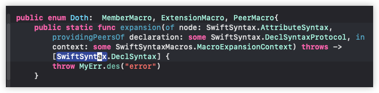
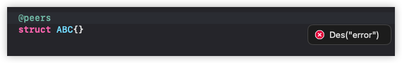

---


可以使用Diagstic类型向用户提示更详细的信息
1. 文件名
2. 行号
3. 函数
4. 建议修复等

笔者给出一个简单的事例

```swift
@attached(member, names: arbitrary)
public macro bitSet(_ option: String...) = #externalMacro(module: "LBMacroMacros", type: "Doth") 


struct Msg: DiagnosticMessage{
    var message: String

    /// See ``MessageID``.
    var diagnosticID: MessageID

    var severity: DiagnosticSeverity
}

struct Fixed: FixItMessage{
    var message: String
    var fixItID: SwiftDiagnostics.MessageID
}


public static func expansion(
    of node: AttributeSyntax,
    providingMembersOf declaration: some DeclGroupSyntax,
    in context: some MacroExpansionContext)
throws -> [DeclSyntax] {
    // 只能修饰枚举
    let decl = declaration.as(EnumDeclSyntax.self)
    if decl == nil {
        // 从上下文中获取文件, 行号, 列号

       //
        //  这里笔者一旦发现不是枚举时, 直接修改为新的声明结点
        //      BCD是为了方便测试写的固定的, 实际开发中要获取
        let dia = Diagnostic(
            node: node,
            message: Msg(message: msg.isEmpty ? "" : ("<" + msg.joined(separator: ":") + ">" + "只能修饰枚举"),
                            diagnosticID: .init(domain: "LBMacro", id: "bitSet"),
                            severity: .error),
            fixIt: .replace(message: Fixed(message: "替换为Enum", fixItID: .init(domain: "LBMacro", id: "bitSet")),
                                oldNode: declaration,
                                newNode: DeclSyntax("@bitSet enum BCD{}")))
        context.diagnose(dia)
        return []
    }


    ....
}

public static func expansion(
    of node: AttributeSyntax,
    providingMembersOf declaration: some DeclGroupSyntax,
    in context: some MacroExpansionContext)
throws -> [DeclSyntax] {
    let decl = declaration.as(EnumDeclSyntax.self)
    if decl == nil {
        let loctaion = context.location(of: node)
        var src_info = [String]()
        if var name = loctaion?.file.description.components(separatedBy: "/").last {
            name.replace("\"", with: "")
            src_info.append(name)
        }
        if let file_line = loctaion?.line.description {
            src_info.append(file_line)
        }

        if let file_cloumn = loctaion?.column.description{
            src_info.append(file_cloumn)
        }


        // 创建描述信息context.diagnose方法
        //  参数1: 当前宏结点
        //  参数2: 错误的描述信息
        //  参数3: 有3种方式:
        //      1. 不提供, 因为有默认值
        //      2. 提供 fixIt: 实现FixedMessage的对象, 表示单个修复
        //      3. 提供 fixIts: FixedMessage数组
 
        // 错误的提示信息 <文件名:行号:列号>只能修饰枚举
        let msg = Msg(message: src_info.isEmpty ? "" : ("<" + src_info.joined(separator: ":") + ">" + "只能修饰枚举"),
                    diagnosticID: .init(domain: "LBMacro", id: "bitSet"),
                        severity: .error)


        // 因为要取出当前声明元素的名字, 可能取出来的是空, 所以这里
        //  只列举struct和class,
        //  取出名称后配置修复的信息: @bitSet enum 名称 {},
        //  没有名称时, 就没有fixIt参数

        var fix: FixIt?
        var decl_name = ""

        if let struct_name = declaration.as(StructDeclSyntax.self)?.name.text{
            decl_name = struct_name
        }else if let class_name = declaration.as(ClassDeclSyntax.self)?.name.text{
            decl_name = class_name
        }

        if !decl_name.isEmpty {
            fix = FixIt.replace(message: Fixed(message: "替换为Enum",
                                                fixItID: .init(domain: "LBMacro", id: "bitSet")),
                                oldNode: declaration,
                                newNode: DeclSyntax("@bitSet enum \(raw:decl_name) {}"))

        }

    
        fix == nil ?
        context.diagnose(.init(node: node, message: msg)) :
        context.diagnose(.init(node: node, message: msg, fixIt: fix!))

        return []
    }


    ...
}
```


---

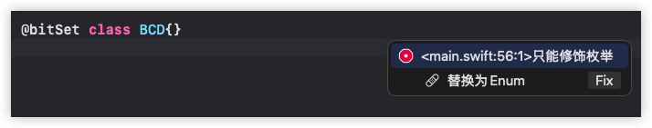

---


[^ann-result-builder]: 后面笔者以DSL来简称这个概念
[^ann-dsl]: 特定领域语言, 一般是片段式嵌入的. 这里不理解这个概念没有关系
[^ann-uikit]: 苹果iOS使用的UI框架, 基于OC语法实现的 
[^ann-mem-const]: 常量区是C程序内存布局中的一个部分, 它由操作分布, 像进程中的环境变量也位于这个区域, 该区域中的数据是只读的, 进程不能修改
[^ann-info-raw]: 字符串的原始信息在打印控制台时会出现转义, 如换行符会在控制直接换行
[^ann-info-literal]: 字符串的字面信息是将原始信息中的转义字符进行包装. 如打印控制台时会出现`\n`的输出, 并不会换行
[^ann-aop]: AOP在编程领域是切面编程, 所谓的切面实际是切入的意义. 函数整体上的执行是从上往下依次执行, 这个由编译器在编译期就决定的(<font color = red>语言中的条件循环语句在逻辑上也是顺序的</font>). 一般编译好的可执行程序是无法在运行过程中修改整体的执行顺序, 但语言在动态性方面若提供了接口, 则在编译期的某些条件成立下, 通过该接口向某个函数嵌入片段代码. OC的runtime可以在运行过程中改变函数的调用行为, 如可以在调用函数前后执行一段嵌入代码, 甚至直接替换原有的实现. 像经典的C, c++在语言层面没有提供动态反射的特性, 所以也就不存在AOP, 并且以目前的swift来说, 也是一样的, swift抛弃的动态特性, 是为了更高效和安全. 
[^ann-other-name]: enum, struct, protocol, extension
[^ann-functions]: 函数, 方法, 下标, 计算属性


</font>
